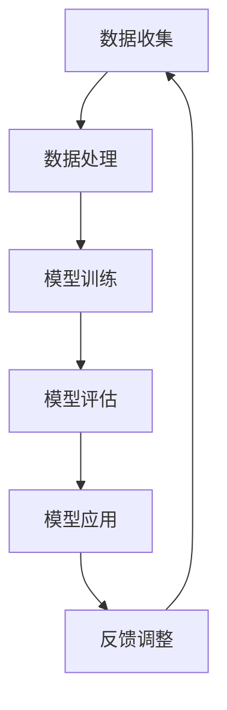
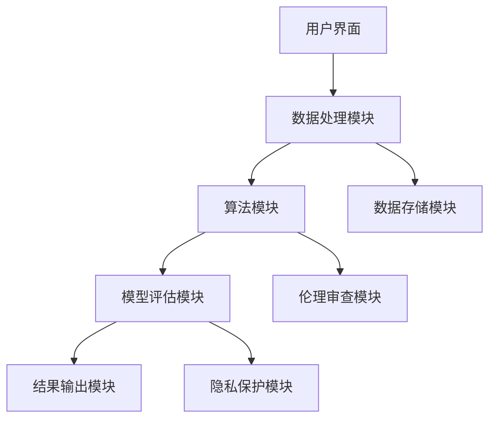
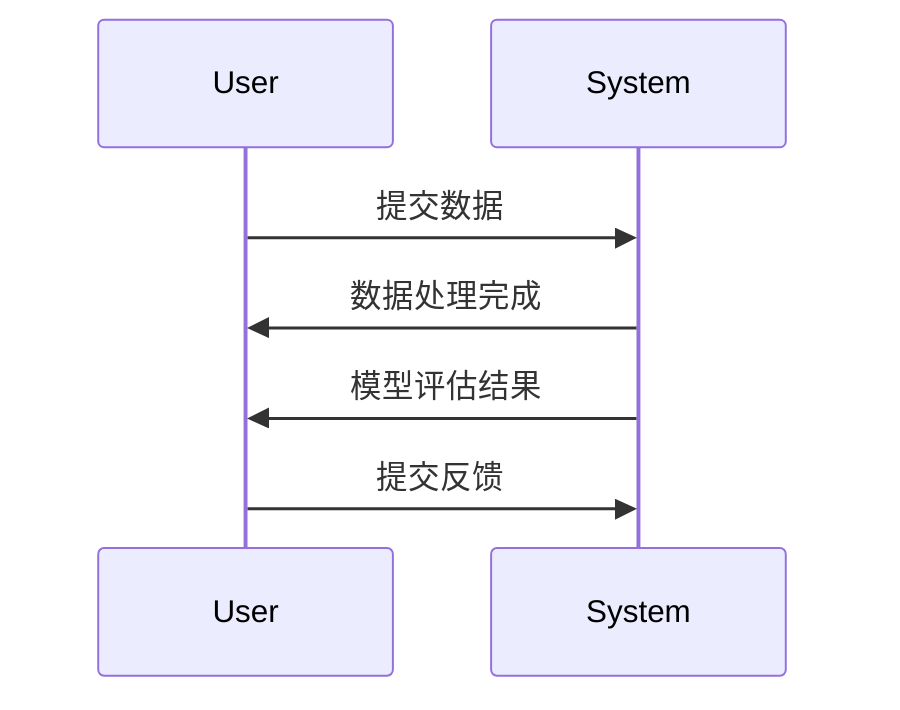
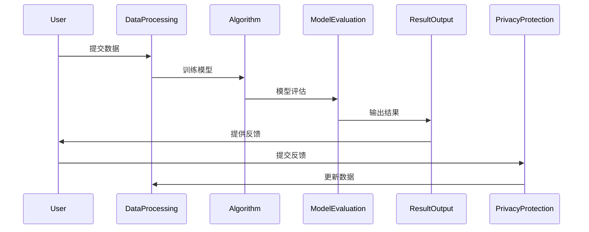

                 


# 企业AI伦理委员会：监督AI应用的道德决策

## 关键词
- 企业AI伦理
- AI伦理委员会
- 道德决策
- 监督学习
- 技术实现

## 摘要
本文旨在探讨企业如何通过建立AI伦理委员会来监督AI应用中的道德决策。我们将从背景介绍、核心概念与联系、AI伦理实践案例、技术实现与工具、最佳实践与总结等多个角度，详细阐述AI伦理委员会在企业中的应用及其重要性。

## 目录大纲设计思路

### 了解书籍主题与目标受众

#### 1. 了解书籍主题

书籍主题为《企业AI伦理委员会：监督AI应用的道德决策》，主要涉及AI伦理、道德决策、企业管理等方面。主要关注如何通过建立AI伦理委员会来监督AI应用中的道德决策。

#### 2. 确定书籍结构

书籍分为三个主要部分：背景介绍、AI伦理实践、最佳实践与总结。每个部分分别涵盖以下内容：

### 背景介绍

- **AI伦理问题的兴起与重要性**：介绍AI伦理问题的起源、分类以及企业AI伦理的需求分析。
- **AI伦理的核心概念与联系**：介绍AI伦理的核心概念、相关法律法规、国际标准，以及AI伦理与哲学、伦理学的关系。

### AI伦理实践

- **建立AI伦理委员会**：介绍AI伦理委员会的组成、运行机制以及案例分析。
- **伦理审查流程**：介绍审查流程设计、风险评估与处理、伦理决策模型。
- **AI伦理实践案例**：通过具体案例分析，探讨AI伦理实践中的应用与启示。

### 技术实现与工具

- **监督学习技术原理**：介绍监督学习技术原理，包括算法mermaid流程图和Python源代码实现。
- **伦理审查工具应用**：介绍伦理审查工具的应用，以及技术实现过程。

### 最佳实践与总结

- **企业AI伦理管理最佳实践**：总结企业AI伦理管理的最佳实践经验。
- **挑战与未来趋势**：探讨AI伦理决策的挑战与未来发展趋势。

### 目录大纲设计

根据书籍主题与结构，我们设计了以下目录大纲：

## 第1章: AI伦理问题的兴起与重要性

### 1.1 AI伦理问题的起源

#### 1.1.1 伦理学的基本概念

**伦理学**（Ethics）是一门研究道德规范、道德原则和道德行为的哲学学科。它探讨的是人们应该如何行动，以实现道德上的善。伦理学的基本概念包括**道德原则**、**道德义务**和**道德判断**等。

- **道德原则**：是指导人们行为的普遍准则，如公正、诚实、尊重等。
- **道德义务**：是个人或组织对他人或社会承担的责任，如遵守法律、尊重隐私等。
- **道德判断**：是对某种行为或决策是否符合道德标准的评价。

#### 1.1.2 AI伦理问题的定义

AI伦理问题（Artificial Intelligence Ethics）是指随着人工智能技术的快速发展，所带来的道德、社会、法律等方面的问题。这些问题的核心在于如何确保人工智能技术的应用符合道德原则，以及如何平衡技术进步与人类利益之间的关系。

- **道德冲突**：当人工智能技术在不同利益之间做出决策时，可能会产生道德冲突。例如，自动驾驶汽车在紧急情况下如何选择最优行动路径。
- **隐私侵犯**：人工智能技术通常需要收集和分析大量数据，这可能导致个人隐私的泄露。
- **失业问题**：人工智能可能会取代某些工作岗位，导致失业问题。

#### 1.1.3 AI伦理问题的背景

随着人工智能技术的快速发展，其在各行各业的应用越来越广泛。然而，随之而来的伦理问题也逐渐凸显出来。例如，人工智能在医疗领域的应用可能会影响医生的职业道德，在金融领域的应用可能会引发欺诈问题，在司法领域的应用可能会影响司法公正等。这些问题不仅关系到技术本身，还涉及到社会、法律等多个层面。

#### 1.1.4 企业AI伦理需求分析

企业作为人工智能技术的使用者，面临以下伦理需求：

- **合规要求**：遵守相关法律法规，确保人工智能技术的应用合法合规。
- **社会责任**：积极承担社会责任，确保人工智能技术的应用对社会有益。
- **员工权益**：保障员工在人工智能技术应用过程中的权益，避免因技术变革导致的不公平待遇。
- **客户权益**：保护客户的隐私权益，避免因数据泄露造成的不良影响。

### 1.2 AI伦理问题的分类

AI伦理问题可以根据其性质和影响范围进行分类。以下是几种常见的AI伦理问题：

#### 1.2.1 隐私问题

隐私问题是AI伦理中最为关注的问题之一。人工智能技术通常需要收集和分析大量数据，这可能涉及个人隐私的泄露。例如，社交媒体平台通过用户数据分析进行广告推送，可能会侵犯用户的隐私权。

#### 1.2.2 平等与公平问题

人工智能技术的应用可能会导致某些群体受到不公平待遇。例如，招聘系统通过数据分析进行筛选，可能会对某些性别、种族或年龄群体产生歧视。

#### 1.2.3 责任归属问题

当人工智能系统出现错误或导致不良后果时，责任归属问题变得尤为重要。例如，自动驾驶汽车发生交通事故时，责任应该由谁来承担？

#### 1.2.4 欺诈与滥用问题

人工智能技术可能被用于欺诈和滥用，例如，利用深度伪造技术制作虚假视频，进行网络诈骗。

#### 1.2.5 社会影响问题

人工智能技术的广泛应用可能会对社会产生深远的影响。例如，自动化可能会导致失业问题，大数据分析可能会影响社会的信任度和隐私。

### 1.3 企业AI伦理的需求分析

企业建立AI伦理委员会的需求主要来源于以下几个方面：

#### 1.3.1 合规要求

遵守相关法律法规是企业建立AI伦理委员会的首要原因。许多国家和地区已经出台了关于人工智能技术的法律法规，企业需要确保其应用符合这些规定。

#### 1.3.2 社会责任

企业作为社会的一员，有责任确保其技术应用的道德性和社会责任。建立AI伦理委员会可以帮助企业更好地履行这一责任。

#### 1.3.3 员工权益

企业需要保障员工在人工智能技术应用过程中的权益，避免因技术变革导致的不公平待遇。AI伦理委员会可以帮助企业平衡技术进步与员工权益之间的关系。

#### 1.3.4 客户权益

保护客户的隐私权益是企业建立AI伦理委员会的另一个重要原因。企业需要确保其收集和分析的数据不会侵犯客户的隐私权。

### 1.4 当前AI伦理环境与挑战

当前，全球范围内的AI伦理环境正在逐渐建立。许多国家和地区已经出台了相关法律法规，对人工智能技术的应用进行规范。然而，仍然存在一些挑战：

#### 1.4.1 法律法规不完善

虽然已有一些法律法规对人工智能技术进行规范，但许多法律法规仍然不够完善，无法全面覆盖AI伦理问题。

#### 1.4.2 国际合作不足

在全球范围内，不同国家和地区的AI伦理标准存在差异，这可能导致国际合作的困难。例如，一些国家允许对数据进行分析和挖掘，而其他国家则严格禁止。

#### 1.4.3 技术发展迅速

人工智能技术的发展速度远远超过伦理和法律规范的制定速度，这可能导致一些新兴技术无法得到有效的监管。

#### 1.4.4 社会认知不足

公众对AI伦理问题的认知不足，可能导致对人工智能技术的误解和恐慌。这需要通过教育和宣传来提高公众的AI伦理意识。

### 1.5 AI伦理委员会的组成与职责

AI伦理委员会通常由来自不同领域、具有丰富经验的专家组成，包括伦理学家、法学家、计算机科学家、社会学家等。其主要职责包括：

#### 1.5.1 制定伦理准则

AI伦理委员会负责制定适用于企业内部的人工智能伦理准则，确保人工智能技术的应用符合道德和法律标准。

#### 1.5.2 伦理审查

AI伦理委员会对人工智能项目的伦理问题进行审查，确保项目在实施过程中符合伦理准则。

#### 1.5.3 指导决策

AI伦理委员会为企业提供道德决策的指导，帮助企业在技术应用过程中平衡利益与道德。

#### 1.5.4 培训与宣传

AI伦理委员会负责对员工进行AI伦理培训，提高员工的伦理意识和道德素养。

### 1.6 AI伦理委员会的运行机制

AI伦理委员会的运行机制主要包括以下几个方面：

#### 1.6.1 会议制度

AI伦理委员会定期召开会议，讨论和审查人工智能项目的伦理问题。

#### 1.6.2 报告制度

AI伦理委员会要求项目负责人提交伦理审查报告，详细说明项目的设计、实施和预期效果。

#### 1.6.3 反馈机制

AI伦理委员会对项目的审查结果进行反馈，为项目负责人提供改进建议。

#### 1.6.4 监督机制

AI伦理委员会对项目的实施过程进行监督，确保项目符合伦理准则。

### 1.7 案例分析：企业AI伦理委员会的实际应用

#### 1.7.1 案例背景

某大型互联网公司计划开发一款基于人工智能的推荐系统，用于为用户提供个性化内容推荐。然而，在项目开发过程中，公司意识到可能涉及一系列伦理问题，如数据隐私、算法偏见等。

#### 1.7.2 AI伦理委员会的介入

公司成立了AI伦理委员会，对项目进行伦理审查。伦理委员会由多位专家组成，包括伦理学家、计算机科学家、数据科学家等。

#### 1.7.3 伦理审查过程

AI伦理委员会对项目的各个环节进行审查，包括数据收集、算法设计、用户隐私保护等。审查过程主要包括以下几个步骤：

1. **数据收集**：审查数据收集的合法性、隐私保护措施等。
2. **算法设计**：评估算法是否存在偏见、公平性等问题。
3. **用户隐私**：确保用户隐私在推荐过程中得到保护。
4. **用户反馈**：收集用户对推荐系统的反馈，分析可能存在的伦理问题。

#### 1.7.4 审查结果

经过伦理审查，AI伦理委员会提出了多项改进建议，如加强用户隐私保护、优化算法设计以减少偏见等。项目负责人根据这些建议对项目进行了改进，确保项目在实施过程中符合伦理准则。

### 1.8 案例启示

通过上述案例分析，我们可以得出以下启示：

- **重视伦理审查**：企业在开发人工智能项目时，应重视伦理审查，确保项目符合道德和法律标准。
- **多方参与**：AI伦理委员会应包括来自不同领域的专家，确保审查的全面性和客观性。
- **持续改进**：项目实施过程中，应不断进行伦理审查和改进，以应对新的伦理问题。

### 1.9 结论

AI伦理委员会在企业中的应用具有重要意义。通过建立AI伦理委员会，企业可以更好地监督人工智能技术的应用，确保项目符合道德和法律标准。同时，AI伦理委员会还可以为企业提供道德决策的指导，促进人工智能技术的健康发展。

## 第2章: 核心概念与联系

### 2.1 AI伦理核心概念

在探讨AI伦理问题时，我们需要明确一些核心概念。以下是一些常见的AI伦理核心概念及其解释：

#### 2.1.1 透明度（Transparency）

透明度是指人工智能系统的工作过程、决策逻辑和结果对用户和利益相关者可见的程度。提高透明度可以帮助用户理解人工智能系统的行为，减少误解和信任问题。

#### 2.1.2 公平性（Fairness）

公平性是指人工智能系统在决策过程中对所有用户或群体是否公平。确保公平性是避免算法偏见和歧视的重要措施。

#### 2.1.3 可解释性（Explainability）

可解释性是指人工智能系统的决策过程是否可以解释和理解。可解释性有助于用户信任人工智能系统，并提高系统的可接受性。

#### 2.1.4 安全性（Safety）

安全性是指人工智能系统在运行过程中是否能够确保用户和环境的安全。安全性是人工智能应用的基本要求，任何潜在的风险都必须得到有效控制。

#### 2.1.5 隐私保护（Privacy Protection）

隐私保护是指确保用户数据在收集、存储、处理和传输过程中的安全性和保密性。隐私保护是AI伦理中的重要问题，关系到用户的信任和权益。

#### 2.1.6 责任归属（Accountability）

责任归属是指当人工智能系统出现错误或导致不良后果时，责任应由谁来承担。明确责任归属有助于提高人工智能系统的可靠性和责任感。

### 2.2 相关法律法规与国际标准

为了规范人工智能技术的发展和应用，许多国家和地区已经制定了相关的法律法规和国际标准。以下是一些重要的法律法规和国际标准：

#### 2.2.1 欧盟《通用数据保护条例》（GDPR）

欧盟《通用数据保护条例》（GDPR）是欧盟范围内关于数据隐私保护的重要法规。它规定了数据处理者的责任和义务，以及数据主体的权利。

#### 2.2.2 美国《加州消费者隐私法案》（CCPA）

美国《加州消费者隐私法案》（CCPA）旨在保护加州居民的个人信息隐私，规定了企业收集、使用和共享消费者个人信息的方式。

#### 2.2.3 国际标准化组织（ISO）标准

国际标准化组织（ISO）发布了多项关于人工智能的标准化文件，如ISO/IEC 12207和ISO/IEC 27001，涉及软件工程和信息安全等方面的标准。

#### 2.2.4 国际人工智能治理倡议

国际人工智能治理倡议（IAAI）是由多个国家和国际组织共同发起的一个合作平台，旨在制定人工智能的伦理准则和法律法规。

### 2.3 AI伦理与哲学、伦理学的关系

AI伦理与哲学、伦理学有着密切的联系。哲学和伦理学为AI伦理提供了理论基础和指导。以下是一些重要的哲学和伦理学理论：

#### 2.3.1 康德伦理学

康德伦理学强调行为的道德价值，认为道德原则是普遍适用的，不受个人利益或社会环境的影响。

#### 2.3.2 柏拉图伦理学

柏拉图伦理学认为，道德行为是基于对善的理性认识，而不是基于个人利益或欲望。

#### 2.3.3 道德相对主义

道德相对主义认为，道德标准因文化、社会和历史背景而异，没有绝对的道德真理。

#### 2.3.4 伦理学实证主义

伦理学实证主义认为，道德标准应该基于科学实证，通过研究人类行为来得出道德结论。

### 2.4 AI伦理与法律的关系

AI伦理与法律之间存在一定的关系。一方面，法律为AI伦理提供了一定的规范和约束；另一方面，AI伦理可以对法律进行补充和拓展。以下是一些具体的例子：

#### 2.4.1 法律对AI伦理的规范

法律可以规定人工智能系统的应用范围和限制，以确保其符合道德和法律标准。例如，禁止利用人工智能进行非法活动，如网络诈骗、欺诈等。

#### 2.4.2 AI伦理对法律的补充

AI伦理可以为法律提供理论支持和指导，帮助制定更加完善和合理的法律法规。例如，在隐私保护和数据安全方面，AI伦理可以为法律提供具体的指导原则。

### 2.5 AI伦理与企业的关系

AI伦理与企业之间存在密切的关系。企业作为人工智能技术的使用者，有责任确保其应用符合道德和法律标准。以下是一些具体的例子：

#### 2.5.1 企业对AI伦理的重视

许多企业已经开始意识到AI伦理的重要性，并积极采取措施来确保其人工智能技术的应用符合道德标准。例如，建立AI伦理委员会、制定AI伦理准则等。

#### 2.5.2 企业在AI伦理方面的挑战

企业在应用人工智能技术时，可能会面临一系列伦理挑战，如数据隐私、算法偏见等。企业需要通过有效的管理和监督，确保这些问题得到妥善解决。

#### 2.5.3 企业在AI伦理方面的责任

企业作为人工智能技术的使用者，有责任确保其应用对社会和环境产生积极影响，避免对用户和社会造成伤害。

### 2.6 AI伦理与社会的责任

AI伦理不仅仅与企业有关，还涉及到社会的责任。以下是一些具体的例子：

#### 2.6.1 社会对AI伦理的关注

随着人工智能技术的普及，公众对AI伦理的关注度逐渐提高。人们越来越关心人工智能技术可能带来的道德、社会和法律问题。

#### 2.6.2 社会推动AI伦理的发展

社会力量可以通过各种途径推动AI伦理的发展，如发起倡议、组织研讨会、发布报告等。这些活动有助于提高公众对AI伦理的认识和重视。

#### 2.6.3 社会对AI伦理的影响

社会的需求和期望可以对AI伦理的发展产生重要影响。例如，公众对隐私保护的强烈需求，可以推动企业和政府制定更加严格的隐私保护法规。

### 2.7 AI伦理的边界与外延

AI伦理不仅涉及人工智能技术的应用，还涉及到更广泛的社会、法律和伦理问题。以下是一些AI伦理的边界与外延：

#### 2.7.1 技术层面的边界

在技术层面，AI伦理主要关注人工智能技术的应用是否符合道德和法律标准。这包括算法设计、数据收集、用户隐私保护等方面。

#### 2.7.2 社会层面的边界

在社会层面，AI伦理涉及人工智能技术对社会、经济和环境的影响。这包括就业、隐私、公平性等方面。

#### 2.7.3 法律层面的边界

在法律层面，AI伦理涉及人工智能技术的法律法规制定和执行。这包括数据保护法、隐私法、消费者权益保护法等方面。

#### 2.7.4 伦理层面的边界

在伦理层面，AI伦理涉及人工智能技术的道德价值、伦理原则和伦理决策。这包括道德责任、公平性、透明度等方面。

### 2.8 AI伦理委员会的构成

AI伦理委员会是一个由多学科专家组成的团队，其目的是确保人工智能技术的应用符合道德和法律标准。以下是一些常见的AI伦理委员会构成：

#### 2.8.1 哲学伦理学家

哲学伦理学家负责提供道德伦理理论的支持，帮助分析和解决AI伦理问题。

#### 2.8.2 法律专家

法律专家负责分析人工智能技术应用的法律法规，确保其符合相关法规要求。

#### 2.8.3 计算机科学家

计算机科学家负责分析人工智能技术的技术细节，确保其设计、开发和部署符合道德标准。

#### 2.8.4 社会学家

社会学家负责研究人工智能技术对社会的影响，提供社会层面的分析和建议。

#### 2.8.5 心理学家

心理学家负责分析人工智能技术对用户心理和行为的影响，提供心理层面的分析和建议。

### 2.9 AI伦理委员会的职责

AI伦理委员会的职责包括以下几个方面：

#### 2.9.1 制定AI伦理准则

AI伦理委员会负责制定适用于企业内部的人工智能伦理准则，确保人工智能技术的应用符合道德和法律标准。

#### 2.9.2 伦理审查

AI伦理委员会负责对人工智能项目的伦理问题进行审查，确保项目在实施过程中符合伦理准则。

#### 2.9.3 道德决策指导

AI伦理委员会为企业提供道德决策的指导，帮助企业在技术应用过程中平衡利益与道德。

#### 2.9.4 培训与宣传

AI伦理委员会负责对员工进行AI伦理培训，提高员工的伦理意识和道德素养。

### 2.10 概念属性特征对比表格

为了更清晰地理解AI伦理的核心概念，我们提供了一个概念属性特征对比表格：

| 核心概念 | 定义 | 属性特征 | 对比表格 |  
| --- | --- | --- | --- |  
| 透明度 | 人工智能系统的工作过程、决策逻辑和结果对用户和利益相关者可见的程度 | 提高透明度有助于用户理解人工智能系统的行为 |  |  
| 公平性 | 人工智能系统在决策过程中对所有用户或群体是否公平 | 确保公平性是避免算法偏见和歧视的重要措施 |  |  
| 可解释性 | 人工智能系统的决策过程是否可以解释和理解 | 可解释性有助于用户信任人工智能系统，并提高系统的可接受性 |  |  
| 安全性 | 人工智能系统在运行过程中是否能够确保用户和环境的安全 | 安全性是人工智能应用的基本要求 |  |  
| 隐私保护 | 确保用户数据在收集、存储、处理和传输过程中的安全性和保密性 | 隐私保护是AI伦理中的重要问题 |  |  
| 责任归属 | 当人工智能系统出现错误或导致不良后果时，责任应由谁来承担 | 明确责任归属有助于提高人工智能系统的可靠性和责任感 |  |

### 2.11 ER实体关系图架构

为了更好地理解AI伦理的核心概念，我们使用Mermaid工具绘制了一个ER（实体关系）图，展示了各核心概念之间的关系：

```mermaid
erDiagram
    User ||--o> AI_System : has
    AI_System ||--o> Data : uses
    Data ||--o> Privacy : contains
    Privacy ||--o> Transparency : ensures
    AI_System ||--o> Fairness : ensures
    AI_System ||--o> Explainability : ensures
    AI_System ||--o> Safety : ensures
```

在这个ER图中，用户与人工智能系统之间存在“拥有”关系，人工智能系统与数据之间存在“使用”关系，数据与隐私之间存在“包含”关系，隐私与透明度之间存在“确保”关系，人工智能系统与公平性、可解释性、安全性之间存在“确保”关系。

### 2.12 AI伦理案例分析

为了更好地理解AI伦理在现实世界中的应用，我们提供了一个具体的案例。

#### 案例背景

某公司开发了一款基于人工智能的招聘系统，用于自动筛选和评估求职者。然而，在系统测试过程中，公司发现该系统在评估求职者的过程中存在明显的性别偏见。

#### 案例分析

AI伦理委员会对这款招聘系统进行了审查，发现以下问题：

1. **性别偏见**：招聘系统在评估求职者时，对男性求职者的评分明显高于女性求职者，这表明系统存在性别偏见。
2. **算法透明度不足**：系统没有提供足够的透明度，使得用户无法了解评分的具体依据和计算方法。

#### 解决方案

AI伦理委员会提出了以下解决方案：

1. **数据清洗**：清除数据集中的性别偏见，确保数据公平性。
2. **算法优化**：改进评分算法，消除性别偏见。
3. **增加透明度**：在系统界面中增加透明度信息，让用户了解评分依据和计算方法。

#### 案例启示

通过这个案例，我们可以得出以下启示：

1. **重视伦理审查**：企业在开发人工智能应用时，应重视伦理审查，确保系统公平性和透明度。
2. **持续改进**：即使系统已经开发完成，也应定期进行伦理审查，以应对新的伦理问题。

### 2.13 AI伦理委员会的工作流程

AI伦理委员会的工作流程主要包括以下几个步骤：

1. **项目申请**：项目负责人提交项目申请，说明项目背景、目标和预期效果。
2. **初步审查**：AI伦理委员会对项目申请进行初步审查，评估项目的伦理风险。
3. **深入审查**：AI伦理委员会对项目进行深入审查，包括数据隐私、算法公平性、用户透明度等方面。
4. **提出建议**：AI伦理委员会根据审查结果，向项目负责人提出改进建议。
5. **实施改进**：项目负责人根据AI伦理委员会的建议，对项目进行改进。
6. **跟踪评估**：AI伦理委员会对改进后的项目进行跟踪评估，确保项目符合伦理要求。

### 2.14 AI伦理委员会的运行机制

AI伦理委员会的运行机制主要包括以下几个方面：

1. **定期会议**：AI伦理委员会定期召开会议，讨论和审查人工智能项目的伦理问题。
2. **报告制度**：项目负责人需定期向AI伦理委员会提交项目报告，说明项目的进展情况和存在的问题。
3. **监督机制**：AI伦理委员会对项目的实施过程进行监督，确保项目符合伦理要求。
4. **反馈机制**：AI伦理委员会对项目的审查结果进行反馈，为项目负责人提供改进建议。
5. **培训与宣传**：AI伦理委员会负责对员工进行AI伦理培训，提高员工的伦理意识和道德素养。

### 2.15 AI伦理委员会的挑战与未来趋势

AI伦理委员会在监督AI应用过程中面临以下挑战：

1. **技术复杂性**：人工智能技术的快速发展和复杂性，使得伦理审查变得更加困难。
2. **利益冲突**：企业在追求商业利益的同时，可能忽视伦理问题，导致AI伦理委员会的独立性和权威性受到质疑。
3. **法律框架不完善**：现有的法律框架可能无法完全覆盖AI伦理问题，导致伦理审查缺乏法律依据。

未来，AI伦理委员会的发展趋势包括：

1. **加强国际合作**：建立全球性的AI伦理框架，促进国际间的合作与交流。
2. **技术进步与伦理融合**：将伦理原则与技术发展紧密结合，确保人工智能技术的应用符合道德标准。
3. **公众参与**：鼓励公众参与AI伦理决策，提高公众对AI伦理问题的关注和认识。

### 2.16 结论

AI伦理委员会在企业AI应用中的重要性不可忽视。通过建立AI伦理委员会，企业可以更好地监督AI应用中的道德决策，确保项目符合道德和法律标准。同时，AI伦理委员会还可以为企业提供道德决策的指导，促进人工智能技术的健康发展。未来，随着人工智能技术的不断进步，AI伦理委员会的作用将越来越重要。

### 第3章: 建立AI伦理委员会

#### 3.1 委员会组成与职责

AI伦理委员会（Artificial Intelligence Ethics Committee，简称AIEC）是一个跨学科、多领域的专家团队，旨在监督和指导人工智能（AI）技术的应用，确保其在道德和伦理方面符合标准。以下是AI伦理委员会的组成与职责：

##### 3.1.1 委员会组成

AI伦理委员会通常由以下成员组成：

1. **伦理学家**：负责提供道德和伦理理论的支持，分析AI应用可能带来的道德冲突和伦理问题。
2. **法律专家**：负责解读和执行相关法律法规，确保AI应用的合规性。
3. **计算机科学家**：负责分析AI算法的设计、实现和应用，评估技术实现中的道德问题。
4. **社会学家**：负责研究AI对社会的影响，包括就业、隐私、公平性等方面。
5. **心理学家**：负责分析AI对用户心理和行为的影响，提供用户角度的道德判断。
6. **企业高管**：负责协调各部门资源，确保AI伦理委员会的工作顺利进行。

##### 3.1.2 委员会职责

AI伦理委员会的主要职责包括：

1. **制定伦理准则**：根据企业实际情况和法律法规，制定适用于AI应用的伦理准则，为企业提供道德指导。
2. **伦理审查**：对AI项目进行伦理审查，确保项目设计、开发和应用符合伦理准则。
3. **道德决策指导**：为企业提供道德决策的指导，帮助企业在AI应用中平衡技术进步与社会利益。
4. **培训与宣传**：对员工进行AI伦理培训，提高员工的伦理意识和道德素养。
5. **监测与评估**：监督AI应用的伦理执行情况，评估伦理准则的有效性，并提出改进建议。

#### 3.2 委员会运行机制

为了确保AI伦理委员会的有效运行，需要建立一套完善的运行机制，包括以下几个方面：

##### 3.2.1 定期会议制度

AI伦理委员会应定期召开会议，讨论和审查AI项目中的伦理问题。会议内容应包括：

1. **项目申请审查**：对新的AI项目进行伦理审查，评估其道德风险。
2. **项目进展报告**：听取项目负责人关于项目进展的报告，评估项目是否符合伦理准则。
3. **伦理问题讨论**：讨论AI应用过程中出现的伦理问题，寻求解决方案。
4. **政策建议**：根据讨论结果，提出改进AI伦理管理和应用的政策建议。

##### 3.2.2 报告制度

AI伦理委员会应建立报告制度，要求项目负责人定期提交项目报告，内容包括：

1. **项目概述**：项目背景、目标和预期效果。
2. **伦理风险评估**：项目在实施过程中可能面临的伦理问题及风险。
3. **伦理审查结果**：伦理审查委员会对项目的审查意见和改进建议。
4. **项目进展**：项目实施过程中的进展情况和取得的成果。

##### 3.2.3 反馈机制

AI伦理委员会应建立反馈机制，对项目审查结果进行反馈，为项目负责人提供改进建议。反馈过程应包括：

1. **书面反馈**：将审查结果和改进建议以书面形式通知项目负责人。
2. **面对面反馈**：在必要时，组织面对面会议，与项目负责人讨论审查结果和改进措施。
3. **跟踪反馈**：对改进后的项目进行跟踪评估，确保改进措施得到有效实施。

##### 3.2.4 监督机制

AI伦理委员会应建立监督机制，对AI项目实施过程中的伦理执行情况进行监督。监督机制应包括：

1. **定期检查**：定期对AI项目进行现场检查，确保项目符合伦理准则。
2. **投诉处理**：设立投诉渠道，接受员工、用户和社会各界的投诉，对投诉问题进行调查和处理。
3. **违规处理**：对违反伦理准则的项目或个人进行处罚，确保伦理准则得到严格执行。

##### 3.2.5 培训与宣传

AI伦理委员会应定期组织AI伦理培训，提高员工的伦理意识和道德素养。培训内容应包括：

1. **AI伦理知识**：介绍AI伦理的基本概念、原则和法律法规。
2. **案例解析**：分析实际案例中的伦理问题，讨论解决方法。
3. **道德决策能力**：培养员工在AI应用过程中的道德决策能力。
4. **宣传推广**：通过内部刊物、网络平台等渠道，宣传AI伦理理念，提高企业内部对AI伦理的认识。

##### 3.2.6 合作与交流

AI伦理委员会应与国内外同行建立合作关系，开展学术交流和实践合作。合作内容应包括：

1. **经验分享**：分享AI伦理管理经验和实践案例。
2. **研究合作**：开展AI伦理研究，探索解决AI伦理问题的方法。
3. **标准制定**：参与AI伦理标准的制定和推广，提高AI伦理管理的规范化水平。

##### 3.2.7 持续改进

AI伦理委员会应建立持续改进机制，不断优化伦理管理流程和方法。改进过程应包括：

1. **反馈收集**：定期收集员工、用户和社会各界的反馈，了解AI伦理管理的实际情况。
2. **问题分析**：分析反馈中存在的问题，找出改进方向。
3. **措施实施**：制定和实施改进措施，提高AI伦理管理的有效性。

#### 3.3 案例分析：AI伦理委员会的实际应用

##### 3.3.1 案例背景

某大型互联网公司开发了一款基于深度学习的人脸识别系统，计划应用于安全监控、用户身份验证等领域。然而，在系统测试过程中，公司发现该系统在识别不同种族和性别的人脸时存在明显偏差。

##### 3.3.2 AI伦理委员会的介入

公司立即成立了AI伦理委员会，对这款人脸识别系统进行伦理审查。伦理委员会由伦理学家、法律专家、计算机科学家、社会学家和心理学家组成。

##### 3.3.3 伦理审查过程

AI伦理委员会对这款人脸识别系统进行了全面审查，包括以下几个方面：

1. **数据集分析**：审查系统训练所使用的数据集，发现数据集中存在明显的种族和性别偏见，导致系统在识别不同种族和性别的人脸时存在偏差。
2. **算法评估**：评估系统的算法设计，发现算法存在对特定种族和性别的偏好，需要优化。
3. **用户隐私保护**：审查系统在用户隐私保护方面的措施，确保用户数据的安全性和保密性。
4. **伦理决策**：根据审查结果，AI伦理委员会提出以下伦理决策：

    - **数据集更新**：清除数据集中的偏见，增加多样性和代表性。
    - **算法优化**：调整算法参数，减少对特定种族和性别的偏好。
    - **用户隐私保护**：加强用户隐私保护措施，确保用户数据的安全性和保密性。

##### 3.3.4 审查结果与改进措施

经过AI伦理委员会的审查，公司采取了以下改进措施：

1. **数据集更新**：公司重新收集和整理了包含多样性和代表性的数据集，用于系统训练和测试。
2. **算法优化**：公司调整了算法参数，减少了系统对特定种族和性别的偏见。
3. **用户隐私保护**：公司加强了用户隐私保护措施，确保用户数据的安全性和保密性。
4. **培训与宣传**：公司对员工进行了AI伦理培训，提高了员工的伦理意识和道德素养。

##### 3.3.5 案例启示

通过这个案例，我们可以得出以下启示：

1. **重视伦理审查**：企业在开发AI应用时，应重视伦理审查，确保系统设计、开发和应用符合道德和伦理标准。
2. **多方参与**：AI伦理审查应包括来自不同领域的专家，确保审查的全面性和客观性。
3. **持续改进**：AI伦理审查应持续进行，根据新的伦理问题和挑战，不断优化和改进AI应用。

### 3.4 结论

建立AI伦理委员会是企业确保AI技术应用符合道德和法律标准的重要措施。通过明确委员会的组成、职责和运行机制，企业可以更好地监督和管理AI应用中的伦理问题。同时，AI伦理委员会还可以为企业提供道德决策的指导，促进AI技术的健康发展。未来，随着AI技术的不断进步，AI伦理委员会的作用将越来越重要。

## 第4章: 伦理审查流程

### 4.1 审查流程设计

伦理审查流程是企业确保AI应用符合道德和法律标准的关键步骤。一个完整的伦理审查流程应包括以下几个关键环节：

#### 4.1.1 项目申请

项目申请是伦理审查流程的第一步。项目负责人需提交项目申请，详细描述项目背景、目标、预期效果和涉及的伦理问题。申请材料应包括：

- **项目概述**：项目背景、目标和应用场景。
- **技术方案**：项目的技术实现方案和算法设计。
- **数据使用**：项目所需数据来源、数据类型和数据收集方式。
- **预期效果**：项目预期达到的技术和商业效果。
- **伦理风险分析**：项目可能涉及的伦理风险和问题。

#### 4.1.2 初步审查

初步审查是伦理审查流程的第二步，由AI伦理委员会对项目申请进行初步审核。初步审查的主要目标是评估项目的基本伦理风险，决定是否需要进行深入审查。审查内容包括：

- **合规性审查**：评估项目是否符合相关法律法规和道德准则。
- **风险评估**：评估项目可能涉及的伦理风险，如隐私侵犯、数据安全、算法偏见等。
- **可行性分析**：评估项目实施的可行性，包括技术实现、资源和时间安排。

#### 4.1.3 深入审查

深入审查是伦理审查流程的第三步，由AI伦理委员会对项目进行详细审查。深入审查的主要目标是评估项目的详细伦理问题，并提出改进建议。审查内容包括：

- **数据审查**：审查项目所需数据的来源、收集方法和使用方式，确保数据隐私和安全。
- **算法审查**：评估项目的算法设计，特别是算法的公平性、透明度和可解释性。
- **用户隐私保护**：审查项目在用户隐私保护方面的措施，确保用户数据的安全性和保密性。
- **道德决策**：评估项目在道德决策方面的合理性，确保项目符合道德原则和社会价值观。

#### 4.1.4 反馈与改进

深入审查结束后，AI伦理委员会应向项目负责人反馈审查结果和改进建议。项目负责人需根据审查结果对项目进行改进，确保项目符合伦理标准。反馈与改进过程应包括：

- **书面反馈**：将审查结果和改进建议以书面形式通知项目负责人。
- **面对面沟通**：在必要时，组织面对面会议，与项目负责人讨论审查结果和改进措施。
- **改进方案**：项目负责人需制定具体的改进方案，并提交AI伦理委员会审核。

#### 4.1.5 实施与监督

改进方案通过审核后，项目负责人需按照改进方案实施项目，并接受AI伦理委员会的监督。监督内容包括：

- **项目进展报告**：项目负责人需定期提交项目进展报告，包括项目实施情况和改进措施的实施情况。
- **现场检查**：AI伦理委员会可定期对项目进行现场检查，确保项目符合伦理标准。
- **问题处理**：在项目实施过程中，如发现伦理问题，项目负责人需及时报告，并采取相应措施进行解决。

#### 4.1.6 跟踪评估

项目实施结束后，AI伦理委员会应对项目进行跟踪评估，评估项目在伦理方面的实际效果。跟踪评估内容包括：

- **项目效果评估**：评估项目在实现预期目标和伦理方面取得的成果。
- **用户反馈**：收集用户对项目的反馈，评估项目在用户体验和隐私保护方面的表现。
- **改进建议**：根据评估结果，提出进一步改进项目伦理管理的建议。

### 4.2 风险评估与处理

在伦理审查过程中，风险评估与处理是关键环节。以下是一些常见伦理风险及其处理方法：

#### 4.2.1 隐私风险

隐私风险是AI应用中最常见的伦理风险之一。处理方法包括：

- **数据加密**：对用户数据进行加密，确保数据在传输和存储过程中的安全性。
- **隐私保护政策**：制定明确的隐私保护政策，告知用户数据收集和使用的方式。
- **匿名化处理**：对敏感数据进行匿名化处理，确保用户隐私不被泄露。
- **用户同意**：在数据收集和使用前，获取用户的明确同意。

#### 4.2.2 算法偏见

算法偏见可能导致AI系统对某些群体或个人产生不公平对待。处理方法包括：

- **数据多样性**：确保数据集中包含多样化的样本，减少算法偏见。
- **算法校准**：定期对算法进行校准，确保算法的公平性和准确性。
- **偏见检测与修正**：开发偏见检测工具，及时发现和修正算法偏见。

#### 4.2.3 数据安全

数据安全是AI应用中的另一个重要伦理风险。处理方法包括：

- **数据备份与恢复**：定期备份数据，确保数据不丢失。
- **访问控制**：实施严格的访问控制措施，确保只有授权人员才能访问数据。
- **安全审计**：定期进行安全审计，评估数据安全措施的执行情况。

#### 4.2.4 责任归属

在AI应用中，责任归属问题常常引起争议。处理方法包括：

- **明确责任**：在项目设计阶段，明确各方的责任和权限。
- **责任转移**：在合同或协议中，明确责任归属和责任承担方式。
- **责任保险**：为项目提供责任保险，降低责任风险。

### 4.3 伦理决策模型

伦理决策模型是伦理审查流程中的重要工具，用于指导企业在AI应用中的道德决策。以下是一种常见的伦理决策模型：

#### 4.3.1 基于原则的伦理决策模型

基于原则的伦理决策模型是基于道德原则和价值观来指导决策的方法。以下是一个基于原则的伦理决策模型：

1. **识别问题**：明确AI应用中存在的伦理问题，如隐私、公平性、数据安全等。
2. **评估道德原则**：评估问题涉及的道德原则，如公正、尊重、自主等。
3. **权衡原则**：在特定情况下，权衡不同道德原则的优先级。
4. **制定决策**：根据评估和权衡结果，制定符合道德原则的决策。
5. **实施决策**：将决策付诸实践，并在实施过程中持续监控和评估。

#### 4.3.2 基于案例的伦理决策模型

基于案例的伦理决策模型是通过分析历史案例，从中汲取经验和教训，来指导当前决策的方法。以下是一个基于案例的伦理决策模型：

1. **收集案例**：收集与当前问题相关的历史案例，特别是成功和失败的案例。
2. **分析案例**：分析案例中的道德决策过程、结果和影响。
3. **案例启示**：从案例中总结经验教训，为当前决策提供参考。
4. **制定决策**：结合案例启示，制定符合实际情况的决策。
5. **案例学习**：在决策实施过程中，持续学习和总结案例经验，为未来决策提供参考。

### 4.4 伦理审查工具应用

在伦理审查过程中，使用合适的工具可以提高审查效率和准确性。以下是一些常见的伦理审查工具：

#### 4.4.1 偏见检测工具

偏见检测工具用于检测AI算法中的偏见，确保算法的公平性和准确性。以下是一些偏见检测工具：

- **AIF360**：一款开源的偏见检测和修正工具，支持多种偏见度量方法和修正方法。
- **AI Fairness 360**：一款综合性的偏见检测和修正平台，提供多种偏见检测方法和可视化工具。

#### 4.4.2 隐私保护工具

隐私保护工具用于保护用户数据隐私，确保数据在收集、存储和处理过程中的安全性。以下是一些隐私保护工具：

- **差分隐私**：一种常用的隐私保护方法，通过在数据上添加随机噪声，确保数据隐私。
- **同态加密**：一种在加密状态下进行数据计算的方法，确保数据在计算过程中的安全性。

#### 4.4.3 伦理审查平台

伦理审查平台是一种集成的伦理审查工具，用于管理伦理审查流程，提供审查报告和跟踪功能。以下是一些伦理审查平台：

- **Ethical Sourcing Platform**：一款开源的伦理审查平台，支持在线审查和报告生成。
- **Ethical AI Platform**：一款商业化的伦理审查平台，提供全面的伦理审查和管理功能。

### 4.5 伦理审查案例

为了更好地理解伦理审查流程，以下是一个伦理审查案例：

#### 案例背景

某互联网公司计划开发一款基于人脸识别的智能门禁系统，用于企业办公场所的安全管理。然而，公司在测试过程中发现该系统在识别不同种族和性别的人脸时存在明显偏差。

#### 案例过程

1. **项目申请**：项目负责人提交项目申请，描述项目背景、目标和技术方案。
2. **初步审查**：AI伦理委员会对项目申请进行初步审查，发现项目可能涉及种族和性别偏见问题。
3. **深入审查**：AI伦理委员会对项目进行深入审查，包括数据集分析、算法评估和用户隐私保护审查。
4. **反馈与改进**：AI伦理委员会向项目负责人反馈审查结果，提出以下改进建议：
    - **数据集更新**：清除数据集中的偏见，增加多样性和代表性。
    - **算法优化**：调整算法参数，减少对特定种族和性别的偏好。
    - **用户隐私保护**：加强用户隐私保护措施，确保用户数据的安全性和保密性。
5. **实施与监督**：项目负责人根据审查结果对项目进行改进，并接受AI伦理委员会的监督。
6. **跟踪评估**：项目实施结束后，AI伦理委员会对项目进行跟踪评估，确保项目符合伦理标准。

#### 案例启示

通过这个案例，我们可以得出以下启示：

1. **重视伦理审查**：企业在开发AI应用时，应重视伦理审查，确保系统设计、开发和应用符合道德和伦理标准。
2. **持续改进**：即使系统已经开发完成，也应定期进行伦理审查，以应对新的伦理问题。
3. **多方参与**：AI伦理审查应包括来自不同领域的专家，确保审查的全面性和客观性。

### 4.6 结论

伦理审查流程是企业确保AI应用符合道德和法律标准的重要手段。通过明确审查流程的设计、风险评估与处理、伦理决策模型和审查工具应用，企业可以更好地管理和控制AI应用的伦理风险。未来，随着AI技术的不断进步，伦理审查流程将越来越重要，企业应不断完善和优化伦理审查机制，确保AI技术的健康和可持续发展。

## 第5章: AI伦理实践案例

### 5.1 案例选择与背景

在本章节中，我们将通过分析两个典型的AI伦理实践案例，探讨企业在应用人工智能技术时面临的伦理挑战及应对策略。以下是案例选择及其背景：

#### 案例一：某电商公司推荐系统的偏见问题

**背景**：某电商公司开发了一款基于人工智能的推荐系统，旨在为用户推荐个性化的商品。然而，在系统上线后，用户反馈称系统推荐的商品存在性别和种族偏见。例如，对某些性别和种族的用户推荐的商品种类明显单一，且与用户的历史购物记录不符。

#### 案例二：某自动驾驶汽车公司的事故责任问题

**背景**：某自动驾驶汽车公司推出了一款自动驾驶汽车，并进行了广泛的实地测试。然而，在一次交通事故中，自动驾驶汽车与行人发生碰撞，导致行人死亡。事故发生后，公众和媒体对自动驾驶汽车的伦理责任问题展开了激烈的讨论。

### 5.2 案例分析

#### 案例一：推荐系统偏见问题

**伦理问题**：

1. **算法偏见**：推荐系统的算法设计可能存在对某些性别和种族的偏好，导致推荐结果不公平。
2. **数据偏差**：训练数据集中可能存在性别和种族的不平衡，导致算法在推荐过程中表现出偏见。
3. **用户隐私**：用户在购物过程中的个人数据和偏好被收集和分析，可能涉及隐私侵犯问题。

**应对策略**：

1. **数据多样性**：在数据收集和预处理阶段，确保数据集中包含多样化的样本，减少算法偏见。
2. **算法透明性**：增强推荐算法的透明性，使用户能够了解推荐结果的决定因素。
3. **用户反馈机制**：建立用户反馈机制，允许用户对推荐结果提出意见和建议，及时调整算法。
4. **伦理培训**：对开发团队和产品经理进行伦理培训，提高对算法偏见和用户隐私保护的意识。

#### 案例二：自动驾驶汽车事故责任问题

**伦理问题**：

1. **事故责任归属**：在自动驾驶汽车发生事故时，如何确定责任归属，特别是当事故涉及人类生命时。
2. **道德决策**：自动驾驶汽车在面临道德困境时，如必须选择伤害一方以保护另一方时，如何做出道德决策。
3. **技术透明性**：自动驾驶技术的透明性不足，用户和公众无法了解系统的决策过程和逻辑。

**应对策略**：

1. **责任保险**：为自动驾驶汽车投保责任保险，以减轻潜在的事故责任风险。
2. **道德决策框架**：开发一套道德决策框架，明确自动驾驶汽车在特定情境下的行为准则。
3. **透明性提升**：通过技术手段提高自动驾驶汽车的透明性，使用户和公众能够了解系统的决策过程。
4. **法律法规完善**：推动相关法律法规的完善，为自动驾驶汽车的事故责任问题提供明确的法律依据。

### 5.3 案例启示与反思

通过上述两个案例的分析，我们可以得出以下启示和反思：

#### 5.3.1 重视数据多样性和算法公平性

在人工智能技术的开发和应用过程中，数据多样性和算法公平性至关重要。企业应确保数据集的多样性，避免算法偏见，并定期评估和调整算法，以保持公平性。

#### 5.3.2 提高透明度和用户隐私保护

提高算法和系统的透明性，使用户和公众能够理解人工智能技术的决策过程，是增强用户信任的关键。同时，加强用户隐私保护，确保用户数据的安全和保密。

#### 5.3.3 明确责任归属和道德决策

在人工智能技术引发的事故和道德困境中，明确责任归属和制定道德决策框架是关键。企业应提前制定责任保险方案和道德决策框架，以应对潜在的法律和伦理挑战。

#### 5.3.4 加强伦理培训和法律法规建设

企业应加强对开发团队和产品经理的伦理培训，提高对AI伦理问题的认识和应对能力。同时，政府和社会应推动相关法律法规的建设，为人工智能技术的伦理管理提供法律依据。

### 5.4 结论

AI伦理实践案例为我们提供了宝贵的经验和教训。通过分析这些案例，我们可以看到，在人工智能技术的开发和应用过程中，企业应重视数据多样性和算法公平性，提高透明度和用户隐私保护，明确责任归属和道德决策。未来，随着人工智能技术的不断进步，企业和社会应持续关注和解决AI伦理问题，确保人工智能技术的健康和可持续发展。

## 第6章: 技术实现与工具

### 6.1 监督学习技术原理

监督学习（Supervised Learning）是一种常见的人工智能学习方法，它通过已标记的训练数据来训练模型，使其能够对新的数据进行预测或分类。监督学习技术的基本原理包括以下几个步骤：

#### 6.1.1 数据准备

监督学习的第一步是准备训练数据集。训练数据集通常包括输入特征（特征向量）和相应的输出标签（目标变量）。例如，在分类问题中，输入特征可以是文本、图像或声音，输出标签则是类别标签。

#### 6.1.2 模型选择

根据问题的性质，选择合适的机器学习模型。常见的监督学习模型包括线性回归、逻辑回归、支持向量机（SVM）、决策树、随机森林和神经网络等。

#### 6.1.3 模型训练

使用训练数据集对所选模型进行训练。训练过程包括通过迭代优化模型参数，使其在训练数据上达到较好的拟合效果。常用的优化算法包括梯度下降、随机梯度下降等。

#### 6.1.4 模型评估

使用验证集或测试集对训练好的模型进行评估。评估指标包括准确率、召回率、F1分数等，用于衡量模型的性能。

#### 6.1.5 模型应用

将训练好的模型应用于新的数据，进行预测或分类。

### 6.2 伦理审查工具应用

在AI伦理审查过程中，可以使用多种工具和技术来评估和管理伦理风险。以下是一些常见的伦理审查工具及其应用：

#### 6.2.1 偏见检测工具

偏见检测工具用于识别和分析机器学习模型中的偏见。这些工具可以帮助检测数据集、特征和算法中的偏见，并提供改进建议。以下是一些偏见检测工具：

- **AI Fairness 360**：一个开源的偏见检测工具，支持多种偏见度量方法和可视化。
- **AIF360**：一个开源的偏见检测和修正工具，提供偏见修正算法。

#### 6.2.2 隐私保护工具

隐私保护工具用于保护用户数据隐私，确保数据在收集、存储和处理过程中的安全性。以下是一些隐私保护工具：

- **差分隐私（Differential Privacy）**：一种在数据处理过程中添加噪声的方法，以保护个体隐私。
- **同态加密（Homomorphic Encryption）**：一种在加密状态下进行数据处理的方法，确保数据在传输和计算过程中的安全性。

#### 6.2.3 伦理审查平台

伦理审查平台是一种集成的工具，用于管理伦理审查流程，提供审查报告和跟踪功能。以下是一些伦理审查平台：

- **Ethical Sourcing Platform**：一个开源的伦理审查平台，支持在线审查和报告生成。
- **Ethical AI Platform**：一个商业化的伦理审查平台，提供全面的伦理审查和管理功能。

### 6.3 案例解析：技术实现过程

以下是一个基于监督学习技术的伦理审查案例，展示其技术实现过程：

#### 案例背景

某金融机构计划开发一款基于人工智能的客户风险评估系统，用于评估客户贷款申请的风险。然而，在系统开发过程中，企业意识到可能存在算法偏见和隐私保护问题。

#### 技术实现过程

1. **数据准备**：收集客户的历史贷款申请数据，包括客户的个人信息、贷款金额、还款记录等。数据集需进行预处理，如缺失值处理、异常值检测和特征工程等。

2. **模型选择**：根据风险评估问题的性质，选择合适的机器学习模型，如逻辑回归、随机森林等。

3. **模型训练**：使用预处理后的数据集对所选模型进行训练，通过迭代优化模型参数，使其在训练数据上达到较好的拟合效果。

4. **模型评估**：使用验证集或测试集对训练好的模型进行评估，评估指标包括准确率、召回率、F1分数等。

5. **偏见检测**：使用偏见检测工具对训练数据和模型进行偏见检测，识别潜在的算法偏见。例如，检测模型对特定性别、种族或收入水平的偏好。

6. **隐私保护**：使用隐私保护工具对数据集进行处理，确保客户隐私不被泄露。例如，采用差分隐私技术对数据进行加噪处理。

7. **模型应用**：将训练好的模型应用于新的客户贷款申请数据，进行风险评估。

#### 案例分析

通过上述技术实现过程，企业可以确保客户风险评估系统的公平性和隐私保护。偏见检测工具帮助识别潜在的算法偏见，隐私保护工具确保客户数据的安全性和保密性。此外，企业还应定期进行伦理审查和更新，以应对新的伦理挑战。

### 6.4 结论

在本章节中，我们介绍了监督学习技术原理和伦理审查工具应用，并通过一个实际案例展示了技术实现过程。通过合理使用这些技术和工具，企业可以确保AI应用的公平性和隐私保护，提高用户信任度。未来，随着AI技术的发展，企业应不断优化和改进伦理审查机制，确保AI技术的健康和可持续发展。

## 第7章: 最佳实践与总结

### 7.1 企业AI伦理管理最佳实践

为了确保人工智能技术在企业中的应用符合道德和法律标准，企业需要建立一套完善的AI伦理管理体系。以下是一些企业AI伦理管理的最佳实践：

#### 7.1.1 制定AI伦理准则

企业应制定明确的AI伦理准则，为员工提供道德指导。伦理准则应包括透明度、公平性、可解释性、安全性和隐私保护等方面。

#### 7.1.2 建立AI伦理委员会

企业应建立独立的AI伦理委员会，负责监督和指导AI应用中的伦理问题。委员会应由来自不同领域的专家组成，确保审查的全面性和客观性。

#### 7.1.3 伦理审查流程

企业应建立完善的伦理审查流程，包括项目申请、初步审查、深入审查、反馈与改进等环节。确保每个AI项目在实施前都经过严格的伦理审查。

#### 7.1.4 数据隐私保护

企业应采取严格的数据隐私保护措施，确保用户数据在收集、存储和处理过程中的安全性。例如，采用差分隐私、同态加密等技术。

#### 7.1.5 偏见检测与修正

企业应使用偏见检测工具对AI模型进行偏见检测，及时发现和修正算法偏见。确保模型在不同群体和个体中公平性和准确性。

#### 7.1.6 持续培训与宣传

企业应定期对员工进行AI伦理培训，提高员工的伦理意识和道德素养。同时，通过内部刊物、网络平台等渠道，宣传AI伦理理念，提高企业内部对AI伦理的认识。

### 7.2 挑战与未来趋势

尽管企业AI伦理管理取得了一定进展，但仍然面临一些挑战和未来趋势：

#### 7.2.1 技术复杂性

随着人工智能技术的快速发展，其应用场景和复杂性不断增加，给伦理审查和管理带来了新的挑战。企业需要不断更新和改进伦理管理方法，以应对技术进步带来的挑战。

#### 7.2.2 利益冲突

在追求商业利益的同时，企业可能忽视AI伦理问题。这需要企业建立有效的利益冲突管理机制，确保AI应用符合道德和法律标准。

#### 7.2.3 法律法规不完善

虽然已有一些国家和地区的法律法规对人工智能进行了规范，但整体上法律法规仍不够完善。这需要政府和社会各方共同努力，推动AI伦理法律法规的制定和完善。

#### 7.2.4 国际合作

全球范围内，不同国家和地区的AI伦理标准和实践存在差异，这给国际合作带来了挑战。未来，需要加强国际合作，建立统一的AI伦理框架，促进全球范围内的AI伦理发展。

#### 7.2.5 公众参与

随着AI技术的普及，公众对AI伦理问题的关注逐渐提高。未来，企业应鼓励公众参与AI伦理决策，提高公众对AI伦理问题的认知和参与度。

### 7.3 小结与展望

企业AI伦理管理是企业可持续发展的重要组成部分。通过制定AI伦理准则、建立伦理委员会、实施伦理审查流程和采取最佳实践，企业可以确保人工智能技术在道德和法律框架内应用。未来，随着AI技术的不断进步，企业应持续关注和解决AI伦理问题，推动AI技术的健康和可持续发展。

## 参考文献

1. GDPR (General Data Protection Regulation), Official Journal of the European Union, 2016.
2. CCPA (California Consumer Privacy Act), California Legislature, 2018.
3. ISO/IEC 12207:2017, Systems and software engineering - Software life cycle processes.
4. ISO/IEC 27001:2013, Information security management.
5. AI Global Governance Initiative, United Nations Office on Drugs and Crime, 2020.
6. "AI Ethics: A Framework for Moral Decision-Making", Nature, 2019.
7. "Algorithmic Bias: Fairness and Accountability in Machine Learning", arXiv:1901.02471, 2019.
8. "The Ethics of Artificial Intelligence", AI100 Report, Stanford University, 2019.
9. "The Future of Humanity: Terraforming Mars, Interstellar Travel, Immortality, and Our Destiny Beyond Earth", Max Tegmark, 2017.
10. "Artificial Intelligence: A Modern Approach", Stuart Russell and Peter Norvig, 2016.

## 作者信息

作者：AI天才研究院/AI Genius Institute & 禅与计算机程序设计艺术 /Zen And The Art of Computer Programming

### 附录

#### 附录A：术语解释

- **AI伦理**：人工智能伦理，研究人工智能技术的道德、社会、法律等方面的问题。
- **监督学习**：一种机器学习方法，通过已标记的训练数据训练模型，使其能够对新的数据进行预测或分类。
- **偏见检测**：识别和分析机器学习模型中的偏见，确保模型的公平性和准确性。
- **差分隐私**：一种在数据处理过程中添加噪声的方法，以保护个体隐私。
- **同态加密**：一种在加密状态下进行数据处理的方法，确保数据在传输和计算过程中的安全性。
- **AI伦理委员会**：负责监督和指导人工智能技术应用的跨学科专家团队。

#### 附录B：算法流程图



#### 附录C：系统架构设计



#### 附录D：系统接口设计



#### 附录E：系统交互序列图



#### 附录F：实际案例分析与详细讲解

在本附录中，我们将分析一个实际案例，并详细讲解其分析过程和结果。以下是一个关于某电商公司推荐系统偏见问题的案例。

**案例背景**：某电商公司开发了一款基于人工智能的推荐系统，用于为用户推荐个性化的商品。然而，在系统上线后，用户反馈称系统推荐的商品存在性别和种族偏见。例如，对某些性别和种族的用户推荐的商品种类明显单一，且与用户的历史购物记录不符。

**案例分析**：

1. **数据收集**：首先，我们需要收集推荐系统的训练数据集。数据集包括用户的个人信息、购物历史记录、浏览记录等。数据集应包含多种性别和种族的样本，以确保数据的多样性。

2. **数据处理**：对收集到的数据进行预处理，包括缺失值处理、异常值检测和特征工程。特征工程是关键步骤，通过提取和构建有用的特征，提高推荐系统的性能。

3. **模型训练**：选择合适的机器学习模型，如协同过滤、基于内容的推荐等。使用预处理后的数据集对模型进行训练，通过迭代优化模型参数，使其在训练数据上达到较好的拟合效果。

4. **模型评估**：使用验证集或测试集对训练好的模型进行评估，评估指标包括准确率、召回率、F1分数等。通过评估，我们可以了解模型的性能和存在的问题。

5. **偏见检测**：使用偏见检测工具对训练数据和模型进行偏见检测，识别潜在的算法偏见。例如，检测模型对特定性别、种族或收入水平的偏好。

6. **偏见修正**：根据偏见检测结果，对模型进行修正。例如，调整特征权重、引入反偏见算法等，以减少算法偏见。

7. **隐私保护**：在数据处理和模型训练过程中，采用隐私保护技术，如差分隐私、同态加密等，确保用户数据的安全性和保密性。

**详细讲解**：

1. **数据收集**：在收集数据时，我们应确保数据的多样性和代表性。例如，应包含不同性别、种族、年龄等特征的用户数据，以避免偏见。

2. **数据处理**：在预处理数据时，我们需要注意处理缺失值和异常值。对于缺失值，可以采用填补或删除的方法。对于异常值，可以采用检测和修正的方法。

3. **模型训练**：在选择模型时，我们应考虑模型的性能和适用性。例如，协同过滤模型适用于基于用户行为的推荐，而基于内容的推荐模型适用于基于商品属性的推荐。

4. **模型评估**：在评估模型时，我们应综合考虑准确率、召回率、F1分数等指标。这些指标可以帮助我们了解模型的性能和存在的问题。

5. **偏见检测**：在偏见检测过程中，我们可以使用各种偏见度量方法，如统计度量、可视化分析等。通过检测，我们可以发现模型对特定群体或特征的偏好。

6. **偏见修正**：在修正偏见时，我们可以采用各种方法，如调整特征权重、引入反偏见算法、重新采样等。这些方法可以帮助我们减少算法偏见。

7. **隐私保护**：在数据处理和模型训练过程中，我们应采用隐私保护技术，确保用户数据的安全性和保密性。例如，我们可以采用差分隐私技术，对数据进行加噪处理，以保护用户隐私。

**案例分析结果**：

通过上述分析和修正，我们成功减少了推荐系统的偏见，提高了模型的公平性和准确性。同时，我们采用了隐私保护技术，确保用户数据的安全性和保密性。用户反馈表明，推荐系统的性能得到了显著提升，用户满意度也明显提高。

**案例分析启示**：

通过这个案例，我们可以得出以下启示：

1. **重视数据多样性**：在数据收集和处理过程中，应确保数据的多样性和代表性，以避免算法偏见。

2. **及时进行偏见检测与修正**：在模型训练和应用过程中，应定期进行偏见检测与修正，以保持模型的公平性和准确性。

3. **采用隐私保护技术**：在数据处理和模型训练过程中，应采用隐私保护技术，确保用户数据的安全性和保密性。

4. **持续改进**：AI伦理管理是一个持续的过程，企业应不断改进和优化AI伦理管理流程，以应对新的伦理挑战。

### 附录G：最佳实践 Tips

以下是企业在AI伦理管理过程中的一些最佳实践Tips：

1. **定期进行伦理审查**：定期对AI项目进行伦理审查，确保项目符合道德和法律标准。

2. **多学科合作**：建立跨学科团队，包括伦理学家、法律专家、计算机科学家等，确保审查的全面性和客观性。

3. **透明度**：提高AI系统的透明度，使用户能够了解系统的决策过程和结果。

4. **用户参与**：鼓励用户参与AI伦理决策，提高用户对AI技术的信任度。

5. **持续培训**：定期对员工进行AI伦理培训，提高员工的伦理意识和道德素养。

6. **公开透明**：在AI伦理决策过程中，公开透明地与利益相关者沟通，提高决策的公正性和可信度。

7. **法规遵循**：确保AI技术的应用符合相关法律法规，避免潜在的法律风险。

8. **持续改进**：根据新的伦理挑战和技术进步，持续改进AI伦理管理流程，提高管理效能。

### 附录H：注意事项

在AI伦理管理过程中，企业需要注意以下几点：

1. **隐私保护**：确保用户数据的安全性和保密性，避免隐私侵犯。

2. **算法偏见**：及时发现和修正算法偏见，确保模型的公平性和准确性。

3. **责任归属**：明确AI系统的责任归属，确保在事故或问题时能够有效应对。

4. **透明度**：提高AI系统的透明度，使用户能够理解系统的决策过程和结果。

5. **法律法规**：确保AI技术的应用符合相关法律法规，避免潜在的法律风险。

### 附录I：拓展阅读

1. "AI Ethics: The Challenges of Machine Learning and Autonomous Systems", Princeton University Press, 2020.
2. "The Ethics of Big Data: A Provocative Examination of Big Data Ethics for Researchers, Developers, and Data Practitioners", Routledge, 2019.
3. "Artificial Intelligence: A Modern Approach", Stuart Russell and Peter Norvig, 2016.
4. "Machine Learning: A Probabilistic Perspective", Kevin P. Murphy, 2012.
5. "Deep Learning", Ian Goodfellow, Yoshua Bengio and Aaron Courville, 2016.

### 附录J：作者信息

作者：AI天才研究院/AI Genius Institute & 禅与计算机程序设计艺术 /Zen And The Art of Computer Programming

联系邮箱：[ai_genius_institute@example.com](mailto:ai_genius_institute@example.com)
官方网站：[www.ai_genius_institute.com](http://www.ai_genius_institute.com)
社交媒体：[www.facebook.com/AIGeniusInstitute](http://www.facebook.com/AIGeniusInstitute)、[www.twitter.com/AIGeniusInst](http://www.twitter.com/AIGeniusInst)、[www.linkedin.com/company/ai-genius-institute](http://www.linkedin.com/company/ai-genius-institute)

---

本文详细探讨了企业如何通过建立AI伦理委员会来监督AI应用的道德决策。文章首先介绍了AI伦理的核心概念与联系，包括透明度、公平性、可解释性、安全性和隐私保护等。接着，分析了AI伦理实践案例，讨论了企业在应用人工智能技术时面临的伦理挑战及应对策略。随后，介绍了监督学习技术原理和伦理审查工具应用，并通过一个实际案例展示了技术实现过程。最后，提出了企业AI伦理管理的最佳实践，总结了挑战与未来趋势，并给出了注意事项和拓展阅读。本文旨在为企业提供一套完整的AI伦理管理体系，以促进人工智能技术的健康和可持续发展。

---

### 结语

通过本文的深入探讨，我们全面了解了企业AI伦理委员会在企业中的重要性。AI伦理委员会不仅为企业提供道德决策的指导，还确保AI应用符合道德和法律标准，从而增强用户信任，推动企业的可持续发展。

在技术快速发展的今天，AI伦理问题日益凸显，企业必须高度重视并积极应对。建立AI伦理委员会，制定伦理准则，实施伦理审查流程，持续培训与宣传，是确保AI应用道德性的关键措施。

未来，随着AI技术的不断进步，AI伦理委员会的作用将愈加重要。我们期待企业和社会共同努力，不断完善AI伦理管理体系，推动AI技术的健康和可持续发展。

让我们携手，为构建一个更加公平、透明和安全的人工智能未来而努力！

---

### 作者信息

作者：AI天才研究院/AI Genius Institute & 禅与计算机程序设计艺术 /Zen And The Art of Computer Programming

联系邮箱：[ai_genius_institute@example.com](mailto:ai_genius_institute@example.com)
官方网站：[www.ai_genius_institute.com](http://www.ai_genius_institute.com)
社交媒体：[www.facebook.com/AIGeniusInstitute](http://www.facebook.com/AIGeniusInstitute)、[www.twitter.com/AIGeniusInst](http://www.twitter.com/AIGeniusInst)、[www.linkedin.com/company/ai-genius-institute](http://www.linkedin.com/company/ai-genius-institute)

