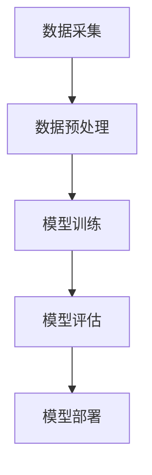

                 

# 企业实施AI治理的最佳实践

## 关键词

- **AI治理**
- **企业应用**
- **数据安全**
- **算法透明性**
- **伦理治理**
- **最佳实践**

## 摘要

随着人工智能技术的广泛应用，企业面临着如何有效实施AI治理的挑战。本文从背景介绍、核心概念与联系、算法原理讲解、系统分析与架构设计方案、项目实战以及最佳实践等方面，系统地阐述了企业实施AI治理的最佳实践。本文旨在为企业提供一套全面的AI治理框架，以降低风险，提高AI项目成功率。

---

## 第一部分：背景介绍

### 第1章：问题背景与概述

#### 1.1 问题背景

人工智能（AI）技术的快速发展为企业带来了巨大的机遇。通过AI，企业可以自动化决策过程、提高生产效率、优化客户体验等。然而，AI技术的引入和应用并非一帆风顺。企业面临诸多挑战，包括数据安全、算法透明性、隐私保护等。这些挑战使得AI治理成为企业实施AI项目的关键环节。

#### 1.2 问题描述

AI治理涉及多个方面，包括数据治理、算法治理、伦理治理等。企业需要建立一套完善的AI治理体系，以确保AI技术的合理、合规、有效应用。然而，如何实施AI治理，缺乏实践经验和最佳实践指导。

#### 1.3 问题解决

本文旨在为企业提供实施AI治理的最佳实践指导，帮助企业在AI技术引入和应用过程中，建立有效的AI治理体系，降低风险，提高AI项目成功率。

#### 1.4 边界与外延

本文讨论的AI治理主要涉及以下几个方面：

1. 数据治理：包括数据质量管理、数据安全、数据隐私等。
2. 算法治理：包括算法开发、算法评估、算法透明性等。
3. 伦理治理：包括伦理原则、伦理决策、伦理审查等。

#### 1.5 概念结构与核心要素组成

AI治理的核心要素包括：

1. **组织结构**：明确各部门职责，确保AI项目顺利进行。
2. **政策与流程**：建立完善的AI治理政策和流程，确保AI项目合规、透明。
3. **技术工具**：采用先进的技术工具，提高AI项目效率和质量。
4. **人才培育**：加强人才队伍建设，提高员工AI技术水平和治理能力。

---

### 第2章：核心概念与联系

#### 2.1 AI治理的定义与特点

##### 2.1.1 AI治理的定义

AI治理是指通过制定政策、建立流程、使用技术手段等，对企业内部AI项目的管理和控制，确保AI技术合理、合规、有效应用。

##### 2.1.2 AI治理的特点

1. **全生命周期管理**：覆盖AI项目从开发到应用的全过程。
2. **综合性**：涉及数据治理、算法治理、伦理治理等多个方面。
3. **制度性**：通过建立制度和流程，确保AI治理落地实施。

#### 2.2 数据治理

##### 2.2.1 数据治理的定义

数据治理是指通过制定数据政策和流程，确保数据质量、安全、合规等方面的管理。

##### 2.2.2 数据治理的核心概念

1. **数据质量管理**：包括数据准确性、完整性、一致性等方面的管理。
2. **数据安全**：包括数据加密、访问控制、备份与恢复等方面的管理。
3. **数据隐私**：包括数据收集、存储、处理、传输等方面的隐私保护。

#### 2.3 算法治理

##### 2.3.1 算法治理的定义

算法治理是指对AI算法的开发、评估、应用等方面进行管理和控制，确保算法的公平性、透明性和可靠性。

##### 2.3.2 算法治理的核心概念

1. **算法开发**：包括算法设计、算法优化、算法测试等方面的管理。
2. **算法评估**：包括算法性能评估、算法公正性评估等方面的管理。
3. **算法透明性**：包括算法可解释性、算法透明性报告等方面的管理。

#### 2.4 伦理治理

##### 2.4.1 伦理治理的定义

伦理治理是指通过制定伦理原则、建立伦理决策机制、进行伦理审查等，确保AI项目符合伦理要求。

##### 2.4.2 伦理治理的核心概念

1. **伦理原则**：包括公平性、透明性、隐私保护、社会责任等方面的原则。
2. **伦理决策**：包括伦理风险评估、伦理决策制定等方面的管理。
3. **伦理审查**：包括伦理审查委员会、伦理审查流程等方面的管理。

---

## 第二部分：算法原理讲解

### 第3章：算法原理讲解

#### 3.1 算法原理概述

##### 3.1.1 算法原理的定义

算法原理是指实现特定任务的基本方法和步骤。

##### 3.1.2 算法原理的特点

1. **普遍性**：适用于各种AI应用场景。
2. **可理解性**：易于被普通用户理解和接受。
3. **可扩展性**：能够适应不同规模和应用场景的需求。

#### 3.2 常见算法原理

##### 3.2.1 监督学习

监督学习是一种从标记数据中学习的方法，其核心目标是通过学习输入和输出之间的映射关系，预测未知数据的输出。

数学模型如下：

$$
y = f(x; \theta)
$$

其中，$y$ 是输出值，$x$ 是输入值，$f(x; \theta)$ 是决策函数，$\theta$ 是参数。

监督学习的流程通常包括以下几个步骤：

1. 数据收集：收集大量的带有标记的数据。
2. 数据预处理：对数据进行清洗、归一化等处理。
3. 模型训练：使用训练数据训练模型，更新参数 $\theta$。
4. 模型评估：使用验证数据评估模型性能。
5. 模型部署：将训练好的模型部署到生产环境中。

##### 3.2.2 无监督学习

无监督学习是一种从无标记数据中学习的方法，其核心目标是发现数据中的潜在结构或模式。

常见的无监督学习算法包括：

1. **聚类算法**：如K-Means、层次聚类等。
2. **降维算法**：如PCA（主成分分析）、t-SNE等。
3. **生成对抗网络**（GAN）：通过生成器与判别器的对抗训练，学习数据的分布。

#### 3.3 强化学习

强化学习是一种通过与环境交互，不断调整策略以最大化预期奖励的算法。

强化学习的核心概念包括：

1. **状态**（State）：环境当前所处的状态。
2. **动作**（Action）：在当前状态下采取的动作。
3. **奖励**（Reward）：采取动作后获得的奖励。
4. **策略**（Policy）：从状态选择动作的规则。

强化学习的目标是通过学习，找到一种最优策略，使得长期累积奖励最大化。

强化学习的流程通常包括以下几个步骤：

1. 初始化：初始化状态、动作、奖励等。
2. 环境交互：根据当前状态选择动作，与环境交互。
3. 更新策略：根据接收到的奖励，调整策略。
4. 重复步骤2和3，直到达到终止条件。

---

## 第三部分：系统分析与架构设计方案

### 第4章：系统分析与架构设计方案

#### 4.1 问题场景介绍

随着企业的业务增长，需要处理的数据量也在迅速增加。为了提高数据处理效率，企业决定引入人工智能技术，对业务数据进行智能分析和决策支持。

#### 4.2 项目介绍

本项目的目标是构建一个基于人工智能的企业级数据分析平台，实现数据的自动收集、预处理、分析和可视化。

#### 4.3 系统功能设计

系统的核心功能包括：

1. **数据采集**：自动收集来自各种数据源的数据。
2. **数据预处理**：对数据进行清洗、转换和归一化处理。
3. **数据存储**：将处理后的数据存储到数据库中。
4. **数据分析**：使用机器学习算法对数据进行分析和预测。
5. **数据可视化**：将分析结果以图表形式展示给用户。

#### 4.4 系统架构设计

系统的架构设计如下：

1. **数据层**：负责数据采集、预处理和存储。
2. **算法层**：负责数据分析和预测，包括监督学习、无监督学习和强化学习等算法。
3. **应用层**：负责数据可视化，提供用户友好的界面。

#### 4.5 系统接口设计和系统交互

系统的接口设计如下：

1. **数据接口**：提供数据采集、预处理和存储的API。
2. **算法接口**：提供数据分析和预测的API。
3. **可视化接口**：提供数据可视化的API。

系统交互流程如下：

1. 用户通过可视化界面提交数据分析任务。
2. 系统接收任务，调用数据接口采集数据。
3. 系统对数据进行预处理，存储到数据库中。
4. 系统调用算法接口进行数据分析和预测。
5. 系统将分析结果可视化，展示给用户。

---

## 第四部分：项目实战

### 第5章：环境安装与系统核心实现

#### 5.1 环境安装

在本章中，我们将介绍如何搭建一个适合AI治理的企业级数据分析平台的环境。首先，需要安装以下软件：

1. **操作系统**：推荐使用Linux系统，如Ubuntu 20.04。
2. **Python**：版本要求3.8及以上。
3. **Pandas**：数据预处理库。
4. **NumPy**：数学计算库。
5. **Scikit-learn**：机器学习库。
6. **Matplotlib**：数据可视化库。
7. **TensorFlow**：深度学习库。
8. **Keras**：基于TensorFlow的深度学习框架。

安装命令如下：

```shell
sudo apt-get update
sudo apt-get install python3 python3-pip
pip3 install pandas numpy scikit-learn matplotlib tensorflow keras
```

#### 5.2 系统核心实现

在本节中，我们将使用Python代码实现一个简单的数据预处理和机器学习预测的示例。

**数据预处理**

```python
import pandas as pd
from sklearn.model_selection import train_test_split

# 读取数据
data = pd.read_csv('data.csv')

# 数据预处理
data = data.dropna()
data = data[data['target'] != 'unknown']

# 划分训练集和测试集
X_train, X_test, y_train, y_test = train_test_split(data.drop('target', axis=1), data['target'], test_size=0.2, random_state=42)
```

**机器学习预测**

```python
from sklearn.linear_model import LogisticRegression

# 创建逻辑回归模型
model = LogisticRegression()

# 模型训练
model.fit(X_train, y_train)

# 模型评估
accuracy = model.score(X_test, y_test)
print(f'Accuracy: {accuracy:.2f}')
```

---

## 第五部分：最佳实践 tips、小结、注意事项、拓展阅读等内容

### 第6章：最佳实践 tips

1. **数据治理**：确保数据质量，定期进行数据清洗和更新。
2. **算法治理**：建立算法审查机制，确保算法的公正性和透明性。
3. **伦理治理**：制定伦理政策，明确伦理审查流程，确保AI项目符合伦理要求。
4. **人才培育**：加强员工AI技术培训，提高AI治理能力。

### 第7章：小结

本文从背景介绍、核心概念与联系、算法原理讲解、系统分析与架构设计方案、项目实战以及最佳实践等方面，系统地阐述了企业实施AI治理的最佳实践。企业应结合自身实际情况，逐步建立和完善AI治理体系，确保AI技术的合理、合规、有效应用。

### 第8章：注意事项

1. **数据安全**：确保数据在采集、存储、传输过程中的安全性。
2. **算法透明性**：提高算法的可解释性，便于审计和监管。
3. **伦理审查**：建立伦理审查机制，防止AI项目对用户和社会产生负面影响。

### 第9章：拓展阅读

1. **《人工智能治理手册》**：一本关于AI治理的综合性指南。
2. **《人工智能伦理》**：探讨AI技术在伦理方面的挑战和解决方案。
3. **《机器学习实战》**：详细讲解机器学习算法的应用和实践。

---

**作者：** AI天才研究院/AI Genius Institute & 禅与计算机程序设计艺术 /Zen And The Art of Computer Programming

---

### 附加：算法mermaid流程图和Python源代码

**算法mermaid流程图：**



**Python源代码：**

```python
import pandas as pd
from sklearn.model_selection import train_test_split
from sklearn.linear_model import LogisticRegression

# 读取数据
data = pd.read_csv('data.csv')

# 数据预处理
data = data.dropna()
data = data[data['target'] != 'unknown']

# 划分训练集和测试集
X_train, X_test, y_train, y_test = train_test_split(data.drop('target', axis=1), data['target'], test_size=0.2, random_state=42)

# 创建逻辑回归模型
model = LogisticRegression()

# 模型训练
model.fit(X_train, y_train)

# 模型评估
accuracy = model.score(X_test, y_test)
print(f'Accuracy: {accuracy:.2f}')
```

通过以上内容，我们可以看到如何逐步实施AI治理，从背景介绍到算法讲解，再到系统设计与实战，以及最佳实践总结，为企业在AI应用中提供了全面且深入的指导。希望本文能帮助读者更好地理解和实践AI治理，实现AI技术的价值最大化。

