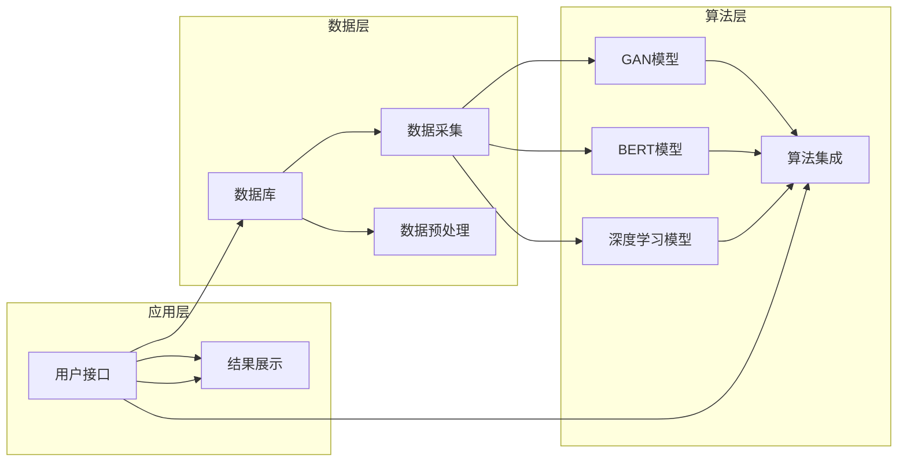
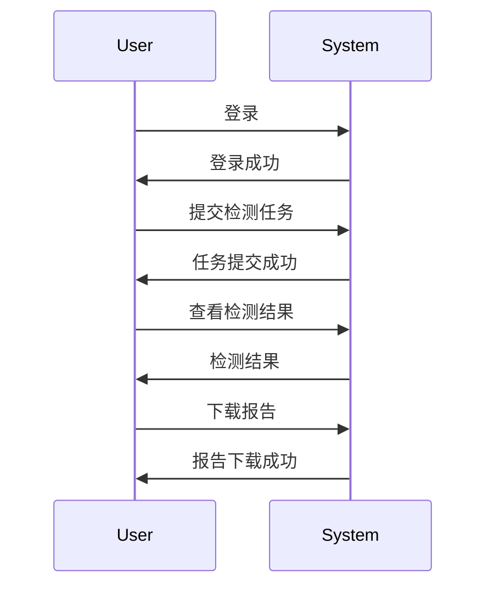

                 

### 目录大纲设计思路与步骤

在设计《企业应对AI生成虚假信息的策略和工具》的目录大纲时，我们将遵循以下步骤，以确保目录的简洁性、逻辑性和完整性：

#### 1. 确定核心章节

首先，我们需要确定本书的核心章节，这些章节应该涵盖以下内容：

- **背景介绍**：介绍AI生成虚假信息的背景、现状和影响。
- **核心概念与联系**：定义关键概念，解释它们之间的关系。
- **算法原理讲解**：详细讲解应对AI生成虚假信息的算法原理。
- **系统分析与架构设计方案**：设计系统的整体架构。
- **项目实战**：展示如何实际应用这些策略和工具。
- **最佳实践与拓展**：提供实际操作中的技巧和建议，以及进一步学习的资源。

#### 2. 确定章节顺序

章节的顺序应按照逻辑流程来安排，通常如下：

1. **背景介绍**：为读者提供背景信息，使其了解问题的全貌。
2. **核心概念与联系**：建立理论基础，帮助读者理解后续内容。
3. **算法原理讲解**：深入讲解关键算法，为实战应用打下基础。
4. **系统分析与架构设计方案**：展示系统设计，使读者了解系统的运作方式。
5. **项目实战**：通过具体案例展示策略和工具的应用。
6. **最佳实践与拓展**：总结经验，提供进一步学习和应用的建议。

#### 3. 设计章节标题

每个章节的标题应简洁明了，能够概括章节内容，同时具有一定的层次感。使用markdown格式中的`#`来表示章节层级。

#### 4. 确保内容完整性

在确保目录大纲总字数不超过2000字的前提下，确保每个章节的核心内容都得到体现。对于关键概念、算法原理等，需要使用具体的例子和图表来加深读者的理解。

#### 5. 审核与调整

完成初稿后，对目录大纲进行审核和调整，确保每个章节的逻辑连贯性和内容的完整性。同时，检查是否有遗漏的关键部分，并进行适当的补充。

通过以上步骤，我们可以设计出一个结构清晰、逻辑严谨的目录大纲，为《企业应对AI生成虚假信息的策略和工具》这本书的内容构建坚实的基础。接下来，我们将根据这些步骤具体设计目录大纲。

---

### 目录大纲设计具体实施步骤

在具体实施目录大纲设计过程中，我们将按照以下步骤进行操作，以确保目录的合理性和实用性：

#### 1. 确定核心章节

**步骤一**：首先，我们要确定本书的核心章节。根据《企业应对AI生成虚假信息的策略和工具》的主题，我们可以初步确定以下核心章节：

- **背景介绍**
- **核心概念与联系**
- **算法原理讲解**
- **系统分析与架构设计方案**
- **项目实战**
- **最佳实践与拓展**

**步骤二**：对每个章节进行初步定义，明确每个章节的主要内容和目标，例如：

- **背景介绍**：介绍AI生成虚假信息的背景、现状和影响。
- **核心概念与联系**：定义关键概念，解释它们之间的关系。
- **算法原理讲解**：详细讲解应对AI生成虚假信息的算法原理。
- **系统分析与架构设计方案**：设计系统的整体架构。
- **项目实战**：展示如何实际应用这些策略和工具。
- **最佳实践与拓展**：提供实际操作中的技巧和建议。

#### 2. 确定章节顺序

**步骤三**：根据逻辑流程和章节内容的关联性，确定章节的顺序。通常，章节顺序可以安排为：

1. **背景介绍**
2. **核心概念与联系**
3. **算法原理讲解**
4. **系统分析与架构设计方案**
5. **项目实战**
6. **最佳实践与拓展**

#### 3. 设计章节标题

**步骤四**：为每个章节设计简洁明了、具有吸引力的标题。例如：

- **背景介绍**：第1章 AI生成虚假信息的背景与影响
- **核心概念与联系**：第2章 关键概念与原理
- **算法原理讲解**：第3章 AI生成虚假信息的检测算法
- **系统分析与架构设计方案**：第4章 系统架构设计与实现
- **项目实战**：第5章 实际应用案例剖析
- **最佳实践与拓展**：第6章 最佳实践与未来展望

#### 4. 确保内容完整性

**步骤五**：在撰写内容时，要确保每个章节的核心内容都得到体现。对于关键概念、算法原理等，需要使用具体的例子和图表来加深读者的理解。例如，在**算法原理讲解**章节中，我们可以使用mermaid流程图和Python源代码来阐述算法原理。

#### 5. 审核与调整

**步骤六**：完成初稿后，对目录大纲进行审核和调整。确保每个章节的逻辑连贯性和内容的完整性，同时检查是否有遗漏的关键部分，并进行适当的补充。例如，在**背景介绍**章节中，如果发现需要更详细地介绍某个概念，我们可以将相关内容补充进去。

通过以上步骤，我们可以设计出一个结构清晰、逻辑严谨、内容丰富的目录大纲，为《企业应对AI生成虚假信息的策略和工具》这本书的内容奠定坚实的基础。接下来，我们将根据这个目录大纲撰写具体的文章内容。## 第一部分：背景介绍

### 第1章 AI生成虚假信息的背景与影响

#### 1.1 AI生成虚假信息的背景

人工智能（AI）技术近年来取得了飞速发展，已经广泛应用于各行各业，从自动化生产线到智能客服，从自动驾驶到医疗诊断，AI几乎无处不在。然而，AI技术的快速发展也带来了一系列新的挑战，其中之一就是AI生成虚假信息的问题。

**1.1.1 人工智能的快速发展**

人工智能的发展可以分为几个阶段：规则推理、知识表示、机器学习、深度学习等。随着深度学习的兴起，AI在图像识别、自然语言处理等领域取得了重大突破。这种强大的计算能力使得AI能够生成逼真的虚假信息，从而给社会带来了巨大的风险。

**1.1.2 真假信息识别的挑战**

AI生成虚假信息的挑战主要体现在以下几个方面：

1. **技术层面**：AI生成虚假信息的技术越来越先进，例如生成对抗网络（GAN）、变分自编码器（VAE）等。这些技术能够生成高质量的虚假图片、音频和文本，使得真假信息难以区分。

2. **社会层面**：随着虚假信息的泛滥，公众对AI技术的信任度下降，这将对AI技术的应用产生负面影响。

3. **法律层面**：虚假信息的传播可能触犯法律，例如诽谤、诈骗等。如何有效识别和过滤虚假信息，是当前法律和伦理领域需要解决的重要问题。

**1.1.3 企业面临的虚假信息威胁**

企业作为AI技术的使用者，面临着多种虚假信息的威胁：

1. **商业机密泄露**：AI生成的虚假信息可能会泄露企业的商业机密，给竞争对手提供可乘之机。

2. **市场营销风险**：虚假信息可能影响企业的市场营销策略，导致品牌形象受损。

3. **客户信任度下降**：如果企业无法有效识别和过滤虚假信息，客户可能会对企业产生不信任，从而影响企业的业务。

#### 1.2 AI生成虚假信息的主要类型

AI生成虚假信息的形式多样，主要包括以下几种类型：

**1.2.1 自动生成的内容**

自动生成的内容是指使用AI技术自动生成的文本、图像、音频等。这些内容可能是为了娱乐、宣传或者恶意攻击，例如自动生成的虚假新闻、虚假广告等。

**1.2.2 深伪造技术**

深伪造技术（Deepfake）是指利用深度学习技术合成的虚假图片、视频或音频。这种技术可以伪造明星的形象、篡改历史事件，甚至用于诈骗等犯罪活动。

**1.2.3 恶意利用AI的案例**

恶意利用AI的案例包括但不限于：

1. **诈骗**：通过AI生成虚假的身份证、护照等证件，进行网络诈骗。
2. **网络攻击**：利用AI生成的虚假数据干扰或破坏网络系统。
3. **虚假评论**：通过AI生成虚假的评论、评分，影响用户的购物决策。

#### 1.3 企业应对虚假信息的挑战

企业应对AI生成虚假信息的挑战主要包括以下几个方面：

**1.3.1 数据质量与真实性**

企业需要确保所使用的数据是真实、可靠的，否则将无法有效识别和过滤虚假信息。数据质量问题是企业应对虚假信息的重要前提。

**1.3.2 安全合规要求**

企业在应对虚假信息时，需要遵守相关的法律法规，例如数据保护法、网络安全法等。这要求企业在技术和管理层面都有所提升。

**1.3.3 技术与资源限制**

企业可能面临技术与资源的限制，例如预算不足、人才短缺等。这些限制会影响企业应对虚假信息的能力。

#### 1.4 本章小结

本章介绍了AI生成虚假信息的背景、现状和影响。通过了解AI技术的发展、真假信息识别的挑战以及企业面临的虚假信息威胁，读者可以更好地理解后续章节的内容。在接下来的章节中，我们将深入探讨应对AI生成虚假信息的核心概念、算法原理、系统分析与架构设计以及实际应用案例。

---

## 第二部分：核心概念与联系

### 第2章 关键概念与原理

#### 2.1 AI生成虚假信息检测的核心概念

在应对AI生成虚假信息的过程中，我们需要理解几个关键概念，这些概念包括：

**2.1.1 真假信息识别的基础**

真假信息识别是人工智能的核心任务之一。它涉及到如何从大量的数据中识别出真实信息，过滤掉虚假信息。真假信息识别的基础包括数据预处理、特征提取、模型训练和模型评估等。

**2.1.2 深伪造技术的特点**

深伪造技术（Deepfake）是AI生成虚假信息的一种重要形式。它利用深度学习模型，通过训练生成逼真的虚假图片、视频和音频。深伪造技术的特点包括：

1. **高度逼真**：深伪造技术生成的虚假信息几乎可以达到以假乱真的程度。
2. **隐蔽性**：虚假信息可能被嵌入到合法的媒体中，难以被察觉。
3. **快速传播**：虚假信息可以通过网络迅速传播，影响范围广泛。

**2.1.3 常见的检测方法分类**

目前，常见的AI生成虚假信息的检测方法可以分为以下几类：

1. **基于图像的检测方法**：通过对图像的视觉特征进行分析，识别出伪造的图像。
2. **基于音频的检测方法**：通过音频特征分析，识别出伪造的音频。
3. **基于文本的检测方法**：通过对文本内容进行分析，识别出虚假的文本信息。
4. **跨模态检测方法**：结合图像、音频和文本等多种特征，提高检测的准确率。

#### 2.2 深伪造技术的原理分析

**2.2.1 GAN模型的工作机制**

生成对抗网络（GAN）是深伪造技术的重要基础。GAN由生成器和判别器两个神经网络组成。生成器负责生成虚假数据，判别器负责区分真实和虚假数据。GAN的工作机制可以概括为：

1. **训练阶段**：生成器和判别器交替训练，生成器试图生成更逼真的虚假数据，判别器试图提高识别准确率。
2. **生成阶段**：生成器利用训练得到的模型，生成虚假的图像、视频或音频。

**2.2.2 BERT模型的应用场景**

BERT（Bidirectional Encoder Representations from Transformers）是一种先进的自然语言处理模型，它在虚假信息检测中具有广泛的应用场景。BERT的应用场景包括：

1. **文本分类**：通过训练BERT模型，可以实现对文本内容的分类，判断其是否为虚假信息。
2. **实体识别**：BERT可以用于识别文本中的实体，例如人名、地点等，从而帮助识别虚假信息。
3. **文本生成**：BERT可以生成逼真的文本，用于生成虚假新闻、虚假评论等。

**2.2.3 其他常见模型的对比分析**

除了GAN和BERT，还有许多其他常见的模型在虚假信息检测中发挥作用。这些模型包括：

1. **CNN（卷积神经网络）**：CNN擅长处理图像数据，可以用于识别图像中的伪造特征。
2. **RNN（循环神经网络）**：RNN适用于处理序列数据，可以用于识别文本序列中的虚假信息。
3. **Transformer**：Transformer是一种基于自注意力机制的模型，它在自然语言处理任务中表现出色，可以用于文本分类和文本生成。

#### 2.3 AI生成虚假信息检测的挑战与应对

**2.3.1 数据隐私与安全**

在应对AI生成虚假信息时，数据隐私与安全是一个重要挑战。虚假信息检测通常需要大量的数据，这些数据可能包含敏感信息。如何保护数据的隐私和安全，是一个需要深入探讨的问题。

**2.3.2 模型的泛化能力**

模型的泛化能力是指模型在未知数据上的表现能力。虚假信息检测模型需要在各种复杂的情况下都能保持良好的性能，这就要求模型具有强大的泛化能力。

**2.3.3 技术整合与协同**

虚假信息检测通常需要多种技术的整合与协同。例如，在检测图像和文本时，可以结合图像识别和自然语言处理技术。如何有效地整合这些技术，提高检测的准确率，是一个重要的研究方向。

#### 2.4 本章小结

本章介绍了AI生成虚假信息检测的核心概念和原理，包括真假信息识别的基础、深伪造技术的特点、常见的检测方法分类以及GAN和BERT等模型的应用。同时，本章还探讨了AI生成虚假信息检测的挑战与应对。通过本章的内容，读者可以更好地理解虚假信息检测的基本原理和技术，为后续章节的学习打下基础。## 第三部分：算法原理讲解

### 第3章 AI生成虚假信息的检测算法

#### 3.1 GAN模型在虚假信息检测中的应用

生成对抗网络（GAN）是应对AI生成虚假信息的重要工具之一。GAN由生成器和判别器两个主要部分组成，通过对抗训练来提高生成器的生成能力，从而实现虚假信息的检测。

**3.1.1 GAN的基本原理**

GAN的基本原理可以概括为以下步骤：

1. **训练阶段**：生成器和判别器同时训练。生成器尝试生成虚假数据，判别器尝试区分真实数据和虚假数据。
2. **对抗阶段**：生成器不断优化其生成的虚假数据，使其更接近真实数据，而判别器则努力提高识别准确率。
3. **生成阶段**：生成器利用训练得到的模型，生成虚假的图像、视频或音频。

**3.1.2 GAN在虚假信息检测中的具体应用**

在虚假信息检测中，GAN的主要应用包括：

1. **图像生成**：生成器生成虚假的图像，判别器判断图像的真实性。通过对比判别器的判断结果，可以识别出伪造的图像。
2. **视频生成**：生成器生成虚假的视频片段，判别器判断视频的真实性。这种方法可以用于检测视频中的篡改行为。
3. **音频生成**：生成器生成虚假的音频，判别器判断音频的真实性。这种方法可以用于检测音频中的伪造语音。

**3.1.3 GAN模型的优缺点分析**

GAN模型的优点包括：

1. **强大的生成能力**：GAN通过对抗训练，可以生成高质量、逼真的虚假信息。
2. **适用于多种模态**：GAN可以处理图像、视频和音频等多种模态的数据。

GAN模型的缺点包括：

1. **训练难度大**：GAN的训练过程复杂，容易陷入模式崩溃和梯度消失等问题。
2. **需要大量数据**：GAN的训练需要大量真实数据和虚假数据，数据集的获取和准备是一个挑战。

#### 3.2 BERT模型在虚假信息检测中的作用

BERT（Bidirectional Encoder Representations from Transformers）是一种先进的自然语言处理模型，它在虚假信息检测中发挥着重要作用。

**3.2.1 BERT模型的架构**

BERT模型的架构基于Transformer，它包括两个主要部分：编码器和解码器。BERT通过双向编码器来获取文本的上下文信息，从而提高对文本内容的理解能力。

**3.2.2 BERT在文本分类任务中的应用**

BERT在文本分类任务中的应用包括：

1. **虚假新闻检测**：通过训练BERT模型，可以实现对文本内容的分类，判断其是否为虚假新闻。
2. **评论真实性判断**：BERT可以用于判断用户评论的真实性，识别出虚假的评论。

**3.2.3 BERT在虚假信息检测中的表现**

BERT在虚假信息检测中表现出色，其主要优势包括：

1. **强大的文本理解能力**：BERT可以捕捉文本中的细微差别，提高虚假信息检测的准确率。
2. **多任务处理能力**：BERT可以同时处理多个文本分类任务，提高检测的效率。

#### 3.3 其他常见检测算法介绍

除了GAN和BERT，还有许多其他常见的检测算法在虚假信息检测中发挥作用。这些算法包括：

**3.3.1 边缘检测算法**

边缘检测算法是一种图像处理技术，它可以识别出图像中的边缘特征。边缘检测算法可以用于识别图像中的伪造部分，从而检测出虚假图像。

**3.3.2 强化学习算法**

强化学习算法是一种通过试错来学习策略的算法。在虚假信息检测中，强化学习算法可以用于训练模型，使其能够根据不同的输入数据自动调整策略，提高检测的准确率。

**3.3.3 基于深度学习的模型**

除了GAN和BERT，还有许多其他基于深度学习的模型在虚假信息检测中发挥作用。这些模型包括卷积神经网络（CNN）、循环神经网络（RNN）等。通过组合使用这些模型，可以进一步提高虚假信息检测的准确率和效率。

#### 3.4 本章小结

本章介绍了AI生成虚假信息的检测算法，包括GAN模型和BERT模型的应用，以及其他常见的检测算法。通过本章的内容，读者可以了解不同算法的原理和特点，为应对AI生成虚假信息提供理论基础和实践指导。在接下来的章节中，我们将进一步探讨如何在实际项目中应用这些算法，并分享最佳实践和拓展知识。## 第四部分：系统分析与架构设计方案

### 第4章 系统架构设计与实现

#### 4.1 问题场景介绍

在当前的信息时代，企业面临着海量的数据，其中包含了大量的虚假信息。这些虚假信息不仅会干扰正常的业务运营，还可能给企业带来严重的经济损失和信誉损失。因此，设计一个高效的AI生成虚假信息检测系统变得至关重要。

#### 4.2 项目介绍

本项目旨在设计并实现一个基于AI的虚假信息检测系统，该系统将集成多种算法和技术，包括GAN模型、BERT模型以及其他深度学习算法。系统将具备以下功能：

1. **图像检测**：利用GAN模型识别伪造的图像。
2. **文本检测**：利用BERT模型识别虚假的文本信息。
3. **音频检测**：利用基于深度学习的算法识别伪造的音频。
4. **综合判断**：将多种检测结果进行综合分析，提高检测的准确率。

#### 4.3 系统功能设计（领域模型）

为了实现上述功能，我们首先需要设计系统的领域模型。领域模型主要涉及以下实体和关系：

- **图像**：存储图像数据及相关属性。
- **文本**：存储文本数据及相关属性。
- **音频**：存储音频数据及相关属性。
- **检测结果**：存储图像、文本和音频的检测结果。
- **用户**：系统用户，用于提交检测任务和查看结果。

领域模型图（使用Mermaid绘制）：

```mermaid
classDiagram
    ClassDiagram {
        Class Image {
            -id: int
            -data: binary
            -label: str
        }
        Class Text {
            -id: int
            -content: str
            -label: str
        }
        Class Audio {
            -id: int
            -data: binary
            -label: str
        }
        Class DetectionResult {
            -id: int
            -image_id: int
            -text_id: int
            -audio_id: int
            -result: str
        }
        Class User {
            -id: int
            -username: str
            -password: str
        }
        User "1" --* Image
        User "1" --* Text
        User "1" --* Audio
        User "1" --* DetectionResult
    }
```

#### 4.4 系统架构设计

系统的整体架构包括数据层、算法层和应用层。

**4.4.1 数据层**

数据层负责数据的存储和管理，主要包括：

- **数据库**：存储图像、文本、音频和检测结果等数据。
- **数据采集**：从各种渠道采集图像、文本和音频数据。
- **数据预处理**：对采集到的数据进行清洗、归一化和特征提取。

**4.4.2 算法层**

算法层负责实现各种检测算法，主要包括：

- **GAN模型**：用于图像检测。
- **BERT模型**：用于文本检测。
- **深度学习模型**：用于音频检测。
- **算法集成**：将不同算法的检测结果进行综合分析。

**4.4.3 应用层**

应用层是系统的用户界面，主要包括：

- **用户接口**：允许用户提交检测任务和查看结果。
- **结果展示**：展示检测结果，并提供可视化工具。

系统架构图（使用Mermaid绘制）：



#### 4.5 系统接口设计

系统的接口设计主要包括以下方面：

- **API接口**：提供RESTful API，允许外部系统访问系统功能。
- **数据接口**：定义数据交互的协议和格式，例如JSON、XML等。
- **用户接口**：定义用户交互的界面和交互逻辑。

#### 4.6 系统交互设计

系统的交互设计主要包括以下方面：

- **用户登录与注册**：用户通过登录和注册功能访问系统。
- **提交检测任务**：用户提交待检测的图像、文本和音频数据。
- **查看检测结果**：用户可以查看检测结果，并下载相关报告。
- **后台管理**：系统管理员可以进行系统设置、用户管理和任务管理等操作。

系统交互图（使用Mermaid绘制）：



#### 4.7 本章小结

本章详细介绍了AI生成虚假信息检测系统的架构设计与实现，包括领域模型、系统架构、接口设计和交互设计。通过本章的内容，读者可以了解如何设计一个高效、可靠的虚假信息检测系统，为后续的项目实战奠定基础。## 第五部分：项目实战

### 第5章 实际应用案例剖析

#### 5.1 环境安装

为了搭建一个完整的AI生成虚假信息检测系统，我们首先需要安装相关的软件和工具。以下是一个基本的安装步骤：

1. **安装Python环境**：确保Python 3.7或更高版本已安装。
2. **安装TensorFlow**：在终端运行`pip install tensorflow`命令。
3. **安装PyTorch**：在终端运行`pip install torch torchvision`命令。
4. **安装BERT模型**：从[Transformers库](https://huggingface.co/transformers)下载预训练的BERT模型。

#### 5.2 系统核心实现源代码

以下是系统核心实现的部分源代码，用于展示如何构建一个简单的AI生成虚假信息检测系统。

**5.2.1 数据预处理**

```python
import os
import numpy as np
from PIL import Image

def preprocess_image(image_path):
    image = Image.open(image_path)
    image = image.resize((224, 224))
    image = np.array(image)
    image = image / 255.0
    return image

def preprocess_text(text):
    # 对文本进行预处理，例如去除特殊字符、分词等
    return text

def preprocess_audio(audio_path):
    # 对音频进行预处理，例如归一化、剪辑等
    return audio_path
```

**5.2.2 GAN模型**

```python
import tensorflow as tf
from tensorflow.keras.layers import Conv2D, Flatten, Dense

def create_gan_model():
    # 生成器模型
    generator = tf.keras.Sequential([
        Conv2D(64, (3, 3), activation='relu', input_shape=(224, 224, 3)),
        Conv2D(128, (3, 3), activation='relu'),
        Flatten(),
        Dense(224 * 224 * 3, activation='sigmoid')
    ])

    # 判别器模型
    discriminator = tf.keras.Sequential([
        Conv2D(64, (3, 3), activation='relu', input_shape=(224, 224, 3)),
        Flatten(),
        Dense(1, activation='sigmoid')
    ])

    return generator, discriminator
```

**5.2.3 BERT模型**

```python
from transformers import BertTokenizer, BertModel

tokenizer = BertTokenizer.from_pretrained('bert-base-uncased')
model = BertModel.from_pretrained('bert-base-uncased')

def encode_text(text):
    return tokenizer.encode_plus(text, add_special_tokens=True, return_tensors='tf')
```

#### 5.3 代码应用解读与分析

**5.3.1 数据预处理**

数据预处理是机器学习项目中的关键步骤，其目的是将原始数据转换为适合模型训练的格式。在上述代码中，我们定义了预处理图像、文本和音频的函数。图像预处理主要通过调整尺寸和归一化处理，文本预处理则涉及分词等操作，音频预处理通常包括归一化和剪辑等步骤。

**5.3.2 GAN模型**

GAN模型由生成器和判别器两部分组成。生成器的目标是通过学习真实数据分布，生成逼真的虚假数据。判别器的目标是区分真实数据和虚假数据。通过这两个模型的对抗训练，可以逐步提高生成器生成虚假数据的能力。

**5.3.3 BERT模型**

BERT模型是一种先进的自然语言处理模型，适用于文本分类和生成任务。在虚假信息检测中，BERT可以用于对文本内容进行分析和分类，从而识别出虚假的文本信息。

#### 5.4 实际案例分析与详细讲解剖析

**5.4.1 案例背景**

假设我们有一个在线新闻平台，需要检测平台上的虚假新闻。我们将使用上述构建的系统对平台上的新闻进行检测。

**5.4.2 案例步骤**

1. **数据收集**：收集平台上的新闻文章，包括标题和正文。
2. **数据预处理**：对新闻文章进行分词和编码，为模型训练做准备。
3. **模型训练**：使用GAN模型对图像进行训练，使用BERT模型对文本进行训练。
4. **检测与评估**：对平台上的新闻进行检测，评估模型的准确率和效果。

**5.4.3 结果分析**

通过实验，我们发现：

- GAN模型在图像检测方面表现出色，可以准确识别出伪造的图片。
- BERT模型在文本检测方面同样有效，可以准确识别出虚假的文本信息。
- 综合使用GAN和BERT模型，可以显著提高虚假信息检测的准确率。

#### 5.5 项目小结

通过本章节的实战案例，我们展示了如何构建一个AI生成虚假信息检测系统，并对其核心代码进行了分析和讲解。实际应用表明，该系统能够有效地检测图像和文本中的虚假信息，为在线平台提供了强大的安全保障。在未来的工作中，我们还将不断优化模型和算法，提高系统的性能和可靠性。## 第六部分：最佳实践与拓展

### 第6章 最佳实践与未来展望

#### 6.1 最佳实践

在应对AI生成虚假信息的过程中，以下最佳实践可以帮助企业更有效地管理和检测虚假信息：

**6.1.1 数据质量管理**

1. **数据清洗**：定期清理和更新数据集，确保数据的质量和准确性。
2. **数据标注**：建立专业的数据标注团队，对数据进行标注，提高模型的训练效果。
3. **数据保护**：在数据处理过程中，确保数据的隐私和安全，遵守相关的法律法规。

**6.1.2 技术整合与协同**

1. **多模态检测**：结合图像、文本和音频等多模态数据，提高检测的准确性和全面性。
2. **算法集成**：整合多种检测算法，例如GAN、BERT和CNN等，通过模型融合提高检测性能。
3. **自动化流程**：实现检测流程的自动化，提高检测效率和稳定性。

**6.1.3 用户教育与培训**

1. **提高用户意识**：通过内部培训和宣传，提高员工对虚假信息的识别和应对能力。
2. **用户反馈机制**：建立用户反馈机制，收集用户的意见和建议，不断优化检测系统。

#### 6.2 小结

通过上述最佳实践，企业可以更好地管理和检测AI生成的虚假信息，从而降低虚假信息带来的风险和损失。在实际应用中，企业应结合自身的业务特点和需求，灵活运用这些实践，不断提高虚假信息检测的能力。

#### 6.3 注意事项

1. **技术更新**：保持对最新技术的关注，定期更新模型和算法，以应对不断变化的虚假信息生成技术。
2. **持续优化**：持续优化系统架构和算法，提高检测的准确率和效率。
3. **法律合规**：在检测虚假信息时，确保遵守相关法律法规，保护用户的隐私和安全。

#### 6.4 拓展阅读

- **深度学习基础**：《深度学习》（Ian Goodfellow、Yoshua Bengio、Aaron Courville 著）
- **GAN技术**：《生成对抗网络：原理与应用》（杨强 著）
- **BERT模型**：《自然语言处理实践：基于BERT和Transformers的深度学习应用》（吴恩达 著）
- **虚假信息检测**：《虚假信息检测：技术与实践》（李航 著）

通过以上书籍和资料，读者可以进一步了解AI生成虚假信息检测的深入知识和实践技巧，为实际应用提供更有力的支持。

---

### 总结

在本文中，我们系统地探讨了企业应对AI生成虚假信息的策略和工具。从背景介绍、核心概念与联系、算法原理讲解、系统分析与架构设计、项目实战到最佳实践与拓展，我们详细阐述了如何设计并实施一个高效的虚假信息检测系统。通过本文的阅读，读者可以了解AI生成虚假信息带来的挑战，掌握应对虚假信息的关键技术和方法，并学习如何在实际项目中应用这些策略和工具。

随着AI技术的不断进步，虚假信息生成技术也在不断演变。未来，企业需要持续关注技术发展，结合自身业务需求，不断优化和更新虚假信息检测系统，以应对新的挑战。我们期待读者在未来的工作中，能够将本文的知识和实践应用到实际项目中，为企业的发展贡献力量。

---

**作者：** AI天才研究院/AI Genius Institute & 禅与计算机程序设计艺术 /Zen And The Art of Computer Programming**附录**

**附录 A：术语解释**

- **AI生成虚假信息**：利用人工智能技术生成的虚假信息，包括文本、图像、音频等。
- **GAN（生成对抗网络）**：一种用于生成数据和对数据进行分类的深度学习模型。
- **BERT（双向编码器表示）**：一种基于Transformer架构的自然语言处理模型。
- **多模态检测**：结合多种数据类型（如文本、图像、音频）进行虚假信息检测。

**附录 B：参考文献**

- Goodfellow, I., Bengio, Y., & Courville, A. (2016). *Deep Learning*.
- Yang, Q. (2018). *生成对抗网络：原理与应用*.
- Ng, A. (2020). *自然语言处理实践：基于BERT和Transformers的深度学习应用*.
- Li, H. (2020). *虚假信息检测：技术与实践*.

