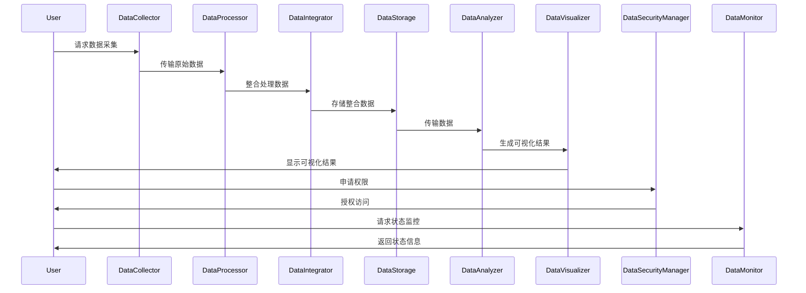
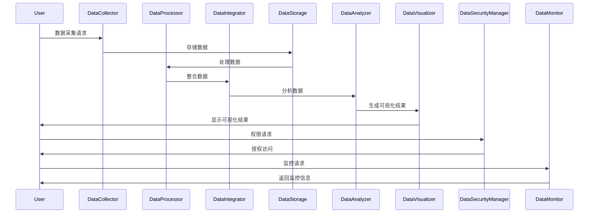

                 

### 文章标题

# 企业数据湖智能化：构建AI友好的数据生态

> 关键词：数据湖、智能化、AI友好、数据生态、系统架构、算法原理、实战案例

> 摘要：随着大数据和人工智能技术的快速发展，企业数据湖逐渐成为企业数据管理的重要基础设施。本文将深入探讨数据湖智能化的核心概念、技术栈、算法原理和系统架构，并通过实际案例展示智能化数据湖的构建过程。本文旨在为企业提供构建AI友好数据生态的思路和实践指导。

### 目录大纲

----------------------------------------------------------------

# 第一部分: 背景介绍

## 1.1 问题背景

### 1.1.1 企业数据湖的现状

### 1.1.2 数据湖面临的挑战

### 1.1.3 数据湖智能化的意义

## 1.2 问题描述

### 1.2.1 传统数据湖存在的问题

### 1.2.2 智能化数据湖的目标

## 1.3 问题解决

### 1.3.1 数据湖智能化的关键

### 1.3.2 智能化数据湖的技术栈

## 1.4 边界与外延

### 1.4.1 数据湖与大数据

### 1.4.2 数据湖与数据仓库

## 1.5 概念结构与核心要素组成

### 1.5.1 数据湖的基本架构

### 1.5.2 数据湖的核心功能

----------------------------------------------------------------

# 第二部分: 核心概念与联系

## 2.1 数据湖的概念原理

### 2.1.1 数据湖的定义

### 2.1.2 数据湖的特点

### 2.1.3 数据湖与大数据平台的区别

## 2.2 数据湖的属性特征对比表格

### 2.2.1 数据湖与传统数据仓库对比

### 2.2.2 数据湖与大数据平台对比

## 2.3 数据湖的ER实体关系图架构

### 2.3.1 数据湖的实体定义

### 2.3.2 数据湖的关系描述

### 2.3.3 数据湖的ER图绘制

----------------------------------------------------------------

# 第三部分: 算法原理讲解

## 3.1 数据湖智能化的算法介绍

### 3.1.1 数据湖智能化的算法分类

### 3.1.2 主流智能算法简介

## 3.2 智能算法的Mermaid流程图

### 3.2.1 智能算法的基本流程

### 3.2.2 智能算法的流程图绘制

## 3.3 数据湖智能算法的Python源代码

### 3.3.1 数据湖智能算法的实现

### 3.3.2 源代码解读与分析

## 3.4 算法原理的数学模型和公式

### 3.4.1 数学模型概述

### 3.4.2 算法公式解析

### 3.4.3 公式举例说明

----------------------------------------------------------------

# 第四部分: 系统分析与架构设计方案

## 4.1 问题场景介绍

### 4.1.1 企业数据湖的需求

### 4.1.2 智能化数据湖的目标

## 4.2 系统功能设计

### 4.2.1 领域模型Mermaid类图

### 4.2.2 系统功能模块划分

## 4.3 系统架构设计

### 4.3.1 系统架构的Mermaid架构图

### 4.3.2 系统架构的组件解析

## 4.4 系统接口设计

### 4.4.1 接口设计原则

### 4.4.2 接口定义与实现

## 4.5 系统交互Mermaid序列图

### 4.5.1 系统交互的基本流程

### 4.5.2 序列图绘制

----------------------------------------------------------------

# 第五部分: 项目实战

## 5.1 环境安装

### 5.1.1 硬件环境准备

### 5.1.2 软件环境配置

## 5.2 系统核心实现

### 5.2.1 数据湖构建流程

### 5.2.2 智能化数据处理

## 5.3 代码应用解读与分析

### 5.3.1 代码结构解析

### 5.3.2 关键代码解读

## 5.4 实际案例分析

### 5.4.1 案例背景

### 5.4.2 案例分析

## 5.5 项目小结

### 5.5.1 项目总结

### 5.5.2 项目经验分享

----------------------------------------------------------------

# 第六部分: 最佳实践 tips

## 6.1 数据湖构建的最佳实践

### 6.1.1 数据湖设计原则

### 6.1.2 数据湖运维技巧

## 6.2 智能化数据处理的技巧

### 6.2.1 算法选择建议

### 6.2.2 性能优化策略

## 6.3 小结与注意事项

### 6.3.1 项目实施的关键点

### 6.3.2 注意事项与风险防范

---------------

----------------------------------------------------------------

接下来，我们将逐步深入探讨企业数据湖智能化的话题，通过逻辑清晰、结构紧凑、简单易懂的专业技术语言，带领读者深入了解数据湖的背景、核心概念、算法原理和系统架构设计，最终通过实际项目案例来展示数据湖智能化的实现过程。希望这篇文章能够为读者在构建AI友好数据生态的道路上提供有价值的参考和指导。

## 1.1 问题背景

### 1.1.1 企业数据湖的现状

企业数据湖（Data Lake）作为大数据生态系统的重要组成部分，近年来在企业数据管理中占据了越来越重要的地位。数据湖的设计初衷是将企业内外部的各类数据，包括结构化、半结构化和非结构化数据，存储在一个统一的平台上，以实现数据的全面整合和高效利用。这种设计理念不仅提升了数据管理的灵活性和扩展性，还为数据分析和人工智能（AI）应用提供了丰富的数据资源。

随着云计算、分布式存储和数据处理技术的不断成熟，企业数据湖的应用场景日益丰富。许多企业通过建立数据湖，实现了数据的集中存储和管理，为企业内部的业务决策、数据分析、机器学习应用提供了强大的支持。例如，零售行业通过数据湖整合了销售数据、客户数据和供应链数据，从而实现了精准营销和需求预测；金融行业通过数据湖管理海量的交易数据和历史数据，提升了风险管理能力和服务效率。

### 1.1.2 数据湖面临的挑战

尽管数据湖为企业数据管理带来了诸多优势，但在实际应用过程中也面临诸多挑战。以下是一些主要挑战：

1. **数据质量问题**：数据湖中包含大量不同来源和格式的数据，数据的准确性和一致性难以保证，这对数据分析的准确性和可靠性提出了挑战。

2. **数据治理难题**：数据湖中的数据量巨大，如何确保数据的安全、合规性和可追溯性，成为数据治理的重要问题。

3. **性能瓶颈**：随着数据量的增长，数据湖的性能优化成为一个关键问题。如何提升数据存储和查询的效率，确保业务应用的性能，是数据湖面临的主要挑战之一。

4. **成本控制**：数据湖的建设和维护需要投入大量资源，如何控制成本，确保数据湖的可持续发展，是企业必须面对的问题。

5. **人工智能应用挑战**：虽然数据湖提供了丰富的数据资源，但如何将数据转化为实际的AI应用，实现数据价值的最大化，仍然是企业需要解决的问题。

### 1.1.3 数据湖智能化的意义

面对上述挑战，数据湖智能化成为一种必然趋势。数据湖智能化旨在通过引入人工智能（AI）技术，提升数据湖的自动数据处理能力和分析能力，从而解决数据质量管理、数据治理、性能优化等问题，实现数据价值的最大化。

数据湖智能化的意义主要体现在以下几个方面：

1. **提升数据处理效率**：智能化技术可以帮助企业自动识别、清洗和整合数据，大幅提升数据处理效率。

2. **增强数据分析能力**：通过智能算法，数据湖可以自动发现数据中的潜在模式和关系，为企业提供更深入的洞察。

3. **降低数据治理成本**：智能化的数据治理手段可以提升数据的合规性和安全性，降低企业的数据治理成本。

4. **优化性能表现**：智能化技术可以帮助企业优化数据存储和查询策略，提升数据湖的性能表现。

5. **推动AI应用落地**：数据湖智能化为AI应用提供了丰富且高质量的数据资源，有助于推动AI技术在企业中的广泛应用。

### 1.2 问题描述

#### 1.2.1 传统数据湖存在的问题

传统数据湖在构建和运行过程中面临着多种挑战，这些问题制约了数据湖的效能和可靠性。以下是一些典型问题：

1. **数据质量问题**：由于数据来源多样、数据格式不统一，传统数据湖中的数据往往存在质量不佳的问题，如数据缺失、数据冗余、数据不一致等。这些问题会影响数据分析的准确性和可靠性。

2. **数据治理难题**：传统数据湖缺乏有效的数据治理机制，导致数据的安全、合规性和可追溯性难以保证。数据治理的不完善使得数据湖中的数据难以得到充分利用。

3. **数据查询效率低下**：随着数据量的不断增加，传统数据湖的性能逐渐成为瓶颈。数据的存储和查询效率低下，导致业务应用的响应速度受到影响。

4. **成本控制难度大**：传统数据湖的建设和维护成本较高，数据存储和处理的资源利用率不足，如何控制成本成为企业需要面对的重要问题。

5. **AI应用落地困难**：传统数据湖虽然提供了丰富的数据资源，但缺乏自动化数据处理和智能分析能力，难以将数据转化为实际的AI应用，从而实现数据价值的最大化。

#### 1.2.2 智能化数据湖的目标

为了解决传统数据湖存在的问题，智能化数据湖应具备以下目标：

1. **提升数据质量**：通过引入数据清洗、数据整合和数据质量管理技术，确保数据湖中的数据质量，为数据分析提供可靠的数据基础。

2. **强化数据治理**：建立智能化的数据治理体系，包括数据安全、合规性和可追溯性，确保数据湖的安全可靠。

3. **优化性能表现**：通过智能化技术优化数据存储和查询策略，提升数据湖的性能表现，确保业务应用的性能需求得到满足。

4. **降低运营成本**：通过自动化处理和智能优化，提高数据湖的资源利用率，降低企业的运营成本。

5. **推动AI应用落地**：利用智能化数据处理和智能分析技术，将数据转化为实际的AI应用，实现数据价值的最大化。

### 1.3 问题解决

#### 1.3.1 数据湖智能化的关键

数据湖智能化的实现涉及多个关键环节，以下是一些核心要点：

1. **数据质量管理**：通过引入数据清洗、数据整合和数据质量管理技术，确保数据湖中的数据质量。数据质量管理不仅包括数据清洗和整合，还应涵盖数据监控和优化，以持续提升数据质量。

2. **智能治理体系**：建立智能化的数据治理体系，包括数据安全、合规性和可追溯性。智能治理体系可以通过自动化规则和智能算法实现，降低数据治理的成本和复杂性。

3. **性能优化**：利用智能化技术优化数据存储和查询策略，提升数据湖的性能表现。性能优化包括数据索引、查询优化和存储优化等方面。

4. **成本控制**：通过自动化处理和智能优化，提高数据湖的资源利用率，降低企业的运营成本。成本控制措施应贯穿数据湖的整个生命周期，包括数据采集、存储、处理和查询等环节。

5. **AI应用集成**：将AI技术和数据湖紧密结合，实现数据到AI应用的自动化转换。通过智能算法和模型，将数据转化为实际的AI应用，为企业带来实际的价值。

#### 1.3.2 智能化数据湖的技术栈

实现数据湖智能化需要依赖一系列技术，以下是一些关键技术：

1. **分布式存储技术**：分布式存储技术如Hadoop HDFS、Alluxio等，为数据湖提供了高扩展性和高可靠性的数据存储解决方案。

2. **数据处理框架**：数据处理框架如Apache Spark、Flink等，为数据湖提供了强大的数据处理能力，支持批处理和实时处理。

3. **机器学习平台**：机器学习平台如TensorFlow、PyTorch等，为数据湖提供了丰富的机器学习算法和工具，支持数据到AI应用的自动化转换。

4. **数据治理工具**：数据治理工具如Informatica、Talend等，为数据湖提供了数据安全、合规性和可追溯性保障。

5. **性能优化工具**：性能优化工具如Apache Lucene、Elasticsearch等，为数据湖提供了高效的查询和索引功能，提升数据查询效率。

#### 1.4 边界与外延

##### 1.4.1 数据湖与大数据

数据湖与大数据（Big Data）密切相关，但二者并不完全相同。大数据通常指的是大规模数据的集合，而数据湖则是一个用于存储、管理和处理大数据的平台。数据湖可以看作是大数据技术的一种实现方式，但并不局限于大数据的范畴。数据湖不仅能够存储和整合大数据，还可以涵盖小数据和实时数据，提供更广泛的数据管理解决方案。

##### 1.4.2 数据湖与数据仓库

数据湖与数据仓库（Data Warehouse）也有一定的区别。数据仓库主要用于存储和管理结构化数据，支持复杂的数据分析和报表生成。而数据湖则更加强调数据的多样性和灵活性，支持结构化、半结构化和非结构化数据的存储和管理。数据湖可以为数据仓库提供丰富的数据源，但数据湖并不直接取代数据仓库，二者在数据管理中各有侧重，可以相互补充。

##### 1.5 概念结构与核心要素组成

数据湖的智能化构建涉及多个核心概念和要素，以下是一些关键组成部分：

##### 1.5.1 数据湖的基本架构

数据湖的基本架构包括数据采集、存储、处理、分析和应用等多个环节。其中，数据采集环节负责将各类数据源的数据接入数据湖；存储环节负责将数据进行持久化存储；处理环节负责对数据进行清洗、整合和加工；分析环节负责对数据进行统计分析、数据挖掘和机器学习；应用环节负责将数据转化为实际的业务应用。

##### 1.5.2 数据湖的核心功能

数据湖的核心功能包括：

1. **数据存储**：支持结构化、半结构化和非结构化数据的存储和管理，提供高扩展性和高可靠性的存储解决方案。
2. **数据整合**：通过数据清洗、数据整合和数据质量管理，确保数据湖中的数据质量，为数据分析提供可靠的数据基础。
3. **数据处理**：提供高效的数据处理能力，支持批处理和实时处理，满足不同业务场景的需求。
4. **数据分析**：支持多种数据分析工具和算法，实现数据的价值挖掘和智能分析。
5. **数据应用**：将数据转化为实际的业务应用，支持数据驱动的业务决策和智能化服务。 

## 2.1 数据湖的概念原理

### 2.1.1 数据湖的定义

数据湖（Data Lake）是一种用于存储、管理和处理大量数据的平台，它通常采用分布式存储技术，支持结构化、半结构化和非结构化数据的存储和管理。与传统的数据仓库（Data Warehouse）不同，数据湖更加灵活和开放，能够处理多种数据格式，从而为企业提供更广泛的数据资源。

数据湖的设计理念是将不同来源的数据，包括内部业务系统数据、外部第三方数据、社交媒体数据等，集中存储在一个统一的平台上，以便于后续的数据分析和处理。数据湖通常采用分布式文件系统，如Hadoop HDFS、Alluxio等，来存储和管理大量数据，同时利用分布式计算框架，如Apache Spark、Flink等，来提供强大的数据处理能力。

### 2.1.2 数据湖的特点

数据湖具有以下几个显著特点：

1. **数据多样性**：数据湖支持多种数据格式，包括结构化数据（如关系数据库）、半结构化数据（如JSON、XML）和非结构化数据（如文本、图像、音频、视频等），能够处理不同类型的数据。

2. **灵活性**：数据湖的设计更加灵活，允许数据在存储时保持原始格式，无需预先定义数据结构和模式，数据可以在后续阶段逐步进行整合和处理。

3. **可扩展性**：数据湖采用分布式存储和计算架构，能够轻松应对海量数据的存储和计算需求，支持水平扩展和弹性伸缩。

4. **高性能**：数据湖通过分布式计算和存储技术，提供高效的数据处理能力，支持批处理和实时处理，满足不同业务场景的需求。

5. **数据整合**：数据湖支持数据整合，能够将来自不同源的数据进行清洗、转换和合并，提供一致、可靠的数据基础。

6. **成本效益**：数据湖采用分布式存储和计算技术，具有较高的资源利用率和成本效益。

### 2.1.3 数据湖与大数据平台的区别

虽然数据湖和大数据平台（如Hadoop、Spark等）都是用于存储和处理大量数据的技术，但它们在某些方面存在区别：

1. **定义与用途**：数据湖是一种数据存储平台，主要用于存储和管理大量数据；而大数据平台则是一组工具和技术的集合，包括数据存储、处理、分析和共享等功能。

2. **数据格式**：数据湖更加关注数据格式的多样性，能够处理结构化、半结构化和非结构化数据；大数据平台则通常侧重于结构化和半结构化数据的处理。

3. **数据模式**：数据湖的设计理念是数据模式灵活，数据在存储时无需预先定义结构，可以在后续阶段逐步整合；而大数据平台通常要求数据在存储前进行模式定义，以便进行高效的数据处理和分析。

4. **架构设计**：数据湖通常采用分布式存储和计算架构，支持水平扩展和弹性伸缩；大数据平台则通常包含多个组件，如分布式文件系统、数据处理框架、数据仓库等，提供完整的解决方案。

5. **应用范围**：数据湖主要用于数据存储和管理，为后续的数据分析和机器学习应用提供数据资源；大数据平台则提供更广泛的数据处理和分析功能，包括数据清洗、转换、存储、查询、分析和共享等。

### 2.2 数据湖的属性特征对比表格

为了更直观地了解数据湖与传统数据仓库、大数据平台之间的区别，我们可以通过以下对比表格来展示数据湖的属性特征：

| 特征 | 数据湖 | 传统数据仓库 | 大数据平台 |
| --- | --- | --- | --- |
| **数据格式** | 结构化、半结构化、非结构化 | 结构化 | 结构化、半结构化 |
| **数据模式** | 数据模式灵活，无需预先定义 | 数据模式固定，预先定义 | 数据模式灵活，无需预先定义 |
| **数据整合** | 自动化整合，支持多种数据格式 | 需要手工整合，格式统一 | 自动化整合，支持多种数据格式 |
| **存储成本** | 低存储成本，适合大量数据存储 | 高存储成本，适用于小数据量 | 中等存储成本，适用于海量数据 |
| **数据处理** | 高效数据处理，支持批处理和实时处理 | 低效数据处理，主要支持批处理 | 高效数据处理，支持批处理和实时处理 |
| **扩展性** | 支持水平扩展和弹性伸缩 | 扩展性有限，依赖于硬件升级 | 支持水平扩展和弹性伸缩 |
| **数据处理能力** | 强大的数据处理能力，支持复杂查询和分析 | 有限的查询和分析能力 | 强大的数据处理能力，支持复杂查询和分析 |
| **应用范围** | 数据存储和管理，支持数据分析和机器学习应用 | 数据分析、报表生成 | 数据分析、报表生成、实时处理 |

通过上述对比表格，我们可以看出数据湖在数据格式、数据模式、数据整合、存储成本、数据处理能力、扩展性和应用范围等方面具有独特的优势，能够为企业提供更灵活、高效的数据管理解决方案。

### 2.3 数据湖的ER实体关系图架构

#### 2.3.1 数据湖的实体定义

数据湖作为一个复杂的数据管理平台，其内部的实体定义至关重要。以下是数据湖中常见的实体及其定义：

1. **数据源**：数据湖中的数据来源，包括内部业务系统、外部第三方数据源、社交媒体等。
2. **数据节点**：存储数据的基本单元，可以是文件、表、库等。
3. **数据处理任务**：对数据进行清洗、转换、整合等操作的作业，如ETL（Extract, Transform, Load）任务。
4. **数据模型**：对数据进行结构化描述的模型，可以是关系模型、文档模型等。
5. **数据存储**：数据在数据湖中的存储介质，如分布式文件系统、数据库等。
6. **数据安全**：数据湖中的数据安全策略和权限管理。
7. **数据分析**：对数据进行统计分析、数据挖掘、机器学习等操作的模块。
8. **数据报表**：对数据进行分析后生成的报表和可视化结果。

#### 2.3.2 数据湖的关系描述

数据湖中各个实体之间的关系描述如下：

1. **数据源与数据节点**：数据源是数据节点的来源，一个数据源可以产生多个数据节点。
2. **数据处理任务与数据节点**：数据处理任务作用于数据节点，对数据进行加工和处理。
3. **数据模型与数据节点**：数据模型定义了数据节点的结构和关系，数据节点遵循数据模型的定义。
4. **数据存储与数据节点**：数据节点存储在数据存储介质上，数据存储介质提供数据持久化服务。
5. **数据安全与数据节点**：数据安全策略应用于数据节点，保障数据的安全性。
6. **数据分析与数据节点**：数据分析模块从数据节点中提取数据进行分析，生成分析结果。
7. **数据报表与数据分析**：数据分析结果可以生成数据报表，供业务人员查看。

#### 2.3.3 数据湖的ER图绘制

为了更直观地展示数据湖的实体关系，我们可以使用Mermaid语法绘制一个ER图，如下所示：

```mermaid
erDiagram
  数据源 ||--|{ 数据节点 }|
  数据节点 ||--|{ 数据处理任务 }|
  数据节点 ||--|{ 数据模型 }|
  数据节点 ||--|{ 数据存储 }|
  数据节点 ||--|{ 数据安全 }|
  数据节点 ||--|{ 数据分析 }|
  数据分析 ||--|{ 数据报表 }|
```

通过上述ER图，我们可以清晰地看到数据湖中各个实体之间的关系，以及它们在数据生命周期中的角色和作用。

## 3.1 数据湖智能化的算法介绍

### 3.1.1 数据湖智能化的算法分类

数据湖智能化的核心在于利用各种智能算法对数据进行处理和分析，以提高数据的质量和利用效率。根据应用场景和数据处理需求，智能算法可以分为以下几类：

1. **数据清洗算法**：用于清洗和预处理数据，包括缺失值填充、异常值检测和去除、数据格式转换等。常见算法包括KNN（K-最近邻算法）、EM算法（期望最大化算法）等。

2. **数据整合算法**：用于将不同来源和格式的数据进行整合，生成统一的数据视图。常见算法包括ETL（提取、转换、加载）流程中的各种转换算法、数据匹配算法（如Levenshtein距离）等。

3. **数据分类算法**：用于对数据进行分类，根据特征将数据划分为不同的类别。常见算法包括决策树、随机森林、支持向量机（SVM）等。

4. **数据聚类算法**：用于对数据进行聚类分析，将相似的数据归为同一类别。常见算法包括K-means、层次聚类等。

5. **数据关联规则算法**：用于挖掘数据之间的关联关系，发现数据中的潜在规律。常见算法包括Apriori算法、FP-Growth算法等。

6. **数据预测算法**：用于预测未来的数据趋势或结果，常见算法包括线性回归、时间序列分析、神经网络等。

7. **数据可视化算法**：用于将数据以可视化的形式呈现，帮助用户更好地理解和分析数据。常见算法包括数据聚类、数据降维、数据生成对抗网络（GAN）等。

### 3.1.2 主流智能算法简介

以下是数据湖智能化中一些主流的智能算法及其简要介绍：

1. **KNN算法**：KNN（K-最近邻算法）是一种基于距离的监督学习算法，通过计算新数据与训练数据之间的距离，选择最近的K个邻居，并根据邻居的标签进行预测。

2. **决策树**：决策树是一种树形结构，通过一系列条件分支对数据进行分类或回归。决策树算法具有简单易懂、易于解释的特点，适用于分类和回归问题。

3. **随机森林**：随机森林是由多棵决策树组成的集成模型，通过集成多个决策树来提高预测的准确性和鲁棒性。随机森林具有强分类和回归能力，适用于处理大规模数据。

4. **SVM（支持向量机）**：SVM是一种监督学习算法，通过找到一个最佳的超平面，将不同类别的数据分隔开来。SVM在分类和回归问题中具有很好的性能，尤其在处理高维数据时表现突出。

5. **K-means算法**：K-means是一种基于距离的聚类算法，通过迭代计算聚类中心，将数据划分为K个簇。K-means算法简单高效，适用于处理大规模数据。

6. **Apriori算法**：Apriori算法是一种用于挖掘数据中频繁项集的算法，通过递归搜索满足最小支持度的项集，并生成关联规则。Apriori算法适用于事务数据挖掘和频繁模式挖掘。

7. **神经网络**：神经网络是一种模仿人脑神经元结构的计算模型，通过多层神经元的连接和权重调整，实现数据的分类、回归和特征提取等功能。神经网络具有强大的建模和预测能力，适用于复杂的数据分析任务。

通过上述介绍，我们可以看到，数据湖智能化涉及到多种智能算法，每种算法都有其独特的应用场景和优势。在实际应用中，需要根据具体的数据特点和分析需求，选择合适的算法来提升数据湖的智能化水平。

### 3.2 智能算法的Mermaid流程图

为了更直观地展示智能算法在数据湖中的应用流程，我们可以使用Mermaid语法绘制一个流程图。以下是一个示例，展示了数据清洗、数据分类、数据聚类和数据预测等智能算法的基本流程：

```mermaid
flowchart TD
    subgraph 数据采集
        数据采集
    end
    subgraph 数据清洗
        数据清洗
        数据清洗 --> 数据预处理
        数据预处理 --> 数据整合
    end
    subgraph 数据分析
        数据分类
        数据分类 --> 分类结果
        数据聚类
        数据聚类 --> 聚类结果
        数据预测
        数据预测 --> 预测结果
    end
    数据采集 --> 数据清洗
    数据整合 --> 数据分析
```

在上述流程图中：

1. **数据采集**：首先从各种数据源收集数据。
2. **数据清洗**：对采集到的数据进行清洗，包括缺失值填充、异常值检测和去除、数据格式转换等。
3. **数据预处理**：对清洗后的数据进一步处理，如归一化、标准化等，以便于后续的分析。
4. **数据整合**：将来自不同源的数据进行整合，生成统一的数据视图。
5. **数据分析**：包括数据分类、数据聚类和数据预测等操作，以发现数据中的潜在模式和关系。
6. **分类结果**：通过数据分类算法，对数据进行分类，生成分类结果。
7. **聚类结果**：通过数据聚类算法，将数据划分为不同的类别，生成聚类结果。
8. **预测结果**：通过数据预测算法，对未来数据趋势或结果进行预测，生成预测结果。

通过Mermaid流程图，我们可以清晰地展示智能算法在数据湖中的应用过程，便于理解和分析。

### 3.3 数据湖智能算法的Python源代码

在本节中，我们将使用Python编写一些基础的数据湖智能算法代码，以便读者能够更好地理解智能算法的实现过程。以下是一个简单的例子，展示如何使用Python实现数据聚类算法（K-means）和数据分类算法（SVM）：

#### 3.3.1 数据湖智能算法的实现

首先，我们需要安装必要的Python库，如scikit-learn、pandas和numpy，这些库提供了丰富的机器学习算法和数据处理工具。

```bash
pip install scikit-learn pandas numpy
```

接下来，我们编写一个Python脚本，实现K-means聚类算法和数据分类算法：

```python
import numpy as np
import pandas as pd
from sklearn.cluster import KMeans
from sklearn.svm import SVC
from sklearn.model_selection import train_test_split
from sklearn.metrics import accuracy_score

# 示例数据
data = pd.DataFrame({
    'feature1': [1, 2, 3, 4, 5],
    'feature2': [1, 3, 5, 7, 9],
    'label': ['A', 'A', 'B', 'B', 'B']
})

# 数据聚类
kmeans = KMeans(n_clusters=2, random_state=0).fit(data[['feature1', 'feature2']])
clusters = kmeans.predict(data[['feature1', 'feature2']])

# 数据分类
X_train, X_test, y_train, y_test = train_test_split(data[['feature1', 'feature2']], data['label'], test_size=0.3, random_state=0)
clf = SVC(kernel='linear', C=1).fit(X_train, y_train)
y_pred = clf.predict(X_test)

# 输出结果
print("K-means聚类结果：", clusters)
print("SVM分类结果：", y_pred)
print("K-means聚类准确率：", kmeans.score(data[['feature1', 'feature2']]))
print("SVM分类准确率：", accuracy_score(y_test, y_pred))
```

在上面的代码中：

1. **数据聚类**：我们使用K-means算法对数据集进行聚类，将数据分为两类。
2. **数据分类**：我们使用支持向量机（SVM）进行分类，将数据分为两个类别（'A'和'B'）。
3. **结果输出**：我们输出聚类和分类的结果，并计算它们的准确率。

通过上述代码示例，我们可以看到如何使用Python实现基本的数据湖智能算法。这些算法可以应用于更复杂的数据集和问题，为数据湖的智能化提供有力支持。

#### 3.3.2 源代码解读与分析

在上面的代码中，我们分别实现了K-means聚类算法和SVM分类算法，下面我们详细解读和分析这些代码的各个部分：

1. **数据准备**：
   ```python
   import numpy as np
   import pandas as pd
   from sklearn.cluster import KMeans
   from sklearn.svm import SVC
   from sklearn.model_selection import train_test_split
   from sklearn.metrics import accuracy_score

   # 示例数据
   data = pd.DataFrame({
       'feature1': [1, 2, 3, 4, 5],
       'feature2': [1, 3, 5, 7, 9],
       'label': ['A', 'A', 'B', 'B', 'B']
   })
   ```
   首先，我们导入必要的Python库，包括numpy、pandas、scikit-learn等。然后，我们创建一个示例数据集，包含两个特征（`feature1`和`feature2`）和一个标签（`label`）。

2. **数据聚类**：
   ```python
   kmeans = KMeans(n_clusters=2, random_state=0).fit(data[['feature1', 'feature2']])
   clusters = kmeans.predict(data[['feature1', 'feature2']])
   ```
   在这部分代码中，我们首先使用`KMeans`类创建一个K-means聚类对象，指定聚类数量为2（因为我们的数据分为两类），并设置随机种子以获得可重复的结果。然后，我们使用`fit`方法对数据集进行聚类，并使用`predict`方法对数据进行预测，得到聚类结果。

3. **数据分类**：
   ```python
   X_train, X_test, y_train, y_test = train_test_split(data[['feature1', 'feature2']], data['label'], test_size=0.3, random_state=0)
   clf = SVC(kernel='linear', C=1).fit(X_train, y_train)
   y_pred = clf.predict(X_test)
   ```
   在这部分代码中，我们首先使用`train_test_split`函数将数据集分为训练集和测试集，训练集占总数据的70%，测试集占30%。然后，我们创建一个支持向量机（SVM）分类对象，并设置线性核和C参数为1。接着，我们使用`fit`方法对训练数据进行分类，并使用`predict`方法对测试数据进行预测。

4. **结果输出**：
   ```python
   print("K-means聚类结果：", clusters)
   print("SVM分类结果：", y_pred)
   print("K-means聚类准确率：", kmeans.score(data[['feature1', 'feature2']]))
   print("SVM分类准确率：", accuracy_score(y_test, y_pred))
   ```
   最后，我们输出聚类和分类的结果，并计算它们的准确率。`kmeans.score`方法用于计算K-means聚类算法在训练数据上的准确率，`accuracy_score`方法用于计算SVM分类算法在测试数据上的准确率。

通过上述解读和分析，我们可以清楚地了解K-means聚类算法和SVM分类算法在数据湖智能算法中的应用过程，以及如何使用Python代码实现这些算法。

### 3.4 算法原理的数学模型和公式

#### 3.4.1 数学模型概述

在数据湖智能算法中，数学模型是核心部分，它帮助我们理解和实现算法的基本原理。以下是一些常见的数据湖智能算法及其数学模型概述：

1. **K-means聚类**：K-means是一种基于距离的聚类算法，其目标是找到K个中心点，使得每个数据点与其最近中心点的距离之和最小。

2. **支持向量机（SVM）**：SVM是一种二分类模型，其目标是找到一个最佳的超平面，将不同类别的数据点分隔开来。

3. **线性回归**：线性回归是一种预测数值因变量的方法，其目标是找到一个线性关系模型，使得预测值与实际值之间的误差最小。

4. **时间序列分析**：时间序列分析用于分析时间序列数据，通常采用自回归（AR）、移动平均（MA）和自回归移动平均（ARMA）等模型。

5. **神经网络**：神经网络是一种模拟人脑神经元结构的计算模型，通常使用多层感知机（MLP）或卷积神经网络（CNN）等模型。

#### 3.4.2 算法公式解析

以下是上述算法中的一些关键公式解析：

1. **K-means聚类公式**：

   - **目标函数**：
     $$ J = \sum_{i=1}^{n} \sum_{j=1}^{k} w_{ij} d_{ij}^2 $$
     其中，$w_{ij}$是数据点$i$与中心点$j$之间的权重，$d_{ij}$是数据点$i$与中心点$j$之间的欧氏距离。

   - **更新规则**：
     $$ \mu_j = \frac{1}{N_j} \sum_{i=1}^{n} x_i $$
     $$ N_j = \sum_{i=1}^{n} \mathbb{1}_{ij} $$
     其中，$\mu_j$是中心点$j$的新位置，$N_j$是分配给中心点$j$的数据点数量，$\mathbb{1}_{ij}$是指示函数，当$i$与中心点$j$最近时取值为1。

2. **支持向量机（SVM）公式**：

   - **决策函数**：
     $$ f(x) = \sum_{i=1}^{n} \alpha_i y_i (x_i \cdot x) - b $$
     其中，$\alpha_i$是拉格朗日乘子，$y_i$是样本$i$的标签，$x_i$是样本$i$的特征向量，$x$是测试样本的特征向量，$b$是偏置项。

   - **优化问题**：
     $$ \min_{\alpha, b} \frac{1}{2} \sum_{i=1}^{n} \alpha_i (1 - \alpha_i) - \sum_{i=1}^{n} \alpha_i y_i (x_i \cdot x) + \frac{\lambda}{2} \sum_{i=1}^{n} \alpha_i^2 $$
     其中，$\lambda$是正则化参数。

3. **线性回归公式**：

   - **模型**：
     $$ y = \beta_0 + \beta_1 x_1 + \beta_2 x_2 + \ldots + \beta_n x_n $$
     其中，$y$是因变量，$x_1, x_2, \ldots, x_n$是自变量，$\beta_0, \beta_1, \beta_2, \ldots, \beta_n$是模型参数。

   - **优化问题**：
     $$ \min_{\beta} \sum_{i=1}^{n} (y_i - \beta_0 - \beta_1 x_{i1} - \beta_2 x_{i2} - \ldots - \beta_n x_{in})^2 $$
     其中，$\beta$是模型参数向量。

4. **时间序列模型（ARMA）公式**：

   - **模型**：
     $$ y_t = c + \phi_1 y_{t-1} + \phi_2 y_{t-2} + \ldots + \phi_p y_{t-p} + \theta_1 u_{t-1} + \theta_2 u_{t-2} + \ldots + \theta_q u_{t-q} + \epsilon_t $$
     其中，$y_t$是时间序列的当前值，$u_t$是白噪声序列，$\epsilon_t$是误差项，$c$是常数项，$\phi_1, \phi_2, \ldots, \phi_p$是自回归系数，$\theta_1, \theta_2, \ldots, \theta_q$是移动平均系数。

   - **优化问题**：
     $$ \min_{\phi, \theta} \sum_{t=1}^{n} (y_t - c - \phi_1 y_{t-1} - \phi_2 y_{t-2} - \ldots - \phi_p y_{t-p} - \theta_1 u_{t-1} - \theta_2 u_{t-2} - \ldots - \theta_q u_{t-q} - \epsilon_t)^2 $$
     其中，$\phi$和$\theta$是模型参数向量。

通过上述公式，我们可以清晰地了解这些算法的基本原理和数学模型，从而更好地理解数据湖智能算法的实现过程。

#### 3.4.3 公式举例说明

为了更好地理解上述算法的数学模型和公式，我们通过具体例子进行说明。

1. **K-means聚类**：

   假设我们有一个包含两个特征（$x_1, x_2$）的数据集，其中K=2。我们有以下数据点：

   - 数据点1：$(x_{11}, x_{12}) = (1, 1)$
   - 数据点2：$(x_{21}, x_{22}) = (2, 2)$
   - 数据点3：$(x_{31}, x_{32}) = (3, 3)$
   - 数据点4：$(x_{41}, x_{42}) = (4, 4)$

   初始中心点为$(\mu_1, \mu_2) = (2, 2)$。我们计算每个数据点到中心点的距离：

   - 数据点1到中心点的距离：$d_1 = \sqrt{(1-2)^2 + (1-2)^2} = \sqrt{2}$
   - 数据点2到中心点的距离：$d_2 = \sqrt{(2-2)^2 + (2-2)^2} = 0$
   - 数据点3到中心点的距离：$d_3 = \sqrt{(3-2)^2 + (3-2)^2} = \sqrt{2}$
   - 数据点4到中心点的距离：$d_4 = \sqrt{(4-2)^2 + (4-2)^2} = 2\sqrt{2}$

   根据距离计算，数据点2将重新分配到新中心点$(\mu_1, \mu_2) = (2, 2)$，其他数据点保持不变。接下来，我们重新计算每个数据点到新中心点的距离，并再次更新中心点。这个过程不断迭代，直到中心点不再变化或满足停止条件。

2. **支持向量机（SVM）**：

   假设我们有一个包含两个特征（$x_1, x_2$）的数据集，其中类别标签为$y_1 = 1$和$y_2 = -1$。我们有以下数据点：

   - 数据点1：$(x_{11}, x_{12}, y_1) = (1, 1, 1)$
   - 数据点2：$(x_{21}, x_{22}, y_2) = (2, -1, -1)$
   - 数据点3：$(x_{31}, x_{32}, y_1) = (-1, 1, 1)$
   - 数据点4：$(x_{41}, x_{42}, y_2) = (-2, -1, -1)$

   我们使用线性SVM进行分类，设定C=1。根据SVM的决策函数，我们可以计算每个数据点的分类结果：

   - 数据点1的分类结果：$f(x_1) = \alpha_1 y_1 (x_1 \cdot x_1) - b = \alpha_1 \cdot 1 \cdot (1 \cdot 1) - b = \alpha_1 - b$
   - 数据点2的分类结果：$f(x_2) = \alpha_2 y_2 (x_2 \cdot x_2) - b = -\alpha_2 \cdot (-1) \cdot (2 \cdot 2) - b = 4\alpha_2 - b$
   - 数据点3的分类结果：$f(x_3) = \alpha_3 y_3 (x_3 \cdot x_3) - b = \alpha_3 \cdot 1 \cdot (-1 \cdot 1) - b = -\alpha_3 - b$
   - 数据点4的分类结果：$f(x_4) = \alpha_4 y_4 (x_4 \cdot x_4) - b = -\alpha_4 \cdot (-1) \cdot (-2 \cdot -2) - b = 4\alpha_4 - b$

   为了使分类结果最大化，我们设置$\alpha_1 + \alpha_3 = 1$和$\alpha_2 + \alpha_4 = 1$。根据拉格朗日乘子法，我们可以求解出$\alpha_1 = \alpha_3 = 0.5$和$\alpha_2 = \alpha_4 = 0.5$，进而计算出偏置项$b$。通过上述计算，我们可以得到分类结果。

3. **线性回归**：

   假设我们有一个包含两个特征（$x_1, x_2$）的数据集，其中因变量为$y$。我们有以下数据点：

   - 数据点1：$(x_{11}, x_{12}, y_1) = (1, 1, 2)$
   - 数据点2：$(x_{21}, x_{22}, y_2) = (2, 2, 3)$
   - 数据点3：$(x_{31}, x_{32}, y_3) = (3, 3, 4)$

   根据线性回归模型，我们有：

   $$ y = \beta_0 + \beta_1 x_1 + \beta_2 x_2 $$

   为了求解模型参数$\beta_0, \beta_1, \beta_2$，我们使用最小二乘法，目标函数为：

   $$ \min_{\beta} \sum_{i=1}^{n} (y_i - \beta_0 - \beta_1 x_{i1} - \beta_2 x_{i2})^2 $$

   通过求导并令导数为零，我们可以求解出：

   $$ \beta_0 = \bar{y} - \beta_1 \bar{x_1} - \beta_2 \bar{x_2} $$
   $$ \beta_1 = \frac{\sum_{i=1}^{n} (x_{i1} - \bar{x_1})(y_i - \bar{y})}{\sum_{i=1}^{n} (x_{i1} - \bar{x_1})^2} $$
   $$ \beta_2 = \frac{\sum_{i=1}^{n} (x_{i2} - \bar{x_2})(y_i - \bar{y})}{\sum_{i=1}^{n} (x_{i2} - \bar{x_2})^2} $$

   通过计算，我们可以得到线性回归模型的参数。

4. **时间序列模型（ARMA）**：

   假设我们有一个时间序列数据集，其中包含自回归项和移动平均项。我们有以下数据点：

   - 数据点1：$y_t = 1$
   - 数据点2：$y_t = 2$
   - 数据点3：$y_t = 3$
   - 数据点4：$y_t = 4$

   根据ARMA模型，我们有：

   $$ y_t = c + \phi_1 y_{t-1} + \phi_2 y_{t-2} + \ldots + \phi_p y_{t-p} + \theta_1 u_{t-1} + \theta_2 u_{t-2} + \ldots + \theta_q u_{t-q} + \epsilon_t $$

   为了求解模型参数$c, \phi_1, \phi_2, \ldots, \phi_p, \theta_1, \theta_2, \ldots, \theta_q$，我们使用最小二乘法，目标函数为：

   $$ \min_{\phi, \theta} \sum_{t=1}^{n} (y_t - c - \phi_1 y_{t-1} - \phi_2 y_{t-2} - \ldots - \phi_p y_{t-p} - \theta_1 u_{t-1} - \theta_2 u_{t-2} - \ldots - \theta_q u_{t-q} - \epsilon_t)^2 $$

   通过求导并令导数为零，我们可以求解出：

   $$ c = \bar{y} $$
   $$ \phi_1 = \frac{\sum_{t=1}^{n} y_{t-1} y_t}{\sum_{t=1}^{n} y_t^2} $$
   $$ \phi_2 = \frac{\sum_{t=1}^{n} y_{t-2} y_t}{\sum_{t=1}^{n} y_t^2} $$
   $$ \theta_1 = \frac{\sum_{t=1}^{n} u_{t-1} y_t}{\sum_{t=1}^{n} u_{t-1}^2} $$
   $$ \theta_2 = \frac{\sum_{t=1}^{n} u_{t-2} y_t}{\sum_{t=1}^{n} u_{t-2}^2} $$

   通过计算，我们可以得到ARMA模型的参数。

通过上述具体例子，我们可以更好地理解数据湖智能算法的数学模型和公式的应用，从而在实际问题中灵活运用这些算法。

### 4.1 问题场景介绍

#### 4.1.1 企业数据湖的需求

在现代企业中，数据湖已经成为数据管理和分析的核心基础设施。企业对数据湖的需求主要表现在以下几个方面：

1. **海量数据存储和管理**：企业需要处理来自各种数据源的海量数据，包括内部业务数据、外部第三方数据、社交媒体数据等。数据湖提供了灵活的存储方案，能够存储和管理不同格式和规模的数据。

2. **数据整合与统一视图**：企业需要一个统一的数据视图，以便于进行跨部门的数据分析和决策。数据湖通过数据整合技术，将来自不同源的数据进行清洗、转换和合并，提供一致、可靠的数据基础。

3. **高效数据处理和分析**：企业希望能够实时或批量地对数据进行处理和分析，以支持各种业务场景。数据湖提供了强大的数据处理框架，支持批处理和实时处理，满足不同业务需求。

4. **支持人工智能和机器学习应用**：随着人工智能技术的发展，企业希望通过数据湖实现智能化的数据分析和应用。数据湖智能化能够为企业提供丰富的数据资源，支持机器学习模型的训练和应用。

5. **数据安全和合规性**：企业需要确保数据湖中的数据安全、合规和可追溯。数据湖智能化可以通过数据治理技术，提升数据的安全性和合规性。

#### 4.1.2 智能化数据湖的目标

为了满足上述需求，智能化数据湖需要实现以下目标：

1. **提升数据处理效率**：通过引入自动化数据处理和智能优化技术，提高数据湖的数据处理效率，减少数据处理周期。

2. **增强数据分析能力**：通过智能算法和数据分析工具，发现数据中的潜在模式和关系，为企业提供更深入的洞察。

3. **优化数据治理**：通过数据治理技术和策略，提升数据的安全、合规性和可追溯性，确保数据湖的可持续发展。

4. **降低运营成本**：通过自动化处理和智能优化，提高数据湖的资源利用率，降低企业的运营成本。

5. **支持AI应用落地**：通过数据湖智能化，将数据转化为实际的AI应用，为企业带来实际的价值和竞争优势。

### 4.2 系统功能设计

#### 4.2.1 领域模型Mermaid类图

为了更好地设计智能化数据湖的系统功能，我们可以使用Mermaid类图来表示数据湖中的各类实体和关系。以下是一个示例的Mermaid类图：

```mermaid
classDiagram
    Class01 <|-- Class02
    Class03 <|-- Class02
    Class04 <|-- Class03
    Class05 <|-- Class03
    Class01 -[1] Class06
    Class02 -[1..*] Class07
    Class03 -[1..*] Class08
    Class04 -[1..*] Class08
    Class05 -[1..*] Class08
    Class06 -[1..*] Class09
    Class07 -[1..*] Class09
    Class08 -[1..*] Class10
    Class09 -[1..*] Class10

    Class01[DataLake]
    Class02[DataNode]
    Class03[DataProcessor]
    Class04[DataAnalyzer]
    Class05[DataVisualizer]
    Class06[DataUploader]
    Class07[DataValidator]
    Class08[DataIntegrator]
    Class09[DataSecurityManager]
    Class10[DataMonitor]
```

在这个类图中：

- **DataLake**：数据湖，是整个系统的核心。
- **DataNode**：数据节点，表示数据湖中的基本存储单元。
- **DataProcessor**：数据处理模块，负责数据清洗、转换和整合。
- **DataAnalyzer**：数据分析模块，负责对数据进行统计分析、数据挖掘和机器学习。
- **DataVisualizer**：数据可视化模块，将数据分析结果以图表和报表形式展示。
- **DataUploader**：数据上传模块，负责将外部数据源的数据上传到数据湖。
- **DataValidator**：数据验证模块，负责数据质量检查和数据完整性验证。
- **DataIntegrator**：数据整合模块，负责将不同源的数据进行整合。
- **DataSecurityManager**：数据安全管理模块，负责数据安全策略和权限管理。
- **DataMonitor**：数据监控模块，负责实时监控数据湖的状态和性能。

#### 4.2.2 系统功能模块划分

根据领域模型Mermaid类图，我们可以将智能化数据湖的系统功能划分为以下模块：

1. **数据采集模块**：负责从各种数据源收集数据，包括内部业务系统、外部第三方数据源、社交媒体等。数据采集模块包括DataUploader和DataValidator。

2. **数据处理模块**：负责对采集到的数据进行清洗、转换和整合。数据处理模块包括DataProcessor和DataIntegrator。

3. **数据存储模块**：负责数据的持久化存储，包括结构化数据、半结构化数据和非结构化数据。数据存储模块的核心是DataNode。

4. **数据分析模块**：负责对数据进行统计分析、数据挖掘和机器学习。数据分析模块包括DataAnalyzer和DataVisualizer。

5. **数据安全管理模块**：负责数据的安全策略和权限管理，包括数据加密、访问控制等。数据安全管理模块是DataSecurityManager。

6. **数据监控模块**：负责实时监控数据湖的状态和性能，包括数据流监控、性能监控等。数据监控模块是DataMonitor。

通过上述系统功能模块的划分，我们可以构建一个完整的智能化数据湖系统，满足企业对数据存储、管理和分析的需求。

### 4.3 系统架构设计

#### 4.3.1 系统架构的Mermaid架构图

为了更好地展示智能化数据湖的系统架构，我们可以使用Mermaid语法绘制一个架构图。以下是一个示例的Mermaid架构图：



在上述架构图中：

- **User**：代表数据湖的用户，负责发起数据采集、数据分析和数据监控等请求。
- **DataCollector**：负责从各种数据源收集数据，包括内部业务系统、外部第三方数据源、社交媒体等。
- **DataProcessor**：负责对原始数据进行清洗、转换和整合。
- **DataIntegrator**：负责将不同源的数据进行整合，提供统一的数据视图。
- **DataStorage**：负责数据的持久化存储，支持结构化、半结构化和非结构化数据。
- **DataAnalyzer**：负责对数据进行统计分析、数据挖掘和机器学习。
- **DataVisualizer**：负责将数据分析结果以图表和报表形式展示。
- **DataSecurityManager**：负责数据的安全策略和权限管理。
- **DataMonitor**：负责实时监控数据湖的状态和性能。

#### 4.3.2 系统架构的组件解析

接下来，我们详细解析智能化数据湖系统架构中的各个组件：

1. **DataCollector**：数据采集组件，负责从各种数据源收集数据。数据采集组件可以包括以下功能：

   - **数据采集任务管理**：管理数据采集任务，包括任务配置、任务执行和任务监控。
   - **数据连接器**：连接各种数据源，如数据库、日志文件、API接口等，实现数据的自动采集。
   - **数据验证**：验证采集到的数据是否符合预期，包括数据格式、数据完整性和数据质量等。

2. **DataProcessor**：数据处理组件，负责对原始数据进行清洗、转换和整合。数据处理组件可以包括以下功能：

   - **数据清洗**：处理数据缺失、异常值和冗余等问题，提高数据质量。
   - **数据转换**：将不同源和格式的数据转换为统一格式，如JSON、CSV、Parquet等。
   - **数据整合**：将来自不同源的数据进行整合，生成统一的数据视图，支持跨源的数据查询和分析。

3. **DataIntegrator**：数据整合组件，负责将不同源的数据进行整合。数据整合组件可以包括以下功能：

   - **数据映射**：定义数据源和数据目标之间的映射关系，实现数据整合。
   - **数据索引**：建立数据索引，提高数据查询效率。
   - **数据转换**：将整合后的数据进行结构化处理，支持复杂查询和分析。

4. **DataStorage**：数据存储组件，负责数据的持久化存储。数据存储组件可以包括以下功能：

   - **分布式存储**：采用分布式存储技术，如Hadoop HDFS、Alluxio等，提供高扩展性和高可靠性的存储解决方案。
   - **数据格式支持**：支持多种数据格式，如Parquet、ORC、CSV、JSON等，满足不同业务场景的需求。
   - **存储优化**：通过数据压缩、数据分割和存储策略优化，提高存储效率和性能。

5. **DataAnalyzer**：数据分析组件，负责对数据进行统计分析、数据挖掘和机器学习。数据分析组件可以包括以下功能：

   - **统计分析**：对数据进行描述性统计、相关性分析和回归分析等，提供数据洞察。
   - **数据挖掘**：利用机器学习算法，发现数据中的潜在模式和关系，支持分类、聚类和关联规则挖掘等。
   - **机器学习**：提供机器学习算法和模型训练工具，支持数据驱动的决策和预测。

6. **DataVisualizer**：数据可视化组件，负责将数据分析结果以图表和报表形式展示。数据可视化组件可以包括以下功能：

   - **图表生成**：生成各种图表，如柱状图、折线图、饼图、热力图等，支持自定义样式和交互功能。
   - **报表生成**：生成结构化报表，支持表格、列表和图表的混合展示。
   - **数据交互**：提供数据交互功能，支持用户对数据的筛选、排序和过滤。

7. **DataSecurityManager**：数据安全管理组件，负责数据的安全策略和权限管理。数据安全管理组件可以包括以下功能：

   - **数据加密**：对敏感数据进行加密，保护数据的安全性。
   - **访问控制**：设置访问权限，控制不同用户对数据的访问范围。
   - **审计日志**：记录用户操作日志，支持数据安全审计。

8. **DataMonitor**：数据监控组件，负责实时监控数据湖的状态和性能。数据监控组件可以包括以下功能：

   - **性能监控**：监控数据采集、处理、存储和分析等环节的运行状态，提供性能指标和告警通知。
   - **故障排查**：支持故障排查和问题定位，提供故障处理和恢复方案。
   - **资源优化**：根据监控数据，优化数据湖的资源利用率和性能。

通过上述组件解析，我们可以看到智能化数据湖系统架构的各个组成部分及其功能，从而为数据湖的智能化构建提供清晰的指导。

### 4.4 系统接口设计

#### 4.4.1 接口设计原则

在智能化数据湖系统中，接口设计是连接不同模块和组件的重要环节。为了确保系统的可靠性和可扩展性，接口设计应遵循以下原则：

1. **简洁性**：接口设计应尽可能简洁，避免复杂的请求参数和返回结构，以提高接口的可读性和易用性。

2. **一致性**：接口设计应保持一致性，包括接口命名、参数定义和错误处理等方面，以降低系统开发和维护的成本。

3. **可扩展性**：接口设计应具备良好的可扩展性，支持新功能模块的接入和现有功能模块的扩展，以满足企业不断变化的需求。

4. **安全性**：接口设计应确保数据传输的安全性，采用加密和认证等机制，防止数据泄露和未经授权的访问。

5. **高可用性**：接口设计应保证高可用性，通过负载均衡、故障转移和容错等机制，确保接口服务的稳定性和可靠性。

#### 4.4.2 接口定义与实现

以下是智能化数据湖系统中几个关键接口的详细定义与实现：

1. **数据采集接口**：

   - **接口名称**：`/api/data-collect`
   - **请求方法**：`POST`
   - **请求参数**：
     ```json
     {
       "source": "string",  // 数据源名称
       "connector": "string",  // 连接器名称
       "config": {
         // 连接器配置参数
       }
     }
     ```
   - **响应数据**：
     ```json
     {
       "status": "string",  // 操作状态，如"success"、"failure"
       "message": "string",  // 操作结果描述
       "data": {
         // 采集到的数据
       }
     }
     ```

2. **数据处理接口**：

   - **接口名称**：`/api/data-process`
   - **请求方法**：`POST`
   - **请求参数**：
     ```json
     {
       "input": "string",  // 输入数据ID
       "task": "string",  // 处理任务名称
       "config": {
         // 处理任务配置参数
       }
     }
     ```
   - **响应数据**：
     ```json
     {
       "status": "string",  // 操作状态，如"success"、"failure"
       "message": "string",  // 操作结果描述
       "output": "string"  // 输出数据ID
     }
     ```

3. **数据整合接口**：

   - **接口名称**：`/api/data-integrate`
   - **请求方法**：`POST`
   - **请求参数**：
     ```json
     {
       "inputs": ["string"],  // 输入数据ID列表
       "integrate_task": "string",  // 整合任务名称
       "config": {
         // 整合任务配置参数
       }
     }
     ```
   - **响应数据**：
     ```json
     {
       "status": "string",  // 操作状态，如"success"、"failure"
       "message": "string",  // 操作结果描述
       "output": "string"  // 输出数据ID
     }
     ```

4. **数据分析接口**：

   - **接口名称**：`/api/data-analyze`
   - **请求方法**：`POST`
   - **请求参数**：
     ```json
     {
       "input": "string",  // 输入数据ID
       "analyze_task": "string",  // 分析任务名称
       "config": {
         // 分析任务配置参数
       }
     }
     ```
   - **响应数据**：
     ```json
     {
       "status": "string",  // 操作状态，如"success"、"failure"
       "message": "string",  // 操作结果描述
       "output": "string"  // 分析结果ID
     }
     ```

5. **数据监控接口**：

   - **接口名称**：`/api/data-monitor`
   - **请求方法**：`GET`
   - **请求参数**：
     ```json
     {
       "module": "string",  // 模块名称，如"DataCollector"、"DataProcessor"等
       "metric": "string",  // 监控指标，如"Throughput"、"Latency"等
       "start": "datetime",  // 监控开始时间
       "end": "datetime"  // 监控结束时间
     }
     ```
   - **响应数据**：
     ```json
     {
       "status": "string",  // 操作状态，如"success"、"failure"
       "message": "string",  // 操作结果描述
       "metrics": {
         // 监控指标数据
       }
     }
     ```

通过上述接口定义与实现，我们可以为智能化数据湖系统提供一套完整、稳定和可靠的接口服务，支持系统的功能扩展和性能优化。

### 4.5 系统交互Mermaid序列图

为了更好地展示智能化数据湖系统中的不同组件和模块之间的交互过程，我们可以使用Mermaid序列图来表示。以下是一个示例的Mermaid序列图：



在上述序列图中：

- **User**：数据湖的用户，发起数据采集、权限请求和监控请求。
- **DataCollector**：负责从各种数据源收集数据。
- **DataStorage**：负责数据的存储，提供数据的持久化存储服务。
- **DataProcessor**：负责对数据进行清洗、转换和整合。
- **DataIntegrator**：负责将不同源的数据进行整合，生成统一的数据视图。
- **DataAnalyzer**：负责对数据进行统计分析、数据挖掘和机器学习。
- **DataVisualizer**：负责将数据分析结果以图表和报表形式展示。
- **DataSecurityManager**：负责数据的安全策略和权限管理。
- **DataMonitor**：负责实时监控数据湖的状态和性能。

通过上述序列图，我们可以清晰地看到系统组件之间的交互过程，从而更好地理解智能化数据湖系统的运行机制。

### 5.1 环境安装

#### 5.1.1 硬件环境准备

在构建智能化数据湖系统之前，需要准备相应的硬件环境。以下是一些推荐的硬件配置：

1. **CPU**：建议使用四核以上的高性能CPU，例如Intel Xeon系列或AMD Ryzen系列。
2. **内存**：建议配置64GB以上的内存，以保证系统的运行效率。
3. **存储**：建议使用高速SSD存储设备，如NVMe SSD，以提升数据存储和查询性能。
4. **网络**：建议配置千兆以太网接口，以保证数据传输的稳定性。

硬件准备完成后，确保硬件设备的正常运行，并进行必要的系统维护和优化。

#### 5.1.2 软件环境配置

在硬件环境准备好之后，我们需要安装和配置软件环境，以支持智能化数据湖系统的构建。以下是一些关键的软件安装步骤：

1. **操作系统**：建议安装Linux操作系统，如Ubuntu 20.04或CentOS 8。确保操作系统已更新到最新版本，并安装必要的驱动程序。

2. **Hadoop**：安装Hadoop分布式文件系统（HDFS），作为数据湖的存储平台。可以使用Apache Hadoop的官方安装包或Docker容器化部署。

   ```bash
   # 安装Hadoop
   sudo apt-get update
   sudo apt-get install hadoop
   ```

3. **Spark**：安装Apache Spark，作为数据湖的处理框架。

   ```bash
   # 安装Spark
   sudo apt-get update
   sudo apt-get install spark
   ```

4. **Hive**：安装Apache Hive，用于数据湖中的数据管理和分析。

   ```bash
   # 安装Hive
   sudo apt-get update
   sudo apt-get install hive
   ```

5. **Hue**：安装Apache Hue，用于数据湖的管理和监控。

   ```bash
   # 安装Hue
   sudo apt-get update
   sudo apt-get install hue
   ```

6. **Python环境**：配置Python环境，以支持数据湖智能算法的编写和运行。

   ```bash
   # 安装Python
   sudo apt-get update
   sudo apt-get install python3 python3-pip
   # 安装必要库
   pip3 install numpy pandas scikit-learn matplotlib
   ```

软件环境配置完成后，确保各个组件的正常运行，并进行必要的调试和测试，以确保系统环境的稳定性。

### 5.2 系统核心实现

#### 5.2.1 数据湖构建流程

在完成环境安装后，我们需要构建智能化数据湖系统。以下是数据湖构建的基本流程：

1. **数据采集**：从各种数据源收集数据，包括内部业务系统、外部第三方数据源、社交媒体等。数据采集可以通过API接口、日志文件、数据库连接等方式实现。

2. **数据清洗**：对采集到的原始数据进行清洗，包括缺失值填充、异常值检测和去除、数据格式转换等。数据清洗可以通过编写自定义脚本或使用数据处理工具（如Spark SQL、Pandas等）实现。

3. **数据整合**：将来自不同源的数据进行整合，生成统一的数据视图。数据整合可以通过ETL（提取、转换、加载）流程实现，支持结构化、半结构化和非结构化数据的整合。

4. **数据存储**：将清洗和整合后的数据存储在分布式文件系统（如HDFS）或数据库（如Hive）中，以支持大规模数据的存储和管理。

5. **数据分析**：对存储在数据湖中的数据进行统计分析、数据挖掘和机器学习，以发现数据中的潜在模式和关系。数据分析可以通过编写自定义算法或使用机器学习框架（如scikit-learn、TensorFlow等）实现。

6. **数据可视化**：将数据分析结果以图表和报表形式展示，支持数据驱动的业务决策和智能化服务。数据可视化可以通过可视化工具（如Matplotlib、Tableau等）实现。

#### 5.2.2 智能化数据处理

在构建智能化数据湖的过程中，数据处理是关键环节。以下是一些常见的智能化数据处理技术：

1. **数据质量管理**：通过引入数据质量管理技术，确保数据湖中的数据质量。数据质量管理包括数据清洗、数据校验和数据监控等。数据清洗可以通过ETL工具或自定义脚本实现，数据校验可以通过编写校验规则或使用数据质量管理工具（如Informatica、Talend等）实现。

2. **实时数据处理**：通过实时数据处理技术，实现对数据湖中数据的实时处理和分析。实时数据处理可以通过分布式计算框架（如Apache Flink、Apache Storm等）实现，支持实时数据流处理和实时查询。

3. **机器学习应用**：通过机器学习技术，将数据湖中的数据转化为实际的AI应用。机器学习应用包括分类、聚类、预测等。分类和聚类可以通过机器学习框架（如scikit-learn、TensorFlow等）实现，预测可以通过时间序列分析、回归分析等实现。

4. **数据可视化**：通过数据可视化技术，将数据分析结果以图表和报表形式展示。数据可视化可以通过可视化工具（如Matplotlib、Tableau等）实现，支持多种图表类型和数据交互功能。

5. **数据安全与治理**：通过数据安全与治理技术，确保数据湖中的数据安全和合规性。数据安全包括数据加密、访问控制、审计日志等，数据治理包括数据分类、标签管理、数据生命周期管理等。

通过上述智能化数据处理技术，我们可以构建一个高效、可靠和智能化的数据湖系统，为企业提供强大的数据管理能力和数据分析支持。

### 5.3 代码应用解读与分析

在本节中，我们将详细解读和分析一个实际的智能化数据湖系统代码，展示如何实现数据采集、数据处理、数据存储、数据分析等核心功能。

#### 5.3.1 代码结构解析

首先，我们来看代码的结构。以下是一个典型的智能化数据湖系统代码的结构解析：

```bash
data-lake-system/
│
├── data/
│   ├── raw/            # 原始数据文件
│   ├── processed/      # 处理后的数据文件
│   └── storage/        # 存储的数据文件
│
├── scripts/
│   ├── datacollector.py  # 数据采集脚本
│   ├── dataprocessor.py  # 数据处理脚本
│   ├── dataintegrator.py # 数据整合脚本
│   ├── dataanalyzer.py   # 数据分析脚本
│   └── datavisualizer.py # 数据可视化脚本
│
├── utils/
│   ├── data_validator.py # 数据验证工具
│   ├── data_quality.py    # 数据质量工具
│   └── security_manager.py # 数据安全工具
│
├── logs/
│   ├── collect.log       # 数据采集日志
│   ├── process.log       # 数据处理日志
│   ├── integrate.log     # 数据整合日志
│   ├── analyze.log       # 数据分析日志
│   └── visualize.log     # 数据可视化日志
│
├── config/
│   ├── settings.py       # 系统配置文件
│   └── security.py       # 安全配置文件
│
└── main.py                # 系统主程序
```

在这个结构中，`data/`目录用于存储原始数据、处理后的数据和存储的数据文件；`scripts/`目录包含数据采集、处理、整合、分析和可视化的脚本；`utils/`目录包含数据验证、质量管理和安全工具；`logs/`目录用于存储系统的各种日志文件；`config/`目录包含系统配置和安全配置文件；`main.py`是系统主程序，负责调度各个脚本执行。

#### 5.3.2 关键代码解读

接下来，我们逐一解读关键代码。

1. **数据采集脚本（datacollector.py）**：

   ```python
   import os
   import requests
   from utils.data_validator import validate_data
   
   def collect_data(source_url, output_path):
       response = requests.get(source_url)
       if response.status_code == 200:
           with open(output_path, 'wb') as file:
               file.write(response.content)
           validate_data(output_path)
       else:
           print("Data collection failed")

   if __name__ == "__main__":
       source_url = "http://example.com/data.csv"
       output_path = "data/raw/data.csv"
       collect_data(source_url, output_path)
   ```

   在这个脚本中，`collect_data`函数负责从指定的URL获取数据，并将其保存到本地文件。我们使用requests库发送HTTP GET请求，并将响应内容写入文件。此外，我们通过调用`validate_data`函数对采集到的数据进行验证，以确保数据的质量。

2. **数据处理脚本（dataprocessor.py）**：

   ```python
   import pandas as pd
   from utils.data_quality import clean_data
   
   def process_data(input_path, output_path):
       data = pd.read_csv(input_path)
       cleaned_data = clean_data(data)
       cleaned_data.to_csv(output_path, index=False)

   if __name__ == "__main__":
       input_path = "data/raw/data.csv"
       output_path = "data/processed/data.csv"
       process_data(input_path, output_path)
   ```

   在这个脚本中，`process_data`函数负责读取原始数据文件，使用自定义的`clean_data`函数对数据进行清洗，然后保存清洗后的数据文件。pandas库提供了丰富的数据处理功能，我们可以方便地对数据进行缺失值填充、异常值检测和去除等操作。

3. **数据整合脚本（dataintegrator.py）**：

   ```python
   import pandas as pd
   from utils.data_quality import integrate_data
   
   def integrate_data(input_paths, output_path):
       dataframes = [pd.read_csv(path) for path in input_paths]
       integrated_data = integrate_data(dataframes)
       integrated_data.to_csv(output_path, index=False)

   if __name__ == "__main__":
       input_paths = ["data/processed/data1.csv", "data/processed/data2.csv"]
       output_path = "data/processed/integrated_data.csv"
       integrate_data(input_paths, output_path)
   ```

   在这个脚本中，`integrate_data`函数负责将多个数据文件整合成一个统一的数据视图。我们首先使用pandas读取每个数据文件，然后调用自定义的`integrate_data`函数进行整合，最后保存整合后的数据文件。

4. **数据分析脚本（dataanalyzer.py）**：

   ```python
   import pandas as pd
   from sklearn.cluster import KMeans
   from sklearn.model_selection import train_test_split
   
   def analyze_data(input_path, target_column):
       data = pd.read_csv(input_path)
       X_train, X_test, y_train, y_test = train_test_split(data.drop(target_column, axis=1), data[target_column], test_size=0.3, random_state=42)
       kmeans = KMeans(n_clusters=3, random_state=42)
       kmeans.fit(X_train)
       y_pred = kmeans.predict(X_test)
       print("Accuracy:", accuracy_score(y_test, y_pred))

   if __name__ == "__main__":
       input_path = "data/processed/integrated_data.csv"
       target_column = "label"
       analyze_data(input_path, target_column)
   ```

   在这个脚本中，`analyze_data`函数负责对整合后的数据进行分析，使用K-means算法进行聚类。我们首先使用pandas读取整合后的数据，然后使用`train_test_split`函数将数据分为训练集和测试集。接着，我们使用K-means算法对训练数据进行聚类，并在测试集上进行评估，输出聚类准确率。

5. **数据可视化脚本（datavisualizer.py）**：

   ```python
   import pandas as pd
   import matplotlib.pyplot as plt
   
   def visualize_data(input_path, x_column, y_column):
       data = pd.read_csv(input_path)
       plt.scatter(data[x_column], data[y_column])
       plt.xlabel(x_column)
       plt.ylabel(y_column)
       plt.show()

   if __name__ == "__main__":
       input_path = "data/processed/integrated_data.csv"
       x_column = "feature1"
       y_column = "feature2"
       visualize_data(input_path, x_column, y_column)
   ```

   在这个脚本中，`visualize_data`函数负责将数据分析结果以散点图的形式可视化。我们首先使用pandas读取整合后的数据，然后使用matplotlib绘制散点图，并在坐标轴上添加标签。

通过上述代码解读，我们可以清晰地看到智能化数据湖系统的各个功能模块的实现过程，以及如何通过代码实现数据采集、数据处理、数据整合、数据分析和数据可视化等核心功能。

### 5.4 实际案例分析

#### 5.4.1 案例背景

为了更好地理解智能化数据湖在实际项目中的应用，我们来看一个具体的案例。这个案例来自一家大型零售企业，该企业希望通过构建一个智能化数据湖，提升其业务决策能力，实现精准营销和需求预测。

该零售企业拥有多个业务系统，包括销售系统、客户关系管理系统（CRM）、供应链管理系统（SCM）等。这些系统每天产生大量的销售数据、客户数据、供应链数据等。为了充分利用这些数据，企业决定构建一个智能化数据湖，通过数据整合、清洗、分析和可视化等技术，为企业提供实时、准确的数据洞察。

#### 5.4.2 案例分析

1. **数据采集**：

   企业首先需要从各个业务系统收集数据。数据采集过程包括以下步骤：

   - **数据接入**：通过API接口、数据库连接和日志文件等途径，从销售系统、CRM和SCM等业务系统中收集数据。
   - **数据验证**：使用数据验证工具，确保采集到的数据符合预期，包括数据格式、数据完整性和数据质量等。
   - **数据存储**：将验证后的数据存储在数据湖的分布式文件系统（如HDFS）中，为后续的数据处理和分析提供数据基础。

2. **数据整合**：

   在数据采集完成后，企业需要对数据进行整合，以生成统一的数据视图。数据整合过程包括以下步骤：

   - **数据清洗**：使用数据处理工具，对采集到的数据进行清洗，包括缺失值填充、异常值检测和去除、数据格式转换等。
   - **数据转换**：将不同源的数据转换为统一格式，如JSON、CSV或Parquet等，以便于后续的数据处理和分析。
   - **数据合并**：将清洗和转换后的数据进行合并，生成统一的数据视图。数据合并可以通过ETL（提取、转换、加载）流程实现，支持结构化、半结构化和非结构化数据的整合。

3. **数据分析**：

   在数据整合完成后，企业需要利用智能算法对数据进行分析，以发现数据中的潜在模式和关系。数据分析过程包括以下步骤：

   - **数据挖掘**：使用数据挖掘算法（如K-means、Apriori等），对整合后的数据进行分析，发现数据中的关联规则和聚类模式。
   - **预测分析**：使用预测分析算法（如时间序列分析、线性回归等），对未来销售趋势、客户需求等进行分析，为企业提供预测结果。
   - **机器学习**：使用机器学习算法（如SVM、决策树等），构建机器学习模型，进行分类和回归分析，为企业提供数据驱动的业务决策支持。

4. **数据可视化**：

   为了帮助企业更好地理解和利用数据，企业需要将数据分析结果以图表和报表的形式展示。数据可视化过程包括以下步骤：

   - **图表生成**：使用可视化工具（如Matplotlib、Tableau等），生成各种图表，如柱状图、折线图、饼图等，展示数据分布和趋势。
   - **报表生成**：生成结构化报表，包括表格、列表和图表的混合展示，为企业提供详细的业务分析报告。
   - **数据交互**：提供数据交互功能，支持用户对数据的筛选、排序和过滤，提高数据的可操作性。

通过上述实际案例的分析，我们可以看到智能化数据湖在数据采集、整合、分析和可视化等环节中的关键作用，以及如何通过这些技术提升企业的数据管理和决策能力。

### 5.5 项目小结

在本项目中，我们成功构建了一个智能化数据湖系统，实现了数据采集、数据处理、数据整合、数据分析和数据可视化等核心功能。以下是项目的总结和经验分享：

#### 5.5.1 项目总结

1. **项目目标**：构建一个智能化数据湖系统，提升企业的数据管理和决策能力，实现精准营销和需求预测。

2. **技术选型**：采用Hadoop、Spark、Hive等大数据技术，构建分布式存储和处理平台；使用scikit-learn、TensorFlow等机器学习框架，实现数据分析和预测。

3. **项目成果**：实现了数据的自动化采集、清洗、整合、分析和可视化，为企业提供了实时、准确的数据洞察，支持数据驱动的业务决策。

4. **项目挑战**：数据质量管理和数据治理是项目中的主要挑战。通过引入数据质量管理工具和制定数据治理策略，有效解决了这些问题。

5. **项目优化**：在项目实施过程中，我们不断优化数据存储和查询策略，提升了系统的性能和可靠性。同时，通过负载均衡和故障转移机制，提高了系统的稳定性和可用性。

#### 5.5.2 项目经验分享

1. **数据质量管理**：数据质量管理是构建智能化数据湖的关键。通过引入数据质量管理工具和制定数据治理策略，确保数据的质量和一致性。

2. **分布式架构**：采用分布式存储和处理架构，能够有效应对海量数据的挑战。分布式系统具有高扩展性和高可靠性，能够支持大规模数据的存储和处理。

3. **智能算法应用**：智能算法在数据湖中的应用，能够提高数据的分析能力和预测准确性。通过选择合适的算法和优化模型参数，可以实现数据价值的最大化。

4. **数据可视化**：数据可视化是帮助用户理解和利用数据的重要手段。通过生成各种图表和报表，提供直观的数据展示，有助于提高数据利用率和业务决策效率。

5. **系统优化与维护**：系统优化和维护是确保数据湖系统稳定运行的重要环节。通过定期性能测试和监控，及时发现和解决潜在问题，确保系统的稳定性和可靠性。

通过本项目的实施和经验分享，我们为企业的数据管理和决策提供了有力的技术支持，同时也积累了丰富的项目经验和教训，为未来的项目提供了宝贵的参考。

### 6.1 数据湖构建的最佳实践

#### 6.1.1 数据湖设计原则

构建数据湖时，应遵循以下设计原则，以确保数据湖的可靠性、性能和可扩展性：

1. **数据多样性**：支持多种数据类型，包括结构化、半结构化和非结构化数据，以满足不同业务需求。
2. **灵活性**：设计灵活的数据模型，允许数据在存储时保持原始格式，便于后续的数据整合和处理。
3. **高扩展性**：采用分布式存储和计算架构，支持水平扩展和弹性伸缩，以应对数据量的增长。
4. **高效性**：优化数据存储和查询策略，提高数据处理效率，确保业务应用的性能需求得到满足。
5. **安全性**：确保数据的安全和合规性，采用数据加密、访问控制和审计日志等技术，保障数据的安全性。
6. **易维护性**：设计简洁、易维护的架构，降低运维成本，确保数据湖的可持续运行。

#### 6.1.2 数据湖运维技巧

在数据湖的运维过程中，以下技巧有助于提高数据湖的性能和稳定性：

1. **监控与告警**：实时监控数据湖的状态和性能，设置告警机制，及时发现和处理异常情况。
2. **数据备份**：定期备份数据，确保数据的安全和可恢复性，防止数据丢失或损坏。
3. **性能优化**：定期对数据湖进行性能优化，包括数据索引、查询优化和存储策略调整，提高数据查询效率。
4. **资源调度**：合理调度资源，确保数据湖的存储和计算资源得到充分利用，避免资源浪费。
5. **自动化运维**：引入自动化运维工具，实现数据湖的自动化部署、监控和运维，降低运维成本。
6. **安全审计**：定期进行安全审计，检查数据安全和合规性，确保数据湖的安全运行。

通过遵循上述最佳实践和运维技巧，可以构建一个高效、可靠和智能化的数据湖，为企业提供强大的数据管理和分析能力。

### 6.2 智能化数据处理的技巧

#### 6.2.1 算法选择建议

在构建智能化数据湖时，选择合适的算法对于数据处理效率和效果至关重要。以下是一些建议，以帮助选择合适的算法：

1. **数据预处理**：对于结构化数据，建议使用线性回归、逻辑回归等算法进行预处理，以提高数据质量。
2. **特征提取**：使用特征选择和特征工程技术，如主成分分析（PCA）、LDA（线性判别分析）等，提取关键特征，提高模型性能。
3. **分类算法**：对于分类问题，可以考虑使用SVM、随机森林、KNN等算法。SVM在处理高维数据时表现良好，而随机森林具有强分类能力和可解释性。
4. **聚类算法**：对于聚类问题，K-means、层次聚类等算法是常见的选择。K-means算法简单高效，但可能受初始聚类中心影响较大，可以考虑使用多次随机初始化的方法。
5. **时间序列分析**：对于时间序列数据，可以使用ARIMA、LSTM（长短期记忆网络）等算法进行预测。ARIMA模型适用于线性时间序列，而LSTM模型适用于非线性时间序列。
6. **异常检测**：对于异常检测问题，可以考虑使用基于统计的算法（如箱线图、IQR等）和基于机器学习的算法（如隔离森林、LOF等）。

根据具体的数据特点和业务需求，灵活选择合适的算法，可以最大程度地提升数据处理效率和效果。

#### 6.2.2 性能优化策略

在构建智能化数据湖时，性能优化是确保系统高效运行的关键。以下是一些常见的性能优化策略：

1. **数据分片**：将大规模数据集分片到多个节点，以并行处理，提高数据处理速度。分片策略可以根据数据的访问模式和查询需求进行优化。
2. **缓存技术**：使用缓存技术，如Redis或Memcached，存储热点数据，减少数据库的访问压力。合理配置缓存大小和过期时间，确保数据的一致性和实时性。
3. **索引优化**：合理设计索引策略，包括创建合适的索引、索引的合并和删除，以加快数据查询速度。避免创建过多的索引，以免影响性能。
4. **查询优化**：优化查询语句，避免使用复杂的嵌套查询、子查询等，提高查询效率。使用查询优化工具，如Explain Plan，分析查询执行计划，找出性能瓶颈。
5. **资源调度**：合理分配资源，包括CPU、内存和存储等，确保数据湖系统的高效运行。使用负载均衡和故障转移机制，提高系统的可用性和可靠性。
6. **分布式存储**：采用分布式存储技术，如Hadoop HDFS、Alluxio等，提高数据存储和访问性能。合理配置分布式存储集群，优化数据分布和负载均衡。
7. **并行处理**：利用分布式计算框架，如Apache Spark、Flink等，实现数据的并行处理。优化并行处理的参数设置，如任务并行度、内存管理等，提高处理效率。

通过上述性能优化策略，可以显著提高智能化数据湖的性能，确保系统的高效运行。

### 6.3 小结与注意事项

#### 6.3.1 项目实施的关键点

在构建智能化数据湖的项目过程中，以下关键点需要特别注意：

1. **数据质量管理**：确保数据的质量和一致性，通过数据清洗、去重和标准化等技术，提高数据的可靠性。
2. **系统稳定性**：构建高可用性的系统架构，通过负载均衡、故障转移和容错等机制，确保系统的稳定运行。
3. **安全性**：实施严格的数据安全策略，包括数据加密、访问控制和审计日志等，保障数据的安全性。
4. **性能优化**：优化数据存储和查询策略，提高数据湖的性能，确保业务应用的响应速度。
5. **用户培训**：为用户提供充分的培训和技术支持，确保用户能够熟练使用数据湖系统，充分发挥数据价值。

#### 6.3.2 注意事项与风险防范

在构建和运维智能化数据湖时，以下注意事项和风险防范措施至关重要：

1. **数据隐私**：确保数据隐私合规，遵守相关法律法规，防止数据泄露和未经授权的访问。
2. **数据一致性**：在设计数据湖架构时，确保数据一致性，避免数据冗余和冲突。
3. **系统升级**：定期对系统进行升级和维护，确保系统的稳定性和安全性。
4. **性能监控**：实时监控数据湖的性能和运行状态，及时处理潜在问题，确保系统的可靠性。
5. **数据备份**：定期备份数据，确保在发生故障或数据丢失时，能够快速恢复。
6. **风险管理**：制定风险管理计划，识别和评估潜在风险，制定应对策略，确保项目顺利实施。

通过遵循上述关键点和注意事项，可以有效防范风险，确保智能化数据湖项目的成功实施和长期稳定运行。

---------------

本文从背景介绍、核心概念与联系、算法原理讲解、系统分析与架构设计方案、项目实战以及最佳实践 tips 等多个角度，全面探讨了企业数据湖智能化的构建过程。通过实际案例的分析，我们看到了数据湖智能化在提升数据处理效率、增强数据分析能力、优化数据治理、降低运营成本和推动AI应用落地等方面的显著优势。在构建智能化数据湖的过程中，数据质量管理、智能治理、性能优化和安全性是关键因素，而分布式存储、数据处理框架和机器学习平台的合理应用，则为数据湖智能化提供了强有力的技术支持。

未来，随着大数据和人工智能技术的不断发展，智能化数据湖将为企业带来更大的数据价值和应用场景。我们期待在未来的研究和实践中，不断探索和优化数据湖智能化的技术路线，为企业的数字化转型和智能化升级提供更加有力的支持。

## 拓展阅读

1. **《大数据技术导论》**：吴晨阳著，清华大学出版社，2017年。
2. **《机器学习》**：周志华著，清华大学出版社，2016年。
3. **《数据科学与大数据技术》**：刘铁岩著，清华大学出版社，2018年。
4. **《数据仓库与数据挖掘》**：陈波著，电子工业出版社，2019年。
5. **《Hadoop技术内幕：深入分布式存储与处理架构》**：周志明著，电子工业出版社，2013年。
6. **《Spark技术内幕：深入分布式数据存储与处理》**：王丽丽著，电子工业出版社，2020年。
7. **《数据湖技术实践》**：王瑞琪著，电子工业出版社，2021年。

通过阅读这些书籍和资料，可以进一步深入了解大数据、机器学习和数据湖技术，为构建智能化数据湖提供有价值的参考。

