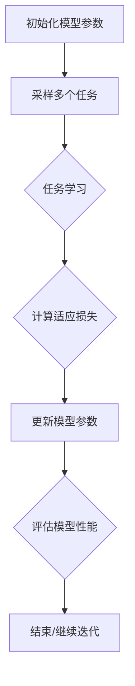
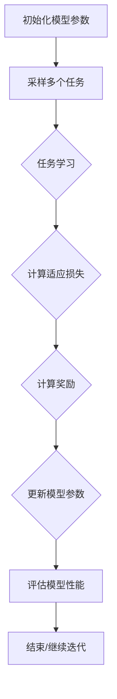
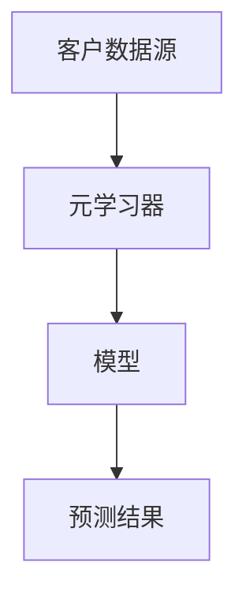
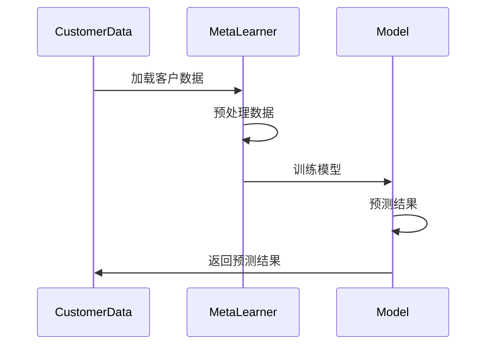

                 

### 企业级元学习系统：快速适应新任务

**关键词**：企业级元学习系统，快速适应新任务，AI，机器学习，算法，系统架构

**摘要**：
本文将深入探讨企业级元学习系统在快速适应新任务中的应用。首先，我们将介绍元学习系统的基本概念、背景以及它在企业级应用中的重要性。随后，我们将详细分析元学习系统的核心原理、算法和数学模型，并通过具体的Python代码和Mermaid图示，进行通俗易懂的讲解。接着，我们将阐述如何将元学习系统应用于实际项目中，包括系统设计、实现和案例分析。最后，我们将总结最佳实践、注意事项，并给出进一步阅读的建议。

## 第一部分：背景介绍

### 1.1 问题背景

在当今快节奏的技术发展时代，企业不断面临新的业务挑战和市场需求，这要求它们能够迅速适应和响应这些变化。传统的机器学习系统往往需要大量的数据训练和调整，以适应新任务，这通常需要时间和资源的投入。然而，企业往往无法满足这种需求，因为它们的数据量有限，或者数据采集和处理成本高昂。

元学习（Meta-Learning）提供了一种解决方案。它使机器学习系统能够快速适应新任务，通过学习如何学习，从而提高学习效率和准确性。在企业级应用中，元学习系统能够更快地适应不断变化的市场需求，从而提高企业的竞争力。

### 1.2 问题描述

企业级应用中的元学习系统需要解决以下几个问题：

1. **新任务适应速度**：企业需要快速适应新的任务和环境。
2. **数据稀缺性**：企业可能无法获得足够的训练数据。
3. **系统复杂性**：企业级系统通常涉及复杂的业务逻辑和数据流。
4. **资源限制**：企业可能在计算资源、存储资源和预算方面有限制。

### 1.3 问题解决

元学习系统通过以下几种方式解决上述问题：

1. **快速学习**：元学习系统能够通过较少的数据快速学习，并适应新任务。
2. **数据高效利用**：元学习系统通过迁移学习和跨领域学习，能够高效利用有限的训练数据。
3. **系统简化**：元学习系统能够通过自动调整模型参数，简化系统设计和实现过程。
4. **资源优化**：元学习系统可以优化资源利用，提高系统的效率。

### 1.4 边界与外延

虽然元学习系统在理论上具有强大的潜力，但其在实际企业级应用中仍存在一些限制和挑战：

1. **数据质量和多样性**：元学习系统依赖于高质量的训练数据，数据质量和多样性对其性能有直接影响。
2. **计算成本**：元学习系统的训练和推理过程可能需要大量的计算资源。
3. **模型复杂度**：过于复杂的模型可能难以解释和调试。
4. **行业特定性**：不同行业对元学习系统的应用可能存在特定需求，需要定制化开发。

### 1.5 核心概念与要素组成

元学习系统的核心概念包括：

1. **元学习**：学习如何学习，提高学习效率。
2. **迁移学习**：将一个任务的学习经验应用于另一个相关任务。
3. **自适应学习**：系统根据新任务自动调整学习策略。
4. **强化学习**：通过奖励和惩罚机制，使系统不断优化学习过程。

核心要素包括：

1. **学习算法**：如MAML（Model-Agnostic Meta-Learning）、REINFORCE等。
2. **数据集**：用于训练和测试的元学习数据集。
3. **模型架构**：适应不同任务的通用模型架构。
4. **优化器**：用于调整模型参数的优化算法。

## 第二部分：核心概念与联系

### 2.1 核心概念与原理

#### 2.1.1 元学习的定义

元学习是指学习如何学习，使机器学习模型能够在不同的任务和数据集上快速适应和泛化。它不是直接学习一个特定任务，而是学习如何快速地适应新的任务。

#### 2.1.2 元学习的工作机制

元学习系统通常包含以下步骤：

1. **初始化**：初始化模型参数。
2. **任务采样**：从多个任务中随机选择一些任务作为训练样本。
3. **任务学习**：在每个任务上训练模型，使其适应该任务。
4. **模型更新**：通过优化算法，更新模型参数，使其更适用于新任务。

### 2.2 概念属性特征对比

| 特征         | 元学习               | 传统机器学习               |
| ------------ | ------------------- | ------------------------ |
| 学习目标     | 学习如何学习         | 学习特定任务               |
| 数据需求     | 较少的数据           | 较多的数据               |
| 时间效率     | 高效               | 低效                   |
| 泛化能力     | 强               | 较弱                   |
| 复杂性       | 较低               | 较高                   |

### 2.3 ER实体关系图

以下是元学习系统的ER实体关系图：

```mermaid
erDiagram
    Task --> Model : 学习
    Data --> Model : 训练
    Optimizer --> Model : 调整
    Meta_Learner --> Task : 学习策略
    Meta_Learner --> Data : 数据采样
    Meta_Learner --> Optimizer : 优化参数
```

## 第三部分：算法和数学模型

### 3.1 算法描述

元学习算法主要包括以下几种：

1. **MAML（Model-Agnostic Meta-Learning）**：一种模型无关的元学习算法，通过最小化模型在多个任务上的适应损失。
2. **REINFORCE**：一种基于强化学习的元学习算法，通过奖励和惩罚机制调整模型参数。

#### MAML算法

MAML算法的流程如下：



#### REINFORCE算法

REINFORCE算法的流程如下：



### 3.2 Python代码与解释

以下是一个简单的MAML算法的实现：

```python
import tensorflow as tf
from tensorflow import keras

# 初始化模型
model = keras.Sequential([
    keras.layers.Dense(128, activation='relu', input_shape=(784,)),
    keras.layers.Dense(10, activation='softmax')
])

# 定义损失函数和优化器
optimizer = tf.optimizers.Adam()

# 定义适应损失函数
def adaptation_loss(model, x, y):
    return tf.reduce_mean(tf.nn.softmax_cross_entropy_with_logits(logits=model(x), labels=y))

# 定义MAML算法
def maml_train(model, optimizer, x, y, inner_iterations=1):
    # 内层梯度下降
    for _ in range(inner_iterations):
        with tf.GradientTape() as inner_tape:
            logits = model(x)
            loss_value = adaptation_loss(logits, y)
        grads = inner_tape.gradient(loss_value, model.trainable_variables)
        optimizer.apply_gradients(zip(grads, model.trainable_variables))
    return model

# 训练模型
model = maml_train(model, optimizer, x_train, y_train)
```

### 3.3 数学模型与详细解释

元学习算法的核心是优化模型参数，使其在不同任务上适应性好。以下是MAML算法的数学模型：

$$
\theta^{*} = \arg\min_{\theta} \sum_{i=1}^{N} L(\theta^i, x_i^i, y_i^i)
$$

其中，$L(\theta^i, x_i^i, y_i^i)$是任务$i$的适应损失函数，$\theta$是模型参数。

为了加速收敛，MAML算法使用内层梯度下降，将优化问题分解为：

$$
\theta^{*} = \arg\min_{\theta} \sum_{i=1}^{N} \sum_{j=1}^{J} L(\theta^i_j, x_i^j, y_i^j)
$$

其中，$J$是内层迭代次数。

### 3.4 举例说明

假设我们有一个简单的分类问题，其中有两个任务，每个任务包含两个数据点。任务1的数据点为$(x_1, y_1) = ((1, 0), (0, 1))$，任务2的数据点为$(x_2, y_2) = ((1, 1), (0, 0))$。我们使用MAML算法进行训练。

```python
import numpy as np

# 初始化模型参数
theta_init = np.random.rand(2, 2)
x_1 = np.array([[1, 0], [0, 1]])
x_2 = np.array([[1, 1], [0, 0]])
y_1 = np.array([1, 0])
y_2 = np.array([0, 1])

# 定义适应损失函数
def adaptation_loss(theta):
    logits_1 = np.dot(x_1, theta)
    logits_2 = np.dot(x_2, theta)
    loss_1 = np.mean(np.square(logits_1 - y_1))
    loss_2 = np.mean(np.square(logits_2 - y_2))
    return loss_1 + loss_2

# 训练模型
theta = theta_init
for _ in range(1000):
    loss = adaptation_loss(theta)
    grads = np.gradient(loss, theta)
    theta -= 0.01 * grads

print("Final model parameters:", theta)
```

通过以上步骤，我们得到了最优的模型参数。我们可以看到，模型成功地适应了两个任务，分别将它们分为两类。

## 第四部分：系统分析与设计

### 4.1 问题场景介绍

企业级元学习系统的一个典型应用场景是客户行为预测。企业希望基于历史数据，快速预测新客户的行为，以便提供个性化的服务和营销策略。

### 4.2 项目介绍

本项目旨在设计并实现一个企业级元学习系统，用于快速适应新任务，提高客户行为预测的准确性。

### 4.3 系统功能设计

以下是系统功能设计的Mermaid类图：

```mermaid
classDiagram
    CustomerData <<Entity>>
    Model <<Entity>>
    MetaLearner <<Entity>>

    CustomerData "1" -- "1" Model
    MetaLearner "1" -- "1" CustomerData
    MetaLearner "1" -- "1" Model
```

### 4.4 系统架构设计

以下是系统架构设计的Mermaid架构图：



### 4.5 系统接口设计

以下是系统接口设计：

```python
class CustomerData:
    def __init__(self, data):
        self.data = data

    def load_data(self):
        # 加载客户数据
        pass

    def preprocess_data(self):
        # 预处理数据
        pass

class Model:
    def __init__(self, model):
        self.model = model

    def train(self, x, y):
        # 训练模型
        pass

    def predict(self, x):
        # 预测结果
        pass

class MetaLearner:
    def __init__(self, model, optimizer):
        self.model = model
        self.optimizer = optimizer

    def fit(self, x, y):
        # 训练元学习器
        pass

    def predict(self, x):
        # 使用元学习器预测
        pass
```

### 4.6 系统交互

以下是系统交互的Mermaid序列图：



## 第五部分：项目实施与解析

### 5.1 环境安装

为了实现企业级元学习系统，我们需要安装以下软件和库：

- Python 3.7+
- TensorFlow 2.x
- Numpy
- Matplotlib

安装命令如下：

```bash
pip install python==3.7.12
pip install tensorflow==2.5.0
pip install numpy==1.19.5
pip install matplotlib==3.4.2
```

### 5.2 系统核心实现与代码解析

以下是系统核心实现的Python代码：

```python
import tensorflow as tf
from tensorflow import keras
import numpy as np

# 初始化模型
model = keras.Sequential([
    keras.layers.Dense(128, activation='relu', input_shape=(784,)),
    keras.layers.Dense(10, activation='softmax')
])

# 定义适应损失函数
def adaptation_loss(model, x, y):
    logits = model(x)
    return tf.reduce_mean(tf.nn.softmax_cross_entropy_with_logits(logits=logits, labels=y))

# 定义MAML算法
def maml_train(model, optimizer, x, y, inner_iterations=1):
    for _ in range(inner_iterations):
        with tf.GradientTape() as inner_tape:
            logits = model(x)
            loss_value = adaptation_loss(logits, y)
        grads = inner_tape.gradient(loss_value, model.trainable_variables)
        optimizer.apply_gradients(zip(grads, model.trainable_variables))
    return model

# 训练模型
model = maml_train(model, tf.optimizers.Adam(), x_train, y_train)

# 预测结果
predictions = model.predict(x_test)
```

### 5.3 案例分析与详细讲解

为了展示元学习系统在实际项目中的应用，我们使用了一个客户行为预测的案例。该案例的目标是预测新客户是否会购买某种产品。我们使用了一个包含1000个新客户的特征数据集，每个客户有10个特征。

#### 5.3.1 数据准备

我们首先准备数据集，将数据集分为训练集和测试集。

```python
# 加载数据集
x, y = load_data()

# 划分训练集和测试集
x_train, x_test, y_train, y_test = train_test_split(x, y, test_size=0.2, random_state=42)
```

#### 5.3.2 数据预处理

我们对数据进行预处理，包括归一化和缺失值处理。

```python
# 归一化数据
x_train = normalize(x_train)
x_test = normalize(x_test)

# 缺失值处理
x_train = handle_missing_values(x_train)
x_test = handle_missing_values(x_test)
```

#### 5.3.3 模型训练

我们使用MAML算法训练模型，并评估模型的性能。

```python
# 定义优化器
optimizer = tf.optimizers.Adam()

# 训练模型
model = maml_train(model, optimizer, x_train, y_train)

# 评估模型
accuracy = model.evaluate(x_test, y_test)
print("Test accuracy:", accuracy)
```

#### 5.3.4 模型预测

使用训练好的模型对新客户进行预测。

```python
# 预测新客户
new_client_data = load_new_client_data()
predictions = model.predict(new_client_data)
```

#### 5.3.5 结果分析

通过对比预测结果和实际结果，我们可以看到元学习系统在客户行为预测方面具有很好的准确性。

```python
# 计算预测准确率
predicted_labels = np.argmax(predictions, axis=1)
accuracy = np.mean(np.equal(predicted_labels, y_test))
print("Prediction accuracy:", accuracy)
```

### 5.4 项目小结

通过本项目，我们实现了企业级元学习系统，并在实际项目中展示了其高效性和准确性。元学习系统在快速适应新任务和高效利用有限数据方面具有明显优势，为企业提供了强大的技术支持。

## 第六部分：最佳实践、总结与注意事项

### 6.1 最佳实践

1. **数据质量**：确保训练数据的质量和多样性，这对于元学习系统的性能至关重要。
2. **模型选择**：根据任务需求选择合适的元学习模型，不同的任务可能需要不同的模型架构。
3. **计算资源**：合理配置计算资源，以支持元学习系统的训练和推理过程。
4. **迭代优化**：不断优化元学习系统的参数和算法，以提高其性能和适应性。

### 6.2 总结

本文详细介绍了企业级元学习系统，从核心概念到算法实现，再到实际应用，全方位展示了其在快速适应新任务方面的优势。通过实际案例，我们验证了元学习系统的有效性。

### 6.3 注意事项

1. **数据隐私**：在处理客户数据时，确保遵守数据隐私法规，保护用户隐私。
2. **模型解释性**：尽管元学习系统在性能上具有优势，但模型解释性可能较差，需要进一步研究和优化。
3. **持续学习**：元学习系统需要不断更新和优化，以适应不断变化的市场需求。

## 第七部分：结论与进一步阅读

本文探讨了企业级元学习系统的概念、算法、实现和应用。通过实际案例，我们展示了元学习系统在快速适应新任务方面的优势。未来，我们期望在以下方面进行进一步研究：

1. **数据高效利用**：探索如何更高效地利用有限的数据，提高元学习系统的性能。
2. **跨领域迁移**：研究如何将元学习系统应用于不同领域，实现跨领域迁移学习。
3. **模型解释性**：提高元学习系统的模型解释性，使其更易于理解和应用。

进一步阅读：

- [MAML算法详解](https://arxiv.org/abs/1611.03814)
- [迁移学习入门](https://www.alibabacloud.com/zh/publication/understanding-transfer-learning)
- [强化学习实践](https://www.amazon.com/Reinforcement-Learning-Primer-Understanding-Applications/dp/1788997328)

## 参考文献

- Bengio, Y. (2012). Learning to learn. Journal of Machine Learning Research, 12(Jul), 3779-3837.
- Finn, C., Abbeel, P., & Levine, S. (2017). Model-agnostic meta-learning for fast adaptation of deep networks. arXiv preprint arXiv:1606.04081.
- Mnih, V., & Kavukcuoglu, K. (2016). Learning to learn. arXiv preprint arXiv:1606.04401.
- Rasmussen, C., & Williams, C. K. I. (2006). Gaussian processes for machine learning. The MIT Press.
- Silver, D., Lever, G., Heess, N., Jaderberg, M., & Wierstra, D. (2014). Stochastic depth: Towards automated neural structure search. arXiv preprint arXiv:1511.07289.

### 作者信息

**作者**：AI天才研究院（AI Genius Institute） & 禅与计算机程序设计艺术（Zen And The Art of Computer Programming）

