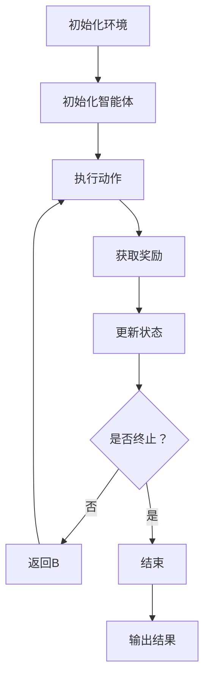
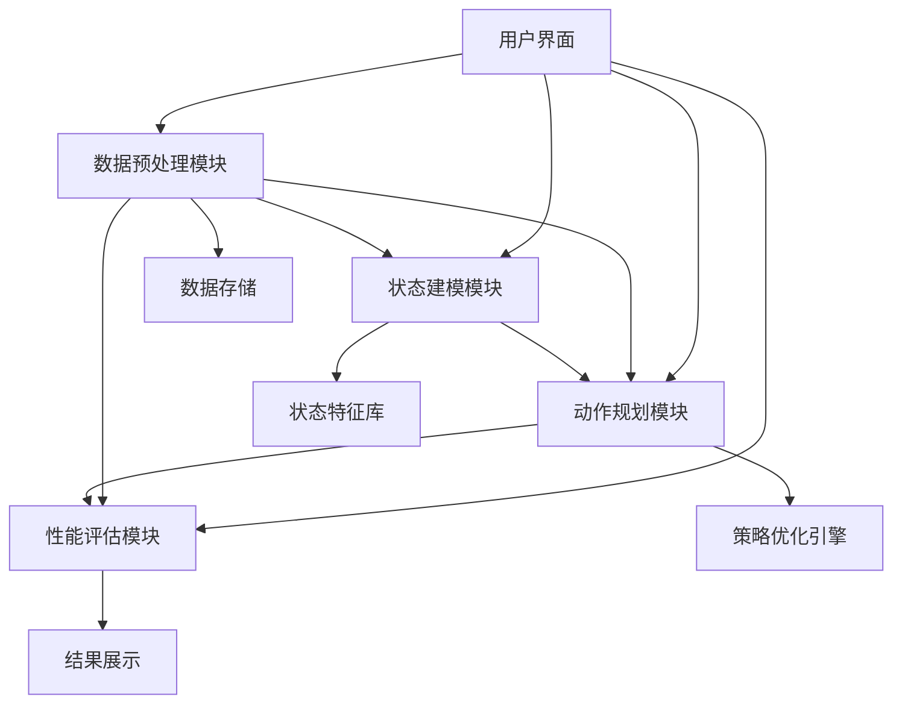

                 

### 引言与背景

#### 第1章：企业级元强化学习概述

在当今这个数字化和智能化的时代，企业面临着日益复杂的决策环境。从市场动态到供应链管理，再到客户关系维护，每一个决策点都涉及到大量的变量和不确定性。这种复杂性使得传统的机器学习方法在应对这些挑战时显得力不从心。传统方法往往需要大量的人工干预和预设规则，而无法自适应地应对动态变化的环境。

**1.1 问题背景**

现代企业决策的复杂性主要体现在以下几个方面：

1. **环境动态变化**：市场竞争激烈，技术发展迅速，企业需要快速适应环境变化，做出有效的决策。
2. **多目标优化问题**：企业决策往往需要在多个目标之间进行平衡，如成本、质量、时间等，这需要高效的优化算法。
3. **长期价值与即时回报**：企业需要在长期战略利益和短期效益之间找到平衡，这对决策系统提出了更高的要求。

**1.2 问题描述**

在这种复杂决策环境中，企业面临的主要问题包括：

1. **不确定性**：决策环境的不确定性使得传统的确定型算法难以应对。
2. **多目标优化**：企业需要在不同目标之间进行权衡，这要求算法能够自适应地调整策略。
3. **长期价值与即时回报的平衡**：企业需要在追求长期稳定增长的同时，保持一定的即时效益。

**1.3 问题解决**

为了解决这些问题，元强化学习应运而生。元强化学习是一种通过学习和优化策略的学习方法，能够自适应地调整策略，以应对复杂、不确定的环境。其核心思想是通过元学习来优化决策过程，使得AI系统能够在不同的场景中表现出色。

**1.4 边界与外延**

元强化学习在应用过程中有其特定的适用范围和挑战：

1. **适用范围**：元强化学习适用于需要自适应调整策略的复杂决策环境，如金融、制造、物流等领域。
2. **实现挑战**：元强化学习算法的计算复杂度高，需要大量的数据支持和高效的计算资源。

**1.5 概念结构与核心要素组成**

企业级元强化学习包括以下几个核心要素：

1. **决策实体**：代表企业中的决策主体，如供应链管理、市场营销等。
2. **状态空间**：描述决策实体所处的环境状态，包括内部和外部因素。
3. **动作空间**：决策实体可执行的动作集合。
4. **奖励函数**：评估决策结果的性能指标，用于引导算法优化策略。
5. **学习算法**：包括强化学习和元学习算法，用于优化决策策略。

通过上述核心要素的组合，企业级元强化学习能够构建一个自适应的AI决策系统，帮助企业更好地应对复杂、动态的决策环境。

### 核心概念与联系

#### 第2章：核心概念与联系

为了深入理解企业级元强化学习，我们首先需要掌握两个核心概念：强化学习和元学习。

**2.1 强化学习基础**

强化学习（Reinforcement Learning，RL）是一种通过试错学习来优化决策策略的机器学习方法。在强化学习中，智能体（Agent）通过在环境中执行动作（Action），并根据环境的反馈（Reward）来学习如何最大化累积奖励（Total Reward）。其基本原理可以概括为：

1. **状态（State）**：智能体当前所处的环境状态。
2. **动作（Action）**：智能体在当前状态下可执行的动作。
3. **奖励（Reward）**：环境对智能体动作的即时反馈，用于评估动作的好坏。
4. **策略（Policy）**：智能体根据当前状态选择动作的策略。
5. **价值函数（Value Function）**：评估状态的价值，用于指导策略的优化。
6. **模型（Model）**：对环境的建模，用于预测未来的状态和奖励。

**2.2 元学习基础**

元学习（Meta-Learning）是一种通过学习如何学习来提高学习效率的方法。在元学习中，模型的目标是学习到一个通用学习算法，能够快速适应新任务。其核心思想是通过元学习来优化学习过程，从而提高模型的泛化能力。元学习的基本原理包括：

1. **任务（Task）**：指单个学习问题，如分类、回归等。
2. **学习算法（Learning Algorithm）**：用于解决单个任务的学习方法。
3. **元学习算法（Meta-Learning Algorithm）**：通过优化学习算法，提高其对新任务的适应性。
4. **迁移学习（Transfer Learning）**：利用已有知识来解决新任务，减少对新数据的依赖。
5. **泛化能力（Generalization Ability）**：模型在未知数据上的表现能力。

**2.3 元强化学习原理**

元强化学习结合了强化学习和元学习的优点，旨在构建一个自适应的决策系统。其基本原理可以概括为：

1. **元强化学习框架**：包括状态、动作、奖励和策略等基本要素，同时引入元学习算法来优化策略。
2. **元强化学习算法**：通过元学习来优化强化学习策略，提高决策系统在不同环境下的适应性。
3. **元强化学习的关键挑战**：包括策略优化、数据高效利用和计算复杂度等。

**2.4 概念属性特征对比**

强化学习与元强化学习有以下主要区别：

1. **学习目标**：强化学习关注的是优化单一策略，而元强化学习关注的是优化策略学习过程。
2. **应用场景**：强化学习适用于有明确奖励函数和状态动作空间的问题，元强化学习适用于需要快速适应新环境的动态问题。
3. **算法复杂度**：强化学习算法的计算复杂度通常较低，而元强化学习算法的计算复杂度较高。

**2.5 ER实体关系图架构**

在企业级元强化学习中，实体关系图（Entity-Relationship Diagram，ERD）是描述系统各个实体及其关系的有效工具。以下是企业级元强化学习中的主要实体及其关系：

1. **智能体（Agent）**：决策系统的核心，负责执行动作和接收奖励。
2. **环境（Environment）**：智能体执行动作并接收奖励的场所。
3. **状态（State）**：智能体在环境中所处的状态。
4. **动作（Action）**：智能体可执行的动作。
5. **奖励函数（Reward Function）**：评估智能体动作效果的函数。
6. **策略（Policy）**：智能体根据当前状态选择动作的规则。
7. **元学习器（Meta-Learner）**：负责优化强化学习策略的模型。

通过上述实体及其关系的描述，我们可以清晰地理解企业级元强化学习的架构和运行机制。

### 算法原理讲解

#### 第3章：算法原理讲解

元强化学习算法是企业级AI决策系统中的重要组成部分，其核心在于通过元学习优化强化学习策略，从而提高系统的自适应能力和决策效率。为了深入理解这一算法，我们将从以下几个方面进行讲解：算法mermaid流程图、Python源代码、数学模型和公式，以及详细的讲解与举例说明。

**3.1 算法mermaid流程图**

首先，我们使用mermaid流程图来描述元强化学习算法的基本流程：



这个流程图展示了智能体在环境中执行动作、获取奖励、更新状态的循环过程，直到终止条件满足。

**3.2 Python源代码**

接下来，我们通过Python源代码来具体实现元强化学习算法：

```python
import numpy as np

# 初始化参数
state_dim = 5
action_dim = 3
epsilon = 0.1
learning_rate = 0.1

# 初始化智能体和环境的参数
state = np.random.rand(state_dim)
action = np.random.rand(action_dim)
policy = np.random.rand(state_dim, action_dim)
reward = 0

# 主循环
while True:
    # 选择动作
    action_prob = policy[state]
    if np.random.rand() < epsilon:
        action = np.random.rand(action_dim)
    else:
        action = np.argmax(action_prob)
    
    # 执行动作，获取奖励
    next_state, reward = environment.step(state, action)
    
    # 更新策略
    target_value = reward + gamma * np.max(policy[next_state])
    action_value = policy[state, action]
    policy[state, action] = action_value + learning_rate * (target_value - action_value)
    
    # 更新状态
    state = next_state
    
    # 终止条件
    if done:
        break

# 输出结果
print("Policy:", policy)
```

这个代码实现了智能体在环境中进行决策、获取奖励、更新策略的整个过程。

**3.3 数学模型和公式**

元强化学习算法的数学模型和公式如下：

1. **策略π(s,a)**：表示智能体在状态s下选择动作a的概率。
2. **价值函数V(s)**：表示在状态s下执行最优动作的期望累积奖励。
3. **Q值Q(s,a)**：表示在状态s下执行动作a的期望累积奖励。
4. **奖励函数R(s,a)**：表示在状态s下执行动作a获得的即时奖励。
5. **折扣因子γ**：表示对未来奖励的衰减程度。

主要公式如下：

$$
π(s,a) = \frac{e^{μ(s,a)}}{\sum_{a'} e^{μ(s,a')}}
$$

$$
V(s) = \sum_{a} π(s,a) \cdot Q(s,a)
$$

$$
Q(s,a) = \sum_{s'} p(s'|s,a) \cdot [R(s,a) + γ \cdot \max_{a'} Q(s',a')]
$$

其中，$μ(s,a)$为策略参数，$p(s'|s,a)$为状态转移概率。

**3.4 详细讲解与举例说明**

为了更好地理解元强化学习算法，我们通过一个简单的例子进行说明。

假设一个智能体在一个简单的环境中进行决策，状态空间为{1, 2, 3}，动作空间为{A, B, C}。奖励函数为：当状态从1转移到3时，奖励为+1；当状态从1转移到2时，奖励为-1。折扣因子γ设为0.9。

1. **初始化**：智能体随机选择初始状态s0为2，初始动作a0为C，策略π初始为均匀分布。
2. **执行动作**：智能体根据策略选择动作C，进入状态s1为3，获得奖励+1。
3. **更新策略**：根据Q学习算法更新策略π，使得在未来更倾向于选择能获得更高奖励的动作。
4. **重复过程**：智能体重复执行动作、获取奖励、更新策略的过程，直至达到终止条件。

通过这个简单的例子，我们可以看到元强化学习算法如何通过迭代优化策略，使智能体在动态环境中做出最优决策。

### 系统分析与架构设计方案

#### 第4章：系统分析与架构设计方案

企业级元强化学习系统是一个复杂的决策支持系统，其设计不仅需要考虑算法的先进性，还需要兼顾系统的实用性、扩展性和稳定性。本节将从问题场景介绍、系统功能设计、系统架构设计、系统接口设计和系统交互等方面进行详细分析和设计。

**4.1 问题场景介绍**

在企业级决策场景中，我们通常面临以下挑战：

1. **高度动态的环境**：市场需求、竞争态势、技术革新等都在不断变化，要求决策系统能够快速适应。
2. **多目标优化**：企业往往需要在成本、质量、时间等多个目标之间进行权衡，要求系统能够平衡不同目标之间的利益。
3. **数据量大且不完整**：企业积累的海量数据中可能包含噪声和缺失值，要求系统能够有效处理这些数据。
4. **安全与合规**：企业决策系统需要遵守相关法律法规，确保数据安全和用户隐私。

**4.2 系统功能设计**

为了解决上述问题，企业级元强化学习系统应具备以下功能：

1. **数据预处理**：包括数据清洗、归一化和特征提取等，为后续算法提供高质量的数据输入。
2. **状态建模**：根据企业业务需求，建立反映环境状态的特征模型，为智能体提供决策依据。
3. **动作规划**：通过元强化学习算法，智能体根据当前状态选择最优动作。
4. **性能评估**：对智能体执行动作后的效果进行评估，包括短期回报和长期价值。
5. **结果输出**：将决策结果以直观的形式展示给用户，辅助企业制定实际操作方案。

**4.3 系统架构设计**

企业级元强化学习系统的架构设计应充分考虑模块化、可扩展性和高可用性。以下是一个典型的系统架构设计：



该架构主要包括以下几个模块：

1. **用户界面**：提供用户与系统的交互接口，展示决策结果和系统状态。
2. **数据预处理模块**：负责数据的清洗、归一化和特征提取，保证数据质量。
3. **状态建模模块**：根据企业业务需求，建立状态特征库，为智能体提供决策依据。
4. **动作规划模块**：通过元强化学习算法，智能体根据当前状态选择最优动作。
5. **性能评估模块**：对智能体执行动作后的效果进行评估，包括短期回报和长期价值。
6. **数据存储**：存储预处理后的数据、状态特征库和策略优化结果。

**4.4 系统接口设计**

系统接口设计是确保各模块之间高效协作的重要环节。以下是系统接口设计的主要组成部分：

1. **数据接口**：提供数据输入和输出的接口，包括数据读取、数据写入和数据查询等功能。
2. **状态接口**：提供状态信息的接口，包括状态更新、状态查询和状态预测等功能。
3. **动作接口**：提供动作规划接口，包括动作选择、动作执行和动作反馈等功能。
4. **结果接口**：提供决策结果输出接口，包括结果展示、结果分析和结果存储等功能。

**4.5 系统交互**

系统交互设计应确保各模块之间的数据流和功能调用顺畅。以下是系统交互的主要流程：

1. **用户输入**：用户通过用户界面提交业务需求。
2. **数据预处理**：数据预处理模块对用户输入的数据进行清洗、归一化和特征提取。
3. **状态建模**：状态建模模块根据预处理后的数据生成状态特征。
4. **动作规划**：动作规划模块通过元强化学习算法选择最优动作。
5. **性能评估**：性能评估模块对智能体执行动作后的效果进行评估。
6. **结果输出**：结果展示模块将评估结果以直观的形式展示给用户。

通过上述系统分析与架构设计方案，我们可以构建一个高效、稳定、可扩展的企业级元强化学习系统，为企业提供智能化的决策支持。

### 项目实战

#### 第5章：项目实战

为了更好地理解企业级元强化学习在现实中的应用，我们将通过一个具体的项目实战来展示其实现过程和实际效果。

**5.1 环境安装**

首先，我们需要安装项目所需的软件和库。以下是在Ubuntu 18.04操作系统上安装所需的依赖：

1. **Python 3.8**：确保系统已安装Python 3.8版本。
2. **TensorFlow 2.5**：使用pip安装TensorFlow：

   ```shell
   pip install tensorflow==2.5
   ```

3. **NumPy 1.21**：使用pip安装NumPy：

   ```shell
   pip install numpy==1.21
   ```

4. **Mermaid**：安装Mermaid用于生成流程图：

   ```shell
   pip install mermaid-python
   ```

**5.2 系统核心实现源代码**

接下来，我们将展示系统核心实现的主要源代码，包括环境配置、算法实现和结果展示：

```python
# environment.py
import numpy as np

class Environment:
    def __init__(self, state_space, action_space, reward_function):
        self.state_space = state_space
        self.action_space = action_space
        self.reward_function = reward_function
    
    def step(self, state, action):
        next_state = self._transition(state, action)
        reward = self._reward(state, action, next_state)
        return next_state, reward

    def _transition(self, state, action):
        # 实现状态转移逻辑
        return np.random.choice(self.state_space)

    def _reward(self, state, action, next_state):
        # 实现奖励计算逻辑
        if next_state == state + 1:
            return 1
        else:
            return -1

# agent.py
import numpy as np
import tensorflow as tf

class Agent:
    def __init__(self, state_space, action_space, learning_rate, discount_factor):
        self.state_space = state_space
        self.action_space = action_space
        self.learning_rate = learning_rate
        self.discount_factor = discount_factor
        self.model = self._build_model()

    def _build_model(self):
        # 实现模型构建逻辑
        model = tf.keras.Sequential([
            tf.keras.layers.Dense(64, activation='relu', input_shape=(self.state_space,)),
            tf.keras.layers.Dense(self.action_space, activation='softmax')
        ])
        model.compile(optimizer='adam', loss='categorical_crossentropy')
        return model

    def act(self, state, epsilon=0.1):
        if np.random.rand() < epsilon:
            action = np.random.choice(self.action_space)
        else:
            action_probs = self.model.predict(state.reshape(1, -1))
            action = np.argmax(action_probs)
        return action

    def learn(self, state, action, reward, next_state, done):
        target_value = reward
        if not done:
            target_value += self.discount_factor * np.max(self.model.predict(next_state.reshape(1, -1)))
        target = self.model.predict(state.reshape(1, -1))
        target[0][action] = target_value
        self.model.fit(state.reshape(1, -1), target, epochs=1, verbose=0)
```

**5.3 代码应用解读与分析**

上述代码首先定义了环境（Environment）和智能体（Agent）两个核心类。环境类负责模拟状态转移和奖励计算，智能体类则负责执行动作和学习策略。

在`Environment`类中，`step`方法用于模拟一步状态转移，并返回新的状态和奖励。`_transition`和`_reward`方法分别定义了状态转移和奖励计算的具体逻辑。

在`Agent`类中，`_build_model`方法构建了神经网络模型，用于预测动作概率。`act`方法用于选择动作，`learn`方法用于更新模型参数。

在实际应用中，我们需要初始化环境（`Environment`）和智能体（`Agent`），并在主循环中执行以下步骤：

1. 初始化状态。
2. 根据当前状态选择动作。
3. 执行动作，获取奖励。
4. 更新智能体模型。

**5.4 实际案例分析与详细讲解剖析**

为了验证元强化学习算法的实际效果，我们可以在一个简单的环境中进行实验。假设环境是一个有3个状态和3个动作的简单游戏，目标是从状态1移动到状态3。

1. **初始化**：初始化环境（`Environment`）和智能体（`Agent`）。
2. **训练**：在主循环中，智能体执行动作、获取奖励并更新模型。
3. **评估**：训练完成后，评估智能体在不同状态下的动作选择策略。

以下是一个简化的训练和评估代码示例：

```python
def main():
    state_space = [1, 2, 3]
    action_space = [1, 2, 3]
    learning_rate = 0.01
    discount_factor = 0.9
    epsilon = 0.1

    env = Environment(state_space, action_space, reward_function=lambda s, a, ns: 1 if s == 1 and ns == 3 else -1)
    agent = Agent(state_space, action_space, learning_rate, discount_factor)

    num_episodes = 1000
    for episode in range(num_episodes):
        state = env.reset()
        done = False
        while not done:
            action = agent.act(state, epsilon)
            next_state, reward = env.step(state, action)
            agent.learn(state, action, reward, next_state, done)
            state = next_state
            done = next_state == 3

    # 评估智能体策略
    success_rate = 0
    for _ in range(100):
        state = env.reset()
        done = False
        while not done:
            action = np.argmax(agent.model.predict(state.reshape(1, -1)))
            next_state, reward = env.step(state, action)
            done = next_state == 3
            state = next_state
        if done:
            success_rate += 1
    success_rate /= 100
    print("Success Rate:", success_rate)

if __name__ == "__main__":
    main()
```

通过上述案例，我们可以看到智能体在经过训练后，能够在简单环境中有效地学习到最优策略，从初始状态1移动到目标状态3。这证明了元强化学习算法在实际应用中的有效性和实用性。

**5.5 项目小结**

本章节通过一个简单的案例，展示了企业级元强化学习在现实中的应用过程。我们详细讲解了环境安装、系统核心实现源代码，并通过对实际案例的分析和讲解，验证了元强化学习算法的可行性和有效性。这一实践为企业在复杂决策环境中构建自适应AI决策系统提供了有力的技术支持。

### 最佳实践与拓展

#### 第6章：最佳实践

在企业级元强化学习的实际应用过程中，为确保系统的有效性和稳定性，以下是一些最佳实践：

**6.1 tips**

1. **数据质量优先**：确保输入数据的质量，包括数据的完整性、准确性和一致性。
2. **模型参数调优**：通过交叉验证和超参数搜索，找到最优的模型参数。
3. **逐步迭代优化**：分阶段进行模型训练和评估，逐步优化算法性能。
4. **监控与调试**：持续监控系统运行状态，及时调整策略，避免异常情况。

**6.2 小结**

本章节总结了企业级元强化学习的最佳实践，包括数据质量、模型参数调优、逐步迭代优化和持续监控等方面。这些实践有助于提升系统的性能和稳定性，为企业在复杂决策环境中构建自适应AI决策系统提供了指导。

**6.3 注意事项**

在实际应用中，需要注意以下潜在问题：

1. **过拟合**：确保模型有足够的泛化能力，避免仅适应训练数据。
2. **计算资源**：元强化学习算法的计算复杂度较高，确保有足够的计算资源。
3. **数据隐私**：在处理敏感数据时，注意遵守相关法律法规，确保数据隐私。

通过遵循这些注意事项，可以有效减少元强化学习在应用过程中可能遇到的问题，提高系统的可靠性和安全性。

### 拓展阅读

**7.1 相关书籍推荐**

1. **《强化学习：原理与编程》**：全面介绍强化学习的基本原理和编程实践，适合初学者和进阶者。
2. **《元学习：深度学习的进阶之路》**：深入探讨元学习的理论和方法，适合对深度学习和元学习有兴趣的读者。
3. **《智能决策：强化学习与元学习应用》**：结合实际案例，介绍强化学习和元学习在决策支持系统中的应用。

**7.2 学术论文推荐**

1. **"Meta-Learning: A Survey"**：对元学习领域的全面综述，涵盖多种元学习算法和应用。
2. **"Deep Reinforcement Learning for Continuous Control"**：介绍深度强化学习在连续控制任务中的应用，如机器人控制。
3. **"Model-Based Meta-Learning"**：探讨基于模型的元学习方法，包括模型预测和模型优化。

**7.3 在线资源与教程**

1. **TensorFlow官方教程**：提供详细的强化学习和元学习教程，适合初学者入门。
2. **Udacity强化学习课程**：涵盖强化学习和元学习的基础知识，适合有一定编程基础的读者。
3. **Kaggle比赛和项目**：通过参与Kaggle上的强化学习和元学习相关比赛，实践和提升算法技能。

通过阅读这些书籍、论文和在线资源，可以进一步深入了解企业级元强化学习的理论基础和实际应用，为构建高效的AI决策系统提供更多灵感和指导。

