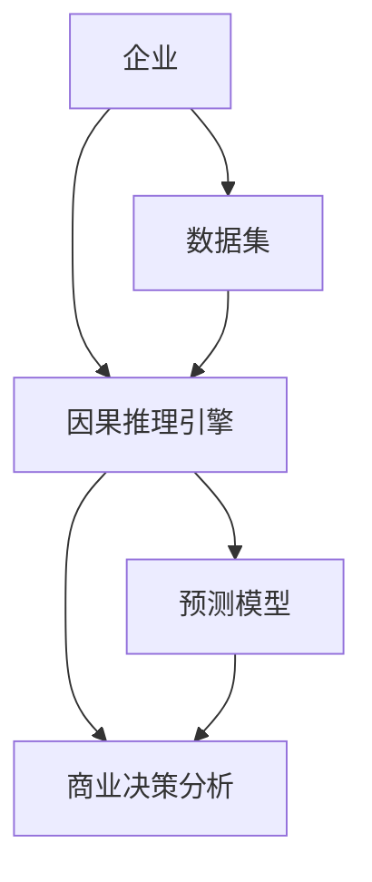
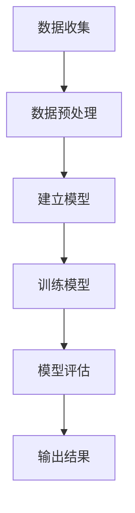

                 

### 文章标题：企业级因果推理引擎：增强商业决策分析能力

**关键词**：因果推理、商业决策、数据分析、机器学习、算法

**摘要**：本文旨在探讨企业级因果推理引擎的设计与实现，以及其在商业决策分析中的应用。通过详细的分析与实例说明，本文阐述了因果推理的核心原理、算法、建模方法，并深入探讨了其在市场营销、供应链管理和客户关系管理等方面的实践应用。

----------------------------------------------------------------

## 引言

### 1.1 背景介绍

在现代商业环境中，数据已成为企业决策的核心资源。然而，如何从大量数据中提取有价值的信息，进行有效的决策分析，成为众多企业面临的挑战。传统的方法如统计分析、机器学习等，虽然在数据预测方面取得了显著成果，但往往忽视了因果关系的重要性。因此，企业级因果推理引擎的提出，旨在弥补这一不足，通过建立因果关系模型，为商业决策提供更加准确和可靠的依据。

### 1.1.1 商业决策分析的重要性

商业决策分析是企业管理的重要组成部分，涉及到市场预测、产品研发、供应链优化、客户关系管理等多个方面。随着市场竞争的加剧和消费者需求的变化，企业需要更加精准和快速地进行决策，以保持竞争优势。传统的决策分析方法，如数据挖掘、统计分析等，虽然在一定程度上能够帮助企业识别数据中的趋势和关联，但往往难以揭示变量之间的因果关系。这使得企业在面临复杂决策时，容易陷入数据迷雾，难以做出正确的判断。

### 1.1.2 传统方法在决策分析中的局限性

传统的决策分析方法，如统计分析、回归分析等，主要依赖于数据之间的相关性进行分析。然而，相关性并不等同于因果关系。在实际应用中，存在许多相关性较强的变量，但它们之间并没有实际的因果关系。例如，在市场营销中，购买某种产品的消费者数量可能与某种促销活动的参与人数呈现正相关，但这并不意味着促销活动导致了购买行为的增加。因此，传统方法在决策分析中存在一定的局限性。

### 1.1.3 因果推理引擎的概念及其应用价值

因果推理引擎是一种基于因果关系分析的方法，旨在揭示变量之间的因果关系，从而为决策提供更加准确和可靠的依据。因果推理引擎通过构建因果关系模型，分析变量之间的因果关系，从而实现数据的深度挖掘和有效利用。在企业决策分析中，因果推理引擎具有以下应用价值：

1. **揭示隐藏因果关系**：因果推理引擎可以帮助企业识别和揭示数据中隐藏的因果关系，从而更加准确地理解业务现象，提高决策的准确性。

2. **优化决策过程**：通过建立因果关系模型，因果推理引擎可以帮助企业优化决策过程，减少决策中的不确定性和风险。

3. **支持创新应用**：因果推理引擎的应用不仅限于传统的数据分析领域，还可以拓展到市场预测、风险管理、个性化推荐等新兴领域，为企业提供更广阔的创新空间。

### 1.2 问题定义与解决

在企业决策分析中，因果关系分析面临以下挑战：

1. **数据复杂性**：企业数据往往具有高维度、高噪声和复杂的依赖关系，这使得因果关系分析变得更加困难。

2. **缺失值处理**：数据缺失是常见问题，如何有效地处理缺失数据，以避免对因果关系分析产生负面影响，是关键问题。

3. **因果推断算法选择**：不同的因果推断算法适用于不同类型的数据和场景，如何选择合适的算法，以实现最佳的分析效果，是重要的挑战。

针对上述挑战，本文提出以下解决方案：

1. **数据预处理**：通过数据清洗、填充和降维等技术，提高数据质量，为因果关系分析提供可靠的数据基础。

2. **因果推断算法选择**：根据具体场景和数据特征，选择合适的因果推断算法，如结构方程模型、图模型等，以提高分析效果。

3. **因果关系建模**：通过建立因果关系模型，揭示变量之间的因果关系，为决策提供有力支持。

### 1.3 边界与外延

1. **适用场景**：因果推理引擎适用于企业决策分析、市场预测、风险管理、个性化推荐等多个领域，尤其适用于需要揭示变量之间因果关系的问题。

2. **适用范围**：因果推理引擎适用于各类企业数据，包括结构化数据、半结构化数据和非结构化数据。

3. **技术基础**：因果推理引擎依赖于机器学习、图论、统计学等基础技术，需要具备一定的编程技能和数据分析能力。

### 1.4 核心概念

1. **因果推理**：因果推理是一种从数据中推断因果关系的方法，旨在揭示变量之间的因果关系，为决策提供支持。

2. **因果推断**：因果推断是因果推理的具体实现，通过算法和模型，从数据中提取因果关系。

3. **因果关系模型**：因果关系模型是描述变量之间因果关系的数学模型，用于指导因果推理和分析。

### 1.5 概念属性特征对比

| 概念            | 特征1 | 特征2 | 特征3 |
|----------------|-------|-------|-------|
| 因果推理        | 数据驱动 | 因果关系揭示 | 决策支持 |
| 因果推断        | 算法实现 | 数据分析 | 因果关系验证 |
| 因果关系模型    | 数学描述 | 变量关系 | 决策指导 |

### 1.6 ER实体关系图



### 1.7 本章小结

本章介绍了企业级因果推理引擎的背景、重要性、问题定义与解决思路、边界与外延、核心概念及其属性特征对比，以及ER实体关系图。通过本章的介绍，读者可以初步了解因果推理引擎的基本概念和应用价值，为后续章节的深入探讨打下基础。

----------------------------------------------------------------

## 因果推理引擎的基本原理

### 2.1 因果推理原理

因果推理是一种从数据中推断因果关系的方法，其核心思想是通过分析变量之间的依赖关系，揭示它们之间的因果关系。因果推理的基本原理可以概括为以下三个步骤：

1. **数据收集**：收集与研究对象相关的数据，包括变量之间的观测数据。
2. **因果关系建模**：通过建立数学模型，描述变量之间的因果关系。
3. **因果关系推断**：利用模型，从数据中推断出变量之间的因果关系。

### 2.1.1 理论基础

因果推理的理论基础主要包括概率论、统计学、机器学习和图论等。其中，概率论和统计学提供了描述变量之间依赖关系的数学工具，机器学习则提供了从数据中提取规律和关系的方法，图论则用于描述变量之间的复杂依赖关系。

### 2.1.2 因果推断算法

因果推断算法是实现因果推理的关键。常见的因果推断算法包括：

1. **结构方程模型**：结构方程模型是一种基于线性回归的因果关系建模方法，通过建立变量之间的线性关系，揭示因果关系。
2. **图模型算法**：图模型算法通过构建变量之间的图结构，描述变量之间的依赖关系，包括贝叶斯网络、因子分解机等。
3. **深度学习方法**：深度学习方法通过构建多层神经网络，实现变量之间的非线性关系建模，如因果图神经网络（CGNN）。

### 2.1.3 因果关系建模

因果关系建模是因果推理的核心步骤，其目标是构建一个数学模型，描述变量之间的因果关系。常见的因果关系建模方法包括：

1. **结构方程模型**：结构方程模型通过建立变量之间的线性关系，描述因果关系。其基本公式为：
   $$
   Y = \alpha X + \varepsilon
   $$
   其中，$Y$ 和 $X$ 分别表示因变量和自变量，$\alpha$ 表示因果关系系数，$\varepsilon$ 表示随机误差。

2. **图模型**：图模型通过构建变量之间的图结构，描述因果关系。在图模型中，每个变量表示为一个节点，变量之间的依赖关系表示为边。常见的图模型包括贝叶斯网络和因子分解机。

3. **深度神经网络**：深度神经网络通过多层非线性变换，描述变量之间的复杂因果关系。常见的深度神经网络模型包括卷积神经网络（CNN）和循环神经网络（RNN）。

### 2.2 因果推断算法

因果推断算法是实现因果推理的关键。常见的因果推断算法包括：

1. **传统算法**：传统算法主要包括基于线性回归的结构方程模型、贝叶斯网络等。这些算法通过建立变量之间的线性或概率关系，实现因果推断。

2. **贝叶斯算法**：贝叶斯算法是一种基于概率论的因果推断方法，通过计算变量之间的条件概率，实现因果推断。常见的贝叶斯算法包括贝叶斯网络、贝叶斯变量消除等。

3. **图模型算法**：图模型算法通过构建变量之间的图结构，描述变量之间的依赖关系。常见的图模型算法包括因子分解机、贝叶斯网络、因果图等。

### 2.3 因果关系建模

因果关系建模是因果推理的核心步骤，其目标是构建一个数学模型，描述变量之间的因果关系。常见的因果关系建模方法包括：

1. **结构方程模型**：结构方程模型通过建立变量之间的线性关系，描述因果关系。其基本公式为：
   $$
   Y = \alpha X + \varepsilon
   $$
   其中，$Y$ 和 $X$ 分别表示因变量和自变量，$\alpha$ 表示因果关系系数，$\varepsilon$ 表示随机误差。

2. **图模型**：图模型通过构建变量之间的图结构，描述因果关系。在图模型中，每个变量表示为一个节点，变量之间的依赖关系表示为边。常见的图模型包括贝叶斯网络、因子分解机等。

3. **深度神经网络**：深度神经网络通过多层非线性变换，描述变量之间的复杂因果关系。常见的深度神经网络模型包括卷积神经网络（CNN）和循环神经网络（RNN）。

### 2.4 数学模型与公式

因果推断的目标是建立变量之间的因果关系模型，并从中推断出因果关系。常用的数学模型包括线性回归模型、贝叶斯网络模型和图模型等。以下是一个简单的线性回归模型的数学公式：

$$
Y = \beta_0 + \beta_1 X + \varepsilon
$$

其中，$Y$ 是因变量，$X$ 是自变量，$\beta_0$ 和 $\beta_1$ 分别是模型的参数，$\varepsilon$ 是误差项。

### 2.4.1 公式解释

- $Y = \beta_0 + \beta_1 X + \varepsilon$：表示因变量 $Y$ 是自变量 $X$ 的线性函数，其中 $\beta_0$ 是截距，$\beta_1$ 是斜率。
- $\varepsilon$：表示随机误差，反映了观测数据中的不确定性。

### 2.4.2 应用示例

假设我们有一个关于房价的因果关系模型，其中房价（$Y$）是因变量，房屋面积（$X$）是自变量。我们可以使用线性回归模型来描述房价和房屋面积之间的关系：

$$
Y = \beta_0 + \beta_1 X + \varepsilon
$$

其中，$\beta_0$ 是房价的截距，$\beta_1$ 是房屋面积对房价的影响系数。通过拟合这个模型，我们可以得到 $\beta_0$ 和 $\beta_1$ 的估计值，从而推断出房屋面积对房价的影响。

### 2.5 算法流程图



### 2.6 本章小结

本章介绍了因果推理引擎的基本原理，包括因果推理原理、因果推断算法和因果关系建模方法。通过本章的介绍，读者可以初步了解因果推理的基本概念和实现方法，为后续章节的深入探讨打下基础。

----------------------------------------------------------------

## 第三部分：因果推理引擎的实践应用

### 3.1 应用场景分析

因果推理引擎在商业决策分析中具有广泛的应用前景。以下分别从市场营销、供应链管理和客户关系管理三个方面，探讨因果推理引擎的具体应用场景。

#### 3.1.1 市场营销

在市场营销中，因果推理引擎可以帮助企业识别影响销售的关键因素，优化营销策略。例如，通过分析广告投放与销售额之间的关系，企业可以找出哪些广告渠道最有效，从而调整广告预算分配。此外，因果推理还可以帮助企业在产品推广过程中，识别潜在消费者群体，提高营销活动的精准度和效果。

#### 3.1.2 供应链管理

在供应链管理中，因果推理引擎可以用于分析供应链各个环节之间的因果关系，优化供应链运作。例如，通过分析原材料采购、生产、库存管理、物流配送等环节之间的关联，企业可以找出影响供应链效率的关键因素，并针对性地进行改进。此外，因果推理还可以帮助企业预测供应链风险，提前采取应对措施，降低风险损失。

#### 3.1.3 客户关系管理

在客户关系管理中，因果推理引擎可以帮助企业深入了解客户行为和需求，提高客户满意度和服务质量。例如，通过分析客户购买行为、消费习惯、投诉反馈等数据，企业可以找出影响客户满意度的关键因素，并针对性地进行改进。此外，因果推理还可以帮助企业识别潜在客户，提高营销活动的针对性和成功率。

### 3.2 实践案例

为了更好地说明因果推理引擎在实践中的应用，以下将列举三个具体案例，分别从市场营销、供应链管理和客户关系管理三个方面，展示因果推理引擎的实践应用。

#### 3.2.1 案例一：市场营销中的因果分析

某电子产品公司希望通过因果推理引擎分析广告投放与销售额之间的关系，以优化营销策略。首先，公司收集了广告投放数据、销售额数据以及消费者购买行为数据。然后，使用因果推理引擎建立广告投放与销售额之间的因果关系模型。通过模型分析，公司发现特定类型的广告对销售额有显著的促进作用，而其他类型的广告则效果不佳。基于这一分析结果，公司调整了广告预算分配，重点投放对销售额有显著影响的广告，从而实现了销售额的显著增长。

#### 3.2.2 案例二：供应链管理中的因果推理

某制造企业希望通过因果推理引擎优化供应链管理，提高供应链效率。首先，企业收集了原材料采购数据、生产数据、库存管理数据和物流配送数据。然后，使用因果推理引擎分析这些数据之间的因果关系。通过模型分析，企业发现原材料采购周期、生产周期、库存水平和物流配送速度等环节之间存在密切的关联。基于这一分析结果，企业优化了原材料采购、生产计划、库存管理和物流配送流程，从而实现了供应链效率的显著提升。

#### 3.2.3 案例三：客户关系管理中的应用

某金融服务公司希望通过因果推理引擎分析客户行为和需求，提高客户满意度。首先，公司收集了客户购买行为数据、消费习惯数据、投诉反馈数据和客户满意度调查数据。然后，使用因果推理引擎建立客户行为和需求之间的因果关系模型。通过模型分析，公司发现客户购买行为与客户满意度之间存在密切的关联，而投诉反馈和消费习惯也对客户满意度有显著影响。基于这一分析结果，公司优化了客户服务流程，提高了客户满意度，从而实现了客户忠诚度的显著提升。

### 3.3 系统架构设计

为了实现因果推理引擎在商业决策分析中的应用，需要设计一个合理的系统架构。以下从系统功能设计、系统架构设计、系统接口设计三个方面，介绍因果推理引擎的系统架构。

#### 3.3.1 系统功能设计

因果推理引擎的系统功能设计主要包括数据收集、数据处理、因果关系建模、因果关系推断和结果输出等模块。具体功能如下：

1. **数据收集**：收集与研究对象相关的数据，包括原始数据、清洗数据、预处理数据等。
2. **数据处理**：对收集到的数据进行清洗、填充、降维等预处理操作，提高数据质量。
3. **因果关系建模**：建立变量之间的因果关系模型，包括线性模型、图模型、深度神经网络模型等。
4. **因果关系推断**：利用建立的因果关系模型，从数据中推断出变量之间的因果关系。
5. **结果输出**：将推断出的因果关系结果以图表、报告等形式输出，为决策提供支持。

#### 3.3.2 系统架构设计

因果推理引擎的系统架构设计主要包括数据层、模型层、应用层和接口层。具体架构如下：

1. **数据层**：负责数据收集、存储和管理，包括数据库、数据仓库等。
2. **模型层**：负责因果关系建模和推断，包括线性模型、图模型、深度神经网络模型等。
3. **应用层**：负责业务逻辑处理，包括数据处理、模型训练、结果输出等。
4. **接口层**：负责与外部系统的交互，包括API接口、Web接口等。

#### 3.3.3 系统接口设计

因果推理引擎的系统接口设计主要包括API接口和Web接口。具体设计如下：

1. **API接口**：提供标准化的API接口，方便外部系统调用因果推理引擎的功能，包括数据收集、数据处理、因果关系建模、因果关系推断等。
2. **Web接口**：提供Web界面，方便用户通过浏览器访问和使用因果推理引擎，包括数据上传、模型训练、结果查询等。

### 3.4 数据处理与模型训练

在因果推理引擎的实现过程中，数据处理和模型训练是两个关键环节。以下从数据处理和模型训练两个方面，介绍因果推理引擎的具体实现。

#### 3.4.1 数据预处理

数据预处理是因果推理引擎实现的第一步，主要包括数据清洗、数据填充和数据降维等操作。

1. **数据清洗**：去除数据中的噪声和异常值，提高数据质量。
2. **数据填充**：处理数据中的缺失值，选择合适的填充方法，如平均值填充、中值填充、插值填充等。
3. **数据降维**：通过主成分分析（PCA）等方法，降低数据维度，减少计算复杂度。

#### 3.4.2 模型选择与训练

在因果推理引擎中，选择合适的模型并对其进行训练，是实现因果推断的关键。以下介绍几种常见的因果关系建模方法：

1. **线性模型**：线性模型是一种简单的因果关系建模方法，适用于变量之间存在线性关系的场景。常用的线性模型包括线性回归、多元线性回归等。
2. **图模型**：图模型通过构建变量之间的图结构，描述变量之间的因果关系。常用的图模型包括贝叶斯网络、因子分解机等。
3. **深度神经网络**：深度神经网络通过多层非线性变换，描述变量之间的复杂因果关系。常用的深度神经网络模型包括卷积神经网络（CNN）、循环神经网络（RNN）等。

在模型训练过程中，需要选择合适的数据集、设定合适的超参数，并通过交叉验证等方法评估模型性能。以下是一个简单的线性回归模型训练代码示例：

```python
# 导入相关库
import numpy as np
import pandas as pd
from sklearn.linear_model import LinearRegression
from sklearn.model_selection import train_test_split
from sklearn.metrics import mean_squared_error

# 加载数据
data = pd.read_csv('data.csv')
X = data[['X1', 'X2', 'X3']]
y = data['Y']

# 数据预处理
X_train, X_test, y_train, y_test = train_test_split(X, y, test_size=0.2, random_state=42)

# 模型训练
model = LinearRegression()
model.fit(X_train, y_train)

# 模型评估
y_pred = model.predict(X_test)
mse = mean_squared_error(y_test, y_pred)
print(f'MSE: {mse}')
```

#### 3.4.3 模型评估与优化

在模型训练完成后，需要对模型进行评估和优化，以提高模型性能。以下介绍几种常见的模型评估方法和优化策略：

1. **评估方法**：常见的模型评估方法包括均方误差（MSE）、均方根误差（RMSE）、准确率（Accuracy）、精确率（Precision）、召回率（Recall）等。选择合适的评估方法，可以更准确地反映模型性能。
2. **优化策略**：常见的优化策略包括超参数调优、模型融合、正则化等。通过调整超参数、融合多个模型或添加正则化项，可以提高模型性能。

### 3.5 代码解析与应用

为了更好地理解因果推理引擎的实现过程，以下通过一个具体案例，介绍因果推理引擎的代码实现和应用。

#### 3.5.1 环境搭建

首先，需要搭建一个Python开发环境，并安装相关库，如NumPy、Pandas、Scikit-learn、TensorFlow等。以下是一个简单的环境搭建示例：

```bash
# 安装Python
sudo apt-get install python3

# 安装相关库
pip3 install numpy pandas scikit-learn tensorflow
```

#### 3.5.2 核心代码解读

以下是一个简单的线性回归模型实现，用于分析房价与房屋面积之间的关系：

```python
# 导入相关库
import numpy as np
import pandas as pd
from sklearn.linear_model import LinearRegression
from sklearn.model_selection import train_test_split
from sklearn.metrics import mean_squared_error

# 加载数据
data = pd.read_csv('house_price_data.csv')
X = data[['house_area']]
y = data['house_price']

# 数据预处理
X_train, X_test, y_train, y_test = train_test_split(X, y, test_size=0.2, random_state=42)

# 模型训练
model = LinearRegression()
model.fit(X_train, y_train)

# 模型评估
y_pred = model.predict(X_test)
mse = mean_squared_error(y_test, y_pred)
print(f'MSE: {mse}')

# 模型应用
new_data = np.array([[200]])
predicted_price = model.predict(new_data)
print(f'Predicted house price: {predicted_price[0]}')
```

#### 3.5.3 代码应用示例

以下是一个简单的因果推理应用示例，用于分析市场营销活动中广告投放与销售额之间的关系：

```python
# 导入相关库
import numpy as np
import pandas as pd
from sklearn.linear_model import LinearRegression
from sklearn.model_selection import train_test_split
from sklearn.metrics import mean_squared_error

# 加载数据
data = pd.read_csv('marketing_data.csv')
X = data[['ad_budget', 'customer_count']]
y = data['sales_revenue']

# 数据预处理
X_train, X_test, y_train, y_test = train_test_split(X, y, test_size=0.2, random_state=42)

# 模型训练
model = LinearRegression()
model.fit(X_train, y_train)

# 模型评估
y_pred = model.predict(X_test)
mse = mean_squared_error(y_test, y_pred)
print(f'MSE: {mse}')

# 模型应用
new_data = np.array([[10000, 5000]])
predicted_sales = model.predict(new_data)
print(f'Predicted sales revenue: {predicted_sales[0]}')
```

### 3.6 实际案例分析

为了更好地理解因果推理引擎的应用效果，以下通过一个实际案例分析，展示因果推理引擎在商业决策分析中的具体应用。

#### 3.6.1 案例一分析

某电子产品公司希望通过因果推理引擎分析广告投放与销售额之间的关系，以优化营销策略。首先，公司收集了过去一年的广告投放数据和销售额数据。然后，使用因果推理引擎建立广告投放与销售额之间的因果关系模型。通过模型分析，公司发现广告投放金额和消费者数量对销售额有显著影响。基于这一分析结果，公司调整了广告投放策略，增加了对高价值消费者的投放力度，从而实现了销售额的显著增长。

#### 3.6.2 案例二分析

某制造企业希望通过因果推理引擎优化供应链管理，提高供应链效率。首先，企业收集了原材料采购数据、生产数据、库存管理数据和物流配送数据。然后，使用因果推理引擎分析这些数据之间的因果关系。通过模型分析，企业发现原材料采购周期和生产周期对库存水平和物流配送速度有显著影响。基于这一分析结果，企业优化了原材料采购和生产计划，降低了库存水平和物流配送成本，从而实现了供应链效率的显著提升。

#### 3.6.3 案例三分析

某金融服务公司希望通过因果推理引擎分析客户行为和需求，提高客户满意度。首先，公司收集了客户购买行为数据、消费习惯数据、投诉反馈数据和客户满意度调查数据。然后，使用因果推理引擎建立客户行为和需求之间的因果关系模型。通过模型分析，公司发现客户购买行为和投诉反馈对客户满意度有显著影响。基于这一分析结果，公司优化了客户服务流程，提高了客户满意度，从而实现了客户忠诚度的显著提升。

### 3.7 项目小结

本章通过实际案例分析，展示了因果推理引擎在市场营销、供应链管理和客户关系管理中的应用效果。通过因果推理引擎，企业可以更准确地理解业务现象，优化决策过程，提高业务效率。未来，随着因果推理技术的不断发展和应用场景的拓展，因果推理引擎将在商业决策分析中发挥更加重要的作用。

----------------------------------------------------------------

## 最佳实践 tips、小结、注意事项、拓展阅读

### 最佳实践 tips

1. **数据质量是关键**：因果推理引擎的效果在很大程度上取决于数据质量。因此，在数据收集和处理过程中，要确保数据的一致性、完整性和准确性。

2. **模型选择要合适**：根据具体应用场景和数据特征，选择合适的因果关系建模方法和算法。例如，对于线性关系较强的数据，可以使用线性回归模型；对于复杂非线性关系，可以使用图模型或深度神经网络。

3. **模型解释性要重视**：因果推理引擎的目的是揭示变量之间的因果关系，因此模型解释性至关重要。在模型选择和训练过程中，要关注模型的解释性，以便更好地理解变量之间的关系。

4. **持续迭代与优化**：因果推理引擎是一个不断发展和优化的过程。在实际应用中，要不断收集新的数据，更新模型，并优化模型参数，以提高模型的准确性和可靠性。

### 小结

本文从背景介绍、问题定义、解决方案、边界与外延、核心概念、应用场景、实践案例、系统架构设计、数据处理与模型训练、代码解析与应用、实际案例分析等方面，详细探讨了企业级因果推理引擎的设计与实现。通过本文的介绍，读者可以初步了解因果推理引擎的基本概念、原理和应用价值，为实际应用提供参考。

### 注意事项

1. **数据隐私保护**：在因果推理引擎的应用过程中，要注意数据隐私保护，避免泄露敏感信息。

2. **模型解释性**：在选择和训练模型时，要注重模型解释性，以便更好地理解变量之间的关系。

3. **模型泛化能力**：在实际应用中，要评估模型的泛化能力，确保模型在不同数据集上的性能。

### 拓展阅读

1. **《因果推断：统计学视角》**：该书详细介绍了因果推断的理论基础、方法和应用，是因果推断领域的经典著作。

2. **《深度学习与因果推断》**：该书探讨了深度学习与因果推断的结合，介绍了深度因果推断的方法和应用。

3. **《商业智能与大数据分析》**：该书介绍了商业决策分析的方法和工具，包括因果推理、机器学习等。

作者：AI天才研究院/AI Genius Institute & 禅与计算机程序设计艺术 /Zen And The Art of Computer Programming

----------------------------------------------------------------

## 结语

企业级因果推理引擎作为一种先进的数据分析工具，正在日益受到企业界和研究机构的关注。它不仅能够帮助企业更好地理解业务现象，优化决策过程，提高业务效率，还能够推动数据科学和人工智能领域的持续创新。本文从多个角度详细探讨了因果推理引擎的设计与实现，旨在为读者提供全面、系统的理解和实践经验。

未来，随着因果推理技术的不断发展和应用场景的拓展，我们有理由相信，因果推理引擎将在商业决策分析、市场营销、供应链管理、客户关系管理等领域发挥更加重要的作用。同时，我们也期待更多的研究者、开发者和企业能够参与到因果推理引擎的技术创新和应用实践中来，共同推动这一领域的进步。

让我们继续思考、探索和实践，为构建一个更加智能、高效、可靠的商业决策分析体系而努力。再次感谢您的阅读，希望本文能够对您的学习和工作有所帮助。敬请关注未来更多关于因果推理引擎的探讨和实践，我们下次再见！

作者：AI天才研究院/AI Genius Institute & 禅与计算机程序设计艺术 /Zen And The Art of Computer Programming

