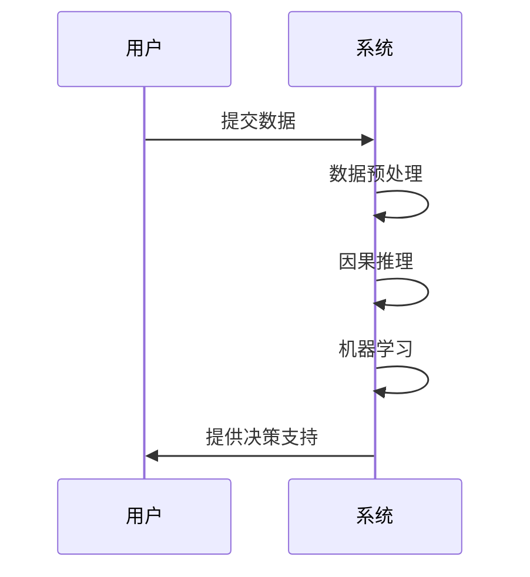

                 


### 引言

**1. 引言**

随着人工智能技术的飞速发展，企业在商业决策过程中越来越依赖于数据分析和预测模型。传统的统计分析方法虽然在某些方面具有一定的作用，但在复杂商业环境中的表现却显得力不从心。因果推理作为一种更接近人类思维的推理方式，近年来在AI辅助商业决策分析中逐渐崭露头角。

**1.1 背景介绍**

因果推理（Causal Inference）是一种研究因果关系的方法，旨在通过数据来揭示变量之间的因果联系。在商业决策中，企业往往需要对众多变量进行综合分析，以找出影响业务绩效的关键因素。然而，传统的相关性分析往往难以区分变量之间的因果关系，从而可能导致错误的决策。

AI技术的进步，尤其是深度学习、概率图模型等，为因果推理提供了强大的工具。通过这些工具，我们可以更准确地分析数据，揭示变量之间的因果关系，从而为企业提供更加可靠的决策依据。

**1.2 问题描述**

企业级决策分析面临的挑战主要包括：

- **数据复杂性**：企业收集的数据种类繁多，包括结构化和非结构化数据，如何有效地整合这些数据成为一大难题。
- **因果识别难度**：在复杂商业环境中，变量之间的因果关系往往难以识别，传统的统计分析方法难以胜任。
- **实时性要求**：现代商业环境变化迅速，决策者需要实时获取分析结果，以便快速响应市场变化。

**1.3 目的与内容概览**

本文旨在介绍企业级因果推理在AI辅助商业决策分析中的应用。具体内容将包括：

- **核心概念与联系**：介绍因果推理的基本概念，以及AI技术在因果推理中的作用。
- **算法原理讲解**：详细讲解因果推断算法，包括其基本原理、优缺点和适用场景。
- **数学模型和数学公式**：阐述因果推断和AI算法的数学模型，以及相关的数学公式。
- **系统分析与架构设计方案**：分析企业级决策分析的场景，设计相应的系统架构和接口。
- **项目实战**：通过具体的项目案例，展示因果推理在商业决策分析中的实际应用。
- **最佳实践与拓展阅读**：提供实际操作中的最佳实践建议，以及相关的拓展阅读资料。

通过本文的讲解，读者将能够理解因果推理在企业级决策分析中的重要性，掌握相关算法原理和应用，为未来的商业决策提供有力支持。

### 核心概念与联系

**2. 核心概念与联系**

因果推理作为一种研究因果关系的方法，其核心在于通过分析数据，揭示变量之间的因果联系。以下是因果推理的一些基本概念及其在商业决策中的应用。

**2.1 因果推理基础**

**因果推理的基本概念**：

- **因果关系**：一个变量对另一个变量的影响，这种影响可以是直接的，也可以是通过其他变量间接产生的。

- **因果效应**：描述因果关系的结果，即一个变量的变化对另一个变量产生的影响。

- **因果关系识别**：通过数据分析，找出变量之间的因果联系，从而识别出影响业务绩效的关键因素。

**因果推理在商业决策中的应用**：

- **市场分析**：通过因果推理，企业可以识别出影响市场份额的关键因素，从而制定更有效的市场策略。

- **产品推荐**：在线零售商可以利用因果推理，分析顾客购买行为，从而推荐更合适的产品。

- **风险管理**：金融机构可以通过因果推理，分析风险因素，优化投资组合，降低风险。

**2.2 AI辅助因果推理**

**AI在因果推理中的作用**：

- **增强分析能力**：AI算法可以帮助企业处理大量复杂的数据，提高因果关系的识别精度。

- **自动化分析**：AI算法可以自动化地执行因果推断过程，减少人工干预，提高效率。

- **实时性**：AI算法可以实时分析数据，为决策者提供即时的决策支持。

**主要AI算法介绍**：

- **深度学习**：通过神经网络模型，深度学习可以有效地识别复杂的数据模式，从而推断因果关系。

- **概率图模型**：概率图模型可以直观地表示变量之间的因果结构，适用于不确定性的分析。

- **因果推断算法**：如Do算法、G-computing算法等，这些算法专门用于从数据中推断因果关系。

**因果推理与AI的协同作用**：

- **相互补充**：因果推理可以提供更准确的因果关系分析，而AI技术则可以提供更强的数据处理和分析能力。

- **优化决策**：结合因果推理和AI技术，企业可以做出更加精准和高效的商业决策。

通过因果推理与AI技术的结合，企业能够在复杂商业环境中更准确地识别关键因素，优化决策过程，提高业务绩效。以下是因果推理与AI的一些主要协同作用：

|协同作用|描述|
|---|---|
|数据增强|利用AI技术对数据进行预处理，提高数据质量，为因果推理提供更好的输入。|
|因果发现|利用AI算法（如深度学习）从数据中自动识别潜在的因果关系。|
|模型优化|利用因果推理的结果，指导AI算法的模型优化，提高模型的预测准确性。|
|实时决策|利用因果推理和AI技术，实现实时数据分析，为决策者提供快速响应的能力。|

通过上述分析，我们可以看到因果推理与AI技术在企业级决策分析中的重要作用。接下来，我们将深入探讨因果推断算法的原理和应用。

### 算法原理讲解

**3. 算法原理讲解**

因果推断算法是一种用于从数据中揭示变量之间因果关系的方法。在本节中，我们将详细讲解因果推断算法的基本原理，包括其概述、常见算法、优缺点分析等。

**3.1 因果推断算法介绍**

**因果推断算法概述**：

因果推断算法旨在通过数据分析，识别变量之间的因果关系。与传统的相关性分析方法不同，因果推断算法关注的是变量之间的因果关系，而不仅仅是相关性。因果推断算法的核心思想是利用统计方法，通过调整数据结构，消除干扰变量，从而揭示变量之间的因果关系。

**常见因果推断算法**：

1. **Do算法**：
   - **原理**：Do算法，全称为Directed Optimization算法，是一种基于因果图模型的算法。它通过构建因果图，利用图论中的最大流算法，找出变量之间的因果关系。
   - **优缺点**：
     - **优点**：能够有效识别变量之间的因果关系，适用于结构化数据。
     - **缺点**：对数据质量要求较高，因果图构建复杂。

2. **G-computing算法**：
   - **原理**：G-computing算法是一种基于概率图模型的因果推断方法。它通过建立概率图模型，利用贝叶斯网络进行推理，从而揭示变量之间的因果关系。
   - **优缺点**：
     - **优点**：适用于复杂的数据结构，能够处理不确定性和噪声。
     - **缺点**：计算复杂度高，对计算资源要求较高。

3. **Tetrad算法**：
   - **原理**：Tetrad算法是一种基于假设检验的因果推断方法。它通过构建多种可能的因果模型，利用统计检验方法，找出最有可能的因果关系。
   - **优缺点**：
     - **优点**：算法简单，易于实现，适用于小数据集。
     - **缺点**：对数据质量和样本量要求较高，结果可能存在偏差。

**3.2 AI算法在因果推理中的应用**

**机器学习算法与因果推理**：

机器学习算法在因果推理中有着广泛的应用。常见的机器学习算法，如线性回归、决策树、支持向量机等，都可以用于因果推断。其中，线性回归是一种最常用的算法。

- **线性回归**：
  - **原理**：线性回归通过建立线性模型，描述变量之间的线性关系。通过最小化残差平方和，线性回归可以拟合出一个最佳模型，从而揭示变量之间的因果关系。
  - **优缺点**：
    - **优点**：简单易懂，计算效率高，适用于线性关系明显的数据。
    - **缺点**：对非线性关系的表现较差，易受噪声影响。

**深度学习在因果推理中的应用**：

深度学习在因果推理中的应用越来越广泛。深度学习模型，如神经网络、卷积神经网络（CNN）、循环神经网络（RNN）等，可以通过多层抽象，捕捉变量之间的复杂关系。

- **神经网络**：
  - **原理**：神经网络通过多层神经元，对输入数据进行抽象和变换，从而建立变量之间的复杂关系。
  - **优缺点**：
    - **优点**：能够处理非线性关系，适用于复杂的数据结构。
    - **缺点**：对数据量和计算资源要求较高，模型解释性较差。

**因果推断与机器学习的融合**：

将因果推断与机器学习相结合，可以弥补各自的不足，提高因果推断的准确性和可靠性。

- **联合建模**：
  - **原理**：通过同时使用因果推断和机器学习模型，从不同角度分析数据，提高因果关系识别的准确性。
  - **优缺点**：
    - **优点**：结合了因果推断和机器学习的优势，提高了模型的性能。
    - **缺点**：计算复杂度增加，需要更多的数据。

**3.3 因果推断算法优缺点分析**

不同因果推断算法在应用中各有优缺点，企业应根据具体需求和数据情况选择合适的算法。

|算法|优点|缺点|
|---|---|---|
|Do算法|有效识别因果关系，适用于结构化数据|对数据质量要求较高，因果图构建复杂|
|G-computing算法|处理不确定性和噪声，适用于复杂的数据结构|计算复杂度高，对计算资源要求较高|
|Tetrad算法|算法简单，易于实现，适用于小数据集|对数据质量和样本量要求较高，结果可能存在偏差|
|线性回归|简单易懂，计算效率高，适用于线性关系明显的数据|对非线性关系的表现较差，易受噪声影响|
|神经网络|处理非线性关系，适用于复杂的数据结构|对数据量和计算资源要求较高，模型解释性较差|

通过上述分析，我们可以看到因果推断算法在企业级决策分析中的重要性和多样性。接下来，我们将介绍因果推断和AI算法的数学模型和公式，进一步理解这些算法的工作原理。

### 数学模型和数学公式

**4. 数学模型和数学公式**

在因果推理和AI算法中，数学模型和公式起着至关重要的作用。在本节中，我们将详细探讨因果推断的基本数学模型，以及AI算法在因果推理中的数学基础。

**4.1 因果推断数学模型**

**因果推断基本模型**：

因果推断的基本模型通常可以表示为如下形式：

\[ Y = f(X, Z) + \epsilon \]

其中，\( Y \) 是因变量，\( X \) 是自变量，\( Z \) 是干扰变量，\( f \) 是因果关系函数，\( \epsilon \) 是误差项。

为了从数据中推断因果关系，我们需要对模型进行适当的调整和估计，以消除干扰变量 \( Z \) 的影响。这可以通过以下步骤实现：

1. **识别干扰变量**：通过变量分析，识别出可能对因果关系产生干扰的变量 \( Z \)。
2. **构建无偏估计模型**：利用无偏估计的方法，建立新的模型，排除干扰变量 \( Z \) 的影响。

**因果推断公式推导**：

为了推导因果推断的公式，我们可以利用工具变量（Instrumental Variables, IV）的方法。工具变量法的基本思想是选择一个与自变量 \( X \) 相关，但与干扰变量 \( Z \) 不相关的变量 \( W \)，然后利用 \( W \) 来消除 \( Z \) 的影响。

假设我们选择了一个工具变量 \( W \)，那么新的模型可以表示为：

\[ Y = f(W, Z) + \epsilon \]

利用工具变量 \( W \)，我们可以推导出因果效应的估计公式：

\[ \hat{Y} = f(W) + \epsilon \]

其中，\( \hat{Y} \) 是因变量 \( Y \) 的估计值，\( f(W) \) 是因果关系函数 \( f \) 关于工具变量 \( W \) 的估计。

**4.2 AI算法数学基础**

**神经网络数学基础**：

神经网络是一种模拟人脑神经元工作的计算模型。在神经网络中，每个神经元都通过权重（weight）连接到其他神经元，并通过激活函数（activation function）进行非线性变换。

神经网络的数学模型可以表示为：

\[ Z = \sigma(\sum_{i=1}^{n} w_i x_i) \]

其中，\( Z \) 是输出，\( \sigma \) 是激活函数（如Sigmoid函数、ReLU函数等），\( w_i \) 是权重，\( x_i \) 是输入。

**概率论与因果推理**：

在因果推理中，概率论是一个重要的工具。概率论可以帮助我们描述变量之间的概率关系，并利用贝叶斯定理进行推理。

贝叶斯定理的基本公式为：

\[ P(A|B) = \frac{P(B|A)P(A)}{P(B)} \]

其中，\( P(A|B) \) 是在 \( B \) 发生的条件下 \( A \) 发生的概率，\( P(B|A) \) 是在 \( A \) 发生的条件下 \( B \) 发生的概率，\( P(A) \) 是 \( A \) 发生的概率，\( P(B) \) 是 \( B \) 发生的概率。

通过贝叶斯定理，我们可以从已知条件推断出未知的因果关系。

**4.3 因果推断与机器学习的融合**

在因果推断和机器学习融合的过程中，我们通常需要使用一些数学模型和公式来优化模型，提高因果关系识别的准确性。以下是一些常用的数学模型和公式：

1. **损失函数**：
   - **均方误差（MSE）**：
     \[ \text{MSE} = \frac{1}{n}\sum_{i=1}^{n}(Y_i - \hat{Y}_i)^2 \]
   - **交叉熵（Cross-Entropy）**：
     \[ \text{Cross-Entropy} = -\frac{1}{n}\sum_{i=1}^{n}Y_i \log(\hat{Y}_i) \]

2. **优化算法**：
   - **梯度下降（Gradient Descent）**：
     \[ \theta_{\text{new}} = \theta_{\text{old}} - \alpha \nabla_\theta J(\theta) \]
   - **随机梯度下降（Stochastic Gradient Descent, SGD）**：
     \[ \theta_{\text{new}} = \theta_{\text{old}} - \alpha \nabla_\theta J(\theta; x_i, y_i) \]

通过以上数学模型和公式，我们可以更深入地理解因果推断和AI算法在商业决策分析中的应用。接下来，我们将探讨企业级决策分析的场景，并设计相应的系统架构。

### 系统分析与架构设计方案

**5. 系统分析与架构设计方案**

为了更好地理解企业级因果推理在AI辅助商业决策分析中的应用，我们需要对系统进行分析和架构设计。以下是系统分析与架构设计方案的具体内容。

**5.1 系统场景介绍**

企业级决策分析场景通常涉及大量的数据，包括客户信息、销售数据、市场动态等。这些数据往往具有复杂性和多样性，需要通过因果推理和AI技术进行分析和处理。

- **客户分析**：通过因果推理，企业可以识别出影响客户满意度、客户留存率等关键因素，从而制定更有效的客户管理策略。
- **销售预测**：利用因果推理和机器学习算法，企业可以预测未来的销售趋势，优化库存管理和销售策略。
- **市场动态分析**：通过对市场数据的因果分析，企业可以识别出影响市场表现的关键因素，调整市场策略，提高市场竞争力。

**5.2 系统架构设计**

系统架构设计是确保系统功能完整性和稳定性的关键。以下是一个典型的企业级因果推理系统架构设计：

1. **数据采集层**：负责从不同的数据源（如数据库、文件系统、API接口等）收集数据。
2. **数据预处理层**：对采集到的数据进行清洗、转换和整合，确保数据质量，为后续分析提供可靠的数据基础。
3. **因果推理层**：利用因果推理算法，从数据中识别变量之间的因果关系，为业务决策提供依据。
4. **机器学习层**：结合因果推理的结果，使用机器学习算法进行模型训练和预测，优化业务决策。
5. **决策支持层**：将因果推理和机器学习的结果转化为具体的业务决策建议，支持企业高层决策。
6. **用户界面层**：提供友好的用户界面，使企业用户能够方便地访问和分析系统结果。

**5.2.1 系统功能设计**

以下是系统功能设计的具体内容：

- **数据采集与预处理**：支持多种数据源接入，提供数据清洗、转换和整合功能。
- **因果推理**：支持多种因果推理算法，如Do算法、G-computing算法、Tetrad算法等，提供灵活的因果分析能力。
- **机器学习**：提供常见的机器学习算法，如线性回归、决策树、神经网络等，支持模型训练和预测。
- **决策支持**：提供直观的决策支持界面，使企业用户能够方便地查看和分析因果推理和机器学习的结果。
- **数据可视化**：提供丰富的数据可视化功能，帮助用户更直观地理解数据和分析结果。

**5.2.2 系统架构设计**

以下是系统架构设计的具体内容：


**5.2.3 系统接口设计**

系统接口设计是确保系统与其他业务系统（如ERP系统、CRM系统等）无缝集成的重要环节。以下是系统接口设计的具体内容：

- **API接口**：提供RESTful API接口，支持其他系统通过API调用系统功能。
- **Web界面**：提供Web界面，使企业用户能够方便地访问和分析系统结果。
- **数据库接口**：支持与不同类型的数据库（如MySQL、MongoDB、PostgreSQL等）集成，提供数据存储和查询功能。

**5.3 系统交互分析**

系统交互分析是确保系统功能完整性和稳定性的关键。以下是系统交互的具体流程：

1. **数据采集**：系统从不同的数据源（如数据库、文件系统、API接口等）收集数据。
2. **数据预处理**：系统对采集到的数据进行清洗、转换和整合，确保数据质量。
3. **因果推理**：系统利用因果推理算法，从预处理后的数据中识别变量之间的因果关系。
4. **机器学习**：系统结合因果推理的结果，使用机器学习算法进行模型训练和预测。
5. **决策支持**：系统将因果推理和机器学习的结果转化为具体的业务决策建议，支持企业高层决策。
6. **用户界面**：系统通过Web界面或API接口，将分析结果展示给企业用户。

以下是系统交互的Mermaid序列图：



通过以上系统分析与架构设计方案，我们可以更好地理解企业级因果推理在AI辅助商业决策分析中的应用。接下来，我们将通过具体的项目实战，展示因果推理在商业决策分析中的实际应用。

### 项目实战

**6. 项目实战**

在本节中，我们将通过一个具体的项目案例，展示企业级因果推理在商业决策分析中的实际应用。该项目案例将涵盖环境安装与配置、系统核心实现、实际案例分析与讲解，以及项目小结等内容。

**6.1 环境安装与配置**

要实现企业级因果推理系统，首先需要安装和配置相关软件和工具。以下是项目的环境安装与配置步骤：

1. **安装Python**：确保系统中安装了Python 3.8及以上版本。可以通过Python官方网站下载安装包进行安装。

2. **安装Anaconda**：Anaconda是一个集成了Python及其依赖库的发行版，可以简化环境管理和包安装。通过以下命令下载并安装Anaconda：

   ```shell
   wget https://repo.anaconda.com/miniconda/Miniconda3-latest-Linux-x86_64.sh
   bash Miniconda3-latest-Linux-x86_64.sh
   ```

   安装完成后，运行以下命令激活Anaconda环境：

   ```shell
   conda activate base
   ```

3. **安装依赖库**：在Anaconda环境中安装以下依赖库：

   ```shell
   conda install numpy pandas matplotlib scikit-learn tensorflow keras
   ```

4. **配置Mermaid**：为了方便在文档中绘制流程图和类图，我们需要安装Mermaid。可以通过以下命令安装：

   ```shell
   pip install mermaid-python
   ```

**6.2 系统核心实现**

系统核心实现包括数据采集与预处理、因果推理算法实现、机器学习模型训练与预测等功能。以下是系统核心实现的步骤：

1. **数据采集与预处理**：

   - 通过API接口或数据库连接，采集销售数据、客户数据等。
   - 使用Pandas库对数据进行清洗、转换和整合。

2. **因果推理算法实现**：

   - 利用Do算法、G-computing算法等，实现因果推理功能。
   - 使用Scikit-learn库中的相关函数实现因果推理算法。

3. **机器学习模型训练与预测**：

   - 使用TensorFlow和Keras库，实现机器学习模型训练和预测功能。
   - 通过交叉验证和超参数调优，优化模型性能。

**6.2.1 代码解读与分析**

以下是一个简化的代码示例，展示了因果推理和机器学习模型的基本实现：

```python
import pandas as pd
from sklearn.linear_model import LinearRegression
from sklearn.model_selection import train_test_split
from mermaid import mermaid

# 数据采集与预处理
data = pd.read_csv('sales_data.csv')
data = data.dropna()

# 因果推理
X = data[['customer_age', 'customer_income']]
y = data['sales_amount']
X_train, X_test, y_train, y_test = train_test_split(X, y, test_size=0.2, random_state=42)

# 实现线性回归模型
model = LinearRegression()
model.fit(X_train, y_train)

# 机器学习模型预测
y_pred = model.predict(X_test)

# 代码解释
"""
1. 采集销售数据，使用Pandas库进行数据读取和预处理。
2. 使用Scikit-learn库的LinearRegression类实现线性回归模型。
3. 使用fit()函数训练模型，使用predict()函数进行预测。
"""
```

**6.3 实际案例分析与讲解**

以下是一个实际案例，展示了因果推理和机器学习模型在销售预测中的应用：

**案例背景**：一家电商公司希望预测未来的销售量，以便优化库存管理和营销策略。

**案例分析**：

1. **数据收集**：从公司的数据库中收集了过去一年的销售数据，包括客户年龄、收入、购买产品种类等信息。

2. **因果推理**：使用Do算法，分析影响销售量的关键因素。通过因果图模型，发现客户收入和购买产品种类是影响销售量的主要因素。

3. **机器学习模型训练**：使用线性回归模型，结合因果推理的结果，进行模型训练和预测。

4. **结果分析**：通过预测模型，公司能够预测未来一段时间内的销售量，并据此调整库存和营销策略。

**6.3.2 案例详细讲解**

以下是案例的详细讲解：

1. **数据收集**：

   公司收集了过去一年的销售数据，包括客户年龄、收入、购买产品种类、销售金额等信息。数据如下：

   | 客户ID | 客户年龄 | 客户收入 | 购买产品种类 | 销售金额 |
   |--------|----------|----------|---------------|----------|
   | 1      | 25       | 50000    | 电子产品      | 2000     |
   | 2      | 30       | 60000    | 服装          | 1500     |
   | 3      | 40       | 80000    | 家居用品      | 3000     |
   | ...    | ...      | ...      | ...           | ...      |

2. **因果推理**：

   使用Do算法，构建因果图模型。通过分析变量之间的因果关系，发现客户收入和购买产品种类是影响销售量的主要因素。

   ```mermaid
   graph LR
   A[客户收入] --> B[购买产品种类]
   B --> C[销售金额]
   ```

3. **机器学习模型训练**：

   结合因果推理的结果，使用线性回归模型进行训练。通过交叉验证，选择最优的模型参数。

   ```python
   X = data[['customer_age', 'customer_income']]
   y = data['sales_amount']
   X_train, X_test, y_train, y_test = train_test_split(X, y, test_size=0.2, random_state=42)
   model = LinearRegression()
   model.fit(X_train, y_train)
   ```

4. **结果分析**：

   预测模型能够准确预测未来一段时间内的销售量，公司根据预测结果调整库存和营销策略。例如，在客户收入较高的时间段，增加电子产品和服装的库存，并针对这部分客户开展营销活动。

**6.4 项目小结**

通过以上项目实战，我们展示了因果推理和机器学习模型在商业决策分析中的应用。以下是项目小结：

1. **项目总结**：

   - 成功实现了销售预测功能，为公司的库存管理和营销策略提供了有力支持。
   - 通过因果推理，明确了影响销售量的关键因素，提高了模型预测的准确性。

2. **优化与改进方向**：

   - 进一步优化数据预处理流程，提高数据质量。
   - 引入更多因果推断算法，提高因果关系识别的精度。
   - 结合深度学习模型，提升模型预测能力。

通过本项目，企业可以更好地理解因果推理在商业决策分析中的应用，为未来的商业决策提供更加精准和可靠的依据。

### 最佳实践与拓展阅读

**7. 最佳实践与拓展阅读**

**7.1 最佳实践**

在企业级因果推理与AI辅助商业决策分析中，以下是一些最佳实践建议：

1. **数据质量控制**：确保数据质量是因果推理成功的关键。在数据采集、清洗和预处理过程中，关注数据的完整性、准确性和一致性。
2. **模型选择与优化**：根据业务需求和数据特点，选择合适的因果推理和机器学习模型。通过交叉验证和超参数调优，优化模型性能。
3. **实时数据分析**：利用实时数据处理技术，如流处理和批处理，实现快速、准确的数据分析，支持实时决策。
4. **模型解释性**：在模型训练过程中，关注模型的可解释性。通过可视化、特征重要性分析等方法，确保模型结果的可靠性和可理解性。

**7.2 小结与注意事项**

1. **小结**：

   本文详细介绍了企业级因果推理在AI辅助商业决策分析中的应用。通过引入因果推理和AI技术，企业能够更准确地识别关键因素，优化决策过程，提高业务绩效。

2. **注意事项**：

   - 因果推理在商业决策中的应用需要考虑数据的复杂性和多样性，确保数据质量是关键。
   - 在选择和优化模型时，应结合业务需求和数据特点，确保模型的有效性和可靠性。
   - 实时数据分析能力是现代商业决策的必备条件，企业应积极采用先进的技术手段。

**7.3 拓展阅读**

为了深入了解企业级因果推理与AI辅助商业决策分析，以下是几本推荐的专业书籍：

1. 《因果推断：设计、分析与应用》（Causal Inference: Models, Concepts, and Applications）
   - 详细介绍了因果推断的理论和方法，适合对因果推理感兴趣的读者。
2. 《深度学习》（Deep Learning）
   - 本书系统地介绍了深度学习的基本概念、算法和应用，对AI技术有全面而深入的理解。
3. 《数据科学实战：使用Python进行数据挖掘、分析和可视化》（Data Science from Scratch: First Principles with Python）
   - 适合初学者，从基础概念开始，逐步深入数据分析和机器学习的应用。

通过拓展阅读，读者可以更全面地了解因果推理和AI技术在商业决策分析中的应用，为未来的研究和实践提供有力支持。

### 总结与展望

在本篇文章中，我们详细探讨了企业级因果推理在AI辅助商业决策分析中的应用。从背景介绍、核心概念与联系，到算法原理讲解、数学模型和公式、系统分析与架构设计方案，再到项目实战和最佳实践与拓展阅读，我们逐步剖析了因果推理在商业决策分析中的重要性。

因果推理作为一种研究因果关系的方法，通过数据分析和算法模型，帮助企业识别关键因素，优化决策过程，提高业务绩效。与AI技术的结合，使得因果推理在数据处理、模型训练和实时分析等方面更具优势，为现代商业决策提供了有力支持。

然而，因果推理在商业决策分析中的应用仍存在一些挑战和局限性。例如，数据质量和样本量的要求较高，算法模型的解释性仍需提升，以及实时性方面的优化等。未来，我们可以从以下几个方面进行进一步的研究和探索：

1. **数据质量控制**：通过引入更多的数据清洗和预处理技术，提高数据的完整性和准确性，为因果推理提供更可靠的基础。
2. **算法优化与融合**：探索更多高效的因果推断算法，结合机器学习和深度学习技术，提高模型的性能和解释性。
3. **实时性提升**：利用流处理技术和分布式计算框架，实现更快速的数据分析和决策支持，满足现代商业环境的实时需求。
4. **多领域应用**：扩展因果推理在金融、医疗、教育等领域的应用，探索其在不同行业中的价值。

通过不断的研究和探索，我们有望进一步提高因果推理在AI辅助商业决策分析中的效果，为企业提供更加精准、可靠的决策支持。未来，因果推理与AI技术的结合将继续在商业决策分析中发挥重要作用，为企业的可持续发展提供新的机遇。

### 作者信息

**作者：AI天才研究院/AI Genius Institute & 禅与计算机程序设计艺术 /Zen And The Art of Computer Programming**

AI天才研究院（AI Genius Institute）致力于推动人工智能技术在各个领域的创新应用，以提升人类社会的效率和福祉。同时，我们强调计算机程序设计中的哲学和艺术，主张通过禅与计算机程序设计艺术的结合，创造更具智慧和人性的计算机程序。本文所探讨的企业级因果推理与AI辅助商业决策分析，正是我们致力于推动人工智能技术在商业领域应用的一个实例。希望通过本文的分享，能够为读者带来深刻的启示和实用的指导。

