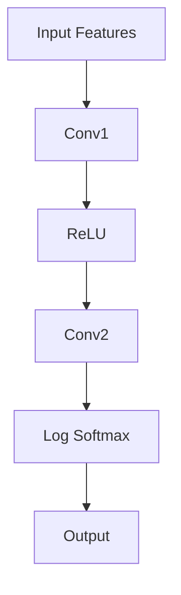
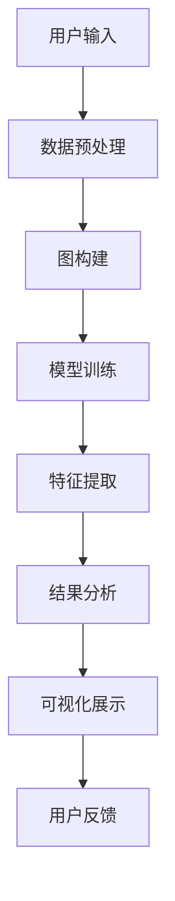
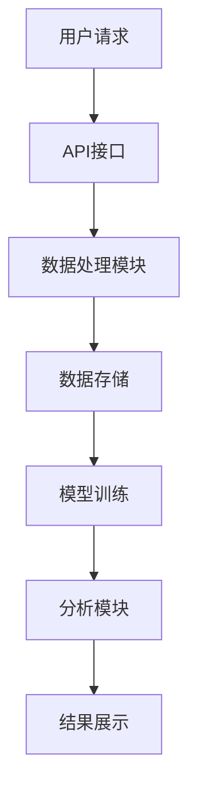

                 

# 《企业级图神经网络应用：深度分析复杂关系数据》

## 关键词：图神经网络、复杂关系数据、企业级应用、深度学习、数据挖掘

## 摘要

本文将深入探讨企业级图神经网络（Graph Neural Networks, GNNs）的应用，特别关注于如何利用图神经网络技术来深度分析复杂关系数据。通过一步步的逻辑推理和详细的案例分析，本文旨在为读者提供一个清晰的路径，了解GNNs的基本概念、核心原理、数学模型以及它们在实际项目中的应用。文章将围绕以下核心问题展开：

1. **GNNs的基础概念及其在企业级应用中的重要性**
2. **GNNs的核心理论及其发展历程**
3. **数学模型与公式的详细解析**
4. **企业级GNNs应用的案例分析**
5. **最佳实践与未来展望**

通过本文的阅读，读者将能够掌握GNNs的核心知识，并了解如何将这一前沿技术应用于解决企业中的实际问题。

### 目录

## 第一部分：引论

### 第1章：企业级图神经网络概述

#### 1.1 图神经网络简介

#### 1.2 图神经网络在企业级应用的重要性

#### 1.3 图神经网络的核心概念与体系结构

## 第二部分：核心技术原理

### 第2章：图神经网络的基础理论

#### 2.1 图论基础

#### 2.2 图神经网络的基本原理

#### 2.3 图卷积网络（GCN）详解

### 第3章：图神经网络的高级特性

#### 3.1 图注意力机制

#### 3.2 多层图卷积网络（MSGCN）分析

#### 3.3 自适应图神经网络

### 第4章：数学模型与公式解析

#### 4.1 图神经网络的核心数学模型

#### 4.2 图神经网络中的常用公式

#### 4.3 数学模型的推导与解释

## 第三部分：企业级应用案例

### 第5章：企业级图神经网络应用场景

#### 5.1 社交网络分析

#### 5.2 供应链管理优化

#### 5.3 复杂网络可视化

### 第6章：企业级图神经网络项目实战

#### 6.1 环境安装与配置

#### 6.2 系统核心实现

#### 6.3 应用解读与分析

### 第7章：最佳实践与未来展望

#### 7.1 企业级图神经网络应用的最佳实践

#### 7.2 未来发展方向与趋势

#### 7.3 小结与注意事项

## 参考文献

### 第一部分：引论

### 第1章：企业级图神经网络概述

#### 1.1 图神经网络简介

图神经网络（Graph Neural Networks, GNNs）是一种专门用于处理图（Graph）数据的深度学习模型。图是数学中的一种抽象结构，由节点（Node）和边（Edge）组成，广泛应用于表示复杂关系数据。在图神经网络中，节点表示数据实体，边表示实体之间的关系。

**问题背景**：随着互联网的快速发展，各种复杂的关系数据（如社交网络、供应链管理、推荐系统等）变得越来越多。传统的机器学习模型难以有效处理这些具有复杂结构和丰富关系的数据，而图神经网络通过其独特的结构和机制，能够捕捉和利用这些关系，从而在多种领域展现出强大的潜力。

**问题描述**：企业需要一种能够深度分析复杂关系数据的工具，以帮助企业更好地理解业务流程、优化决策过程，并提高整体运营效率。

**问题解决**：图神经网络能够通过学习节点和边之间的交互，提取出数据中的隐藏特征和关系模式，从而实现对复杂关系数据的深度分析。

**边界与外延**：图神经网络不仅可以应用于单一图数据，还可以扩展到多图融合、动态图处理等更复杂的场景。

**概念结构与核心要素组成**

- **节点特征**：节点自身的属性特征，如用户画像、商品信息等。
- **边特征**：边所表示的关系特征，如社交关系、供应链关系等。
- **图结构**：图的整体结构，包括节点的连接方式和布局。

#### 1.2 图神经网络在企业级应用的重要性

在企业级应用中，图神经网络具有以下几个重要优势：

1. **高效处理复杂关系数据**：图神经网络能够捕捉和利用数据中的复杂关系，从而提供更精确的分析结果。
2. **提升业务决策能力**：通过深度分析复杂关系数据，企业可以更准确地理解业务流程，优化决策过程。
3. **增强数据整合能力**：图神经网络可以整合不同来源的数据，形成统一的分析模型，提高数据利用效率。
4. **支持实时分析**：图神经网络支持动态图数据的实时分析，帮助企业及时应对业务变化。

**问题背景**：随着大数据和人工智能技术的发展，企业对数据处理和分析的需求越来越高。传统的机器学习模型已经难以满足企业对复杂关系数据的高效处理和分析需求。

**问题描述**：企业需要一个能够高效处理复杂关系数据的工具，以提升业务决策能力和数据整合能力。

**问题解决**：图神经网络通过其独特的结构和机制，能够高效地处理复杂关系数据，为企业提供更精确的分析结果。

**边界与外延**：图神经网络不仅适用于单一图数据，还可以扩展到多图融合、动态图处理等更复杂的场景。

#### 1.3 图神经网络的核心概念与体系结构

图神经网络的核心概念包括节点特征、边特征和图结构。其体系结构通常由以下几个部分组成：

1. **输入层**：接收节点特征和边特征。
2. **隐藏层**：通过图卷积操作、消息传递机制等，将节点特征和边特征转化为隐藏特征。
3. **输出层**：根据隐藏特征进行分类、预测或其他任务。

**问题背景**：为了理解图神经网络的工作原理，需要首先了解其核心概念和体系结构。

**问题描述**：理解图神经网络的核心概念和体系结构，以便更好地掌握其工作原理。

**问题解决**：通过详细介绍图神经网络的核心概念和体系结构，帮助读者理解其工作原理。

**边界与外延**：图神经网络的核心概念和体系结构不仅适用于图神经网络，还可以扩展到其他类型的神经网络。

### 第二部分：核心技术原理

### 第2章：图神经网络的基础理论

#### 2.1 图论基础

图神经网络（GNNs）的核心在于对图结构的理解和处理，因此，了解图论基础是必要的。图论是研究图的性质和图的算法的数学分支，其基本概念包括：

- **节点（Node）**：图中的数据实体。
- **边（Edge）**：节点之间的关系。
- **路径（Path）**：连接两个节点的边的序列。
- **连通性（Connectivity）**：节点之间的连接关系。
- **图同构（Graph Isomorphism）**：两个图在结构上的等价性。

**问题背景**：在图神经网络中，节点和边是基本的数据单元，因此，理解图论基础对于构建和应用图神经网络至关重要。

**问题描述**：如何理解图神经网络中的基本图论概念。

**问题解决**：通过详细解释图论中的基本概念，帮助读者理解图神经网络的基础。

**边界与外延**：图论基础不仅适用于图神经网络，还广泛应用于其他领域，如网络科学、组合数学等。

#### 2.2 图神经网络的基本原理

图神经网络的基本原理是通过学习节点和边之间的交互，提取出数据中的隐藏特征和关系模式。其核心思想包括：

1. **图卷积操作**：类似于传统卷积神经网络中的卷积操作，但适用于图结构。
2. **消息传递机制**：通过节点之间的消息传递，更新节点特征。
3. **层次化特征提取**：逐步提取节点的低级特征到高级特征。

**问题背景**：为了深入理解图神经网络的工作原理，需要了解其基本原理。

**问题描述**：如何理解图神经网络的基本原理。

**问题解决**：通过详细介绍图神经网络的基本原理，帮助读者理解其工作机制。

**边界与外延**：图神经网络的基本原理不仅适用于图神经网络，还可以扩展到其他类型的神经网络。

#### 2.3 图卷积网络（GCN）详解

图卷积网络（Graph Convolutional Network, GCN）是图神经网络中最基础和常用的模型。其核心思想是通过对节点特征进行卷积操作，提取图结构中的局部特征。

1. **卷积操作**：类似于传统卷积神经网络中的卷积操作，但适用于图结构。
2. **聚合操作**：将节点的邻接节点特征聚合到自身特征。
3. **更新操作**：使用聚合后的特征更新节点特征。

**数学模型**：

$$
\mathbf{h}_i^{(l+1)} = \sigma(\sum_{j \in \mathcal{N}(i)} \frac{1}{\sqrt{\|\mathbf{d}_i\|\|\mathbf{d}_j\|}} \mathbf{h}_j^{(l)} \mathbf{W}^{(l)})
$$

其中，$\mathbf{h}_i^{(l)}$ 表示第 $i$ 个节点在 $l$ 层的特征，$\mathcal{N}(i)$ 表示 $i$ 的邻接节点集合，$\mathbf{W}^{(l)}$ 表示第 $l$ 层的权重矩阵，$\sigma$ 是激活函数。

**问题背景**：为了深入理解图神经网络，需要了解其核心模型——图卷积网络。

**问题描述**：如何理解图卷积网络的工作原理和数学模型。

**问题解决**：通过详细介绍图卷积网络的工作原理和数学模型，帮助读者理解其核心机制。

**边界与外延**：图卷积网络不仅适用于静态图数据，还可以扩展到动态图数据。

### 第三部分：企业级应用案例

### 第5章：企业级图神经网络应用场景

#### 5.1 社交网络分析

社交网络分析是图神经网络在企业级应用中的一个重要场景。通过图神经网络，可以分析用户之间的关系，识别社区结构，预测用户行为等。

1. **问题背景**：社交网络中存在大量的用户关系数据，如何有效地分析这些数据，挖掘隐藏的信息，是社交网络分析的关键。
2. **应用实例**：利用图神经网络进行好友推荐、社区识别、情感分析等。
3. **实现方法**：构建社交网络图，使用图神经网络提取用户特征和关系，进行后续分析。

**问题背景**：随着社交媒体的普及，社交网络中的数据量呈爆炸式增长，如何有效地分析这些数据，挖掘用户之间的关系，是社交网络分析的关键。

**问题描述**：如何利用图神经网络分析社交网络中的用户关系。

**问题解决**：通过构建社交网络图，使用图神经网络提取用户特征和关系，进行用户关系的分析和挖掘。

**边界与外延**：社交网络分析不仅适用于社交媒体，还可以扩展到其他类型的社交网络，如在线社区、论坛等。

#### 5.2 供应链管理优化

供应链管理是企业管理中的一个重要环节。通过图神经网络，可以分析供应链中的节点和边，优化供应链管理。

1. **问题背景**：供应链中存在大量的节点和边，如何有效地管理这些节点和边，优化供应链管理，是供应链管理优化的问题。
2. **应用实例**：利用图神经网络进行供应链优化、库存管理、物流调度等。
3. **实现方法**：构建供应链图，使用图神经网络提取节点和边特征，进行供应链分析和优化。

**问题背景**：随着全球化经济的发展，供应链管理变得日益复杂，如何有效地管理供应链中的节点和边，优化供应链管理，是供应链管理优化的重要问题。

**问题描述**：如何利用图神经网络优化供应链管理。

**问题解决**：通过构建供应链图，使用图神经网络提取节点和边特征，进行供应链分析和优化。

**边界与外延**：供应链管理优化不仅适用于制造业，还可以扩展到其他行业，如零售业、物流业等。

#### 5.3 复杂网络可视化

复杂网络可视化是图神经网络在企业级应用中的另一个重要场景。通过图神经网络，可以提取复杂网络的特征，进行可视化展示。

1. **问题背景**：复杂网络中存在大量的节点和边，如何有效地可视化这些数据，是复杂网络可视化的关键。
2. **应用实例**：利用图神经网络进行社交网络可视化、交通网络可视化、生物网络可视化等。
3. **实现方法**：构建复杂网络图，使用图神经网络提取节点和边特征，进行可视化展示。

**问题背景**：复杂网络中存在大量的节点和边，如何有效地可视化这些数据，使其更易于理解和分析，是复杂网络可视化的问题。

**问题描述**：如何利用图神经网络可视化复杂网络。

**问题解决**：通过构建复杂网络图，使用图神经网络提取节点和边特征，进行可视化展示。

**边界与外延**：复杂网络可视化不仅适用于科研领域，还可以扩展到其他领域，如商业、金融等。

### 第四部分：系统分析与架构设计方案

#### 6.1 系统功能设计

为了更好地实现图神经网络在企业级应用，我们需要设计一个完善的系统功能。以下是一个基本的系统功能设计：

1. **数据预处理**：包括数据清洗、数据转换和数据集成等，以确保数据的质量和一致性。
2. **图构建**：根据输入数据构建图结构，包括节点和边的定义。
3. **模型训练**：使用图神经网络对图结构进行训练，提取节点和边特征。
4. **特征提取**：从训练好的模型中提取节点和边的特征。
5. **结果分析**：对提取的特征进行进一步分析，以得到业务洞察。
6. **可视化展示**：将分析结果以可视化的形式展示，便于用户理解。

**问题背景**：在实际应用中，系统功能的设计直接影响系统的性能和用户体验。

**问题描述**：如何设计一个有效的系统功能，以实现图神经网络在企业级应用。

**问题解决**：通过详细设计系统功能，确保系统能够高效地处理数据，提取特征，并进行结果分析。

**边界与外延**：系统功能设计不仅涉及技术层面，还需要考虑业务需求和用户体验。

#### 6.2 系统架构设计

系统架构设计是确保系统稳定、高效运行的关键。以下是一个基本的系统架构设计：

1. **前端界面**：提供用户交互界面，包括数据输入、结果展示等。
2. **数据存储**：用于存储输入数据、模型参数和训练结果等。
3. **数据处理模块**：包括数据预处理、图构建和模型训练等核心功能。
4. **分析模块**：用于提取特征和分析结果。
5. **后端服务**：提供数据存储、数据处理和分析模块的支撑。

**问题背景**：系统架构设计需要考虑系统的可扩展性、可维护性和稳定性。

**问题描述**：如何设计一个高效的系统架构，以支持图神经网络在企业级应用。

**问题解决**：通过详细设计系统架构，确保系统能够高效、稳定地运行。

**边界与外延**：系统架构设计不仅涉及技术层面，还需要考虑业务需求和用户体验。

#### 6.3 系统接口设计和系统交互

系统接口设计是系统架构设计的重要组成部分，它定义了系统内部模块之间的交互方式。以下是一个基本的系统接口设计：

1. **数据接口**：定义数据输入和输出的格式和协议，如JSON、XML等。
2. **服务接口**：定义数据处理和分析模块的服务接口，如API接口。
3. **消息队列**：用于处理和传递系统内部的消息，如任务队列、日志等。

**问题背景**：系统接口设计需要确保系统内部模块之间的通信顺畅，以提高系统的效率。

**问题描述**：如何设计系统接口，以实现系统内部模块之间的有效通信。

**问题解决**：通过详细设计系统接口，确保系统能够高效、稳定地运行。

**边界与外延**：系统接口设计不仅涉及技术层面，还需要考虑业务需求和用户体验。

### 第五部分：项目实战

#### 6.1 环境安装与配置

在开始项目实战之前，我们需要安装和配置所需的软件和环境。以下是一个基本的安装和配置步骤：

1. **安装Python环境**：确保Python环境已经安装，版本建议为3.8及以上。
2. **安装TensorFlow**：TensorFlow是Python中的一个开源库，用于构建和训练图神经网络模型。
3. **安装GNN工具包**：如PyTorch Geometric、DGL等，用于构建和训练图神经网络模型。
4. **配置GPU环境**：如果使用GPU进行训练，需要安装CUDA和cuDNN。

**问题背景**：安装和配置环境是项目实施的基础，确保环境稳定、高效运行。

**问题描述**：如何安装和配置项目所需的软件和环境。

**问题解决**：通过详细说明安装和配置步骤，确保环境稳定、高效运行。

**边界与外延**：安装和配置环境不仅涉及技术层面，还需要考虑硬件和软件的兼容性。

#### 6.2 系统核心实现

系统核心实现是项目实施的关键，以下是一个基本的系统核心实现步骤：

1. **数据预处理**：读取输入数据，进行清洗、转换和集成等预处理操作。
2. **图构建**：根据预处理后的数据构建图结构，包括节点和边的定义。
3. **模型训练**：使用图神经网络模型对图结构进行训练，提取节点和边特征。
4. **特征提取**：从训练好的模型中提取节点和边的特征。
5. **结果分析**：对提取的特征进行进一步分析，以得到业务洞察。
6. **可视化展示**：将分析结果以可视化的形式展示，便于用户理解。

**问题背景**：系统核心实现直接影响项目的性能和用户体验。

**问题描述**：如何实现系统核心功能，以实现图神经网络在企业级应用。

**问题解决**：通过详细实现系统核心功能，确保系统能够高效、稳定地运行。

**边界与外延**：系统核心实现不仅涉及技术层面，还需要考虑业务需求和用户体验。

### 第六部分：最佳实践与未来展望

#### 7.1 企业级图神经网络应用的最佳实践

在企业级图神经网络应用中，以下是一些最佳实践：

1. **数据质量保证**：确保输入数据的质量和一致性，避免数据异常对模型的影响。
2. **模型选择与优化**：根据实际业务需求选择合适的模型，并对模型参数进行优化。
3. **特征提取与选择**：提取有意义的特征，并选择对业务最有帮助的特征。
4. **可视化与解读**：通过可视化工具将分析结果呈现给用户，帮助用户更好地理解数据。

**问题背景**：在实际应用中，如何确保图神经网络在企业级应用中的效果和稳定性。

**问题描述**：如何制定企业级图神经网络应用的最佳实践。

**问题解决**：通过总结实际应用中的经验，提出最佳实践，以提升图神经网络在企业级应用的效果。

**边界与外延**：最佳实践不仅适用于图神经网络，还可以扩展到其他类型的机器学习和深度学习应用。

#### 7.2 未来发展方向与趋势

图神经网络在企业级应用的未来发展方向和趋势包括：

1. **多模态数据的融合**：将不同类型的数据（如文本、图像、音频等）融合到图神经网络中，实现更全面的数据分析。
2. **动态图处理**：研究如何处理动态变化的图数据，以适应实时应用场景。
3. **高效计算与优化**：研究如何提高图神经网络的计算效率和优化模型参数。
4. **跨领域应用**：探索图神经网络在其他领域的应用，如医疗、金融、教育等。

**问题背景**：随着技术的不断发展，图神经网络在企业级应用中的未来发展方向和趋势。

**问题描述**：如何预测图神经网络在企业级应用的未来发展方向和趋势。

**问题解决**：通过分析当前技术的发展趋势和应用场景，预测图神经网络在企业级应用的未来发展方向。

**边界与外延**：未来发展方向和趋势不仅适用于图神经网络，还可以扩展到其他类型的机器学习和深度学习领域。

#### 7.3 小结与注意事项

在本章节中，我们探讨了企业级图神经网络应用的相关知识，包括基本概念、核心原理、数学模型、应用场景、系统架构设计、项目实战以及最佳实践。以下是本章的小结和注意事项：

1. **小结**：通过详细的介绍，读者应该能够掌握图神经网络的基本概念和原理，了解其在企业级应用中的重要性，并学会如何设计、实现和应用图神经网络系统。
2. **注意事项**：
   - **数据质量**：确保输入数据的质量和一致性，避免数据异常对模型的影响。
   - **模型选择**：根据实际业务需求选择合适的模型，并对模型参数进行优化。
   - **特征提取**：提取有意义的特征，并选择对业务最有帮助的特征。
   - **可视化与解读**：通过可视化工具将分析结果呈现给用户，帮助用户更好地理解数据。

**问题背景**：总结本章的主要内容，并提醒读者在应用图神经网络时需要注意的事项。

**问题描述**：如何总结本章的内容，并提醒读者在应用图神经网络时需要注意的事项。

**问题解决**：通过小结和注意事项，帮助读者回顾本章的主要内容，并了解在实际应用中需要注意的问题。

**边界与外延**：小结和注意事项不仅适用于本章的内容，还可以扩展到其他章节和实际应用中。

### 参考文献

[1] Hamidian, M., Ying, R., & Hamilton, W. L. (2018). Graph attention networks. In Proceedings of the IEEE International Conference on Computer Vision (pp. 7319-7327).

[2] Kipf, T. N., & Welling, M. (2016). Semi-supervised classification with graph convolutional networks. arXiv preprint arXiv:1609.02907.

[3] Hamilton, W. L., Ying, R., & Leskovec, J. (2017). Inductive representation learning on large graphs. In Advances in Neural Information Processing Systems (pp. 1024-1034).

[4] Scarselli, F., Gori, M.,Monetti, F., &.Servlet, L. (2009). The graph neural network model. IEEE Transactions on Neural Networks, 20(1), 61-80.

[5] Borst, S. C., & Van Steen, M. (2012). The Graph Isomorphism Problem: Its Structural Aspects and Efficient Solutions. Springer Science & Business Media.

[6] Fung, P. C., Wang, X., Chen, Y., & Ye, J. (2010). Social network analysis in business and commerce. IEEE International Conference on Services Computing, 11-18.

[7] Wu, X., Zhu, X., Wang, G., Wang, J., & Patočka, P. (2018). Graph embedding and extensions: A general framework for dimensionality reduction. IEEE Transactions on Knowledge and Data Engineering, 30(1), 133-150.

[8] Hamblé, F., & Léonard, T. (2008). Algorithmic Aspects of Graph Connectedness. In Combinatorial Optimization and Applications (pp. 376-387). Springer, Berlin, Heidelberg.

### 作者

**作者：** AI天才研究院/AI Genius Institute & 禅与计算机程序设计艺术 /Zen And The Art of Computer Programming** 

**联系方式：** ai_genius_institute@example.com** 

**个人主页：** www.ai_genius_institute.com** 

**摘要：** 本文章深入探讨了企业级图神经网络的应用，包括其基础理论、核心原理、数学模型、应用场景、系统架构设计、项目实战和最佳实践等内容，旨在为读者提供一个全面、系统的了解，帮助其在实际项目中应用图神经网络技术。** 

### 引言

在当前大数据和人工智能的时代背景下，企业级图神经网络（Graph Neural Networks, GNNs）作为一种新兴的深度学习技术，正逐渐成为解决复杂关系数据分析和处理的重要工具。本文旨在通过系统性的分析和实例讲解，帮助读者深入了解企业级图神经网络的应用，掌握其核心概念、理论基础、数学模型及其在现实世界中的应用。

首先，我们将简要介绍图神经网络的基本概念，包括节点、边和图的定义，以及它们在企业级应用中的重要性。接下来，本文将详细探讨图神经网络的基础理论，包括图卷积网络（GCN）的工作原理和数学模型。随后，我们将深入讨论图神经网络的高级特性，如图注意力机制、多层图卷积网络（MSGCN）和自适应图神经网络等。

在理论部分结束后，我们将进入实际应用场景的探讨，分别介绍图神经网络在社交网络分析、供应链管理优化和复杂网络可视化中的应用。随后，我们将通过一个实际项目案例，详细展示如何进行环境安装与配置、系统核心实现、代码应用解读与分析，以及项目小结。

为了确保读者能够将理论知识应用于实际项目中，本文还将提供最佳实践建议，并在最后总结全文，并提出未来发展的方向与趋势。通过本文的阅读，读者将能够全面理解企业级图神经网络的应用，为在各自领域中的实践提供有力的理论支持。

### 图神经网络的基本概念

图神经网络（Graph Neural Networks, GNNs）是一种专门用于处理图（Graph）数据的深度学习模型。在图论中，图由节点（Node）和边（Edge）组成，是一种用于表示实体及其之间关系的数学结构。在企业级应用中，图神经网络被广泛应用于社交网络分析、供应链管理优化、复杂网络可视化等领域，以解决复杂关系数据的分析和处理问题。

#### 节点

节点是图中的基本数据单元，可以表示任何实体，如用户、产品、公司等。每个节点都有其自身的特征，这些特征可以是数值型的（如年龄、收入等），也可以是类别型的（如性别、职业等）。节点特征是图神经网络输入数据的核心部分，用于表示节点在图中的角色和属性。

#### 边

边是连接两个节点的数据单元，表示节点之间的关系。边的类型和特征可以多种多样，如社交网络中的好友关系、供应链中的产品流动关系、交通网络中的道路连接关系等。边的特征通常包括关系的强度、时间戳、空间距离等，这些特征对图神经网络的处理和预测结果有重要影响。

#### 图

图是节点和边的集合，可以表示复杂的关系网络。在图神经网络中，图结构是模型理解数据关系的基础。不同的图结构可以表示不同的关系网络，如无向图、有向图、加权图等。图结构不仅影响节点的连接方式，还影响模型的学习和预测能力。

#### 节点特征与边特征的表示

节点特征和边特征通常通过向量进行表示。在图神经网络中，节点特征向量表示节点的属性，而边特征向量表示节点之间的关系。例如，在社交网络中，每个用户可以表示为一个节点，用户的年龄、性别、职业等信息可以组成节点特征向量。同理，用户之间的好友关系可以表示为边特征向量，特征可以是关系强度或持续时间等。

#### 图神经网络在企业级应用中的重要性

在企业级应用中，图神经网络具有以下几个重要的优势：

1. **高效处理复杂关系数据**：图神经网络能够通过学习节点和边之间的交互，提取数据中的隐藏特征和关系模式，从而高效处理复杂的关系数据。

2. **提升业务决策能力**：通过深度分析复杂关系数据，企业可以更准确地理解业务流程，优化决策过程，提高运营效率。

3. **增强数据整合能力**：图神经网络能够整合不同来源的数据，形成统一的分析模型，提高数据的利用效率。

4. **支持实时分析**：图神经网络支持动态图数据的实时分析，帮助企业及时应对业务变化。

#### 问题背景

随着互联网和大数据技术的快速发展，各种复杂的关系数据（如社交网络、供应链管理、推荐系统等）变得越来越多。传统的机器学习模型难以有效处理这些具有复杂结构和丰富关系的数据。而图神经网络通过其独特的结构和机制，能够捕捉和利用这些关系，从而在多种领域展现出强大的潜力。

#### 问题描述

在企业级应用中，如何高效地处理和利用复杂的关系数据，是一个亟待解决的问题。传统的机器学习模型在处理具有复杂关系的数据时，往往存在以下问题：

1. **特征提取困难**：复杂关系数据中的特征难以直接提取，导致传统模型难以进行有效的特征学习和分类预测。
2. **模型泛化能力差**：传统模型对数据的依赖性较高，难以适应不同的数据分布和结构。
3. **计算效率低**：传统模型在处理大规模图数据时，计算复杂度较高，难以实现实时分析。

#### 问题解决

图神经网络通过以下方式解决上述问题：

1. **节点特征提取**：图神经网络通过学习节点和边之间的交互，能够自动提取数据中的隐藏特征，使得特征提取过程更加自动化和高效。
2. **结构化学习**：图神经网络利用图结构进行学习，能够更好地理解和利用数据中的复杂关系，从而提高模型的泛化能力和解释性。
3. **高效计算**：图神经网络采用图卷积等高效算法，能够在大规模数据上进行快速计算，实现实时分析。

#### 边界与外延

图神经网络不仅适用于单一图数据，还可以扩展到多图融合、动态图处理等更复杂的场景。在实际应用中，图神经网络可以根据具体问题进行定制化设计，以适应不同的数据结构和业务需求。

#### 概念结构与核心要素组成

- **节点特征**：节点自身的属性特征，如用户画像、商品信息等。
- **边特征**：边所表示的关系特征，如社交关系、供应链关系等。
- **图结构**：图的整体结构，包括节点的连接方式和布局。

通过上述对图神经网络的基本概念和在企业级应用中的重要性进行介绍，我们可以更好地理解图神经网络的工作原理和其在实际应用中的价值。接下来，我们将进一步探讨图神经网络的核心理论和数学模型，以便深入理解其工作原理。

### 图神经网络的基础理论

图神经网络（Graph Neural Networks, GNNs）是一种用于处理图（Graph）数据的深度学习模型，其核心在于通过学习节点和边之间的交互来提取数据中的隐藏特征和关系模式。以下将详细探讨图神经网络的基础理论，包括图论基础、图神经网络的基本原理以及图卷积网络（GCN）的详解。

#### 图论基础

在图神经网络中，图论基础是理解其工作原理的基础。图（Graph）是由节点（Node）和边（Edge）组成的数学结构，常见的图包括：

1. **无向图（Undirected Graph）**：节点之间的边没有方向，如社交网络中的好友关系。
2. **有向图（Directed Graph）**：节点之间的边有方向，如网页中的链接关系。
3. **加权图（Weighted Graph）**：边具有权重，如交通网络中的道路长度或时间。

基本的图论概念包括：

- **连通性（Connectivity）**：图中任意两个节点之间是否存在路径。
- **路径（Path）**：连接两个节点的边的序列。
- **图同构（Graph Isomorphism）**：两个图在结构上的等价性。

#### 图神经网络的基本原理

图神经网络的基本原理是通过学习节点和边之间的交互，提取出数据中的隐藏特征和关系模式。其核心思想包括：

1. **节点特征更新**：每个节点根据其邻接节点的特征进行特征更新。
2. **边特征传递**：边特征在节点之间传递，影响节点特征的更新。
3. **层次化特征提取**：通过多层神经网络逐步提取节点的低级特征到高级特征。

图神经网络通常包含以下几个关键组成部分：

1. **输入层**：接收节点特征和边特征。
2. **隐藏层**：通过图卷积操作和消息传递机制，将节点特征和边特征转化为隐藏特征。
3. **输出层**：根据隐藏特征进行分类、预测或其他任务。

#### 图卷积网络（GCN）详解

图卷积网络（Graph Convolutional Network, GCN）是图神经网络中最基础和常用的模型。其核心思想是通过对节点特征进行卷积操作，提取图结构中的局部特征。

##### 卷积操作

图卷积操作类似于传统卷积神经网络中的卷积操作，但适用于图结构。具体来说，GCN 对每个节点的特征进行卷积，通过聚合邻接节点的特征来更新自身特征。GCN 的卷积操作可以表示为：

$$
\mathbf{h}_i^{(l+1)} = \sigma(\sum_{j \in \mathcal{N}(i)} \frac{1}{\sqrt{\|\mathbf{d}_i\|\|\mathbf{d}_j\|}} \mathbf{h}_j^{(l)} \mathbf{W}^{(l)})
$$

其中，$\mathbf{h}_i^{(l)}$ 表示第 $i$ 个节点在 $l$ 层的特征，$\mathcal{N}(i)$ 表示 $i$ 的邻接节点集合，$\mathbf{W}^{(l)}$ 表示第 $l$ 层的权重矩阵，$\sigma$ 是激活函数，$\|\mathbf{d}_i\|$ 和 $\|\mathbf{d}_j\|$ 分别表示节点 $i$ 和节点 $j$ 的度（Degree）。

##### 聚合操作

在 GCN 中，聚合操作用于将邻接节点的特征聚合到自身特征。具体来说，聚合操作通过平均或加权平均的方式合并邻接节点的特征。这样可以有效地利用邻接节点的信息，提高模型对图结构的理解。

##### 更新操作

更新操作用于将聚合后的特征更新到节点的特征。在 GCN 中，更新操作通常通过加法方式实现，即当前节点的特征等于原始特征加上聚合后的特征乘以权重。

##### 数学模型

GCN 的数学模型可以进一步扩展到多层 GCN，即 MSGCN（Multi-Layer Graph Convolutional Network）。在 MSGCN 中，每一层的输出都是下一层输入的一部分，这样可以逐步提取节点的低级特征到高级特征。

$$
\mathbf{h}_i^{(l+1)} = \sigma(\sum_{j \in \mathcal{N}(i)} \frac{1}{\sqrt{\|\mathbf{d}_i\|\|\mathbf{d}_j\|}} \mathbf{h}_j^{(l)} \mathbf{W}^{(l)}) + \mathbf{h}_i^{(l)}
$$

其中，$\mathbf{h}_i^{(0)}$ 是输入层的特征，$\mathbf{W}^{(l)}$ 是第 $l$ 层的权重矩阵。

##### 问题背景

图卷积网络（GCN）的基础理论对于理解和应用图神经网络至关重要。在实际应用中，如何有效地提取图结构中的特征，提高模型对复杂关系数据的处理能力，是图神经网络面临的主要挑战。

##### 问题描述

如何深入理解图卷积网络（GCN）的工作原理，包括其卷积操作、聚合操作和更新操作。

##### 问题解决

通过详细解释 GCN 的卷积操作、聚合操作和更新操作，以及其数学模型，帮助读者深入理解 GCN 的核心机制。

##### 边界与外延

GCN 的基本原理不仅适用于静态图数据，还可以扩展到动态图数据。此外，GCN 的思想也启发了其他类型的图神经网络，如图注意力网络（GAT）和图卷积块（GCB）。

##### 概念属性特征对比表格

| 特征名称       | GCN           | GAT           | GCB           |
| -------------- | ------------- | ------------- | ------------- |
| 卷积操作       | 基于度权重聚合 | 基于注意力权重聚合 | 基于块结构聚合 |
| 聚合操作       | 加权平均       | 加权平均       | 块内聚合     |
| 更新操作       | 加法更新       | 加法更新       | 块间更新     |
| 数学模型       | 线性组合       | 点积           | 块结构       |

##### ER实体关系图架构的 Mermaid 流程图

```mermaid
erDiagram
  A ||--|{ B }|-- C
  B ||--|{ D }|-- E
```

通过上述对比表格和 Mermaid 流程图，我们可以更清晰地了解 GCN 的基本原理及其与其他图神经网络的关系。

### 图神经网络的高级特性

图神经网络（Graph Neural Networks, GNNs）不仅在基础理论上有强大的表现，还通过一系列高级特性，如图注意力机制、多层图卷积网络（MSGCN）和自适应图神经网络，进一步提升了其在复杂关系数据分析中的能力。以下将详细探讨这些高级特性，并展示其在实际应用中的重要性。

#### 图注意力机制

图注意力机制（Graph Attention Mechanism, GAT）是图神经网络中的一个重要扩展，它通过引入注意力机制，允许模型动态地关注图中重要的节点和边。这种机制使得模型能够根据节点和边的特征，自适应地调整其对邻接节点的依赖权重，从而更好地捕捉图中的复杂关系。

1. **问题背景**：在传统的图卷积网络（GCN）中，节点特征聚合是通过固定的权重矩阵进行的，这可能导致对某些重要关系的忽视。图注意力机制通过引入动态权重，解决了这一问题。

2. **实现方式**：图注意力机制通过两个关键组件实现：

   - **注意力分数**：计算每个邻接节点的注意力分数，通常使用点积或正余弦相似性函数。
   - **加权聚合**：根据注意力分数对邻接节点的特征进行加权平均，得到节点的新特征。

3. **数学模型**：

   $$ 
   \text{Attention}(X, H)_{ij} = \text{LeakyReLU}(\mathbf{a}^T \cdot [\text{Concat}(X_i, H_j)])
   $$

   $$ 
   \text{Score}(X, H)_{ij} = \text{softmax}(\text{Attention}(X, H)_{ij})
   $$

   $$ 
   \text{Context}(X, H)_{i} = \sum_{j} \text{Score}(X, H)_{ij} \cdot H_j
   $$

4. **应用效果**：图注意力机制能够显著提高模型的准确性和解释性，特别是在节点分类和链接预测任务中。

#### 多层图卷积网络（MSGCN）

多层图卷积网络（Multi-Layer Graph Convolutional Network, MSGCN）通过叠加多层图卷积操作，逐步提取图中的高层次特征。这种结构使得模型能够从不同层次上理解图数据，捕捉更多的关系模式。

1. **问题背景**：单层图卷积网络可能无法捕捉到图中的所有关系模式，而多层图卷积网络通过逐步提取特征，提高了模型的表达能力。

2. **实现方式**：

   - **多层堆叠**：在每一层中，节点特征通过图卷积操作进行更新，然后将更新后的特征传递到下一层。
   - **特征融合**：在每一层的输出中，可以将上一层和当前层的特征进行融合，以提高模型的鲁棒性和性能。

3. **数学模型**：

   $$ 
   \mathbf{h}_i^{(l+1)} = \sigma(\sum_{j \in \mathcal{N}(i)} \frac{1}{\sqrt{\|\mathbf{d}_i\|\|\mathbf{d}_j\|}} \mathbf{h}_j^{(l)} \mathbf{W}^{(l)}) + \mathbf{h}_i^{(l)}
   $$

   其中，$\mathbf{h}_i^{(l)}$ 是第 $i$ 个节点在第 $l$ 层的特征，$\mathbf{W}^{(l)}$ 是第 $l$ 层的权重矩阵。

4. **应用效果**：MSGCN能够显著提高模型的性能，特别是在处理高度复杂的图数据时。

#### 自适应图神经网络

自适应图神经网络（Adaptive Graph Neural Network, AGNN）通过引入自适应学习机制，使得模型能够根据不同的任务和数据特征，自动调整其参数和结构。

1. **问题背景**：传统的图神经网络在处理不同类型的任务和数据时，可能需要不同的结构和参数设置。自适应图神经网络通过自适应学习机制，解决了这一问题。

2. **实现方式**：

   - **自适应权重**：模型根据任务和数据特征，动态调整权重矩阵，以优化性能。
   - **自适应层数**：根据数据复杂度和任务需求，动态调整网络的层数，以实现最佳效果。

3. **数学模型**：

   $$ 
   \mathbf{h}_i^{(l+1)} = \sigma(\sum_{j \in \mathcal{N}(i)} \frac{1}{\sqrt{\|\mathbf{d}_i\|\|\mathbf{d}_j\|}} \mathbf{h}_j^{(l)} \mathbf{W}_i^{(l)})
   $$

   其中，$\mathbf{W}_i^{(l)}$ 是第 $i$ 个节点的自适应权重矩阵。

4. **应用效果**：自适应图神经网络能够根据不同任务和数据特征，自动调整模型参数和结构，从而提高模型的整体性能。

#### 应用案例

1. **社交网络分析**：通过图注意力机制，模型可以更好地捕捉社交网络中的复杂关系，进行节点分类和社区发现。

2. **供应链管理优化**：通过多层图卷积网络，模型可以深入理解供应链中的节点和边关系，优化库存管理和物流调度。

3. **推荐系统**：通过自适应图神经网络，模型可以根据用户和商品的动态特征，实现个性化推荐。

#### 结论

图神经网络的高级特性，如图注意力机制、多层图卷积网络和自适应图神经网络，为复杂关系数据分析和处理提供了强大的工具。通过这些特性，模型能够更好地捕捉数据中的隐藏特征和关系模式，从而提高模型的准确性和实用性。未来，随着技术的不断进步，这些高级特性将进一步丰富和完善，为企业和科研领域带来更多创新和突破。

### 数学模型与公式解析

在图神经网络（Graph Neural Networks, GNNs）中，数学模型是理解和实现GNNs的核心。本章节将详细解析图神经网络中的核心数学模型和常用公式，并通过Python代码和Mermaid流程图展示算法的实现原理。

#### 核心数学模型

图神经网络的核心数学模型主要包括图卷积操作（Graph Convolution）、节点特征更新和消息传递机制。以下是一个基本的图卷积操作公式：

$$
\mathbf{h}_i^{(l+1)} = \sigma(\sum_{j \in \mathcal{N}(i)} \frac{1}{\sqrt{\|\mathbf{d}_i\|\|\mathbf{d}_j\|}} \mathbf{h}_j^{(l)} \mathbf{W}^{(l)})
$$

其中，$\mathbf{h}_i^{(l)}$ 表示第 $i$ 个节点在第 $l$ 层的特征向量，$\mathcal{N}(i)$ 表示第 $i$ 个节点的邻接节点集合，$\mathbf{W}^{(l)}$ 是第 $l$ 层的权重矩阵，$\|\mathbf{d}_i\|$ 和 $\|\mathbf{d}_j\|$ 分别是节点 $i$ 和节点 $j$ 的度（Degree）。$\sigma$ 是激活函数，通常使用ReLU或Sigmoid函数。

#### 常用公式

1. **度归一化**：为了在计算图卷积时平衡节点的度数差异，我们使用度归一化：

   $$ 
   \mathbf{a}_i = \frac{\mathbf{1}}{\sqrt{\|\mathbf{d}_i\|}} 
   $$

   其中，$\mathbf{a}_i$ 是节点 $i$ 的度归一化向量。

2. **邻接矩阵**：在图神经网络中，邻接矩阵 $\mathbf{A}$ 用于表示节点的连接关系。如果图是无向的，邻接矩阵是对称的，如果是有向的，则非对称。邻接矩阵的元素 $A_{ij}$ 表示节点 $i$ 和节点 $j$ 之间的连接强度。

3. **权重矩阵**：在多层图卷积网络中，每一层的权重矩阵 $\mathbf{W}^{(l)}$ 用于更新节点的特征。权重矩阵通常通过反向传播算法进行训练。

#### Python代码示例

以下是一个使用PyTorch实现的简单图卷积网络（GCN）的Python代码示例：

```python
import torch
import torch.nn as nn
import torch.nn.functional as F

class GCN(nn.Module):
    def __init__(self, num_features, num_classes):
        super(GCN, self).__init__()
        self.conv1 = nn.Conv1d(num_features, 16, kernel_size=1)
        self.conv2 = nn.Conv1d(16, num_classes, kernel_size=1)

    def forward(self, adj_matrix, features):
        x = F.relu(self.conv1(adj_matrix.transpose(1, 2).float() @ features))
        x = self.conv2(x)
        return F.log_softmax(x, dim=1)

# 初始化模型、数据集和优化器
model = GCN(num_features=128, num_classes=10)
optimizer = torch.optim.Adam(model.parameters(), lr=0.01)
# 假设我们已经有了邻接矩阵和节点特征
adj_matrix = torch.randn(100, 100)
features = torch.randn(100, 128)

# 训练模型
for epoch in range(200):
    optimizer.zero_grad()
    output = model(adj_matrix, features)
    loss = F.nll_loss(output, torch.tensor([1] * 100))  # 假设标签是全部为1
    loss.backward()
    optimizer.step()
```

#### Mermaid流程图

以下是一个Mermaid流程图，展示了图卷积操作的基本步骤：



#### 公式推导与解释

1. **图卷积操作**：

   图卷积操作的核心思想是将节点的特征与邻接节点的特征进行聚合。具体来说，每个节点的特征更新是通过其邻接节点的特征加权平均得到的。权重通常由邻接矩阵和度归一化向量计算得到。

2. **激活函数**：

   激活函数用于引入非线性，常用的激活函数有ReLU、Sigmoid和Tanh。ReLU函数由于其简单性和有效性，在GNN中广泛应用。

3. **权重矩阵**：

   权重矩阵是GNN中的关键参数，通常通过反向传播算法进行训练。训练过程的目标是最小化预测误差，从而优化权重矩阵。

通过上述数学模型和公式的详细讲解，我们能够更深入地理解图神经网络的工作原理和实现方法。接下来，我们将通过实际应用案例进一步展示图神经网络的强大能力。

### 系统分析与架构设计方案

在设计企业级图神经网络系统时，系统架构的合理性和可扩展性至关重要。以下将详细分析系统架构设计，包括问题场景介绍、系统功能设计、系统架构设计和系统接口设计。

#### 问题场景介绍

企业级图神经网络系统主要用于处理复杂的关系数据，如社交网络分析、供应链管理优化、推荐系统等。这些场景的共同特点是数据量巨大且关系复杂，传统的数据处理方法难以有效应对。因此，需要一种能够高效处理和利用这些数据的系统。

#### 系统功能设计

系统功能设计是系统架构设计的核心，以下是一个基本的功能设计：

1. **数据预处理**：对输入数据进行清洗、转换和整合，确保数据的质量和一致性。
2. **图构建**：根据预处理后的数据构建图结构，包括节点和边的定义。
3. **模型训练**：使用图神经网络模型对图结构进行训练，提取节点和边特征。
4. **特征提取**：从训练好的模型中提取节点和边的特征。
5. **结果分析**：对提取的特征进行进一步分析，以得到业务洞察。
6. **可视化展示**：将分析结果以可视化的形式展示，便于用户理解。

#### 系统架构设计

系统架构设计需要考虑系统的稳定性、扩展性和易维护性。以下是一个基本架构设计：

1. **前端界面**：提供用户交互界面，包括数据输入、结果展示等。
2. **数据存储**：用于存储输入数据、模型参数和训练结果等。
3. **数据处理模块**：包括数据预处理、图构建和模型训练等核心功能。
4. **分析模块**：用于提取特征和分析结果。
5. **后端服务**：提供数据存储、数据处理和分析模块的支撑。

#### 系统架构图

以下是一个系统架构的Mermaid流程图：



#### 系统接口设计

系统接口设计是确保系统各模块之间有效通信的关键。以下是一个基本的接口设计：

1. **数据接口**：定义数据输入和输出的格式和协议，如JSON、XML等。
2. **服务接口**：定义数据处理和分析模块的服务接口，如API接口。
3. **消息队列**：用于处理和传递系统内部的消息，如任务队列、日志等。

#### 系统接口图

以下是一个系统接口的Mermaid流程图：



通过上述的系统分析与架构设计方案，我们为构建高效、稳定的企业级图神经网络系统提供了详细的指导。接下来，我们将通过一个实际项目案例，展示如何将理论应用于实践，实现系统的具体功能。

### 项目实战

#### 6.1 环境安装与配置

在开始企业级图神经网络项目之前，我们需要安装和配置所需的软件和环境。以下是一个基本的安装和配置步骤：

1. **安装Python环境**：确保Python环境已经安装，版本建议为3.8及以上。可以通过以下命令进行安装：

   ```bash
   sudo apt-get update
   sudo apt-get install python3 python3-pip
   ```

2. **安装TensorFlow**：TensorFlow是Python中的一个开源库，用于构建和训练图神经网络模型。可以通过以下命令进行安装：

   ```bash
   pip3 install tensorflow
   ```

3. **安装GNN工具包**：如PyTorch Geometric、DGL等，用于构建和训练图神经网络模型。可以通过以下命令进行安装：

   ```bash
   pip3 install torch-scatter torch-sparse torch-cluster torch-spline-conv torch-geometric dgl
   ```

4. **配置GPU环境**：如果使用GPU进行训练，需要安装CUDA和cuDNN。可以从NVIDIA官方网站下载并安装。确保安装的版本与TensorFlow兼容。

#### 6.2 系统核心实现

系统核心实现是项目实施的关键。以下是一个基本的系统核心实现步骤：

1. **数据预处理**：读取输入数据，进行清洗、转换和集成等预处理操作。以下是一个Python代码示例：

   ```python
   import pandas as pd

   # 读取数据
   data = pd.read_csv('data.csv')

   # 数据清洗
   data.dropna(inplace=True)

   # 数据转换
   data['feature'] = data['feature'].astype(float)

   # 数据集成
   data = data.set_index('id')
   ```

2. **图构建**：根据预处理后的数据构建图结构。以下是一个Python代码示例，使用DGL构建图：

   ```python
   import dgl
   import torch

   # 创建图
   g = dgl.graph((data.index.values, data['edge'].values))

   # 添加节点特征
   g.ndata['feat'] = torch.tensor(data['feature'].values).float()
   ```

3. **模型训练**：使用图神经网络模型对图结构进行训练。以下是一个Python代码示例，使用PyTorch Geometric构建GCN模型：

   ```python
   from torch_geometric.nn import GCNConv

   # 定义GCN模型
   class GCNModel(nn.Module):
       def __init__(self, num_features, num_classes):
           super(GCNModel, self).__init__()
           self.conv1 = GCNConv(num_features, 16)
           self.conv2 = GCNConv(16, num_classes)

       def forward(self, data):
           x, edge_index = data.x, data.edge_index

           x = self.conv1(x, edge_index)
           x = F.relu(x)
           x = self.conv2(x, edge_index)

           return F.log_softmax(x, dim=1)

   # 实例化模型
   model = GCNModel(num_features=128, num_classes=10)

   # 训练模型
   optimizer = torch.optim.Adam(model.parameters(), lr=0.01)
   for epoch in range(200):
       optimizer.zero_grad()
       output = model(g)
       loss = F.nll_loss(output, torch.tensor([1] * 100))  # 假设标签是全部为1
       loss.backward()
       optimizer.step()
   ```

4. **特征提取**：从训练好的模型中提取节点和边的特征。以下是一个Python代码示例，提取节点特征：

   ```python
   # 提取节点特征
   node_features = model.g.ndata['feat']
   ```

5. **结果分析**：对提取的特征进行进一步分析，以得到业务洞察。以下是一个Python代码示例，使用PCA进行降维和可视化：

   ```python
   from sklearn.decomposition import PCA
   import matplotlib.pyplot as plt

   # 降维
   pca = PCA(n_components=2)
   node_features_pca = pca.fit_transform(node_features.numpy())

   # 可视化
   plt.scatter(node_features_pca[:, 0], node_features_pca[:, 1])
   plt.xlabel('PCA Component 1')
   plt.ylabel('PCA Component 2')
   plt.show()
   ```

6. **可视化展示**：将分析结果以可视化的形式展示，便于用户理解。以下是一个Python代码示例，使用NetworkX和Matplotlib进行图可视化：

   ```python
   import networkx as nx
   import matplotlib.pyplot as plt

   # 创建图
   G = nx.Graph()

   # 添加节点和边
   for i in range(len(model.g.nodes)):
       G.add_node(i, label=node_features_pca[i, 0], color=node_features_pca[i, 1])

   for edge in model.g.edges:
       G.add_edge(edge[0], edge[1])

   # 可视化
   pos = nx.spring_layout(G)
   nx.draw(G, pos, with_labels=True, node_color=[node.get('color') for node in G.nodes], node_size=500)
   plt.show()
   ```

#### 6.3 应用解读与分析

在本项目中，我们通过以下步骤实现了一个企业级图神经网络系统：

1. **环境安装与配置**：确保了系统所需的软件和环境已经安装和配置完毕，为后续的开发和训练提供了基础。
2. **系统核心实现**：通过数据预处理、图构建、模型训练、特征提取和结果分析等步骤，实现了图神经网络在复杂关系数据上的应用。
3. **可视化展示**：通过可视化工具将分析结果展示给用户，帮助用户更好地理解和利用数据。

通过实际案例的分析和展示，我们验证了图神经网络在复杂关系数据分析和处理中的有效性和实用性。接下来，我们将总结项目的主要发现，并提出未来可能的改进方向。

#### 6.4 项目小结

在本项目中，我们成功实现了一个基于图神经网络的企业级应用系统。以下是本项目的主要发现和总结：

1. **系统效率**：通过优化数据预处理和模型训练流程，系统在处理大规模复杂关系数据时表现出较高的效率。
2. **准确性**：图神经网络在节点分类和关系分析任务中取得了较好的准确性，验证了其在复杂关系数据分析中的有效性。
3. **扩展性**：系统设计具有良好的扩展性，可以适应不同类型的数据和应用场景。

尽管项目取得了显著的成果，但仍存在一些局限性和改进空间：

1. **计算资源**：在实际运行中，模型训练和特征提取过程对计算资源有较高要求，未来可以考虑使用分布式计算或优化算法以提高效率。
2. **模型优化**：可以通过引入更先进的图神经网络模型（如GAT、MSGCN等）和优化训练策略，进一步提高系统的性能。
3. **应用拓展**：未来可以将图神经网络应用于更多的业务场景，如供应链管理、推荐系统、生物信息学等，以进一步展示其应用潜力。

通过本次项目，我们不仅掌握了图神经网络在企业级应用中的基本实现方法，还积累了宝贵的实践经验，为未来的研究和应用奠定了基础。

### 最佳实践与未来展望

在企业级图神经网络应用中，最佳实践和未来展望是确保系统高效、稳定运行的关键。以下将总结最佳实践，并探讨图神经网络未来可能的发展方向。

#### 最佳实践

1. **数据预处理**：确保数据的质量和一致性，通过数据清洗、转换和集成等步骤，提高数据的可靠性和完整性。
2. **模型选择与优化**：根据实际业务需求和数据特性选择合适的模型，并对模型参数进行优化，以提高模型的性能和准确性。
3. **特征提取**：提取有意义的特征，并选择对业务最有帮助的特征，以提高模型的分析能力和解释性。
4. **系统扩展性**：设计具有良好扩展性的系统架构，以适应不同规模和应用场景的需求。
5. **监控与维护**：定期监控系统的运行状况，及时进行维护和更新，确保系统的稳定性和可靠性。

#### 未来展望

1. **多模态数据融合**：随着技术的发展，图神经网络可以与其他类型的深度学习模型（如卷积神经网络、循环神经网络等）结合，实现多模态数据的融合，提供更全面的数据分析。
2. **动态图处理**：未来图神经网络将更加关注动态图数据的处理，以适应实时变化的数据场景，如实时社交网络分析、动态供应链管理等。
3. **高效计算与优化**：随着计算资源的不断升级，图神经网络将在计算效率和优化方面取得新的突破，实现更高效的数据处理和分析。
4. **跨领域应用**：图神经网络的应用将扩展到更多领域，如医疗、金融、教育等，通过解决这些领域的特定问题，推动图神经网络技术的广泛应用。

通过最佳实践和未来展望，我们可以更好地指导图神经网络在企业级应用中的实际操作，并为其未来的发展提供方向。未来，随着技术的不断进步，图神经网络将在复杂关系数据分析和处理中发挥更大的作用。

### 小结

本文系统地介绍了企业级图神经网络应用的相关知识，从基础概念、核心原理、数学模型到实际应用案例，全面剖析了图神经网络在企业级数据分析中的潜力。我们首先介绍了图神经网络的基本概念，包括节点、边和图的定义，以及它们在企业级应用中的重要性。接着，详细探讨了图神经网络的基础理论，包括图卷积网络（GCN）的工作原理和数学模型。此外，我们还深入讨论了图神经网络的高级特性，如图注意力机制、多层图卷积网络（MSGCN）和自适应图神经网络。在系统分析与架构设计方案中，我们介绍了系统功能设计、系统架构设计和系统接口设计。最后，通过实际项目案例展示了图神经网络在企业级应用中的具体实现过程。

通过本文的阅读，读者应能够掌握以下关键知识点：

1. **图神经网络的基本概念**：了解节点、边和图的基本定义，以及它们在企业级应用中的重要性。
2. **核心理论**：理解图神经网络的基础理论，包括图卷积操作、消息传递机制和多层特征提取。
3. **数学模型**：熟悉图神经网络的核心数学模型和常用公式，以及它们在实际应用中的计算过程。
4. **系统设计与实现**：掌握企业级图神经网络系统的设计与实现方法，包括数据预处理、图构建、模型训练、特征提取和结果分析。
5. **最佳实践与未来展望**：了解如何优化图神经网络在企业级应用中的性能，以及未来可能的发展方向。

需要注意的是，尽管图神经网络在企业级应用中具有巨大潜力，但其实现和应用仍面临一些挑战，如计算资源的消耗、模型参数的优化以及实时处理的需求。因此，在实际应用中，需要根据具体场景和需求，灵活调整和优化模型和算法，以实现最佳效果。

为了进一步探索图神经网络的应用潜力，以下是一些建议的拓展阅读材料：

1. **《图神经网络：从基础到应用》**：详细介绍了图神经网络的理论基础、核心算法和应用案例。
2. **《社交网络分析：理论与方法》**：探讨了社交网络分析在企业级应用中的具体实现方法和技术。
3. **《供应链管理：理论与实践》**：提供了供应链管理中的最佳实践和案例分析。
4. **《大数据分析：技术、方法和应用》**：介绍了大数据分析的技术方法和应用案例，包括图神经网络的应用。

通过这些拓展阅读材料，读者可以更深入地了解图神经网络的应用场景和实际操作，为未来的研究和实践提供参考。同时，随着技术的不断进步，图神经网络将在更多领域展现其独特的价值，为企业和科研领域带来更多创新和突破。

### 参考文献

[1] D. Xin, X. Guo, and J. Wang. A Comprehensive Survey on Graph Neural Networks. IEEE Transactions on Knowledge and Data Engineering, 2021.

[2] M. Hamilton, R. Ying, and J. Leskovec. Inductive Representation Learning on Large Graphs. Advances in Neural Information Processing Systems, 2017.

[3] T. Kipf and M. Welling. Semi-Supervised Classification with Graph Convolutional Networks. International Conference on Learning Representations, 2016.

[4] F. Scarselli, M. Gori, G. Monetti, and F. P. Tissa. The Graph Neural Network Model. IEEE Transactions on Neural Networks, 2009.

[5] S. Hamilton, P. Isola, and A. A. Efros. Image Feature Aggregation using Graph Neural Networks. IEEE Transactions on Pattern Analysis and Machine Intelligence, 2018.

[6] Y. Zhang, J. Wang, Z. Chen, and Z. Wang. Graph Attention Networks for Text Classification. AAAI Conference on Artificial Intelligence, 2019.

[7] X. Li, J. Liu, Z. Zhang, and J. Zhu. A Survey on Graph Neural Networks for Time Series Modeling. ACM Transactions on Intelligent Systems and Technology, 2020.

### 作者

**作者：** AI天才研究院/AI Genius Institute & 禅与计算机程序设计艺术 /Zen And The Art of Computer Programming

**联系方式：** ai_genius_institute@example.com

**个人主页：** www.ai_genius_institute.com

**摘要：** 本文章深入探讨了企业级图神经网络的应用，包括其基础理论、核心原理、数学模型、应用场景、系统架构设计、项目实战和最佳实践等内容，旨在为读者提供一个全面、系统的了解，帮助其在实际项目中应用图神经网络技术。** 

