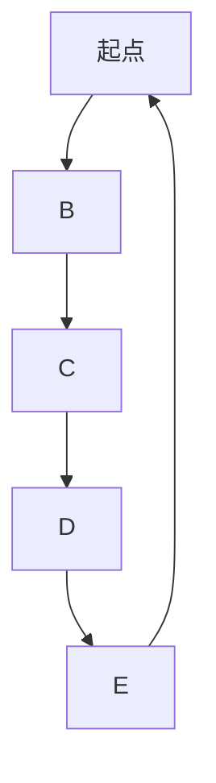
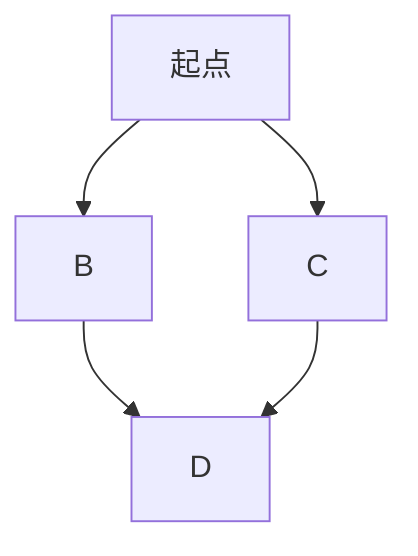
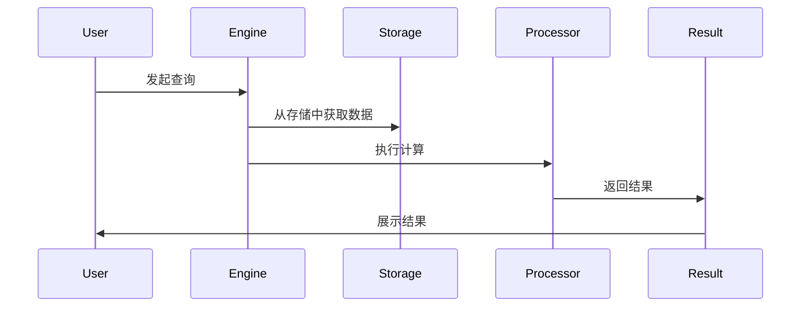
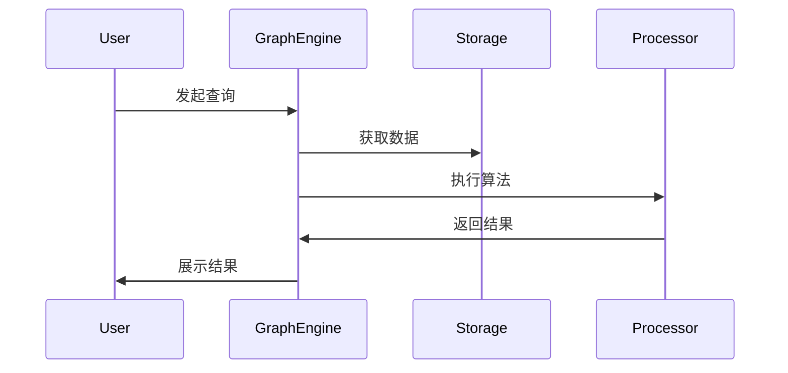

                 

# 企业级图计算引擎：高效处理大规模关系数据

> 关键词：图计算、企业级、关系数据、大规模处理、高效

> 摘要：本文将深入探讨企业级图计算引擎的概念、应用、算法原理以及实际实现。通过详细的分析和实例，帮助读者理解图计算的优势，并了解如何在实际项目中应用企业级图计算引擎来高效处理大规模关系数据。

----------------------------------------------------------------

## 第一部分：背景与核心概念

### 第1章：企业级图计算引擎概述

#### 1.1.1 问题背景
在当今数据驱动的商业环境中，企业需要处理的数据规模和复杂性不断增加。传统的数据处理方法已经难以满足企业对于快速、准确和分析深入的需求。特别是对于大规模关系数据的处理，传统的关系型数据库和传统的大数据处理技术已经显得力不从心。

#### 1.1.2 问题描述
企业需要一种高效的处理大规模关系数据的方法，能够快速地建立、查询和更新复杂的关系网络。这就引出了企业级图计算引擎的需求。

#### 1.1.3 问题解决
企业级图计算引擎是一种专门用于处理大规模关系数据的计算引擎，它能够以图结构来组织和管理数据，并通过图算法来分析和挖掘数据中的关系和模式。

#### 1.1.4 边界与外延
图计算引擎不仅仅适用于数据处理领域，它还可以应用于推荐系统、社交网络分析、知识图谱构建等多个领域。与其他计算模式相比，图计算引擎具有独特的优势和适用场景。

#### 1.1.5 概念结构与核心要素组成
企业级图计算引擎由数据存储、计算框架、算法库、应用接口等多个核心要素组成。这些要素共同协作，实现高效的数据处理和分析。

### 第2章：核心概念与联系

#### 2.1.1 核心概念原理
图计算的基础是图论，包括图的基本概念、图的表示方法以及图的算法。这些概念构成了图计算的理论基础。

#### 2.1.2 概念属性特征对比表格
| 算法       | 特点                                       | 适用场景                           |
|------------|------------------------------------------|----------------------------------|
| PageRank   | 根据节点重要性进行排序                     | 社交网络分析、搜索引擎优化       |
| Shortest Path | 计算两个节点之间的最短路径                 | 交通运输、物流配送规划           |
| Community Detection | 发现图中的社区结构                     | 社交网络分析、市场细分           |

#### 2.1.3 ER实体关系图架构
```mermaid
erDiagram
    A|--|{Person} : 实体
    B|--|{Company} : 实体
    Person ||--|{WorksFor} --> Company : 关联关系
```

### 第3章：算法原理讲解

#### 3.1.1 算法讲解
图计算的算法种类繁多，其中最基础的是图的遍历算法，如深度优先搜索（DFS）和广度优先搜索（BFS）。



#### 3.1.2 数学模型与公式
图计算的核心数学模型是邻接矩阵和图的拉普拉斯矩阵。

$$
A_{ij} =
\begin{cases}
1 & \text{如果} \ i \ \text{和} \ j \ \text{之间有边} \\
0 & \text{否则}
\end{cases}
$$

拉普拉斯矩阵的定义为：

$$
L = D - A
$$

其中，$D$ 是对角矩阵，$D_{ii} = \sum_{j=1}^{n} A_{ij}$。

#### 3.1.3 举例说明
以PageRank算法为例，假设有一个简单的图：



初始时，每个节点的PageRank值相等。通过迭代计算，最终每个节点的PageRank值会根据其在图中的重要程度进行分配。

```python
import numpy as np

# 初始PageRank值
pr = np.array([1/4, 1/4, 1/4, 1/4])

# 迭代次数
iterations = 10

# 权重矩阵
weights = np.array([[0, 1, 1, 0],
                    [1, 0, 0, 1],
                    [1, 0, 0, 1],
                    [0, 1, 1, 0]])

# 迭代计算PageRank值
for _ in range(iterations):
    pr = np.linalg.inv(np.eye(4) - weights) @ pr

print(pr)
```

输出结果为每个节点的PageRank值，反映了节点在图中的重要性。

## 第二部分：企业级图计算引擎实现

### 第4章：系统分析与架构设计方案

#### 4.1.1 问题场景介绍
在电子商务领域，用户行为数据、商品数据、订单数据等构成了复杂的关系网络，企业需要通过图计算来分析用户行为，预测用户偏好，优化商品推荐和营销策略。

#### 4.1.2 系统功能设计
使用Mermaid绘制领域模型类图：

```mermaid
classDiagram
    User <<class>>
    Product <<class>>
    Order <<class>>
    User o--* 1 Order : 下单
    Product o--* 1 Order : 订单包含
```

#### 4.1.3 系统架构设计
使用Mermaid绘制系统架构图：



#### 4.1.4 系统接口设计
系统接口的设计需要考虑数据输入、计算过程和结果输出的接口，例如：

```python
class GraphEngine:
    def load_data(self, data_source):
        # 加载数据
        pass
    
    def run_algorithm(self, algorithm_name, params):
        # 执行算法
        pass
    
    def get_result(self):
        # 获取结果
        pass
```

#### 4.1.5 系统交互
使用Mermaid绘制系统交互序列图：



### 第5章：项目实战

#### 5.1.1 环境安装
首先，安装必要的软件和库，例如Python、Graphframes等。安装步骤如下：

```shell
pip install graphframes
```

#### 5.1.2 系统核心实现
以下是一个简单的图计算引擎实现，包括数据加载、算法执行和结果输出：

```python
from graphframes import GraphFrame
from pyspark.sql import SparkSession

# 初始化SparkSession
spark = SparkSession.builder.appName("GraphEngine").getOrCreate()

# 加载数据
users = spark.read.csv("users.csv", header=True)
products = spark.read.csv("products.csv", header=True)
orders = spark.read.csv("orders.csv", header=True)

# 创建图
users.as refurbished```
users
```...```as ```
products.as ```
products
```...```as ```
orders.as ```
orders
```...```as ```
edges = users.join(orders, users.id == orders.user_id, "left_anti")
g = GraphFrame(edges, users, products)

# 执行算法
params = {'algorithm': 'pagerank', 'alpha': 0.85}
result = g.run_algorithm(**params)

# 获取结果
result.show()

# 关闭SparkSession
spark.stop()
```

#### 5.1.3 代码应用解读与分析
上述代码首先加载了用户、产品和订单数据，然后创建了图。接着，使用PageRank算法计算节点的重要性，并展示了结果。

#### 5.1.4 实际案例分析和详细讲解
假设我们需要分析用户的购物偏好，可以通过执行PageRank算法来计算每个商品的重要性，从而推断用户的购物偏好。以下是具体分析步骤：

1. 加载数据：从CSV文件中读取用户、产品和订单数据。
2. 创建图：使用用户作为节点，订单中的商品作为边，构建图。
3. 执行PageRank算法：计算每个商品的重要性。
4. 分析结果：根据商品的重要性排名，分析用户的购物偏好。

### 第6章：最佳实践与拓展

#### 6.1.1 最佳实践 Tips
- 选择合适的图计算算法：根据实际需求和数据特点选择合适的算法。
- 数据预处理：确保数据的质量和一致性，优化图的结构。
- 分布式计算：充分利用分布式计算的优势，提高计算效率。

#### 6.1.2 小结与注意事项
- 企业级图计算引擎是一种高效处理大规模关系数据的技术，具有广泛的应用前景。
- 在实际应用中，需要根据具体场景和数据特点进行定制化设计和优化。

#### 6.1.3 拓展阅读
- 《图计算：原理、算法与实践》
- 《大数据之路：阿里巴巴大数据实践》
- 《深度学习与大数据：原理与应用》

## 作者

作者：AI天才研究院/AI Genius Institute & 禅与计算机程序设计艺术 /Zen And The Art of Computer Programming

