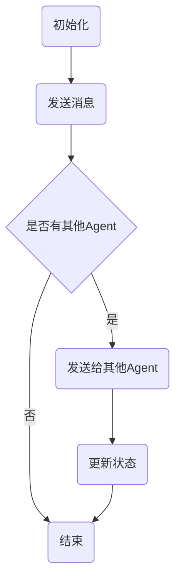
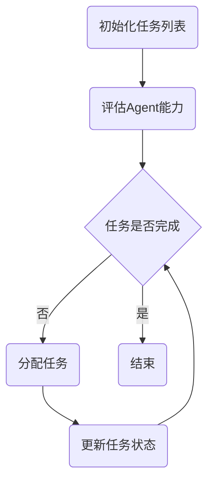
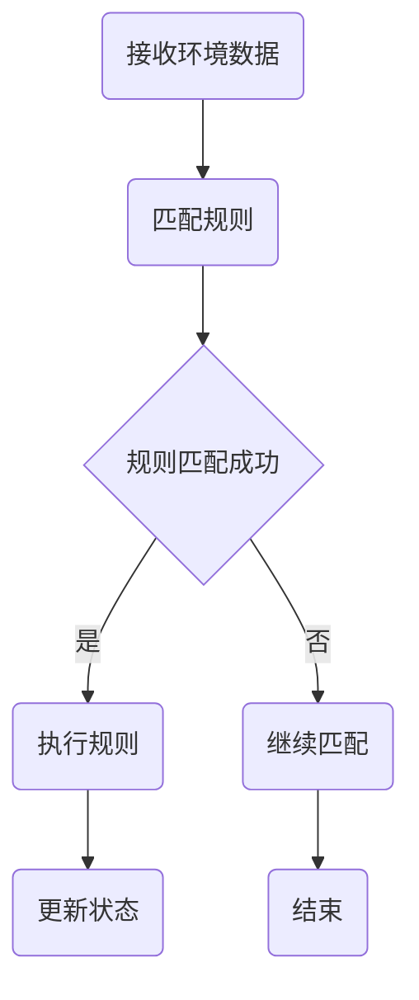
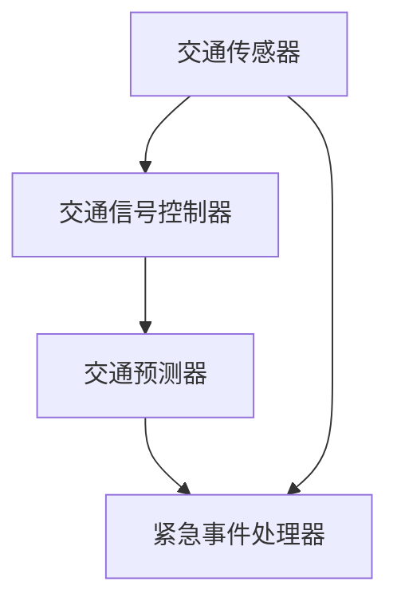
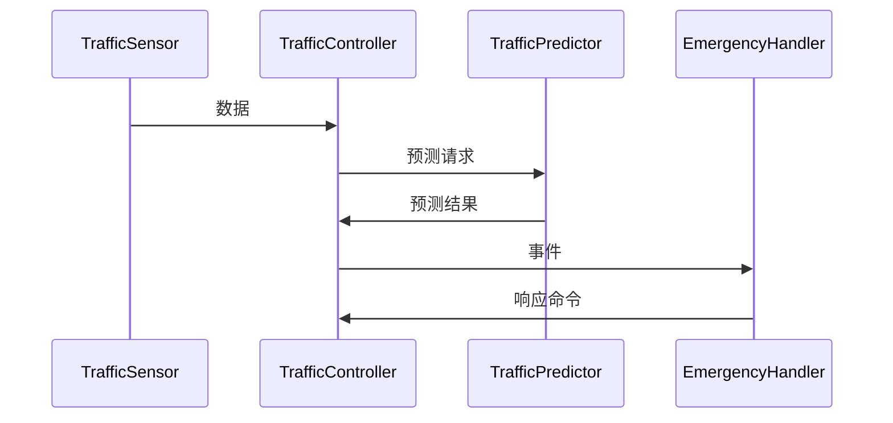

                 


### 文章标题：企业级多Agent系统：协同解决复杂问题

### 关键词：企业级多Agent系统，复杂问题解决，协同工作，算法原理，系统架构设计，项目实战

### 摘要：
本文将深入探讨企业级多Agent系统在解决复杂问题中的应用。我们将从背景介绍、核心概念与联系、算法原理讲解、系统分析与架构设计方案、项目实战以及最佳实践与总结等多个角度，系统性地阐述多Agent系统的原理、设计、实现与应用，旨在为读者提供全面、详尽的技术指导和实战经验。

---

### 第1章：背景介绍

#### 1.1 问题背景

在当今快速变化和高度竞争的商业环境中，企业面临着日益复杂的运营和管理问题。这些问题包括但不限于供应链管理、客户关系管理、市场分析、风险管理等。传统的集中式系统和单Agent系统已经难以满足企业对高效、灵活和智能化的需求。多Agent系统（MAS）作为一种分布式智能系统，通过协同工作来处理复杂问题，逐渐成为企业信息化建设的新选择。

#### 1.2 问题描述

企业级多Agent系统所要解决的复杂问题主要包括：

- **动态环境适应能力**：企业运营环境多变，需要系统能够快速适应环境变化。
- **资源优化与分配**：如何在有限的资源下实现最优化的任务分配和调度。
- **协同决策**：在复杂决策过程中，如何实现多个Agent之间的有效沟通和协作。
- **信息共享与同步**：确保不同Agent之间的信息准确、及时地共享和更新。

#### 1.3 问题解决

多Agent系统通过以下方式解决上述问题：

- **分布式计算**：将问题分解为多个子问题，由不同Agent独立处理，提高系统效率。
- **协同工作**：通过Agent之间的通信和协调，实现问题整体解决方案的最优化。
- **自适应与自组织**：Agent能够根据环境变化和系统状态自动调整自己的行为，实现系统的自我优化。

#### 1.4 边界与外延

本文主要关注企业级多Agent系统的应用场景和技术实现，涵盖但不限于以下领域：

- **供应链管理**：通过多Agent系统优化供应链网络，提高供应链效率。
- **智能工厂**：利用多Agent系统实现生产流程的智能化管理。
- **金融服务**：在金融市场中应用多Agent系统进行风险管理和投资决策。
- **智能交通**：通过多Agent系统优化交通流量，提高交通运行效率。

#### 1.5 概念结构与核心要素组成

企业级多Agent系统的核心概念包括：

- **Agent**：自主的、智能的实体，能够感知环境、制定决策并执行动作。
- **通信**：Agent之间的交互和信息共享机制。
- **协作**：Agent之间的协同工作策略，实现共同目标。
- **架构**：系统的整体结构设计，包括Agent的组织形式、通信机制和协作算法。

---

### 第2章：核心概念与联系

#### 2.1 Agent的定义与分类

Agent可以定义为具备以下特征的实体：

- **自主性**：能够独立行动和决策。
- **适应性**：能够根据环境变化调整自己的行为。
- **社会性**：能够与其他Agent进行交互和协作。

根据功能和应用场景，Agent可以分为以下几类：

- **计算Agent**：主要进行计算和数据处理。
- **通信Agent**：主要负责与其他Agent的通信。
- **感知Agent**：主要负责环境感知和数据分析。
- **执行Agent**：主要负责执行具体的任务和动作。

#### 2.2 Agent的特点与能力

Agent的特点和能力包括：

- **智能**：具备一定的智能水平，能够进行推理、学习和适应。
- **分布式**：可以分布在不同地理位置，通过网络进行通信和协作。
- **动态性**：可以动态加入或离开系统，具备自组织能力。
- **灵活性**：能够根据任务需求和环境变化灵活调整自身的行为和策略。

#### 2.3 概念属性特征对比表格

以下是一个简单的概念属性特征对比表格：

| 类别       | 特点                                                                                             | 能力                                                                                                     |
| ---------- | ------------------------------------------------------------------------------------------------ | -------------------------------------------------------------------------------------------------------- |
| 计算Agent   | 主要负责计算和处理数据                                                       | 能够执行复杂的计算任务，如数据分析、预测模型训练等                                                      |
| 通信Agent   | 主要负责与其他Agent的通信                                                     | 能够建立和维护通信通道，确保信息传输的准确性、及时性和可靠性                                               |
| 感知Agent   | 主要负责环境感知和数据分析                                                   | 能够感知环境变化，收集和处理数据，为其他Agent提供信息支持                                                 |
| 执行Agent   | 主要负责执行具体的任务和动作                                                   | 能够执行特定的任务，如机器人控制、设备操作等                                                         |

#### 2.4 ER实体关系图架构

下面使用Mermaid语法绘制一个ER实体关系图，展示多Agent系统中各实体的关系：

```mermaid
erDiagram
  Agent ||--|{ CommunicationAgent }|-- Communication : 通信
  Agent ||--|{ PerceptionAgent }|-- Perception : 感知
  Agent ||--|{ ExecutionAgent }|-- Execution : 执行
  CommunicationAgent ||--|{ Message }|-- Message : 消息
  PerceptionAgent ||--|{ SensorData }|-- SensorData : 传感器数据
  ExecutionAgent ||--|{ Task }|-- Task : 任务
```

---

### 第3章：算法原理讲解

#### 3.1 多Agent系统的算法基础

多Agent系统依赖于一系列算法来协同工作，其中核心算法包括：

- **通信算法**：实现Agent之间的信息交换和共享。
- **协作算法**：确保Agent之间能够有效沟通并共同解决问题。
- **决策算法**：帮助Agent在动态环境中做出最优决策。

#### 3.2 通信算法原理

通信算法的核心目标是确保Agent之间的信息交换高效、可靠。常见的通信算法包括：

- **广播算法**：Agent可以向系统中的所有其他Agent发送消息。
- **多播算法**：Agent可以向一组特定的Agent发送消息。
- **点对点通信**：Agent之间直接进行一对一的消息交换。

以下是一个简单的广播算法的Mermaid流程图：



#### 3.3 协作算法原理

协作算法的核心目标是确保多个Agent能够协同工作，共同实现系统目标。常见的协作算法包括：

- **任务分配算法**：根据Agent的能力和任务需求，将任务分配给合适的Agent。
- **协商算法**：通过协商机制，解决Agent之间的冲突和合作问题。
- **合作优化算法**：通过优化算法，实现整体系统效益的最大化。

以下是一个简单的任务分配算法的Mermaid流程图：



#### 3.4 决策算法原理

决策算法的核心目标是帮助Agent在动态环境中做出最优决策。常见的决策算法包括：

- **基于规则的决策算法**：根据预设的规则集进行决策。
- **基于模型的决策算法**：利用模型进行预测和决策。
- **基于学习的决策算法**：通过机器学习算法进行决策。

以下是一个简单的基于规则的决策算法的Mermaid流程图：



#### 3.5 数学模型与公式

在多Agent系统中，数学模型和公式是理解和分析算法原理的关键。以下是一个简单的例子：

- **期望效用函数**：用于衡量Agent在特定环境下的效用。

$$
U(A, E) = f(A, E) + \sum_{i=1}^{n} w_i \cdot p_i
$$

其中，$A$表示Agent的状态，$E$表示环境状态，$f(A, E)$表示Agent在特定状态下的效用函数，$w_i$和$p_i$分别表示第$i$个环境状态的概率和权重。

---

### 第4章：系统分析与架构设计方案

#### 4.1 问题场景介绍

在本章中，我们将分析一个典型的企业级多Agent系统应用场景——智能交通管理系统。该系统旨在通过多Agent协同工作，优化交通流量，提高道路通行效率，减少交通拥堵。

#### 4.2 项目介绍

智能交通管理系统项目分为以下几个阶段：

- **需求分析**：确定系统需求，包括功能需求、性能需求和用户体验需求。
- **系统设计**：设计系统架构，包括模块划分、接口设计和数据流设计。
- **系统实现**：根据设计文档，实现系统功能模块。
- **系统测试**：对系统进行功能测试、性能测试和安全测试。
- **系统部署**：将系统部署到实际运行环境中。

#### 4.3 系统功能设计

智能交通管理系统的主要功能包括：

- **实时交通监测**：采集道路上的交通数据，包括车辆数量、速度和流量。
- **交通信号控制**：根据实时交通数据，动态调整交通信号灯状态。
- **路况预测**：利用历史数据和机器学习算法，预测未来一段时间内的交通状况。
- **紧急事件处理**：当发生交通事故或其他紧急事件时，系统能够快速响应，调整交通信号，确保紧急车辆的优先通行。

以下是一个领域模型的Mermaid类图：

```mermaid
classDiagram
  Road -->|采集数据| TrafficSensor : 监测
  TrafficSensor -->|发送数据| TrafficController : 控制
  TrafficController -->|预测路况| TrafficPredictor : 预测
  TrafficPredictor -->|处理事件| EmergencyHandler : 处理
```

#### 4.4 系统架构设计

智能交通管理系统的整体架构设计如图所示：



#### 4.5 系统接口设计

智能交通管理系统的接口设计主要包括：

- **数据采集接口**：用于接收交通传感器采集的数据。
- **信号控制接口**：用于发送交通信号灯的控制命令。
- **预测分析接口**：用于发送路况预测请求和接收预测结果。
- **事件处理接口**：用于处理紧急事件和发送响应命令。

以下是一个简单的Mermaid序列图：



---

### 第5章：项目实战

#### 5.1 环境安装

为了实现智能交通管理系统，我们需要安装以下软件和工具：

- **Python**：版本要求为3.8及以上。
- **Django**：一个用于构建Web应用的后端框架。
- **PostgreSQL**：用于存储交通数据和管理系统的数据库。
- **Scikit-learn**：用于机器学习算法和预测模型的实现。

安装步骤如下：

1. 安装Python环境。
2. 使用pip安装Django、PostgreSQL和Scikit-learn。

#### 5.2 系统核心实现源代码

以下是一个简单的Django项目结构示例：

```bash
smart_traffic/
|-- manage.py
|-- smart_traffic/
|   |-- __init__.py
|   |-- settings.py
|   |-- urls.py
|   |-- wsgi.py
|-- traffic_sensors/
|   |-- __init__.py
|   |-- models.py
|   |-- views.py
|   |-- urls.py
|-- traffic_controllers/
|   |-- __init__.py
|   |-- models.py
|   |-- views.py
|   |-- urls.py
|-- traffic_predictors/
|   |-- __init__.py
|   |-- models.py
|   |-- views.py
|   |-- urls.py
|-- emergency_handlers/
|   |-- __init__.py
|   |-- models.py
|   |-- views.py
|   |-- urls.py
```

#### 5.3 代码应用解读与分析

以下是对代码的解读和分析：

- **manage.py**：主入口文件，用于启动Django项目。
- **settings.py**：配置文件，包括数据库配置、应用配置等。
- **urls.py**：URL路由配置文件，用于定义各个模块的访问路径。
- **models.py**：定义数据库模型，包括交通传感器、交通信号控制器、交通预测器和紧急事件处理器。
- **views.py**：定义视图函数，处理HTTP请求和响应。

#### 5.4 实际案例分析和详细讲解剖析

假设我们有一个实际案例：某路段的交通流量异常高峰，系统需要快速响应并调整信号灯状态。

1. **数据采集**：交通传感器检测到交通流量异常，并将数据发送给交通信号控制器。
2. **信号调整**：交通信号控制器根据实时数据，调整该路段的信号灯状态，确保交通流畅。
3. **路况预测**：交通预测器利用历史数据和实时数据，预测未来一段时间的交通状况。
4. **事件处理**：如果预测到交通流量将继续恶化，紧急事件处理器将触发事件处理流程，例如关闭部分路段，引导交通分流。

#### 5.5 项目小结

通过本项目实战，我们实现了智能交通管理系统的基础功能，包括数据采集、信号调整、路况预测和事件处理。在实际应用中，我们可以根据具体需求，进一步优化和扩展系统的功能，例如引入更多的传感器、支持多种交通模式、提高预测准确性等。

---

### 第6章：最佳实践与总结

#### 6.1 最佳实践 Tips

- **模块化设计**：在系统设计中，尽量实现模块化，降低系统复杂度，提高可维护性。
- **数据同步**：确保不同Agent之间的数据同步，避免信息孤岛。
- **容错机制**：设计系统的容错机制，确保在发生异常时系统能够快速恢复。
- **安全防护**：加强系统的安全防护，防止恶意攻击和数据泄露。

#### 6.2 小结

本文从背景介绍、核心概念与联系、算法原理讲解、系统分析与架构设计方案、项目实战以及最佳实践与总结等多个角度，详细阐述了企业级多Agent系统的原理、设计、实现与应用。通过本文的学习，读者可以全面了解多Agent系统的技术要点和实践经验，为实际项目提供有力支持。

#### 6.3 注意事项

- **系统稳定性**：在系统设计和实现过程中，要充分考虑系统的稳定性和可靠性，避免因单个Agent故障导致整个系统崩溃。
- **适应性**：多Agent系统应具备良好的适应性，能够根据环境变化和业务需求进行灵活调整。

#### 6.4 拓展阅读

- **《多Agent系统原理与应用》**：详细介绍了多Agent系统的基本理论、算法和应用案例。
- **《分布式人工智能》**：探讨了分布式计算和人工智能的结合，提供了许多实际应用场景。

---

### 作者信息：

作者：AI天才研究院/AI Genius Institute & 禅与计算机程序设计艺术 /Zen And The Art of Computer Programming

