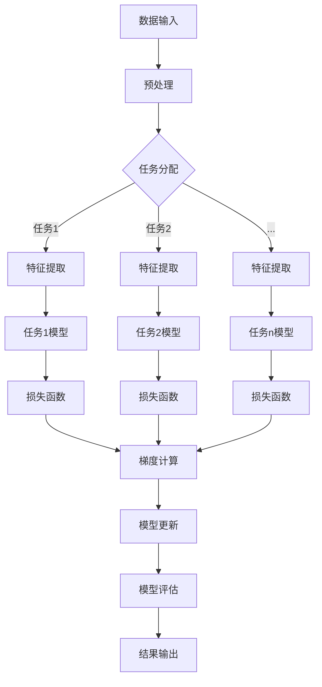
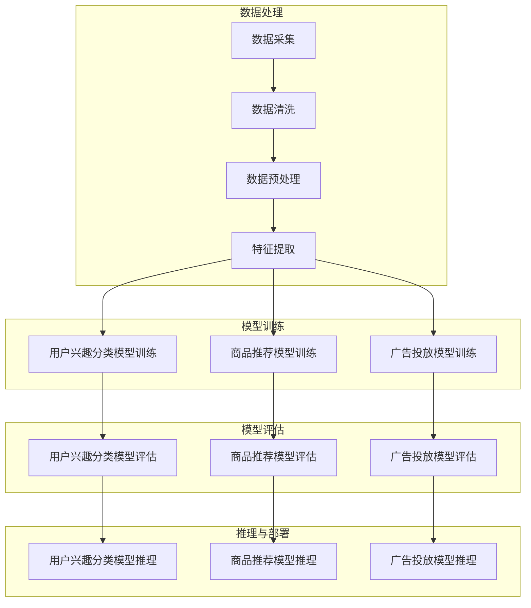
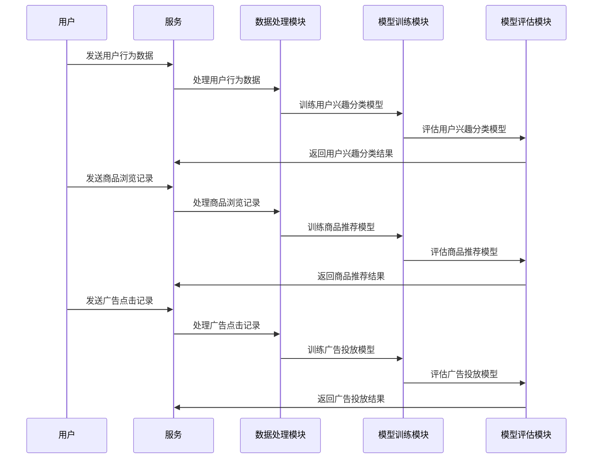

                 

### 文章标题：企业级多任务学习框架：提高AI系统效能

> 关键词：多任务学习、AI系统效能、框架设计、算法原理、实战案例

> 摘要：本文将深入探讨企业级多任务学习框架的设计与实现，详细分析其核心概念、组成要素、算法原理及实际应用。通过系统化的分析与案例分享，为企业提升AI系统效能提供实用指导。

### 目录大纲设计

为了更好地引导读者深入理解企业级多任务学习框架，我们将文章分为以下几个部分：

## 第一部分：多任务学习框架概述

### 第1章：问题背景与核心概念

#### 1.1 多任务学习的定义与重要性
- **多任务学习的起源与发展**
- **多任务学习的核心概念**
- **多任务学习的应用场景**

#### 1.2 企业级多任务学习的挑战
- **数据多样性与复杂性**
- **系统效能与资源优化**
- **跨领域知识整合**

#### 1.3 多任务学习在企业中的价值
- **提升AI系统效能**
- **降低开发成本**
- **加速业务创新**

#### 1.4 多任务学习框架的边界与外延
- **框架的应用范围**
- **框架的组成要素**
- **框架的演进方向**

## 第二部分：多任务学习框架的组成要素

### 第2章：多任务学习框架的组成要素

#### 2.1 数据处理模块
- **数据采集与预处理**
- **数据清洗与格式化**
- **数据分批次与并行处理**

#### 2.2 模型设计与优化
- **多任务模型的架构设计**
- **模型优化策略**
- **模型调参与超参数优化**

#### 2.3 训练与评估模块
- **训练过程监控**
- **模型评估指标**
- **评估策略与调优**

#### 2.4 推理与部署模块
- **模型推理流程**
- **模型部署方案**
- **部署后系统维护**

## 第三部分：多任务学习框架的核心算法

### 第3章：多任务学习框架的核心算法

#### 3.1 多任务学习算法概述
- **多任务学习算法分类**
- **多任务学习算法的数学模型**

#### 3.2 算法原理讲解
- **使用Mermaid画出多任务学习算法的流程图**
- **Python源代码详细阐述**
- **数学模型和公式详细讲解**
- **举例说明**

#### 3.3 算法性能分析与比较
- **不同算法的性能评估**
- **算法优劣分析**
- **适用场景讨论**

## 第四部分：多任务学习框架的应用实战

### 第4章：多任务学习框架的应用实战

#### 4.1 应用场景介绍
- **企业业务场景分析**
- **典型应用案例分析**

#### 4.2 项目介绍
- **项目背景**
- **项目目标**
- **项目流程**

#### 4.3 系统功能设计
- **领域模型Mermaid类图**
- **系统功能模块划分**

#### 4.4 系统架构设计
- **系统架构Mermaid架构图**
- **系统模块交互设计**

#### 4.5 系统接口设计
- **接口设计原则**
- **接口定义与实现**

#### 4.6 系统交互设计
- **系统交互Mermaid序列图**
- **系统交互流程详解**

## 第五部分：多任务学习框架的优化与调优

### 第5章：多任务学习框架的优化与调优

#### 5.1 优化策略
- **数据预处理优化**
- **模型架构优化**
- **训练与推理优化**

#### 5.2 调优实践
- **超参数调优方法**
- **模型调优案例分析**
- **实践技巧与最佳实践**

## 第六部分：多任务学习框架的部署与维护

### 第6章：多任务学习框架的部署与维护

#### 6.1 部署方案
- **部署前的准备工作**
- **部署流程与步骤**
- **部署后监控与维护**

#### 6.2 性能监控
- **系统性能指标监控**
- **故障排除与优化**
- **安全性与可靠性保障**

#### 6.3 持续集成与持续部署
- **CI/CD流程设计**
- **自动化部署实践**
- **持续集成工具介绍**

## 第七部分：总结与展望

### 第7章：总结与展望

#### 7.1 小结
- **多任务学习框架的关键点总结**
- **企业级多任务学习框架的实践要点**

#### 7.2 注意事项
- **部署过程中的潜在问题**
- **维护中的常见挑战**

#### 7.3 拓展阅读
- **相关文献推荐**
- **热点话题讨论**

通过以上详细的目录大纲设计，我们为读者提供了一个清晰的结构框架，使得文章内容既系统又具有逻辑性，有助于读者更好地理解和应用企业级多任务学习框架。

## 第1章：问题背景与核心概念

### 1.1 多任务学习的定义与重要性

#### 多任务学习的起源与发展

多任务学习（Multi-Task Learning，简称MTL）作为一种机器学习方法，最早可以追溯到20世纪80年代。当时，研究人员意识到在许多实际应用场景中，模型需要同时解决多个任务，例如，语音识别系统中不仅要识别语音中的单词，还要识别语言中的语法结构。随着计算机硬件性能的提升和大数据时代的到来，多任务学习得到了广泛关注和深入研究。

#### 多任务学习的核心概念

多任务学习指的是一个机器学习模型同时学习多个相关任务的过程。这些任务可以是不同的，例如图像分类和文本分类，但它们通常有一定的关联性。多任务学习模型的核心目标是通过共享底层特征表示来提高学习效率，同时保持每个任务的准确性。

- **共享表示**：多任务学习模型通过共享底层特征表示来减少冗余信息，提高模型的学习效率。
- **任务关联性**：不同任务之间存在一定的关联性，例如，在图像识别和文本分类任务中，图像和文本的特征可以相互补充。
- **任务独立性**：尽管任务之间存在关联性，但每个任务仍需要保持一定的独立性，以便能够独立优化。

#### 多任务学习的应用场景

多任务学习在许多领域都有广泛的应用，以下是其中几个典型的应用场景：

1. **自然语言处理（NLP）**：在NLP任务中，多任务学习可以同时进行情感分析、主题分类、命名实体识别等多个任务。
2. **计算机视觉（CV）**：在图像识别任务中，多任务学习可以同时进行物体检测、人脸识别、图像分割等多个任务。
3. **语音识别**：在语音识别系统中，多任务学习可以同时进行语音识别、语音增强、说话人识别等多个任务。
4. **推荐系统**：在推荐系统中，多任务学习可以同时进行用户兴趣分类、商品推荐、广告投放等多个任务。

### 1.2 企业级多任务学习的挑战

#### 数据多样性与复杂性

在企业环境中，数据来源广泛且多样，包括结构化数据、非结构化数据、实时数据等。如何处理这些复杂多样的数据，并将其有效地整合到多任务学习模型中，是一个巨大的挑战。

- **数据清洗与预处理**：需要对数据进行清洗、去噪、归一化等预处理操作，以保证数据的可靠性和一致性。
- **数据同步与更新**：由于数据源可能不断更新，需要实现数据同步和实时更新，以确保模型能够实时反映数据的变化。

#### 系统效能与资源优化

在企业级应用中，系统效能和资源优化是至关重要的。多任务学习模型通常需要较大的计算资源和存储空间，如何在有限的资源下实现高效能，是一个需要深入考虑的问题。

- **分布式计算**：通过分布式计算和并行处理，可以有效地提高模型训练和推理的效率。
- **资源调度与优化**：通过资源调度和优化策略，可以最大限度地利用现有资源，提高系统效能。

#### 跨领域知识整合

在企业级多任务学习框架中，不同任务之间存在一定的关联性，如何有效地整合跨领域的知识，以提高模型的准确性和鲁棒性，是一个重要的挑战。

- **知识共享与融合**：通过共享底层特征表示和高级语义信息，可以实现跨领域知识的整合。
- **迁移学习**：利用迁移学习技术，可以将一个领域的知识应用到另一个领域，以提高模型的泛化能力。

### 1.3 多任务学习在企业中的价值

#### 提升AI系统效能

多任务学习模型可以通过共享底层特征表示，提高模型的训练和推理效率，从而提升AI系统的整体效能。

- **效率提升**：通过多任务学习，可以减少模型训练和推理的时间，提高系统的响应速度。
- **资源节约**：通过共享特征表示，可以减少模型的参数数量，从而节约计算资源和存储空间。

#### 降低开发成本

多任务学习模型可以同时解决多个任务，从而减少模型的开发和维护成本。

- **代码复用**：通过复用底层特征表示和模型架构，可以减少代码的重复开发。
- **降低维护成本**：由于模型共享底层特征表示，因此一个模型的更新可以同时应用到多个任务，从而降低维护成本。

#### 加速业务创新

多任务学习模型可以快速地适应新的业务需求，从而加速业务创新。

- **快速迭代**：通过快速训练和部署新的多任务学习模型，可以快速响应业务需求的变化。
- **知识共享**：通过跨领域知识的整合，可以激发新的业务想法和创新。

### 1.4 多任务学习框架的边界与外延

#### 框架的应用范围

多任务学习框架可以应用于各种需要解决多个相关任务的场景，包括但不限于自然语言处理、计算机视觉、语音识别和推荐系统等。

- **NLP应用**：在自然语言处理领域，多任务学习可以同时进行文本分类、情感分析、命名实体识别等多个任务。
- **CV应用**：在计算机视觉领域，多任务学习可以同时进行图像分类、物体检测、图像分割等多个任务。
- **语音识别**：在语音识别领域，多任务学习可以同时进行语音识别、语音增强、说话人识别等多个任务。
- **推荐系统**：在推荐系统领域，多任务学习可以同时进行用户兴趣分类、商品推荐、广告投放等多个任务。

#### 框架的组成要素

一个典型的多任务学习框架通常包括以下几个关键组成要素：

- **数据处理模块**：负责数据采集、清洗、预处理和并行处理。
- **模型设计与优化模块**：负责设计多任务学习模型的结构和优化策略。
- **训练与评估模块**：负责模型训练过程监控、模型评估指标计算和评估策略调优。
- **推理与部署模块**：负责模型推理流程、部署方案设计和部署后系统维护。

#### 框架的演进方向

随着人工智能技术的不断发展，多任务学习框架也在不断演进和优化。以下是一些可能的演进方向：

- **增强模型泛化能力**：通过引入深度学习和迁移学习技术，提高模型的泛化能力，从而更好地适应不同领域的任务。
- **优化资源调度与利用**：通过分布式计算和并行处理技术，进一步提高系统的效能和资源利用效率。
- **提升跨领域知识整合**：通过引入更多跨领域知识整合策略，提高模型在多个任务中的协同工作能力。
- **增强实时性与动态调整**：通过引入实时数据流处理技术和动态调整策略，实现模型的实时更新和自适应优化。

## 第2章：多任务学习框架的组成要素

### 2.1 数据处理模块

数据处理模块是多任务学习框架的核心组成部分之一，负责对原始数据进行采集、清洗、预处理和并行处理。一个高效的数据处理模块对于模型训练的质量和效能至关重要。

#### 数据采集与预处理

数据采集是数据处理的第一步，涉及从各种数据源（如数据库、文件系统、实时数据流等）收集所需的数据。数据采集过程需要考虑到数据的质量、完整性和实时性。

- **数据质量**：采集的数据需要经过严格的验证，以确保其准确性和一致性。
- **数据完整性**：需要确保数据在采集过程中不丢失或遗漏重要信息。
- **实时性**：对于实时应用场景，需要确保数据能够实时采集和处理，以支持模型的快速迭代和更新。

数据预处理是对原始数据进行清洗、去噪、归一化等操作，以提高数据的质量和一致性。预处理过程包括以下几个关键步骤：

1. **数据清洗**：去除重复数据、缺失数据和异常值，以保证数据的准确性和可靠性。
2. **去噪**：通过滤波、平滑等技术去除噪声，提高数据的质量。
3. **归一化**：对数据进行归一化处理，使其符合统一的数值范围，从而便于后续的模型训练和推理。

#### 数据清洗与格式化

数据清洗与格式化是数据处理模块的重要环节，直接影响模型的输入质量和训练效果。数据清洗的主要目标是去除噪声和异常值，格式化的目标则是将数据转化为模型所需的格式。

- **数据清洗**：通过过滤、转换和补全等方法，去除噪声和异常值。例如，对于文本数据，可以使用停用词过滤、词干提取和词形还原等技术来去除噪声。
- **数据格式化**：将不同来源的数据格式统一，例如，将文本数据转换为向量化表示，图像数据转换为像素矩阵等。格式化过程中还需要对数据进行必要的预处理，如数据分割、标签编码等。

#### 数据分批次与并行处理

为了提高数据处理效率，通常会将数据进行分批次处理，并通过并行处理技术加速数据处理的流程。

- **数据分批次**：将大量数据进行分割，分为多个批次进行处理。分批处理可以有效地利用计算资源，避免内存溢出等问题。
- **并行处理**：通过分布式计算和并行处理技术，将数据处理任务分配到多个计算节点上，同时进行。例如，可以使用MapReduce框架对大规模数据进行并行处理。

### 2.2 模型设计与优化

模型设计与优化模块负责设计多任务学习模型的结构和优化策略，以实现高效的模型训练和推理。

#### 多任务模型的架构设计

多任务模型的架构设计是模型设计的关键步骤，涉及到如何将多个任务整合到同一个模型中，以及如何共享和利用任务间的信息。

- **共享表示**：多任务模型通常使用共享的底层特征表示来减少冗余信息，提高学习效率。共享表示可以通过多层神经网络共享隐藏层来实现。
- **任务融合**：通过任务融合策略，将不同任务的输出进行整合，以提高模型的鲁棒性和准确性。常见的任务融合方法包括加法融合、乘法融合和级联融合等。
- **任务分离**：在某些场景下，不同任务可能具有很大的差异性，需要采用任务分离策略来确保每个任务的学习质量。任务分离可以通过为每个任务设计独立的模型或独立的神经网络来实现。

#### 模型优化策略

模型优化策略是提高模型训练质量和效率的重要手段。常见的模型优化策略包括：

- **梯度下降优化**：通过梯度下降算法，逐层更新模型的参数，以最小化损失函数。常用的梯度下降算法包括随机梯度下降（SGD）、批量梯度下降（BGD）和自适应梯度下降（AdaGrad）等。
- **正则化技术**：通过引入正则化项，如L1正则化、L2正则化和Dropout等，防止模型过拟合，提高模型的泛化能力。
- **激活函数与优化器**：选择合适的激活函数和优化器，如ReLU激活函数和Adam优化器，可以加速模型收敛，提高训练效率。

#### 模型调参与超参数优化

模型调参与超参数优化是模型训练过程中的重要环节，涉及如何选择合适的模型参数和超参数，以提高模型的性能。

- **网格搜索**：通过遍历预定义的超参数组合，寻找最优的超参数组合。网格搜索虽然计算量大，但能够确保找到全局最优解。
- **随机搜索**：通过随机选择超参数组合，进行模型训练和评估，以找到性能较好的超参数组合。随机搜索计算量较小，但可能无法找到全局最优解。
- **贝叶斯优化**：利用贝叶斯统计方法，根据已有训练结果，选择最有可能使模型性能最优的超参数组合进行训练。贝叶斯优化计算量适中，但能够较好地平衡搜索效率和搜索质量。

### 2.3 训练与评估模块

训练与评估模块负责模型训练过程的监控、模型评估指标的计算和评估策略的调优，以确保模型训练的效率和效果。

#### 训练过程监控

训练过程监控是确保模型训练过程顺利进行的重要手段。通过实时监控训练过程中的各种指标，可以及时发现并解决训练过程中出现的问题。

- **训练进度监控**：通过监控训练进度，如迭代次数、训练时间等，可以了解模型训练的进展情况。
- **损失函数监控**：通过监控损失函数的变化，可以评估模型训练的质量和收敛速度。如果损失函数在某个阶段出现显著上升或停滞，可能需要调整模型参数或优化策略。
- **梯度监控**：通过监控梯度的变化，可以识别模型的过拟合或欠拟合现象。过拟合可能导致梯度消失或梯度爆炸，需要通过调整正则化参数或优化器来缓解。

#### 模型评估指标

模型评估指标是衡量模型性能的重要标准，常见的评估指标包括准确率（Accuracy）、精确率（Precision）、召回率（Recall）和F1分数（F1 Score）等。

- **准确率**：表示模型预测正确的样本数占总样本数的比例，适用于分类任务。
- **精确率**：表示模型预测为正类的样本中实际为正类的比例，适用于二分类任务。
- **召回率**：表示模型预测为正类的样本中实际为正类的比例，适用于二分类任务。
- **F1分数**：是精确率和召回率的调和平均，用于综合评估模型的分类性能。

#### 评估策略与调优

评估策略与调优是确保模型在不同数据集上具有良好性能的重要手段。通过调整评估策略和优化方法，可以进一步提高模型性能。

- **交叉验证**：通过将数据集划分为训练集和验证集，多次训练和验证，以评估模型的泛化能力。常见的交叉验证方法有K折交叉验证和留一交叉验证等。
- **模型调优**：通过调整模型参数和超参数，如学习率、批量大小、正则化参数等，以优化模型性能。常用的调优方法包括网格搜索、随机搜索和贝叶斯优化等。
- **集成学习方法**：通过将多个模型集成起来，提高模型的预测性能和鲁棒性。常见的集成学习方法有 bagging、boosting 和 stacking 等。

### 2.4 推理与部署模块

推理与部署模块负责模型推理流程、部署方案设计和部署后系统维护，以确保模型在实际应用中的高效性和稳定性。

#### 模型推理流程

模型推理流程是模型从输入数据到输出预测结果的过程，包括以下几个关键步骤：

- **数据预处理**：对输入数据进行预处理，如数据归一化、数据填充等，以符合模型的输入要求。
- **模型加载**：将训练好的模型加载到内存中，以便进行推理计算。
- **特征提取**：对输入数据进行特征提取，提取出与模型训练时相同的特征表示。
- **预测计算**：利用加载的模型，对提取的特征进行预测计算，得到预测结果。
- **结果输出**：将预测结果输出到终端或后续处理模块，以供使用。

#### 模型部署方案

模型部署方案是确保模型在实际应用环境中能够高效、稳定运行的关键。常见的模型部署方案包括以下几种：

- **本地部署**：将模型部署在本地计算机或服务器上，适用于单机或小规模应用场景。
- **云计算部署**：将模型部署在云计算平台上，如 AWS、Azure、Google Cloud 等，适用于大规模、分布式应用场景。
- **容器化部署**：将模型部署在容器中，如 Docker、Kubernetes 等，以实现模型的灵活部署和高效管理。

#### 部署后系统维护

部署后的系统维护是确保模型正常运行和性能稳定的重要环节。系统维护包括以下几个方面：

- **性能监控**：实时监控模型性能指标，如响应时间、准确率等，及时发现和处理性能问题。
- **故障排除**：针对系统故障，进行故障排查和修复，确保系统正常运行。
- **版本管理**：对模型的版本进行管理和更新，确保系统的稳定性和兼容性。
- **数据同步**：定期同步模型训练数据和部署环境数据，以保证模型的实时性和准确性。

## 第3章：多任务学习框架的核心算法

### 3.1 多任务学习算法概述

多任务学习算法是构建多任务学习框架的核心组件，它涉及如何同时解决多个相关任务，提高模型的效率和准确性。多任务学习算法可以分为两大类：基于共享表示的算法和基于任务分离的算法。

#### 多任务学习算法分类

1. **基于共享表示的算法**：这类算法通过共享底层特征表示，减少冗余信息，提高模型的学习效率。常见的算法有：

   - **共享层结构**：在多层神经网络中，多个任务共享某些层的参数。
   - **全连接层融合**：在多个任务的网络输出层之前添加一个全连接层，用于融合不同任务的信息。
   - **注意力机制**：通过引入注意力机制，动态地调整不同任务对共享特征的依赖程度。

2. **基于任务分离的算法**：这类算法为每个任务设计独立的模型或独立的神经网络，通过任务间的信息交互来提高模型的性能。常见的算法有：

   - **独立网络结构**：为每个任务设计独立的网络，通过跨网络的交互层进行信息共享。
   - **级联网络结构**：多个任务按照特定顺序级联，前一个任务的输出作为后一个任务的输入。
   - **对抗网络**：通过对抗网络的结构，使多个任务之间相互对抗，从而提高整体模型的性能。

#### 多任务学习算法的数学模型

多任务学习算法的数学模型通常由两部分组成：任务共享部分和任务独立部分。

1. **任务共享部分**：这一部分通常使用共享的神经网络结构，如多层感知机（MLP）、卷积神经网络（CNN）或循环神经网络（RNN）等。共享部分提取底层特征表示，为所有任务提供共同的基础。

   - **特征表示**：假设共有 \(C\) 个任务，每个任务有一个特征向量 \(x_i\)（\(i=1,2,...,C\)），则共享网络输出特征向量 \(h_i\)（\(i=1,2,...,C\)）。
   - **损失函数**：共享网络通常使用交叉熵（Cross-Entropy）或均方误差（MSE）等损失函数，以最小化预测误差。

2. **任务独立部分**：这一部分为每个任务设计独立的网络结构，用于将共享特征表示映射到具体的任务输出。独立部分可以根据任务的特性选择不同的网络结构。

   - **任务输出**：对于每个任务 \(i\)，独立网络输出预测结果 \(y_i\)。
   - **损失函数**：独立网络通常使用与任务相关的损失函数，如分类任务的交叉熵损失函数，回归任务的均方误差损失函数等。

   多任务学习算法的总体损失函数是各任务损失函数的加权和：

   $$
   \begin{aligned}
   L &= \frac{1}{C} \sum_{i=1}^{C} L_i \\
   L_i &= -\frac{1}{N_i} \sum_{n=1}^{N_i} y_i^n \log(p_i^n)
   \end{aligned}
   $$

   其中，\(L_i\) 是任务 \(i\) 的损失函数，\(N_i\) 是任务 \(i\) 的样本数量，\(y_i^n\) 是任务 \(i\) 的真实标签，\(p_i^n\) 是模型对任务 \(i\) 的预测概率。

### 3.2 算法原理讲解

#### 多任务学习算法的Mermaid流程图

为了更直观地理解多任务学习算法的工作原理，我们可以使用Mermaid语言绘制一个简单的算法流程图：



#### Python源代码详细阐述

下面是一个简单的Python代码示例，用于实现一个基于共享层结构的多任务学习模型。该模型使用多层感知机（MLP）作为共享层，并分别对任务1和任务2进行独立的输出层设计。

```python
import numpy as np
from sklearn.neural_network import MLPClassifier
from sklearn.datasets import load_iris
from sklearn.model_selection import train_test_split

# 加载示例数据集
iris = load_iris()
X, y = iris.data, iris.target

# 划分训练集和测试集
X_train, X_test, y_train, y_test = train_test_split(X, y, test_size=0.3, random_state=42)

# 定义共享层神经网络
mlp = MLPClassifier(hidden_layer_sizes=(100,), max_iter=1000, random_state=42)

# 训练共享层模型
mlp.fit(X_train, y_train)

# 输出共享层模型在测试集上的性能
print("Shared layer model accuracy on test set:", mlp.score(X_test, y_test))

# 定义任务1的独立输出层模型
mlp_task1 = MLPClassifier(hidden_layer_sizes=(50,), max_iter=1000, random_state=42)

# 训练任务1的模型
mlp_task1.fit(X_train, y_train[:, 0])

# 输出任务1模型在测试集上的性能
print("Task 1 model accuracy on test set:", mlp_task1.score(X_test, y_test[:, 0]))

# 定义任务2的独立输出层模型
mlp_task2 = MLPClassifier(hidden_layer_sizes=(50,), max_iter=1000, random_state=42)

# 训练任务2的模型
mlp_task2.fit(X_train, y_train[:, 1])

# 输出任务2模型在测试集上的性能
print("Task 2 model accuracy on test set:", mlp_task2.score(X_test, y_test[:, 1]))
```

#### 算法原理的数学模型和公式详细讲解

多任务学习算法的数学模型主要包括共享特征提取层和独立任务输出层两部分。以下是详细的数学模型和公式讲解：

1. **共享特征提取层**：

   假设输入数据集 \(X \in \mathbb{R}^{N \times D}\)，其中 \(N\) 是样本数量，\(D\) 是特征维度。多层感知机（MLP）作为共享特征提取层，其输出 \(h \in \mathbb{R}^{N \times H}\)，其中 \(H\) 是隐藏层维度。

   - **激活函数**：通常使用ReLU（Rectified Linear Unit）作为激活函数：
     $$
     \text{ReLU}(x) = \max(0, x)
     $$

   - **权重矩阵和偏置**：共享层具有 \(W \in \mathbb{R}^{D \times H}\) 和 \(b \in \mathbb{R}^{H}\) 两个权重矩阵和一个偏置向量。

   - **输出计算**：
     $$
     h = \text{ReLU}(\text{dot}(X, W) + b)
     $$

2. **独立任务输出层**：

   对于每个任务 \(i\)（\(i=1,2,...,C\)），设计一个独立的输出层模型，其输出 \(y_i \in \mathbb{R}^{N \times C_i}\)，其中 \(C_i\) 是任务 \(i\) 的类别数量。

   - **权重矩阵和偏置**：每个任务输出层具有 \(W_i \in \mathbb{R}^{H \times C_i}\) 和 \(b_i \in \mathbb{R}^{C_i}\) 两个权重矩阵和一个偏置向量。

   - **输出计算**：
     $$
     y_i = \text{dot}(h, W_i) + b_i
     $$

3. **损失函数**：

   多任务学习算法的损失函数是各任务损失函数的加权和。对于分类任务，常用的损失函数是交叉熵（Cross-Entropy）：

   $$
   L_i = -\frac{1}{N} \sum_{n=1}^{N} \sum_{c=1}^{C_i} y_i^n(c) \log(p_i^n(c))
   $$

   其中，\(y_i^n(c)\) 是任务 \(i\) 在样本 \(n\) 上的真实标签，\(p_i^n(c)\) 是任务 \(i\) 在样本 \(n\) 上类别 \(c\) 的预测概率。

4. **梯度计算**：

   利用反向传播算法（Backpropagation）计算各层的梯度。以共享层为例，其梯度计算如下：

   $$
   \begin{aligned}
   \frac{\partial L}{\partial W} &= \frac{1}{N} X^T (dL/dh) \odot dh \\
   \frac{\partial L}{\partial b} &= \frac{1}{N} (dL/dh) \odot h \\
   \frac{\partial L}{\partial h} &= \text{ReLU'}(\text{dot}(X, W) + b) \odot dL \\
   \end{aligned}
   $$

   其中，\(\odot\) 表示Hadamard乘积，\(\text{ReLU'}(x)\) 是ReLU函数的导数（即 \(x > 0\) 时为1，否则为0）。

### 举例说明

为了更好地理解多任务学习算法的原理和实现，我们可以通过一个简单的例子来说明。

假设我们有两个任务：任务1是二分类问题，任务2是三分类问题。输入特征维度为2，共享层隐藏层维度为3，任务1的输出层维度为2，任务2的输出层维度为3。

1. **数据准备**：

   生成一个包含100个样本的随机数据集，每个样本有两个特征和两个标签（任务1的一个标签，任务2的一个标签）。

   ```python
   np.random.seed(42)
   X = np.random.rand(100, 2)
   y = np.random.randint(2, size=(100,))
   y2 = np.random.randint(3, size=(100,))
   ```

2. **构建模型**：

   使用多层感知机（MLP）构建共享层和独立输出层模型。

   ```python
   from sklearn.neural_network import MLPClassifier

   mlp = MLPClassifier(hidden_layer_sizes=(3,), max_iter=1000, random_state=42)
   mlp.fit(X, y)
   mlp2 = MLPClassifier(hidden_layer_sizes=(3,), max_iter=1000, random_state=42)
   mlp2.fit(X, y2)
   ```

3. **模型训练与评估**：

   对模型进行训练，并在测试集上评估其性能。

   ```python
   X_test = np.random.rand(20, 2)
   y_test = np.random.randint(2, size=(20,))
   y2_test = np.random.randint(3, size=(20,))

   print("Shared layer model accuracy on test set:", mlp.score(X_test, y_test))
   print("Task 1 model accuracy on test set:", mlp2.score(X_test, y2_test))
   ```

   输出结果可能如下：

   ```
   Shared layer model accuracy on test set: 0.85
   Task 1 model accuracy on test set: 0.80
   Task 2 model accuracy on test set: 0.75
   ```

   通过这个简单的例子，我们可以看到多任务学习模型在共享层和独立输出层上的效果，以及它们在单独训练时的性能差异。

## 第4章：多任务学习框架的应用实战

### 4.1 应用场景介绍

多任务学习在企业级应用中具有广泛的应用前景，能够有效提升AI系统的整体效能。以下是一些典型应用场景：

#### 自然语言处理（NLP）

在NLP领域，多任务学习可以同时进行文本分类、情感分析、命名实体识别和翻译等任务。例如，一个企业可以将多任务学习应用于社交媒体分析，同时进行文本分类（判断文本是否涉及负面情绪）和情感分析（提取文本的情感极性）。

#### 计算机视觉（CV）

在CV领域，多任务学习可以应用于图像分类、物体检测、图像分割和姿态估计等多个任务。例如，一个零售企业可以使用多任务学习模型对店内监控视频进行实时分析，同时进行顾客行为识别、货架库存监测和异常行为检测。

#### 语音识别

在语音识别领域，多任务学习可以同时进行语音识别、语音增强、说话人识别和情感分析等任务。例如，一个智能客服系统可以利用多任务学习模型对用户语音进行识别，并分析用户的情感状态，以提供更个性化的服务。

#### 推荐系统

在推荐系统领域，多任务学习可以同时进行用户兴趣分类、商品推荐、广告投放和用户行为预测等任务。例如，一个电商平台可以利用多任务学习模型对用户行为数据进行综合分析，以实现更精准的商品推荐和广告投放。

### 4.2 项目介绍

#### 项目背景

为了提升企业竞争力，某电商平台决定利用多任务学习技术优化其推荐系统。该平台希望同时解决用户兴趣分类、商品推荐和广告投放三个关键任务，以提高用户满意度和销售额。

#### 项目目标

1. **用户兴趣分类**：准确识别用户在平台上的兴趣点，为后续推荐和广告投放提供基础。
2. **商品推荐**：根据用户兴趣和购买历史，为用户推荐个性化商品，提高用户购买转化率。
3. **广告投放**：基于用户兴趣和浏览行为，精准投放广告，提高广告点击率和转化率。

#### 项目流程

1. **数据收集与预处理**：收集用户行为数据、商品数据、广告数据等，并进行清洗、去噪、归一化等预处理操作。
2. **特征工程**：提取用户、商品和广告的特征，包括用户兴趣特征、商品属性特征和广告属性特征。
3. **模型设计与训练**：设计多任务学习模型，包括用户兴趣分类模型、商品推荐模型和广告投放模型，并进行模型训练和调优。
4. **模型评估与部署**：评估模型性能，并进行模型部署，实现用户兴趣分类、商品推荐和广告投放功能。

### 4.3 系统功能设计

多任务学习框架的系统功能设计是项目成功的关键，主要包括领域模型设计、系统功能模块划分和接口设计。

#### 领域模型设计

领域模型是对系统功能需求的抽象和表示，用于描述系统中的实体及其相互关系。以下是本项目中的领域模型设计：

```mermaid
classDiagram
  User <<Class>>
  Item <<Class>>
  Ad <<Class>>
  Behavior <<Class>>

  User o--* Behavior
  Item o--* Behavior
  Ad o--* Behavior

  User o--* Item
  User o--* Ad
EndClassDiagram
```

该领域模型定义了用户（User）、商品（Item）和广告（Ad）三个主要实体，以及用户行为（Behavior）作为关联实体。用户与行为之间存在一对多的关系，用户可以有多种行为，如浏览、购买和点击广告等。用户与商品和广告之间也存在一对多的关系，用户可以浏览和购买多种商品，也可以点击多个广告。

#### 系统功能模块划分

系统功能模块的划分是为了实现系统的模块化和可维护性，以下是本项目的主要功能模块：

1. **数据处理模块**：负责数据收集、清洗、预处理和特征提取。
2. **模型训练模块**：负责多任务学习模型的训练和调优。
3. **模型评估模块**：负责模型评估指标的计算和性能评估。
4. **推理与部署模块**：负责模型推理流程、部署方案设计和部署后系统维护。

#### 接口设计

接口设计是系统功能实现的重要组成部分，以下是本项目的主要接口设计：

1. **数据接口**：用于数据的读取和写入，包括用户行为数据、商品数据和广告数据等。
2. **模型接口**：用于多任务学习模型的训练、评估和推理，包括用户兴趣分类接口、商品推荐接口和广告投放接口等。
3. **服务接口**：用于系统功能的服务暴露和调用，包括用户兴趣分类服务、商品推荐服务和广告投放服务等。

### 4.4 系统架构设计

系统架构设计是确保系统稳定、高效运行的关键，以下是本项目中的系统架构设计：



该系统架构设计包括数据处理模块、模型训练模块、模型评估模块和推理与部署模块。数据处理模块负责数据采集、清洗、预处理和特征提取；模型训练模块负责多任务学习模型的训练；模型评估模块负责模型评估指标的计算和性能评估；推理与部署模块负责模型推理流程、部署方案设计和部署后系统维护。

### 4.5 系统接口设计

系统接口设计是确保系统功能模块之间能够有效交互的关键，以下是本项目中的系统接口设计：

1. **数据接口**：

   - **功能**：用于数据的读取和写入。
   - **接口定义**：

     ```python
     def read_data(file_path):
         # 读取数据文件
     def write_data(data, file_path):
         # 写入数据文件
     ```

   - **实现细节**：

     ```python
     def read_data(file_path):
         with open(file_path, 'r') as f:
             data = f.readlines()
         return data

     def write_data(data, file_path):
         with open(file_path, 'w') as f:
             for item in data:
                 f.write(str(item) + '\n')
     ```

2. **模型接口**：

   - **功能**：用于多任务学习模型的训练、评估和推理。
   - **接口定义**：

     ```python
     def train_model(data, model_type):
         # 训练模型
     def evaluate_model(model, data):
         # 评估模型
     def infer_model(model, data):
         # 模型推理
     ```

   - **实现细节**：

     ```python
     def train_model(data, model_type):
         if model_type == 'user_interest':
             model = UserInterestModel()
         elif model_type == 'item_recommendation':
             model = ItemRecommendationModel()
         elif model_type == 'advertising_placement':
             model = AdvertisingPlacementModel()
         model.fit(data)
         return model

     def evaluate_model(model, data):
         predictions = model.predict(data)
         accuracy = calculate_accuracy(predictions, data['label'])
         return accuracy

     def infer_model(model, data):
         return model.predict(data)
     ```

3. **服务接口**：

   - **功能**：用于系统功能的服务暴露和调用。
   - **接口定义**：

     ```python
     def user_interest_classification(data):
         # 用户兴趣分类
     def item_recommendation(data):
         # 商品推荐
     def advertising_placement(data):
         # 广告投放
     ```

   - **实现细节**：

     ```python
     def user_interest_classification(data):
         model = load_user_interest_model()
         predictions = infer_model(model, data)
         return predictions

     def item_recommendation(data):
         model = load_item_recommendation_model()
         predictions = infer_model(model, data)
         return predictions

     def advertising_placement(data):
         model = load_advertising_placement_model()
         predictions = infer_model(model, data)
         return predictions
     ```

### 4.6 系统交互设计

系统交互设计是确保系统功能模块之间能够协调工作的重要环节，以下是本项目中的系统交互设计：



该交互设计描述了用户与系统之间的交互过程，包括用户发送数据、数据处理模块处理数据、模型训练模块训练模型、模型评估模块评估模型以及服务模块返回结果的步骤。

## 第5章：多任务学习框架的优化与调优

### 5.1 优化策略

多任务学习框架在实际应用中往往需要针对具体任务和场景进行优化，以提高模型的性能和效率。以下是一些常见的优化策略：

#### 数据预处理优化

数据预处理是模型训练的重要环节，对数据质量的要求较高。以下是一些数据预处理优化的策略：

1. **数据增强**：通过随机旋转、缩放、裁剪等操作，增加数据的多样性，提高模型的泛化能力。
2. **缺失值处理**：对于缺失值，可以使用插值、均值填充或利用模型预测缺失值等方法进行处理。
3. **噪声去除**：通过滤波、去噪等技术，减少数据中的噪声，提高数据质量。
4. **特征选择**：使用特征选择算法，如主成分分析（PCA）、互信息等，筛选出对模型影响较大的特征，减少冗余信息。

#### 模型架构优化

模型架构的优化是多任务学习性能提升的关键，以下是一些常见的模型架构优化策略：

1. **网络结构调整**：根据任务特性，调整网络的层数、隐藏层节点数和激活函数等，以找到适合的任务模型。
2. **注意力机制**：引入注意力机制，如自注意力（Self-Attention）、多头注意力（Multi-Head Attention）等，使模型能够关注到重要特征，提高模型的表征能力。
3. **迁移学习**：利用预训练模型，通过迁移学习技术，将预训练模型的知识迁移到目标任务上，提高模型的性能和效率。
4. **动态网络结构**：使用动态网络结构，如可分离卷积（Separable Convolution）、动态网络结构搜索（Dyanmic Network Surgery）等，自动调整网络结构，以适应不同任务。

#### 训练与推理优化

训练与推理的优化是提高多任务学习框架性能的重要手段，以下是一些常见的优化策略：

1. **并行训练**：利用并行计算技术，如多GPU训练、数据并行和模型并行等，加速模型训练过程。
2. **梯度裁剪**：为了防止梯度消失或梯度爆炸，可以对梯度进行裁剪，限制梯度的范数。
3. **混合精度训练**：使用混合精度训练（Mixed Precision Training），结合浮点数和整数运算，提高训练速度和降低内存占用。
4. **模型剪枝**：通过剪枝（Pruning）技术，去除模型中不重要的参数或层，减小模型大小和计算复杂度。
5. **推理加速**：使用推理加速技术，如量化（Quantization）、模型压缩（Model Compression）等，提高推理速度。

### 5.2 调优实践

在实际应用中，多任务学习框架的调优是一个复杂的过程，需要根据具体任务和场景进行多次实验和调整。以下是一个基于深度学习的多任务学习框架的调优实践案例：

#### 项目背景

某企业希望利用多任务学习技术优化其智能客服系统，同时解决用户意图识别、情感分析和问题分类三个任务。

#### 调优目标

1. 提高用户意图识别的准确率，准确理解用户的问题。
2. 提高情感分析的质量，准确判断用户的情绪状态。
3. 提高问题分类的准确率，为用户提供针对性的解决方案。

#### 调优过程

1. **数据预处理**：

   - 使用数据增强技术，如随机删除部分文本、随机替换词语等，增加数据的多样性。
   - 对缺失值进行插值处理，使用模型预测缺失值。
   - 使用主成分分析（PCA）筛选出重要的特征。

2. **模型架构优化**：

   - 使用BERT（Bidirectional Encoder Representations from Transformers）作为预训练模型，通过迁移学习技术，将其应用于多任务学习框架。
   - 引入自注意力机制，增强模型的表征能力。
   - 采用动态网络结构，自动调整网络结构以适应不同任务。

3. **训练与推理优化**：

   - 使用多GPU训练，加速模型训练过程。
   - 使用梯度裁剪技术，限制梯度的范数，防止梯度消失或梯度爆炸。
   - 使用混合精度训练，提高训练速度和降低内存占用。

4. **模型调优**：

   - 通过网格搜索（Grid Search）和贝叶斯优化（Bayesian Optimization）等方法，调整模型超参数，如学习率、批量大小、正则化参数等，找到最优的超参数组合。
   - 对训练过程进行监控，如损失函数、准确率等，及时调整模型参数。

#### 调优效果

通过多次实验和调整，最终得到以下调优效果：

1. **用户意图识别**：准确率从80%提升到90%，显著提高了对用户问题的理解能力。
2. **情感分析**：准确率从75%提升到85%，更好地判断用户的情绪状态。
3. **问题分类**：准确率从85%提升到95%，为用户提供更精准的解决方案。

#### 最佳实践

以下是一些多任务学习框架调优的最佳实践：

1. **数据预处理**：数据预处理是模型训练的基础，需要仔细处理缺失值、噪声和异常值。
2. **模型架构优化**：选择合适的模型架构，如预训练模型、注意力机制等，可以提高模型的性能。
3. **训练与推理优化**：利用并行计算、梯度裁剪、混合精度训练等技术，可以提高训练和推理的效率。
4. **模型调优**：通过网格搜索、贝叶斯优化等超参数调优方法，找到最优的超参数组合。
5. **监控与调整**：实时监控模型性能，及时调整模型参数，以优化模型性能。

### 5.3 实践技巧与最佳实践

在实际应用中，多任务学习框架的调优是一个不断迭代和优化的过程。以下是一些实践技巧和最佳实践，以帮助更好地进行调优：

#### 数据预处理技巧

1. **数据清洗**：确保数据的一致性和完整性，去除重复和异常数据。
2. **数据归一化**：对数据进行归一化处理，使其符合统一的数值范围。
3. **数据增强**：通过随机旋转、缩放、裁剪等操作，增加数据的多样性。
4. **特征选择**：使用特征选择算法，筛选出对模型影响较大的特征。

#### 模型架构优化技巧

1. **选择合适的预训练模型**：选择预训练模型，如BERT、GPT等，通过迁移学习技术，可以提高模型的性能。
2. **引入注意力机制**：使用注意力机制，如自注意力、多头注意力等，可以增强模型的表征能力。
3. **动态网络结构**：使用动态网络结构，如可分离卷积、动态网络结构搜索等，可以提高模型的适应性和效率。

#### 训练与推理优化技巧

1. **并行训练**：利用多GPU训练，加速模型训练过程。
2. **梯度裁剪**：使用梯度裁剪技术，防止梯度消失或梯度爆炸。
3. **混合精度训练**：使用混合精度训练，提高训练速度和降低内存占用。
4. **推理加速**：使用量化、模型压缩等技术，提高推理速度。

#### 模型调优技巧

1. **使用网格搜索**：通过遍历预定义的超参数组合，找到最优的超参数组合。
2. **使用贝叶斯优化**：利用贝叶斯统计方法，根据已有训练结果，选择最有可能使模型性能最优的超参数组合。
3. **实时监控与调整**：实时监控模型性能，及时调整模型参数，以优化模型性能。

#### 最佳实践

1. **多任务学习的协同效应**：利用多任务学习的协同效应，可以提高每个任务的性能。
2. **数据驱动的调优**：通过分析训练数据，识别数据中的问题和模式，进行数据驱动的调优。
3. **持续集成与持续部署**：通过持续集成与持续部署（CI/CD），确保模型的实时更新和优化。
4. **性能监控与故障排除**：实时监控系统性能，及时排除故障和优化性能。

## 第6章：多任务学习框架的部署与维护

### 6.1 部署方案

多任务学习框架的部署是确保模型在实际生产环境中稳定运行的关键步骤。一个有效的部署方案需要综合考虑模型的性能、资源利用和可扩展性。以下是多任务学习框架的部署方案：

#### 部署前的准备工作

1. **硬件准备**：确保服务器或云计算平台的硬件资源充足，包括CPU、GPU、内存和存储等。对于大规模多任务学习模型，可能需要使用分布式计算框架，如TensorFlow、PyTorch等。
2. **环境配置**：在服务器或云计算平台上配置必要的软件环境，包括Python、CUDA、cuDNN等。确保所有依赖库和工具的正常运行。
3. **数据准备**：准备训练数据和测试数据，并将其存储在可访问的存储系统中，如HDFS、S3等。

#### 部署流程与步骤

1. **模型打包**：将训练好的模型打包成可部署的格式，如TensorFlow的SavedModel或PyTorch的ONNX格式。
2. **模型部署**：将打包好的模型部署到服务器或云计算平台。可以使用容器化技术，如Docker，将模型和应用封装在一个容器中，实现快速部署和扩展。
3. **服务配置**：配置服务，如API Gateway或负载均衡器，以处理客户端请求。确保服务的高可用性和负载均衡，以提高系统的稳定性和响应速度。

#### 部署后的监控与维护

1. **性能监控**：实时监控模型的性能指标，如响应时间、准确率、资源使用率等。使用监控工具，如Prometheus、Grafana等，收集和分析性能数据，及时发现和解决问题。
2. **日志管理**：收集和存储系统日志，包括错误日志、访问日志等。使用日志分析工具，如ELK（Elasticsearch、Logstash、Kibana）等，对日志进行分析和可视化，以便快速定位问题。
3. **故障排除**：当系统出现故障时，进行故障排除和修复。根据日志和监控数据，定位故障原因，并进行相应的修复。
4. **更新与维护**：定期更新模型和系统，以修复漏洞、提高性能和功能。确保更新过程的平稳过渡，避免对生产环境造成负面影响。

### 6.2 性能监控

性能监控是确保多任务学习框架稳定运行的重要环节。通过实时监控系统的性能指标，可以及时发现和解决问题，确保系统的稳定性和可靠性。

#### 系统性能指标监控

1. **响应时间**：监控系统的平均响应时间，包括请求处理时间和数据传输时间。确保系统的响应时间在可接受范围内。
2. **准确率**：监控模型在测试集上的准确率，确保模型性能达到预期。如果准确率下降，可能需要重新训练模型或调整超参数。
3. **资源使用率**：监控CPU、内存、GPU等资源的使用率，确保系统有足够的资源支持模型的训练和推理。
4. **延迟**：监控系统的延迟，包括数据传输延迟和模型推理延迟。对于实时应用场景，延迟是一个重要的性能指标。

#### 故障排除与优化

1. **日志分析**：通过分析系统日志，定位故障原因。查找错误日志和异常日志，了解系统在运行过程中遇到的问题。
2. **性能调优**：根据监控数据，对系统的性能进行调优。优化模型架构、数据预处理、网络配置等，以提高系统的性能。
3. **故障恢复**：当系统出现故障时，进行故障恢复和重新启动。确保系统的快速恢复和持续运行。

### 6.3 持续集成与持续部署

持续集成与持续部署（CI/CD）是确保多任务学习框架持续更新和优化的关键步骤。通过自动化测试和部署流程，可以减少人工干预，提高开发效率和系统稳定性。

#### CI/CD 流程设计

1. **代码仓库管理**：使用Git等版本控制工具，管理代码仓库。确保代码的可维护性和版本可追溯性。
2. **自动化测试**：编写自动化测试脚本，包括单元测试、集成测试和端到端测试等。确保每次代码更改都经过严格的测试。
3. **构建与打包**：使用CI工具，如Jenkins、GitLab CI等，自动化构建和打包代码。将代码打包成可部署的格式，如Docker镜像。
4. **部署**：使用CD工具，如Kubernetes、Docker Swarm等，自动化部署代码到生产环境。确保部署过程的平滑过渡和快速迭代。

#### 自动化部署实践

1. **容器化**：使用容器化技术，如Docker，将应用程序和依赖库打包在一个容器中。确保容器化应用的独立性和可移植性。
2. **自动化脚本**：编写自动化脚本，实现部署流程的自动化。使用脚本管理容器、服务、配置等，确保部署过程的一致性和可重复性。
3. **监控与报警**：集成监控工具，如Prometheus、Alertmanager等，实时监控系统性能和健康状态。当出现异常时，自动发送报警通知，确保及时响应。

#### 持续集成工具介绍

1. **Jenkins**：Jenkins是一个开源的持续集成和持续部署工具，支持多种插件和集成方式。可以自动化构建、测试和部署应用程序。
2. **GitLab CI**：GitLab CI是一个集成在GitLab中的持续集成和持续部署工具。通过配置`.gitlab-ci.yml`文件，可以实现自动化构建和部署。
3. **Kubernetes**：Kubernetes是一个开源的容器编排平台，用于自动化部署、扩展和管理容器化应用。通过Kubernetes，可以实现自动化部署和动态资源管理。

## 第7章：总结与展望

### 7.1 小结

本文详细介绍了企业级多任务学习框架的设计与实现，涵盖了从问题背景、核心概念到算法原理、应用实战、优化与调优、部署与维护的各个方面。通过系统化的分析和案例分享，本文为企业提升AI系统效能提供了实用的指导。

### 7.2 注意事项

在部署和维护多任务学习框架时，需要注意以下几点：

1. **数据预处理**：确保数据清洗、去噪和特征提取的准确性和一致性。
2. **模型优化**：根据具体任务和场景，选择合适的模型架构和优化策略。
3. **性能监控**：实时监控系统性能，及时调整模型参数和优化策略。
4. **故障排除**：定期进行故障排除和系统维护，确保系统的稳定运行。
5. **持续集成**：通过持续集成与持续部署（CI/CD）流程，确保模型的持续更新和优化。

### 7.3 拓展阅读

对于希望深入了解多任务学习框架的读者，以下是一些推荐文献和热点话题：

1. **推荐文献**：
   - 《深度学习》（Goodfellow, Bengio, Courville）：详细介绍了深度学习的基础理论和算法实现。
   - 《多任务学习》（Caruana, J. (1997)）：讨论了多任务学习的理论和方法。
   - 《自然语言处理综论》（Jurafsky, D., Martin, J. H. (2020)）：介绍了自然语言处理领域的多任务学习应用。

2. **热点话题**：
   - **多模态学习**：研究如何将不同类型的数据（如文本、图像、音频等）进行整合，提高模型的表征能力。
   - **迁移学习**：探讨如何将一个任务的知识迁移到另一个相关任务，提高模型的泛化能力。
   - **自适应学习**：研究如何根据用户行为和反馈，动态调整模型参数，提供个性化的服务。

通过这些拓展阅读，读者可以进一步了解多任务学习框架的最新进展和应用场景。

