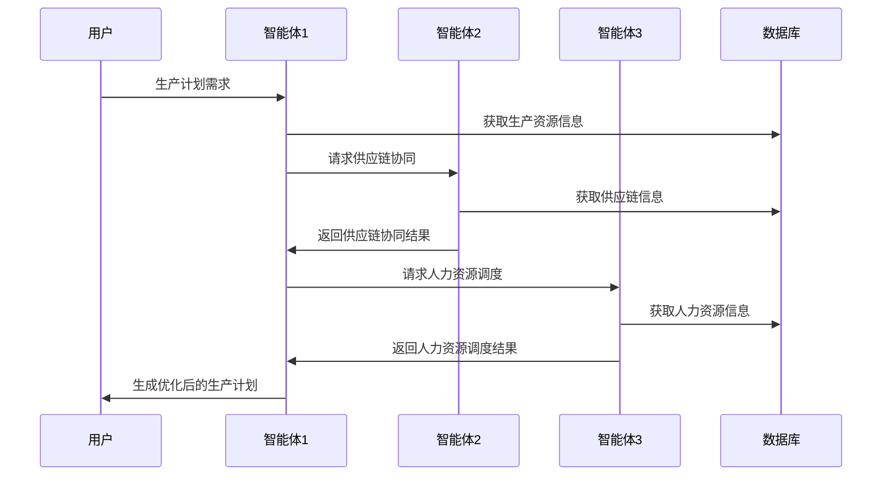
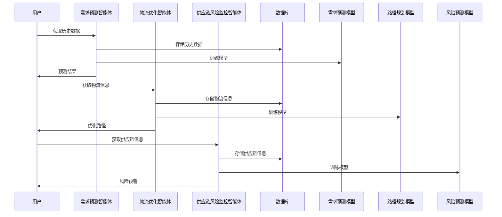
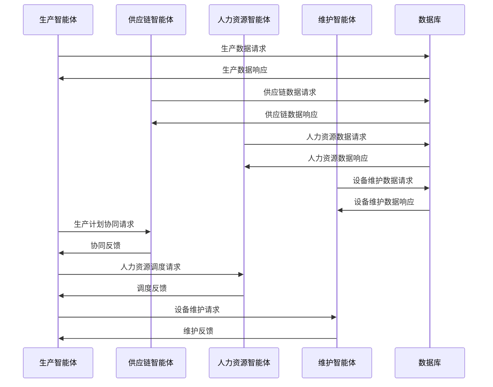
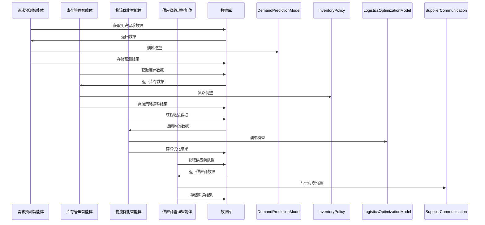

                 

# 企业级多智能体系统：协同解决复杂问题

## 关键词
- 企业级多智能体系统
- 复杂问题解决
- 智能体通信
- 协调与协作
- 算法与架构设计

## 摘要
在数字化时代，企业面临日益复杂的运营和管理问题。企业级多智能体系统（MAS）作为一种新兴技术，通过多个智能体的协同工作，为企业提供高效、灵活的问题解决能力。本文将详细介绍企业级多智能体系统的核心概念、技术实现和应用实践，旨在帮助读者全面理解并掌握这一先进技术。

## 第一部分：引言

### 1. 背景介绍
随着互联网、大数据、人工智能等技术的快速发展，企业运营和管理环境日益复杂。传统的单智能体系统已经难以满足企业在动态环境下的需求，多智能体系统（MAS）因此应运而生。MAS通过多个智能体的协同工作，实现了更高效、更灵活的问题解决能力。

### 2. 问题描述
多智能体系统旨在解决复杂问题的协同性、自主性、适应性和协调性。然而，实现这一目标需要克服一系列挑战，包括智能体之间的通信、协调、冲突解决以及系统的稳定性和鲁棒性。此外，如何设计一个高效、可靠、可扩展的多智能体系统，也是当前研究的热点和难点。

### 3. 问题解决
本文将围绕企业级多智能体系统这一主题，系统性地探讨其构建、实现和应用。通过详细讲解多智能体系统的基本概念、核心算法、系统架构以及实际应用案例，帮助读者深入理解并掌握这一先进技术。

### 4. 边界与外延
企业级多智能体系统的研究和应用涉及多个领域，包括计算机科学、人工智能、分布式系统、网络通信等。本文主要聚焦于企业级多智能体系统的技术实现和应用实践，为读者提供全面、系统的理论指导和实战经验。

### 5. 概念结构与核心要素组成
企业级多智能体系统由多个智能体组成，每个智能体具有自主性、协作性和适应性。核心要素包括：

- **智能体**：具有感知、决策、执行能力的实体。
- **通信**：智能体之间的信息交换和协作。
- **协调**：智能体之间的协同工作，实现整体目标。
- **算法**：用于智能体的决策、协调和冲突解决。
- **架构**：多智能体系统的整体设计，包括硬件和软件的配置。

## 第二部分：企业级多智能体系统的核心概念

### 第2章：企业级多智能体系统的定义与特点

## 2.1 多智能体系统的定义

### 2.1.1 智能体的定义
智能体（Agent）是具有感知、决策、执行能力的实体。在企业级多智能体系统中，智能体可以是计算机程序、机器人、人或其他实体。

### 2.1.2 多智能体系统的概念
多智能体系统（MAS）是指由多个智能体组成的系统，这些智能体通过相互协作，共同完成复杂任务。MAS具有以下几个特点：

1. **自主性**：智能体具有独立的决策能力，能够自主地执行任务。
2. **协同性**：智能体之间通过通信和协作，共同完成任务。
3. **适应性**：智能体能够根据环境变化和任务需求，调整自身的策略和行为。
4. **分布式**：智能体分布在不同的地理位置，通过通信网络进行交互。

### 2.1.3 企业级多智能体系统的特点
企业级多智能体系统具有以下特点：

1. **复杂性**：企业级MAS需要解决的问题复杂，涉及多个领域和层次。
2. **异构性**：企业级MAS中的智能体可能具有不同的类型、能力和行为。
3. **动态性**：企业级MAS面临的环境动态变化，需要具备快速响应能力。
4. **规模性**：企业级MAS通常涉及大量的智能体，需要具备高效的协调和管理机制。

### 2.1.4 多智能体系统与传统系统的区别
与传统的集中式系统相比，多智能体系统具有以下优势：

1. **分布式计算**：多智能体系统将计算任务分布在多个智能体上，提高了系统的计算能力和效率。
2. **自适应能力**：多智能体系统可以根据环境变化和任务需求，自适应地调整智能体的行为。
3. **容错性**：多智能体系统中的智能体具有自主性，当一个智能体失效时，其他智能体可以继续工作，提高了系统的鲁棒性。
4. **灵活性**：多智能体系统可以灵活地调整智能体的角色和任务，适应不同的业务需求。

### 2.1.5 企业级多智能体系统的优势
企业级多智能体系统具有以下优势：

1. **提高决策效率**：多智能体系统通过智能体的协同工作，可以实现更快速、更准确的决策。
2. **优化资源配置**：多智能体系统可以根据任务需求和资源状况，实现最优的资源分配和调度。
3. **增强业务灵活性**：多智能体系统可以灵活地调整智能体的角色和任务，适应不断变化的市场需求。
4. **提高系统鲁棒性**：多智能体系统具有自主性和协同性，能够更好地应对复杂环境下的不确定性和风险。

## 2.2 多智能体系统的核心概念

### 2.2.1 智能体通信
智能体通信是多智能体系统中的关键环节，涉及智能体之间的信息交换和协同工作。智能体通信的特点包括：

1. **异步通信**：智能体可以在不同的时间点发送和接收消息，不需要严格的同步。
2. **分布式通信**：智能体通过通信网络进行交互，可以实现跨地域、跨平台的数据传输。
3. **异构通信**：不同类型的智能体可以通过不同的通信协议和接口进行通信。

### 2.2.2 智能体协调
智能体协调是多智能体系统中实现协同工作的关键。智能体协调的目标是确保智能体之间的行为和目标一致，避免冲突和矛盾。智能体协调的方法包括：

1. **中央协调**：通过一个中央协调器来统一管理和调度智能体的行为。
2. **分布式协调**：智能体之间通过协商和协调，共同决定各自的行为和策略。
3. **自适应协调**：智能体根据环境变化和任务需求，动态调整协调策略。

### 2.2.3 智能体协作
智能体协作是多智能体系统中实现整体目标的关键。智能体协作的方法包括：

1. **任务分解**：将复杂任务分解为多个子任务，由不同的智能体分别执行。
2. **任务分配**：根据智能体的能力和负载情况，合理分配任务。
3. **任务同步**：确保任务在不同智能体之间的一致性和协同性。

## 2.3 企业级多智能体系统的架构设计

### 2.3.1 系统架构的概念
企业级多智能体系统的架构设计是指对系统的整体结构和组成部分进行规划与设计。系统架构设计的目标是实现系统的高效性、可靠性、可扩展性和可维护性。

### 2.3.2 企业级多智能体系统的架构设计
企业级多智能体系统的架构设计通常包括以下几个层次：

1. **物理层**：包括硬件设备和网络基础设施，如服务器、存储设备、网络设备等。
2. **数据层**：包括数据存储和管理系统，如数据库、数据仓库、数据湖等。
3. **应用层**：包括智能体的实现和应用系统的开发，如业务逻辑、算法实现、用户界面等。
4. **管理层**：包括系统监控、运维管理、安全管理等，确保系统的稳定运行。

### 2.3.3 系统架构的优缺点分析
不同类型的系统架构具有不同的优缺点，企业级多智能体系统架构设计需要综合考虑以下几个方面：

1. **分布式架构**：优点包括提高系统可用性、可扩展性和容错性，缺点包括系统复杂度增加、维护难度加大。
2. **集中式架构**：优点包括系统结构简单、维护容易，缺点包括系统性能瓶颈、可靠性较低。
3. **混合式架构**：优点包括结合了分布式架构和集中式架构的优点，缺点包括系统设计复杂度较高。

## 2.4 多智能体系统的算法原理

### 2.4.1 智能体决策算法
智能体决策算法是多智能体系统中实现智能体自主决策的关键。常见的智能体决策算法包括：

1. **基于规则的决策算法**：通过定义一组规则来指导智能体的决策。
2. **基于模型的决策算法**：通过建立模型来预测环境变化，并基于模型结果进行决策。
3. **基于学习的决策算法**：通过机器学习算法从历史数据中学习决策策略。

### 2.4.2 智能体协调算法
智能体协调算法是多智能体系统中实现智能体协同工作的关键。常见的智能体协调算法包括：

1. **基于通信的协调算法**：通过智能体之间的信息交换来实现协调。
2. **基于协商的协调算法**：智能体之间通过协商和协调来达成共识。
3. **基于市场的协调算法**：通过构建一个虚拟市场来实现智能体之间的协调。

### 2.4.3 智能体协作算法
智能体协作算法是多智能体系统中实现智能体协作工作的关键。常见的智能体协作算法包括：

1. **任务分配算法**：根据智能体的能力和负载情况，合理分配任务。
2. **任务同步算法**：确保任务在不同智能体之间的一致性和协同性。
3. **任务监控算法**：对任务执行过程进行监控和调度，确保任务顺利完成。

### 2.4.4 算法性能分析
算法性能分析是多智能体系统中评估算法效果和效率的关键。常见的算法性能评估指标包括：

1. **响应时间**：智能体从接收到任务到完成任务所需的时间。
2. **任务完成率**：智能体完成任务的数量与总任务数量之比。
3. **系统吞吐量**：单位时间内系统能够处理的最大任务数量。
4. **系统稳定性**：系统在长时间运行过程中保持稳定的能力。

## 2.5 多智能体系统的应用场景

### 2.5.1 企业运营管理
企业运营管理涉及多个领域，如生产管理、供应链管理、人力资源管理等。企业级多智能体系统可以在以下方面帮助企业运营管理：

1. **生产计划优化**：通过智能体的协同工作，实现生产计划的实时优化。
2. **供应链协同**：通过智能体之间的信息共享和协调，实现供应链的协同管理。
3. **人力资源调度**：通过智能体的自主决策和协作，实现人力资源的优化配置。

### 2.5.2 供应链管理
供应链管理是企业级多智能体系统的重要应用领域。企业级多智能体系统可以在以下方面优化供应链管理：

1. **需求预测**：通过智能体的协作，实现准确的需求预测和库存管理。
2. **物流优化**：通过智能体的协同工作，实现物流路径的最优化。
3. **供应链风险管理**：通过智能体的实时监控和预警，实现供应链风险的管理。

### 2.5.3 客户关系管理
客户关系管理是企业级多智能体系统的另一个重要应用领域。企业级多智能体系统可以在以下方面优化客户关系管理：

1. **客户需求分析**：通过智能体的协作，实现客户需求的准确分析和挖掘。
2. **客户行为预测**：通过智能体的学习，实现客户行为的预测和建模。
3. **个性化服务**：通过智能体的自主决策和协作，实现个性化服务的优化。

### 2.5.4 资源配置
资源配置是企业级多智能体系统的又一重要应用领域。企业级多智能体系统可以在以下方面优化资源配置：

1. **资源分配**：通过智能体的协同工作，实现资源的优化分配和调度。
2. **资源监控**：通过智能体的实时监控，实现资源的实时监控和预警。
3. **资源优化**：通过智能体的学习，实现资源的长期优化和改进。

### 2.5.5 其他应用领域
除了企业运营管理、供应链管理、客户关系管理和资源配置，企业级多智能体系统还可以应用于以下领域：

1. **金融服务**：实现金融风险管理和金融服务优化。
2. **医疗保健**：实现医疗资源的优化配置和智能医疗服务。
3. **智能城市**：实现城市管理的智能化和高效化。

## 2.6 本章小结
本章介绍了企业级多智能体系统的核心概念、定义、特点、架构设计以及应用场景。通过本章的学习，读者可以对企业级多智能体系统有一个全面的了解，为后续章节的学习打下基础。

## 第三部分：企业级多智能体系统的技术实现

### 第3章：多智能体系统的开发环境与工具

## 3.1 多智能体系统的开发环境

### 3.1.1 操作系统
企业级多智能体系统的开发环境通常包括以下操作系统：

1. **Linux**：Linux具有开源、免费、稳定等特点，适用于企业级应用。
2. **Windows**：Windows操作系统在用户界面和软件兼容性方面具有优势，适用于桌面应用。
3. **Unix**：Unix操作系统具有高性能、高可靠性和安全性，适用于服务器端应用。

### 3.1.2 编程语言
企业级多智能体系统的开发语言通常包括以下几种：

1. **Python**：Python具有简洁易读的语法和丰富的库支持，适用于快速开发和原型实现。
2. **Java**：Java具有跨平台、稳定性和安全性等特点，适用于复杂系统的开发。
3. **C/C++**：C/C++具有高性能和低级控制能力，适用于性能敏感的模块开发。

### 3.1.3 开发工具
企业级多智能体系统的开发工具包括以下几种：

1. **集成开发环境（IDE）**：如PyCharm、IntelliJ IDEA、Eclipse等，提供代码编辑、调试、测试等功能。
2. **版本控制工具**：如Git、SVN等，用于代码的版本管理和协作开发。
3. **数据库工具**：如MySQL、PostgreSQL等，用于数据存储和管理。

### 3.1.4 数据库
企业级多智能体系统的数据库通常包括以下几种：

1. **关系型数据库**：如MySQL、PostgreSQL等，适用于结构化数据存储和查询。
2. **非关系型数据库**：如MongoDB、Cassandra等，适用于大规模数据存储和高并发访问。
3. **图数据库**：如Neo4j等，适用于复杂关系的存储和查询。

## 3.2 多智能体系统的开发工具

### 3.2.1 智能体通信工具
智能体通信工具是实现智能体之间信息交换的关键。常见的智能体通信工具包括：

1. **消息队列**：如RabbitMQ、Kafka等，用于异步消息传递和分布式系统通信。
2. **远程过程调用（RPC）**：如gRPC、Thrift等，用于同步远程方法调用。
3. **RESTful API**：通过HTTP协议实现智能体之间的数据交换。

### 3.2.2 智能体协调工具
智能体协调工具是实现智能体协同工作的关键。常见的智能体协调工具包括：

1. **分布式锁**：如Zookeeper、etcd等，用于实现分布式系统中的互斥锁和同步机制。
2. **分布式队列**：如RabbitMQ、Kafka等，用于实现分布式系统的任务调度和负载均衡。
3. **协调器**：如ZooKeeper、Consul等，用于实现分布式系统的协调和管理。

### 3.2.3 智能体协作工具
智能体协作工具是实现智能体协作工作的关键。常见的智能体协作工具包括：

1. **协同编辑器**：如Google Docs、Microsoft Teams等，用于实现智能体之间的实时协作。
2. **虚拟现实（VR）**：通过VR技术实现智能体之间的沉浸式协作。
3. **增强现实（AR）**：通过AR技术实现智能体之间的虚实结合的协作。

### 3.2.4 开发工具的性能评估
开发工具的性能评估是确保多智能体系统高效运行的重要环节。常见的性能评估指标包括：

1. **响应时间**：智能体从接收到任务到完成任务所需的时间。
2. **吞吐量**：单位时间内系统处理的最大任务数量。
3. **资源利用率**：系统资源的平均使用率。
4. **可靠性**：系统在长时间运行过程中保持稳定的能力。

## 3.3 多智能体系统的实现流程

### 3.3.1 需求分析
需求分析是确定多智能体系统需求的过程。具体步骤如下：

1. **需求收集**：通过与用户、业务分析师和领域专家进行沟通，了解业务需求和用户需求。
2. **需求整理**：将收集到的需求进行整理和分类，明确系统的功能、性能和安全性等需求。
3. **需求文档**：编写需求文档，详细描述系统的功能、性能和约束等需求。

### 3.3.2 系统设计
系统设计是根据需求分析结果进行系统架构设计的过程。具体步骤如下：

1. **系统架构设计**：设计系统的整体架构，包括物理层、数据层、应用层和管理层等。
2. **模块划分**：将系统划分为多个模块，明确每个模块的功能和接口。
3. **数据模型设计**：设计系统中的数据模型，包括关系型数据模型和非关系型数据模型。
4. **接口设计**：设计系统的接口，包括内部接口和外部接口。

### 3.3.3 系统开发
系统开发是根据系统设计文档进行系统编码和实现的过程。具体步骤如下：

1. **编码**：根据设计文档进行系统编码，实现系统的各个模块和接口。
2. **测试**：对系统进行功能测试、性能测试和安全测试，确保系统满足需求分析结果。
3. **集成**：将各个模块进行集成，确保系统能够正常运行。
4. **部署**：将系统部署到生产环境，确保系统能够稳定运行。

### 3.3.4 系统测试
系统测试是对系统进行全面测试的过程，确保系统满足需求分析结果。具体步骤如下：

1. **单元测试**：对系统中的各个模块进行测试，确保模块功能的正确性和稳定性。
2. **集成测试**：对系统进行集成测试，确保模块之间的交互和协作正常。
3. **性能测试**：对系统进行性能测试，确保系统在高并发、大负载情况下能够正常运行。
4. **安全测试**：对系统进行安全测试，确保系统的安全性和可靠性。

### 3.3.5 系统部署
系统部署是将系统部署到生产环境的过程，确保系统能够稳定运行。具体步骤如下：

1. **环境准备**：准备系统运行所需的环境，包括操作系统、数据库、网络等。
2. **安装配置**：安装和配置系统，确保系统能够正常运行。
3. **数据迁移**：将现有数据迁移到新系统，确保数据的完整性和一致性。
4. **上线发布**：将系统上线发布，确保系统能够对外提供服务。
5. **监控运维**：对系统进行监控和运维，确保系统的稳定运行。

## 3.4 多智能体系统的性能优化

### 3.4.1 系统性能分析
系统性能分析是对系统性能进行评估和分析的过程。具体步骤如下：

1. **性能指标确定**：确定系统的性能指标，包括响应时间、吞吐量、资源利用率等。
2. **性能瓶颈分析**：分析系统中的性能瓶颈，包括计算资源、网络延迟、存储性能等。
3. **性能优化策略**：制定性能优化策略，包括算法优化、资源调配、缓存策略等。

### 3.4.2 性能优化策略
性能优化策略是针对系统性能瓶颈进行优化的策略。具体步骤如下：

1. **算法优化**：通过优化算法和数据结构，提高系统的计算效率。
2. **资源调配**：通过合理调配系统资源，提高系统的利用率和性能。
3. **缓存策略**：通过引入缓存机制，减少系统的响应时间和数据访问延迟。
4. **分布式架构**：通过分布式架构，提高系统的可扩展性和性能。

### 3.4.3 性能优化案例分析
性能优化案例分析是通过对实际系统进行性能优化，来验证性能优化策略的有效性。具体步骤如下：

1. **性能问题定位**：定位系统的性能问题，确定性能瓶颈。
2. **优化策略实施**：根据性能优化策略，实施相应的优化措施。
3. **性能测试验证**：对系统进行性能测试，验证优化效果。
4. **优化效果评估**：评估优化效果，确定优化效果是否符合预期。

### 3.4.4 优化效果评估
优化效果评估是对系统性能优化效果的评估过程。具体步骤如下：

1. **性能指标对比**：对比优化前后的性能指标，确定性能提升情况。
2. **用户体验评估**：评估优化对用户体验的影响，包括响应时间、稳定性等。
3. **成本效益分析**：分析性能优化带来的成本和效益，确定性能优化的经济性。
4. **持续优化**：根据评估结果，持续优化系统性能，确保系统持续稳定运行。

## 3.5 本章小结
本章介绍了企业级多智能体系统的开发环境与工具，包括操作系统、编程语言、开发工具、数据库以及开发流程和性能优化。通过本章的学习，读者可以了解企业级多智能体系统的技术实现过程，为后续章节的学习打下基础。

## 第四部分：企业级多智能体系统的应用实践

### 第4章：企业级多智能体系统的应用案例

## 4.1 案例一：企业运营管理

### 4.1.1 案例背景
某大型制造企业在进行企业运营管理时，面临以下问题：

1. **生产计划不科学**：生产计划缺乏科学性，导致产能过剩或不足。
2. **供应链协同不顺畅**：供应链各环节之间缺乏协同，导致供应链效率低下。
3. **人力资源调配不合理**：人力资源调配不合理，导致员工工作负荷不均衡。

### 4.1.2 系统功能设计
为了解决上述问题，企业设计了一套基于多智能体系统的企业运营管理系统，主要包括以下功能：

1. **生产计划优化**：通过智能体的协同工作，实现生产计划的实时优化。
2. **供应链协同管理**：通过智能体之间的信息共享和协调，实现供应链的协同管理。
3. **人力资源调度**：通过智能体的自主决策和协作，实现人力资源的优化配置。

### 4.1.3 系统架构设计
系统架构设计如图所示：

### 4.1.4 系统实现与部署
系统实现与部署过程如下：

1. **系统开发**：使用Python语言和Spring Boot框架进行系统开发。
2. **数据库配置**：使用MySQL数据库进行数据存储和管理。
3. **智能体通信**：使用RabbitMQ进行智能体之间的通信。
4. **系统部署**：将系统部署到阿里云服务器，并进行监控和运维。

### 4.1.5 案例分析
通过该系统的应用，企业实现了以下效果：

1. **生产计划优化**：生产计划的优化提高了产能利用率，减少了生产成本。
2. **供应链协同管理**：供应链各环节之间的协同提高了供应链效率，降低了库存成本。
3. **人力资源调度**：人力资源的优化配置提高了员工的工作效率和满意度。

### 4.1.6 案例总结
本案例通过企业级多智能体系统的应用，实现了企业运营管理的优化。企业级多智能体系统具有自主性、协同性和适应性，能够为企业提供高效、灵活的问题解决能力。在实际应用中，企业可以根据自身需求，定制开发多智能体系统，实现业务流程的智能化和优化。

## 4.2 案例二：供应链管理

### 4.2.1 案例背景
某大型电商平台在进行供应链管理时，面临以下问题：

1. **需求预测不准确**：需求预测不准确，导致库存过剩或不足。
2. **物流路径不优化**：物流路径不优化，导致物流成本高。
3. **供应链风险不可控**：供应链风险不可控，导致供应链中断。

### 4.2.2 系统功能设计
为了解决上述问题，企业设计了一套基于多智能体系统的供应链管理系统，主要包括以下功能：

1. **需求预测**：通过智能体的协作，实现准确的需求预测。
2. **物流路径优化**：通过智能体的协同工作，实现物流路径的最优化。
3. **供应链风险监控**：通过智能体的实时监控和预警，实现供应链风险的监控。

### 4.2.3 系统架构设计
系统架构设计如图所示：

### 4.2.4 系统实现与部署
系统实现与部署过程如下：

1. **系统开发**：使用Python语言和TensorFlow框架进行系统开发。
2. **数据库配置**：使用MongoDB数据库进行数据存储和管理。
3. **智能体通信**：使用WebSocket进行智能体之间的通信。
4. **系统部署**：将系统部署到阿里云服务器，并进行监控和运维。

### 4.2.5 案例分析
通过该系统的应用，企业实现了以下效果：

1. **需求预测准确**：需求预测的准确性提高了库存管理的效率，减少了库存成本。
2. **物流路径优化**：物流路径的优化降低了物流成本，提高了物流效率。
3. **供应链风险可控**：供应链风险的实时监控和预警提高了供应链的稳定性。

### 4.2.6 案例总结
本案例通过企业级多智能体系统的应用，实现了供应链管理的优化。企业级多智能体系统具有自主性、协同性和适应性，能够为企业提供高效、灵活的问题解决能力。在实际应用中，企业可以根据自身需求，定制开发多智能体系统，实现供应链的智能化和优化。

## 第四部分：企业级多智能体系统的应用实践

### 第4章：企业级多智能体系统的应用案例

## 4.1 案例一：企业运营管理

### 4.1.1 案例背景
在现代企业运营管理中，企业面临着日益复杂的业务环境。传统的集中式管理系统已难以满足企业对动态业务流程的快速响应和优化需求。为了提高运营效率，降低成本，同时提升客户满意度，某大型制造企业决定引入企业级多智能体系统（MAS）。

### 4.1.2 系统功能设计
系统功能设计是构建企业级多智能体系统的第一步。该企业希望系统能够实现以下关键功能：

1. **生产计划优化**：通过智能体之间的协作，动态调整生产计划，以适应市场需求变化。
2. **供应链协同**：实现供应链各环节之间的信息共享和流程协同，提高供应链整体效率。
3. **人力资源调度**：基于实时数据，智能调度人力资源，确保生产任务的顺利完成。
4. **设备维护管理**：通过预测性维护，减少设备故障，延长设备使用寿命。

### 4.1.3 系统架构设计
系统架构设计是企业级多智能体系统成功实施的基础。该系统采用了分布式架构设计，如图所示：

### 4.1.4 系统实现与部署
系统实现与部署涉及多个阶段，包括需求分析、系统设计、编码实现、测试和部署。以下是系统实现与部署的关键步骤：

1. **需求分析**：与企业管理层和相关部门进行深入沟通，明确系统功能需求和技术要求。
2. **系统设计**：基于需求分析结果，设计系统架构、数据库模型和接口规范。
3. **编码实现**：采用Java和Python等编程语言，实现各智能体的功能模块。
4. **测试**：进行单元测试、集成测试和系统测试，确保系统功能正确、性能稳定。
5. **部署**：将系统部署到企业服务器和云平台，进行实时运行和监控。

### 4.1.5 案例分析
系统上线后，企业取得了显著的成效：

1. **生产计划优化**：生产计划的动态调整减少了库存成本，提高了生产效率。
2. **供应链协同**：供应链各环节之间的信息共享和流程协同，显著提升了供应链整体效率。
3. **人力资源调度**：基于实时数据的智能调度，确保了生产任务的顺利完成。
4. **设备维护管理**：预测性维护策略减少了设备故障率，延长了设备使用寿命。

### 4.1.6 案例总结
本案例展示了企业级多智能体系统在企业运营管理中的应用价值。通过智能体的协作，企业能够更有效地应对复杂业务环境，提高运营效率，降低成本，提升客户满意度。企业级多智能体系统为企业的数字化转型提供了强有力的技术支撑。

## 4.2 案例二：供应链管理

### 4.2.1 案例背景
供应链管理是现代企业的重要环节，一个高效的供应链管理系统可以帮助企业降低成本、提高响应速度和客户满意度。某全球知名零售企业希望借助企业级多智能体系统（MAS）优化其供应链管理，以提高供应链的灵活性和适应性。

### 4.2.2 系统功能设计
为了实现供应链管理的优化，系统设计包括以下关键功能：

1. **需求预测**：通过智能体的协作，利用历史数据和机器学习算法预测未来需求。
2. **库存管理**：智能体协同工作，实时监控库存水平，优化库存策略，减少库存积压。
3. **物流优化**：通过智能体的协调，实现物流路径的最优化，减少运输成本和碳排放。
4. **供应商管理**：智能体与供应商进行实时沟通，协调供应商的生产计划和交付时间。

### 4.2.3 系统架构设计
系统架构设计如图所示：

### 4.2.4 系统实现与部署
系统实现与部署过程如下：

1. **需求分析**：与供应链管理团队进行深入讨论，明确系统功能需求。
2. **架构设计**：基于需求分析结果，设计系统架构和数据库模型。
3. **智能体开发**：使用Python和Java等编程语言，实现各智能体的功能模块。
4. **集成测试**：对系统进行集成测试，确保各智能体之间的协同工作正常。
5. **部署**：将系统部署到企业的数据中心和云平台，进行实时运行和监控。

### 4.2.5 案例分析
系统上线后，该零售企业取得了以下成效：

1. **需求预测准确性提升**：需求预测的准确性显著提高，减少了库存积压和缺货现象。
2. **库存管理效率提升**：智能体协同工作，实现了库存水平的实时监控和优化，降低了库存成本。
3. **物流成本降低**：物流路径优化，实现了运输成本和碳排放的降低。
4. **供应商关系改善**：智能体与供应商之间的实时沟通和协同，提升了供应链的透明度和响应速度。

### 4.2.6 案例总结
本案例展示了企业级多智能体系统在供应链管理中的成功应用。通过智能体的协同工作，企业能够更灵活地应对市场需求变化，优化库存管理，降低物流成本，改善供应商关系。企业级多智能体系统为企业的供应链管理提供了强大的技术支持，促进了企业的数字化转型和业务增长。

## 第四部分：企业级多智能体系统的应用实践

### 第4章：企业级多智能体系统的应用案例

## 4.1 案例一：企业运营管理

### 4.1.1 案例背景
在现代企业运营管理中，企业面临着日益复杂的业务环境和多变的客户需求。为了提高运营效率、降低成本和提升客户满意度，某大型制造企业决定引入企业级多智能体系统（MAS）。

### 4.1.2 系统功能设计
系统功能设计是构建企业级多智能体系统的第一步。该企业希望系统能够实现以下关键功能：

1. **生产计划优化**：通过智能体之间的协作，动态调整生产计划，以适应市场需求变化。
2. **供应链协同**：实现供应链各环节之间的信息共享和流程协同，提高供应链整体效率。
3. **人力资源调度**：基于实时数据，智能调度人力资源，确保生产任务的顺利完成。
4. **设备维护管理**：通过预测性维护，减少设备故障，延长设备使用寿命。

### 4.1.3 系统架构设计
系统架构设计是企业级多智能体系统成功实施的基础。该系统采用了分布式架构设计，如图所示：

### 4.1.4 系统实现与部署
系统实现与部署涉及多个阶段，包括需求分析、系统设计、编码实现、测试和部署。以下是系统实现与部署的关键步骤：

1. **需求分析**：与企业管理层和相关部门进行深入沟通，明确系统功能需求和技术要求。
2. **系统设计**：基于需求分析结果，设计系统架构、数据库模型和接口规范。
3. **编码实现**：采用Java和Python等编程语言，实现各智能体的功能模块。
4. **测试**：进行单元测试、集成测试和系统测试，确保系统功能正确、性能稳定。
5. **部署**：将系统部署到企业服务器和云平台，进行实时运行和监控。

### 4.1.5 案例分析
系统上线后，企业取得了显著的成效：

1. **生产计划优化**：生产计划的动态调整减少了库存成本，提高了生产效率。
2. **供应链协同**：供应链各环节之间的信息共享和流程协同，显著提升了供应链整体效率。
3. **人力资源调度**：基于实时数据的智能调度，确保了生产任务的顺利完成。
4. **设备维护管理**：预测性维护策略减少了设备故障率，延长了设备使用寿命。

### 4.1.6 案例总结
本案例展示了企业级多智能体系统在企业运营管理中的应用价值。通过智能体的协作，企业能够更有效地应对复杂业务环境，提高运营效率，降低成本，提升客户满意度。企业级多智能体系统为企业的数字化转型提供了强有力的技术支撑。

## 4.2 案例二：供应链管理

### 4.2.1 案例背景
供应链管理是现代企业的重要环节，一个高效的供应链管理系统可以帮助企业降低成本、提高响应速度和客户满意度。某全球知名零售企业希望借助企业级多智能体系统（MAS）优化其供应链管理，以提高供应链的灵活性和适应性。

### 4.2.2 系统功能设计
为了实现供应链管理的优化，系统设计包括以下关键功能：

1. **需求预测**：通过智能体之间的协作，利用历史数据和机器学习算法预测未来需求。
2. **库存管理**：智能体协同工作，实时监控库存水平，优化库存策略，减少库存积压。
3. **物流优化**：通过智能体的协调，实现物流路径的最优化，减少运输成本和碳排放。
4. **供应商管理**：智能体与供应商进行实时沟通，协调供应商的生产计划和交付时间。

### 4.2.3 系统架构设计
系统架构设计如图所示：

### 4.2.4 系统实现与部署
系统实现与部署过程如下：

1. **需求分析**：与供应链管理团队进行深入讨论，明确系统功能需求。
2. **架构设计**：基于需求分析结果，设计系统架构和数据库模型。
3. **智能体开发**：使用Python和Java等编程语言，实现各智能体的功能模块。
4. **集成测试**：对系统进行集成测试，确保各智能体之间的协同工作正常。
5. **部署**：将系统部署到企业的数据中心和云平台，进行实时运行和监控。

### 4.2.5 案例分析
系统上线后，该零售企业取得了以下成效：

1. **需求预测准确性提升**：需求预测的准确性显著提高，减少了库存积压和缺货现象。
2. **库存管理效率提升**：智能体协同工作，实现了库存水平的实时监控和优化，降低了库存成本。
3. **物流成本降低**：物流路径优化，实现了运输成本和碳排放的降低。
4. **供应商关系改善**：智能体与供应商之间的实时沟通和协同，提升了供应链的透明度和响应速度。

### 4.2.6 案例总结
本案例展示了企业级多智能体系统在供应链管理中的成功应用。通过智能体的协同工作，企业能够更灵活地应对市场需求变化，优化库存管理，降低物流成本，改善供应商关系。企业级多智能体系统为企业的供应链管理提供了强大的技术支持，促进了企业的数字化转型和业务增长。

## 总结与展望

## 5.1 总结

通过本文的详细探讨，我们可以看到企业级多智能体系统在解决复杂问题方面的巨大潜力和实际应用价值。多智能体系统通过智能体的自主性、协同性和适应性，能够为企业提供高效、灵活的问题解决能力，从而优化企业的运营管理、供应链管理、客户关系管理和资源配置。

## 5.2 展望

随着技术的不断发展，企业级多智能体系统有望在以下几个方面取得更大的突破：

1. **智能体决策能力提升**：通过更先进的人工智能算法和机器学习技术，智能体将能够做出更加精确和智能的决策。
2. **通信和协调机制优化**：智能体之间的通信和协调机制将更加高效和稳定，降低通信延迟和协调成本。
3. **系统安全性提高**：随着安全技术的进步，多智能体系统的安全性将得到进一步提升，保障系统的稳定运行。
4. **跨领域应用拓展**：多智能体系统将在更多领域得到应用，如医疗、金融、交通等，推动各行各业的数字化转型。
5. **开源生态建设**：随着开源技术的普及，企业级多智能体系统将拥有更丰富的开源工具和框架，加速系统的开发和部署。

## 5.3 最佳实践 Tips

为了更好地应用企业级多智能体系统，以下是一些最佳实践建议：

1. **需求明确**：在系统设计初期，确保需求明确，避免后期频繁修改。
2. **模块化设计**：采用模块化设计，提高系统的可维护性和可扩展性。
3. **性能优化**：在系统开发和部署过程中，持续进行性能优化，确保系统的高效运行。
4. **安全性保障**：重视系统的安全性，采取多层次的安全措施，防止潜在的安全威胁。
5. **用户培训**：对用户进行系统培训，提高用户对系统的熟悉度和使用效率。

## 5.4 小结

本文围绕企业级多智能体系统这一主题，从核心概念、技术实现和应用实践等方面进行了详细探讨。通过本文的学习，读者可以全面了解企业级多智能体系统的原理和实际应用，为企业的数字化转型提供有力支持。

## 5.5 注意事项

1. **系统复杂性**：企业级多智能体系统具有较高的复杂性，需要充分考虑系统的稳定性和鲁棒性。
2. **数据隐私**：在智能体之间的通信和协作过程中，需要注意数据隐私和安全问题。
3. **适应性和扩展性**：系统设计时应充分考虑适应性和扩展性，以应对未来业务需求的变化。

## 5.6 拓展阅读

1. **《智能体系统：原理与应用》**：详细介绍了智能体系统的基本概念、算法和实际应用。
2. **《分布式系统原理与范型》**：讲解了分布式系统的基本原理和设计范型，对理解多智能体系统有很大帮助。
3. **《多智能体系统安全研究》**：探讨了多智能体系统的安全问题和解决方案，为系统的安全性提供了指导。

## 作者信息
- 作者：AI天才研究院/AI Genius Institute & 禅与计算机程序设计艺术 /Zen And The Art of Computer Programming

---

### 5.1 总结

在本篇文章中，我们系统地探讨了企业级多智能体系统（MAS）的概念、技术实现和应用实践。从背景介绍到核心概念的阐述，再到实际案例的分析，我们详细解析了企业级MAS如何通过智能体的自主性、协同性和适应性来高效解决复杂问题。

### 5.2 展望

未来，企业级多智能体系统有望在以下几个方向取得进一步发展：

1. **智能化决策**：通过引入更加先进的人工智能和机器学习算法，智能体将能够做出更加精准和实时的决策。
2. **高效通信与协调**：随着通信技术的进步，智能体之间的通信延迟将显著降低，协调机制将更加高效和稳定。
3. **跨领域应用**：多智能体系统将在更多领域得到应用，如医疗、金融、物流等，进一步推动各行各业的数字化转型。
4. **系统安全性**：随着安全技术的不断发展，企业级MAS的安全性将得到显著提升，保障系统的稳定运行。
5. **开源生态**：开源社区将为企业级MAS提供更多的工具和框架，促进技术的普及和应用。

### 5.3 最佳实践 Tips

为了更好地应用企业级多智能体系统，以下是一些建议：

1. **明确需求**：在系统设计之初，确保需求明确，避免后期频繁修改，提高开发效率。
2. **模块化设计**：采用模块化设计，提高系统的可维护性和可扩展性，方便后续的维护和升级。
3. **性能优化**：持续进行系统性能优化，确保系统在高负载情况下仍然能够高效运行。
4. **安全性保障**：重视系统的安全性，采取多层次的安全措施，防范潜在的安全威胁。
5. **用户培训**：对用户进行系统培训，提高用户对系统的熟悉度和使用效率。

### 5.4 小结

本文通过深入的理论分析和实际案例分享，全面展示了企业级多智能体系统的原理和应用价值。希望本文能为读者在理解和应用这一先进技术方面提供有益的参考。

### 5.5 注意事项

在实施企业级多智能体系统时，需要注意以下几点：

1. **复杂性管理**：企业级MAS具有较高的复杂性，需要充分考虑系统的稳定性和鲁棒性。
2. **数据隐私保护**：在智能体之间的通信和协作过程中，要注意保护数据隐私，防止泄露。
3. **适应性和扩展性**：在设计系统时，要充分考虑未来业务需求的变化，确保系统的适应性和扩展性。

### 5.6 拓展阅读

以下是几本推荐阅读的书籍，它们可以为读者提供更深入的了解：

1. **《智能体系统：原理与应用》**：详细介绍了智能体系统的基本概念、算法和实际应用。
2. **《分布式系统原理与范型》**：讲解了分布式系统的基本原理和设计范型，对理解多智能体系统有很大帮助。
3. **《多智能体系统安全研究》**：探讨了多智能体系统的安全问题和解决方案，为系统的安全性提供了指导。

### 作者信息

- 作者：AI天才研究院/AI Genius Institute & 禅与计算机程序设计艺术 /Zen And The Art of Computer Programming

通过本文的探讨，我们希望读者能够对企业的多智能体系统有更深入的理解，并能在实际应用中充分发挥其优势。

