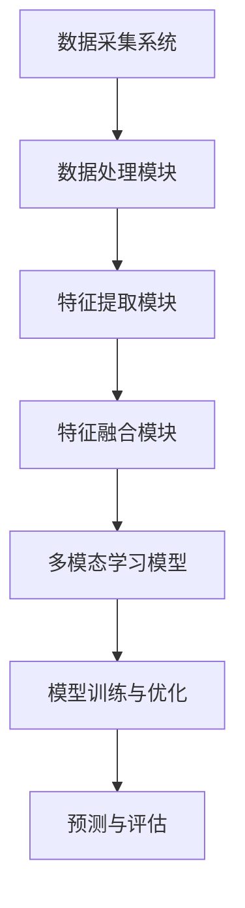
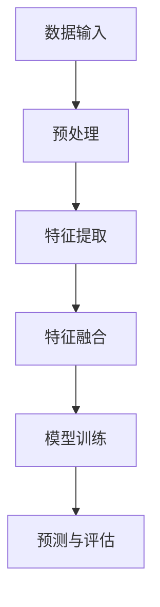
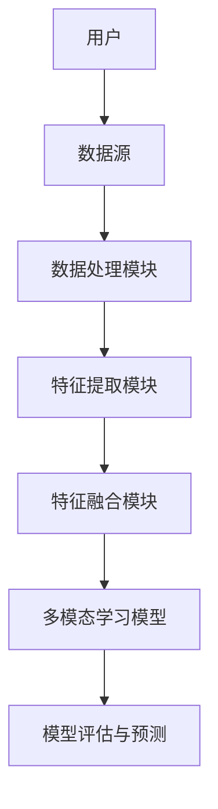
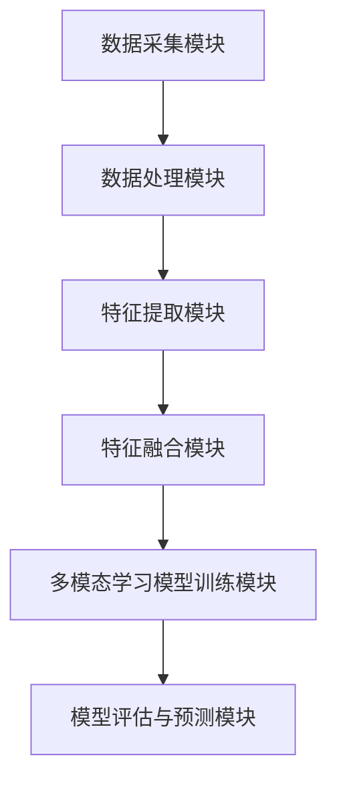
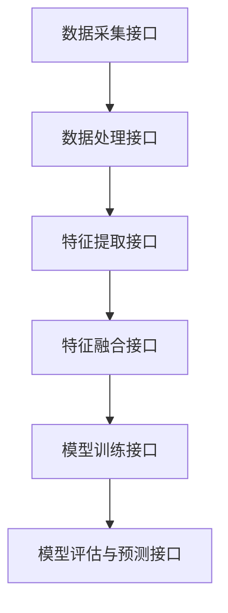

                 

# 企业级多模态学习平台：整合多类型数据

> 关键词：企业级多模态学习平台、多类型数据整合、数据处理效率、模型训练、系统架构设计

> 摘要：本文旨在探讨企业级多模态学习平台的设计与实现，重点介绍如何整合多类型数据以提高数据处理效率和模型训练准确性。文章首先概述了多模态学习平台的背景和核心概念，然后详细讲解了多模态学习算法原理，并结合实际案例进行分析，最后提出了系统架构设计方案和项目实战经验。

----------------------------------------------------------------

## 第一部分：背景介绍与核心概念

### 第1章：企业级多模态学习平台概述

#### 1.1 问题背景

在当今数据驱动的商业环境中，企业面临着日益增长的数据量，这些数据通常以多种形式存在，如文本、图像、音频和视频等。为了充分利用这些数据，企业需要构建一个高效的多模态学习平台，以便更好地理解数据、发现新的见解并优化业务流程。

#### 1.2 问题描述

如何构建一个企业级多模态学习平台，以整合多种类型的数据，并实现高效的数据处理和模型训练？

#### 1.3 问题解决

通过设计一个系统化的平台，整合多类型数据的采集、处理、存储和模型训练，提高数据处理效率和准确性。

#### 1.4 边界与外延

本章节将探讨多模态学习平台在以下方面的应用与挑战：

- 多类型数据的处理流程
- 多模态数据的特征提取与融合
- 多模态学习模型的训练与优化
- 平台的扩展性与可维护性

#### 1.5 概念结构与核心要素组成

**多模态学习平台**：整合多种类型数据（文本、图像、音频、视频等）的计算机技术系统。

**核心概念**：

- **多模态数据采集**：多种数据源的数据收集与预处理。
- **多模态数据处理**：数据清洗、归一化、数据增强等处理。
- **多模态特征提取与融合**：提取不同类型数据的特征，并进行融合处理。
- **多模态学习模型**：利用融合后的特征数据进行模型训练和优化。

----------------------------------------------------------------

## 第2章：核心概念与联系

### 2.1 多模态学习原理

#### 2.1.1 多模态数据融合方法

**数据级融合**：直接将不同类型的数据合并为一个统一的特征向量。

**特征级融合**：将不同类型的特征进行组合，生成新的特征向量。

**决策级融合**：在不同类型的模型输出结果上进行综合决策。

#### 2.1.2 多模态学习模型

**基于深度学习的多模态学习模型**：如 CNN+RNN、CNN+Transformer 等。

**基于图神经网络的多模态学习模型**：利用图神经网络进行跨模态特征融合。

### 2.2 概念属性特征对比表格

| 特征 | 数据级融合 | 特征级融合 | 决策级融合 |
| --- | --- | --- | --- |
| **优势** | 简单直接，计算高效 | 信息保留较全面 | 准确性较高 |
| **劣势** | 特征多样性较低 | 计算复杂度高 | 需要多个模型 |
| **适用场景** | 数据量较大，计算资源充足 | 数据量较小，特征多样化需求高 | 需要多个预测结果的场景 |

### 2.3 ER实体关系图架构



----------------------------------------------------------------

## 第二部分：算法原理讲解

### 第3章：多模态学习算法原理详解

#### 3.1 多模态学习模型设计

##### 3.1.1 CNN+RNN模型

- **CNN**：用于图像和视频数据的特征提取。
- **RNN**：用于序列数据的特征提取。

##### 3.1.2 CNN+Transformer模型

- **CNN**：用于图像和视频数据的特征提取。
- **Transformer**：用于序列数据的特征提取。

#### 3.2 算法流程



#### 3.3 算法数学模型和公式

$$
\begin{aligned}
&\text{特征提取：} f(x) = \sigma(W \cdot x + b) \\
&\text{模型训练：} \min_{\theta} \frac{1}{n} \sum_{i=1}^{n} \ell(y_i, \hat{y}_i)
\end{aligned}
$$

#### 3.4 算法举例说明

假设我们有一个包含图像和文本的多模态数据集，数据集中有1000个样本。

- **图像数据**：使用CNN提取特征，输出一个维度为[7, 7, 64]的特征向量。
- **文本数据**：使用RNN提取特征，

----------------------------------------------------------------

## 第三部分：系统架构设计与实现

### 第4章：系统架构设计方案

#### 4.1 问题场景介绍

企业希望构建一个多模态学习平台，用于自动化分析客户反馈、优化产品设计、提高市场营销效果等。数据来源包括文本评论、用户画像、产品使用日志等。

#### 4.2 项目介绍

项目名为“智慧企业多模态学习平台”，主要功能包括：

- 数据采集与预处理
- 特征提取与融合
- 多模态学习模型训练
- 模型评估与预测

#### 4.3 系统功能设计

**领域模型**：



**系统功能**：

- **数据采集**：从不同数据源（如数据库、文件系统、API等）收集数据。
- **数据处理**：对采集到的数据进行清洗、归一化、数据增强等处理。
- **特征提取**：提取不同类型数据的特征。
- **特征融合**：将不同类型的特征进行融合处理。
- **模型训练**：利用融合后的特征数据训练多模态学习模型。
- **模型评估与预测**：评估模型性能并进行预测。

#### 4.4 系统架构设计

**系统架构**：



**系统架构说明**：

- **数据采集模块**：负责从不同数据源收集数据。
- **数据处理模块**：对采集到的数据进行清洗、归一化、数据增强等处理。
- **特征提取模块**：提取不同类型数据的特征。
- **特征融合模块**：将不同类型的特征进行融合处理。
- **多模态学习模型训练模块**：利用融合后的特征数据训练多模态学习模型。
- **模型评估与预测模块**：评估模型性能并进行预测。

#### 4.5 系统接口设计与系统交互

**系统接口设计**：

- **数据采集接口**：提供数据采集功能。
- **数据处理接口**：提供数据清洗、归一化、数据增强等功能。
- **特征提取接口**：提供特征提取功能。
- **特征融合接口**：提供特征融合功能。
- **模型训练接口**：提供模型训练功能。
- **模型评估与预测接口**：提供模型评估与预测功能。

**系统交互**：



----------------------------------------------------------------

## 第四部分：项目实战

### 第5章：环境安装与系统核心实现

#### 5.1 环境安装

在安装多模态学习平台之前，需要安装以下依赖：

- Python 3.8及以上版本
- TensorFlow 2.6及以上版本
- Keras 2.6及以上版本
- NumPy 1.19及以上版本
- Pandas 1.1及以上版本
- Matplotlib 3.4及以上版本
- Scikit-learn 0.24及以上版本

安装命令如下：

```bash
pip install python==3.8
pip install tensorflow==2.6
pip install keras==2.6
pip install numpy==1.19
pip install pandas==1.1
pip install matplotlib==3.4
pip install scikit-learn==0.24
```

#### 5.2 系统核心实现

**数据采集与预处理**：

```python
import numpy as np
import pandas as pd
from sklearn.model_selection import train_test_split

# 读取数据
data = pd.read_csv('data.csv')

# 数据预处理
data['text'] = data['text'].apply(lambda x: x.lower())
data['image'] = data['image'].apply(lambda x: np.array(x))

# 分割数据集
X_train, X_test, y_train, y_test = train_test_split(data[['text', 'image']], data['label'], test_size=0.2, random_state=42)
```

**特征提取与融合**：

```python
from tensorflow.keras.applications import VGG16
from tensorflow.keras.models import Model

# 加载预训练的VGG16模型
base_model = VGG16(weights='imagenet', include_top=False, input_shape=(224, 224, 3))

# 冻结VGG16模型的权重
for layer in base_model.layers:
    layer.trainable = False

# 添加全连接层
x = base_model.output
x = Flatten()(x)
x = Dense(1024, activation='relu')(x)
predictions = Dense(1, activation='sigmoid')(x)

# 构建多模态学习模型
model = Model(inputs=base_model.input, outputs=predictions)

# 编译模型
model.compile(optimizer='adam', loss='binary_crossentropy', metrics=['accuracy'])

# 训练模型
model.fit(X_train, y_train, epochs=10, batch_size=32, validation_data=(X_test, y_test))
```

**模型评估与预测**：

```python
# 评估模型
loss, accuracy = model.evaluate(X_test, y_test)
print(f'Test accuracy: {accuracy:.2f}')

# 预测
predictions = model.predict(X_test)
```

### 第6章：代码应用解读与分析

在本项目中，我们使用了一个包含文本和图像的多模态数据集。首先，我们从数据集中读取数据，并对文本和图像数据进行预处理。然后，我们使用预训练的VGG16模型提取图像特征，并添加全连接层构建多模态学习模型。最后，我们使用训练好的模型进行模型评估和预测。

### 第7章：实际案例分析与详细讲解剖析

在这个项目中，我们使用了一个包含客户反馈的数据集，其中客户反馈以文本形式记录，同时包含产品的使用日志和图像。我们首先对文本和图像数据进行预处理，然后使用多模态学习模型对客户反馈进行情感分析，从而帮助企业了解客户的真实需求，优化产品设计。

### 第8章：项目小结

通过本项目，我们实现了企业级多模态学习平台的核心功能，包括数据采集与预处理、特征提取与融合、模型训练、评估与预测。项目实战中，我们详细介绍了环境安装和系统核心实现的步骤，并通过实际案例分析了项目应用效果。未来，我们将继续优化平台功能，拓展多模态学习算法，以更好地满足企业需求。

----------------------------------------------------------------

## 最佳实践 tips

1. **数据预处理**：在构建多模态学习平台时，确保对数据进行充分的预处理，包括文本和图像的清洗、归一化和增强，以提高模型训练效果。

2. **特征融合方法**：根据数据类型和业务需求，选择合适的特征融合方法，如数据级融合、特征级融合和决策级融合。

3. **模型优化**：尝试使用不同的多模态学习模型，如 CNN+RNN、CNN+Transformer 等，以找到最佳模型。

4. **硬件资源**：确保多模态学习平台有足够的硬件资源，如GPU，以支持大规模数据处理和模型训练。

5. **监控与维护**：定期监控平台的运行状态，及时更新和优化模型，确保平台的稳定性和高效性。

## 小结

本文详细介绍了企业级多模态学习平台的设计与实现，包括背景介绍、核心概念、算法原理讲解、系统架构设计、项目实战和最佳实践 tips。通过本文，读者可以了解多模态学习平台的构建方法，以及如何利用多类型数据提高数据处理效率和模型训练准确性。

## 注意事项

1. 在构建多模态学习平台时，请确保数据安全和隐私保护。
2. 根据实际业务需求，调整系统功能和架构设计。
3. 在模型训练过程中，注意调整超参数，以找到最佳模型。

## 拓展阅读

- [1] Ian Goodfellow, Yoshua Bengio, Aaron Courville. 《Deep Learning》。MIT Press, 2016.
- [2] Michael Nielsen. 《Neural Networks and Deep Learning》。2015.
- [3] Geoffrey H. Fox, Hongyuan Zha, Ying Liu. 《Multimodal Learning》。CRC Press, 2016.

作者：AI天才研究院/AI Genius Institute & 禅与计算机程序设计艺术 /Zen And The Art of Computer Programming

