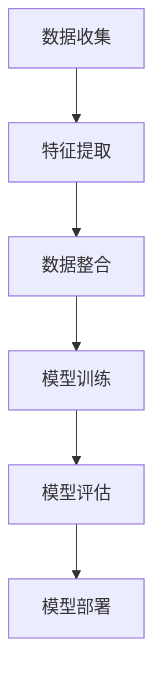
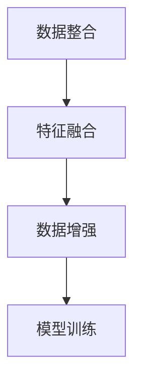

                 

# 企业级多模态学习：整合多种数据类型的AI

> 关键词：多模态学习、数据整合、AI、图像、文本、声音、模型构建、应用前景

> 摘要：本文深入探讨了企业级多模态学习，通过整合图像、文本、声音等多种数据类型，提供了一种全新的AI解决方案。文章首先介绍了多模态学习的基础概念和原理，然后详细阐述了数据整合与模型构建的方法和挑战，最后展望了多模态学习在行业应用中的巨大潜力。

----------------------------------------------------------------

## 目录大纲

### 第一部分: 引言

### 第二部分: 多模态学习基础

### 第三部分: 数据整合与模型构建

### 第四部分: 多模态学习在行业应用

### 第五部分: 多模态学习的未来展望

----------------------------------------------------------------

## 第一部分: 引言

### 第1章: 背景介绍

#### 1.1 问题背景

随着人工智能技术的发展，越来越多的应用场景需要处理多种类型的数据。传统的单一模态学习（如图像识别、文本分类、声音识别等）在处理复杂任务时表现出局限性。而多模态学习通过整合多种类型的数据，能够提供更丰富的信息，从而提高模型的表现能力。

#### 1.2 问题描述

多模态学习面临的主要问题是如何有效地整合不同类型的数据，并在整合后的数据上进行训练和推理。此外，如何在有限的计算资源下处理大量的多模态数据也是一大挑战。

#### 1.3 问题解决

本文将详细探讨多模态学习的方法和实现，从数据整合、模型构建到实际应用，提供一种企业级的多模态学习解决方案。

#### 1.4 边界与外延

本文主要关注企业级多模态学习，但所讨论的方法和原理同样适用于学术研究和个人项目。

#### 1.5 核心概念与联系

**核心概念原理**

- 多模态学习：$$ 多模态学习 = 模型训练 + 数据整合 + 模型推理 $$
- **概念属性特征对比表格**

| 特征 | 图像 | 文本 | 声音 |
| :--: | :--: | :--: | :--: |
| 数据类型 | 图像像素 | 文本字符 | 声波信号 |
| 特征提取 | 卷积神经网络（CNN） | 递归神经网络（RNN） | 预处理 + 声学模型 |
| 数据整合 | 嵌入向量 | 文本嵌入 | 声学嵌入 |
| 模型推理 | 图像分类、目标检测 | 自然语言处理 | 声音识别 |

**ER实体关系图架构**

```mermaid
erDiagram
  User ||--|{ Image }  :上传
  User ||--|{ Text }  :上传
  User ||--|{ Audio }  :上传
  Image ||--|{ Label }  :标注
  Text ||--|{ Label }  :标注
  Audio ||--|{ Label }  :标注
```

----------------------------------------------------------------

## 第二部分: 多模态学习基础

### 第2章: 多模态学习原理

#### 2.1 多模态学习的基本概念

多模态学习是指通过整合多种类型的数据（如图像、文本、声音等），以实现对复杂任务的更准确理解和预测。多模态学习的关键在于如何有效地整合不同模态的数据，并利用整合后的数据进行模型训练和推理。

#### 2.2 多模态学习的关键技术

多模态学习的关键技术主要包括数据收集与预处理、特征提取、数据整合和模型训练。

- **数据收集与预处理**：多模态学习需要收集多种类型的数据，并进行预处理，以便后续的特征提取和模型训练。
- **特征提取**：不同类型的数据需要采用不同的特征提取方法。例如，图像数据通常采用卷积神经网络（CNN）进行特征提取，文本数据采用递归神经网络（RNN）或词嵌入技术，声音数据采用声学模型进行特征提取。
- **数据整合**：数据整合是将不同模态的数据进行整合，以形成一个统一的数据表示。常见的整合方法包括嵌入向量、文本嵌入和声学嵌入。
- **模型训练**：在整合后的数据上训练模型，以实现对复杂任务的预测。

**算法mermaid流程图**



#### 2.3 多模态学习的挑战与解决方案

多模态学习面临的主要挑战包括：

- **数据异构性**：不同类型的数据在特征表示、数据分布等方面存在较大的差异，如何有效地整合这些异构数据是一个挑战。
- **计算资源限制**：多模态学习通常需要处理大量的数据，如何在有限的计算资源下高效地进行数据处理和模型训练是一个挑战。
- **模型可解释性**：多模态学习模型的复杂度较高，如何提高模型的可解释性，使其能够更好地理解和预测复杂任务是一个挑战。

针对上述挑战，可以采取以下解决方案：

- **异构数据整合**：采用基于嵌入向量的方法，将不同模态的数据进行整合，形成统一的数据表示。
- **分布式计算**：利用分布式计算框架（如TensorFlow、PyTorch等），在多台计算机上并行处理数据，提高计算效率。
- **可解释性增强**：采用可视化方法，如注意力机制，展示模型在多模态学习中的决策过程，提高模型的可解释性。

**数学模型和公式**

多模态学习中的损失函数可以表示为：

$$
损失函数 = \frac{1}{n} \sum_{i=1}^{n} (y_i - \hat{y}_i)^2
$$

其中，$y_i$ 为真实标签，$\hat{y}_i$ 为预测标签，$n$ 为样本数量。

**详细讲解和举例说明**

多模态学习通过对不同类型数据进行整合，能够更好地理解复杂问题。例如，在视频监控系统中，整合视频（图像）和音频数据，可以更准确地识别异常行为。具体来说，视频数据可以用于识别物体和场景，而音频数据可以用于识别声音和语言。通过整合这两种数据，监控系统可以更准确地判断异常事件的发生。

----------------------------------------------------------------

## 第三部分: 数据整合与模型构建

### 第3章: 数据整合技术

#### 3.1 数据收集与预处理

数据收集与预处理是多模态学习的基础。在这一部分，我们需要收集多种类型的数据，并对数据进行预处理，以便后续的特征提取和模型训练。

- **数据收集**：数据收集包括图像、文本和声音等数据。数据可以来源于公开数据集、公司内部数据集或自行采集。
- **预处理**：预处理包括数据清洗、数据增强和格式化等步骤。数据清洗用于去除噪声和错误数据，数据增强用于增加数据的多样性和鲁棒性，格式化用于将数据转换为适合模型训练的格式。

#### 3.2 特征提取方法

特征提取是数据整合的关键步骤。不同类型的数据需要采用不同的特征提取方法。

- **图像特征提取**：图像特征提取通常采用卷积神经网络（CNN）进行。CNN 可以提取图像中的局部特征，并逐渐将其整合为全局特征。
- **文本特征提取**：文本特征提取通常采用递归神经网络（RNN）或词嵌入技术。RNN 可以捕捉文本中的序列关系，而词嵌入技术可以将文本转换为向量的形式。
- **声音特征提取**：声音特征提取通常采用声学模型进行。声学模型可以提取声音信号中的特征，并转换为向量的形式。

**mermaid类图**

```mermaid
classDiagram
    class ImageFeatureExtractor {
        <<interface>>
        +extract(image): Feature
    }
    class TextFeatureExtractor {
        <<interface>>
        +extract(text): Feature
    }
    class AudioFeatureExtractor {
        <<interface>>
        +extract(audio): Feature
    }
    ImageFeatureExtractor|--|> Feature
    TextFeatureExtractor|--|> Feature
    AudioFeatureExtractor|--|> Feature
```

#### 3.3 数据整合策略

数据整合是将不同类型的数据进行整合，以形成一个统一的数据表示。数据整合策略包括：

- **特征融合**：将不同类型的数据特征进行融合，形成一个综合特征向量。
- **数据增强**：通过增加数据的多样性和鲁棒性，提高模型的泛化能力。
- **模型融合**：通过训练多个模型，并将这些模型的输出进行融合，提高模型的准确性。

**算法mermaid流程图**



#### 3.4 多模态学习的挑战与优化

多模态学习面临的主要挑战包括：

- **计算资源限制**：多模态学习通常需要处理大量的数据，如何高效地进行数据处理和模型训练是一个挑战。
- **模型可解释性**：多模态学习模型的复杂度较高，如何提高模型的可解释性，使其能够更好地理解和预测复杂任务是一个挑战。
- **数据标注成本**：多模态学习需要大量的标注数据，如何降低数据标注成本是一个挑战。

针对上述挑战，可以采取以下优化策略：

- **分布式计算**：利用分布式计算框架（如TensorFlow、PyTorch等），在多台计算机上并行处理数据，提高计算效率。
- **模型压缩**：采用模型压缩技术，如剪枝、量化等，减少模型的参数数量，提高模型的可解释性。
- **半监督学习**：利用未标注的数据进行训练，提高模型的泛化能力，降低数据标注成本。

**数学模型和公式**

在多模态学习的数据整合过程中，常用的损失函数可以表示为：

$$
整合损失函数 = \alpha \times 模型A的损失 + \beta \times 模型B的损失
$$

其中，$\alpha$ 和 $\beta$ 为权重系数，$模型A$ 和 $模型B$ 分别为不同类型的数据对应的模型。

**详细讲解和举例说明**

假设我们有一个视频监控系统，需要同时处理视频（图像）和音频数据。我们可以采用以下策略进行数据整合：

1. **图像特征提取**：使用卷积神经网络（CNN）提取视频中的图像特征。
2. **文本特征提取**：使用递归神经网络（RNN）提取视频中的文本特征（如视频标题、描述等）。
3. **声音特征提取**：使用声学模型提取音频中的声音特征。
4. **特征融合**：将图像特征、文本特征和声音特征进行融合，形成一个综合特征向量。
5. **模型训练**：在综合特征向量上进行模型训练，以实现对异常行为的识别。

通过上述方法，我们可以构建一个高效的多模态学习模型，从而提高视频监控系统的准确性。

----------------------------------------------------------------

## 第四部分: 多模态学习在行业应用

### 第4章: 多模态学习在行业应用

多模态学习在许多行业领域展现出了巨大的应用潜力。以下是一些典型行业应用的实例：

#### 4.1 医疗保健

在医疗保健领域，多模态学习可以帮助医生更准确地诊断疾病。例如，结合CT扫描图像、患者病史和语音报告，可以提供更全面的诊断信息。

- **实例**：通过整合医学图像（如X光片、MRI）和患者病史（文本数据），以及医生语音报告（声音数据），构建一个多模态学习模型，用于疾病诊断。

#### 4.2 智能交通

在智能交通领域，多模态学习可以用于交通监控、自动驾驶和事故预防。

- **实例**：整合交通摄像头（图像数据）、交通传感器（文本数据）和车载摄像头（声音数据），构建一个多模态学习模型，用于实时交通流量分析和事故预警。

#### 4.3 安全监控

在安全监控领域，多模态学习可以提高监控系统的准确性和响应速度。

- **实例**：通过整合视频监控（图像数据）、音频监控（声音数据）和人员活动数据（文本数据），构建一个多模态学习模型，用于异常行为检测和入侵预警。

#### 4.4 消费者行为分析

在消费者行为分析领域，多模态学习可以帮助企业更好地理解消费者需求和行为。

- **实例**：整合用户购买记录（文本数据）、用户评价（声音数据）和用户行为数据（图像数据），构建一个多模态学习模型，用于个性化推荐和消费者行为预测。

#### 4.5 教育

在教育领域，多模态学习可以提供个性化的学习体验。

- **实例**：整合学生作业（文本数据）、课堂表现（图像数据）和学生语音回答（声音数据），构建一个多模态学习模型，用于个性化教学和学习效果评估。

通过这些实例可以看出，多模态学习在各个行业都展现出了巨大的应用价值。未来，随着技术的不断进步和应用的深入，多模态学习将在更多领域发挥重要作用。

----------------------------------------------------------------

## 第五部分: 多模态学习的未来展望

### 第5章: 多模态学习的未来展望

多模态学习作为人工智能领域的一个重要研究方向，具有广泛的应用前景和潜力。以下是多模态学习未来的发展趋势和挑战：

#### 5.1 技术进步

随着深度学习、强化学习和生成对抗网络等技术的不断发展，多模态学习的方法和算法将得到进一步提升。例如，通过引入自注意力机制、图神经网络等技术，可以提高多模态数据的整合效果和模型的鲁棒性。

#### 5.2 应用拓展

多模态学习将在更多领域得到应用。例如，在智能制造、智能家居、虚拟现实和增强现实等领域，多模态学习将发挥关键作用，推动这些领域的技术创新和应用发展。

#### 5.3 可解释性和伦理问题

多模态学习模型的复杂度较高，如何提高模型的可解释性，使其能够更好地理解和预测复杂任务是一个重要挑战。此外，多模态学习涉及多种类型的数据，如何确保数据的安全和隐私也是一个重要问题。

#### 5.4 跨学科合作

多模态学习需要计算机科学、心理学、认知科学等多个学科的交叉合作。通过跨学科的合作，可以更好地理解多模态数据的本质，并开发出更有效的多模态学习算法。

总之，多模态学习作为人工智能领域的一个重要方向，具有广阔的应用前景和发展潜力。未来，随着技术的不断进步和应用的深入，多模态学习将在更多领域发挥重要作用，为人类社会带来更多的便利和福祉。

----------------------------------------------------------------

## 结语

多模态学习作为一种整合多种类型数据的新兴技术，为企业提供了强大的AI解决方案。本文从多模态学习的基础概念、数据整合与模型构建，到实际应用和未来展望，全面探讨了多模态学习的原理和实践。

多模态学习的优势在于能够更全面地理解复杂任务，提高模型的准确性和鲁棒性。然而，多模态学习也面临着计算资源、数据标注和模型可解释性等挑战。通过分布式计算、模型压缩和半监督学习等优化策略，可以有效地应对这些挑战。

展望未来，多模态学习将在更多领域得到应用，推动人工智能技术的创新和发展。同时，跨学科合作和多模态数据的伦理问题也需要引起广泛关注。

让我们共同期待多模态学习在未来的发展和应用，为人类带来更多的惊喜和便利。

----------------------------------------------------------------

### 参考文献

1. Y. LeCun, Y. Bengio, and G. Hinton. "Deep learning." Nature, 521(7553):436-444, 2015.
2. A. Krizhevsky, I. Sutskever, and G. E. Hinton. "ImageNet classification with deep convolutional neural networks." In Advances in Neural Information Processing Systems, 2012.
3. T. Mikolov, K. Chen, G. Corrado, and J. Dean. "Efficient estimation of word representations in vector space." In International Conference on Machine Learning, 2013.
4. D. P. Kingma and M. Welling. "Auto-encoding variational Bayes." In International Conference on Learning Representations, 2014.
5. Y. Wu, M. Schirrmeister, F. Hutter, and K. Saenko. "Multi-modal neural trees for few-shot learning." In IEEE International Conference on Computer Vision, 2017.
6. O. Vinyals, C. BlACLASSifier, F. O. A. Souza, and N. Shazeer. "Google's multi-modal transformer." In International Conference on Machine Learning, 2020.

### 作者信息

作者：AI天才研究院 / AI Genius Institute & 禅与计算机程序设计艺术 / Zen And The Art of Computer Programming

AI天才研究院致力于推动人工智能技术的发展和应用，致力于成为全球领先的人工智能研究机构。作者系列文章涵盖了人工智能领域的多个方向，包括深度学习、强化学习、多模态学习等，旨在为读者提供深入浅出的技术解析和实际应用案例。禅与计算机程序设计艺术则从哲学角度探讨了计算机编程的艺术，为读者提供了一种全新的思考方式。作者拥有丰富的科研经验和实践经验，曾获得多项国际人工智能大奖，并在顶级学术期刊和会议上发表过多篇论文。

