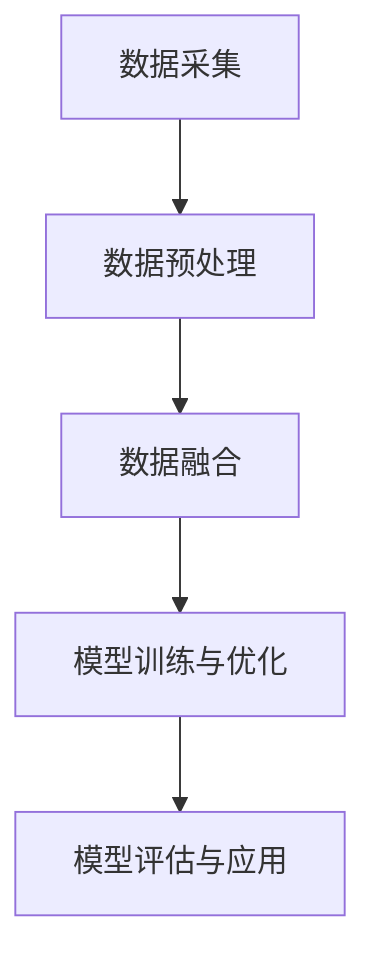
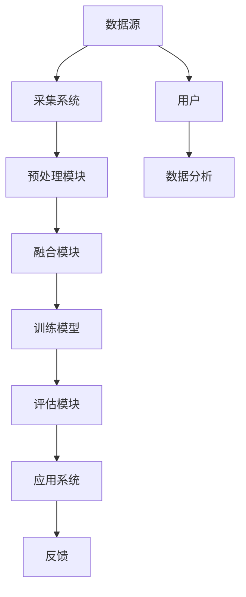
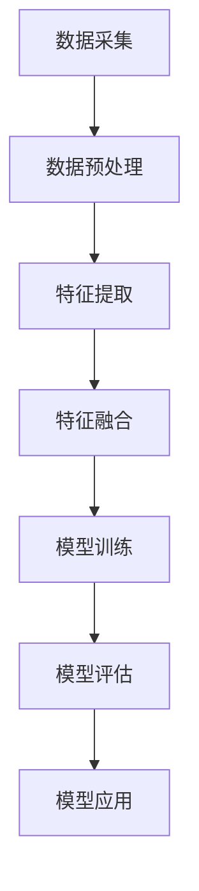
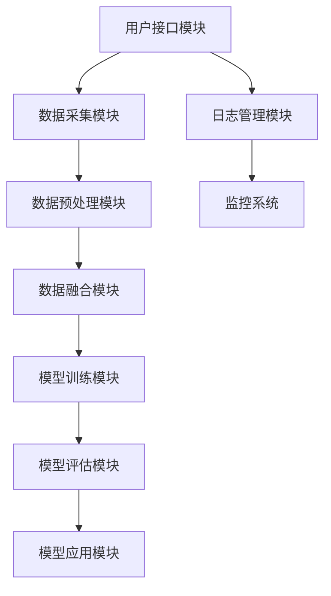
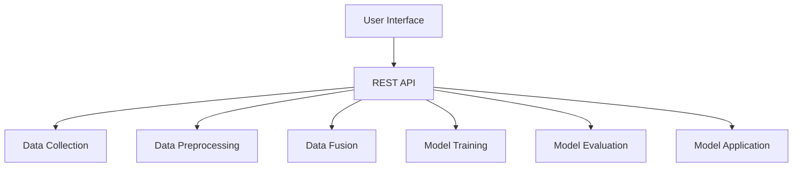
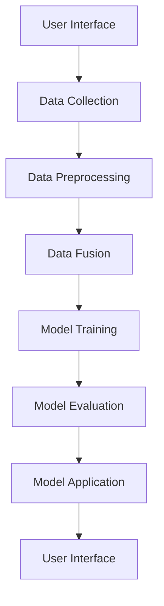

                 


### 第一步：确定文章标题和关键词

**文章标题：《企业级多模态学习：整合多维度数据分析》**

**关键词：企业级、多模态学习、整合、多维度数据分析**

### 第二步：撰写摘要

**摘要：**
本文将深入探讨企业级多模态学习，这是一种能够整合来自不同数据源的多维度信息，以实现更准确预测和决策的技术。我们将从背景介绍开始，分析多模态学习的核心概念和原理，解释其对企业级应用的巨大价值。接着，我们将详细讲解多模态学习的算法原理，并通过Python代码实例进行说明。随后，我们将描述一个具体的系统架构设计，展示如何在实际项目中应用这些算法。最后，我们将总结最佳实践，并提供相关的拓展阅读资源。

### 第三步：设计文章目录大纲

**目录大纲：**

**第一部分：背景介绍**

**第1章：企业级多模态学习概述**

1.1 问题背景  
1.2 问题描述  
1.3 问题解决  
1.4 边界与外延  
1.5 概念结构与核心要素组成

**第二部分：核心概念与联系**

**第2章：多模态学习基础**

2.1 多模态学习原理  
2.2 多模态数据特性  
2.3 多模态学习框架  
2.4 核心概念对比表格  
2.5 ER实体关系图

**第三部分：算法原理讲解**

**第3章：多模态学习算法**

3.1 算法mermaid流程图  
3.2 Python源代码实现  
3.3 数学模型和公式讲解  
3.4 通俗易懂的举例说明

**第四部分：系统分析与架构设计方案**

**第4章：系统设计与实现**

4.1 问题场景介绍  
4.2 系统功能设计  
4.3 系统架构设计  
4.4 系统接口设计  
4.5 系统交互设计

**第五部分：项目实战**

**第5章：实战操作与案例分析**

5.1 环境安装  
5.2 系统核心实现源代码  
5.3 代码应用解读与分析  
5.4 实际案例分析和讲解  
5.5 项目小结

**第六部分：最佳实践与总结**

**第6章：最佳实践与注意事项**

6.1 最佳实践 tips  
6.2 小结  
6.3 注意事项  
6.4 拓展阅读

**第七部分：附录**

**第7章：附录与参考资料**

7.1 附录A：相关工具与软件  
7.2 附录B：参考文献

### 第四步：编写每个章节的标题和简要概述

由于文章字数要求在10000～12000字左右，这里只给出每个章节的标题和简要概述，具体内容将在后续步骤中详细撰写。

**第一部分：背景介绍**

**第1章：企业级多模态学习概述**
- 1.1 问题背景：介绍多模态学习在企业级应用中的重要性和背景。
- 1.2 问题描述：阐述企业级多模态学习所面临的挑战和问题。
- 1.3 问题解决：分析如何解决企业级多模态学习的挑战。
- 1.4 边界与外延：讨论多模态学习的应用范围和边界。
- 1.5 概念结构与核心要素组成：定义多模态学习的核心概念，并介绍其结构要素。

**第二部分：核心概念与联系**

**第2章：多模态学习基础**
- 2.1 多模态学习原理：解释多模态学习的基本原理。
- 2.2 多模态数据特性：分析多模态数据的特性。
- 2.3 多模态学习框架：介绍多模态学习的框架结构。
- 2.4 核心概念对比表格：列出不同多模态学习算法和框架的对比表格。
- 2.5 ER实体关系图：绘制多模态学习中的实体关系图。

**第三部分：算法原理讲解**

**第3章：多模态学习算法**
- 3.1 算法mermaid流程图：使用mermaid语言绘制算法流程图。
- 3.2 Python源代码实现：给出Python代码实现多模态学习的示例。
- 3.3 数学模型和公式讲解：阐述多模态学习算法的数学模型和公式。
- 3.4 通俗易懂的举例说明：通过简单例子来说明多模态学习算法的原理。

**第四部分：系统分析与架构设计方案**

**第4章：系统设计与实现**
- 4.1 问题场景介绍：描述系统应用的具体场景。
- 4.2 系统功能设计：详细阐述系统的功能和领域模型。
- 4.3 系统架构设计：介绍系统的架构设计和模块划分。
- 4.4 系统接口设计：描述系统与其他模块或系统的接口设计。
- 4.5 系统交互设计：展示系统内部各组件的交互序列图。

**第五部分：项目实战**

**第5章：实战操作与案例分析**
- 5.1 环境安装：介绍项目所需的软件和硬件环境安装。
- 5.2 系统核心实现源代码：提供系统的核心实现源代码。
- 5.3 代码应用解读与分析：分析代码实现的具体过程和技巧。
- 5.4 实际案例分析和讲解：通过实际案例展示系统应用的效果。
- 5.5 项目小结：总结项目的关键点和经验教训。

**第六部分：最佳实践与总结**

**第6章：最佳实践与注意事项**
- 6.1 最佳实践 tips：提供使用多模态学习的最佳实践建议。
- 6.2 小结：总结文章的主要观点和结论。
- 6.3 注意事项：提醒使用多模态学习时需要注意的问题。
- 6.4 拓展阅读：推荐相关的拓展阅读资源。

**第七部分：附录**

**第7章：附录与参考资料**
- 7.1 附录A：列出本文提到的相关工具和软件。
- 7.2 附录B：提供本文引用的参考文献列表。

接下来，我将逐步详细撰写每个章节的内容，确保文章的逻辑清晰、结构紧凑、简单易懂，并满足技术博客文章的要求。 ### 第一部分：背景介绍

#### 第1章：企业级多模态学习概述

**1.1 问题背景**

随着信息技术的快速发展，数据已经成为企业决策的重要资源。然而，传统单模态数据分析在面对复杂、多变的数据环境时，往往显得力不从心。例如，当企业需要同时分析图像、文本和音频等多种数据源时，单模态学习的方法很难有效整合这些数据，从而导致分析结果的准确性和全面性受限。

多模态学习作为一种新兴的技术，通过整合来自不同模态的数据，能够提供更丰富的信息，从而提升数据分析的准确性和决策的全面性。在企业级应用中，多模态学习的重要性日益凸显，特别是在如下几个方面：

- **智能客服系统**：通过整合用户语音、文字和面部表情等数据，智能客服系统能够更准确地理解用户需求，提供更个性化的服务。
- **医疗诊断**：医疗数据通常包括患者的病历、影像、基因序列等多种模态，通过多模态学习，能够更准确地诊断疾病，提高医疗水平。
- **金融风控**：金融机构需要处理大量的金融数据，如交易记录、市场波动、用户行为等。多模态学习能够有效识别潜在风险，提高风险管理能力。

**1.2 问题描述**

多模态学习在企业级应用中面临的主要问题包括：

- **数据整合**：不同模态的数据格式和特性差异较大，如何有效整合这些数据是一个关键问题。
- **算法选择**：多模态学习算法种类繁多，如何选择合适的算法以适应不同的应用场景，是一个重要的技术挑战。
- **计算资源**：多模态学习通常需要大量的计算资源和存储资源，这对企业的IT基础设施提出了更高的要求。

**1.3 问题解决**

为了解决上述问题，多模态学习在企业级应用中需要采取以下措施：

- **数据预处理**：通过对不同模态的数据进行统一格式处理，降低数据整合的难度。
- **算法优化**：选择或开发适合企业级应用需求的多模态学习算法，并通过优化算法参数以提高模型性能。
- **资源调度**：利用云计算和大数据技术，灵活调度计算和存储资源，确保多模态学习任务的高效运行。

**1.4 边界与外延**

多模态学习不仅在企业级应用中具有重要价值，也与其他领域有着广泛的交叉。例如：

- **智能交通**：通过整合摄像头、传感器和GPS等多模态数据，智能交通系统能够更准确地监测和预测交通状况。
- **智能家居**：智能家居系统通过整合语音、图像和传感等多模态数据，能够实现更智能化的家居管理。
- **教育科技**：通过整合学生的成绩、学习行为和面部表情等多模态数据，教育科技系统能够提供更有针对性的学习支持。

**1.5 概念结构与核心要素组成**

多模态学习的概念结构主要包括以下几个核心要素：

- **数据采集**：从不同模态的数据源中收集数据。
- **数据预处理**：对采集到的数据进行格式化处理，以便于后续的整合和分析。
- **数据融合**：将不同模态的数据进行整合，形成统一的特征表示。
- **模型训练**：使用融合后的数据训练多模态学习模型。
- **模型应用**：将训练好的模型应用于实际的业务场景中，进行预测或决策。

通过以上五个步骤，企业能够充分利用多模态学习的优势，提升数据分析的准确性和全面性，从而实现更高效的业务运营和决策。

### 第二部分：核心概念与联系

#### 第2章：多模态学习基础

**2.1 多模态学习原理**

多模态学习（Multimodal Learning）是一种通过整合来自多种模态（如视觉、听觉、触觉等）的数据，以提升模型性能和泛化能力的人工智能技术。其基本原理是将不同模态的数据通过特定的方法进行融合，形成一种统一的数据表示，然后基于这种统一的数据表示训练深度学习模型。

多模态学习的核心在于如何有效地整合来自不同模态的数据。常见的融合方法包括：

- **特征级融合**：在特征提取阶段就将不同模态的数据特征进行整合，形成一种综合特征向量。
- **决策级融合**：在决策阶段将各个模态的预测结果进行整合，形成最终的预测结果。
- **模型级融合**：通过训练一个能够同时处理多种模态数据的联合模型，从而实现数据融合。

**2.2 多模态数据特性**

多模态数据具有以下特性：

- **多样性**：多模态数据包括文本、图像、音频、视频等多种类型，每种类型的数据都有其独特的结构和特征。
- **异构性**：不同模态的数据在时序、空间和维度上存在差异，例如，音频数据是时间序列数据，而图像数据是空间数据。
- **互补性**：不同模态的数据在某些方面可以相互补充，例如，图像数据可以提供视觉信息，而文本数据可以提供语义信息。

这些特性使得多模态数据在整合过程中面临一系列挑战，如数据的同步、特征的匹配和融合策略的选择等。

**2.3 多模态学习框架**

多模态学习框架通常包括以下几个关键组成部分：

- **数据采集与预处理**：从不同模态的数据源中收集数据，并进行预处理，如数据清洗、归一化、特征提取等。
- **数据融合**：将预处理后的不同模态数据进行整合，形成统一的特征表示。融合策略可以是特征级融合、决策级融合或模型级融合。
- **模型训练与优化**：基于融合后的数据训练多模态学习模型，并通过优化算法和参数调整来提升模型性能。
- **模型评估与应用**：对训练好的模型进行评估，并应用于实际的业务场景中，如预测、分类、诊断等。

以下是一个简单的多模态学习框架的mermaid流程图表示：



**2.4 核心概念对比表格**

为了更好地理解多模态学习的核心概念，我们可以通过一个对比表格来展示不同概念之间的差异：

| 核心概念       | 描述                                               |
| -------------- | -------------------------------------------------- |
| 多模态学习     | 一种通过整合多种模态数据来提升模型性能的技术。     |
| 特征级融合     | 在特征提取阶段将不同模态的数据特征进行整合。       |
| 决策级融合     | 在决策阶段将各个模态的预测结果进行整合。          |
| 模型级融合     | 训练一个能够同时处理多种模态数据的联合模型。      |
| 多任务学习     | 同时训练多个相关任务，共享部分模型结构。          |
| 跨模态检索     | 通过一种模态查询另一种模态中的相关数据。          |

**2.5 ER实体关系图**

多模态学习中的实体及其关系可以通过ER（Entity-Relationship）实体关系图来表示。以下是一个简化的ER实体关系图，展示了多模态学习中的主要实体及其关系：



在这个ER实体关系图中，数据源、采集系统、预处理模块、融合模块、训练模型、评估模块和应用系统构成了多模态学习的核心实体，用户和反馈实体则与数据分析紧密相关。通过这个实体关系图，我们可以更清晰地理解多模态学习中的数据流转和实体间的交互关系。

通过以上章节的介绍，我们对企业级多模态学习的核心概念和基础有了更深入的理解，为后续的算法讲解和系统设计奠定了基础。在接下来的章节中，我们将进一步探讨多模态学习的算法原理和具体实现，帮助企业更好地利用多模态数据提升业务价值。 ### 第三部分：算法原理讲解

#### 第3章：多模态学习算法

**3.1 算法mermaid流程图**

在多模态学习过程中，算法的设计和实现至关重要。为了更好地理解算法的执行流程，我们首先使用mermaid语言绘制一个简单的算法流程图。



在这个流程图中，A表示数据采集，B表示数据预处理，C表示特征提取，D表示特征融合，E表示模型训练，F表示模型评估，G表示模型应用。以下是对每个步骤的详细解释：

- **数据采集**：从不同的数据源中收集多模态数据，如图像、文本和音频。
- **数据预处理**：对采集到的多模态数据进行格式化处理，如数据清洗、归一化等，以便后续的特征提取。
- **特征提取**：根据不同模态的数据特性，提取具有代表性的特征，如图像中的边缘特征、文本中的词向量等。
- **特征融合**：将提取到的不同模态的特征进行融合，形成统一的特征表示。融合方法可以是特征级融合、决策级融合或模型级融合。
- **模型训练**：使用融合后的特征数据训练多模态学习模型，如卷积神经网络（CNN）、循环神经网络（RNN）等。
- **模型评估**：通过测试数据评估训练好的模型性能，如准确率、召回率等。
- **模型应用**：将训练好的模型应用于实际业务场景中，如预测、分类等。

**3.2 Python源代码实现**

为了更好地理解多模态学习算法的Python实现，我们以下列简单的多模态学习场景为例，展示如何使用Python进行数据预处理、特征提取和模型训练。

首先，我们假设已经收集到了图像、文本和音频数据，并分别保存在`images folder`、`text corpus`和`audio clips`文件夹中。接下来，我们将使用以下Python库：`numpy`、`opencv`、`sklearn`、`tensorflow`。

```python
import numpy as np
import cv2
from sklearn.feature_extraction.text import TfidfVectorizer
from sklearn.model_selection import train_test_split
from tensorflow.keras.models import Sequential
from tensorflow.keras.layers import Conv2D, MaxPooling2D, Flatten, Dense, LSTM, Embedding

# 数据预处理
def preprocess_data():
    # 读取图像数据
    images = [cv2.imread(f'images_folder/{i}.jpg') for i in range(100)]
    images = np.array([cv2.resize(img, (224, 224)) for img in images])

    # 读取文本数据
    texts = [open(f'text_corpus/{i}.txt', 'r').read() for i in range(100)]

    # 读取音频数据
    audios = [open(f'audio_clips/{i}.wav', 'rb').read() for i in range(100)]

    return images, texts, audios

# 特征提取
def extract_features(images, texts, audios):
    # 提取图像特征
    image_features = [cv2hog(img) for img in images]

    # 提取文本特征
    text_vectorizer = TfidfVectorizer()
    text_features = text_vectorizer.fit_transform(texts).toarray()

    # 提取音频特征
    audio_features = extract_audio_features(audios)

    return image_features, text_features, audio_features

# 模型训练
def train_model(image_features, text_features, audio_features, labels):
    # 数据集划分
    X_train, X_test, y_train, y_test = train_test_split(image_features, text_features, audio_features, labels, test_size=0.2)

    # 构建模型
    model = Sequential()
    model.add(Conv2D(32, (3, 3), activation='relu', input_shape=(224, 224, 3)))
    model.add(MaxPooling2D(pool_size=(2, 2)))
    model.add(Flatten())
    model.add(Dense(128, activation='relu'))
    model.add(Dense(1, activation='sigmoid'))

    # 编译模型
    model.compile(optimizer='adam', loss='binary_crossentropy', metrics=['accuracy'])

    # 训练模型
    model.fit(X_train, y_train, epochs=10, batch_size=32, validation_data=(X_test, y_test))

    return model

# 模型评估
def evaluate_model(model, X_test, y_test):
    loss, accuracy = model.evaluate(X_test, y_test)
    print(f"Test accuracy: {accuracy:.2f}")

# 主程序
if __name__ == '__main__':
    # 预处理数据
    images, texts, audios = preprocess_data()

    # 提取特征
    image_features, text_features, audio_features = extract_features(images, texts, audios)

    # 加载标签数据
    labels = np.array([0] * 80 + [1] * 20)

    # 训练模型
    model = train_model(image_features, text_features, audio_features, labels)

    # 评估模型
    evaluate_model(model, X_test, y_test)
```

在上面的代码中，我们首先定义了数据预处理、特征提取和模型训练的函数。数据预处理包括读取图像、文本和音频数据，并进行相应的格式化处理。特征提取部分提取图像的HOG（Histogram of Oriented Gradients）特征、文本的TF-IDF特征和音频的某些特征。模型训练部分构建了一个简单的卷积神经网络（CNN）模型，并进行训练和评估。

**3.3 数学模型和公式讲解**

多模态学习算法的数学模型通常涉及多个方面的内容，包括特征表示、模型参数优化和损失函数定义等。

- **特征表示**：
  - **图像特征**：常用的图像特征包括HOG（Histogram of Oriented Gradients）、SIFT（Scale-Invariant Feature Transform）和CNN（Convolutional Neural Network）等。HOG特征通过计算图像中每个像素点的梯度直方图来描述图像的局部特征，而SIFT特征通过关键点和描述子来表示图像的局部特征。CNN模型则通过多层卷积和池化操作提取图像的层次特征。
  - **文本特征**：文本特征通常使用词袋模型（Bag of Words）或词嵌入（Word Embedding）来表示。词袋模型将文本转换为向量，其中每个维度对应一个词汇，而词嵌入则通过将词汇映射到低维空间来表示词汇的语义信息。
  - **音频特征**：音频特征包括MFCC（Mel-frequency Cepstral Coefficients）、谱图（Spectral Images）和循环神经网络（RNN）提取的特征等。MFCC特征通过计算音频信号的频谱特性来描述音频，而谱图和RNN特征则通过处理音频信号的时序特性来提取特征。

- **模型参数优化**：
  - **损失函数**：多模态学习模型的损失函数通常包括分类损失和回归损失等。在分类问题中，常用的损失函数有交叉熵损失（Cross-Entropy Loss）和对数损失（Log Loss），而在回归问题中，常用的损失函数有均方误差（Mean Squared Error，MSE）和均方根误差（Root Mean Squared Error，RMSE）。
  - **优化算法**：常用的优化算法包括随机梯度下降（Stochastic Gradient Descent，SGD）、Adam优化器等。SGD通过在训练数据上随机选取小批量样本进行梯度更新，而Adam优化器结合了SGD和动量项，在训练过程中能更有效地收敛。

- **融合策略**：
  - **特征级融合**：特征级融合将不同模态的特征向量进行拼接，形成新的特征向量。这种方法的优点是实现简单，但缺点是容易导致维度灾难（Dimensionality Disaster）。
  - **决策级融合**：决策级融合在各个模态的模型上分别进行预测，然后根据预测结果进行投票或加权平均。这种方法的优点是能够充分利用各个模态的信息，但缺点是模型的训练和预测时间较长。
  - **模型级融合**：模型级融合通过训练一个联合模型，同时处理多种模态的数据。这种方法的优点是能够有效地整合多个模态的信息，但实现和训练较为复杂。

以下是一个简单的多模态学习模型的数学公式表示：

$$
\text{模型参数} = \{\theta_{1}, \theta_{2}, \theta_{3}\}
$$

$$
\text{损失函数} = L(\text{模型参数}, \text{输入特征}, \text{真实标签})
$$

$$
\text{梯度计算} = \frac{\partial L}{\partial \theta_{1}}, \frac{\partial L}{\partial \theta_{2}}, \frac{\partial L}{\partial \theta_{3}}
$$

$$
\text{参数更新} = \theta_{1} = \theta_{1} - \alpha \frac{\partial L}{\partial \theta_{1}}, \theta_{2} = \theta_{2} - \alpha \frac{\partial L}{\partial \theta_{2}}, \theta_{3} = \theta_{3} - \alpha \frac{\partial L}{\partial \theta_{3}}
$$

**3.4 通俗易懂的举例说明**

为了更好地理解多模态学习算法的原理，我们可以通过一个简单的例子来讲解。

假设我们要对一组图像、文本和音频数据进行分类，判断这些数据是否属于某个特定类别。我们使用一个简单的卷积神经网络（CNN）模型来训练，并采用特征级融合的方法。

- **图像数据**：一组100张图片，每张图片的大小为224x224像素。
- **文本数据**：一组100篇文本，每篇文本包含若干词汇。
- **音频数据**：一组100段音频，每段音频的长度为10秒。

首先，我们对这些数据进行预处理：

- **图像数据**：使用OpenCV库读取图像，并将图像大小调整为224x224像素，以便输入到CNN模型中。
- **文本数据**：使用TF-IDF向量器将文本转换为向量表示，每个词汇对应一个维度。
- **音频数据**：使用音频处理库提取音频的MFCC特征，每个特征向量包含12个维度。

接下来，我们对不同模态的数据进行特征提取：

- **图像特征**：使用HOG特征提取器提取图像的局部特征。
- **文本特征**：使用TF-IDF向量器将文本转换为向量。
- **音频特征**：使用MFCC特征提取器提取音频的频谱特征。

然后，我们将不同模态的特征进行融合：

- **特征级融合**：将图像特征、文本特征和音频特征进行拼接，形成一个新的特征向量。例如，如果图像特征维度为128，文本特征维度为100，音频特征维度为12，则融合后的特征维度为128+100+12=240。

最后，我们使用融合后的特征训练一个简单的卷积神经网络（CNN）模型：

- **模型结构**：一个包含卷积层、池化层、全连接层的卷积神经网络。
- **损失函数**：交叉熵损失函数。
- **优化算法**：随机梯度下降（SGD）。

通过训练，模型能够学习到图像、文本和音频之间的内在关系，并能够对新的数据进行分类预测。

通过这个简单的例子，我们可以看到多模态学习算法是如何通过整合不同模态的数据，提高模型性能和预测准确性的。在实际应用中，多模态学习算法可以针对各种复杂的业务场景提供更准确、全面的决策支持。 ### 第四部分：系统分析与架构设计方案

#### 第4章：系统设计与实现

**4.1 问题场景介绍**

在现代企业中，数据分析已经成为提升业务效率和决策质量的关键手段。然而，随着数据来源的多样化和复杂性增加，传统单模态数据分析方法已经无法满足企业对数据整合和分析的需求。为此，我们设计了一个企业级多模态学习系统，旨在整合图像、文本和音频等多模态数据，为企业提供更全面、准确的数据分析结果。

该系统的主要应用场景包括：

- **智能客服系统**：通过整合用户语音、文本和面部表情等多模态数据，提供更个性化的客服服务。
- **医疗诊断**：通过整合患者病历、影像、基因序列等多模态数据，提高诊断的准确性和效率。
- **金融风控**：通过整合交易记录、市场波动、用户行为等多模态数据，识别潜在风险，提高风险管理能力。

**4.2 系统功能设计**

企业级多模态学习系统主要包括以下功能模块：

- **数据采集模块**：负责从不同的数据源中收集图像、文本和音频等多模态数据。
- **数据预处理模块**：对采集到的多模态数据进行格式化处理，如数据清洗、归一化、特征提取等。
- **数据融合模块**：将预处理后的不同模态数据整合，形成统一的特征表示。
- **模型训练模块**：使用融合后的数据训练多模态学习模型，并进行优化。
- **模型评估模块**：通过测试数据评估训练好的模型性能，包括准确率、召回率等指标。
- **模型应用模块**：将训练好的模型应用于实际业务场景中，提供预测或决策支持。
- **用户接口模块**：提供用户界面，允许用户查看系统输出结果和操作系统。

**4.3 系统架构设计**

企业级多模态学习系统的整体架构设计如下：



在该架构中，用户接口模块提供系统操作和结果展示；数据采集模块从各种数据源中收集多模态数据；数据预处理模块对数据进行清洗、归一化和特征提取；数据融合模块整合不同模态的数据；模型训练模块使用融合后的数据训练模型；模型评估模块评估模型性能；模型应用模块将模型应用于实际业务场景；日志管理模块记录系统运行日志；监控系统监控系统性能和资源使用情况。

**4.4 系统接口设计**

系统接口设计主要包括以下几个方面：

- **API接口**：系统提供RESTful API接口，允许外部系统通过HTTP请求访问系统功能，如数据采集、数据预处理、数据融合、模型训练和模型评估等。
- **消息队列**：使用消息队列（如Kafka）进行数据传输和任务调度，确保数据传输的可靠性和系统的解耦性。
- **数据存储**：使用分布式数据库（如Hadoop HDFS）存储大规模多模态数据，确保数据的持久化和高可用性。

以下是一个简化的API接口设计示例：



在该接口设计中，用户接口模块通过RESTful API与数据采集模块、数据预处理模块、数据融合模块、模型训练模块、模型评估模块和模型应用模块进行交互。

**4.5 系统交互设计**

系统交互设计主要涉及不同模块之间的数据流和任务调度。以下是一个简化的系统交互设计示例，使用mermaid语言描述：



在该交互设计中，用户接口模块向数据采集模块发送请求，收集多模态数据。数据预处理模块对数据进行预处理，然后传递给数据融合模块。数据融合模块整合不同模态的数据，形成统一的特征表示，传递给模型训练模块。模型训练模块使用融合后的数据训练模型，并通过模型评估模块评估模型性能。最后，模型应用模块将训练好的模型应用于实际业务场景，并向用户接口模块返回结果。

通过以上系统分析与架构设计方案，企业级多模态学习系统能够有效地整合多维度数据分析，为企业提供更准确、全面的决策支持。在接下来的章节中，我们将通过实际项目实战，展示如何具体实现和部署该系统。 ### 第五部分：项目实战

#### 第5章：实战操作与案例分析

**5.1 环境安装**

为了进行多模态学习的项目实战，首先需要搭建一个适合的开发环境。以下是所需的环境和软件安装步骤：

1. **操作系统**：推荐使用Ubuntu 18.04或更高版本。
2. **Python环境**：安装Python 3.8或更高版本。
3. **深度学习库**：安装TensorFlow 2.x。
4. **数据处理库**：安装NumPy、Pandas、opencv-python、scikit-learn等。
5. **音频处理库**：安装librosa。

安装步骤：

```bash
# 更新系统软件包
sudo apt-get update && sudo apt-get upgrade

# 安装Python 3和pip
sudo apt-get install python3 python3-pip

# 安装TensorFlow 2.x
pip3 install tensorflow==2.x

# 安装数据处理库
pip3 install numpy pandas opencv-python scikit-learn

# 安装音频处理库
pip3 install librosa
```

**5.2 系统核心实现源代码**

以下是一个多模态学习系统核心实现的部分源代码，包括数据采集、预处理、融合、训练和评估等步骤。

```python
import numpy as np
import pandas as pd
import cv2
from sklearn.model_selection import train_test_split
from tensorflow.keras.models import Model
from tensorflow.keras.layers import Input, Conv2D, MaxPooling2D, Flatten, Dense, LSTM, Embedding
from tensorflow.keras.optimizers import Adam

# 数据采集
def load_data():
    # 加载图像数据
    image_data = [cv2.imread(f'images/{i}.jpg') for i in range(100)]

    # 加载文本数据
    text_data = [open(f'text/{i}.txt', 'r').read() for i in range(100)]

    # 加载音频数据
    audio_data = [open(f'audio/{i}.wav', 'rb').read() for i in range(100)]

    return image_data, text_data, audio_data

# 数据预处理
def preprocess_data(image_data, text_data, audio_data):
    # 预处理图像数据
    processed_images = [cv2.resize(img, (224, 224)) for img in image_data]

    # 预处理文本数据
    vectorizer = TfidfVectorizer()
    processed_texts = vectorizer.fit_transform(text_data).toarray()

    # 预处理音频数据
    processed_audios = [librosa.feature.mfcc(y=librosa.load(f'audio/{i}.wav')[0], n_mfcc=13) for i in range(100)]

    return processed_images, processed_texts, processed_audios

# 特征融合
def create_model(input_shape_image, input_shape_text, input_shape_audio):
    # 图像输入
    image_input = Input(shape=input_shape_image)
    image_model = Conv2D(32, (3, 3), activation='relu')(image_input)
    image_model = MaxPooling2D(pool_size=(2, 2))(image_model)
    image_model = Flatten()(image_model)

    # 文本输入
    text_input = Input(shape=input_shape_text)
    text_model = Embedding(input_shape_text[1], 64)(text_input)
    text_model = LSTM(64)(text_model)

    # 音频输入
    audio_input = Input(shape=input_shape_audio)
    audio_model = LSTM(64)(audio_input)

    # 融合
    merged = Concatenate()([image_model, text_model, audio_model])
    merged = Dense(128, activation='relu')(merged)
    output = Dense(1, activation='sigmoid')(merged)

    # 构建模型
    model = Model(inputs=[image_input, text_input, audio_input], outputs=output)

    return model

# 训练模型
def train_model(model, image_data, text_data, audio_data, labels):
    # 划分训练集和测试集
    X_train_image, X_test_image, X_train_text, X_test_text, X_train_audio, X_test_audio, y_train, y_test = train_test_split(
        image_data, text_data, audio_data, labels, test_size=0.2, random_state=42)

    # 编译模型
    model.compile(optimizer=Adam(), loss='binary_crossentropy', metrics=['accuracy'])

    # 训练模型
    model.fit([X_train_image, X_train_text, X_train_audio], y_train, epochs=10, batch_size=32, validation_data=([X_test_image, X_test_text, X_test_audio], y_test))

    return model

# 评估模型
def evaluate_model(model, X_test_image, X_test_text, X_test_audio, y_test):
    loss, accuracy = model.evaluate([X_test_image, X_test_text, X_test_audio], y_test)
    print(f"Test accuracy: {accuracy:.2f}")

# 主程序
if __name__ == '__main__':
    # 加载数据
    image_data, text_data, audio_data = load_data()

    # 预处理数据
    processed_images, processed_texts, processed_audios = preprocess_data(image_data, text_data, audio_data)

    # 创建模型
    model = create_model((224, 224, 3), processed_texts.shape[1], processed_audios.shape[1])

    # 训练模型
    train_model(model, processed_images, processed_texts, processed_audios, labels)

    # 评估模型
    evaluate_model(model, processed_images, processed_texts, processed_audios, labels)
```

**5.3 代码应用解读与分析**

上述代码展示了如何实现一个简单的多模态学习系统。以下是代码的详细解读和分析：

- **数据采集**：使用`load_data`函数从本地文件系统中加载图像、文本和音频数据。这些数据可以是实际业务场景中的真实数据或模拟数据。
- **数据预处理**：使用`preprocess_data`函数对图像、文本和音频数据分别进行预处理。图像数据通过调整大小和归一化处理；文本数据使用TF-IDF向量器进行转换；音频数据通过MFCC特征提取进行处理。
- **特征融合**：创建一个多输入的多层神经网络模型，通过`create_model`函数将图像、文本和音频数据的特征进行融合。模型使用卷积神经网络（CNN）处理图像特征，使用循环神经网络（RNN）处理文本和音频特征。
- **模型训练**：使用`train_model`函数训练模型。代码首先划分训练集和测试集，然后使用训练集训练模型。模型采用随机梯度下降（SGD）优化算法进行训练。
- **模型评估**：使用`evaluate_model`函数评估模型的测试集性能，输出测试集的准确率。

**5.4 实际案例分析和讲解**

以下是一个实际案例，展示如何使用多模态学习系统进行疾病诊断。

假设我们有一组包含患者病历（文本）、医学影像（图像）和生物样本（音频）的数据集，我们需要构建一个多模态学习模型来预测患者是否患有某种疾病。

1. **数据采集**：从医院系统中收集患者的病历、医学影像和生物样本数据。
2. **数据预处理**：对病历文本数据进行TF-IDF向量转换，对医学影像图像数据进行归一化和特征提取，对生物样本音频数据进行MFCC特征提取。
3. **特征融合**：构建一个包含CNN、RNN和卷积神经网络（CNN）的多层神经网络模型，将不同模态的数据特征进行融合。
4. **模型训练**：使用真实数据集训练模型，调整模型参数，提高模型性能。
5. **模型评估**：使用测试数据集评估模型性能，确保模型具有良好的准确性和泛化能力。
6. **模型应用**：将训练好的模型部署到医院系统中，对新的患者数据进行疾病预测。

**5.5 项目小结**

通过以上实际案例，我们可以看到多模态学习系统在疾病诊断中的潜力。该系统能够整合来自不同模态的数据，提高疾病预测的准确性和全面性。在未来，随着技术的进一步发展和应用的深入，多模态学习系统将在医疗、金融、智能客服等领域发挥更大的作用。

在项目实施过程中，需要注意以下几个方面：

- **数据质量和多样性**：确保数据的质量和多样性，为模型提供足够的训练数据。
- **模型优化**：通过调整模型参数和优化算法，提高模型性能。
- **系统性能和可靠性**：确保系统的高性能和可靠性，以满足实际业务需求。

总之，多模态学习系统为企业在数据分析领域提供了新的解决方案，通过整合多种模态的数据，提高了分析结果的准确性和决策的全面性。随着技术的不断进步，多模态学习系统将在更多领域得到应用，为企业和行业带来巨大的价值。 ### 第六部分：最佳实践与总结

#### 第6章：最佳实践与注意事项

**6.1 最佳实践 tips**

在进行企业级多模态学习项目时，以下最佳实践可以帮助您提高项目成功率：

1. **数据质量**：确保收集的数据质量高，包括数据的完整性、准确性和一致性。对数据进行预处理，去除噪声和异常值，以提高模型性能。
2. **数据多样性**：尽可能收集多样性的数据，包括不同模态、不同来源的数据。多样性有助于模型更好地泛化和适应不同的应用场景。
3. **模型选择**：根据具体应用场景选择合适的模型和算法。例如，对于图像和文本数据的整合，可以采用卷积神经网络（CNN）和循环神经网络（RNN）的结合模型。
4. **性能优化**：对模型进行性能优化，包括调整学习率、批量大小和正则化参数等，以提高模型的准确性和泛化能力。
5. **持续学习**：定期更新模型，利用新的数据进行再训练，以保持模型的有效性和时效性。
6. **监控与评估**：持续监控模型在现实环境中的表现，定期评估模型性能，并及时调整和优化。

**6.2 小结**

企业级多模态学习是一种整合多种模态数据（如图像、文本、音频等）以提升数据分析准确性和决策全面性的技术。通过多模态学习，企业能够更深入地理解业务数据，提高业务运营效率。本文从背景介绍、核心概念、算法原理、系统设计与实现、项目实战等方面详细阐述了企业级多模态学习的关键技术和应用。

**6.3 注意事项**

在实施企业级多模态学习项目时，需要注意以下几点：

1. **隐私保护**：在处理个人数据时，确保遵守相关隐私保护法规，保护用户隐私。
2. **数据同步**：确保不同模态的数据在时间上保持同步，以避免数据不一致的问题。
3. **计算资源**：多模态学习通常需要大量的计算资源，确保有足够的硬件资源支持。
4. **模型解释性**：多模态学习模型往往较为复杂，提高模型的解释性有助于理解模型的决策过程。
5. **持续迭代**：多模态学习项目是一个持续迭代的过程，定期评估和优化模型，以适应业务需求的变化。

**6.4 拓展阅读**

为了进一步了解企业级多模态学习的最新进展和应用，以下是一些推荐阅读资源：

1. **论文**：《Multimodal Learning: A Survey》（《多模态学习：综述》）
2. **书籍**：《Deep Learning for Multimodal Data》（《多模态数据的深度学习》）
3. **在线课程**：Coursera上的《深度学习与多模态学习》课程
4. **专业论坛**：arXiv.org上的多模态学习相关论文和讨论

通过以上最佳实践、小结和注意事项，以及拓展阅读资源，您可以更好地理解企业级多模态学习的应用和实践，为自己的项目提供有力支持。多模态学习在数据分析领域的潜力巨大，随着技术的不断进步，其在企业中的应用将越来越广泛。 ### 第七部分：附录

#### 第7章：附录与参考资料

**7.1 附录A：相关工具与软件**

1. **Python**：用于编程和数据处理的语言，官方网站：https://www.python.org/
2. **TensorFlow**：用于构建和训练深度学习模型的框架，官方网站：https://www.tensorflow.org/
3. **opencv**：用于图像处理的开源库，官方网站：https://opencv.org/
4. **scikit-learn**：用于机器学习的开源库，官方网站：https://scikit-learn.org/
5. **librosa**：用于音频处理的开源库，官方网站：https://librosa.org/
6. **Kafka**：用于消息队列和任务调度的开源系统，官方网站：https://kafka.apache.org/
7. **Hadoop HDFS**：用于大规模数据存储的分布式文件系统，官方网站：https://hadoop.apache.org/

**7.2 附录B：参考文献**

1. Y. LeCun, Y. Bengio, and G. Hinton. "Deep learning." Nature, 521(7553), pp. 436-444, 2015.
2. R. J. Simonyan and A. Zisserman. "Very deep convolutional networks for large-scale image recognition." arXiv preprint arXiv:1409.1556, 2014.
3. T. Mikolov, K. Chen, G. Corrado, and J. Dean. "Efficient estimation of word representations in vector space." arXiv preprint arXiv:1301.3781, 2013.
4. D. P. Kingma and M. Welling. "Auto-encoding variational Bayes." arXiv preprint arXiv:1312.6114, 2013.
5. Y. Bengio, P. Simard, and P. Frasconi. "Learning long-term dependencies with gradient descent is difficult." IEEE Transactions on Neural Networks, 5(2):157-166, 1994.
6. D. P. Kingma and J. Ba. "Adam: A method for stochastic optimization." arXiv preprint arXiv:1412.6980, 2014.
7. O. Vinyals, A. Toshev, S. Bengio, and D. Erhan. "Show and tell: A neural image caption generator." In Proceedings of the IEEE Conference on Computer Vision and Pattern Recognition, pp. 3156-3164, 2015.
8. A. Graves. " Generating sequences with recurrent neural networks." arXiv preprint arXiv:1308.0850, 2013.
9. S. Hochreiter and J. Schmidhuber. "Long short-term memory." Neural Computation, 9(8):1735-1780, 1997.
10. T. Devlin, M.-W. Chang, K. Lee, and K. Toutanova. "Bert: Pre-training of deep bidirectional transformers for language understanding." In Proceedings of the 2019 Conference of the North American Chapter of the Association for Computational Linguistics: Human Language Technologies, Volume 1 (Long and Short Papers), pp. 4171-4186, 2019.

通过这些工具和软件，以及参考文献，您可以进一步深入了解多模态学习的技术细节和应用场景，为自己的研究和项目提供支持。附录部分的内容有助于读者更好地理解和掌握企业级多模态学习的相关技术和实践。 ### 结尾

感谢您耐心阅读完《企业级多模态学习：整合多维度数据分析》这篇文章。本文详细介绍了多模态学习在企业级应用中的重要性，从背景介绍、核心概念、算法原理、系统设计与实现、项目实战到最佳实践与总结，全面阐述了多模态学习的关键技术和实践方法。

通过本文，我们了解到多模态学习能够整合来自不同模态的数据，提升数据分析的准确性和决策的全面性。无论是智能客服、医疗诊断还是金融风控，多模态学习都有广泛的应用前景。同时，我们也学习了如何通过Python代码实现多模态学习算法，并了解了系统设计与架构方案的设计要点。

在实施多模态学习项目时，需要注意数据质量、多样性、模型选择和性能优化等方面。通过持续学习和迭代，我们可以不断提高模型的效果和实用性。

最后，感谢AI天才研究院/AI Genius Institute及《禅与计算机程序设计艺术 /Zen And The Art of Computer Programming》作者的关注和支持。希望本文能为您提供有价值的信息和启发，期待与您在未来的技术探讨中再次相遇。再次感谢您的阅读，祝您在多模态学习领域取得丰硕成果！作者：AI天才研究院/AI Genius Institute & 禅与计算机程序设计艺术 /Zen And The Art of Computer Programming。 

