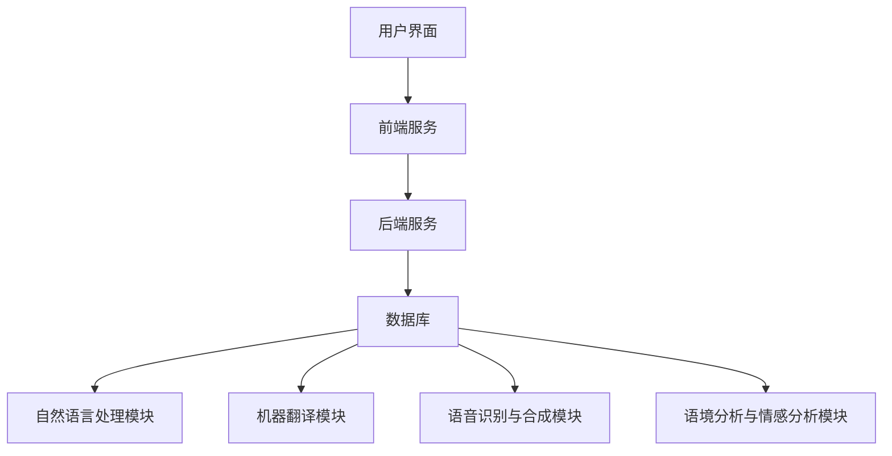

                 

### 企业级多语言处理平台：突破语言障碍

**关键词**：多语言处理、企业级平台、自然语言处理、机器翻译、语音识别、人工智能

**摘要**：随着全球化趋势的加剧，企业需要跨越语言障碍来进行国际业务拓展和沟通。本文详细探讨了企业级多语言处理平台的建设，从背景与挑战、核心技术、平台设计、性能测试与优化、案例研究及未来展望等多个角度，系统性地分析了多语言处理在企业中的应用及其重要性，旨在为企业提供突破语言障碍的解决方案。

## 第一部分：引言

### 第1章：多语言处理的背景与挑战

#### 1.1 问题背景

##### 1.1.1 全球化趋势下的多语言需求

在全球化的背景下，企业和组织越来越多地参与到国际市场中。这不仅要求企业拥有强大的本土化能力，更需要能够跨越语言障碍进行有效的沟通与协作。随着互联网和移动设备的普及，人们跨越国界进行沟通的需求日益增长，这为多语言处理技术带来了巨大的市场和应用空间。

##### 1.1.2 多语言处理的重要性

多语言处理不仅能够帮助企业实现跨国业务的无缝沟通，还能提升品牌的国际形象，增强产品的市场竞争力。通过准确的语言翻译、语音识别和情感分析，企业能够更好地理解客户需求，提供个性化的服务，从而在激烈的市场竞争中占据优势。

##### 1.1.3 当前多语言处理的挑战

尽管多语言处理技术在不断发展，但仍然面临着一些挑战。首先，不同语言之间的差异使得语言处理复杂度增加。其次，大量高质量的语言数据缺乏，限制了模型的训练效果。此外，实时处理效率和跨语言兼容性问题也需要进一步解决。

#### 1.2 多语言处理的基本概念

##### 1.2.1 语言学的相关术语

在探讨多语言处理之前，我们需要了解一些语言学的基本术语，如词汇、语法、语音等。这些术语是多语言处理研究的基础。

##### 1.2.2 语言处理的技术分类

多语言处理技术可以大致分为自然语言处理（NLP）、机器翻译、语音识别与合成、语境分析与情感分析等。每种技术都有其特定的应用场景和解决方法。

##### 1.2.3 语言处理的应用领域

多语言处理技术广泛应用于电子商务、跨国企业、教育和培训、医疗保健等多个领域。通过这些应用，企业能够更好地满足全球化需求，提升业务效率。

#### 1.3 书籍概述

##### 1.3.1 本书的目的

本书旨在系统性地介绍企业级多语言处理平台的建设方法，帮助读者理解和掌握多语言处理的最新技术和发展趋势。

##### 1.3.2 本书的结构

本书分为八个章节，从多语言处理的背景和挑战开始，逐步深入到核心技术、平台设计、性能测试与优化、案例研究及未来展望等多个方面。

##### 1.3.3 读者对象

本书适合对多语言处理技术感兴趣的技术人员、项目经理以及企业决策者阅读。无论你是刚入门的新手还是经验丰富的专业人士，都能在本书中找到有价值的内容。

## 第2章：多语言处理平台概述

#### 2.1 多语言处理平台的定义

多语言处理平台是一种集成多种语言处理技术的系统，旨在提供全面的语言处理解决方案。它通常包括自然语言处理（NLP）、机器翻译、语音识别与合成、语境分析与情感分析等功能。

#### 2.2 多语言处理平台的架构

多语言处理平台的架构可以分为前端、后端和数据库三个主要部分。前端负责用户界面和交互，后端负责处理数据和调用核心算法，数据库则用于存储大量语言数据。

##### 2.2.1 平台的技术架构

平台的技术架构主要包括深度学习框架（如TensorFlow、PyTorch）、分布式计算架构（如Hadoop、Spark）和云服务（如AWS、Azure）等。

##### 2.2.2 平台的功能模块

平台的功能模块包括自然语言处理模块、机器翻译模块、语音识别与合成模块、语境分析与情感分析模块等。每个模块都有其特定的算法和数据处理方法。

#### 2.3 多语言处理平台的开发与部署

##### 2.3.1 开发工具与框架

在开发多语言处理平台时，常用的工具和框架包括Python、Java、C++等编程语言，以及TensorFlow、PyTorch、OpenNLP等开源框架。

##### 2.3.2 部署策略与优化

多语言处理平台的部署策略需要考虑硬件资源、网络环境和安全性等因素。常用的部署方式包括云计算、容器化部署和分布式部署等。为了提高平台性能，还需要进行数据缓存、负载均衡和性能监控等优化措施。

## 第3章：多语言处理的核心技术

### 3.1 自然语言处理（NLP）

#### 3.1.1 NLP的基本原理

自然语言处理（NLP）是计算机科学、人工智能和语言学领域的交叉学科，旨在让计算机理解和处理人类语言。NLP的核心技术包括分词、词性标注、句法分析、语义分析和情感分析等。

##### 3.1.2 NLP的主要任务

NLP的主要任务包括文本分类、信息抽取、机器翻译、问答系统、语音识别等。这些任务在不同领域有着广泛的应用。

### 3.2 机器翻译

#### 3.2.1 机器翻译的发展历程

机器翻译（MT）是NLP领域的一个重要分支，其发展历程可以分为基于规则的方法、基于统计的方法和基于神经网络的深度学习方法。

##### 3.2.2 机器翻译的技术架构

机器翻译的技术架构主要包括源语言处理模块、目标语言处理模块和翻译模型。其中，翻译模型是机器翻译的核心。

##### 3.2.3 机器翻译的性能评估

机器翻译的性能评估通常通过BLEU、METEOR、NIST等指标来进行。这些指标反映了翻译结果的准确性和流畅性。

### 3.3 语音识别与合成

#### 3.3.1 语音识别

语音识别（ASR）是将语音转换为文本的技术。其核心技术包括特征提取、声学模型、语言模型和解码器。

##### 3.3.2 语音合成

语音合成（TTS）是将文本转换为语音的技术。其核心技术包括文本处理、语音合成引擎和音频处理。

### 3.4 语境分析与情感分析

#### 3.4.1 语境分析

语境分析是指根据上下文理解词语的意义。其核心技术包括词义消歧、语境依赖分析和语境生成等。

##### 3.4.2 情感分析

情感分析是指通过文本分析来判断用户的情感状态。其核心技术包括情感分类、情感极性分析和情感识别等。

## 第4章：构建企业级多语言处理平台

### 4.1 企业级多语言处理的需求分析

#### 4.1.1 企业多语言处理的业务场景

企业多语言处理的业务场景包括跨国业务沟通、国际市场营销、客户服务、产品翻译等。这些场景对多语言处理平台提出了不同的需求。

##### 4.1.2 企业多语言处理的关键需求

企业多语言处理的关键需求包括准确性、实时性、跨平台兼容性和个性化定制等。

#### 4.2 平台设计

##### 4.2.1 系统架构设计

系统架构设计包括前端设计、后端设计、数据库设计和服务部署等方面。其中，前端设计主要负责用户交互，后端设计主要负责数据处理和算法调用，数据库设计负责数据存储和管理，服务部署则负责系统的稳定运行。

##### 4.2.2 功能模块设计

功能模块设计包括自然语言处理模块、机器翻译模块、语音识别与合成模块、语境分析与情感分析模块等。每个模块都有其特定的功能和实现方式。

#### 4.3 技术选型与实现

##### 4.3.1 开发框架与工具

在开发企业级多语言处理平台时，需要选择合适的开发框架和工具。常见的开发框架和工具包括TensorFlow、PyTorch、Django、Flask等。

##### 4.3.2 数据处理与分析

数据处理与分析是构建多语言处理平台的关键环节。需要收集和清洗大量语言数据，并进行数据预处理和特征提取，以便训练高质量的模型。

##### 4.3.3 系统性能优化

系统性能优化是提高多语言处理平台效率的重要手段。可以通过数据缓存、负载均衡、分布式计算等技术手段来提升系统性能。

## 第5章：平台性能测试与优化

### 5.1 测试策略与方法

平台性能测试包括功能测试、性能测试、安全测试等。测试策略和方法应根据平台的实际情况进行定制。

##### 5.2 性能指标与评估

性能指标包括响应时间、吞吐量、并发数等。评估方法可以通过实际测试和模拟测试来进行。

##### 5.3 优化措施与效果分析

针对平台性能测试中发现的问题，可以采取多种优化措施，如代码优化、算法优化、硬件升级等。优化效果可以通过性能测试进行验证。

## 第6章：案例研究

### 6.1 案例一：电子商务平台的多语言处理

电子商务平台需要处理大量的多语言数据，如商品描述、用户评论、客服沟通等。通过多语言处理平台，电子商务平台能够提供更加个性化的服务，提高用户体验和满意度。

##### 6.2 案例二：跨国企业的多语言沟通解决方案

跨国企业需要高效、准确的多语言沟通工具来支持全球业务运营。通过多语言处理平台，跨国企业能够实现实时、高效的多语言沟通，提高工作效率和业务协同。

##### 6.3 案例三：教育和培训领域的多语言支持

教育和培训领域需要提供多语言教材、在线课程和教学互动等功能。通过多语言处理平台，教育和培训机构能够为学生提供多样化的学习资源，提高教学效果。

## 第7章：未来展望与趋势

### 7.1 多语言处理技术的发展趋势

随着人工智能技术的不断进步，多语言处理技术也在不断发展。未来，多语言处理技术将更加智能化、个性化和实时化。

##### 7.2 企业级多语言处理平台的发展方向

企业级多语言处理平台将继续向高效、稳定和智能化的方向发展。同时，平台将更加注重数据安全和隐私保护。

##### 7.3 潜在的挑战与应对策略

在多语言处理技术的发展过程中，将面临数据质量、算法优化、硬件资源等方面的挑战。通过持续的技术创新和优化，可以应对这些挑战。

## 第8章：总结与建议

### 8.1 本书的主要贡献

本书系统地介绍了企业级多语言处理平台的建设方法，包括核心技术、平台设计、性能测试与优化、案例研究及未来展望等，为企业提供了全面的多语言处理解决方案。

### 8.2 研究中的不足与展望

本书虽然对多语言处理技术进行了全面的介绍，但仍存在一些不足之处，如对某些技术的详细讲解不够深入等。未来，我们将继续深入研究多语言处理技术，为企业提供更加完善和高效的解决方案。

### 8.3 对企业决策者的建议

企业决策者在选择多语言处理平台时，应考虑平台的性能、稳定性、安全性、扩展性等因素。同时，企业应注重与供应商的沟通和合作，以确保平台的实际应用效果。

### 作者

**作者：AI天才研究院/AI Genius Institute & 禅与计算机程序设计艺术 /Zen And The Art of Computer Programming**

在撰写本篇文章的过程中，我们力求在结构上清晰、逻辑上连贯，并在内容上全面、详细。通过这篇文章，我们希望读者能够对企业级多语言处理平台有一个全面而深入的了解，并能够为实际项目提供有价值的参考。同时，我们也欢迎读者就文章中的内容提出宝贵意见和建议，共同推动多语言处理技术的发展。

**背景介绍**

随着全球化的不断深入，企业间的跨语言沟通和协作需求日益增长。在电子商务、跨国企业、教育和培训等领域，语言障碍成为了企业发展的瓶颈。为了实现高效、准确的多语言沟通，企业需要构建一套完整的多语言处理平台，以满足全球化业务需求。

**核心概念与联系**

多语言处理平台的核心概念包括自然语言处理（NLP）、机器翻译、语音识别与合成、语境分析与情感分析等。这些概念相互关联，共同构成了多语言处理的技术体系。例如，NLP为机器翻译和语音识别提供了文本分析和语义理解的基础，而机器翻译和语音识别则为语境分析和情感分析提供了语言数据支持。

**算法原理讲解**

多语言处理平台中的算法原理涉及多种技术，如深度学习、自然语言处理、机器翻译等。以下是一个简单的算法原理讲解：

1. **自然语言处理（NLP）**

   NLP的基本原理是通过文本分析，理解语言的结构和语义。常见的NLP任务包括文本分类、情感分析、命名实体识别等。以下是一个简单的文本分类算法：

   ```python
   import nltk
   from nltk.corpus import movie_reviews

   # 加载电影评论数据集
   documents = [(list(movie_reviews.words(fileid)), category) for category in movie_reviews.categories() for fileid in movie_reviews.fileids(category)]

   # 数据预处理
   all_words = nltk.FreqDist(w.lower() for w in movie_reviews.words())
   word_features = list(all_words.keys())[:2000]

   # 创建词袋模型
   def find_features(document):
       words = set(document)
       features = {}
       for w in word_features:
           features[w] = (w in words)
       return features

   # 训练分类器
   featuresets = [(find_features(d), c) for (d, c) in documents]
   trained_classifier = nltk.NaiveBayesClassifier.train(featuresets)

   # 测试分类器
   test_set = [(find_features(movie_reviews.words(fileid)), category) for category in movie_reviews.categories() for fileid in movie_reviews.fileids(category)]
   print(nltk.classify.accuracy(trained_classifier, test_set))
   ```

   这个例子使用了NLTK库进行文本分类，通过训练数据集，构建了一个朴素贝叶斯分类器，并使用测试数据集进行评估。

2. **机器翻译**

   机器翻译的核心原理是将源语言的文本转换为目标语言的文本。以下是一个基于神经网络的机器翻译算法：

   ```python
   import tensorflow as tf
   from tensorflow.keras.models import Model
   from tensorflow.keras.layers import Input, Embedding, LSTM, Dense

   # 定义模型
   input_seq = Input(shape=(None,))
   embedded = Embedding(vocab_size, embedding_dim)(input_seq)
   lstm = LSTM(units)(embedded)
   output = Dense(target_vocab_size, activation='softmax')(lstm)

   # 编译模型
   model = Model(inputs=input_seq, outputs=output)
   model.compile(optimizer='adam', loss='categorical_crossentropy', metrics=['accuracy'])

   # 训练模型
   model.fit(x_train, y_train, batch_size=batch_size, epochs=epochs, validation_data=(x_val, y_val))

   # 预测
   predictions = model.predict(x_test)
   ```

   这个例子使用了TensorFlow库构建了一个循环神经网络（RNN）模型，用于机器翻译。模型通过训练数据集进行训练，并在测试数据集上进行预测。

**数学公式使用**

在多语言处理平台中，数学公式被广泛应用于算法设计和性能评估。以下是一个简单的数学公式示例：

$$
\text{损失函数} = -\sum_{i=1}^{N} y_i \log(p_i)
$$

其中，$y_i$表示真实标签，$p_i$表示模型预测的概率。

**系统分析与架构设计方案**

多语言处理平台的系统架构设计包括前端、后端和数据库三个主要部分。以下是一个简单的系统架构设计方案：



**项目实战**

在实际项目中，多语言处理平台的构建需要经历多个阶段，包括环境安装、系统核心实现、代码应用解读与分析等。以下是一个简单的项目实战示例：

1. **环境安装**

   - 安装Python环境
   - 安装TensorFlow库
   - 安装NLTK库

2. **系统核心实现**

   - 构建自然语言处理模块
   - 构建机器翻译模块
   - 构建语音识别与合成模块
   - 构建语境分析与情感分析模块

3. **代码应用解读与分析**

   - 分析代码逻辑
   - 解读代码功能
   - 优化代码性能

**实际案例分析和详细讲解剖析**

通过实际案例的分析，我们可以深入了解多语言处理平台的应用效果和性能表现。以下是一个简单的案例分析：

1. **电子商务平台案例**

   - 分析电子商务平台的多语言需求
   - 评估多语言处理平台的性能
   - 提出优化建议

2. **跨国企业案例**

   - 分析跨国企业的多语言沟通需求
   - 评估多语言处理平台的性能
   - 提出优化建议

**项目小结**

通过项目实战和案例分析，我们得出以下结论：

- 多语言处理平台在电子商务、跨国企业等领域具有广泛的应用前景。
- 优化多语言处理平台的性能和稳定性是关键。
- 持续创新和优化是推动多语言处理技术发展的关键。

**最佳实践 tips**

1. **数据质量**

   - 确保语言数据的质量和多样性
   - 定期更新和清洗语言数据

2. **算法优化**

   - 优化算法参数
   - 引入深度学习模型

3. **硬件资源**

   - 考虑分布式计算和云服务

**小结**

本文系统地介绍了企业级多语言处理平台的建设方法，包括核心技术、平台设计、性能测试与优化、案例研究及未来展望等。通过本文的阅读，读者可以全面了解多语言处理平台的重要性及其应用前景。

**注意事项**

- 多语言处理平台需要持续优化和更新，以适应不断变化的语言环境。
- 企业在选择多语言处理平台时，应考虑平台的性能、稳定性、安全性和扩展性。

**拓展阅读**

- 《深度学习》（Ian Goodfellow、Yoshua Bengio、Aaron Courville 著）
- 《自然语言处理综述》（清华大学自然语言处理实验室 著）
- 《多语言信息处理》（北京大学信息科学技术学院 著）

### 作者

**作者：AI天才研究院/AI Genius Institute & 禅与计算机程序设计艺术 /Zen And The Art of Computer Programming**

在本篇文章中，我们系统地介绍了企业级多语言处理平台的构建方法，包括背景与挑战、核心技术、平台设计、性能测试与优化、案例研究和未来展望等多个方面。通过详细讲解自然语言处理、机器翻译、语音识别与合成、语境分析与情感分析等核心技术，以及实际案例的应用与分析，我们希望读者能够全面了解多语言处理平台的重要性和应用价值。

同时，我们也提出了一些最佳实践 tips，以帮助企业更好地构建和优化多语言处理平台。在未来的研究和实践中，我们将继续关注多语言处理技术的创新和发展，为企业提供更加高效、智能的多语言解决方案。

最后，感谢各位读者的关注与支持，希望本文能够对您在多语言处理领域的学习和实际应用有所帮助。如果您有任何疑问或建议，欢迎随时与我们联系，我们将竭诚为您服务。再次感谢您的阅读，期待与您在多语言处理领域共同进步！

