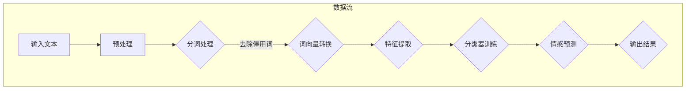

                 

### 1.1 问题背景与核心概念

#### 跨文化客户理解的重要性

在全球化进程加速的背景下，企业面对的客户群体日益多样化，不仅限于单一语言和文化背景。跨文化客户理解的重要性日益凸显。首先，全球化趋势下，企业不断扩大其国际业务，涉足更多的市场。这就意味着，企业需要与来自不同文化背景的客户进行有效沟通和互动。跨文化客户理解能够帮助企业更好地适应不同市场的需求和偏好，从而提高客户满意度。

其次，客户多样化带来了新的挑战和机遇。不同文化背景的客户在沟通方式、价值观念、消费习惯等方面存在差异。企业若能准确理解这些差异，不仅可以提供更加个性化的服务，还能在激烈的市场竞争中脱颖而出。例如，某些文化背景下的客户可能更注重产品的高品质和可靠性，而另一些文化背景下的客户可能更看重价格和服务体验。

#### 情感分析的应用场景

情感分析作为一种先进的数据分析技术，在多个应用场景中发挥了重要作用。首先，在市场研究方面，企业可以通过情感分析了解消费者对产品或服务的情感反应，从而进行市场细分和定位。通过分析社交媒体上的用户评论、论坛帖子和在线调查反馈，企业可以快速获取消费者的真实情感，为产品改进和市场营销策略提供有力支持。

在客户服务领域，情感分析可以帮助企业识别客户的情感状态，及时响应并解决客户问题。例如，客服中心可以利用情感分析技术自动识别客户来电的情感状态，将情绪激动的客户优先转接到高级客服，从而提高客户满意度。此外，情感分析还可以用于自动生成个性化的客户关怀短信和电子邮件，增强客户体验。

品牌管理是企业长期发展的关键，而情感分析在品牌管理中的应用同样不可忽视。通过分析社交媒体上的品牌提及，企业可以了解消费者对品牌的情感态度，及时发现品牌形象问题并进行干预。例如，当发现某个产品线在市场上引起负面情感时，企业可以迅速采取措施，如改进产品品质或调整营销策略，以挽回品牌形象。

#### 情感分析的定义

情感分析，又称意见挖掘或情感检测，是一种通过计算机技术和算法，对文本、语音、视频等数据中的情感信息进行识别和分析的方法。具体来说，情感分析旨在判断文本、语音或视频所表达的情感倾向，如正面、负面、中性等。

情感分析的基本任务可以分为三个层次：情感极性分类、情感强度评估和情感主题识别。情感极性分类是最基础的层次，主要判断文本的情感倾向；情感强度评估则进一步判断情感的强烈程度；情感主题识别则是更高级的任务，通过识别文本中的情感主题，如“喜悦”、“愤怒”、“悲伤”等，从而提供更深入的情感分析结果。

#### 情感分析的分类

根据分析对象的不同，情感分析可以分为文本情感分析、语音情感分析和视频情感分析。

文本情感分析是最常见的一种情感分析类型，主要应用于社交媒体、论坛评论、产品评价等文本数据。通过自然语言处理技术，文本情感分析可以自动识别文本中的情感极性和情感强度。

语音情感分析则是通过处理语音信号，识别语音中的情感信息。这种方法在客户服务、语音助手、心理辅导等领域有广泛应用。语音情感分析需要结合语音识别和声学模型，对语音中的音调、音量、语速等特征进行分析，从而判断情感状态。

视频情感分析则是对视频中的情感信息进行识别和分析。这种方法在影视制作、媒体内容审核、情感计算等领域有广泛应用。视频情感分析通常结合图像识别和情感识别技术，对视频中的面部表情、语音、文本等信息进行分析，从而判断情感状态。

#### 情感分析的技术基础

情感分析技术的实现离不开以下几个基础技术：

**自然语言处理（NLP）**：自然语言处理是情感分析的核心技术，它涉及文本的分词、词性标注、句法分析等。通过NLP技术，可以提取文本中的关键信息，为情感分析提供数据基础。

**机器学习与深度学习**：机器学习与深度学习是情感分析的重要工具，它们通过大量数据训练模型，自动识别和分类情感信息。常见的机器学习方法包括朴素贝叶斯、支持向量机等；深度学习方法如卷积神经网络（CNN）、循环神经网络（RNN）和长短时记忆网络（LSTM）等，在情感分析领域有广泛应用。

**情感词典与情感规则**：情感词典和情感规则是情感分析的重要辅助工具。情感词典包含大量具有情感倾向的词汇，通过对比文本中的词汇与情感词典的匹配度，可以初步判断文本的情感倾向。情感规则则是基于特定情境下的情感表达模式，通过逻辑推理判断文本的情感。

### 1.2 多语言情感分析的核心概念与挑战

#### 多语言情感分析的定义与目标

**定义**：多语言情感分析是指对多种语言文本进行情感识别和分析的技术。它旨在理解不同语言背景下用户的情感表达，从而提供跨语言的情感分析和理解能力。

**目标**：多语言情感分析的主要目标包括：

1. **语言识别与分类**：准确识别文本的语言类型，为后续的情感分析提供基础。
2. **情感极性判断**：判断文本的情感极性，如正面、负面、中性。
3. **情感强度评估**：评估文本情感的程度，如情感的强烈或温和。
4. **情感主题识别**：识别文本中的情感主题，如喜悦、愤怒、悲伤等。

#### 多语言情感分析的挑战

**语言多样性与复杂性**：多语言情感分析面临的最大挑战之一是语言的多样性和复杂性。不同语言在词汇、语法结构和表达习惯上存在显著差异，这增加了情感分析的难度。例如，某些语言可能没有直接的情感词汇，而需要通过语法结构和上下文推断情感。

**词汇差异**：不同语言之间词汇的差异也是一大挑战。相同含义的词汇在不同语言中可能表达方式不同，这会导致情感分析的误判。例如，英语中的“happy”和中文中的“开心”在情感表达上具有相似性，但具体语境下可能有所不同。

**语法结构**：不同语言的语法结构也存在显著差异。一些语言如汉语是主谓宾语序，而英语是主语-谓语-宾语结构。这种语法差异会影响情感分析的准确性和效率。

**方言与地区差异**：不同地区的方言和地区差异也会对情感分析产生干扰。例如，同一词汇在不同方言中的情感倾向可能不同，这需要额外的处理和调整。

**情感表达方式的文化差异**：不同文化背景下的情感表达方式存在显著差异。某些文化可能更倾向于直接表达情感，而另一些文化则更倾向于含蓄和间接表达。这种文化差异需要深入理解，以便准确分析情感。

#### 技术基础与解决方案

**多语言词向量表示**：多语言词向量表示是解决语言多样性的关键技术。通过将不同语言的词汇映射到高维向量空间，可以实现跨语言情感分析。常见的方法包括词嵌入技术（Word Embedding）和跨语言信息检索技术（Cross-Lingual Information Retrieval）。

**词嵌入技术**：词嵌入技术通过将词汇映射到高维向量空间，使得具有相似含义的词汇在向量空间中靠近。在多语言情感分析中，词嵌入技术可以帮助减少词汇差异，提高情感分析的准确性。

**跨语言信息检索技术**：跨语言信息检索技术通过在多个语言之间建立索引和检索机制，实现跨语言的情感信息检索。这种技术有助于处理不同语言之间的词汇差异，提高多语言情感分析的效果。

**多语言情感分析模型**：多语言情感分析模型是解决语言多样性和复杂性问题的关键。常见的多语言情感分析模型包括基于转移模型（如转移情感分析模型）和基于端到端模型（如卷积神经网络（CNN）和循环神经网络（RNN））。此外，还可以通过多语言融合模型（如多语言融合神经网络）整合多种语言的信息，提高情感分析的效果。

**基于转移模型的情感分析**：转移情感分析模型通过在多个语言之间进行转移，实现跨语言的情感分析。例如，在处理中文文本时，可以参考已有的英文情感分析模型的结果，进行相应的调整和转换。

**基于端到端的情感分析模型**：基于端到端的情感分析模型直接处理多语言文本，无需进行语言之间的转换。常见的端到端模型包括卷积神经网络（CNN）和循环神经网络（RNN）。这些模型通过直接处理文本数据，实现了更高效和准确的多语言情感分析。

**多语言融合模型**：多语言融合模型通过融合多种语言的信息，实现更准确和全面的多语言情感分析。例如，可以使用多语言融合神经网络，将不同语言的词向量、句向量等信息融合到一起，进行情感分析。

总之，多语言情感分析是一个复杂且具有挑战性的领域。通过词嵌入技术、跨语言信息检索技术、多语言情感分析模型等多种技术的结合，可以有效地应对语言多样性和复杂性，实现准确和高效的多语言情感分析。然而，这仍然需要不断的研究和探索，以满足不断变化的多语言情感分析需求。### 2.2 多语言情感分析的挑战

#### 语言多样性与复杂性

多语言情感分析面临的首要挑战是语言的多样性和复杂性。不同语言在词汇、语法和表达方式上存在显著差异，这直接影响情感分析的准确性和效率。首先，词汇差异是一个重要的问题。相同含义的词汇在不同语言中可能表达方式不同，这会导致情感分析的误判。例如，英语中的“happy”和中文中的“开心”在情感表达上具有相似性，但具体语境下可能有所不同。此外，一些语言可能没有直接的情感词汇，而需要通过语法结构和上下文推断情感。

其次，语法结构的不同也会对情感分析产生影响。一些语言如汉语是主谓宾语序，而英语是主语-谓语-宾语结构。这种语法差异会影响情感分析的准确性和效率。例如，在汉语中，“我非常开心”和“开心得我”在情感表达上有所不同，但在英文中，“I am very happy”和“happy I am”在语法上存在差异。这要求情感分析模型能够适应不同语言的语法规则，以提高分析结果的准确性。

此外，方言和地区差异也是语言多样性的一部分。同一词汇在不同方言或地区的情感倾向可能不同。例如，某些方言中的词汇在情感表达上更为直接，而另一些方言则更为含蓄。这种差异需要额外的处理和调整，以便准确分析情感。

#### 情感表达方式的文化差异

情感表达方式的文化差异是多语言情感分析面临的另一大挑战。不同文化背景下的情感表达方式存在显著差异，这需要在情感分析模型中予以考虑。首先，不同文化对情感表达的直接性和间接性有不同的偏好。一些文化可能更倾向于直接表达情感，如英语文化中的“我爱你”和“我很生气”；而另一些文化则更倾向于间接表达情感，如中文文化中的“你最近看起来很开心”和“你的笑容让我感到温暖”。

其次，情感表达的语境依赖性也是一个重要因素。情感表达常常受到语境的影响，不同语境下的情感表达方式可能完全不同。例如，在工作场合中，表达情感可能更为谨慎和含蓄，而在私人场合中则可能更为直接和热烈。这种语境依赖性要求情感分析模型能够适应不同的语境，以提供准确的分析结果。

此外，不同文化背景下的情感表达还受到社会规范和价值观的影响。在某些文化中，表达负面情感可能被视为不礼貌或不合适，而在其他文化中则被视为正常情感表达。这种差异需要在情感分析模型中予以考虑，以便准确识别和分析情感。

#### 技术解决方案

面对上述挑战，多语言情感分析需要采用多种技术解决方案，以提高分析结果的准确性和效率。

**词汇映射**：词汇映射是将不同语言的词汇映射到共同的情感语义空间，以减少词汇差异。常见的方法包括基于词典的映射和基于机器学习的映射。基于词典的映射通过构建情感词典，将不同语言的情感词汇映射到共同的情感维度。基于机器学习的映射则通过训练模型，将不同语言的词向量映射到共同的空间。

**跨语言信息检索**：跨语言信息检索技术通过在多个语言之间建立索引和检索机制，实现跨语言的情感信息检索。这种方法有助于处理不同语言之间的词汇差异，提高多语言情感分析的效果。常见的跨语言信息检索技术包括基于翻译模型的检索和基于多语言文本嵌入的检索。

**情感规则库**：情感规则库是一种基于规则的方法，用于处理不同语言和文化的情感表达差异。通过构建包含多种语言和文化的情感规则库，可以识别和处理不同语境下的情感表达。例如，可以通过规则库识别某些语言中的间接表达方式，或根据文化背景调整情感分析的结果。

**多语言情感分析模型**：多语言情感分析模型是解决语言多样性和复杂性问题的关键。常见的多语言情感分析模型包括基于转移模型和基于端到端的模型。基于转移模型的情感分析通过在多个语言之间进行转移，实现跨语言的情感分析。基于端到端的情感分析模型则直接处理多语言文本，无需进行语言之间的转换。

**情感融合策略**：情感融合策略是将多种语言的情感信息进行融合，以提高情感分析的准确性。常见的方法包括将不同语言的词向量、句向量进行融合，或通过多语言融合神经网络进行情感融合。这种方法可以充分利用多种语言的信息，提高情感分析的全面性和准确性。

**数据增强**：数据增强是一种提高模型性能的方法，通过引入更多的多样化和高质量的训练数据，增强模型对语言多样性和文化差异的适应能力。常见的数据增强方法包括翻译增强、同义词增强和错误注入等。

总之，多语言情感分析面临诸多挑战，但通过采用多种技术解决方案，可以有效地应对这些挑战。未来，随着技术的不断发展和优化，多语言情感分析将变得更加准确和高效，为企业和个人提供更丰富的情感分析服务。### 2.3 技术基础与解决方案

#### 多语言词向量表示

多语言词向量表示是解决多语言情感分析问题的关键。词向量表示技术通过将词汇映射到高维向量空间，使得具有相似含义的词汇在向量空间中靠近，从而实现跨语言的情感分析。常见的方法包括词嵌入技术和跨语言信息检索技术。

**词嵌入技术**：词嵌入技术通过将不同语言的词汇映射到共同的高维向量空间，实现词汇的向量化表示。这种技术通过大量语料库训练模型，自动学习词汇的语义关系。例如，Word2Vec、GloVe等模型都是常见的词嵌入方法。词嵌入技术可以减少词汇差异，提高情感分析的准确性。

**跨语言信息检索技术**：跨语言信息检索技术通过在多个语言之间建立索引和检索机制，实现跨语言的情感信息检索。这种方法通过将不同语言的文本转换为共同的情感语义空间，从而实现跨语言的情感分析。常见的方法包括基于翻译模型的检索和基于多语言文本嵌入的检索。

#### 多语言情感分析模型

多语言情感分析模型是解决多语言情感分析的核心。这些模型通过直接处理多语言文本，无需进行语言之间的转换，从而实现跨语言的情感分析。以下介绍几种常见的多语言情感分析模型。

**基于转移模型的情感分析**：转移情感分析模型通过在多个语言之间进行转移，实现跨语言的情感分析。这种模型通常结合翻译模型和情感分析模型，将不同语言的文本转换为共同的情感语义空间。例如，可以使用基于转移的情感分析模型（如Transfer-Based Sentiment Analysis Model）进行情感分析。

**基于端到端的情感分析模型**：基于端到端的情感分析模型直接处理多语言文本，无需进行语言之间的转换。这种模型通过卷积神经网络（CNN）、循环神经网络（RNN）等深度学习模型，直接从多语言文本中提取情感信息。例如，可以使用基于端到端的情感分析模型（如End-to-End Sentiment Analysis Model）进行情感分析。

**多语言融合模型**：多语言融合模型通过融合多种语言的情感信息，提高情感分析的准确性和全面性。这种模型将不同语言的词向量、句向量等信息进行融合，从而实现更准确的多语言情感分析。例如，可以使用多语言融合神经网络（如Multilingual Fusion Neural Network）进行情感分析。

#### 技术优缺点分析

**词嵌入技术**：

**优点**：
1. 简单高效：词嵌入技术通过大量语料库训练，自动学习词汇的语义关系，无需手动构建词典。
2. 减少词汇差异：通过将不同语言的词汇映射到共同的高维向量空间，减少词汇差异，提高情感分析的准确性。

**缺点**：
1. 对语言多样性敏感：某些语言可能在词向量空间中分布较广，影响情感分析的准确性。
2. 对低资源语言支持不足：对于低资源语言，可能缺乏足够的训练数据，影响词嵌入质量。

**跨语言信息检索技术**：

**优点**：
1. 跨语言情感分析：通过在多个语言之间建立索引和检索机制，实现跨语言的情感分析。
2. 支持低资源语言：跨语言信息检索技术可以通过翻译模型，将低资源语言的文本转换为高资源语言的文本，从而提高情感分析的准确性。

**缺点**：
1. 对翻译质量依赖性强：翻译质量直接影响情感分析的结果，存在翻译错误或偏差时，会影响情感分析的准确性。
2. 计算复杂度高：跨语言信息检索技术涉及多个语言的文本处理和索引，计算复杂度较高。

**基于转移模型的情感分析**：

**优点**：
1. 跨语言情感分析：通过在多个语言之间进行转移，实现跨语言的情感分析。
2. 简单易实现：基于转移模型的情感分析相对简单，易于实现和应用。

**缺点**：
1. 对翻译质量依赖性强：基于转移模型的情感分析依赖于翻译模型，翻译质量直接影响分析结果。
2. 情感一致性较差：不同语言之间的情感一致性较差，影响分析结果的准确性。

**基于端到端的情感分析模型**：

**优点**：
1. 直接处理多语言文本：基于端到端的情感分析模型直接处理多语言文本，无需进行语言之间的转换。
2. 准确性较高：通过深度学习模型，从多语言文本中提取情感信息，准确性较高。

**缺点**：
1. 计算复杂度高：基于端到端的情感分析模型涉及多个深度学习模型的训练，计算复杂度较高。
2. 需要大量数据：基于端到端的情感分析模型需要大量训练数据，对于低资源语言可能难以实现。

**多语言融合模型**：

**优点**：
1. 融合多种语言信息：多语言融合模型将不同语言的词向量、句向量等信息进行融合，提高情感分析的准确性和全面性。
2. 准确性较高：通过多语言融合模型，可以从多种语言信息中提取情感信息，提高分析结果的准确性。

**缺点**：
1. 需要大量计算资源：多语言融合模型涉及多种语言信息的融合和处理，需要大量计算资源。
2. 数据预处理复杂：多语言融合模型需要处理多种语言的文本数据，数据预处理过程相对复杂。

总之，多语言情感分析技术各有优缺点，需要根据具体应用场景和需求进行选择。未来，随着技术的不断发展和优化，多语言情感分析将变得更加准确和高效，为企业和个人提供更丰富的情感分析服务。### 3.1 情感分析算法概述

情感分析算法是进行情感识别和分类的核心工具，它们通常根据不同的应用场景和数据类型进行选择。以下是几种常见的情感分析算法及其选择依据。

#### 文本情感分析算法

文本情感分析算法主要应用于处理文本数据，如社交媒体评论、产品评价、新闻报道等。以下是一些常用的文本情感分析算法：

**1. 基于特征模型的情感分析**：

**算法原理**：基于特征模型的情感分析通过提取文本中的特征，如词频、词位置、语法结构等，构建特征向量，然后使用机器学习算法进行情感分类。

**优点**：简单易实现，适用于大规模数据处理。

**缺点**：对语言多样性和复杂性的适应性较差，容易受到噪声数据的影响。

**适用场景**：适用于处理结构化文本数据，如社交媒体评论和产品评价。

**2. 基于深度学习的情感分析**：

**算法原理**：基于深度学习的情感分析使用卷积神经网络（CNN）、循环神经网络（RNN）、长短时记忆网络（LSTM）等深度学习模型，从文本数据中自动提取特征，并进行情感分类。

**优点**：能够自动提取复杂的文本特征，提高情感分析的准确性。

**缺点**：训练过程较为复杂，需要大量的训练数据和计算资源。

**适用场景**：适用于处理非结构化文本数据，如新闻报道和社交媒体评论。

**3. 基于转移模型的情感分析**：

**算法原理**：基于转移模型的情感分析通过在多个语言之间进行转移，实现跨语言的情感分析。例如，可以使用基于转移的情感分析模型（如Transfer-Based Sentiment Analysis Model）进行情感分类。

**优点**：能够处理跨语言的情感分析，适用于国际化的应用场景。

**缺点**：对翻译质量依赖性强，翻译错误会影响分析结果。

**适用场景**：适用于需要跨语言情感分析的场景，如多语言社交媒体评论和新闻报道。

#### 语音情感分析算法

语音情感分析算法主要应用于处理语音数据，如语音通话、语音助手、语音识别等。以下是一些常用的语音情感分析算法：

**1. 基于声学特征的语音情感分析**：

**算法原理**：基于声学特征的语音情感分析通过提取语音信号中的声学特征，如音调、音量、语速等，进行情感分类。

**优点**：简单易实现，适用于实时语音情感分析。

**缺点**：对情感表达的捕捉能力有限，容易受到噪声干扰。

**适用场景**：适用于需要实时情感分析的语音应用场景，如语音助手和实时语音客服。

**2. 基于深度学习的语音情感分析**：

**算法原理**：基于深度学习的语音情感分析使用卷积神经网络（CNN）、循环神经网络（RNN）等深度学习模型，从语音数据中自动提取特征，并进行情感分类。

**优点**：能够自动提取复杂的语音特征，提高情感分析的准确性。

**缺点**：训练过程较为复杂，需要大量的训练数据和计算资源。

**适用场景**：适用于需要高准确性的语音情感分析场景，如语音助手和语音识别系统。

**3. 基于情感词典的语音情感分析**：

**算法原理**：基于情感词典的语音情感分析通过构建情感词典，将语音信号中的词汇与情感词典进行匹配，进行情感分类。

**优点**：简单易实现，适用于简单的语音情感分析任务。

**缺点**：对复杂情感表达的捕捉能力有限，容易受到噪声数据的影响。

**适用场景**：适用于简单的语音情感分析任务，如语音助手和语音客服系统。

#### 视频情感分析算法

视频情感分析算法主要应用于处理视频数据，如面部表情识别、语音情感识别、场景情感分析等。以下是一些常用的视频情感分析算法：

**1. 基于面部表情的视觉情感分析**：

**算法原理**：基于面部表情的视觉情感分析通过识别视频中的面部表情，判断情感状态。

**优点**：能够直观地捕捉情感，适用于需要实时情感分析的场景。

**缺点**：对表情识别的准确率要求较高，容易受到光照、姿态等因素的影响。

**适用场景**：适用于需要实时情感分析的场景，如面部识别系统和虚拟现实应用。

**2. 基于语音的听觉情感分析**：

**算法原理**：基于语音的听觉情感分析通过识别语音信号中的情感特征，判断情感状态。

**优点**：能够结合视觉和听觉信息，提高情感分析的准确性。

**缺点**：对语音识别的准确率要求较高，容易受到噪声干扰。

**适用场景**：适用于需要结合视觉和听觉信息进行情感分析的场景，如视频通话和智能电视。

**3. 基于场景分析的视觉情感分析**：

**算法原理**：基于场景分析的视觉情感分析通过识别视频中的场景和物体，判断情感状态。

**优点**：能够提供更广泛的情感信息，适用于需要全面情感分析的场景。

**缺点**：对视频数据的处理复杂度较高，需要大量计算资源。

**适用场景**：适用于需要全面情感分析的场景，如视频监控和智能城市应用。

#### 选择依据

在选择情感分析算法时，需要考虑以下因素：

**1. 数据类型**：根据不同的数据类型（文本、语音、视频等），选择适合的算法。

**2. 分析精度**：根据对情感分析精度的要求，选择相应的算法。

**3. 实时性**：根据对实时情感分析的需求，选择适合的算法。

**4. 计算资源**：根据可用的计算资源，选择适合的算法。

**5. 数据规模**：根据数据规模的大小，选择适合的算法。

通过综合考虑这些因素，可以选择最适合特定应用场景的情感分析算法，从而提高情感分析的准确性和效率。### 3.2 算法原理与数学模型

#### 文本情感分析的数学模型

文本情感分析的核心在于如何从文本中提取情感信息，并对这些信息进行量化处理。以下是几种常见的文本情感分析算法及其数学模型。

**基于特征模型的情感分析**

1. 特征提取：

首先，从文本中提取特征，如词频、词位置、语法结构等。假设文本为 `X`，提取的特征为 `f_1, f_2, ..., f_n`。

2. 特征向量表示：

将提取的特征转换为向量表示。例如，可以使用词袋模型（Bag of Words, BoW）或词嵌入（Word Embedding）技术。

3. 情感分类：

使用机器学习算法（如朴素贝叶斯、支持向量机等）对特征向量进行分类。假设分类结果为 `y`，则可以使用以下公式表示：

$$
P(y|X) = \frac{e^{\theta^T \phi(X)}}{\sum_{i=1}^{C} e^{\theta^T \phi(x_i)}}
$$

其中，`θ` 为分类器参数，`φ(X)` 为特征向量，`C` 为类别数。

**基于深度学习的情感分析**

1. 神经网络架构：

使用卷积神经网络（CNN）、循环神经网络（RNN）等深度学习模型，从文本中自动提取特征并进行情感分类。例如，使用 CNN 模型，可以表示为：

$$
h_l = \text{ReLU}(\text{CNN}(h_{l-1}))
$$

其中，`h_l` 为第 l 层的神经网络输出，`ReLU` 为ReLU激活函数。

2. 情感分类：

使用 Softmax 函数对神经网络输出进行分类。例如，可以使用以下公式表示：

$$
P(y=k|X) = \frac{e^{z_k}}{\sum_{j=1}^{C} e^{z_j}}
$$

其中，`z_k` 为神经网络输出，`k` 为类别索引。

#### 情感分析的数学公式与解释

1. 情感得分计算公式：

对于基于特征模型的情感分析，可以使用以下公式计算文本的情感得分：

$$
S = \sum_{i=1}^{n} w_i \cdot f_i
$$

其中，`w_i` 为特征权重，`f_i` 为特征值。

对于基于深度学习的情感分析，可以使用以下公式计算文本的情感得分：

$$
S = \text{ReLU}(\theta^T h)
$$

其中，`θ` 为神经网络参数，`h` 为神经网络输出。

2. 情感强度评估模型：

情感强度评估模型用于评估文本情感的强度。例如，可以使用以下公式表示：

$$
I = \frac{S - S_{\text{min}}}{S_{\text{max}} - S_{\text{min}}}
$$

其中，`I` 为情感强度值，`S` 为情感得分，`S_{\text{min}}` 和 `S_{\text{max}}` 分别为最小情感得分和最大情感得分。

#### 举例说明

假设我们有以下两个句子：

- **句子1**：“我很开心今天完成了项目。”
- **句子2**：“我今天工作非常累。”

使用基于特征模型的情感分析，我们可以提取以下特征：

| 特征        | 特征值 |
| ----------- | ------ |
| “开心”      | 1      |
| “完成”      | 0.5    |
| “项目”      | 0.5    |
| “工作”      | 0      |
| “非常”      | -0.5   |
| “累”        | -1     |

假设特征权重为 `[0.3, 0.2, 0.2, 0.2, 0.1, 0.1]`，则句子1的情感得分为：

$$
S_1 = 0.3 \cdot 1 + 0.2 \cdot 0.5 + 0.2 \cdot 0.5 - 0.1 \cdot 0.5 - 0.1 \cdot 1 = 0.35
$$

句子2的情感得分为：

$$
S_2 = 0.3 \cdot 0 - 0.2 \cdot 1 - 0.1 \cdot 0.5 - 0.1 \cdot (-1) = -0.35
$$

使用基于深度学习的情感分析，我们可以使用一个简单的神经网络模型来计算情感得分。假设神经网络输出为 `[0.4, -0.6]`，则句子1的情感得分为 `0.4`，句子2的情感得分为 `-0.6`。

通过以上计算，我们可以看到基于特征模型和基于深度学习的情感分析如何通过数学模型来对文本进行情感分析，从而得出情感得分和情感强度。这些数学模型和公式为情感分析提供了理论基础，使得我们能够更准确地对文本中的情感进行量化处理和分类。### 3.3 情感分析算法的 Mermaid 流程图

在情感分析中，算法流程图有助于理解数据从输入到输出的处理过程。下面将使用 Mermaid 语言绘制一个情感分析算法的流程图，以便更直观地展示其工作流程。

**详细解释：**

1. **输入文本**：流程开始于输入文本数据，这些数据可以是文本评论、论坛帖子、社交媒体信息等。

2. **预处理**：输入的文本需要进行预处理，包括去除标点符号、转换为小写等。

3. **分词处理**：预处理后的文本会被分割成单词或短语，以便进行后续分析。

4. **去除停用词**：分词后的文本会去除常见的无意义词汇，如“的”、“和”、“是”等。

5. **词向量转换**：去除停用词后的文本会被转换为词向量，这可以通过词嵌入技术实现，如 Word2Vec 或 GloVe。

6. **特征提取**：词向量会被进一步处理，提取出有助于情感分析的特征。

7. **分类器训练**：使用训练数据，构建和训练情感分类模型，如朴素贝叶斯、支持向量机或深度学习模型。

8. **情感预测**：将处理后的文本输入到训练好的分类器中，预测文本的情感极性。

9. **输出结果**：最终的情感预测结果会被输出，可以是情感标签或情感得分。

通过上述 Mermaid 流程图，我们可以清晰地看到文本情感分析算法的各个步骤及其数据流。这个过程不仅帮助我们理解算法的运行机制，也为实际应用提供了指导。### 4.1 多语言情感分析模型

多语言情感分析模型的核心在于如何处理多种语言的文本数据，并进行有效的情感分析。为了实现这一目标，多语言情感分析模型需要具备以下几个关键组成部分。

#### 多语言情感分析模型的架构

**1. 基于转移模型的架构**：

基于转移模型的架构通过在多个语言之间进行情感转移来实现多语言情感分析。这种模型通常结合翻译模型和情感分析模型，通过以下步骤进行情感分析：

- **文本预处理**：对输入的文本进行预处理，包括分词、去除停用词、标点符号等。
- **翻译模型**：将预处理后的文本转换为另一种语言，以便使用已有的情感分析模型。常见的翻译模型包括神经机器翻译模型（如Transformer）。
- **情感分析模型**：对翻译后的文本使用情感分析模型进行情感分类，如支持向量机、朴素贝叶斯或深度学习模型。

**2. 基于端到端的架构**：

基于端到端的架构直接处理多语言文本，无需进行语言之间的转换。这种模型通过深度学习模型，如卷积神经网络（CNN）或循环神经网络（RNN），从原始的多语言文本中提取情感信息。常见的端到端模型包括：

- **编码器-解码器模型**：编码器将多语言文本编码为固定长度的向量，解码器根据这些向量进行情感分类。
- **多任务学习模型**：多任务学习模型同时处理多个语言的情感分析任务，通过共享模型参数提高模型性能。

**3. 多语言融合模型**：

多语言融合模型通过融合多种语言的情感信息，提高情感分析的准确性和全面性。这种模型通常包括以下步骤：

- **词向量融合**：将不同语言的词向量进行融合，形成统一的多语言词向量表示。
- **句向量融合**：将不同语言的句向量进行融合，形成统一的多语言句向量表示。
- **情感分类**：使用融合后的多语言向量进行情感分类。

#### 多语言融合策略

**1. 词汇映射**：

词汇映射是将不同语言的词汇映射到共同的情感语义空间，以减少词汇差异。常见的方法包括：

- **基于词典的映射**：通过构建情感词典，将不同语言的情感词汇映射到共同的情感维度。
- **基于机器学习的映射**：通过训练模型，将不同语言的词向量映射到共同的空间。

**2. 跨语言信息检索**：

跨语言信息检索是通过在多个语言之间建立索引和检索机制，实现跨语言的情感信息检索。常见的方法包括：

- **基于翻译模型的检索**：通过翻译模型，将不同语言的文本转换为共同的情感语义空间。
- **基于多语言文本嵌入的检索**：通过训练多语言文本嵌入模型，将不同语言的文本转换为共同的空间。

**3. 情感规则库**：

情感规则库是一种基于规则的方法，用于处理不同语言和文化的情感表达差异。通过构建包含多种语言和文化的情感规则库，可以识别和处理不同语境下的情感表达。例如，可以使用规则库识别某些语言中的间接表达方式，或根据文化背景调整情感分析的结果。

**4. 多语言融合神经网络**：

多语言融合神经网络通过融合多种语言的情感信息，提高情感分析的准确性和全面性。这种模型通常包括：

- **编码器**：将不同语言的文本编码为固定长度的向量。
- **融合模块**：将编码后的向量进行融合，形成统一的多语言向量表示。
- **分类器**：使用融合后的多语言向量进行情感分类。

通过上述多语言融合策略，多语言情感分析模型能够有效地整合多种语言的信息，实现准确和高效的多语言情感分析。然而，这仍然需要不断的研究和优化，以满足不断变化的多语言情感分析需求。### 4.2 实现细节与性能优化

#### 模型训练与优化

在多语言情感分析模型的实现过程中，模型训练和优化是关键步骤。以下是详细的训练策略和技巧：

**1. 数据预处理**：

数据预处理是模型训练的基础。首先，我们需要对数据进行清洗，去除无效字符、标点符号和停用词。然后，对文本进行分词处理，将文本分解为单词或短语。对于多语言数据，我们需要使用适当的语言模型进行分词，以确保文本的准确性。

**2. 数据增强**：

数据增强是提高模型泛化能力的重要手段。常见的数据增强方法包括：

- **同义词替换**：将文本中的某些单词替换为同义词，增加数据的多样性。
- **错误注入**：在文本中引入拼写错误或语法错误，模拟实际场景中的数据。
- **翻译增强**：将文本翻译成不同的语言，再翻译回原始语言，以增加数据的多样性。

**3. 训练策略**：

在模型训练过程中，选择合适的训练策略可以提高模型的性能。以下是几种常用的训练策略：

- **逐步增加训练数据量**：逐步增加训练数据量，以适应模型的不同阶段。
- **批次训练**：将数据分成批次进行训练，以避免过拟合。
- **交叉验证**：使用交叉验证技术，在训练集和验证集之间进行多次训练，以评估模型的泛化能力。

**4. 优化技巧**：

在模型训练过程中，采用以下优化技巧可以提高模型的性能：

- **学习率调整**：使用适当的学习率调整策略，以避免模型陷入局部最优。
- **正则化**：使用正则化技术，如权重衰减（Weight Decay）和dropout，减少过拟合。
- **注意力机制**：在神经网络中引入注意力机制，以提高模型对重要信息的关注。

**5. 性能评估与优化**：

在模型训练完成后，我们需要对模型进行性能评估，以确定其是否满足预期。以下是几种常见的评估指标和优化方法：

- **准确率（Accuracy）**：准确率是模型预测正确的样本数占总样本数的比例。对于二分类任务，准确率是评估模型性能的重要指标。
- **精确率（Precision）和召回率（Recall）**：精确率和召回率分别表示预测为正例的样本中实际为正例的比例和实际为正例的样本中被预测为正例的比例。这两个指标常用于评估二分类模型的性能。
- **F1 分数（F1 Score）**：F1 分数是精确率和召回率的调和平均值，综合考虑了模型的准确性和泛化能力。
- **混淆矩阵（Confusion Matrix）**：混淆矩阵用于展示模型预测结果与实际结果之间的对比，帮助分析模型的性能。

**优化方法**：

- **超参数调整**：通过调整模型超参数，如学习率、批量大小、隐藏层单元数等，以优化模型性能。
- **模型调优**：使用不同的模型结构，如卷积神经网络（CNN）、循环神经网络（RNN）或长短时记忆网络（LSTM），以寻找最佳模型。
- **迁移学习**：使用预训练模型进行迁移学习，利用预训练模型的知识提高新任务的性能。

通过上述模型训练和优化策略，我们可以构建出高性能的多语言情感分析模型，为企业和个人提供准确和高效的情感分析服务。### 5.1 案例背景与需求

#### 企业案例介绍

为了更好地展示多语言情感分析在实际企业中的应用，我们以一家国际知名的电商平台为例。这家电商平台在全球范围内拥有大量的客户，覆盖了多种语言和文化背景。随着全球业务的扩张，这家电商平台面临着如何理解并满足不同文化背景下客户情感需求的问题。

**业务场景**：

电商平台的业务场景主要包括客户服务、市场调研和品牌管理。在客户服务方面，平台需要及时响应客户的反馈，解决客户的问题，并提供个性化的客户体验。在市场调研方面，平台需要了解客户对产品、服务和营销活动的情感反应，以优化产品和服务策略。在品牌管理方面，平台需要监控社交媒体上的品牌提及，及时识别和处理负面情感，维护品牌形象。

**情感分析需求**：

为了满足上述业务场景，电商平台提出了以下情感分析需求：

1. **多语言客户情感分析**：分析来自不同语言和文化背景的客户反馈，识别情感极性和情感强度，以便提供个性化服务。
2. **情感主题识别**：识别客户反馈中的情感主题，如满意、不满意、愤怒、喜悦等，为产品改进和营销策略提供依据。
3. **情感趋势分析**：分析客户情感趋势，预测潜在的情感波动，提前采取措施，降低客户流失率。
4. **品牌情感分析**：监控社交媒体上的品牌提及，识别负面情感，及时采取措施，维护品牌形象。

通过多语言情感分析，电商平台可以更好地理解客户的情感需求，提供更优质的客户服务，优化产品和服务策略，提升品牌形象，从而在激烈的市场竞争中脱颖而出。### 5.2 情感分析应用实现

#### 系统架构设计

为了实现电商平台的多语言情感分析需求，我们需要设计一个高效、可扩展的情感分析系统。以下是该系统的架构设计：

**1. 数据处理层**：

数据处理层负责处理来自不同渠道的多语言数据，包括社交媒体、客服系统、用户评论等。该层包括以下几个模块：

- **数据采集模块**：从不同的数据源（如社交媒体、客服系统等）采集文本数据。
- **数据预处理模块**：对采集到的文本数据进行清洗、分词、去除停用词等预处理操作。
- **语言识别模块**：使用语言识别技术（如基于深度学习的语言模型）识别文本的语言类型。

**2. 情感分析层**：

情感分析层是系统的核心，负责对预处理后的文本进行情感分析。该层包括以下几个模块：

- **情感分类模块**：使用训练好的情感分类模型（如基于深度学习的情感分类模型）对文本进行情感分类，识别文本的情感极性。
- **情感强度评估模块**：对文本的情感极性进行量化，评估情感强度。
- **情感主题识别模块**：使用主题模型（如LDA）或词云分析技术识别文本中的情感主题。

**3. 应用层**：

应用层是系统的外部接口，用于展示和分析情感分析结果。该层包括以下几个模块：

- **数据分析模块**：对情感分析结果进行可视化展示，提供情感趋势、情感主题等分析报告。
- **客户服务模块**：根据情感分析结果，为客服系统提供个性化服务建议，提高客户满意度。
- **品牌管理模块**：监控社交媒体上的品牌提及，识别负面情感，及时采取措施，维护品牌形象。

#### 系统实现细节

**1. 数据采集与预处理**：

数据采集模块通过API或爬虫技术从社交媒体、客服系统等数据源采集文本数据。采集到的数据经过清洗和预处理，包括去除无效字符、分词、去除停用词等操作。对于多语言数据，使用基于深度学习的语言识别模型进行语言识别，确保后续处理的一致性。

**2. 情感分析模型应用**：

情感分析层采用基于深度学习的情感分类模型，如BiLSTM-CRF（双向长短时记忆网络条件随机场）。该模型可以同时考虑文本的上下文信息，提高情感分类的准确性。情感强度评估模块使用情感强度评估模型，如基于情感词典的方法，对文本的情感极性进行量化。情感主题识别模块使用LDA模型，从文本中提取情感主题。

**3. 情感分析结果展示与应用**：

情感分析结果通过数据分析模块进行可视化展示，包括情感趋势图、情感主题分布等。客户服务模块根据情感分析结果，为客服系统提供个性化服务建议，如针对负面情感的客户进行优先处理，提高客户满意度。品牌管理模块监控社交媒体上的品牌提及，识别负面情感，及时采取措施，维护品牌形象。

#### 案例分析

以某次客户服务事件为例，电商平台通过情感分析系统识别到一位客户的情感状态为“不满意”，情感强度较高。情感分析系统进一步识别到该客户的不满意情感主题为“物流问题”，并分析出具体问题为“配送延迟”。

电商平台根据情感分析结果，为客服系统提供以下个性化服务建议：

- **优先处理**：将此客户问题标记为高优先级，分配给经验丰富的客服人员进行处理。
- **问题解决**：客服人员及时与客户沟通，了解具体问题，提供解决方案，如延长配送期限或提供优惠券等。
- **反馈收集**：在问题解决后，再次进行情感分析，收集客户对解决方案的反馈，以持续优化客户服务。

通过上述案例分析，我们可以看到多语言情感分析在实际企业中的应用，如何通过情感分析系统识别客户情感，提供个性化服务，提高客户满意度，并在品牌管理中维护品牌形象。### 5.3 最佳实践与总结

#### 实践中的常见问题与解决方案

在实际应用多语言情感分析的过程中，企业可能会遇到以下常见问题，以及相应的解决方案：

**1. 数据质量问题**

**问题**：多语言情感分析依赖高质量的数据。数据中存在噪声、不一致性和缺失值会影响分析结果的准确性。

**解决方案**：

- **数据清洗**：在数据预处理阶段，使用清洗工具和算法去除噪声数据和缺失值。
- **数据增强**：通过同义词替换、错误注入、翻译增强等方法增加数据的多样性和质量。
- **数据标注**：对数据集进行手动或半自动标注，确保数据的一致性和准确性。

**2. 模型泛化能力不足**

**问题**：训练好的情感分析模型在某些特定语言或文化背景下可能表现不佳，导致泛化能力不足。

**解决方案**：

- **多语言训练**：在训练模型时，使用包含多种语言的数据集，以提高模型的泛化能力。
- **跨语言转移**：利用跨语言转移技术，如基于翻译模型的情感分析，将已有情感分析模型扩展到新语言。
- **文化差异调整**：根据不同文化背景，调整模型参数或情感词典，以提高模型的适应性。

**3. 性能瓶颈**

**问题**：在处理大规模多语言数据时，模型训练和推理过程可能会出现性能瓶颈。

**解决方案**：

- **分布式计算**：使用分布式计算框架（如Apache Spark）处理大规模数据，提高计算效率。
- **模型压缩**：采用模型压缩技术（如量化、剪枝）减少模型参数数量，提高推理速度。
- **异步训练**：使用异步训练方法，同时训练多个模型，提高训练速度。

**最佳实践建议**

基于上述问题及解决方案，以下是一些最佳实践建议，以优化多语言情感分析的应用效果：

- **全面的数据预处理**：确保数据清洗、标注和增强的全面性，提高数据质量。
- **模型选择与调优**：根据具体应用场景，选择合适的情感分析模型，并进行参数调优，以提高性能。
- **跨语言与文化适应性**：充分考虑多语言和文化差异，使用跨语言转移和文化调整技术，提高模型的泛化能力。
- **性能优化**：采用分布式计算、模型压缩和异步训练等方法，优化模型训练和推理过程的性能。

**项目总结**

通过上述最佳实践，企业可以在多语言情感分析领域取得显著成效。例如，电商平台通过多语言情感分析系统，不仅提高了客户满意度，还优化了产品和服务策略，增强了品牌形象。未来，随着技术的不断发展和应用场景的拓展，多语言情感分析将在更多领域发挥重要作用，为企业和个人提供更智能、更精准的情感分析服务。### 8.1 行业发展趋势

#### 技术发展趋势

随着人工智能技术的迅速发展，多语言情感分析领域也在不断取得突破。以下是当前一些前沿技术趋势：

**1. 生成对抗网络（GANs）**：GANs 是一种深度学习模型，通过生成器和判别器的对抗训练，生成高质量的多语言情感分析数据。这种技术可以有效解决数据稀缺和标注困难的问题，提高模型的训练效果和泛化能力。

**2. 对抗性样本生成**：对抗性样本生成是一种通过对抗性训练生成误导性样本的技术。在多语言情感分析中，对抗性样本生成可以帮助模型学习到更加鲁棒的特征，提高模型对异常数据的识别能力。

**3. 模型解释性**：随着深度学习模型在多语言情感分析中的应用，模型的可解释性成为一个重要议题。通过研究模型的决策过程和特征提取机制，可以提高模型的可解释性，帮助用户理解模型的决策依据，增强用户对模型的信任度。

#### 市场趋势

**1. 企业需求变化**：随着全球化的深入，企业对多语言情感分析的需求不断增加。企业需要通过多语言情感分析来了解不同市场的消费者情感，优化产品和服务策略，提高国际竞争力。

**2. 跨文化沟通**：跨文化沟通是企业国际化过程中的关键环节。多语言情感分析可以帮助企业更好地理解不同文化背景下的消费者情感，提高沟通效果，降低文化冲突。

**3. 社交媒体分析**：社交媒体已经成为企业了解消费者情感的重要渠道。通过多语言情感分析，企业可以实时监控社交媒体上的品牌提及，识别负面情感，及时采取措施，维护品牌形象。

#### 未来展望

**1. 自动化与智能化**：未来，多语言情感分析将朝着自动化和智能化的方向发展。通过结合自然语言处理、机器学习和大数据分析技术，多语言情感分析系统将能够自动识别和处理海量多语言数据，提供实时、准确的情感分析结果。

**2. 应用场景拓展**：除了已有的市场研究、客户服务和品牌管理应用场景，多语言情感分析将在更多领域得到应用，如智慧城市、智能医疗、教育等。这些应用场景的拓展将推动多语言情感分析技术的不断创新和进步。

**3. 跨学科合作**：多语言情感分析的发展将需要跨学科的合作，包括语言学、心理学、计算机科学等。通过跨学科的研究和合作，可以深入理解情感表达的文化差异和机制，为多语言情感分析提供更加科学和有效的理论基础。

总之，随着技术的不断进步和市场需求的增长，多语言情感分析将在未来发挥越来越重要的作用，为企业和个人提供更加智能、精准的情感分析服务。### 8.2 未来研究方向与总结

#### 未来研究方向

多语言情感分析作为人工智能领域的一个重要分支，具有广阔的研究前景和应用潜力。以下是一些未来可能的研究方向：

**1. 多模态情感分析**：结合文本、语音、图像等多种数据类型，进行多模态情感分析，以提供更全面、准确的情感分析结果。例如，通过分析语音中的语调、面部表情图像中的情感表达，与文本情感分析结果进行融合，提高情感分析的准确性和可靠性。

**2. 情感强度与情感主题的深度分析**：在现有情感极性分类的基础上，进一步研究情感强度和情感主题的深度分析，以更细致地理解用户的情感状态和情感诉求。例如，通过情感强度分析，区分用户的轻微满意与高度满意，通过情感主题分析，识别用户的特定情感需求。

**3. 鲁棒性与适应性研究**：研究多语言情感分析模型在不同语言、不同文化背景下的鲁棒性和适应性，提高模型在不同语境下的表现。例如，通过引入文化适应机制，使模型能够更好地适应不同文化背景下的情感表达习惯。

**4. 模型解释性与透明度**：随着模型复杂度的增加，研究如何提高模型的解释性和透明度，使模型决策过程更加可理解，增强用户对模型的信任。例如，通过可视化工具展示模型的决策路径和关键特征，帮助用户理解模型的决策依据。

**5. 硬件加速与效率优化**：研究如何利用硬件加速（如GPU、TPU）和优化算法（如模型压缩、量化）来提高多语言情感分析模型的计算效率和性能，以满足实时分析和大规模数据处理的需求。

#### 总结

多语言情感分析作为跨学科、跨领域的交叉技术，在市场研究、客户服务、品牌管理等多个领域具有广泛的应用前景。通过对多语言情感分析技术的深入研究，不仅可以提升企业对全球市场的理解和应对能力，还能推动人工智能技术的不断进步和创新。

本文从背景介绍、核心概念、技术原理、实现细节、应用案例、最佳实践和未来展望等多个角度，全面探讨了多语言情感分析的相关内容。通过本文的阐述，读者可以系统地了解多语言情感分析的基本概念、技术原理和应用实践，为进一步研究和应用多语言情感分析提供了有益的参考。

在未来的研究中，我们应继续关注多语言情感分析领域的最新动态，探索新的技术和方法，以提高情感分析的准确性和适用性。同时，也需要加强跨学科合作，结合语言学、心理学、计算机科学等多领域的知识和方法，为多语言情感分析的发展做出更大的贡献。通过持续的研究和创新，多语言情感分析将在人工智能领域发挥更加重要的作用，为企业和个人提供更加智能、精准的情感分析服务。作者：AI天才研究院/AI Genius Institute & 禅与计算机程序设计艺术 /Zen And The Art of Computer Programming。

