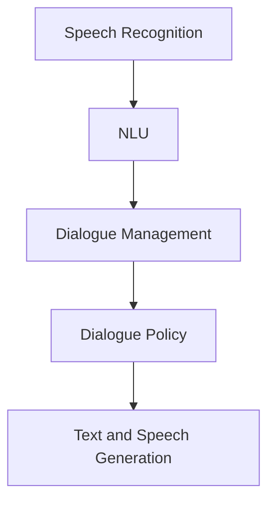

                 

### Introduction to Enterprise-Grade Dialogue Systems

Enterprise-grade dialogue systems have emerged as a transformative technology in the realm of customer service and support. These systems leverage advanced natural language processing (NLP), machine learning (ML), and artificial intelligence (AI) techniques to facilitate human-like interactions between businesses and their customers. Unlike traditional customer service methods that rely heavily on scripted responses and manual handling, dialogue systems are designed to understand and respond to customer inquiries in a more personalized and efficient manner.

#### Problem Background and Importance

The demand for efficient and effective customer service has never been higher. With the increasing complexity of customer interactions and the rising expectations of today's digital consumers, businesses face significant challenges in providing timely and high-quality support. Traditional customer service methods, such as phone calls and email, are often time-consuming and costly, leading to long wait times and unresolved issues. Furthermore, the proliferation of digital channels has expanded the scope of customer interactions, making it difficult for businesses to manage multiple touchpoints simultaneously.

This is where enterprise-grade dialogue systems come into play. By automating and optimizing customer interactions, these systems help businesses reduce response times, enhance customer satisfaction, and improve operational efficiency. Moreover, dialogue systems enable businesses to scale their customer service capabilities without increasing their workforce, making them an attractive solution for companies of all sizes.

#### Definition and Basic Concepts of Dialogue Systems

A dialogue system, also known as a conversational agent, is a computer program that simulates human conversation through text or voice interactions. The primary goal of a dialogue system is to understand the intent and context of user input and generate appropriate responses that meet the user's needs.

At a high level, a dialogue system can be broken down into several key components:

1. **Speech Recognition and Natural Language Understanding (NLU):** This component is responsible for converting spoken or written input into a format that the system can understand. It involves techniques like tokenization, part-of-speech tagging, and named entity recognition to extract meaningful information from the input.

2. **Dialogue Management:** This component handles the flow of the conversation, ensuring that the system responds appropriately based on the user's input and the system's current state. It includes dialogue policies and state tracking to maintain the context of the conversation and guide the system's responses.

3. **Dialogue Policy:** Dialogue policies define the rules and strategies that the system follows to generate responses. These policies can be based on predefined rules or learned from data using machine learning techniques.

4. **Dialogue Act Classification and Dialogue State Tracking:** This component classifies user input into dialogue acts, which represent the user's intentions or actions. Dialogue state tracking keeps track of the conversation's context, enabling the system to generate coherent and contextually relevant responses.

5. **Text and Speech Generation:** Once the system understands the user's input and maintains the conversation context, it generates appropriate responses in text or speech format. This component may involve techniques like template-based generation or neural network-based text generation.

#### Current State of Dialogue System Development

Over the past decade, there has been significant progress in the development of dialogue systems. The advancements in NLP, ML, and AI have enabled the creation of more sophisticated and human-like conversational agents. Today, we see a wide range of dialogue systems deployed in various industries, including customer service, healthcare, finance, and e-commerce.

1. **Improved Natural Language Understanding:** Advances in NLU techniques have enabled dialogue systems to understand and process natural language inputs with higher accuracy and context awareness. This has led to more natural and intuitive interactions between users and systems.

2. **Deep Learning and Neural Networks:** The adoption of deep learning and neural network-based models, such as recurrent neural networks (RNNs), long short-term memory (LSTM) networks, and transformer models, has revolutionized dialogue system development. These models have achieved state-of-the-art performance in various NLP tasks, including text classification, machine translation, and text generation.

3. **Dialogue Management and Policy Learning:** Researchers and developers are increasingly focusing on developing more robust and adaptive dialogue management techniques. This includes techniques for learning dialogue policies from data, handling dialogue state tracking and dialogue act classification, and managing context switching.

4. **Integration with Other Systems:** Dialogue systems are now being integrated with other customer service systems, such as customer relationship management (CRM) and support ticketing systems, to provide a seamless and cohesive customer experience.

5. **Ethical Considerations and Bias Mitigation:** As dialogue systems become more prevalent, ethical considerations and bias mitigation have become crucial. Researchers and developers are working on methods to identify and mitigate biases in dialogue systems to ensure fair and unbiased interactions.

In conclusion, enterprise-grade dialogue systems have become a critical component of modern customer service strategies. With continuous advancements in NLP, ML, and AI, these systems are becoming more sophisticated and capable of delivering personalized and efficient customer experiences. In the following chapters, we will delve deeper into the core concepts, architectural design, and implementation techniques of enterprise-grade dialogue systems, as well as their integration with customer service operations and performance evaluation methodologies.

### Fundamental Concepts of Dialogue Systems

Dialogue systems, at their core, are built upon a combination of advanced technologies that enable them to understand, interpret, and respond to human language. In this section, we will delve into the fundamental concepts and components that make up a dialogue system, providing a clear understanding of how these systems function and interact with users.

#### Definition and Characteristics of Dialogue Systems

A dialogue system is a computer program designed to simulate conversations with human users. Unlike traditional rule-based systems that rely on predefined responses, dialogue systems aim to understand the user's intent and context, generate coherent and contextually appropriate responses, and maintain a natural conversation flow. Key characteristics of dialogue systems include:

1. **Natural Language Understanding (NLU):** Dialogue systems must be able to comprehend and interpret natural language inputs from users. This involves techniques such as tokenization, part-of-speech tagging, named entity recognition, and sentiment analysis.

2. **Dialogue Management:** Dialogue systems must manage the conversation flow, ensuring that responses are contextually relevant and that the system can handle various conversation scenarios. This includes maintaining dialogue context and managing dialogue states.

3. **Dialogue Policy:** Dialogue policies define the rules and strategies that the system follows to generate responses. These policies can be based on predefined rules or learned from data using machine learning techniques.

4. **Dialogue Act Classification and State Tracking:** Dialogue act classification involves categorizing user inputs into specific actions or intents. State tracking keeps track of the conversation's context, enabling the system to generate coherent responses.

5. **Text and Speech Generation:** Once the system understands the user's input and maintains the conversation context, it generates appropriate responses in text or speech format. This can involve techniques like template-based generation or neural network-based text generation.

#### Key Components of Dialogue Systems

Dialogue systems can be broken down into several key components, each playing a critical role in the overall functionality of the system. Let's explore each component in detail:

**1. Speech Recognition and Natural Language Understanding (NLU):**

Speech recognition is the process of converting spoken words into text. It involves several stages, including audio preprocessing, feature extraction, acoustic modeling, and language modeling. The output of the speech recognition system is then passed on to the NLU component, which interprets the text to extract meaningful information.

- **Speech Recognition:**
  - **Audio Preprocessing:** This stage involves filtering and cleaning the audio signal to remove noise and other unwanted components.
  - **Feature Extraction:** This stage converts the preprocessed audio signal into a set of numerical features that capture the characteristics of the sound wave.
  - **Acoustic Modeling:** Acoustic models map the extracted features to phonetic representations of the spoken words.
  - **Language Modeling:** Language models predict the probability of a sequence of words based on statistical patterns in a large corpus of text.

- **Natural Language Understanding (NLU):**
  - **Tokenization:** This process splits the text into individual words or tokens, which are the basic units of meaning in language.
  - **Part-of-Speech Tagging:** This process assigns a part of speech (noun, verb, adjective, etc.) to each token, providing information about the grammatical structure of the text.
  - **Named Entity Recognition:** This process identifies and classifies named entities (people, organizations, locations, etc.) in the text.
  - **Sentiment Analysis:** This process determines the sentiment or emotional tone of the text, providing insights into the user's feelings or opinions.

**2. Dialogue Management:**

Dialogue management is responsible for managing the conversation flow, ensuring that responses are contextually relevant and that the system can handle various conversation scenarios. Key components of dialogue management include:

- **Dialogue Policies:** Dialogue policies define the rules and strategies that the system follows to generate responses. These policies can be based on predefined rules or learned from data using machine learning techniques.
- **Dialogue State Tracking:** Dialogue state tracking keeps track of the conversation's context, enabling the system to generate coherent responses. This involves maintaining a dialogue state that captures the system's understanding of the user's intent, context, and current conversation goals.

**3. Dialogue Policy:**

Dialogue policies are rules that guide the system's response generation process. These policies can be based on a combination of predefined rules and machine learning models trained on large datasets of conversational data.

- **Rule-Based Policies:** These policies use predefined rules to generate responses. For example, a rule-based policy might match a user's input to a specific phrase and respond accordingly.
- **Data-Driven Policies:** These policies use machine learning models to generate responses based on patterns and relationships discovered in large datasets. For example, a data-driven policy might use a supervised learning model trained on labeled conversational data to predict the next response in a conversation.

**4. Dialogue Act Classification and State Tracking:**

Dialogue act classification involves categorizing user inputs into specific actions or intents. This is important for understanding the user's goals and generating appropriate responses. Dialogue state tracking, on the other hand, keeps track of the conversation's context, ensuring that the system can generate coherent responses.

- **Dialogue Act Classification:** This process involves identifying the user's intentions or actions based on their input. For example, a user's input might be classified as a request, an inquiry, or an assertion.
- **State Tracking:** This process involves maintaining a dialogue state that captures the system's understanding of the user's intent, context, and current conversation goals. The dialogue state is updated as the conversation progresses, enabling the system to generate contextually relevant responses.

**5. Text and Speech Generation:**

Once the system understands the user's input and maintains the conversation context, it generates appropriate responses in text or speech format.

- **Text Generation:** Text generation can be based on template-based approaches or neural network-based approaches. Template-based approaches use predefined response templates that are filled in with information extracted from the user's input. Neural network-based approaches, such as sequence-to-sequence models and transformer models, generate responses by predicting the next word in a sequence based on the context provided by the user's input.
- **Speech Generation:** Speech generation involves converting text responses into spoken words. This is achieved using text-to-speech (TTS) synthesis techniques, which convert text into audio signals that can be played back as speech.

In summary, dialogue systems are complex systems that rely on a combination of speech recognition, natural language understanding, dialogue management, dialogue policies, dialogue act classification, state tracking, and text and speech generation to simulate human-like conversations. Understanding these components and how they interact is crucial for developing effective and efficient dialogue systems that can enhance customer service and support operations.

### Architectural Design of Enterprise-Grade Dialogue Systems

Designing an enterprise-grade dialogue system involves a meticulous approach to selecting the right architecture, technologies, and tools. This section explores the high-level architecture of dialogue systems, key technologies and tools used in their implementation, and the challenges associated with building scalable dialogue systems.

#### High-Level Architecture of Dialogue Systems

The high-level architecture of an enterprise-grade dialogue system can be visualized as a pipeline consisting of several interconnected components. Each component plays a crucial role in processing user input, generating responses, and maintaining the conversation context. The following diagram illustrates the typical high-level architecture of a dialogue system:

**Speech Recognition (A):** This component converts spoken input into text using advanced speech recognition algorithms. The output is then passed to the next stage for further processing.

**Natural Language Understanding (NLU) (B):** This component interprets the text input by extracting meaning and context using techniques such as tokenization, part-of-speech tagging, named entity recognition, and sentiment analysis. The output from NLU is used to understand the user's intent and generate an appropriate response.

**Dialogue Management (C):** This component manages the flow of the conversation by maintaining the dialogue context and ensuring that responses are contextually relevant. It involves dialogue state tracking and dialogue act classification to understand the user's actions and maintain the conversation's state.

**Dialogue Policy (D):** This component defines the rules and strategies that guide the system's response generation process. It can be rule-based or data-driven, depending on the implementation. The dialogue policy helps in generating coherent and contextually appropriate responses based on the user's input and the current dialogue state.

**Text and Speech Generation (E):** This component generates the final response in text or speech format. For text responses, it can use template-based or neural network-based approaches. For speech responses, it employs text-to-speech (TTS) synthesis techniques to convert the text into audible speech.

#### Key Technologies and Tools for Implementation

Implementing an enterprise-grade dialogue system requires the use of several advanced technologies and tools. Here are some of the key technologies and tools commonly used in dialogue system development:

1. **Speech Recognition Engines:** Popular speech recognition engines like Google Speech-to-Text, IBM Watson Speech-to-Text, and CMUSphinx are used to convert spoken input into text.

2. **Natural Language Processing (NLP) Libraries:** Libraries such as NLTK, spaCy, and Stanford NLP provide tools for text processing, including tokenization, part-of-speech tagging, named entity recognition, and sentiment analysis.

3. **Dialogue Management Frameworks:** Frameworks like Rasa, Botpress, and Microsoft Bot Framework provide tools for building dialogue systems that can manage conversation flows, maintain dialogue states, and integrate with various channels.

4. **Machine Learning Models:** Machine learning models, such as recurrent neural networks (RNNs), long short-term memory (LSTM) networks, and transformer models, are used for tasks like dialogue policy learning, intent recognition, and entity extraction.

5. **Text and Speech Generation Tools:** Libraries like NLTK and Hugging Face provide tools for text generation using techniques like template-based and neural network-based approaches. For speech generation, tools like Google Text-to-Speech and Amazon Polly are widely used.

6. **APIs and Web Services:** APIs and web services like Dialogflow, Lex, and IBM Watson Assistant provide pre-built dialogue system functionalities that can be easily integrated into existing applications.

#### Challenges in Building a Scalable Dialogue System

Building a scalable dialogue system presents several challenges that need to be addressed to ensure optimal performance and reliability. Some of the key challenges include:

1. **Scalability:** As the number of users and conversations grows, the system must be able to handle increased load and scale horizontally to maintain performance. This involves designing a distributed architecture that can handle large volumes of data and high concurrency.

2. **Latency:** Ensuring low latency in processing user inputs and generating responses is crucial for providing a seamless user experience. This requires efficient processing pipelines and optimized algorithms to minimize response times.

3. **Context Management:** Maintaining the context of conversations across multiple interactions and sessions can be challenging. The system must be able to handle context switching and ensure that responses are contextually relevant even in complex conversation scenarios.

4. **Error Handling:** Handling errors and exceptions gracefully is essential for providing a reliable user experience. The system must be able to detect and recover from errors, such as speech recognition failures or misunderstandings in user input.

5. **Integration:** Integrating dialogue systems with existing customer service systems, such as CRM and support ticketing systems, can be complex. Ensuring seamless integration and data flow between different systems is critical for providing a cohesive customer experience.

In conclusion, designing and implementing an enterprise-grade dialogue system requires careful consideration of various architectural, technological, and operational factors. By addressing the challenges associated with building scalable dialogue systems, businesses can enhance their customer service capabilities and deliver personalized, efficient, and effective interactions with their customers.

### Advanced Dialogue Management Techniques

Advanced dialogue management techniques are crucial for creating enterprise-grade dialogue systems that can handle complex and nuanced conversations. These techniques improve the system's ability to understand user intents, generate appropriate responses, and maintain the context of the conversation. In this section, we will explore key advanced dialogue management techniques, including Dialogue State Tracking, Contextual Response Generation, and User Intent Recognition and Slot Filling.

#### Dialogue State Tracking

Dialogue State Tracking (DST) is a fundamental technique in dialogue management that involves maintaining the state of the conversation. The dialogue state represents the system's understanding of the user's intent, context, and the current conversation goals. By tracking the dialogue state, the system can generate contextually appropriate responses and ensure that the conversation remains coherent and meaningful.

**Importance of Dialogue State Tracking:**

1. **Consistent User Experience:** Dialogue state tracking ensures that the system provides consistent and relevant responses throughout the conversation, even as the topic or context changes.

2. **Handling Ambiguity:** By maintaining the dialogue state, the system can handle ambiguous user inputs and disambiguate between multiple possible intents or actions.

3. **Contextual Relevance:** Dialogue state tracking enables the system to generate responses that are contextually relevant, improving the overall user experience.

**Methods for Dialogue State Tracking:**

1. **Rule-Based State Tracking:** In this approach, the dialogue state is defined using a set of predefined rules. These rules map user inputs to specific states, ensuring that the system can transition between states based on the conversation flow.

2. **Data-Driven State Tracking:** This approach involves training machine learning models to predict the dialogue state based on the user's input and the current dialogue context. Techniques like recurrent neural networks (RNNs) and transformers are commonly used for this purpose.

3. **Probabilistic State Tracking:** Probabilistic models, such as Hidden Markov Models (HMMs) and Kalman Filters, can be used to estimate the dialogue state based on observed user inputs. These models provide a probabilistic distribution over the possible dialogue states, enabling the system to handle uncertainty and ambiguity in user inputs.

#### Contextual Response Generation

Contextual Response Generation is a technique that enables the dialogue system to generate responses that are relevant to the current context of the conversation. By understanding the user's intent, context, and the ongoing dialogue, the system can generate responses that are both informative and coherent.

**Importance of Contextual Response Generation:**

1. **Enhanced User Experience:** Contextual responses provide a more personalized and engaging user experience, as they are tailored to the user's specific needs and context.

2. **Improved Dialogue Flow:** By generating contextually appropriate responses, the system can maintain the natural flow of the conversation and avoid abrupt transitions or irrelevant topics.

3. **Reduced Misunderstandings:** Contextual responses help minimize misunderstandings and ensure that the user's intent is accurately understood and addressed.

**Methods for Contextual Response Generation:**

1. **Template-Based Generation:** In this approach, predefined response templates are used to generate responses based on specific intents or dialogue states. The templates can be filled with information extracted from the user's input to create a personalized response.

2. **Neural Network-Based Generation:** Neural network-based techniques, such as sequence-to-sequence models and transformers, are used to generate responses by predicting the next word or sentence in the dialogue based on the current context. These models can capture complex patterns and relationships in the dialogue, enabling the generation of highly contextual responses.

3. **Context-Aware Language Models:** Context-aware language models, like BERT and GPT, are trained on large corpora of conversational data to understand and generate responses that are contextually relevant. These models can be fine-tuned on domain-specific data to improve the quality of contextual responses.

#### User Intent Recognition and Slot Filling

User Intent Recognition is the process of identifying the user's intention or action based on their input. Slot Filling, on the other hand, involves extracting specific information or entities from the user's input that are relevant to the identified intent. These techniques are essential for understanding the user's needs and generating appropriate responses.

**Importance of User Intent Recognition and Slot Filling:**

1. **Accurate Understanding:** By accurately recognizing the user's intent and extracting relevant information, the system can ensure that the user's needs are understood and addressed correctly.

2. **Personalization:** Intent recognition and slot filling enable the system to provide personalized responses based on the user's specific needs and context.

3. **Streamlined Interaction:** By extracting relevant information from user inputs, the system can streamline the interaction process and reduce the need for multiple queries from the user.

**Methods for User Intent Recognition and Slot Filling:**

1. **Rule-Based Methods:** Rule-based methods involve defining a set of rules to identify user intents and extract relevant information from the input. These methods are straightforward to implement but can be limited in their ability to handle complex and ambiguous inputs.

2. **Data-Driven Methods:** Data-driven methods, such as machine learning models, are trained on large datasets of labeled conversational data to recognize user intents and extract relevant information. Techniques like decision trees, support vector machines (SVMs), and neural networks are commonly used for this purpose.

3. **Hybrid Methods:** Hybrid methods combine rule-based and data-driven approaches to leverage the strengths of both techniques. For example, a rule-based system can be used to identify high-confidence intents, while a machine learning model can be used to handle ambiguous or low-confidence intents.

In conclusion, advanced dialogue management techniques, such as Dialogue State Tracking, Contextual Response Generation, and User Intent Recognition and Slot Filling, are essential for creating sophisticated and effective dialogue systems. By leveraging these techniques, enterprise-grade dialogue systems can provide personalized, coherent, and contextually relevant interactions that enhance the overall customer experience.

### Integrating Dialogue Systems into Customer Service Operations

The integration of dialogue systems into customer service operations is a strategic move that has the potential to significantly enhance customer satisfaction and operational efficiency. This section explores the challenges and opportunities associated with integrating dialogue systems into existing customer service frameworks, discusses the process of integrating dialogue systems with CRM and support systems, and examines how these systems can improve customer experience.

#### Challenges and Opportunities in Integrating Dialogue Systems

Integrating dialogue systems into customer service operations is not without its challenges. Some of the key challenges include:

1. **Data Integration:** One of the primary challenges is ensuring seamless integration of dialogue systems with existing customer service databases and CRM systems. This requires harmonizing data formats and structures to enable smooth data flow and interoperability between systems.

2. **System Compatibility:** Ensuring compatibility between the dialogue system and existing customer service platforms can be complex. Different systems may use different APIs, data formats, and communication protocols, which need to be standardized and adapted to work together effectively.

3. **Scalability and Performance:** As customer service interactions increase, the dialogue system must be scalable to handle the growing volume of conversations without compromising performance. Ensuring that the system can scale horizontally and maintain low latency is crucial for providing a seamless customer experience.

4. **User Training and Onboarding:** Users, including customer service agents and customers, may require training and onboarding to adapt to the new dialogue system. This involves educating users on how to interact with the system effectively and ensuring that customer service agents are familiar with the integration points and functionalities of the dialogue system.

Despite these challenges, integrating dialogue systems into customer service operations offers several opportunities:

1. **Enhanced Customer Experience:** Dialogue systems can provide personalized, efficient, and consistent interactions with customers, improving overall customer satisfaction. By automating routine inquiries and providing immediate responses, dialogue systems can reduce wait times and frustration for customers.

2. **Operational Efficiency:** Dialogue systems can handle a large volume of customer inquiries, allowing customer service teams to focus on more complex and high-value tasks. This can lead to significant cost savings and increased efficiency in customer service operations.

3. **Data Insights and Analysis:** Dialogue systems can collect valuable data on customer interactions, which can be analyzed to gain insights into customer needs, preferences, and pain points. This data can inform strategic decisions and improve customer service processes over time.

4. **24/7 Availability:** Dialogue systems can operate around the clock, providing customers with access to support and information at any time. This can be particularly beneficial for businesses with global operations or customers in different time zones.

#### Integrating Dialogue Systems with CRM and Support Systems

The process of integrating dialogue systems with CRM (Customer Relationship Management) and support systems involves several critical steps:

1. **System Identification and Mapping:** Identify the key systems and platforms used in the customer service operation, such as CRM systems (e.g., Salesforce, Microsoft Dynamics 365), support ticketing systems (e.g., Zendesk, JIRA), and communication channels (e.g., chatbots, voice assistants). Map out the data flows and integration points between these systems and the dialogue system.

2. **APIs and Web Services:** Utilize APIs and web services provided by the CRM and support systems to enable data exchange and integration. Common APIs like RESTful APIs, GraphQL, and WebSocket can be used to facilitate real-time communication and data synchronization.

3. **Data Standardization and Mapping:** Standardize data formats and structures to ensure consistency across systems. This may involve transforming data from one format to another, such as mapping customer information from a CRM system to a dialogue system's database.

4. **Authentication and Security:** Implement robust authentication and security measures to protect customer data and ensure secure communication between systems. This includes using OAuth, SSL/TLS encryption, and other security protocols to safeguard data in transit.

5. **Testing and Validation:** Conduct thorough testing and validation to ensure that the integration works as expected. This involves simulating various customer interactions and verifying that data is correctly exchanged and processed between systems.

6. **User Training and Documentation:** Provide comprehensive training and documentation to users on how to interact with the integrated dialogue system. This includes training customer service agents on how to handle customer inquiries through the dialogue system and training customers on how to use the system for self-service.

#### Enhancing Customer Experience with Dialogue Systems

Dialogue systems can significantly enhance the customer experience by providing personalized, efficient, and 24/7 support. Here are some ways dialogue systems can improve customer experience:

1. **Personalized Interactions:** Dialogue systems can tailor responses based on the customer's history, preferences, and needs. This personalization can create a more engaging and memorable customer experience.

2. **24/7 Availability:** Customers can access support at any time, which is especially beneficial for businesses with global operations or customers in different time zones. This ensures that customer inquiries are addressed promptly, even outside regular business hours.

3. **Reduced Wait Times:** Dialogue systems can handle a large volume of inquiries simultaneously, reducing wait times for customers and improving overall response times. This can significantly enhance customer satisfaction.

4. **Self-Service Options:** Dialogue systems can provide self-service options, allowing customers to resolve common issues on their own without needing to speak to a customer service representative. This can reduce the burden on customer service teams and empower customers to find solutions independently.

5. **Seamless Handoffs:** When dialogue systems encounter inquiries that require human intervention, they can seamlessly transfer the conversation to a customer service agent, providing a smooth and uninterrupted customer experience.

In conclusion, integrating dialogue systems into customer service operations presents several challenges but also offers significant opportunities to enhance customer experience and operational efficiency. By carefully planning and executing the integration process, businesses can leverage the power of dialogue systems to provide personalized, efficient, and 24/7 support to their customers.

### Performance Evaluation and Quality Assurance for Dialogue Systems

The performance of dialogue systems directly impacts the quality of customer interactions and, by extension, the overall customer experience. Therefore, it is crucial to have robust performance evaluation and quality assurance (QA) processes in place. This section delves into the metrics used to evaluate dialogue system performance, the process of collecting and annotating training and testing data, and strategies for continuous improvement and machine learning.

#### Performance Metrics for Dialogue Systems

Evaluating the performance of dialogue systems requires a set of well-defined metrics that cover various aspects of system functionality, including accuracy, response time, and user satisfaction. Here are some key metrics:

1. **Accuracy:** Accuracy measures the correctness of the system's understanding and responses. It is typically evaluated using metrics like intent recognition accuracy, entity extraction accuracy, and response generation accuracy.

2. **Response Time:** Response time measures the time taken by the system to generate a response after receiving a user input. This metric is critical for ensuring a seamless user experience, especially in interactive scenarios like chatbots.

3. **F1 Score:** The F1 score is a metric that combines precision and recall to provide a balanced evaluation of the system's performance in intent recognition and entity extraction tasks. A higher F1 score indicates better overall performance.

4. **Customer Satisfaction:** Customer satisfaction is a qualitative metric that reflects the user's perception of the system's performance. Surveys, feedback forms, and Net Promoter Score (NPS) are common methods for assessing customer satisfaction.

5. **Conversational Coherence:** Conversational coherence evaluates the system's ability to maintain a logical and natural flow of conversation. This metric is often evaluated using human annotators who rate the coherence of conversational exchanges.

#### Data Collection and Annotation

The quality of a dialogue system heavily depends on the quality of the training data used. Therefore, collecting and annotating high-quality data is essential for effective training and evaluation. Here are the key steps in the data collection and annotation process:

1. **Data Collection:** Data collection involves gathering a diverse set of conversational data that represents the range of possible user interactions. This data can come from various sources, including customer service logs, chatbot interactions, call center transcripts, and open-domain conversations.

2. **Data Cleaning:** Raw conversational data often contains noise and inconsistencies, such as typos, abbreviations, and slang. Data cleaning involves preprocessing the data to remove noise and standardize it for annotation.

3. **Annotation:** Annotation involves labeling the data with relevant information, such as intents, entities, dialogue acts, and response categories. This step is typically performed by human annotators who have domain expertise in the specific application context of the dialogue system.

4. **Annotation Guidelines:** Clear annotation guidelines are essential for ensuring consistency and accuracy in the annotation process. Guidelines should include definitions of key terms, annotation conventions, and examples to help annotators understand their role and responsibilities.

5. **Quality Control:** Quality control involves verifying the accuracy and consistency of the annotated data. This can be done through random sampling and double-checking annotations by multiple annotators.

#### Continuous Improvement and Machine Learning

Continuous improvement is a key aspect of maintaining and enhancing the performance of dialogue systems. This involves regularly updating the system with new data, retraining models, and refining the dialogue management strategies. Here are some strategies for continuous improvement and machine learning:

1. **Data Feedback Loop:** Implementing a data feedback loop allows the system to learn from its interactions with users. User feedback, error logs, and performance metrics can be used to identify areas for improvement and refine the system.

2. **Model Retraining:** Regularly retrain the machine learning models with new data to adapt to changing user preferences and behaviors. This ensures that the system remains accurate and relevant over time.

3. **Active Learning:** Active learning is a technique where the system selectively queries users for feedback on specific instances where it is uncertain about the correct response. This can improve the performance of the system by focusing on the most informative and challenging cases.

4. **Transfer Learning:** Transfer learning involves using a pre-trained model on a large corpus of data and fine-tuning it on a smaller dataset specific to the application context. This can be particularly effective for dialogue systems that operate in specific domains or industries.

5. **Multi-Modal Learning:** Multi-modal learning combines data from different modalities, such as text, speech, and visual information, to improve the system's understanding and response generation capabilities. This can enhance the system's ability to handle complex and nuanced interactions.

In conclusion, performance evaluation and quality assurance are critical for ensuring the effectiveness and reliability of dialogue systems. By using a combination of performance metrics, data collection and annotation processes, and continuous improvement strategies, businesses can enhance the performance of their dialogue systems and deliver exceptional customer experiences.

### Conclusion

In summary, enterprise-grade dialogue systems have become an indispensable tool in modern customer service operations. By leveraging advanced natural language processing, machine learning, and artificial intelligence, these systems provide personalized, efficient, and 24/7 support to customers, significantly enhancing their overall experience. We have explored the key components, architectural design, and advanced techniques that underpin these systems, highlighting their importance in today’s fast-paced business environment.

The integration of dialogue systems with CRM and support systems offers numerous opportunities to streamline operations, reduce costs, and improve customer satisfaction. However, the journey is not without challenges, including data integration, system compatibility, and the need for robust quality assurance processes.

Looking forward, the future of dialogue systems promises even greater innovation and advancements. The continued evolution of AI and machine learning will enable dialogue systems to become even more sophisticated, capable of handling more complex conversations and providing deeper insights into customer needs. The emergence of multi-modal dialogue systems that integrate text, speech, and visual information will further enhance the user experience.

As businesses continue to adopt and refine these systems, we can expect to see a shift towards more seamless, intuitive, and intelligent customer interactions. The potential impact on customer service, customer experience, and overall business success is profound, making dialogue systems a strategic imperative for organizations aiming to stay competitive in the digital age.

### Best Practices and Tips

When implementing an enterprise-grade dialogue system, following best practices and leveraging proven tips can significantly enhance the system's effectiveness and user experience. Here are some key recommendations:

1. **User-Centric Design:** Prioritize understanding the needs and preferences of your target users. Conduct user research and gather feedback to tailor the dialogue system to meet their expectations.

2. **Continuous Improvement:** Regularly update and retrain the dialogue system with new data to adapt to evolving user behaviors and preferences. Implement a data feedback loop to learn from user interactions and improve system performance.

3. **Data Quality Assurance:** Ensure high-quality training data by performing thorough data cleaning, annotation, and quality control. Consistent and accurate data is crucial for training robust machine learning models.

4. **Scalability Planning:** Design the system with scalability in mind to handle increasing volumes of interactions. Utilize cloud-based solutions and distributed architectures to ensure performance and reliability as the system grows.

5. **Multi-Modal Interaction:** Support multi-modal interactions, such as text and voice, to provide a more natural and engaging user experience. This can enhance usability and cater to different user preferences.

6. **Security and Privacy:** Prioritize security and privacy by implementing robust authentication, encryption, and compliance measures to protect sensitive customer data.

7. **Cross-Department Collaboration:** Foster collaboration between customer service, IT, and data science teams to ensure that the dialogue system aligns with business goals and meets the needs of all stakeholders.

8. **User Training and Documentation:** Provide comprehensive training and documentation to users, including customer service agents and end-users. This will help ensure a smooth transition and maximize the system's potential.

By following these best practices and tips, organizations can successfully implement and leverage dialogue systems to deliver exceptional customer service and drive business success.

### Summary and Future Directions

In this comprehensive guide, we have explored the fundamental concepts, architectural design, and advanced techniques of enterprise-grade dialogue systems. We have discussed the importance of dialogue systems in enhancing customer service quality, highlighted the key components that make up a dialogue system, and examined the challenges and opportunities in integrating these systems into customer service operations.

As we have seen, dialogue systems leverage advanced technologies like natural language processing, machine learning, and artificial intelligence to enable human-like interactions. These systems can handle complex conversations, provide personalized responses, and offer 24/7 support, significantly improving customer satisfaction and operational efficiency.

Looking to the future, the evolution of dialogue systems is set to continue with even more sophisticated capabilities. Emerging trends such as multi-modal interactions, context-aware AI, and adaptive dialogue management will further enhance the system's ability to understand and respond to user needs. Additionally, the integration of dialogue systems with emerging technologies like augmented reality and virtual reality will open new avenues for immersive and interactive customer experiences.

To stay at the forefront of this rapidly evolving field, businesses and developers should continue to innovate and explore new ways to leverage dialogue systems. Emphasizing user-centric design, ensuring robust data quality, and adopting agile development practices will be key to unlocking the full potential of these systems.

As we move forward, dialogue systems will undoubtedly play an increasingly pivotal role in shaping the future of customer service and beyond. By investing in research and development, and by continuously improving these systems, organizations can create more engaging, efficient, and effective customer interactions, ultimately driving greater success in the digital age.

### Author Information

作者：AI天才研究院/AI Genius Institute & 禅与计算机程序设计艺术 /Zen And The Art of Computer Programming

AI天才研究院致力于推动人工智能领域的前沿研究和应用，通过创新的技术和解决方案，助力企业实现智能化转型。研究院汇集了众多世界级人工智能专家、学者和工程师，以其深厚的理论基础和丰富的实践经验，为人工智能技术的发展和普及贡献力量。

《禅与计算机程序设计艺术》是作者在计算机编程领域多年实践和思考的结晶，旨在探索计算机编程的深层哲学和艺术，帮助读者提升编程思维和技能，实现技术与智慧的完美结合。该书以其独特的视角和深入浅出的讲解，深受读者喜爱，被誉为计算机编程领域的经典之作。作者以其卓越的成就和对技术的深刻理解，成为计算机科学和人工智能领域的领军人物。

