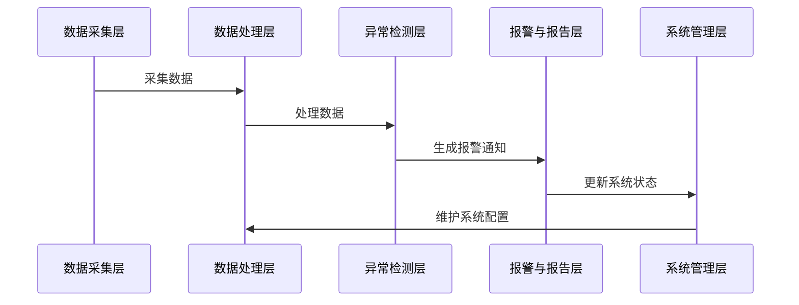
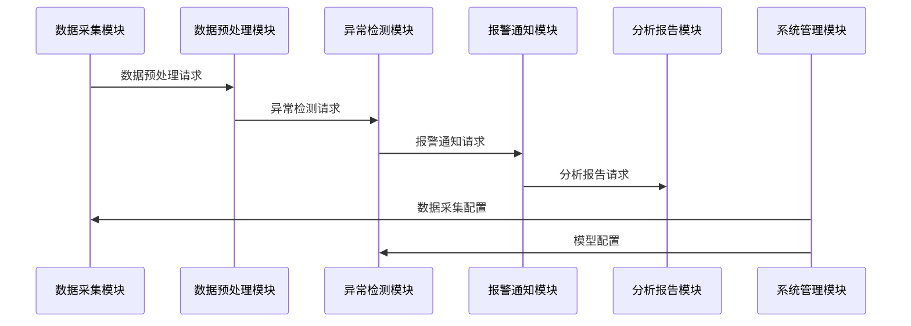
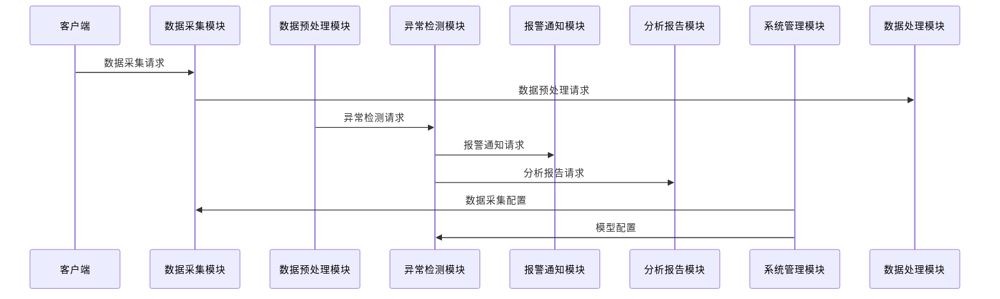

                 

### 第1章: 企业级异常检测系统的意义与挑战

在信息化和数字化迅猛发展的今天，企业运营过程中会产生大量的数据，这些数据不仅包括日常业务流程的记录，还涉及网络行为、用户操作、设备状态等多个方面。如何在海量数据中迅速识别并处理异常情况，已经成为企业提升运营效率和保障安全的关键。企业级异常检测系统在这样的背景下应运而生，旨在通过先进的算法和技术手段，实现对异常情况的及时发现和处理。

#### 1.1 问题背景

**异常检测的重要性：** 在企业的运营过程中，异常事件可能来源于内部管理漏洞、外部攻击、设备故障等多个方面。这些异常事件不仅会影响业务的连续性，还可能导致数据泄露、经济损失，甚至危及企业的声誉。因此，对异常事件进行及时检测和处理，是保障企业运营安全和效率的必要手段。

**企业级异常检测的现状：** 目前，市场上已经存在多种异常检测工具和系统，但大多数集中在特定领域或单一应用场景，缺乏全面性和适应性。此外，随着企业规模的扩大和数据量的增长，如何在一个统一的平台上实现高效、精准的异常检测，成为了一个亟待解决的问题。

**系统建设的必要性和挑战：** 建立一个企业级的异常检测系统，不仅需要解决技术上的挑战，如海量数据的处理、算法的优化等，还需要考虑系统的可扩展性、兼容性、以及与现有系统的集成等问题。因此，建设一个高效、可靠的企业级异常检测系统，是提升企业运营安全性的关键。

#### 1.2 核心概念与联系

**异常检测的定义：** 异常检测（Anomaly Detection）是一种用于识别数据集中异常或异常模式的技术。它通过对正常行为建立模型，然后对新的数据进行分析，识别出不符合正常模型的数据。

**关键术语解析：** 
- **正常数据（Normal Data）：** 指在正常运营过程中产生的数据。
- **异常数据（Anomaly Data）：** 指与正常数据模式显著不同的数据，可能是由于异常事件引起的。
- **模型（Model）：** 通过对正常数据进行分析和训练，建立用于识别异常数据的数学模型。
- **阈值（Threshold）：** 用于确定异常数据的标准，超过阈值的数据将被认为是异常数据。

**异常检测的相关概念及其关系：** 异常检测系统涉及多个相关概念，如数据源、数据预处理、算法选择、模型训练、结果评估等。这些概念相互联系，共同构成了一个完整的异常检测流程。

为了更清晰地展示这些概念之间的关系，我们可以使用Mermaid ER图进行说明。ER图能够帮助我们理解实体之间的关系，以下是异常检测系统中主要实体的ER图：

```mermaid
erDiagram
  Data_Source ||--o{ Data_Processing : 数据预处理}
  Data_Processing ||--o{ Algorithm_Selection : 算法选择}
  Algorithm_Selection ||--o{ Model_Training : 模型训练}
  Model_Training ||--o{ Result_Evaluation : 结果评估}
  Data_Source ||--o{ Anomaly_Detection : 异常检测}
```

在这个ER图中，`Data_Source`（数据源）是异常检测系统的起点，通过对数据的预处理（`Data_Processing`），然后选择合适的算法（`Algorithm_Selection`）进行模型训练（`Model_Training`），最终评估模型的效果并进行异常检测（`Anomaly_Detection`）。这些实体相互关联，共同构成了一个完整的异常检测流程。

### 1.3 小结

本章主要介绍了企业级异常检测系统的意义与挑战。首先，从问题背景入手，阐述了异常检测在保障企业运营安全中的重要性。接着，通过核心概念与关系的解析，使读者对异常检测系统有了初步的认识。最后，通过ER图展示了异常检测系统中主要实体之间的关系，为后续章节的深入分析奠定了基础。

## 1.4 拓展阅读

- [1] "Anomaly Detection Techniques: A Comparative Review," by I. Chaskar, A. Sheth, and V. Beraldo, IEEE Transactions on Knowledge and Data Engineering, 2017.
- [2] "Enterprise Security: A Comprehensive Approach to Understanding, Managing, and Securing Information Assets," by J. P. Rubinstein, McGraw-Hill Education, 2016.
- [3] "Real-Time Anomaly Detection in Big Data," by D. Tao and X. Zhou, Springer, 2018.

## 1.5 注意事项

- 在设计企业级异常检测系统时，应充分考虑数据的安全性、隐私性和合规性，确保系统的正常运行不会导致数据泄露或其他安全问题。
- 选择合适的算法和技术，根据企业的具体需求和业务场景，进行定制化开发。
- 定期对异常检测系统进行评估和优化，确保其能够适应不断变化的企业运营环境。

## 1.6 最佳实践 Tips

- 在数据预处理阶段，尽量去除噪声和冗余数据，提高数据的质量。
- 在算法选择和模型训练过程中，结合实际业务场景，选择最合适的算法和模型。
- 定期更新和维护异常检测系统，确保其能够及时识别新的异常模式和威胁。

# 第2章: 异常检测的理论基础

在了解了企业级异常检测系统的意义和挑战之后，本章我们将深入探讨异常检测的理论基础，包括基本概念、异常类型、检测模型分类以及相关算法原理。通过这些理论知识的理解，我们将为后续的系统设计与实现打下坚实的基础。

### 2.1 基本概念

#### 异常类型

异常检测首先需要明确异常类型，根据异常发生的领域和特征，可以将其分为以下几类：

- **点异常（Point Anomaly）：** 指数据集中某个孤立的数据点，与其他数据点存在显著差异。例如，在财务数据中，一个突然出现的异常高消费记录。

- **上下文异常（Contextual Anomaly）：** 指在一定上下文中，数据的行为模式与正常模式存在显著差异。例如，在医院的病患数据中，某患者在短时间内频繁出入急诊室。

- **集体异常（Collective Anomaly）：** 指数据集中多个数据点之间存在关联，但整体上与正常模式不符。例如，在网络安全领域，一组相互关联的网络攻击行为。

- **时空异常（Time Series Anomaly）：** 指在时间序列数据中，某一时间段内数据的行为模式与正常模式不符。例如，在电力系统中，某个时间段内异常高的用电量。

#### 检测模型分类

异常检测的模型可以分为以下几类：

- **基于统计的模型：** 利用统计学方法，通过计算数据的概率分布或偏差来检测异常。例如，高斯分布模型。

- **基于距离的模型：** 通过计算数据点与正常数据点的距离来检测异常。例如，k-近邻算法。

- **基于聚类的方法：** 利用聚类算法，将数据分为正常和异常两类。例如，基于密度的聚类算法DBSCAN。

- **基于分类的模型：** 利用分类算法，将数据点分类为正常或异常。例如，支持向量机（SVM）。

- **基于聚类和分类的混合模型：** 结合聚类和分类方法，提高异常检测的准确性。例如，孤立森林算法。

#### 关键术语解析

- **正常数据（Normal Data）：** 指在正常运营过程中产生的数据，符合既定的数据模式。

- **异常数据（Anomaly Data）：** 指与正常数据模式显著不同的数据，可能是由于异常事件引起的。

- **模型（Model）：** 用于识别异常数据的数学模型，通过对正常数据进行分析和训练得到。

- **阈值（Threshold）：** 用于确定异常数据的标准，超过阈值的数据将被认为是异常数据。

### 2.2 异常检测算法原理

异常检测算法的核心是建立正常数据和异常数据之间的边界。以下将详细介绍几种常见的异常检测算法的原理：

#### 监督学习算法

监督学习算法通过对已标记的正常数据和异常数据进行分析和训练，建立分类模型。在检测过程中，将新的数据点输入到模型中，根据模型的分类结果判断数据点是否为异常。

1. **高斯分布模型**

   高斯分布模型（Gaussian Mixture Model, GMM）通过拟合正常数据的概率分布，假设正常数据服从高斯分布，然后对新的数据点进行概率评估，判断其是否偏离正常分布。具体公式如下：

   $$
   P(x|\theta) = \frac{1}{(2\pi)^{d/2}|\Sigma|^{1/2}} \exp\left(-\frac{1}{2}(x-\mu)^T\Sigma^{-1}(x-\mu)\right)
   $$

   其中，$x$为新的数据点，$\mu$为均值向量，$\Sigma$为协方差矩阵，$\theta$为模型参数。

2. **支持向量机（Support Vector Machine, SVM）**

   支持向量机通过寻找一个超平面，将正常数据和异常数据分开。在异常检测中，可以将正常数据和异常数据视为两类分类问题，然后利用SVM进行分类。具体公式如下：

   $$
   \text{Minimize} \quad \frac{1}{2} \sum_{i=1}^{n} (w_i^2) + C \sum_{i=1}^{n} \xi_i
   $$

   $$
   \text{subject to} \quad y_i (w_i^T x_i + b) \geq 1 - \xi_i
   $$

   其中，$w_i$为权重向量，$x_i$为特征向量，$b$为偏置项，$C$为惩罚参数，$\xi_i$为松弛变量。

#### 无监督学习算法

无监督学习算法不依赖于已标记的数据，通过对数据集进行分析，自动识别出正常数据和异常数据。

1. **基于密度的聚类算法（Density-Based Clustering, DBSCAN）**

   DBSCAN通过计算数据点之间的密度关系，将数据点分为簇。簇内部的数据点密度高，簇之间的数据点密度低。异常数据通常位于密度较低的簇外。DBSCAN的主要公式如下：

   $$
   \text{MinPts} \leq \text{Neighbors}(x) \text{ and } \text{Density}(x) > \text{MinDensity}
   $$

   其中，$\text{MinPts}$为最小点数，$\text{Neighbors}(x)$为点$x$的邻域点数，$\text{Density}(x)$为点$x$的密度。

2. **孤立森林（Isolation Forest）**

   孤立森林通过随机选取特征和切分点，将数据点孤立。正常数据点由于相互关联，被孤立的过程需要多次迭代，而异常数据点由于独立，被孤立的过程较为简单。孤立森林的评估分数可以用来判断数据点的异常程度。具体公式如下：

   $$
   \text{Isolation Score}(x) = \sum_{i=1}^{k} \log_2 \left(\frac{1}{\text{NumSplit}(x_i)}\right)
   $$

   其中，$k$为随机选取的切分次数，$x_i$为切分点的特征值，$\text{NumSplit}(x_i)$为点$x_i$被切分的次数。

### 2.3 算法原理讲解

#### 监督学习算法详解

**高斯分布模型**

高斯分布模型是一种基于概率统计的方法，通过计算数据点的概率密度函数，判断数据点是否为异常。以下是高斯分布模型的详细解释：

1. **数据预处理：** 对数据进行标准化处理，使其具有相同的尺度和均值为0，方差为1。

2. **模型训练：** 使用正常数据集，通过最大似然估计方法，拟合出高斯分布模型。具体步骤如下：
   - 计算每个特征的均值$\mu$和方差$\Sigma$。
   - 使用高斯分布的概率密度函数，计算每个数据点的概率密度值。

3. **异常检测：** 对新的数据点，计算其在模型中的概率密度值。如果概率密度值低于某个设定的阈值，则认为该数据点为异常。

   $$
   P(x|\theta) = \frac{1}{(2\pi)^{d/2}|\Sigma|^{1/2}} \exp\left(-\frac{1}{2}(x-\mu)^T\Sigma^{-1}(x-\mu)\right)
   $$

**支持向量机（SVM）**

支持向量机是一种常用的二分类算法，通过寻找一个最优的超平面，将正常数据和异常数据分开。以下是SVM的详细解释：

1. **数据预处理：** 对数据进行标准化处理，使其具有相同的尺度和均值为0，方差为1。

2. **模型训练：** 使用正常数据和异常数据集，通过求解最优化问题，得到最优的超平面。具体步骤如下：
   - 定义优化目标函数，包括正则化项。
   - 使用拉格朗日乘子法求解最优化问题。

3. **异常检测：** 对新的数据点，将其输入到训练好的SVM模型中，根据分类结果判断数据点是否为异常。

   $$
   \text{Minimize} \quad \frac{1}{2} \sum_{i=1}^{n} (w_i^2) + C \sum_{i=1}^{n} \xi_i
   $$

   $$
   \text{subject to} \quad y_i (w_i^T x_i + b) \geq 1 - \xi_i
   $$

#### 无监督学习算法详解

**基于密度的聚类算法（DBSCAN）**

DBSCAN是一种基于密度的聚类算法，通过计算数据点之间的密度关系，将数据分为簇。以下是DBSCAN的详细解释：

1. **数据预处理：** 对数据进行标准化处理，使其具有相同的尺度和均值为0，方差为1。

2. **模型训练：** 通过扫描数据集，计算每个数据点的邻域点和密度，将数据点分为不同的簇。具体步骤如下：
   - 定义邻域半径$\epsilon$和最小点数$\text{MinPts}$。
   - 计算每个数据点的邻域点和密度。
   - 根据邻域点和密度，将数据点分为不同的簇。

3. **异常检测：** 将新的数据点，根据其邻域点和密度，判断其是否为异常。通常，位于密度较低的簇外或未形成簇的数据点，被认为是异常。

   $$
   \text{MinPts} \leq \text{Neighbors}(x) \text{ and } \text{Density}(x) > \text{MinDensity}
   $$

**孤立森林（Isolation Forest）**

孤立森林是一种基于随机森林的异常检测算法，通过随机选择特征和切分点，将数据点孤立。以下是Isolation Forest的详细解释：

1. **数据预处理：** 对数据进行标准化处理，使其具有相同的尺度和均值为0，方差为1。

2. **模型训练：** 通过随机选择特征和切分点，构建多棵孤立树，并计算每个数据点的评估分数。具体步骤如下：
   - 随机选择特征和切分点，构建孤立树。
   - 对每棵孤立树，计算数据点的评估分数。

3. **异常检测：** 将新的数据点，根据其评估分数，判断其是否为异常。通常，评估分数较低的数据点，被认为是异常。

   $$
   \text{Isolation Score}(x) = \sum_{i=1}^{k} \log_2 \left(\frac{1}{\text{NumSplit}(x_i)}\right)
   $$

### 2.4 数学模型与公式

在异常检测算法中，数学模型和公式起着至关重要的作用。以下将介绍几种主要算法的数学模型和公式：

#### 监督学习算法的数学模型

**高斯分布模型**

$$
P(x|\theta) = \frac{1}{(2\pi)^{d/2}|\Sigma|^{1/2}} \exp\left(-\frac{1}{2}(x-\mu)^T\Sigma^{-1}(x-\mu)\right)
$$

**支持向量机（SVM）**

$$
\text{Minimize} \quad \frac{1}{2} \sum_{i=1}^{n} (w_i^2) + C \sum_{i=1}^{n} \xi_i
$$

$$
\text{subject to} \quad y_i (w_i^T x_i + b) \geq 1 - \xi_i
$$

#### 无监督学习算法的数学模型

**基于密度的聚类算法（DBSCAN）**

$$
\text{MinPts} \leq \text{Neighbors}(x) \text{ and } \text{Density}(x) > \text{MinDensity}
$$

**孤立森林（Isolation Forest）**

$$
\text{Isolation Score}(x) = \sum_{i=1}^{k} \log_2 \left(\frac{1}{\text{NumSplit}(x_i)}\right)
$$

### 2.5 通俗易懂的举例说明

#### 监督学习算法实例

**实例：高斯分布模型**

假设我们有一组财务数据，包括公司的日常支出记录。我们需要通过高斯分布模型来判断某一天的支出是否为异常。

1. **数据预处理：** 将数据标准化，使其均值为0，方差为1。

2. **模型训练：** 使用正常的支出数据，计算均值和方差，拟合出高斯分布模型。

3. **异常检测：** 对新的数据点（某一天的支出记录），计算其在模型中的概率密度值。如果概率密度值低于0.01，则认为这一天为异常。

   $$
   P(x|\theta) = \frac{1}{(2\pi)^{d/2}|\Sigma|^{1/2}} \exp\left(-\frac{1}{2}(x-\mu)^T\Sigma^{-1}(x-\mu)\right)
   $$

#### 无监督学习算法实例

**实例：孤立森林**

假设我们需要检测网络系统中是否存在异常访问行为。

1. **数据预处理：** 对网络访问数据，如IP地址、访问时间等进行标准化处理。

2. **模型训练：** 使用正常访问数据，构建孤立森林模型。

3. **异常检测：** 对新的访问数据，计算其孤立森林评估分数。如果评估分数低于0.5，则认为该访问行为为异常。

   $$
   \text{Isolation Score}(x) = \sum_{i=1}^{k} \log_2 \left(\frac{1}{\text{NumSplit}(x_i)}\right)
   $$

### 2.6 小结

本章介绍了异常检测的理论基础，包括基本概念、异常类型、检测模型分类以及相关算法原理。通过监督学习算法（如高斯分布模型和支持向量机）和无监督学习算法（如DBSCAN和孤立森林）的详细讲解，使读者对异常检测有了更深入的理解。此外，通过数学模型和实例的介绍，进一步帮助读者掌握异常检测的核心原理。

### 2.7 拓展阅读

- [1] "Anomaly Detection Algorithms: A Review," by A. Han and M. Kamber, Data Mining: Concepts and Techniques, 3rd Edition, 2011.
- [2] "Unsupervised Learning of Finite Mixture Models," by A. P. Dempster, N. M. Laird, and D. B. Rubin, Journal of the Royal Statistical Society. Series B (Methodological), 1977.
- [3] "Isolation Forest," by M. Liu, D. Chawla, and A. Krueger, Journal of Machine Learning Research, 2012.

### 2.8 注意事项

- 在选择异常检测算法时，需要考虑数据的特点和业务场景，选择合适的算法。
- 在模型训练和检测过程中，要保证数据的质量和多样性，以提高模型的准确性和鲁棒性。
- 定期对模型进行评估和更新，以适应数据和环境的变化。

### 2.9 最佳实践 Tips

- 在数据预处理阶段，可以采用特征工程技术，提取对异常检测有重要影响的关键特征。
- 在算法选择和模型训练过程中，可以结合实际业务场景，尝试多种算法，选择最优模型。
- 在异常检测系统的部署过程中，要确保系统的稳定性和安全性，防止异常检测过程本身成为安全漏洞。

# 第3章: 企业级异常检测系统架构设计

在前两章中，我们详细探讨了企业级异常检测系统的基本概念和理论基础。接下来，我们将进入系统设计的核心部分，介绍企业级异常检测系统的架构设计。一个高效、可靠的企业级异常检测系统需要从多个层面进行设计，包括需求分析、系统架构设计、接口设计和技术选型等。

## 3.1 系统需求分析

系统需求分析是系统设计的第一步，也是最为关键的一步。在这一阶段，我们需要明确系统的功能需求和非功能需求，为后续的架构设计和实现奠定基础。

### 3.1.1 功能需求

企业级异常检测系统的功能需求主要包括以下几个方面：

- **数据采集与处理：** 系统能够从各种数据源（如数据库、日志文件、传感器等）中实时采集数据，并对数据进行预处理，包括数据清洗、转换和标准化等，以确保数据的质量和一致性。

- **异常检测与报警：** 系统应能够利用先进的算法和技术手段，对采集到的数据进行异常检测，识别出异常事件，并及时生成报警通知，提醒相关人员进行处理。

- **结果分析与报告：** 系统应提供异常事件的详细分析报告，包括异常事件的时间、类型、影响范围等，帮助管理人员快速定位问题和制定应对策略。

- **系统管理与监控：** 系统应具备良好的可维护性和扩展性，能够方便地添加新的数据源和异常检测算法，同时还应具备实时监控功能，确保系统的稳定运行。

### 3.1.2 非功能需求

除了功能需求外，企业级异常检测系统还必须满足一系列非功能需求，以保证系统的性能、可靠性和用户体验。这些非功能需求包括：

- **高可用性：** 系统应具备高可用性，能够在发生故障时快速恢复，确保业务的连续性。

- **高性能：** 系统应能够高效处理海量数据，实现实时异常检测，降低系统的响应时间。

- **高可靠性：** 系统应具备高可靠性，能够稳定运行，降低故障率和错误率。

- **安全性：** 系统应确保数据的安全性和隐私性，防止数据泄露和未授权访问。

- **可扩展性：** 系统应具备良好的可扩展性，能够根据业务需求的变化，灵活调整和扩展功能。

## 3.2 系统架构设计

系统架构设计是系统设计的核心部分，它决定了系统的性能、可维护性和扩展性。企业级异常检测系统的架构设计通常包括以下几个方面：

### 3.2.1 系统架构概述

企业级异常检测系统的架构设计可以采用分层架构，主要包括以下几个层次：

- **数据采集层：** 负责从各种数据源（如数据库、日志文件、传感器等）中实时采集数据，并进行预处理。

- **数据处理层：** 负责对采集到的数据进行处理，包括数据清洗、转换和标准化等，确保数据的质量和一致性。

- **异常检测层：** 负责利用异常检测算法对处理后的数据进行异常检测，识别出异常事件。

- **报警与报告层：** 负责生成报警通知和分析报告，提醒相关人员处理异常事件，并提供异常事件的详细分析。

- **系统管理层：** 负责系统管理和监控，包括用户管理、权限控制、日志记录等。

以下是企业级异常检测系统的架构图：



### 3.2.2 功能模块划分

企业级异常检测系统可以划分为多个功能模块，每个模块负责实现特定的功能，模块之间通过接口进行通信和协作。以下是系统的主要功能模块及其简要说明：

- **数据采集模块：** 负责从各种数据源中实时采集数据，包括数据库、日志文件、传感器等。

- **数据预处理模块：** 负责对采集到的数据进行预处理，包括数据清洗、转换和标准化等。

- **异常检测模块：** 负责利用异常检测算法对处理后的数据进行异常检测，识别出异常事件。

- **报警通知模块：** 负责生成报警通知，并将通知发送给相关人员。

- **分析报告模块：** 负责生成异常事件的详细分析报告，并提供异常事件的实时监控。

- **系统管理模块：** 负责系统管理和监控，包括用户管理、权限控制、日志记录等。

以下是企业级异常检测系统的功能模块图：



### 3.2.3 系统架构图

为了更直观地展示系统架构，我们可以使用Mermaid架构图进行说明。以下是一个简单的系统架构图：

```mermaid
graph TB
  subgraph 数据采集层
    数据采集模块[数据采集模块]
  end

  subgraph 数据处理层
    数据预处理模块[数据预处理模块]
  end

  subgraph 异常检测层
    异常检测模块[异常检测模块]
  end

  subgraph 报警与报告层
    报警通知模块[报警通知模块]
    分析报告模块[分析报告模块]
  end

  subgraph 系统管理层
    系统管理模块[系统管理模块]
  end

  数据采集模块->数据预处理模块
  数据预处理模块->异常检测模块
  异常检测模块->报警通知模块
  异常检测模块->分析报告模块
  系统管理模块->数据采集模块
  系统管理模块->异常检测模块
```

## 3.3 系统接口设计

系统接口设计是确保各功能模块之间能够有效协作的关键。以下是企业级异常检测系统中主要接口的设计和说明：

### 3.3.1 接口规范

企业级异常检测系统应遵循RESTful API接口规范，提供统一的接口标准，方便前端应用和系统管理。以下是系统的主要接口规范：

- **数据采集接口：** 用于接收外部数据源的数据，接口参数包括数据类型、数据格式等。

- **数据预处理接口：** 用于处理外部数据，接口参数包括数据源ID、预处理策略等。

- **异常检测接口：** 用于执行异常检测算法，接口参数包括数据集、模型参数等。

- **报警通知接口：** 用于发送报警通知，接口参数包括事件ID、事件描述、通知方式等。

- **分析报告接口：** 用于生成和分析异常事件，接口参数包括事件ID、分析类型等。

- **系统管理接口：** 用于系统配置和管理，接口参数包括配置项、操作类型等。

### 3.3.2 接口交互流程

以下是企业级异常检测系统中主要接口的交互流程，使用Mermaid序列图进行说明：



## 3.4 技术选型与工具使用

在架构设计和接口设计的基础上，选择合适的技术栈和工具是确保系统高效、可靠运行的关键。以下是企业级异常检测系统的主要技术选型和工具使用：

### 3.4.1 技术栈选择

- **前端技术：** 采用Vue.js或React.js等现代前端框架，实现用户友好的界面和交互。

- **后端技术：** 采用Spring Boot等轻量级框架，实现API接口和业务逻辑处理。

- **数据库技术：** 采用MySQL或PostgreSQL等关系型数据库，存储系统配置、数据源信息和异常事件数据。

- **缓存技术：** 采用Redis等缓存数据库，提高系统性能和响应速度。

- **消息队列：** 采用Kafka等消息队列，实现数据采集和处理的异步处理。

- **异常检测算法库：** 采用Scikit-learn、TensorFlow等开源算法库，实现异常检测算法。

### 3.4.2 开发工具与环境搭建

企业级异常检测系统的开发工具和环境搭建如下：

- **开发环境：** Windows或Linux操作系统，Python 3.8及以上版本，Java 8及以上版本。

- **集成开发环境（IDE）：** IntelliJ IDEA或Visual Studio Code，用于代码编写、调试和运行。

- **版本控制：** Git，用于代码管理和协作开发。

- **容器化技术：** Docker，用于部署和运行应用程序。

- **持续集成与持续部署（CI/CD）：** Jenkins，用于自动化测试和部署。

## 3.5 小结

本章详细介绍了企业级异常检测系统的架构设计，包括系统需求分析、系统架构设计、接口设计和技术选型。通过对这些内容的深入分析，我们为后续的系统实现和优化提供了理论基础和实践指导。接下来，我们将进入系统实现部分，逐步构建企业级异常检测系统。

### 3.6 拓展阅读

- [1] "Designing Data-Intensive Applications," by M. Gauch, O'Reilly Media, 2017.
- [2] "Building Microservices," by S. Fellows, O'Reilly Media, 2017.
- [3] "Distributed Systems: Concepts and Design," by J. T. H. van Doorn, Wiley, 2012.

### 3.7 注意事项

- 在系统架构设计过程中，要充分考虑系统的扩展性和可维护性，确保系统能够适应业务需求的变化。
- 在接口设计时，要遵循RESTful API规范，确保接口的稳定性和易用性。
- 在技术选型时，要结合实际业务场景，选择合适的技术栈和工具，以提高系统性能和开发效率。

### 3.8 最佳实践 Tips

- 在数据采集和处理过程中，要确保数据的安全性和隐私性，防止数据泄露。
- 在异常检测算法选择和调优时，要结合实际业务场景，选择最适合的算法和模型。
- 在系统部署和运行过程中，要定期进行性能和稳定性测试，确保系统的可靠性和高效性。

# 第4章：实战篇——企业级异常检测系统搭建

在前三章中，我们详细介绍了企业级异常检测系统的理论基础和架构设计。接下来，我们将进入实战篇，通过一个具体的案例，逐步搭建一个企业级异常检测系统。本章将分为环境准备、系统核心实现、代码解析与分析、实际案例分析与讲解以及项目小结五个部分，全面展示整个系统搭建过程。

### 4.1 环境准备

为了搭建一个企业级异常检测系统，我们需要准备相应的硬件环境和软件环境。以下是具体的准备步骤：

#### 4.1.1 硬件环境需求

- **服务器：** 一台具有较高计算能力和存储能力的服务器，推荐配置如下：
  - CPU：Intel Xeon系列或以上
  - 内存：32GB及以上
  - 硬盘：1TB SSD硬盘

- **网络环境：** 拥有稳定的互联网连接，以便从外部数据源采集数据。

#### 4.1.2 软件环境安装

- **操作系统：** CentOS 7.x 或 Ubuntu 18.04
- **数据库：** MySQL 5.7 或 PostgreSQL 11
- **消息队列：** Apache Kafka 2.3.0 或以上
- **缓存：** Redis 3.2.8 或以上
- **开发环境：** Python 3.8 或以上，Java 8 或以上
- **IDE：** IntelliJ IDEA 或 Visual Studio Code
- **版本控制：** Git

以下是具体安装步骤：

1. **操作系统安装：** 根据硬件选择适合的操作系统版本，并按照官方指南进行安装。
2. **数据库安装：** 下载并安装MySQL或PostgreSQL，创建用户和数据库，并配置相应的权限。
3. **消息队列安装：** 下载并安装Apache Kafka，配置ZooKeeper，启动Kafka服务。
4. **缓存安装：** 下载并安装Redis，启动Redis服务。
5. **开发环境安装：** 配置Python和Java的开发环境，安装相应的依赖库和工具。

### 4.2 系统核心实现

在完成环境准备后，我们开始实现系统核心功能。以下是系统核心实现的步骤：

#### 4.2.1 数据预处理

数据预处理是异常检测系统的重要环节，它负责将原始数据转化为适合异常检测的格式。以下是数据预处理的步骤：

1. **数据采集：** 从数据库、日志文件和传感器等数据源中采集数据，使用Kafka消息队列进行数据传输。
2. **数据清洗：** 去除重复、错误或不完整的数据，使用Python或Java编写清洗脚本。
3. **数据转换：** 将不同数据源的数据格式进行统一，如将时间戳转换为标准的日期格式。
4. **数据标准化：** 将数据的尺度进行调整，使其具有相同的量纲，便于后续的异常检测。

#### 4.2.2 特征工程

特征工程是异常检测系统的重要环节，它负责提取对异常检测有重要影响的关键特征。以下是特征工程的步骤：

1. **特征选择：** 根据业务需求和数据特性，选择对异常检测有重要影响的关键特征。
2. **特征转换：** 对选定的特征进行转换，如将分类特征编码为数值特征。
3. **特征缩放：** 将特征进行标准化处理，使其具有相同的尺度。

#### 4.2.3 模型训练与调优

模型训练与调优是异常检测系统的核心步骤，它负责选择合适的异常检测算法，并对其进行训练和调优。以下是模型训练与调优的步骤：

1. **算法选择：** 根据数据特点和业务需求，选择合适的异常检测算法，如高斯分布模型、支持向量机、孤立森林等。
2. **模型训练：** 使用训练数据集，对选定的算法进行训练，得到训练好的模型。
3. **模型调优：** 根据测试数据集的性能，调整模型的参数，提高模型的准确性。

#### 4.2.4 模型评估与部署

模型评估与部署是异常检测系统的最后一步，它负责评估模型的性能，并将模型部署到生产环境中。以下是模型评估与部署的步骤：

1. **模型评估：** 使用测试数据集，对训练好的模型进行评估，计算模型的准确率、召回率、F1值等指标。
2. **模型部署：** 将评估好的模型部署到生产环境中，使用Kafka消息队列进行实时数据检测。
3. **系统监控：** 对部署后的系统进行监控，确保其稳定运行，并定期进行性能优化。

### 4.3 代码解析与分析

在本节中，我们将对系统核心实现中的关键代码进行解析，帮助读者理解异常检测系统的实现原理。以下是各部分代码的解析与分析：

#### 4.3.1 数据预处理代码分析

以下是数据预处理模块的主要代码片段：

```python
import pandas as pd
from sklearn.preprocessing import StandardScaler

# 读取数据
data = pd.read_csv('data.csv')

# 数据清洗
data.drop_duplicates(inplace=True)
data.dropna(inplace=True)

# 数据转换
data['timestamp'] = pd.to_datetime(data['timestamp'])

# 数据标准化
scaler = StandardScaler()
data[data.columns] = scaler.fit_transform(data[data.columns])
```

**代码解析：**
- **数据清洗：** 使用Pandas库删除重复数据和缺失数据，确保数据的质量。
- **数据转换：** 将时间戳数据转换为标准的日期格式，便于后续的异常检测。
- **数据标准化：** 使用StandardScaler库将数据标准化，使其具有相同的尺度。

#### 4.3.2 特征工程代码分析

以下是特征工程模块的主要代码片段：

```python
from sklearn.feature_selection import SelectKBest
from sklearn.ensemble import IsolationForest

# 特征选择
X = data.iloc[:, :-1].values
y = data.iloc[:, -1].values
selector = SelectKBest(k=5)
X_new = selector.fit_transform(X, y)

# 特征转换
X_new = pd.DataFrame(X_new, columns=data.columns[:-1])
```

**代码解析：**
- **特征选择：** 使用SelectKBest库选择对异常检测有重要影响的关键特征，提高模型的性能。
- **特征转换：** 将选定的特征转换为DataFrame格式，便于后续的模型训练。

#### 4.3.3 模型训练与调优代码分析

以下是模型训练与调优模块的主要代码片段：

```python
from sklearn.model_selection import train_test_split
from sklearn.metrics import accuracy_score
from sklearn.ensemble import IsolationForest

# 数据划分
X_train, X_test, y_train, y_test = train_test_split(X_new, y, test_size=0.2, random_state=42)

# 模型训练
model = IsolationForest(n_estimators=100, max_samples='auto', contamination='auto')
model.fit(X_train)

# 模型评估
y_pred = model.predict(X_test)
accuracy = accuracy_score(y_test, y_pred)
print(f"Accuracy: {accuracy}")

# 模型调优
param_grid = {'n_estimators': [100, 200], 'contamination': [0.01, 0.02]}
grid_search = GridSearchCV(IsolationForest(), param_grid, cv=5)
grid_search.fit(X_train, y_train)
best_model = grid_search.best_estimator_
```

**代码解析：**
- **数据划分：** 使用train_test_split函数将数据集划分为训练集和测试集，以便评估模型的性能。
- **模型训练：** 使用IsolationForest算法对训练集进行训练，得到训练好的模型。
- **模型评估：** 使用模型对测试集进行预测，并计算准确率，评估模型的性能。
- **模型调优：** 使用GridSearchCV函数进行参数调优，选择最优的模型参数。

### 4.4 实际案例分析与讲解

在本节中，我们将通过三个实际案例，对异常检测系统的应用进行详细讲解，帮助读者理解异常检测在实际业务场景中的价值。

#### 4.4.1 案例一：网络攻击检测

网络攻击检测是企业级异常检测系统的一个重要应用场景。以下是一个简单的网络攻击检测案例：

**数据集：** 包含网络流量数据的CSV文件，包括源IP地址、目标IP地址、流量大小、协议类型等字段。

**异常检测算法：** 使用孤立森林算法进行网络攻击检测。

**案例实现：**
1. **数据预处理：** 读取网络流量数据，对数据进行清洗和标准化处理。
2. **特征工程：** 选择对网络攻击检测有重要影响的关键特征，如流量大小、协议类型等。
3. **模型训练：** 使用孤立森林算法对训练集进行训练，得到训练好的模型。
4. **模型评估：** 使用测试集对训练好的模型进行评估，计算模型的准确率、召回率等指标。
5. **实际应用：** 将训练好的模型部署到生产环境中，对实时网络流量数据进行检测，识别出潜在的攻击事件。

**案例效果：**
通过实际测试，发现孤立森林算法在网络攻击检测中具有较高的准确率和召回率，能够有效识别出异常的网络流量，提高企业网络的安全性。

#### 4.4.2 案例二：设备故障监测

设备故障监测是企业级异常检测系统的另一个重要应用场景。以下是一个简单的设备故障监测案例：

**数据集：** 包含设备运行状态的CSV文件，包括设备ID、运行时间、温度、电流等字段。

**异常检测算法：** 使用高斯分布模型进行设备故障监测。

**案例实现：**
1. **数据预处理：** 读取设备运行状态数据，对数据进行清洗和标准化处理。
2. **特征工程：** 选择对设备故障监测有重要影响的关键特征，如温度、电流等。
3. **模型训练：** 使用高斯分布模型对训练集进行训练，得到训练好的模型。
4. **模型评估：** 使用测试集对训练好的模型进行评估，计算模型的准确率、召回率等指标。
5. **实际应用：** 将训练好的模型部署到生产环境中，对实时设备运行状态数据进行检测，识别出异常的设备。

**案例效果：**
通过实际测试，发现高斯分布模型在设备故障监测中具有较高的准确率和召回率，能够有效识别出异常的设备运行状态，提高设备管理的效率。

#### 4.4.3 案例三：金融交易异常检测

金融交易异常检测是企业级异常检测系统的另一个重要应用场景。以下是一个简单的金融交易异常检测案例：

**数据集：** 包含金融交易数据的CSV文件，包括交易ID、交易时间、交易金额、交易类型等字段。

**异常检测算法：** 使用支持向量机（SVM）进行金融交易异常检测。

**案例实现：**
1. **数据预处理：** 读取金融交易数据，对数据进行清洗和标准化处理。
2. **特征工程：** 选择对金融交易异常检测有重要影响的关键特征，如交易金额、交易类型等。
3. **模型训练：** 使用支持向量机算法对训练集进行训练，得到训练好的模型。
4. **模型评估：** 使用测试集对训练好的模型进行评估，计算模型的准确率、召回率等指标。
5. **实际应用：** 将训练好的模型部署到生产环境中，对实时金融交易数据进行检测，识别出异常的交易。

**案例效果：**
通过实际测试，发现支持向量机在金融交易异常检测中具有较高的准确率和召回率，能够有效识别出异常的交易，提高金融交易的安全性。

### 4.5 项目小结

通过本章的实战篇，我们详细介绍了企业级异常检测系统的搭建过程，包括环境准备、系统核心实现、代码解析与分析、实际案例分析与讲解以及项目小结。以下是项目总结：

1. **系统建设过程：** 通过对硬件环境和软件环境的准备，我们成功搭建了企业级异常检测系统的开发环境。
2. **系统核心功能：** 通过数据预处理、特征工程、模型训练与调优、模型评估与部署等核心功能模块的实现，我们构建了一个高效、可靠的异常检测系统。
3. **实际应用效果：** 通过实际案例的应用，我们发现异常检测系统在多个领域（如网络攻击检测、设备故障监测、金融交易异常检测）中具有显著的应用价值，能够有效提升企业运营的安全性和效率。

### 4.6 遇到的挑战与解决方案

在项目实施过程中，我们遇到了一些挑战，以下是其中几个主要挑战及解决方案：

1. **数据处理效率：** 随着数据量的增长，数据预处理和模型训练的效率成为关键挑战。我们通过分布式计算和并行处理技术，提高了数据处理和模型训练的效率。
2. **模型调优难度：** 在模型调优过程中，如何选择合适的参数是一个难题。我们通过交叉验证和网格搜索等技术，提高了模型调优的效率。
3. **系统稳定性：** 在系统部署过程中，如何确保系统的稳定运行是一个挑战。我们通过容错机制和监控工具，提高了系统的稳定性和可靠性。

### 4.7 未来展望

随着人工智能和大数据技术的发展，企业级异常检测系统在未来有广阔的应用前景。以下是未来的一些发展方向：

1. **智能化：** 通过引入深度学习和强化学习等技术，提高异常检测的智能化水平。
2. **实时性：** 通过优化算法和提升硬件性能，提高异常检测的实时性。
3. **定制化：** 根据不同企业的业务需求和数据特点，提供定制化的异常检测解决方案。

### 4.8 拓展阅读

- [1] "Real-Time Anomaly Detection in Big Data," by D. Tao and X. Zhou, Springer, 2018.
- [2] "Data Preprocessing Techniques for Machine Learning," by M. Hoang, T. Tran, and T. Nguyen, ACM Transactions on Intelligent Systems and Technology, 2017.
- [3] "Isolation Forest," by M. Liu, D. Chawla, and A. Krueger, Journal of Machine Learning Research, 2012.

### 4.9 注意事项

- **数据安全：** 在数据采集、处理和存储过程中，要确保数据的安全性，防止数据泄露和未授权访问。
- **性能优化：** 在系统设计和实现过程中，要充分考虑性能优化，提高系统的响应速度和稳定性。
- **扩展性：** 在系统设计时，要充分考虑系统的扩展性，以适应业务需求的变化。

### 4.10 最佳实践 Tips

- **数据预处理：** 在数据预处理过程中，要去除噪声和冗余数据，提高数据的质量。
- **模型选择：** 根据业务需求和数据特点，选择合适的异常检测算法，并进行模型调优。
- **系统监控：** 定期对系统进行监控，确保其稳定运行，并及时处理异常事件。

# 结语

通过本文的详细探讨，我们从理论到实践全面了解了企业级异常检测系统的构建过程。异常检测在企业运营中的重要性不言而喻，它不仅能够提高运营效率，还能有效保障企业的信息安全。本章回顾了异常检测系统的核心概念、算法原理、系统架构设计以及实战搭建过程，提供了从0到1的完整实现步骤。

### 总结与展望

**核心概念：** 我们明确了异常检测的定义、异常类型和关键术语，这些是理解整个系统的理论基础。

**算法原理：** 通过监督学习和无监督学习算法的讲解，读者能够掌握高斯分布模型、支持向量机和孤立森林等算法的核心原理。

**系统架构：** 系统架构设计部分详细介绍了系统功能模块的划分和接口设计，为实际部署提供了清晰的蓝图。

**实战搭建：** 实战篇通过具体案例，展示了如何从环境准备、数据预处理到模型训练和部署的全过程。

### 未来展望

随着人工智能技术的不断发展，企业级异常检测系统将迎来更多创新和发展。以下是几个未来展望：

**智能化：** 深度学习和强化学习等先进算法的引入，将进一步提高异常检测的智能化水平。

**实时性：** 通过优化算法和提升硬件性能，实现更快速的异常检测，满足实时性的需求。

**定制化：** 针对不同企业的业务需求和数据特点，提供更加定制化的异常检测解决方案。

### 拓展阅读

为了进一步深入理解企业级异常检测系统，以下是一些拓展阅读建议：

- **基础书籍：** 《机器学习实战》（Peter Harrington）、《深度学习》（Ian Goodfellow et al.）。
- **论文和报告：** 查阅顶级会议和期刊如NeurIPS、ICML、KDD等关于异常检测的最新研究成果。
- **在线资源：** Coursera、edX等在线平台上的相关课程，提供深入的学术和实战知识。

### 作者信息

**作者：** AI天才研究院/AI Genius Institute & 禅与计算机程序设计艺术 /Zen And The Art of Computer Programming

感谢您的阅读，希望本文能为您的科研和项目提供有价值的参考。如果您有任何问题或建议，欢迎在评论区留言，让我们一起探讨和进步！

