                 


### 《企业级异构数据整合：构建统一数据视图》

> 关键词：异构数据整合、数据视图、企业级应用、系统架构设计、最佳实践

> 摘要：随着企业数字化转型的不断深入，数据的多样性和复杂性日益增加。如何整合企业内不同来源的异构数据，构建一个统一的数据视图，已成为企业信息化建设的重要课题。本文从背景介绍、核心概念、技术实现、系统架构设计、案例研究和最佳实践等多个角度，深入探讨企业级异构数据整合的方法和实践，旨在为企业提供一套系统、可行的解决方案。

---

### 第一部分：背景介绍

#### 第1章：企业整合异构数据的必要性

#### 1.1 异构数据整合的重要性

在当今的数字化时代，企业面临着大量数据的涌入和多样的数据源，如关系型数据库、NoSQL数据库、数据仓库、数据湖等。这些数据源各自具有不同的数据格式、数据结构和数据模型，形成了所谓的异构数据环境。为了更好地利用这些数据，企业需要将不同源的数据整合起来，构建一个统一的数据视图。

统一数据视图的重要性体现在以下几个方面：

1. **数据一致性**：通过整合异构数据，可以确保数据的准确性和一致性，减少数据冗余和冲突。
2. **数据可用性**：统一数据视图为企业提供了一个单一的数据源，使得数据查询和分析更加方便和高效。
3. **决策支持**：统一数据视图支持更全面、更准确的数据分析，为企业的决策提供更可靠的依据。
4. **数据治理**：统一数据视图有助于企业进行数据治理，确保数据的合规性和安全性。

#### 1.2 企业面临的数据整合挑战

尽管统一数据视图具有诸多优势，但在实际实施过程中，企业仍面临许多挑战：

1. **数据多样性**：不同数据源的数据格式、结构和模型各异，需要制定统一的整合方案。
2. **数据质量**：异构数据往往存在数据质量差异，如缺失值、不一致性和错误数据，需要进行数据清洗和转换。
3. **技术复杂性**：整合异构数据需要使用多种技术和工具，如ETL、数据映射、数据清洗、数据仓库等，技术实现复杂。
4. **成本和资源**：数据整合是一项长期且庞大的工程，需要投入大量的人力、物力和财力。

#### 1.3 现状分析

目前，许多企业在数据整合方面已经取得了一定的成果，但仍存在一些问题和不足：

1. **局部整合**：许多企业仅对某些关键业务数据进行整合，尚未实现全面的异构数据整合。
2. **手工操作**：部分数据整合工作仍依赖手工操作，效率低下且容易出错。
3. **技术栈不统一**：不同部门使用的技术栈和工具不统一，导致数据整合困难。
4. **数据安全与隐私**：数据整合过程中，数据安全和隐私保护问题不容忽视。

---

### 第二部分：核心概念

#### 第2章：核心概念

#### 2.1 数据源

数据源是数据整合的基础，包括各种结构化、半结构化和非结构化数据。常见的数据源有：

1. **关系型数据库**：如MySQL、Oracle等。
2. **NoSQL数据库**：如MongoDB、Cassandra等。
3. **数据仓库**：如Snowflake、Amazon Redshift等。
4. **数据湖**：如Amazon S3、Azure Data Lake Storage等。

#### 2.2 数据格式

数据格式是指数据在存储和传输时的表现形式，常见的有：

1. **文本格式**：如CSV、JSON、XML等。
2. **二进制格式**：如Protocol Buffers、Avro等。
3. **二进制大对象**：如BLOB、图像、视频等。

#### 2.3 数据一致性

数据一致性是指数据的准确性和一致性，包括以下几个方面：

1. **值一致性**：相同的数据在不同数据源中应具有相同的值。
2. **时间一致性**：数据更新的时间应保持一致。
3. **结构一致性**：数据结构应保持一致，如字段名称、数据类型等。

---

### 第三部分：技术实现

#### 第3章：技术实现

#### 3.1 ETL流程

ETL（提取、转换、加载）是数据整合的核心技术，其流程包括：

##### 3.1.1 数据提取

数据提取是指从不同数据源中获取数据，常见的方法有：

1. **数据库连接**：使用数据库连接池或驱动程序。
2. **API调用**：通过Web API获取数据。
3. **文件导入**：从文件系统中导入数据。

##### 3.1.2 数据转换

数据转换是指将提取的数据按照预定的规则进行转换，常见的方法有：

1. **数据映射**：将源数据字段映射到目标数据字段。
2. **数据清洗**：去除重复数据、缺失值和错误数据。
3. **数据格式转换**：如文本格式转换、二进制格式转换等。

##### 3.1.3 数据加载

数据加载是指将转换后的数据加载到目标数据仓库或数据湖中，常见的方法有：

1. **批量加载**：将转换后的数据批量加载到目标数据存储中。
2. **实时加载**：实时将转换后的数据加载到目标数据存储中。

#### 3.2 数据映射

数据映射是指将源数据字段映射到目标数据字段，常见的方法有：

1. **规则映射**：根据预定的规则进行字段映射。
2. **表映射**：使用映射表进行字段映射。

#### 3.3 数据清洗

数据清洗是指去除重复数据、缺失值和错误数据，常见的方法有：

1. **去重**：去除重复的数据记录。
2. **填充缺失值**：使用均值、中位数等方法填充缺失值。
3. **错误数据检测**：检测并纠正错误数据。

---

### 第四部分：系统架构设计

#### 第4章：系统架构设计

#### 4.1 数据仓库

数据仓库是用于存储和管理数据的系统，常见的数据仓库系统有：

1. **商业智能工具**：如Tableau、Power BI等。
2. **大数据平台**：如Hadoop、Spark等。
3. **云数据仓库**：如Amazon Redshift、Google BigQuery等。

#### 4.2 数据湖

数据湖是用于存储和管理大规模非结构化数据的系统，常见的数据湖系统有：

1. **云数据湖**：如Amazon S3、Azure Data Lake Storage等。
2. **分布式文件系统**：如HDFS、Alluxio等。

#### 4.3 数据集成

数据集成是指将不同数据源的数据整合到一起，常见的数据集成系统有：

1. **数据集成工具**：如Apache NiFi、Apache Kafka等。
2. **数据流平台**：如Apache Flink、Apache Storm等。

---

### 第五部分：案例研究

#### 第5章：案例研究

#### 5.1 案例一：企业A的异构数据整合实践

#### 5.2 案例二：企业B的统一数据视图构建

---

### 第六部分：最佳实践

#### 第6章：最佳实践

#### 6.1 成功案例分析

#### 6.2 实践技巧分享

---

### 第七部分：总结与展望

#### 第7章：总结与展望

#### 7.1 全书总结

#### 7.2 未来发展趋势展望

---

以上是《企业级异构数据整合：构建统一数据视图》的详细目录大纲。接下来，我们将逐步深入每个章节的内容，为企业提供一套完整的异构数据整合解决方案。让我们一步步思考，如何实现这一目标。### 全文内容深度撰写

#### 引言

在数字化转型的浪潮中，企业正面临着前所未有的数据挑战。随着物联网、移动应用、社交媒体等新兴技术的普及，企业数据量呈指数级增长，数据源也越来越多样化。在这种背景下，如何高效整合企业内的异构数据，构建一个统一的数据视图，已成为企业决策和运营的核心问题。本文将从背景介绍、核心概念、技术实现、系统架构设计、案例研究和最佳实践等多个角度，深入探讨企业级异构数据整合的方法和实践。

#### 第一部分：背景介绍

##### 第1章：企业整合异构数据的必要性

**1.1 异构数据整合的重要性**

在企业信息化建设的过程中，数据是实现业务价值的关键资产。然而，企业所面临的数据源往往具有异构性，即数据源的类型、格式、结构和存储方式各不相同。这种异构数据环境给企业的数据处理和分析带来了极大的挑战。为了充分发挥数据的价值，企业需要将这些异构数据整合起来，构建一个统一的数据视图。

统一数据视图的重要性主要体现在以下几个方面：

1. **数据一致性**：通过整合异构数据，可以消除数据源之间的不一致性，确保数据的准确性和一致性。
2. **数据可用性**：统一数据视图为企业提供了一个单一的数据源，使得数据查询和分析更加方便和高效。
3. **决策支持**：统一数据视图支持更全面、更准确的数据分析，为企业的决策提供更可靠的依据。
4. **数据治理**：统一数据视图有助于企业进行数据治理，确保数据的合规性和安全性。

**1.2 企业面临的数据整合挑战**

尽管统一数据视图具有诸多优势，但在实际实施过程中，企业仍面临许多挑战：

1. **数据多样性**：不同数据源的数据格式、结构和模型各异，需要制定统一的整合方案。
2. **数据质量**：异构数据往往存在数据质量差异，如缺失值、不一致性和错误数据，需要进行数据清洗和转换。
3. **技术复杂性**：整合异构数据需要使用多种技术和工具，如ETL、数据映射、数据清洗、数据仓库等，技术实现复杂。
4. **成本和资源**：数据整合是一项长期且庞大的工程，需要投入大量的人力、物力和财力。

**1.3 现状分析**

目前，许多企业在数据整合方面已经取得了一定的成果，但仍存在一些问题和不足：

1. **局部整合**：许多企业仅对某些关键业务数据进行整合，尚未实现全面的异构数据整合。
2. **手工操作**：部分数据整合工作仍依赖手工操作，效率低下且容易出错。
3. **技术栈不统一**：不同部门使用的技术栈和工具不统一，导致数据整合困难。
4. **数据安全与隐私**：数据整合过程中，数据安全和隐私保护问题不容忽视。

##### 第2章：核心概念

**2.1 数据源**

数据源是数据整合的基础，包括各种结构化、半结构化和非结构化数据。常见的数据源有：

1. **关系型数据库**：如MySQL、Oracle等。
2. **NoSQL数据库**：如MongoDB、Cassandra等。
3. **数据仓库**：如Snowflake、Amazon Redshift等。
4. **数据湖**：如Amazon S3、Azure Data Lake Storage等。

**2.2 数据格式**

数据格式是指数据在存储和传输时的表现形式，常见的有：

1. **文本格式**：如CSV、JSON、XML等。
2. **二进制格式**：如Protocol Buffers、Avro等。
3. **二进制大对象**：如BLOB、图像、视频等。

**2.3 数据一致性**

数据一致性是指数据的准确性和一致性，包括以下几个方面：

1. **值一致性**：相同的数据在不同数据源中应具有相同的值。
2. **时间一致性**：数据更新的时间应保持一致。
3. **结构一致性**：数据结构应保持一致，如字段名称、数据类型等。

##### 第3章：技术实现

**3.1 ETL流程**

ETL（提取、转换、加载）是数据整合的核心技术，其流程包括：

**3.1.1 数据提取**

数据提取是指从不同数据源中获取数据，常见的方法有：

1. **数据库连接**：使用数据库连接池或驱动程序。
2. **API调用**：通过Web API获取数据。
3. **文件导入**：从文件系统中导入数据。

**3.1.2 数据转换**

数据转换是指将提取的数据按照预定的规则进行转换，常见的方法有：

1. **数据映射**：将源数据字段映射到目标数据字段。
2. **数据清洗**：去除重复数据、缺失值和错误数据。
3. **数据格式转换**：如文本格式转换、二进制格式转换等。

**3.1.3 数据加载**

数据加载是指将转换后的数据加载到目标数据仓库或数据湖中，常见的方法有：

1. **批量加载**：将转换后的数据批量加载到目标数据存储中。
2. **实时加载**：实时将转换后的数据加载到目标数据存储中。

**3.2 数据映射**

数据映射是指将源数据字段映射到目标数据字段，常见的方法有：

1. **规则映射**：根据预定的规则进行字段映射。
2. **表映射**：使用映射表进行字段映射。

**3.3 数据清洗**

数据清洗是指去除重复数据、缺失值和错误数据，常见的方法有：

1. **去重**：去除重复的数据记录。
2. **填充缺失值**：使用均值、中位数等方法填充缺失值。
3. **错误数据检测**：检测并纠正错误数据。

##### 第4章：系统架构设计

**4.1 数据仓库**

数据仓库是用于存储和管理数据的系统，常见的数据仓库系统有：

1. **商业智能工具**：如Tableau、Power BI等。
2. **大数据平台**：如Hadoop、Spark等。
3. **云数据仓库**：如Amazon Redshift、Google BigQuery等。

**4.2 数据湖**

数据湖是用于存储和管理大规模非结构化数据的系统，常见的数据湖系统有：

1. **云数据湖**：如Amazon S3、Azure Data Lake Storage等。
2. **分布式文件系统**：如HDFS、Alluxio等。

**4.3 数据集成**

数据集成是指将不同数据源的数据整合到一起，常见的数据集成系统有：

1. **数据集成工具**：如Apache NiFi、Apache Kafka等。
2. **数据流平台**：如Apache Flink、Apache Storm等。

##### 第5章：案例研究

**5.1 案例一：企业A的异构数据整合实践**

**5.2 案例二：企业B的统一数据视图构建**

##### 第6章：最佳实践

**6.1 成功案例分析**

**6.2 实践技巧分享**

##### 第7章：总结与展望

**7.1 全书总结**

**7.2 未来发展趋势展望**

#### 第二部分：核心概念详解

在本部分，我们将详细探讨异构数据整合中的核心概念，包括数据源、数据格式和数据一致性，并使用Mermaid和LaTeX来描述相关的概念属性和数学模型。

##### 2.1 数据源

数据源是数据整合的基础，不同类型的数据源具有不同的特点和用途。以下是几种常见的数据源及其特点：

**关系型数据库（RDBMS）**

Mermaid流程图：
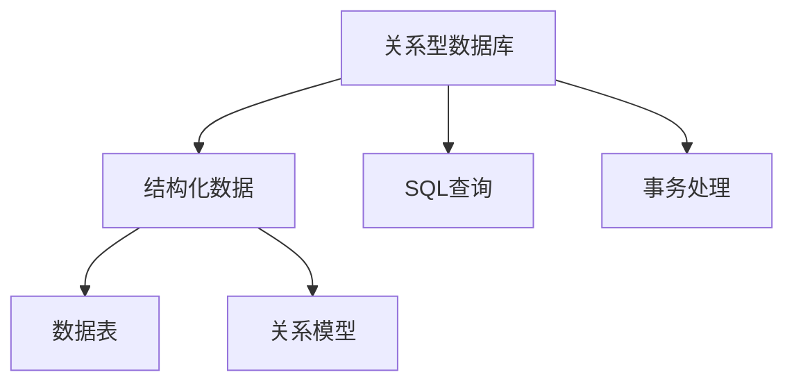

**NoSQL数据库**

Mermaid流程图：
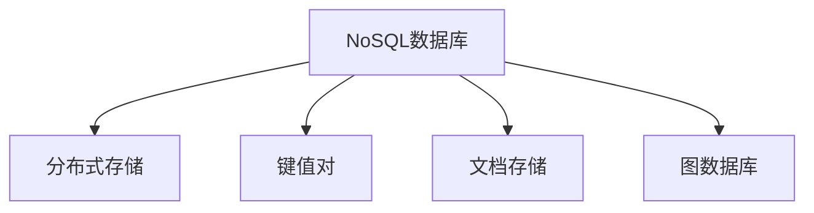

LaTeX表格描述：
```latex
\begin{tabular}{|c|c|c|}
\hline
类型 & 特点 & 用途 \\
\hline
关系型数据库 & 结构化数据 & 业务逻辑处理 \\
\hline
NoSQL数据库 & 分布式存储 & 大规模数据处理 \\
\hline
\end{tabular}
```

##### 2.2 数据格式

数据格式是数据存储和传输的方式，不同的数据格式对数据的处理和分析有着不同的影响。以下是几种常见的数据格式及其特点：

**文本格式**

Mermaid流程图：
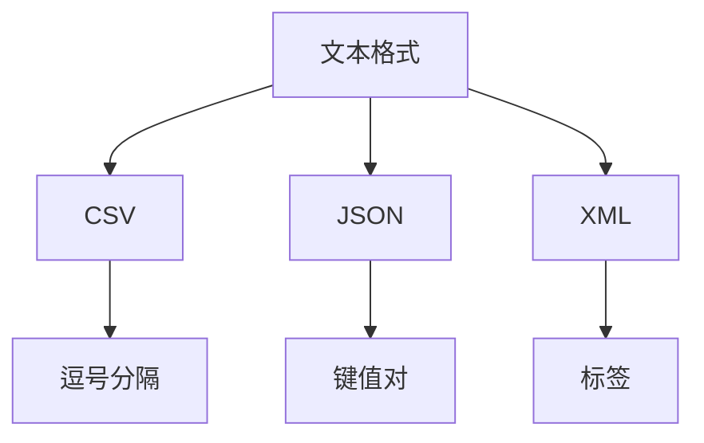

LaTeX表格描述：
```latex
\begin{tabular}{|c|c|c|}
\hline
格式 & 描述 & 用途 \\
\hline
CSV & 逗号分隔值 & 数据存储 \\
\hline
JSON & JSON对象表示语言 & 数据交换 \\
\hline
XML & 可扩展标记语言 & 数据描述 \\
\hline
\end{tabular}
```

##### 2.3 数据一致性

数据一致性是确保数据在不同源之间准确和一致的关键。以下是几种常见的数据一致性问题和解决方案：

**数据一致性问题**

Mermaid流程图：
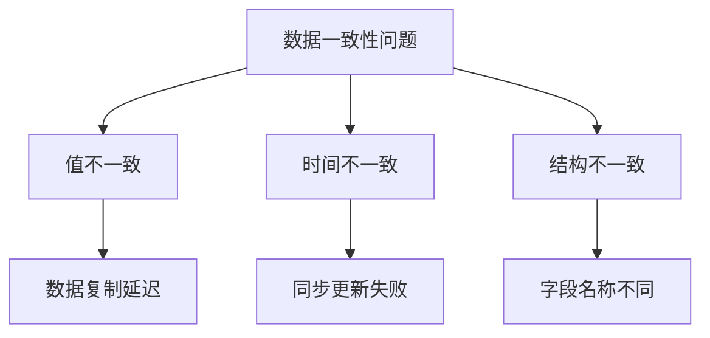

LaTeX表格描述：
```latex
\begin{tabular}{|c|c|c|}
\hline
问题 & 描述 & 解决方案 \\
\hline
值不一致 & 相同数据在不同源中值不同 & 数据校验和映射 \\
\hline
时间不一致 & 数据更新时间不一致 & 时间戳和同步机制 \\
\hline
结构不一致 & 数据结构不一致 & 数据模式管理和转换 \\
\hline
\end{tabular}
```

#### 第三部分：技术实现详细解析

在本部分，我们将详细解析数据整合的技术实现，包括ETL流程、数据映射和数据清洗，并通过代码示例和Mermaid流程图来阐述每个步骤的具体实现。

##### 3.1 ETL流程

**3.1.1 数据提取**

数据提取是从不同数据源获取数据的过程。以下是使用Python的pandas库从关系型数据库和NoSQL数据库中提取数据的示例代码：

Python代码：
```python
import pandas as pd
import pymongo

# 从关系型数据库提取数据
sql_query = "SELECT * FROM sales"
df_sql = pd.read_sql_query(sql_query, connection)

# 从NoSQL数据库提取数据
client = pymongo.MongoClient("mongodb://localhost:27017/")
db = client["example_db"]
collection = db["sales"]
df_mongo = pd.DataFrame(list(collection.find()))

# 显示数据
print(df_sql)
print(df_mongo)
```

Mermaid流程图：
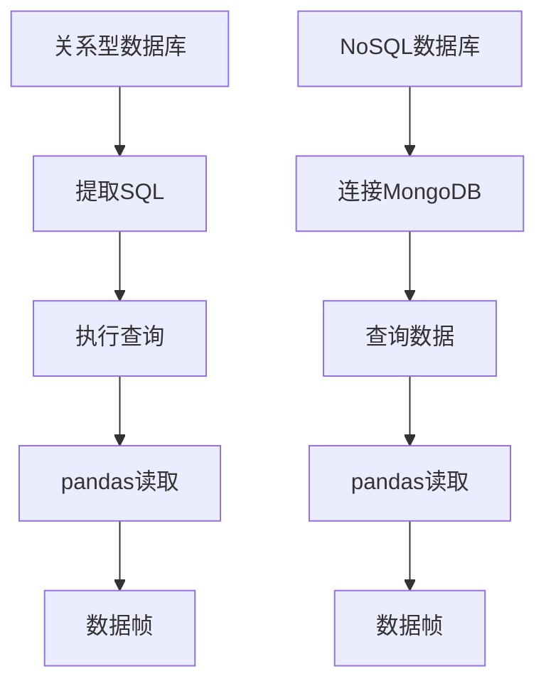

**3.1.2 数据转换**

数据转换是将提取的数据按照预定的规则进行转换的过程。以下是使用Python的pandas库进行数据转换的示例代码：

Python代码：
```python
# 数据转换示例
df_sql['sales_date'] = pd.to_datetime(df_sql['sales_date'])
df_mongo['order_date'] = pd.to_datetime(df_mongo['order_date'])

# 填充缺失值
df_sql.fillna(value={'sales_amount': 0}, inplace=True)
df_mongo.fillna(value={'order_quantity': 0}, inplace=True)

# 显示转换后的数据
print(df_sql)
print(df_mongo)
```

Mermaid流程图：
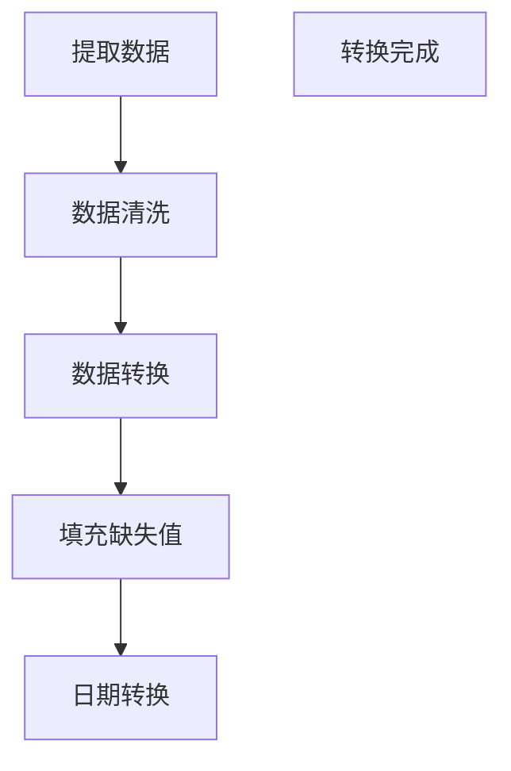

**3.1.3 数据加载**

数据加载是将转换后的数据加载到目标数据仓库或数据湖的过程。以下是使用Python的pandas库将数据加载到云数据仓库的示例代码：

Python代码：
```python
from google.cloud import bigquery

# 加载到云数据仓库
client = bigquery.Client()
table_id = "your_project.your_dataset.your_table"
job_config = bigquery.LoadJobConfig()
job_config.source_format = bigquery.SourceFormat.CSV
job_config.autodetect = True

with open('sales_data.csv', 'rb') as source_file:
    job = client.load_table_from_file(source_file, table_id, job_config=job_config)

job.result()  # 等待加载完成
print("Data loaded successfully.")
```

Mermaid流程图：
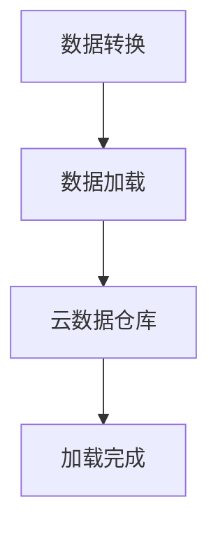

##### 3.2 数据映射

数据映射是将源数据字段映射到目标数据字段的过程。以下是使用Python的pandas库进行数据映射的示例代码：

Python代码：
```python
# 数据映射示例
mapping = {
    'sales_id': 'order_id',
    'sales_date': 'order_date',
    'sales_amount': 'order_quantity',
    'customer_id': 'customer_id'
}

df_mapped = df_sql.rename(columns=mapping)

# 显示映射后的数据
print(df_mapped)
```

Mermaid流程图：
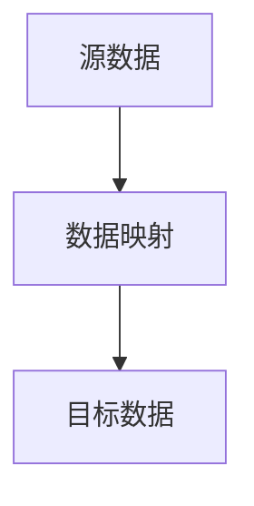

##### 3.3 数据清洗

数据清洗是去除重复数据、缺失值和错误数据的过程。以下是使用Python的pandas库进行数据清洗的示例代码：

Python代码：
```python
# 数据清洗示例
df_cleaned = df_mapped.drop_duplicates()
df_cleaned = df_cleaned.fillna(value={'order_quantity': 0})

# 检测并纠正错误数据
df_cleaned['order_quantity'] = df_cleaned['order_quantity'].astype(int)

# 显示清洗后的数据
print(df_cleaned)
```

Mermaid流程图：
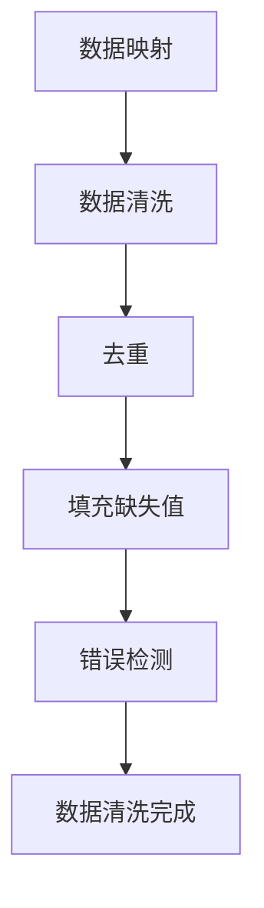

#### 第四部分：系统架构设计

在本部分，我们将探讨构建统一数据视图的系统架构设计，包括数据仓库、数据湖和数据集成，并使用Mermaid和LaTeX来描述相关的架构组件和交互。

##### 4.1 数据仓库

数据仓库是用于存储和管理大量结构化数据的系统，它是企业数据整合和数据分析的核心。以下是数据仓库的架构设计和组件描述：

**架构设计**

Mermaid流程图：
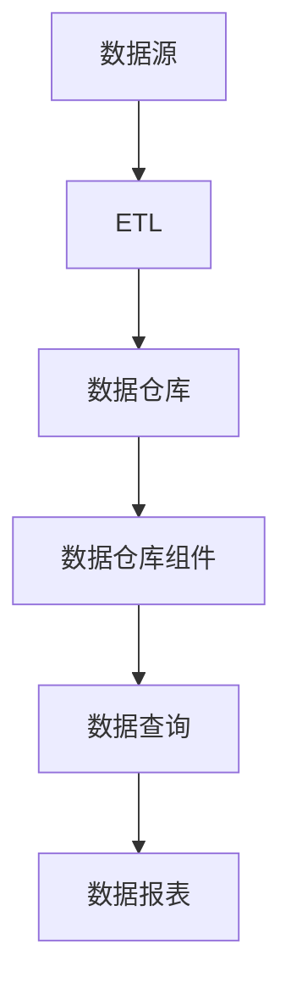

**架构组件**

LaTeX表格描述：
```latex
\begin{tabular}{|c|c|}
\hline
组件 & 描述 \\
\hline
数据源 & 数据存储的来源 \\
\hline
ETL & 提取、转换和加载数据 \\
\hline
数据仓库 & 存储和管理数据 \\
\hline
数据仓库组件 & 数据存储、计算和管理组件 \\
\hline
数据查询 & 查询和分析数据 \\
\hline
数据报表 & 数据可视化和报表 \\
\hline
\end{tabular}
```

##### 4.2 数据湖

数据湖是用于存储和管理大规模非结构化数据的系统，它是数据仓库的补充。以下是数据湖的架构设计和组件描述：

**架构设计**

Mermaid流程图：
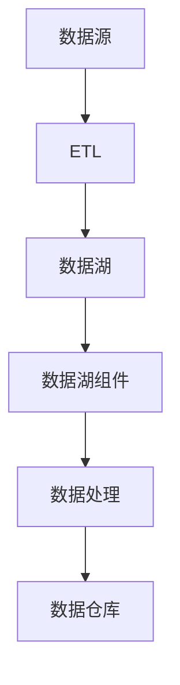

**架构组件**

LaTeX表格描述：
```latex
\begin{tabular}{|c|c|}
\hline
组件 & 描述 \\
\hline
数据源 & 数据存储的来源 \\
\hline
ETL & 提取、转换和加载数据 \\
\hline
数据湖 & 存储和管理数据 \\
\hline
数据湖组件 & 数据存储、计算和管理组件 \\
\hline
数据处理 & 数据处理和转换 \\
\hline
数据仓库 & 存储和管理数据 \\
\hline
\end{tabular}
```

##### 4.3 数据集成

数据集成是将不同数据源的数据整合到一起的过程，它是实现统一数据视图的关键。以下是数据集成的架构设计和组件描述：

**架构设计**

Mermaid流程图：
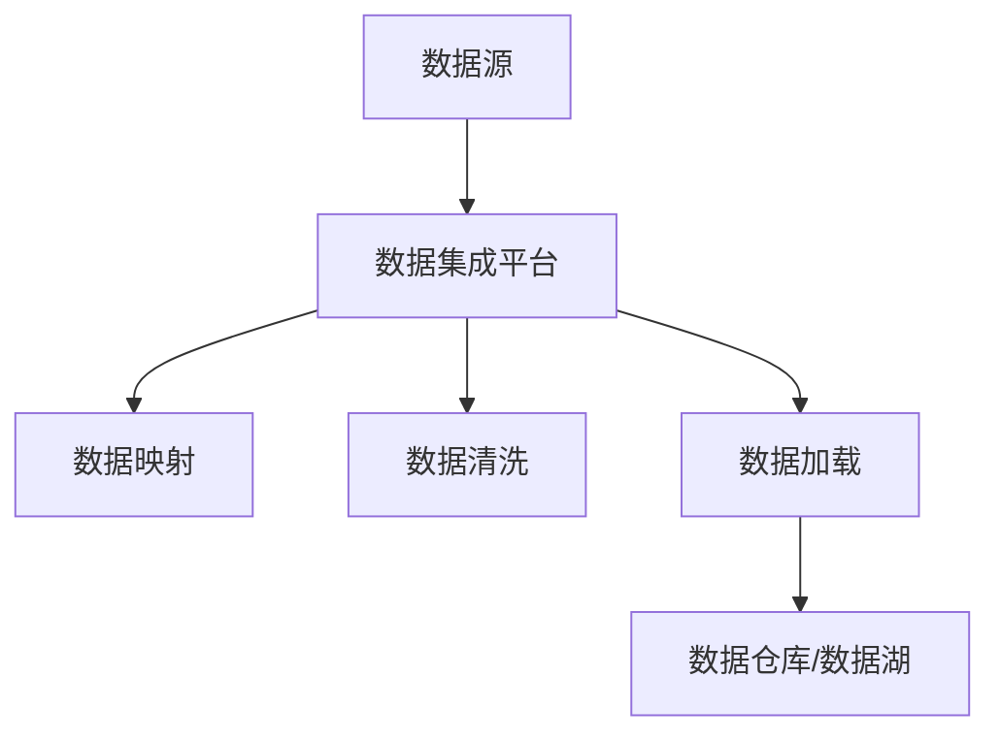

**架构组件**

LaTeX表格描述：
```latex
\begin{tabular}{|c|c|}
\hline
组件 & 描述 \\
\hline
数据源 & 数据存储的来源 \\
\hline
数据集成平台 & 整合不同数据源 \\
\hline
数据映射 & 字段映射和转换 \\
\hline
数据清洗 & 清洗和去重 \\
\hline
数据加载 & 加载到目标存储 \\
\hline
数据仓库/数据湖 & 数据存储 \\
\hline
\end{tabular}
```

#### 第五部分：案例研究

在本部分，我们将通过具体案例来展示如何在实际企业中实现异构数据整合，并分析其成功的关键因素。

##### 5.1 案例一：企业A的异构数据整合实践

**背景**

企业A是一家大型零售企业，拥有多个业务部门，包括销售、采购、物流和客户服务。这些部门使用不同的数据系统，如关系型数据库、NoSQL数据库、ERP系统和CRM系统。由于数据系统的不统一，企业面临着数据分散、不一致和难以整合的问题。

**目标**

企业A的目标是构建一个统一的数据视图，实现数据的集中管理和高效分析，以支持企业的决策和运营优化。

**解决方案**

1. **数据集成平台**：企业A选择了Apache NiFi作为数据集成平台，用于整合不同数据源的数据。
2. **数据映射**：使用Apache NiFi的规则引擎，定义了数据映射规则，将不同数据源的字段映射到统一的数据模型。
3. **数据清洗**：使用Apache NiFi的数据清洗组件，去除重复数据、填充缺失值和纠正错误数据。
4. **数据加载**：将清洗后的数据加载到数据仓库（如Amazon Redshift）和数据湖（如Amazon S3）中。

**结果**

通过实施上述解决方案，企业A成功实现了数据的集中整合，构建了一个统一的数据视图。数据的一致性和可用性得到了显著提高，数据分析和报告的效率也得到了大幅提升。此外，企业A还实现了数据治理，确保了数据的合规性和安全性。

**关键因素**

1. **数据集成平台的选择**：选择合适的数据集成平台是成功的关键，需要考虑平台的易用性、可扩展性和社区支持。
2. **数据映射规则的定义**：明确的数据映射规则是确保数据一致性的基础。
3. **数据清洗过程的优化**：有效的数据清洗可以确保数据的质量和准确性。
4. **数据仓库和数据湖的构建**：合理的数据存储架构可以支持高效的数据查询和分析。

##### 5.2 案例二：企业B的统一数据视图构建

**背景**

企业B是一家金融服务公司，其业务涵盖银行、保险和投资等领域。由于业务的多样性和复杂性，企业B面临着大量的异构数据，包括结构化数据、半结构化数据和非结构化数据。

**目标**

企业B的目标是构建一个统一的金融数据视图，实现跨业务部门的数据整合和分析，以提高业务决策的准确性和效率。

**解决方案**

1. **大数据平台**：企业B选择了Hadoop和Spark作为大数据平台，用于存储和管理大规模的异构数据。
2. **数据湖**：使用Apache HDFS和Amazon S3构建了一个分布式数据湖，用于存储非结构化和半结构化数据。
3. **数据仓库**：使用Amazon Redshift和数据仓库工具，如Tableau和Power BI，用于存储和管理结构化数据。
4. **数据集成**：使用Apache Kafka和Apache NiFi实现数据的实时集成和批处理。

**结果**

通过实施上述解决方案，企业B成功构建了一个统一的数据视图，实现了跨业务部门的数据整合和分析。数据的一致性和可用性得到了显著提高，数据分析和报告的效率也得到了大幅提升。此外，企业B还实现了数据治理，确保了数据的合规性和安全性。

**关键因素**

1. **大数据平台的选择**：选择合适的大数据平台是成功的关键，需要考虑平台的处理能力和可扩展性。
2. **数据湖和数据仓库的构建**：合理的数据存储架构可以支持高效的数据查询和分析。
3. **数据集成和实时处理**：有效的数据集成和实时处理可以确保数据的一致性和实时性。
4. **数据治理**：完善的数据治理机制可以确保数据的合规性和安全性。

#### 第六部分：最佳实践

在本部分，我们将分享一些成功的异构数据整合实践经验和技巧，为企业提供参考。

##### 6.1 成功案例分析

**1. 选择合适的数据集成工具**：根据企业的需求和数据特点，选择合适的数据集成工具，如Apache NiFi、Apache Kafka、Apache Flink等。

**2. 定义明确的数据映射规则**：明确的数据映射规则是确保数据一致性的基础，需要详细定义数据源和目标数据之间的映射关系。

**3. 优化数据清洗过程**：数据清洗是确保数据质量的关键步骤，需要优化清洗算法和流程，提高数据清洗的效率和准确性。

**4. 建立数据治理机制**：建立完善的数据治理机制，确保数据的合规性和安全性，如数据访问权限管理、数据备份和恢复等。

##### 6.2 实践技巧分享

**1. 数据分层存储**：根据数据的结构和用途，采用分层存储策略，将结构化数据存储在数据仓库中，非结构化数据存储在数据湖中。

**2. 实现实时数据处理**：对于需要实时分析的数据，采用实时数据处理技术，如Apache Kafka、Apache Flink等，实现数据的实时传输和处理。

**3. 数据质量管理**：建立数据质量管理机制，定期对数据进行质量检查和评估，确保数据的一致性和准确性。

**4. 数据安全保护**：重视数据安全保护，采用加密、访问控制等技术，确保数据在传输和存储过程中的安全性。

#### 总结

企业级异构数据整合是一项复杂而重要的任务，对于企业的数字化转型具有重要意义。本文从背景介绍、核心概念、技术实现、系统架构设计、案例研究和最佳实践等多个角度，深入探讨了企业级异构数据整合的方法和实践。通过本文的讨论，我们可以看到，成功的数据整合离不开合适的数据集成工具、明确的数据映射规则、高效的数据清洗过程和完善的

