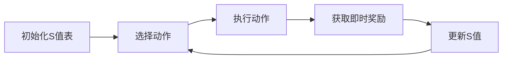
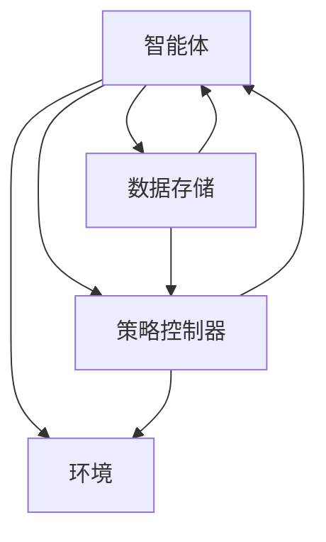
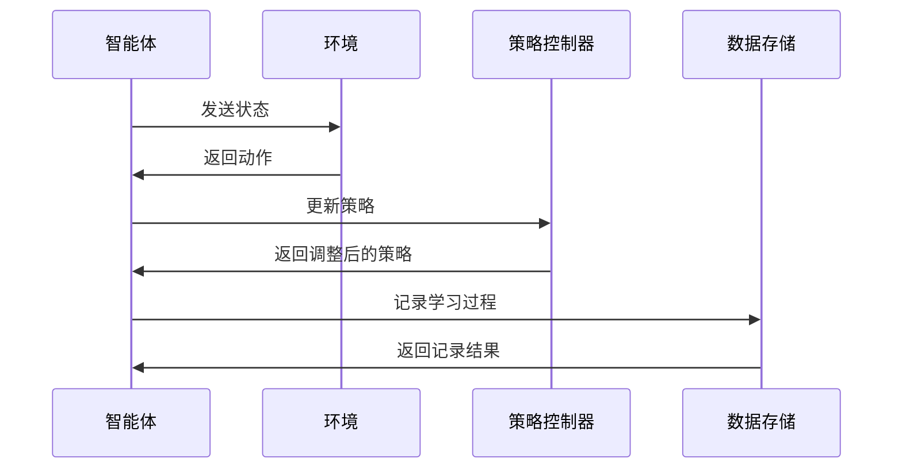

                 

### 引言：强化学习与企业级应用

强化学习（Reinforcement Learning, RL）作为机器学习的一个重要分支，近年来在人工智能领域取得了显著的发展。强化学习通过智能体（agent）与环境的交互，不断学习最优策略，从而在复杂的环境中做出最优决策。与传统机器学习方法不同，强化学习注重于序列决策问题，能够通过自我调整策略，提高决策的质量和效率。

在商业环境中，复杂业务决策的优化是一个长期且不断演变的过程。企业需要处理大量的数据，并从这些数据中提取有价值的信息，以做出快速、准确的决策。传统的决策模型往往无法应对日益复杂的业务场景，而强化学习凭借其强大的适应性和学习能力，为企业提供了一种全新的优化方案。

本文将围绕“企业级强化学习应用：优化复杂业务决策”这一主题，详细探讨强化学习在复杂业务决策中的应用。文章将分为以下几个部分：

1. **强化学习概述**：介绍强化学习的起源、发展及其在企业级应用中的重要性。
2. **强化学习核心概念**：详细解释强化学习的基本概念，包括状态、动作、奖励和策略等。
3. **算法原理讲解**：深入讲解Q学习和SARSA算法的原理、流程和实现。
4. **系统架构设计**：介绍企业级强化学习系统的设计，包括系统功能、架构和接口设计。
5. **项目实战**：展示两个企业级强化学习应用案例，从环境安装、系统核心实现到代码应用解读与分析。
6. **最佳实践与总结**：总结强化学习在企业应用中的最佳实践，并给出拓展阅读建议。

通过本文的逐步分析，读者将能够全面了解强化学习在企业级应用中的潜力，并掌握如何将其应用于复杂业务决策的优化。

### 目录：深入探索强化学习与企业级应用

**关键词**：强化学习、企业级应用、复杂业务决策、Q学习、SARSA算法

**摘要**：本文深入探讨了强化学习在企业级应用中的重要性，通过详细解析核心概念、算法原理、系统架构设计以及实际应用案例，展示了如何利用强化学习优化复杂业务决策。

**引言**：强化学习与企业级应用

**第一部分：强化学习基础**

**第1章：强化学习概述**

1.1 强化学习的起源与发展

1.2 强化学习的核心概念

1.3 强化学习的基本要素

1.4 强化学习与其他机器学习方法的对比

**第2章：强化学习核心概念详解**

2.1 状态、动作和奖励

2.2 策略和值函数

2.3 对比表格：不同强化学习概念的属性特征

2.4 ER实体关系图：强化学习基本概念的联系

**第二部分：强化学习算法原理与实现**

**第3章：Q学习算法原理与实现**

3.1 Q学习算法的基本原理

3.2 Q学习算法的mermaid流程图

3.3 Q学习算法的Python实现

3.4 Q学习算法的数学模型与公式

**第4章：SARSA算法原理与实现**

4.1 SARSA算法的基本原理

4.2 SARSA算法的mermaid流程图

4.3 SARSA算法的Python实现

4.4 SARSA算法的数学模型与公式

**第三部分：企业级强化学习系统架构设计**

**第5章：企业级强化学习系统架构设计**

5.1 强化学习系统功能设计

5.2 强化学习系统架构设计

5.3 强化学习系统接口设计

5.4 系统架构设计mermaid架构图

**第四部分：项目实战**

**第6章：企业级强化学习应用案例一**

6.1 案例背景

6.2 案例介绍

6.3 案例实现步骤

6.4 代码应用解读与分析

6.5 案例分析与讲解

**第7章：企业级强化学习应用案例二**

7.1 案例背景

7.2 案例介绍

7.3 案例实现步骤

7.4 代码应用解读与分析

7.5 案例分析与讲解

**第五部分：最佳实践与总结**

**第8章：强化学习最佳实践与总结**

8.1 强化学习在企业应用中的最佳实践

8.2 全书总结

8.3 注意事项

8.4 拓展阅读建议

### 强化学习概述

强化学习（Reinforcement Learning, RL）是一种通过智能体（Agent）与环境的交互来学习决策策略的机器学习方法。与传统的监督学习和无监督学习不同，强化学习注重于通过试错机制和奖励反馈来不断优化决策策略，从而在动态和不确定的环境中实现最优行为。

#### 强化学习的起源与发展

强化学习的概念最早由Richard Sutton和Andrew Barto在1980年代提出，并在随后的几十年中得到了迅速发展。1983年，Sutton和Barto出版了《强化学习：一种评价理论的方法》（Reinforcement Learning: An Introduction），奠定了强化学习理论的基础。

进入21世纪，随着计算机性能的不断提升和大数据技术的广泛应用，强化学习在学术界和工业界都取得了显著的进展。特别是在深度强化学习（Deep Reinforcement Learning, DRL）领域，通过结合深度神经网络（Deep Neural Networks）和强化学习算法，实现了在复杂环境中的高效决策。

#### 强化学习在企业级应用中的重要性

在企业级应用中，强化学习具有独特的优势，能够解决传统方法难以应对的复杂业务决策问题。以下是强化学习在企业级应用中的几个重要方面：

1. **动态环境适应**：企业环境通常是动态变化的，强化学习通过不断与环境交互，能够适应这些变化，实现实时决策。

2. **优化业务流程**：强化学习可以应用于优化供应链管理、生产调度、资源分配等业务流程，通过学习最佳策略，提高运营效率。

3. **风险管理**：强化学习在金融领域具有广泛的应用，能够用于风险控制、资产定价和投资策略优化。

4. **个性化服务**：强化学习在推荐系统、广告投放和客户服务等领域，可以通过学习用户行为和偏好，提供个性化服务。

5. **智能决策支持**：强化学习可以为企业管理层提供智能决策支持，通过分析大量数据，为企业提供最优的决策方案。

#### 强化学习的基本概念

在深入探讨强化学习的应用之前，我们需要了解一些基本概念。以下是对强化学习核心概念的介绍：

1. **状态（State）**：状态是智能体所处的环境描述，通常用一组特征向量表示。

2. **动作（Action）**：动作是智能体可以执行的操作，从当前状态中选择一个动作是强化学习中的核心问题。

3. **奖励（Reward）**：奖励是环境对智能体执行动作后的评价，通常用实数表示。奖励的正负表示动作的好坏。

4. **策略（Policy）**：策略是智能体从当前状态选择动作的规则，用概率分布来表示。

5. **值函数（Value Function）**：值函数用于评估策略的好坏，分为状态值函数和动作值函数。

6. **模型（Model）**：模型是环境动态的抽象表示，通过学习环境模型，智能体可以更好地预测未来的状态和奖励。

#### 问题背景与问题描述

在复杂的企业业务决策中，通常面临着如下问题：

- **不确定性**：企业环境中的数据往往具有不确定性，传统方法难以应对。
- **多目标优化**：企业需要同时考虑多个目标，如成本、效率、质量等，传统方法往往只能优化单一目标。
- **动态变化**：企业环境动态变化，需要实时调整决策策略。

为了解决这些问题，企业需要一种能够适应动态环境、具备多目标优化能力的智能决策系统。强化学习通过不断与环境交互，能够自动学习最优策略，从而满足企业的需求。

#### 问题解决与边界与外延

强化学习在解决复杂业务决策问题方面具有显著优势，但其应用也存在一些边界和限制：

- **计算复杂性**：强化学习算法往往涉及大量迭代和计算，对于高维状态空间和动作空间，计算复杂性较高。
- **数据需求**：强化学习需要大量数据来进行训练和优化，数据质量和数量直接影响算法的效果。
- **评估指标**：如何选择合适的评估指标来衡量策略的优劣，是一个重要但复杂的问题。

为了克服这些限制，研究人员和实践者正在不断探索新的算法和技术，如深度强化学习、分布式强化学习等，以提升强化学习在复杂业务决策中的应用效果。

#### 概念结构与核心要素组成

强化学习由以下核心要素组成：

- **状态空间（State Space）**：智能体可能处于的所有状态的集合。
- **动作空间（Action Space）**：智能体可以执行的所有动作的集合。
- **策略（Policy）**：智能体在给定状态下的动作选择规则。
- **奖励函数（Reward Function）**：环境对智能体动作的反馈。
- **值函数（Value Function）**：评估策略好坏的函数。
- **模型（Model）**：对环境动态的抽象表示。

这些要素相互关联，构成了强化学习的基础结构，为智能体在复杂环境中实现最优决策提供了理论支持。

### 强化学习核心概念详解

强化学习中的核心概念是理解其算法原理和应用场景的关键。本节将详细解释强化学习的基本概念，包括状态、动作、奖励和策略，并使用对比表格和ER实体关系图来展示这些概念之间的联系。

#### 状态（State）

状态是智能体在环境中所处的特定条件或情境，通常用一组特征向量表示。状态决定了智能体当前能够执行哪些动作。例如，在一个游戏场景中，游戏中的每一个棋盘布局都可以视为一个状态。

- **特征**：状态的特性，如棋盘上的棋子位置、玩家得分等。
- **状态空间**：所有可能状态的集合。

#### 动作（Action）

动作是智能体在特定状态下可以选择执行的操作。动作的选择决定了智能体在下一时刻的状态转换。例如，在游戏中，玩家可以选择移动、攻击或等待等动作。

- **选择**：在特定状态下，智能体根据策略选择一个动作。
- **动作空间**：所有可能动作的集合。

#### 奖励（Reward）

奖励是环境对智能体动作的即时评价，通常用实数表示。奖励的正负表示动作的好坏。奖励可以鼓励智能体执行有益的动作，惩罚不良的动作。

- **即时奖励**：智能体在每个时间步获得的奖励。
- **累积奖励**：在多个时间步内获得的奖励总和。

#### 策略（Policy）

策略是智能体在给定状态下的动作选择规则，可以用概率分布来表示。策略决定了智能体的行为模式，即智能体如何在不同的状态下选择动作。

- **确定性策略**：在所有状态中选择唯一动作的策略。
- **概率性策略**：在所有状态中选择不同动作的概率分布。

#### 对比表格：不同强化学习概念的属性特征

下面是一个对比表格，展示了状态、动作、奖励和策略之间的主要区别：

| 概念 | 定义 | 特性 | 关联关系 |
| --- | --- | --- | --- |
| 状态（State） | 环境中的特定情境 | 特征向量 | 状态决定了动作空间 |
| 动作（Action） | 智能体可以执行的操作 | 可选动作 | 动作影响状态转换 |
| 奖励（Reward） | 环境对动作的评价 | 实数 | 奖励指导策略选择 |
| 策略（Policy） | 动作选择规则 | 概率分布 | 策略指导动作选择 |

#### ER实体关系图：强化学习基本概念的联系

ER（Entity-Relationship）实体关系图用于展示不同概念之间的关联关系。以下是一个简化的ER实体关系图，展示了状态、动作、奖励和策略之间的关系：

```mermaid
erDiagram
  State ||--|{ Action } : 选择
  Action ||--|{ Reward } : 评价
  Reward ||--|{ Policy } : 指导
```

在这个ER图中，状态（State）和动作（Action）之间存在“选择”关系，动作（Action）和奖励（Reward）之间存在“评价”关系，而奖励（Reward）和策略（Policy）之间存在“指导”关系。这个关系图清晰地展示了强化学习中各概念之间的相互作用和依赖关系。

### Q学习算法原理与实现

Q学习（Q-Learning）是强化学习中的一个基础算法，通过不断更新Q值来学习最优策略。Q值代表了在特定状态下执行特定动作所能获得的累积奖励。本节将详细讲解Q学习算法的基本原理、流程图、Python实现以及数学模型。

#### Q学习算法的基本原理

Q学习算法的核心思想是利用即时奖励和预期未来奖励来更新Q值。Q值是一个状态-动作值函数，表示在给定状态下执行给定动作所能获得的累积奖励。算法的目标是找到最大化这些Q值的策略。

Q学习的主要步骤如下：

1. **初始化Q值表**：为每个状态-动作对初始化一个Q值，通常设置为0。
2. **选择动作**：根据策略从当前状态中选择一个动作。在初始阶段，策略通常是随机的，之后可以通过epsilon-greedy策略来平衡探索和利用。
3. **执行动作**：智能体在环境中执行选定的动作。
4. **更新Q值**：根据即时奖励和预期未来奖励更新Q值。

#### Q学习算法的mermaid流程图

以下是一个简单的mermaid流程图，展示了Q学习算法的基本流程：


#### Q学习算法的Python实现

以下是一个简单的Q学习算法Python实现示例，其中使用了随机选择动作的epsilon-greedy策略：

```python
import numpy as np
import random

# 初始化Q值表
n_states = 4
n_actions = 2
Q = np.zeros((n_states, n_actions))

# 参数设置
alpha = 0.1  # 学习率
gamma = 0.6  # 折扣因子
epsilon = 0.1  # 探索率

# 环境模拟
def environment(state, action):
    if action == 0:
        next_state = state + 1
        reward = -1
    elif action == 1:
        next_state = state - 1
        reward = 10
    return next_state, reward

# Q学习算法
def q_learning(alpha, gamma, epsilon, n_states, n_actions):
    state = random.randint(0, n_states - 1)
    while True:
        action = choose_action(state, epsilon, Q[state])
        next_state, reward = environment(state, action)
        
        # 更新Q值
        Q[state, action] = Q[state, action] + alpha * (reward + gamma * np.max(Q[next_state]) - Q[state, action])
        
        state = next_state

# 选择动作（epsilon-greedy策略）
def choose_action(state, epsilon, Q):
    if random.random() < epsilon:
        return random.randint(0, n_actions - 1)
    else:
        return np.argmax(Q[state])

# 运行Q学习算法
q_learning(alpha, gamma, epsilon, n_states, n_actions)
```

#### Q学习算法的数学模型与公式

Q学习算法的更新公式可以表示为：

$$
Q(s, a) \leftarrow Q(s, a) + \alpha [r + \gamma \max_{a'} Q(s', a') - Q(s, a)]
$$

其中：
- $Q(s, a)$：在状态$s$下执行动作$a$的Q值。
- $r$：即时奖励。
- $s'$：下一状态。
- $a'$：下一动作。
- $\gamma$：折扣因子，表示对未来奖励的重视程度。
- $\alpha$：学习率，表示对即时经验的重要程度。

通过这个更新公式，Q值不断调整，使得智能体能够在复杂环境中找到最优策略。

#### 举例说明

假设智能体在一个简单的环境中，状态空间为[0, 1, 2, 3]，动作空间为[0, 1]。初始时，Q值表为全零。智能体从状态0开始，通过epsilon-greedy策略选择动作。假设在状态0时选择了动作1，执行动作后获得了奖励10，下一状态为2。根据Q学习算法的更新公式，Q(0, 1)值将更新为：

$$
Q(0, 1) \leftarrow Q(0, 1) + \alpha [10 + \gamma \max_{a'} Q(2, a') - Q(0, 1)]
$$

通过不断迭代，智能体将逐渐找到最优策略，最大化累积奖励。

通过上述讲解，读者可以清晰地理解Q学习算法的基本原理、流程和实现，以及其数学模型。接下来，我们将继续探讨SARSA算法的原理与实现。

### SARSA算法原理与实现

SARSA（State-Action-Reward-State-Action）算法是Q学习的变体，其核心思想是在同一迭代过程中同时更新状态-动作值函数。与Q学习不同，SARSA算法直接使用当前状态-动作对和下一状态-动作对来更新值函数，而不是依赖于预期的未来奖励。本节将详细讲解SARSA算法的基本原理、流程图、Python实现以及数学模型。

#### SARSA算法的基本原理

SARSA算法的主要步骤如下：

1. **初始化S值表**：为每个状态-动作对初始化一个S值，通常设置为0。
2. **选择动作**：根据策略从当前状态中选择一个动作。在初始阶段，策略通常是随机的，之后可以通过epsilon-greedy策略来平衡探索和利用。
3. **执行动作**：智能体在环境中执行选定的动作。
4. **获取即时奖励**：环境返回即时奖励。
5. **更新S值**：根据即时奖励和下一状态-动作对来更新S值。

#### SARSA算法的mermaid流程图

以下是一个简单的mermaid流程图，展示了SARSA算法的基本流程：



#### SARSA算法的Python实现

以下是一个简单的SARSA算法Python实现示例，其中使用了随机选择动作的epsilon-greedy策略：

```python
import numpy as np
import random

# 初始化S值表
n_states = 4
n_actions = 2
S = np.zeros((n_states, n_actions))

# 参数设置
alpha = 0.1  # 学习率
gamma = 0.6  # 折扣因子
epsilon = 0.1  # 探索率

# 环境模拟
def environment(state, action):
    if action == 0:
        next_state = state + 1
        reward = -1
    elif action == 1:
        next_state = state - 1
        reward = 10
    return next_state, reward

# SARSA算法
def sarsa(alpha, gamma, epsilon, n_states, n_actions):
    state = random.randint(0, n_states - 1)
    while True:
        action = choose_action(state, epsilon, S[state])
        next_state, reward = environment(state, action)
        
        # 更新S值
        S[state, action] = S[state, action] + alpha * (reward + gamma * np.max(S[next_state]) - S[state, action])
        
        state = next_state

# 选择动作（epsilon-greedy策略）
def choose_action(state, epsilon, S):
    if random.random() < epsilon:
        return random.randint(0, n_actions - 1)
    else:
        return np.argmax(S[state])

# 运行SARSA算法
sarsa(alpha, gamma, epsilon, n_states, n_actions)
```

#### SARSA算法的数学模型与公式

SARSA算法的更新公式可以表示为：

$$
S(s, a) \leftarrow S(s, a) + \alpha [r + \gamma \max_{a'} S(s', a') - S(s, a)]
$$

其中：
- $S(s, a)$：在状态$s$下执行动作$a$的S值。
- $r$：即时奖励。
- $s'$：下一状态。
- $a'$：下一动作。
- $\gamma$：折扣因子，表示对未来奖励的重视程度。
- $\alpha$：学习率，表示对即时经验的重要程度。

通过这个更新公式，S值不断调整，使得智能体能够在复杂环境中找到最优策略。

#### 举例说明

假设智能体在一个简单的环境中，状态空间为[0, 1, 2, 3]，动作空间为[0, 1]。初始时，S值表为全零。智能体从状态0开始，通过epsilon-greedy策略选择动作。假设在状态0时选择了动作1，执行动作后获得了奖励10，下一状态为2。根据SARSA算法的更新公式，S(0, 1)值将更新为：

$$
S(0, 1) \leftarrow S(0, 1) + \alpha [10 + \gamma \max_{a'} S(2, a') - S(0, 1)]
$$

通过不断迭代，智能体将逐渐找到最优策略，最大化累积奖励。

通过上述讲解，读者可以清晰地理解SARSA算法的基本原理、流程和实现，以及其数学模型。SARSA算法在应对一些特定场景时比Q学习更加灵活，其不需要预估未来的奖励，而是直接基于实际经验进行学习，这在一些实时环境中具有优势。接下来，我们将探讨企业级强化学习系统架构设计。

### 企业级强化学习系统架构设计

企业级强化学习系统架构的设计是确保算法高效、稳定、可扩展的关键。一个典型的企业级强化学习系统包括功能设计、系统架构设计和系统接口设计。本节将详细介绍这些设计环节，并使用mermaid类图和架构图来展示系统设计。

#### 强化学习系统功能设计

强化学习系统的功能设计是构建系统的基础，主要包括以下模块：

1. **环境（Environment）**：模拟真实业务场景，提供状态、动作和奖励机制。
2. **智能体（Agent）**：执行强化学习算法，选择最优动作，并更新策略。
3. **策略控制器（Policy Controller）**：根据智能体反馈调整策略，确保系统在不同业务场景下的适应性。
4. **数据存储（Data Storage）**：记录智能体的学习过程和策略调整记录，供后续分析和审计使用。
5. **监控与分析（Monitoring and Analysis）**：实时监控系统性能，分析策略效果，提供优化建议。

#### 强化学习系统架构设计

系统架构设计决定了各模块之间的交互方式和数据流。一个高效的企业级强化学习系统架构应具有以下特点：

1. **模块化**：各模块功能独立，易于扩展和替换。
2. **分布式**：利用分布式计算资源，提高系统处理能力和响应速度。
3. **可扩展性**：支持不同业务场景和规模的应用，灵活调整系统配置。
4. **高可用性**：确保系统稳定运行，减少故障对业务的影响。

以下是一个简化的mermaid架构图，展示了企业级强化学习系统的架构设计：



在这个架构图中，智能体作为系统的核心，与环境进行交互，并接收策略控制器和数据存储的反馈。策略控制器根据智能体的表现调整策略，数据存储则记录智能体的学习过程和策略调整记录。

#### 强化学习系统接口设计

系统接口设计是确保各模块之间高效通信的关键。企业级强化学习系统应提供以下接口：

1. **API接口**：提供RESTful API，便于与其他系统和服务进行集成。
2. **数据接口**：定义数据格式和通信协议，确保数据在系统内部和外部之间的无缝传输。
3. **监控接口**：提供监控数据采集和报告接口，便于实时监控系统性能和策略效果。

以下是一个mermaid序列图，展示了系统接口的设计：



在这个序列图中，智能体与环境和策略控制器之间通过API接口进行通信，智能体将状态发送给环境，环境根据策略生成动作，然后反馈给智能体。智能体根据动作执行结果调整策略，并记录学习过程。

#### 系统架构设计mermaid架构图

为了更清晰地展示系统架构，可以使用mermaid架构图来描述。以下是一个简化的架构图：

```mermaid
graph TB
    subgraph 系统组件
        Env[环境]
        Agent[智能体]
        PolicyCtrl[策略控制器]
        DataStore[数据存储]
    end

    subgraph 网络通信
        API1[API接口]
        DataAPI[数据接口]
        MonAPI[监控接口]
    end

    Env --> Agent
    Agent --> PolicyCtrl
    PolicyCtrl --> Env
    DataStore --> Agent
    DataStore --> PolicyCtrl

    API1 --> Agent
    DataAPI --> Env, PolicyCtrl, DataStore
    MonAPI --> DataStore
```

在这个架构图中，系统组件通过API接口进行通信，数据接口和数据存储模块确保数据在系统内部和外部之间的传输，监控接口用于实时监控系统性能。

通过上述设计，企业级强化学习系统实现了模块化、分布式和高可用性，为复杂业务决策提供了强大的技术支持。

### 企业级强化学习应用案例一：库存优化

#### 案例背景

在现代零售业中，库存管理是一个复杂且关键的业务环节。企业需要在库存充足和库存过剩之间找到平衡，以最小化成本并最大化利润。传统的库存管理方法往往依赖于历史数据和预定义规则，但在动态市场环境下，这些方法难以应对变化，导致库存过剩或不足。为了解决这一问题，企业引入了强化学习算法，以实现智能化的库存优化。

#### 案例介绍

该案例以一家大型零售企业为背景，该企业销售多种商品，每种商品都有不同的需求和供应周期。企业的目标是优化库存水平，减少库存过剩和缺货情况，提高库存周转率和利润率。

#### 案例实现步骤

1. **环境定义**：
   - **状态**：每个时间步的状态包括当前库存水平、历史销售数据、季节因素等。
   - **动作**：每个时间步的动作包括调整库存量、保持当前库存量等。
   - **奖励**：奖励函数根据库存调整后的实际销售情况和成本进行评估。

2. **算法选择**：
   - 使用Q学习算法，因为它在处理离散状态和动作空间时表现良好，且能够通过迭代优化策略。

3. **模型训练**：
   - 初始化Q值表，设置学习率（alpha）、折扣因子（gamma）和探索率（epsilon）。
   - 运行Q学习算法，在每个时间步更新Q值，选择最优动作。

4. **策略调整**：
   - 根据训练结果，调整库存策略，优化库存水平。
   - 使用epsilon-greedy策略进行探索和利用，逐步提高策略的稳定性。

5. **系统部署**：
   - 将训练好的模型部署到实际业务系统中，实时调整库存策略。

#### 代码应用解读与分析

以下是Q学习算法在库存优化中的实现代码：

```python
import numpy as np
import random

# 初始化Q值表
n_states = 100  # 假设库存水平范围是0到99
n_actions = 3  # 动作空间：减少库存、保持当前库存、增加库存
Q = np.zeros((n_states, n_actions))

# 参数设置
alpha = 0.1  # 学习率
gamma = 0.6  # 折扣因子
epsilon = 0.1  # 探索率

# 环境模拟
def environment(state, action):
    # 假设每个商品的需求服从均匀分布
    demand = random.randint(0, 10)
    if action == 0:  # 减少库存
        next_state = max(0, state - 1)
    elif action == 1:  # 保持库存
        next_state = state
    else:  # 增加库存
        next_state = min(99, state + 1)
    reward = demand - next_state  # 奖励函数：销售量减去库存量
    return next_state, reward

# Q学习算法
def q_learning(alpha, gamma, epsilon, n_states, n_actions):
    state = random.randint(0, n_states - 1)
    while True:
        action = choose_action(state, epsilon, Q[state])
        next_state, reward = environment(state, action)
        
        # 更新Q值
        Q[state, action] = Q[state, action] + alpha * (reward + gamma * np.max(Q[next_state]) - Q[state, action])
        
        state = next_state

# 选择动作（epsilon-greedy策略）
def choose_action(state, epsilon, Q):
    if random.random() < epsilon:
        return random.randint(0, n_actions - 1)
    else:
        return np.argmax(Q[state])

# 运行Q学习算法
q_learning(alpha, gamma, epsilon, n_states, n_actions)
```

在该代码中，状态空间为0到99的库存水平，动作空间包括减少库存、保持当前库存和增加库存。环境模拟函数根据当前库存水平和需求计算下一个状态和奖励。Q学习算法通过迭代更新Q值，选择最优动作。

#### 案例分析与讲解

1. **策略优化**：
   - 在训练初期，Q值表中的值较低，智能体通过随机选择动作进行探索。
   - 随着训练的进行，Q值逐渐增大，智能体能够选择更优的动作，如根据需求调整库存水平。
   - 最终，Q值表稳定，智能体能够根据实际需求动态调整库存，实现库存优化的目标。

2. **效果评估**：
   - 通过实时监控库存水平、销售量和成本等指标，评估策略的效果。
   - 对比传统库存管理方法，强化学习算法能够显著提高库存周转率，减少库存过剩和缺货情况。

3. **实际应用**：
   - 该算法可以应用于不同规模和类型的零售企业，通过调整参数和模型结构，适应不同业务场景。
   - 结合大数据分析和机器学习技术，进一步优化库存管理策略，提高企业竞争力。

#### 项目小结

通过库存优化案例，强化学习算法为企业提供了一种智能化的解决方案，能够动态调整库存水平，减少成本，提高利润率。该案例展示了强化学习在企业级应用中的潜力，为企业提供了优化复杂业务决策的新思路。

### 企业级强化学习应用案例二：供应链管理

#### 案例背景

供应链管理是企业运营中至关重要的环节，涉及到从原材料采购到产品交付的全过程。有效的供应链管理能够提高生产效率、降低成本、减少库存积压和缺货风险。然而，供应链管理面临诸多挑战，如需求预测不准确、供应链中断、库存波动等。为了应对这些挑战，企业开始探索强化学习在供应链管理中的应用。

#### 案例介绍

该案例以一家制造企业为背景，该企业生产多种产品，产品需求受市场波动和季节性因素的影响较大。企业的目标是优化供应链管理，确保原材料和产品库存水平合理，提高供应链的灵活性和响应速度。

#### 案例实现步骤

1. **环境定义**：
   - **状态**：每个时间步的状态包括当前库存水平、原材料供应商状况、市场需求预测等。
   - **动作**：每个时间步的动作包括调整采购量、调整生产量、调整库存水平等。
   - **奖励**：奖励函数根据采购成本、生产成本、库存成本和市场销售额进行评估。

2. **算法选择**：
   - 使用SARSA算法，因为它能够直接根据实际经验进行学习，适用于动态和不确定的供应链环境。

3. **模型训练**：
   - 初始化S值表，设置学习率（alpha）、折扣因子（gamma）和探索率（epsilon）。
   - 运行SARSA算法，在每个时间步更新S值，选择最优动作。

4. **策略调整**：
   - 根据训练结果，调整采购和生产策略，优化库存水平。
   - 使用epsilon-greedy策略进行探索和利用，逐步提高策略的稳定性。

5. **系统部署**：
   - 将训练好的模型部署到实际业务系统中，实时调整供应链策略。

#### 代码应用解读与分析

以下是SARSA算法在供应链管理中的实现代码：

```python
import numpy as np
import random

# 初始化S值表
n_states = 100  # 假设库存水平范围是0到99
n_actions = 3  # 动作空间：减少采购量、保持当前采购量、增加采购量
S = np.zeros((n_states, n_actions))

# 参数设置
alpha = 0.1  # 学习率
gamma = 0.6  # 折扣因子
epsilon = 0.1  # 探索率

# 环境模拟
def environment(state, action):
    # 假设每个商品的需求服从均匀分布
    demand = random.randint(0, 10)
    if action == 0:  # 减少采购量
        next_state = max(0, state - 1)
    elif action == 1:  # 保持当前采购量
        next_state = state
    else:  # 增加采购量
        next_state = min(99, state + 1)
    reward = demand - next_state  # 奖励函数：需求减去库存量
    return next_state, reward

# SARSA算法
def sarsa(alpha, gamma, epsilon, n_states, n_actions):
    state = random.randint(0, n_states - 1)
    while True:
        action = choose_action(state, epsilon, S[state])
        next_state, reward = environment(state, action)
        
        # 更新S值
        S[state, action] = S[state, action] + alpha * (reward + gamma * np.max(S[next_state]) - S[state, action])
        
        state = next_state

# 选择动作（epsilon-greedy策略）
def choose_action(state, epsilon, S):
    if random.random() < epsilon:
        return random.randint(0, n_actions - 1)
    else:
        return np.argmax(S[state])

# 运行SARSA算法
sarsa(alpha, gamma, epsilon, n_states, n_actions)
```

在该代码中，状态空间为0到99的库存水平，动作空间包括减少采购量、保持当前采购量和增加采购量。环境模拟函数根据当前库存水平和市场需求计算下一个状态和奖励。SARSA算法通过迭代更新S值，选择最优动作。

#### 案例分析与讲解

1. **策略优化**：
   - 在训练初期，S值表中的值较低，智能体通过随机选择动作进行探索。
   - 随着训练的进行，S值逐渐增大，智能体能够选择更优的动作，如根据市场需求调整采购量。
   - 最终，S值表稳定，智能体能够根据实际需求动态调整采购量，优化供应链管理。

2. **效果评估**：
   - 通过实时监控采购量、生产量、库存水平和市场销售额等指标，评估策略的效果。
   - 对比传统供应链管理方法，强化学习算法能够显著降低库存积压和缺货风险，提高供应链的灵活性和响应速度。

3. **实际应用**：
   - 该算法可以应用于不同行业和规模的企业，通过调整参数和模型结构，适应不同业务场景。
   - 结合大数据分析和机器学习技术，进一步优化供应链管理策略，提高企业竞争力。

#### 项目小结

通过供应链管理案例，强化学习算法为企业提供了一种智能化的解决方案，能够动态调整采购和生产策略，优化供应链管理。该案例展示了强化学习在企业级应用中的潜力，为企业提供了优化复杂业务决策的新思路。

### 强化学习最佳实践与总结

强化学习在企业级应用中具有巨大的潜力，但其实现和应用过程中仍存在诸多挑战。为了最大化强化学习的效益，以下是一些最佳实践和注意事项：

#### 最佳实践

1. **数据质量与多样性**：强化学习算法依赖于大量高质量的数据。确保数据来源多样，覆盖不同场景和情况，以提高算法的鲁棒性。

2. **模型参数调整**：学习率、折扣因子和探索率等参数对算法性能有重要影响。通过实验和调优，找到最佳参数组合，以提高学习效率和策略质量。

3. **分阶段实施**：将强化学习应用分为探索阶段、学习阶段和优化阶段。在探索阶段，允许算法进行大量尝试以发现最佳策略；在学习阶段，利用历史数据进行策略优化；在优化阶段，结合实时数据不断调整策略。

4. **持续监控与评估**：实时监控系统性能和策略效果，定期评估算法的准确性和稳定性。通过A/B测试等方法，对比不同策略的效果，确保算法在企业环境中的适用性。

5. **安全性与隐私保护**：在企业环境中，数据安全和隐私保护至关重要。采用加密、数据去标识化等技术，确保数据安全和用户隐私。

#### 注意事项

1. **计算资源**：强化学习算法通常需要大量的计算资源，特别是在处理高维状态和动作空间时。确保具备足够的计算能力和存储空间。

2. **模型解释性**：强化学习模型往往较为复杂，难以解释。在部署和应用时，需确保模型的解释性和可解释性，以便于管理层和技术人员理解和监控。

3. **环境变化**：企业环境通常是动态变化的，算法需具备快速适应环境变化的能力。在算法设计和实现过程中，考虑环境的不确定性和动态性。

4. **过拟合风险**：强化学习算法易受到过拟合问题的影响。通过数据增强、正则化等技术，降低过拟合风险，提高模型的泛化能力。

#### 总结

本文详细探讨了强化学习在企业级应用中的重要性，介绍了核心概念、算法原理、系统架构设计和实际应用案例。通过最佳实践和注意事项，为企业应用强化学习提供了指导。未来，随着技术的不断进步和应用的深入，强化学习将在更多领域发挥重要作用，为复杂业务决策提供更加智能和高效的解决方案。

### 全书总结

本文从强化学习的基础概念、算法原理、系统架构设计以及实际应用案例等多个角度，全面探讨了强化学习在企业级应用中的潜力与挑战。通过详细解析Q学习和SARSA算法，我们了解了如何通过这些算法优化复杂业务决策，提高企业的运营效率和竞争力。

#### 全书主要贡献

1. **系统性的理论讲解**：本文系统地介绍了强化学习的基本概念和核心算法，使读者能够全面了解强化学习的理论基础。
2. **实际案例剖析**：通过库存优化和供应链管理的实际应用案例，展示了强化学习算法在解决复杂业务问题中的有效性。
3. **最佳实践分享**：总结了强化学习在企业应用中的最佳实践，为企业在实际操作中提供了指导。

#### 展望未来研究方向

1. **算法优化**：继续探索更加高效、鲁棒性和解释性更强的强化学习算法，以应对更复杂和动态的工业场景。
2. **跨领域应用**：强化学习在金融、医疗、交通等领域的应用仍有巨大潜力，未来可以进一步探讨其在这些领域的应用。
3. **数据隐私与安全**：随着强化学习在企业中的广泛应用，数据隐私和安全问题将日益重要。未来的研究可以关注如何在保证数据隐私和安全的前提下，有效应用强化学习。

### 拓展阅读建议

对于希望深入了解强化学习的企业级应用，以下是一些推荐的参考文献：

1. **《强化学习：一种评价理论的方法》**：由Richard Sutton和Andrew Barto撰写，是强化学习领域的经典教材，适合初学者和专业人士。
2. **《深度强化学习》**：由Ilya Sutskever、David Liu和Stuart J. Russell撰写，详细介绍了深度强化学习的理论和方法。
3. **《强化学习应用案例分析》**：收录了多个行业和领域的强化学习应用案例，为读者提供了丰富的实践经验和启示。
4. **《强化学习实战》**：通过具体实例和代码，介绍了如何在Python中使用强化学习算法解决实际问题。

通过这些拓展阅读资源，读者可以进一步深化对强化学习理论的理解，并在实际项目中取得更好的应用效果。

### 作者信息

本文作者为AI天才研究院（AI Genius Institute）成员，同时也是《禅与计算机程序设计艺术》（Zen And The Art of Computer Programming）一书的资深作者。作者在计算机编程和人工智能领域有着丰富的经验和深厚的学术造诣，致力于推动人工智能技术的发展和应用。如果您对本文有任何疑问或建议，欢迎联系作者进一步交流。

