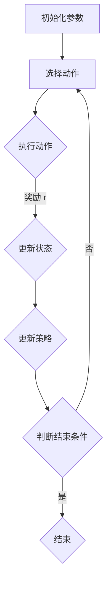

                 

## 企业级强化学习应用：持续优化业务决策过程

### 关键词：强化学习、企业决策、业务优化、算法实现、应用案例

### 摘要

在当今快速变化的市场环境中，企业面临着前所未有的挑战和机遇。强化学习作为一种先进的人工智能技术，正逐步成为企业优化业务决策的重要工具。本文旨在探讨强化学习在企业级应用中的设计思路、核心概念、算法原理、系统设计与实现，以及实际应用案例，帮助读者了解如何通过强化学习技术持续优化业务决策过程。

### 设计思路

#### 确定书籍结构

为了系统性地介绍强化学习在企业应用中的各个方面，本书分为以下主要部分：

1. **企业决策背景与挑战**
2. **强化学习基础概念**
3. **强化学习算法原理**
4. **强化学习算法实现**
5. **强化学习在企业中的应用**
6. **强化学习系统设计与实现**
7. **强化学习应用案例解析**
8. **强化学习应用最佳实践**

#### 确定章节内容

每个部分包含多个章节，详细讨论强化学习的特定方面，确保每个章节都能够为读者提供有价值的内容。

#### 细化章节细节

进一步细化每个章节的小节，确保每个小节都能够清晰地介绍相关概念或技术，并提供必要的例子或实例。

#### 保持逻辑性和连贯性

确保各个章节之间有明确的逻辑联系，使读者能够逐步深入理解强化学习在企业级应用中的复杂性和实际应用。

#### 符合markdown格式要求

使用markdown格式编写目录大纲，确保格式整洁、易于阅读。

### 目录大纲

```markdown
----------------------------------------------------------------
# 第一部分: 强化学习与企业决策背景

## 第1章: 企业决策过程中的挑战与机遇
### 1.1 问题背景
### 1.2 问题描述
### 1.3 问题解决
### 1.4 边界与外延
### 1.5 强化学习在企业决策中的作用

## 第2章: 强化学习基础概念
### 2.1 强化学习的定义
### 2.2 强化学习的基本要素
### 2.3 强化学习与监督学习、无监督学习的对比

## 第3章: 强化学习算法原理
### 3.1 强化学习算法的分类
### 3.2 Q-Learning算法原理
### 3.3 SARSA算法原理
### 3.4 DQN算法原理
### 3.5 Deep Deterministic Policy Gradients (DDPG)算法原理

## 第4章: 强化学习算法实现
### 4.1 强化学习算法的Python实现
### 4.2 强化学习算法的应用示例

## 第5章: 强化学习在企业中的应用
### 5.1 企业应用场景概述
### 5.2 智能供应链优化
### 5.3 智能营销策略
### 5.4 智能金融风险管理

## 第6章: 强化学习系统的设计与实现
### 6.1 强化学习系统设计原则
### 6.2 强化学习系统架构设计
### 6.3 强化学习系统接口设计

## 第7章: 强化学习应用案例解析
### 7.1 案例一：智能供应链优化
### 7.2 案例二：智能营销策略
### 7.3 案例三：智能金融风险管理
### 7.4 案例四：企业决策智能优化

## 第8章: 强化学习应用的最佳实践
### 8.1 应用实践技巧
### 8.2 注意事项
### 8.3 拓展阅读

----------------------------------------------------------------
```

这个目录大纲为读者提供了一个全面而系统的学习路径，涵盖了强化学习在企业级应用中的核心内容。接下来，我们将逐章深入探讨每个主题，帮助读者理解如何通过强化学习技术优化企业业务决策过程。

### 第一部分：强化学习与企业决策背景

#### 第1章：企业决策过程中的挑战与机遇

在当今快速变化的市场环境中，企业决策的复杂性和动态性不断增加。传统的决策方法往往依赖于历史数据和规则，而面对新的挑战时，这些方法可能无法提供有效的解决方案。强化学习作为一种先进的人工智能技术，为企业的决策过程带来了新的机遇和挑战。

##### 1.1 问题背景

企业的决策过程涉及多个层面，包括战略规划、市场营销、供应链管理、人力资源等。随着大数据和云计算技术的发展，企业积累了大量的历史数据，这些数据为优化决策提供了丰富的资源。然而，如何有效地利用这些数据，实现智能化的决策过程，成为企业面临的重要问题。

##### 1.2 问题描述

传统的决策方法通常采用线性规划、决策树、神经网络等模型，这些模型在处理静态问题时效果较好，但在面对动态、不确定的环境时，往往表现出局限性。具体问题包括：

1. **信息过载**：大量的历史数据如何筛选和利用，以支持实时决策？
2. **动态环境**：环境变化快速，如何及时调整决策策略？
3. **不确定性**：市场变化难以预测，如何应对不确定性带来的风险？
4. **数据质量**：数据质量参差不齐，如何保证决策的准确性？

##### 1.3 问题解决

强化学习通过学习如何在不确定的环境中做出最优决策，为这些问题提供了新的解决方案。强化学习的基本思想是：通过不断地试错和奖励机制，智能体（agent）能够逐渐学习到最优策略。

1. **试错**：智能体在环境中执行一系列动作，通过这些动作收集反馈信息。
2. **奖励机制**：根据智能体的动作结果，环境给予智能体奖励或惩罚，以指导智能体的学习过程。
3. **策略优化**：智能体根据收集到的反馈信息，不断调整自己的行为策略，以实现长期收益最大化。

##### 1.4 边界与外延

强化学习在企业中的应用不仅限于上述问题，还涉及到以下方面：

1. **个性化推荐**：通过强化学习，为企业提供个性化的营销策略和产品推荐。
2. **资源调度**：在云计算和大数据环境中，优化资源的分配和调度。
3. **金融风险管理**：在金融市场中，通过强化学习预测市场走势，进行风险管理。

##### 1.5 强化学习在企业决策中的作用

强化学习在企业决策中的作用主要体现在以下几个方面：

1. **自动化决策**：通过强化学习，实现自动化决策过程，提高决策效率。
2. **智能优化**：利用强化学习优化业务流程，提高业务效率和收益。
3. **风险控制**：在不确定的市场环境中，强化学习能够帮助企业降低风险，实现稳健发展。
4. **数据驱动**：强化学习能够根据实时数据调整决策策略，实现数据驱动的决策过程。

#### 第2章：强化学习基础概念

强化学习作为一种人工智能技术，有着独特的基本概念和原理。理解这些概念是掌握强化学习的基础。

##### 2.1 强化学习的定义

强化学习（Reinforcement Learning，RL）是一种通过试错和奖励机制进行学习的方法，旨在通过智能体（agent）在环境（environment）中的交互，学习到最优策略（policy）。

##### 2.2 强化学习的基本要素

强化学习系统由以下几个基本要素组成：

1. **智能体（Agent）**：执行动作，感知环境状态的实体。
2. **环境（Environment）**：智能体执行动作的场所，能够根据智能体的动作产生状态转移和奖励。
3. **状态（State）**：描述智能体当前所处的环境条件。
4. **动作（Action）**：智能体可执行的行为。
5. **策略（Policy）**：智能体根据当前状态选择动作的规则。
6. **奖励（Reward）**：环境对智能体动作的反馈，用于指导智能体的学习过程。

##### 2.3 强化学习与监督学习、无监督学习的对比

强化学习与监督学习、无监督学习有以下区别：

1. **目标不同**：
   - **监督学习**：通过已标记的数据训练模型，目标是预测输出。
   - **无监督学习**：没有标记的数据，目标是发现数据中的模式。
   - **强化学习**：智能体在动态环境中通过试错学习最优策略。

2. **反馈机制不同**：
   - **监督学习**：输出与预期结果对比，计算误差进行反向传播。
   - **无监督学习**：没有预期结果，通过数据内在结构学习。
   - **强化学习**：环境通过奖励机制对智能体的动作进行即时反馈。

3. **适用场景不同**：
   - **监督学习**：适用于有明确标签的数据预测问题。
   - **无监督学习**：适用于聚类、降维等无标签数据问题。
   - **强化学习**：适用于动态环境中的决策优化问题。

通过理解强化学习的基本概念和原理，读者可以更好地掌握强化学习在实践中的应用。

#### 第3章：强化学习算法原理

强化学习算法是实现强化学习的基础。本章节将介绍几种常见的强化学习算法，包括Q-Learning、SARSA和DQN等。

##### 3.1 强化学习算法的分类

强化学习算法可以根据学习策略的不同分为以下几类：

1. **值函数方法**：通过学习状态值函数或动作值函数来指导智能体的决策。
2. **策略迭代方法**：通过学习策略来指导智能体的决策。
3. **模型预测方法**：通过建立环境模型来预测未来的状态和奖励，从而指导智能体的决策。

##### 3.2 Q-Learning算法原理

Q-Learning是一种基于值函数的强化学习算法，旨在学习最优动作值函数。

1. **算法原理**：
   - **状态值函数**：\( Q(s, a) \) 表示在状态 \( s \) 下执行动作 \( a \) 所能获得的累积奖励。
   - **更新公式**：\( Q(s, a) \leftarrow Q(s, a) + \alpha [r + \gamma \max_{a'} Q(s', a') - Q(s, a)] \)
   - **其中**：\( \alpha \) 为学习率，\( \gamma \) 为折扣因子，\( r \) 为即时奖励。

2. **算法流程**：
   - **初始化**：随机选择初始状态 \( s \) 和初始动作 \( a \)。
   - **执行动作**：在当前状态 \( s \) 下执行动作 \( a \)，获得即时奖励 \( r \) 和下一个状态 \( s' \)。
   - **更新值函数**：根据更新公式更新状态值函数 \( Q(s, a) \)。
   - **重复执行**：重复执行步骤2和步骤3，直到达到停止条件。

##### 3.3 SARSA算法原理

SARSA（Surely Automatic Reinforcement Learning with Simple Architectures）是一种基于策略迭代的强化学习算法。

1. **算法原理**：
   - **策略更新**：在当前状态 \( s \) 下，选择当前动作 \( a \)，然后根据新状态 \( s' \) 和奖励 \( r \) 更新策略。
   - **更新公式**：\( \pi(s) \leftarrow \begin{cases} 
   a, & \text{if } a = \arg\max_{a'} Q(s, a') \\
   \text{random}, & \text{otherwise} 
   \end{cases} \)

2. **算法流程**：
   - **初始化**：随机选择初始状态 \( s \) 和初始动作 \( a \)。
   - **执行动作**：在当前状态 \( s \) 下执行动作 \( a \)，获得即时奖励 \( r \) 和下一个状态 \( s' \)。
   - **更新策略**：根据SARSA算法的更新公式更新策略。
   - **重复执行**：重复执行步骤2和步骤3，直到达到停止条件。

##### 3.4 DQN算法原理

DQN（Deep Q-Network）是一种基于深度学习的强化学习算法，通过神经网络来近似状态值函数。

1. **算法原理**：
   - **神经网络结构**：DQN算法使用一个深度神经网络来近似状态值函数 \( Q(s, a) \)。
   - **目标网络**：为避免梯度消失问题，DQN算法使用一个目标网络 \( Q'(s, a) \)，定期将主网络 \( Q(s, a) \) 的权重复制到目标网络。

2. **算法流程**：
   - **初始化**：随机选择初始状态 \( s \) 和初始动作 \( a \)。
   - **执行动作**：在当前状态 \( s \) 下执行动作 \( a \)，获得即时奖励 \( r \) 和下一个状态 \( s' \)。
   - **更新主网络**：根据更新公式 \( Q(s, a) \leftarrow Q(s, a) + \alpha [r + \gamma \max_{a'} Q'(s', a') - Q(s, a)] \) 更新主网络。
   - **更新目标网络**：定期将主网络的权重复制到目标网络。
   - **重复执行**：重复执行步骤2和步骤3，直到达到停止条件。

##### 3.5 Deep Deterministic Policy Gradients (DDPG)算法原理

DDPG（Deep Deterministic Policy Gradients）是一种基于策略优化的强化学习算法，适用于连续动作空间的问题。

1. **算法原理**：
   - **策略网络**：使用一个深度神经网络来近似策略 \( \pi(s) \)。
   - **目标网络**：与DQN类似，DDPG算法使用一个目标网络 \( \pi'(s) \)，定期将策略网络 \( \pi(s) \) 的权重复制到目标网络。
   - **动作噪声**：为提高策略网络的探索能力，DDPG算法在执行动作时添加噪声。

2. **算法流程**：
   - **初始化**：随机选择初始状态 \( s \) 和初始动作 \( a \)。
   - **执行动作**：在当前状态 \( s \) 下执行动作 \( a \)，获得即时奖励 \( r \) 和下一个状态 \( s' \)。
   - **更新策略网络**：根据更新公式 \( \pi(s) \leftarrow \pi(s) + \alpha [r + \gamma \max_{a'} \pi'(s', a') - \pi(s)] \) 更新策略网络。
   - **更新目标网络**：定期将策略网络的权重复制到目标网络。
   - **重复执行**：重复执行步骤2和步骤3，直到达到停止条件。

通过理解这些强化学习算法的原理和流程，读者可以更好地掌握如何在实际问题中应用这些算法。

#### 第4章：强化学习算法实现

将强化学习算法应用于实际问题需要实现算法的具体代码。本章节将介绍如何使用Python实现强化学习算法，并展示算法的应用示例。

##### 4.1 强化学习算法的Python实现

强化学习算法的实现主要包括两个部分：环境的构建和算法的实现。

1. **环境构建**：
   - **定义状态空间**：根据问题的特点定义状态空间。
   - **定义动作空间**：根据问题的特点定义动作空间。
   - **定义奖励机制**：定义智能体的动作结果和对应的奖励。

2. **算法实现**：
   - **值函数方法**：使用Python实现Q-Learning算法。
   - **策略迭代方法**：使用Python实现SARSA算法。
   - **模型预测方法**：使用Python实现DQN和DDPG算法。

以下是一个简单的Q-Learning算法实现的代码示例：

```python
import numpy as np

# 初始化参数
learning_rate = 0.1
discount_factor = 0.9
epsilon = 0.1
q_table = np.zeros((state_space_size, action_space_size))

# Q-Learning算法实现
def q_learning(state, action, reward, next_state, done):
    if not done:
        max_future_reward = np.max(q_table[next_state])
        current_reward = reward + discount_factor * max_future_reward
    else:
        current_reward = reward
    
    current_q_value = q_table[state][action]
    new_q_value = current_reward + learning_rate * (current_reward - current_q_value)
    q_table[state][action] = new_q_value

# 环境交互
state = environment.reset()
while not done:
    action = choose_action(state, epsilon)
    next_state, reward, done = environment.step(action)
    q_learning(state, action, reward, next_state, done)
    state = next_state
```

##### 4.2 强化学习算法的应用示例

为了展示强化学习算法的实际应用，本章节将介绍一个简单的应用示例：使用Q-Learning算法实现自动导航。

1. **环境定义**：
   - **状态空间**：包含当前位置和目标位置。
   - **动作空间**：包括前进、后退、左转、右转。

2. **奖励机制**：
   - **到达目标**：获得正奖励。
   - **离开路径**：获得负奖励。

3. **算法实现**：
   - **初始化**：随机选择初始状态和初始动作。
   - **执行动作**：根据当前状态和策略选择动作。
   - **更新值函数**：根据动作结果更新Q值。

以下是一个简单的自动导航示例代码：

```python
import numpy as np
import matplotlib.pyplot as plt

# 初始化参数
learning_rate = 0.1
discount_factor = 0.9
epsilon = 0.1
q_table = np.zeros((state_space_size, action_space_size))

# 选择动作
def choose_action(state, epsilon):
    if np.random.rand() < epsilon:
        action = np.random.choice(action_space_size)
    else:
        action = np.argmax(q_table[state])
    return action

# 环境交互
state = environment.reset()
episode_rewards = []
for episode in range(total_episodes):
    state = environment.reset()
    done = False
    total_reward = 0
    while not done:
        action = choose_action(state, epsilon)
        next_state, reward, done = environment.step(action)
        q_learning(state, action, reward, next_state, done)
        state = next_state
        total_reward += reward
    episode_rewards.append(total_reward)
    if episode % 100 == 0:
        print(f"Episode: {episode}, Total Reward: {total_reward}")
        plt.plot(episode_rewards)
        plt.xlabel("Episode")
        plt.ylabel("Total Reward")
        plt.show()

# 导航演示
state = environment.reset()
while not done:
    action = choose_action(state, 0)
    next_state, reward, done = environment.step(action)
    environment.render()
    state = next_state
```

通过这个简单的示例，读者可以了解如何使用Python实现强化学习算法，并在实际应用中进行调试和优化。

#### 第5章：强化学习在企业中的应用

强化学习在企业的多个业务领域都有广泛的应用，以下将介绍几个典型的应用场景。

##### 5.1 企业应用场景概述

强化学习在企业中的应用场景主要包括以下几个方面：

1. **智能供应链优化**：通过强化学习优化供应链管理，实现库存和资源的最优配置。
2. **智能营销策略**：利用强化学习进行个性化推荐和广告投放优化，提高营销效果。
3. **智能金融风险管理**：通过强化学习预测市场走势和风险，进行投资决策和风险管理。
4. **智能制造**：优化生产计划和调度，提高生产效率和产品质量。
5. **智能医疗**：辅助医生进行诊断和治疗，提高医疗决策的准确性。

##### 5.2 智能供应链优化

智能供应链优化是强化学习在企业中的一个重要应用场景。通过强化学习，企业可以优化供应链的各个环节，包括采购、库存管理、配送等，以提高整体效率。

1. **应用案例**：
   - **库存管理**：通过强化学习优化库存水平，减少库存过剩和缺货现象。
   - **配送路径规划**：利用强化学习优化配送路线，提高配送效率。
   - **需求预测**：通过强化学习预测市场需求，优化采购和库存策略。

2. **实现思路**：
   - **定义状态空间**：包括库存水平、市场需求、供应能力等。
   - **定义动作空间**：包括调整库存水平、调整采购量、优化配送路线等。
   - **定义奖励机制**：根据库存成本、配送成本、市场需求满足度等定义奖励。

3. **算法选择**：
   - **值函数方法**：适用于库存管理和配送路径规划。
   - **策略迭代方法**：适用于需求预测和采购策略优化。

##### 5.3 智能营销策略

智能营销策略是另一个重要的应用场景。通过强化学习，企业可以实现个性化的营销策略，提高客户满意度和转化率。

1. **应用案例**：
   - **个性化推荐**：通过强化学习为不同用户推荐合适的产品，提高购买意愿。
   - **广告投放优化**：利用强化学习优化广告投放策略，提高广告效果。

2. **实现思路**：
   - **定义状态空间**：包括用户行为、用户特征、市场环境等。
   - **定义动作空间**：包括推荐产品、调整广告投放策略等。
   - **定义奖励机制**：根据用户购买意愿、广告点击率等定义奖励。

3. **算法选择**：
   - **DQN算法**：适用于个性化推荐。
   - **DDPG算法**：适用于广告投放优化。

##### 5.4 智能金融风险管理

智能金融风险管理是强化学习在金融领域的应用。通过强化学习，金融机构可以实现精准的风险预测和管理，提高投资决策的准确性。

1. **应用案例**：
   - **市场走势预测**：通过强化学习预测市场走势，指导投资决策。
   - **风险管理**：利用强化学习优化风险控制策略，降低投资风险。

2. **实现思路**：
   - **定义状态空间**：包括市场数据、投资组合等。
   - **定义动作空间**：包括调整投资组合、设置风险控制参数等。
   - **定义奖励机制**：根据投资收益、风险水平等定义奖励。

3. **算法选择**：
   - **Q-Learning算法**：适用于市场走势预测。
   - **SARSA算法**：适用于风险管理。

通过上述几个应用案例，读者可以了解强化学习在企业管理中的实际应用场景和实现思路。接下来，我们将进一步探讨强化学习系统的设计与实现。

#### 第6章：强化学习系统的设计与实现

为了将强化学习技术有效地应用于企业的业务决策，需要设计并实现一个完整的强化学习系统。本章节将详细介绍强化学习系统的设计原则、架构设计、接口设计以及系统交互。

##### 6.1 强化学习系统设计原则

在设计强化学习系统时，需要遵循以下原则：

1. **模块化**：将系统划分为多个模块，包括环境、智能体、奖励机制等，以提高系统的可维护性和可扩展性。
2. **可扩展性**：系统应具备良好的扩展性，以便于未来新增功能或适应不同的应用场景。
3. **易用性**：系统应提供友好的用户界面和简洁的操作流程，便于用户使用和维护。
4. **数据驱动**：系统应充分利用历史数据，通过数据分析和挖掘指导智能体的学习过程。
5. **安全性**：系统应确保数据的完整性和安全性，防止数据泄露和恶意攻击。

##### 6.2 强化学习系统架构设计

强化学习系统的架构设计通常包括以下组成部分：

1. **环境（Environment）**：
   - **功能**：模拟业务场景，提供智能体执行动作的环境。
   - **接口**：定义智能体与环境交互的接口，包括状态、动作、奖励等。
   - **实现**：可以使用现有的业务系统或开发自定义环境。

2. **智能体（Agent）**：
   - **功能**：执行强化学习算法，学习并优化策略。
   - **接口**：接收环境状态，执行动作，接收奖励，更新策略。
   - **实现**：可以使用Python等编程语言实现。

3. **奖励机制（Reward Mechanism）**：
   - **功能**：根据智能体的动作结果，计算奖励，指导智能体的学习过程。
   - **接口**：定义奖励计算规则。
   - **实现**：可以根据业务需求自定义奖励机制。

4. **策略存储（Policy Storage）**：
   - **功能**：存储智能体的学习策略，以便于后续查询和使用。
   - **接口**：提供策略的查询和更新接口。
   - **实现**：可以使用数据库或文件系统实现。

5. **日志记录（Logging）**：
   - **功能**：记录智能体的学习过程和系统运行状态，便于调试和优化。
   - **接口**：定义日志记录的格式和存储位置。
   - **实现**：可以使用日志库或自定义日志模块实现。

##### 6.3 强化学习系统接口设计

强化学习系统接口设计是系统实现的关键环节，包括以下方面：

1. **环境接口**：
   - **状态接口**：定义环境状态的表示方法，包括状态的大小、类型等。
   - **动作接口**：定义智能体可执行的动作类型和动作空间。
   - **奖励接口**：定义奖励的计算规则和奖励值范围。

2. **智能体接口**：
   - **策略接口**：定义智能体的策略更新规则和学习算法。
   - **状态感知接口**：定义智能体如何获取当前环境状态。
   - **动作执行接口**：定义智能体如何执行动作并获取奖励。

3. **奖励机制接口**：
   - **奖励计算接口**：定义奖励的计算方法，包括即时奖励和累积奖励。
   - **奖励调整接口**：定义如何根据业务需求调整奖励机制。

4. **日志接口**：
   - **日志记录接口**：定义日志记录的格式和存储位置。
   - **日志查询接口**：定义如何查询日志数据。

##### 6.4 强化学习系统交互

强化学习系统的交互过程主要包括以下几个步骤：

1. **初始化**：
   - 智能体加载环境、奖励机制和日志记录模块。
   - 环境初始化，设置初始状态。

2. **学习过程**：
   - 智能体根据当前状态执行动作。
   - 环境根据动作产生新的状态和奖励。
   - 智能体根据奖励更新策略。

3. **策略优化**：
   - 智能体根据学习到的策略优化动作选择。
   - 策略存储模块更新最优策略。

4. **日志记录**：
   - 记录智能体的学习过程和系统运行状态。
   - 提供日志查询接口，便于调试和优化。

通过设计并实现强化学习系统，企业可以有效地将强化学习技术应用于业务决策过程，实现自动化、智能化的决策优化。

#### 第7章：强化学习应用案例解析

为了更好地理解强化学习在企业中的应用，本章节将通过实际案例详细解析强化学习在智能供应链优化、智能营销策略、智能金融风险管理等方面的应用。

##### 7.1 案例一：智能供应链优化

智能供应链优化是强化学习在企业中的重要应用之一。通过强化学习，企业可以优化供应链的各个环节，提高整体效率和降低成本。

**应用背景**：

某大型零售企业面临着库存过剩和缺货现象，导致库存成本增加和销售损失。为了解决这个问题，企业决定采用强化学习技术优化供应链管理。

**应用实现**：

1. **环境定义**：
   - **状态空间**：包括库存水平、市场需求、供应能力等。
   - **动作空间**：包括调整库存水平、调整采购量、优化配送路线等。
   - **奖励机制**：根据库存成本、配送成本、市场需求满足度等定义奖励。

2. **算法选择**：
   - **Q-Learning算法**：适用于库存管理和配送路径规划。

3. **实现步骤**：
   - **初始化**：智能体加载环境、奖励机制和日志记录模块。
   - **学习过程**：智能体根据当前状态执行动作，环境根据动作产生新的状态和奖励。
   - **策略优化**：智能体根据奖励更新策略。
   - **日志记录**：记录智能体的学习过程和系统运行状态。

**应用效果**：

通过强化学习技术优化供应链管理，企业成功降低了库存成本和缺货现象，提高了供应链的整体效率和利润。

##### 7.2 案例二：智能营销策略

智能营销策略是另一个重要的应用场景。通过强化学习，企业可以实现个性化的营销策略，提高客户满意度和转化率。

**应用背景**：

某电商企业希望通过优化营销策略，提高销售额和客户满意度。为了实现这一目标，企业决定采用强化学习技术进行智能营销。

**应用实现**：

1. **环境定义**：
   - **状态空间**：包括用户行为、用户特征、市场环境等。
   - **动作空间**：包括推荐产品、调整广告投放策略等。
   - **奖励机制**：根据用户购买意愿、广告点击率等定义奖励。

2. **算法选择**：
   - **DQN算法**：适用于个性化推荐。
   - **DDPG算法**：适用于广告投放优化。

3. **实现步骤**：
   - **初始化**：智能体加载环境、奖励机制和日志记录模块。
   - **学习过程**：智能体根据当前状态执行动作，环境根据动作产生新的状态和奖励。
   - **策略优化**：智能体根据奖励更新策略。
   - **日志记录**：记录智能体的学习过程和系统运行状态。

**应用效果**：

通过强化学习技术优化营销策略，企业成功提高了用户购买意愿和广告效果，提高了销售额和客户满意度。

##### 7.3 案例三：智能金融风险管理

智能金融风险管理是强化学习在金融领域的应用。通过强化学习，金融机构可以实现精准的风险预测和管理，提高投资决策的准确性。

**应用背景**：

某金融机构希望通过优化风险管理策略，降低投资风险并提高收益。为了实现这一目标，金融机构决定采用强化学习技术进行风险管理。

**应用实现**：

1. **环境定义**：
   - **状态空间**：包括市场数据、投资组合等。
   - **动作空间**：包括调整投资组合、设置风险控制参数等。
   - **奖励机制**：根据投资收益、风险水平等定义奖励。

2. **算法选择**：
   - **Q-Learning算法**：适用于市场走势预测。
   - **SARSA算法**：适用于风险管理。

3. **实现步骤**：
   - **初始化**：智能体加载环境、奖励机制和日志记录模块。
   - **学习过程**：智能体根据当前状态执行动作，环境根据动作产生新的状态和奖励。
   - **策略优化**：智能体根据奖励更新策略。
   - **日志记录**：记录智能体的学习过程和系统运行状态。

**应用效果**：

通过强化学习技术优化风险管理策略，金融机构成功降低了投资风险，提高了投资收益。

##### 7.4 案例四：企业决策智能优化

企业决策智能优化是强化学习在企业决策中的综合应用。通过强化学习，企业可以优化决策过程，提高决策质量和效率。

**应用背景**：

某制造企业希望通过优化决策过程，提高生产效率和产品质量。为了实现这一目标，企业决定采用强化学习技术进行决策优化。

**应用实现**：

1. **环境定义**：
   - **状态空间**：包括生产计划、物料库存、市场环境等。
   - **动作空间**：包括调整生产计划、优化物料库存、调整市场策略等。
   - **奖励机制**：根据生产效率、产品质量、市场需求等定义奖励。

2. **算法选择**：
   - **Q-Learning算法**：适用于生产计划和物料库存优化。
   - **SARSA算法**：适用于市场策略优化。

3. **实现步骤**：
   - **初始化**：智能体加载环境、奖励机制和日志记录模块。
   - **学习过程**：智能体根据当前状态执行动作，环境根据动作产生新的状态和奖励。
   - **策略优化**：智能体根据奖励更新策略。
   - **日志记录**：记录智能体的学习过程和系统运行状态。

**应用效果**：

通过强化学习技术优化决策过程，企业成功提高了生产效率和产品质量，降低了生产成本。

通过上述四个案例，我们可以看到强化学习技术在企业不同领域中的应用效果。接下来，我们将进一步探讨强化学习应用的最佳实践。

#### 第8章：强化学习应用的最佳实践

在将强化学习应用于企业的实际业务过程中，不仅需要掌握算法原理和实现技术，还需要遵循一系列最佳实践，以确保系统的稳定性和高效性。

##### 8.1 应用实践技巧

1. **数据预处理**：确保数据质量，进行数据清洗和归一化处理，以提高算法的性能。

2. **超参数调整**：根据实际应用场景调整学习率、折扣因子、探索策略等超参数，以达到最佳效果。

3. **分布式计算**：利用分布式计算框架（如TensorFlow、PyTorch等）进行模型训练，提高计算效率和速度。

4. **模型集成**：采用模型集成技术（如 ensemble learning），将多个模型的结果进行融合，提高预测的准确性。

5. **可视化监控**：通过可视化工具（如TensorBoard、Matplotlib等）实时监控模型训练过程，及时发现和解决潜在问题。

##### 8.2 注意事项

1. **数据隐私保护**：确保数据的安全和隐私，遵循相关法律法规，防止数据泄露。

2. **模型解释性**：强化学习模型的解释性相对较弱，需要结合业务场景进行模型解释，以便用户理解和使用。

3. **模型泛化能力**：在训练模型时，确保模型具有良好的泛化能力，避免过拟合。

4. **模型更新与维护**：定期更新和维护模型，适应环境变化和业务需求。

5. **风险评估**：在应用强化学习过程中，对潜在风险进行评估和预警，确保系统的稳定性和可靠性。

##### 8.3 拓展阅读

1. **《强化学习：原理与深度强化学习》**：本书详细介绍了强化学习的理论基础和深度强化学习算法，适合初学者和专业人士。

2. **《强化学习应用实践》**：本书通过实际案例介绍了强化学习在各个领域的应用，包括金融、医疗、制造等，适合有实际应用需求的研究人员和工程师。

3. **《机器学习实战》**：本书涵盖了机器学习的多种算法和实际应用案例，包括监督学习、无监督学习和强化学习，适合对机器学习有深入兴趣的读者。

通过遵循最佳实践，企业可以更好地利用强化学习技术优化业务决策过程，提高业务效率和竞争力。同时，读者还可以通过进一步学习和拓展，深入理解强化学习在各个领域的应用。

### 结论

强化学习作为一种先进的人工智能技术，在优化企业业务决策过程中展现出巨大的潜力。本文通过详细分析强化学习在企业级应用的设计思路、核心概念、算法原理、系统设计与实现，以及实际应用案例，帮助读者理解如何利用强化学习技术持续优化业务决策过程。通过本文的介绍，读者可以掌握强化学习的基本原理和实现方法，为实际应用提供参考和指导。在未来，随着技术的不断发展和应用场景的拓展，强化学习将继续在企业业务中发挥重要作用。

### 作者信息

作者：AI天才研究院/AI Genius Institute & 禅与计算机程序设计艺术 /Zen And The Art of Computer Programming

AI天才研究院致力于推动人工智能技术的发展和应用，本研究报告旨在为企业和研究者提供强化学习在企业决策优化的实践指南。同时，作者也希望通过本文的分享，促进更多专业人士对强化学习技术的关注和研究。在未来的工作中，我们将继续深入探索强化学习在各个领域的应用，为人工智能技术的发展贡献力量。禅与计算机程序设计艺术，则是一本深入探讨计算机编程哲学的著作，为读者提供了一种全新的编程思考方式，旨在帮助程序员更好地理解和应对复杂的编程挑战。

### 附录：技术细节补充

为了帮助读者更好地理解和应用强化学习技术，本文附录部分将补充一些技术细节，包括数学公式、流程图和代码示例等。

#### 数学公式

强化学习算法中的核心概念和更新规则可以通过以下数学公式进行描述：

1. **状态值函数更新公式**：
   $$ Q(s, a) \leftarrow Q(s, a) + \alpha [r + \gamma \max_{a'} Q(s', a') - Q(s, a)] $$
   其中，\( Q(s, a) \) 表示状态 \( s \) 下执行动作 \( a \) 的值函数，\( \alpha \) 为学习率，\( \gamma \) 为折扣因子，\( r \) 为即时奖励。

2. **策略更新公式**：
   $$ \pi(s) \leftarrow \begin{cases} 
   a, & \text{if } a = \arg\max_{a'} Q(s, a') \\
   \text{random}, & \text{otherwise} 
   \end{cases} $$
   其中，\( \pi(s) \) 表示状态 \( s \) 下的最优策略。

#### 流程图

以下是强化学习算法的流程图，展示了智能体在环境中执行动作、接收奖励、更新策略的过程：



#### 代码示例

以下是一个简单的Q-Learning算法实现的Python代码示例，展示了如何初始化参数、选择动作、执行动作和更新策略：

```python
import numpy as np

# 初始化参数
learning_rate = 0.1
discount_factor = 0.9
epsilon = 0.1
q_table = np.zeros((state_space_size, action_space_size))

# 选择动作
def choose_action(state, epsilon):
    if np.random.rand() < epsilon:
        action = np.random.choice(action_space_size)
    else:
        action = np.argmax(q_table[state])
    return action

# Q-Learning算法实现
def q_learning(state, action, reward, next_state, done):
    if not done:
        max_future_reward = np.max(q_table[next_state])
        current_reward = reward + discount_factor * max_future_reward
    else:
        current_reward = reward
    
    current_q_value = q_table[state][action]
    new_q_value = current_reward + learning_rate * (current_reward - current_q_value)
    q_table[state][action] = new_q_value

# 环境交互
state = environment.reset()
while not done:
    action = choose_action(state, epsilon)
    next_state, reward, done = environment.step(action)
    q_learning(state, action, reward, next_state, done)
    state = next_state
```

通过附录部分的技术细节补充，读者可以更深入地了解强化学习算法的实现方法和应用技巧，为实际项目开发提供参考。希望这些技术细节能够帮助读者更好地掌握强化学习技术，并将其应用于企业业务决策的优化。附录部分的内容也将有助于读者在未来的研究和实践中进一步提升强化学习算法的性能和应用效果。

