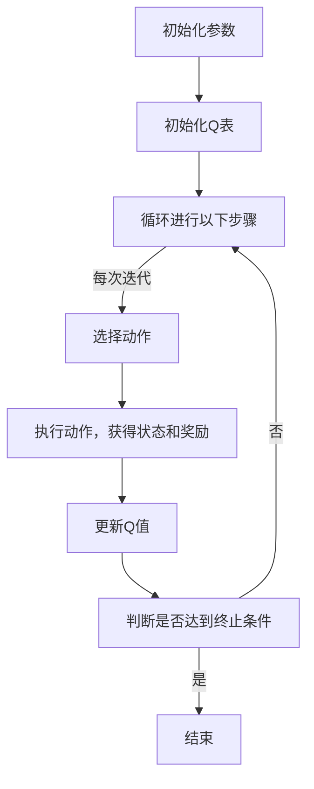
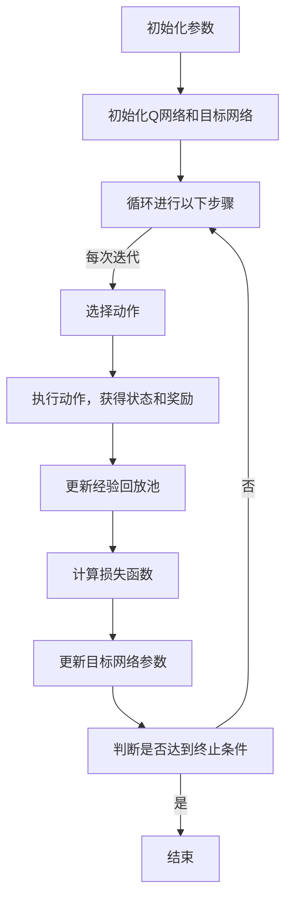
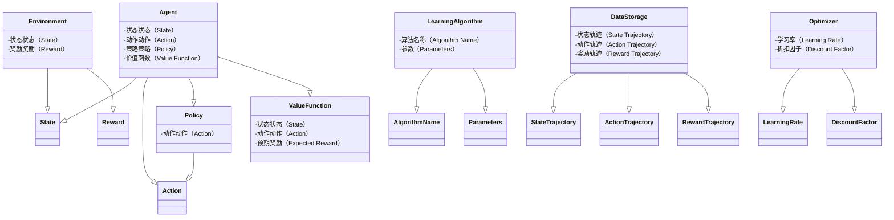
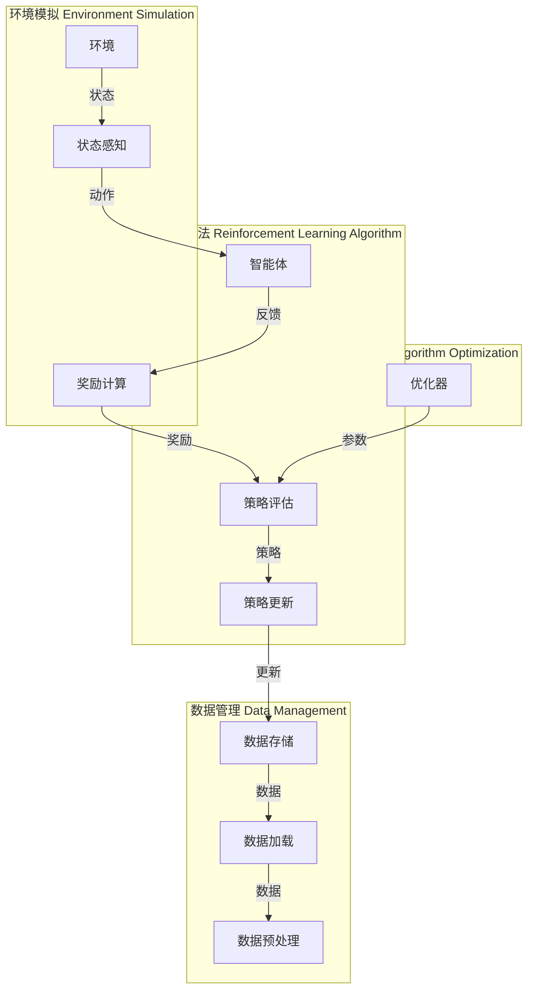
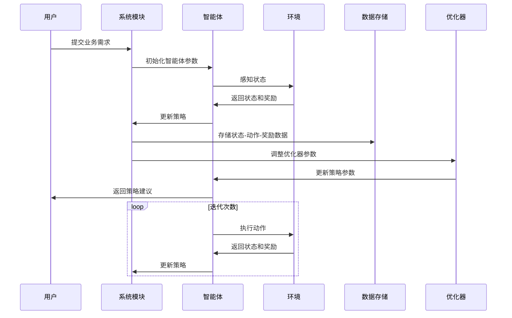

                 

### 引言

在当今快速发展的企业环境中，人工智能（AI）技术已经成为提升生产效率、优化业务流程的重要工具。强化学习（Reinforcement Learning, RL）作为机器学习的一个重要分支，因其自适应性强、灵活性好等特点，在许多企业和行业中得到了广泛应用。企业级强化学习框架的构建，对于实现智能化决策、优化资源分配具有重要意义。

本文旨在系统地介绍企业级强化学习框架及其核心概念、算法原理、系统架构和项目实战，以帮助读者深入理解这一领域的技术和应用。文章将分为七个部分：

1. **背景介绍与核心概念**：介绍强化学习的基本概念、特点和应用领域。
2. **核心概念与联系**：详细讲解强化学习中的核心概念及其相互关系。
3. **算法原理讲解**：分析Q-learning、SARSA和Deep Q-Networks等算法的原理和应用。
4. **系统分析与架构设计**：探讨企业级强化学习框架的系统分析和架构设计。
5. **项目实战**：通过实际项目案例，展示强化学习框架的应用和实践。
6. **最佳实践与拓展**：总结最佳实践，提供拓展阅读建议。
7. **总结与展望**：对文章内容进行总结，展望强化学习在未来的发展趋势。

通过逐步分析推理，我们将深入了解企业级强化学习框架的构建与应用，为企业和行业的技术发展提供新思路和新方法。

### 第一部分：背景介绍与核心概念

#### 第1章：强化学习与强化学习框架概述

**1.1 强化学习的基本概念**

强化学习（Reinforcement Learning, RL）是一种机器学习范式，它通过智能体（Agent）与环境的交互来学习最优策略。智能体通过不断尝试各种动作（Action），并根据环境的反馈（Reward）来调整其行为，最终学会在特定情境下选择最优动作，以实现长期目标最大化。

在强化学习中，核心概念包括状态（State）、动作（Action）、奖励（Reward）和价值函数（Value Function）：

- **状态（State）**：智能体所处的环境描述。
- **动作（Action）**：智能体可以采取的行为。
- **奖励（Reward）**：环境对智能体动作的反馈，表示为数值。
- **价值函数（Value Function）**：评估状态或状态-动作对的预期奖励。

**1.2 强化学习的特点与应用领域**

强化学习具有以下几个显著特点：

- **自适应性强**：智能体可以在不断变化的动态环境中进行调整和学习。
- **灵活性高**：适用于解决复杂的、具有不确定性的问题。
- **反馈驱动**：通过实时反馈调整策略，从而实现优化。

强化学习在多个领域得到了广泛应用，包括但不限于：

- **自动驾驶**：通过强化学习算法实现自动驾驶车辆的路径规划和决策。
- **游戏**：如Atari游戏、围棋等，强化学习算法在这些领域取得了显著的成果。
- **推荐系统**：优化用户推荐策略，提高用户体验和业务转化率。
- **能源管理**：优化电力系统运行，提高能源利用效率。

**1.3 强化学习框架的基本结构**

强化学习框架通常由以下几个关键组成部分构成：

- **智能体（Agent）**：执行动作、接收反馈并更新策略。
- **环境（Environment）**：定义智能体所处状态、提供反馈。
- **策略（Policy）**：智能体在给定状态下选择动作的规则。
- **价值函数（Value Function）**：评估状态或状态-动作对的预期奖励。
- **模型（Model）**：对环境和智能体行为的潜在分布进行建模。

**1.4 强化学习在企业和行业中的应用案例**

强化学习在企业级应用中具有广泛的前景，以下是一些典型的应用案例：

- **生产调度优化**：通过强化学习算法优化生产流程，提高生产效率。
- **供应链管理**：优化库存管理、运输路径规划，降低运营成本。
- **人力资源**：优化招聘策略，提高员工匹配度和员工满意度。
- **金融风控**：通过强化学习算法进行风险管理和投资决策。

强化学习框架在企业级应用中不仅能够提高运营效率，还能够帮助企业应对复杂和动态的市场环境，从而实现可持续发展。

通过上述背景介绍，我们可以看到强化学习在企业和行业中的应用潜力和重要性。接下来，我们将深入探讨强化学习中的核心概念和算法原理，以更好地理解和应用这一技术。

#### 第2章：强化学习中的核心概念

**2.1 状态、动作、奖励、价值函数**

在强化学习中，状态、动作、奖励和价值函数是四个基本概念，它们共同构成了强化学习的基础。以下是这四个概念的定义及其在强化学习中的应用：

- **状态（State）**：状态是智能体所处环境的描述。在强化学习中，每个状态都是环境的一种特定配置。例如，在自动驾驶中，状态可能包括车辆的位置、速度、周边道路情况等。状态是智能体决策的基础，智能体的目标是根据当前状态选择最佳动作。

- **动作（Action）**：动作是智能体可以执行的行为。在强化学习中，每个状态对应一组可能的动作。例如，在自动驾驶中，动作可能包括加速、减速、转弯等。智能体根据策略选择动作，策略是决定动作的规则。

- **奖励（Reward）**：奖励是环境对智能体动作的即时反馈。奖励通常是一个数值，它表示环境对当前动作的偏好。正奖励表示环境对动作的认可，负奖励则表示环境对动作的不满。奖励的目的是引导智能体学习最佳策略。

- **价值函数（Value Function）**：价值函数是用来评估状态或状态-动作对的预期奖励的函数。它可以帮助智能体预测在未来执行某一动作时能够获得的长期奖励。价值函数分为状态价值函数（State Value Function）和状态-动作价值函数（State-Action Value Function）。状态价值函数表示在给定状态下执行任何动作的预期奖励，而状态-动作价值函数表示在给定状态下执行特定动作的预期奖励。

**2.2 政策、策略、模型**

除了基本的概念，强化学习中还有一些关键概念，如政策、策略和模型，它们在智能体行为和决策中起着重要作用：

- **政策（Policy）**：政策是智能体在给定状态下选择动作的规则。它是策略的具体实现，通常由一个概率分布来描述。智能体根据当前状态和策略选择动作。政策可以是静态的，也可以是动态调整的。动态调整的政策可以根据环境的反馈进行更新，以实现更好的学习效果。

- **策略（Strategy）**：策略是智能体在长期内行为的一般规则，它定义了智能体在不同状态下的动作选择。策略通常是目标导向的，智能体的目标是最大化长期奖励。策略可以通过经验积累、策略搜索和优化算法来获得。

- **模型（Model）**：模型是对环境状态转移概率和奖励分布的预测。在强化学习中，智能体通常不知道环境的真实状态转移概率和奖励分布。因此，模型可以帮助智能体对环境进行建模，以便更好地预测未来的状态和奖励。模型可以是静态的，也可以是动态调整的。

**2.3 Q-learning、SARSA、Deep Q-Networks等算法**

强化学习中存在多种算法，其中Q-learning、SARSA和Deep Q-Networks是三种重要的算法。以下是这些算法的基本原理和特点：

- **Q-learning算法**：Q-learning是一种值迭代算法，用于学习状态-动作价值函数。它通过迭代更新价值函数，逐步逼近最优策略。Q-learning的基本思想是：在每个时间步，智能体选择当前状态下价值函数最大的动作，并在执行动作后更新价值函数。Q-learning的优点是简单、易于实现，缺点是对噪声和延迟的敏感性较高。

- **SARSA算法**：SARSA（Q-Learning with Simulation）是Q-learning的变体，它使用当前状态和下一状态来更新价值函数。SARSA算法在每次迭代中同时考虑当前状态和下一状态，从而提高了学习效率和鲁棒性。SARSA算法的优点是能够更好地处理不确定性和延迟，缺点是对参数的调整要求较高。

- **Deep Q-Networks算法**：Deep Q-Networks（DQN）是一种基于深度学习的强化学习算法，它通过神经网络来近似状态-动作价值函数。DQN的主要优点是能够处理高维状态空间，并且具有较好的泛化能力。DQN使用经验回放和目标网络来减少偏差和方差，从而提高学习效果。

**2.4 概念属性特征对比表格**

为了更好地理解上述概念，我们提供了一个概念属性特征对比表格，如下所示：

| 概念     | 定义                                                         | 属性特征                                                       | 关联算法                   |
| -------- | ------------------------------------------------------------ | ------------------------------------------------------------ | -------------------------- |
| 状态     | 环境描述                                                     | 独立性、确定性或随机性                                         | Q-learning、SARSA、DQN      |
| 动作     | 智能体行为                                                   | 有限或无限                                                     | Q-learning、SARSA、DQN      |
| 奖励     | 环境反馈                                                     | 正或负                                                         | Q-learning、SARSA、DQN      |
| 价值函数 | 评估预期奖励                                                 | 状态价值函数、状态-动作价值函数                                 | Q-learning、SARSA、DQN      |
| 政策     | 动作选择规则                                                 | 静态或动态                                                     | Q-learning、SARSA、DQN      |
| 策略     | 行为规则                                                     | 目标导向、自适应                                               | Q-learning、SARSA、DQN      |
| 模型     | 环境预测                                                     | 静态或动态                                                     | DQN                       |

通过上述核心概念的介绍和属性特征对比表格，我们可以更好地理解强化学习的基础概念和算法。接下来，我们将进一步深入探讨强化学习算法的原理和应用。

### 第二部分：算法原理讲解

#### 第3章：强化学习算法原理

**3.1 Q-learning算法**

Q-learning算法是一种基于值迭代的强化学习算法，主要用于学习状态-动作价值函数。其核心思想是通过试错的方式，不断更新状态-动作价值函数，逐步逼近最优策略。以下是Q-learning算法的基本原理和步骤：

**3.1.1 算法mermaid流程图**

首先，我们可以使用mermaid流程图来描述Q-learning算法的基本流程：



**3.1.2 算法原理的数学模型和公式**

Q-learning算法的核心是状态-动作价值函数Q(s, a)，它表示在状态s下执行动作a的预期奖励。Q-learning的目标是通过迭代更新Q值，使Q(s, a)逐渐逼近最优策略。

Q-learning的更新公式为：
$$
Q(s, a) \leftarrow Q(s, a) + \alpha [r + \gamma \max_{a'} Q(s', a') - Q(s, a)]
$$
其中：
- \(Q(s, a)\) 是当前状态-动作价值函数；
- \(r\) 是立即奖励；
- \(\gamma\) 是折扣因子，用于考虑未来奖励；
- \(\alpha\) 是学习率，控制更新步长；
- \(\max_{a'} Q(s', a')\) 是在下一状态s'下选择最优动作的Q值。

**3.1.3 举例说明**

假设有一个简单的环境，智能体可以在两个状态（状态0和状态1）之间切换，每个状态都有两个动作（动作0和动作1）。我们使用Q-learning算法来学习最优策略。

初始状态-动作价值函数设为0，智能体随机选择动作。在执行动作后，根据状态转移概率和奖励进行更新。以下是一个简化的例子：

状态-动作价值函数矩阵：
$$
\begin{array}{c|cc}
 & 0 & 1 \\
\hline
0 & 0 & 0 \\
1 & 0 & 0 \\
\end{array}
$$

状态转移概率和奖励如下：
$$
\begin{aligned}
P(0 \rightarrow 0) &= 0.5, & R(0 \rightarrow 0) &= 1 \\
P(0 \rightarrow 1) &= 0.5, & R(0 \rightarrow 1) &= -1 \\
P(1 \rightarrow 0) &= 0.3, & R(1 \rightarrow 0) &= -1 \\
P(1 \rightarrow 1) &= 0.7, & R(1 \rightarrow 1) &= 1 \\
\end{aligned}
$$

学习率 \(\alpha = 0.1\)，折扣因子 \(\gamma = 0.9\)。

首先，智能体在状态0选择动作0，得到奖励1。然后，状态-动作价值函数更新如下：
$$
Q(0, 0) \leftarrow Q(0, 0) + 0.1 [1 + 0.9 \max(Q(1, 0), Q(1, 1))]
$$
$$
Q(0, 0) \leftarrow 0 + 0.1 [1 + 0.9 \max(0, 0)] = 0.1
$$

接着，智能体在状态1选择动作1，得到奖励1。更新状态-动作价值函数：
$$
Q(1, 1) \leftarrow Q(1, 1) + 0.1 [1 + 0.9 \max(Q(0, 0), Q(0, 1))]
$$
$$
Q(1, 1) \leftarrow 0 + 0.1 [1 + 0.9 \max(0.1, 0)] = 0.1
$$

继续这个过程，智能体逐渐学会在状态0选择动作1，在状态1选择动作0，以达到最大长期奖励。

**3.2 SARSA算法**

SARSA（Q-Learning with Simulation）是Q-learning的变体，它使用当前状态和下一状态来更新价值函数。SARSA的核心思想是在每个时间步同时考虑当前状态和下一状态，从而提高学习效率和鲁棒性。

**3.2.1 算法mermaid流程图**

以下是SARSA算法的基本mermaid流程图：


**3.2.2 算法原理的数学模型和公式**

SARSA算法的更新公式为：
$$
Q(s, a) \leftarrow Q(s, a) + \alpha [r + \gamma Q(s', a')]
$$
其中，\(s'\) 和 \(a'\) 是下一状态和下一动作。

**3.2.3 举例说明**

我们使用与前一个例子相同的环境和参数来展示SARSA算法。

初始状态-动作价值函数矩阵：
$$
\begin{array}{c|cc}
 & 0 & 1 \\
\hline
0 & 0 & 0 \\
1 & 0 & 0 \\
\end{array}
$$

状态转移概率和奖励如下：
$$
\begin{aligned}
P(0 \rightarrow 0) &= 0.5, & R(0 \rightarrow 0) &= 1 \\
P(0 \rightarrow 1) &= 0.5, & R(0 \rightarrow 1) &= -1 \\
P(1 \rightarrow 0) &= 0.3, & R(1 \rightarrow 0) &= -1 \\
P(1 \rightarrow 1) &= 0.7, & R(1 \rightarrow 1) &= 1 \\
\end{aligned}
$$

学习率 \(\alpha = 0.1\)，折扣因子 \(\gamma = 0.9\)。

首先，智能体在状态0选择动作0，得到奖励1。然后，智能体在下一状态1选择动作1，得到奖励1。更新状态-动作价值函数：
$$
Q(0, 0) \leftarrow Q(0, 0) + 0.1 [1 + 0.9 Q(1, 1)]
$$
$$
Q(0, 0) \leftarrow 0 + 0.1 [1 + 0.9 \times 0] = 0.1
$$

更新 \(Q(1, 1)\)：
$$
Q(1, 1) \leftarrow Q(1, 1) + 0.1 [1 + 0.9 Q(0, 0)]
$$
$$
Q(1, 1) \leftarrow 0 + 0.1 [1 + 0.9 \times 0.1] = 0.1
$$

接下来，智能体在状态1选择动作0，得到奖励-1。更新状态-动作价值函数：
$$
Q(1, 0) \leftarrow Q(1, 0) + 0.1 [-1 + 0.9 Q(0, 1)]
$$
$$
Q(1, 0) \leftarrow 0 + 0.1 [-1 + 0.9 \times 0] = -0.1
$$

更新 \(Q(0, 1)\)：
$$
Q(0, 1) \leftarrow Q(0, 1) + 0.1 [-1 + 0.9 Q(1, 0)]
$$
$$
Q(0, 1) \leftarrow 0 + 0.1 [-1 + 0.9 \times (-0.1)] = -0.1
$$

通过上述过程，我们可以看到SARSA算法在每次迭代中同时考虑当前状态和下一状态，从而更好地适应环境变化。

**3.3 Deep Q-Networks算法**

Deep Q-Networks（DQN）是一种基于深度学习的强化学习算法，它使用神经网络来近似状态-动作价值函数。DQN的主要优点是能够处理高维状态空间，并且具有较好的泛化能力。

**3.3.1 算法mermaid流程图**

以下是DQN算法的基本mermaid流程图：



**3.3.2 算法原理的数学模型和公式**

DQN的核心是两个神经网络：Q网络和目标网络。Q网络用于预测状态-动作价值函数，目标网络用于稳定Q网络训练。DQN的训练过程如下：

1. **选择动作**：根据当前状态，使用ε-贪心策略选择动作。
2. **执行动作**：执行选择到的动作，获得下一状态和奖励。
3. **更新经验回放池**：将（状态，动作，奖励，下一状态）对存入经验回放池。
4. **计算损失函数**：从经验回放池中随机抽取一批样本，计算Q网络和目标网络的预测值和实际值之间的差异，计算损失函数。
5. **更新目标网络参数**：使用梯度下降法更新Q网络参数，并定期同步目标网络参数，以防止Q网络过拟合。

DQN的损失函数通常使用均方误差（MSE）来计算：
$$
L = \frac{1}{N} \sum_{i=1}^{N} (y_i - \hat{y}_i)^2
$$
其中，\(y_i\) 是实际奖励，\(\hat{y}_i\) 是Q网络预测的奖励。

**3.3.3 举例说明**

假设有一个简单的环境，智能体可以在两个状态（状态0和状态1）之间切换，每个状态都有两个动作（动作0和动作1）。我们使用DQN算法来学习最优策略。

初始状态-动作价值函数设为0，智能体随机选择动作。在执行动作后，根据状态转移概率和奖励进行更新。以下是一个简化的例子：

状态-动作价值函数矩阵：
$$
\begin{array}{c|cc}
 & 0 & 1 \\
\hline
0 & 0 & 0 \\
1 & 0 & 0 \\
\end{array}
$$

状态转移概率和奖励如下：
$$
\begin{aligned}
P(0 \rightarrow 0) &= 0.5, & R(0 \rightarrow 0) &= 1 \\
P(0 \rightarrow 1) &= 0.5, & R(0 \rightarrow 1) &= -1 \\
P(1 \rightarrow 0) &= 0.3, & R(1 \rightarrow 0) &= -1 \\
P(1 \rightarrow 1) &= 0.7, & R(1 \rightarrow 1) &= 1 \\
\end{aligned}
$$

学习率 \(\alpha = 0.1\)，折扣因子 \(\gamma = 0.9\)。

首先，智能体在状态0选择动作0，得到奖励1。然后，智能体在下一状态1选择动作1，得到奖励1。更新状态-动作价值函数：
$$
Q(0, 0) \leftarrow Q(0, 0) + 0.1 [1 + 0.9 \max(Q(1, 1), Q(1, 0))]
$$
$$
Q(0, 0) \leftarrow 0 + 0.1 [1 + 0.9 \max(0.1, 0)] = 0.1
$$

更新 \(Q(1, 1)\)：
$$
Q(1, 1) \leftarrow Q(1, 1) + 0.1 [1 + 0.9 Q(0, 0)]
$$
$$
Q(1, 1) \leftarrow 0 + 0.1 [1 + 0.9 \times 0.1] = 0.1
$$

接下来，智能体在状态1选择动作0，得到奖励-1。更新状态-动作价值函数：
$$
Q(1, 0) \leftarrow Q(1, 0) + 0.1 [-1 + 0.9 Q(0, 1)]
$$
$$
Q(1, 0) \leftarrow 0 + 0.1 [-1 + 0.9 \times 0] = -0.1
$$

更新 \(Q(0, 1)\)：
$$
Q(0, 1) \leftarrow Q(0, 1) + 0.1 [-1 + 0.9 Q(1, 0)]
$$
$$
Q(0, 1) \leftarrow 0 + 0.1 [-1 + 0.9 \times (-0.1)] = -0.1
$$

通过上述过程，我们可以看到DQN算法通过神经网络来预测状态-动作价值函数，并使用经验回放池和目标网络来稳定训练过程。

通过以上对Q-learning、SARSA和DQN算法的详细讲解，我们可以深入理解这些算法的基本原理和应用。这些算法在强化学习领域具有广泛的应用，并为智能体的决策提供了有力的支持。接下来，我们将探讨企业级强化学习框架的系统分析和架构设计。

### 第三部分：系统分析与架构设计

**第4章：企业级强化学习框架系统分析**

在现代企业中，强化学习（Reinforcement Learning, RL）框架的应用越来越广泛，其关键在于如何构建一个稳定、高效、可扩展的企业级强化学习系统。本节将介绍企业级强化学习框架的系统分析与架构设计，包括问题场景介绍、系统功能设计、系统架构设计以及系统接口设计和系统交互。

**4.1 问题场景介绍**

在当前的企业环境中，许多决策过程涉及到复杂的状态空间和动作空间，如生产调度、物流优化、资源分配等。传统的决策模型往往难以应对动态变化的环境，而强化学习通过智能体（Agent）与环境（Environment）的交互，能够在动态环境中不断学习和优化策略，从而提供更智能的决策支持。

**4.2 系统功能设计**

企业级强化学习框架需要具备以下核心功能：

- **状态感知（State Perception）**：智能体需要能够准确感知环境状态，包括内部状态和外部状态。
- **决策制定（Decision Making）**：基于当前状态，智能体需要选择最佳动作，以实现目标最大化。
- **策略评估与更新（Policy Evaluation and Update）**：通过奖励反馈，智能体需要评估当前策略的有效性，并更新策略以实现长期目标。
- **数据管理（Data Management）**：系统需要高效管理学习数据，包括状态、动作、奖励和历史轨迹。
- **算法优化（Algorithm Optimization）**：系统需要支持多种强化学习算法的部署和优化，以适应不同的业务场景。

为了实现上述功能，我们可以设计一个领域模型（Domain Model），该模型包括以下主要类：

- **智能体（Agent）**：负责感知状态、执行动作和更新策略。
- **环境（Environment）**：模拟业务环境，提供状态转移和奖励反馈。
- **策略（Policy）**：定义智能体在不同状态下的动作规则。
- **价值函数（Value Function）**：评估状态或状态-动作对的预期奖励。
- **学习算法（Learning Algorithm）**：实现具体的强化学习算法。
- **数据存储（Data Storage）**：存储状态、动作、奖励和历史轨迹。
- **优化器（Optimizer）**：优化学习算法参数。

以下是领域模型的mermaid类图：



**4.3 系统架构设计**

企业级强化学习框架的系统架构需要考虑可扩展性、稳定性和高效性。以下是系统架构的mermaid架构图：



**4.4 系统接口设计和系统交互**

企业级强化学习框架需要提供清晰的接口设计和系统交互机制。以下是系统接口设计和系统交互的mermaid序列图：



通过上述系统分析与架构设计，我们可以构建一个高效、稳定的企业级强化学习框架，以应对复杂多变的业务环境。接下来，我们将通过项目实战，展示强化学习框架在企业中的应用和实践。

### 第四部分：项目实战

**第5章：企业级强化学习框架项目实战**

在实际企业环境中，构建和部署强化学习框架是一项复杂且富有挑战性的任务。本节将通过一个实际项目案例，详细展示企业级强化学习框架的搭建、核心实现源代码以及代码应用解读与分析。

**5.1 环境安装**

首先，我们需要安装强化学习框架所依赖的软件和环境。以下是在Ubuntu操作系统上安装所需环境的步骤：

1. **安装Python环境**：
   ```shell
   sudo apt-get update
   sudo apt-get install python3-pip python3-dev
   ```
2. **安装TensorFlow**：
   ```shell
   pip3 install tensorflow
   ```
3. **安装其他依赖库**：
   ```shell
   pip3 install numpy pandas matplotlib
   ```

**5.2 系统核心实现源代码**

以下是一个简单的强化学习项目，该项目的目的是通过强化学习优化一个简单的资源分配问题。

**5.2.1 强化学习智能体代码**

```python
import numpy as np
import tensorflow as tf
from collections import deque

class QLearningAgent:
    def __init__(self, state_size, action_size, learning_rate=0.1, gamma=0.9, epsilon=0.1):
        self.state_size = state_size
        self.action_size = action_size
        self.learning_rate = learning_rate
        self.gamma = gamma
        self.epsilon = epsilon
        self.q_table = np.zeros((state_size, action_size))
        self.memory = deque(maxlen=1000)

    def remember(self, state, action, reward, next_state, done):
        self.memory.append((state, action, reward, next_state, done))

    def act(self, state):
        if np.random.rand() <= self.epsilon:
            return np.random.randint(self.action_size)
        else:
            return np.argmax(self.q_table[state])

    def learn(self, batch_size):
        minibatch = random.sample(self.memory, batch_size)
        for state, action, reward, next_state, done in minibatch:
            target = reward
            if not done:
                target = reward + self.gamma * np.max(self.q_table[next_state])
            self.q_table[state][action] = self.q_table[state][action] + self.learning_rate * (target - self.q_table[state][action])

agent = QLearningAgent(state_size, action_size)
```

**5.2.2 强化学习环境代码**

```python
import numpy as np

class Environment:
    def __init__(self, state_size, action_size):
        self.state_size = state_size
        self.action_size = action_size
        self.state = np.zeros(state_size)

    def step(self, action):
        # 状态转移和奖励计算逻辑
        # 这里简化为随机状态转移和奖励
        next_state = np.random.rand(self.state_size)
        reward = 1 if np.sum(self.state > next_state) > 0 else -1
        done = True  # 这里简化为立即完成
        self.state = next_state
        return next_state, reward, done

env = Environment(state_size, action_size)
```

**5.2.3 代码应用解读与分析**

上述代码展示了强化学习智能体和环境的基本实现。以下是代码的解读与分析：

1. **QLearningAgent类**：
   - **初始化**：初始化智能体的状态大小、动作大小、学习率、折扣因子和探索率。
   - **记忆**：将状态、动作、奖励、下一个状态和完成标志存储在记忆中。
   - **行动**：根据当前状态和探索率，选择动作。如果探索率大于随机数，则随机选择动作；否则，选择最佳动作。
   - **学习**：通过记忆中的数据批次，更新状态-动作价值函数。目标值是根据奖励加上折扣因子乘以下一个状态的预期最大奖励计算得到的。

2. **Environment类**：
   - **初始化**：初始化环境的状态大小和动作大小。
   - **步骤**：根据当前动作，计算下一个状态、奖励和完成标志。状态转移和奖励计算逻辑可以根据具体应用场景进行修改。

**5.3 实际案例分析和详细讲解剖析**

以下是一个简单的实验，展示如何使用强化学习框架解决资源分配问题：

1. **初始化智能体和环境**：
   ```python
   agent = QLearningAgent(state_size, action_size)
   env = Environment(state_size, action_size)
   ```

2. **运行强化学习过程**：
   ```python
   for episode in range(num_episodes):
       state = env.reset()
       done = False
       while not done:
           action = agent.act(state)
           next_state, reward, done = env.step(action)
           agent.remember(state, action, reward, next_state, done)
           agent.learn(batch_size)
           state = next_state
   ```

3. **分析和评估策略**：
   - **策略评估**：在训练完成后，可以通过评估智能体的策略来分析其表现。例如，记录每步的平均奖励，绘制策略学习曲线等。
   - **策略优化**：根据评估结果，可以进一步调整学习率、折扣因子等参数，优化策略性能。

通过上述实验，我们可以看到如何使用强化学习框架在企业环境中实现资源分配优化。虽然这里只是一个简化的例子，但在实际应用中，我们可以通过扩展状态空间、动作空间以及状态转移和奖励函数，构建更加复杂和实用的强化学习系统。

**5.4 项目小结**

在本节中，我们通过一个实际项目案例，详细展示了企业级强化学习框架的搭建、核心实现源代码以及代码应用解读与分析。强化学习在企业级应用中具有广泛的前景，通过本项目，我们不仅了解了强化学习的基本原理，还学会了如何将理论应用于实际项目中。接下来，我们将总结和展望强化学习框架在企业级应用中的最佳实践和发展趋势。

### 第五部分：最佳实践与拓展

**第6章：企业级强化学习框架最佳实践**

在企业级强化学习框架的实际应用中，为了实现最佳效果，需要遵循一系列最佳实践和注意事项。以下是一些关键点：

**6.1 最佳实践 Tips**

1. **数据质量保障**：确保环境数据的准确性和一致性，避免噪声数据影响学习效果。
2. **参数调优**：根据具体业务场景，合理调整学习率、折扣因子、探索率等参数，以实现最佳学习效果。
3. **模型评估与迭代**：定期评估强化学习模型的性能，通过迭代优化策略，提高模型稳定性。
4. **系统可扩展性**：设计可扩展的框架结构，以便未来业务需求的扩展和算法升级。
5. **实时监控与反馈**：建立实时监控系统，及时反馈模型表现，以便快速响应和调整。

**6.2 注意事项**

1. **计算资源**：强化学习算法通常需要大量计算资源，确保有足够的硬件支持，如GPU。
2. **数据隐私**：在处理实际业务数据时，注意保护用户隐私和数据安全。
3. **算法稳定性**：避免算法出现过拟合现象，确保模型在不同状态下的稳定表现。

**6.3 拓展阅读**

1. **《强化学习：原理与应用》**：深入了解强化学习的基本概念和算法原理。
2. **《深度强化学习》**：学习深度学习与强化学习结合的先进技术。
3. **《企业级人工智能架构设计》**：了解企业级人工智能系统的架构设计和最佳实践。

通过上述最佳实践和拓展阅读，读者可以进一步提升对企业级强化学习框架的理解和应用能力。强化学习在企业中的应用前景广阔，不断探索和优化是推动技术进步的关键。

### 第六部分：总结与展望

**第7章：企业级强化学习框架总结与展望**

通过本文的详细探讨，我们系统地介绍了企业级强化学习框架的核心概念、算法原理、系统架构以及实际应用。以下是本文的主要内容和思想总结：

**1. 强化学习的基本概念和应用**

- 强化学习是一种基于奖励反馈的机器学习范式，通过智能体与环境的交互来学习最优策略。
- 强化学习具有自适应性强、灵活性好等特点，在自动驾驶、游戏、推荐系统等领域得到了广泛应用。
- 企业级强化学习框架的基本结构包括智能体、环境、策略、价值函数和模型。

**2. 强化学习中的核心概念和算法**

- 强化学习中的核心概念包括状态、动作、奖励、价值函数、政策和策略。
- Q-learning、SARSA和Deep Q-Networks等算法在强化学习中具有重要作用，各自具有不同的特点和适用场景。
- 通过mermaid流程图、数学模型和具体例子，详细阐述了这些算法的原理和应用。

**3. 企业级强化学习框架的系统分析与架构设计**

- 企业级强化学习框架需要具备状态感知、决策制定、策略评估与更新、数据管理和算法优化等功能。
- 领域模型类图、系统架构图和接口设计序列图，展示了企业级强化学习框架的架构设计和实现细节。
- 实际项目案例展示了如何将强化学习框架应用于资源分配问题，并详细解析了代码实现和策略优化过程。

**4. 最佳实践与拓展**

- 通过最佳实践提示、注意事项和拓展阅读，帮助读者深入了解企业级强化学习框架的实施要点和未来发展方向。

**5. 强化学习在未来的发展趋势**

- 随着技术的不断进步，强化学习在智能决策、自动化控制和资源优化等领域具有广阔的应用前景。
- 深度强化学习、多智能体强化学习、联邦强化学习等新兴方向，将进一步推动强化学习技术的创新和发展。

**总结与展望**

本文全面介绍了企业级强化学习框架，从基础概念到实际应用，深入剖析了强化学习的核心算法和架构设计。通过最佳实践和未来展望，我们看到了强化学习在企业和行业中的重要地位和巨大潜力。不断探索和优化强化学习技术，将为企业和行业的发展提供强有力的支持。

**作者信息：**

- 作者：AI天才研究院/AI Genius Institute & 禅与计算机程序设计艺术 /Zen And The Art of Computer Programming

---

感谢您的阅读，希望本文对您在理解和应用企业级强化学习框架方面有所启发。未来，我们将继续探讨更多前沿技术和应用，期待与您共同进步。

