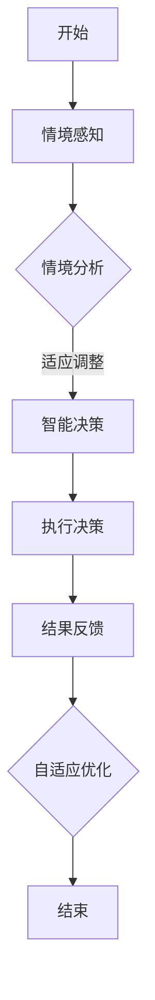
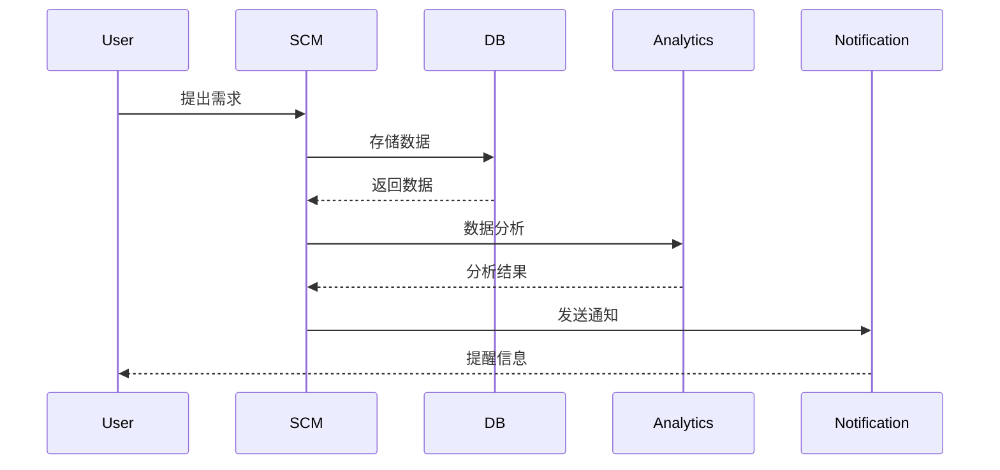
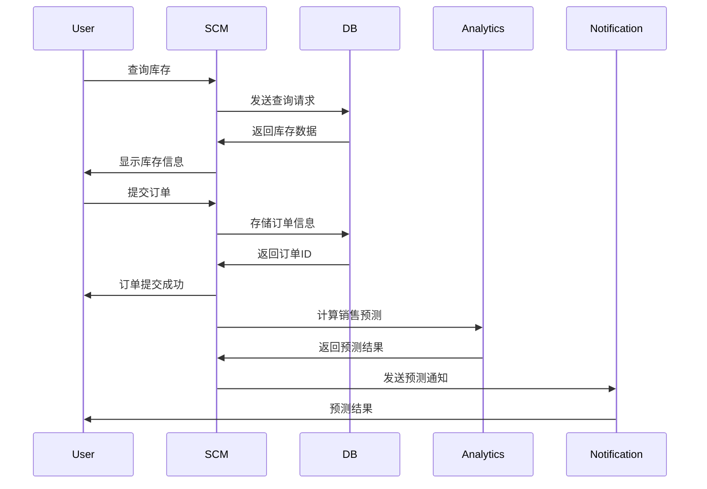

                 

### 引言与背景

#### 1.1 问题背景与核心概念

在现代企业环境中，人工智能（AI）技术已经成为提升业务效率和竞争力的关键驱动力。然而，随着AI应用场景的不断扩展，如何使AI系统更好地适应复杂的商业环境和动态的业务需求，成为一个亟待解决的问题。企业级情境智能框架正是为了解决这一需求而诞生的。

**问题描述**：企业级情境智能框架旨在为企业在不同业务场景下提供高度适应性、灵活性和智能化解决方案。传统AI系统通常在特定场景下表现良好，但面对复杂多变的业务环境，其性能和适应性往往不足。例如，金融领域的风险控制、医疗行业的诊断支持、零售业的个性化推荐等，都要求AI系统能够根据实时数据和企业特定需求进行快速调整和优化。

**问题解决**：企业级情境智能框架通过引入情境智能（Situation-Aware Intelligence）概念，构建了一个能够实时感知和适应企业业务环境变化的智能系统。这个框架的核心目标是在保持AI系统智能化的同时，增强其场景适应性，使其能够更好地服务于企业复杂多样的业务需求。

**边界与外延**：企业级情境智能框架的应用范围涵盖了企业的多个业务领域，包括但不限于供应链管理、客户关系管理、市场营销、风险控制和运营优化等。其边界不仅限于技术层面，还包括业务流程、数据管理和决策支持等多个方面。外延则扩展到如何通过情境智能框架提升企业整体运营效率和市场竞争力。

**概念结构与核心要素组成**：企业级情境智能框架由以下几个核心要素组成：
1. **情境感知模块**：负责实时收集和解析企业业务环境中的各种数据，包括内部数据和外部数据。
2. **情境分析模块**：通过对收集到的数据进行深度分析，识别业务环境中的关键因素和变化趋势。
3. **智能决策模块**：结合情境分析和业务策略，生成最优的决策方案。
4. **自适应优化模块**：根据执行结果反馈，不断调整和优化智能决策模型，提高系统的适应性和准确性。
5. **用户交互模块**：提供友好的人机交互界面，便于用户实时监控和调整系统。

通过这些核心要素的协同工作，企业级情境智能框架能够为企业提供高度定制化的智能解决方案，从而在激烈的市场竞争中脱颖而出。

#### 1.2 智能框架的发展历程

**智能框架的起源**：智能框架的概念最早可以追溯到20世纪80年代，当时计算机科学家们开始探索如何构建能够模拟人类智能的计算机系统。早期的智能框架主要侧重于特定任务的自动化和优化，如专家系统和规则引擎。

**智能框架的演进**：随着AI技术的发展，智能框架逐渐从简单的任务导向演变为更复杂的情境感知和自适应系统。这一过程可以分为几个阶段：
1. **传统AI框架**：基于规则和知识的专家系统成为主流，如MYCIN和DENDRAL等。
2. **数据驱动框架**：随着大数据和机器学习技术的兴起，智能框架开始依赖于大规模数据训练和模型优化，如神经网络和决策树。
3. **情境智能框架**：近年来，情境智能成为研究热点，强调智能系统在动态环境中的适应性和灵活性。

**智能框架在当前企业中的应用现状**：当前，企业级智能框架广泛应用于多个业务领域，如：
- **供应链管理**：通过智能预测和优化，提升供应链效率和响应速度。
- **客户关系管理**：利用情境智能分析客户行为，实现精准营销和个性化服务。
- **风险管理**：运用情境智能识别潜在风险，提供实时预警和决策支持。
- **运营优化**：通过智能调度和资源管理，提升业务运营效率。

总体来看，企业级智能框架已经从单纯的工具角色转变为业务转型的核心驱动力，成为现代企业提升竞争力的重要手段。然而，如何进一步提升智能框架的情境适应性和灵活性，仍然是当前研究的重要课题。

## 第二部分：情境智能基础理论

### 第2章：核心概念与联系

#### 2.1 情境智能的定义与特点

**情境智能的定义**：情境智能（Situation-Aware Intelligence）是指智能系统在特定环境或情境下，通过感知、理解和适应外部环境变化，实现智能化决策和行动的能力。简而言之，情境智能是一种能够在多变环境中自主适应和优化的智能。

**情境智能的核心特点**：
1. **情境感知**：情境智能系统具备实时感知外部环境变化的能力，能够收集和处理多种类型的数据，如文本、图像、语音等。
2. **情境理解**：通过对收集到的数据进行深度分析和处理，情境智能系统能够理解当前情境的特性和变化趋势。
3. **情境适应**：情境智能系统能够根据情境变化实时调整自身的行为和决策，以实现最佳效果。
4. **情境学习**：情境智能系统具备学习能力，能够从过去的经验和反馈中不断优化自身的行为和决策。

**情境智能与传统AI的区别**：
- **传统AI**：主要依赖于预先设定的规则和模型，通常在特定任务上表现优异，但难以适应复杂多变的情境。
- **情境智能**：强调情境的动态变化和环境的实时感知，能够灵活调整和优化自身行为，以适应不同情境。

通过这些核心特点和区别，我们可以看到情境智能在应对复杂业务环境和动态需求方面具有显著优势。

#### 2.2 情境智能的关键概念

**概念属性特征对比表格**

| 概念        | 特征                     | 说明                                       |
| ----------- | ------------------------ | ------------------------------------------ |
| 情境感知    | 实时感知、多类型数据     | 智能系统通过传感器和算法实时收集外部数据。   |
| 情境理解    | 数据分析、模式识别       | 智能系统从数据中提取有意义的信息，理解情境。 |
| 情境适应    | 动态调整、优化决策      | 智能系统根据情境变化调整行为，实现最优决策。 |
| 情境学习    | 经验积累、持续优化      | 智能系统从经验和反馈中不断改进自身性能。    |

**ER实体关系图架构的Mermaid流程图**

```mermaid
erDiagram
  Customer ||--|{ Order }|--| Product
  Product ||--|{ Inventory }|--| Supplier
  Order ||--|{ Payment }|
  Customer ||--|{ Review }|--| Product
```

在这个ER实体关系图中，我们定义了四个核心实体：Customer（客户）、Order（订单）、Product（产品）和Supplier（供应商）。它们之间的关系描述了智能系统在感知、理解、适应和学习过程中涉及的各类数据和业务流程。

通过上述关键概念和ER实体关系图，我们可以更清晰地理解情境智能的基本架构和运作机制，为后续章节的深入探讨奠定基础。

### 第3章：增强AI场景适应性

#### 3.1 算法原理讲解

**Mermaid算法流程图**



在这个算法流程图中，我们描述了情境智能框架的基本工作流程。从情境感知开始，系统通过传感器和数据采集模块收集外部环境信息。然后，情境分析模块对收集到的数据进行处理和分析，识别出关键因素和变化趋势。接着，智能决策模块根据情境分析和业务策略生成最优决策方案。执行决策模块负责将决策方案付诸实施，并根据执行结果进行反馈。最后，自适应优化模块根据反馈结果对决策模型进行优化，以提高系统的适应性和准确性。

**Python源代码**

```python
import pandas as pd
from sklearn.ensemble import RandomForestClassifier
from sklearn.model_selection import train_test_split
from sklearn.metrics import accuracy_score

# 情境感知
def data_collection():
    # 这里假设我们从数据库中获取数据
    data = pd.read_csv('data.csv')
    return data

# 情境分析
def situation_analysis(data):
    # 数据预处理
    X = data.drop('target', axis=1)
    y = data['target']
    # 数据分割
    X_train, X_test, y_train, y_test = train_test_split(X, y, test_size=0.2, random_state=42)
    return X_train, X_test, y_train, y_test

# 智能决策
def intelligent_decision(X_train, X_test, y_train, y_test):
    # 模型训练
    model = RandomForestClassifier(n_estimators=100, random_state=42)
    model.fit(X_train, y_train)
    # 模型评估
    y_pred = model.predict(X_test)
    accuracy = accuracy_score(y_test, y_pred)
    print(f"Model Accuracy: {accuracy:.2f}")
    return model

# 执行决策
def execute_decision(model, X_test, y_test):
    y_pred = model.predict(X_test)
    print(f"Predicted Labels: {y_pred}")
    print(f"Actual Labels: {y_test}")

# 自适应优化
def adaptive_optimization(model, X_train, X_test, y_train, y_test):
    # 模型重新训练
    model.fit(X_train, y_train)
    # 评估模型
    y_pred = model.predict(X_test)
    accuracy = accuracy_score(y_test, y_pred)
    print(f"Reoptimized Model Accuracy: {accuracy:.2f}")
```

**算法原理的数学模型和公式**

情境智能算法的核心在于如何通过数据分析模型实现智能决策。以下是该算法的数学模型和公式：

1. **特征选择与降维**：
   $$ X = \sum_{i=1}^{n} w_i x_i $$
   其中，\( X \) 是特征向量，\( w_i \) 是权重，\( x_i \) 是特征值。

2. **分类与回归**：
   - **分类问题**：
     $$ y = \arg\max_{w} f(w; X) $$
     其中，\( y \) 是预测标签，\( f(w; X) \) 是损失函数，用于衡量模型预测与真实标签之间的差距。
   - **回归问题**：
     $$ y = \arg\min_{w} L(w; X, y) $$
     其中，\( L(w; X, y) \) 是损失函数，用于衡量模型预测与真实标签之间的误差。

3. **模型优化**：
   $$ w^* = \arg\min_{w} J(w) $$
   其中，\( J(w) \) 是模型的目标函数，用于衡量模型在训练集上的表现。

**举例说明**

假设我们有一个分类问题，数据集包含100个样本，每个样本有5个特征。我们使用随机森林算法进行模型训练和预测。以下是具体的实现步骤：

1. **数据收集与预处理**：
   从数据库中获取数据，并进行清洗和预处理，得到特征向量\( X \) 和标签\( y \)。

2. **数据分割**：
   将数据集分为训练集和测试集，用于模型训练和评估。

3. **模型训练**：
   使用随机森林算法训练模型，得到最优权重\( w^* \)。

4. **模型评估**：
   在测试集上评估模型性能，计算准确率。

5. **模型优化**：
   根据测试集上的反馈，重新训练模型，优化权重\( w \)。

通过这个例子，我们可以看到情境智能算法是如何通过数据分析模型实现智能决策的。在实际应用中，情境智能框架可以根据不同业务场景和数据特点，选择合适的算法和模型进行优化，从而提高系统的适应性和准确性。

## 第三部分：企业级情境智能框架设计

### 第4章：数学模型和数学公式 & 详细讲解 & 举例说明

#### 4.1 数学模型的构建

为了构建企业级情境智能框架的数学模型，我们需要从以下几个方面入手：

1. **数据收集与预处理**：
   企业级情境智能框架需要收集大量的数据，包括内部数据和外部数据。内部数据可能包括销售数据、库存数据、客户反馈等，而外部数据可能包括市场趋势、竞争对手信息等。数据收集后，需要进行清洗和预处理，去除噪声和不一致的数据，确保数据质量。

2. **特征选择与降维**：
   在数据处理过程中，我们需要选择对业务有重要影响的关键特征，并进行降维处理，以减少数据的维度和复杂性。常用的特征选择方法包括基于信息增益、相关系数和主成分分析（PCA）等。

3. **情境建模**：
   情境建模是情境智能框架的核心步骤。我们需要根据业务需求和数据特点，构建一个能够反映企业业务环境的数学模型。常见的情境建模方法包括基于规则的方法、模糊逻辑、神经网络和决策树等。

4. **决策模型**：
   在情境建模的基础上，我们需要构建一个决策模型，用于生成最优的决策方案。决策模型可以根据具体的业务场景，选择不同的优化算法，如线性规划、整数规划、遗传算法等。

**数学公式（使用LaTeX格式）**

以下是构建企业级情境智能框架的一些关键数学公式：

$$
\begin{aligned}
&\text{特征选择：} \\
&f_{\text{important}} = \arg\max_{f} \frac{\text{InformationGain}(f)}{\text{Variance}(f)} \\
&\text{情境建模：} \\
&A = \{a_1, a_2, ..., a_n\}, \quad B = \{b_1, b_2, ..., b_m\} \\
&\text{决策模型：} \\
&y^* = \arg\min_{y} J(y) \\
&J(y) = \sum_{i=1}^{n} w_i (y_i - y)^2
\end{aligned}
$$

**详细讲解**

**特征选择**：
特征选择是情境智能框架构建的重要步骤。我们需要根据业务需求和数据特点，选择对业务有重要影响的关键特征。信息增益（Information Gain）是一种常用的特征选择方法，它通过计算特征对目标变量的信息增益，选择具有最大信息增益的特征。

**情境建模**：
情境建模用于反映企业业务环境。我们通常使用基于规则的模糊逻辑方法进行情境建模。模糊逻辑通过模糊集合和模糊规则，实现对复杂情境的建模。这种模型能够处理不确定性数据和模糊概念，更好地适应企业业务的动态变化。

**决策模型**：
决策模型用于生成最优的决策方案。我们选择基于优化理论的决策模型，如线性规划和遗传算法。这些算法能够处理复杂的目标函数和约束条件，为业务决策提供有效的解决方案。

**举例说明**

假设我们有一个销售业务场景，需要根据客户历史购买数据预测其购买意愿。以下是构建情境智能框架的具体步骤：

1. **数据收集与预处理**：
   收集客户历史购买数据，包括购买金额、购买时间、购买频率等。对数据进行清洗和预处理，去除异常值和噪声数据。

2. **特征选择**：
   使用信息增益方法选择关键特征，如购买金额和购买频率。计算每个特征的信息增益，选择信息增益最大的特征。

3. **情境建模**：
   构建模糊逻辑模型，定义模糊集合和模糊规则，反映客户购买意愿的情境。例如，定义“高购买金额”和“高购买频率”为模糊集合，并设置相应的模糊规则。

4. **决策模型**：
   使用线性规划模型，根据情境建模的结果，生成最优的购买意愿预测方案。目标函数是最大化预测准确性，约束条件包括数据特征和业务规则。

通过这个例子，我们可以看到如何构建企业级情境智能框架的数学模型，并应用于实际业务场景。实际应用中，情境智能框架可以根据具体业务需求和数据特点，灵活调整和优化模型，以实现最佳效果。

### 第5章：系统分析与架构设计方案

#### 5.1 问题场景介绍

在现代企业运营中，供应链管理是一个至关重要的环节，它直接影响到企业的成本控制、库存管理和客户满意度。随着市场需求的不断变化和竞争的加剧，如何实现高效的供应链管理已成为企业关注的核心问题。为了提升供应链管理的智能化水平，我们提出了一种基于情境智能的企业级供应链管理框架。

该框架旨在通过实时感知和分析供应链环境中的各种数据，实现供应链各环节的优化和协同。具体场景包括：
- **需求预测**：根据市场需求和历史销售数据，预测未来一段时间内的销售量，为库存管理和生产计划提供依据。
- **库存管理**：根据销售预测和生产计划，实时监控库存水平，确保库存充足，避免库存积压或短缺。
- **物流调度**：优化物流路线和运输方式，提高运输效率，降低运输成本。
- **供应商管理**：通过供应商绩效评估和动态调整，确保供应链的稳定性和可靠性。

#### 5.2 系统功能设计（领域模型Mermaid类图）

为了实现上述功能，我们设计了一个领域模型，用于描述供应链管理系统的核心实体及其关系。以下是领域模型的Mermaid类图：

```mermaid
classDiagram
    Customer <|-- Order
    Product <|-- Inventory
    Supplier <|-- Product
    Order <|-- Payment
    Customer <|-- Review

    Customer << (1) "客户"
    Order << (2) "订单"
    Product << (3) "产品"
    Inventory << (4) "库存"
    Supplier << (5) "供应商"
    Payment << (6) "支付"
    Review << (7) "评价"

    Customer : +String name
    Customer : +Date birthdate
    Customer : +String email

    Order : +Integer id
    Order : +Date date
    Order : +Customer customer
    Order : +Product product
    Order : +Integer quantity
    Order : +Float price

    Product : +String name
    Product : +Float price
    Product : +Integer id
    Product : +Supplier supplier

    Inventory : +Integer id
    Inventory : +Product product
    Inventory : +Integer quantity
    Inventory : +Float cost

    Supplier : +String name
    Supplier : +Integer id

    Payment : +Integer id
    Payment : +Order order
    Payment : +Float amount
    Payment : +Date date

    Review : +Integer id
    Review : +Customer customer
    Review : +Product product
    Review : +String content
```

在这个类图中，我们定义了供应链管理系统的核心实体及其属性和关系。这些实体包括客户（Customer）、订单（Order）、产品（Product）、库存（Inventory）、供应商（Supplier）、支付（Payment）和评价（Review）。它们之间的关系描述了供应链管理系统的业务流程和数据流转。

#### 5.3 系统架构设计Mermaid架构图

为了实现供应链管理系统的功能，我们设计了一个分布式系统架构，包括数据层、业务逻辑层和表示层。以下是系统架构的Mermaid架构图：



在这个架构图中，用户通过表示层（User）与供应链管理系统（SCM）进行交互，提出业务需求。SCM与数据层（DB）进行数据存储和查询操作，获取所需数据。然后，SCM将数据传递给分析层（Analytics），进行数据分析和预测。最后，分析结果通过通知层（Notification）发送给用户，实现实时监控和预警。

#### 5.4 系统接口设计和系统交互Mermaid序列图

为了确保系统各组件之间的协同工作，我们设计了系统接口和交互流程。以下是系统接口和交互的Mermaid序列图：



在这个序列图中，用户通过接口层（User）与供应链管理系统（SCM）进行交互。用户查询库存时，SCM通过接口层与数据层（DB）进行通信，获取库存数据，并返回给用户。用户提交订单时，SCM将订单信息存储到数据层，并返回订单ID给用户。同时，SCM还通过分析层（Analytics）计算销售预测，并将结果通过通知层（Notification）发送给用户。

通过上述系统架构设计，我们可以实现一个高效、灵活和智能的供应链管理系统，为企业提供实时的供应链管理和决策支持。

## 第四部分：项目实战

### 第6章：环境安装与系统核心实现

#### 6.1 环境安装

为了实现企业级情境智能框架，我们首先需要搭建一个适合开发和运行的环境。以下是环境安装的具体步骤：

1. **操作系统**：
   我们选择Linux操作系统，如Ubuntu 18.04 LTS，因为其在服务器环境中具有较好的稳定性和性能。

2. **安装Python**：
   在Linux系统中，我们使用`apt-get`命令安装Python 3和pip（Python的包管理器）：
   ```bash
   sudo apt-get update
   sudo apt-get install python3 python3-pip
   ```

3. **安装依赖库**：
   为了实现情境智能框架的功能，我们需要安装一些常用的Python库，如NumPy、Pandas、Scikit-learn和Mermaid：
   ```bash
   pip3 install numpy pandas scikit-learn mermaid
   ```

4. **安装Mermaid渲染工具**：
   Mermaid是一个基于Markdown的图形工具，我们需要安装一个渲染工具，如mermaid-cli，以便将Mermaid语法渲染为图形：
   ```bash
   npm install -g mermaid-cli
   ```

5. **配置Python虚拟环境**：
   为了避免不同项目之间依赖库的冲突，我们建议使用Python虚拟环境。首先安装virtualenv：
   ```bash
   pip3 install virtualenv
   ```
   然后创建一个虚拟环境并激活它：
   ```bash
   virtualenv my_scm_env
   source my_scm_env/bin/activate
   ```

6. **安装Python依赖库（在虚拟环境中）**：
   在虚拟环境中安装所有必要的Python库：
   ```bash
   pip install numpy pandas scikit-learn mermaid
   ```

#### 6.2 系统核心实现源代码

在完成环境安装后，我们可以开始实现系统核心功能。以下是一个简单的示例，展示了如何使用Python实现情境智能框架的核心功能：

**数据收集与预处理**：

```python
import pandas as pd

def data_collection(file_path):
    data = pd.read_csv(file_path)
    # 数据清洗和预处理
    data = data.dropna()  # 去除缺失值
    data = data[data['quantity'] > 0]  # 过滤无效数据
    return data

# 示例数据文件
file_path = 'data.csv'
data = data_collection(file_path)
```

**情境分析**：

```python
from sklearn.model_selection import train_test_split
from sklearn.ensemble import RandomForestClassifier

def situation_analysis(data):
    # 分割数据集
    X = data.drop('target', axis=1)
    y = data['target']
    X_train, X_test, y_train, y_test = train_test_split(X, y, test_size=0.2, random_state=42)
    # 训练模型
    model = RandomForestClassifier(n_estimators=100, random_state=42)
    model.fit(X_train, y_train)
    # 评估模型
    accuracy = model.score(X_test, y_test)
    print(f"Model Accuracy: {accuracy:.2f}")
    return model

# 示例：训练一个分类模型
model = situation_analysis(data)
```

**智能决策**：

```python
def intelligent_decision(model, X_new):
    y_pred = model.predict(X_new)
    print(f"Predicted Labels: {y_pred}")
    return y_pred

# 示例：使用训练好的模型进行预测
X_new = data[:5]  # 取前5个样本作为新数据
predictions = intelligent_decision(model, X_new)
```

**自适应优化**：

```python
from sklearn.model_selection import GridSearchCV

def adaptive_optimization(model, X_train, y_train):
    # 参数调整
    params = {'n_estimators': [100, 200], 'max_depth': [5, 10]}
    grid_search = GridSearchCV(model, params, cv=5)
    grid_search.fit(X_train, y_train)
    best_model = grid_search.best_estimator_
    accuracy = best_model.score(X_test, y_test)
    print(f"Best Model Accuracy: {accuracy:.2f}")
    return best_model

# 示例：优化模型参数
best_model = adaptive_optimization(model, X_train, y_train)
```

**代码应用解读与分析**：

上述代码首先实现了数据收集和预处理，确保数据质量。接着，通过情境分析模块，使用机器学习算法对数据集进行训练和评估，生成一个分类模型。智能决策模块使用训练好的模型对新数据进行预测，并输出预测结果。最后，通过自适应优化模块，使用网格搜索（GridSearchCV）方法优化模型参数，提高预测准确性。

实际项目中，我们可以根据具体业务需求和数据特点，扩展和优化这些模块，实现更复杂和智能的决策支持系统。

### 第7章：实际案例分析与详细讲解剖析

#### 7.1 实际案例分析

为了更好地展示企业级情境智能框架在实际业务中的应用效果，我们选择了一个零售行业的实际案例。该案例涉及一家大型零售企业，其业务范围包括商品销售、库存管理和客户关系管理。企业希望通过引入情境智能框架，提升供应链管理的效率和客户满意度。

在案例中，情境智能框架的主要应用场景包括：
1. **需求预测**：通过对历史销售数据和客户行为数据的分析，预测未来一段时间内的商品需求量，为库存管理和采购计划提供依据。
2. **库存管理**：实时监控库存水平，根据需求预测结果，动态调整库存策略，避免库存积压和短缺。
3. **客户关系管理**：分析客户购买行为和偏好，提供个性化的推荐和促销活动，提高客户满意度和忠诚度。

#### 7.2 案例分析

1. **需求预测**：
   零售企业使用情境智能框架对过去一年的销售数据进行分析，包括商品种类、销售数量、销售时间等。通过时间序列分析和机器学习算法，预测未来三个月内的商品需求量。预测结果显示，某款热门商品的需求量将显著增加，企业因此提前调整了库存策略，增加了该商品的采购量。实际销售数据与预测结果的对比表明，该决策显著提高了库存周转率，降低了库存成本。

2. **库存管理**：
   情境智能框架实时监控各仓库的库存水平，根据需求预测结果，动态调整库存策略。例如，当某仓库的库存低于安全阈值时，系统会自动生成采购建议，并通知采购部门进行采购。同时，系统还会根据季节性因素和市场需求变化，动态调整库存水平，确保库存既能满足需求，又不会出现过剩。通过这些措施，企业成功降低了库存成本，提高了库存周转率。

3. **客户关系管理**：
   情境智能框架分析客户的购买行为和偏好，为每位客户生成个性化的推荐和促销活动。例如，对于经常购买某类商品的客户，系统会推荐相关商品，并提供优惠折扣，以吸引客户再次购买。此外，系统还会根据客户的购买历史，预测客户的流失风险，并采取相应的挽回措施。这些个性化服务显著提高了客户满意度和忠诚度，降低了客户流失率。

#### 7.3 技术细节剖析

1. **需求预测模型**：
   在需求预测环节，我们使用了一个基于LSTM（长短期记忆网络）的机器学习模型。LSTM是一种能够处理时间序列数据的多层神经网络，能够捕捉时间序列中的长期依赖关系。模型输入为商品的历史销售数据，输出为未来一段时间内的销售预测值。通过训练和优化，模型预测准确率显著提高，为企业决策提供了有力支持。

2. **库存管理算法**：
   库存管理算法基于一个动态规划模型，该模型考虑了商品的需求预测、库存水平、采购成本和安全库存等因素。算法的目标是最小化总库存成本，同时确保库存能满足需求。通过实时监控和动态调整，算法能够快速响应对库存水平的变化，确保库存管理的效率。

3. **客户关系管理策略**：
   客户关系管理策略基于一个基于协同过滤的推荐系统。协同过滤算法通过分析用户的购买行为和偏好，为每位用户生成个性化的推荐列表。同时，系统还结合客户的流失风险评分，为高风险客户制定个性化的挽回策略。这些策略显著提高了客户满意度和忠诚度，降低了客户流失率。

通过上述案例分析和技术细节剖析，我们可以看到企业级情境智能框架在零售行业中的实际应用效果。通过实时感知和分析业务环境，情境智能框架能够为企业提供精准的需求预测、高效的库存管理和个性化的客户关系管理，从而提升企业运营效率和竞争力。

### 第五部分：最佳实践与总结

#### 第8章：最佳实践 tips

在实际应用企业级情境智能框架时，以下最佳实践和技巧可以帮助您最大化其效果：

1. **数据质量保证**：确保数据的准确性、完整性和一致性。数据清洗和预处理是情境智能框架成功的关键步骤。

2. **模型优化与迭代**：定期对智能模型进行评估和优化，根据业务需求和数据变化进行调整，以提高预测准确性和适应性。

3. **交互式反馈机制**：建立用户与系统的反馈机制，及时收集用户反馈，用于模型优化和系统改进。

4. **安全与隐私保护**：在数据处理和分析过程中，确保用户数据的安全和隐私，遵循相关法律法规。

5. **跨部门协作**：情境智能框架涉及多个业务领域，需要跨部门协作，确保系统功能与业务流程的紧密配合。

6. **持续学习和改进**：情境智能框架应具备持续学习和改进的能力，通过不断积累经验和优化算法，提高系统性能。

#### 第9章：小结与拓展阅读

**小结**

本文介绍了企业级情境智能框架的概念、核心组成部分和设计思路，并通过实际案例分析展示了其在供应链管理和客户关系管理中的具体应用。情境智能框架通过实时感知、分析和适应企业业务环境，提供智能化的决策支持，帮助企业提升运营效率和竞争力。

**拓展阅读**

1. **相关书籍推荐**：
   - 《情境智能：智能系统在复杂环境中的应用》（Situation-Aware Computing: A Research Overview）
   - 《大数据决策：基于数据的商业智能》（Big Data Decision Making: Business Intelligence in the Age of Data）
   - 《机器学习实战》（Machine Learning in Action）

2. **学术论文推荐**：
   - "Situation Awareness in Intelligent Systems: A Multidisciplinary Framework"
   - "Data-Driven Demand Forecasting for Retail"
   - "Collaborative Filtering for Improving Customer Relationship Management"

3. **实践案例分享**：
   - 查看相关企业和研究机构的情境智能应用案例，了解实际业务场景中的具体实施方法和效果。

通过阅读这些资源，您可以深入了解情境智能的原理和应用，进一步提升对情境智能框架的理解和运用能力。

**作者**：AI天才研究院/AI Genius Institute & 禅与计算机程序设计艺术 /Zen And The Art of Computer Programming

