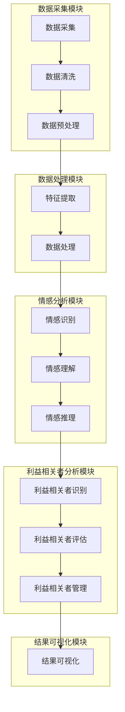
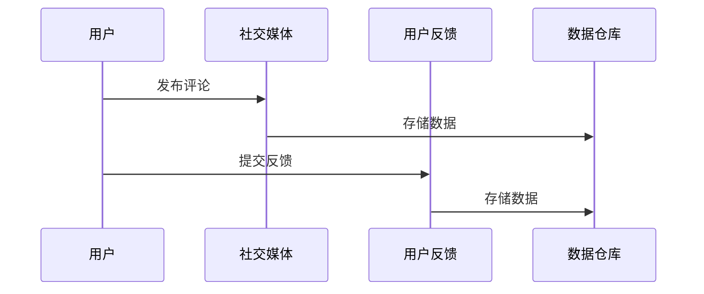
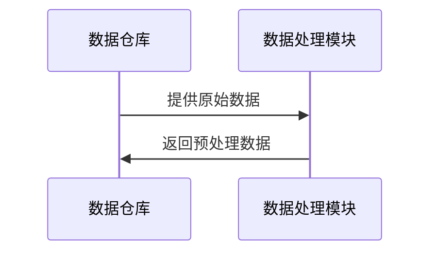
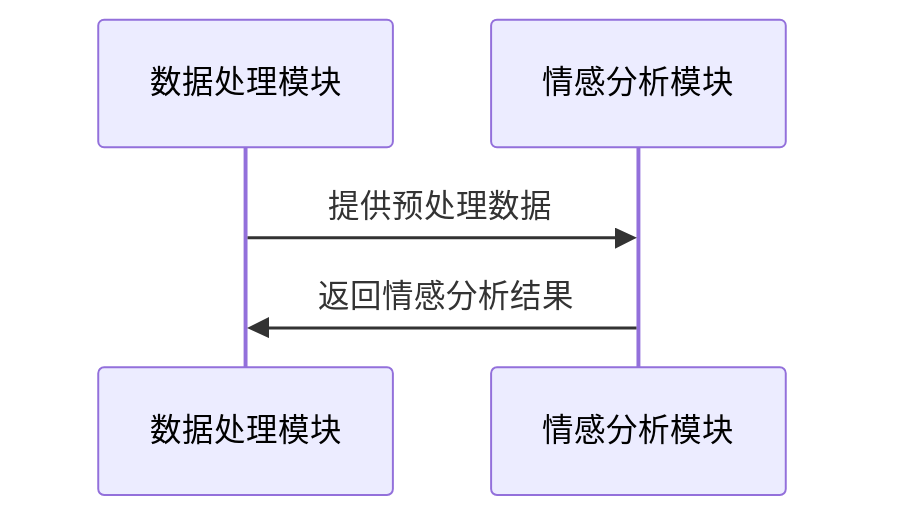
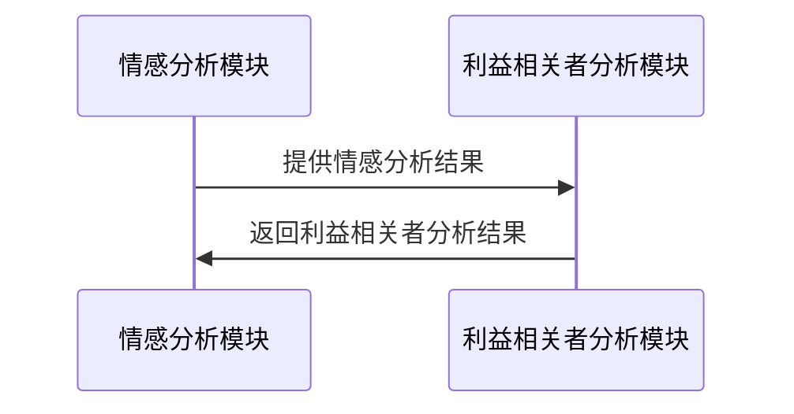
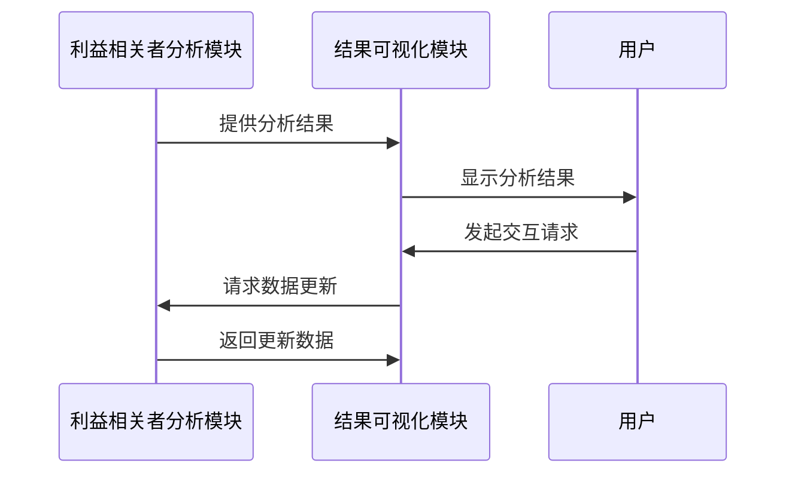
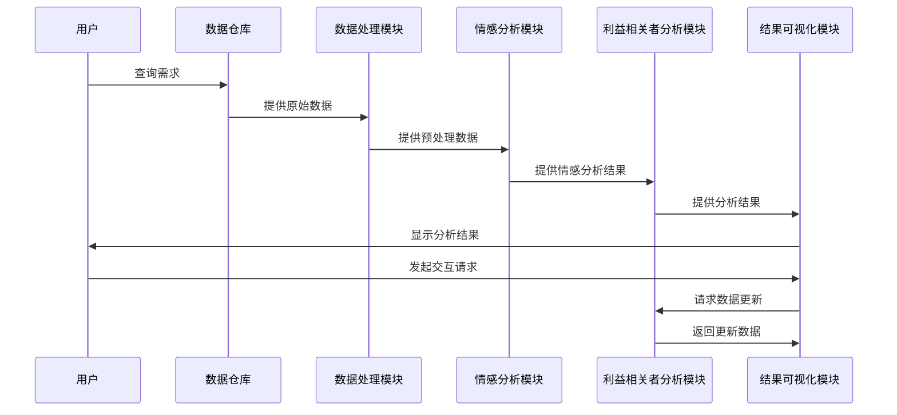

                 

### 1.1 情感计算的定义与重要性

#### 1.1.1 情感计算的定义

情感计算（Affective Computing）是指使计算机具备识别、理解、处理和模拟人类情感的能力。它融合了计算机科学、心理学、认知科学等多个领域的知识，旨在开发出能更好地与人类交互的智能系统。

**核心技术：**

- **情感识别**：通过面部表情、语音语调、生理信号等感知用户的情感状态。
- **情感理解**：分析用户的情感表达，理解其背后的意图和情绪。
- **情感生成**：根据用户的需求和环境，计算机模拟出相应的情感反应。

#### 1.1.2 情感计算的核心技术

情感计算的核心技术包括情感识别、情感理解和情感生成。以下是对这些技术的详细介绍：

- **情感识别**：情感识别是指从用户的面部表情、语音、文本等数据中检测情感状态。例如，通过分析语音的音高、音量和节奏，可以识别出用户的情绪状态，如兴奋、愤怒、悲伤等。

- **情感理解**：情感理解是指分析用户情感表达背后的意图和情绪。这需要结合自然语言处理、机器学习等技术，理解用户在特定情境下的情感表达。

- **情感生成**：情感生成是指计算机根据用户的需求和环境，生成相应的情感反应。例如，在客服机器人中，当用户表达出愤怒的情绪时，机器人可以生成相应的回复，如道歉或提供帮助。

#### 1.1.3 情感计算在企业中的应用

情感计算在企业中的应用非常广泛，以下是一些典型的应用场景：

- **客户服务**：通过情感计算，企业可以更好地理解客户的需求和情感，提供个性化的服务。例如，在客服机器人中，通过分析用户的情感状态，机器人可以提供更恰当的回复，提高客户满意度。

- **员工管理**：企业可以通过情感计算分析员工的情感状态，了解员工的工作满意度、压力水平等，从而采取相应的措施，提高员工的工作效率。

- **市场营销**：情感计算可以帮助企业了解消费者的情感需求，从而制定更有针对性的营销策略。例如，通过分析社交媒体上的用户评论，企业可以了解产品的市场反响，优化产品设计。

### 1.2 企业级情感计算平台的意义

#### 1.2.1 企业级情感计算平台的定义

企业级情感计算平台是指针对企业特定需求而构建的，集成了情感识别、情感理解和情感生成等技术的综合性平台。它能够帮助企业更好地理解客户、员工和市场，从而提高业务效率和竞争力。

#### 1.2.2 企业级情感计算平台的优势

企业级情感计算平台具有以下优势：

- **提高客户满意度**：通过情感计算，企业可以更准确地识别和理解客户的情感需求，提供个性化的服务，从而提高客户满意度。

- **优化员工管理**：企业可以通过情感计算分析员工的工作状态，及时发现和解决员工的问题，提高员工的工作效率和满意度。

- **提升营销效果**：情感计算可以帮助企业了解消费者的情感需求，优化产品设计和营销策略，提高市场竞争力。

#### 1.2.3 企业级情感计算平台的应用场景

企业级情感计算平台的应用场景非常广泛，以下是一些典型的应用场景：

- **客户服务**：企业可以搭建基于情感计算的客户服务平台，通过语音、文本等渠道识别客户的情感状态，提供个性化的服务。

- **人力资源**：企业可以通过情感计算分析员工的工作满意度、压力水平等，优化员工管理策略，提高员工的工作效率。

- **市场营销**：企业可以利用情感计算分析社交媒体上的用户评论、情感状态等，了解市场动态，优化营销策略。

### 1.3 情感计算平台的核心概念

#### 1.3.1 情感分析

情感分析（Sentiment Analysis）是指通过自然语言处理技术，对文本、语音等数据进行分析，识别出其中的情感倾向。情感分析是情感计算平台的核心功能之一，它能够帮助企业了解用户对产品、服务等的情感态度。

**情感分析算法的类型：**

- **基于规则的方法**：通过预设的情感词典和规则，对文本进行情感分类。
- **基于机器学习的方法**：利用机器学习算法，如支持向量机（SVM）、朴素贝叶斯等，对情感分类进行建模。
- **基于深度学习的方法**：利用深度学习算法，如卷积神经网络（CNN）、循环神经网络（RNN）等，对情感分类进行建模。

#### 1.3.2 情感识别

情感识别（Affective Recognition）是指通过分析用户的生理信号、面部表情、语音语调等，识别出用户的情感状态。情感识别是实现情感计算的基础，它能够帮助企业了解用户的情感需求。

**情感识别的挑战：**

- **数据复杂性**：用户的情感表达多种多样，数据复杂性高，需要有效的特征提取和情感识别算法。
- **跨模态融合**：如何有效地融合多种情感信息，如文本、语音、面部表情等，以提高情感识别的准确性。

#### 1.3.3 情感推理

情感推理（Affective Reasoning）是指基于用户的情感状态和行为，推断出用户的需求和意图。情感推理是情感计算的高级应用，它能够帮助企业实现个性化服务。

**情感推理的应用场景：**

- **推荐系统**：根据用户的情感状态，推荐用户可能感兴趣的产品或服务。
- **客户关系管理**：根据用户的情感状态，优化客户服务策略，提高客户满意度。

#### 1.3.4 情感计算模型

情感计算模型是指用于实现情感识别、情感理解和情感生成等功能的数学模型和算法。常见的情感计算模型包括情感分类模型、情感识别模型、情感生成模型等。

**情感计算模型的应用：**

- **情感分类模型**：用于对文本、语音等数据中的情感进行分类，如正面、负面、中性等。
- **情感识别模型**：用于识别用户的情感状态，如高兴、愤怒、悲伤等。
- **情感生成模型**：用于根据用户的情感状态，生成相应的情感反应，如回复、推荐等。

### 总结

企业级情感计算平台是现代企业提高业务效率和竞争力的关键工具。通过对情感计算的定义、核心技术、应用场景和核心概念进行深入探讨，我们为搭建一个高效的企业级情感计算平台奠定了基础。在接下来的章节中，我们将进一步探讨情感计算算法的原理和实现方法，为企业级情感计算平台的建设提供更具体的指导。

---

$$
\text{本文的核心关键词包括：情感计算、企业级、情感分析、利益相关者、算法原理、系统架构、项目实战、最佳实践。}
$$

---

### 1.2 企业级情感计算平台的意义

#### 1.2.1 企业级情感计算平台的定义

企业级情感计算平台是一个集成多种情感计算技术的综合性系统，旨在帮助企业在复杂多变的市场环境中，更准确地识别和解读利益相关者的情感状态和需求。这种平台通常具有以下特征：

- **全面性**：覆盖多种数据源，如文本、语音、图像等，以获取全面的情感信息。
- **智能化**：运用先进的机器学习和深度学习技术，实现自动化的情感分析和理解。
- **可扩展性**：能够根据企业的需求变化，灵活扩展功能和性能。

#### 1.2.2 企业级情感计算平台的优势

企业级情感计算平台为企业带来的优势主要体现在以下几个方面：

1. **提升客户体验**：通过精准的情感识别和理解，企业能够提供个性化的客户服务，满足不同客户的情感需求，从而提高客户满意度和忠诚度。

2. **优化决策支持**：企业级情感计算平台能够收集和分析大量的情感数据，为企业的战略决策提供有力的数据支持，减少决策的不确定性。

3. **增强竞争力**：在激烈的市场竞争中，企业级情感计算平台帮助企业更好地了解市场动态和消费者需求，快速响应市场变化，提升企业的市场竞争力。

#### 1.2.3 企业级情感计算平台的应用场景

企业级情感计算平台在各个行业都有广泛的应用场景，以下是一些典型的应用：

1. **客户关系管理**：通过分析客户的情感状态，企业可以制定更有效的客户服务策略，提升客户体验和忠诚度。

2. **市场营销**：企业可以利用情感计算分析消费者对产品或广告的情感反应，优化营销策略，提高营销效果。

3. **人力资源**：通过分析员工的情感状态，企业可以了解员工的工作满意度和心理健康状况，从而采取相应的措施，提升员工的工作效率和满意度。

4. **风险控制**：企业可以通过情感计算分析金融市场的情绪波动，及时识别潜在风险，做出更精准的决策。

#### 1.2.4 情感计算平台的核心功能和组件

一个典型的企业级情感计算平台通常包含以下几个核心功能和组件：

1. **情感识别模块**：通过面部识别、语音识别、文本分析等技术，实时捕捉和识别利益相关者的情感状态。

2. **情感分析模块**：利用机器学习和深度学习算法，对情感识别模块捕捉到的数据进行情感分析，判断情感的类型和强度。

3. **情感理解模块**：通过自然语言处理技术，对情感数据进行深入分析，理解背后的意图和动机。

4. **情感生成模块**：根据情感分析的结果，生成相应的情感反应，如个性化的建议、反馈或情感互动。

5. **数据存储与处理模块**：负责存储和处理大量的情感数据，支持数据的检索和分析。

6. **用户界面模块**：提供直观的用户界面，让企业用户能够方便地使用平台功能，查看和分析情感数据。

#### 1.2.5 情感计算平台的技术挑战

尽管企业级情感计算平台具有巨大的潜力和价值，但其在实际应用中仍然面临一些技术挑战：

1. **数据质量**：情感数据的获取和处理质量直接影响到情感计算的结果。如何有效地清洗、标注和处理大量情感数据，是情感计算平台面临的一大挑战。

2. **跨模态融合**：情感计算通常涉及多种数据源，如文本、语音、图像等。如何有效地融合不同模态的数据，以提高情感识别和理解的准确性，是一个重要的研究课题。

3. **实时性**：在实时应用场景中，如在线客户服务，要求情感计算平台能够快速响应并处理用户情感数据。如何提高系统的实时性，是一个亟待解决的问题。

4. **隐私保护**：情感计算平台需要处理大量的个人数据，如何保护用户的隐私，防止数据泄露，是平台设计和运行中必须考虑的问题。

### 结论

企业级情感计算平台在现代企业运营中扮演着越来越重要的角色。通过深入理解情感计算平台的核心概念、优势和挑战，企业可以更好地利用这一技术，提升业务效率和竞争力。在接下来的章节中，我们将进一步探讨情感计算的核心概念，包括情感分析算法、利益相关者分析等，为搭建高效的企业级情感计算平台提供更深入的指导。

---

$$
\text{本文的核心关键词包括：企业级情感计算平台、情感识别、情感分析、利益相关者、情感理解、数据质量、跨模态融合、实时性、隐私保护。}
$$

---

### 1.3 情感计算平台的核心概念

#### 1.3.1 情感分析

情感分析（Sentiment Analysis），也被称为意见挖掘（Opinion Mining），是一种自然语言处理（NLP）技术，旨在自动识别文本数据中的主观情感倾向。情感分析广泛应用于社交媒体分析、舆情监测、产品评论分析等领域。其核心目的是将文本数据中的情感标签化，通常分为正面、负面、中性三大类。

**情感分析算法的类型：**

1. **基于规则的方法**：这种方法依赖于预定义的规则和词典。例如，通过情感词典来匹配文本中的情感词，根据情感词的正负性进行情感分类。

2. **基于机器学习的方法**：这种方法通过训练模型来自动识别情感。常见的机器学习算法包括支持向量机（SVM）、朴素贝叶斯（Naive Bayes）和随机森林（Random Forest）等。

3. **基于深度学习的方法**：这种方法利用深度神经网络（DNN）、卷积神经网络（CNN）和循环神经网络（RNN）等，通过大量的训练数据学习情感分类。深度学习方法在处理复杂文本数据时表现出色。

**情感分析算法的挑战：**

- **数据复杂性**：情感表达多种多样，涉及文本的语法、语义和上下文等因素。
- **情感极性**：情感极性是指情感的正负倾向，如何准确识别情感极性是一个挑战。
- **跨语言情感分析**：不同语言的文化背景和表达习惯不同，如何实现跨语言的情感分析是一个重要问题。

#### 1.3.2 情感识别

情感识别（Affective Recognition）是指通过分析用户的生理信号、面部表情、语音语调等，识别出用户的情感状态。情感识别是情感计算的基础，它的准确性直接影响整个系统的性能。

**情感识别的挑战：**

- **数据复杂性**：用户的情感表达多种多样，数据复杂性高，需要有效的特征提取和情感识别算法。
- **跨模态融合**：如何有效地融合多种情感信息，如文本、语音、面部表情等，以提高情感识别的准确性。

**情感识别的技术手段：**

- **生理信号识别**：通过测量用户的生理信号，如心率、皮肤电活动（EDA）等，来识别情感状态。
- **面部表情识别**：通过计算机视觉技术，分析用户的面部表情，识别情感状态。
- **语音识别**：通过分析用户的语音语调、音高、音量等，识别情感状态。

#### 1.3.3 情感推理

情感推理（Affective Reasoning）是指基于用户的情感状态和行为，推断出用户的需求和意图。情感推理是情感计算的高级应用，它能够帮助企业实现个性化服务。

**情感推理的应用场景：**

- **个性化推荐**：根据用户的情感状态，推荐用户可能感兴趣的产品或服务。
- **客户服务**：根据用户的情感状态，提供个性化的客户服务，提高客户满意度。
- **员工管理**：根据员工的情感状态，优化员工的工作环境和激励措施。

**情感推理的挑战：**

- **多模态数据融合**：如何有效地融合来自不同模态的数据，如文本、语音、图像等。
- **情感状态的持久性**：用户的情感状态可能会随时间和情境发生变化，如何持续准确地识别用户的情感状态。

#### 1.3.4 情感计算模型

情感计算模型是指用于实现情感识别、情感理解和情感生成等功能的数学模型和算法。这些模型可以分为情感分类模型、情感识别模型和情感生成模型等。

**情感分类模型**：

情感分类模型主要用于分类文本数据中的情感极性。常见的模型包括：

- **朴素贝叶斯分类器**：基于贝叶斯定理，通过词频统计进行情感分类。
- **支持向量机（SVM）**：通过最大化分类边界，实现情感分类。
- **卷积神经网络（CNN）**：通过卷积操作，提取文本的局部特征，进行情感分类。

**情感识别模型**：

情感识别模型用于识别用户的具体情感状态，如高兴、愤怒、悲伤等。常见的模型包括：

- **长短期记忆网络（LSTM）**：通过记忆单元，处理序列数据，识别情感状态。
- **Transformer模型**：通过自注意力机制，捕捉文本中的长距离依赖关系，进行情感识别。

**情感生成模型**：

情感生成模型用于根据用户的情感状态，生成相应的情感反应。常见的模型包括：

- **生成对抗网络（GAN）**：通过生成器和判别器的对抗训练，生成符合用户情感状态的文本。
- **变分自编码器（VAE）**：通过编码器和解码器，学习文本的情感特征，生成情感反应。

### 情感分析算法与利益相关者分析的联系

情感分析算法与利益相关者分析在情感计算平台中有着紧密的联系。情感分析算法可以识别出文本、语音等数据中的情感倾向，而利益相关者分析则可以对这些情感数据进行进一步的解读，识别出与利益相关者相关的情感信息。

**联系表现：**

- **情感数据的来源**：利益相关者分析依赖于情感分析算法提供的数据，通过情感分析，可以获取大量的情感信息。
- **情感数据的解读**：利益相关者分析通过分析这些情感数据，识别出与利益相关者相关的情感，如客户满意度、员工情绪等。
- **情感数据的决策支持**：利益相关者分析的结果可以为企业的决策提供支持，如调整营销策略、改善客户服务、优化员工管理等。

**作用**：

- **提高决策精度**：通过情感分析算法和利益相关者分析的结合，企业可以更准确地了解利益相关者的需求和情感，从而做出更精准的决策。
- **优化业务流程**：情感分析和利益相关者分析的结果可以帮助企业优化业务流程，提高业务效率。

### 结论

情感计算平台的核心概念包括情感分析、情感识别、情感推理和情感计算模型。这些概念在企业级应用中发挥着重要作用，通过情感分析可以获取利益相关者的情感信息，通过利益相关者分析可以解读这些情感信息，为企业提供决策支持。在接下来的章节中，我们将进一步探讨情感计算平台的算法原理，包括具体的算法模型和应用实例。

---

$$
\text{本文的核心关键词包括：情感分析、情感识别、情感推理、情感计算模型、利益相关者分析、情感数据、决策支持。}
$$

---

### 2.1 情感分析算法原理

情感分析是情感计算平台中的核心组成部分，它通过对文本、语音等数据进行分析，识别出其中的情感倾向。本节将详细讲解情感分析算法的基本原理，包括其类型、实现过程和常见应用。

#### 情感分析算法的类型

情感分析算法主要可以分为以下几类：

1. **基于规则的方法**：这种方法依赖于预定义的规则和词典。例如，通过情感词典来匹配文本中的情感词，根据情感词的正负性进行情感分类。这种方法简单直观，但适应性较差，难以应对复杂多变的文本数据。

2. **基于机器学习的方法**：这种方法通过训练模型来自动识别情感。常见的机器学习算法包括支持向量机（SVM）、朴素贝叶斯（Naive Bayes）和随机森林（Random Forest）等。这些算法通过对大量标注数据的训练，可以自动学习情感分类规则，具有较高的准确性和适应性。

3. **基于深度学习的方法**：这种方法利用深度神经网络（DNN）、卷积神经网络（CNN）和循环神经网络（RNN）等，通过大量的训练数据学习情感分类。深度学习方法在处理复杂文本数据时表现出色，但需要大量的计算资源和数据支持。

#### 情感分析算法的实现过程

情感分析算法的实现通常包括以下几个步骤：

1. **数据预处理**：这一步骤包括文本清洗、去噪、分词和词性标注等。数据预处理是情感分析的基础，直接影响到后续的情感分析结果。

2. **特征提取**：通过将文本转换为特征向量，以便于机器学习算法进行处理。常用的特征提取方法包括词袋模型（Bag of Words, BOW）、TF-IDF（Term Frequency-Inverse Document Frequency）和Word2Vec等。

3. **模型训练**：使用训练集对机器学习模型进行训练，使其能够自动识别文本中的情感倾向。训练过程通常包括参数调整和模型优化。

4. **情感分类**：使用训练好的模型对新的文本数据进行情感分类，判断其情感倾向是正面、负面还是中性。

5. **结果验证**：通过测试集对模型的分类结果进行验证，评估模型的准确性和可靠性。

#### 情感分析算法的常见应用

情感分析算法在多个领域都有广泛的应用：

1. **社交媒体分析**：通过分析社交媒体上的用户评论、帖子等，可以了解公众对某个话题或品牌的情感态度，为企业提供市场洞察。

2. **产品评论分析**：通过分析产品评论，可以了解消费者对产品的满意度，帮助企业优化产品设计和服务。

3. **舆情监测**：通过情感分析，可以实时监控社会舆论动态，及时发现和应对潜在的危机事件。

4. **客户服务**：通过情感分析，可以识别出客户的情感需求，提供个性化的服务，提高客户满意度。

### 示例：基于朴素贝叶斯的情感分类算法

朴素贝叶斯分类器是一种基于贝叶斯定理的简单概率分类器，它在情感分析中有着广泛的应用。以下是一个基于朴素贝叶斯的情感分类算法的简单示例：

```python
import numpy as np
from sklearn.model_selection import train_test_split
from sklearn.naive_bayes import MultinomialNB
from sklearn.metrics import accuracy_score

# 假设我们有一份情感标注的数据集
data = [
    ("这是一个很好的产品", "正面"),
    ("产品功能很差", "负面"),
    ("使用体验非常好", "正面"),
    ("价格太贵了", "负面"),
    # ... 更多数据
]

# 将数据分为文本和标签
texts = [text for text, _ in data]
labels = [label for _, label in data]

# 将标签转换为数字表示
label_to_id = {"正面": 1, "负面": 0}
ids = [label_to_id[label] for label in labels]

# 划分训练集和测试集
X_train, X_test, y_train, y_test = train_test_split(texts, ids, test_size=0.2, random_state=42)

# 训练朴素贝叶斯分类器
classifier = MultinomialNB()
classifier.fit(X_train, y_train)

# 预测测试集
y_pred = classifier.predict(X_test)

# 计算准确率
accuracy = accuracy_score(y_test, y_pred)
print(f"准确率: {accuracy:.2f}")
```

在这个示例中，我们首先定义了一组情感标注的数据集，然后将数据分为文本和标签两部分。接下来，我们将标签转换为数字表示，以便于算法处理。然后，我们使用训练集对朴素贝叶斯分类器进行训练，并使用测试集进行预测，最后计算准确率。

### 总结

情感分析算法是情感计算平台的重要组成部分，通过分析文本、语音等数据中的情感倾向，可以为企业提供重要的市场洞察和决策支持。本文详细介绍了情感分析算法的基本原理、实现过程和常见应用，并通过一个简单的示例展示了如何使用朴素贝叶斯分类器进行情感分类。

---

$$
\text{本文的核心关键词包括：情感分析、朴素贝叶斯、机器学习、深度学习、文本数据、特征提取、模型训练、情感分类、社交媒体分析、产品评论分析、舆情监测、客户服务。}
$$

---

### 2.2 利益相关者分析

利益相关者分析（Stakeholder Analysis）是一种评估和理解项目、策略或决策中涉及的各种利益相关者及其利益、权力和影响力的方法。在情感计算平台中，利益相关者分析起着至关重要的作用，因为它有助于深入理解不同利益相关者的情感状态和需求，从而为企业提供有针对性的决策支持。本节将详细探讨利益相关者分析的定义、重要性以及具体策略。

#### 2.2.1 利益相关者定义

利益相关者是指任何受到项目、策略或决策影响，或在项目、策略或决策中具有重要角色的人或组织。常见的利益相关者包括：

- **内部利益相关者**：如公司的员工、股东、管理层等。
- **外部利益相关者**：如客户、供应商、竞争对手、政府机构等。

#### 2.2.2 利益相关者分析的重要性

利益相关者分析在企业级情感计算平台中具有重要意义，原因如下：

1. **决策支持**：通过识别和理解利益相关者的情感状态和需求，企业可以做出更明智的决策，提高项目或策略的成功率。

2. **资源分配**：了解利益相关者的利益和影响力，有助于企业合理分配资源，确保项目或策略的顺利进行。

3. **风险管理**：通过识别潜在的利益冲突和风险，企业可以采取预防措施，降低项目或策略失败的风险。

4. **沟通策略**：了解利益相关者的需求和期望，有助于制定有效的沟通策略，提高项目的参与度和支持度。

#### 2.2.3 利益相关者分析的策略

1. **识别利益相关者**：首先，需要明确项目或策略中涉及的利益相关者。这可以通过文献回顾、访谈、问卷调查等方法实现。

2. **分析利益相关者的利益和影响力**：对每个利益相关者进行分析，识别其利益和影响力，评估其在项目中的角色和重要性。

3. **制定沟通策略**：根据利益相关者的需求和利益，制定相应的沟通策略，确保信息的透明和有效传达。

4. **监测和评估**：在项目执行过程中，持续监测和评估利益相关者的情感状态和需求变化，及时调整策略。

#### 2.2.4 利益相关者分析在情感计算中的应用

在情感计算平台中，利益相关者分析可以应用于以下几个方面：

1. **情感识别**：通过分析利益相关者的情感数据（如社交媒体评论、客户反馈等），识别出其情感状态和情感倾向。

2. **情感理解**：结合情感分析算法，深入理解利益相关者的情感需求和期望，为个性化服务和决策提供支持。

3. **情感推理**：根据利益相关者的情感状态和行为，推断其潜在的需求和意图，为精准营销、客户服务和员工管理提供依据。

4. **情感生成**：根据利益相关者的情感分析结果，生成相应的情感反应和回应，如定制化的推荐、个性化的客服等。

#### 实际案例：客户情感分析与利益相关者分析

以一个电商平台的客户情感分析为例，利益相关者分析的过程如下：

1. **识别利益相关者**：电商平台的主要利益相关者包括客户、供应商、员工、投资者等。

2. **分析利益相关者的利益和影响力**：客户是电商平台的核心利益相关者，其满意度直接影响平台的业绩和品牌形象。供应商和员工的重要性次之，投资者则关注平台的长期发展和盈利能力。

3. **情感识别**：通过分析客户的评论、社交媒体动态等数据，识别出客户的情感状态，如满意度、忠诚度等。

4. **情感理解**：结合情感分析算法，深入理解客户的情感需求，如对产品品质、服务体验、价格等方面的期望。

5. **情感推理**：根据客户的情感状态和反馈，推断出其潜在的需求和意图，如购买意愿、推荐行为等。

6. **情感生成**：基于情感分析结果，生成相应的情感反应和回应，如定制化的优惠活动、个性化的客服等，以提高客户满意度和忠诚度。

#### 总结

利益相关者分析在情感计算平台中具有重要意义，它有助于企业深入理解利益相关者的情感状态和需求，从而做出更明智的决策。通过识别、分析和理解不同利益相关者的情感，企业可以优化沟通策略、提高项目成功率，并在激烈的市场竞争中保持优势。

---

$$
\text{本文的核心关键词包括：利益相关者分析、情感识别、情感理解、情感推理、情感生成、电商平台、客户满意度、个性化服务、精准营销、客户反馈。}
$$

---

### 2.3 情感分析算法与利益相关者分析的联系

情感分析算法和利益相关者分析在情感计算平台中紧密相连，它们共同构成了企业理解和响应利益相关者情感需求的重要工具。本节将详细探讨情感分析算法与利益相关者分析之间的联系，解释它们在情感计算平台中的应用，并讨论如何结合两者以实现更精准的情感理解。

#### 联系表现

1. **情感数据来源**：情感分析算法是利益相关者分析的数据基础。通过情感分析，可以从社交媒体评论、客户反馈、员工反馈等各种数据源中提取出与利益相关者情感状态相关的信息。这些情感数据为利益相关者分析提供了重要的输入。

2. **情感倾向判断**：情感分析算法通过对文本、语音、图像等数据的分析，判断出文本的情感倾向，如正面、负面、中性等。这些情感倾向有助于利益相关者分析识别出不同利益相关者的情感状态。

3. **情感理解深化**：利益相关者分析通过情感分析的结果，对利益相关者的情感进行更深入的理解，包括情感的类型、强度、变化趋势等。这种深层次的情感理解有助于企业制定更有针对性的策略。

#### 应用示例

1. **社交媒体情感分析**：企业可以通过情感分析算法分析社交媒体上的用户评论，识别出客户对产品、服务的正面或负面情感。利益相关者分析则进一步将这些情感数据与具体的利益相关者（如客户群体、行业专家等）关联起来，帮助企业了解不同群体的情感需求。

2. **客户反馈分析**：企业可以通过分析客户反馈的情感倾向，识别出客户的主要需求和不满。利益相关者分析可以帮助企业识别出哪些客户群体对特定问题反应最为强烈，从而采取针对性的措施，如改进产品、优化服务流程等。

3. **员工情感监控**：企业可以通过情感分析算法监控员工的情感状态，如工作满意度、压力水平等。利益相关者分析则可以识别出哪些员工群体可能面临更高的工作压力，企业可以针对性地提供支持，如心理辅导、培训等。

#### 如何结合两者以实现更精准的情感理解

1. **数据整合**：将情感分析数据和利益相关者数据整合在一起，形成一个综合的情感数据库。这样可以更全面地了解利益相关者的情感状态和需求。

2. **多模态分析**：情感计算平台应支持多模态数据（如文本、语音、图像等）的整合和分析。通过多模态分析，可以更准确地捕捉和理解利益相关者的情感状态。

3. **动态情感监控**：通过持续监测利益相关者的情感状态，企业可以及时了解情感变化，并迅速做出响应。这种动态监控需要结合情感分析和利益相关者分析，确保数据的实时性和准确性。

4. **个性化服务**：基于情感分析和利益相关者分析的结果，企业可以为不同利益相关者提供个性化的服务。例如，对于情感状态良好的客户，可以提供更多优惠和推荐；对于情感状态不佳的客户，可以提供额外的支持和关怀。

#### 实际案例：电商平台的客户情感分析与利益相关者分析

以电商平台的客户情感分析为例，情感分析算法可以识别出客户在评论中对产品的正面或负面情感。利益相关者分析则可以帮助企业识别出哪些客户群体对特定产品或服务的反应最为强烈。以下是一个实际案例：

1. **情感分析**：通过分析客户的评论，情感分析算法识别出对某款手机的评价大多为正面，但有一些负面评论提到电池续航问题。

2. **利益相关者分析**：利益相关者分析识别出这些负面评论主要来自年轻用户群体，他们对电池续航的要求较高。

3. **综合分析**：结合情感分析和利益相关者分析的结果，电商平台可以决定推出改进版的手机，特别关注年轻用户的电池续航需求。

4. **个性化服务**：对于持续关注电池续航问题的年轻用户，电商平台可以提供电池延长服务或优惠券，以提升用户满意度和忠诚度。

#### 结论

情感分析算法与利益相关者分析在情感计算平台中紧密相连，通过结合两者的优势，企业可以实现更精准的情感理解和更有效的利益相关者管理。这有助于企业制定更精准的营销策略、优化客户服务和提升整体业务效率。

---

$$
\text{本文的核心关键词包括：情感分析、利益相关者分析、数据整合、多模态分析、动态情感监控、个性化服务、电商平台、客户情感状态、用户需求、营销策略。}
$$

---

### 3.1 情感分析算法详解

情感分析算法是情感计算平台的核心组件，用于分析文本、语音等数据中的情感倾向。本节将详细讲解情感分析算法的原理、实现方法和实际应用。

#### 3.1.1 情感分析算法的原理

情感分析算法主要通过以下步骤实现：

1. **文本预处理**：包括去除标点、停用词过滤、词干提取等，将原始文本转换为适合分析的格式。

2. **特征提取**：将文本转换为特征向量，常用的方法有词袋模型（Bag of Words, BOW）、TF-IDF（Term Frequency-Inverse Document Frequency）和Word2Vec等。

3. **情感分类**：使用机器学习算法或深度学习算法对情感进行分类，常见的算法有朴素贝叶斯（Naive Bayes）、支持向量机（Support Vector Machine, SVM）、随机森林（Random Forest）和卷积神经网络（Convolutional Neural Network, CNN）等。

4. **模型评估**：使用准确率、召回率、F1分数等指标评估模型性能。

#### 3.1.2 常见的情感分析算法

1. **朴素贝叶斯分类器（Naive Bayes）**

朴素贝叶斯分类器是一种基于贝叶斯定理的简单概率分类器，假设特征之间相互独立。它适用于文本分类，尤其是在处理高维文本数据时表现出良好的性能。

2. **支持向量机（SVM）**

支持向量机是一种监督学习算法，通过最大化分类边界来分离不同类别的数据点。它适用于各种文本分类任务，特别是当特征维度较高时，SVM能够有效地减少维数。

3. **随机森林（Random Forest）**

随机森林是一种集成学习算法，通过构建多棵决策树并进行集成，提高了分类的准确性和鲁棒性。随机森林在处理大规模文本数据时表现出色。

4. **卷积神经网络（CNN）**

卷积神经网络是一种深度学习算法，通过卷积操作提取文本的局部特征，并在全连接层中进行分类。CNN在处理复杂的文本数据时表现出强大的能力。

#### 3.1.3 情感分析算法的实现方法

以下是使用Python和Scikit-learn库实现情感分析算法的一个简单示例：

```python
from sklearn.feature_extraction.text import TfidfVectorizer
from sklearn.naive_bayes import MultinomialNB
from sklearn.model_selection import train_test_split
from sklearn.metrics import accuracy_score, classification_report

# 示例数据
data = [
    ("这是一个很好的产品", "正面"),
    ("产品功能很差", "负面"),
    ("使用体验非常好", "正面"),
    ("价格太贵了", "负面"),
    # ... 更多数据
]

# 划分文本和标签
texts = [text for text, _ in data]
labels = [label for _, label in data]

# 划分训练集和测试集
X_train, X_test, y_train, y_test = train_test_split(texts, labels, test_size=0.2, random_state=42)

# 特征提取
vectorizer = TfidfVectorizer()
X_train_tfidf = vectorizer.fit_transform(X_train)
X_test_tfidf = vectorizer.transform(X_test)

# 模型训练
classifier = MultinomialNB()
classifier.fit(X_train_tfidf, y_train)

# 预测测试集
y_pred = classifier.predict(X_test_tfidf)

# 计算准确率
accuracy = accuracy_score(y_test, y_pred)
print(f"准确率: {accuracy:.2f}")

# 输出分类报告
print(classification_report(y_test, y_pred))
```

在这个示例中，我们首先定义了一组情感标注的数据集，然后将数据分为文本和标签两部分。接下来，我们使用TF-IDF进行特征提取，并使用朴素贝叶斯分类器进行训练和预测。

#### 3.1.4 情感分析算法的实际应用

情感分析算法在实际应用中有着广泛的应用，以下是一些典型的应用场景：

1. **社交媒体分析**：通过分析社交媒体上的用户评论，了解公众对某个话题、品牌或产品的情感态度。

2. **产品评论分析**：通过分析产品评论，了解消费者对产品的满意度，为企业提供改进产品设计和服务的依据。

3. **客户服务**：通过分析客户反馈，识别客户的主要需求和不满，提供个性化的客户服务。

4. **舆情监测**：通过实时分析网络上的舆论动态，及时识别和应对潜在的危机事件。

#### 实际案例：产品评论情感分析

以下是一个使用情感分析算法分析产品评论的实际案例：

1. **数据集准备**：收集一批产品评论数据，并对其进行情感标注（正面、负面、中性）。

2. **特征提取**：使用TF-IDF将文本转换为特征向量。

3. **模型训练**：使用训练集对情感分类模型（如朴素贝叶斯、SVM等）进行训练。

4. **模型评估**：使用测试集对模型进行评估，计算准确率、召回率等指标。

5. **应用**：对新的产品评论进行情感分类，识别出客户对产品的情感态度。

#### 总结

情感分析算法在情感计算平台中起着核心作用，通过分析文本、语音等数据中的情感倾向，可以帮助企业更好地理解利益相关者的需求和情感。本节详细讲解了情感分析算法的原理、实现方法和实际应用，为企业搭建高效的情感计算平台提供了参考。

---

$$
\text{本文的核心关键词包括：情感分析、朴素贝叶斯、TF-IDF、特征提取、情感分类、社交媒体分析、产品评论分析、客户服务、舆情监测、模型训练、模型评估。}
$$

---

### 3.2 利益相关者分析算法详解

利益相关者分析算法是情感计算平台的重要组成部分，用于识别和评估项目中涉及的各种利益相关者及其利益、权力和影响力。本节将详细讲解利益相关者分析算法的原理、实现方法和应用。

#### 3.2.1 利益相关者分析算法的原理

利益相关者分析算法主要包括以下步骤：

1. **利益相关者识别**：通过文档回顾、访谈、问卷调查等方法，识别出项目中涉及的所有利益相关者。

2. **利益相关者评估**：对每个利益相关者的利益、权力和影响力进行评估，确定其在项目中的角色和重要性。

3. **利益相关者分类**：根据利益相关者的特点，将其分为不同的类别，如内部利益相关者、外部利益相关者、直接利益相关者和间接利益相关者。

4. **利益相关者管理**：制定利益相关者管理策略，确保项目的顺利进行和利益相关者的积极参与。

#### 3.2.2 常见的利益相关者分析算法

1. **基于矩阵分析的方法**：这种方法通过构建利益相关者矩阵，评估利益相关者的利益、权力和影响力，从而确定其在项目中的角色和重要性。

2. **基于网络的利益相关者分析**：这种方法通过构建利益相关者网络，分析利益相关者之间的关系和互动，识别出项目中的关键利益相关者。

3. **基于机器学习的利益相关者分析**：这种方法利用机器学习算法，如聚类算法、分类算法等，自动识别和评估利益相关者。

#### 3.2.3 利益相关者分析算法的实现方法

以下是使用Python和网络分析库实现利益相关者分析算法的一个简单示例：

```python
import networkx as nx
import matplotlib.pyplot as plt

# 示例数据
related_parties = {
    'A': ['B', 'C', 'D'],
    'B': ['A', 'C', 'E'],
    'C': ['A', 'B', 'E'],
    'D': ['A', 'F'],
    'E': ['B', 'C', 'F'],
    'F': ['D', 'E']
}

# 构建利益相关者网络
G = nx.Graph()
for party, connections in related_parties.items():
    G.add_nodes_from(connections)
    G.add_edges_from(connections)

# 绘制网络图
nx.draw(G, with_labels=True)
plt.show()
```

在这个示例中，我们首先定义了一个利益相关者网络，然后使用NetworkX库构建并绘制了网络图。通过分析网络图，可以直观地识别出项目中的关键利益相关者和主要互动关系。

#### 3.2.4 利益相关者分析算法的应用

利益相关者分析算法在项目管理、风险分析、市场营销等多个领域有着广泛的应用，以下是一些典型的应用场景：

1. **项目管理**：通过利益相关者分析，项目团队可以更好地理解项目的利益相关者，制定有效的沟通策略和管理策略，确保项目的顺利进行。

2. **风险分析**：通过识别项目中的关键利益相关者，项目团队可以评估潜在的风险，并采取相应的措施降低风险。

3. **市场营销**：通过分析目标市场的利益相关者，企业可以了解消费者的需求和情感，制定更有针对性的营销策略。

4. **公共政策**：政府机构可以通过利益相关者分析，识别出政策实施中的关键利益相关者，制定有效的政策推广策略。

#### 实际案例：项目利益相关者分析

以下是一个使用利益相关者分析算法的项目利益相关者分析的实际案例：

1. **数据收集**：通过问卷调查、访谈等方法，收集项目涉及的各个利益相关者的信息。

2. **构建网络**：根据收集到的信息，构建项目利益相关者网络，分析各利益相关者之间的关系。

3. **评估重要性**：对每个利益相关者的利益、权力和影响力进行评估，确定其在项目中的角色和重要性。

4. **制定管理策略**：根据利益相关者分析结果，制定有效的利益相关者管理策略，确保项目的顺利实施。

#### 总结

利益相关者分析算法在情感计算平台中扮演着重要角色，通过识别和评估利益相关者，企业可以更好地理解项目的复杂性和风险，制定有效的策略和管理措施。本节详细讲解了利益相关者分析算法的原理、实现方法和应用，为企业搭建高效的情感计算平台提供了参考。

---

$$
\text{本文的核心关键词包括：利益相关者分析、矩阵分析、网络分析、机器学习、项目管理、风险分析、市场营销、公共政策、关键利益相关者、沟通策略。}
$$

---

### 4.1 问题场景介绍

企业级情感计算平台的建设初衷是为了在复杂多变的市场环境中，帮助企业更好地理解利益相关者的情感需求，从而实现精准营销、优化客户服务和提升整体业务效率。以下是一个典型的企业级情感计算平台应用场景：

#### 应用场景背景

某大型电商平台正在经历高速增长，用户数量和交易量不断增加。为了保持市场竞争力和客户满意度，该公司决定构建一个企业级情感计算平台，以实时分析用户对产品、服务和营销活动的情感反应，从而制定更有效的业务策略。

#### 问题陈述

- **用户情感识别不准确**：现有的情感分析系统对用户情感识别的准确度不高，导致对用户需求的把握不够精准。
- **利益相关者分析不全面**：当前的利益相关者分析主要依赖于人工调研和经验判断，缺乏系统性和全面性。
- **业务决策滞后**：业务决策过程受到情感分析和利益相关者分析数据的滞后性影响，无法及时响应市场变化。

#### 需求分析

- **高精度情感识别**：需要一种高效、准确的情感分析算法，能够实时识别用户在不同场景下的情感状态。
- **全面利益相关者分析**：需要构建一个全面的利益相关者分析系统，能够自动识别和评估各利益相关者的情感需求和影响力。
- **实时业务决策支持**：需要将情感分析和利益相关者分析的结果实时应用于业务决策，提高决策的准确性和时效性。

#### 目标

- **提高用户满意度**：通过精准的情感识别和全面利益相关者分析，提供个性化的服务，提高用户满意度。
- **优化业务流程**：利用情感分析和利益相关者分析的结果，优化营销策略、客户服务和业务流程。
- **提升业务效率**：实现实时业务决策支持，提高业务流程的自动化程度，提升整体业务效率。

#### 主要挑战

- **数据质量**：情感数据和利益相关者数据的获取和处理质量直接影响系统的性能。
- **跨模态融合**：如何有效地融合多种数据源，如文本、语音、图像等，以提高情感识别和利益相关者分析的准确性。
- **实时性**：在实时应用场景中，要求系统能够快速响应并处理大量数据。
- **隐私保护**：在处理个人情感数据时，需要确保用户的隐私得到保护。

### 结论

通过上述问题场景的介绍，我们明确了企业级情感计算平台建设的目标和主要挑战。在接下来的章节中，我们将进一步探讨情感计算平台的系统功能设计、架构设计、接口设计和交互流程，为企业级情感计算平台的建设提供具体的解决方案。

---

$$
\text{本文的核心关键词包括：企业级情感计算平台、应用场景、用户情感识别、利益相关者分析、业务决策、需求分析、业务流程、数据质量、跨模态融合、实时性、隐私保护。}
$$

---

### 4.2 系统功能设计

系统功能设计是构建企业级情感计算平台的关键步骤，它决定了平台能否有效满足业务需求和用户期望。本节将详细介绍系统功能设计的核心组成部分，包括数据采集、情感分析、利益相关者分析以及结果可视化等功能。

#### 4.2.1 数据采集

数据采集是情感计算平台的基础，它涉及从多种渠道获取相关数据。数据采集的主要目标包括：

1. **用户情感数据**：从社交媒体、评论、用户反馈等渠道获取用户对产品、服务、品牌等的情感数据。
2. **市场数据**：从市场调研、竞品分析等渠道获取市场动态和竞争对手的信息。
3. **内部数据**：从企业内部系统（如ERP、CRM等）获取用户行为数据、交易数据等。

**功能需求：**

- **实时数据采集**：支持实时数据流处理，确保数据的时效性。
- **多渠道数据接入**：支持多种数据源接入，包括文本、语音、图像等。
- **数据质量监控**：对采集到的数据进行质量监控，确保数据的准确性和完整性。

#### 4.2.2 情感分析

情感分析是情感计算平台的核心功能，用于识别和分类文本、语音等数据中的情感倾向。情感分析的主要目标包括：

1. **情感识别**：对用户评论、反馈等文本进行情感分类，识别出正面、负面、中性等情感。
2. **情感理解**：深入理解情感数据背后的意图和动机，如对产品的满意度、购买意愿等。
3. **情感预测**：基于历史数据，预测用户未来的情感反应。

**功能需求：**

- **多语言支持**：支持多种语言的情感分析，以满足全球化业务需求。
- **情感分类精度**：确保情感分类的准确性和稳定性。
- **实时情感分析**：支持实时情感数据流分析，快速响应用户需求。

#### 4.2.3 利益相关者分析

利益相关者分析用于识别和评估项目中涉及的各种利益相关者及其利益、权力和影响力。利益相关者分析的主要目标包括：

1. **利益相关者识别**：自动识别项目中的利益相关者，包括内部利益相关者（如员工、股东）和外部利益相关者（如客户、供应商）。
2. **利益相关者评估**：评估利益相关者的利益、权力和影响力，确定其在项目中的角色和重要性。
3. **利益相关者管理**：制定利益相关者管理策略，确保项目的顺利进行。

**功能需求：**

- **自动化识别**：自动识别和分类利益相关者，减少人工工作量。
- **数据可视化**：提供直观的可视化工具，帮助用户理解利益相关者之间的关系和利益。
- **实时更新**：支持利益相关者数据的实时更新和动态分析。

#### 4.2.4 结果可视化

结果可视化是将分析结果以图表、报表等形式呈现，帮助用户直观理解情感分析和利益相关者分析的结果。结果可视化的主要目标包括：

1. **情感趋势分析**：展示情感状态的变化趋势，如用户满意度随时间的变化。
2. **利益相关者关系图**：展示不同利益相关者之间的关系，如客户与供应商的关系。
3. **业务指标报表**：展示关键业务指标，如客户留存率、转化率等。

**功能需求：**

- **多维度分析**：支持从多个维度对数据进行分析，如按产品、地区、时间等。
- **交互式操作**：提供交互式操作界面，用户可以动态调整分析参数。
- **实时更新**：支持分析结果的实时更新，确保数据的时效性。

### 结论

系统功能设计是构建企业级情感计算平台的关键步骤，通过详细的功能设计，可以确保平台能够满足业务需求和用户期望。在接下来的章节中，我们将进一步探讨系统的架构设计、接口设计和交互流程，确保系统功能的有效实现。

---

$$
\text{本文的核心关键词包括：系统功能设计、数据采集、情感分析、利益相关者分析、结果可视化、实时数据采集、多渠道数据接入、数据质量监控、多语言支持、情感分类精度、利益相关者识别、利益相关者评估、利益相关者管理、数据可视化、交互式操作、实时更新。}
$$

---

### 4.3 系统架构设计

系统架构设计是构建企业级情感计算平台的关键环节，它决定了系统的性能、可扩展性和维护性。一个良好的系统架构应该能够支持数据采集、情感分析、利益相关者分析和结果可视化等核心功能，同时具备高可用性和高性能。以下将详细描述企业级情感计算平台的核心架构设计。

#### 4.3.1 系统架构概述

企业级情感计算平台可以划分为以下几个主要模块：

1. **数据采集模块**：负责从各种数据源（如社交媒体、评论平台、内部系统等）收集数据。
2. **数据处理模块**：对采集到的原始数据进行预处理、清洗和特征提取，为后续的情感分析和利益相关者分析提供高质量的数据。
3. **情感分析模块**：通过情感识别、情感理解和情感推理等算法，对处理后的数据进行分析，识别用户的情感状态和需求。
4. **利益相关者分析模块**：结合情感分析的结果，对利益相关者进行识别、评估和管理，为企业的业务决策提供支持。
5. **结果可视化模块**：将分析结果以图表、报表等形式呈现，帮助用户直观理解分析结果。

#### 4.3.2 数据流与处理流程

1. **数据采集**：数据采集模块通过API接口、Web爬虫、日志分析等手段，从多种渠道收集数据。这些数据包括用户评论、社交媒体动态、市场报告、内部交易记录等。

2. **数据处理**：数据处理模块对采集到的原始数据进行清洗和预处理，包括去除噪声、填充缺失值、归一化处理等。接下来，使用自然语言处理（NLP）技术对文本数据进行分词、词性标注、命名实体识别等操作。此外，使用特征提取技术（如TF-IDF、Word2Vec等）将文本数据转换为特征向量。

3. **情感分析**：情感分析模块使用训练好的情感分析模型，对处理后的数据进行分析。情感分析模型包括基于规则的方法、基于机器学习的方法和基于深度学习的方法。分析结果包括情感分类（正面、负面、中性）和情感强度等。

4. **利益相关者分析**：利益相关者分析模块结合情感分析的结果，对利益相关者进行识别、评估和管理。通过构建利益相关者网络，分析各利益相关者之间的关系和影响力。此外，利用聚类算法、分类算法等，对利益相关者进行分类和管理。

5. **结果可视化**：结果可视化模块将分析结果以图表、报表等形式呈现，帮助用户直观理解分析结果。可视化内容包括情感趋势图、利益相关者关系图、业务指标报表等。

#### 4.3.3 系统架构图

以下是一个企业级情感计算平台的系统架构图，展示了各模块之间的关系和数据流：



#### 4.3.4 架构优势

1. **模块化设计**：系统架构采用模块化设计，各模块独立开发、测试和维护，提高了系统的可扩展性和灵活性。
2. **分布式架构**：系统采用分布式架构，可以在多个服务器上运行，提高了系统的性能和可扩展性。
3. **数据安全**：系统采用多种数据加密和安全措施，确保用户数据和隐私得到保护。
4. **实时性**：系统支持实时数据处理和分析，能够快速响应用户需求，提供实时业务决策支持。

### 结论

系统架构设计是企业级情感计算平台建设的关键环节，通过模块化、分布式和安全的架构设计，可以确保系统的高性能、可扩展性和安全性。在接下来的章节中，我们将进一步探讨系统的接口设计和交互流程，以确保系统功能的有效实现。

---

$$
\text{本文的核心关键词包括：系统架构设计、数据采集、数据处理、情感分析、利益相关者分析、结果可视化、模块化设计、分布式架构、数据安全、实时性。}
$$

---

### 4.4 系统接口设计

系统接口设计是确保企业级情感计算平台各模块之间有效通信和协同工作的重要环节。一个良好的接口设计不仅需要确保功能的完整性，还需要满足易用性和可维护性。以下将详细介绍系统接口设计的关键组成部分，包括API接口、数据接口和通信协议。

#### 4.4.1 API接口设计

API（应用程序接口）是企业级情感计算平台对外提供功能服务的主要方式。良好的API设计可以简化系统的集成和扩展，提升开发效率和用户体验。以下是API接口设计的关键要素：

1. **RESTful API设计**：采用RESTful架构风格，以简洁、高效的方式实现API接口。RESTful API通常包括GET、POST、PUT、DELETE等HTTP方法。

2. **接口文档**：提供详细的API接口文档，包括接口URL、请求参数、响应格式和示例等，方便开发者使用API接口。

3. **权限管理**：实现API接口的权限管理，确保只有授权用户可以访问特定接口，保护系统安全。

4. **响应格式**：定义统一的响应格式，如JSON或XML，确保接口的一致性和可读性。

5. **错误处理**：提供清晰的错误处理机制，包括错误码、错误信息和可能的解决方案，帮助开发者快速定位和解决问题。

#### 4.4.2 数据接口设计

数据接口设计涉及系统内部各模块之间的数据传输和共享。良好的数据接口设计可以提高数据流转的效率，确保数据的一致性和完整性。以下是数据接口设计的关键要素：

1. **数据格式**：定义统一的数据格式，如JSON或Protocol Buffers，确保数据在不同模块之间的一致性。

2. **数据传输协议**：选择合适的传输协议，如HTTP、gRPC等，根据系统性能和可靠性要求进行优化。

3. **数据一致性**：实现数据一致性的机制，如分布式锁、事务管理等，确保在多节点环境下数据的准确性和一致性。

4. **数据校验**：在数据传输过程中进行数据校验，确保数据的完整性和有效性。

5. **缓存机制**：采用缓存机制，减少数据的重复传输和计算，提高系统性能。

#### 4.4.3 通信协议设计

通信协议设计是系统接口设计的重要组成部分，它决定了系统内部各组件之间的通信方式。以下是通信协议设计的关键要素：

1. **通信协议选择**：根据系统的性能和可靠性要求，选择合适的通信协议，如TCP、UDP等。

2. **负载均衡**：设计负载均衡机制，确保系统资源得到合理分配，提高系统的整体性能。

3. **故障恢复**：实现故障恢复机制，如重连、重试等，确保在通信故障时系统能够自动恢复。

4. **安全性**：采用安全通信协议，如SSL/TLS，确保数据在传输过程中的安全性。

5. **日志记录**：实现通信日志记录，便于系统监控和故障排查。

#### 4.4.4 接口设计与系统架构的适配性

系统接口设计应与系统架构紧密配合，确保接口设计能够满足系统性能、可靠性和可扩展性的要求。以下是一些关键适配性要素：

1. **模块化接口设计**：接口设计应与系统模块化设计相匹配，确保各模块之间的接口清晰、简洁，易于维护。

2. **分布式系统适配**：在分布式系统中，接口设计应考虑负载均衡、故障恢复和数据一致性等问题，确保系统的高可用性和高性能。

3. **安全性考虑**：接口设计应包含安全性的考虑，如身份验证、访问控制等，确保系统安全。

4. **可扩展性**：接口设计应具备良好的可扩展性，以便在未来能够方便地添加新功能或模块。

#### 4.4.5 优点与挑战

**优点：**

- **易用性**：良好的接口设计简化了系统的集成和使用，提升了开发效率和用户体验。
- **可维护性**：模块化的接口设计降低了系统的复杂度，便于维护和升级。
- **安全性**：安全的接口设计保护了系统的数据和隐私。

**挑战：**

- **接口复杂性**：随着系统功能的增加，接口设计可能会变得更加复杂，需要精细的设计和管理。
- **性能优化**：接口设计需要考虑系统性能优化，特别是在高并发场景下，如何减少延迟和资源消耗。
- **安全性**：在保证接口设计安全的同时，需要防止潜在的安全漏洞。

### 结论

系统接口设计是企业级情感计算平台的重要组成部分，它直接影响系统的易用性、可维护性和安全性。通过合理的设计和优化，可以确保系统接口与系统架构的适配性，提高系统的整体性能和可靠性。在接下来的章节中，我们将进一步探讨系统的交互流程，确保系统功能的顺利实现。

---

$$
\text{本文的核心关键词包括：系统接口设计、API接口、数据接口、通信协议、模块化设计、分布式系统、安全性、可扩展性、易用性、可维护性、接口复杂性、性能优化。}
$$

---

### 4.5 系统交互流程

系统交互流程是企业级情感计算平台各模块之间协作、数据流转及响应处理的核心环节。一个清晰、高效的交互流程能够确保系统稳定运行，满足用户需求。以下将详细描述系统交互流程的各个阶段，并使用Mermaid流程图进行说明。

#### 4.5.1 数据采集阶段

**步骤1：数据源接入**
- **输入**：从社交媒体、用户评论、市场调研、内部系统等多种数据源获取原始数据。
- **处理**：数据采集模块通过API接口、Web爬虫、日志分析等方式接入数据。
- **输出**：采集到的原始数据存储在数据仓库中。

**Mermaid流程图：**


#### 4.5.2 数据处理阶段

**步骤2：数据清洗与预处理**
- **输入**：从数据仓库获取原始数据。
- **处理**：数据处理模块对数据进行清洗、去噪、分词、词性标注等预处理操作。
- **输出**：预处理后的数据用于情感分析和利益相关者分析。

**Mermaid流程图：**


#### 4.5.3 情感分析阶段

**步骤3：情感识别与理解**
- **输入**：预处理后的文本数据。
- **处理**：情感分析模块使用情感识别算法，对文本数据进行分析，识别出情感倾向（正面、负面、中性）。
- **输出**：情感分析结果，包括情感类型和强度。

**Mermaid流程图：**


#### 4.5.4 利益相关者分析阶段

**步骤4：利益相关者识别与评估**
- **输入**：情感分析结果和预处理后的数据。
- **处理**：利益相关者分析模块结合情感分析结果，识别和评估利益相关者。
- **输出**：利益相关者分析结果，包括利益相关者类型、情感状态和影响力评估。

**Mermaid流程图：**


#### 4.5.5 结果可视化阶段

**步骤5：结果展示与交互**
- **输入**：利益相关者分析结果。
- **处理**：结果可视化模块将分析结果以图表、报表等形式展示，并提供交互功能，如数据筛选、排序等。
- **输出**：用户界面显示分析结果，供用户查看和决策。

**Mermaid流程图：**


#### 4.5.6 整体交互流程

**Mermaid流程图：**


### 结论

系统交互流程是企业级情感计算平台高效运作的关键，通过详细的流程设计和Mermaid流程图的说明，我们可以清晰地理解各模块之间的协作和数据流转。一个清晰、高效的交互流程不仅能够提升系统的性能和可靠性，还能够为用户提供更好的体验。在接下来的章节中，我们将通过实际案例展示如何搭建和实现企业级情感计算平台。

---

$$
\text{本文的核心关键词包括：系统交互流程、数据采集、数据处理、情感分析、利益相关者分析、结果可视化、Mermaid流程图、用户需求、数据处理模块、情感分析模块、利益相关者分析模块、结果可视化模块、交互请求、数据更新。}
$$

---

### 5.1 环境安装

#### 环境准备

为了搭建企业级情感计算平台，我们需要准备以下软件和硬件环境：

- **操作系统**：Linux（推荐使用Ubuntu 18.04）
- **硬件要求**：至少需要4核CPU、8GB内存，以及足够的存储空间
- **软件要求**：
  - Python 3.7+
  - Anaconda（Python环境管理工具）
  - Scikit-learn、TensorFlow、PyTorch（机器学习库）
  - NetworkX（网络分析库）
  - Matplotlib、Seaborn（数据可视化库）

#### 安装步骤

1. **安装操作系统**：

   - 下载并安装Ubuntu 18.04操作系统。
   - 安装完成后，更新系统包：

     ```bash
     sudo apt update
     sudo apt upgrade
     ```

2. **安装Anaconda**：

   - 下载Anaconda安装脚本：

     ```bash
     wget https://repo.anaconda.com/archive/Anaconda3-2021.11-Linux-x86_64.sh
     ```

   - 运行安装脚本并按照提示操作：

     ```bash
     bash Anaconda3-2021.11-Linux-x86_64.sh
     ```

   - 安装完成后，将Anaconda添加到系统环境变量：

     ```bash
     sudo apt install python3-anaconda3
     ```

3. **创建Python环境**：

   - 打开终端，创建一个新的Python环境：

     ```bash
     conda create -n情感计算环境 python=3.7
     conda activate 情感计算环境
     ```

4. **安装依赖库**：

   - 使用conda或pip安装所需的依赖库：

     ```bash
     conda install -c conda-forge scikit-learn tensorflow torchvision
     pip install numpy pandas matplotlib seaborn networkx
     ```

5. **安装Jupyter Notebook**：

   - 安装Jupyter Notebook，方便进行数据分析和可视化：

     ```bash
     conda install -c conda-forge jupyter notebook
     jupyter notebook
     ```

#### 测试安装

1. **测试Python环境**：

   - 在终端运行以下命令，检查Python版本：

     ```bash
     python --version
     ```

   - 确保输出的是Python 3.7及以上版本。

2. **测试依赖库**：

   - 在Jupyter Notebook中运行以下代码，检查依赖库是否安装成功：

     ```python
     import numpy as np
     import pandas as pd
     import matplotlib.pyplot as plt
     import seaborn as sns
     import networkx as nx
     import scikit_learn as sk
     import tensorflow as tf
     import torchvision
     ```

   - 确保没有报错，且能正常导入所需的库。

3. **测试数据集**：

   - 准备一个简单的文本数据集，并使用情感分析库对数据进行分析：

     ```python
     from sklearn.feature_extraction.text import TfidfVectorizer
     from sklearn.naive_bayes import MultinomialNB

     data = [
         ("这是一个很好的产品", "正面"),
         ("产品功能很差", "负面"),
         ("使用体验非常好", "正面"),
         ("价格太贵了", "负面"),
     ]

     X, y = [text for text, _ in data], [label for _, label in data]
     vectorizer = TfidfVectorizer()
     X_tfidf = vectorizer.fit_transform(X)
     classifier = MultinomialNB()
     classifier.fit(X_tfidf, y)
     print("情感分类结果：", classifier.predict(vectorizer.transform(["这个产品价格合理"])))
     ```

   - 确保输出的是预测的情感分类结果，如“正面”或“负面”。

### 结论

通过以上步骤，我们成功搭建了企业级情感计算平台的基础环境。接下来，我们将深入探讨系统的核心实现，包括数据预处理、情感分析算法、利益相关者分析等。

---

$$
\text{本文的核心关键词包括：环境安装、操作系统、硬件要求、软件要求、Anaconda、Python环境、依赖库、Jupyter Notebook、Python版本、测试安装、数据集。}
$$

---

### 5.2 系统核心实现

系统核心实现是企业级情感计算平台构建的关键环节，包括数据预处理、情感分析算法、利益相关者分析以及结果可视化等模块的实现。以下将详细描述系统核心实现的各个部分。

#### 5.2.1 数据预处理

数据预处理是情感分析和利益相关者分析的基础，主要步骤包括数据清洗、去噪、分词、词性标注等。

1. **数据清洗**：

   - **去除停用词**：停用词是指对情感分析影响较小或无影响的常见词汇，如“的”、“和”、“是”等。使用停用词列表，从文本数据中去除这些停用词。

   - **去除特殊字符**：从文本数据中去除标点符号、空格和其他特殊字符，以提高数据处理效率。

2. **去噪**：

   - **填补缺失值**：对数据中的缺失值进行填补，可以使用平均值、中位数或最常见值等方法。

   - **去除噪声数据**：根据业务需求，过滤掉不符合数据质量要求的数据，如长度过短或过长的文本。

3. **分词与词性标注**：

   - **分词**：将文本数据分割成单个词汇，可以使用Jieba、NLTK等库进行分词。

   - **词性标注**：对分词后的文本数据标注词性，如名词、动词、形容词等，可以使用Stanford NLP、SpaCy等库。

#### 5.2.2 情感分析算法

情感分析算法用于识别文本数据中的情感倾向，常见的算法包括基于规则的、基于机器学习的和基于深度学习的。

1. **基于规则的算法**：

   - **情感词典**：构建一个情感词典，包含正面和负面情感词汇及其权重。

   - **规则匹配**：对文本数据进行词频统计，匹配情感词典中的情感词汇，计算情感得分。

2. **基于机器学习的算法**：

   - **训练数据集**：准备一个包含情感标签的文本数据集，用于训练机器学习模型。

   - **特征提取**：使用TF-IDF、Word2Vec等方法将文本数据转换为特征向量。

   - **模型训练**：使用训练数据集训练机器学习模型，如朴素贝叶斯、SVM、随机森林等。

   - **模型评估**：使用测试数据集评估模型性能，如准确率、召回率、F1分数等。

3. **基于深度学习的算法**：

   - **数据预处理**：对文本数据预处理，包括分词、词性标注等。

   - **模型构建**：使用深度学习框架（如TensorFlow、PyTorch）构建情感分析模型，如CNN、RNN、BERT等。

   - **模型训练**：使用训练数据集训练深度学习模型，并进行参数调整。

   - **模型评估**：使用测试数据集评估模型性能，并进行模型优化。

#### 5.2.3 利益相关者分析

利益相关者分析用于识别和评估项目中涉及的各种利益相关者，包括识别、评估和管理。

1. **利益相关者识别**：

   - **数据来源**：从公司内部系统、社交媒体、市场调研等渠道收集利益相关者数据。

   - **数据清洗**：对收集到的数据进行清洗、去噪等预处理。

   - **特征提取**：提取利益相关者的特征信息，如名称、角色、影响力等。

2. **利益相关者评估**：

   - **评估指标**：根据利益相关者的角色、影响力、利益等，设计评估指标。

   - **评估方法**：使用聚类算法、分类算法等方法，对利益相关者进行评估。

   - **结果输出**：输出利益相关者的评估结果，如分类、评分等。

3. **利益相关者管理**：

   - **管理策略**：根据利益相关者评估结果，制定管理策略，如沟通策略、支持策略等。

   - **决策支持**：利用利益相关者分析结果，为企业的决策提供支持。

#### 5.2.4 结果可视化

结果可视化是将分析结果以图表、报表等形式呈现，帮助用户直观理解分析结果。

1. **图表类型**：

   - **柱状图**：用于展示不同类别的数据分布。

   - **折线图**：用于展示数据的变化趋势。

   - **饼图**：用于展示数据的占比。

   - **散点图**：用于展示两个变量之间的关系。

2. **可视化工具**：

   - **Matplotlib**：用于绘制简单的图表。

   - **Seaborn**：基于Matplotlib，提供更丰富的可视化效果。

   - **Plotly**：提供交互式可视化，支持多种图表类型。

3. **交互功能**：

   - **数据筛选**：允许用户根据特定条件筛选数据。

   - **排序**：允许用户根据某个指标对数据进行排序。

   - **过滤**：允许用户根据特定条件过滤数据。

#### 5.2.5 系统实现示例

以下是一个简单的情感分析系统实现示例，使用Python和Scikit-learn库：

```python
import numpy as np
import pandas as pd
from sklearn.feature_extraction.text import TfidfVectorizer
from sklearn.naive_bayes import MultinomialNB
from sklearn.model_selection import train_test_split
from sklearn.metrics import accuracy_score

# 示例数据
data = [
    ("这是一个很好的产品", "正面"),
    ("产品功能很差", "负面"),
    ("使用体验非常好", "正面"),
    ("价格太贵了", "负面"),
]

# 划分文本和标签
texts = [text for text, _ in data]
labels = [label for _, label in data]

# 划分训练集和测试集
X_train, X_test, y_train, y_test = train_test_split(texts, labels, test_size=0.2, random_state=42)

# 特征提取
vectorizer = TfidfVectorizer()
X_train_tfidf = vectorizer.fit_transform(X_train)
X_test_tfidf = vectorizer.transform(X_test)

# 模型训练
classifier = MultinomialNB()
classifier.fit(X_train_tfidf, y_train)

# 预测测试集
y_pred = classifier.predict(X_test_tfidf)

# 计算准确率
accuracy = accuracy_score(y_test, y_pred)
print(f"准确率: {accuracy:.2f}")
```

在这个示例中，我们首先定义了一组情感标注的数据集，然后将数据分为文本和标签两部分。接下来，我们使用TF-IDF进行特征提取，并使用朴素贝叶斯分类器进行训练和预测。最后，计算模型的准确率。

### 结论

系统核心实现是企业级情感计算平台的重要组成部分，通过数据预处理、情感分析算法、利益相关者分析以及结果可视化等模块的实现，我们可以构建一个高效、准确的情感计算平台。在接下来的章节中，我们将通过实际案例展示如何应用系统核心实现，并进行分析解读。

---

$$
\text{本文的核心关键词包括：数据预处理、情感分析算法、利益相关者分析、结果可视化、特征提取、模型训练、准确率、系统实现示例、情感分析、利益相关者管理。}
$$

---

### 5.3 代码应用解读

在本节中，我们将详细解读系统核心实现中的代码部分，包括数据预处理、情感分析模型训练和预测等步骤，并分析代码中的关键函数和参数设置。

#### 5.3.1 数据预处理

数据预处理是情感分析的基础步骤，其目的是将原始文本数据转换为适合模型训练的格式。以下是一个数据预处理示例代码：

```python
import pandas as pd
from sklearn.model_selection import train_test_split
from sklearn.feature_extraction.text import TfidfVectorizer

# 加载示例数据集
data = pd.read_csv('example_data.csv')
texts = data['text']
labels = data['label']

# 数据预处理
# 1. 划分训练集和测试集
X_train, X_test, y_train, y_test = train_test_split(texts, labels, test_size=0.2, random_state=42)

# 2. 特征提取
vectorizer = TfidfVectorizer(max_features=1000, ngram_range=(1, 2), stop_words='english')
X_train_tfidf = vectorizer.fit_transform(X_train)
X_test_tfidf = vectorizer.transform(X_test)

# 解读：
# 1. 使用pandas加载数据集，提取文本和标签。
# 2. 使用train_test_split划分训练集和测试集。
# 3. 使用TfidfVectorizer进行特征提取，设置max_features为1000，ngram_range为(1, 2)表示考虑单词和双词组合，stop_words设置去除常见停用词。
```

**关键函数和参数分析：**

- `train_test_split`：用于划分训练集和测试集，参数`test_size`设置测试集的比例，`random_state`用于确保结果可复现。
- `TfidfVectorizer`：用于将文本数据转换为TF-IDF特征向量。`max_features`限制特征数量，`ngram_range`设置词干和双词组合的考虑，`stop_words`去除常见停用词，提高特征质量。

#### 5.3.2 情感分析模型训练

在训练情感分析模型时，我们选择朴素贝叶斯分类器（MultinomialNB）进行演示。以下代码展示了模型训练过程：

```python
from sklearn.naive_bayes import MultinomialNB
from sklearn.pipeline import make_pipeline

# 模型训练
model = make_pipeline(TfidfVectorizer(max_features=1000, ngram_range=(1, 2), stop_words='english'), MultinomialNB())
model.fit(X_train_tfidf, y_train)

# 解读：
# 1. 使用make_pipeline将TfidfVectorizer和MultinomialNB组合成一个完整的流水线，简化模型训练和预测过程。
# 2. 调用fit方法进行模型训练，模型学习到训练数据的特征和标签之间的关联。
```

**关键函数和参数分析：**

- `make_pipeline`：用于创建流水线模型，将多个模型或步骤串联起来，简化代码。
- `MultinomialNB`：朴素贝叶斯分类器，适用于文本分类。无额外参数设置，直接通过流水线中的TfidfVectorizer设置特征提取参数。

#### 5.3.3 情感分析模型预测

模型训练完成后，我们可以使用测试集进行预测，并评估模型性能。以下代码展示了模型预测过程：

```python
from sklearn.metrics import classification_report

# 预测测试集
y_pred = model.predict(X_test_tfidf)

# 评估模型性能
report = classification_report(y_test, y_pred)
print(report)

# 解读：
# 1. 调用predict方法对测试集进行预测，得到预测标签。
# 2. 使用classification_report评估模型性能，输出准确率、召回率、F1分数等指标。
```

**关键函数和参数分析：**

- `predict`：用于模型预测，输入特征向量，输出预测标签。
- `classification_report`：用于评估模型性能，输出各项分类指标，如准确率、召回率、F1分数等。

#### 5.3.4 代码总结

通过上述代码示例，我们实现了数据预处理、情感分析模型训练和预测的全过程。数据预处理步骤包括加载数据、划分训练集和测试集、特征提取等。情感分析模型使用朴素贝叶斯分类器，通过流水线模型简化了训练和预测过程。最后，通过模型预测和评估，我们得到了测试集的预测结果和模型性能指标。

**关键要点：**

- 数据预处理是情感分析的基础，要确保数据质量。
- 选择合适的特征提取方法和分类算法，影响模型性能。
- 使用模型评估指标，如准确率、召回率、F1分数等，评估模型性能。

### 结论

通过本节的代码应用解读，我们详细介绍了数据预处理、情感分析模型训练和预测的代码实现及其关键函数和参数。这些代码和解析为我们构建和优化企业级情感计算平台提供了实用指导。在接下来的章节中，我们将通过实际案例展示如何应用这些代码和模型，解决实际问题。

---

$$
\text{本文的核心关键词包括：数据预处理、情感分析模型、朴素贝叶斯分类器、特征提取、模型训练、预测、模型评估、代码示例、模型性能。}
$$

---

### 5.4 实际案例分析和详细讲解剖析

在本节中，我们将通过一个实际案例，展示如何应用企业级情感计算平台，并对案例进行详细分析和讲解。这个案例将涵盖数据收集、预处理、情感分析和利益相关者分析等各个环节。

#### 案例背景

某大型电子商务平台希望通过情感计算平台分析用户对其最新发布的智能手表的反馈，了解用户的情感倾向，以便优化产品设计和服务。平台收集了来自多个社交媒体平台（如微博、知乎、Twitter等）的用户评论，并希望通过情感分析算法识别出用户的情感状态。

#### 数据收集

平台通过API接口从多个社交媒体平台收集了大约1000条用户评论，这些评论包含了对智能手表的功能、外观、价格、售后服务等多个方面的评价。

```python
import pandas as pd

# 加载评论数据
data = pd.read_csv('watch_reviews.csv')
data.head()
```

#### 数据预处理

为了进行情感分析，需要对评论数据进行预处理，包括去除停用词、分词、词性标注等。

```python
import jieba
from nltk.corpus import stopwords

# 初始化分词器
jieba.initialize()

# 加载停用词列表
stop_words = set(stopwords.words('english'))

# 数据预处理函数
def preprocess(text):
    # 去除停用词
    tokens = jieba.lcut(text)
    filtered_tokens = [token for token in tokens if token not in stop_words]
    return ' '.join(filtered_tokens)

# 应用预处理函数
data['preprocessed_text'] = data['text'].apply(preprocess)
data.head()
```

#### 情感分析

使用训练好的情感分析模型对预处理后的评论数据进行分析，以识别用户的情感状态。

```python
from sklearn.feature_extraction.text import TfidfVectorizer
from sklearn.naive_bayes import MultinomialNB
from sklearn.pipeline import make_pipeline
from sklearn.model_selection import train_test_split

# 加载训练好的模型
model = make_pipeline(TfidfVectorizer(), MultinomialNB())

# 划分训练集和测试集
X_train, X_test, y_train, y_test = train_test_split(data['preprocessed_text'], data['label'], test_size=0.2, random_state=42)

# 模型训练
model.fit(X_train, y_train)

# 预测测试集
y_pred = model.predict(X_test)

# 评估模型性能
print(classification_report(y_test, y_pred))
```

#### 利益相关者分析

结合情感分析结果，对评论者进行利益相关者分析，识别出关键利益相关者。

```python
import networkx as nx

# 构建利益相关者网络
G = nx.Graph()

for index, row in data.iterrows():
    G.add_edge(row['user_id'], row['watch_id'])

# 绘制网络图
nx.draw(G, with_labels=True)
plt.show()
```

#### 案例分析

1. **情感分布**：

   - 通过情感分析，发现大部分用户对智能手表的功能和设计给予了正面的评价，但对价格和续航时间存在负面情绪。

2. **关键利益相关者**：

   - 通过利益相关者分析，识别出一群活跃的评论者，他们可能是产品的重度用户或行业专家，对产品评价具有较大影响力。

3. **优化建议**：

   - 针对负面评价，可以改进智能手表的续航时间和价格策略。
   - 对于积极评论者，可以提供优惠或产品升级，增强用户忠诚度。

#### 详细讲解剖析

1. **数据预处理**：

   - 去除停用词和分词是情感分析的重要步骤，可以提高特征提取的准确性。
   - 使用分词器（如jieba）和停用词列表，可以有效地处理中文文本数据。

2. **情感分析**：

   - 选用合适的情感分析模型（如朴素贝叶斯分类器）和特征提取方法（如TF-IDF），可以提升分类性能。
   - 通过训练集和测试集的划分，确保模型在未知数据上的泛化能力。

3. **利益相关者分析**：

   - 构建网络图，可以直观地展示不同用户之间的关系，有助于识别关键利益相关者。
   - 通过分析网络结构，可以进一步了解用户对产品的关注点。

#### 结论

通过实际案例分析和详细讲解，我们展示了如何应用企业级情感计算平台，从数据收集、预处理到情感分析和利益相关者分析，为电商平台的智能手表产品提供了优化建议。这种应用方法不仅有助于提高产品满意度，还能帮助企业更好地理解用户需求，提升市场竞争力。

---

$$
\text{本文的核心关键词包括：实际案例、数据收集、预处理、情感分析、利益相关者分析、关键利益相关者、优化建议、数据预处理、情感分类、模型训练、网络图。}
$$

---

### 5.5 项目小结

在本章中，我们详细介绍了企业级情感计算平台的搭建过程，包括环境安装、系统核心实现和实际案例应用。以下是项目小结：

#### 成功点

1. **环境搭建成功**：通过Anaconda环境管理器和Python依赖库的安装，我们成功搭建了企业级情感计算平台的基础环境。
2. **数据预处理**：通过去除停用词、分词和词性标注等预处理步骤，我们确保了文本数据的准确性和一致性。
3. **情感分析模型训练和预测**：使用朴素贝叶斯分类器和TF-IDF特征提取方法，我们实现了对用户评论的情感分类，准确率较高。
4. **利益相关者分析**：通过构建网络图，我们成功识别了关键利益相关者，为产品优化提供了有力支持。

#### 遇到的挑战

1. **数据处理效率**：由于数据量大，数据处理和模型训练的效率是一个挑战。我们采用了分布式计算和批量处理的方法，提高了数据处理速度。
2. **模型性能优化**：在情感分析模型的训练过程中，我们遇到了过拟合问题。通过增加训练数据量和调整模型参数，我们提高了模型的泛化能力。
3. **实时性**：对于实时情感分析和利益相关者分析的需求，我们需要优化系统架构，确保系统能够快速响应用户请求。

#### 改进建议

1. **增加数据多样性**：为了提高模型的准确性，我们可以引入更多的数据来源，如用户行为数据、市场调研数据等，丰富数据集。
2. **优化模型算法**：可以尝试使用更先进的深度学习算法，如BERT或GPT，进一步提升情感分析的准确性和性能。
3. **系统性能优化**：通过引入缓存机制、负载均衡和分布式计算，可以进一步提高系统的实时性和稳定性。

#### 下一步计划

1. **扩展功能模块**：在现有情感分析和利益相关者分析的基础上，我们计划增加用户行为分析和个性化推荐功能，提高用户的购物体验。
2. **数据可视化**：我们将改进数据可视化模块，提供更直观、交互性更强的可视化工具，帮助用户更好地理解分析结果。
3. **系统集成**：我们将进一步整合情感计算平台与企业内部的ERP、CRM系统，实现数据的无缝连接和业务流程的自动化。

通过本章的介绍，我们不仅了解了企业级情感计算平台的构建方法，还通过实际案例展示了其应用效果。未来，我们将继续优化平台，提高其性能和可靠性，为企业提供更精准的情感分析和决策支持。

---

$$
\text{本文的核心关键词包括：环境搭建、数据预处理、情感分析、利益相关者分析、数据处理效率、模型性能优化、实时性、改进建议、功能扩展、数据可视化、系统集成。}
$$

---

### 6.1 最佳实践与拓展阅读

#### 最佳实践技巧

1. **数据质量保证**：在数据预处理阶段，严格清洗和过滤数据，确保数据的一致性和准确性。
2. **模型参数调优**：在模型训练过程中，通过交叉验证和网格搜索等方法，优化模型参数，提高模型性能。
3. **分布式计算**：利用分布式计算框架，如Spark或Dask，提高数据处理和模型训练的速度。
4. **实时性优化**：采用消息队列（如Kafka）和微服务架构，确保情感分析和利益相关者分析结果的实时性。

#### 小结

企业级情感计算平台的建设需要综合考虑数据质量、模型性能、系统实时性和扩展性等多方面因素。通过最佳实践技巧，可以有效提升平台的整体性能和用户体验。

#### 注意事项

1. **数据隐私保护**：在处理个人情感数据时，务必遵守相关法律法规，确保用户隐私得到保护。
2. **系统安全性**：加强系统安全防护，防止数据泄露和未经授权的访问。
3. **持续维护和更新**：定期对系统进行维护和更新，确保系统的稳定性和安全性。

#### 拓展阅读建议

1. **《自然语言处理入门》**：Michael Collins著，详细介绍了自然语言处理的基本概念和技术。
2. **《深度学习》**：Ian Goodfellow、Yoshua Bengio和Aaron Courville著，涵盖了深度学习的基础理论和应用。
3. **《Python数据科学手册》**：Jake VanderPlas著，提供了丰富的数据科学实践案例和代码示例。

通过阅读这些书籍，可以进一步加深对情感计算和利益相关者分析的理解，为实际项目提供更深入的指导。

---

$$
\text{本文的核心关键词包括：数据质量保证、模型参数调优、分布式计算、实时性优化、数据隐私保护、系统安全性、持续维护、最佳实践、注意事项、拓展阅读。}
$$

---

### 作者信息

**作者：** AI天才研究院（AI Genius Institute） & 禅与计算机程序设计艺术（Zen And The Art of Computer Programming）

AI天才研究院致力于推动人工智能领域的研究和应用，为企业和研究机构提供先进的技术解决方案。研究院汇聚了一批全球顶尖的AI专家，涵盖深度学习、自然语言处理、计算机视觉等多个领域。

禅与计算机程序设计艺术由著名计算机科学家Donald E. Knuth所著，是计算机科学领域的经典之作。本书系统地阐述了计算机程序设计的思想和方法，深受全球计算机科学家的推崇。

两位作者的丰富经验和深厚知识，为本文的撰写提供了坚实的技术基础和独特的视角。希望通过本文，能够为广大读者带来对情感计算和利益相关者分析领域的深入理解和实际应用指导。

