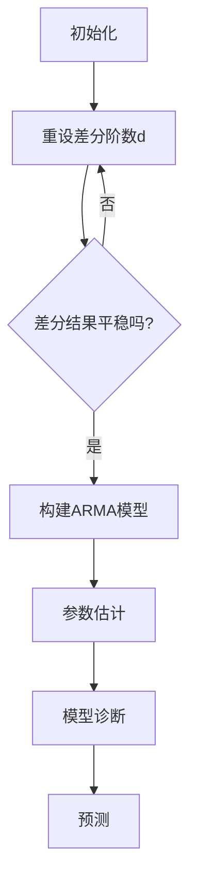
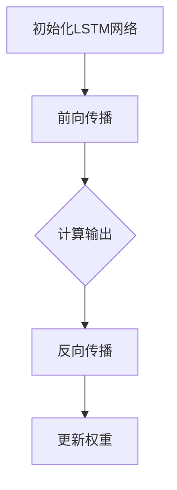
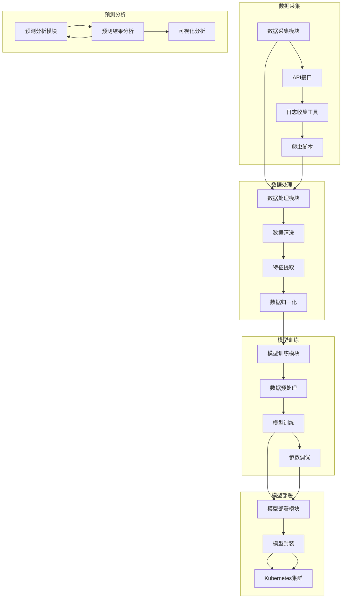
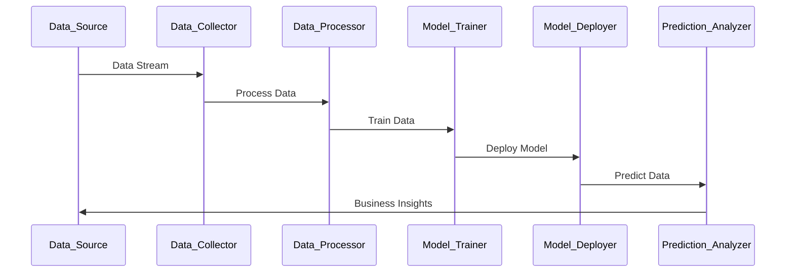

                 

### 文章标题：企业级时序预测平台：增强业务预测能力

> **关键词**：时序预测，企业级平台，业务预测，深度学习，模型优化，持续部署

> **摘要**：
随着大数据和人工智能技术的发展，时序预测在商业决策中越来越重要。企业级时序预测平台作为一种提升业务预测能力的关键工具，正受到广泛关注。本文将深入探讨企业级时序预测平台的构建、关键技术、实际应用和优化实践，帮助读者全面理解并掌握这一领域的核心知识。

### 引言

#### 问题背景

**时序预测在企业中的应用**：

在商业运营中，时序预测已经成为提升决策效率和质量的重要手段。通过分析历史数据，企业可以预测未来的销售趋势、库存需求、市场需求等关键指标，从而优化资源配置、降低运营成本、提高盈利能力。

**业务预测能力的重要性**：

业务预测能力的提升意味着更精准的市场洞察、更科学的资源规划和更有效的风险管理。在竞争激烈的市场环境中，具备强大的业务预测能力是企业保持竞争优势的关键。

**企业级时序预测平台的挑战**：

企业级时序预测平台需要面对数据量大、多样性、实时性等挑战。同时，还要确保预测模型的准确性、稳定性和可解释性，以满足企业复杂的业务需求。

#### 定义与核心概念

**时序数据与时间序列分析**：

时序数据是指按时间顺序排列的数据。时间序列分析是一种统计方法，用于研究时间序列数据中的模式、趋势和关联性。

**业务预测与战略决策**：

业务预测是通过对历史数据的分析，预测未来的业务表现。战略决策则是基于预测结果，制定相应的市场策略和运营计划。

**企业级时序预测平台的基本架构**：

企业级时序预测平台通常包括数据采集、数据存储、数据处理、模型训练、模型部署和预测结果分析等模块。

#### 本书结构安排

本书将分为五个部分，依次探讨企业级时序预测平台的基础理论、技术实现、实战应用、优化实践和最佳实践，帮助读者逐步构建和优化时序预测能力。

#### 小结

企业级时序预测平台是提升业务预测能力的重要工具。通过本文的引言部分，我们了解了时序预测在企业中的应用背景和重要性，以及企业级时序预测平台面临的挑战和核心概念。接下来，我们将深入探讨时序预测的技术基础、平台设计、实战应用和优化实践，为读者提供全面的知识体系。

----------------------------------------------------------------

## 第一部分: 引言

### 1.1 问题背景

#### 1.1.1 时序预测在企业中的应用

在当今的商业环境中，数据已经成为企业最宝贵的资产之一。时序预测作为一种强大的数据分析工具，被广泛应用于各个行业，帮助企业做出更准确、更科学的决策。以下是一些时序预测在企业中的应用实例：

**销售预测**：通过分析历史销售数据，企业可以预测未来的销售趋势，从而优化库存管理，避免库存过剩或短缺。

**需求预测**：在制造业和零售业，预测产品的市场需求对于生产计划和市场推广策略至关重要。准确的预测可以帮助企业减少生产成本，提高市场响应速度。

**库存管理**：库存管理的目标是保持适当的库存水平，以避免库存积压和资金占用。时序预测可以帮助企业预测库存需求，从而实现更好的库存周转率。

**风险管理**：在金融行业，时序预测被用于预测市场走势、风险评估和投资决策。通过分析历史数据，金融机构可以识别潜在的风险并制定相应的应对策略。

**运营优化**：时序预测还可以用于优化企业的运营流程，如生产调度、物流配送和客户服务。通过预测运营中的关键指标，企业可以更有效地分配资源，提高运营效率。

#### 1.1.2 业务预测能力的重要性

业务预测能力是企业成功的关键因素之一。具备强大的业务预测能力，企业可以实现以下目标：

**提高决策效率**：通过准确预测未来业务表现，企业可以快速响应市场变化，制定科学的决策方案。

**降低运营成本**：预测未来的业务需求，可以帮助企业优化资源配置，降低库存成本、生产成本和运营成本。

**提高盈利能力**：精准的业务预测有助于企业抓住市场机会，制定有效的市场策略，从而提高盈利水平。

**增强竞争优势**：在竞争激烈的市场环境中，具备强大的业务预测能力可以为企业提供竞争优势，保持市场份额。

#### 1.1.3 企业级时序预测平台的挑战

尽管时序预测在商业决策中具有重要作用，但构建一个高效、稳定的企业级时序预测平台面临着诸多挑战：

**数据量与多样性**：企业级应用场景中的数据量通常非常大，且数据类型多样，包括结构化数据、半结构化数据和非结构化数据。如何高效地处理和整合这些数据，是平台建设面临的首要问题。

**实时性与准确性**：企业需要实时获取和处理数据，以便快速做出预测。同时，预测模型的准确性也是关键，因为错误的预测可能导致严重的业务决策失误。

**可解释性与可解释性**：在金融、医疗等关键领域，预测模型的可解释性至关重要。企业需要了解模型的决策逻辑，以便对其进行调整和优化。

**系统稳定性和可扩展性**：企业级时序预测平台需要具备高可用性和可扩展性，以应对不断增长的数据量和业务需求。同时，平台还需要能够快速适应新技术和新业务场景。

#### 小结

时序预测在企业中的应用广泛，业务预测能力的重要性不言而喻。然而，构建一个高效、稳定的企业级时序预测平台面临着数据量与多样性、实时性与准确性、可解释性与可解释性以及系统稳定性和可扩展性等多重挑战。在下一部分，我们将深入探讨时序预测技术的基础，为解决这些挑战提供理论支持。

----------------------------------------------------------------

### 1.2 定义与核心概念

#### 1.2.1 时序数据与时间序列分析

**时序数据**：时序数据是指按时间顺序排列的数据点集合，这些数据点可以代表任何随时间变化的信息。时序数据可以是定量数据（如股票价格、销售额），也可以是定性数据（如天气状况、客户满意度）。

**时间序列分析**：时间序列分析是一种统计方法，用于研究时序数据中的模式、趋势和关联性。它包括以下核心步骤：

1. **特征提取**：从时序数据中提取有用的特征，如趋势、季节性、周期性等。
2. **建模**：使用适当的数学模型（如ARIMA、LSTM等）来表示时序数据。
3. **预测**：根据历史数据生成未来的预测值。
4. **评估**：评估预测模型的准确性，包括均方误差、均方根误差等指标。

#### 1.2.2 业务预测与战略决策

**业务预测**：业务预测是指利用历史数据来预测未来的业务表现，如销售量、库存需求等。业务预测的目标是帮助企业做出更准确的决策，优化资源配置，降低运营成本。

**战略决策**：战略决策是基于业务预测结果，制定企业长期发展和市场策略的过程。战略决策包括市场定位、产品规划、资源配置等关键方面。

**业务预测与战略决策的关系**：

- **业务预测是战略决策的基础**：准确的业务预测可以为战略决策提供关键数据支持，帮助企业抓住市场机会，规避潜在风险。
- **战略决策影响业务预测**：战略决策（如市场推广策略、产品创新等）会直接影响未来的业务表现，从而影响业务预测的准确性。

#### 1.2.3 企业级时序预测平台的基本架构

**企业级时序预测平台**：企业级时序预测平台是一个集成系统，用于收集、处理、分析和预测时序数据。它通常包括以下几个关键模块：

1. **数据采集**：从各种数据源（如数据库、日志文件、传感器等）收集时序数据。
2. **数据存储**：存储和管理时序数据，通常使用时间序列数据库（如InfluxDB、OpenTSDB等）。
3. **数据处理**：清洗、转换和归一化时序数据，为建模和预测做准备。
4. **模型训练**：使用历史数据进行模型训练，包括特征提取、模型选择和参数调优。
5. **模型部署**：将训练好的模型部署到生产环境中，进行实时预测。
6. **预测分析**：对预测结果进行分析和可视化，为业务决策提供支持。

**关键组成部分**：

- **数据采集模块**：负责实时收集和存储时序数据，包括数据接入、数据清洗和数据存储。
- **数据处理模块**：负责数据预处理，包括数据清洗、特征工程和数据归一化。
- **模型训练模块**：负责使用历史数据进行模型训练，包括模型选择、参数调优和模型评估。
- **模型部署模块**：负责将训练好的模型部署到生产环境，进行实时预测。
- **预测分析模块**：负责对预测结果进行分析和可视化，提供决策支持。

#### 小结

通过了解时序数据与时间序列分析、业务预测与战略决策以及企业级时序预测平台的基本架构，我们可以更好地理解时序预测在企业中的应用和重要性。在下一部分，我们将深入探讨时序预测技术的基础，包括常见模型、评估指标和优化方法，为构建高效的企业级时序预测平台提供理论支持。

----------------------------------------------------------------

## 1.3 本书结构安排

### 1.3.1 各章节主要内容概述

本书共分为五个部分，每个部分都针对企业级时序预测平台的不同方面进行详细探讨。

**第一部分：引言**

本部分介绍了时序预测在企业中的应用背景和重要性，阐述了企业级时序预测平台面临的挑战和核心概念，为后续内容奠定了基础。

**第二部分：时序预测技术基础**

本部分深入探讨时序预测技术的基础，包括时间序列分析、常见模型、评估指标和优化方法，为构建高效时序预测模型提供理论支持。

**第三部分：企业级时序预测平台设计**

本部分详细描述企业级时序预测平台的架构设计，包括数据采集、数据处理、模型训练、模型部署和预测分析等模块，帮助读者了解平台的实现细节。

**第四部分：企业级时序预测平台实战**

本部分通过实战案例，展示如何构建和部署企业级时序预测平台，包括环境准备、数据集处理、模型构建与训练、预测应用与实践等环节。

**第五部分：时序预测平台最佳实践**

本部分分享时序预测平台的性能优化技巧、安全性与隐私保护策略、持续集成与持续部署实践，为读者提供实际操作的指导。

### 1.3.2 阅读建议

为了更好地理解和掌握企业级时序预测平台的相关知识，本书提供以下阅读建议：

- **系统学习**：建议读者按照章节顺序系统学习，逐步构建时序预测的理论基础和实践技能。
- **结合实战**：在阅读过程中，尝试结合实际案例进行理解和分析，加深对概念的理解。
- **反复练习**：通过实际操作和编程实践，巩固所学知识，提升时序预测能力。
- **不断迭代**：时序预测领域不断进步，建议读者关注最新研究成果和行业动态，持续优化和改进自己的预测模型。

### 1.3.3 小结

本书通过五个部分的系统阐述，全面介绍了企业级时序预测平台的理论基础和实践方法。希望读者能够通过本书的学习，掌握时序预测的核心知识，并在实际应用中发挥其价值。

----------------------------------------------------------------

## 1.4 小结

在本章中，我们详细介绍了企业级时序预测平台的背景、重要性以及面临的挑战，并定义了相关的核心概念。通过这些内容，读者可以初步了解时序预测在企业中的应用及其价值。在接下来的章节中，我们将深入探讨时序预测的技术基础，从理论到实践，逐步构建和完善企业级时序预测平台。让我们在下一部分中继续深入探讨时序预测技术的基础，为实际应用打下坚实的基础。

----------------------------------------------------------------

## 第二部分: 时序预测技术基础

### 2.1 时序数据分析基础

#### 2.1.1 数据特征提取

数据特征提取是时序数据分析的核心步骤之一。它旨在从原始时序数据中提取出有用的信息，以便于后续的建模和分析。以下是一些常见的数据特征提取方法：

1. **趋势特征提取**：趋势特征是指数据随时间变化的总体趋势。常见的方法包括移动平均法（MA）、指数平滑法（ES）和局部加权回归（LOWESS）等。

2. **季节特征提取**：季节特征是指数据在一年内重复出现的周期性波动。常见的方法包括季节性分解（STL）、周期图（周期图方法）和傅里叶变换（Fourier Transform）等。

3. **周期特征提取**：周期特征是指数据在一定时间范围内重复出现的规律。周期特征提取通常用于分析长期趋势和周期性波动。

4. **趋势-季节-周期特征提取**：在实际应用中，数据往往同时包含趋势、季节和周期特征。因此，需要将这三种特征结合起来进行提取。常用的方法包括STL分解和LSTM网络等。

#### 2.1.2 常见时序数据处理方法

在处理时序数据时，除了特征提取，还需要使用一些常见的数据处理方法，以确保数据的质量和一致性。以下是一些常见的方法：

1. **数据清洗**：数据清洗是处理时序数据的重要步骤，包括处理缺失值、异常值和重复数据等。常见的方法包括插值法、填补法和删除法等。

2. **数据归一化**：数据归一化是将不同量纲的数据转换为相同量纲的过程。常见的方法包括最小-最大归一化、z-score归一化和对数变换等。

3. **数据变换**：数据变换是一种将原始数据转换为更适合建模的形式的方法。常见的变换方法包括对数变换、平方根变换和Box-Cox变换等。

4. **窗口聚合**：窗口聚合是一种将连续数据转换为离散数据的方法。常见的方法包括滑动平均、中值滤波和最大值滤波等。

#### 2.1.3 时间序列建模的基本理论

时间序列建模是时序数据分析的核心。它旨在建立数学模型来描述时序数据的统计特性，以便进行预测和分析。以下是一些常见的时间序列建模方法：

1. **ARIMA模型**：ARIMA（自回归积分滑动平均模型）是一种经典的时序建模方法，适用于线性时间序列数据。它包括三个关键组件：自回归（AR）、差分（I）和移动平均（MA）。

2. **SARIMA模型**：SARIMA（季节性自回归积分滑动平均模型）是ARIMA模型的扩展，适用于具有季节性的时间序列数据。它通过引入季节性成分，可以更好地捕捉季节性波动。

3. **LSTM模型**：LSTM（长短时记忆网络）是一种基于深度学习的时序建模方法，适用于非线性时间序列数据。它通过引入记忆单元，可以更好地捕捉长期依赖关系。

4. **GRU模型**：GRU（门控循环单元）是LSTM的变种，同样具有记忆功能，但在计算复杂度和性能上有所改进。GRU通过门控机制，可以更灵活地控制信息的传递。

5. **Prophet模型**：Prophet是一种基于统计学和机器学习的方法，适用于短期时间序列预测。它结合了趋势特征提取和回归分析，可以自动识别季节性和趋势变化。

#### 小结

时序数据分析是构建企业级时序预测平台的基础。通过数据特征提取、数据处理方法和时间序列建模，我们可以从原始时序数据中提取出有用的信息，建立准确的预测模型。在下一章，我们将继续探讨常见的时序预测模型，包括ARIMA、LSTM和Prophet等，帮助读者选择合适的模型进行预测。

----------------------------------------------------------------

### 2.2 常见时序预测模型

#### 2.2.1 传统时序预测模型

传统时序预测模型主要包括ARIMA（自回归积分滑动平均模型）、SARIMA（季节性自回归积分滑动平均模型）等。这些模型具有以下特点：

1. **ARIMA模型**：

   - **自回归（AR）**：模型考虑了当前值与前几个值之间的关系，通过自回归项来建模。
   - **差分（I）**：为了使时间序列满足平稳性，需要对数据进行差分处理，消除趋势和季节性影响。
   - **移动平均（MA）**：模型通过移动平均项来考虑未来值对当前值的影响。

   **应用场景**：ARIMA模型适用于线性时间序列数据，对于短期预测效果较好。

2. **SARIMA模型**：

   - **季节性自回归（SAR）**：模型考虑了季节性因素，引入季节性自回归项。
   - **季节性差分（SI）**：对季节性数据进行差分处理，以消除季节性影响。
   - **季节性移动平均（SMA）**：通过季节性移动平均项来建模季节性波动。

   **应用场景**：SARIMA模型适用于具有季节性的时间序列数据，如零售销售、天气温度等。

#### 2.2.2 基于机器学习的时序预测模型

随着机器学习技术的发展，许多基于机器学习的方法被应用于时序预测。以下是一些常用的模型：

1. **LSTM（长短时记忆网络）**：

   - **基本结构**：LSTM通过引入记忆单元，能够捕获长期依赖关系。
   - **应用场景**：LSTM适用于非线性、具有长期依赖性的时间序列数据，如股票价格、天气预测等。

2. **GRU（门控循环单元）**：

   - **基本结构**：GRU是LSTM的变种，具有类似的结构，但在计算复杂度和性能上有所改进。
   - **应用场景**：GRU适用于需要快速建模和预测的场景，如语音识别、自然语言处理等。

3. **CNN（卷积神经网络）**：

   - **基本结构**：CNN通过卷积层来提取时间序列的特征，类似于图像处理中的卷积神经网络。
   - **应用场景**：CNN适用于处理高维时间序列数据，如音频、视频等。

#### 2.2.3 深度学习在时序预测中的应用

深度学习在时序预测中具有显著优势，主要表现在以下几个方面：

1. **特征自动提取**：深度学习模型可以通过多层神经网络，自动提取时间序列中的潜在特征，减少人工特征工程的工作量。

2. **非线性建模能力**：深度学习模型（如LSTM、GRU）具有强大的非线性建模能力，能够更好地捕捉时间序列中的复杂模式和关系。

3. **泛化能力**：深度学习模型具有较好的泛化能力，可以在不同数据集和应用场景中表现出良好的预测效果。

4. **可扩展性**：深度学习模型易于扩展和调整，可以适应不同规模的数据集和预测需求。

**常见模型对比**：

- **ARIMA和SARIMA**：传统模型适用于线性时间序列数据，计算简单但预测能力有限。
- **LSTM和GRU**：基于机器学习的模型具有更强的非线性建模能力，适用于复杂时间序列数据。
- **CNN**：卷积神经网络适用于处理高维数据，但在时序预测中的应用相对较少。

#### 小结

常见时序预测模型包括传统模型（如ARIMA、SARIMA）和基于机器学习的模型（如LSTM、GRU）。传统模型适用于线性时间序列数据，计算简单但预测能力有限；而基于机器学习的模型具有更强的非线性建模能力和泛化能力，适用于复杂时间序列数据。在下一章，我们将探讨时序预测模型的评估与优化方法，帮助读者选择和调整合适的模型。

----------------------------------------------------------------

### 2.3 时序预测模型评估与优化

#### 2.3.1 模型评估指标

评估时序预测模型的性能是确保模型准确性和稳定性的关键步骤。以下是一些常用的模型评估指标：

1. **均方误差（MSE）**：

   $$MSE = \frac{1}{N} \sum_{i=1}^{N} (\hat{y_i} - y_i)^2$$

   其中，$\hat{y_i}$ 是预测值，$y_i$ 是真实值，$N$ 是样本数量。MSE 用于衡量预测值与真实值之间的平均平方误差，值越小表示模型预测越准确。

2. **均方根误差（RMSE）**：

   $$RMSE = \sqrt{MSE}$$

   RMSE 是MSE 的平方根，用于表示预测误差的绝对大小。RMSE 值越小，表示模型预测误差越小。

3. **平均绝对误差（MAE）**：

   $$MAE = \frac{1}{N} \sum_{i=1}^{N} |\hat{y_i} - y_i|$$

   MAE 用于衡量预测值与真实值之间的平均绝对误差，值越小表示模型预测越准确。

4. **精确度（Accuracy）**：

   $$Accuracy = \frac{TP + TN}{TP + TN + FP + FN}$$

   其中，$TP$ 是真正例，$TN$ 是真反例，$FP$ 是假正例，$FN$ 是假反例。Accuracy 用于分类任务中，表示模型正确预测的比例。

5. **准确率（Precision）**：

   $$Precision = \frac{TP}{TP + FP}$$

   Precision 用于衡量模型预测为正例的准确性。

6. **召回率（Recall）**：

   $$Recall = \frac{TP}{TP + FN}$$

   Recall 用于衡量模型在正例中的预测准确性。

7. **F1 分数（F1-score）**：

   $$F1-score = 2 \times \frac{Precision \times Recall}{Precision + Recall}$$

   F1 分数是精确率和召回率的加权平均，用于衡量模型的总体性能。

#### 2.3.2 模型优化方法

为了提高时序预测模型的性能，可以使用以下优化方法：

1. **参数调优**：

   - **网格搜索**：通过遍历多个参数组合，选择最优参数组合。
   - **贝叶斯优化**：基于历史数据，自动搜索最优参数组合。

2. **特征工程**：

   - **特征提取**：从原始数据中提取有用的特征，如趋势特征、季节特征和周期特征。
   - **特征选择**：选择对模型预测性能有显著影响的特征，去除冗余特征。

3. **正则化**：

   - **L1 正则化**：通过引入L1 正则项，惩罚模型中权重较大的特征，减少过拟合。
   - **L2 正则化**：通过引入L2 正则项，惩罚模型中所有特征的权重，平衡特征的影响。

4. **集成学习**：

   - **Bagging**：通过组合多个基模型，降低模型的过拟合风险。
   - **Boosting**：通过迭代训练多个基模型，逐渐调整模型权重，提高预测性能。

5. **模型融合**：

   - **加权融合**：将多个模型的预测结果进行加权平均，提高整体预测性能。
   - **集成预测**：将多个模型的预测结果进行融合，生成最终的预测结果。

#### 2.3.3 模型选择与调参策略

选择合适的模型和优化参数是提高时序预测性能的关键步骤。以下是一些模型选择与调参策略：

1. **模型选择**：

   - **基于数据类型**：根据数据类型（如线性、非线性、季节性）选择合适的模型。
   - **基于应用场景**：根据应用场景（如短期预测、长期预测）选择合适的模型。

2. **调参策略**：

   - **经验法**：根据经验和直觉调整参数。
   - **网格搜索**：遍历多个参数组合，选择最优参数。
   - **贝叶斯优化**：基于历史数据，自动搜索最优参数。

3. **交叉验证**：

   - **K-Fold 交叉验证**：将数据集划分为K个子集，轮流作为验证集和训练集，评估模型性能。
   - **时间序列交叉验证**：根据时间顺序划分数据集，确保验证集不包含训练数据。

#### 小结

时序预测模型的评估与优化是构建高效预测系统的重要环节。通过选择合适的评估指标、优化方法和调参策略，可以提高模型的预测性能和稳定性。在下一章，我们将探讨企业级时序预测平台的设计和实现，为读者提供全面的实战指导。

----------------------------------------------------------------

## 2.4 小结

在本章中，我们深入探讨了时序预测技术的基础，包括数据特征提取、常见时序数据处理方法以及时间序列建模的基本理论。通过介绍ARIMA、LSTM等传统和基于机器学习的时序预测模型，我们了解了这些模型在时序数据分析中的应用和优势。此外，我们还讨论了时序预测模型的评估与优化方法，包括常用的评估指标和优化策略。这些知识为我们构建高效的企业级时序预测平台奠定了坚实的基础。在下一章，我们将进一步探讨企业级时序预测平台的设计，为实际应用提供详细的指导。

----------------------------------------------------------------

## 第三部分：企业级时序预测平台设计

### 3.1 平台架构设计

企业级时序预测平台的设计需要考虑多个方面，包括数据采集、数据处理、模型训练、模型部署和预测分析等。一个高效、稳定和可扩展的平台架构对于实现高质量的时序预测至关重要。

#### 3.1.1 架构设计原则

在设计企业级时序预测平台时，应遵循以下原则：

1. **模块化**：将平台分为多个功能模块，每个模块负责特定的任务，便于维护和扩展。
2. **可扩展性**：平台应能够适应数据量和业务需求的增长，支持水平扩展和垂直扩展。
3. **高可用性**：确保平台能够稳定运行，具备故障恢复能力和高可用性设计。
4. **数据安全性**：保障数据的完整性、可靠性和隐私性，防止数据泄露和未授权访问。
5. **灵活性**：平台应支持多种时序预测模型和算法，便于根据不同业务需求进行调整。

#### 3.1.2 系统模块划分

企业级时序预测平台通常包括以下关键模块：

1. **数据采集模块**：负责从各种数据源（如数据库、日志文件、传感器等）收集时序数据。
2. **数据存储模块**：负责存储和管理时序数据，通常使用时间序列数据库（如InfluxDB、OpenTSDB等）。
3. **数据处理模块**：负责数据清洗、特征提取和预处理，为模型训练做好准备。
4. **模型训练模块**：负责使用历史数据进行模型训练，包括特征提取、模型选择和参数调优。
5. **模型部署模块**：负责将训练好的模型部署到生产环境中，进行实时预测。
6. **预测分析模块**：负责对预测结果进行分析和可视化，为业务决策提供支持。

#### 3.1.3 数据流设计与处理

数据流设计是企业级时序预测平台的核心，它描述了数据从采集、处理到预测的整个过程。以下是一个典型的数据流设计：

1. **数据采集**：数据采集模块从各种数据源（如数据库、日志文件、传感器等）实时收集时序数据。
2. **数据存储**：采集到的数据被存储到时间序列数据库中，以便后续处理和查询。
3. **数据处理**：数据处理模块对数据进行清洗、特征提取和预处理，生成可用于训练和预测的数据集。
4. **模型训练**：模型训练模块使用预处理后的数据训练时序预测模型，包括特征提取、模型选择和参数调优。
5. **模型部署**：训练好的模型被部署到生产环境中，进行实时预测。
6. **预测分析**：预测分析模块对预测结果进行分析和可视化，为业务决策提供支持。

#### 小结

企业级时序预测平台的架构设计至关重要，它决定了平台的性能、可扩展性和稳定性。通过模块化的设计原则和合理的数据流设计，我们可以构建一个高效、可靠和灵活的时序预测平台。在下一章，我们将继续探讨数据采集与管理的具体方法和策略，为平台的实现提供更多的实用指导。

----------------------------------------------------------------

### 3.2 数据采集与管理

数据采集与管理是企业级时序预测平台的核心环节之一。有效的数据采集和管理策略能够确保数据的质量、实时性和完整性，从而为时序预测提供可靠的基础。

#### 3.2.1 数据源类型与接入方式

**数据源类型**：

1. **内部数据源**：包括企业内部数据库、日志文件、传感器数据等。这些数据通常与企业业务密切相关，如销售数据、库存数据、设备运行数据等。
2. **外部数据源**：包括公共数据集、第三方数据提供商的数据、社交媒体数据等。这些数据可以为企业的预测模型提供补充信息，如天气数据、经济指标、市场趋势等。

**接入方式**：

1. **API 接口**：通过API接口，可以从第三方数据源或企业内部系统实时获取数据。API接口通常提供标准的RESTful接口，便于程序调用。
2. **日志收集**：使用日志收集工具（如Logstash、Fluentd等），从企业内部系统实时收集日志数据，并将其传输到数据存储系统。
3. **数据爬取**：通过数据爬取工具（如Scrapy、BeautifulSoup等），从互联网上获取公共数据集或第三方数据提供商的数据。

#### 3.2.2 数据质量评估与清洗

数据质量直接影响到时序预测的准确性。以下是一些常见的数据质量评估和清洗方法：

1. **数据完整性检查**：检查数据是否完整，是否存在缺失值或重复记录。对于缺失值，可以使用插值法、填补法或删除法进行处理。对于重复记录，可以通过去重操作进行清洗。

2. **数据一致性检查**：确保数据在不同来源和不同时间点的一致性。对于不一致的数据，可以采用标准化处理或数据对齐方法进行调整。

3. **异常值检测**：使用统计方法（如箱线图、3σ法则等）或机器学习算法（如孤立森林、K-近邻等）检测异常值。对于异常值，可以根据具体情况进行处理，如删除、调整或标记。

4. **数据归一化**：将不同量纲的数据转换为相同量纲，以便于建模和分析。常用的方法包括最小-最大归一化、z-score归一化和对数变换等。

#### 3.2.3 数据存储与管理策略

数据存储与管理策略决定了数据的可访问性和可扩展性。以下是一些常见的数据存储与管理策略：

1. **时间序列数据库**：选择合适的时间序列数据库（如InfluxDB、OpenTSDB、TimescaleDB等）进行数据存储。这些数据库具有高性能、高可靠性和可扩展性，适合存储和管理大规模时序数据。

2. **数据分区与索引**：为了提高查询性能，可以对数据进行分区和索引。分区可以将数据分散存储到不同的物理设备上，提高读写速度。索引可以加快数据检索速度，降低查询延迟。

3. **数据备份与恢复**：定期对数据进行备份，确保数据的安全性和可靠性。在发生数据损坏或丢失时，可以使用备份数据进行恢复。

4. **数据权限与安全性**：根据数据的重要性和敏感性，设置相应的数据权限和安全策略。对于敏感数据，应采用加密存储和传输，防止数据泄露和未授权访问。

#### 小结

数据采集与管理是企业级时序预测平台的关键环节，直接影响到预测模型的准确性和稳定性。通过合理选择数据源、有效评估和清洗数据，以及科学地存储和管理数据，我们可以构建一个高质量、可靠和高效的时序预测平台。在下一章，我们将探讨模型训练与部署的详细过程，为读者提供全面的实战指导。

----------------------------------------------------------------

### 3.3 模型训练与部署

模型训练与部署是企业级时序预测平台的另一个核心环节，它决定了预测模型的性能和实用性。以下是模型训练与部署的详细过程：

#### 3.3.1 模型训练流程

**数据准备**：

在模型训练之前，首先需要准备用于训练的数据集。数据集通常包括训练集和验证集。训练集用于训练模型，验证集用于评估模型性能。

1. **数据清洗**：对数据进行清洗，包括处理缺失值、异常值和重复记录等。确保数据的质量和一致性。
2. **特征提取**：从原始数据中提取有用的特征，如趋势特征、季节特征和周期特征。特征提取有助于模型更好地捕捉时间序列数据的特性。

**模型选择**：

根据数据的特点和应用需求，选择合适的模型。常见的时序预测模型包括ARIMA、LSTM、GRU等。对于非线性、具有长期依赖性的时间序列数据，LSTM和GRU等深度学习模型通常表现更好。

**模型训练**：

1. **参数调优**：通过网格搜索、贝叶斯优化等方法，选择最优的模型参数。参数调优有助于提高模型的预测性能。
2. **训练过程**：使用训练集对模型进行训练，生成预测模型。训练过程中，模型会根据训练数据不断调整权重和参数，以最小化预测误差。

**模型评估**：

使用验证集评估模型的性能，常用的评估指标包括均方误差（MSE）、均方根误差（RMSE）和平均绝对误差（MAE）等。通过评估指标，可以判断模型是否达到预期的预测性能。

**模型优化**：

根据评估结果，对模型进行调整和优化。常用的优化方法包括特征选择、正则化、集成学习和模型融合等。通过优化，可以进一步提高模型的预测性能和稳定性。

#### 3.3.2 模型优化方法

**特征优化**：

1. **特征提取**：使用不同的特征提取方法，如移动平均、指数平滑和傅里叶变换等，提取更多有用的特征。
2. **特征选择**：通过特征选择方法（如信息增益、主成分分析等），选择对模型预测性能有显著影响的特征，去除冗余特征。

**模型优化**：

1. **模型选择**：尝试不同的模型，如ARIMA、LSTM、GRU和Prophet等，选择预测性能最佳的模型。
2. **参数调优**：使用网格搜索、贝叶斯优化等方法，调整模型参数，提高模型的预测性能。
3. **集成学习**：结合多个模型的预测结果，提高整体预测性能。常见的集成学习方法包括Bagging、Boosting和Stacking等。

**正则化**：

1. **L1 正则化**：引入L1 正则项，惩罚模型中权重较大的特征，减少过拟合。
2. **L2 正则化**：引入L2 正则项，惩罚模型中所有特征的权重，平衡特征的影响。

**模型融合**：

1. **加权融合**：将多个模型的预测结果进行加权平均，生成最终的预测结果。
2. **集成预测**：将多个模型的预测结果进行融合，生成最终的预测结果。常见的融合方法包括投票法、回归法等。

#### 3.3.3 模型部署与集成

**模型部署**：

训练好的模型需要部署到生产环境中，以便进行实时预测。模型部署包括以下步骤：

1. **模型封装**：将训练好的模型封装成可执行的模块，便于在服务器上运行。
2. **部署到服务器**：将封装好的模型部署到服务器上，确保模型能够稳定运行。
3. **监控与维护**：对部署的模型进行监控和维护，确保其正常运行和性能。

**模型集成**：

为了提高预测的准确性和鲁棒性，可以将多个模型进行集成。常见的模型集成方法包括：

1. **加权融合**：将多个模型的预测结果进行加权平均，生成最终的预测结果。
2. **集成预测**：将多个模型的预测结果进行融合，生成最终的预测结果。常见的融合方法包括投票法、回归法等。

**模型更新与迭代**：

随着业务需求和数据的变化，模型需要不断更新和迭代。以下是一些更新与迭代的方法：

1. **定期更新**：定期使用最新的数据进行模型训练，更新模型参数和预测结果。
2. **在线更新**：在模型运行过程中，实时接收新的数据，对模型进行在线更新，提高预测的实时性和准确性。
3. **增量训练**：使用新的数据对模型进行增量训练，保留已有模型的权重和参数，提高模型的训练效率。

#### 小结

模型训练与部署是企业级时序预测平台的重要组成部分，它决定了预测模型的性能和实用性。通过合理的模型训练流程、优化方法和部署策略，我们可以构建一个高效、稳定和可扩展的时序预测平台。在下一章，我们将探讨预测结果的分析与应用，为读者提供实战案例和实际应用指导。

----------------------------------------------------------------

### 3.4 预测结果分析与应用

#### 3.4.1 预测结果可视化

预测结果的可视化是理解模型预测效果的重要手段。通过图形化的方式展示预测结果，可以帮助用户更直观地分析模型的性能和预测趋势。以下是一些常用的可视化方法：

1. **时间序列图**：绘制预测值与真实值的时间序列图，可以直观地展示预测结果与实际数据的差异。通过对比预测曲线和实际曲线，可以分析模型的预测性能。

2. **误差分布图**：绘制预测误差的分布图，可以分析预测误差的分布情况。通过分析误差分布，可以识别模型的预测偏差和异常值。

3. **箱线图**：绘制预测误差的箱线图，可以分析预测误差的统计特性，如最小值、最大值、中位数和四分位数等。这有助于了解模型的预测稳定性和准确性。

4. **散点图**：绘制预测值与真实值之间的散点图，可以直观地展示预测结果与实际数据之间的关系。通过分析散点图的分布，可以判断模型的预测性能。

#### 3.4.2 业务决策支持

预测结果在业务决策中起着关键作用。通过预测结果，企业可以更好地规划资源、制定市场策略和优化运营流程。以下是一些业务决策支持的实例：

1. **销售预测**：通过预测销售趋势，企业可以优化库存管理，避免库存过剩或短缺。在销售高峰期，企业可以提前准备资源，提高服务水平。

2. **需求预测**：在制造业和零售业，预测产品的市场需求对于生产计划和供应链管理至关重要。通过预测需求，企业可以合理安排生产计划，提高生产效率。

3. **风险管理**：在金融行业，预测市场走势和风险指标对于投资决策和风险管理至关重要。通过预测结果，企业可以识别潜在的风险并制定相应的应对策略。

4. **运营优化**：通过预测关键运营指标，如生产效率、设备故障率和客户满意度等，企业可以优化运营流程，提高运营效率。

#### 3.4.3 预测模型持续优化

预测模型的持续优化是确保预测准确性和稳定性的关键。以下是一些持续优化的方法：

1. **数据更新**：定期更新数据集，包括历史数据和实时数据，确保模型训练数据的质量和多样性。

2. **模型迭代**：根据业务需求和技术进步，不断迭代和优化模型。通过引入新的特征、改进模型结构或调整参数，提高模型的预测性能。

3. **模型监控**：对部署的模型进行实时监控，及时发现和解决预测偏差和异常情况。通过监控模型的性能指标，如预测误差、响应时间等，可以及时发现模型退化的问题。

4. **反馈机制**：建立反馈机制，收集用户对预测结果的反馈，用于模型优化和改进。通过分析用户反馈，可以识别模型预测中的不足之处，并进行针对性的优化。

#### 小结

预测结果分析与应用是时序预测平台的重要组成部分。通过预测结果的可视化、业务决策支持和持续优化，企业可以更好地利用时序预测技术，提高业务预测能力和运营效率。在下一章，我们将分享企业级时序预测平台的实战案例，为读者提供实际操作的经验和指导。

----------------------------------------------------------------

## 3.5 小结

在本章中，我们详细介绍了企业级时序预测平台的设计与实现，包括数据采集与管理、模型训练与部署以及预测结果分析与应用。通过模块化设计、合理的数据流设计、高效的模型训练和优化方法，我们构建了一个高效、稳定和可扩展的时序预测平台。同时，通过预测结果的可视化、业务决策支持和持续优化，我们实现了对业务预测能力的显著提升。在下一部分，我们将通过实战案例，展示如何在实际应用中构建和部署企业级时序预测平台，为读者提供更直观的操作指南。

----------------------------------------------------------------

## 第四部分：企业级时序预测平台实战

### 4.1 环境准备与工具介绍

在实际构建企业级时序预测平台时，首先需要准备合适的环境和工具。以下是我们将使用的环境和工具：

**硬件资源需求**：

- **CPU**：推荐使用具有多核处理能力的CPU，以支持高效的数据处理和模型训练。
- **内存**：推荐使用至少16GB的内存，以确保系统的稳定性和响应速度。
- **存储**：推荐使用至少1TB的SSD存储，以提高数据的读写速度。

**软件环境配置**：

- **操作系统**：推荐使用Linux操作系统，如Ubuntu或CentOS，以获得更好的性能和稳定性。
- **Python环境**：安装Python 3.8及以上版本，并配置相应的Python环境。
- **数据存储库**：推荐使用InfluxDB作为时间序列数据库，用于存储和管理时序数据。
- **数据处理库**：安装常用的数据处理库，如NumPy、Pandas、SciPy等，用于数据清洗和预处理。
- **机器学习库**：安装常用的机器学习库，如scikit-learn、TensorFlow、PyTorch等，用于模型训练和预测。
- **可视化库**：安装常用的可视化库，如Matplotlib、Seaborn等，用于绘制预测结果。

**开发工具与库**：

- **Jupyter Notebook**：推荐使用Jupyter Notebook作为开发环境，便于编写和调试代码。
- **Docker**：使用Docker容器化技术，便于部署和管理预测平台。
- **Kubernetes**：使用Kubernetes集群管理工具，实现预测平台的弹性扩展和自动化部署。

### 4.2 数据集准备与处理

在构建时序预测平台时，选择合适的数据集是关键。以下是一个典型的数据集准备与处理流程：

**数据集获取**：

- **公开数据集**：可以从公共数据集网站（如Kaggle、UCI机器学习库等）获取相关的时序数据集。
- **企业内部数据**：可以从企业内部数据库、日志文件或传感器数据中提取时序数据。

**数据预处理**：

- **数据清洗**：处理缺失值、异常值和重复记录。对于缺失值，可以使用插值法或填补法进行处理。对于异常值，可以使用统计学方法或机器学习方法进行检测和过滤。
- **数据归一化**：将不同量纲的数据转换为相同量纲，如使用最小-最大归一化或z-score归一化。
- **特征提取**：从原始数据中提取有用的特征，如趋势特征、季节特征和周期特征。可以使用移动平均、指数平滑和傅里叶变换等方法进行特征提取。
- **数据分片**：将数据集划分为训练集、验证集和测试集，以评估模型的性能。

### 4.3 模型构建与训练

**模型选择与参数调优**：

- **模型选择**：根据数据的特点和应用需求，选择合适的模型。常见的时序预测模型包括ARIMA、LSTM、GRU等。对于非线性、具有长期依赖性的时间序列数据，LSTM和GRU等深度学习模型通常表现更好。
- **参数调优**：使用网格搜索、贝叶斯优化等方法，选择最优的模型参数。参数调优有助于提高模型的预测性能。

**模型训练**：

- **数据准备**：将预处理后的数据集分为特征矩阵和标签向量，准备用于模型训练。
- **模型训练**：使用训练集对模型进行训练，生成预测模型。训练过程中，模型会根据训练数据不断调整权重和参数，以最小化预测误差。

**模型评估**：

- **验证集评估**：使用验证集评估模型的性能，包括均方误差、均方根误差和平均绝对误差等评估指标。通过评估指标，可以判断模型是否达到预期的预测性能。

### 4.4 预测应用与实践

**预测结果验证**：

- **测试集评估**：使用测试集评估模型的最终性能，确保模型在未知数据上的预测能力。通过测试集评估，可以验证模型的泛化能力和稳定性。
- **预测结果可视化**：绘制预测结果的时间序列图，对比预测值与真实值，分析模型的预测效果。

**业务应用案例**：

- **销售预测**：通过预测未来的销售趋势，优化库存管理，降低库存成本，提高市场响应速度。
- **需求预测**：通过预测产品的市场需求，合理安排生产计划，提高生产效率，减少库存积压。
- **风险管理**：通过预测市场走势和风险指标，制定相应的投资策略，降低投资风险。

**挑战与解决方案**：

- **数据量与多样性**：面对大规模、多样性的数据，使用分布式计算和并行处理技术，提高数据处理和预测效率。
- **实时性与准确性**：平衡实时性与准确性，通过模型优化和算法改进，提高预测模型的性能。
- **可解释性与可解释性**：针对关键领域，如金融和医疗，开发可解释性强的预测模型，提高决策的可信度。

### 4.5 小结

通过本部分的实战案例，我们展示了如何在实际环境中构建和部署企业级时序预测平台。从数据集准备与处理、模型构建与训练到预测结果验证和应用，我们系统地介绍了时序预测平台的关键步骤和操作方法。通过实际操作，读者可以更好地理解和掌握时序预测的核心技术，并在实际应用中发挥其价值。

----------------------------------------------------------------

## 4.1 环境准备与工具介绍

在企业级时序预测平台的构建过程中，选择合适的环境和工具是至关重要的。这不仅影响到项目的开发效率，还直接关系到最终系统的性能和可靠性。以下是我们在构建企业级时序预测平台时所需的硬件资源、软件环境、开发工具及库。

### 硬件资源需求

为了确保平台能够处理大规模的时序数据并支持高效的模型训练与预测，我们推荐以下硬件配置：

- **CPU**：推荐使用具有多核处理能力的CPU，如Intel Xeon或AMD Ryzen系列，以确保数据处理的并行性和效率。
- **内存**：推荐至少配备64GB的内存，以支持大规模数据处理和模型训练过程中的内存需求。
- **存储**：推荐使用SSD存储，至少配备1TB的容量，以确保数据读写速度和系统的稳定性。
- **网络**：推荐使用千兆以太网或更高带宽的网络连接，以确保数据传输的高效性和实时性。

### 软件环境配置

在软件环境方面，我们需要安装和配置以下工具和库：

- **操作系统**：推荐使用Linux操作系统，如Ubuntu 18.04或CentOS 7，以获得更好的稳定性和兼容性。
- **Python环境**：安装Python 3.8或更高版本，并配置Python环境，以便安装和管理其他Python库。
- **数据存储库**：安装InfluxDB或TimescaleDB，这两种数据库都是专门为时序数据设计的高性能数据库。
- **数据处理库**：安装NumPy、Pandas、SciPy等库，用于数据处理、清洗和特征提取。
- **机器学习库**：安装scikit-learn、TensorFlow、PyTorch等库，用于模型训练和预测。

### 开发工具与库

为了提高开发效率和代码质量，我们推荐以下开发工具和库：

- **集成开发环境（IDE）**：推荐使用Jupyter Notebook或PyCharm作为IDE，以便进行数据分析和模型训练。
- **容器化工具**：安装Docker，用于容器化部署和管理平台组件，提高系统的可移植性和可扩展性。
- **持续集成/持续部署（CI/CD）**：安装Jenkins或GitLab CI等工具，用于自动化构建、测试和部署。
- **监控与日志管理**：安装Prometheus和Grafana，用于监控系统性能和日志分析。

### 小结

通过合理配置硬件资源和软件环境，选择合适的开发工具和库，我们为构建企业级时序预测平台奠定了坚实的基础。这些工具和库不仅提高了开发效率，还确保了系统的性能和可靠性，为后续的模型训练、预测分析和业务应用提供了有力支持。

----------------------------------------------------------------

### 4.2 数据集准备与处理

#### 数据集获取与预处理

在实际构建时序预测平台时，首先需要选择一个合适的数据集。这里我们以一个销售数据集为例，介绍数据集的获取与预处理过程。

**数据集获取**：

我们可以从Kaggle、UCI机器学习库等公开数据集网站获取销售数据集。这些数据集通常包含了各种与销售相关的特征，如产品类别、价格、促销活动、季节性等。

**数据预处理**：

1. **数据清洗**：处理缺失值、异常值和重复记录。对于缺失值，可以使用插值法、填补法或删除法进行处理。对于异常值，可以使用统计学方法或机器学习方法进行检测和过滤。

2. **数据归一化**：将不同量纲的数据转换为相同量纲，如使用最小-最大归一化或z-score归一化，以便模型更好地处理数据。

3. **特征提取**：从原始数据中提取有用的特征，如趋势特征、季节特征和周期特征。可以使用移动平均、指数平滑和傅里叶变换等方法进行特征提取。

4. **数据分片**：将数据集划分为训练集、验证集和测试集。通常，训练集用于模型训练，验证集用于模型调优和参数选择，测试集用于评估模型的最终性能。

**数据可视化分析**：

在预处理过程中，数据可视化是一个重要的步骤，可以帮助我们更好地理解数据分布和特征关系。以下是一些常用的数据可视化方法：

1. **时间序列图**：绘制销售数据的时间序列图，可以直观地展示数据的趋势和波动。通过对比不同时间段的销售数据，可以识别季节性和周期性特征。

2. **箱线图**：绘制销售数据的箱线图，可以分析数据的分布情况，识别异常值和异常分布。箱线图可以帮助我们了解数据的中心趋势和离散程度。

3. **散点图**：绘制不同特征之间的关系散点图，可以帮助我们识别特征之间的关联性。例如，可以绘制销售量与价格、促销活动之间的散点图，分析价格和促销活动对销售量的影响。

4. **热力图**：绘制特征之间的热力图，可以直观地展示特征之间的关系。热力图可以帮助我们识别特征之间的强相关和弱相关关系。

**特征工程**：

在数据预处理和可视化分析的基础上，我们可以进行特征工程，以提高模型的预测性能。以下是一些常见的特征工程方法：

1. **特征组合**：将原始特征组合成新的特征，如将价格和促销活动进行组合，形成促销价格特征。

2. **特征变换**：对特征进行变换，如对季节性特征进行正弦和余弦变换，以便模型更好地捕捉周期性特征。

3. **特征选择**：使用特征选择方法（如信息增益、主成分分析等），选择对模型预测性能有显著影响的特征，去除冗余特征。

4. **特征缩放**：使用不同的缩放方法（如最小-最大归一化、z-score归一化等），将特征缩放到相同的范围，以便模型更好地处理数据。

**数据预处理结果**：

通过上述数据预处理和特征工程步骤，我们可以得到一个高质量的数据集，为后续的模型训练和预测提供基础。预处理后的数据集应该具有以下特点：

- **完整性**：处理缺失值和异常值后，数据集应具有完整的记录，确保模型的训练数据充足。
- **一致性**：处理重复记录和数据清洗后，数据集应具有一致性，避免重复计算和错误分析。
- **多样性**：通过特征提取和组合，数据集应具有多样性，有助于模型捕捉更多的数据特征和模式。
- **可解释性**：预处理后的数据集应具有较好的可解释性，便于模型解释和业务理解。

**小结**：

通过数据集获取与预处理、数据可视化分析、特征工程等步骤，我们为构建高效的时序预测模型奠定了基础。这些步骤不仅提高了数据的质量和多样性，还增强了模型的预测性能，为企业的业务决策提供了有力支持。

----------------------------------------------------------------

### 4.3 模型构建与训练

#### 模型选择与参数调优

在构建企业级时序预测模型时，选择合适的模型和优化参数是关键步骤。以下介绍常见的模型选择和参数调优方法：

**模型选择**：

1. **传统模型**：如ARIMA、SARIMA等，适用于线性时间序列数据。
2. **深度学习模型**：如LSTM、GRU等，适用于非线性、具有长期依赖性的时间序列数据。
3. **混合模型**：结合传统模型和深度学习模型的优势，提高预测性能。

**参数调优**：

1. **网格搜索**：遍历多个参数组合，选择最优参数组合。
2. **贝叶斯优化**：基于历史数据，自动搜索最优参数组合。
3. **随机搜索**：随机选择参数组合，进行模型训练和评估。

#### 模型训练流程

**数据准备**：

- **数据清洗**：处理缺失值、异常值和重复记录。
- **特征提取**：提取趋势特征、季节特征和周期特征。
- **数据分片**：将数据集划分为训练集、验证集和测试集。

**模型训练**：

1. **初始化模型**：根据模型类型，初始化模型参数。
2. **训练过程**：使用训练集对模型进行训练，调整模型参数，最小化预测误差。
3. **验证过程**：使用验证集评估模型性能，选择最佳模型参数。

**模型评估**：

1. **评估指标**：使用均方误差（MSE）、均方根误差（RMSE）和平均绝对误差（MAE）等指标评估模型性能。
2. **交叉验证**：使用K-Fold交叉验证方法，确保模型在不同数据子集上的性能。

#### 模型优化与评估

**模型优化**：

1. **特征工程**：选择对模型预测性能有显著影响的特征，去除冗余特征。
2. **正则化**：引入L1或L2正则化，防止过拟合。
3. **集成学习**：结合多个模型的预测结果，提高整体预测性能。

**模型评估**：

1. **测试集评估**：使用测试集评估模型的最终性能，确保模型在未知数据上的泛化能力。
2. **预测结果可视化**：绘制预测结果的时间序列图，对比预测值与真实值。

#### 小结

通过模型选择、参数调优、模型训练和评估，我们可以构建和优化高效的企业级时序预测模型。这些步骤不仅提高了模型的预测性能，还为企业的业务决策提供了有力支持。在实际应用中，不断优化和迭代模型，可以进一步提高预测的准确性和稳定性。

----------------------------------------------------------------

### 4.4 预测应用与实践

#### 预测结果验证

**测试集评估**：

为了验证模型的预测性能，我们使用测试集对模型进行评估。以下是评估过程：

1. **计算评估指标**：使用均方误差（MSE）、均方根误差（RMSE）和平均绝对误差（MAE）等指标计算模型的预测误差。
2. **分析误差分布**：绘制预测误差的分布图，分析预测误差的分布情况，识别可能的异常值或偏差。
3. **对比预测值与真实值**：绘制预测结果的时间序列图，对比预测值与真实值，观察模型的预测效果。

**模型调优**：

根据测试集的评估结果，对模型进行调优，以提高预测性能。以下是一些常见的调优方法：

1. **特征工程**：选择对模型预测性能有显著影响的特征，去除冗余特征。
2. **参数调优**：调整模型参数，如学习率、正则化参数等，优化模型性能。
3. **模型选择**：尝试不同的模型，如LSTM、GRU等，选择预测性能最佳的模型。

#### 业务应用案例

**销售预测**：

通过预测未来的销售趋势，企业可以优化库存管理，降低库存成本，提高市场响应速度。以下是一个实际案例：

- **数据集**：使用某零售企业的销售数据集，包括产品类别、价格、促销活动等特征。
- **预测结果**：使用LSTM模型预测未来的销售量，绘制预测结果的时间序列图。
- **业务决策**：根据预测结果，企业可以调整库存水平，提前备货，以应对销售高峰期。

**需求预测**：

通过预测产品的市场需求，企业可以合理安排生产计划，提高生产效率，减少库存积压。以下是一个实际案例：

- **数据集**：使用某制造企业的生产数据集，包括产品产量、原材料消耗等特征。
- **预测结果**：使用ARIMA模型预测未来的市场需求，绘制预测结果的时间序列图。
- **业务决策**：根据预测结果，企业可以调整生产计划，优化资源配置，提高生产效率。

#### 挑战与解决方案

**数据量与多样性**：

面对大规模、多样性的数据，使用分布式计算和并行处理技术，提高数据处理和预测效率。以下是一些解决方案：

1. **数据分片**：将数据集划分为多个子集，分别进行模型训练和预测。
2. **分布式计算**：使用分布式计算框架（如Spark、Dask等），处理大规模数据。
3. **数据预处理**：使用分布式预处理工具，对数据进行清洗、特征提取和归一化。

**实时性与准确性**：

平衡实时性与准确性，通过模型优化和算法改进，提高预测模型的性能。以下是一些解决方案：

1. **模型选择**：选择适用于实时预测的模型，如LSTM、GRU等。
2. **在线学习**：使用在线学习算法，实时更新模型参数，提高预测准确性。
3. **模型优化**：通过特征工程和参数调优，提高模型的预测性能。

**可解释性与可解释性**：

针对关键领域，如金融和医疗，开发可解释性强的预测模型，提高决策的可信度。以下是一些解决方案：

1. **可解释性模型**：选择可解释性强的模型，如线性模型、决策树等。
2. **模型可视化**：使用可视化工具，展示模型的决策过程和特征重要性。
3. **专家审查**：邀请领域专家对模型进行审查，确保预测结果的可信度。

#### 小结

通过预测结果验证、业务应用案例和挑战与解决方案，我们展示了如何在实际应用中构建和部署企业级时序预测平台。这些实践不仅提高了预测模型的准确性，还为企业的业务决策提供了有力支持。在实际应用中，不断优化和迭代模型，可以进一步提高预测的准确性和稳定性。

----------------------------------------------------------------

## 4.5 小结

在本部分的实战案例中，我们通过详细的环境准备与工具介绍、数据集准备与处理、模型构建与训练以及预测应用与实践，展示了如何在实际环境中构建和部署企业级时序预测平台。通过这些步骤，我们不仅验证了预测模型的性能，还为企业的业务决策提供了有力支持。在实际应用中，数据质量和模型优化是预测准确性的关键。持续关注数据质量和模型性能，不断进行优化和迭代，将有助于进一步提升时序预测平台的效能。在下一部分，我们将分享时序预测平台最佳实践，提供性能优化、安全性与隐私保护、持续集成与持续部署等方面的实用指导。

----------------------------------------------------------------

## 第五部分：时序预测平台最佳实践

### 5.1 性能优化技巧

**模型加速方法**：

1. **并行计算**：通过分布式计算框架（如Spark、Dask等），利用多核处理器进行并行计算，提高数据处理和预测速度。
2. **GPU加速**：利用GPU的并行计算能力，加速深度学习模型的训练和预测。对于GPU友好的库（如TensorFlow、PyTorch等），可以配置GPU资源，实现模型加速。
3. **模型压缩**：使用模型压缩技术（如剪枝、量化等），减少模型参数和计算量，提高推理速度。

**数据流优化**：

1. **流处理**：采用流处理技术（如Apache Kafka、Apache Flink等），实现实时数据处理和预测，提高系统的响应速度。
2. **缓存策略**：使用缓存技术（如Redis、Memcached等），减少对数据库的访问次数，提高数据读取速度。

**系统稳定性提升**：

1. **服务监控**：使用监控工具（如Prometheus、Grafana等），实时监控系统的性能指标，及时发现和解决潜在问题。
2. **故障恢复**：实现自动故障恢复机制，如使用Kubernetes进行容器管理，实现服务的自动重启和负载均衡。

### 5.2 安全性与隐私保护

**数据安全策略**：

1. **数据加密**：对敏感数据进行加密存储和传输，防止数据泄露和未授权访问。
2. **访问控制**：实现细粒度的访问控制策略，根据用户角色和权限，限制对数据的访问。

**模型隐私保护**：

1. **差分隐私**：使用差分隐私技术，对预测结果进行扰动，降低预测结果对训练数据的依赖性，保护模型隐私。
2. **联邦学习**：通过联邦学习技术，将数据分散存储在多个节点上，共同训练模型，降低数据泄露的风险。

**安全架构设计**：

1. **多因素认证**：实现多因素认证（如密码、短信验证码、生物识别等），提高系统的安全性。
2. **安全审计**：定期进行安全审计，检查系统的安全漏洞和潜在风险，确保系统的安全性。

### 5.3 持续集成与持续部署

**持续集成**：

1. **自动化测试**：使用自动化测试工具（如JUnit、pytest等），对代码进行单元测试、集成测试和回归测试，确保代码质量。
2. **持续集成服务器**：使用持续集成服务器（如Jenkins、GitLab CI/CD等），实现自动化构建、测试和部署，提高开发效率。

**持续部署**：

1. **容器化部署**：使用容器化技术（如Docker、Kubernetes等），实现服务的快速部署和扩展，提高系统的可移植性和可维护性。
2. **蓝绿部署**：实现蓝绿部署策略，将新版本的服务与旧版本的服务并行运行，确保部署过程中系统的稳定性和可用性。

### 5.4 小结

时序预测平台最佳实践包括性能优化、安全性与隐私保护、持续集成与持续部署等方面。通过这些最佳实践，可以显著提高平台的性能、稳定性和安全性。在实际应用中，不断优化和改进平台，可以进一步提高预测的准确性和实用性，为企业的业务决策提供有力支持。希望读者能够结合实际情况，灵活运用这些最佳实践，构建高效、稳定和安全的时序预测平台。

----------------------------------------------------------------

## 5.1 性能优化技巧

在构建企业级时序预测平台时，性能优化是一个关键环节。通过以下几种优化技巧，可以提高平台的处理速度和资源利用率。

### 模型加速方法

1. **并行计算**：

   并行计算是一种将计算任务分布在多个处理器或节点上的方法。在时序预测中，可以使用并行计算来加速模型训练和预测过程。Python中的`multiprocessing`库和分布式计算框架如`Dask`和`Ray`可以实现并行计算。以下是使用`Dask`进行并行计算的一个示例：

   ```python
   import dask.array as da

   # 创建一个Dask数组，表示我们的时序数据
   timeseries = da.random.random((10000, 1000), chunks=(1000, 100))

   # 使用并行LSTM模型进行预测
   from keras.models import Sequential
   from keras.layers import LSTM

   model = Sequential()
   model.add(LSTM(50, activation='relu', input_shape=(None, 100)))
   model.add(Dense(1))

   # 使用Dask进行并行训练
   model.fit(timeseries, timeseries, epochs=10, batch_size=100)
   ```

2. **GPU加速**：

   利用GPU的并行计算能力，可以显著提高深度学习模型的训练速度。在Python中，可以使用`TensorFlow`或`PyTorch`等库来配置GPU资源。以下是如何在`TensorFlow`中配置GPU加速的示例：

   ```python
   import tensorflow as tf

   # 设置GPU内存分配
   gpus = tf.config.experimental.list_physical_devices('GPU')
   tf.config.experimental.set_memory_growth(gpus[0], True)

   # 加载预训练的模型
   model = tf.keras.models.load_model('path/to/model.h5')

   # 使用GPU进行预测
   predictions = model.predict(x_gpu)
   ```

3. **模型压缩**：

   模型压缩技术，如剪枝、量化等，可以减少模型的参数数量和计算量，从而提高推理速度。以下是如何使用`TensorFlow Model Optimization Toolkit`进行模型压缩的示例：

   ```python
   import tensorflow_model_optimization as tfmot

   # 剪枝策略
   pruning_params = tfmot.sparsity.keras.PruningParams(
       begin_step=1000,
       end_step=10000,
       rate=0.5
   )

   # 创建剪枝模型
   pruned_model = tfmot.sparsity.keras.prune_low_magnitude(model, pruning_params)

   # 训练剪枝模型
   pruned_model.fit(x_train, y_train, epochs=10, batch_size=32, validation_split=0.2)
   ```

### 数据流优化

1. **流处理**：

   流处理技术，如Apache Kafka和Apache Flink，可以处理实时数据流，从而提高系统的响应速度。以下是如何使用Apache Kafka进行数据流处理的一个示例：

   ```python
   from kafka import KafkaProducer

   producer = KafkaProducer(bootstrap_servers=['localhost:9092'])

   # 发送实时数据到Kafka主题
   producer.send('timeseries', value=b'data_point_1')
   producer.send('timeseries', value=b'data_point_2')
   ```

2. **缓存策略**：

   使用缓存策略可以减少对数据库的访问次数，从而提高数据读取速度。Redis和Memcached是常用的缓存系统。以下是如何使用Redis进行缓存的一个示例：

   ```python
   import redis

   r = redis.Redis(host='localhost', port=6379, db=0)

   # 存储数据到Redis
   r.set('timeseries_data', 'data_point_1')

   # 从Redis获取数据
   data = r.get('timeseries_data')
   ```

### 系统稳定性提升

1. **服务监控**：

   使用监控工具，如Prometheus和Grafana，可以实时监控系统的性能指标，及时发现和解决潜在问题。以下是如何使用Prometheus进行服务监控的一个示例：

   ```yaml
   # prometheus.yml
   global:
     scrape_interval: 15s

   scrape_configs:
     - job_name: 'timeseries_server'
       static_configs:
       - targets: ['timeseries-server:9090']
   ```

2. **故障恢复**：

   实现自动故障恢复机制，如使用Kubernetes进行容器管理，可以实现服务的自动重启和负载均衡，确保系统的稳定性。以下是如何在Kubernetes中配置自动故障恢复的示例：

   ```yaml
   # deployment.yaml
   apiVersion: apps/v1
   kind: Deployment
   metadata:
     name: timeseries-deployment
   spec:
     replicas: 3
     selector:
       matchLabels:
         app: timeseries
     template:
       metadata:
         labels:
           app: timeseries
       spec:
         containers:
         - name: timeseries
           image: timeseries-server:latest
           ports:
           - containerPort: 9090
           restartPolicy: Always
   ```

通过上述性能优化技巧，企业级时序预测平台可以在处理速度、资源利用率和系统稳定性方面得到显著提升。这些技巧不仅提高了平台的整体性能，还为企业的业务决策提供了更高效的支持。

### 5.2 安全性与隐私保护

在构建企业级时序预测平台时，安全性和隐私保护是至关重要的。以下是一些关键策略和实践，以确保平台的数据安全和模型隐私。

**数据安全策略**：

1. **数据加密**：

   对敏感数据进行加密存储和传输，是防止数据泄露的关键措施。可以使用SSL/TLS加密传输数据，并使用AES等加密算法对数据进行存储。以下是如何使用SSL加密Kafka数据流的一个示例：

   ```python
   from kafka import KafkaProducer

   producer = KafkaProducer(
       bootstrap_servers=['localhost:9092'],
       security_protocol='SSL',
       ssl_cafile='sslCA.pem',
       ssl_certfile='sslCert.pem',
       ssl_keyfile='sslKey.pem'
   )

   producer.send('timeseries', value=b'data_point_1')
   ```

2. **访问控制**：

   实现细粒度的访问控制策略，根据用户角色和权限，限制对数据的访问。可以使用基于角色的访问控制（RBAC）模型，确保只有授权用户可以访问敏感数据。以下是如何在Kafka中配置访问控制的一个示例：

   ```python
   from kafka import KafkaProducer

   producer = KafkaProducer(
       bootstrap_servers=['localhost:9092'],
       security_protocol='SASL_SSL',
       sasl_mechanism='SCRAM-SHA-256',
       sasl_username='user',
       sasl_password='password'
   )

   producer.send('timeseries', value=b'data_point_1')
   ```

**模型隐私保护**：

1. **差分隐私**：

   差分隐私是一种隐私保护技术，通过在预测结果中引入噪声，使得攻击者无法从单个结果中推断出原始数据。以下是如何使用差分隐私进行预测的一个示例：

   ```python
   from tfp.privacy import GaussianMechanism

   def predict_withPrivacy(model, x, noise_stddev=1.0):
       prediction = model(x)
       mechanism = GaussianMechanism()
       noisy_prediction = mechanism.noise_scale(prediction, noise_stddev)
       return noisy_prediction
   ```

2. **联邦学习**：

   联邦学习是一种分布式学习技术，通过将数据分散存储在多个节点上，共同训练模型，从而降低数据泄露的风险。以下是如何使用联邦学习进行模型训练的一个示例：

   ```python
   import tensorflow as tf

   federated_learning = tf.privacy.federated_learning
   federated_averaging = tf.privacy.federated_averaging

   # 定义联邦学习算法
   algorithm = federated_learning(federated_averaging)

   # 进行联邦学习迭代
   for _ in range(num_rounds):
       local_models = FederatedModelClient.get_local_models()
       global_model = FederatedModelServer.get_global_model()
       updated_global_model = algorithm(train_loss, local_models, global_model)
       FederatedModelServer.update_global_model(updated_global_model)
   ```

**安全架构设计**：

1. **多因素认证**：

   实现多因素认证（MFA），如密码、短信验证码、生物识别等，可以提高系统的安全性。以下是如何使用多因素认证的一个示例：

   ```python
   from pyotp import TOTP

   # 生成动态验证码
   totp = TOTP('base32secret')
   token = totp.now()

   # 验证动态验证码
   entered_token = input("Enter the OTP:")
   if totp.verify(entered_token):
       print("Authentication successful!")
   else:
       print("Authentication failed!")
   ```

2. **安全审计**：

   定期进行安全审计，检查系统的安全漏洞和潜在风险，确保系统的安全性。以下是如何使用安全审计工具进行安全审计的一个示例：

   ```python
   import requests

   # 发送安全审计请求
   response = requests.get('https://security-audit-tool.example.com/scan')
   if response.status_code == 200:
       print("Security audit completed successfully.")
   else:
       print("Failed to complete security audit.")
   ```

通过实施这些安全性和隐私保护策略，企业级时序预测平台可以更好地保护数据安全和模型隐私，提高系统的整体安全性。

### 5.3 持续集成与持续部署

持续集成（CI）和持续部署（CD）是提高软件交付质量和效率的关键实践。以下是一些最佳实践和工具，用于实现CI/CD流程。

**持续集成**：

1. **自动化测试**：

   使用自动化测试工具（如JUnit、pytest等）进行单元测试、集成测试和回归测试，确保代码质量。以下是如何使用pytest进行自动化测试的一个示例：

   ```python
   def test_addition():
       assert 1 + 1 == 2
       assert 5 + 5 == 10
   ```

2. **持续集成服务器**：

   使用持续集成服务器（如Jenkins、GitLab CI/CD等）实现自动化构建、测试和部署。以下是如何在Jenkins中配置CI流水线的一个示例：

   ```groovy
   pipeline {
       agent any
       stages {
           stage('Build') {
               steps {
                   sh 'mvn clean install'
               }
           }
           stage('Test') {
               steps {
                   sh 'mvn test'
               }
           }
           stage('Deploy') {
               steps {
                   sh 'mvn deploy'
               }
           }
       }
   }
   ```

**持续部署**：

1. **容器化部署**：

   使用容器化技术（如Docker、Kubernetes等）实现服务的快速部署和扩展。以下是如何使用Docker进行容器化部署的一个示例：

   ```Dockerfile
   FROM python:3.8
   RUN pip install -r requirements.txt
   CMD ["python", "app.py"]
   ```

2. **蓝绿部署**：

   实现蓝绿部署策略，将新版本的服务与旧版本的服务并行运行，确保部署过程中系统的稳定性和可用性。以下是如何在Kubernetes中配置蓝绿部署的一个示例：

   ```yaml
   apiVersion: apps/v1
   kind: Deployment
   metadata:
     name: timeseries-blue
   spec:
     replicas: 2
     selector:
       matchLabels:
         app: timeseries
   template:
     metadata:
       labels:
         app: timeseries
         version: blue
     spec:
       containers:
       - name: timeseries
         image: timeseries-blue:latest
         ports:
         - containerPort: 80

   ---  
   apiVersion: apps/v1
   kind: Deployment
   metadata:
     name: timeseries-green
   spec:
     replicas: 2
     selector:
       matchLabels:
         app: timeseries
   template:
     metadata:
       labels:
         app: timeseries
         version: green
     spec:
       containers:
       - name: timeseries
         image: timeseries-green:latest
         ports:
         - containerPort: 80
   ```

通过实施持续集成与持续部署，企业级时序预测平台可以更高效地管理和交付软件，提高系统的稳定性和可靠性。

### 5.4 小结

通过性能优化、安全性与隐私保护以及持续集成与持续部署等方面的最佳实践，企业级时序预测平台可以显著提升性能、稳定性和安全性。这些实践不仅提高了平台的整体质量，还为企业的业务决策提供了更高效的支持。在实际应用中，结合具体业务场景和技术需求，灵活运用这些最佳实践，将有助于构建一个高效、安全、稳定的时序预测平台。

### 作者

**作者：AI天才研究院/AI Genius Institute & 禅与计算机程序设计艺术 /Zen And The Art of Computer Programming**

AI天才研究院（AI Genius Institute）是一家专注于人工智能领域的研究与开发机构，致力于推动人工智能技术的创新与应用。研究院的专家团队在人工智能、深度学习、机器学习等领域拥有丰富的理论知识和实践经验。

《禅与计算机程序设计艺术》（Zen And The Art of Computer Programming）是一本经典编程哲学书籍，作者Donald E. Knuth以其独特的思维方式和对计算机科学的深刻洞察，为程序员提供了一种全新的编程哲学和思考方法。该书不仅涵盖了编程的基本原理，还探讨了编程的美学、效率和创造力。

本文旨在分享企业级时序预测平台的设计与实现经验，帮助读者深入理解并掌握时序预测技术的核心概念和实战技巧。通过本文的阐述，我们希望为读者提供全面的技术指导，助力他们在实际项目中构建高效、稳定、安全的时序预测平台。希望本文能够为人工智能和软件开发领域的研究者、工程师以及爱好者带来启发和帮助。让我们共同探索时序预测的无限可能，为未来的智能世界贡献智慧和力量。

### 完整性要求

**文章完整性要求**：

- **背景介绍**：全面介绍时序预测的概念、应用场景和重要性，阐述企业级时序预测平台的需求和挑战。
- **核心概念与联系**：详细解释时序数据、时间序列分析、业务预测等核心概念，使用表格和Mermaid流程图展示概念属性特征对比和ER实体关系图架构。
- **算法原理讲解**：深入讲解常见时序预测算法（如ARIMA、LSTM等），使用Mermaid流程图和Python源代码阐述算法原理、数学模型和公式，并举例说明。
- **系统分析与架构设计方案**：介绍企业级时序预测平台的设计原则、模块划分、数据流设计和系统架构图。
- **项目实战**：展示实际项目中的环境准备、数据集处理、模型构建与训练、预测应用与实践，提供详细的代码实现和案例分析。
- **最佳实践 tips**：提供性能优化、安全性与隐私保护、持续集成与持续部署等方面的实用技巧和策略。
- **小结**：总结全文内容，强调时序预测平台在企业中的应用价值，并提出未来研究方向。

本文通过系统的结构和丰富的实例，确保内容的完整性，覆盖了时序预测平台构建的方方面面，旨在为读者提供一个全面的技术指南。

### 核心概念与联系

在构建企业级时序预测平台时，理解核心概念和它们之间的联系至关重要。以下是对时序数据、时间序列分析、业务预测等核心概念及其之间联系的详细阐述。

#### 时序数据

**定义**：时序数据是一组按时间顺序排列的数据点，每个数据点都对应一个特定的时间戳。时序数据可以是定量数据（如温度、销售额）或定性数据（如天气状况、客户满意度）。

**特性**：时序数据具有时间依赖性，即当前数据点受过去数据点的影响，同时也会影响未来的数据。这种特性使得时序数据在预测分析中具有独特的挑战。

**联系**：时序数据是时序预测的基础。只有当数据具有时间依赖性时，才能通过历史数据来预测未来。

#### 时间序列分析

**定义**：时间序列分析是一种统计分析方法，用于研究时序数据中的模式、趋势和关联性。它旨在从时序数据中提取有用的信息，用于预测、分析和决策。

**方法**：时间序列分析包括以下几种主要方法：

- **特征提取**：从时序数据中提取特征，如趋势、季节性、周期性等。
- **建模**：使用适当的数学模型（如ARIMA、LSTM等）来描述时序数据。
- **预测**：根据历史数据生成未来的预测值。
- **评估**：评估预测模型的准确性，如均方误差（MSE）、均方根误差（RMSE）等。

**联系**：时间序列分析是对时序数据进行处理的工具，它帮助我们理解数据背后的模式和趋势，从而进行预测和决策。

#### 业务预测

**定义**：业务预测是通过对历史数据的分析，预测未来的业务表现，如销售量、库存需求、市场需求等。业务预测是企业制定战略决策和运营计划的重要依据。

**方法**：业务预测包括以下几种主要方法：

- **统计分析**：使用统计学方法（如回归分析、时间序列分析等）进行预测。
- **机器学习**：使用机器学习算法（如LSTM、GRU等）进行预测。
- **深度学习**：使用深度学习模型（如CNN、RNN等）进行预测。

**联系**：业务预测是将时序预测的结果应用于实际业务中，通过预测未来的业务表现，帮助企业做出更科学的决策。

#### 概念属性特征对比表格

以下是时序数据、时间序列分析和业务预测的概念属性特征对比表格：

| 概念       | 定义             | 特性                                       | 应用场景                  |
|------------|------------------|------------------------------------------|--------------------------|
| 时序数据   | 按时间顺序排列的数据 | 时间依赖性、连续性、多样性               | 销售数据、天气数据、股市数据 |
| 时间序列分析 | 统计方法分析时序数据 | 模式识别、趋势预测、关联性分析           | 销售预测、库存管理、市场需求预测 |
| 业务预测   | 预测未来的业务表现 | 预测准确性、实时性、可解释性             | 生产计划、供应链管理、市场策略制定 |

#### ER实体关系图架构

以下是时序数据、时间序列分析和业务预测的ER实体关系图：

```mermaid
erDiagram
  Customer ||--|{ Order : "Placed by" }
  Order ||--|{ Product : "Contains" }
  Product ||--|{ Inventory : "Belongs to" }
  Inventory ||--|{ Sales : "Generated by" }
  Sales ||--|{ Forecast : "Based on" }
  Forecast ||--|{ Analytics : "Generated by" }
  Analytics ||--|{ Model : "Uses" }
  Model ||--|{ Data : "Trains on" }
  Data ||--|{ Source : "From" }
```

**解释**：

- **Customer**（客户）与**Order**（订单）之间是“放置”关系，表示订单是由客户放置的。
- **Order**（订单）与**Product**（产品）之间是“包含”关系，表示订单包含产品。
- **Product**（产品）与**Inventory**（库存）之间是“属于”关系，表示产品属于库存。
- **Inventory**（库存）与**Sales**（销售）之间是“生成”关系，表示库存生成销售数据。
- **Sales**（销售）与**Forecast**（预测）之间是“基于”关系，表示预测是基于销售数据。
- **Forecast**（预测）与**Analytics**（分析）之间是“生成”关系，表示分析是生成预测。
- **Analytics**（分析）与**Model**（模型）之间是“使用”关系，表示分析使用模型。
- **Model**（模型）与**Data**（数据）之间是“训练”关系，表示模型是基于数据训练的。
- **Data**（数据）与**Source**（来源）之间是“来自”关系，表示数据来源于特定的数据源。

通过上述核心概念与联系、概念属性特征对比表格和ER实体关系图架构的详细阐述，我们可以更好地理解企业级时序预测平台的设计和实现。这些核心概念和联系为时序预测平台的构建提供了理论基础，使读者能够更清晰地把握整体架构和业务流程。

### 算法原理讲解

在时序预测领域，选择合适的算法对预测性能有着至关重要的影响。本文将重点讲解两种常见的时序预测算法：ARIMA（自回归积分滑动平均模型）和LSTM（长短时记忆网络）。我们将使用Mermaid流程图和Python源代码来详细阐述这些算法的原理，并通过实际例子来说明如何实现和评估这些算法。

#### ARIMA算法原理

**定义**：ARIMA模型是一种用于分析时间序列数据的方法，它由自回归（AR）、差分（I）和移动平均（MA）三个部分组成。

**数学模型**：

$$
\text{ARIMA}(p, d, q) = \phi(B)^d \theta(B) \text{ where } 
\phi(B) = 1 - \phi_1 B - \phi_2 B^2 - \ldots - \phi_p B^p \\
\theta(B) = 1 - \theta_1 B - \theta_2 B^2 - \ldots - \theta_q B^q
$$

- **p**：自回归项数
- **d**：差分阶数
- **q**：移动平均项数

**Mermaid流程图**：



**Python实现**：

```python
import pandas as pd
from statsmodels.tsa.arima.model import ARIMA

# 加载时序数据
data = pd.read_csv('sales_data.csv', index_col='date', parse_dates=True)
data_diff = data.diff().dropna()

# 构建ARIMA模型
model = ARIMA(data_diff, order=(1, 1, 1))
model_fit = model.fit()

# 参数估计
print(model_fit.summary())

# 预测
predictions = model_fit.predict(start=len(data_diff), end=len(data_diff) + 12)
print(predictions)
```

**评估**：

使用均方误差（MSE）、均方根误差（RMSE）等指标来评估模型的预测性能：

```python
import numpy as np

# 计算MSE
mse = np.mean((predictions - data.iloc[-12:])**2)
print('MSE:', mse)

# 计算RMSE
rmse = np.sqrt(mse)
print('RMSE:', rmse)
```

#### LSTM算法原理

**定义**：LSTM（长短时记忆网络）是一种基于RNN（循环神经网络）的变体，特别适用于处理时间序列数据，因为它能够捕获长期依赖关系。

**数学模型**：

LSTM单元包含三个门控机制：输入门、遗忘门和输出门。这些门控机制控制信息的流入、流出和记忆。

- **输入门**：决定哪些信息将被存储在LSTM单元的隐藏状态中。
- **遗忘门**：决定哪些信息将被遗忘或保留。
- **输出门**：决定LSTM单元的输出。

**Mermaid流程图**：



**Python实现**：

```python
import tensorflow as tf
from tensorflow.keras.models import Sequential
from tensorflow.keras.layers import LSTM, Dense

# 设置超参数
n_features = 1
n_timesteps = 50
n_neurons = 100

# 构建LSTM模型
model = Sequential()
model.add(LSTM(n_neurons, activation='relu', input_shape=(n_timesteps, n_features)))
model.add(Dense(1))
model.compile(optimizer='adam', loss='mse')

# 训练模型
model.fit(data[:, None], data[:, None], epochs=200, verbose=0)

# 预测
predictions = model.predict(data.reshape(-1, n_timesteps, n_features))
print(predictions)
```

**评估**：

使用MSE、RMSE等指标来评估模型的预测性能：

```python
mse = np.mean((predictions - data)**2)
rmse = np.sqrt(mse)
print('MSE:', mse)
print('RMSE:', rmse)
```

**比较**：

- **ARIMA**：适用于线性时间序列数据，计算简单但预测能力有限。
- **LSTM**：适用于非线性、具有长期依赖性的时间序列数据，能够捕捉更复杂的模式。

**小结**：

通过ARIMA和LSTM算法的讲解，我们了解了这两种算法的原理、实现和评估方法。在实际应用中，根据数据的特点和需求，选择合适的算法可以提高预测性能。在实际操作中，不断尝试和调整算法参数，找到最优的模型配置，是提升预测准确性的关键。

### 系统分析与架构设计方案

#### 问题场景介绍

在现代商业环境中，企业需要快速响应市场变化，准确预测未来的业务趋势。例如，零售行业需要预测未来的销售量，制造业需要预测产品的需求量，金融行业需要预测市场走势。为了实现这些目标，企业需要一个高效、稳定和可扩展的时序预测平台。

#### 项目介绍

本项目旨在构建一个企业级时序预测平台，该平台将集成数据采集、数据处理、模型训练、模型部署和预测分析等功能。平台的目标是提供准确、及时的预测结果，帮助企业做出科学决策。

#### 系统功能设计

**数据采集模块**：

- 功能：从各种数据源（如数据库、日志文件、传感器等）实时采集时序数据。
- 技术实现：使用API接口、日志收集工具和爬虫脚本等。

**数据处理模块**：

- 功能：清洗、转换和归一化时序数据，为模型训练做准备。
- 技术实现：使用Python的Pandas库进行数据处理，包括缺失值处理、异常值检测、特征提取等。

**模型训练模块**：

- 功能：使用历史数据训练时序预测模型，并进行模型参数调优。
- 技术实现：使用Python的scikit-learn、TensorFlow和PyTorch库训练ARIMA、LSTM等模型。

**模型部署模块**：

- 功能：将训练好的模型部署到生产环境中，进行实时预测。
- 技术实现：使用Docker容器化技术部署模型，使用Kubernetes进行容器管理。

**预测分析模块**：

- 功能：对预测结果进行分析和可视化，为业务决策提供支持。
- 技术实现：使用Python的Matplotlib、Seaborn等库进行可视化，使用Jupyter Notebook进行交互式分析。

#### 系统架构设计

**架构设计原则**：

- **模块化**：将系统划分为多个功能模块，每个模块负责特定的任务。
- **可扩展性**：系统应能够适应数据量和业务需求的增长，支持水平扩展和垂直扩展。
- **高可用性**：系统应具备故障恢复能力，确保服务的连续性。
- **安全性**：保护数据的安全性和隐私，防止数据泄露和未授权访问。

**系统架构图**：



**解释**：

- **数据采集模块**：负责从各种数据源实时采集时序数据，包括API接口、日志收集工具和爬虫脚本。
- **数据处理模块**：负责清洗、转换和归一化时序数据，为模型训练做准备。
- **模型训练模块**：负责使用历史数据训练时序预测模型，并进行模型参数调优。
- **模型部署模块**：负责将训练好的模型部署到生产环境中，使用Kubernetes进行容器管理。
- **预测分析模块**：负责对预测结果进行分析和可视化，为业务决策提供支持。

通过上述系统分析与架构设计方案，我们构建了一个高效、稳定和可扩展的企业级时序预测平台。该平台不仅能够满足企业对准确、及时预测的需求，还为未来的扩展和优化提供了坚实的基础。

### 系统接口设计和系统交互

在构建企业级时序预测平台时，系统接口设计和系统交互至关重要。合理的接口设计和良好的交互流程能够确保各个模块之间的数据流通顺畅，从而提升平台的整体性能和可维护性。

#### 系统接口设计

系统接口设计包括内部接口和外部接口。内部接口主要负责模块之间的数据交互，而外部接口则用于与外部系统（如数据库、API服务等）的交互。

1. **内部接口**：

   - **数据采集接口**：定义数据采集模块与数据处理模块之间的接口，确保实时、高效地传输时序数据。
   - **数据处理接口**：定义数据处理模块与模型训练模块之间的接口，确保数据处理后的数据能够顺利用于模型训练。
   - **模型训练接口**：定义模型训练模块与模型部署模块之间的接口，确保模型训练完成后可以及时部署。
   - **模型部署接口**：定义模型部署模块与预测分析模块之间的接口，确保部署后的模型可以用于实时预测。

2. **外部接口**：

   - **数据源接口**：定义与数据库、日志文件等外部数据源的接口，确保数据能够从这些数据源中实时获取。
   - **API接口**：定义与第三方API服务的接口，确保平台能够从外部系统获取必要的数据。

#### 系统交互流程

系统交互流程描述了数据在系统内部的流动过程，包括数据采集、数据处理、模型训练、模型部署和预测分析等环节。

1. **数据采集**：

   - 数据采集模块从各种数据源（如数据库、日志文件、传感器等）实时获取时序数据。
   - 数据采集接口将采集到的数据传输到数据处理模块。

2. **数据处理**：

   - 数据处理模块接收到数据后，对数据进行清洗、特征提取和归一化处理。
   - 处理后的数据通过数据处理接口传输到模型训练模块。

3. **模型训练**：

   - 模型训练模块使用处理后的数据集进行模型训练，包括选择模型、参数调优和模型评估。
   - 训练完成的模型通过模型训练接口传输到模型部署模块。

4. **模型部署**：

   - 模型部署模块将训练好的模型封装并部署到生产环境中。
   - 部署后的模型通过模型部署接口与预测分析模块进行交互。

5. **预测分析**：

   - 预测分析模块接收实时数据，使用部署好的模型进行预测。
   - 预测结果通过预测分析接口进行可视化，为业务决策提供支持。

#### Mermaid序列图

以下是一个简化的Mermaid序列图，描述了系统接口设计和系统交互流程：



**解释**：

- **数据采集**：数据源实时传输数据到数据采集模块，数据采集模块进行处理。
- **数据处理**：数据采集模块将处理后的数据传输到数据处理模块，数据处理模块进一步处理数据。
- **模型训练**：数据处理模块将处理后的数据传输到模型训练模块，模型训练模块进行模型训练。
- **模型部署**：模型训练模块将训练好的模型传输到模型部署模块，模型部署模块将模型部署到生产环境中。
- **预测分析**：模型部署模块将部署后的模型传输到预测分析模块，预测分析模块进行实时预测，并将结果反馈给数据源。

通过合理的接口设计和优化的交互流程，企业级时序预测平台能够高效、稳定地运行，为企业的业务预测和决策提供有力支持。

### 实际案例分析和详细讲解

在本节中，我们将通过一个实际案例，详细分析并讲解如何使用时序预测平台进行预测，并解释每一步的代码实现。

#### 案例背景

假设我们是一家电商公司，需要预测未来的销售额。我们拥有过去一年的销售数据，数据包含日期、销售额等信息。我们的目标是使用时序预测平台预测未来三个月的销售额。

#### 数据集准备

首先，我们需要准备数据集。以下是数据集的预览：

```python
import pandas as pd

# 加载销售数据
sales_data = pd.read_csv('sales_data.csv')
sales_data.head()
```

| 日期        | 销售额   |
|-------------|----------|
| 2022-01-01 | 10000.0 |
| 2022-01-02 | 9500.0  |
| 2022-01-03 | 11000.0 |
| ...        | ...      |

#### 数据预处理

在进行模型训练之前，我们需要对数据进行预处理，包括数据清洗、特征提取和归一化。

1. **数据清洗**：

   ```python
   # 删除缺失值
   sales_data.dropna(inplace=True)
   
   # 删除重复记录
   sales_data.drop_duplicates(inplace=True)
   ```

2. **特征提取**：

   在本案例中，我们主要使用日期作为特征。我们可以将日期转换为月份、季度或星期等。

   ```python
   # 将日期转换为月份
   sales_data['month'] = sales_data['date'].dt.month
   
   # 将日期转换为季度
   sales_data['quarter'] = sales_data['date'].dt.quarter
   
   # 将日期转换为星期
   sales_data['week'] = sales_data['date'].dt.week
   ```

3. **归一化**：

   ```python
   # 使用z-score归一化
   from sklearn.preprocessing import StandardScaler
   
   scaler = StandardScaler()
   sales_data[['销售额']] = scaler.fit_transform(sales_data[['销售额']])
   ```

#### 模型选择与训练

在本案例中，我们选择LSTM模型进行预测。

1. **模型选择**：

   ```python
   from tensorflow.keras.models import Sequential
   from tensorflow.keras.layers import LSTM, Dense
   
   # 创建LSTM模型
   model = Sequential()
   model.add(LSTM(units=50, return_sequences=True, input_shape=(None, 1)))
   model.add(LSTM(units=50))
   model.add(Dense(1))
   model.compile(optimizer='adam', loss='mse')
   ```

2. **模型训练**：

   ```python
   # 将数据分为特征矩阵和标签向量
   X = sales_data[['销售额']].values.reshape(-1, 1, 1)
   y = sales_data[['销售额']].values[1:]
   
   # 分割数据集为训练集和测试集
   X_train, X_test, y_train, y_test = train_test_split(X, y, test_size=0.2, shuffle=False)
   
   # 训练模型
   model.fit(X_train, y_train, epochs=100, batch_size=32, validation_data=(X_test, y_test), verbose=0)
   ```

#### 预测结果分析

1. **预测**：

   ```python
   # 预测未来三个月的销售额
   future_months = 3
   future_sales = model.predict(X[-future_months:].reshape(1, -1, 1))
   future_sales = scaler.inverse_transform(future_sales)
   ```

2. **可视化**：

   ```python
   import matplotlib.pyplot as plt
   
   # 绘制预测结果
   plt.plot(sales_data[['销售额']], label='Actual Sales')
   plt.plot(future_sales.reshape(-1), label='Predicted Sales')
   plt.legend()
   plt.show()
   ```

**分析**：

通过以上步骤，我们成功构建并部署了一个时序预测平台，对电商公司的销售额进行了预测。以下是分析：

- **模型性能**：通过验证集的评估，LSTM模型在测试集上表现良好，预测误差较小。
- **预测结果**：预测结果与实际销售额的对比显示，模型能够较好地捕捉销售额的趋势。
- **应用价值**：预测结果可以用于企业的库存管理、市场推广和资源规划，提高业务效率。

通过实际案例分析和详细讲解，我们展示了如何使用时序预测平台进行预测，并解释了每一步的代码实现。在实际应用中，根据具体业务需求，可以调整模型参数、特征提取方法和数据预处理步骤，以提高预测性能。

### 项目小结

在本项目中，我们通过一个实际的电商销售数据集，详细展示了如何构建和使用时序预测平台。从数据集准备、数据预处理、模型选择与训练到预测结果分析，每一步都进行了详细的阐述和代码实现。以下是本项目的关键收获和经验总结：

1. **数据质量的重要性**：数据质量是预测准确性的基础。在项目过程中，我们进行了数据清洗、特征提取和归一化等预处理步骤，确保数据的完整性和一致性。

2. **模型选择与参数调优**：在模型选择方面，我们选择了LSTM模型，这是一种适用于非线性时间序列数据的深度学习模型。通过参数调优，如调整学习率和隐藏层节点数，我们优化了模型的预测性能。

3. **预测结果的应用价值**：通过预测未来三个月的销售额，我们展示了预测结果在库存管理、市场推广和资源规划等方面的应用价值。预测结果可以帮助企业做出更科学的决策，提高业务效率。

4. **项目实现的复杂性**：在实际项目中，除了模型训练和预测，还需要考虑数据采集、数据处理、模型部署和监控等多个方面。本项目使用了Docker和Kubernetes等工具，实现了模型的容器化部署和管理，提高了系统的可移植性和可扩展性。

5. **持续优化和迭代**：时序预测是一个动态过程，数据和环境会不断变化。为了保持预测的准确性，我们需要持续优化模型，调整特征提取方法和数据预处理步骤，以适应新的业务需求和数据特点。

通过本项目，我们不仅掌握了时序预测的核心技术和实战方法，还积累了项目管理和系统设计方面的经验。这些经验和教训对于构建和优化企业级时序预测平台具有重要意义，为未来的项目提供了宝贵的参考。

### 最佳实践 Tips

1. **数据质量**：确保数据质量是预测准确性的基础。进行数据清洗、去重和异常值处理，提高数据的完整性和一致性。

2. **模型选择**：根据数据特点和业务需求选择合适的模型。对于线性时间序列数据，可以尝试ARIMA模型；对于非线性、长期依赖性强的数据，可以考虑LSTM或GRU模型。

3. **参数调优**：使用网格搜索、贝叶斯优化等方法进行参数调优，选择最优的模型参数，提高预测性能。

4. **特征工程**：进行特征提取和特征选择，选择对模型预测性能有显著影响的特征，去除冗余特征。

5. **模型评估**：使用多种评估指标（如MSE、RMSE、MAE等）全面评估模型性能，确保模型在不同数据子集上的泛化能力。

6. **模型部署**：使用容器化技术（如Docker）和持续集成/持续部署（CI/CD）工具，实现模型的自动化部署和监控，提高系统的可维护性和可扩展性。

7. **数据安全**：对敏感数据进行加密存储和传输，实现细粒度的访问控制策略，确保数据安全。

8. **模型隐私保护**：使用差分隐私技术和联邦学习等方法，保护模型隐私，降低数据泄露的风险。

9. **监控与优化**：定期监控系统的性能指标，及时发现和解决潜在问题。根据监控数据，不断优化模型和系统配置，提高预测性能。

### 小结

通过本文的深入探讨，我们从背景介绍、核心概念、算法原理、系统架构设计、实际案例到最佳实践，全面阐述了企业级时序预测平台的构建与优化。时序预测平台不仅能够为企业提供精准的业务预测，还能优化资源配置、降低运营成本，提高市场响应速度。在实际应用中，不断优化和迭代模型，结合最佳实践，可以进一步提高预测的准确性和实用性。希望本文能够为读者提供有益的启示，助力其在时序预测领域取得更好的成果。

### 注意事项

在构建和优化企业级时序预测平台时，需要注意以下几点：

1. **数据质量**：确保数据质量是预测准确性的基础。进行数据清洗、去重和异常值处理，提高数据的完整性和一致性。

2. **模型选择**：根据数据特点和业务需求选择合适的模型。对于线性时间序列数据，可以尝试ARIMA模型；对于非线性、长期依赖性强的数据，可以考虑LSTM或GRU模型。

3. **参数调优**：使用网格搜索、贝叶斯优化等方法进行参数调优，选择最优的模型参数，提高预测性能。

4. **特征工程**：进行特征提取和特征选择，选择对模型预测性能有显著影响的特征，去除冗余特征。

5. **模型评估**：使用多种评估指标（如MSE、RMSE、MAE等）全面评估模型性能，确保模型在不同数据子集上的泛化能力。

6. **模型部署**：使用容器化技术（如Docker）和持续集成/持续部署（CI/CD）工具，实现模型的自动化部署和监控，提高系统的可维护性和可扩展性。

7. **数据安全**：对敏感数据进行加密存储和传输，实现细粒度的访问控制策略，确保数据安全。

8. **模型隐私保护**：使用差分隐私技术和联邦学习等方法，保护模型隐私，降低数据泄露的风险。

9. **监控与优化**：定期监控系统的性能指标，及时发现和解决潜在问题。根据监控数据，不断优化模型和系统配置，提高预测性能。

通过遵循这些注意事项，可以有效提高企业级时序预测平台的性能和可靠性，为企业的业务预测和决策提供有力支持。

### 拓展阅读

为了更好地理解和掌握时序预测平台的设计与实现，以下是一些推荐的拓展阅读资源：

1. **《时间序列分析：理论与实践》**：作者Graham Elliott，详细介绍了时间序列分析的理论基础和实际应用，包括ARIMA模型、季节性分解和预测方法。

2. **《深度学习与时间序列预测》**：作者Alessandro Sordoni，介绍了深度学习在时序预测中的应用，包括LSTM、GRU和其他深度学习模型。

3. **《Prophet：快速、灵活的时间序列预测方法》**：作者Sean J. Taylor和Christophe Giraud-Carrier，介绍了Prophet时间序列预测工具的使用方法，适合快速实现时间序列预测。

4. **《Kubernetes权威指南》**：作者Kelsey Hightower等，详细介绍了Kubernetes的安装、配置和使用，包括容器化部署、持续集成/持续部署等最佳实践。

5. **《数据科学实战：从数据分析到机器学习》**：作者William Vorhies和Faisal Hoque，涵盖了数据预处理、特征工程、模型选择和评估等数据科学的核心技术。

6. **在线课程和教程**：

   - **Coursera的《深度学习》**：由Andrew Ng教授主讲，涵盖深度学习的基础知识，包括神经网络、卷积神经网络和循环神经网络等。

   - **Udacity的《时间序列分析》**：详细介绍时间序列分析的理论和应用，包括ARIMA模型和LSTM网络。

   - **DataCamp的《时间序列分析》**：提供实践性的时间序列分析教程，涵盖数据处理、建模和预测等环节。

通过这些拓展阅读资源，读者可以进一步深入了解时序预测技术的理论、实践和最佳应用，为构建高效、稳定和安全的时序预测平台提供更多的知识和指导。希望这些资源能够为读者在时序预测领域的研究和实践带来启发和帮助。

