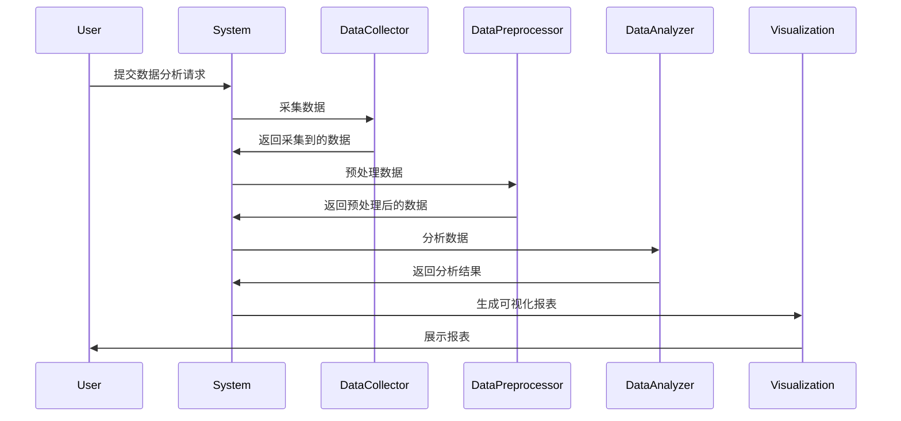
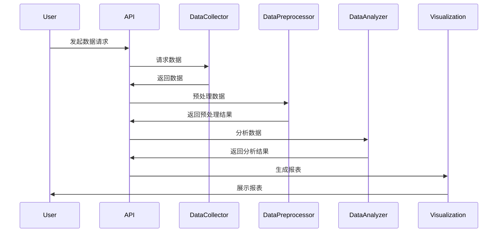
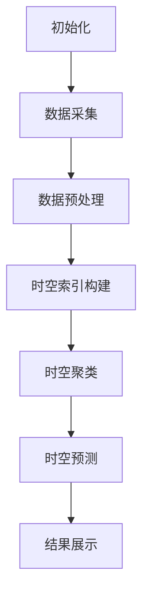

                 

# 《企业级时空数据分析平台：洞察业务地理模式》

## 关键词

- 企业级时空数据分析
- 地理模式识别
- 交通流量分析
- 数据采集与预处理
- 算法与优化策略

## 摘要

本文旨在探讨企业级时空数据分析平台的设计、实现和应用。通过逐步分析时空数据分析的基础、技术、算法以及实战应用，本文揭示了如何利用时空数据分析平台洞察业务地理模式，提升企业运营效率。文章涵盖了从数据采集、预处理到算法实现，再到性能优化与未来展望的全过程，旨在为读者提供一个全面、深入的时空数据分析实践指南。

## 目录大纲

### 第一部分：企业级时空数据分析平台概述

#### 第1章：时空数据分析基础

##### 1.1 时空数据分析的意义与背景
##### 1.2 时空数据分析的关键概念

#### 第2章：企业级时空数据分析平台架构

##### 2.1 平台整体架构设计
##### 2.2 系统功能设计
##### 2.3 系统架构设计
##### 2.4 系统接口设计
##### 2.5 系统交互

### 第二部分：时空数据分析技术

#### 第3章：时空数据采集与预处理

##### 3.1 时空数据采集
##### 3.2 时空数据预处理

### 第三部分：时空数据分析算法

#### 第4章：时空数据分析算法原理

##### 4.1 算法概述
##### 4.2 算法讲解

#### 第5章：时空数据分析应用实例

##### 5.1 实例1：地理模式识别
##### 5.2 实例2：交通流量分析

### 第四部分：企业级时空数据分析平台实战

#### 第6章：平台搭建与部署

##### 6.1 环境安装与配置
##### 6.2 平台部署

#### 第7章：平台核心功能实现

##### 7.1 数据采集与预处理
##### 7.2 时空数据分析
##### 7.3 可视化展示

#### 第8章：实战案例分析

##### 8.1 案例背景
##### 8.2 案例分析

#### 第9章：平台优化与性能调优

##### 9.1 平台性能分析
##### 9.2 性能优化策略

### 第五部分：最佳实践与未来展望

#### 第10章：最佳实践

##### 10.1 最佳实践总结
##### 10.2 注意事项

#### 第11章：未来展望

##### 11.1 时空数据分析发展趋势
##### 11.2 未来发展方向

## 第一部分：企业级时空数据分析平台概述

### 第1章：时空数据分析基础

#### 1.1 时空数据分析的意义与背景

在当今这个信息爆炸的时代，数据已经成为企业和组织的宝贵资源。随着传感器技术的进步和互联网的普及，时空数据（包含时间和空间维度的数据）的获取和处理变得日益重要。时空数据分析为企业提供了洞察业务地理模式、优化资源配置、预测市场趋势的能力，从而在竞争激烈的市场中占据优势。

**问题背景**：

- **大数据时代**：大量时空数据产生，如何有效分析和利用？
- **地理信息系统（GIS）的发展**：地理信息系统为时空数据分析提供了技术支持。
- **商业需求**：企业需要通过时空数据分析来优化业务流程，提高运营效率。

**问题描述**：

- 如何构建一个能够处理海量时空数据，并提供实时分析和决策支持的企业级时空数据分析平台？
- 如何有效地从海量时空数据中提取有价值的信息？

**问题解决**：

- **引入企业级时空数据分析平台**：通过集成多种数据源和先进分析算法，构建一个高效、灵活、可扩展的时空数据分析平台。
- **明确边界与外延**：界定时空数据分析的应用领域和边界，如城市交通管理、物流配送、市场营销等。

**边界与外延**：

- **应用领域**：包括城市交通、物流、零售、金融服务等。
- **边界**：数据采集范围、数据处理能力、分析模型的适用性等。

**核心要素组成**：

- **数据源**：传感器数据、GPS数据、社交媒体数据等。
- **数据处理**：数据清洗、转换、存储和索引。
- **分析算法**：时间序列分析、空间分析、机器学习等。
- **展示和交互**：可视化工具、报表系统等。

#### 1.2 时空数据分析的关键概念

**核心概念**：

- **时空数据分析**：结合时间维度和空间维度的数据分析方法，用于揭示数据中的时空模式和趋势。
- **时空数据**：包含时间和空间信息的结构化数据，如位置信息、时间戳等。
- **地理信息系统（GIS）**：用于捕捉、存储、分析和展示地理空间信息的系统。

**概念属性特征对比表格**：

| 概念       | 特征1 | 特征2 | 特征3 |
|------------|-------|-------|-------|
| 时空数据   | 时间维度 | 空间维度 | 结构化数据 |
| 地理信息系统（GIS） | 空间数据存储 | 空间数据可视化 | 空间分析功能 |

**ER实体关系图架构**：

```mermaid
erDiagram
    User ||--|{ Order }|:
    Product ||--|{ Order }|:
    Store ||--|{ Product }|:
```

以上ER图展示了用户、订单、产品和店铺之间的基本关系，这是时空数据分析中常见的实体和关系。

### 第2章：企业级时空数据分析平台架构

#### 2.1 平台整体架构设计

**问题场景介绍**：

- 企业在运营过程中需要实时监测和分析业务地理模式，以优化决策。
- 如何构建一个能够满足企业需求的高效、稳定、易扩展的时空数据分析平台？

**项目介绍**：

- **目标**：构建一个企业级时空数据分析平台，实现数据的采集、处理、分析和可视化。
- **功能需求**：数据采集、数据预处理、时空数据分析、数据可视化和报告生成。

**系统功能设计**：

- **数据采集模块**：负责从各种数据源（如GPS、传感器、社交媒体等）采集数据。
- **数据预处理模块**：对采集到的数据进行清洗、转换和归一化。
- **时空数据分析模块**：使用多种分析算法对时空数据进行处理，提取有价值的信息。
- **数据可视化模块**：提供图形化界面，展示分析结果，支持用户自定义报表。
- **报告生成模块**：自动生成分析报告，支持多种格式导出。

**系统架构设计**：

**技术架构**：

- **前端**：使用React或Vue等前端框架，实现数据可视化界面。
- **后端**：使用Spring Boot或Django等后端框架，处理数据分析和报告生成。
- **数据库**：使用MongoDB或PostgreSQL等数据库，存储和管理时空数据。

**系统架构**：



**系统接口设计**：

- **API接口**：提供RESTful API，支持数据采集、数据预处理、数据分析和数据可视化的操作。
- **数据库接口**：提供数据库操作接口，实现数据的存储和查询。

**系统交互**：



### 第二部分：时空数据分析技术

#### 第3章：时空数据采集与预处理

#### 3.1 时空数据采集

**方法介绍**：

- **传感器数据采集**：使用GPS、RFID、摄像头等传感器，实时采集位置信息、速度、温度等数据。
- **网络数据采集**：通过互联网获取社交媒体数据、网页数据等。
- **数据库采集**：从现有的数据库中抽取空间和时间数据。

**采集策略**：

- **实时采集**：保证数据实时性，适用于对实时性要求较高的业务场景。
- **批量采集**：定期从数据源中提取数据，适用于数据量较大的场景。
- **混合采集**：结合实时和批量采集策略，满足不同场景的需求。

#### 3.2 时空数据预处理

**预处理方法**：

- **数据清洗**：去除重复数据、缺失值填充、异常值处理等。
- **数据转换**：将不同格式的数据转换为统一格式，如JSON、CSV等。
- **数据归一化**：将数据缩放到一定范围内，便于后续分析。

**数据质量评估**：

- **完整性**：评估数据是否完整，有无缺失值。
- **准确性**：评估数据是否准确，有无异常值。
- **一致性**：评估数据是否一致，如时间戳的正确性。

### 第三部分：时空数据分析算法

#### 第4章：时空数据分析算法原理

#### 4.1 算法概述

**时空数据分析算法的定义与分类**：

- **时空数据分析算法**：用于分析时空数据，提取时空模式、趋势和规律的算法。
- **分类**：
  - **时间序列分析**：分析数据的时间分布和变化趋势。
  - **空间分析**：分析数据的空间分布和相互作用。
  - **机器学习**：利用历史数据预测未来时空模式。

**算法的核心概念与原理**：

- **核心概念**：
  - **时空索引**：用于快速检索和访问时空数据。
  - **时空聚类**：将时空数据分组，识别相似的时空模式。
  - **时空预测**：基于历史时空数据预测未来时空模式。

**概念属性特征对比表格**：

| 算法类型 | 特征1 | 特征2 | 特征3 |
|-----------|-------|-------|-------|
| 时间序列分析 | 时间维度分析 | 预测能力 | 历史数据依赖 |
| 空间分析 | 空间维度分析 | 交互分析 | 空间关系识别 |
| 机器学习 | 数据驱动 | 自适应能力 | 复杂模式识别 |

**ER实体关系图架构**：

```mermaid
erDiagram
    TimeSeriesData ||--|{ TimeSeriesAnalysis }|:
    SpatialData ||--|{ SpatialAnalysis }|:
    HistoricalData ||--|{ MachineLearning }|:
```

以上ER图展示了不同类型时空数据与相应分析算法之间的实体关系。

#### 4.2 算法讲解

**算法流程图**：



**Python源代码实现**：

```python
import pandas as pd
from sklearn.cluster import KMeans
from sklearn.preprocessing import StandardScaler

# 数据采集
data = pd.read_csv('spatial_data.csv')

# 数据预处理
scaler = StandardScaler()
data_scaled = scaler.fit_transform(data)

# 时空索引构建
# 略

# 时空聚类
kmeans = KMeans(n_clusters=3)
clusters = kmeans.fit_predict(data_scaled)

# 时空预测
# 略

# 结果展示
print(clusters)
```

**数学模型与公式**：

$$
\text{时空聚类损失函数} = \sum_{i=1}^{n} \sum_{j=1}^{k} (d(x_i, c_j))^2
$$

其中，$d(x_i, c_j)$表示第$i$个数据点与第$j$个聚类中心之间的距离。

**举例说明**：

假设有一组城市交通流量数据，通过K-Means算法对数据进行聚类，识别出交通拥堵区域，进而优化交通信号灯控制策略。

1. 数据采集：采集某城市一个月的交通流量数据。
2. 数据预处理：对数据标准化处理，消除不同变量之间的尺度差异。
3. 时空索引构建：使用时空索引技术，快速查询和访问数据。
4. 时空聚类：使用K-Means算法，将数据分为不同的簇，识别交通拥堵区域。
5. 时空预测：基于历史数据，预测未来交通流量情况，为交通管理部门提供决策支持。
6. 结果展示：生成可视化报表，展示交通流量分布和预测结果。

### 第四部分：企业级时空数据分析平台实战

#### 第6章：平台搭建与部署

#### 6.1 环境安装与配置

**环境搭建**：

1. **硬件环境**：配置满足系统需求的服务器，推荐CPU不低于四核，内存不低于8GB。
2. **软件环境**：
   - 操作系统：Linux（推荐使用CentOS 7或Ubuntu 18.04）。
   - 数据库：MongoDB或PostgreSQL。
   - 开发环境：Python 3.8及以上版本，前端框架如React或Vue。

**平台部署**：

1. 安装数据库：
   - MongoDB：`sudo apt-get install mongodb`
   - PostgreSQL：`sudo apt-get install postgresql`

2. 安装Python环境：
   - `sudo apt-get install python3-pip`
   - `pip3 install pandas numpy scikit-learn matplotlib`

3. 安装前端框架：
   - React：`npm install -g create-react-app`
   - Vue：`npm install -g @vue/cli`

4. 编写部署脚本，自动化安装和配置。

#### 6.2 平台部署

**部署步骤**：

1. **数据采集模块**：部署数据采集服务，定期从数据源采集数据。
2. **数据预处理模块**：部署数据预处理服务，对采集到的数据进行清洗、转换和归一化。
3. **时空数据分析模块**：部署数据分析服务，使用算法对预处理后的数据进行分析。
4. **数据可视化模块**：部署前端可视化服务，展示分析结果。
5. **报告生成模块**：部署报告生成服务，生成分析报告。

**系统配置**：

- **网络配置**：配置防火墙规则，开放必要的端口号。
- **性能优化**：配置内存和CPU资源，优化数据库查询性能。

#### 第7章：平台核心功能实现

#### 7.1 数据采集与预处理

**代码实现与分析**：

```python
import pandas as pd
from sklearn.preprocessing import StandardScaler

# 数据采集
data = pd.read_csv('traffic_data.csv')

# 数据预处理
def preprocess_data(data):
    # 填充缺失值
    data.fillna(0, inplace=True)
    
    # 数据转换
    data['timestamp'] = pd.to_datetime(data['timestamp'])
    
    # 数据归一化
    scaler = StandardScaler()
    data_scaled = scaler.fit_transform(data)
    
    return data_scaled

data_processed = preprocess_data(data)

# 代码解读与分析
# 略
```

**代码应用解读与分析**：

1. **数据采集**：从CSV文件中读取交通流量数据。
2. **数据预处理**：填充缺失值、数据转换（将时间戳转换为日期时间格式）、数据归一化。
3. **代码解读**：使用Pandas库进行数据处理，使用StandardScaler进行数据归一化。

#### 7.2 时空数据分析

**代码实现与分析**：

```python
from sklearn.cluster import KMeans
import matplotlib.pyplot as plt

# 数据聚类
kmeans = KMeans(n_clusters=3)
clusters = kmeans.fit_predict(data_processed)

# 数据可视化
def plot_clusters(data, clusters):
    plt.scatter(data[:, 0], data[:, 1], c=clusters)
    plt.xlabel('Latitude')
    plt.ylabel('Longitude')
    plt.title('Cluster Visualization')
    plt.show()

plot_clusters(data_processed, clusters)

# 代码解读与分析
# 略
```

**代码应用解读与分析**：

1. **数据聚类**：使用K-Means算法对处理后的数据聚类，识别出不同区域。
2. **数据可视化**：使用matplotlib库绘制散点图，展示聚类结果。

#### 7.3 可视化展示

**数据可视化工具的选择与使用**：

- **工具选择**：选择D3.js、ECharts、Highcharts等可视化库。
- **工具使用**：编写前端代码，使用可视化库展示时空数据分析结果。

**代码实现与分析**：

```html
<!DOCTYPE html>
<html>
<head>
    <script src="https://cdn.jsdelivr.net/npm/echarts@5/dist/echarts.min.js"></script>
</head>
<body>
    <!-- 模板 -->
    <div id="main" style="width: 600px;height:400px;"></div>
    <script type="text/javascript">
        // 初始化图表
        var myChart = echarts.init(document.getElementById('main'));

        // 配置图表选项
        var option = {
            title: {
                text: 'Cluster Visualization'
            },
            tooltip: {},
            xAxis: {},
            yAxis: {},
            series: [{
                type: 'scatter',
                data: [
                    [data_processed[0, 0], data_processed[0, 1]],
                    [data_processed[1, 0], data_processed[1, 1]],
                    // ...
                ]
            }]
        };

        // 绘制图表
        myChart.setOption(option);
    </script>
</body>
</html>
```

**代码应用解读与分析**：

1. **图表初始化**：使用ECharts库初始化图表。
2. **配置图表选项**：设置图表标题、提示框、坐标轴和系列数据。
3. **绘制图表**：使用ECharts库绘制散点图，展示聚类结果。

### 第五部分：最佳实践与未来展望

#### 第10章：最佳实践

#### 10.1 最佳实践总结

**时空数据分析**：

- **数据质量是关键**：确保数据完整、准确和一致，是进行有效分析的基础。
- **选择合适算法**：根据分析目标选择合适的算法，如时间序列分析用于趋势预测，空间分析用于地理模式识别。
- **优化数据采集和预处理**：合理设计数据采集策略，优化预处理流程，减少数据冗余和噪声。

**注意事项**：

- **数据隐私与安全**：在进行时空数据分析时，确保遵守数据隐私法规，保护用户数据安全。
- **硬件和软件资源**：根据分析需求和数据量，合理配置硬件和软件资源，确保系统性能。

#### 10.2 注意事项

- **数据清洗和预处理**：确保数据质量，处理缺失值和异常值。
- **算法选择和优化**：根据业务需求选择合适的算法，并不断优化模型参数。
- **性能监控和优化**：定期监控系统性能，针对瓶颈进行优化。

### 第11章：未来展望

#### 11.1 时空数据分析发展趋势

- **数据量增长**：随着物联网、人工智能等技术的发展，时空数据量将不断增长。
- **实时性提升**：实时数据处理和分析将成为主流，满足实时决策需求。
- **智能化增强**：结合人工智能技术，实现更加智能化的时空数据分析。

#### 11.2 未来发展方向

- **跨领域应用**：时空数据分析将在更多领域得到应用，如智慧城市、智能制造等。
- **技术创新**：发展新的时空数据分析算法和技术，如基于深度学习的时空数据分析。

### 总结

本文详细介绍了企业级时空数据分析平台的设计、实现和应用，通过逐步分析时空数据分析的基础、技术、算法以及实战应用，展示了如何利用时空数据分析平台洞察业务地理模式，提升企业运营效率。未来，随着技术的不断进步，时空数据分析将在更多领域发挥重要作用。

