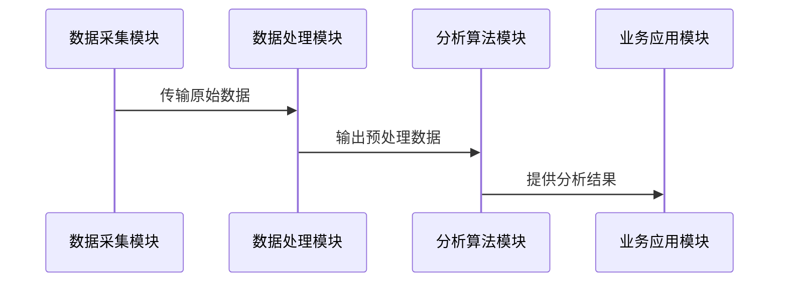

                 

### 第1章 引言

#### 1.1 问题背景

在当今全球化、数字化、智能化的大背景下，企业面临着前所未有的机遇和挑战。随着物联网、5G、大数据等技术的迅猛发展，时空数据在企业运营中扮演着越来越重要的角色。时空数据分析能够帮助企业从大量的时空数据中提取有价值的信息，指导业务决策，优化运营流程，提高竞争力。因此，如何有效地进行时空数据分析成为企业迫切需要解决的问题。

**时空数据分析的重要性**：时空数据涵盖了地理信息、时间序列数据、多模态数据等，这些数据蕴含着丰富的信息和潜在的价值。通过时空数据分析，企业可以了解客户行为、市场趋势、供应链动态等，从而制定更加精准的营销策略、优化供应链管理、提高运营效率。

**时空数据分析的挑战**：时空数据规模庞大、数据来源多样、数据格式复杂，这给数据处理和分析带来了巨大的挑战。首先，时空数据的规模通常非常庞大，如何高效地存储和管理这些数据是一个难题。其次，数据来源多样，包括物联网设备、社交媒体、传感器网络等，这些数据的格式和结构往往不同，需要进行统一处理。此外，时空数据的复杂性和多样性也对数据处理和分析算法提出了更高的要求。

**AI技术在时空数据分析中的应用**：人工智能技术，特别是深度学习和大数据分析技术，为时空数据分析提供了新的方法和工具。深度学习算法能够自动提取数据中的特征，对复杂模式进行识别和预测，从而提高数据分析的效率和准确性。大数据分析技术则能够处理海量数据，挖掘数据中的潜在关系和规律，为企业提供更全面、准确的业务洞察。

#### 1.2 问题描述

**数据来源**：企业从各种渠道获取时空数据，包括物联网设备、社交媒体、传感器网络等。这些数据来源广泛，数据类型多样，如地理信息、时间序列数据、多模态数据等。

**数据类型**：时空数据包括地理信息、时间序列数据、多模态数据等。地理信息数据描述了空间位置和地理特征，如GPS坐标、地图数据等；时间序列数据描述了时间维度上的数据变化，如温度变化、交通流量等；多模态数据则是多种数据类型的结合，如视频数据、音频数据、传感器数据等。

**数据处理需求**：对时空数据的有效处理是进行数据分析的前提。数据处理需求包括数据清洗、数据整合、特征提取、模式识别等。数据清洗旨在去除噪声和错误数据，提高数据质量；数据整合则将来自不同来源和格式的数据进行统一处理，以便后续分析；特征提取是从原始数据中提取有用的特征，用于模型训练和预测；模式识别则是利用算法从数据中识别出规律和模式，为企业提供决策支持。

#### 1.3 问题解决

**AI技术方案**：利用AI技术构建企业级时空数据分析引擎，实现高效的数据处理和分析。AI技术方案包括以下几个方面：

1. **数据采集与预处理**：利用物联网设备和传感器网络，实现海量数据的实时采集。通过数据清洗、数据整合、特征提取等预处理操作，提高数据质量，为后续分析奠定基础。

2. **深度学习模型**：采用深度学习算法，如卷积神经网络（CNN）、循环神经网络（RNN）、Transformer等，对时空数据进行特征提取和模式识别。深度学习模型能够自动从数据中学习特征，对复杂模式进行识别和预测，从而提高数据分析的效率和准确性。

3. **大数据分析**：利用大数据分析技术，对海量时空数据进行挖掘和分析。大数据分析技术包括数据挖掘、机器学习、图数据库等，能够从海量数据中挖掘出潜在的关系和规律，为企业提供更全面、准确的业务洞察。

4. **可视化与决策支持**：通过数据可视化技术，将分析结果以图表、地图等形式直观地展示出来，帮助企业更好地理解和利用数据分析结果。结合业务场景，为企业提供决策支持，优化运营流程，提高竞争力。

**业务模式洞察**：通过时空数据分析，帮助企业挖掘业务模式、优化运营流程、提高竞争力。具体来说，可以从以下几个方面进行业务模式洞察：

1. **客户行为分析**：通过对客户行为数据的分析，了解客户的需求和偏好，优化产品和服务，提高客户满意度。

2. **市场趋势预测**：通过对市场数据的分析，预测市场趋势和变化，为企业制定市场策略提供支持。

3. **供应链优化**：通过对供应链数据的分析，优化供应链管理，提高供应链效率，降低运营成本。

4. **风险预警**：通过对时空数据的分析，发现潜在的风险和问题，提前预警，采取措施，避免业务损失。

#### 1.4 边界与外延

**时空数据分析的范围**：时空数据分析涉及地理信息系统、遥感技术、时间序列分析等领域。地理信息系统（GIS）提供了空间数据的存储、管理和分析工具；遥感技术可以从卫星图像中提取地理信息；时间序列分析则是针对时间维度上的数据进行分析和预测。

**AI技术的应用领域**：AI技术不仅在时空数据分析中有着广泛的应用，还涉及自然语言处理、计算机视觉、强化学习等领域。自然语言处理（NLP）用于处理和理解文本数据；计算机视觉（CV）用于图像和视频数据的分析和识别；强化学习（RL）则是一种通过试错学习来优化决策的方法。

#### 1.5 概念结构与核心要素组成

**时空数据分析引擎**：时空数据分析引擎是进行时空数据分析的核心系统。其核心组成部分包括数据采集模块、数据处理模块、分析算法模块、业务应用模块。

**AI技术核心**：AI技术是时空数据分析引擎的核心驱动力。主要包括深度学习模型、数据挖掘算法、大数据处理框架等。

#### 第2章 AI技术在时空数据分析中的应用原理

#### 2.1 AI技术概述

**AI技术发展历程**：人工智能（AI）技术经历了数十年的发展，从最初的逻辑推理、知识表示，到现代的深度学习和大数据分析。深度学习（Deep Learning）是近年来人工智能领域的重大突破，通过多层神经网络，能够自动从数据中学习特征和模式，实现高效的图像识别、语音识别、自然语言处理等应用。

**AI技术的核心优势**：AI技术具有以下核心优势：

1. **高效性**：深度学习模型能够自动从海量数据中学习特征，提高了数据处理和分析的效率。

2. **灵活性**：AI技术可以适应不同的应用场景，通过调整模型结构和参数，实现不同的任务目标。

3. **自动化**：AI技术能够自动进行数据处理和分析，减少了对人工的依赖，提高了生产效率。

**深度学习模型**：深度学习模型是AI技术的核心组成部分，主要包括卷积神经网络（CNN）、循环神经网络（RNN）、Transformer等。

- **卷积神经网络（CNN）**：CNN是一种专门用于图像识别和处理的深度学习模型，通过卷积操作，能够自动从图像中提取特征。

- **循环神经网络（RNN）**：RNN是一种专门用于序列数据处理的深度学习模型，通过循环结构，能够捕捉序列数据中的时间依赖关系。

- **Transformer**：Transformer是一种基于自注意力机制的深度学习模型，被广泛应用于自然语言处理和图像识别等领域，具有强大的并行计算能力和灵活性。

#### 2.2 时空数据分析核心概念

**时空数据**：时空数据是描述事件发生时间和空间位置的数据。它包括地理坐标、时间戳、属性信息等。地理坐标描述了事件发生的地理位置，时间戳描述了事件发生的时间，属性信息则描述了事件的其他特征。

**时空数据分析方法**：时空数据分析方法主要包括时空聚类、时空关联、时空预测等。

- **时空聚类**：时空聚类是一种将时空数据按照一定的规则进行分组的方法，用于发现时空数据中的相似性和规律。

- **时空关联**：时空关联是一种分析时空数据之间关系的方法，用于发现时空数据之间的联系和依赖。

- **时空预测**：时空预测是一种基于时空数据历史信息，对未来时空数据进行预测的方法，用于预测未来时空数据的变化趋势。

#### 2.3 AI技术在时空数据分析中的应用

**深度学习模型**：深度学习模型在时空数据分析中有着广泛的应用。以下是几种常见的深度学习模型及其在时空数据分析中的应用：

- **卷积神经网络（CNN）**：CNN在图像识别和图像处理领域有着广泛的应用。在时空数据分析中，CNN可以用于图像数据的时间序列分析，如交通流量预测、人群密度估计等。

- **循环神经网络（RNN）**：RNN在序列数据处理领域有着广泛的应用。在时空数据分析中，RNN可以用于时间序列数据的预测，如温度预测、交通流量预测等。

- **Transformer**：Transformer在自然语言处理和图像识别领域有着广泛的应用。在时空数据分析中，Transformer可以用于时空序列数据的分析，如城市交通流量预测、天气预测等。

**数据挖掘算法**：数据挖掘算法在时空数据分析中也有着重要的应用。以下是几种常见的数据挖掘算法及其在时空数据分析中的应用：

- **K-近邻（KNN）**：KNN是一种基于实例的算法，通过计算新实例与训练实例的相似度，进行分类和预测。在时空数据分析中，KNN可以用于时空数据的聚类和分类。

- **决策树**：决策树是一种基于规则的学习算法，通过递归划分数据集，生成一棵决策树。在时空数据分析中，决策树可以用于时空数据的特征提取和分类。

- **支持向量机（SVM）**：SVM是一种基于间隔最大化的线性分类器，通过找到一个最优的超平面，将不同类别的数据分开。在时空数据分析中，SVM可以用于时空数据的分类和回归分析。

#### 2.4 概念属性特征对比表格

| 特征比较项 | 深度学习模型 | 数据挖掘算法 |
| :--------: | :-----------: | :-----------: |
| **适用场景** | 复杂模式识别 | 简单特征分类 |
| **计算复杂度** | 较高 | 较低 |
| **可解释性** | 较低 | 较高 |
| **实时性** | 较高 | 较低 |

**ER实体关系图架构**

```mermaid
erDiagram
  Asexy --> Bperson : knows
  Bperson ||--|{ Ccar } : owns
  Ccar ||--|{ Dengineer } : repairs
```

#### 第3章 时空数据分析引擎架构设计

**3.1 时空数据分析引擎概述**

**系统功能**：时空数据分析引擎主要包括以下功能模块：

1. **数据采集模块**：实现数据源的接入和管理，包括物联网设备、社交媒体、传感器网络等。

2. **数据处理模块**：进行数据的清洗、转换、归一化等预处理操作，提高数据质量。

3. **分析算法模块**：包括时空聚类、时空关联、时空预测等算法，用于对时空数据进行分析和挖掘。

4. **业务应用模块**：将分析结果应用于具体业务场景，如营销策略优化、供应链管理优化等。

**系统目标**：时空数据分析引擎旨在提供高效、灵活、可扩展的时空数据分析解决方案，帮助企业从海量时空数据中提取有价值的信息，优化运营流程，提高竞争力。

**3.2 系统架构设计**

**数据采集模块**：数据采集模块主要负责从各种数据源获取时空数据。具体包括：

1. **物联网设备数据**：通过接入各种物联网设备，如传感器、智能设备等，实时采集地理位置、环境参数等数据。

2. **社交媒体数据**：通过接入社交媒体平台，如Twitter、Facebook等，实时获取用户发布的位置信息、活动轨迹等数据。

3. **传感器网络数据**：通过接入传感器网络，如交通流量传感器、气象传感器等，实时采集交通状况、天气状况等数据。

**数据处理模块**：数据处理模块主要负责对采集到的时空数据进行预处理，包括：

1. **数据清洗**：去除噪声和错误数据，保证数据质量。

2. **数据转换**：将不同数据源的时空数据进行统一格式转换，便于后续分析。

3. **数据归一化**：将不同量纲的时空数据进行归一化处理，便于算法处理。

**分析算法模块**：分析算法模块是时空数据分析引擎的核心，主要包括以下算法：

1. **时空聚类**：通过聚类算法，对时空数据进行分组，发现数据中的相似性和规律。

2. **时空关联**：通过关联分析，发现时空数据之间的联系和依赖。

3. **时空预测**：通过时间序列分析、机器学习等方法，对未来的时空数据进行预测。

**业务应用模块**：业务应用模块将分析结果应用于具体业务场景，提供决策支持。具体包括：

1. **营销策略优化**：通过对用户行为数据的分析，优化营销策略，提高用户转化率。

2. **供应链管理优化**：通过对供应链数据的分析，优化供应链管理，提高供应链效率。

3. **风险预警**：通过对时空数据的分析，发现潜在的风险和问题，提前预警。

**3.3 系统接口设计与交互**

系统接口设计主要考虑不同模块之间的数据传输和交互。具体包括以下方面：

1. **数据采集模块与数据处理模块**：数据采集模块将采集到的时空数据传输给数据处理模块，进行处理和预处理。

2. **数据处理模块与分析算法模块**：数据处理模块将处理后的时空数据传输给分析算法模块，进行分析和挖掘。

3. **分析算法模块与业务应用模块**：分析算法模块将分析结果传输给业务应用模块，为业务决策提供支持。



#### 第4章 深度学习在时空数据分析中的应用

**4.1 深度学习基础**

**神经网络原理**：

神经网络是一种模拟生物神经系统的计算模型，通过多层神经元进行信息传递和处理。神经网络的基本原理包括以下几个方面：

1. **前向传播**：输入数据通过网络的每一层神经元传递，直到输出层。每一层神经元都会对输入数据进行加权求和，然后通过激活函数进行非线性转换。

2. **反向传播**：通过计算输出层的误差，反向传播误差到网络的每一层，更新每一层的权重和偏置，以最小化误差。

3. **激活函数**：激活函数用于引入非线性特性，常用的激活函数包括 sigmoid、ReLU、Tanh等。

**深度学习模型**：

深度学习模型是神经网络的一种扩展，通过增加网络的层数，提高模型的表示能力。以下是几种常见的深度学习模型：

1. **卷积神经网络（CNN）**：CNN是一种专门用于图像识别和图像处理的深度学习模型，通过卷积操作，能够自动从图像中提取特征。CNN广泛应用于图像分类、目标检测、图像生成等领域。

2. **循环神经网络（RNN）**：RNN是一种专门用于序列数据处理的深度学习模型，通过循环结构，能够捕捉序列数据中的时间依赖关系。RNN广泛应用于自然语言处理、语音识别、时间序列预测等领域。

3. **Transformer**：Transformer是一种基于自注意力机制的深度学习模型，通过自注意力机制，能够自动学习输入序列中的依赖关系。Transformer广泛应用于自然语言处理、图像识别、语音识别等领域。

**深度学习模型的工作原理**：

深度学习模型通过大量的数据训练，自动学习输入数据中的特征和模式。具体工作原理如下：

1. **数据预处理**：对输入数据进行预处理，包括归一化、去噪、补全等操作，以提高模型训练效果。

2. **前向传播**：将输入数据通过网络的每一层进行传递，每一层都会对输入数据进行加权求和，然后通过激活函数进行非线性转换。

3. **反向传播**：通过计算输出层的误差，反向传播误差到网络的每一层，更新每一层的权重和偏置，以最小化误差。

4. **优化算法**：使用优化算法，如梯度下降、Adam等，更新网络的参数，以最小化误差。

5. **评估与调整**：通过验证集和测试集评估模型性能，根据评估结果调整模型结构、参数等，以提高模型性能。

**4.2 时空数据深度学**

**时空数据特点**：

时空数据具有以下特点：

1. **多维度**：时空数据通常包含多个维度，如时间、空间、属性等。

2. **序列性**：时空数据通常具有序列性，即数据按照时间顺序排列。

3. **不确定性**：时空数据中的信息可能存在噪声、异常值等不确定性。

4. **复杂模式**：时空数据中可能存在复杂的关系和模式，如时空聚类、时空关联等。

**时空数据深度学习应用**：

时空数据深度学习在多个领域有着广泛的应用，以下是一些典型的应用场景：

1. **交通流量预测**：通过分析历史交通流量数据，预测未来的交通流量变化，为交通管理提供支持。

2. **城市安全管理**：通过对城市时空数据进行分析，发现潜在的安全隐患，提前预警，保障城市安全。

3. **能源管理**：通过对时空数据进行分析，优化能源分配和使用，提高能源利用效率。

4. **环境监测**：通过对时空数据进行分析，监测环境变化，预测环境污染事件，为环境保护提供支持。

**时空数据深度学习模型**：

以下是几种常见的时空数据深度学习模型：

1. **时空卷积网络（ST-CNN）**：ST-CNN结合了时空卷积和空间卷积，能够同时处理时空数据和空间数据。ST-CNN广泛应用于交通流量预测、城市安全管理等领域。

2. **时空循环网络（ST-RNN）**：ST-RNN结合了时空循环和循环神经网络，能够处理序列性的时空数据。ST-RNN广泛应用于时间序列预测、环境监测等领域。

3. **时空Transformer（ST-Transformer）**：ST-Transformer结合了时空自注意力和Transformer模型，能够自动学习时空数据中的依赖关系。ST-Transformer广泛应用于交通流量预测、城市安全管理等领域。

**时空数据深度学习模型的工作原理**：

时空数据深度学习模型的工作原理如下：

1. **数据预处理**：对时空数据进行预处理，包括归一化、去噪、补全等操作，以提高模型训练效果。

2. **特征提取**：通过时空卷积、时空循环等操作，提取时空数据中的特征。

3. **自注意力机制**：通过自注意力机制，自动学习时空数据中的依赖关系。

4. **模型训练**：使用大量的时空数据，通过反向传播算法，训练模型参数。

5. **模型评估**：通过验证集和测试集，评估模型性能，调整模型参数。

**4.3 实际应用案例**

以下是一个实际应用案例，展示如何使用深度学习模型进行时空数据分析。

**案例背景**：某城市交通管理部门希望利用时空数据分析技术，预测未来的交通流量变化，为交通管理提供支持。

**数据处理**：收集某城市历史交通流量数据，包括时间、地点、流量等。对数据进行预处理，包括归一化、去噪、补全等操作。

**模型选择**：选择时空卷积网络（ST-CNN）作为预测模型。ST-CNN能够同时处理时空数据和空间数据，适合交通流量预测问题。

**模型训练**：使用历史交通流量数据，训练ST-CNN模型。通过反向传播算法，更新模型参数，以最小化预测误差。

**模型评估**：使用验证集和测试集，评估模型性能。通过计算预测误差，评估模型的准确性。

**模型应用**：将训练好的模型应用于实际交通流量预测。根据预测结果，制定相应的交通管理策略。

**效果分析**：通过实际应用，分析模型预测的效果。比较预测结果和实际交通流量，评估模型的准确性和可靠性。

**总结**：通过时空数据深度学习技术，能够有效地预测未来的交通流量变化，为交通管理提供科学依据。未来，随着深度学习技术的不断发展，时空数据分析将在更多领域发挥重要作用。

