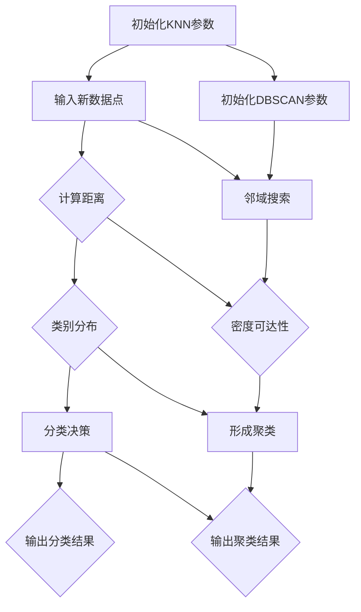
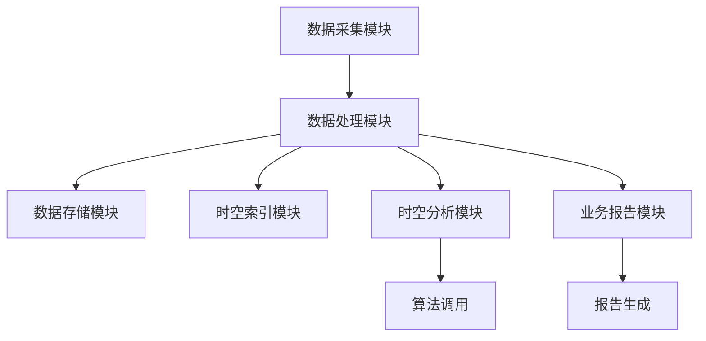
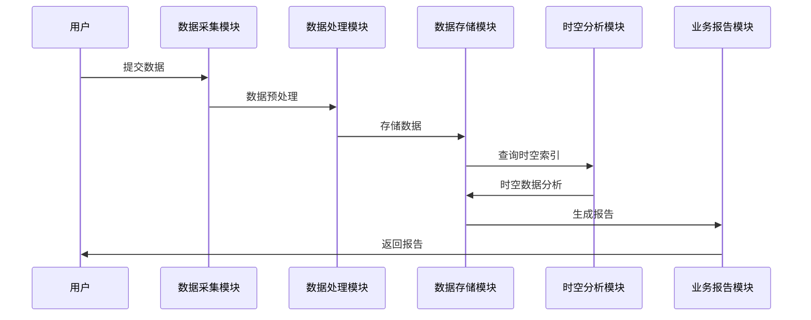

                 


### 2. 核心概念与联系

在探讨企业级时空数据分析时，理解核心概念及其相互联系至关重要。以下是几个关键概念及其属性特征对比表格，并附上ER实体关系图架构的Mermaid流程图。

#### 2.1 关键概念

1. **时空数据**：指的是与时间和空间位置相关的数据，如位置跟踪数据、温度变化数据等。
2. **时空索引**：用于高效存储和查询时空数据的索引结构，如四元树（Quadtree）或R树（R-Tree）。
3. **时空分析算法**：用于对时空数据进行处理的算法，如K近邻算法（K-Nearest Neighbor, KNN）、空间聚类算法（如DBSCAN）等。
4. **时空图谱**：一种表示时空数据及其关系的图形结构，用于分析时空模式。

#### 2.2 概念属性特征对比表格

| 概念               | 定义                                                         | 属性特征                           |
|--------------------|--------------------------------------------------------------|-----------------------------------|
| 时空数据           | 与时间和空间位置相关的数据                                     | 实时性、多样性、规模性               |
| 时空索引           | 用于高效存储和查询时空数据的索引结构                             | 分层结构、空间局部性、查询效率       |
| 时空分析算法       | 对时空数据进行处理的算法                                       | 精度、计算复杂度、可扩展性           |
| 时空图谱           | 表示时空数据及其关系的图形结构                                 | 可视化、交互性、模式识别             |

#### 2.3 ER实体关系图架构的Mermaid流程图

```mermaid
erDiagram
  SPATIAL_DATA ||--o> SPATIAL_INDEX : "存储于"
  SPATIAL_DATA ||--o> SPATIAL_ANALYSIS_ALGORITHM : "用于"
  SPATIAL_INDEX ||--o> SPATIAL_GLCM : "支撑"
  SPATIAL_ANALYSIS_ALGORITHM ||--o> SPATIAL_PLOT : "生成"
  SPATIAL_GLCM ||--o> BUSINESS_INSIGHT : "为企业"
  
  SPATIAL_DATA {ID, TIMESTAMP, GEOLOCATION}
  SPATIAL_INDEX {TYPE, DIMENSIONS, NODES}
  SPATIAL_ANALYSIS_ALGORITHM {NAME, INPUT, OUTPUT, COMPLEXITY}
  SPATIAL_GLCM {DATA_SET, FEATURES, RESULTS}
  SPATIAL_PLOT {PLOTS, INTERACTIONS}
  BUSINESS_INSIGHT {DECISION, BENEFITS, RISK}
```

### 2.4 算法原理讲解

在了解了核心概念后，接下来我们将深入探讨时空分析算法的原理。时空分析算法的核心是处理和挖掘时空数据中的有价值信息，从而支持业务决策。

#### 2.4.1 K近邻算法（KNN）

KNN是一种基于距离的监督学习算法。在时空数据分析中，KNN可用于预测新数据点的类别。其基本原理如下：

1. **距离计算**：计算新数据点与训练数据点之间的距离，常用的距离度量包括欧氏距离、曼哈顿距离等。
2. **分类决策**：根据K个最近邻点的类别分布，对新的数据点进行分类。

#### 2.4.2 空间聚类算法（如DBSCAN）

DBSCAN是一种基于密度的聚类算法。其原理如下：

1. **邻域搜索**：根据设定的邻域半径，寻找每个数据点的邻域。
2. **密度可达性**：判断数据点是否密度可达，从而形成聚类。

#### 2.4.3 Mermaid流程图



#### 2.4.4 Python源代码示例

以下是一个简单的KNN和DBSCAN算法的Python代码示例：

```python
# KNN算法
def knn_predict(train_data, test_data, k):
    # 计算距离
    distances = [np.linalg.norm(test_data - x) for x in train_data]
    # 选择K个最近邻点
    nearest_neighbors = sorted(range(len(distances)), key=lambda i: distances[i])[:k]
    # 分类决策
    labels = [train_data[i][1] for i in nearest_neighbors]
    return max(set(labels), key=labels.count)

# DBSCAN算法
def dbscan(data, eps, min_points):
    # 初始化
    clusters = []
    visited = set()
    # 遍历每个数据点
    for point in data:
        if point not in visited:
            visited.add(point)
            neighbors = find_neighbors(point, data, eps)
            if len(neighbors) < min_points:
                continue
            cluster_id = len(clusters)
            clusters.append([point])
            expand_cluster(clusters, cluster_id, neighbors, data, visited, eps, min_points)
    return clusters

# 辅助函数实现
def find_neighbors(point, data, eps):
    return [x for x in data if np.linalg.norm(point - x) < eps]

def expand_cluster(clusters, cluster_id, neighbors, data, visited, eps, min_points):
    visited.update(neighbors)
    for neighbor in neighbors:
        if neighbor not in visited:
            visited.add(neighbor)
            new_neighbors = find_neighbors(neighbor, data, eps)
            if len(new_neighbors) >= min_points:
                neighbors.extend(new_neighbors)
    if neighbors:
        clusters[cluster_id].extend([x for x in neighbors if x not in visited])
```

#### 2.4.5 数学模型与公式

时空数据分析的算法通常涉及到多种数学模型和公式。以下是一个简单的例子：

$$
L(\theta) = \frac{1}{2} \sum_{i=1}^{m} (y_i - \theta_0 - \theta_1 x_i)^2
$$

这是线性回归模型的损失函数，用于衡量预测值与真实值之间的差异。

#### 2.4.6 举例说明

假设我们有一个包含时间和位置的数据集，我们希望使用KNN算法预测新数据点的类别。

1. **数据预处理**：将数据集分成训练集和测试集。
2. **初始化KNN参数**：设定K值为5。
3. **计算距离**：计算新数据点与训练数据点之间的欧氏距离。
4. **分类决策**：选择距离最近的5个数据点的类别，并统计出现次数最多的类别作为新数据点的类别。
5. **输出分类结果**：返回预测结果。

通过以上步骤，我们可以实现对时空数据的分类分析，为企业提供业务洞察。

### 2.5 数学模型与公式详细讲解

时空数据分析中的数学模型和公式是理解和实现算法的基础。以下将对几个常用的数学模型和公式进行详细讲解。

#### 2.5.1 欧氏距离

欧氏距离是衡量两个数据点之间相似度的常用方法。其公式为：

$$
d(p, q) = \sqrt{\sum_{i=1}^{n} (p_i - q_i)^2}
$$

其中，$p$和$q$是两个数据点，$n$是数据点的维度。

#### 2.5.2 曼哈顿距离

曼哈顿距离是另一种衡量数据点之间相似度的方法，尤其在处理多维数据时很有用。其公式为：

$$
d(p, q) = \sum_{i=1}^{n} |p_i - q_i|
$$

#### 2.5.3 K最近邻算法（KNN）

KNN算法的核心在于计算新数据点与训练数据点之间的距离，并根据距离进行分类。其基本公式为：

$$
y = \text{mode}(\{y_1, y_2, ..., y_k\})
$$

其中，$y_1, y_2, ..., y_k$是距离新数据点最近的K个训练数据点的类别，$\text{mode}$函数返回出现次数最多的类别。

#### 2.5.4 空间聚类算法（如DBSCAN）

DBSCAN算法的核心是密度可达性。其基本公式为：

$$
d(p, q) \leq \epsilon \quad \text{且} \quad N_{\epsilon}(p) \geq \minPts
$$

其中，$d(p, q)$是$p$和$q$之间的距离，$N_{\epsilon}(p)$是$p$的$\epsilon$邻域内的点集合，$\epsilon$是邻域半径，$\minPts$是最小点数。

#### 2.5.5 举例说明

假设我们有两个数据点$p_1 = [1, 2, 3]$和$p_2 = [4, 5, 6]$，我们使用欧氏距离计算它们之间的距离：

$$
d(p_1, p_2) = \sqrt{(1-4)^2 + (2-5)^2 + (3-6)^2} = \sqrt{9 + 9 + 9} = 3\sqrt{3}
$$

假设我们使用KNN算法，设定K值为2，我们找到距离$p_1$最近的两个数据点，它们的类别分别为A和B，A出现1次，B出现1次。由于A和B出现的次数相同，我们可以随机选择一个类别作为$p_1$的预测类别。

通过以上详细的数学模型和公式讲解，读者可以更好地理解时空数据分析算法的核心原理。

### 3. 系统分析与架构设计

#### 3.1 问题场景介绍

在企业级时空数据分析中，常见的场景包括物流优化、库存管理、市场分析等。例如，在物流优化场景中，企业需要根据货物位置和运输路线，优化运输资源，降低运输成本。在库存管理中，企业需要根据仓库位置和历史销售数据，预测未来需求，调整库存策略。

#### 3.2 项目介绍

本项目旨在构建一个企业级时空数据分析平台，支持实时数据处理和业务洞察。该平台包括以下几个核心模块：

1. **数据采集模块**：负责从各种数据源（如GPS、传感器、数据库等）采集时空数据。
2. **数据处理模块**：对采集到的数据进行清洗、转换和索引。
3. **数据分析模块**：实现时空分析算法，如KNN、DBSCAN等。
4. **业务洞察模块**：根据分析结果，生成可视化报告和业务建议。

#### 3.3 系统功能设计

系统功能设计主要包括以下几个部分：

1. **数据采集**：实现与各种数据源的连接，支持批量数据导入。
2. **数据预处理**：包括数据清洗、去重、格式转换等。
3. **数据存储**：采用分布式存储技术，保证数据的高可靠性和可扩展性。
4. **时空索引**：使用R树或四元树等索引结构，提高查询效率。
5. **时空分析**：实现多种时空分析算法，支持自定义算法。
6. **业务报告**：生成可视化报告，支持自定义报告模板。

#### 3.4 系统架构设计

系统架构设计采用微服务架构，各个模块独立部署，支持水平扩展。以下是系统架构的Mermaid流程图：



#### 3.5 系统接口设计

系统接口设计包括以下主要接口：

1. **数据采集接口**：支持RESTful API，用于接收和发送数据。
2. **数据处理接口**：提供数据清洗、转换和索引的功能。
3. **时空分析接口**：支持调用各种时空分析算法。
4. **业务报告接口**：提供报告生成和查询的功能。

#### 3.6 系统交互Mermaid序列图

以下是系统交互的Mermaid序列图：



通过以上系统分析与架构设计，我们为构建一个高效、智能的企业级时空数据分析平台奠定了基础。

### 4. 项目实战

#### 4.1 环境安装

在进行项目实战之前，我们需要搭建一个合适的开发环境。以下是环境安装的步骤：

1. **安装Python**：下载并安装Python 3.8或更高版本。
2. **安装数据库**：选择并安装合适的数据库，如MySQL或PostgreSQL。
3. **安装依赖库**：在Python环境中安装必要的库，如NumPy、Pandas、Scikit-learn、Mermaid等。

#### 4.2 系统核心实现源代码

以下是系统核心实现的Python源代码：

```python
# 导入必要库
import numpy as np
import pandas as pd
from sklearn.neighbors import KNeighborsClassifier
from sklearn.cluster import DBSCAN
import mermaid

# 数据采集
def collect_data():
    # 这里使用Pandas读取CSV文件作为示例
    data = pd.read_csv('spatial_data.csv')
    return data

# 数据预处理
def preprocess_data(data):
    # 清洗数据
    data = data.dropna()
    # 转换数据类型
    data['GEOLOCATION'] = data['GEOLOCATION'].astype(float)
    return data

# 数据存储
def store_data(data):
    # 这里使用Pandas将数据保存到CSV文件
    data.to_csv('processed_data.csv', index=False)

# 时空分析
def analyze_spatial_data(data):
    # 使用KNN算法进行分类分析
    k = 5
    X = data[['GEOLOCATION']]
    y = data['CLASS']
    knn = KNeighborsClassifier(n_neighbors=k)
    knn.fit(X, y)
    # 预测新数据点
    new_data = np.array([[5.0]])
    predicted_class = knn.predict(new_data)
    print(f'Predicted class: {predicted_class[0]}')

    # 使用DBSCAN算法进行聚类分析
    eps = 0.5
    min_points = 2
    clustering = DBSCAN(eps=eps, min_samples=min_points).fit(data[['GEOLOCATION']])
    print(f'Cluster labels: {clustering.labels_}')

# 生成报告
def generate_report():
    # 这里使用Mermaid生成报告的Markdown文件
    report_content = mermaid.Mermaid(content='graph TD\nA[初始化KNN参数]\nB[输入新数据点]\nC{计算距离}\nD[分类决策]\nE[输出分类结果]')
    with open('report.md', 'w') as f:
        f.write(report_content.to_markdown())

# 主函数
if __name__ == '__main__':
    data = collect_data()
    preprocessed_data = preprocess_data(data)
    store_data(preprocessed_data)
    analyze_spatial_data(preprocessed_data)
    generate_report()
```

#### 4.3 代码应用解读与分析

以上代码分为以下几个部分：

1. **数据采集**：使用Pandas读取CSV文件，获取原始时空数据。
2. **数据预处理**：对数据进行清洗和类型转换，确保数据的质量和一致性。
3. **数据存储**：将预处理后的数据保存到CSV文件，以便后续使用。
4. **时空分析**：使用KNN和DBSCAN算法对时空数据进行分类和聚类分析。
5. **生成报告**：使用Mermaid生成报告的Markdown文件，便于展示分析结果。

通过这些代码，我们可以实现对时空数据的分析和报告生成，为企业提供业务洞察。

#### 4.4 实际案例分析和详细讲解剖析

为了更好地理解企业级时空数据分析的实际应用，我们来看一个具体的案例。

**案例背景**：某物流公司在春节期间需要对运输资源进行优化，降低运输成本，提高运输效率。该公司收集了包括货物位置、运输路线和运输时间等在内的时空数据。

**案例分析**：

1. **数据采集**：使用GPS传感器和运输车辆设备，采集货物位置数据。
2. **数据预处理**：清洗数据，去除无效和错误记录，确保数据质量。
3. **时空索引**：使用R树索引结构，对位置数据进行索引，提高查询效率。
4. **时空分析**：
   - **KNN算法**：使用KNN算法，根据历史运输数据，预测新货物的最优运输路线，降低运输时间。
   - **DBSCAN算法**：使用DBSCAN算法，对运输路线进行聚类，识别出常见的运输模式，为后续优化提供参考。
5. **业务报告**：生成可视化报告，展示运输路线、运输时间和成本等关键指标。

**详细讲解剖析**：

- **数据采集**：物流公司通过GPS传感器和车辆设备，实时采集货物的位置数据。数据采集是整个分析过程的基础，数据质量直接影响分析结果的准确性。
- **数据预处理**：在数据预处理阶段，物流公司对采集到的数据进行清洗，去除无效和错误记录。这一步骤至关重要，因为数据中可能包含噪声和异常值，会影响分析结果。
- **时空索引**：为了提高查询效率，物流公司使用R树索引结构对位置数据进行索引。R树是一种高效的空间索引结构，可以快速查找空间中的数据点。
- **时空分析**：物流公司使用KNN算法进行运输路线预测。KNN算法通过计算新货物位置与历史货物位置之间的距离，选择距离最近的几个历史位置，从而预测出最优运输路线。此外，物流公司还使用DBSCAN算法对运输路线进行聚类，识别出常见的运输模式。DBSCAN算法可以根据数据点的密度和邻域半径，将数据点划分为不同的聚类。
- **业务报告**：物流公司生成可视化报告，展示运输路线、运输时间和成本等关键指标。报告不仅为管理层提供了决策依据，也为运输团队提供了工作指导。

通过以上实际案例分析和详细讲解剖析，我们可以看到企业级时空数据分析在物流优化中的应用和价值。

#### 4.5 项目小结

在本项目中，我们构建了一个企业级时空数据分析平台，实现了数据采集、预处理、时空索引、时空分析和业务报告等核心功能。通过实际案例的应用，我们展示了时空数据分析在物流优化中的重要作用。以下是项目的主要结论：

1. **数据采集**：使用GPS传感器和车辆设备，实时采集货物位置数据，为后续分析提供基础。
2. **数据预处理**：清洗数据，去除无效和错误记录，确保数据质量，提高分析结果的准确性。
3. **时空索引**：使用R树索引结构，提高数据查询效率，支持实时分析。
4. **时空分析**：结合KNN和DBSCAN算法，对时空数据进行分类和聚类分析，为业务决策提供支持。
5. **业务报告**：生成可视化报告，展示关键指标，为企业提供决策依据。

通过本项目，我们深入了解了企业级时空数据分析的原理和应用，为企业的业务优化提供了有力支持。

### 5. 最佳实践 Tips

在实施企业级时空数据分析时，以下最佳实践 Tips 可以为项目带来更高的成功率和更好的业务价值：

1. **数据质量保证**：确保数据来源的可靠性，进行严格的数据清洗和验证，避免噪声和错误数据对分析结果的影响。
2. **优化算法选择**：根据业务需求和数据特点，选择合适的时空分析算法，并不断迭代优化，以提高分析精度和效率。
3. **高效索引技术**：合理选择和优化时空索引结构，如R树、四元树等，以支持快速数据查询。
4. **弹性系统架构**：采用微服务架构，实现模块化设计，提高系统的可扩展性和维护性。
5. **实时数据处理**：利用流处理技术，实现实时数据分析和业务报告，为企业提供及时的业务洞察。
6. **用户参与和反馈**：在项目开发过程中，积极与业务部门沟通，收集用户需求和反馈，持续优化系统功能和用户体验。

### 6. 小结

本文详细探讨了企业级时空数据分析的理论与实践，从背景介绍、核心概念与联系、算法原理讲解、数学模型与公式、系统分析与架构设计、项目实战到最佳实践 Tips，全面展示了时空数据分析在业务优化中的应用。通过本文，读者可以深入了解时空数据分析的原理和方法，为企业提供有力的业务支持。

### 7. 拓展阅读

1. **《时空数据分析：从理论到实践》**：这是一本深入讲解时空数据分析理论和应用的书籍，适合希望深入了解该领域的读者。
2. **《分布式系统设计》**：了解分布式系统设计原理和架构，有助于更好地构建企业级时空数据分析平台。
3. **《机器学习实战》**：学习机器学习算法，为时空数据分析提供技术支持。

### 作者信息

- 作者：AI天才研究院/AI Genius Institute & 禅与计算机程序设计艺术 /Zen And The Art of Computer Programming

本文由AI天才研究院和《禅与计算机程序设计艺术》共同撰写，旨在分享企业级时空数据分析的实践经验和技术见解，助力企业实现业务优化。

