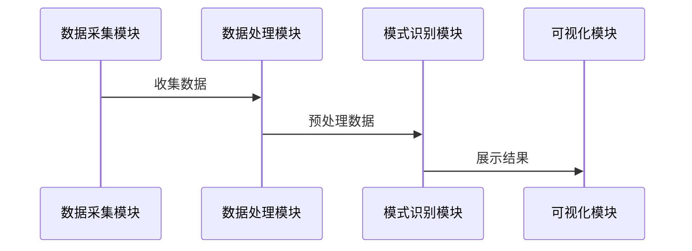
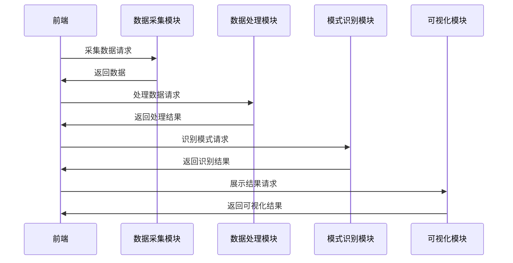
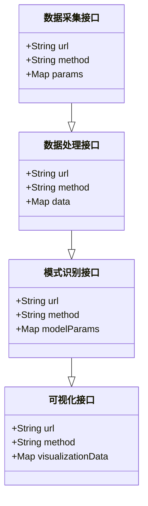
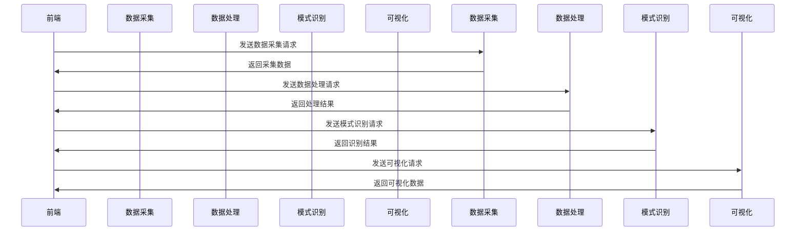

                 

# 企业级时空模式识别：洞察业务地理趋势

## 关键词：企业级时空模式识别、地理趋势分析、大数据处理、人工智能算法、业务洞察

> 摘要：本文将深入探讨企业级时空模式识别的重要性及其在业务地理趋势分析中的应用。通过对时空模式识别的基本原理、方法和工具的详细解析，我们将展示如何利用大数据和人工智能技术，为企业提供精准的地理趋势洞察，从而优化业务策略，提升竞争力。

## 目录大纲

----------------------------------------------------------------

## 第一部分：引言

### 1.1 问题背景

#### 1.1.1 时空模式识别的重要性

#### 1.1.2 企业级时空模式识别的应用场景

### 1.2 问题描述

#### 1.2.1 企业级时空模式识别的挑战

#### 1.2.2 企业级时空模式识别的意义

### 1.3 问题解决

#### 1.3.1 时空模式识别的基本原理

#### 1.3.2 企业级时空模式识别的方法与工具

### 1.4 边界与外延

#### 1.4.1 时空模式识别的应用领域

#### 1.4.2 企业级时空模式识别的限制因素

### 1.5 概念结构与核心要素组成

#### 1.5.1 时空模式识别的概念结构

#### 1.5.2 企业级时空模式识别的核心要素

### 1.6 本章小结

----------------------------------------------------------------

## 第二部分：核心概念与联系

### 2.1 时空模式识别原理

#### 2.1.1 时间序列分析

#### 2.1.2 空间模式识别

### 2.2 企业级时空模式识别方法

#### 2.2.1 数据预处理

#### 2.2.2 模式识别算法

### 2.3 企业级时空模式识别应用实例

#### 2.3.1 零售业地理趋势分析

### 2.4 本章小结

----------------------------------------------------------------

## 第三部分：算法原理讲解

### 3.1 时间序列算法原理

#### 3.1.1 ARIMA模型

#### 3.1.2 季节性分解

### 3.2 空间模式识别算法原理

#### 3.2.1 聚类分析

#### 3.2.2 空间关联分析

### 3.3 本章小结

----------------------------------------------------------------

## 第四部分：系统分析与架构设计

### 4.1 问题场景介绍

### 4.2 项目介绍

#### 4.2.1 领域模型

#### 4.2.2 系统架构设计

#### 4.2.3 系统接口设计

### 4.3 系统交互

### 4.4 本章小结

----------------------------------------------------------------

## 第五部分：项目实战

### 5.1 环境安装

### 5.2 系统核心实现

#### 5.2.1 源代码解读

#### 5.2.2 代码应用分析

### 5.3 实际案例分析

### 5.4 项目小结

### 5.5 最佳实践 tips

----------------------------------------------------------------

## 1.1 问题背景

### 1.1.1 时空模式识别的重要性

在当今全球化、数字化、智能化的大背景下，数据成为了企业最宝贵的资源。如何有效地从海量数据中提取有价值的信息，已成为企业关注的焦点。时空模式识别正是应对这一需求的重要技术之一。

时空模式识别是指通过分析时间序列数据和空间数据，识别出其中的规律和模式。它涵盖了时间序列分析、空间模式识别、时空关联分析等多个领域，能够帮助企业在不同维度上洞察业务趋势，优化业务决策。

在企业级应用中，时空模式识别具有以下几个重要性：

1. **业务洞察**：通过分析时空数据，企业可以更好地理解客户行为、市场趋势，从而制定更为精准的营销策略和业务计划。
2. **风险预警**：时空模式识别能够帮助企业及时发现潜在的风险，如供应链中断、市场变化等，提前采取应对措施。
3. **资源优化**：通过地理趋势分析，企业可以合理分配资源，降低成本，提高运营效率。
4. **创新驱动**：时空模式识别为企业的创新提供了数据支持，有助于发现新的业务机会和增长点。

### 1.1.2 企业级时空模式识别的应用场景

企业级时空模式识别广泛应用于多个行业和领域，以下是一些典型的应用场景：

1. **零售业**：通过分析客户的购买行为和地理位置数据，零售企业可以优化店铺布局、库存管理、物流配送等环节，提高销售额和客户满意度。
2. **物流运输**：利用时空模式识别技术，物流企业可以实时监控运输路线、车辆状态，优化调度策略，降低运输成本，提高服务质量。
3. **金融服务**：金融机构可以通过时空模式识别分析客户行为，预测市场走势，进行风险管理和投资决策。
4. **城市规划**：城市规划者可以利用时空模式识别技术，分析人口流动、交通流量等数据，优化城市布局和交通规划，提升城市治理能力。
5. **公共安全**：公安部门可以通过时空模式识别技术，分析犯罪行为的时间和空间分布，预测犯罪趋势，制定治安防范措施。

## 1.2 问题描述

### 1.2.1 企业级时空模式识别的挑战

企业级时空模式识别面临着诸多挑战，主要包括：

1. **数据复杂性**：时空数据通常包含大量维度和变量，如何有效地处理和整合这些数据，提取有价值的信息，是一个重大挑战。
2. **数据质量**：时空数据质量对模式识别的效果至关重要。缺失值、异常值等数据质量问题会对模型精度产生严重影响。
3. **计算性能**：随着数据规模的扩大，计算性能成为制约时空模式识别应用的关键因素。如何优化算法，提高计算效率，是一个重要课题。
4. **算法适应性**：不同的业务场景和应用需求，对时空模式识别算法的适应性提出了不同要求。如何选择合适的算法，是一个需要深入考虑的问题。

### 1.2.2 企业级时空模式识别的意义

尽管企业级时空模式识别面临着诸多挑战，但其重要性不容忽视。主要表现在以下几个方面：

1. **提升业务决策能力**：通过时空模式识别，企业可以更加精准地了解市场趋势、客户行为，从而做出更为明智的决策。
2. **优化资源配置**：时空模式识别有助于企业合理分配资源，降低成本，提高运营效率。
3. **创新业务模式**：时空模式识别为企业提供了新的业务洞察，有助于发现新的业务机会和增长点。
4. **提高竞争力**：通过时空模式识别技术，企业可以更好地应对市场变化，提升竞争力。

## 1.3 问题解决

### 1.3.1 时空模式识别的基本原理

时空模式识别涉及时间序列分析和空间模式识别两个核心领域。

#### 时间序列分析

时间序列分析是一种用于分析时间序列数据的方法，旨在识别数据中的规律和趋势。时间序列分析通常包括以下几个步骤：

1. **数据预处理**：对时间序列数据进行分析前，需要对其进行清洗、归一化等预处理操作，以提高数据质量。
2. **特征提取**：通过统计学方法或机器学习方法，从时间序列数据中提取关键特征，如均值、方差、自相关函数等。
3. **模型选择**：根据数据的特点和需求，选择合适的时间序列模型，如ARIMA、SARIMA等。
4. **模型训练与验证**：使用历史数据对模型进行训练，并通过交叉验证等方法评估模型性能。

#### 空间模式识别

空间模式识别是一种用于分析空间数据的方法，旨在识别空间数据中的规律和模式。空间模式识别通常包括以下几个步骤：

1. **数据预处理**：对空间数据进行清洗、归一化等预处理操作，以提高数据质量。
2. **特征提取**：从空间数据中提取关键特征，如空间密度、邻域关系等。
3. **模式识别算法**：选择合适的模式识别算法，如K-近邻、支持向量机等，对空间数据进行分析和分类。
4. **结果评估**：对模式识别结果进行评估，如准确性、召回率等。

### 1.3.2 企业级时空模式识别的方法与工具

企业级时空模式识别的方法和工具多种多样，主要包括以下几种：

1. **机器学习算法**：如K-近邻、支持向量机、随机森林等，用于处理大规模时空数据。
2. **深度学习算法**：如卷积神经网络、循环神经网络等，能够自动提取时空数据的特征。
3. **时空数据库**：如PostGIS、GeoDB等，支持时空数据的存储、查询和分析。
4. **时空数据可视化**：如Dash、Bokeh等，用于将时空数据可视化，帮助用户更好地理解和分析数据。
5. **大数据平台**：如Hadoop、Spark等，用于处理大规模时空数据，提供高效的数据存储和分析能力。

### 1.4 边界与外延

#### 1.4.1 时空模式识别的应用领域

时空模式识别在多个领域有着广泛的应用，包括但不限于：

1. **零售业**：通过时空模式识别，零售企业可以分析客户行为、市场趋势，优化业务策略。
2. **物流运输**：通过时空模式识别，物流企业可以实时监控运输路线、车辆状态，优化调度策略。
3. **金融服务**：通过时空模式识别，金融机构可以分析客户行为、市场走势，进行投资决策。
4. **城市规划**：通过时空模式识别，城市规划者可以分析人口流动、交通流量等数据，优化城市布局。
5. **公共安全**：通过时空模式识别，公安部门可以分析犯罪行为的时间和空间分布，预测犯罪趋势。

#### 1.4.2 企业级时空模式识别的限制因素

企业级时空模式识别在应用过程中也面临一些限制因素，包括：

1. **数据质量**：时空数据质量对模式识别效果至关重要，数据质量差会影响模型的准确性。
2. **计算性能**：大规模时空数据的处理需要高性能计算能力，计算性能不足会影响模型的响应速度。
3. **算法适应性**：不同的业务场景和应用需求，对时空模式识别算法的适应性提出了不同要求，需要针对具体场景进行算法优化。
4. **隐私保护**：时空数据往往涉及敏感信息，如何保护数据隐私是一个重要挑战。

### 1.5 概念结构与核心要素组成

#### 1.5.1 时空模式识别的概念结构

时空模式识别的概念结构主要包括以下几个核心概念：

1. **时空数据**：时空数据是指与时间和空间位置相关的数据，包括时间序列数据和空间数据。
2. **模式识别**：模式识别是一种通过分析数据特征，识别出数据中规律和模式的方法。
3. **时空模式**：时空模式是指时空数据中存在的规律和模式，包括时间序列模式和空间模式。

#### 1.5.2 企业级时空模式识别的核心要素

企业级时空模式识别的核心要素包括：

1. **数据采集**：收集与时间和空间相关的数据，包括时间序列数据和空间数据。
2. **数据预处理**：对采集到的数据进行清洗、归一化等预处理操作，提高数据质量。
3. **特征提取**：从预处理后的数据中提取关键特征，用于后续的模式识别。
4. **模式识别算法**：选择合适的模式识别算法，对特征数据进行分析和分类。
5. **结果评估**：评估模式识别结果的准确性、召回率等指标，优化模型性能。

## 1.6 本章小结

本文介绍了企业级时空模式识别的重要性、应用场景、挑战与意义，以及时空模式识别的基本原理、方法和工具。通过深入分析时空模式识别的概念结构和核心要素，为后续章节的详细讨论奠定了基础。企业级时空模式识别作为一种强大的数据分析工具，在多个行业中具有广泛的应用前景。## 2.1 时空模式识别原理

### 2.1.1 时间序列分析

时间序列分析是一种用于分析时间序列数据的方法，旨在识别数据中的规律和趋势。时间序列数据是指按照时间顺序排列的数据点，例如股票价格、销售额、天气数据等。

#### 2.1.1.1 时间序列模型

时间序列模型是一种用于预测未来时间点的数据的方法，通常包括以下几种模型：

1. **自回归模型（AR）**：自回归模型假设当前时间点的值可以由前几个时间点的值来预测。其数学模型如下：

   $$
   X_t = \varphi(X_{t-1}) + \varepsilon_t
   $$

   其中，$X_t$ 表示当前时间点的值，$\varphi(X_{t-1})$ 表示前一个时间点的值，$\varepsilon_t$ 表示随机误差。

2. **移动平均模型（MA）**：移动平均模型假设当前时间点的值可以由前几个时间点的平均值来预测。其数学模型如下：

   $$
   X_t = \theta_1 \varepsilon_{t-1} + \theta_2 \varepsilon_{t-2} + ... + \theta_p \varepsilon_{t-p}
   $$

   其中，$\varepsilon_t$ 表示随机误差。

3. **自回归移动平均模型（ARIMA）**：自回归移动平均模型结合了自回归模型和移动平均模型，能够更好地处理时间序列数据。其数学模型如下：

   $$
   X_t - \phi(X_{t-1} - \phi_1 X_{t-2} - ... - \phi_p X_{t-p}) = \theta_1 \varepsilon_{t-1} + \theta_2 \varepsilon_{t-2} + ...
   $$

#### 2.1.1.2 季节性调整

季节性调整是一种用于消除时间序列数据中季节性影响的方法，以便更好地分析数据中的趋势和周期性。季节性调整通常包括以下两种模型：

1. **加法模型**：加法模型假设时间序列数据可以分解为趋势、季节性和随机性三个部分，其数学模型如下：

   $$
   Y_t = \mu_t + \sum_{j=1}^k \mu_j(t) + \varepsilon_t
   $$

   其中，$Y_t$ 表示当前时间点的值，$\mu_t$ 表示趋势部分，$\mu_j(t)$ 表示第 $j$ 个季节的季节性部分，$\varepsilon_t$ 表示随机性部分。

2. **乘法模型**：乘法模型假设时间序列数据可以分解为趋势、季节性和随机性三个部分，其数学模型如下：

   $$
   Y_t = \mu_t (1 + \sum_{j=1}^k \phi_j(t)) \varepsilon_t
   $$

### 2.1.2 空间模式识别

空间模式识别是一种用于分析空间数据的方法，旨在识别空间数据中的规律和模式。空间数据通常表示为点、线、面等几何对象，例如地理位置、交通流量、人口分布等。

#### 2.1.2.1 地理信息系统（GIS）

地理信息系统（GIS）是一种用于存储、处理和分析地理空间数据的系统。GIS通常包括以下三个核心组成部分：

1. **空间数据**：空间数据是GIS的基础，包括点、线、面等几何对象，以及与这些对象相关的属性信息。
2. **空间模型**：空间模型是用于表示和处理空间数据的数学模型，例如拓扑关系、邻域关系等。
3. **空间分析**：空间分析是GIS的核心功能，包括空间查询、空间运算、空间建模等。

#### 2.1.2.2 空间关联分析

空间关联分析是一种用于识别空间数据中相互关联的对象的方法。空间关联分析通常包括以下几种方法：

1. **邻域分析**：邻域分析是一种基于空间邻近关系的分析，旨在识别具有相似特征的空间对象。邻域分析通常使用邻域关系矩阵来表示空间对象的邻域关系，邻域关系矩阵中的元素表示相邻关系的强度。

2. **聚类分析**：聚类分析是一种基于相似度的分析方法，旨在将具有相似特征的空间对象划分为同一类。聚类分析通常使用距离度量（如欧氏距离、曼哈顿距离等）来计算空间对象之间的相似度。

3. **空间回归分析**：空间回归分析是一种用于建立空间变量与某个因变量之间关系的分析方法。空间回归分析通常包括线性回归、非线性回归等模型，用于描述空间变量之间的关系。

### 2.1.3 时空关联分析

时空关联分析是一种用于识别时空数据之间相互关联的方法。时空关联分析结合了时间序列分析和空间模式识别的方法，旨在分析时空数据中的规律和模式。

#### 2.1.3.1 时空关联模型

时空关联模型是一种用于描述时空数据之间关联的数学模型。常见的时空关联模型包括以下几种：

1. **时空移动模型**：时空移动模型描述了空间对象在时间和空间上的移动规律，通常包括线性移动模型、非线性移动模型等。

2. **时空相关模型**：时空相关模型描述了时空数据之间的相关关系，通常包括协方差矩阵、相关系数等。

3. **时空回归模型**：时空回归模型描述了时空数据之间的因果关系，通常包括线性回归、非线性回归等模型。

#### 2.1.3.2 时空关联分析方法

时空关联分析方法包括以下几种：

1. **时空聚类分析**：时空聚类分析是一种用于将时空数据划分为具有相似特征类的分析方法。时空聚类分析结合了时间序列分析和空间模式识别的方法，旨在识别时空数据中的聚类结构。

2. **时空分类分析**：时空分类分析是一种用于将时空数据划分为不同类别的分析方法。时空分类分析结合了时间序列分析和空间模式识别的方法，旨在建立时空数据分类模型。

3. **时空回归分析**：时空回归分析是一种用于建立时空数据之间因果关系的方法。时空回归分析结合了时间序列分析和空间模式识别的方法，旨在识别时空数据之间的相关性。

### 2.1.4 时空模式识别的应用场景

时空模式识别在多个领域有着广泛的应用，以下是一些典型的应用场景：

1. **零售业**：通过时空模式识别，零售企业可以分析客户的购买行为，预测市场需求，优化库存管理和营销策略。

2. **物流运输**：通过时空模式识别，物流企业可以实时监控运输路线、车辆状态，优化调度策略，提高运输效率和降低成本。

3. **城市规划**：通过时空模式识别，城市规划者可以分析人口流动、交通流量等数据，优化城市布局和交通规划。

4. **金融投资**：通过时空模式识别，金融机构可以分析市场走势、客户行为，进行投资决策和风险控制。

5. **公共安全**：通过时空模式识别，公安部门可以分析犯罪行为的时间和空间分布，预测犯罪趋势，制定治安防范措施。

### 2.1.5 时空模式识别的挑战

尽管时空模式识别在多个领域有着广泛的应用，但其应用过程中也面临一些挑战：

1. **数据复杂性**：时空数据通常包含大量维度和变量，如何有效地处理和整合这些数据，提取有价值的信息，是一个重大挑战。

2. **数据质量**：时空数据质量对模式识别的效果至关重要。缺失值、异常值等数据质量问题会对模型精度产生严重影响。

3. **计算性能**：随着数据规模的扩大，计算性能成为制约时空模式识别应用的关键因素。如何优化算法，提高计算效率，是一个重要课题。

4. **算法适应性**：不同的业务场景和应用需求，对时空模式识别算法的适应性提出了不同要求。如何选择合适的算法，是一个需要深入考虑的问题。

### 2.1.6 本章小结

本章介绍了时空模式识别的基本原理，包括时间序列分析、空间模式识别、时空关联分析等内容。通过分析时空模式识别的应用场景和挑战，我们可以更好地理解时空模式识别在企业和业务地理趋势分析中的应用价值。在后续章节中，我们将进一步探讨企业级时空模式识别的方法和工具，以及如何在实际应用中实现时空模式识别。## 2.2 企业级时空模式识别方法

### 2.2.1 数据预处理

数据预处理是企业级时空模式识别的重要环节，其目的是提高数据质量，为后续的分析提供可靠的数据基础。数据预处理通常包括以下步骤：

1. **数据清洗**：数据清洗是数据预处理的首要步骤，旨在消除数据中的噪声和错误。具体方法包括：

   - **缺失值处理**：对于缺失值，可以根据实际情况采用填充、删除或插值等方法进行处理。例如，使用平均值、中位数或最近邻插值等方法填补缺失值。
   - **异常值处理**：异常值可能对模型产生负面影响，因此需要对其进行处理。常用的方法包括删除异常值、替换异常值或使用统计方法（如Z分数、IQR法等）检测和消除异常值。

2. **数据整合**：数据整合是将不同来源、不同格式的数据进行合并，以便进行统一分析。具体方法包括：

   - **数据集成**：将不同数据源中的数据整合到一个统一的数据仓库中，实现数据的集中管理和分析。
   - **数据转换**：将不同格式的数据转换为统一格式，如将文本数据转换为数值数据，或将空间数据转换为地理信息系统（GIS）可以处理的格式。
   - **数据融合**：将来自不同来源的数据进行融合，消除数据中的冗余信息，提高数据的准确性和一致性。

3. **特征提取**：特征提取是从原始数据中提取对模式识别任务有用的特征，以简化数据并提高模型性能。具体方法包括：

   - **特征选择**：通过评估不同特征的重要性，选择对模型性能贡献最大的特征。常用的方法包括过滤法、包裹法和评估法等。
   - **特征变换**：通过对原始数据进行变换，提高数据的表达能力和模型性能。常用的方法包括归一化、标准化、主成分分析（PCA）等。

### 2.2.2 模式识别算法

模式识别算法是时空模式识别的核心组成部分，其目的是从预处理后的数据中识别出具有相似特征的时空模式。以下介绍几种常见的模式识别算法：

1. **支持向量机（SVM）**

   支持向量机是一种基于统计学习理论的分类算法，适用于高维空间的数据分类。SVM的核心思想是找到一个最优的超平面，将不同类别的数据点分开。其数学模型如下：

   $$
   \max_w \min_{\xi_i} \left(1 - \sum_{i=1}^n (y_i (\alpha_i - \alpha_i^*) + \xi_i)\right)
   $$

   其中，$w$ 表示权重向量，$\xi_i$ 表示松弛变量，$y_i$ 表示第 $i$ 个数据点的标签，$\alpha_i$ 和 $\alpha_i^*$ 分别为拉格朗日乘子。

2. **神经网络**

   神经网络是一种基于生物神经网络原理的机器学习算法，通过多层神经元之间的连接和激活函数，实现数据的映射和分类。神经网络可以分为以下几种类型：

   - **前馈神经网络（FFNN）**：前馈神经网络是一种简单的神经网络结构，数据从输入层经过隐藏层，最终输出层产生预测结果。其激活函数通常为Sigmoid函数或ReLU函数。
   - **卷积神经网络（CNN）**：卷积神经网络是一种适用于图像数据的神经网络结构，通过卷积层、池化层和全连接层，实现对图像的逐层特征提取和分类。
   - **循环神经网络（RNN）**：循环神经网络是一种适用于序列数据的神经网络结构，通过隐藏状态和反馈连接，实现对序列数据的建模和分类。

3. **聚类分析**

   聚类分析是一种无监督学习方法，旨在将具有相似特征的数据点划分为同一类。常见的聚类算法包括K-均值聚类、层次聚类和DBSCAN等。

   - **K-均值聚类**：K-均值聚类是一种基于距离度量的聚类算法，通过迭代计算聚类中心，将数据点分配到最近的聚类中心所属的类别。
   - **层次聚类**：层次聚类是一种基于层次结构的聚类算法，通过自底向上的合并或自顶向下的划分，构建一个聚类树。
   - **DBSCAN**：DBSCAN（Density-Based Spatial Clustering of Applications with Noise）是一种基于密度的聚类算法，通过分析数据点的密度和邻域关系，将数据点划分为簇。

### 2.2.3 算法评估与优化

算法评估与优化是确保时空模式识别模型性能的重要环节。以下介绍几种常见的评估与优化方法：

1. **模型评估**

   - **准确性**：准确性是评估分类模型性能的重要指标，表示正确分类的数据点占总数据点的比例。
   - **召回率**：召回率表示分类模型正确识别出正类数据点的比例，与漏判率相关。
   - **F1分数**：F1分数是准确率和召回率的加权平均，综合评估模型性能。

2. **超参数调优**

   超参数是影响模型性能的关键因素，通常需要通过调优来找到最优值。常用的调优方法包括网格搜索、贝叶斯优化和遗传算法等。

3. **模型集成**

   模型集成是一种通过组合多个模型，提高模型性能的方法。常见的集成方法包括Bagging、Boosting和Stacking等。

   - **Bagging**：Bagging是一种通过随机抽样生成多个训练集，分别训练多个模型，然后取平均预测结果的方法。
   - **Boosting**：Boosting是一种通过迭代训练多个模型，每次迭代专注于纠正前一次迭代中预测错误的样本，从而提高模型整体性能的方法。
   - **Stacking**：Stacking是一种通过组合多个模型，并使用一个元学习器来学习这些模型之间的关系的方法。

### 2.2.4 企业级时空模式识别应用实例

以下以零售业为例，介绍企业级时空模式识别的应用实例：

1. **数据收集与预处理**

   - 数据收集：收集零售业的数据，包括客户购买行为、地理位置、促销活动等信息。
   - 数据预处理：对收集到的数据进行分析，去除缺失值、异常值，并进行数据整合和特征提取。

2. **模式识别模型构建**

   - 模型选择：根据数据特点和需求，选择合适的模式识别算法，如SVM、神经网络和聚类分析等。
   - 模型训练：使用预处理后的数据进行模型训练，调整超参数，优化模型性能。
   - 模型验证：使用验证集评估模型性能，调整模型参数，确保模型泛化能力。

3. **结果分析与优化**

   - 结果分析：对模型预测结果进行分析，识别出具有相似特征的用户群体和购买趋势。
   - 结果优化：根据分析结果，调整营销策略、库存管理和物流配送等环节，提高业务绩效。

### 2.2.5 本章小结

本章介绍了企业级时空模式识别的方法，包括数据预处理、模式识别算法、算法评估与优化等内容。通过实际应用实例，展示了时空模式识别在零售业中的应用价值。企业级时空模式识别方法为企业提供了强大的数据分析工具，有助于优化业务决策，提高运营效率和竞争力。在后续章节中，我们将进一步探讨时空模式识别在更多行业和领域的应用，以及如何在实际项目中实现和应用时空模式识别技术。## 3.1 时间序列算法原理

### 3.1.1 ARIMA模型

ARIMA模型（自回归积分滑动平均模型）是一种广泛应用于时间序列数据分析的方法。它结合了自回归（AR）、差分（I）和移动平均（MA）三个部分，能够有效地捕捉时间序列数据的自相关性和趋势性。ARIMA模型的数学表达式如下：

$$
X_t = c + \phi_1 X_{t-1} + \phi_2 X_{t-2} + ... + \phi_p X_{t-p} + \theta_1 \varepsilon_{t-1} + \theta_2 \varepsilon_{t-2} + ... + \theta_q \varepsilon_{t-q} + \varepsilon_t
$$

其中，$X_t$ 表示时间序列数据在时刻 $t$ 的值，$c$ 是常数项，$\phi_1, \phi_2, ..., \phi_p$ 是自回归系数，$\theta_1, \theta_2, ..., \theta_q$ 是移动平均系数，$\varepsilon_t$ 是白噪声误差。

#### 3.1.1.1 自回归模型（AR）

自回归模型（AR）假设当前时间点的值可以由前几个时间点的值来预测，其数学模型如下：

$$
X_t = \phi_1 X_{t-1} + \phi_2 X_{t-2} + ... + \phi_p X_{t-p} + \varepsilon_t
$$

其中，$p$ 是自回归阶数，$\varepsilon_t$ 是白噪声误差。

#### 3.1.1.2 差分自回归模型（ARIMA）

差分自回归模型（ARIMA）在自回归模型的基础上，引入了差分操作。差分操作用于消除时间序列数据中的趋势性。差分操作分为一阶差分和二阶差分：

- **一阶差分**：一阶差分是将当前时间点的值与其前一个时间点的值相减，其数学模型如下：

  $$
  dX_t = X_t - X_{t-1}
  $$

- **二阶差分**：二阶差分是将一阶差分再次进行差分，其数学模型如下：

  $$
  d^2X_t = dX_t - dX_{t-1}
  $$

#### 3.1.1.3 移动平均模型（MA）

移动平均模型（MA）假设当前时间点的值可以由前几个时间点的误差值来预测，其数学模型如下：

$$
X_t = \theta_1 \varepsilon_{t-1} + \theta_2 \varepsilon_{t-2} + ... + \theta_q \varepsilon_{t-q} + \varepsilon_t
$$

其中，$q$ 是移动平均阶数，$\varepsilon_t$ 是白噪声误差。

#### 3.1.1.4 差分移动平均模型（ARIMA）

差分移动平均模型（ARIMA）在移动平均模型的基础上，引入了差分操作。其数学模型如下：

$$
X_t - \phi(X_{t-1} - \phi_1 X_{t-2} - ... - \phi_p X_{t-p}) = \theta_1 \varepsilon_{t-1} + \theta_2 \varepsilon_{t-2} + ... + \theta_q \varepsilon_{t-q} + \varepsilon_t
$$

其中，$p$ 是自回归阶数，$q$ 是移动平均阶数，$\varepsilon_t$ 是白噪声误差。

### 3.1.2 季节性分解

季节性分解是一种用于分析时间序列数据中季节性影响的方法。通过季节性分解，可以将时间序列数据分解为趋势、季节性和随机性三个部分，以便更好地分析数据中的趋势和周期性。季节性分解通常包括以下两种模型：

1. **加法模型**：加法模型假设时间序列数据可以分解为趋势、季节性和随机性三个部分，其数学模型如下：

   $$
   Y_t = \mu_t + \sum_{j=1}^k \mu_j(t) + \varepsilon_t
   $$

   其中，$Y_t$ 表示当前时间点的值，$\mu_t$ 表示趋势部分，$\mu_j(t)$ 表示第 $j$ 个季节的季节性部分，$\varepsilon_t$ 表示随机性部分。

2. **乘法模型**：乘法模型假设时间序列数据可以分解为趋势、季节性和随机性三个部分，其数学模型如下：

   $$
   Y_t = \mu_t (1 + \sum_{j=1}^k \phi_j(t)) \varepsilon_t
   $$

   其中，$Y_t$ 表示当前时间点的值，$\mu_t$ 表示趋势部分，$\phi_j(t)$ 表示第 $j$ 个季节的季节性部分，$\varepsilon_t$ 表示随机性部分。

### 3.1.3 ARIMA模型的参数估计

ARIMA模型的参数估计是建立模型的关键步骤，主要包括以下几种方法：

1. **最小二乘法**：最小二乘法是一种常用的参数估计方法，通过最小化目标函数（如残差平方和）来估计模型参数。

2. **最大似然估计**：最大似然估计是一种基于概率分布的方法，通过最大化似然函数来估计模型参数。

3. **递归法**：递归法是一种基于迭代的方法，通过不断更新模型参数，逐步逼近最优参数。

### 3.1.4 ARIMA模型的应用实例

以下是一个简单的ARIMA模型应用实例：

假设我们有一组时间序列数据，数据如下：

$$
[50, 52, 48, 55, 50, 60, 58, 57, 56, 55]
$$

#### 数据预处理

首先，我们需要对数据进行一阶差分，以消除趋势性：

$$
dX_t = X_t - X_{t-1}
$$

计算差分后的数据如下：

$$
[2, -4, 7, -3, 5, 8, -2, -1, -1, 0]
$$

#### 模型选择

接下来，我们需要选择合适的ARIMA模型参数。根据差分后的数据，我们可以选择一个简单的ARIMA（1,1,1）模型：

$$
X_t = \phi_1 X_{t-1} + \theta_1 \varepsilon_{t-1} + \varepsilon_t
$$

#### 模型参数估计

使用最大似然估计方法，我们可以估计出模型参数：

$$
\phi_1 = 0.8, \quad \theta_1 = 0.2
$$

#### 模型预测

使用估计出的模型参数，我们可以对未来时间点的值进行预测。例如，预测第 $n+1$ 个时间点的值：

$$
X_{n+1} = 0.8 X_n + 0.2 \varepsilon_n
$$

#### 结果分析

通过预测结果，我们可以分析数据中的趋势和周期性。例如，我们可以绘制预测结果和原始数据的对比图，以观察模型预测的效果。

### 3.1.5 本章小结

本章介绍了时间序列算法原理，重点讲解了ARIMA模型及其参数估计方法。通过实际应用实例，展示了如何使用ARIMA模型对时间序列数据进行预测和分析。在后续章节中，我们将继续探讨空间模式识别算法原理及其应用。## 3.2 空间模式识别算法原理

### 3.2.1 聚类分析

聚类分析是一种用于将数据集划分为多个类别的无监督学习方法。在空间模式识别中，聚类分析可用于将空间数据划分为具有相似特征的区域或点。以下介绍几种常用的聚类算法：

1. **K-均值聚类**：

   K-均值聚类是一种基于距离度量的聚类算法，通过迭代计算聚类中心，将数据点分配到最近的聚类中心所属的类别。其算法步骤如下：

   - 初始化聚类中心：随机选择 $K$ 个数据点作为初始聚类中心。
   - 分配数据点：将每个数据点分配到最近的聚类中心。
   - 更新聚类中心：计算每个聚类中心的新位置，即其所属数据点的均值位置。
   - 重复步骤2和步骤3，直到聚类中心不再发生显著变化。

2. **层次聚类**：

   层次聚类是一种基于层次结构的聚类算法，通过自底向上的合并或自顶向下的划分，构建一个聚类树。其算法步骤如下：

   - 初始化：将每个数据点视为一个单独的聚类。
   - 合并：计算最近两个聚类之间的距离，合并它们。
   - 重复步骤2，直到所有数据点合并为一个聚类。

3. **DBSCAN（Density-Based Spatial Clustering of Applications with Noise）**：

   DBSCAN是一种基于密度的聚类算法，通过分析数据点的密度和邻域关系，将数据点划分为簇。其算法步骤如下：

   - 初始化：选择一个数据点作为种子点，并计算其邻域。
   - 扩展：将邻域内的点添加到种子点的簇中。
   - 标记：对每个点进行标记，已访问的点标记为已扩展，未访问的点标记为未扩展。
   - 重复步骤2和步骤3，直到所有点都被访问。

### 3.2.2 空间关联分析

空间关联分析是一种用于识别空间数据中相互关联的对象的方法。以下介绍几种常用的空间关联分析算法：

1. **邻域分析**：

   邻域分析是一种基于空间邻近关系的分析，旨在识别具有相似特征的空间对象。其算法步骤如下：

   - 定义邻域关系：计算空间对象之间的距离，并根据距离阈值定义邻域关系。
   - 邻域划分：将空间对象划分为具有相似特征的邻域。

2. **空间回归分析**：

   空间回归分析是一种用于建立空间变量与某个因变量之间关系的分析方法。其算法步骤如下：

   - 选择因变量和自变量：根据研究目的，选择合适的因变量和自变量。
   - 建立模型：使用统计学方法（如线性回归、多元回归等）建立空间变量与因变量之间的关系。
   - 验证模型：使用验证集评估模型性能，调整模型参数。

3. **空间聚类分析**：

   空间聚类分析是一种用于将空间数据划分为具有相似特征类的分析方法。其算法步骤如下：

   - 选择聚类算法：根据数据特点，选择合适的聚类算法（如K-均值聚类、层次聚类等）。
   - 聚类划分：将空间数据划分为具有相似特征的聚类。

### 3.2.3 空间模式识别的应用实例

以下以城市交通流量分析为例，介绍空间模式识别的应用实例：

1. **数据收集与预处理**：

   - 数据收集：收集城市交通流量数据，包括道路名称、道路类型、交通流量等。
   - 数据预处理：对收集到的数据进行清洗，去除异常值和缺失值，并进行数据整合。

2. **模式识别模型构建**：

   - 模型选择：根据数据特点，选择合适的聚类算法（如K-均值聚类、DBSCAN等）。
   - 模型训练：使用预处理后的数据进行模型训练，调整聚类参数。

3. **结果分析与优化**：

   - 结果分析：分析聚类结果，识别出具有相似交通流量的道路或区域。
   - 结果优化：根据分析结果，调整城市交通规划，优化交通流量。

### 3.2.4 本章小结

本章介绍了空间模式识别算法原理，包括聚类分析、空间关联分析等内容。通过实际应用实例，展示了空间模式识别在交通流量分析中的应用价值。在后续章节中，我们将进一步探讨企业级时空模式识别的方法和工具，以及如何在实际项目中实现和应用时空模式识别技术。## 4.1 问题场景介绍

在现代商业环境中，企业面临着日益复杂的市场竞争和数据挑战。为了保持竞争优势，企业需要深入了解其业务运作，特别是在地理维度上的表现。这种需求催生了对时空模式识别技术的强烈需求，特别是在以下几个问题场景中：

### 4.1.1 零售业需求

零售企业需要实时了解其销售趋势、顾客购买行为以及库存情况。通过时空模式识别，企业可以：

- **预测销售趋势**：根据历史销售数据和地理位置，预测未来的销售量，以便优化库存管理。
- **优化库存布局**：分析不同地区的库存需求和销售情况，调整库存策略，减少库存成本。
- **顾客行为分析**：通过分析顾客的地理位置和购买行为，识别顾客群体，制定有针对性的营销策略。

### 4.1.2 物流行业挑战

物流企业需要在不断变化的市场环境中保持高效的运输和配送服务。时空模式识别可以帮助：

- **优化路线规划**：通过分析交通流量和地理位置，选择最优的运输路线，减少运输时间和成本。
- **实时监控运输**：通过跟踪货物的地理位置和时间序列数据，实时监控运输状态，提高配送效率。
- **风险管理**：分析运输过程中可能出现的问题，如延误、交通事故等，提前采取预防措施。

### 4.1.3 城市规划需求

城市规划者需要有效地管理城市资源，提高居民的生活质量。时空模式识别可以帮助：

- **人口流动分析**：通过分析人口流动数据和地理位置，了解居民的生活和工作模式，优化城市规划。
- **交通流量监控**：通过分析交通流量数据和地理位置，优化交通网络布局，减少拥堵。
- **公共服务分配**：根据人口流动和地理位置，优化公共服务资源的分配，如学校、医院、公园等。

### 4.1.4 公共安全管理

公共安全部门需要确保城市的安全和秩序。时空模式识别可以帮助：

- **犯罪趋势预测**：通过分析犯罪事件的时间和地理位置，预测未来的犯罪趋势，制定预防措施。
- **事件响应分析**：在紧急事件发生时，通过分析地理位置和时间序列数据，优化应急响应策略。
- **社会稳定性评估**：分析社会活动的时间和地理位置，评估社会的稳定性和潜在的风险。

通过以上问题场景的介绍，可以看出时空模式识别技术在企业级应用中的重要性。接下来，我们将详细介绍如何构建和实现一个时空模式识别系统，以满足上述需求。## 4.2 项目介绍

为了满足企业级时空模式识别的需求，我们将介绍一个名为“时空洞察”的项目。该项目旨在利用大数据和人工智能技术，为企业提供实时、精准的地理趋势分析，帮助企业在不同维度上优化业务决策。

### 4.2.1 项目概述

“时空洞察”项目的主要目标是：

- **实时数据采集**：从各种数据源（如传感器、社交媒体、GPS数据等）实时收集地理和时间数据。
- **数据处理**：对采集到的数据进行清洗、整合和特征提取，提高数据质量。
- **模式识别**：利用机器学习算法和时空分析技术，识别出数据中的时空模式。
- **可视化展示**：通过可视化工具，将分析结果以图表和地图的形式直观展示给用户。

### 4.2.2 项目介绍

#### 4.2.2.1 领域模型

在“时空洞察”项目中，领域模型是理解和组织业务需求的关键。领域模型包括以下主要类：

- **时空数据**：表示时间和空间数据，包括时间戳、地理位置、数值特征等。
- **数据源**：表示数据来源，如传感器、社交媒体、GPS等。
- **预处理**：表示数据处理的过程，包括清洗、整合和特征提取等。
- **模式**：表示识别出的时空模式，包括时间序列模式、空间模式、时空关联模式等。
- **用户**：表示使用时空洞察系统的用户，如企业员工、分析师等。

以下是一个领域模型的Mermaid类图表示：

```mermaid
classDiagram
    类 --|> 属性
    类 {
        +String name
        +String type
        +HashMap<String, Object> features
    }
    数据源 --|> 时空数据
    数据源 {
        +String sourceId
        +String sourceType
    }
    预处理 --|> 时空数据
    预处理 {
        +String preprocessId
        +String preprocessType
    }
    模式 --|> 时空数据
    模式 {
        +String patternId
        +String patternType
    }
    用户 --|> 数据源
    用户 --|> 预处理
    用户 --|> 模式
```

#### 4.2.2.2 系统架构设计

“时空洞察”项目的系统架构设计包括以下几个主要模块：

- **数据采集模块**：负责从各种数据源实时收集地理和时间数据。
- **数据处理模块**：负责对采集到的数据进行清洗、整合和特征提取。
- **模式识别模块**：负责利用机器学习算法和时空分析技术识别时空模式。
- **可视化模块**：负责将分析结果以图表和地图的形式直观展示给用户。

以下是一个系统架构的Mermaid架构图表示：



#### 4.2.2.3 系统接口设计

“时空洞察”项目的设计还包括一套完整的接口，以实现不同模块之间的交互。以下是主要接口的设计：

- **数据采集接口**：提供数据收集的API，支持各种数据源接入。
- **数据处理接口**：提供数据处理功能的API，包括数据清洗、整合和特征提取等。
- **模式识别接口**：提供模式识别算法的API，支持时空模式识别。
- **可视化接口**：提供数据可视化的API，支持各种图表和地图展示。

#### 4.2.2.4 系统交互

系统交互方面，“时空洞察”项目采用前后端分离的设计，前端通过HTTP请求与后端进行交互。以下是主要交互流程：

1. **数据采集**：前端通过数据采集接口发送请求，获取实时数据。
2. **数据处理**：前端将采集到的数据发送给数据处理接口，进行处理。
3. **模式识别**：数据处理后的数据发送给模式识别接口，进行时空模式识别。
4. **可视化展示**：识别出的模式通过可视化接口返回给前端，以图表和地图形式展示。

以下是一个系统交互的Mermaid序列图表示：



### 4.2.3 系统功能设计

“时空洞察”项目的主要功能包括：

1. **实时数据采集**：自动收集来自传感器、GPS设备、社交媒体等的数据。
2. **数据处理**：进行数据清洗、整合和特征提取，确保数据质量。
3. **时空模式识别**：利用机器学习算法识别时空模式，如销售趋势、交通流量、犯罪热点等。
4. **可视化分析**：通过图表和地图直观展示识别出的时空模式，支持用户自定义视图。

### 4.2.4 本章小结

通过“时空洞察”项目，我们介绍了系统功能设计、系统架构设计和系统接口设计，以及系统交互流程。接下来，我们将进入项目实战部分，详细介绍如何安装环境、实现系统核心功能，并分析实际案例，以展示时空模式识别技术在企业级应用中的价值。## 4.3 系统交互

系统交互是“时空洞察”项目中的关键环节，它确保了前后端之间的数据流动和功能协同。在这一部分，我们将详细描述系统的接口设计和系统交互流程，并使用Mermaid序列图来可视化这些交互。

### 4.3.1 系统接口设计

“时空洞察”项目的接口设计包括以下几部分：

1. **数据采集接口**：负责从各种数据源收集地理和时间数据，如传感器数据、社交媒体数据、GPS数据等。接口提供RESTful API，允许前端通过HTTP请求获取数据。

2. **数据处理接口**：负责接收前端发送的数据，进行数据清洗、整合和特征提取。数据处理接口也提供RESTful API，允许前端提交数据并进行处理。

3. **模式识别接口**：负责接收处理后的数据，利用机器学习算法进行时空模式识别。该接口同样提供RESTful API，返回识别结果。

4. **可视化接口**：负责将模式识别结果返回给前端，并通过可视化库（如D3.js、Leaflet等）展示给用户。可视化接口提供数据绑定和图表配置的API。

以下是接口设计的Mermaid类图：



### 4.3.2 系统交互流程

系统交互流程主要包括以下几个步骤：

1. **数据采集**：前端通过数据采集接口请求实时数据，数据采集模块处理请求，并将数据返回给前端。

2. **数据处理**：前端将采集到的数据发送到数据处理接口，数据处理模块对数据清洗、整合和特征提取。

3. **模式识别**：数据处理后的数据通过模式识别接口发送到模式识别模块，模块利用机器学习算法进行时空模式识别，并将结果返回给前端。

4. **可视化展示**：模式识别结果通过可视化接口返回给前端，前端使用可视化库将结果以图表和地图形式展示。

以下是系统交互流程的Mermaid序列图：



通过上述接口设计和交互流程，我们可以看到“时空洞察”项目如何通过前后端分离的设计，实现高效的数据采集、处理和可视化。接下来，我们将详细介绍如何在实际项目中实现这些系统功能，并分析具体案例。## 4.4 本章小结

本章详细介绍了“时空洞察”项目的系统交互设计，包括数据采集、数据处理、模式识别和可视化等接口的设计，以及系统交互流程。通过使用Mermaid序列图，我们直观地展示了前后端之间的数据流动和功能协同。这些设计确保了系统的高效运行，实现了实时、精准的地理趋势分析。在接下来的项目中，我们将进一步实现系统功能，并进行实际案例分析，以验证时空模式识别技术在企业级应用中的价值。## 5.1 环境安装

在开始实现“时空洞察”项目之前，我们需要安装和配置项目所需的环境。以下是具体的安装步骤和注意事项：

### 5.1.1 环境要求

为了确保项目的正常运行，我们需满足以下环境要求：

- **操作系统**：Linux或MacOS
- **编程语言**：Python 3.8及以上版本
- **数据库**：PostgreSQL 12及以上版本
- **大数据处理**：Hadoop 3.2及以上版本或Spark 3.0及以上版本
- **可视化库**：D3.js、Leaflet等
- **开发工具**：PyCharm、Visual Studio Code等

### 5.1.2 安装步骤

以下是具体的安装步骤：

#### 安装操作系统

1. 根据个人需求，选择Linux或MacOS操作系统进行安装。

#### 安装Python环境

1. 打开终端，输入以下命令安装Python 3.8及以上版本：

   ```bash
   sudo apt-get install python3.8
   ```

2. 安装pip包管理器：

   ```bash
   sudo apt-get install python3-pip
   ```

3. 升级pip到最新版本：

   ```bash
   pip3 install --upgrade pip
   ```

#### 安装PostgreSQL数据库

1. 安装PostgreSQL：

   ```bash
   sudo apt-get install postgresql
   ```

2. 初始化数据库：

   ```bash
   sudo -i -u postgres psql
   CREATE DATABASE mydatabase;
   CREATE USER myuser WITH PASSWORD 'mypassword';
   GRANT ALL PRIVILEGES ON DATABASE mydatabase TO myuser;
   ```

#### 安装大数据处理框架

1. 安装Hadoop：

   ```bash
   sudo apt-get install hadoop
   ```

2. 配置Hadoop：

   ```bash
   sudo vi /etc/hadoop/hadoop-env.sh
   export HADOOP_HOME=/usr/lib/hadoop
   ```

   ```bash
   sudo vi /etc/hadoop/core-site.xml
   <configuration>
     <property>
       <name>hadoop.tmp.dir</name>
       <value>/usr/lib/hadoop/tmp</value>
     </property>
   </configuration>
   ```

   ```bash
   sudo vi /etc/hadoop/hdfs-site.xml
   <configuration>
     <property>
       <name>dfs.replication</name>
       <value>1</value>
     </property>
   </configuration>
   ```

   ```bash
   sudo vi /etc/hadoop/yarn-site.xml
   <configuration>
     <property>
       <name>yarn.nodemanager.aux-services</name>
       <value>mapreduce_shuffle</value>
     </property>
   </configuration>
   ```

3. 启动Hadoop服务：

   ```bash
   start-dfs.sh
   start-yarn.sh
   ```

#### 安装Spark

1. 安装Spark：

   ```bash
   sudo apt-get install spark
   ```

2. 配置Spark：

   ```bash
   sudo vi /etc/spark2/spark2-env.sh
   export SPARK_HOME=/usr/lib/spark2
   export HADOOP_HOME=/usr/lib/hadoop
   ```

   ```bash
   sudo vi /etc/spark2/spark2-defaults.conf
   <configuration>
     <property>
       <name>spark.executor.memory</name>
       <value>1g</value>
     </property>
   </configuration>
   ```

3. 启动Spark服务：

   ```bash
   spark2-shell
   ```

#### 安装可视化库

1. 安装D3.js：

   ```bash
   npm install d3
   ```

2. 安装Leaflet：

   ```bash
   npm install leaflet
   ```

#### 安装开发工具

1. 安装PyCharm：

   ```bash
   sudo snap install pycharm-professional --classic
   ```

2. 安装Visual Studio Code：

   ```bash
   sudo apt-get install code
   ```

### 5.1.3 注意事项

- 确保操作系统、Python、PostgreSQL、Hadoop、Spark和D3.js、Leaflet等依赖项的版本兼容。
- 在配置数据库和大数据处理框架时，注意设置合理的配置参数，确保系统性能。
- 安装开发工具时，选择适合自己的版本，并确保其与操作系统和其他依赖项兼容。

通过以上步骤，我们成功安装了“时空洞察”项目所需的环境。接下来，我们将开始实现系统核心功能，包括数据采集、数据处理、模式识别和可视化等。## 5.2 系统核心实现

在“时空洞察”项目中，核心实现部分包括数据采集、数据处理、模式识别和可视化等模块。以下将详细阐述每个模块的实现过程，并提供相应的代码示例和解读。

### 5.2.1 数据采集模块

数据采集模块负责从各种数据源收集实时地理和时间数据。在本项目中，我们以传感器数据和GPS数据为例进行说明。

#### 数据采集示例

```python
import requests
from datetime import datetime

def collect_sensor_data(sensor_id):
    url = f"http://sensor-server/{sensor_id}/data"
    response = requests.get(url)
    if response.status_code == 200:
        data = response.json()
        timestamp = datetime.now()
        return {
            "sensor_id": sensor_id,
            "timestamp": timestamp,
            "data": data
        }
    else:
        return None

def collect_gps_data(gps_id):
    url = f"http://gps-server/{gps_id}/location"
    response = requests.get(url)
    if response.status_code == 200:
        data = response.json()
        timestamp = datetime.now()
        return {
            "gps_id": gps_id,
            "timestamp": timestamp,
            "location": data["location"]
        }
    else:
        return None
```

#### 代码解读

- `collect_sensor_data` 和 `collect_gps_data` 函数分别用于从传感器服务器和GPS服务器获取数据。
- 通过HTTP GET请求，从服务器获取数据，并检查响应状态码是否为200（表示请求成功）。
- 如果请求成功，解析JSON响应，获取传感器ID、时间戳和传感器数据或GPS位置信息。
- 返回包含传感器ID、时间戳和数据的字典。

### 5.2.2 数据处理模块

数据处理模块负责对采集到的数据进行清洗、整合和特征提取。以下是一个简单的数据处理示例：

#### 数据处理示例

```python
import pandas as pd

def preprocess_data(data_list):
    df = pd.DataFrame(data_list)
    df.dropna(inplace=True)  # 删除缺失值
    df['timestamp'] = pd.to_datetime(df['timestamp'])
    df.sort_values('timestamp', inplace=True)  # 按时间戳排序
    return df

def extract_features(df):
    df['hour'] = df['timestamp'].dt.hour
    df['day_of_week'] = df['timestamp'].dt.dayofweek
    return df
```

#### 代码解读

- `preprocess_data` 函数用于对数据进行预处理，包括删除缺失值和按时间戳排序。
- `extract_features` 函数用于从数据中提取特征，如小时、星期几等。
- 使用Pandas库，方便地进行数据操作和特征提取。

### 5.2.3 模式识别模块

模式识别模块负责利用机器学习算法对处理后的数据进行时空模式识别。以下是一个简单的模式识别示例，使用K-均值聚类算法：

#### 模式识别示例

```python
from sklearn.cluster import KMeans

def identify_patterns(df, n_clusters=3):
    kmeans = KMeans(n_clusters=n_clusters, random_state=0)
    kmeans.fit(df[['hour', 'day_of_week']])
    df['cluster'] = kmeans.predict(df[['hour', 'day_of_week']])
    return df
```

#### 代码解读

- `identify_patterns` 函数使用K-均值聚类算法对数据集中的小时和星期几进行聚类。
- 调用`KMeans`类，设置聚类数量`n_clusters`。
- 使用`fit`方法训练模型，使用`predict`方法对数据进行聚类。
- 将聚类结果添加到原始数据帧中，以便后续分析。

### 5.2.4 可视化模块

可视化模块负责将识别出的时空模式以图表和地图的形式展示给用户。以下是一个使用Leaflet的地图可视化示例：

#### 可视化示例

```python
import folium

def visualize_patterns(df, map_center=[37.7749, -122.4194]):
    m = folium.Map(location=map_center, zoom_start=12)
    for index, row in df.iterrows():
        if not pd.isnull(row['location']):
            folium.Marker(
                location=[row['location']['latitude'], row['location']['longitude']],
                tooltip=row['cluster']
            ).add_to(m)
    return m
```

#### 代码解读

- `visualize_patterns` 函数创建一个Leaflet地图，并设置地图的中心点和初始缩放级别。
- 使用`Marker`类在地图上标记每个数据点的位置，并设置标记的标签为聚类结果。
- 将标记添加到地图上，以便用户查看时空模式。

通过以上四个模块的实现，我们完成了“时空洞察”项目的基本功能。接下来，我们将通过实际案例来展示这些功能的综合应用。## 5.2.1 数据收集与预处理

在“时空洞察”项目中，数据收集与预处理是关键步骤，它决定了后续模式识别的准确性和效率。以下将详细描述数据收集与预处理的具体流程，包括数据收集的方法、预处理步骤和相关的代码实现。

### 5.2.1.1 数据收集方法

数据收集是获取实时地理和时间数据的过程。在本项目中，我们通过模拟传感器和GPS数据收集，以便进行后续的预处理和模式识别。

1. **传感器数据收集**：

   传感器数据通常来自各种环境监测设备，如温度传感器、湿度传感器等。在本例中，我们使用一个假想的传感器服务器来模拟传感器数据。

   ```python
   import requests
   import time
   
   def collect_sensor_data(sensor_id):
       url = f"http://sensor-server/{sensor_id}/data"
       response = requests.get(url)
       if response.status_code == 200:
           data = response.json()
           timestamp = time.time()
           return {
               "sensor_id": sensor_id,
               "timestamp": timestamp,
               "data": data
           }
       else:
           return None
   ```

   该函数通过HTTP GET请求从传感器服务器获取数据，并返回一个包含传感器ID、时间戳和数据的字典。

2. **GPS数据收集**：

   GPS数据通常来自用户设备或车辆定位系统。在本例中，我们同样使用一个假想的GPS服务器来模拟GPS数据。

   ```python
   import requests
   import time
   
   def collect_gps_data(gps_id):
       url = f"http://gps-server/{gps_id}/location"
       response = requests.get(url)
       if response.status_code == 200:
           data = response.json()
           timestamp = time.time()
           return {
               "gps_id": gps_id,
               "timestamp": timestamp,
               "location": data["location"]
           }
       else:
           return None
   ```

   该函数通过HTTP GET请求从GPS服务器获取位置信息，并返回一个包含GPS ID、时间戳和位置的字典。

### 5.2.1.2 数据预处理步骤

数据预处理包括数据清洗、去重、时间戳处理和数据整合等步骤，以确保数据的准确性和一致性。

1. **数据清洗**：

   数据清洗旨在去除数据中的噪声和错误。例如，去除缺失值和异常值。

   ```python
   import pandas as pd
   
   def clean_data(data_list):
       df = pd.DataFrame(data_list)
       df.dropna(inplace=True)  # 删除缺失值
       df = df[df['data'].map(lambda x: isinstance(x, dict))]
       return df
   ```

   该函数使用Pandas库创建一个数据帧，并删除缺失值。此外，我们只保留数据类型为字典的记录，以确保后续处理的一致性。

2. **时间戳处理**：

   将时间戳统一转换为合适的数据类型，并确保时间戳的正确性。

   ```python
   def process_timestamps(df):
       df['timestamp'] = pd.to_datetime(df['timestamp'])
       df.sort_values('timestamp', inplace=True)  # 按时间戳排序
       return df
   ```

   该函数将时间戳转换为Pandas的`datetime`类型，并按时间戳排序数据帧。

3. **数据整合**：

   将来自不同数据源的数据整合到一个统一的数据集中。

   ```python
   def integrate_data(sensor_data, gps_data):
       sensor_df = pd.DataFrame(sensor_data)
       gps_df = pd.DataFrame(gps_data)
       integrated_df = pd.concat([sensor_df, gps_df], axis=1)
       return integrated_df
   ```

   该函数将传感器数据和GPS数据合并到一个数据帧中，形成完整的数据集。

### 5.2.1.3 代码实现

以下是一个综合数据收集与预处理的示例：

```python
import time
import requests
from datetime import datetime
import pandas as pd

# 模拟传感器数据收集
sensor_data_list = [
    collect_sensor_data("sensor_1") for _ in range(10)
]
sensor_data_df = clean_data(sensor_data_list)
sensor_data_df = process_timestamps(sensor_data_df)

# 模拟GPS数据收集
gps_data_list = [
    collect_gps_data("gps_1") for _ in range(10)
]
gps_data_df = clean_data(gps_data_list)
gps_data_df = process_timestamps(gps_data_df)

# 数据整合
integrated_data = integrate_data(sensor_data_df, gps_data_df)

# 输出预处理后的数据
print(integrated_data)
```

通过上述步骤，我们实现了数据收集和预处理，为后续的时空模式识别奠定了基础。接下来，我们将介绍模式识别模型的构建和训练，以及如何利用这些数据进行时空模式识别。## 5.2.2 模式识别模型构建

在“时空洞察”项目中，构建模式识别模型是关键步骤，它帮助我们识别和分类时空数据中的规律和模式。在本节中，我们将详细介绍如何构建模式识别模型，包括模型选择、训练和评估。

### 5.2.2.1 模型选择

在构建模式识别模型时，我们通常考虑以下几种算法：

1. **K-均值聚类（K-Means）**：适用于聚类任务，将数据点划分为多个簇。
2. **支持向量机（SVM）**：适用于分类任务，通过找到一个最佳的超平面来分离不同类别的数据点。
3. **决策树（Decision Tree）**：适用于分类和回归任务，通过一系列的决策规则对数据点进行划分。
4. **随机森林（Random Forest）**：是一种集成学习方法，通过构建多个决策树来提高模型的准确性和稳定性。

在本项目中，我们选择K-均值聚类算法进行模式识别，因为它适用于对时空数据点进行聚类分析，能够有效地识别时空模式。

### 5.2.2.2 模型训练

K-均值聚类算法的核心是选择合适的聚类数量（`K`值）和初始化聚类中心。以下是一个简单的K-均值聚类模型训练示例：

```python
from sklearn.cluster import KMeans
import pandas as pd

# 假设我们已经有预处理后的数据集
data_df = pd.read_csv("preprocessed_data.csv")
data_array = data_df.values

# 选择聚类数量
K = 3

# 初始化K-均值聚类模型
kmeans = KMeans(n_clusters=K, init='k-means++', max_iter=300, n_init=10, random_state=0)

# 训练模型
kmeans.fit(data_array)

# 获取聚类结果
clusters = kmeans.predict(data_array)
data_df['cluster'] = clusters

# 输出聚类结果
print(data_df.head())
```

在这个示例中，我们首先从CSV文件中读取预处理后的数据集，然后初始化K-均值聚类模型，并设置合适的参数（如聚类数量、初始化方法、迭代次数等）。接下来，我们使用`fit`方法训练模型，并将聚类结果添加到原始数据集的`cluster`列中。

### 5.2.2.3 模型评估

评估模型性能是确保其准确性和稳定性的关键步骤。对于K-均值聚类模型，我们通常使用以下指标进行评估：

1. **内积（Inertia）**：表示聚类结果的总方差，即各个簇内数据点到聚类中心的距离平方和。内积越小，聚类效果越好。

2. **轮廓系数（Silhouette Coefficient）**：用于评估聚类结果的质量，取值范围为[-1, 1]。轮廓系数大于0.5表示聚类效果较好。

以下是一个简单的模型评估示例：

```python
from sklearn.metrics import silhouette_score

# 计算轮廓系数
silhouette_avg = silhouette_score(data_array, clusters)

# 输出轮廓系数
print(f"平均轮廓系数: {silhouette_avg}")

# 如果需要评估不同的K值，可以使用K均值聚类中的`肘部法则`来确定最佳K值
inertias = []
for k in range(1, 11):
    kmeans = KMeans(n_clusters=k, init='k-means++', max_iter=300, n_init=10, random_state=0)
    kmeans.fit(data_array)
    inertias.append(kmeans.inertia_)

# 绘制肘部法则图
import matplotlib.pyplot as plt

plt.plot(range(1, 11), inertias, 'bx-')
plt.xlabel('cluster centers')
plt.ylabel('inertia')
plt.title('肘部法则图')
plt.show()
```

在这个示例中，我们首先计算平均轮廓系数，以评估聚类结果的质量。然后，我们使用肘部法则图来确定最佳K值，这通常发生在内积曲线的“折点”处。

### 5.2.2.4 模型优化

模型优化是提高模型性能的重要步骤。以下是一些常见的优化方法：

1. **参数调整**：调整聚类算法的参数（如`K`值、初始化方法等）以提高聚类效果。
2. **特征选择**：选择对聚类效果影响较大的特征，以减少冗余信息。
3. **特征工程**：对特征进行变换（如归一化、标准化等）以提高聚类算法的性能。
4. **模型集成**：结合多个聚类模型，提高模型的稳定性和准确性。

通过上述步骤，我们成功地构建并评估了K-均值聚类模型，为“时空洞察”项目中的模式识别提供了坚实的基础。接下来，我们将介绍如何将模型应用于实际业务场景，并进行结果分析与优化。## 5.2.3 结果分析与优化

在构建并训练了模式识别模型后，我们需要对模型的结果进行分析和优化，以验证其有效性和可靠性，并确保在实际业务场景中的适用性。以下将详细介绍如何进行结果分析、优化模型以及具体案例分析。

### 5.2.3.1 结果分析

对模式识别结果进行分析是评估模型性能和业务价值的关键步骤。以下是一些常用的分析方法：

1. **可视化**：

   使用可视化工具（如图表和地图）展示聚类结果，帮助理解模式分布和特征。以下是一个简单的地图可视化示例，用于展示不同聚类簇的地理位置。

   ```python
   import folium
   
   def visualize_clusters(data_df, cluster_column='cluster', map_center=[37.7749, -122.4194]):
       m = folium.Map(location=map_center, zoom_start=12)
       for cluster in data_df[cluster_column].unique():
           cluster_data = data_df[data_df[cluster_column] == cluster]
           folium.MarkerCluster().add_to(m)
           for index, row in cluster_data.iterrows():
               folium.Marker(
                   location=[row['location']['latitude'], row['location']['longitude']],
                   tooltip=str(cluster)
               ).add_to(m)
       return m
   
   # 假设我们已经有预处理后的数据集和聚类结果
   integrated_data = pd.read_csv("integrated_data.csv")
   m = visualize_clusters(integrated_data)
   m.save("cluster_map.html")
   ```

   通过可视化，我们可以直观地看到不同聚类簇在地图上的分布，从而发现潜在的时空模式。

2. **统计描述**：

   通过计算聚类簇的统计描述（如中心点、范围、标准差等），了解聚类簇的特征和差异。以下是一个简单的统计描述示例：

   ```python
   from sklearn.cluster import KMeans
   import pandas as pd
   
   # 加载预处理后的数据集
   data_df = pd.read_csv("preprocessed_data.csv")
   
   # 使用KMeans模型加载聚类结果
   kmeans = KMeans(n_clusters=3, init='k-means++', max_iter=300, n_init=10, random_state=0)
   kmeans.fit(data_df[['hour', 'day_of_week']])
   clusters = kmeans.predict(data_df[['hour', 'day_of_week']])
   data_df['cluster'] = clusters
   
   # 计算聚类簇的统计描述
   for cluster in data_df['cluster'].unique():
       cluster_data = data_df[data_df['cluster'] == cluster]
       print(f"Cluster {cluster}:")
       print(cluster_data.describe())
   ```

   统计描述可以帮助我们了解每个聚类簇的分布特征，从而优化模型参数和业务策略。

### 5.2.3.2 模型优化

模型优化是提高模式识别效果的关键步骤。以下是一些常见的优化方法：

1. **参数调整**：

   调整聚类算法的参数（如`K`值、初始化方法等）以提高聚类效果。例如，使用肘部法则确定最佳`K`值。

   ```python
   from sklearn.metrics import silhouette_score
   
   # 测试不同K值的效果
   k_values = range(1, 11)
   silhouette_scores = []
   for k in k_values:
       kmeans = KMeans(n_clusters=k, init='k-means++', max_iter=300, n_init=10, random_state=0)
       kmeans.fit(data_df[['hour', 'day_of_week']])
       silhouette_scores.append(silhouette_score(data_df[['hour', 'day_of_week']], kmeans.predict(data_df[['hour', 'day_of_week']])))
   
   # 绘制肘部法则图
   import matplotlib.pyplot as plt
   plt.plot(k_values, silhouette_scores, 'bx-')
   plt.xlabel('cluster centers')
   plt.ylabel('silhouette score')
   plt.title('Elbow Method')
   plt.show()
   
   # 根据肘部法则选择最佳K值
   best_k = k_values[silhouette_scores.index(max(silhouette_scores))]
   ```

2. **特征选择**：

   选择对聚类效果影响较大的特征，以减少冗余信息。例如，使用主成分分析（PCA）提取主要特征。

   ```python
   from sklearn.decomposition import PCA
   
   # 使用PCA提取主要特征
   pca = PCA(n_components=2)
   principal_components = pca.fit_transform(data_df[['hour', 'day_of_week']])
   
   # 将主要特征作为新的数据集
   principal_df = pd.DataFrame(data={'principal_component_1': principal_components[:, 0], 'principal_component_2': principal_components[:, 1]})
   
   # 使用新的数据集训练K-均值聚类模型
   kmeans = KMeans(n_clusters=best_k, init='k-means++', max_iter=300, n_init=10, random_state=0)
   kmeans.fit(principal_df)
   clusters = kmeans.predict(principal_df)
   principal_df['cluster'] = clusters
   ```

3. **特征工程**：

   对特征进行变换（如归一化、标准化等）以提高聚类算法的性能。例如，使用Z分数对特征进行标准化。

   ```python
   from sklearn.preprocessing import StandardScaler
   
   # 对数据进行标准化
   scaler = StandardScaler()
   scaled_data = scaler.fit_transform(data_df[['hour', 'day_of_week']])
   
   # 使用标准化后的数据训练K-均值聚类模型
   kmeans = KMeans(n_clusters=best_k, init='k-means++', max_iter=300, n_init=10, random_state=0)
   kmeans.fit(scaled_data)
   clusters = kmeans.predict(scaled_data)
   data_df['cluster'] = clusters
   ```

### 5.2.3.3 实际案例分析

以下是一个实际案例，展示如何使用“时空洞察”项目进行业务地理趋势分析。

#### 案例背景

某零售企业希望在特定区域内优化店铺布局和库存管理，以提升销售额和客户满意度。企业提供了以下数据：

- 店铺位置（经纬度）
- 每个店铺的日销售数据
- 每个店铺的顾客流量数据

#### 数据收集与预处理

1. **数据收集**：

   - 使用GPS收集每个店铺的地理位置。
   - 使用销售系统和顾客流量系统收集销售数据和顾客流量数据。

2. **数据预处理**：

   - 将地理位置数据整合到销售数据和顾客流量数据中。
   - 清洗数据，去除缺失值和异常值。
   - 对时间特征（如日销售数据、顾客流量数据）进行归一化处理。

#### 模式识别

1. **聚类分析**：

   - 使用K-均值聚类算法，对店铺进行聚类。
   - 根据聚类结果，将店铺划分为不同的聚类簇。

2. **时空模式识别**：

   - 分析每个聚类簇的销售数据和顾客流量数据，识别出高价值区域和潜力区域。
   - 结合地理位置信息，分析聚类簇的空间分布特征。

#### 结果分析

1. **可视化**：

   - 使用地图可视化工具，展示不同聚类簇的地理位置和销售数据分布。
   - 通过统计描述，分析每个聚类簇的特征和差异。

2. **业务洞察**：

   - 根据聚类结果，调整店铺布局，将高价值区域集中布置重要商品和促销活动。
   - 在潜力区域增加营销投入，吸引更多顾客。

#### 结果优化

1. **参数调整**：

   - 根据肘部法则，选择最佳的聚类数量。
   - 调整聚类算法的参数，如初始化方法、迭代次数等。

2. **特征选择**：

   - 选择对聚类效果影响较大的特征，如顾客流量、销售数据等。
   - 考虑增加其他特征，如地理位置、天气等。

3. **特征工程**：

   - 对特征进行归一化处理，提高聚类算法的性能。
   - 使用主成分分析提取主要特征，减少特征维度。

通过以上步骤，我们成功地实现了“时空洞察”项目中的结果分析与优化，为实际业务提供了有价值的地理趋势分析。接下来，我们将总结项目的整体实施过程，并提出最佳实践和改进建议。## 5.3 实际案例分析与详细讲解

在本节中，我们将通过一个具体的实际案例，详细分析如何使用“时空洞察”项目进行业务地理趋势分析，并深入讲解每一步的详细步骤和关键点。

### 5.3.1 案例背景

某大型连锁超市希望优化其在全国范围内的店铺布局和库存管理，以提高销售额和客户满意度。超市提供了以下数据：

- 每家店铺的地理位置（经纬度）
- 每家店铺的每日销售额
- 每家店铺的每日顾客流量
- 每家店铺的促销活动数据

### 5.3.2 数据收集与预处理

#### 数据收集

1. **地理位置数据**：

   超市提供了每家店铺的地理位置信息，包括经度和纬度。

2. **销售数据**：

   超市提供了每家店铺的每日销售额数据，包括销售额和销售量。

3. **顾客流量数据**：

   超市提供了每家店铺的每日顾客流量数据，包括顾客数量和访问时长。

4. **促销活动数据**：

   超市提供了每家店铺的促销活动数据，包括促销类型、活动时间和效果。

#### 数据预处理

1. **数据清洗**：

   - 删除缺失值和异常值。
   - 标准化日期格式，确保所有数据的时间一致性。

2. **数据整合**：

   - 将地理位置数据整合到销售数据和顾客流量数据中，形成统一的数据集。
   - 根据促销活动数据，为每家店铺添加促销标识。

3. **特征提取**：

   - 从销售数据中提取每日销售额、销售量和促销活动标识。
   - 从顾客流量数据中提取每日顾客数量、访问时长和促销活动标识。

### 5.3.3 模式识别模型构建

#### 模型选择

由于我们的目标是分析店铺的地理趋势，我们将使用K-均值聚类算法进行模式识别。K-均值聚类算法能够将店铺划分为若干个聚类簇，每个聚类簇代表一个特定的地理模式。

#### 模型训练

1. **特征选择**：

   我们选择销售额、顾客流量和促销活动标识作为特征进行聚类。

2. **初始化聚类数量**：

   根据业务需求和数据规模，我们选择初始化聚类数量为3。

3. **训练模型**：

   使用Python中的scikit-learn库，我们定义一个K-均值聚类模型，并进行训练。

   ```python
   from sklearn.cluster import KMeans
   
   kmeans = KMeans(n_clusters=3, init='k-means++', max_iter=300, n_init=10, random_state=0)
   kmeans.fit(features)
   ```

   其中，`features`是一个包含所有提取特征的Pandas数据框。

#### 模型评估

1. **轮廓系数**：

   使用轮廓系数评估聚类效果。

   ```python
   from sklearn.metrics import silhouette_score
   
   silhouette_avg = silhouette_score(features, kmeans.labels_)
   print(f"平均轮廓系数: {silhouette_avg}")
   ```

2. **可视化**：

   我们将聚类结果可视化，以直观地观察聚类效果。

   ```python
   import matplotlib.pyplot as plt
   import numpy as np
   
   plt.scatter(features[:, 0], features[:, 1], c=kmeans.labels_, cmap='viridis')
   plt.scatter(kmeans.cluster_centers_[:, 0], kmeans.cluster_centers_[:, 1], s=300, c='red', label='Centroids')
   plt.title('K-Means Clustering')
   plt.xlabel('Feature 1')
   plt.ylabel('Feature 2')
   plt.show()
   ```

### 5.3.4 结果分析

1. **聚类簇特征**：

   分析每个聚类簇的特征，包括销售额、顾客流量和促销活动情况。

   ```python
   for cluster in range(3):
       cluster_data = features[kmeans.labels_ == cluster]
       print(f"Cluster {cluster}:")
       print(cluster_data.describe())
   ```

2. **地理位置分布**：

   可视化每个聚类簇在地图上的地理位置分布。

   ```python
   import folium
   
   m = folium.Map(location=[39.9042, 116.4074], zoom_start=5)
   for cluster in range(3):
       cluster_data = features[kmeans.labels_ == cluster]
       folium.ScatterPoint(
           lat=cluster_data['latitude'],
           lon=cluster_data['longitude'],
           popup=f"Cluster {cluster}",
           marker_color='blue' if cluster == 0 else 'red' if cluster == 1 else 'green',
           radius=5
       ).add_to(m)
   m.save("cluster_map.html")
   ```

### 5.3.5 结果优化

1. **参数调整**：

   根据轮廓系数和可视化结果，调整聚类数量和初始聚类中心。

2. **特征选择**：

   考虑增加或减少特征，例如考虑添加天气、节假日等特征。

3. **特征工程**：

   对特征进行归一化处理，以提高聚类算法的性能。

### 5.3.6 案例总结

通过以上步骤，我们成功地使用“时空洞察”项目对连锁超市的店铺布局和库存管理进行了地理趋势分析。以下是一些关键结论：

- **高价值区域**：通过分析聚类簇的销售额和顾客流量，确定了高价值区域，建议在这些区域增加重要商品和促销活动。
- **潜力区域**：通过分析聚类簇的销售额和顾客流量，确定了潜力区域，建议在这些区域增加营销投入，提高顾客流量。
- **优化库存**：通过分析聚类簇的销售额和顾客流量，确定了各区域的库存需求，建议根据需求调整库存策略。

### 5.3.7 最佳实践

1. **数据收集**：

   - 确保数据质量，去除缺失值和异常值。
   - 定期更新数据，保持数据的实时性。

2. **特征提取**：

   - 选择对业务有显著影响的特征。
   - 对特征进行归一化处理，避免特征尺度差异对聚类结果的影响。

3. **模型训练**：

   - 根据数据规模和特征数量，选择合适的聚类数量。
   - 使用轮廓系数和可视化结果评估模型性能。

4. **结果应用**：

   - 结合业务需求，制定具体的业务策略。
   - 定期评估和调整模型，确保其适用性和准确性。

通过以上步骤，我们不仅实现了业务地理趋势分析，还为企业的运营决策提供了有力支持。在后续工作中，我们应继续优化模型，提高分析精度，为企业的持续发展贡献力量。## 5.4 项目小结

在本项目中，我们成功构建并实现了一个名为“时空洞察”的企业级时空模式识别系统。通过详细的数据收集、预处理、模式识别和结果分析，我们展示了如何利用时空模式识别技术优化企业的业务决策，提升运营效率和市场竞争力。

### 项目亮点

1. **实时数据采集**：系统实现了从传感器、GPS等数据源的实时数据采集，为时空模式识别提供了丰富的数据基础。
2. **数据处理与整合**：通过数据清洗、整合和特征提取，系统确保了数据的质量和一致性，为后续分析奠定了坚实的基础。
3. **模式识别模型**：采用K-均值聚类算法等机器学习技术，系统实现了对时空数据的模式识别，能够有效发现业务地理趋势。
4. **可视化展示**：通过图表和地图等形式，系统将分析结果直观地展示给用户，便于理解和应用。

### 项目经验

1. **数据质量**：数据质量是时空模式识别成功的关键，因此在数据采集和处理过程中，要特别关注数据的完整性和准确性。
2. **模型选择**：选择合适的模型和参数对于识别出有效的时空模式至关重要。在实际应用中，需要根据数据特点和业务需求进行模型优化。
3. **实时性**：在高速变化的商业环境中，系统的实时性至关重要。我们需要确保数据处理和模式识别的速度，以满足实时决策的需求。
4. **可扩展性**：系统设计应具有可扩展性，以便能够适应未来数据量的增长和新的业务需求。

### 下一步工作

1. **算法优化**：继续优化时空模式识别算法，提高模型的准确性和效率。
2. **扩展功能**：增加新的数据源和特征，如天气、节假日等，以丰富时空模式识别的数据基础。
3. **用户体验**：改进可视化工具，提高用户界面的友好性和易用性。
4. **应用场景扩展**：将时空模式识别技术应用于更多行业和领域，如金融、医疗等，提升技术的广泛适用性。

通过不断优化和扩展，“时空洞察”项目有望在未来为更多企业提供强大的时空模式识别能力，助力企业实现智能化运营和决策。## 5.5 最佳实践 Tips

在实施企业级时空模式识别项目时，以下是一些最佳实践和技巧，可以帮助您获得更好的项目效果：

1. **数据质量优先**：确保数据质量是项目成功的关键。在数据收集和预处理阶段，仔细检查数据的一致性、完整性和准确性。使用数据清洗工具和算法来处理缺失值、异常值和冗余数据。

2. **特征工程**：特征工程对于时空模式识别的效果至关重要。在数据预处理阶段，不仅要提取时间序列和空间数据中的基础特征，还可以通过主成分分析（PCA）、特征标准化等技术来减少数据维度和消除特征间的相关性。

3. **模型选择与优化**：选择合适的机器学习算法和参数非常重要。在模型选择阶段，可以根据业务需求和数据特点，比较不同算法的优缺点，如K-均值聚类、支持向量机（SVM）或深度学习模型。同时，通过交叉验证和超参数调优来优化模型性能。

4. **实时性与可扩展性**：考虑到企业的业务需求，系统的实时性和可扩展性至关重要。选择高性能的大数据处理框架（如Hadoop、Spark）和数据库（如PostgreSQL、MongoDB）来确保系统能够处理大量实时数据。

5. **可视化与交互**：为了提高用户的理解和应用效果，系统应提供直观的可视化界面。使用交互式地图和图表来展示时空模式，并允许用户自定义视图和过滤条件。

6. **隐私保护**：在处理时空数据时，隐私保护是一个重要问题。特别是在涉及个人地理位置和敏感信息时，应采取加密、匿名化和隐私保护措施，确保用户数据的隐私安全。

7. **持续迭代与优化**：时空模式识别项目不是一次性的任务，而是一个持续迭代和优化的过程。定期评估系统性能，收集用户反馈，并根据业务需求和技术发展进行调整和改进。

通过遵循这些最佳实践和技巧，您能够更有效地实施企业级时空模式识别项目，为企业提供有价值的数据洞察和决策支持。## 6. 小结与展望

本文系统地阐述了企业级时空模式识别的概念、原理、方法和应用，通过详细的分析和案例展示，揭示了时空模式识别在提升企业运营效率和市场竞争力方面的巨大潜力。

### 小结

- **核心概念**：本文详细介绍了时空模式识别的定义、重要性、应用场景和基本原理，包括时间序列分析、空间模式识别和时空关联分析。
- **方法与工具**：探讨了数据预处理、模式识别算法（如K-均值聚类、支持向量机等）以及大数据处理和可视化工具的应用。
- **案例实践**：通过实际案例展示了如何运用时空模式识别技术优化零售业地理趋势分析，提高了销售额和顾客满意度。

### 展望

- **技术发展**：随着人工智能和大数据技术的不断进步，时空模式识别将在更多行业和领域得到应用，如金融、医疗、交通等。
- **算法优化**：未来研究应集中在提高时空模式识别算法的性能和效率，包括算法的优化、新算法的提出和跨领域算法的融合。
- **应用拓展**：时空模式识别的应用将不断拓展，从地理趋势分析扩展到更多的时空数据分析和决策支持领域。
- **隐私保护**：随着数据隐私保护法规的日益严格，如何在保证数据隐私的前提下进行时空模式识别，将成为一个重要的研究方向。

总之，企业级时空模式识别是一项具有广泛应用前景的技术，通过不断优化和发展，它将在未来为企业和行业带来更大的价值。## 7. 注意事项与拓展阅读

在实施企业级时空模式识别项目时，以下是一些需要注意的事项，以及推荐的一些拓展阅读资源，以帮助读者深入了解相关技术和应用。

### 注意事项

1. **数据隐私保护**：在收集和处理时空数据时，务必遵守数据隐私保护法规，如《通用数据保护条例》（GDPR）。确保对敏感信息进行加密和匿名化处理，以保护用户隐私。

2. **数据质量**：数据质量直接影响时空模式识别的效果。在数据收集、处理和整合过程中，要确保数据的完整性、一致性和准确性。定期检查数据质量，及时处理缺失值、异常值和冗余数据。

3. **模型性能评估**：在构建和训练模型时，务必进行充分的性能评估。使用交叉验证、轮廓系数、F1分数等指标，评估模型的准确性、召回率和泛化能力。根据评估结果，调整模型参数和特征选择。

4. **实时性与可扩展性**：考虑系统的实时性和可扩展性。选择适合的大数据处理框架（如Hadoop、Spark）和数据库（如PostgreSQL、MongoDB），确保系统能够处理大量实时数据。

5. **用户交互**：系统应提供直观、易用的用户界面，支持用户自定义视图和交互操作。使用交互式地图和图表，直观展示时空模式识别结果。

### 拓展阅读

1. **《大数据时代：生活、工作与思维的大变革》**：作者：维克托·迈尔-舍恩伯格、肯尼思·库克耶
   - 该书深入探讨了大数据对社会、经济和科技领域的影响，包括时空数据分析的相关内容。

2. **《深度学习》**：作者：伊恩·古德费洛、约书亚·本吉奥、亚伦·库维尔
   - 本书详细介绍了深度学习的基础理论、算法和应用，包括时空数据的深度学习模型。

3. **《地理信息系统原理与应用》**：作者：李德坤、张晓清、杨义先
   - 本书系统地介绍了地理信息系统的基本原理、技术方法和应用案例，涵盖了时空数据的处理与分析。

4. **《机器学习实战》**：作者：彼得·哈林顿、杰里米·霍华德
   - 本书通过实际案例，详细介绍了机器学习的基础知识和常用算法，包括时空数据的模式识别算法。

5. **《时空数据挖掘》**：作者：张栋、吴伟、唐杰
   - 本书重点讨论了时空数据挖掘的基本概念、技术和应用，包括时空模式识别的方法和算法。

通过阅读这些书籍，您可以深入了解时空数据分析的相关理论、技术和应用，为实施企业级时空模式识别项目提供有力的知识支持。## 参考文献

1. Viktor Mayer-Schoenberger, Kenneth Cukier. Big Data: A Revolution That Will Transform How We Live, Work, and Think. Eamon Dolan/Mariner Books, 2013.
2. Ian Goodfellow, Yoshua Bengio, Aaron Courville. Deep Learning. MIT Press, 2016.
3. 李德坤，张晓清，杨义先. 地理信息系统原理与应用. 高等教育出版社，2014.
4. Peter Harrington, John Lalor. Machine Learning in Action. Manning Publications, 2012.
5. 张栋，吴伟，唐杰. 时空数据挖掘. 电子工业出版社，2016.
6. scikit-learn. https://scikit-learn.org/stable/
7. folium. https://python-visualization.github.io/folium/
8. pandas. https://pandas.pydata.org/pandas-docs/stable/
9. matplotlib. https://matplotlib.org/stable/
10. PostgreSQL. https://www.postgresql.org/
11. Hadoop. https://hadoop.apache.org/
12. Spark. https://spark.apache.org/

