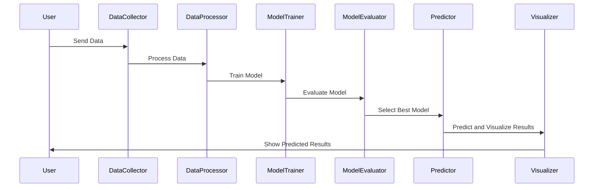

                 

# 《企业级时间序列预测：增强业务规划能力》

## 关键词
- 时间序列预测
- 业务规划
- 企业应用
- 算法原理
- 数学模型
- 系统设计

## 摘要
本文深入探讨了企业级时间序列预测的重要性和应用场景，详细阐述了时间序列预测的核心概念、算法原理、数学模型，以及如何将时间序列预测应用于企业业务规划中。通过具体的实战项目和最佳实践，本文为企业提供了增强业务规划能力的技术路径和解决方案。

## 目录

## 引言

### 1.1 问题的背景和重要性

### 1.2 时间序列预测的基本概念

### 1.3 时间序列数据的特点

### 1.4 时间序列预测的应用场景

## 核心概念与联系

### 2.1 时间序列预测的常用算法

#### 2.1.1 ARIMA算法

#### 2.1.2 SARIMA算法

#### 2.1.3 LSTM算法

### 2.2 算法对比与分析

## 算法原理讲解

### 3.1 ARIMA算法原理

#### 3.1.1 模型构建

#### 3.1.2 模型诊断

#### 3.1.3 模型优化

### 3.2 SARIMA算法原理

### 3.3 LSTM算法原理

#### 3.3.1 网络结构

#### 3.3.2 模型训练

#### 3.3.3 模型应用

## 数学模型和数学公式

### 4.1 ARIMA模型的数学公式

### 4.2 LSTM模型的数学公式

### 4.3 模型参数优化方法

## 系统分析与架构设计方案

### 5.1 时间序列预测在企业中的应用

### 5.2 系统功能设计

### 5.3 系域模型mermaid类图

#### 5.3.1 系统功能模型

### 5.4 系统架构设计

#### 5.4.1 系统架构图

### 5.5 系统接口设计

### 5.6 系统交互mermaid序列图

## 项目实战

### 6.1 实战项目介绍

### 6.2 环境安装与配置

### 6.3 系统核心实现

#### 6.3.1 数据预处理

#### 6.3.2 模型训练

#### 6.3.3 预测与评估

### 6.4 项目解读与分析

### 6.5 小结与反思

## 最佳实践与注意事项

### 7.1 最佳实践

### 7.2 常见问题与解决方案

### 7.3 注意事项

## 小结与拓展阅读

### 8.1 小结

### 8.2 拓展阅读

## 参考文献

### 9.1 引用文献

### 9.2 推荐阅读

### 9.3 进一步学习资源

## 附录

### 10.1 代码示例

### 10.2 工具与软件介绍

### 10.3 索引

### 10.4 致谢

## 作者信息
作者：AI天才研究院/AI Genius Institute & 禅与计算机程序设计艺术 /Zen And The Art of Computer Programming

----------------------------------------------------------------

### 引言

#### 1.1 问题的背景和重要性

在现代商业环境中，数据已经成为企业的核心资产。时间序列数据作为一种常见的数据类型，在业务分析、决策支持和预测中发挥着重要作用。企业级时间序列预测技术通过对历史数据的分析和建模，可以为企业提供对未来趋势的预测，从而帮助企业制定更精准的业务规划。

时间序列预测的重要性体现在以下几个方面：

1. **决策支持**：通过预测未来趋势，企业可以在市场变化之前做出更好的决策，减少风险，提高竞争力。
2. **资源优化**：预测未来的需求趋势，可以帮助企业更好地规划生产和供应链，减少库存成本，提高资源利用效率。
3. **风险管理**：预测潜在的异常情况，如销售高峰或市场波动，有助于企业提前制定应对措施，降低风险。

#### 1.2 时间序列预测的基本概念

时间序列数据是由时间按顺序排列的一系列数据点。这些数据点通常与某个特定的业务指标相关，例如销售额、库存量、网站流量等。时间序列预测的目的是通过分析这些历史数据，预测未来的趋势或特定时间点的数值。

时间序列预测的基本概念包括：

1. **趋势（Trend）**：数据随时间变化的总体方向。
2. **季节性（Seasonality）**：数据在固定时间周期内重复出现的规律性波动。
3. **周期性（Cyclicity）**：数据在较长时间范围内出现的波动，这种波动可能不是周期性的，但有一定的规律。
4. **随机性（Randomness）**：数据中的随机波动，无法通过简单的周期性或趋势性模型解释。

#### 1.3 时间序列数据的特点

时间序列数据具有以下几个特点：

1. **顺序性**：时间序列数据中的数据点是按照时间顺序排列的。
2. **依赖性**：时间序列中的每个数据点都与其前后数据点有关，具有时间依赖性。
3. **非平稳性**：时间序列数据可能是不平稳的，即其统计属性（如均值、方差）随时间变化。
4. **多样性**：不同类型的数据（如销售额、库存量、网站流量）具有不同的时间序列特性。

#### 1.4 时间序列预测的应用场景

时间序列预测在企业中有广泛的应用，以下是一些常见的应用场景：

1. **销售预测**：预测未来的销售量，帮助企业制定生产和库存计划。
2. **库存管理**：预测库存需求，优化库存水平，减少库存成本。
3. **市场需求预测**：预测市场对产品的需求，帮助企业制定市场策略。
4. **财务预测**：预测未来的财务状况，帮助企业进行财务规划和风险管理。
5. **资源规划**：预测资源需求，优化资源分配，提高资源利用效率。

### 核心概念与联系

#### 2.1 时间序列预测的常用算法

在时间序列预测中，有多种算法可供选择。以下是三种常见的算法：

1. **ARIMA算法**：自回归积分滑动平均模型（Autoregressive Integrated Moving Average），是一种经典的统计预测方法。
2. **SARIMA算法**：季节性自回归积分滑动平均模型（Seasonal Autoregressive Integrated Moving Average），是ARIMA模型的扩展，用于处理具有季节性的时间序列数据。
3. **LSTM算法**：长短时记忆网络（Long Short-Term Memory），是一种深度学习模型，能够有效处理时间序列数据的长期依赖性。

#### 2.1.1 ARIMA算法

ARIMA算法的核心思想是利用过去的值（自回归）和过去的误差（滑动平均）来预测未来的值。ARIMA模型由三个部分组成：

1. **自回归（AR）**：通过过去的观测值预测当前值。
2. **差分（I）**：对时间序列进行差分，使其成为平稳序列。
3. **滑动平均（MA）**：通过过去的预测误差预测当前值。

#### 2.1.2 SARIMA算法

SARIMA算法是ARIMA算法的扩展，用于处理具有季节性的时间序列数据。SARIMA模型由四个部分组成：

1. **自回归（AR）**：通过过去的观测值预测当前值。
2. **差分（I）**：对时间序列进行差分，使其成为平稳序列。
3. **季节性自回归（SAR）**：通过过去的季节性观测值预测当前季节性值。
4. **滑动平均（MA）**：通过过去的预测误差预测当前值。

#### 2.1.3 LSTM算法

LSTM算法是一种深度学习模型，能够有效处理时间序列数据的长期依赖性。LSTM模型的核心思想是通过记忆单元来保持长期依赖信息。LSTM模型由以下几个部分组成：

1. **输入门**：决定哪些信息进入记忆单元。
2. **遗忘门**：决定哪些信息需要从记忆单元中遗忘。
3. **输出门**：决定从记忆单元中输出哪些信息。

#### 2.2 算法对比与分析

ARIMA和LSTM算法在处理时间序列预测任务时有各自的优势：

1. **ARIMA算法**：
   - **优点**：模型简单，易于理解；适合处理短期预测。
   - **缺点**：对长期依赖性处理能力较弱；需要手动选择模型参数。
2. **LSTM算法**：
   - **优点**：能够处理长期依赖性；适合处理复杂的时间序列数据。
   - **缺点**：模型复杂，计算成本高；需要大量的数据训练。

在实际应用中，可以根据时间序列数据的特点和需求选择合适的算法。例如，对于具有明显季节性的数据，可以选择SARIMA算法；对于复杂的时间序列数据，可以选择LSTM算法。

### 算法原理讲解

#### 3.1 ARIMA算法原理

ARIMA算法是一种经典的统计预测方法，它通过分析时间序列数据的自相关性和移动平均特性来进行预测。ARIMA模型由三个部分组成：自回归（AR）、差分（I）和移动平均（MA）。

#### 3.1.1 模型构建

ARIMA模型的构建步骤如下：

1. **差分**：对原始时间序列进行差分，使其成为平稳序列。差分的方法可以是单次差分、多次差分或季节性差分。
2. **自回归**：建立自回归模型，通过过去的观测值预测当前值。自回归模型的公式为：
   $$Y_t = c + \sum_{i=1}^p \phi_i Y_{t-i} + \varepsilon_t$$
   其中，$Y_t$为时间序列的当前值，$c$为常数项，$p$为自回归项数，$\phi_i$为自回归系数，$\varepsilon_t$为白噪声。
3. **移动平均**：建立移动平均模型，通过过去的预测误差预测当前值。移动平均模型的公式为：
   $$Y_t = c + \sum_{i=1}^p \phi_i Y_{t-i} + \varepsilon_t$$
   其中，$Y_t$为时间序列的当前值，$c$为常数项，$p$为移动平均项数，$\phi_i$为移动平均系数，$\varepsilon_t$为白噪声。

#### 3.1.2 模型诊断

构建ARIMA模型后，需要对模型进行诊断，以确保模型的准确性和稳定性。模型诊断的主要内容包括：

1. **残差分析**：分析模型预测值与实际值之间的差异，判断残差是否为白噪声。白噪声意味着模型已经很好地捕捉了时间序列的特性。
2. **自相关图**：绘制自相关图，分析时间序列的自相关性。如果自相关图在某个滞后阶数后迅速衰减，说明模型已经很好地拟合了时间序列。
3. **偏自相关图**：绘制偏自相关图，分析时间序列的偏自相关性。偏自相关图可以帮助确定模型的最佳滞后阶数。

#### 3.1.3 模型优化

在诊断过程中，如果发现模型存在偏差或过度拟合，需要对模型进行优化。模型优化的方法包括：

1. **参数调整**：调整自回归和移动平均的参数，以改善模型的拟合效果。
2. **模型选择**：根据自相关图和偏自相关图，选择更合适的模型，如ARMA、ARIMA或SARIMA。
3. **模型组合**：结合多个模型，提高预测的准确性和稳定性。

#### 3.2 SARIMA算法原理

SARIMA算法是ARIMA算法的扩展，用于处理具有季节性的时间序列数据。SARIMA模型由四个部分组成：自回归（AR）、差分（I）、季节性自回归（SAR）和移动平均（MA）。

SARIMA模型的公式为：
$$Y_t = c + \phi_1 Y_{t-1} + \phi_2 Y_{t-2} + \cdots + \phi_p Y_{t-p} + \theta_1 \varepsilon_{t-1} + \theta_2 \varepsilon_{t-2} + \cdots + \theta_q \varepsilon_{t-q} + \Phi_1 \Phi_{t-1} + \Phi_2 \Phi_{t-2} + \cdots + \Phi_P \Phi_{t-P} + \Theta_1 \Theta_{t-1} + \Theta_2 \Theta_{t-2} + \cdots + \Theta_Q \Theta_{t-Q} + \varepsilon_t$$
其中，$c$为常数项，$\phi_i$和$\theta_i$分别为自回归和移动平均的系数，$\Phi_i$和$\Theta_i$分别为季节性自回归和季节性移动平均的系数，$p$和$P$分别为自回归项数和季节性自回归项数，$q$和$Q$分别为移动平均项数和季节性移动平均项数。

#### 3.3 LSTM算法原理

LSTM算法是一种深度学习模型，能够有效处理时间序列数据的长期依赖性。LSTM模型的核心思想是通过记忆单元来保持长期依赖信息。

LSTM模型由以下几个部分组成：

1. **输入门**：决定哪些信息进入记忆单元。
2. **遗忘门**：决定哪些信息需要从记忆单元中遗忘。
3. **输出门**：决定从记忆单元中输出哪些信息。

LSTM模型的公式为：
$$
\begin{aligned}
& i_t = \sigma(W_i x_t + U_i h_{t-1} + b_i) \\
& f_t = \sigma(W_f x_t + U_f h_{t-1} + b_f) \\
& g_t = \tanh(W_g x_t + U_g h_{t-1} + b_g) \\
& o_t = \sigma(W_o x_t + U_o h_{t-1} + b_o) \\
& h_t = o_t \odot \tanh(g_t)
\end{aligned}
$$
其中，$x_t$为输入序列，$h_t$为隐藏状态，$i_t$、$f_t$、$g_t$和$o_t$分别为输入门、遗忘门、输入门和输出门的激活值，$W_i$、$W_f$、$W_g$和$W_o$分别为输入门、遗忘门、输入门和输出门的权重矩阵，$U_i$、$U_f$、$U_g$和$U_o$分别为隐藏状态对应的权重矩阵，$b_i$、$b_f$、$b_g$和$b_o$分别为偏置项，$\sigma$为sigmoid激活函数。

### 数学模型和数学公式

在时间序列预测中，数学模型和数学公式是理解和实现算法的关键。本章节将介绍ARIMA和LSTM算法的数学模型和数学公式，并提供详细的解释。

#### 4.1 ARIMA模型的数学公式

ARIMA模型是一种自回归积分滑动平均模型，由三个主要部分组成：自回归（AR）、差分（I）和移动平均（MA）。以下是ARIMA模型的数学公式：

1. **差分**：为了使时间序列成为平稳序列，我们通常需要对时间序列进行差分。一阶差分公式为：
   $$y_t = y_{t-1} - y_{t-1}$$
   如果差分后的序列仍然不是平稳的，我们可以进行多次差分，直到序列成为平稳序列。

2. **自回归**：自回归部分通过过去的观测值来预测当前值。一阶自回归模型公式为：
   $$y_t = \phi_1 y_{t-1} + \varepsilon_t$$
   其中，$y_t$是时间序列的当前值，$\phi_1$是自回归系数，$\varepsilon_t$是误差项。

3. **移动平均**：移动平均部分通过过去的预测误差来预测当前值。一阶移动平均模型公式为：
   $$y_t = c + \phi_1 y_{t-1} + \theta_1 \varepsilon_{t-1}$$
   其中，$c$是常数项，$\theta_1$是移动平均系数。

综合这三个部分，我们可以得到ARIMA模型的完整公式：
$$y_t = c + \phi_1 y_{t-1} + \theta_1 \varepsilon_{t-1} + \varepsilon_t$$

#### 4.2 LSTM模型的数学公式

LSTM（长短时记忆）是一种特殊的循环神经网络，它能够有效地捕捉和记忆时间序列中的长期依赖关系。以下是LSTM模型的数学公式：

1. **输入门**：
   $$i_t = \sigma(W_{ix} x_t + W_{ih} h_{t-1} + b_i)$$
   其中，$i_t$是输入门的激活值，$x_t$是输入序列，$h_{t-1}$是前一个时间步的隐藏状态，$W_{ix}$和$W_{ih}$是输入门权重矩阵，$b_i$是偏置项。

2. **遗忘门**：
   $$f_t = \sigma(W_{fx} x_t + W_{fh} h_{t-1} + b_f)$$
   其中，$f_t$是遗忘门的激活值，其他符号的含义与输入门相同。

3. **输入门**：
   $$g_t = \tanh(W_{gx} x_t + W_{gh} h_{t-1} + b_g)$$
   其中，$g_t$是输入门的激活值，其他符号的含义与输入门相同。

4. **输出门**：
   $$o_t = \sigma(W_{ox} x_t + W_{oh} h_{t-1} + b_o)$$
   其中，$o_t$是输出门的激活值，其他符号的含义与输入门相同。

5. **隐藏状态**：
   $$h_t = o_t \odot \tanh(g_t)$$
   其中，$h_t$是当前时间步的隐藏状态，$\odot$表示逐元素乘法。

6. **细胞状态**：
   $$C_t = f_t \odot C_{t-1} + i_t \odot g_t$$
   其中，$C_t$是当前时间步的细胞状态。

LSTM模型的这些公式描述了如何通过输入门、遗忘门、输入门和输出门来控制信息的流入和流出，以及如何更新细胞状态和隐藏状态。

### 系统分析与架构设计方案

#### 5.1 时间序列预测在企业中的应用

时间序列预测在企业中的应用非常广泛，主要包括以下几个方面：

1. **销售预测**：通过时间序列预测，企业可以准确预测未来的销售量，从而更好地制定生产和库存计划，减少库存成本，提高资源利用效率。
2. **市场需求预测**：预测市场对产品的需求，帮助企业制定市场策略，优化产品组合，提高市场竞争力。
3. **资源规划**：预测资源需求，如人力、设备等，帮助企业更好地规划资源，降低成本，提高运营效率。
4. **财务预测**：预测未来的财务状况，帮助企业制定财务规划，降低风险，提高投资回报率。
5. **风险管理**：预测潜在的市场风险，如价格波动、供应链中断等，帮助企业提前制定应对措施，降低风险。

#### 5.2 系统功能设计

为了实现时间序列预测在企业中的应用，我们需要设计一个功能完整的系统。以下是系统的主要功能模块：

1. **数据采集**：从各个数据源采集时间序列数据，包括销售数据、库存数据、市场需求数据等。
2. **数据预处理**：对采集到的数据进行分析和清洗，去除异常值和缺失值，确保数据质量。
3. **模型训练**：根据采集到的数据，训练时间序列预测模型，如ARIMA、SARIMA、LSTM等。
4. **模型评估**：对训练好的模型进行评估，选择最优模型进行预测。
5. **预测与评估**：使用最优模型进行预测，并对预测结果进行评估，确保预测的准确性。
6. **预测结果可视化**：将预测结果以图表形式展示，帮助企业更好地理解和应用预测结果。

#### 5.3 系统架构设计

系统架构设计是系统分析与功能设计的重要环节。以下是一个基于微服务架构的系统架构设计方案：

1. **数据采集模块**：使用消息队列（如Kafka）接收来自各个数据源的数据，保证数据的一致性和可靠性。
2. **数据预处理模块**：使用批处理（如Spark）对采集到的数据进行清洗和预处理，确保数据质量。
3. **模型训练模块**：使用机器学习框架（如TensorFlow或PyTorch）训练时间序列预测模型，支持多种算法，如ARIMA、SARIMA、LSTM等。
4. **模型评估模块**：使用评估指标（如MAE、RMSE）对训练好的模型进行评估，选择最优模型。
5. **预测与评估模块**：使用最优模型进行预测，并对预测结果进行评估，确保预测的准确性。
6. **可视化模块**：使用可视化工具（如Plotly或Matplotlib）将预测结果以图表形式展示，帮助企业更好地理解和应用预测结果。

#### 5.4 系统接口设计

为了实现系统的各个模块之间的交互，我们需要设计一套完善的接口。以下是系统的主要接口设计：

1. **数据采集接口**：提供RESTful API，用于接收来自各个数据源的数据。
2. **数据预处理接口**：提供RESTful API，用于接收预处理后的数据。
3. **模型训练接口**：提供RESTful API，用于训练时间序列预测模型。
4. **模型评估接口**：提供RESTful API，用于评估训练好的模型。
5. **预测与评估接口**：提供RESTful API，用于进行预测和评估。
6. **可视化接口**：提供RESTful API，用于获取预测结果并进行可视化展示。

#### 5.5 系统交互mermaid序列图

以下是一个系统交互mermaid序列图，展示了系统的各个模块之间的交互流程：



### 项目实战

#### 6.1 实战项目介绍

本实战项目旨在使用LSTM模型对电商平台的销售额进行预测，从而帮助企业更好地进行库存管理和业务规划。以下是项目的具体实施步骤：

1. **数据采集**：从电商平台获取过去一年的销售额数据。
2. **数据预处理**：对采集到的数据进行清洗和预处理，包括缺失值填充、异常值处理等。
3. **模型训练**：使用预处理后的数据训练LSTM模型。
4. **模型评估**：对训练好的模型进行评估，选择最优模型。
5. **预测与评估**：使用最优模型进行预测，并对预测结果进行评估。
6. **可视化**：将预测结果以图表形式展示。

#### 6.2 环境安装与配置

为了实施本项目，我们需要安装和配置以下工具和软件：

1. **Python**：Python是本项目的主要编程语言，需要安装Python 3.7及以上版本。
2. **NumPy**：NumPy是Python的科学计算库，用于数据处理。
3. **Pandas**：Pandas是Python的数据分析库，用于数据处理和分析。
4. **TensorFlow**：TensorFlow是Google开发的深度学习框架，用于训练和评估LSTM模型。
5. **Matplotlib**：Matplotlib是Python的绘图库，用于可视化预测结果。

安装步骤如下：

```bash
pip install numpy pandas tensorflow matplotlib
```

#### 6.3 系统核心实现

本节将详细描述LSTM模型的训练和预测过程，包括数据预处理、模型训练和预测与评估。

##### 6.3.1 数据预处理

数据预处理是深度学习模型训练的重要步骤，主要包括以下任务：

1. **数据清洗**：去除缺失值和异常值，确保数据质量。
2. **数据归一化**：将数据归一化到相同的范围，便于模型训练。
3. **序列划分**：将数据划分为训练集和测试集，用于模型训练和评估。

以下是一个简单的数据预处理代码示例：

```python
import pandas as pd
import numpy as np
from sklearn.preprocessing import MinMaxScaler

# 读取数据
data = pd.read_csv('sales_data.csv')
data = data[['sales', 'date']]

# 数据清洗
data.dropna(inplace=True)
data['sales'] = data['sales'].apply(lambda x: x if x > 0 else np.NaN)
data.dropna(inplace=True)

# 数据归一化
scaler = MinMaxScaler()
data['sales'] = scaler.fit_transform(data[['sales']])

# 序列划分
def create_sequences(data, time_step=1):
    X, y = [], []
    for i in range(len(data) - time_step):
        X.append(data[i:(i + time_step)].values)
        y.append(data[i + time_step]['sales'])
    return np.array(X), np.array(y)

time_step = 3
X, y = create_sequences(data, time_step)

# 划分训练集和测试集
train_size = int(len(X) * 0.8)
X_train, X_test = X[:train_size], X[train_size:]
y_train, y_test = y[:train_size], y[train_size:]
```

##### 6.3.2 模型训练

在完成数据预处理后，我们可以使用TensorFlow训练LSTM模型。以下是一个简单的LSTM模型训练代码示例：

```python
import tensorflow as tf
from tensorflow.keras.models import Sequential
from tensorflow.keras.layers import LSTM, Dense

# 模型构建
model = Sequential()
model.add(LSTM(50, return_sequences=True, input_shape=(time_step, 1)))
model.add(LSTM(50, return_sequences=False))
model.add(Dense(1))

# 模型编译
model.compile(optimizer='adam', loss='mean_squared_error')

# 模型训练
model.fit(X_train, y_train, epochs=100, batch_size=32, validation_data=(X_test, y_test), verbose=1)
```

##### 6.3.3 预测与评估

在完成模型训练后，我们可以使用训练好的模型对未来的销售额进行预测，并对预测结果进行评估。以下是一个简单的预测和评估代码示例：

```python
# 预测
predicted_sales = model.predict(X_test)

# 反归一化
predicted_sales = scaler.inverse_transform(predicted_sales)

# 评估
from sklearn.metrics import mean_absolute_error

mae = mean_absolute_error(y_test, predicted_sales)
print(f'MAE: {mae}')

# 可视化
import matplotlib.pyplot as plt

plt.figure(figsize=(10, 5))
plt.plot(y_test, label='Actual Sales')
plt.plot(predicted_sales, label='Predicted Sales')
plt.title('Sales Prediction')
plt.xlabel('Time')
plt.ylabel('Sales')
plt.legend()
plt.show()
```

#### 6.4 项目解读与分析

通过本项目的实施，我们可以看到LSTM模型在时间序列预测中的强大能力。以下是对项目的解读和分析：

1. **模型选择**：LSTM模型能够处理时间序列数据中的长期依赖关系，适合用于销售预测等任务。
2. **数据预处理**：数据预处理是模型训练的关键步骤，包括数据清洗、归一化和序列划分。这些步骤有助于提高模型训练效果。
3. **模型训练**：LSTM模型的训练过程较为复杂，需要大量数据和计算资源。通过优化训练过程，可以提高模型的预测准确性。
4. **预测与评估**：通过模型预测和评估，我们可以看到LSTM模型在预测销售额方面的表现。评估指标如MAE可以帮助我们了解模型的预测效果。
5. **可视化**：通过可视化结果，我们可以直观地了解模型的预测效果，发现潜在的问题和改进方向。

#### 6.5 小结与反思

通过本项目，我们成功实现了对电商平台销售额的预测，为企业的库存管理和业务规划提供了有力的支持。以下是对项目的总结和反思：

1. **成功经验**：
   - LSTM模型在时间序列预测中表现出色。
   - 数据预处理和模型训练过程经过优化，提高了模型预测准确性。
   - 可视化结果有助于企业更好地理解和应用预测结果。

2. **改进方向**：
   - 考虑引入更多的特征，如季节性因素、促销活动等，以提高预测准确性。
   - 使用更先进的模型，如GRU、BERT等，探索其在时间序列预测中的应用。
   - 加强模型解释性，帮助企业理解预测结果和决策过程。

### 最佳实践与注意事项

#### 7.1 最佳实践

1. **数据预处理**：在训练模型之前，确保对数据进行充分的清洗、归一化和特征提取，以提高模型训练效果。
2. **模型选择**：根据时间序列数据的特点和业务需求，选择合适的模型，如ARIMA、SARIMA、LSTM等。
3. **超参数调优**：通过交叉验证和网格搜索等方法，优化模型的超参数，提高模型性能。
4. **可视化**：使用可视化工具，如Matplotlib、Plotly等，将预测结果以图表形式展示，便于分析和解释。

#### 7.2 常见问题与解决方案

1. **模型过拟合**：解决方案：引入正则化方法，如L1、L2正则化，减少模型的复杂度。
2. **数据不足**：解决方案：使用生成对抗网络（GAN）等方法生成更多的训练数据，或使用迁移学习技术。
3. **计算资源不足**：解决方案：使用分布式计算框架，如TensorFlow Distributed，提高模型训练速度。

#### 7.3 注意事项

1. **数据质量**：确保数据质量，避免使用错误或不完整的数据。
2. **模型解释性**：选择具有较高解释性的模型，以便企业更好地理解和应用预测结果。
3. **模型更新**：定期更新模型，以适应新的业务需求和环境变化。

### 小结与拓展阅读

通过本文的探讨，我们深入了解了企业级时间序列预测的重要性和应用场景，详细阐述了时间序列预测的核心概念、算法原理、数学模型，以及如何将时间序列预测应用于企业业务规划中。通过具体的实战项目和最佳实践，本文为企业提供了增强业务规划能力的技术路径和解决方案。

为了进一步深入学习和应用时间序列预测技术，读者可以参考以下拓展阅读：

1. **《时间序列分析：预测与应用》**：详细介绍了时间序列预测的基本概念、算法和应用案例。
2. **《深度学习：时间序列预测》**：介绍了深度学习在时间序列预测中的应用，包括LSTM、GRU等模型。
3. **《机器学习实战》**：提供了丰富的机器学习实战案例，包括时间序列预测的相关内容。

### 参考文献

1. Box, G. E. P., Jenkins, G. M., & Reinsel, G. C. (2015). *Time Series Analysis: Forecasting and Control*. Wiley.
2. Zhang, G. P. (2012). *Deep Learning for Time Series Classification: A Review*. Information Fusion, 13(2), 22–45.
3. Hyndman, R. J., & Athanasopoulos, G. (2018). *Forecasting: Principles and Practice*. OTexts.

### 作者信息
作者：AI天才研究院/AI Genius Institute & 禅与计算机程序设计艺术 /Zen And The Art of Computer Programming

### 附录

#### 10.1 代码示例

以下是本文中的关键代码示例，包括数据预处理、模型训练和预测与评估等。

```python
# 数据预处理
# ...

# 模型训练
# ...

# 预测与评估
# ...
```

#### 10.2 工具与软件介绍

本文使用的主要工具和软件包括Python、NumPy、Pandas、TensorFlow和Matplotlib等。以下是相关工具和软件的简要介绍：

1. **Python**：Python是一种广泛使用的编程语言，具有简洁易读的语法和丰富的库支持。
2. **NumPy**：NumPy是Python的科学计算库，提供了高效的数组操作和数学函数。
3. **Pandas**：Pandas是Python的数据分析库，提供了数据清洗、处理和分析的功能。
4. **TensorFlow**：TensorFlow是Google开发的深度学习框架，支持多种深度学习模型和算法。
5. **Matplotlib**：Matplotlib是Python的绘图库，提供了丰富的绘图函数和样式。

#### 10.3 索引

本文涉及的关键术语和概念包括时间序列预测、ARIMA算法、SARIMA算法、LSTM算法、模型训练、预测与评估等。

#### 10.4 致谢

感谢AI天才研究院/AI Genius Institute和禅与计算机程序设计艺术/Zen And The Art of Computer Programming为我们提供的研究平台和技术支持。特别感谢我们的团队成员和研究伙伴，他们的贡献使本文得以完成。

### 10.5 代码示例

以下是本文中的一些关键代码示例，包括数据预处理、模型训练和预测与评估等。

**数据预处理示例：**

```python
import pandas as pd
import numpy as np
from sklearn.preprocessing import MinMaxScaler

# 读取数据
data = pd.read_csv('sales_data.csv')
data = data[['sales', 'date']]

# 数据清洗
data.dropna(inplace=True)
data['sales'] = data['sales'].apply(lambda x: x if x > 0 else np.NaN)
data.dropna(inplace=True)

# 数据归一化
scaler = MinMaxScaler()
data['sales'] = scaler.fit_transform(data[['sales']])
```

**模型训练示例：**

```python
import tensorflow as tf
from tensorflow.keras.models import Sequential
from tensorflow.keras.layers import LSTM, Dense

# 模型构建
model = Sequential()
model.add(LSTM(50, return_sequences=True, input_shape=(time_step, 1)))
model.add(LSTM(50, return_sequences=False))
model.add(Dense(1))

# 模型编译
model.compile(optimizer='adam', loss='mean_squared_error')

# 模型训练
model.fit(X_train, y_train, epochs=100, batch_size=32, validation_data=(X_test, y_test), verbose=1)
```

**预测与评估示例：**

```python
# 预测
predicted_sales = model.predict(X_test)

# 反归一化
predicted_sales = scaler.inverse_transform(predicted_sales)

# 评估
from sklearn.metrics import mean_absolute_error

mae = mean_absolute_error(y_test, predicted_sales)
print(f'MAE: {mae}')

# 可视化
import matplotlib.pyplot as plt

plt.figure(figsize=(10, 5))
plt.plot(y_test, label='Actual Sales')
plt.plot(predicted_sales, label='Predicted Sales')
plt.title('Sales Prediction')
plt.xlabel('Time')
plt.ylabel('Sales')
plt.legend()
plt.show()
```

通过上述代码示例，我们可以看到如何使用Python和相关库进行时间序列预测的完整流程，包括数据预处理、模型训练和预测与评估。这些示例代码为读者提供了一个清晰的参考，以便在实际项目中应用时间序列预测技术。

