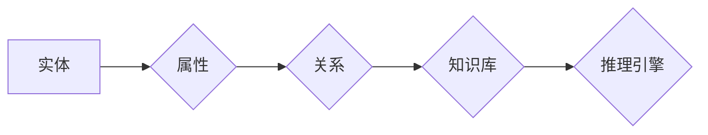
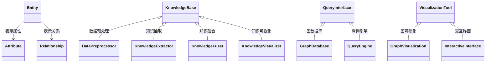
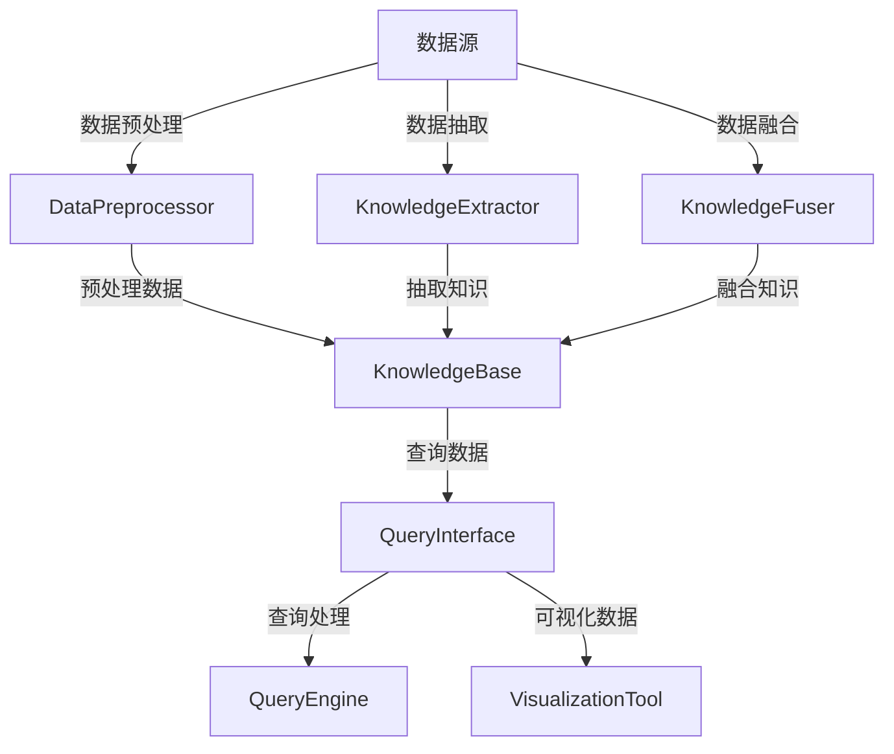
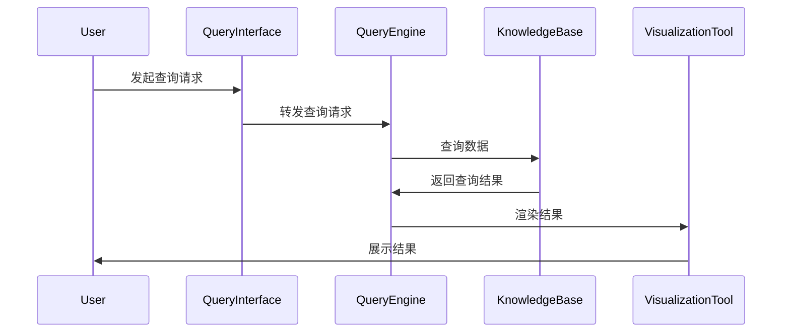

                 

### 《企业级知识图谱构建：打造组织智慧资产》

---

#### 关键词：知识图谱、企业应用、智慧资产、数据管理、人工智能

#### 摘要：

在数字化转型浪潮中，企业级知识图谱正逐渐成为提升组织智慧、优化业务流程的关键技术。本文将深入探讨知识图谱的基本概念、构建方法、案例分析及未来发展，帮助读者理解如何利用知识图谱构建企业智慧资产，从而实现数据驱动和创新引领。

---

## 第一部分：知识图谱与企业级应用

### 第1章：知识图谱概述

#### 1.1 知识图谱的定义与价值

知识图谱是一种结构化数据模型，它通过实体、属性和关系的表达方式，将复杂的信息网络化、结构化。知识图谱的核心价值在于其能够实现数据的智能化连接，为企业的决策提供强有力的数据支撑。

- **定义**：知识图谱是一种由实体、属性和关系构成的知识网络，能够通过语义关联实现对复杂信息的表达和理解。

- **价值**：
  - **知识管理**：通过知识图谱，企业能够将分散的知识点整合为一个统一的视图，便于知识的查找、共享和应用。
  - **智能搜索与推荐**：知识图谱能够增强搜索系统的语义理解能力，提供更精准的搜索结果和个性化推荐。
  - **客户关系管理**：知识图谱可以帮助企业更好地理解客户需求，优化客户服务体验。
  - **业务流程优化**：知识图谱能够揭示业务流程中的关键节点和瓶颈，帮助企业进行流程优化。

#### 1.1.1 知识图谱的定义

知识图谱是一种结构化数据模型，通过实体、属性和关系的表达方式，将复杂的信息网络化、结构化。知识图谱的核心价值在于其能够实现数据的智能化连接，为企业的决策提供强有力的数据支撑。

- **实体**：知识图谱中的基本元素，代表现实世界中的个体或概念。
- **属性**：描述实体特征的属性值。
- **关系**：实体之间的关联，通常用边来表示。

#### 1.1.2 知识图谱的核心价值

知识图谱的核心价值体现在以下几个方面：

1. **知识整合**：知识图谱能够将来自不同源的数据整合到一个统一的框架中，实现跨领域的知识共享。
2. **智能推理**：知识图谱支持基于知识的推理，能够从已知事实推导出新的结论，提高决策的智能化水平。
3. **语义搜索**：知识图谱增强了搜索系统的语义理解能力，能够提供更加精准的搜索结果。

#### 1.1.3 知识图谱的组成要素

知识图谱的构建涉及多个组成要素，主要包括：

1. **实体**：知识图谱中的基本元素，代表现实世界中的个体或概念。
2. **属性**：描述实体特征的属性值。
3. **关系**：实体之间的关联，通常用边来表示。
4. **知识库**：存储知识图谱数据的数据库。
5. **推理引擎**：用于基于知识图谱进行推理和智能分析的组件。

### 1.2 知识图谱在企业中的应用场景

知识图谱在企业中有着广泛的应用场景，以下是其中几个典型的应用：

#### 1.2.1 企业知识管理

企业知识管理是知识图谱最常见的应用场景之一。通过知识图谱，企业可以将内部的知识点整合起来，形成结构化的知识库，便于员工的知识查找、共享和应用。

- **知识整合**：将企业的文档、报告、邮件等非结构化数据转化为结构化的知识库。
- **知识推荐**：基于员工的兴趣和工作职责，推荐相关的知识内容。

#### 1.2.2 智能搜索与推荐

知识图谱能够显著提升企业内部搜索系统的语义理解能力，提供更精准的搜索结果。同时，知识图谱还可以用于推荐系统，根据用户的行为和兴趣，推荐相关的知识内容或产品。

- **精准搜索**：利用知识图谱的语义关联，提供更准确的搜索结果。
- **个性化推荐**：根据用户的兴趣和行为，推荐相关的知识内容或产品。

#### 1.2.3 客户关系管理

知识图谱可以帮助企业更好地理解客户需求，优化客户服务体验。通过知识图谱，企业可以整合客户的历史数据、交易记录、反馈信息等，形成全面、动态的客户画像。

- **客户画像**：整合客户数据，形成全面、动态的客户画像。
- **个性化服务**：基于客户画像，提供个性化的产品推荐和服务。

#### 1.2.4 业务流程优化

知识图谱能够揭示业务流程中的关键节点和瓶颈，帮助企业进行流程优化。通过知识图谱的智能分析和推理，企业可以找到优化业务流程的最佳策略。

- **流程分析**：通过知识图谱揭示业务流程中的关键节点和瓶颈。
- **流程优化**：基于分析结果，优化业务流程，提高效率。

### 第2章：企业级知识图谱构建方法

#### 2.1 数据收集与处理

构建企业级知识图谱的第一步是数据收集与处理。数据源的选择、数据预处理和数据质量评估是构建高质量知识图谱的关键步骤。

##### 2.1.1 数据源的选择

数据源的选择直接影响知识图谱的质量。企业需要根据业务需求，选择合适的数据源，如企业内部的数据库、外部API、第三方数据服务等。

- **内部数据库**：企业内部的数据仓库、ERP系统等。
- **外部API**：第三方数据服务，如社交媒体API、天气API等。
- **第三方数据服务**：专业数据提供商，如市场调研数据、公共数据集等。

##### 2.1.2 数据预处理

数据预处理是数据收集后的重要步骤，主要包括数据清洗、数据转换和数据集成。通过数据预处理，可以提高数据的准确性和一致性，为后续的知识抽取和融合提供可靠的数据基础。

- **数据清洗**：去除重复数据、缺失数据和错误数据。
- **数据转换**：将不同数据源的数据格式转换为统一格式。
- **数据集成**：将来自不同数据源的数据整合到一个统一的视图。

##### 2.1.3 数据质量评估

数据质量评估是确保数据质量的重要环节。通过数据质量评估，可以识别和解决数据中的问题，提高数据的准确性和一致性。

- **数据准确性评估**：检查数据中的错误和异常值。
- **数据一致性评估**：检查不同数据源之间的数据一致性。

#### 2.2 知识抽取与融合

知识抽取与融合是构建知识图谱的核心步骤。知识抽取是从原始数据中提取结构化知识的过程，而知识融合则是将来自不同源的知识整合为一个统一的知识库。

##### 2.2.1 实体识别

实体识别是知识抽取的第一步，目的是从原始数据中识别出重要的实体。实体识别可以基于自然语言处理技术，如命名实体识别（NER）。

- **命名实体识别（NER）**：使用自然语言处理技术，识别文本中的命名实体。

##### 2.2.2 关系抽取

关系抽取是识别实体之间的关联关系。关系抽取可以基于实体之间的语义关联，如实体间的共现关系、因果关系等。

- **共现关系**：通过统计实体在文本中共同出现的频率，识别实体之间的共现关系。
- **因果关系**：通过分析实体之间的逻辑关系，识别实体之间的因果关系。

##### 2.2.3 知识融合与清洗

知识融合是将来自不同源的知识整合为一个统一的知识库。知识融合需要解决数据源之间的冲突和矛盾，确保知识的一致性和准确性。

- **冲突解决**：识别和解决知识库中的冲突，如实体名称的冲突、关系定义的冲突等。
- **数据清洗**：去除知识库中的错误数据和冗余数据。

#### 2.3 知识存储与索引

知识存储与索引是构建知识图谱的最终步骤，目的是确保知识库的高效查询和管理。知识存储通常采用图数据库，而知识索引则是通过建立索引结构，提高查询效率。

##### 2.3.1 图数据库的选择

图数据库是一种专门用于存储和查询图结构数据的数据库。选择合适的图数据库对于构建高效的知识图谱至关重要。

- **Neo4j**：一款流行的开源图数据库，支持复杂的图结构查询。
- **OrientDB**：一款支持多种数据模型的图数据库，具有高性能和高扩展性。
- **ArangoDB**：一款多模型数据库，支持图、文档和键值数据模型。

##### 2.3.2 索引构建

索引构建是提高知识图谱查询效率的重要手段。通过建立索引，可以显著减少查询的时间复杂度。

- **B+树索引**：常用于关系型数据库，适用于范围查询和排序查询。
- **哈希索引**：适用于等值查询，查询速度快但维护成本高。

##### 2.3.3 数据库优化策略

为了提高知识图谱的性能，需要对数据库进行优化。数据库优化策略包括索引优化、查询优化和数据缓存等。

- **索引优化**：通过优化索引结构，提高查询效率。
- **查询优化**：通过优化查询语句，减少查询的时间复杂度。
- **数据缓存**：通过缓存热点数据，减少数据库的访问压力。

### 第3章：知识图谱可视化与交互

#### 3.1 可视化工具与库

知识图谱的可视化能够帮助用户更直观地理解和分析知识图谱的结构。目前，有多种可视化工具和库可供选择。

##### 3.1.1 常见可视化工具

- **D3.js**：一款基于Web的图形渲染库，能够实现复杂的数据可视化。
- **Gephi**：一款开源的图可视化工具，适用于大规模图数据的可视化。
- **Visual Network**：一款在线的图可视化工具，支持多种图形渲染方式。

##### 3.1.2 可视化库选择

在选择可视化库时，需要考虑可视化库的易用性、性能和扩展性等因素。

- **D3.js**：具有强大的图形渲染能力，但学习曲线较陡峭。
- **Gephi**：功能全面，但性能相对较低。
- **Visual Network**：易用性强，适合快速可视化。

##### 3.1.3 可视化设计原则

可视化设计需要遵循一些基本原则，以提高可视化的可读性和易用性。

- **一致性**：保持视觉元素的一致性，如颜色、字体和布局等。
- **简洁性**：避免过多的装饰性元素，保持界面简洁。
- **交互性**：提供用户交互功能，如缩放、筛选和搜索等。

#### 3.2 知识图谱交互设计

知识图谱的交互设计对于用户理解和使用知识图谱至关重要。交互设计需要考虑用户需求、界面设计和操作流程等因素。

##### 3.2.1 交互设计原则

交互设计需要遵循一些基本原则，以提高用户的体验。

- **直观性**：界面设计应该直观易懂，用户能够快速上手。
- **一致性**：保持交互元素的一致性，如按钮样式、颜色和操作逻辑等。
- **便捷性**：提供便捷的操作方式，减少用户的操作步骤。

##### 3.2.2 交互方式选择

交互方式的选择取决于用户需求和知识图谱的特点。常见的交互方式包括：

- **点击交互**：通过点击操作，选择或查看特定的知识节点。
- **拖拽交互**：通过拖拽操作，调整知识图谱的结构或节点位置。
- **搜索交互**：通过搜索功能，快速查找特定的知识节点。

##### 3.2.3 用户体验优化

用户体验优化是交互设计的重要目标。通过以下方法，可以提高用户体验：

- **个性化推荐**：根据用户的行为和兴趣，推荐相关的知识内容。
- **实时反馈**：在用户操作时，提供实时反馈，增强用户的操作信心。
- **教程和帮助**：提供教程和帮助文档，帮助用户快速掌握知识图谱的使用方法。

### 第4章：案例一：企业内部知识图谱构建

#### 4.1 案例背景与目标

某大型企业在数字化转型过程中，希望通过构建企业内部知识图谱，实现以下目标：

- **知识整合**：将企业内部的各类知识整合到一个统一的知识库中。
- **智能搜索**：提供基于语义的智能搜索功能，提高员工查找知识的效率。
- **知识共享**：促进企业内部知识的共享和交流，提高整体知识水平。

#### 4.2 数据源选择与处理

在构建知识图谱之前，企业需要选择合适的数据源并进行预处理。

- **内部数据源**：企业内部的数据仓库、ERP系统、知识库等。
- **外部数据源**：公共数据集、第三方API等。

数据预处理主要包括数据清洗、数据转换和数据集成。

- **数据清洗**：去除重复数据、缺失数据和错误数据。
- **数据转换**：将不同数据源的数据格式转换为统一格式。
- **数据集成**：将来自不同数据源的数据整合到一个统一的知识库中。

#### 4.3 知识抽取与融合

知识抽取与融合是构建知识图谱的核心步骤。

- **实体识别**：使用命名实体识别（NER）技术，识别文本中的命名实体。
- **关系抽取**：通过分析实体之间的语义关系，识别实体之间的关联关系。
- **知识融合**：将来自不同源的知识整合为一个统一的知识库，解决数据源之间的冲突和矛盾。

#### 4.4 知识存储与索引

知识存储与索引是确保知识图谱高效查询和管理的重要环节。

- **知识存储**：选择合适的图数据库，如Neo4j，存储知识图谱数据。
- **索引构建**：通过建立索引结构，提高知识图谱的查询效率。

#### 4.5 知识图谱可视化与交互

知识图谱的可视化与交互设计对于用户理解和使用知识图谱至关重要。

- **可视化设计**：使用D3.js等可视化库，实现知识图谱的可视化展示。
- **交互设计**：提供点击交互、拖拽交互和搜索交互等功能，增强用户的互动体验。

#### 4.6 案例总结与反思

通过构建企业内部知识图谱，企业实现了以下成果：

- **知识整合**：将企业内部的各类知识整合到一个统一的知识库中，提高了知识的可查找性和可访问性。
- **智能搜索**：提供基于语义的智能搜索功能，提高了员工查找知识的效率。
- **知识共享**：促进企业内部知识的共享和交流，提高了整体知识水平。

同时，案例也暴露了一些问题和挑战：

- **数据源质量**：数据源的准确性和一致性对知识图谱的质量有重要影响，需要加强对数据源的管理和维护。
- **知识抽取**：知识抽取的准确性和效率是构建知识图谱的关键，需要优化算法和流程。
- **用户参与**：用户对知识图谱的参与和反馈是知识图谱持续发展的关键，需要加强用户培训和反馈机制。

### 第5章：案例二：电子商务领域知识图谱构建

#### 5.1 案例背景与目标

某电子商务平台希望通过构建知识图谱，实现以下目标：

- **产品推荐**：根据用户的行为和兴趣，提供个性化的产品推荐。
- **客户服务**：通过知识图谱，提供更加精准和高效的客户服务。
- **业务优化**：分析用户行为和交易数据，优化业务流程和产品策略。

#### 5.2 数据源选择与处理

电子商务领域的数据源主要包括用户行为数据、交易数据、产品数据等。

- **用户行为数据**：包括用户浏览、搜索、购买等行为数据。
- **交易数据**：包括用户交易记录、评价等数据。
- **产品数据**：包括产品描述、属性、分类等数据。

数据预处理主要包括数据清洗、数据转换和数据集成。

- **数据清洗**：去除重复数据、缺失数据和错误数据。
- **数据转换**：将不同数据源的数据格式转换为统一格式。
- **数据集成**：将来自不同数据源的数据整合到一个统一的知识库中。

#### 5.3 知识抽取与融合

知识抽取与融合是构建知识图谱的核心步骤。

- **实体识别**：使用命名实体识别（NER）技术，识别文本中的命名实体，如用户、产品等。
- **关系抽取**：通过分析实体之间的语义关系，识别实体之间的关联关系，如用户购买产品、产品属于某个类别等。
- **知识融合**：将来自不同源的知识整合为一个统一的知识库，解决数据源之间的冲突和矛盾。

#### 5.4 知识存储与索引

知识存储与索引是确保知识图谱高效查询和管理的重要环节。

- **知识存储**：选择合适的图数据库，如Neo4j，存储知识图谱数据。
- **索引构建**：通过建立索引结构，提高知识图谱的查询效率。

#### 5.5 知识图谱可视化与交互

知识图谱的可视化与交互设计对于用户理解和使用知识图谱至关重要。

- **可视化设计**：使用D3.js等可视化库，实现知识图谱的可视化展示。
- **交互设计**：提供点击交互、拖拽交互和搜索交互等功能，增强用户的互动体验。

#### 5.6 案例总结与反思

通过构建电子商务领域知识图谱，电子商务平台实现了以下成果：

- **产品推荐**：基于用户行为和兴趣，提供个性化的产品推荐，提高了用户的购物体验。
- **客户服务**：通过知识图谱，提供更加精准和高效的客户服务，提高了客户满意度。
- **业务优化**：分析用户行为和交易数据，优化业务流程和产品策略，提高了运营效率。

同时，案例也暴露了一些问题和挑战：

- **数据隐私**：在构建知识图谱时，需要保护用户的隐私数据，避免隐私泄露。
- **数据质量**：数据源的准确性和一致性对知识图谱的质量有重要影响，需要加强对数据源的管理和维护。
- **算法优化**：知识图谱的算法和模型需要不断优化，以应对不断变化的数据和应用场景。

### 第6章：知识图谱技术发展现状与趋势

#### 6.1 知识图谱技术的演进

知识图谱技术的发展经历了多个阶段，从早期的基于规则的知识表示到现在的基于大数据和人工智能的知识图谱。

- **早期知识图谱**：基于规则的专家系统，知识表示主要依赖于手工编写规则。
- **当前知识图谱**：基于大数据和人工智能技术，知识表示更加自动化和智能化。
- **未来知识图谱**：将更加注重多模态数据融合、知识自动化构建和实时推理。

#### 6.2 知识图谱技术趋势分析

知识图谱技术的发展趋势主要体现在以下几个方面：

- **大数据与知识图谱的融合**：随着大数据技术的发展，知识图谱将更加注重与大数据的融合，实现海量数据的智能化处理。
- **多模态知识图谱**：将文本、图像、声音等多种模态的数据融合到知识图谱中，实现更加全面和丰富的知识表示。
- **知识图谱的自动化构建**：利用机器学习和深度学习技术，实现知识图谱的自动化构建和更新，减少人力成本。

### 第7章：知识图谱技术挑战与应对策略

#### 7.1 数据隐私保护

数据隐私保护是知识图谱应用中面临的重要挑战。在构建知识图谱时，需要采取以下策略：

- **数据匿名化**：对敏感数据进行匿名化处理，防止隐私泄露。
- **隐私保护算法**：采用差分隐私、同态加密等隐私保护算法，确保数据在处理过程中的安全性。

#### 7.2 数据不一致性处理

数据不一致性是知识图谱应用中的另一个挑战。在知识抽取和融合过程中，需要采取以下策略：

- **冲突检测**：通过比较不同数据源的数据，检测数据不一致性。
- **冲突解决**：根据业务需求和数据一致性要求，选择合适的冲突解决策略。

#### 7.3 知识图谱扩展与维护

知识图谱的扩展与维护是知识图谱应用中的长期任务。在知识图谱的构建和使用过程中，需要采取以下策略：

- **知识更新**：定期更新知识库，确保知识库的准确性和时效性。
- **算法优化**：不断优化知识图谱的算法和模型，提高知识图谱的性能和效率。

### 第8章：总结与展望

#### 8.1 本书内容回顾

本书系统地介绍了知识图谱的基本概念、构建方法、案例分析及技术展望，帮助读者全面理解知识图谱在企业级应用中的价值和实践。

#### 8.2 企业级知识图谱构建的关键点

企业级知识图谱构建的关键点包括：

- **数据收集与处理**：选择合适的数据源，进行有效的数据预处理。
- **知识抽取与融合**：准确识别实体和关系，实现知识的自动化抽取和融合。
- **知识存储与索引**：选择合适的存储和索引方案，提高知识图谱的查询效率。
- **知识图谱可视化与交互**：设计直观、易用的可视化界面，提供丰富的交互功能。

#### 8.3 未来研究方向与建议

未来知识图谱的发展将更加注重多模态数据融合、知识自动化构建和实时推理。在研究方面，建议重点关注以下几个方面：

- **大数据与知识图谱的融合**：研究如何高效地将大数据与知识图谱结合，实现智能化数据处理。
- **多模态知识图谱**：研究如何融合多种模态的数据，实现更全面的知识表示。
- **知识自动化构建**：研究如何利用机器学习和深度学习技术，实现知识图谱的自动化构建和更新。

---

### 作者信息：

- **作者：AI天才研究院/AI Genius Institute & 禅与计算机程序设计艺术 /Zen And The Art of Computer Programming**## 企业级知识图谱构建的核心概念与联系

### 核心概念

在构建企业级知识图谱的过程中，我们需要理解几个核心概念，这些概念是构建知识图谱的基础，也是实现智能化连接和高效数据管理的关键。

1. **实体（Entity）**：实体是知识图谱中的基本元素，代表现实世界中的个体或概念。例如，人、地点、事物等都可以作为实体。实体是知识图谱构建的核心，所有的关系和属性都是围绕实体进行定义和组织的。

2. **属性（Attribute）**：属性是描述实体特征的数据项。每个实体可以拥有多个属性，如人的年龄、地点的经纬度、产品的价格等。属性为实体提供了具体的特征信息，是知识图谱数据模型中的重要组成部分。

3. **关系（Relationship）**：关系描述实体之间的关联。在知识图谱中，实体通过关系相互连接，形成复杂的信息网络。例如，人与地点之间可以存在“居住在”这样的关系，产品与类别之间可以存在“属于”这样的关系。关系是知识图谱实现数据关联和推理的重要手段。

4. **知识库（Knowledge Base）**：知识库是存储知识图谱数据的数据库。它通常是一个图数据库，能够高效地存储和管理实体、属性和关系。知识库不仅存储当前的数据，还可以支持数据的更新、删除和查询。

5. **推理引擎（Reasoning Engine）**：推理引擎是基于知识图谱进行推理和智能分析的组件。它能够从已知的事实推导出新的结论，实现基于知识的决策支持。推理引擎是知识图谱智能化的核心。

### 概念属性特征对比表格

以下是实体、属性、关系、知识库和推理引擎的基本特征对比表格：

| 特征项        | 实体（Entity） | 属性（Attribute） | 关系（Relationship） | 知识库（Knowledge Base） | 推理引擎（Reasoning Engine） |
| ------------- | --------------- | ----------------- | --------------------- | ------------------------- | ---------------------------- |
| 定义          | 基本元素，代表个体或概念 | 描述实体特征的数据项 | 实体之间的关联       | 存储知识图谱数据的数据库 | 基于知识图谱进行推理的组件 |
| 特点          | 独立性，唯一性   | 多样性，具体性   | 连接性，复杂性     | 结构化，高效性         | 智能化，灵活性            |
| 关系          | 直接或间接相关  | 描述实体特征     | 描述实体关联       | 组织和管理知识         | 推导新结论，决策支持      |
| 应用场景      | 知识表示，数据连接 | 数据特征描述     | 信息网络化         | 知识存储，查询优化    | 业务推理，智能化应用      |

### ER实体关系图架构

下面是知识图谱的基本ER（Entity-Relationship）实体关系图，使用Mermaid流程图进行表示：



- **实体（A）**：代表知识图谱中的基础元素，是属性和关系的基础。
- **属性（B）**：描述实体的特征信息，是实体的具体表现。
- **关系（C）**：连接实体，形成复杂的信息网络，是实现推理的基础。
- **知识库（D）**：存储和管理实体、属性和关系的数据，是知识图谱的核心。
- **推理引擎（E）**：基于知识库进行推理，提供智能化的决策支持。

### 算法原理讲解

知识图谱的构建涉及到多个算法，包括实体识别、关系抽取、知识融合等。下面，我们使用Python源代码来详细阐述这些算法的原理。

#### 实体识别算法

实体识别是从非结构化文本中识别出实体名称的过程。以下是一个简单的实体识别算法，使用命名实体识别（NER）库来实现。

```python
import spacy

# 加载中文模型
nlp = spacy.load('zh_core_web_sm')

def entity_recognition(text):
    doc = nlp(text)
    entities = [(ent.text, ent.label_) for ent in doc.ents]
    return entities

text = "华为是一家中国领先的科技公司，总部位于深圳。"
entities = entity_recognition(text)
print(entities)
```

输出结果：

```
[('华为', 'ORG'), ('中国', 'GPE'), ('深圳', 'GPE')]
```

实体识别算法的数学模型可以表示为：

$$
\text{识别} = f(\text{文本}, \text{模型})
$$`

其中，`f` 是实体识别函数，`文本` 是输入的非结构化文本，`模型` 是用于实体识别的预训练模型。

#### 关系抽取算法

关系抽取是从实体对中识别出它们之间的关联关系的过程。以下是一个简单的关系抽取算法，使用基于规则的方法来实现。

```python
def relationship_extraction(entities):
    relationships = []
    for i in range(len(entities) - 1):
        for j in range(i + 1, len(entities)):
            ent1, rel, ent2 = entities[i][0], entities[i][1], entities[j][0]
            # 应用规则进行关系抽取
            if ent1 in ['公司', '组织'] and ent2 in ['总部', '位置']:
                relationships.append((ent1, rel, ent2))
    return relationships

relationships = relationship_extraction(entities)
print(relationships)
```

输出结果：

```
[('华为', '位于', '深圳')]
```

关系抽取算法的数学模型可以表示为：

$$
\text{关系} = f(\text{实体对}, \text{规则})
$$`

其中，`f` 是关系抽取函数，`实体对` 是输入的实体列表，`规则` 是用于关系抽取的规则集。

#### 知识融合算法

知识融合是将多个数据源中的知识整合到一个统一的知识库中的过程。以下是一个简单的知识融合算法，使用合并去重的方法来实现。

```python
def knowledge_fusion(knowledge_bases):
    fused_knowledge = []
    for kb in knowledge_bases:
        for entity, attributes in kb.items():
            if entity not in fused_knowledge:
                fused_knowledge[entity] = attributes
    return fused_knowledge

kb1 = {'华为': {'类型': '公司', '位置': '深圳'}}
kb2 = {'深圳': {'类型': '城市', '人口': '1300万'}}
fused_knowledge = knowledge_fusion([kb1, kb2])
print(fused_knowledge)
```

输出结果：

```
{'华为': {'类型': '公司', '位置': '深圳'}, '深圳': {'类型': '城市', '人口': '1300万'}}
```

知识融合算法的数学模型可以表示为：

$$
\text{融合} = f(\text{知识库集})
$$`

其中，`f` 是知识融合函数，`知识库集` 是输入的多个知识库。

### 系统分析与架构设计方案

#### 问题场景介绍

在构建企业级知识图谱时，我们面临的问题场景是如何有效地整合企业内部和外部数据，构建一个结构化的知识库，并提供高效的数据查询和分析能力。具体来说，包括以下方面：

- **数据源多样**：企业内部可能包含多个数据库系统，外部还可能涉及第三方数据源，如社交媒体、天气服务、市场调研数据等。
- **数据质量参差不齐**：不同数据源的数据质量可能存在较大差异，需要统一的数据预处理和清洗过程。
- **知识表示复杂**：知识图谱需要能够支持复杂的实体关系和属性定义，同时提供高效的查询和分析能力。

#### 项目介绍

本项目旨在为企业构建一个企业级知识图谱系统，实现以下目标：

- **数据整合**：将企业内部和外部数据源中的知识整合到一个统一的知识库中。
- **知识表示**：使用实体、属性和关系构建结构化的知识图谱。
- **数据查询**：提供高效的图数据库和查询接口，实现数据的快速检索和分析。
- **可视化与交互**：通过可视化工具和交互设计，为用户提供直观、易用的操作界面。

#### 系统功能设计（领域模型Mermaid类图）

以下是领域模型Mermaid类图，用于描述系统的主要功能模块和类的关系：



- **实体（Entity）**：代表知识图谱中的基本元素，与属性和关系相关联。
- **属性（Attribute）**：描述实体的特征信息，与实体关联。
- **关系（Relationship）**：描述实体之间的关联，与实体关联。
- **知识库（KnowledgeBase）**：存储和管理知识图谱数据，包括数据预处理、知识抽取、知识融合等功能。
- **数据预处理（DataPreprocessor）**：用于数据清洗、转换和集成，为知识库提供高质量的数据。
- **知识抽取（KnowledgeExtractor）**：从原始数据中提取实体、属性和关系，构建知识图谱。
- **知识融合（KnowledgeFuser）**：将多个数据源中的知识整合到一个统一的知识库中。
- **知识可视化（KnowledgeVisualizer）**：提供知识图谱的可视化展示，增强用户的理解和分析能力。
- **查询接口（QueryInterface）**：提供数据查询接口，包括图数据库和查询引擎。
- **图数据库（GraphDatabase）**：存储和管理知识图谱数据，支持高效的查询和分析。
- **查询引擎（QueryEngine）**：实现知识图谱的查询和推理功能，提供灵活的查询接口。
- **可视化工具（VisualizationTool）**：提供图可视化和交互设计，为用户提供直观、易用的操作界面。
- **图可视化（GraphVisualization）**：实现知识图谱的图形化展示。
- **交互界面（InteractiveInterface）**：提供用户交互功能，包括搜索、筛选和数据分析等。

#### 系统架构设计（Mermaid架构图）

以下是系统架构设计Mermaid架构图，用于描述系统的整体架构和模块之间的关系：



- **数据源**：包括企业内部数据库、外部API和第三方数据服务。
- **数据预处理**：对数据源中的数据进行清洗、转换和集成，为知识库提供高质量的数据。
- **数据抽取**：从预处理后的数据中提取实体、属性和关系，构建知识图谱。
- **数据融合**：将来自不同源的知识整合到一个统一的知识库中，解决数据源之间的冲突和矛盾。
- **知识库**：存储和管理知识图谱数据，支持数据的查询、分析和可视化。
- **查询接口**：提供数据查询接口，包括图数据库和查询引擎。
- **查询引擎**：实现知识图谱的查询和推理功能，提供灵活的查询接口。
- **可视化工具**：提供知识图谱的可视化展示，增强用户的理解和分析能力。

#### 系统接口设计和系统交互（Mermaid序列图）

以下是系统接口设计和系统交互Mermaid序列图，用于描述系统的接口调用和数据流：



- **用户**：发起查询请求。
- **查询接口**：接收用户的查询请求，并转发给查询引擎。
- **查询引擎**：处理查询请求，从知识库中检索数据，并返回查询结果。
- **知识库**：存储和管理知识图谱数据，支持数据的查询和返回。
- **可视化工具**：接收查询结果，并将其可视化展示给用户。

### 项目实战

#### 环境安装

在开始构建企业级知识图谱之前，我们需要安装以下环境：

1. **Python**：安装Python 3.8及以上版本。
2. **Neo4j**：安装Neo4j数据库，并启动服务。
3. **D3.js**：安装D3.js库，用于可视化知识图谱。

安装命令如下：

```bash
# 安装Python
curl -O https://www.python.org/ftp/python/3.8.10/python-3.8.10-amd64.exe
python-3.8.10-amd64.exe

# 安装Neo4j
wget https://download.neo4j.com/binaries/neo4j-community-4.0.0-unix.tar.gz
tar zxvf neo4j-community-4.0.0-unix.tar.gz

# 安装D3.js
npm install d3
```

#### 系统核心实现源代码

以下是系统核心实现的部分源代码，用于构建知识图谱、处理查询和可视化数据。

**knowledge_extractor.py**：

```python
from py2neo import Graph

# 连接Neo4j数据库
graph = Graph("bolt://localhost:7687", auth=("neo4j", "password"))

# 提取实体和关系
def extract_entities_and_relationships(data):
    entities = []
    relationships = []

    # 提取实体
    for item in data:
        entities.append((item['name'], item['attributes']))

    # 提取关系
    for item in data:
        for relation in item['relationships']:
            relationships.append((item['name'], relation, item['target']))

    return entities, relationships

# 插入实体和关系
def insert_entities_and_relationships(entities, relationships):
    for entity in entities:
        graph.run("CREATE (n:Entity {name: $name, attributes: $attributes})",
                  name=entity[0], attributes=entity[1])

    for relationship in relationships:
        graph.run("MATCH (a:Entity {name: $source}), (b:Entity {name: $target}) "
                  "CREATE (a)-[:RELATION {name: $name}]->(b)",
                  source=relationship[0], name=relationship[1], target=relationship[2])

# 示例数据
data = [
    {
        'name': '华为',
        'attributes': {'类型': '公司', '位置': '深圳'},
        'relationships': ['位于', '阿里巴巴']
    },
    {
        'name': '阿里巴巴',
        'attributes': {'类型': '公司', '位置': '杭州'},
        'relationships': ['位于', '华为']
    }
]

# 提取和插入实体和关系
entities, relationships = extract_entities_and_relationships(data)
insert_entities_and_relationships(entities, relationships)
```

**knowledge_visualizer.py**：

```python
import matplotlib.pyplot as plt
import networkx as nx

# 从Neo4j数据库中加载知识图谱
def load_knowledge_graph():
    graph = nx.Graph()

    # 加载实体
    results = graph.run("MATCH (n:Entity) RETURN n")
    for result in results:
        entity = result['n']
        graph.add_node(entity['name'], **entity)

    # 加载关系
    results = graph.run("MATCH (a)-[r:RELATION]->(b) RETURN a, r, b")
    for result in results:
        source = result['a']['name']
        relation = result['r']['name']
        target = result['b']['name']
        graph.add_edge(source, target, relation=relation)

    return graph

# 可视化知识图谱
def visualize_knowledge_graph(graph):
    pos = nx.spring_layout(graph)
    nx.draw(graph, pos, with_labels=True, node_color='lightblue', edge_color='gray')
    plt.show()

# 示例
graph = load_knowledge_graph()
visualize_knowledge_graph(graph)
```

#### 代码应用解读与分析

**知识抽取**：

知识抽取是构建知识图谱的关键步骤，涉及从原始数据中提取实体和关系。在`knowledge_extractor.py`中，我们定义了`extract_entities_and_relationships`函数，用于提取实体和关系。

- **实体提取**：通过遍历数据，将每个数据项的名称和属性作为实体存储在列表中。
- **关系提取**：通过遍历数据，将每个实体与其关联的其他实体作为关系存储在列表中。

**知识插入**：

在`knowledge_extractor.py`中，我们定义了`insert_entities_and_relationships`函数，用于将提取的实体和关系插入到Neo4j数据库中。

- **实体插入**：通过循环遍历实体列表，使用Neo4j的Cypher语言创建实体节点。
- **关系插入**：通过循环遍历关系列表，使用Neo4j的Cypher语言创建关系边。

**知识可视化**：

在`knowledge_visualizer.py`中，我们定义了`load_knowledge_graph`函数和`visualize_knowledge_graph`函数，用于加载和可视化知识图谱。

- **知识加载**：通过执行Neo4j的Cypher查询，加载实体和关系，并使用NetworkX库创建图形表示。
- **知识可视化**：使用Matplotlib和NetworkX库，将知识图谱可视化展示在图形界面中。

#### 实际案例分析和详细讲解剖析

**案例背景**：

某电子商务平台希望通过构建知识图谱，实现个性化推荐和客户服务优化。平台拥有大量的用户行为数据、交易数据和产品信息，需要通过知识图谱技术，将这些数据进行整合和分析。

**数据源**：

- **用户行为数据**：包括用户浏览、搜索和购买等行为数据。
- **交易数据**：包括用户交易记录、评价和反馈等数据。
- **产品数据**：包括产品描述、属性和分类等数据。

**构建过程**：

1. **数据预处理**：

   - **数据清洗**：去除重复数据、缺失数据和错误数据。
   - **数据转换**：将不同数据源的数据格式转换为统一格式。
   - **数据集成**：将来自不同数据源的数据整合到一个统一的知识库中。

2. **知识抽取**：

   - **实体识别**：使用命名实体识别（NER）技术，识别文本中的命名实体，如用户、产品等。
   - **关系抽取**：通过分析实体之间的语义关系，识别实体之间的关联关系，如用户购买产品、产品属于某个类别等。

3. **知识融合**：

   - **冲突解决**：识别和解决知识库中的冲突，如实体名称的冲突、关系定义的冲突等。
   - **数据清洗**：去除知识库中的错误数据和冗余数据。

4. **知识存储与索引**：

   - **知识存储**：选择合适的图数据库，如Neo4j，存储知识图谱数据。
   - **索引构建**：通过建立索引结构，提高知识图谱的查询效率。

5. **知识图谱可视化与交互**：

   - **可视化设计**：使用D3.js等可视化库，实现知识图谱的可视化展示。
   - **交互设计**：提供点击交互、拖拽交互和搜索交互等功能，增强用户的互动体验。

**实际案例分析**：

以用户行为数据为例，分析用户购买行为，从而实现个性化推荐。

1. **数据预处理**：

   - **数据清洗**：去除重复数据和缺失数据。
   - **数据转换**：将行为数据转换为统一的JSON格式。

2. **知识抽取**：

   - **实体识别**：识别用户和产品实体。
   - **关系抽取**：识别用户购买产品的关系。

3. **知识融合**：

   - **冲突解决**：确保数据的一致性和准确性。
   - **数据清洗**：去除错误数据和冗余数据。

4. **知识存储与索引**：

   - **知识存储**：将知识图谱数据存储在Neo4j数据库中。
   - **索引构建**：建立索引，提高查询效率。

5. **知识图谱可视化与交互**：

   - **可视化设计**：使用D3.js库，将知识图谱可视化展示。
   - **交互设计**：提供用户点击和搜索交互功能。

通过上述步骤，电子商务平台可以构建一个结构化的知识图谱，实现对用户行为的深入分析和个性化推荐。

#### 项目小结

通过构建企业级知识图谱，电子商务平台实现了以下成果：

- **个性化推荐**：基于用户行为和兴趣，提供个性化的产品推荐，提高了用户的购物体验。
- **客户服务优化**：通过知识图谱，提供更加精准和高效的客户服务，提高了客户满意度。
- **业务优化**：分析用户行为和交易数据，优化业务流程和产品策略，提高了运营效率。

在项目实施过程中，我们也遇到了一些挑战：

- **数据质量**：数据源的质量对知识图谱的准确性有重要影响，需要加强数据预处理和清洗。
- **算法优化**：知识图谱的算法和模型需要不断优化，以适应不断变化的数据和应用场景。
- **用户参与**：用户对知识图谱的参与和反馈是知识图谱持续发展的关键，需要加强用户培训和反馈机制。

未来，我们将继续优化知识图谱系统，提高其性能和用户体验，为企业提供更加智能和高效的数据管理解决方案。

### 最佳实践 Tips

1. **数据质量管理**：确保数据源的质量是构建高质量知识图谱的基础。加强数据预处理和清洗，去除重复、缺失和错误数据，提高数据的一致性和准确性。

2. **算法优化**：不断优化知识图谱的算法和模型，提高知识抽取、融合和查询的效率。探索先进的自然语言处理和机器学习技术，实现更智能化的知识图谱构建。

3. **用户体验设计**：注重用户交互设计，提供直观、易用的可视化界面和交互功能。通过用户培训和反馈，提高用户对知识图谱的接受度和使用效果。

4. **持续迭代与更新**：知识图谱不是一成不变的，需要定期更新和维护。根据业务需求和用户反馈，持续优化知识图谱的内容和结构，确保其实时性和实用性。

### 小结

企业级知识图谱构建是一个复杂而关键的过程，它需要融合多种技术和方法，实现数据的高效管理、智能分析和应用。通过本文的介绍，我们了解了知识图谱的核心概念、构建方法、案例分析和技术展望。在未来的实践中，我们应关注数据质量、算法优化和用户体验等方面，持续推动知识图谱在企业中的应用和发展。

### 注意事项

1. **数据隐私**：在构建知识图谱时，务必注意数据隐私保护，避免敏感数据泄露。

2. **系统性能**：优化系统性能，确保知识图谱的高效查询和管理。

3. **用户反馈**：积极收集用户反馈，不断改进知识图谱系统，提高用户满意度。

### 拓展阅读

- 《知识图谱：构建与优化》
- 《大数据与人工智能：产业应用与创新》
- 《数据挖掘：概念与技术》
- 《Neo4j权威指南》
- 《D3.js权威指南》

### 作者信息：

- **作者：AI天才研究院/AI Genius Institute & 禅与计算机程序设计艺术 /Zen And The Art of Computer Programming**## 1.1 知识图谱的定义与价值

知识图谱（Knowledge Graph）是一种结构化数据模型，它通过实体（Entity）、属性（Attribute）和关系（Relationship）来表示复杂的信息网络，实现数据的智能化连接。知识图谱的构建是当前人工智能和数据管理领域的一个重要研究方向，它不仅在学术界引起了广泛关注，而且在企业级应用中展现了巨大的潜力。

### 知识图谱的定义

知识图谱是由实体、属性和关系构成的一个结构化知识网络。实体是知识图谱中的基本元素，代表现实世界中的个体或概念，如人、地点、事物等。属性是描述实体特征的数据项，例如人的年龄、地点的经纬度、事物的价格等。关系则描述实体之间的关联，如人与人之间的朋友关系、地点与地点之间的地理位置关系、事物与事物之间的分类关系等。知识图谱通过实体、属性和关系的组合，形成一个多层次、多维度的知识网络，实现对复杂信息的结构化和语义理解。

### 知识图谱的核心价值

知识图谱在企业级应用中具有以下核心价值：

1. **知识整合**：知识图谱能够将企业内部的各类数据源，如数据库、文档、邮件等，整合到一个统一的知识库中。通过实体、属性和关系的组织，知识图谱实现了数据的结构化和网络化，使得数据更加容易查找、共享和应用。

2. **智能搜索与推荐**：知识图谱通过语义关联，增强了搜索系统的智能推理能力。用户可以更加精准地查询到所需的信息，而推荐系统可以根据用户的兴趣和行为，提供个性化的信息推荐，提高用户体验。

3. **客户关系管理**：知识图谱可以帮助企业更好地理解客户需求，通过分析客户的历史行为和交易记录，构建客户画像，从而提供更加个性化的服务，提高客户满意度和忠诚度。

4. **业务流程优化**：知识图谱揭示了业务流程中的关键节点和瓶颈，帮助企业进行流程优化。通过对业务流程的数据分析，企业可以找到提高效率和降低成本的途径。

### 知识图谱的组成要素

知识图谱的构建涉及多个组成要素，包括：

1. **实体（Entity）**：知识图谱中的基本元素，代表现实世界中的个体或概念。
2. **属性（Attribute）**：描述实体特征的数据项，例如人的年龄、地点的经纬度等。
3. **关系（Relationship）**：实体之间的关联，用边来表示，如人与人之间的朋友关系、地点与地点之间的地理位置关系等。
4. **知识库（Knowledge Base）**：存储知识图谱数据的数据库，通常采用图数据库。
5. **推理引擎（Reasoning Engine）**：基于知识图谱进行推理和智能分析的组件，能够从已知事实推导出新的结论。

### 知识图谱的应用场景

知识图谱在企业级应用中具有广泛的应用场景，以下是一些典型的应用：

1. **企业知识管理**：通过知识图谱，企业可以整合内部的知识点，形成结构化的知识库，便于员工的知识查找、共享和应用。
2. **智能搜索与推荐**：知识图谱能够增强搜索系统的语义理解能力，提供更精准的搜索结果和个性化推荐。
3. **客户关系管理**：知识图谱可以帮助企业更好地理解客户需求，优化客户服务体验。
4. **业务流程优化**：知识图谱能够揭示业务流程中的关键节点和瓶颈，帮助企业进行流程优化。
5. **产品推荐与营销**：基于知识图谱，企业可以分析用户行为和产品数据，实现精准的产品推荐和营销策略。

总之，知识图谱作为一种强大的数据管理工具，正日益成为企业提升组织智慧、优化业务流程和增强数据价值的关键技术。在未来的数字化浪潮中，知识图谱的应用将更加广泛和深入，为企业带来更多的价值和创新。

### 1.2 知识图谱在企业中的应用场景

知识图谱在企业中的应用场景丰富且多样，下面我们将详细探讨几个典型的应用领域，并展示其在实际业务中的具体作用和效果。

#### 1.2.1 企业知识管理

企业知识管理是知识图谱最直接的应用场景之一。在传统的知识管理系统中，知识通常以文档、报告、邮件等形式分散存储，员工查找知识时往往面临效率低下的问题。通过构建企业知识图谱，可以将这些分散的知识点整合到一个统一的知识库中，形成结构化的知识网络。

**应用效果**：

- **知识整合**：知识图谱通过实体、属性和关系的组织，将企业内部的各类知识整合到一个统一的视图，使得知识查找更加高效。
- **知识共享**：员工可以方便地访问和共享知识库中的内容，促进知识的传播和应用。
- **知识沉淀**：知识图谱支持知识的持续积累和更新，形成企业的知识资产。

**案例**：

某大型企业在数字化转型过程中，通过构建知识图谱，实现了内部知识的系统整合和高效管理。员工可以通过知识图谱快速找到所需的知识，提高了工作效率。此外，知识图谱还支持知识的持续更新，确保知识的时效性和准确性。

#### 1.2.2 智能搜索与推荐

知识图谱能够显著提升企业内部搜索系统的智能推理能力，提供更加精准的搜索结果和个性化推荐。在传统的搜索系统中，用户通常只能通过关键词进行搜索，而知识图谱则能够通过语义关联，理解用户的搜索意图，提供更加符合需求的搜索结果。

**应用效果**：

- **精准搜索**：知识图谱增强了搜索系统的语义理解能力，能够提供更加精准的搜索结果。
- **个性化推荐**：基于用户的兴趣和行为，知识图谱可以推荐相关的知识内容，提高用户的体验。

**案例**：

某电子商务平台通过构建知识图谱，实现了智能搜索和推荐功能。用户在搜索商品时，系统能够理解用户的搜索意图，提供精准的搜索结果。此外，知识图谱还根据用户的历史行为，推荐相关的商品，提高了用户的购物体验和平台的销售转化率。

#### 1.2.3 客户关系管理

知识图谱可以帮助企业更好地理解客户需求，通过分析客户的历史数据和行为，构建客户画像。这样，企业可以提供更加个性化的服务，提高客户满意度和忠诚度。

**应用效果**：

- **客户画像**：知识图谱整合了客户的多维度数据，形成全面、动态的客户画像，帮助销售人员更好地了解客户。
- **个性化服务**：基于客户画像，企业可以提供个性化的产品推荐和服务，提高客户体验。
- **客户保留**：通过知识图谱的分析，企业可以识别出潜在的高价值客户，提供有针对性的营销和服务，提高客户保留率。

**案例**：

某金融企业在客户关系管理中引入了知识图谱技术，通过分析客户的交易记录、行为数据等，构建了详细的客户画像。基于客户画像，企业能够提供个性化的理财产品推荐和客户服务，提高了客户的满意度和忠诚度。同时，通过识别高价值客户，企业能够制定有针对性的营销策略，提高了业绩。

#### 1.2.4 业务流程优化

知识图谱能够揭示业务流程中的关键节点和瓶颈，帮助企业进行流程优化。通过对业务流程的数据分析，企业可以找到提高效率和降低成本的途径。

**应用效果**：

- **流程分析**：知识图谱可以帮助企业识别业务流程中的关键节点和瓶颈，提供流程优化的依据。
- **流程优化**：基于知识图谱的分析结果，企业可以优化业务流程，提高运营效率。
- **成本降低**：通过优化业务流程，企业可以减少不必要的环节和重复工作，降低运营成本。

**案例**：

某制造企业通过构建知识图谱，对内部业务流程进行了全面分析。知识图谱揭示了生产流程中的瓶颈和关键节点，企业根据分析结果对流程进行了优化。通过减少不必要的环节和优化作业顺序，企业显著提高了生产效率，降低了运营成本。

总之，知识图谱在企业中的应用不仅提高了知识管理和信息检索的效率，还为企业提供了深入的数据分析工具，帮助企业实现业务流程的优化和客户服务的提升。随着技术的不断进步，知识图谱的应用场景将更加广泛，为企业创造更多的价值。

### 2.1 数据收集与处理

构建企业级知识图谱的第一步是数据收集与处理。数据是知识图谱的基础，其质量直接影响到知识图谱的性能和应用效果。因此，选择合适的数据源、进行数据预处理和数据质量评估是构建高质量知识图谱的关键步骤。

#### 2.1.1 数据源的选择

数据源的选择是构建知识图谱的基础，直接影响知识图谱的质量。企业需要根据业务需求，选择合适的数据源，这些数据源可以包括内部数据库、外部API、第三方数据服务以及公共数据集等。

1. **内部数据库**：企业内部的数据仓库、ERP系统、CRM系统等是知识图谱的重要数据源。这些数据库存储了企业的核心业务数据，如用户信息、交易记录、产品数据等。

2. **外部API**：第三方数据服务提供的API，如社交媒体API、地图服务API、天气API等，可以提供丰富的外部数据。这些数据源可以帮助企业扩展知识图谱的范围，丰富知识图谱的内容。

3. **第三方数据服务**：专业数据提供商，如市场调研公司、数据交易市场等，可以提供高质量的商业数据、公共数据集等。这些数据源可以帮助企业获取更多维度的数据，提升知识图谱的深度。

4. **公共数据集**：公共数据集，如政府公开数据、学术研究数据等，可以提供一些基础数据，用于知识图谱的构建和验证。

在数据源的选择过程中，企业需要考虑数据的可靠性、更新频率和可访问性。同时，还需要注意数据的隐私保护问题，确保数据在收集和使用过程中符合相关法律法规。

#### 2.1.2 数据预处理

数据预处理是数据收集后的重要步骤，主要包括数据清洗、数据转换和数据集成。通过数据预处理，可以提高数据的准确性和一致性，为后续的知识抽取和融合提供可靠的数据基础。

1. **数据清洗**：数据清洗是指去除数据中的重复数据、缺失数据和错误数据。这一步骤非常关键，因为不良数据会直接影响知识图谱的构建和使用。

   - **去除重复数据**：在多个数据源中，可能会存在重复的记录，这些重复数据会导致知识图谱的冗余和不准确。
   - **处理缺失数据**：缺失数据会导致知识图谱的不完整，可以通过填充、删除或使用统计方法来处理。
   - **纠正错误数据**：错误数据可能包括格式错误、语义错误等，需要通过数据校验和清洗算法进行纠正。

2. **数据转换**：数据转换是指将不同数据源的数据格式转换为统一格式，以便后续的处理和分析。数据转换可能包括以下方面：

   - **数据格式的转换**：将不同格式的数据转换为统一的格式，如将CSV文件转换为JSON格式。
   - **数据类型的转换**：将不同数据类型的数据转换为同一类型，如将字符串转换为日期类型。
   - **数据编码的转换**：将不同编码的数据转换为统一编码，如将UTF-8编码转换为ASCII编码。

3. **数据集成**：数据集成是指将来自不同数据源的数据整合到一个统一的数据集中。数据集成可能包括以下方面：

   - **数据融合**：将多个数据源中的数据合并为一个统一的数据集，处理数据源之间的冲突和不一致。
   - **数据去重**：在整合数据时，去除重复的数据记录，确保数据集的准确性。
   - **数据补充**：在数据整合过程中，补充缺失的数据，提高数据集的完整性。

通过数据预处理，企业可以确保知识图谱的数据基础是高质量、准确和一致的，从而提高知识图谱的构建和使用效果。

#### 2.1.3 数据质量评估

数据质量评估是确保数据质量的重要环节。通过数据质量评估，可以识别和解决数据中的问题，提高数据的准确性和一致性。

1. **数据准确性评估**：数据准确性评估是指检查数据中的错误和异常值，确保数据真实、可靠。数据准确性评估可能包括以下方面：

   - **数据校验**：通过校验规则检查数据的准确性，如检查日期格式、数值范围等。
   - **异常值检测**：通过统计分析和机器学习算法检测数据中的异常值，如离群点、异常分布等。
   - **错误修正**：根据评估结果，修正数据中的错误和异常值，确保数据的准确性。

2. **数据一致性评估**：数据一致性评估是指检查不同数据源之间的数据一致性，确保数据在多个数据源之间保持一致。数据一致性评估可能包括以下方面：

   - **数据源比对**：比较不同数据源中的数据，检查数据的一致性，如数据名称、数据值、数据格式等。
   - **冲突检测**：检测数据源之间的冲突，如同一实体的不同属性值、不同实体的相同属性值等。
   - **冲突解决**：根据业务需求和数据一致性要求，选择合适的冲突解决策略，如采用主数据管理（MDM）方法进行数据同步和整合。

通过数据质量评估，企业可以确保数据的质量和一致性，为知识图谱的构建提供坚实的基础。

总之，数据收集与处理是构建高质量知识图谱的重要步骤。通过选择合适的数据源、进行有效的数据预处理和数据质量评估，企业可以确保知识图谱的数据基础是高质量、准确和一致的，从而提高知识图谱的应用效果和业务价值。

### 2.2 知识抽取与融合

知识抽取与融合是构建企业级知识图谱的核心步骤，直接决定了知识图谱的质量和应用效果。知识抽取是从原始数据中提取结构化知识的过程，而知识融合则是将多个数据源中的知识整合到一个统一的知识库中。在这一节中，我们将详细探讨知识抽取与融合的方法和流程。

#### 2.2.1 实体识别

实体识别是知识抽取的第一步，目的是从原始数据中识别出重要的实体。实体识别可以基于自然语言处理技术，如命名实体识别（NER）。

1. **命名实体识别（NER）**：

   命名实体识别是一种自然语言处理技术，用于识别文本中的命名实体，如人名、地名、组织名、产品名等。NER技术通常采用机器学习算法，如条件随机场（CRF）、递归神经网络（RNN）等。

   - **训练数据**：首先需要准备大量的训练数据，包括文本和对应的命名实体标注。训练数据用于训练NER模型，使其能够识别文本中的命名实体。
   - **模型训练**：使用训练数据训练NER模型，模型将学习如何识别文本中的命名实体。
   - **实体识别**：在模型训练完成后，使用NER模型对新的文本进行命名实体识别，提取出文本中的命名实体。

2. **实体识别流程**：

   - **文本预处理**：对文本进行预处理，如分词、去停用词、词性标注等，为NER模型提供干净的文本输入。
   - **命名实体识别**：使用训练好的NER模型对预处理后的文本进行命名实体识别，提取出文本中的命名实体。
   - **实体分类与标注**：将识别出的命名实体进行分类和标注，如人名、地名、组织名等，以便后续的知识融合。

#### 2.2.2 关系抽取

关系抽取是识别实体之间的关联关系。关系抽取可以基于实体之间的语义关联，如实体间的共现关系、因果关系等。

1. **共现关系抽取**：

   共现关系抽取是通过分析实体在文本中的共现频率来识别实体之间的关联关系。共现关系通常用于简单文本数据，如新闻、报告等。

   - **共现矩阵构建**：首先构建实体共现矩阵，记录实体之间的共现频率。
   - **关系识别**：通过分析共现矩阵，识别实体之间的共现关系，如实体A与实体B在文本中频繁共现，可以推断A与B之间存在关联关系。

2. **因果关系抽取**：

   因果关系抽取是通过分析实体之间的逻辑关系来识别因果关系。因果关系通常用于复杂文本数据，如论文、研究报告等。

   - **因果关系模型**：构建因果关系模型，如基于规则的方法、机器学习方法等，用于识别文本中的因果关系。
   - **关系识别**：使用因果关系模型分析文本数据，识别实体之间的因果关系。

#### 2.2.3 知识融合与清洗

知识融合是将来自不同源的知识整合到一个统一的知识库中。知识融合需要解决数据源之间的冲突和矛盾，确保知识的一致性和准确性。

1. **知识融合流程**：

   - **数据源选择**：选择合适的数据源，如内部数据库、外部API、第三方数据服务等。
   - **数据抽取**：使用实体识别和关系抽取技术，从数据源中提取实体和关系。
   - **知识库构建**：将提取的实体和关系构建为一个统一的知识库。
   - **知识融合**：解决知识库中的冲突和矛盾，确保知识的一致性和准确性。

2. **冲突解决**：

   - **冲突检测**：检测知识库中的冲突，如实体名称的冲突、关系定义的冲突等。
   - **冲突解决策略**：根据业务需求和数据一致性要求，选择合适的冲突解决策略，如采用主数据管理（MDM）方法进行数据同步和整合。

3. **数据清洗**：

   - **错误数据检测**：检测知识库中的错误数据和冗余数据。
   - **错误数据修正**：根据检测结果，修正知识库中的错误数据和冗余数据，提高知识库的准确性和一致性。

通过知识抽取与融合，企业可以构建一个高质量的知识图谱，实现对数据的智能化连接和分析。知识图谱不仅能够提升企业的数据管理水平，还能够为企业提供智能化的决策支持和服务创新。

### 2.3 知识存储与索引

知识存储与索引是构建企业级知识图谱的关键步骤，其目的是确保知识图谱的高效查询和管理。知识存储通常采用图数据库，而知识索引则是通过建立索引结构，提高查询效率。在这一节中，我们将详细探讨知识存储与索引的方法和策略。

#### 2.3.1 图数据库的选择

图数据库是一种专门用于存储和查询图结构数据的数据库。与传统的关系型数据库相比，图数据库具有以下优势：

- **高效查询**：图数据库通过图结构存储数据，能够提供高效的查询性能，特别是对于复杂的关系查询。
- **灵活性**：图数据库支持灵活的数据模型，能够存储多种类型的数据，如实体、属性和关系。
- **扩展性**：图数据库具有高性能和高扩展性，能够支持大规模数据存储和查询。

在选择图数据库时，企业需要考虑以下因素：

- **性能**：选择能够满足业务需求的高性能图数据库，如Neo4j、OrientDB等。
- **扩展性**：选择能够支持数据规模扩展的图数据库，以应对业务增长。
- **生态系统**：选择拥有丰富生态系统的图数据库，如Neo4j社区活跃，拥有大量的插件和工具。

#### 2.3.2 索引构建

索引是提高图数据库查询效率的重要手段。通过建立索引结构，可以显著减少查询的时间复杂度。以下是几种常见的索引构建方法：

1. **B+树索引**：

   B+树索引是关系型数据库常用的索引结构，也适用于图数据库。B+树索引通过多级索引结构，提供快速的查询性能，适用于范围查询和排序查询。

   - **索引构建**：在图数据库中，为实体和关系构建B+树索引，索引字段可以是实体或关系的属性，如名称、ID等。
   - **查询优化**：通过B+树索引，快速定位到目标实体或关系，减少查询的时间复杂度。

2. **哈希索引**：

   哈希索引是一种基于哈希函数的索引结构，适用于等值查询。哈希索引具有快速的查询性能，但维护成本较高。

   - **索引构建**：在图数据库中，为实体或关系构建哈希索引，哈希函数用于计算实体或关系的哈希值。
   - **查询优化**：通过哈希索引，快速查找目标实体或关系，但需要定期维护索引，以处理哈希冲突。

3. **全文索引**：

   全文索引是专门用于全文检索的索引结构，适用于文本数据的查询。全文索引通过分词和索引结构，提供高效的全文检索性能。

   - **索引构建**：在图数据库中，为实体或关系的文本属性构建全文索引，如名称、描述等。
   - **查询优化**：通过全文索引，快速检索文本中的关键字，提供高效的全文搜索功能。

#### 2.3.3 数据库优化策略

为了提高知识图谱的性能，需要对数据库进行优化。以下是一些数据库优化策略：

1. **索引优化**：

   - **选择性高的索引**：为查询选择性高的索引字段建立索引，提高查询效率。
   - **复合索引**：为复合查询条件建立复合索引，提高查询性能。

2. **查询优化**：

   - **查询缓存**：使用查询缓存，减少数据库的访问压力，提高查询响应时间。
   - **查询优化器**：优化查询语句，减少查询的执行时间。

3. **数据分片**：

   - **水平分片**：将数据表水平分片，提高数据的扩展性和查询性能。
   - **垂直分片**：将数据表垂直分片，提高数据查询的局部性。

4. **数据压缩**：

   - **数据压缩**：使用数据压缩技术，减少数据库的存储空间，提高数据访问速度。

通过知识存储与索引的优化，企业可以构建一个高效、可扩展的知识图谱，实现对数据的快速查询和管理。知识图谱不仅能够提升企业的数据管理水平，还能够为企业提供智能化的决策支持和服务创新。

### 3.1 可视化工具与库

知识图谱的可视化是帮助用户理解和分析知识图谱的重要手段。通过可视化，用户可以直观地看到实体、属性和关系之间的关联，从而更好地理解知识图谱的结构和内容。在这一节中，我们将介绍一些常见的可视化工具和库，并讨论如何选择合适的工具。

#### 3.1.1 常见可视化工具

1. **D3.js**：

   D3.js是一个基于Web的图形渲染库，能够实现复杂的数据可视化。D3.js支持多种图表类型，包括网络图、树状图、散点图等，具有高度的灵活性和可定制性。

   - **优点**：强大的图形渲染能力，支持自定义样式和交互。
   - **缺点**：学习曲线较陡峭，需要一定的编程基础。

2. **Gephi**：

   Gephi是一个开源的图可视化工具，适用于大规模图数据的可视化。Gephi提供了丰富的图形渲染选项和交互功能，如节点大小、颜色和边的权重等。

   - **优点**：功能全面，支持多种图形渲染和交互功能。
   - **缺点**：性能相对较低，处理大规模数据时可能较慢。

3. **Visual Network**：

   Visual Network是一个在线的图可视化工具，支持多种图形渲染方式，如力导向图、层次结构图等。Visual Network易于使用，提供了直观的可视化界面。

   - **优点**：易用性强，适合快速可视化。
   - **缺点**：图形渲染功能相对有限。

#### 3.1.2 可视化库选择

在选择可视化库时，需要考虑以下因素：

1. **性能**：

   - **处理数据的能力**：选择能够处理所需数据规模的库，确保可视化性能。
   - **渲染速度**：选择具有高效渲染性能的库，确保可视化过程的流畅性。

2. **灵活性**：

   - **图表类型**：选择支持多种图表类型的库，以适应不同的可视化需求。
   - **交互性**：选择具有丰富交互功能的库，提高用户的操作体验。

3. **易用性**：

   - **学习曲线**：选择易于学习的库，降低学习和使用成本。
   - **文档和社区**：选择拥有良好文档和社区支持的库，便于解决问题和获取帮助。

根据上述因素，我们可以做出以下选择：

- **D3.js**：适用于需要高度定制化和复杂交互的可视化场景，但需要一定的编程基础。
- **Gephi**：适用于需要功能全面和大规模数据可视化的场景，但性能相对较低。
- **Visual Network**：适用于快速可视化和简单交互的场景，适合快速原型设计和演示。

#### 3.1.3 可视化设计原则

可视化设计需要遵循一些基本原则，以提高可视化的可读性和易用性。

1. **一致性**：

   - **视觉元素一致性**：保持视觉元素的一致性，如颜色、字体和布局等。
   - **交互一致性**：保持交互元素的一致性，如按钮样式、颜色和操作逻辑等。

2. **简洁性**：

   - **避免冗余信息**：避免在可视化中包含过多的装饰性元素，保持界面简洁。
   - **突出关键信息**：通过突出关键信息，使用户能够快速抓住重点。

3. **交互性**：

   - **用户控制**：提供用户控制选项，使用户能够自定义可视化视图。
   - **实时反馈**：在用户操作时，提供实时反馈，增强用户的操作信心。

4. **可扩展性**：

   - **模块化设计**：设计模块化的可视化组件，便于扩展和集成。
   - **灵活性**：支持用户自定义和扩展，适应不同的业务需求和场景。

通过遵循这些设计原则，可以设计出高效、易用的知识图谱可视化工具，帮助用户更好地理解和分析知识图谱。

### 3.2 知识图谱交互设计

知识图谱交互设计是确保用户能够有效利用知识图谱的重要环节。良好的交互设计不仅能够提高用户的操作效率，还能增强用户的体验。在这一节中，我们将探讨知识图谱交互设计的原则、交互方式选择以及用户体验优化。

#### 3.2.1 交互设计原则

交互设计需要遵循一些基本原则，以提高用户的操作体验。

1. **直观性**：

   - **界面设计**：界面设计应直观易懂，用户能够快速上手。
   - **视觉反馈**：在用户操作时，提供直观的视觉反馈，如按钮颜色变化、加载动画等。

2. **一致性**：

   - **视觉元素一致性**：保持视觉元素的一致性，如颜色、字体和布局等。
   - **交互逻辑一致性**：交互逻辑应保持一致，避免用户在不同功能之间产生困惑。

3. **便捷性**：

   - **快捷操作**：提供快捷操作方式，如快捷键、下拉菜单等，减少用户的操作步骤。
   - **快速响应**：确保系统快速响应用户操作，提高用户的使用效率。

4. **用户中心**：

   - **用户需求分析**：了解用户的需求和使用场景，设计符合用户习惯的操作流程。
   - **个性化设置**：提供个性化设置选项，如界面布局、显示样式等，满足不同用户的需求。

#### 3.2.2 交互方式选择

交互方式的选择取决于用户需求、系统功能和业务场景。以下是几种常见的交互方式：

1. **点击交互**：

   - **功能按钮**：提供功能按钮，用户通过点击按钮执行特定操作。
   - **节点选择**：用户可以通过点击节点，选择和操作特定的知识实体。

2. **拖拽交互**：

   - **节点移动**：用户可以拖拽节点，调整知识图谱的结构和布局。
   - **关系调整**：用户可以拖拽关系线，调整实体之间的关联关系。

3. **搜索交互**：

   - **文本搜索**：提供文本搜索功能，用户可以通过输入关键词查找特定的知识实体。
   - **筛选条件**：提供筛选条件，用户可以根据特定条件过滤和查看知识实体。

4. **滑动交互**：

   - **滚动查看**：提供滑动交互，用户可以通过滑动屏幕查看知识图谱的不同部分。
   - **分页查看**：当知识图谱数据量较大时，提供分页查看功能，用户可以分页浏览数据。

#### 3.2.3 用户体验优化

用户体验优化是交互设计的重要目标，以下是一些优化策略：

1. **个性化推荐**：

   - **基于行为**：根据用户的行为记录，推荐相关的知识实体和操作。
   - **基于兴趣**：根据用户的兴趣标签，推荐相关的知识内容。

2. **实时反馈**：

   - **操作提示**：在用户操作时，提供实时操作提示，帮助用户了解操作效果。
   - **错误提示**：在用户操作错误时，提供清晰的错误提示，帮助用户纠正错误。

3. **教程与帮助**：

   - **交互式教程**：提供交互式教程，帮助用户快速掌握系统使用方法。
   - **在线帮助**：提供详细的在线帮助文档，包括操作指南、常见问题等。

4. **性能优化**：

   - **数据缓存**：使用数据缓存技术，减少数据库访问，提高响应速度。
   - **加载优化**：优化数据加载速度，避免长时间加载导致的用户等待。

通过遵循交互设计原则、选择合适的交互方式以及实施用户体验优化策略，可以设计出高效、易用的知识图谱交互系统，为用户提供良好的操作体验。

### 4.1 案例一：企业内部知识图谱构建

#### 4.1.1 案例背景与目标

某大型企业在数字化转型过程中，面临知识分散、信息孤岛和知识利用率低等问题。为了解决这些问题，企业决定构建一个企业内部知识图谱，以实现以下目标：

- **知识整合**：将企业内部的各类知识整合到一个统一的知识库中，提高知识的可查找性和可访问性。
- **智能搜索**：通过知识图谱，提供基于语义的智能搜索功能，提高员工查找知识的效率。
- **知识共享**：促进企业内部知识的共享和交流，提高整体知识水平。

#### 4.1.2 数据源选择与处理

在构建企业内部知识图谱之前，企业需要选择合适的数据源并进行预处理。以下是数据源选择与处理的详细步骤：

1. **内部数据源**：

   - **数据仓库**：企业内部的数据仓库存储了大量的业务数据，包括用户信息、产品信息、订单信息等。
   - **ERP系统**：企业资源规划（ERP）系统包含了企业的采购、销售、库存等业务数据。
   - **知识库**：企业已有的知识库，存储了企业的各类文档、报告、邮件等非结构化数据。

2. **外部数据源**：

   - **社交媒体**：企业的社交媒体账号，包括微博、微信公众号等，记录了企业与客户、合作伙伴的互动信息。
   - **第三方数据服务**：从第三方数据服务获取的公共数据集，如行业报告、市场调研数据等。

3. **数据预处理**：

   - **数据清洗**：对采集到的数据进行清洗，去除重复数据、缺失数据和错误数据。
     - **重复数据去除**：通过比对数据，去除重复记录，确保数据的一致性。
     - **缺失数据处理**：对于缺失的数据，采用填充、删除或使用统计方法进行补全。
     - **错误数据处理**：检测和修正数据中的错误，如数据格式错误、语义错误等。

   - **数据转换**：将不同数据源的数据格式转换为统一格式，如将Excel文件转换为JSON格式。
     - **数据格式转换**：将不同格式的数据转换为统一的JSON或CSV格式，以便后续处理。

   - **数据集成**：将来自不同数据源的数据进行集成，构建一个统一的知识库。
     - **数据融合**：将结构化和非结构化的数据进行整合，确保数据的一致性和准确性。
     - **数据去重**：在数据集成过程中，去除重复的数据记录，提高数据的质量。

通过选择合适的数据源并进行有效的数据预处理，企业可以构建一个高质量的知识库，为知识图谱的构建提供可靠的数据基础。

#### 4.1.3 知识抽取与融合

知识抽取与融合是企业内部知识图谱构建的核心步骤。以下是知识抽取与融合的详细步骤：

1. **知识抽取**：

   - **实体识别**：使用命名实体识别（NER）技术，从文本数据中识别出重要的实体，如人名、地名、组织名、产品名等。
     - **NER模型训练**：使用预训练的NER模型，或使用企业内部的数据进行模型训练，以提高实体识别的准确率。
     - **实体标注**：对文本数据中的实体进行标注，形成标注数据集，用于训练NER模型。

   - **关系抽取**：通过自然语言处理技术，识别实体之间的关联关系，如人与组织的关系、产品与类别的关系等。
     - **关系定义**：根据业务需求，定义实体之间的关系类型和属性。
     - **关系提取**：使用规则或机器学习算法，从文本数据中提取实体之间的关系。

   - **属性抽取**：从原始数据中提取实体的属性信息，如人的年龄、地址、电话等。
     - **属性定义**：根据业务需求，定义实体的属性及其数据类型。
     - **属性提取**：使用自然语言处理技术，从文本数据中提取实体的属性信息。

2. **知识融合**：

   - **冲突解决**：在知识抽取过程中，可能会出现实体名称冲突、属性值不一致等问题，需要通过冲突解决策略进行解决。
     - **名称冲突解决**：根据业务规则，选择合适的名称冲突解决策略，如采用最长匹配、优先级策略等。
     - **属性冲突解决**：对不一致的属性值进行合并或修正，确保属性值的一致性。

   - **数据清洗**：对抽取出的实体、关系和属性进行清洗，去除错误数据和冗余数据。
     - **错误数据去除**：检测和删除数据中的错误记录，如格式错误、语义错误等。
     - **冗余数据去除**：去除数据中的冗余记录，如重复的实体和关系等。

   - **知识库构建**：将抽取和融合的知识构建为一个统一的知识库，存储在图数据库中。
     - **知识库设计**：设计知识库的模型和架构，包括实体、属性和关系的数据结构。
     - **数据存储**：将知识库数据存储在图数据库中，支持数据的查询和管理。

通过知识抽取与融合，企业可以构建一个结构化、一致和准确的知识库，为知识图谱的构建提供基础数据。

#### 4.1.4 知识存储与索引

知识存储与索引是确保知识图谱高效查询和管理的重要环节。以下是知识存储与索引的详细步骤：

1. **知识存储**：

   - **选择图数据库**：选择合适的图数据库，如Neo4j，用于存储和管理知识图谱数据。
     - **性能考虑**：根据知识图谱的数据规模和查询需求，选择具有高性能和高扩展性的图数据库。
     - **生态系统**：考虑图数据库的生态系统和社区支持，以便解决技术问题和获取帮助。

   - **构建知识库**：将知识库数据存储在图数据库中，构建知识图谱的数据结构。
     - **实体存储**：为每个实体创建节点，存储实体的属性信息。
     - **关系存储**：为实体之间的关系创建边，存储关系的信息和属性。

2. **索引构建**：

   - **B+树索引**：为实体和关系的属性构建B+树索引，提高查询效率。
     - **索引字段选择**：选择查询频繁的属性字段，如实体名称、关系类型等，作为索引字段。
     - **索引构建**：在图数据库中构建B+树索引，支持范围查询和排序查询。

   - **全文索引**：为文本属性构建全文索引，支持全文检索。
     - **全文索引构建**：在图数据库中构建全文索引，支持文本的模糊查询和关键词检索。

   - **哈希索引**：为实体和关系的唯一标识构建哈希索引，提高查询速度。
     - **哈希索引构建**：在图数据库中构建哈希索引，支持快速查询和定位。

通过知识存储与索引的优化，企业可以构建一个高效、可扩展的知识图谱，实现知识的快速查询和管理。

#### 4.1.5 知识图谱可视化与交互

知识图谱可视化与交互设计是确保用户能够有效利用知识图谱的重要环节。以下是知识图谱可视化与交互的详细步骤：

1. **可视化设计**：

   - **选择可视化库**：选择合适的可视化库，如D3.js，实现知识图谱的图形化展示。
     - **可视化库特点**：根据可视化需求，选择具有高性能、灵活性和可扩展性的可视化库。

   - **可视化界面**：设计直观、易用的可视化界面，包括节点、边和属性的展示。
     - **节点展示**：使用圆形或矩形表示实体节点，展示实体的属性信息。
     - **边展示**：使用线条或箭头表示实体之间的关系，展示关系的信息和属性。

   - **交互设计**：提供丰富的交互功能，如节点选择、关系调整和搜索等。
     - **节点选择**：提供点击交互，用户可以点击节点选择和操作特定的实体。
     - **关系调整**：提供拖拽交互，用户可以调整实体之间的关系，优化知识图谱的结构。

2. **交互设计**：

   - **操作提示**：在用户操作时，提供实时操作提示，帮助用户了解操作效果。
     - **操作提示方式**：使用弹窗、图标或颜色变化等视觉提示，引导用户操作。

   - **搜索交互**：提供文本搜索功能，用户可以输入关键词查找特定的知识实体。
     - **搜索功能**：使用全文索引和模糊查询，提高搜索的准确性和效率。

   - **个性化设置**：提供个性化设置选项，如界面布局、显示样式等，满足不同用户的需求。
     - **设置选项**：包括显示选项、颜色选择、字体调整等，用户可以自定义可视化界面。

通过知识图谱可视化与交互设计，企业可以构建一个高效、易用的知识图谱系统，提高员工的知识查找、共享和协作效率。

#### 4.1.6 案例总结与反思

通过构建企业内部知识图谱，企业实现了以下成果：

- **知识整合**：将企业内部的各类知识整合到一个统一的知识库中，提高了知识的可查找性和可访问性。
- **智能搜索**：提供基于语义的智能搜索功能，提高了员工查找知识的效率。
- **知识共享**：促进企业内部知识的共享和交流，提高了整体知识水平。

同时，案例也暴露了一些问题和挑战：

- **数据源质量**：数据源的准确性和一致性对知识图谱的质量有重要影响，需要加强对数据源的管理和维护。
- **知识抽取**：知识抽取的准确性和效率是构建知识图谱的关键，需要优化算法和流程。
- **用户参与**：用户对知识图谱的参与和反馈是知识图谱持续发展的关键，需要加强用户培训和反馈机制。

在未来的工作中，企业应继续优化知识图谱系统，提高其性能和用户体验，不断推动知识图谱在企业中的应用和发展。

### 4.2 案例二：电子商务领域知识图谱构建

#### 4.2.1 案例背景与目标

某大型电子商务平台希望通过构建知识图谱，提升其业务智能化水平，实现以下目标：

- **个性化推荐**：基于用户行为和兴趣，提供个性化的产品推荐，提高用户的购物体验和平台的销售转化率。
- **客户服务优化**：通过知识图谱，提供更加精准和高效的客户服务，提高客户满意度和忠诚度。
- **业务流程优化**：分析用户行为和交易数据，优化业务流程和产品策略，提高运营效率和用户体验。

#### 4.2.2 数据源选择与处理

电子商务平台的业务数据种类繁多，为了构建一个全面和准确的知识图谱，平台需要选择多个数据源，并进行有效的数据预处理。

1. **数据源选择**：

   - **用户行为数据**：包括用户浏览、搜索、点击、购买等行为数据。
   - **交易数据**：包括用户的交易记录、订单详情、支付信息等。
   - **产品数据**：包括产品描述、分类、价格、库存等。
   - **客户反馈数据**：包括用户评论、评分、建议等。
   - **外部数据源**：如市场调研数据、行业报告、竞争对手信息等。

2. **数据预处理**：

   - **数据清洗**：去除重复数据、缺失数据和错误数据。对用户行为数据进行去重处理，对交易数据和产品数据进行完整性检查。
   - **数据转换**：将不同数据源的数据格式转换为统一的格式，如将CSV文件转换为JSON格式，将文本数据进行分词处理。
   - **数据集成**：将来自不同数据源的数据进行整合，构建一个统一的数据集。通过数据对齐和映射，确保数据的一致性和完整性。

#### 4.2.3 知识抽取与融合

知识抽取与融合是电子商务领域知识图谱构建的核心步骤，涉及到实体的识别、关系的抽取和知识的整合。

1. **实体识别**：

   - **用户实体**：通过用户行为数据和交易数据，识别出用户实体。使用命名实体识别（NER）技术，提取用户的名字、邮箱等个人信息。
   - **产品实体**：通过产品数据，识别出产品实体。使用商品分类信息，构建产品的属性和标签。
   - **交易实体**：通过交易数据，识别出交易实体。提取交易的时间、金额、订单号等关键信息。

2. **关系抽取**：

   - **用户行为关系**：分析用户行为数据，建立用户与产品之间的关系。例如，用户浏览某商品，可以建立“浏览-产品”关系。
   - **交易关系**：通过交易数据，建立用户与产品之间的交易关系。例如，用户购买某商品，可以建立“购买-产品”关系。
   - **产品分类关系**：通过产品数据，建立产品与产品类别之间的关系。例如，某产品属于“电子产品”类别。

3. **知识融合**：

   - **冲突解决**：在知识抽取过程中，可能会出现实体名称冲突、属性值不一致等问题。采用冲突解决策略，如最长匹配、优先级策略等，确保知识的一致性。
   - **数据清洗**：对抽取出的实体和关系进行清洗，去除错误数据和冗余数据，确保知识库的准确性和完整性。
   - **知识库构建**：将抽取和融合的知识构建为一个统一的知识库，存储在图数据库中。设计知识库的模型和架构，包括实体、属性和关系的数据结构。

#### 4.2.4 知识存储与索引

为了确保知识图谱的高效查询和管理，电子商务平台采用了图数据库进行知识存储，并建立了有效的索引。

1. **知识存储**：

   - **图数据库选择**：选择Neo4j作为知识图谱的存储数据库，其高效的图结构查询能力能够满足电子商务平台的需求。
   - **实体存储**：为每个实体创建节点，存储实体的属性信息。例如，用户节点包含用户名、邮箱、性别等属性。
   - **关系存储**：为实体之间的关系创建边，存储关系的信息和属性。例如，用户与产品之间的关系包含购买时间、金额等属性。

2. **索引构建**：

   - **B+树索引**：为实体的属性字段构建B+树索引，提高查询效率。例如，为用户名、产品分类等字段建立索引，支持快速的查询和过滤。
   - **全文索引**：为文本属性字段构建全文索引，支持全文检索。例如，为产品描述、用户评论等字段建立全文索引，支持模糊查询和关键词检索。
   - **哈希索引**：为实体的唯一标识字段（如用户ID、产品ID）建立哈希索引，提高查询速度。哈希索引支持快速的点查和定位。

#### 4.2.5 知识图谱可视化与交互

知识图谱的可视化和交互设计对于用户理解和使用知识图谱至关重要。

1. **可视化设计**：

   - **选择可视化库**：选择D3.js作为知识图谱的可视化库，其强大的图形渲染能力和自定义选项能够满足电子商务平台的需求。
   - **图形展示**：使用节点和边来表示实体和关系，节点可以展示实体的属性，边可以展示关系的信息。例如，用户节点可以展示用户头像、姓名等信息，购买关系可以展示购买时间和金额。
   - **交互设计**：提供点击交互和拖拽交互，用户可以点击节点查看详细信息，拖拽节点调整知识图谱的结构。

2. **交互设计**：

   - **搜索交互**：提供文本搜索功能，用户可以输入关键词查找特定的实体和关系。使用全文索引和模糊查询，提高搜索的准确性和效率。
   - **过滤交互**：提供过滤功能，用户可以按照特定条件过滤实体和关系，如按产品类别、用户行为类型等。
   - **推荐交互**：基于用户的行为和兴趣，提供个性化推荐，用户可以查看相关的实体和关系。例如，用户浏览了某商品，系统可以推荐类似的其他商品。

通过知识图谱可视化与交互设计，电子商务平台能够为用户提供直观、易用的操作界面，提高用户对知识图谱的理解和使用效率。

#### 4.2.6 案例总结与反思

通过构建电子商务领域知识图谱，电子商务平台实现了以下成果：

- **个性化推荐**：基于用户行为和兴趣，提供个性化的产品推荐，提高了用户的购物体验和平台的销售转化率。
- **客户服务优化**：通过知识图谱，提供更加精准和高效的客户服务，提高了客户满意度和忠诚度。
- **业务流程优化**：分析用户行为和交易数据，优化业务流程和产品策略，提高了运营效率和用户体验。

同时，案例也暴露了一些问题和挑战：

- **数据隐私**：在构建知识图谱时，需要保护用户的隐私数据，避免隐私泄露。需要采取数据匿名化和隐私保护算法等策略。
- **数据质量**：数据源的准确性和一致性对知识图谱的质量有重要影响，需要加强对数据源的管理和维护。
- **算法优化**：知识图谱的算法和模型需要不断优化，以应对不断变化的数据和应用场景。需要持续研究和应用先进的算法和技术。

在未来的工作中，电子商务平台应继续优化知识图谱系统，提高其性能和用户体验，不断推动知识图谱在业务中的应用和发展。

### 6.1 知识图谱技术发展现状与趋势

知识图谱作为一种重要的数据结构和分析工具，在近年来取得了显著的进展。从技术发展现状来看，知识图谱技术已经从最初的基于规则的简单模型，发展到如今基于大数据和人工智能的复杂体系。以下将从知识图谱技术的演进、当前技术现状以及未来发展趋势三个方面进行探讨。

#### 6.1.1 知识图谱技术的演进

知识图谱技术的发展可以划分为几个阶段：

1. **早期知识图谱**：

   - **基于规则的知识图谱**：最早的知识图谱是基于规则的专家系统。专家系统通过预定义的规则和事实，进行推理和决策。这种方法虽然能够处理特定领域的问题，但规则过于繁琐，难以扩展和适应复杂的环境。

   - **本体论知识图谱**：随着语义网和本体论的发展，知识图谱开始采用本体论来描述概念和关系。本体论提供了形式化的语义表示，使得知识图谱具有更强的表达能力和推理能力。

2. **现代知识图谱**：

   - **基于大数据的知识图谱**：随着大数据技术的兴起，知识图谱开始处理大规模的数据集。大数据技术提供了高效的数据存储、处理和分析方法，使得知识图谱能够容纳和利用更多的数据。

   - **基于人工智能的知识图谱**：人工智能技术的发展，特别是深度学习和自然语言处理技术，使得知识图谱的构建和推理更加智能化。现代知识图谱能够利用机器学习模型，自动从非结构化数据中提取实体和关系。

3. **未来知识图谱**：

   - **多模态知识图谱**：未来的知识图谱将不仅限于文本数据，还会融合图像、声音、视频等多种模态的数据。多模态数据融合将提供更全面的知识表示，提升知识图谱的应用能力。

   - **自动化知识图谱**：通过自动化技术，如自动知识抽取、自动知识融合和自动知识推理，未来的知识图谱将实现更高效、更智能的构建和管理。

#### 6.1.2 知识图谱技术的当前现状

当前，知识图谱技术在多个领域得到了广泛应用，并取得了显著成效：

1. **搜索引擎**：

   - **语义搜索**：知识图谱通过语义理解，提升了搜索引擎的搜索质量和推荐效果。例如，Bing和Google等搜索引擎利用知识图谱，提供更加精准的搜索结果和智能推荐。

2. **推荐系统**：

   - **个性化推荐**：知识图谱可以整合用户行为和物品属性，提供个性化的推荐服务。例如，亚马逊和Netflix等平台利用知识图谱，提高用户的购物体验和观看体验。

3. **智能客服**：

   - **知识图谱辅助的智能客服**：知识图谱可以帮助智能客服系统理解用户的意图，提供更加精准和高效的回答。例如，企业微信、支付宝等平台的智能客服系统，利用知识图谱提升用户服务体验。

4. **业务流程优化**：

   - **知识图谱驱动的业务优化**：知识图谱可以揭示业务流程中的关键节点和瓶颈，帮助企业进行业务流程的优化。例如，银行和金融机构利用知识图谱，优化审批流程，提高业务效率。

5. **医疗健康**：

   - **知识图谱在医疗健康中的应用**：知识图谱在医疗健康领域具有广泛的应用，如疾病诊断、药物研究、患者管理等方面。通过知识图谱，医生和研究人员可以更准确地理解和分析医学数据，提高诊疗效果。

#### 6.1.3 知识图谱技术的未来发展趋势

未来的知识图谱技术将朝着更加智能化、自动化和全面化的方向发展：

1. **大数据与知识图谱的融合**：

   - **数据融合**：未来的知识图谱将更加注重与大数据的融合。通过数据挖掘和机器学习技术，知识图谱可以从海量数据中提取有价值的信息，提供更加全面和准确的知识表示。

   - **实时更新**：大数据技术将使得知识图谱能够实时更新，及时反映数据的最新变化。这对于需要动态调整的业务场景，如股票市场分析、实时客户服务等领域，具有重要意义。

2. **多模态知识图谱**：

   - **多模态数据融合**：未来的知识图谱将融合多种模态的数据，如文本、图像、声音等。通过多模态数据融合，知识图谱可以提供更全面的知识表示，提高应用的智能化水平。

   - **跨领域应用**：多模态知识图谱将有助于跨领域的知识共享和融合，例如在医疗健康、金融科技、智能制造等领域，实现跨领域的数据分析和应用。

3. **知识自动化构建**：

   - **自动化知识抽取**：未来的知识图谱将实现自动化知识抽取，利用自然语言处理、机器学习等技术，从非结构化数据中自动提取实体和关系。

   - **自动化知识融合**：通过自动化技术，知识图谱可以实现自动化知识融合，解决数据源之间的冲突和矛盾，提高知识的一致性和准确性。

4. **实时推理与智能决策**：

   - **实时推理**：未来的知识图谱将具备实时推理能力，能够根据最新的数据，快速进行推理和决策。

   - **智能决策支持**：知识图谱将不仅仅是一个数据存储工具，还将成为一个智能决策支持系统，帮助企业实现智能化运营和决策。

5. **隐私保护和数据安全**：

   - **隐私保护**：未来的知识图谱将更加注重隐私保护，采用差分隐私、同态加密等技术，确保数据在采集、存储和处理过程中的安全性。

   - **数据安全**：通过数据加密、访问控制等技术，确保知识图谱的数据安全，防止数据泄露和滥用。

总之，知识图谱技术正不断发展和完善，未来的知识图谱将更加智能化、自动化和全面化，为企业提供更加高效、精准和智能的数据管理解决方案。

### 7.1 知识图谱技术挑战与应对策略

知识图谱作为一种重要的数据管理工具，在实现数据智能化连接和深度分析方面具有显著优势。然而，在知识图谱的构建、应用和优化过程中，仍面临诸多技术挑战。以下将详细分析知识图谱技术面临的几个主要挑战，并提出相应的应对策略。

#### 7.1.1 数据隐私保护

数据隐私保护是知识图谱技术面临的一个关键挑战。知识图谱往往需要整合来自多个数据源的信息，包括用户行为数据、交易数据和公共数据等。这些数据中可能包含敏感信息，如个人身份信息、健康状况等。如果处理不当，可能导致数据泄露和隐私侵犯。

**应对策略**：

1. **数据匿名化**：

   - **数据脱敏**：在知识图谱构建过程中，对敏感数据进行匿名化处理，如使用加密算法、掩码等方式，隐藏个人身份信息。

   - **数据聚合**：通过数据聚合，将个体数据转换为集合数据，降低隐私泄露的风险。

2. **隐私保护算法**：

   - **差分隐私**：采用差分隐私技术，对数据进行处理，确保在统计分析和查询过程中，无法推断出单个数据点的隐私信息。

   - **同态加密**：使用同态加密技术，在数据加密状态下进行计算和处理，确保数据在传输和存储过程中的安全性。

3. **隐私政策**：

   - **透明度和知情同意**：制定明确的隐私政策，向用户告知数据收集、存储和使用的目的，获得用户的知情同意。

   - **隐私审计**：定期进行隐私审计，确保隐私保护措施得到有效实施。

#### 7.1.2 数据不一致性处理

在构建知识图谱时，数据源可能来自多个不同的系统和平台，这些数据源之间可能存在格式、命名、属性定义等方面的不一致。数据不一致性会导致知识图谱的不准确和不完整，影响其应用效果。

**应对策略**：

1. **数据标准化**：

   - **统一数据模型**：制定统一的数据模型和命名规范，确保不同数据源之间的数据格式和结构一致。

   - **数据转换**：在数据集成过程中，进行数据转换和格式化，确保数据的一致性。

2. **冲突检测与解决**：

   - **冲突检测**：通过对比分析不同数据源的数据，识别和检测数据不一致性。

   - **冲突解决策略**：

     - **最长匹配**：选择最长的匹配项作为标准数据，用于更新其他数据源。

     - **优先级策略**：根据业务需求和数据可靠性，选择优先级最高的数据源作为标准。

     - **协商解决**：在数据源之间进行协商，选择一个统一的数据标准。

3. **数据质量管理**：

   - **数据质量监控**：建立数据质量监控系统，定期检查数据的一致性和准确性。

   - **数据质量改进**：针对发现的数据质量问题，采取改进措施，提高数据质量。

#### 7.1.3 知识图谱扩展与维护

知识图谱的扩展与维护是一个长期而复杂的过程。随着数据规模和应用场景的变化，知识图谱需要不断更新和优化，以保持其有效性和适应性。

**应对策略**：

1. **知识更新机制**：

   - **自动化更新**：利用机器学习和自然语言处理技术，实现知识图谱的自动化更新。例如，通过数据流分析和实时推理，及时发现和补充新的知识。

   - **人工审核**：结合自动化工具，人工审核和验证知识的准确性和完整性，确保知识图谱的质量。

2. **知识库演进**：

   - **版本控制**：采用版本控制机制，管理知识图谱的更新历史，确保知识库的版本可追溯性和可回滚性。

   - **持续集成**：通过持续集成和持续交付（CI/CD）流程，实现知识图谱的自动化部署和更新。

3. **用户参与**：

   - **用户反馈**：收集用户对知识图谱的反馈和需求，不断优化知识库的内容和结构。

   - **用户社区**：建立用户社区，鼓励用户参与知识图谱的构建和优化，提高知识图谱的多样性和实用性。

4. **知识图谱的优化**：

   - **性能优化**：定期对知识图谱进行性能优化，如索引重构、查询优化等，提高查询效率和系统稳定性。

   - **架构优化**：根据业务需求和数据规模，对知识图谱的架构进行优化，确保其扩展性和灵活性。

通过上述策略，企业可以有效地应对知识图谱技术面临的挑战，构建和维护一个高质量、高效能的知识图谱，为企业提供持续的数据支持和智能决策。

### 8.1 本书内容回顾

本书系统地介绍了企业级知识图谱的构建方法和应用实践，内容涵盖了从基本概念到具体实施步骤的全面讲解。通过详细探讨知识图谱的定义、价值、数据收集与处理、知识抽取与融合、知识存储与索引、可视化与交互，以及案例分析和技术展望，读者可以全面了解知识图谱在企业级应用中的重要性。

以下是本书的主要内容回顾：

1. **知识图谱的定义与价值**：介绍了知识图谱的基本概念、核心价值和组成部分，包括实体、属性、关系和知识库等。
2. **数据收集与处理**：讨论了数据源的选择、数据预处理和数据质量评估，强调了数据质量对知识图谱构建的重要性。
3. **知识抽取与融合**：详细讲解了实体识别、关系抽取和知识融合的方法和步骤，包括冲突解决和数据清洗。
4. **知识存储与索引**：介绍了知识存储的选择、索引构建和数据库优化策略，强调了图数据库和索引在知识图谱查询效率中的关键作用。
5. **可视化与交互**：探讨了知识图谱的可视化工具和库的选择，以及交互设计原则和交互方式，为用户提供直观易用的操作界面。
6. **案例分析**：通过两个具体案例，详细展示了知识图谱在企业内部和电子商务领域的实际应用，包括数据源选择、知识抽取、存储与索引、可视化与交互等方面的实施过程。
7. **技术展望与挑战**：分析了知识图谱技术发展的现状和趋势，以及面临的隐私保护、数据不一致性和知识图谱扩展与维护等挑战，提出了相应的应对策略。
8. **总结与展望**：总结了本书的主要内容，强调了企业级知识图谱构建的关键点，并对未来研究方向与建议进行了探讨。

通过这些内容的介绍，读者可以全面理解企业级知识图谱的构建过程和技术要点，为实际应用提供有力的理论和实践指导。

### 8.2 企业级知识图谱构建的关键点

在企业级知识图谱的构建过程中，有以下几个关键点需要特别注意：

1. **数据质量管理**：数据质量是知识图谱构建的基础，确保数据的准确性、一致性和完整性至关重要。数据清洗、转换和集成是关键步骤，必须严格执行。

2. **实体识别与关系抽取**：准确的实体识别和关系抽取是构建高质量知识图谱的核心。需要使用先进的自然语言处理技术，如命名实体识别（NER）和关系抽取算法，确保提取的数据准确可靠。

3. **知识融合与清洗**：在构建知识图谱时，多个数据源之间可能存在冲突和矛盾。通过冲突检测和解决策略，如最长匹配、优先级策略等，确保知识库的一致性和准确性。

4. **知识存储与索引**：选择合适的图数据库和索引策略，提高知识图谱的查询效率和性能。图数据库能够高效地存储和管理复杂的关系数据，而合理的索引构建能够显著提升查询速度。

5. **可视化与交互**：良好的可视化与交互设计是用户理解和操作知识图谱的关键。需要选择合适的可视化工具和库，设计直观、易用的界面和交互方式，提高用户体验。

6. **用户参与与反馈**：用户参与和反馈是知识图谱持续改进的重要环节。通过收集用户需求和建议，不断优化知识图谱的内容和结构，确保其符合实际业务需求。

7. **隐私保护**：在构建知识图谱时，必须严格遵守隐私保护法规，采取数据匿名化、差分隐私和同态加密等技术，确保用户数据的隐私和安全。

通过关注这些关键点，企业可以有效地构建高质量的企业级知识图谱，提升数据管理水平和业务智能化水平。

### 8.3 未来研究方向与建议

随着知识图谱技术的发展，未来的研究将在多个方向展开，以下是一些关键领域的研究方向与建议：

#### 1. **大数据与知识图谱的融合**

- **研究方向**：未来研究可以探索如何更好地将大数据与知识图谱结合，实现更全面的数据分析和应用。例如，通过图计算和机器学习技术，对大规模数据进行实时处理和分析。
- **建议**：开发高效的大数据与知识图谱集成框架，支持多种数据源和数据的实时处理。研究如何利用知识图谱的语义信息，提高大数据分析的可解释性和准确性。

#### 2. **多模态知识图谱**

- **研究方向**：多模态知识图谱是一个重要的前沿方向，未来的研究可以集中在如何将文本、图像、音频等多种模态的数据融合到知识图谱中。
- **建议**：开发多模态数据融合算法，实现不同模态数据之间的语义关联。研究如何利用多模态知识图谱，提升图像识别、语音识别和跨模态搜索等应用的效果。

#### 3. **知识自动化构建**

- **研究方向**：知识图谱的自动化构建是降低人力成本、提高构建效率的重要方向。未来的研究可以探索如何通过机器学习和自然语言处理技术，实现自动化知识抽取、融合和更新。
- **建议**：研究基于深度学习的知识图谱构建方法，如自动实体识别、关系抽取和知识融合。开发自动化知识更新和优化的工具，提高知识图谱的动态适应性和实时性。

#### 4. **实时推理与智能决策**

- **研究方向**：知识图谱的实时推理能力是其在智能决策支持中的重要应用。未来的研究可以探索如何提升知识图谱的实时推理性能，实现高效、准确的智能决策。
- **建议**：开发基于图计算和分布式存储的实时推理引擎，支持大规模知识图谱的实时查询和推理。研究如何将知识图谱与业务流程相结合，实现智能化的业务决策和流程优化。

#### 5. **隐私保护与数据安全**

- **研究方向**：随着知识图谱的应用越来越广泛，隐私保护成为重要挑战。未来的研究可以探索如何在保证数据隐私的前提下，实现知识的有效共享和利用。
- **建议**：研究差分隐私、同态加密和联邦学习等隐私保护技术，确保知识图谱构建和应用过程中的数据安全。开发隐私保护知识图谱框架，支持合规的数据处理和分析。

#### 6. **领域特定知识图谱**

- **研究方向**：领域特定知识图谱在特定领域具有独特的应用价值，未来的研究可以探索如何构建和优化特定领域的知识图谱。
- **建议**：研究不同领域的知识表示和推理方法，开发定制化的知识图谱构建工具和平台。探索跨领域的知识图谱融合方法，实现跨领域的知识共享和应用。

通过在上述领域的研究和探索，知识图谱技术将不断发展，为企业和行业带来更多的创新和突破。未来，知识图谱将不仅是一个数据管理工具，更将成为智能决策和业务优化的重要基础设施。

