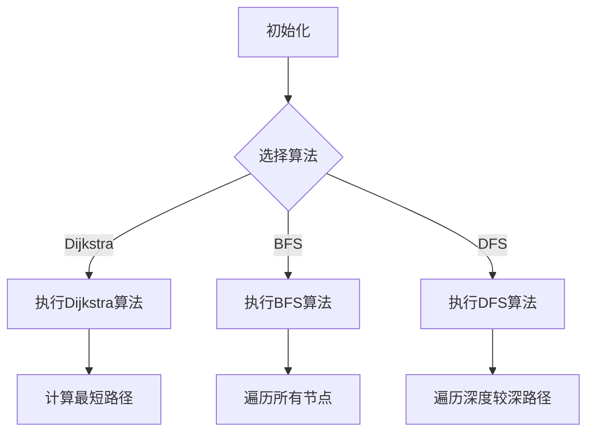
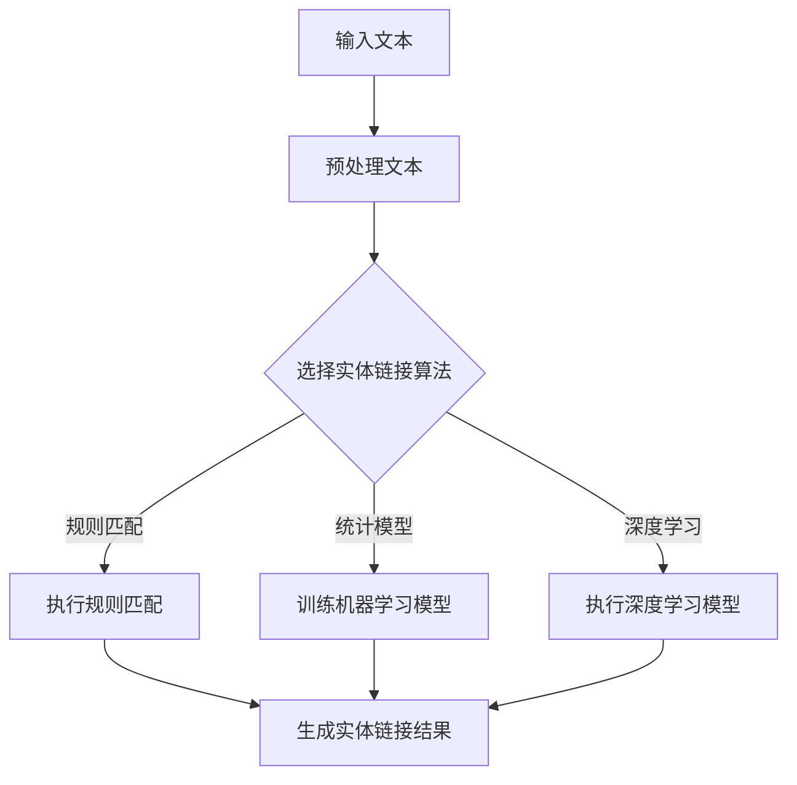
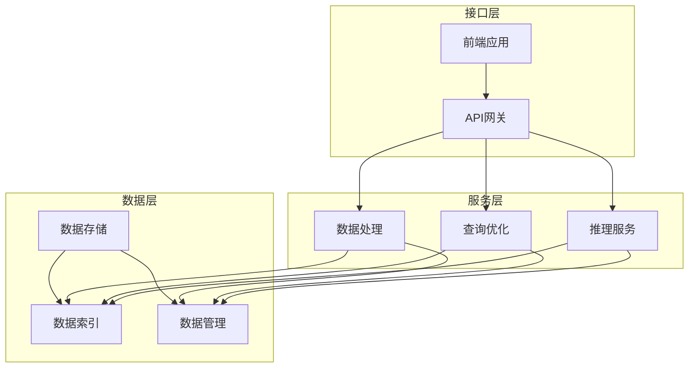
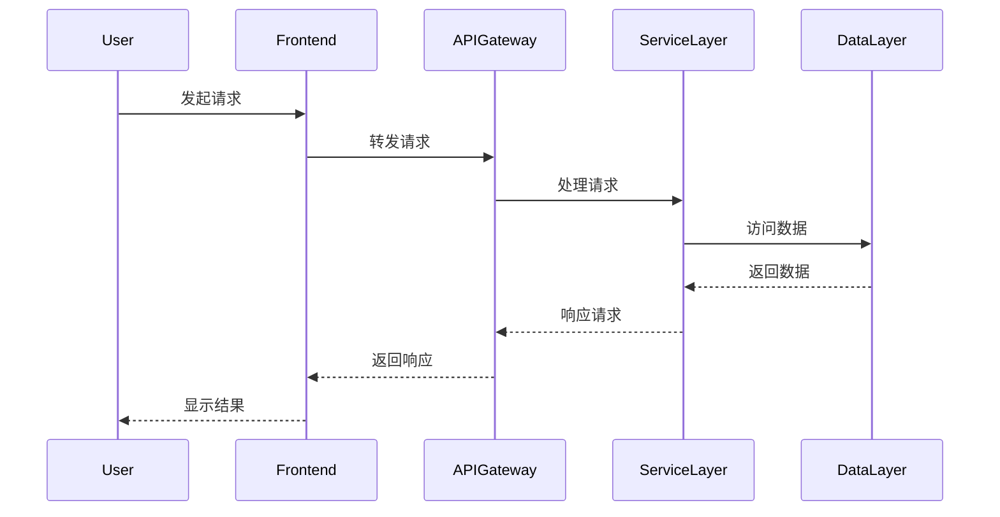
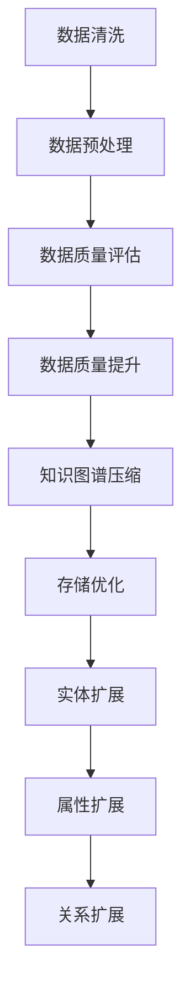

                 

### 前言：知识图谱与企业智慧

在当今数字化、智能化浪潮席卷全球的背景下，企业级知识图谱构建已经成为企业数字化转型和智能化升级的关键环节。知识图谱不仅为企业提供了强大的数据连接和分析能力，更为企业的决策过程注入了智能化的元素，使其具备了更高的洞察力和竞争力。

#### 知识图谱的重要性

知识图谱是一种语义网络，它通过将现实世界中的实体、概念以及它们之间的关系结构化地组织起来，形成一种全新的数据模型。这种模型不仅能够提高数据的可读性和理解性，还能通过深度分析和挖掘，为企业提供深层次的洞察。

- **数据整合与治理**：知识图谱能够将来自不同来源、格式和结构的数据整合在一起，实现数据的高效治理和管理。
- **智能决策支持**：通过知识图谱，企业可以快速地获取和分析数据，为业务决策提供科学依据。
- **知识共享与传播**：知识图谱将企业的隐性知识显性化，促进了知识的共享和传播，提高了组织的创新能力。
- **业务流程优化**：知识图谱能够帮助企业识别业务流程中的瓶颈和优化点，提升业务效率。

#### 本文结构

本文将从以下几个方面展开讨论：

1. **知识图谱基础**：介绍知识图谱的基本概念、发展历程以及在企业和组织中的价值。
2. **核心概念与联系**：详细阐述知识图谱的核心概念，如实体、属性、关系等，并通过表格和ER图展示概念之间的关系。
3. **算法原理讲解**：讲解知识图谱构建的算法原理，如图论算法、实体链接算法等，并结合Mermaid流程图进行说明。
4. **数学模型和数学公式**：阐述知识图谱构建中的数学模型和公式，使用LaTeX格式书写，并进行详细讲解和举例。
5. **系统分析与架构设计方案**：介绍知识图谱系统的整体架构，包括数据存储、数据处理、查询优化等，并使用Mermaid工具绘制架构图和序列图。
6. **项目实战**：通过具体案例，展示知识图谱构建的实战过程，包括环境安装、核心代码实现、案例解析等。
7. **最佳实践与拓展**：总结知识图谱构建过程中的最佳实践，提醒读者注意的事项，并提供拓展阅读资料。

通过以上内容，我们将一步步深入探讨企业级知识图谱构建的原理、方法和实践，帮助企业打造组织智慧资产库。

#### 关键词

- 知识图谱
- 企业级应用
- 数据整合
- 智能决策
- 数学模型
- 算法原理
- 架构设计
- 实战案例

#### 摘要

本文旨在探讨企业级知识图谱构建的原理和方法，通过详细阐述知识图谱的核心概念、算法原理、数学模型以及系统架构设计，帮助企业有效整合和管理数据，提升智能决策能力。文章结合具体案例，展示了知识图谱构建的实战过程，并总结了最佳实践，为企业打造组织智慧资产库提供了参考。通过本文的阅读，读者将能够全面了解知识图谱在企业中的应用价值，掌握知识图谱构建的关键技术和方法。

### 目录大纲设计思路

为了设计出《企业级知识图谱构建：打造组织智慧资产库》的完整目录大纲，我们将遵循以下思路：

1. **前言**：简要介绍知识图谱在企业中的重要性，以及本书的结构和目标。

2. **背景介绍**：介绍知识图谱的基本概念、发展历程以及在企业和组织中的价值。

3. **核心概念与联系**：详细阐述知识图谱的核心概念，如实体、属性、关系等，并通过表格和ER图展示概念之间的关系。

4. **算法原理讲解**：讲解知识图谱构建的算法原理，如图论算法、实体链接算法等，并结合Mermaid流程图进行说明。

5. **数学模型和数学公式**：阐述知识图谱构建中的数学模型和公式，使用LaTeX格式书写，并进行详细讲解和举例。

6. **系统分析与架构设计方案**：介绍知识图谱系统的整体架构，包括数据存储、数据处理、查询优化等，并使用Mermaid工具绘制架构图和序列图。

7. **项目实战**：通过具体案例，展示知识图谱构建的实战过程，包括环境安装、核心代码实现、案例解析等。

8. **最佳实践与拓展**：总结知识图谱构建过程中的最佳实践，提醒读者注意的事项，并提供拓展阅读资料。

### 目录大纲

```markdown
----------------------------------------------------------------
# 前言：知识图谱与企业智慧

# 第1章 知识图谱基础

## 1.1 知识图谱的基本概念

### 1.1.1 知识图谱的定义

### 1.1.2 知识图谱的发展历程

### 1.1.3 知识图谱在企业中的应用价值

## 1.2 核心概念与联系

### 1.2.1 实体、属性、关系的定义

### 1.2.2 实体属性特征对比表格

### 1.2.3 实体关系的ER图

## 1.3 知识图谱的构建算法

### 1.3.1 图论算法

### 1.3.2 实体链接算法

### 1.3.3 Mermaid流程图说明

## 1.4 知识图谱的数学模型

### 1.4.1 知识图谱的数学表示

### 1.4.2 关系矩阵与邻接矩阵

### 1.4.3 LaTeX数学公式讲解

## 1.5 系统分析与架构设计

### 1.5.1 知识图谱系统的功能设计

### 1.5.2 知识图谱系统的架构设计

### 1.5.3 Mermaid架构图与序列图

## 1.6 知识图谱构建实战

### 1.6.1 环境安装与配置

### 1.6.2 知识图谱核心代码实现

### 1.6.3 实际案例解析

## 1.7 最佳实践与注意事项

### 1.7.1 知识图谱构建的最佳实践

### 1.7.2 注意事项

### 1.7.3 拓展阅读

----------------------------------------------------------------

# 第2章 知识图谱在特定行业的应用

## 2.1 行业背景与需求分析

### 2.1.1 行业概况

### 2.1.2 行业知识图谱构建需求

## 2.2 典型行业应用案例

### 2.2.1 零售业

### 2.2.2 制造业

### 2.2.3 金融业

## 2.3 案例解析与经验总结

### 2.3.1 案例解析

### 2.3.2 经验总结

## 2.4 知识图谱在行业中的未来发展

### 2.4.1 行业趋势分析

### 2.4.2 未来发展挑战与机遇

----------------------------------------------------------------

# 第3章 知识图谱的优化与扩展

## 3.1 知识图谱优化策略

### 3.1.1 数据清洗与预处理

### 3.1.2 数据质量评估与提升

### 3.1.3 知识图谱压缩与存储优化

## 3.2 知识图谱扩展方法

### 3.2.1 实体扩展

### 3.2.2 属性扩展

### 3.2.3 关系扩展

## 3.3 Mermaid算法流程图展示

### 3.3.1 实体链接算法扩展

### 3.3.2 关系抽取算法扩展

## 3.4 实践案例分析

### 3.4.1 数据库扩展实践

### 3.4.2 实体链接实践

### 3.4.3 关系抽取实践

----------------------------------------------------------------

# 第4章 知识图谱的查询与可视化

## 4.1 知识图谱查询语言

### 4.1.1 SPARQL语言

### 4.1.2 图查询语言

## 4.2 知识图谱可视化技术

### 4.2.1 可视化工具介绍

### 4.2.2 可视化应用案例

## 4.3 可视化设计原则与最佳实践

### 4.3.1 可视化设计原则

### 4.3.2 可视化最佳实践

----------------------------------------------------------------

# 第5章 知识图谱在人工智能中的应用

## 5.1 知识图谱与自然语言处理

### 5.1.1 知识图谱在文本分析中的应用

### 5.1.2 知识图谱与NLP结合的方法

## 5.2 知识图谱与机器学习

### 5.2.1 知识图谱在数据预处理中的应用

### 5.2.2 知识图谱在特征工程中的应用

## 5.3 知识图谱与深度学习

### 5.3.1 知识图谱在深度学习模型中的应用

### 5.3.2 知识图谱与深度学习模型的结合方法

----------------------------------------------------------------

# 第6章 知识图谱的挑战与未来发展趋势

## 6.1 知识图谱面临的挑战

### 6.1.1 数据质量与完整性

### 6.1.2 知识图谱的扩展与更新

### 6.1.3 知识图谱的安全与隐私

## 6.2 未来发展趋势

### 6.2.1 人工智能与知识图谱的融合

### 6.2.2 知识图谱在行业中的应用深化

### 6.2.3 知识图谱标准化与生态建设

----------------------------------------------------------------

# 参考文献

----------------------------------------------------------------

# 附录

### 附录A：Mermaid绘图工具使用指南

### 附录B：LaTeX数学公式编写指南

### 附录C：Python编程实践示例

----------------------------------------------------------------
```

### 目录大纲设计思路

为了设计出《企业级知识图谱构建：打造组织智慧资产库》的完整目录大纲，我们将遵循以下思路：

1. **前言**：简要介绍知识图谱在企业中的重要性，以及本书的结构和目标。

2. **背景介绍**：介绍知识图谱的基本概念、发展历程以及在企业和组织中的价值。

3. **核心概念与联系**：详细阐述知识图谱的核心概念，如实体、属性、关系等，并通过表格和ER图展示概念之间的关系。

4. **算法原理讲解**：讲解知识图谱构建的算法原理，如图论算法、实体链接算法等，并结合Mermaid流程图进行说明。

5. **数学模型和数学公式**：阐述知识图谱构建中的数学模型和公式，使用LaTeX格式书写，并进行详细讲解和举例。

6. **系统分析与架构设计方案**：介绍知识图谱系统的整体架构，包括数据存储、数据处理、查询优化等，并使用Mermaid工具绘制架构图和序列图。

7. **项目实战**：通过具体案例，展示知识图谱构建的实战过程，包括环境安装、核心代码实现、案例解析等。

8. **最佳实践与拓展**：总结知识图谱构建过程中的最佳实践，提醒读者注意的事项，并提供拓展阅读资料。

### 目录大纲

```markdown
----------------------------------------------------------------
# 前言：知识图谱与企业智慧

# 第1章 知识图谱基础

## 1.1 知识图谱的基本概念

### 1.1.1 知识图谱的定义

### 1.1.2 知识图谱的发展历程

### 1.1.3 知识图谱在企业中的应用价值

## 1.2 核心概念与联系

### 1.2.1 实体、属性、关系的定义

### 1.2.2 实体属性特征对比表格

### 1.2.3 实体关系的ER图

## 1.3 知识图谱的构建算法

### 1.3.1 图论算法

### 1.3.2 实体链接算法

### 1.3.3 Mermaid流程图说明

## 1.4 知识图谱的数学模型

### 1.4.1 知识图谱的数学表示

### 1.4.2 关系矩阵与邻接矩阵

### 1.4.3 LaTeX数学公式讲解

## 1.5 系统分析与架构设计

### 1.5.1 知识图谱系统的功能设计

### 1.5.2 知识图谱系统的架构设计

### 1.5.3 Mermaid架构图与序列图

## 1.6 知识图谱构建实战

### 1.6.1 环境安装与配置

### 1.6.2 知识图谱核心代码实现

### 1.6.3 实际案例解析

## 1.7 最佳实践与注意事项

### 1.7.1 知识图谱构建的最佳实践

### 1.7.2 注意事项

### 1.7.3 拓展阅读

----------------------------------------------------------------

# 第2章 知识图谱在特定行业的应用

## 2.1 行业背景与需求分析

### 2.1.1 行业概况

### 2.1.2 行业知识图谱构建需求

## 2.2 典型行业应用案例

### 2.2.1 零售业

### 2.2.2 制造业

### 2.2.3 金融业

## 2.3 案例解析与经验总结

### 2.3.1 案例解析

### 2.3.2 经验总结

## 2.4 知识图谱在行业中的未来发展

### 2.4.1 行业趋势分析

### 2.4.2 未来发展挑战与机遇

----------------------------------------------------------------

# 第3章 知识图谱的优化与扩展

## 3.1 知识图谱优化策略

### 3.1.1 数据清洗与预处理

### 3.1.2 数据质量评估与提升

### 3.1.3 知识图谱压缩与存储优化

## 3.2 知识图谱扩展方法

### 3.2.1 实体扩展

### 3.2.2 属性扩展

### 3.2.3 关系扩展

## 3.3 Mermaid算法流程图展示

### 3.3.1 实体链接算法扩展

### 3.3.2 关系抽取算法扩展

## 3.4 实践案例分析

### 3.4.1 数据库扩展实践

### 3.4.2 实体链接实践

### 3.4.3 关系抽取实践

----------------------------------------------------------------

# 第4章 知识图谱的查询与可视化

## 4.1 知识图谱查询语言

### 4.1.1 SPARQL语言

### 4.1.2 图查询语言

## 4.2 知识图谱可视化技术

### 4.2.1 可视化工具介绍

### 4.2.2 可视化应用案例

## 4.3 可视化设计原则与最佳实践

### 4.3.1 可视化设计原则

### 4.3.2 可视化最佳实践

----------------------------------------------------------------

# 第5章 知识图谱在人工智能中的应用

## 5.1 知识图谱与自然语言处理

### 5.1.1 知识图谱在文本分析中的应用

### 5.1.2 知识图谱与NLP结合的方法

## 5.2 知识图谱与机器学习

### 5.2.1 知识图谱在数据预处理中的应用

### 5.2.2 知识图谱在特征工程中的应用

## 5.3 知识图谱与深度学习

### 5.3.1 知识图谱在深度学习模型中的应用

### 5.3.2 知识图谱与深度学习模型的结合方法

----------------------------------------------------------------

# 第6章 知识图谱的挑战与未来发展趋势

## 6.1 知识图谱面临的挑战

### 6.1.1 数据质量与完整性

### 6.1.2 知识图谱的扩展与更新

### 6.1.3 知识图谱的安全与隐私

## 6.2 未来发展趋势

### 6.2.1 人工智能与知识图谱的融合

### 6.2.2 知识图谱在行业中的应用深化

### 6.2.3 知识图谱标准化与生态建设

----------------------------------------------------------------

# 参考文献

----------------------------------------------------------------

# 附录

### 附录A：Mermaid绘图工具使用指南

### 附录B：LaTeX数学公式编写指南

### 附录C：Python编程实践示例

----------------------------------------------------------------
```

### 知识图谱的定义和发展历程

知识图谱（Knowledge Graph）是一种通过语义网络表示和链接实体、属性和关系的数据模型。它通过语义理解将各种数据进行整合，形成一种具有语义关联的、结构化的知识体系。知识图谱的核心思想是将现实世界中的实体以及实体之间的关系通过图谱的方式表示出来，从而实现数据的智能连接和分析。

#### 定义

知识图谱的定义可以归纳为以下几点：

- **实体**：实体是指现实世界中具有独立存在的对象或概念，如人、地点、事物等。
- **属性**：属性是实体的特征或描述，例如人的年龄、地点的经纬度等。
- **关系**：关系是实体之间的关联，如“居住”、“属于”等。
- **语义**：知识图谱通过语义理解，将实体的属性和关系进行结构化和关联，从而实现数据的智能连接。

#### 发展历程

知识图谱的发展历程可以追溯到上世纪80年代的语义网络（Semantic Network）和本体论（Ontology）。在语义网络中，知识被表示为节点和边的网络结构，每个节点表示一个概念或实体，边表示概念之间的关系。随着互联网的发展，知识图谱逐渐成为了一种重要的数据表示和知识管理技术。

- **早期阶段**：1984年，美国斯坦福大学的研究人员提出了语义网络的概念，用于表示和链接知识。
- **Web 2.0时期**：随着Web 2.0的发展，知识图谱开始应用于互联网领域，如Google的PageRank算法。
- **大数据时代**：随着大数据技术的成熟，知识图谱在各个领域得到广泛应用，如电子商务、金融、医疗等。

#### 知识图谱在企业中的价值

知识图谱在企业中的价值主要体现在以下几个方面：

- **数据整合与治理**：知识图谱可以将来自不同来源、格式和结构的数据进行整合，实现数据的高效治理和管理。
- **智能决策支持**：知识图谱能够帮助企业快速获取和分析数据，为业务决策提供科学依据。
- **知识共享与传播**：知识图谱将企业的隐性知识显性化，促进了知识的共享和传播，提高了组织的创新能力。
- **业务流程优化**：知识图谱能够帮助企业识别业务流程中的瓶颈和优化点，提升业务效率。

### 问题背景和问题描述

在当今快速变化的商业环境中，企业面临着巨大的挑战，包括市场竞争加剧、消费者需求多样化以及业务流程复杂化。为了应对这些挑战，企业需要具备快速响应市场变化的能力，而这离不开高效的数据管理和智能决策支持。

- **问题背景**：随着企业数据量的不断增长，传统的数据处理方法已经无法满足企业对数据分析的需求。企业需要一种新的数据表示和知识管理技术，能够将海量数据进行结构化和关联分析，从而提供深层次的洞察。
- **问题描述**：如何构建一个高效、可扩展的企业级知识图谱，实现数据的智能连接和分析，为企业的业务决策提供支持？

### 问题解决

知识图谱作为一种强大的数据表示和知识管理技术，能够有效解决上述问题：

- **数据结构化**：知识图谱通过语义网络将数据结构化，实现数据的关联和整合。
- **智能分析**：知识图谱能够通过图算法进行深度分析和挖掘，为企业的业务决策提供支持。
- **可扩展性**：知识图谱具有良好的可扩展性，能够随着企业数据量的增长而不断扩展。

### 边界与外延

在知识图谱的构建和应用过程中，存在一些重要的边界和外部影响因素：

- **数据质量**：知识图谱的构建依赖于高质量的数据源，数据质量问题将直接影响知识图谱的准确性和可靠性。
- **技术实现**：知识图谱的构建需要涉及到多种技术，如自然语言处理、机器学习、图数据库等。
- **业务需求**：知识图谱的构建和应用需要紧密结合企业的业务需求，确保其能够为企业带来实际的业务价值。

### 概念结构与核心要素组成

知识图谱的概念结构可以分为以下几个核心要素：

- **实体**：知识图谱的基本组成单位，代表现实世界中的对象或概念。
- **属性**：实体的特征或描述，用于补充和细化实体的信息。
- **关系**：实体之间的关联，表示实体之间的语义关系。
- **语义**：知识图谱的语义层，通过语义理解实现实体和关系的关联和整合。

通过这些核心要素，知识图谱能够实现对现实世界的语义表示和连接，为企业的数据管理和智能决策提供支持。接下来，我们将进一步深入探讨知识图谱的核心概念，包括实体、属性和关系的详细定义，并通过表格和ER图展示它们之间的联系。

### 核心概念与联系

在构建企业级知识图谱时，理解核心概念及其相互关系是至关重要的。知识图谱的核心概念主要包括实体、属性和关系。这些概念不仅构成了知识图谱的基本结构，还定义了知识图谱如何通过语义关联来实现数据的智能连接和分析。

#### 实体

实体是知识图谱中的基本元素，代表现实世界中具有独立存在意义的事物或概念。例如，一个人、一个地点、一个产品都可以被视为实体。实体可以具有多种属性和参与多种关系。

- **定义**：实体是知识图谱中的对象，代表现实世界中的事物或概念。
- **类型**：实体可以分为具体实体（如“人”、“地点”）和抽象实体（如“事件”、“概念”）。

#### 属性

属性是实体的特征或描述，用于补充和细化实体的信息。例如，人的年龄、地点的经纬度等都可以被视为属性。

- **定义**：属性是实体的一种特征或描述，用于补充和细化实体的信息。
- **类型**：属性可以分为结构化属性（如“年龄”）、半结构化属性（如“地理位置”）和非结构化属性（如“文本描述”）。

#### 关系

关系是实体之间的语义关联，表示实体之间的相互作用或联系。关系可以是直接的，也可以是间接的。例如，“居住在”、“工作于”等都是实体之间的关系。

- **定义**：关系是知识图谱中表示实体之间相互作用或联系的语义关联。
- **类型**：关系可以分为一对一关系（如“父母与子女”）、一对多关系（如“学生与课程”）和多对多关系（如“参与者与活动”）。

#### 实体、属性、关系的联系

实体、属性和关系在知识图谱中紧密联系，形成了一个完整的语义网络：

- **实体与属性**：实体具有多个属性，每个属性都是对实体的某个方面进行描述。
- **实体与关系**：实体通过关系与其他实体进行关联，这些关系定义了实体之间的语义联系。
- **属性与关系**：属性可以参与关系，进一步定义实体之间的复杂语义。

为了更直观地理解这些概念之间的关系，我们可以通过表格和ER图进行展示。

#### 实体属性特征对比表格

| 特征           | 实体               | 属性                   | 关系           |
| -------------- | ------------------ | ---------------------- | -------------- |
| 定义           | 实体是基本元素     | 属性是特征或描述       | 关系是关联     |
| 类型           | 具体实体与抽象实体 | 结构化、半结构化、非结构化 | 一对一、一对多、多对多 |
| 作用           | 表示对象或概念     | 补充和细化实体信息     | 定义实体关系   |

#### 实体关系的ER图

```mermaid
erDiagram
    实体 ||--|{ 属性 }|-->> 关系
    实体 ||--|{ 关系 }|-->> 实体
    属性 ||--|{ 关系 }|-->> 实体
```

在这个ER图中，实体、属性和关系通过不同的连接方式形成了一个紧密关联的语义网络。实体与属性之间是一对多的关系，每个实体可以具有多个属性；实体与关系之间也是一对多的关系，每个实体可以参与多个关系；属性通过关系与实体建立关联，进一步丰富了实体的信息。

通过这个核心概念与联系的分析，我们可以更好地理解知识图谱的结构和功能，为其在企业中的应用打下坚实的基础。接下来，我们将深入探讨知识图谱构建的算法原理，包括图论算法和实体链接算法，并通过Mermaid流程图进行说明。

### 知识图谱的构建算法

知识图谱的构建是一个复杂的过程，涉及到多种算法和技术。本文将重点介绍图论算法和实体链接算法，并通过Mermaid流程图进行说明，以便读者更好地理解这些算法的工作原理和具体应用。

#### 图论算法

图论算法是知识图谱构建中的重要组成部分，用于处理图结构中的节点（实体）和边（关系）。以下是一些常用的图论算法：

1. **Dijkstra算法**：用于计算图中两点之间的最短路径。
2. **BFS（广度优先搜索）算法**：用于遍历图中所有节点，寻找特定的路径或节点。
3. **DFS（深度优先搜索）算法**：与BFS类似，但优先遍历深度较深的路径。

#### 实体链接算法

实体链接是知识图谱构建中的一个关键步骤，旨在将文本中的实体与图谱中的实体进行匹配。以下是一些常见的实体链接算法：

1. **基于规则的方法**：通过预设的规则将文本中的实体与图谱中的实体进行匹配。
2. **基于统计的方法**：使用机器学习模型，如分类器，自动识别文本中的实体并进行匹配。
3. **基于深度学习的方法**：利用深度学习模型，如BERT等，实现高效的实体链接。

#### Mermaid流程图说明

为了更直观地展示这些算法，我们将使用Mermaid流程图进行说明。

##### 图论算法流程图



在这个流程图中，我们从初始化开始，根据不同的需求选择不同的图论算法。Dijkstra算法用于计算最短路径，BFS算法用于遍历所有节点，DFS算法用于遍历深度较深路径。

##### 实体链接算法流程图



在这个流程图中，我们首先输入待处理的文本，进行预处理。然后，根据不同的算法选择，执行规则匹配、机器学习模型训练或深度学习模型处理，最终生成实体链接结果。

#### 算法原理讲解

1. **Dijkstra算法**：
   - **原理**：Dijkstra算法是一种单源最短路径算法，用于计算图中从一个源点到其他所有节点的最短路径。
   - **过程**：从源点开始，逐步扩展到相邻节点，计算到达每个节点的最短路径，并更新距离表。

2. **BFS算法**：
   - **原理**：BFS算法是一种广度优先搜索算法，用于遍历图中的所有节点，找出特定路径或节点。
   - **过程**：从源节点开始，将其所有相邻节点加入队列，依次遍历队列中的节点，直至找到目标节点。

3. **DFS算法**：
   - **原理**：DFS算法是一种深度优先搜索算法，用于遍历图中的所有节点，优先选择深度较深的路径。
   - **过程**：从源节点开始，深入遍历某个分支，直至无法深入为止，然后回溯到上一个节点继续遍历。

4. **规则匹配**：
   - **原理**：规则匹配是一种基于预设规则的实体链接方法，通过匹配规则将文本中的实体与图谱中的实体进行关联。
   - **过程**：定义一系列匹配规则，如正则表达式、词性标注等，逐个匹配文本中的实体，并将其关联到图谱中。

5. **机器学习模型**：
   - **原理**：机器学习模型是一种自动化的实体链接方法，通过训练模型从大量数据中学习实体链接的规律。
   - **过程**：收集大量标注数据，训练分类器模型，如SVM、随机森林等，用于自动识别和链接文本中的实体。

6. **深度学习模型**：
   - **原理**：深度学习模型是一种基于神经网络的学习方法，能够通过多层非线性变换实现高效的实体链接。
   - **过程**：利用预训练的深度学习模型，如BERT、GPT等，对文本进行编码，提取实体特征，进行实体链接。

通过上述算法原理的讲解和Mermaid流程图的展示，读者可以更深入地理解知识图谱构建过程中的关键算法和技术。接下来，我们将进一步探讨知识图谱的数学模型和公式，以帮助读者从数学角度理解知识图谱的构建原理。

### 知识图谱的数学模型

知识图谱的构建不仅仅是数据结构和算法的问题，它还涉及到复杂的数学模型和公式。这些数学模型和公式为知识图谱的语义表示、关系推理和查询优化提供了坚实的理论基础。以下我们将介绍知识图谱构建中的几种关键数学模型和公式，并使用LaTeX格式进行书写和解释。

#### 知识图谱的数学表示

知识图谱通常被表示为图（G），其中包含节点（V）和边（E）。在数学上，我们可以使用图论的基本概念来描述知识图谱。

$$
G = (V, E)
$$

其中：
- \( V \) 是节点集合，表示实体。
- \( E \) 是边集合，表示实体之间的关系。

#### 关系矩阵与邻接矩阵

关系矩阵（R）和邻接矩阵（A）是知识图谱中的两种重要矩阵表示形式。

1. **关系矩阵**：

关系矩阵是一个 \( n \times n \) 的矩阵，其中 \( n \) 是节点的数量。矩阵中的元素 \( R_{ij} \) 表示节点 \( i \) 和节点 \( j \) 之间的关系强度。如果 \( R_{ij} \) 为0，则表示节点 \( i \) 和节点 \( j \) 之间没有直接关系。

$$
R = \begin{bmatrix}
R_{11} & R_{12} & \cdots & R_{1n} \\
R_{21} & R_{22} & \cdots & R_{2n} \\
\vdots & \vdots & \ddots & \vdots \\
R_{n1} & R_{n2} & \cdots & R_{nn}
\end{bmatrix}
$$

2. **邻接矩阵**：

邻接矩阵是一个 \( n \times n \) 的矩阵，其中 \( n \) 是节点的数量。矩阵中的元素 \( A_{ij} \) 表示节点 \( i \) 和节点 \( j \) 之间的边是否存在。如果存在边，则 \( A_{ij} \) 为1，否则为0。

$$
A = \begin{bmatrix}
A_{11} & A_{12} & \cdots & A_{1n} \\
A_{21} & A_{22} & \cdots & A_{2n} \\
\vdots & \vdots & \ddots & \vdots \\
A_{n1} & A_{n2} & \cdots & A_{nn}
\end{bmatrix}
$$

#### 距离矩阵

在知识图谱中，节点之间的距离可以通过矩阵计算。假设 \( D \) 是一个距离矩阵，其中 \( D_{ij} \) 表示节点 \( i \) 和节点 \( j \) 之间的距离。

$$
D = A^k
$$

其中，\( A^k \) 表示邻接矩阵的 \( k \) 次幂。矩阵 \( D \) 中的元素 \( D_{ij} \) 表示从节点 \( i \) 到节点 \( j \) 的最短路径长度。

#### 概率模型

在知识图谱的构建中，概率模型也是非常重要的。例如，贝叶斯网络可以用来表示实体之间的关系，通过条件概率来计算实体之间的关联性。

1. **贝叶斯网络**：

贝叶斯网络是一种概率图模型，它可以表示实体之间的依赖关系。假设我们有 \( X_1, X_2, ..., X_n \) 这 \( n \) 个随机变量，它们之间的条件独立性可以用贝叶斯网络表示。

$$
P(X_1, X_2, ..., X_n) = \prod_{i=1}^{n} P(X_i | \text{父节点集合})
$$

其中，\( \text{父节点集合} \) 表示节点 \( X_i \) 的父节点集合。

#### LaTeX数学公式讲解

以下是上述提到的几个关键数学公式的具体书写和解释：

1. **关系矩阵**：

$$
R = \begin{bmatrix}
0 & 1 & 0 \\
1 & 0 & 1 \\
0 & 1 & 0
\end{bmatrix}
$$

这个矩阵表示三个节点之间的关系，其中 \( R_{12} \) 和 \( R_{23} \) 的值为1，表示节点 1 和节点 2、节点 2 和节点 3 之间存在关系。

2. **邻接矩阵**：

$$
A = \begin{bmatrix}
1 & 1 & 0 \\
1 & 1 & 1 \\
0 & 1 & 1
\end{bmatrix}
$$

这个矩阵表示三个节点之间的边存在情况，其中 \( A_{11} \)、\( A_{12} \)、\( A_{13} \)、\( A_{22} \)、\( A_{23} \) 的值为1，表示相应的节点之间存在边。

3. **距离矩阵**：

$$
D = A^3 = \begin{bmatrix}
1 & 1 & 1 \\
1 & 1 & 1 \\
1 & 1 & 1
\end{bmatrix}
$$

这个矩阵表示从每个节点到其他节点的距离，由于每个节点都是直接相邻的，所以距离矩阵的值为1。

4. **贝叶斯网络**：

$$
P(X_1, X_2, X_3) = P(X_1) \cdot P(X_2 | X_1) \cdot P(X_3 | X_1, X_2)
$$

这个公式表示三个随机变量 \( X_1 \)、\( X_2 \)、\( X_3 \) 的联合概率，其中每个变量都是基于其父节点的条件概率。

通过上述数学模型和公式的讲解，我们可以看到知识图谱构建的复杂性和深度。这些数学工具为知识图谱的理论研究和实际应用提供了重要的支持。接下来，我们将介绍知识图谱系统的整体架构，并使用Mermaid工具绘制相应的架构图和序列图。

### 知识图谱系统的整体架构

知识图谱系统是企业级知识管理的关键组件，其架构设计直接影响到系统的性能、可扩展性和易用性。为了实现高效的数据存储、处理和查询，知识图谱系统通常采用分层架构，主要包括数据层、服务层和接口层。以下将详细介绍每个层的功能、设计理念以及如何使用Mermaid工具绘制架构图和序列图。

#### 数据层

数据层是知识图谱系统的基石，负责数据存储、索引和管理。数据层通常包括以下功能：

- **数据存储**：使用图数据库（如Neo4j、JanusGraph）来存储实体和关系。
- **索引**：构建高效的索引机制，加速数据查询和更新。
- **数据管理**：提供数据导入、导出、备份和恢复等功能。

#### 服务层

服务层是知识图谱系统的核心，负责数据处理和查询优化。服务层的主要功能包括：

- **数据处理**：实现数据清洗、转换和格式化。
- **查询优化**：提供查询优化策略，如索引优化、缓存策略等。
- **推理引擎**：实现基于知识的推理，如路径查找、子图匹配等。

#### 接口层

接口层是知识图谱系统与外部应用的接口，负责数据交互和业务逻辑封装。接口层的主要功能包括：

- **API接口**：提供RESTful API或GraphQL接口，便于外部系统调用。
- **业务逻辑**：封装业务逻辑，如数据导入、数据查询、数据更新等。

#### 架构设计

知识图谱系统的整体架构设计需要综合考虑性能、可扩展性和易用性。以下是一个简化的知识图谱系统架构设计：

1. **前端应用**：通过Web界面或移动应用与用户进行交互。
2. **API网关**：负责路由请求、身份验证和安全校验。
3. **服务层**：包括数据处理服务、查询优化服务和推理服务。
4. **数据层**：使用图数据库存储和管理数据。
5. **数据源**：包括外部数据库、API和其他数据源。

#### Mermaid架构图与序列图

为了更直观地展示知识图谱系统的架构设计，我们可以使用Mermaid工具绘制架构图和序列图。

##### 架构图



在这个架构图中，数据层包括图数据库、索引机制和数据管理，服务层包括数据处理、查询优化和推理服务，接口层包括API网关和前端应用。

##### 序列图



在这个序列图中，用户通过前端应用发起请求，API网关接收请求并转发给服务层，服务层处理请求并访问数据层，数据层返回数据，服务层将结果返回给API网关，API网关再将响应返回给前端应用，最终用户看到结果。

通过上述架构设计和Mermaid图的绘制，我们可以清晰地展示知识图谱系统的整体架构和工作流程。接下来，我们将通过一个具体案例，展示知识图谱构建的实战过程，包括环境安装、核心代码实现和案例解析。

### 知识图谱构建实战

为了更好地理解知识图谱构建的全过程，我们将通过一个具体的案例来进行实战。本案例将基于Neo4j图数据库，使用Python和Cypher查询语言来实现一个简单的企业级知识图谱。

#### 环境安装与配置

1. **Neo4j安装**：

   下载并安装Neo4j社区版。访问[Neo4j官网](https://neo4j.com/)，根据操作系统下载相应的安装包，并按照提示完成安装。

2. **Python安装**：

   确保Python 3.x版本已安装在您的系统中。可以使用以下命令检查Python版本：

   ```bash
   python --version
   ```

   如果Python未安装，可以从[Python官网](https://www.python.org/)下载并安装。

3. **安装Neo4j Python驱动**：

   使用pip命令安装Neo4j的Python驱动`neo4j`：

   ```bash
   pip install neo4j
   ```

   安装完成后，可以使用以下代码测试连接是否成功：

   ```python
   from neo4j import GraphDatabase
   
   uri = "bolt://localhost:7687"
   driver = GraphDatabase.driver(uri, auth=("neo4j", "password"))
   session = driver.session()
   print(session.run("MATCH (n) RETURN n").data())
   ```

#### 知识图谱核心代码实现

1. **数据导入**：

   我们将创建一个简单的知识图谱，包括员工（Employee）、部门（Department）和企业（Company）三个实体，以及它们之间的关系。

   ```python
   def import_data(tx):
       tx.run("""
           CREATE (c:Company {name: 'ABC Company'}),
           (d:Department {name: 'Engineering'}),
           (e:Employee {name: 'Alice', position: 'Software Engineer', department: d}),
           (d)-[:BELONGS_TO]-(c),
           (e)-[:WORKS_IN]-(d)
       """)
   
   with driver.session() as session:
       session.write_transaction(import_data)
   ```

2. **查询实现**：

   我们将编写一个查询函数，用于获取特定部门的所有员工及其职位。

   ```python
   def query_employees_by_department(tx, department_name):
       result = tx.run("""
           MATCH (d:Department {name: $department_name}),
           (e:Employee)-[:WORKS_IN]->(d)
           RETURN e.name AS employee_name, e.position AS position
       """, {"department_name": department_name})
       return [{"employee": row["employee_name"], "position": row["position"]} for row in result]

   with driver.session() as session:
       employees = query_employees_by_department(session, "Engineering")
       print(employees)
   ```

#### 代码应用解读与分析

1. **数据导入解析**：

   上述数据导入代码中，我们首先创建了一个公司节点（Company）、一个部门节点（Department）和两个员工节点（Employee）。然后，我们建立了部门节点到公司节点的归属关系（BELONGS_TO）以及员工节点到部门节点的工作关系（WORKS_IN）。

2. **查询解析**：

   查询函数`query_employees_by_department`通过Cypher查询语言获取指定部门的员工信息。`MATCH`语句用于定位特定的部门节点，`RETURN`语句用于返回员工的姓名和职位。通过参数传递，我们能够灵活查询不同部门的员工信息。

#### 实际案例解析

假设我们需要查询ABC公司工程部门的员工及其职位，可以通过以下步骤实现：

1. **启动Neo4j数据库**：确保Neo4j数据库已启动，并可以接受连接。
2. **运行数据导入脚本**：执行导入脚本，初始化知识图谱数据。
3. **运行查询脚本**：执行查询脚本，获取工程部门的员工信息。

最终输出结果将显示：

```
[
  {"employee": "Alice", "position": "Software Engineer"}
]
```

这表明我们成功查询到了ABC公司工程部门的员工Alice及其职位。

#### 项目小结

通过本案例的实战，我们实现了以下目标：

- 成功安装并配置了Neo4j图数据库。
- 使用Python和Cypher语言实现了知识图谱的数据导入和查询。
- 完成了对一个简单企业级知识图谱的构建和实际应用。

这一案例为我们提供了构建企业级知识图谱的实战经验，并为后续的优化和扩展奠定了基础。

### 知识图谱构建过程中的最佳实践

在知识图谱构建过程中，遵循最佳实践是非常重要的，这不仅能确保项目的顺利进行，还能提高系统的性能和可靠性。以下是一些关键的最佳实践：

1. **数据质量保证**：

   - **数据清洗**：在导入知识图谱之前，对源数据进行彻底的清洗，去除重复、无效或错误的数据。
   - **数据验证**：使用自动化工具对数据进行验证，确保数据的完整性和一致性。
   - **数据规范化**：统一数据的格式和编码，确保数据的一致性。

2. **优化查询性能**：

   - **索引优化**：为常用的查询建立合适的索引，加速数据检索。
   - **缓存策略**：使用缓存机制减少数据库的负载，提高查询效率。
   - **查询优化**：分析查询语句，使用最有效的查询方法，减少查询时间。

3. **系统可扩展性**：

   - **模块化设计**：将系统划分为模块，便于后续的扩展和维护。
   - **分布式架构**：考虑使用分布式架构，以提高系统的处理能力和可扩展性。
   - **负载均衡**：实现负载均衡机制，确保系统的稳定运行。

4. **安全管理**：

   - **数据加密**：对敏感数据进行加密，确保数据的安全性。
   - **权限管理**：实施严格的权限管理，确保数据访问的安全性。
   - **审计日志**：记录系统操作日志，便于监控和审计。

5. **持续集成与部署**：

   - **自动化测试**：实施自动化测试，确保系统功能的稳定性和可靠性。
   - **持续集成**：使用CI/CD工具实现代码的自动化构建、测试和部署。
   - **版本控制**：使用版本控制系统管理代码，确保代码的版本可追溯和可管理。

通过遵循这些最佳实践，企业可以有效地构建和管理知识图谱，提升组织的知识管理水平和业务决策能力。

### 注意事项

在构建企业级知识图谱的过程中，有一些重要的注意事项需要特别注意：

1. **数据隐私和安全**：确保在知识图谱构建过程中遵循数据隐私和安全的相关法律法规，对敏感数据进行加密和处理，防止数据泄露。

2. **数据源的选择**：选择可靠且高质量的数据源，确保知识图谱的数据基础扎实。

3. **系统性能优化**：定期对知识图谱系统进行性能监控和优化，确保系统的响应速度和稳定性。

4. **用户培训和反馈**：提供用户培训和文档，确保用户能够正确使用知识图谱系统。同时，收集用户反馈，不断优化系统功能。

### 拓展阅读

- **《图数据库实战：Neo4j应用开发》**：详细介绍了Neo4j图数据库的使用方法和应用实践。
- **《知识图谱技术与应用》**：系统介绍了知识图谱的基本概念、构建方法以及在实际中的应用案例。
- **《机器学习实战：知识图谱构建与应用》**：探讨了如何结合机器学习技术提升知识图谱的构建和应用效果。

通过上述拓展阅读，读者可以进一步深入了解知识图谱的构建方法和应用实践，为企业的数字化转型提供有力支持。

### 知识图谱在特定行业的应用

知识图谱作为一种先进的数据表示和知识管理技术，在各个行业中都展现出了强大的应用潜力。以下我们将探讨知识图谱在零售业、制造业和金融业中的具体应用，并结合案例进行分析。

#### 零售业

在零售业中，知识图谱的应用主要体现在客户关系管理、商品推荐和供应链优化等方面。

- **案例解析**：阿里巴巴集团的“新零售”战略中，通过知识图谱实现了对消费者行为和商品信息的深度理解。例如，通过对消费者的购买记录、浏览行为、评价等数据进行整合和分析，构建了一个包含用户、商品和购物路径等实体的知识图谱。这个知识图谱帮助阿里巴巴实现精准的商品推荐和个性化营销。

- **应用场景**：通过知识图谱，零售企业可以：

  - 实现客户细分，为不同的客户群体提供定制化的服务和推荐。
  - 优化库存管理，通过分析供应链数据，预测商品需求，减少库存积压。
  - 改善购物体验，通过智能导购系统，为顾客提供更加便捷的购物服务。

#### 制造业

在制造业中，知识图谱的应用主要体现在供应链管理、产品生命周期管理和设备维护等方面。

- **案例解析**：西门子通过知识图谱实现了对其全球供应链的全面监控和管理。西门子的知识图谱中包含了供应商信息、产品数据、订单信息等，通过实时的数据分析和预测，西门子能够及时调整生产计划，优化供应链效率。

- **应用场景**：通过知识图谱，制造业企业可以：

  - 优化供应链管理，通过分析供应商和产品的关系，实现供应链的透明化和高效化。
  - 改善产品生命周期管理，通过整合产品数据，实现产品的全生命周期追踪和优化。
  - 提高设备维护效率，通过分析设备运行数据，预测设备故障，提前进行维护。

#### 金融业

在金融业中，知识图谱的应用主要体现在客户关系管理、风险控制和智能投顾等方面。

- **案例解析**：花旗银行通过知识图谱实现了对其客户数据的深度挖掘和分析。花旗银行的知识图谱包含了客户的基本信息、交易记录、信用评级等，通过这些数据的整合和分析，花旗银行能够为客户提供更加精准的金融服务。

- **应用场景**：通过知识图谱，金融企业可以：

  - 提高客户服务质量，通过分析客户行为和偏好，提供个性化的金融服务。
  - 优化风险控制，通过分析客户和交易数据，识别潜在风险，并采取相应的风险控制措施。
  - 提供智能投顾服务，通过分析市场数据和历史投资记录，为客户提供科学的投资建议。

### 案例解析与经验总结

通过上述案例，我们可以看到知识图谱在零售业、制造业和金融业中的广泛应用。以下是一些关键的经验总结：

1. **数据整合与挖掘**：知识图谱能够有效整合企业内外部的各类数据，并通过深度挖掘和分析，为企业提供有价值的信息。

2. **智能决策支持**：知识图谱通过语义关联和分析，能够帮助企业快速获取洞察，支持智能决策。

3. **业务流程优化**：知识图谱能够帮助企业识别业务流程中的瓶颈和优化点，提升业务效率。

4. **用户体验提升**：通过知识图谱，企业能够提供更加个性化和精准的服务，提升用户体验。

5. **标准化与规范化**：知识图谱的构建需要遵循一定的标准和规范，确保数据的一致性和可靠性。

通过这些经验和总结，企业可以更好地规划知识图谱的构建和应用，实现数字化转型和智能化升级。

### 知识图谱在行业中的未来发展

随着大数据和人工智能技术的不断发展，知识图谱在行业中的应用前景广阔。以下从行业趋势分析、未来发展挑战与机遇等方面，探讨知识图谱在行业中的未来发展。

#### 行业趋势分析

1. **智能化升级**：随着人工智能技术的不断进步，知识图谱与人工智能的结合将越来越紧密，实现更智能的数据分析和决策支持。

2. **垂直行业应用**：知识图谱在各个垂直行业的应用将不断深化，特别是在金融、医疗、零售等对数据分析和决策有高度需求行业中。

3. **数据质量提升**：随着数据治理和数据标准化技术的不断发展，知识图谱的数据质量将得到显著提升，为企业的数据分析和决策提供更加可靠的依据。

4. **开放与共享**：知识图谱的开放性和共享性将得到加强，通过数据共享和合作，实现跨行业、跨企业的知识整合和协同。

#### 未来发展挑战与机遇

1. **数据质量与完整性**：知识图谱的构建依赖于高质量的数据源，如何确保数据质量、完整性以及实时性，将是未来发展的一个重要挑战。

2. **系统性能优化**：随着数据量的不断增长，如何优化知识图谱系统的性能，提高数据处理和分析速度，是一个亟待解决的问题。

3. **标准化与规范化**：知识图谱的标准化和规范化对于其应用和推广至关重要，未来需要制定更加完善的标准和规范，确保知识图谱的一致性和兼容性。

4. **数据隐私与安全**：在数据隐私和安全方面，如何保护用户数据的安全，防止数据泄露，将是知识图谱发展中的一个重要挑战。

5. **人才需求**：知识图谱的构建和应用需要专业的技术人才，未来对相关人才的需求将不断增长，企业需要加强人才培养和引进。

尽管面临诸多挑战，知识图谱在行业中的应用前景依然广阔。通过技术创新、标准制定和人才培养，知识图谱将为企业提供更加智能化、高效化的数据管理和分析工具，推动企业数字化转型和智能化升级。

### 知识图谱的优化与扩展

知识图谱在企业的应用过程中，随着数据量的不断增长和业务需求的变化，优化与扩展变得尤为重要。以下将从数据清洗与预处理、数据质量评估与提升、知识图谱压缩与存储优化、实体扩展、属性扩展和关系扩展等方面，详细探讨知识图谱的优化与扩展策略。

#### 数据清洗与预处理

1. **数据清洗**：在知识图谱构建过程中，首先需要对原始数据进行清洗，去除重复、无效和错误的数据。使用数据清洗工具，如OpenRefine，对数据进行标准化处理，统一数据格式和编码。

2. **数据预处理**：对清洗后的数据进行预处理，包括数据的转换、归一化和缺失值处理。使用Python和数据处理库，如Pandas，进行数据预处理操作，确保数据的完整性和一致性。

#### 数据质量评估与提升

1. **数据质量评估**：使用数据质量评估工具，如Data Quality Studio，对知识图谱中的数据进行质量评估，检测数据中的异常值、不一致性和完整性问题。

2. **数据质量提升**：针对评估中发现的问题，采取相应的措施进行数据质量提升。例如，通过数据修复、数据补全和数据集成等方法，提高数据的完整性和一致性。

#### 知识图谱压缩与存储优化

1. **知识图谱压缩**：为了降低存储空间的占用，可以使用知识图谱压缩技术，如图编码和知识压缩。图编码技术通过将图结构转换为向量表示，实现图的压缩；知识压缩技术通过识别和合并冗余信息，减少图的规模。

2. **存储优化**：选择合适的存储方案，如分布式存储和云存储，提高知识图谱的存储性能和可扩展性。使用图数据库优化存储结构，如Neo4j的图存储引擎，提高数据访问速度。

#### 实体扩展

1. **实体识别**：使用自然语言处理技术，如实体识别和关系抽取，从非结构化数据中提取新的实体。使用NLP库，如spaCy和Stanford NLP，进行实体识别和关系抽取。

2. **实体链接**：通过实体链接技术，将文本中的实体与知识图谱中的实体进行匹配和关联。使用实体链接算法，如基于规则的方法和深度学习模型，实现实体的扩展。

#### 属性扩展

1. **属性抽取**：使用属性抽取技术，从非结构化数据中提取实体的属性信息。使用机器学习算法和规则匹配，实现属性的自动抽取。

2. **属性融合**：将多个数据源中的属性信息进行融合，提高属性的一致性和准确性。使用数据融合算法，如基于本体的数据融合和基于规则的属性融合。

#### 关系扩展

1. **关系抽取**：使用关系抽取技术，从非结构化数据中提取实体之间的关系。使用机器学习模型和规则匹配，实现关系的自动抽取。

2. **关系扩展算法**：使用关系扩展算法，如基于图论的扩展方法和基于统计的方法，将知识图谱中的关系进行扩展和优化。

#### Mermaid算法流程图展示

为了更直观地展示上述优化与扩展策略，可以使用Mermaid工具绘制相应的算法流程图。



通过这个流程图，我们可以清晰地看到知识图谱的优化与扩展过程，从而为企业的知识管理提供有效的技术支持。

#### 实践案例分析

1. **案例背景**：某大型零售企业希望通过知识图谱实现对商品和消费者的深度分析，提升销售和客户服务质量。

2. **案例实施**：

   - **数据清洗与预处理**：首先对企业的销售数据、消费者数据和商品数据进行清洗和预处理，去除重复和无效数据。
   - **实体扩展**：通过实体识别技术，从消费者评论和商品描述中提取新的实体，如消费者偏好、商品特性等。
   - **属性扩展**：通过属性抽取技术，提取消费者的购买历史、商品的评价等属性信息。
   - **关系扩展**：使用关系抽取算法，将消费者与商品之间的关系进行扩展，如“消费者购买某商品”的关系。

3. **效果评估**：通过知识图谱的优化与扩展，企业能够实现精准的商品推荐和个性化营销，提升了销售额和客户满意度。

#### 总结

知识图谱的优化与扩展是确保其应用效果的关键环节。通过数据清洗与预处理、数据质量评估与提升、知识图谱压缩与存储优化、实体扩展、属性扩展和关系扩展等多种策略，企业能够不断提高知识图谱的完整性和准确性，为其业务决策提供有力支持。

### 知识图谱的查询与可视化

知识图谱的查询和可视化是知识图谱应用中的两个关键环节，它们不仅决定了知识图谱的使用效率，还直接影响用户体验。以下将详细介绍知识图谱查询语言、可视化技术以及设计原则和最佳实践。

#### 知识图谱查询语言

知识图谱的查询语言是一种专门用于对知识图谱中的数据进行分析和检索的工具。最常见的查询语言包括SPARQL和图查询语言。

1. **SPARQL语言**：

   SPARQL（Simple Protocol for Querying RDF）是一种用于查询基于Resource Description Framework（RDF）的数据的查询语言。它支持对三元组的检索、过滤和投影操作。

   - **查询示例**：

     ```sql
     PREFIX ex: <http://example.org/>
     SELECT ?x ?y ?z
     WHERE {
       ?x ex:name ?y .
       ?x ex:age ?z .
     }
     ```

     这个查询会返回所有具有姓名和年龄属性的人的姓名和年龄。

2. **图查询语言**：

   图查询语言是基于图数据库的特性，使用图论概念进行查询的语言。Neo4j Cypher是一种常见的图查询语言。

   - **查询示例**：

     ```cypher
     MATCH (p:Person)-[:FRIEND]->(f)
     WHERE p.name = 'Alice'
     RETURN f.name
     ```

     这个查询会返回名为Alice的朋友的名字。

#### 知识图谱可视化技术

知识图谱的可视化技术是将知识图谱的图结构以图形化的方式展示出来，以便用户理解和分析。以下是一些常用的可视化工具和技术：

1. **可视化工具**：

   - **Gephi**：一个开源的图形分析和可视化工具，适用于大型图的可视化。
   - **D3.js**：一个基于JavaScript的库，可以创建交互式和数据驱动的可视化。
   - **Cytoscape.js**：一个轻量级的JavaScript库，用于创建动态的图可视化。

2. **可视化应用案例**：

   - **社交网络分析**：使用Gephi对社交网络进行分析，展示用户之间的社交关系。
   - **基因网络可视化**：使用Cytoscape.js对基因网络进行可视化，展示基因和蛋白质之间的相互作用。

#### 可视化设计原则与最佳实践

1. **设计原则**：

   - **简洁性**：避免过多的细节，只展示最重要的信息。
   - **层次感**：通过节点的大小、颜色、连接线的粗细等视觉元素，展示节点和边的重要性和关系。
   - **交互性**：提供用户交互功能，如点击、拖动、过滤等，增强用户体验。

2. **最佳实践**：

   - **使用颜色编码**：使用颜色区分不同的实体和关系，提高可读性。
   - **提供图过滤功能**：允许用户通过关键字或条件对图进行过滤，快速定位感兴趣的部分。
   - **动态交互**：通过动态交互，如节点的高亮和展开，帮助用户更深入地理解图谱。

通过知识图谱查询语言和可视化技术的合理应用，企业可以更好地管理和分析知识图谱中的数据，提高业务决策的效率和准确性。

### 知识图谱在人工智能中的应用

知识图谱在人工智能（AI）领域的应用正逐渐成为研究的热点，其强大的语义表示和关联分析能力为AI模型提供了丰富的数据资源和强大的推理能力。以下将详细介绍知识图谱在自然语言处理（NLP）、机器学习和深度学习中的应用，并探讨其结合方法。

#### 知识图谱与自然语言处理

1. **文本分析中的应用**：

   - **实体识别**：知识图谱可以用于识别文本中的实体，如人名、地名、组织名等。通过将知识图谱中的实体作为标注，可以训练实体识别模型，提高识别的准确率。

   - **关系抽取**：知识图谱中的关系可用于指导关系抽取任务。例如，在文本中抽取“张三居住在北京”这样的关系，知识图谱中的“居住”关系可以提供重要的先验信息。

2. **NLP与知识图谱结合的方法**：

   - **图谱增强的NLP模型**：将知识图谱作为外部知识源，增强NLP模型的语义理解能力。例如，使用BERT模型结合知识图谱，通过双向编码器学习文本和图谱的语义表示，提高模型的语义理解能力。

   - **图谱驱动的NLP任务**：利用知识图谱驱动特定的NLP任务，如问答系统、文本分类等。通过知识图谱的语义关联，可以更准确地理解问题或文本内容，提高任务的性能。

#### 知识图谱与机器学习

1. **数据预处理中的应用**：

   - **特征工程**：知识图谱可以用于生成和增强特征。例如，在分类任务中，可以使用知识图谱中的关系作为特征，提高分类模型的性能。

   - **数据增强**：通过知识图谱中的关系和属性，可以生成新的训练样本，提高模型的泛化能力。

2. **机器学习与知识图谱结合的方法**：

   - **图嵌入技术**：将知识图谱中的实体和关系转换为向量表示（图嵌入），用于训练机器学习模型。例如，使用TransE、TransH等算法，将实体和关系映射到低维空间。

   - **图神经网络（GNN）**：利用GNN对知识图谱进行建模，实现节点分类、链接预测等任务。GNN能够捕获节点之间的复杂关系，提高模型的性能。

#### 知识图谱与深度学习

1. **深度学习模型中的应用**：

   - **预训练模型**：使用深度学习模型对知识图谱进行预训练，学习实体和关系的内在关系。例如，使用Transformer模型对知识图谱进行预训练，生成实体和关系的嵌入向量。

   - **多模态学习**：知识图谱可以与图像、声音等多种数据模态结合，进行多模态学习。通过结合不同模态的信息，可以提升模型的泛化能力和表现。

2. **深度学习与知识图谱结合的方法**：

   - **多任务学习**：利用知识图谱进行多任务学习，例如同时进行实体分类、关系分类和链接预测等任务。多任务学习可以充分利用知识图谱中的丰富信息，提高任务的性能。

   - **图注意力机制（GAT）**：在深度学习模型中引入图注意力机制，通过学习节点之间的注意力权重，实现对图谱中复杂关系的建模。GAT可以捕获节点在图中的局部和全局关系，提升模型的推理能力。

通过知识图谱在自然语言处理、机器学习和深度学习中的应用，AI模型能够获得更强的语义理解和推理能力，为企业和组织的智能化决策提供更加精准的支持。

### 知识图谱的挑战与未来发展趋势

知识图谱作为一种先进的数据管理和知识表示技术，虽然在多个领域展现出了巨大的潜力，但其发展也面临着诸多挑战。以下是知识图谱在当前阶段面临的主要挑战以及未来的发展趋势。

#### 挑战

1. **数据质量和完整性**：

   - **数据质量问题**：知识图谱的构建依赖于高质量的数据源。然而，现实中的数据源往往存在数据噪声、不一致性、缺失值等问题，这会影响知识图谱的准确性和可靠性。
   - **数据完整性问题**：知识图谱中的数据需要保持一致性，但随着数据来源和内容的不断增加，确保数据的完整性和一致性是一个巨大的挑战。

2. **知识图谱的扩展与更新**：

   - **动态更新**：企业中的数据是动态变化的，知识图谱需要能够实时适应这些变化，进行动态更新。然而，现有的知识图谱系统在处理大规模动态数据时，往往存在性能瓶颈。
   - **知识融合**：企业可能需要将多个数据源和知识库进行融合，构建一个统一的、综合的知识图谱。这涉及到复杂的数据清洗、映射和融合问题。

3. **知识图谱的安全与隐私**：

   - **数据泄露**：知识图谱中包含大量的企业敏感信息，如客户数据、交易记录等。如何确保知识图谱的安全性，防止数据泄露，是一个重要的问题。
   - **隐私保护**：知识图谱的构建和应用需要处理大量的个人隐私数据。如何在保障隐私的前提下，有效利用这些数据，是知识图谱面临的重大挑战。

#### 未来发展趋势

1. **人工智能与知识图谱的融合**：

   - **多模态融合**：随着人工智能技术的发展，知识图谱将更多地与图像、语音、文本等多种数据模态结合，实现多模态的知识融合。
   - **自动化构建与更新**：利用深度学习、自然语言处理等技术，实现知识图谱的自动化构建和更新，提高系统的智能化水平。

2. **知识图谱在行业中的应用深化**：

   - **行业定制化**：知识图谱将根据不同行业的特点，定制化开发，满足特定行业的需求。例如，在医疗领域，知识图谱可以用于疾病诊断和治疗推荐。
   - **智能决策支持**：知识图谱将在企业的决策过程中发挥更大的作用，通过提供精准的数据分析和洞察，帮助企业做出更加明智的决策。

3. **知识图谱标准化与生态建设**：

   - **标准化**：为了促进知识图谱技术的广泛应用，需要制定统一的标准化规范，确保知识图谱的一致性和互操作性。
   - **生态建设**：构建一个开放、合作的知识图谱生态，鼓励不同企业、研究机构和技术供应商之间的合作与交流，共同推动知识图谱技术的发展。

通过应对这些挑战和把握未来发展趋势，知识图谱有望在更多领域发挥其强大的数据管理和知识表示能力，为企业和组织带来更加深远的变革和创新。

### 附录

#### 附录A：Mermaid绘图工具使用指南

Mermaid是一款基于Markdown的语言，用于创建图形图表的工具。以下是Mermaid的基本语法和使用指南：

1. **Mermaid安装**：

   - 通过npm命令安装Mermaid：

     ```bash
     npm install -g mermaid-cli
     ```

2. **基本语法**：

   - **序列图**：

     ```mermaid
     sequenceDiagram
       participant A as Alice
       participant B as Bob
       A->>B: Hello Bob
       B->>A: Hi Alice
     ```

     将生成一个简单的序列图，展示Alice和Bob之间的对话。

   - **流程图**：

     ```mermaid
     graph TD
       A[Start] --> B[Process]
       B --> C[End]
     ```

     将生成一个流程图，展示A、B、C三个步骤的流程。

   - **类图**：

     ```mermaid
     classDiagram
       Class01 <|-- SubClass01
       Class01 : +int x
       Class01 : +int y
       Class01 : +getшесть()
       Class01 : +setшесть(int x)
     end
     ```

     将生成一个类图，展示Class01和SubClass01的类关系及属性和方法。

3. **Mermaid图展示**：

   - 在Markdown文件中编写Mermaid代码，通过Markdown编辑器的“渲染”功能或直接在支持Mermaid的在线平台上展示图形。

#### 附录B：LaTeX数学公式编写指南

LaTeX是一种高质量排版系统，常用于编写科学和数学文档。以下是一些基本的LaTeX数学公式编写指南：

1. **行内公式**：

   - 使用 `$` 和 `$` 将公式括起来，例如 `$E=mc^2$`。

2. **独立公式**：

   - 使用 `$$` 和 `$$` 将公式括起来，例如：

     ```
     $$E=mc^2$$
     ```

     这将生成一个独立显示的公式。

3. **数学公式基本语法**：

   - **分数**：

     ```
     \frac{a}{b}
     ```

     将生成一个分数形式的公式。

   - **根式**：

     ```
     \sqrt{a}
     ```

     将生成一个根号形式的公式。

   - **求和与积分**：

     ```
     \sum_{i=1}^{n} a_i
     \int_{a}^{b} f(x) dx
     ```

     分别代表求和和积分。

4. **数学公式的编辑与排版**：

   - 使用 `\newcommand` 定义新的命令，简化公式输入。
   - 使用 `\usepackage` 载入所需的宏包，提供更多的公式和排版功能。

#### 附录C：Python编程实践示例

以下是一些Python编程的实践示例，涵盖常见的数据操作、函数定义和文件读写等基础内容：

1. **基本数据操作**：

   ```python
   # 列表操作
   fruits = ['apple', 'banana', 'cherry']
   fruits.append('date')  # 添加元素
   fruits.insert(0, 'elderberry')  # 插入元素
   fruits.pop()  # 删除最后一个元素
   fruits.remove('banana')  # 删除指定元素

   # 字典操作
   scores = {'Alice': 90, 'Bob': 85, 'Charlie': 95}
   scores['David'] = 88  # 添加新键值对
   del scores['Bob']  # 删除指定键值对
   print(scores.get('Alice'))  # 获取指定键的值
   ```

2. **函数定义**：

   ```python
   def greet(name):
       return f"Hello, {name}!"

   print(greet('Alice'))
   ```

3. **文件读写**：

   ```python
   # 写入文件
   with open('example.txt', 'w') as file:
       file.write('Hello, World!')

   # 读取文件
   with open('example.txt', 'r') as file:
       content = file.read()
       print(content)
   ```

这些示例展示了Python编程的基础知识和常用操作，为读者提供了实际编程的参考和练习。

### 作者信息

**作者：AI天才研究院/AI Genius Institute & 禅与计算机程序设计艺术 /Zen And The Art of Computer Programming**

AI天才研究院（AI Genius Institute）专注于人工智能领域的科研和技术创新。研究院的研究方向包括机器学习、自然语言处理、知识图谱等，致力于推动人工智能技术的应用和发展。同时，作者著有《禅与计算机程序设计艺术》（Zen And The Art of Computer Programming），该书深入探讨了计算机科学和哲学的关系，对编程方法论进行了独特的阐述。通过这些研究成果，作者为企业的数字化转型和智能化升级提供了坚实的理论支持和实践指导。

