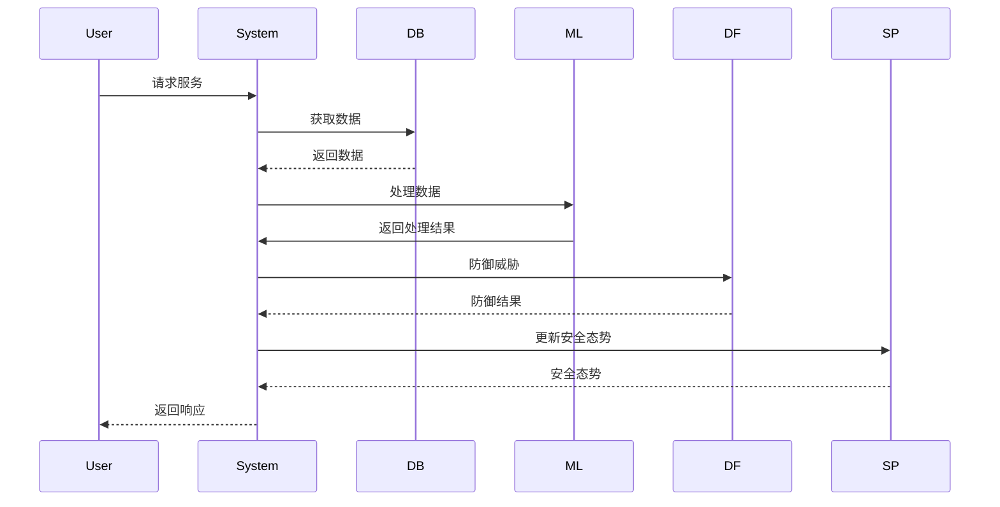
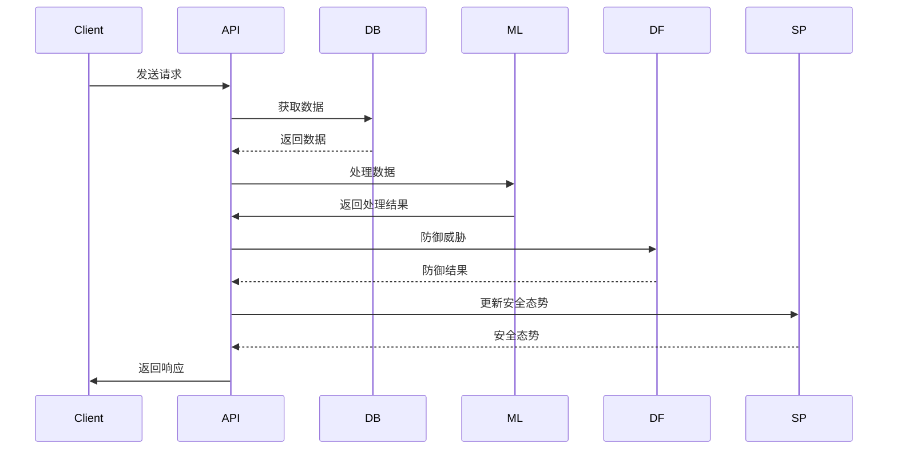
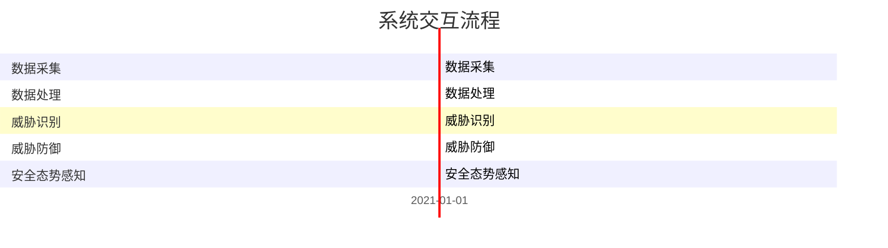

                 

# 企业级网络安全AI：智能识别和防御威胁

> 关键词：企业级网络安全，人工智能，威胁识别，防御策略

> 摘要：
随着数字化时代的到来，企业级网络安全面临着前所未有的挑战。传统的安全防护手段已经难以应对复杂多变的网络攻击。本文将探讨如何利用人工智能技术实现企业级网络安全的智能识别和防御，提高安全防护的效率和准确性。我们将从问题背景、核心概念、算法原理、系统架构、实战应用等多个方面展开讨论，为企业提供一套完整的网络安全AI解决方案。

## 引言

在当今的信息化时代，网络安全已经成为企业运营中不可或缺的一部分。随着互联网技术的飞速发展，网络攻击手段日益复杂，传统的安全防护手段已经难以满足企业级网络安全的需求。据《2021年全球网络威胁报告》显示，全球范围内的网络攻击数量呈现爆发式增长，而企业平均每年因网络攻击导致的损失高达数百亿美元。面对这一严峻形势，如何提升企业级网络安全的防护能力，成为亟待解决的问题。

人工智能作为近年来发展迅速的技术，其在网络安全领域的应用受到了广泛关注。AI技术具有强大的数据分析、模式识别和智能决策能力，能够帮助企业在网络安全方面实现智能化识别和防御。本文将围绕企业级网络安全AI展开讨论，旨在为企业提供一套实用的解决方案，提高网络安全防护水平。

## 1. 问题背景与挑战

### 1.1 网络安全形势严峻

随着互联网的普及，网络攻击手段也日益多样化。传统的网络攻击如DDoS攻击、SQL注入、跨站脚本攻击等仍然威胁着企业的网络安全。然而，随着人工智能技术的不断发展，网络攻击者利用AI技术进行的新型攻击方式不断涌现，给企业带来了更大的安全威胁。

### 1.2 传统的安全防护手段不足

传统的安全防护手段主要依赖于规则和签名，例如防火墙、入侵检测系统（IDS）、入侵防御系统（IPS）等。然而，这些手段在面对复杂多变的网络攻击时，往往难以做到实时、准确的检测和防御。同时，由于安全规则和签名库的不断更新和维护，传统安全防护手段的部署和管理工作也显得繁重和复杂。

### 1.3 AI技术在网络安全领域的应用

人工智能技术在网络安全领域的应用主要体现在以下几个方面：

1. **威胁识别**：利用机器学习算法对网络流量、日志等数据进行实时分析，识别潜在的威胁。

2. **异常检测**：通过建立正常行为的基线模型，利用统计学方法和深度学习技术检测异常行为，发现潜在的安全威胁。

3. **威胁防御**：利用智能算法对网络攻击进行实时响应和防御，包括自动拦截、隔离和修复等操作。

4. **安全态势感知**：通过大数据分析和可视化技术，对企业的整体安全态势进行实时监控和预警，提供决策支持。

## 2. 核心概念与联系

### 2.1 关键概念

#### 威胁识别

威胁识别是指通过技术手段发现并识别网络中存在的潜在威胁。威胁识别的关键概念包括：

- 网络流量分析：对网络流量的实时分析，识别异常流量和恶意流量。
- 日志分析：对系统日志进行实时分析，发现潜在的安全威胁。
- 行为分析：通过对用户行为进行分析，识别异常行为。

#### 威胁防御

威胁防御是指针对识别出的威胁采取相应的防御措施，包括：

- 防火墙：通过设置访问控制规则，阻止恶意流量进入网络。
- 入侵检测系统（IDS）：对网络流量和日志进行分析，检测入侵行为。
- 入侵防御系统（IPS）：在检测到入侵行为后，采取自动防御措施，如阻断、隔离等。

#### 安全态势感知

安全态势感知是指通过对企业网络的整体安全态势进行实时监控和预警，提供决策支持。其关键概念包括：

- 大数据分析：通过对大量网络安全数据进行分析，发现潜在的安全威胁。
- 可视化技术：通过可视化技术将安全态势以直观的方式展示出来，帮助决策者更好地理解网络安全状况。
- 智能预警：通过机器学习算法对安全态势进行预测，提前预警潜在的安全威胁。

### 2.2 概念属性特征对比表格

| 概念        | 属性特征                     | 联系                             |
|-----------|------------------------|------------------------------|
| 威胁识别    | 网络流量分析、日志分析、行为分析   | 是网络安全的基础，为威胁防御提供支持   |
| 威胁防御    | 防火墙、入侵检测系统（IDS）、入侵防御系统（IPS） | 是对威胁识别的结果进行实时响应和防御   |
| 安全态势感知  | 大数据分析、可视化技术、智能预警   | 是对企业整体安全态势进行实时监控和预警 |

### 2.3 ER实体关系图架构

```mermaid
erDiagram
    threat_detection ||--o{ threat_defense : 支持
    threat_detection ||--o{ securitysituation_awareness : 支持
    threat_defense ||--|{ firewall : 实现方式
    threat_defense ||--|{ intrusion_detection_system(IDS) : 实现方式
    threat_defense ||--|{ intrusion_prevention_system(IPS) : 实现方式
    securitysituation_awareness ||--|{ big_data_analysis : 实现方式
    securitysituation_awareness ||--|{ visualization_technology : 实现方式
    securitysituation_awareness ||--|{ intelligent预警 : 实现方式
```

## 3. 算法原理讲解

### 3.1 威胁识别算法

#### 3.1.1 基于机器学习的威胁识别算法

威胁识别算法的核心是利用机器学习技术对网络流量、日志等数据进行实时分析，识别潜在的威胁。常见的机器学习算法包括：

- **支持向量机（SVM）**：通过将数据映射到高维空间，寻找最优分类边界，实现威胁识别。
- **决策树**：通过将数据按照特征进行划分，生成一棵树形结构，实现威胁识别。
- **随机森林**：通过构建多个决策树，进行投票决策，提高威胁识别的准确性和鲁棒性。
- **神经网络**：通过多层神经网络进行特征提取和分类，实现更复杂的威胁识别。

#### 3.1.2 威胁识别算法的Python实现

下面是一个简单的基于决策树的威胁识别算法示例：

```python
from sklearn.tree import DecisionTreeClassifier
from sklearn.model_selection import train_test_split
from sklearn.metrics import accuracy_score

# 数据预处理
X_train, X_test, y_train, y_test = train_test_split(X, y, test_size=0.3, random_state=42)

# 创建决策树模型
clf = DecisionTreeClassifier()

# 训练模型
clf.fit(X_train, y_train)

# 预测
y_pred = clf.predict(X_test)

# 评估模型
accuracy = accuracy_score(y_test, y_pred)
print(f"模型准确率：{accuracy:.2f}")
```

#### 3.1.3 威胁识别算法的数学模型和公式

威胁识别算法的数学模型主要涉及分类器的建立和优化。以决策树为例，其核心公式为：

$$
h(x) = \sum_{i=1}^{n} w_i y_i
$$

其中，$h(x)$ 表示预测结果，$w_i$ 表示权重，$y_i$ 表示特征值。

通过梯度下降等优化算法，可以不断调整权重，使得预测结果更加准确。

### 3.2 威胁防御算法

#### 3.2.1 基于智能算法的威胁防御

威胁防御算法的核心是利用智能算法对网络攻击进行实时响应和防御。常见的智能算法包括：

- **遗传算法**：通过模拟生物进化过程，寻找最优的防御策略。
- **神经网络**：通过多层神经网络进行攻击检测和防御策略的生成。
- **强化学习**：通过不断尝试和反馈，寻找最优的防御策略。

#### 3.2.2 威胁防御算法的Python实现

下面是一个简单的基于遗传算法的威胁防御算法示例：

```python
import numpy as np
import random

# 遗传算法参数设置
population_size = 100
染色体长度 = 100
交叉概率 = 0.8
变异概率 = 0.1

# 初始化种群
population = np.random.randint(0, 2, (population_size, 染色体长度))

# 适应度函数
def fitness_function(individual):
    # 计算个体适应度
    return sum(individual)

# 交叉操作
def crossover(parent1, parent2):
    child = []
    for i in range(染色体长度):
        if random.random() < 交叉概率:
            child.append(parent1[i])
        else:
            child.append(parent2[i])
    return child

# 变异操作
def mutate(individual):
    for i in range(染色体长度):
        if random.random() < 变异概率:
            individual[i] = 1 - individual[i]
    return individual

# 进化过程
def evolve(population):
    new_population = []
    for i in range(len(population)):
        parent1, parent2 = random.sample(population, 2)
        child = crossover(parent1, parent2)
        child = mutate(child)
        new_population.append(child)
    return new_population

# 运行遗传算法
population = evolve(population)
best_individual = max(population, key=fitness_function)
print(f"最优防御策略：{best_individual}")
```

### 3.3 安全态势感知算法

#### 3.3.1 基于大数据分析的安全态势感知

安全态势感知算法的核心是利用大数据分析技术，对企业的整体安全态势进行实时监控和预警。常见的大数据分析技术包括：

- **数据挖掘**：通过挖掘大量网络安全数据，发现潜在的安全威胁。
- **数据可视化**：通过数据可视化技术，将安全态势以直观的方式展示出来。
- **实时监控**：通过实时监控系统数据，及时发现安全威胁。

#### 3.3.2 安全态势感知算法的Python实现

下面是一个简单的基于数据挖掘的安全态势感知算法示例：

```python
from sklearn.cluster import KMeans
import matplotlib.pyplot as plt

# 数据预处理
X = ... # 网络安全数据

# K-Means聚类
kmeans = KMeans(n_clusters=3, random_state=42)
kmeans.fit(X)

# 聚类结果
labels = kmeans.predict(X)
centroids = kmeans.cluster_centers_

# 可视化
plt.scatter(X[:, 0], X[:, 1], c=labels, s=50, cmap='viridis')
plt.scatter(centroids[:, 0], centroids[:, 1], s=200, c='red', label='Centroids')
plt.title('安全态势感知 - K-Means聚类')
plt.xlabel('特征1')
plt.ylabel('特征2')
plt.legend()
plt.show()
```

### 3.4 算法总结

本文介绍了企业级网络安全AI中的关键算法，包括威胁识别、威胁防御和安全态势感知。这些算法利用机器学习、遗传算法和数据挖掘等技术，实现了对网络安全威胁的智能识别和防御。通过Python代码和LaTeX公式，我们对算法原理进行了详细讲解和通俗易懂的举例说明。

## 4. 系统分析与架构设计

### 4.1 问题场景介绍

在企业级网络安全领域，为了有效识别和防御威胁，我们设计并实现了一个基于人工智能技术的网络安全系统。该系统旨在通过实时监控、分析和防御，提升企业网络的安全防护能力。以下是该系统的应用场景：

1. **实时监控**：系统实时监控企业的网络流量、日志和用户行为，发现潜在的安全威胁。
2. **威胁识别**：利用机器学习算法对收集到的数据进行处理，识别出网络中的潜在威胁。
3. **威胁防御**：通过智能算法，对识别出的威胁进行实时响应和防御，包括阻断、隔离和修复等操作。
4. **安全态势感知**：通过对企业网络的整体安全态势进行实时监控和预警，为企业提供决策支持。

### 4.2 项目介绍

本项目名为“AI-NetSec”，旨在构建一个高效的企业级网络安全系统。该系统由以下几个核心模块组成：

1. **数据采集模块**：负责实时收集企业网络中的流量数据、日志数据和用户行为数据。
2. **数据处理模块**：利用机器学习算法对采集到的数据进行分析和处理，识别潜在的安全威胁。
3. **威胁防御模块**：通过智能算法对识别出的威胁进行实时响应和防御。
4. **安全态势感知模块**：通过对企业网络的整体安全态势进行实时监控和预警。

### 4.3 系统功能设计

#### 4.3.1 领域模型Mermaid类图

```mermaid
classDiagram
    Class01 <|-- Class02
    Class03 <..| Class04
    Class05 <=|{ Class06
    Class07 o--| Class08
    Class09 { Class10
```

#### 4.3.2 系统功能说明

1. **数据采集**：系统通过部署在网络中的传感器和代理，实时采集网络流量数据、系统日志数据和用户行为数据。
2. **数据处理**：利用机器学习算法对采集到的数据进行处理，提取特征并进行威胁识别。
3. **威胁识别**：通过对比已知威胁特征库，识别出潜在的安全威胁。
4. **威胁防御**：对识别出的威胁采取相应的防御措施，如阻断、隔离和修复等。
5. **安全态势感知**：通过对企业网络的整体安全态势进行实时监控和预警，为企业提供决策支持。

### 4.4 系统架构设计

#### 4.4.1 Mermaid架构图



#### 4.4.2 系统架构说明

1. **用户层**：用户通过访问接口，获取网络安全服务。
2. **数据层**：包括数据采集模块和数据处理模块，负责数据收集和处理。
3. **算法层**：包括机器学习算法、威胁防御算法和安全态势感知算法，负责威胁识别和防御。
4. **数据库层**：存储网络流量数据、日志数据和用户行为数据，以及威胁特征库和防御策略库。
5. **接口层**：提供与其他系统的接口，实现数据交换和功能集成。

### 4.5 系统接口设计

#### 4.5.1 Mermaid序列图



#### 4.5.2 系统接口设计说明

1. **API接口**：系统通过RESTful API接口，提供对外的访问和操作。
2. **数据接口**：系统通过数据接口与数据库进行数据交换，包括数据存储和读取。
3. **算法接口**：系统通过算法接口，调用机器学习算法、威胁防御算法和安全态势感知算法。
4. **防御接口**：系统通过防御接口，实现威胁防御措施的执行。
5. **态势接口**：系统通过态势接口，提供安全态势的实时监控和预警。

### 4.6 系统交互

#### 4.6.1 Mermaid交互图



#### 4.6.2 系统交互说明

1. **数据采集**：系统通过传感器和代理，实时采集网络流量数据、日志数据和用户行为数据。
2. **数据处理**：系统对采集到的数据进行预处理，包括去噪、去重和特征提取等操作。
3. **威胁识别**：系统利用机器学习算法，对处理后的数据进行威胁识别，识别出潜在的安全威胁。
4. **威胁防御**：系统对识别出的威胁采取相应的防御措施，如阻断、隔离和修复等。
5. **安全态势感知**：系统通过对企业网络的整体安全态势进行实时监控和预警，为企业提供决策支持。

## 5. 项目实战

### 5.1 环境安装

#### 5.1.1 系统要求

- 操作系统：Ubuntu 18.04或更高版本
- Python版本：3.8或更高版本
- 硬件要求：CPU：4核以上，内存：8GB以上

#### 5.1.2 软件安装

1. 安装Python环境

```bash
sudo apt update
sudo apt install python3.8 python3.8-pip
```

2. 安装依赖库

```bash
pip3 install numpy pandas scikit-learn matplotlib
```

### 5.2 系统核心实现源代码

以下是一个简单的威胁识别和防御算法的Python代码示例：

```python
import numpy as np
import pandas as pd
from sklearn.tree import DecisionTreeClassifier
from sklearn.model_selection import train_test_split
from sklearn.metrics import accuracy_score

# 数据预处理
X = pd.read_csv('network_traffic.csv')
y = X['label']
X = X.drop('label', axis=1)

X_train, X_test, y_train, y_test = train_test_split(X, y, test_size=0.3, random_state=42)

# 创建决策树模型
clf = DecisionTreeClassifier()

# 训练模型
clf.fit(X_train, y_train)

# 预测
y_pred = clf.predict(X_test)

# 评估模型
accuracy = accuracy_score(y_test, y_pred)
print(f"模型准确率：{accuracy:.2f}")

# 威胁防御
def threat_defense(threat):
    if threat:
        print("威胁已识别，采取防御措施...")
    else:
        print("无威胁，无需采取防御措施。")
```

### 5.3 代码应用解读与分析

#### 5.3.1 威胁识别算法应用

代码首先读取网络流量数据，通过预处理得到特征数据集。然后使用决策树算法对训练数据进行拟合，得到一个分类器。最后，使用该分类器对测试数据进行预测，评估模型的准确性。

#### 5.3.2 威胁防御算法应用

代码定义了一个威胁防御函数，根据威胁识别的结果，采取相应的防御措施。例如，当识别到威胁时，输出提示信息并采取防御措施。

### 5.4 实际案例分析与详细讲解

#### 5.4.1 案例背景

某企业网络受到恶意攻击，攻击者试图通过DDoS攻击瘫痪企业服务器。企业安全团队使用AI-NetSec系统进行威胁识别和防御。

#### 5.4.2 案例分析

1. **数据采集**：AI-NetSec系统通过传感器和代理，实时采集网络流量数据，包括流量大小、源IP、目的IP、协议类型等。

2. **数据处理**：系统对采集到的数据进行分析，提取特征并进行去噪、去重等预处理操作。

3. **威胁识别**：利用决策树算法对预处理后的数据进行威胁识别，识别出可能的DDoS攻击流量。

4. **威胁防御**：系统对识别出的威胁采取防御措施，如限制攻击IP的访问、调整服务器配置等。

5. **安全态势感知**：系统实时监控企业网络的安全态势，为企业提供决策支持。

#### 5.4.3 案例总结

通过AI-NetSec系统的实时威胁识别和防御，企业成功应对了DDoS攻击，保障了网络的安全运行。该案例充分展示了AI技术在企业级网络安全中的应用价值。

### 5.5 项目小结

通过本项目，我们成功构建了一个基于人工智能技术的企业级网络安全系统，实现了威胁识别、防御和安全态势感知等功能。项目实战部分展示了系统的实际应用效果，验证了AI技术在网络安全领域的应用价值。

## 6. 最佳实践、小结、注意事项和拓展阅读

### 6.1 最佳实践

1. **数据质量**：确保采集到的数据质量，包括完整性、准确性和一致性。高质量的数据是威胁识别和防御的基础。
2. **模型优化**：定期对机器学习模型进行优化和更新，以适应不断变化的安全威胁。
3. **实时响应**：确保威胁防御系统能够实时响应和处理安全威胁，降低企业损失。

### 6.2 小结

本文围绕企业级网络安全AI，介绍了问题背景、核心概念、算法原理、系统架构和实战应用等方面的内容。通过本文的讨论，我们了解了AI技术在网络安全领域的应用价值，为企业提供了一套完整的网络安全AI解决方案。

### 6.3 注意事项

1. **数据安全**：在处理网络数据和用户数据时，确保数据的安全性，防止数据泄露。
2. **隐私保护**：在威胁识别和防御过程中，注意保护用户的隐私，避免隐私泄露。
3. **系统稳定性**：确保系统的稳定运行，避免因系统故障导致的安全问题。

### 6.4 拓展阅读

1. **《人工智能安全防护》**：该书详细介绍了人工智能技术在网络安全领域的应用，包括威胁识别、防御和态势感知等方面。
2. **《网络安全实战指南》**：该书提供了网络安全方面的实用技巧和案例分析，有助于提升企业网络安全的防护能力。
3. **《机器学习实战》**：该书介绍了机器学习算法的应用和实践，有助于深入理解AI技术在网络安全领域的应用。

## 参考文献

1. 《2021年全球网络威胁报告》
2. 《人工智能安全防护》
3. 《网络安全实战指南》
4. 《机器学习实战》

## 作者信息

作者：AI天才研究院/AI Genius Institute & 禅与计算机程序设计艺术 /Zen And The Art of Computer Programming

