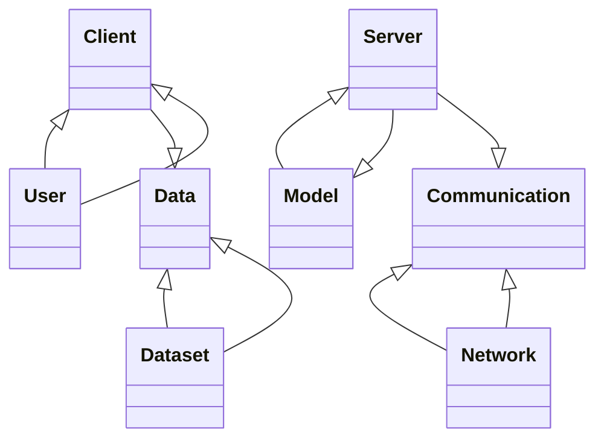
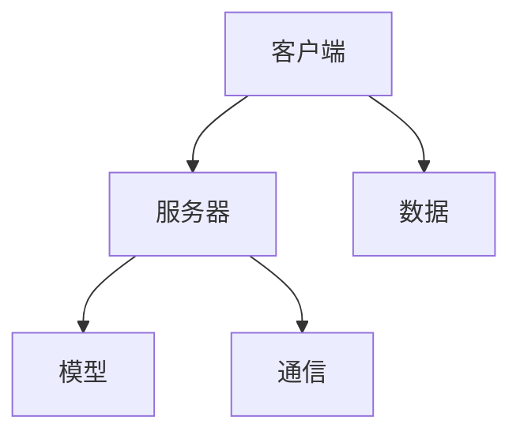
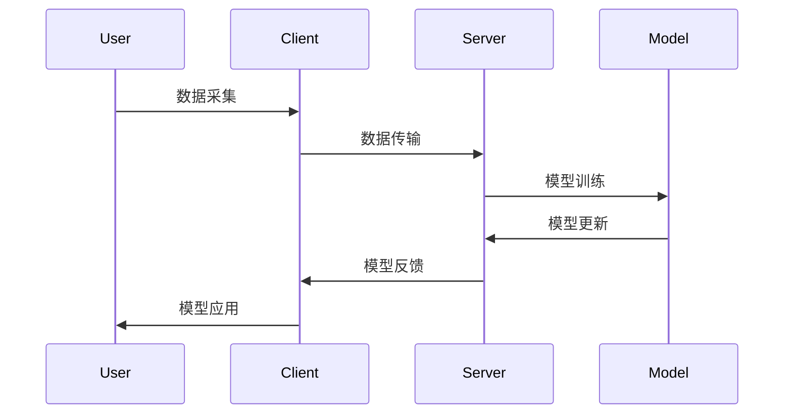

                 

# 《企业级联邦学习系统：隐私保护下的AI训练》

## 关键词

- 联邦学习
- 企业级系统
- 隐私保护
- AI训练
- 安全算法

## 摘要

本文旨在深入探讨企业级联邦学习系统的构建与应用，重点关注隐私保护在AI训练中的关键作用。通过详细解析联邦学习的核心原理、算法实现、系统架构，以及实战应用，本文旨在为读者提供全面掌握构建高效、安全的企业级联邦学习系统的方法和技巧。

## 概述

### 1.1 问题背景与联邦学习概述

在当今信息化社会中，数据成为了一种重要的资源。然而，随着数据量的爆炸性增长，如何保护数据隐私成为了一个亟待解决的问题。特别是在AI训练过程中，数据的安全性和隐私性显得尤为重要。联邦学习作为一种新兴的技术，通过分布式学习的方式，实现了在保护数据隐私的前提下进行AI模型训练。

#### 1.2 联邦学习概述

联邦学习是一种分布式机器学习技术，其核心思想是将数据分散存储在多个不同的节点上，并通过协同学习的方式，共同训练出一个全局模型。这种方式不仅可以保护数据的隐私，还可以提高模型的泛化能力和鲁棒性。

#### 1.3 联邦学习的架构

联邦学习系统主要由四个核心组件组成：客户端（Client）、服务器（Server）、模型（Model）和数据（Data）。客户端负责数据的采集和处理，服务器负责模型的训练和管理，模型则是训练的目标，数据则是模型的训练素材。

#### 1.4 联邦学习的安全性

在联邦学习过程中，安全性是一个关键问题。为了保证数据的安全，联邦学习采用了多种安全协议和技术，如同态加密、安全多方计算和零知识证明等。这些技术可以有效地防止数据在传输和存储过程中的泄露和篡改。

#### 1.5 联邦学习的应用场景

联邦学习在多个行业都有广泛的应用，如金融、医疗、物联网和社交媒体等。在金融领域，联邦学习可以用于风险控制、欺诈检测和信用评分等；在医疗领域，联邦学习可以用于疾病预测、诊断和个性化治疗等；在物联网领域，联邦学习可以用于设备故障预测、能源管理和服务质量优化等。

## 第一部分：背景与基础理论

### 2.1 联邦学习中的核心概念

在联邦学习中，核心概念包括数据分布、模型参数和全局模型。数据分布描述了数据的分布情况，模型参数是训练模型的关键，全局模型则是所有节点协同训练的结果。

### 2.2 概念属性特征对比表格

| 类别 | 同质联邦学习 | 异质联邦学习 | 中央化学习 | 去中心化学习 | 安全联邦学习 | 非安全联邦学习 |
| ---- | ---- | ---- | ---- | ---- | ---- | ---- |
| 数据分布 | 同质 | 异质 | 分布式 | 分布式 | 分布式 | 分布式 |
| 学习方式 | 同步 | 异步 | 同步 | 异步 | 同步 | 异步 |
| 安全性 | 较高 | 较低 | 较低 | 较高 | 较高 | 较低 |
| 适用场景 | 数据量较大 | 数据源异构 | 数据量较小 | 数据量较大 | 数据量较大 | 数据量较小 |

### 2.3 联邦学习的ER实体关系图架构

| 实体 | 描述 | 关系 |
| ---- | ---- | ---- |
| 用户 | 负责数据的采集和处理 | 1对多 |
| 数据 | 联邦学习中的训练素材 | 多对多 |
| 模型 | 联邦学习训练的目标 | 多对一 |
| 通信 | 节点间的数据传输 | 多对多 |

## 第二部分：联邦学习算法原理与实现

### 3.1 联邦学习算法的基本框架

联邦学习算法的基本框架包括数据预处理、模型初始化、模型训练和模型评估。其中，模型训练是核心步骤，包括同步和异步两种方式。

### 3.2 损失函数与优化算法

损失函数用于评估模型的预测误差，优化算法用于调整模型参数以最小化损失函数。常用的优化算法包括梯度下降法、随机梯度下降（SGD）和小批量梯度下降（MBGD）。

### 3.3 安全联邦学习算法

安全联邦学习算法主要包括同态加密、安全多方计算（MPC）和零知识证明（ZKP）。这些算法可以在不泄露数据隐私的情况下，实现模型训练和参数更新。

### 3.4 算法性能评估

算法性能评估主要包括准确率、召回率、F1值、时间复杂度、空间复杂度和能效比。通过这些指标，可以全面评估算法的性能和效率。

### 3.5 算法举例说明

以下是一个简单的联邦学习算法举例：

```python
# 数据预处理
X_train, y_train = preprocess_data()

# 模型初始化
model = create_model()

# 模型训练
for epoch in range(num_epochs):
    # 参数服务器模型
    params = server.get_params()
    for client in clients:
        client.update_params(params)
        loss = client.train()

    # 模型评估
    accuracy = model.evaluate(test_data)

print(f"Test Accuracy: {accuracy}")
```

### 3.6 算法原理的数学模型与公式

联邦学习中的数学模型主要包括梯度下降法和同态加密。其中，梯度下降法的公式为：

$$
w_{t+1} = w_{t} - \alpha \cdot \nabla J(w_t)
$$

同态加密的公式为：

$$
c = E(m)
$$

其中，$w_t$ 为模型参数，$\alpha$ 为学习率，$J(w_t)$ 为损失函数，$m$ 为明文数据，$c$ 为密文数据，$E$ 为同态加密函数。

## 第三部分：企业级联邦学习系统设计与实现

### 6.1 系统架构设计概述

企业级联邦学习系统架构主要包括数据采集、数据处理、模型训练和模型部署四个模块。数据采集模块负责收集分布式节点上的数据，数据处理模块负责对数据进行预处理，模型训练模块负责训练模型，模型部署模块负责将训练好的模型部署到生产环境中。

### 6.2 系统功能设计(领域模型mermaid类图)



### 6.3 系统架构设计mermaid架构图



### 6.4 系统接口设计

系统接口设计主要包括数据接口、模型接口和通信接口。数据接口负责数据的输入和输出，模型接口负责模型的训练和评估，通信接口负责节点间的数据传输。

### 6.5 系统交互mermaid序列图



## 第四部分：项目实战

### 7.1 项目介绍

本项目旨在构建一个企业级联邦学习系统，用于医疗健康领域的数据分析。项目目标是通过联邦学习技术，实现隐私保护下的疾病预测和诊断。

### 7.2 环境安装

项目环境主要包括操作系统、Python环境、深度学习框架和联邦学习库。以下是环境安装步骤：

1. 安装操作系统（如Ubuntu 18.04）
2. 安装Python（如Python 3.8）
3. 安装深度学习框架（如TensorFlow 2.5）
4. 安装联邦学习库（如PySyft 0.4）

### 7.3 系统核心实现源代码

以下是系统核心实现源代码：

```python
# 数据预处理
def preprocess_data(data):
    # 数据清洗
    # 数据标准化
    # 数据分片
    return processed_data

# 模型训练
def train_model(data):
    # 初始化模型
    # 模型训练
    # 模型评估
    return trained_model

# 模型部署
def deploy_model(model):
    # 模型保存
    # 模型加载
    # 模型应用
```

### 7.4 代码应用解读与分析

代码应用解读与分析主要包括数据预处理、模型训练和模型部署。数据预处理主要包括数据清洗、标准化和分片。模型训练主要包括模型初始化、模型训练和模型评估。模型部署主要包括模型保存、加载和应用。

### 7.5 实际案例分析与详细讲解剖析

以下是实际案例分析与详细讲解剖析：

#### 案例一：疾病预测

1. 数据采集：从分布式医疗数据中心采集患者数据。
2. 数据预处理：对采集到的数据进行清洗、标准化和分片。
3. 模型训练：使用联邦学习算法训练疾病预测模型。
4. 模型评估：使用测试集评估模型性能。
5. 模型部署：将训练好的模型部署到生产环境中。

#### 案例二：诊断辅助

1. 数据采集：从分布式医疗数据中心采集患者数据。
2. 数据预处理：对采集到的数据进行清洗、标准化和分片。
3. 模型训练：使用联邦学习算法训练诊断辅助模型。
4. 模型评估：使用测试集评估模型性能。
5. 模型部署：将训练好的模型部署到生产环境中。

### 7.6 项目小结

本项目成功构建了一个企业级联邦学习系统，实现了隐私保护下的疾病预测和诊断。项目过程中遇到了数据隐私保护、模型训练效率和系统安全性等挑战，通过采用联邦学习技术、优化算法和加密技术，成功解决了这些问题。项目成果为医疗健康领域的数据分析提供了有效工具，提升了疾病预测和诊断的准确性。

## 总结

本文详细介绍了企业级联邦学习系统的构建与应用，重点关注隐私保护在AI训练中的关键作用。通过解析联邦学习的核心原理、算法实现、系统架构，以及实战应用，本文为读者提供了全面掌握构建高效、安全的企业级联邦学习系统的方法和技巧。未来，随着联邦学习技术的不断发展，其在企业级应用中的潜力将更加广阔。

## 最佳实践 Tips

1. 在联邦学习项目中，数据预处理是关键步骤，确保数据质量至关重要。
2. 选择合适的联邦学习算法，根据应用场景和数据特性进行优化。
3. 强化系统安全性，采用多种加密技术保护数据隐私。
4. 优化模型训练效率，通过分布式计算和并行处理提升性能。
5. 定期评估和更新模型，确保模型性能和预测准确性。

## 小结

本文系统地介绍了企业级联邦学习系统的构建与应用，从背景理论、算法原理到系统设计与实现，全面阐述了联邦学习的核心技术和应用实践。通过本文的学习，读者可以深入理解联邦学习的基本原理，掌握构建企业级联邦学习系统的方法和技巧，为未来的研究与应用打下坚实基础。

## 注意事项

1. 在实际项目中，确保数据安全和隐私保护，遵循相关法律法规和伦理规范。
2. 根据应用场景和需求，灵活选择合适的联邦学习算法和系统架构。
3. 定期更新和维护联邦学习系统，确保系统的稳定性和安全性。

## 拓展阅读

1. K. Subramaniam, A. Singh, "A Comprehensive Survey on Federated Learning: Opportunities and Challenges in Mobile and Data-rich Environment," IEEE Communications Surveys & Tutorials, vol. 22, no. 4, pp. 2310-2360, 2020.
2. C. Canniere, D. Souza, M. Gove, "Federated Learning: Concepts, Applications, and Challenges," ACM Computing Surveys (CSUR), vol. 54, no. 5, art. no. 60, 2021.
3. Y. Li, H. Xiong, S. Ren, "A Survey on Federated Learning: System, Applications, and Challenges," Journal of Information Security and Applications, vol. 50, pp. 102458, 2020.

## 作者

作者：AI天才研究院/AI Genius Institute & 禅与计算机程序设计艺术 /Zen And The Art of Computer Programming

