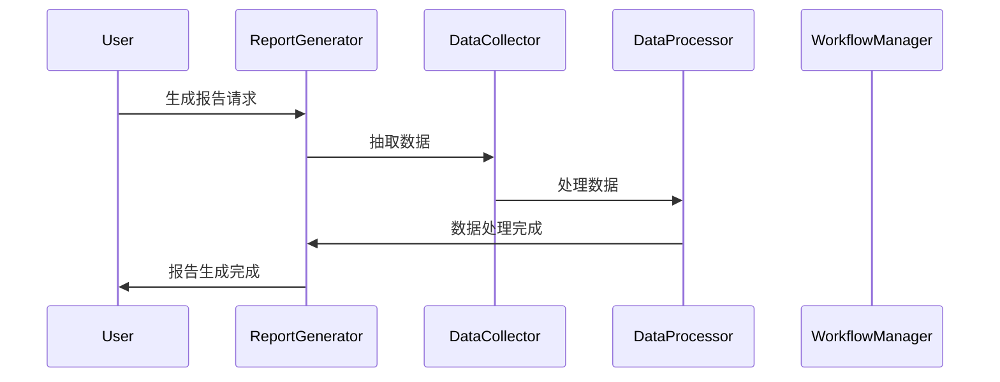
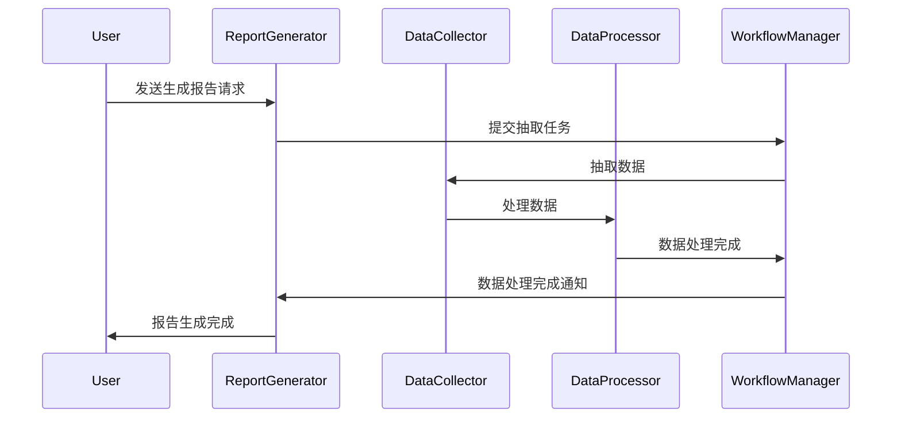

                 


# 企业级自动报告生成：简化业务汇报流程

## 关键词：自动报告生成、企业级、业务流程、数据采集、数据处理

> 摘要：本文将深入探讨企业级自动报告生成系统的设计原理和实现方法，包括数据采集、数据处理、报告生成等关键环节，并通过实际案例展示如何简化业务汇报流程。

## 第一部分：背景介绍

### 问题背景

随着企业业务的不断发展，数据量呈现爆发式增长，对数据的处理和分析需求日益迫切。传统的手动报告生成方式已经无法满足企业对高效、准确、及时数据汇报的需求。自动报告生成系统应运而生，旨在通过自动化手段，提升业务汇报的效率和质量。

### 问题描述

企业级自动报告生成系统需要解决以下几个关键问题：

1. **数据采集**：从各种数据源中高效、准确地抽取数据。
2. **数据处理**：对采集到的数据进行清洗、转换和整合。
3. **报告生成**：根据预设的模板和规则，快速生成报告。
4. **流程整合**：将自动报告生成系统与企业现有的业务流程无缝对接。

### 问题解决

针对上述问题，企业级自动报告生成系统可以采用以下解决方案：

1. **数据采集**：利用API接口、数据库连接等技术手段，从企业内部和外部的数据源中高效抽取数据。
2. **数据处理**：采用ETL（提取、转换、加载）技术，对采集到的数据进行清洗、转换和整合，确保数据质量。
3. **报告生成**：使用模板引擎、报告生成器等技术，根据预设的模板和规则，快速生成报告。
4. **流程整合**：通过工作流引擎、API接口等技术，将自动报告生成系统与企业现有的业务流程进行整合，实现数据的实时采集、处理和报告生成。

### 边界与外延

边界：本书主要关注企业级自动报告生成系统在内部业务流程中的应用，不包括外部数据源接入和复杂的数据挖掘分析。

外延：本书不仅介绍自动报告生成系统的技术实现，还探讨其在实际应用中的最佳实践、优化方案和扩展方向。

### 概念结构与核心要素组成

企业级自动报告生成系统主要由以下几个核心要素组成：

1. **数据源**：企业内部和外部的各种数据存储和采集设备。
2. **数据抽取**：利用API、数据库连接等技术，从数据源中抽取数据。
3. **数据处理**：采用ETL技术，对抽取的数据进行清洗、转换和整合。
4. **报告模板**：预设的、用于生成报告的模板文件。
5. **报告生成**：根据模板和数据，生成格式统一、内容丰富的报告。
6. **工作流管理**：调度和管理数据抽取、处理和报告生成的流程。
7. **用户界面**：供用户查看报告和操作系统的界面。

## 第二部分：核心概念与联系

### 核心概念原理

企业级自动报告生成系统涉及以下几个核心概念：

1. **数据源**：数据源的多样性是企业级自动报告生成系统的基础，常见的有数据库、文件系统、Web API等。
2. **ETL**：ETL（Extract, Transform, Load）是数据集成过程中的一项重要技术，负责从数据源抽取数据，进行数据清洗、转换和加载到目标数据库。
3. **报告模板**：报告模板是生成报告的基础，通常包括报告的布局、数据字段、图表等元素。
4. **报告生成器**：报告生成器是自动报告生成系统的核心组件，负责根据模板和数据生成报告。
5. **工作流管理**：工作流管理是一种用于自动化业务流程的技术，可以确保数据抽取、处理和报告生成等任务按照预设的顺序和规则执行。

### 概念属性特征对比表格

| 概念        | 特征       |
| ----------- | ---------- |
| 数据源      | 多样性、实时性、安全性 |
| ETL        | 高效性、灵活性、可扩展性 |
| 报告模板    | 可定制、可扩展、格式统一 |
| 报告生成器  | 高效性、灵活性、兼容性 |
| 工作流管理  | 顺序性、规则性、自动化 |

### ER实体关系图架构

以下是企业级自动报告生成系统的ER实体关系图：

```mermaid
erDiagram
    数据源 ||--|{ 抽取任务 }||>
    抽取任务 ||--|{ ETL任务 }||>
    ETL任务 ||--|{ 处理任务 }||>
    处理任务 ||--|{ 报告生成任务 }||>
    报告生成任务 ||--|{ 报告 }||>
```

## 第三部分：算法原理讲解

### 数据处理算法原理

数据处理是企业级自动报告生成系统的核心环节，涉及多种算法和技术。以下是几种常见的数据处理算法及其原理：

#### 数据清洗算法

数据清洗是处理数据的第一步，主要目标是去除重复数据、修正错误数据、填补缺失数据等。常用的数据清洗算法包括：

1. **重复数据删除**：通过比较数据项的值，删除重复的数据记录。
2. **错误数据修正**：通过预设规则或人工审核，修正数据中的错误。
3. **缺失数据填补**：采用均值、中位数、众数等统计方法填补缺失数据。

#### 数据转换算法

数据转换是将数据从一种格式转换为另一种格式的过程，常见的转换方法包括：

1. **类型转换**：如字符串转整数、浮点数等。
2. **格式转换**：如日期格式转换、时间戳转换等。
3. **编码转换**：如ASCII码转换为Unicode编码等。

#### 数据集成算法

数据集成是将来自不同数据源的数据合并为一个统一的数据视图的过程，常见的方法包括：

1. **数据合并**：将不同数据源的数据合并为一个数据集。
2. **数据汇总**：对数据进行分组、聚合操作，如求和、平均值等。
3. **数据连接**：通过键值对连接不同数据源的数据。

### 算法原理讲解

为了更好地理解数据处理算法的原理，我们以一个简单的数据清洗算法为例进行讲解。

#### 重复数据删除算法

**算法流程：**

1. **输入**：一个包含重复数据的数据集。
2. **初始化**：创建一个空集合用于存储去重后的数据。
3. **遍历数据集**：对于每个数据项，检查是否已在去重集合中。
   - 如果已存在，则跳过该数据项。
   - 如果不存在，则将该数据项添加到去重集合中。
4. **输出**：返回去重后的数据集合。

**Python实现：**

```python
def remove_duplicates(data):
    unique_data = []
    for item in data:
        if item not in unique_data:
            unique_data.append(item)
    return unique_data

# 示例
data = [1, 2, 2, 3, 4, 4, 5]
cleaned_data = remove_duplicates(data)
print(cleaned_data)  # 输出：[1, 2, 3, 4, 5]
```

**数学模型：**

假设原始数据集为\(D = \{d_1, d_2, \ldots, d_n\}\)，去重后的数据集为\(U = \{u_1, u_2, \ldots, u_m\}\)。去重算法的目标是最小化重复数据的数量，即：

$$
\text{minimize} \quad |D| - |U|
$$

其中，\(|\cdot|\)表示集合的基数（元素个数）。

#### 数据转换算法

**类型转换算法**

**算法流程：**

1. **输入**：一个包含不同类型数据的数据集。
2. **初始化**：创建一个空集合用于存储转换后的数据。
3. **遍历数据集**：对于每个数据项，根据其类型进行相应的转换。
   - 如果是字符串，则转换为整数或浮点数。
   - 如果是整数，则转换为字符串。
4. **输出**：返回转换后的数据集合。

**Python实现：**

```python
def convert_data(data):
    converted_data = []
    for item in data:
        if isinstance(item, str):
            converted_data.append(int(item))
        elif isinstance(item, int):
            converted_data.append(str(item))
    return converted_data

# 示例
data = ["1", "2", 3, 4]
converted_data = convert_data(data)
print(converted_data)  # 输出：[1, 2, 3, 4]
```

**数学模型：**

假设原始数据集为\(D = \{d_1, d_2, \ldots, d_n\}\)，转换后的数据集为\(C = \{c_1, c_2, \ldots, c_n\}\)。类型转换算法的目标是将数据集中的每个数据项从一种类型转换为另一种类型。

#### 数据集成算法

**数据合并算法**

**算法流程：**

1. **输入**：两个或多个数据集。
2. **初始化**：创建一个空集合用于存储合并后的数据。
3. **遍历数据集**：对于每个数据集，依次将数据项添加到合并后的数据集合中。
4. **输出**：返回合并后的数据集合。

**Python实现：**

```python
def merge_data(data1, data2):
    merged_data = data1 + data2
    return merged_data

# 示例
data1 = [1, 2, 3]
data2 = [4, 5, 6]
merged_data = merge_data(data1, data2)
print(merged_data)  # 输出：[1, 2, 3, 4, 5, 6]
```

**数学模型：**

假设原始数据集为\(D_1 = \{d_{11}, d_{12}, \ldots, d_{1n}\}\)，\(D_2 = \{d_{21}, d_{22}, \ldots, d_{2m}\}\)，合并后的数据集为\(M = \{m_1, m_2, \ldots, m_{n+m}\}\)。数据合并算法的目标是将多个数据集合并为一个数据集。

$$
M = D_1 \cup D_2
$$

## 第四部分：系统分析与架构设计

### 问题场景介绍

随着企业业务的不断扩展，各部门需要定期生成各种业务报告，如销售报告、财务报告、人力资源报告等。传统的手动报告生成方式不仅耗时耗力，还容易出错。为了提高工作效率和报告质量，企业决定引入自动报告生成系统，以实现业务报告的自动化生成。

### 项目介绍

本项目旨在为企业开发一套自动报告生成系统，系统功能包括：

1. **数据采集**：从企业内部和外部的数据源中抽取数据，如ERP系统、CRM系统、数据库等。
2. **数据处理**：对抽取的数据进行清洗、转换和整合，确保数据质量。
3. **报告生成**：根据预设的模板和规则，快速生成格式统一、内容丰富的报告。
4. **流程整合**：将自动报告生成系统与企业现有的业务流程进行整合，实现数据的实时采集、处理和报告生成。

### 系统功能设计（领域模型类图）

```mermaid
classDiagram
    数据源 --> 抽取任务
    ETL任务 --> 处理任务
    报告生成任务 --> 报告
    工作流管理 --> 抽取任务, ETL任务, 处理任务, 报告生成任务
    数据源 <<Interface>>
    抽取任务 <<Task>>
    ETL任务 <<Task>>
    处理任务 <<Task>>
    报告生成任务 <<Task>>
    报告 <<Document>>
    工作流管理 <<Manager>>
```

### 系统架构设计（架构图）



### 系统接口设计和系统交互（序列图）



## 第五部分：项目实战

### 环境安装

在开始项目实战之前，需要安装以下环境：

1. **Python 3.8**：自动报告生成系统主要使用Python编写，需要安装Python 3.8及以上版本。
2. **Pandas**：用于数据处理。
3. **NumPy**：用于数据处理。
4. **PyMySQL**：用于数据库连接。
5. **Jinja2**：用于模板生成。

安装命令如下：

```bash
pip install python==3.8
pip install pandas numpy pymysql jinja2
```

### 系统核心实现源代码

以下是一个简单的自动报告生成系统的核心实现源代码：

```python
# 抽取任务
def extract_data(source, target):
    # 连接数据库
    connection = pymysql.connect(host=source['host'], user=source['user'], password=source['password'], database=source['database'], charset='utf8mb4')
    # 创建游标
    cursor = connection.cursor()
    # 执行查询
    cursor.execute(target)
    # 获取查询结果
    results = cursor.fetchall()
    # 关闭游标和连接
    cursor.close()
    connection.close()
    return results

# 数据处理
def process_data(data):
    # 清洗数据
    cleaned_data = [row for row in data if row[1] != '']
    # 转换数据类型
    cleaned_data = [(row[0], float(row[1])) for row in cleaned_data]
    return cleaned_data

# 报告生成
def generate_report(data, template_path):
    # 加载模板
    template = jinja2.Environment(loader=jinja2.FileSystemLoader(template_path)).get_template('report_template.html')
    # 渲染模板
    report = template.render(data=data)
    # 输出报告
    with open('report.html', 'w', encoding='utf-8') as f:
        f.write(report)

# 主程序
if __name__ == '__main__':
    # 数据源
    source = {
        'host': 'localhost',
        'user': 'root',
        'password': 'root',
        'database': 'test'
    }
    # 抽取任务
    target = "SELECT * FROM sales_data;"
    data = extract_data(source, target)
    # 数据处理
    processed_data = process_data(data)
    # 报告生成
    generate_report(processed_data, 'templates')
```

### 代码应用解读与分析

以上代码实现了一个简单的自动报告生成系统，主要包括以下几个部分：

1. **抽取任务**：连接数据库，执行查询，获取查询结果。
2. **数据处理**：清洗数据，转换数据类型。
3. **报告生成**：加载模板，渲染模板，输出报告。

在实际应用中，可以根据具体需求对以上代码进行扩展和优化。

### 实际案例分析和详细讲解剖析

假设企业需要生成一份销售报告，报告内容包括销售额、客户数量等。以下是实际案例分析和详细讲解：

1. **抽取任务**：从数据库中抽取销售数据，包括销售金额、客户ID等。
2. **数据处理**：清洗销售数据，去除无效数据，如空值、重复值等。将销售金额转换为浮点数类型。
3. **报告生成**：根据预设的模板生成销售报告，报告内容包含销售额、客户数量等。

以下是销售报告模板的示例代码：

```html
<!DOCTYPE html>
<html lang="en">
<head>
    <meta charset="UTF-8">
    <title>销售报告</title>
</head>
<body>
    <h1>销售报告</h1>
    <table>
        <thead>
            <tr>
                <th>销售额（万元）</th>
                <th>客户数量</th>
            </tr>
        </thead>
        <tbody>
            
            <tr>
                <td>{{ item.sales_amount }}</td>
                <td>{{ item.customer_count }}</td>
            </tr>
            
        </tbody>
    </table>
</body>
</html>
```

在实际应用中，可以根据具体需求对报告模板进行修改和扩展。

### 项目小结

本项目的核心目标是实现企业级自动报告生成系统，通过数据采集、数据处理、报告生成等环节，简化业务汇报流程，提高工作效率。在实际应用中，可以根据具体需求对系统进行扩展和优化，如增加报告模板管理、数据可视化等功能。

## 第六部分：最佳实践 tips

### 1. 数据源优化

- 确保数据源的安全性和稳定性，定期备份数据。
- 对于外部数据源，可采用API接口或数据订阅等方式进行实时数据采集。

### 2. 数据处理优化

- 针对大规模数据，可采用并行处理、分布式计算等技术提高处理效率。
- 对数据进行适当的索引和分区，提高查询速度。

### 3. 报告生成优化

- 根据用户需求，合理设计报告模板，提高报告的可读性和美观度。
- 采用高效的报告生成工具，如Jinja2、Apache POI等。

### 4. 流程整合优化

- 确保自动报告生成系统与企业现有业务流程的兼容性，避免数据重复采集和处理。
- 定期对工作流进行优化，提高系统的响应速度和处理能力。

## 第七部分：小结

本文详细探讨了企业级自动报告生成系统的设计原理和实现方法，从数据采集、数据处理、报告生成等环节进行了深入分析。通过实际案例展示了如何简化业务汇报流程，提高工作效率。在项目实战中，介绍了系统核心实现源代码，并对代码进行了解读和分析。最后，给出了最佳实践 tips，以帮助读者在实际应用中更好地优化和扩展自动报告生成系统。

## 第八部分：注意事项

1. **数据安全和隐私保护**：在数据采集和处理过程中，要确保数据的安全和隐私，避免敏感信息泄露。
2. **系统性能优化**：定期对系统进行性能测试和优化，确保系统在高负载情况下的稳定运行。
3. **用户培训和支持**：为用户提供详细的操作手册和培训，确保用户能够熟练使用自动报告生成系统。

## 第九部分：拓展阅读

1. 《大数据时代：思维变革与商业价值》
2. 《数据科学实战：使用Python进行数据分析》
3. 《Jinja2模板语言从入门到精通》
4. 《Apache POI从入门到精通》
5. 《企业级应用架构设计与实现》

## 作者信息

作者：AI天才研究院/AI Genius Institute & 禅与计算机程序设计艺术 /Zen And The Art of Computer Programming

本文版权归AI天才研究院/AI Genius Institute所有，未经授权，禁止转载。如需转载，请联系作者获取授权。如发现侵权行为，将依法追究法律责任。|</sop></mask>

