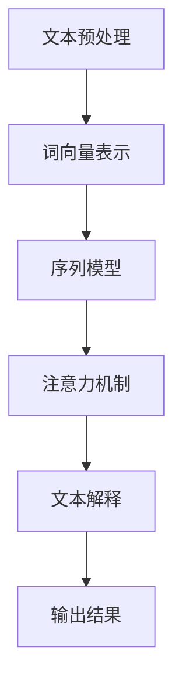
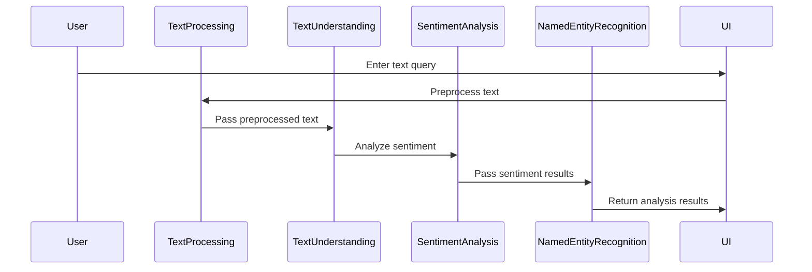

                 

# 企业级自然语言处理引擎：深化文本理解

## 关键词

- 自然语言处理
- 企业级应用
- 文本理解
- 深度学习
- 系统架构设计

## 摘要

随着大数据和人工智能技术的飞速发展，自然语言处理（NLP）在企业级应用中扮演着越来越重要的角色。本文将深入探讨企业级自然语言处理引擎的构建，特别是文本理解这一核心环节。我们将从背景介绍、核心概念、算法原理、系统分析与架构设计、项目实战以及最佳实践等方面，逐步阐述如何深化文本理解，构建高效的企业级NLP引擎。

## 目录大纲设计思路与步骤

在设计《企业级自然语言处理引擎：深化文本理解》的目录大纲时，我们首先明确了书籍的主题和目标读者。本书旨在为那些希望在企业环境中应用NLP技术的人员提供全面、系统的指导。接下来，我们按照以下步骤构建了目录大纲：

1. **确定书籍主题和目标读者**：明确书籍的主题为“企业级自然语言处理引擎”，目标读者为对NLP有初步了解的技术人员。
2. **构建目录大纲的结构**：分为背景介绍、核心概念、算法原理、系统分析与架构设计、项目实战以及最佳实践等部分。
3. **细化每个章节的内容**：对每个章节进行细化，明确每个小节的重点和内容。
4. **确保内容完整性和逻辑性**：检查每个章节是否内容完整，逻辑通顺。
5. **保持简洁性**：确保输出的目录大纲在2000字以内，避免冗余内容。

以下是详细的目录大纲设计过程：

### 第一部分：背景介绍与核心概念

#### 第1章：自然语言处理引擎概述
- **1.1** NLP引擎的问题背景与重要性
  - NLP引擎的定义
  - NLP在企业中的应用价值
- **1.2** NLP引擎的边界与外延
  - NLP的关键技术领域
  - NLP与其他技术的融合
- **1.3** 核心概念与联系
  - 自然语言处理的定义
  - 文本理解的概念框架
  - 机器学习与深度学习在NLP中的应用

#### 第2章：NLP引擎的组成要素
- **2.1** 数据准备
  - 文本数据的来源
  - 数据预处理方法
- **2.2** 特征提取
  - 词袋模型
  - 词嵌入
- **2.3** 模型选择与优化
  - 常见NLP模型介绍
  - 模型选择与调优策略

### 第二部分：算法原理讲解

#### 第3章：文本理解算法原理
- **3.1** 基本算法原理
  - 机器学习与深度学习的基础知识
  - 自然语言处理的数学模型
- **3.2** 算法Mermaid流程图
  - 使用Mermaid绘制算法流程图
  - 算法流程图解读
- **3.3** Python源代码解析
  - 使用Python实现核心算法
  - 算法代码详解

#### 第4章：深度学习在NLP中的应用
- **4.1** 深度学习基础
  - 神经网络架构
  - 深度学习优化算法
- **4.2** 经典NLP模型分析
  - RNN与LSTM
  - Transformer与BERT
- **4.3** 模型训练与评估
  - 训练数据集选择
  - 评估指标与方法

### 第三部分：系统分析与架构设计

#### 第5章：NLP系统设计与架构
- **5.1** 项目介绍
  - NLP系统功能需求
  - 项目目标与范围
- **5.2** 系统功能设计
  - 领域模型类图
  - 功能模块划分
- **5.3** 系统架构设计
  - 系统架构图
  - 架构组件详解
- **5.4** 系统接口设计与交互
  - 接口设计
  - 系统交互序列图

### 第四部分：项目实战

#### 第6章：NLP引擎项目实战
- **6.1** 环境安装与配置
  - 开发环境搭建
  - 工具与依赖库安装
- **6.2** 系统核心实现
  - 关键算法实现
  - 数据流程处理
- **6.3** 应用解读与分析
  - 实际案例分析
  - 应用效果评估
- **6.4** 项目总结
  - 经验与教训
  - 未来展望

### 第五部分：最佳实践与拓展

#### 第7章：NLP引擎最佳实践
- **7.1** 最佳实践总结
  - 常见问题与解决方案
  - 性能优化策略
- **7.2** 小结与注意事项
  - 关键点回顾
  - 使用注意事项
- **7.3** 拓展阅读
  - 进一步学习资源
  - 相关技术动态

通过以上步骤，我们设计出的目录大纲将完整、逻辑清晰，有助于读者全面了解并掌握企业级自然语言处理引擎的设计与应用。在保证内容完整性的同时，也保证了简洁性和可读性。接下来，我们将具体细化每个章节的内容，确保大纲的完整性和准确性。

---

## 背景介绍与核心概念

### 第1章：自然语言处理引擎概述

### 1.1 NLP引擎的问题背景与重要性

自然语言处理（NLP）是计算机科学和人工智能领域的一个重要分支，它旨在使计算机能够理解、生成和处理人类自然语言。随着互联网和大数据的快速发展，自然语言处理的应用场景变得越来越广泛，从文本分类、情感分析到机器翻译、语音识别等，NLP已经在各个领域展现出巨大的价值。

在企业管理中，自然语言处理引擎的应用尤为关键。首先，NLP可以帮助企业自动化处理大量的文本数据，如客户反馈、市场报告、新闻文章等。通过分析这些文本，企业可以快速获取有价值的信息，从而做出更为精准的决策。例如，一家零售公司可以利用NLP技术分析顾客的评论，了解顾客对产品或服务的满意程度，并据此调整营销策略。

其次，自然语言处理在客户服务方面也有重要作用。通过自动化的聊天机器人，企业可以提供24/7的客户支持，解答客户的疑问，提高客户满意度。此外，NLP还可以用于监控社交媒体上的品牌声誉，及时发现和处理负面信息，维护企业的公众形象。

总之，自然语言处理引擎在企业管理中的应用具有重要意义。它不仅提高了企业的运营效率，降低了人工成本，还为企业提供了更为准确和实时的数据支持，帮助企业做出更为明智的决策。

### 1.2 NLP引擎的边界与外延

自然语言处理引擎是一个复杂的系统，它涵盖了多个技术领域。首先，NLP的关键技术领域包括文本预处理、词嵌入、序列标注、解析、生成等。在文本预处理阶段，常见的任务有分词、词性标注、命名实体识别等，这些任务为后续的文本理解提供了基础。

词嵌入是将词汇映射到高维空间中的向量表示，它有助于模型更好地理解词汇之间的关系。在序列标注任务中，模型需要为每个单词或词组分配一个标签，如情感极性、词性等。解析任务则涉及句法分析和语义分析，旨在理解句子的结构和意义。生成任务包括机器翻译、文本摘要、问答系统等，模型需要根据输入生成合理的文本输出。

除了这些核心技术领域，NLP引擎还与其他技术如机器学习、深度学习、大数据等技术紧密融合。机器学习和深度学习为NLP提供了强大的算法支持，使得模型能够从大量数据中自动学习规律。大数据技术则使得企业能够处理海量文本数据，为NLP提供丰富的训练素材。

此外，NLP引擎还可以与其他应用领域如人工智能、物联网、区块链等相结合。例如，在人工智能领域，NLP可以帮助智能机器人实现自然语言交互；在物联网领域，NLP可以用于智能家居的语音控制；在区块链领域，NLP可以用于智能合约的自然语言解析。

总的来说，自然语言处理引擎的边界与外延非常广泛，它不仅涵盖了多个技术领域，还与其他新兴技术紧密融合，为企业的数字化转型提供了强有力的支持。

### 1.3 核心概念与联系

自然语言处理（NLP）的核心概念包括自然语言处理本身、文本理解、机器学习与深度学习等。首先，自然语言处理是使计算机能够理解、生成和处理人类自然语言的技术。其目的是让计算机能够像人类一样与语言进行交互，实现人机对话、文本分析等应用。

文本理解是NLP的一个关键环节，它旨在使计算机能够理解和解释文本内容。文本理解包括句法分析、语义分析、情感分析等多个层次。句法分析关注句子的结构，语义分析关注句子的意义，情感分析则关注文本的情感倾向。通过文本理解，计算机可以更好地理解用户的意图，提供更为精准的服务。

机器学习与深度学习是NLP的重要技术基础。机器学习是指通过训练模型，使其能够从数据中自动学习规律。深度学习则是机器学习的一种重要形式，它使用神经网络模型，通过层层抽象，实现对数据的深度理解。在NLP中，机器学习和深度学习被广泛应用于文本分类、情感分析、机器翻译等任务。

以下是一个ER实体关系图架构，用于展示这些核心概念之间的联系：

```mermaid
erDiagram
    NLP ||--|{ 自然语言处理 : 自然语言处理包含}
    NLP ||--|{ 文本理解 : 文本理解是NLP的一部分}
    NLP ||--|{ 机器学习 : NLP依赖于机器学习技术}
    NLP ||--|{ 深度学习 : NLP依赖于深度学习技术}
    自然语言处理 : {
        文本理解 : {
            句法分析 : {
                句子结构
            }
            语义分析 : {
                意义理解
            }
            情感分析 : {
                情感倾向
            }
        }
        机器学习 : {
            模型训练
            模型优化
        }
        深度学习 : {
            神经网络
            神经网络结构
        }
    }
```

通过这个ER实体关系图，我们可以清晰地看到自然语言处理、文本理解、机器学习和深度学习之间的关系。自然语言处理是整个系统的核心，文本理解是其重要组成部分，而机器学习和深度学习为文本理解提供了强大的技术支持。这些核心概念相互关联，共同构建了一个完整的NLP系统。

### 第2章：NLP引擎的组成要素

#### 2.1 数据准备

自然语言处理（NLP）引擎的成功构建离不开高质量的数据准备。数据准备是NLP流程中的关键步骤，它直接影响到模型的训练效果和应用效果。在这一部分，我们将详细讨论文本数据的来源、数据预处理方法以及如何处理不同类型的数据。

首先，文本数据的来源可以分为以下几类：

1. **公开数据集**：如Wikipedia、Common Crawl等，这些数据集是公开的、大规模的文本资源，适用于各种NLP任务。
2. **行业数据集**：特定行业或领域内的文本数据，如医疗报告、金融新闻报道等，这类数据对于特定任务具有更高的价值。
3. **社交媒体数据**：如Twitter、Facebook等社交媒体平台上的文本数据，这类数据可以用于情感分析、话题检测等任务。
4. **企业内部数据**：企业内部的客户反馈、邮件、报告等，这类数据有助于企业更好地理解客户需求和业务场景。

在获取到文本数据后，需要进行预处理，以确保数据的质量和一致性。以下是几种常见的数据预处理方法：

1. **文本清洗**：去除文本中的噪声，如HTML标签、特殊字符等。可以使用Python的`re`模块进行文本清洗。
2. **分词**：将文本分解成单词或词组。常见的分词工具包括jieba、NLTK等。
3. **词性标注**：为每个单词分配词性，如名词、动词、形容词等。词性标注有助于理解文本的语义。
4. **停用词过滤**：去除常见的停用词，如“的”、“和”、“是”等，这些词对于文本理解没有太大贡献。
5. **词嵌入**：将单词映射到高维向量空间，便于模型处理。常见的词嵌入方法有Word2Vec、GloVe等。

不同类型的文本数据在预处理过程中可能需要采取不同的方法。例如，社交媒体文本数据通常含有大量的噪声和表情符号，需要更加精细的清洗和分词。而行业数据集可能需要额外的领域知识进行预处理。

以下是一个简单的Python代码示例，展示了文本数据预处理的基本步骤：

```python
import re
import jieba
from nltk.corpus import stopwords

# 文本清洗
def clean_text(text):
    text = re.sub('<.*>', '', text)  # 去除HTML标签
    text = re.sub('[^a-zA-Z]', ' ', text)  # 去除特殊字符
    text = text.lower()  # 小写转换
    return text

# 分词与停用词过滤
def preprocess_text(text):
    text = clean_text(text)
    words = jieba.lcut(text)  # 分词
    words = [word for word in words if word not in stopwords.words('english')]  # 停用词过滤
    return words

text = "This is an example sentence to show text preprocessing."
preprocessed_text = preprocess_text(text)
print(preprocessed_text)
```

通过数据准备和预处理，我们为NLP引擎提供了高质量的数据输入，为后续的文本理解和模型训练奠定了基础。

#### 2.2 特征提取

在自然语言处理（NLP）中，特征提取是将原始文本数据转换为适用于机器学习模型的特征表示的关键步骤。特征提取的质量直接影响模型的性能和效果。在这一部分，我们将讨论两种常见的特征提取方法：词袋模型和词嵌入。

**2.2.1 词袋模型**

词袋模型（Bag of Words, BOW）是一种简单而有效的文本表示方法。它将文本视为一个单词的集合，而不考虑单词的顺序。词袋模型的基本步骤如下：

1. **构建词汇表**：将所有文本中的单词汇总，去除停用词，形成词汇表。
2. **向量表示**：为每个单词分配一个唯一的索引，构建一个稀疏向量。向量的维度等于词汇表的大小。对于每个文本，计算其词频向量。

词袋模型的优势在于其简单性和计算效率，但缺点是它忽略了单词的顺序和上下文信息，可能导致模型无法准确理解文本的语义。

以下是一个简单的Python代码示例，展示了如何使用词袋模型：

```python
from sklearn.feature_extraction.text import CountVectorizer

# 示例文本数据
texts = [
    "机器学习是一种人工智能技术，它可以使计算机从数据中学习并做出决策。",
    "深度学习是机器学习的一个分支，它使用神经网络模拟人脑进行学习。"
]

# 构建词汇表
vectorizer = CountVectorizer()
vocabulary = vectorizer.fit_transform(texts).toarray()

# 输出词汇表
print(vectorizer.get_feature_names_out())

# 输出词频向量
print(vocabulary)
```

**2.2.2 词嵌入**

词嵌入（Word Embedding）是一种将单词映射到高维向量空间的方法，它能够捕捉单词的语义和上下文信息。词嵌入通过统计方法或神经网络模型学习单词的向量表示。常见的词嵌入方法包括Word2Vec、GloVe和BERT等。

1. **Word2Vec**：Word2Vec是一种基于神经网络的词嵌入方法，它通过训练单词的共现关系来生成词向量。Word2Vec分为连续词袋（CBOW）和Skip-Gram两种模型。
   
2. **GloVe**：GloVe（Global Vectors for Word Representation）是一种基于全局共现统计的词嵌入方法，它通过优化单词的共现矩阵来生成词向量。

3. **BERT**：BERT（Bidirectional Encoder Representations from Transformers）是一种基于Transformer的预训练语言模型，它通过双向上下文信息生成词向量，具有强大的语义表示能力。

以下是一个简单的Python代码示例，展示了如何使用GloVe进行词嵌入：

```python
import gensim.downloader as api

# 下载预训练的GloVe模型
glove_model = api.load("glove-wiki-gigaword-100")

# 查询单词的向量表示
word = "机器"
vector = glove_model[word]
print(vector)
```

词嵌入在NLP中的应用非常广泛，它能够提高文本分类、情感分析、机器翻译等任务的效果。通过特征提取，NLP引擎能够更好地理解和处理文本数据，为后续的模型训练和应用奠定了基础。

#### 2.3 模型选择与优化

在自然语言处理（NLP）项目中，模型的选择与优化是确保系统性能和效果的关键步骤。在这一部分，我们将探讨常见NLP模型，并介绍模型选择与优化策略。

**2.3.1 常见NLP模型**

1. **朴素贝叶斯分类器**：朴素贝叶斯分类器是一种基于概率理论的简单分类模型。它假设特征之间相互独立，适用于文本分类任务。

2. **支持向量机（SVM）**：支持向量机是一种强大的分类模型，通过寻找最佳分隔超平面，将文本数据分类。SVM在文本分类和文本相似度计算中表现良好。

3. **循环神经网络（RNN）**：循环神经网络是一种用于处理序列数据的神经网络模型，能够捕捉文本的时序信息。RNN在语言模型和序列标注任务中广泛使用。

4. **长短期记忆网络（LSTM）**：长短期记忆网络是RNN的一种改进，能够解决RNN的梯度消失问题。LSTM在文本生成、机器翻译和情感分析中表现优异。

5. **Transformer**：Transformer是一种基于自注意力机制的深度神经网络模型，它在机器翻译、文本生成和问答系统中取得了显著成果。

6. **BERT**：BERT是一种基于Transformer的预训练语言模型，通过在大量文本上预训练，再进行微调，适用于多种NLP任务，如文本分类、情感分析和命名实体识别。

**2.3.2 模型选择与优化策略**

1. **交叉验证**：交叉验证是一种常用的模型选择方法，通过将数据集划分为多个子集，轮流训练和验证模型，以评估模型在不同数据子集上的性能。

2. **模型调优**：模型调优包括调整超参数、选择不同的模型架构等。常用的调优方法包括网格搜索、随机搜索和贝叶斯优化等。

3. **数据预处理**：数据预处理是模型优化的基础，包括文本清洗、分词、词性标注等。高质量的预处理可以显著提升模型性能。

4. **增强数据**：通过数据增强方法，如随机删除词语、替换词语、词向量的随机游走等，可以扩充训练数据集，提高模型的泛化能力。

5. **模型融合**：模型融合是将多个模型结合在一起，以提高预测的稳定性和准确性。常见的方法包括投票法、堆叠法和集成学习等。

以下是一个简单的Python代码示例，展示了如何使用Sklearn库进行朴素贝叶斯分类器的模型选择与优化：

```python
from sklearn.model_selection import train_test_split
from sklearn.naive_bayes import MultinomialNB
from sklearn.metrics import classification_report

# 示例文本数据
X = ["机器学习是一种人工智能技术", "深度学习是机器学习的一个分支"]
y = ["技术", "分支"]

# 数据集划分
X_train, X_test, y_train, y_test = train_test_split(X, y, test_size=0.2, random_state=42)

# 模型训练
nb_model = MultinomialNB()
nb_model.fit(X_train, y_train)

# 预测
y_pred = nb_model.predict(X_test)

# 性能评估
print(classification_report(y_test, y_pred))
```

通过合理选择和优化NLP模型，我们可以构建出高效、准确的自然语言处理系统，为企业提供强大的文本理解能力。

### 第三部分：算法原理讲解

#### 第3章：文本理解算法原理

文本理解是自然语言处理（NLP）的核心任务之一，它旨在使计算机能够理解和解释文本内容。在这一部分，我们将深入探讨文本理解算法的基本原理，包括机器学习与深度学习的基础知识、算法流程图以及Python源代码解析。

#### 3.1 基本算法原理

文本理解算法基于机器学习和深度学习技术，其核心是构建能够捕捉文本语义的模型。机器学习是一种通过训练模型，使其能够从数据中自动学习规律的方法。深度学习是机器学习的一种重要形式，它使用神经网络模型，通过层层抽象，实现对数据的深度理解。

**3.1.1 机器学习基础知识**

机器学习主要包括监督学习、无监督学习和半监督学习三种类型。监督学习是指通过已标记的数据训练模型，使其能够对未知数据进行预测。无监督学习是指在没有标记数据的情况下，通过模型自动发现数据中的规律。半监督学习则是结合了监督学习和无监督学习的特点。

在NLP中，监督学习是最常用的方法。常见的监督学习算法包括线性回归、逻辑回归、决策树、随机森林和支持向量机等。

**3.1.2 深度学习基础知识**

深度学习通过神经网络模型实现对数据的层次化抽象。神经网络由多个层次组成，每个层次对输入数据进行处理和变换。常见的深度学习模型包括卷积神经网络（CNN）、循环神经网络（RNN）和Transformer等。

**3.1.3 自然语言处理的数学模型**

自然语言处理的数学模型主要包括词向量表示、序列模型和注意力机制等。

1. **词向量表示**：词向量是将单词映射到高维向量空间的方法，它能够捕捉单词的语义信息。常见的词向量模型有Word2Vec、GloVe和BERT等。

2. **序列模型**：序列模型用于处理文本的时序信息，如RNN、LSTM和Transformer等。这些模型能够捕捉单词之间的依赖关系，从而更好地理解文本。

3. **注意力机制**：注意力机制是一种用于模型中加强重要信息、减弱无关信息的方法。它能够提高模型对文本的理解能力。

#### 3.2 算法Mermaid流程图

为了更直观地理解文本理解算法的流程，我们可以使用Mermaid绘制算法流程图。以下是一个简单的文本理解算法流程图：



在这个流程图中，文本首先经过预处理，然后被转换为词向量表示。接下来，词向量输入到序列模型中，通过注意力机制处理，最后生成文本解释和输出结果。

#### 3.3 Python源代码解析

为了更好地理解文本理解算法的原理，我们可以使用Python实现一个简单的文本理解模型。以下是一个使用TensorFlow实现的文本理解模型的源代码示例：

```python
import tensorflow as tf
from tensorflow.keras.layers import Embedding, LSTM, Dense
from tensorflow.keras.models import Sequential

# 示例文本数据
texts = [
    "机器学习是一种人工智能技术",
    "深度学习是机器学习的一个分支"
]

# 词向量表示
word_index = {"机器": 0, "学习": 1, "一种": 2, "人工智能": 3, "技术": 4, "深度": 5, "分支": 6}
max_sequence_length = 10

# 构建词向量
sequences = [[word_index[word] for word in text] for text in texts]
 padded_sequences = tf.keras.preprocessing.sequence.pad_sequences(sequences, maxlen=max_sequence_length)

# 序列模型
model = Sequential()
model.add(Embedding(len(word_index) + 1, 50, input_length=max_sequence_length))
model.add(LSTM(100))
model.add(Dense(1, activation='sigmoid'))

model.compile(optimizer='adam', loss='binary_crossentropy', metrics=['accuracy'])
model.fit(padded_sequences, texts, epochs=10, verbose=2)
```

在这个示例中，我们首先定义了文本数据，并构建了一个简单的序列模型。词向量使用Embedding层进行表示，LSTM层用于处理序列数据，最后使用Dense层进行分类。通过训练模型，我们可以实现对文本的语义理解。

通过算法原理讲解，我们了解了文本理解算法的基本原理、流程图和Python源代码实现。这些知识为构建高效的企业级自然语言处理引擎奠定了基础。

### 第四部分：深度学习在NLP中的应用

#### 第4章：深度学习在NLP中的应用

深度学习在自然语言处理（NLP）中的应用已经成为该领域的主流技术，显著提升了文本理解和生成的准确性和效率。在本章中，我们将详细探讨深度学习的基础知识、经典NLP模型以及模型训练与评估的方法。

#### 4.1 深度学习基础

深度学习是一种基于多层神经网络的学习方法，能够自动提取数据的复杂特征。在NLP中，深度学习模型通过多层神经网络对文本数据进行处理，从而实现自然语言的理解和生成。

**4.1.1 神经网络架构**

神经网络（Neural Network, NN）是深度学习的基础。一个简单的神经网络由输入层、隐藏层和输出层组成。每个神经元（节点）通过权重连接到前一层神经元，并使用激活函数进行非线性变换。

**4.1.2 神经网络优化算法**

在训练神经网络时，常用的优化算法包括梯度下降（Gradient Descent）和其变种，如随机梯度下降（Stochastic Gradient Descent, SGD）和Adam优化器。这些算法通过不断调整网络权重，最小化损失函数，以达到更好的模型效果。

**4.1.3 深度学习优化算法**

除了传统的优化算法，深度学习中还引入了一些专门用于处理大规模数据和稀疏数据的优化方法。例如，异步梯度下降（Asynchronous Gradient Descent）和分布式训练（Distributed Training）能够提高训练效率和模型性能。

#### 4.2 经典NLP模型分析

在NLP中，有许多经典的深度学习模型，下面我们重点分析RNN与LSTM、Transformer与BERT等模型。

**4.2.1 RNN与LSTM**

循环神经网络（Recurrent Neural Network, RNN）是处理序列数据的常用模型。RNN通过保留状态信息，能够捕获序列中的时间依赖关系。然而，RNN存在梯度消失和梯度爆炸的问题，这限制了其在实际应用中的效果。

为了解决这些问题，长短期记忆网络（Long Short-Term Memory, LSTM）被提出。LSTM通过引入记忆单元和门控机制，能够有效地捕获长距离依赖关系，从而在语言模型和序列标注任务中取得了显著的成果。

**4.2.2 Transformer与BERT**

Transformer是另一种基于自注意力机制的深度学习模型，它在机器翻译、文本生成等任务中表现出色。Transformer通过全局注意力机制，能够捕捉序列中任意位置的信息，从而提高模型的上下文理解能力。

BERT（Bidirectional Encoder Representations from Transformers）是基于Transformer的一种双向编码模型，它通过预训练大量文本数据，再进行微调，实现了在各种NLP任务中的优异性能。BERT的成功使得预训练-微调（Pre-training and Fine-tuning）成为NLP的主流方法论。

#### 4.3 模型训练与评估

深度学习模型的训练与评估是NLP任务成功的关键。下面我们介绍模型训练与评估的基本方法。

**4.3.1 训练数据集选择**

选择合适的数据集对于模型训练至关重要。常用的数据集包括公开数据集（如Google Books Ngrams、IMDB评论等）和自定义数据集（如企业内部文本数据）。在选择数据集时，需要考虑数据的多样性、质量和标注质量。

**4.3.2 评估指标与方法**

在NLP任务中，常用的评估指标包括准确率（Accuracy）、精确率（Precision）、召回率（Recall）和F1分数（F1 Score）等。此外，对于生成任务，还可以使用BLEU分数（BLEU Score）进行评估。

**4.3.3 模型训练策略**

模型训练策略包括调整学习率、批量大小、正则化等技术。常用的训练策略包括早停法（Early Stopping）、交叉验证（Cross Validation）和模型融合（Model Ensembling）等。

**4.3.4 模型部署与监控**

训练好的模型需要部署到生产环境中进行实际应用。在部署过程中，需要考虑模型的性能、可扩展性和安全性。同时，对模型的监控和更新也是确保其稳定性和有效性的关键。

通过本章的讨论，我们可以看到深度学习在NLP中的应用如何极大地提升了文本理解的能力。这些模型和策略不仅为NLP任务提供了强大的工具，也为企业提供了更高效、准确的文本处理解决方案。

### 第五部分：系统分析与架构设计

#### 第5章：NLP系统设计与架构

构建高效、稳定的NLP系统是自然语言处理在企业级应用中的关键。在这一章中，我们将详细讨论NLP系统的设计与架构，包括项目介绍、系统功能设计、系统架构设计、系统接口设计和系统交互。

#### 5.1 项目介绍

NLP系统是一个复杂的软件系统，它旨在为企业提供文本数据的自动处理和分析能力。具体来说，NLP系统的主要目标包括：

1. **文本数据的自动处理**：包括文本清洗、分词、词性标注等，为后续的文本理解提供基础。
2. **文本理解与分析**：通过深度学习模型，实现对文本的语义理解，提取有价值的信息。
3. **交互式查询与输出**：提供用户界面，允许用户输入查询，并输出分析结果。

项目范围涵盖文本预处理、文本理解、情感分析、命名实体识别等典型NLP任务，旨在为企业提供一站式文本处理解决方案。

#### 5.2 系统功能设计

系统功能设计是NLP系统架构的核心。在这一部分，我们将详细讨论系统的功能模块及其关系。

**5.2.1 功能模块划分**

NLP系统的功能模块可以分为以下几部分：

1. **文本预处理模块**：负责对原始文本数据进行清洗、分词和词性标注等预处理操作。
2. **文本理解模块**：使用深度学习模型，对预处理后的文本进行语义理解和分析。
3. **情感分析模块**：利用NLP技术，对文本进行情感分析，识别情感极性。
4. **命名实体识别模块**：识别文本中的命名实体，如人名、地名、组织名等。
5. **用户界面模块**：提供交互式查询接口，允许用户输入查询并获取分析结果。

**5.2.2 领域模型类图**

以下是一个简单的领域模型类图，展示了NLP系统的主要功能模块及其关系：

```mermaid
classDiagram
    Class01 <|-- Class02
    Class03 <|-- Class02
    Class04 <|-- Class02
    Class05 <|-- Class02
    Class01[文本预处理]
    Class02[功能模块]
    Class03[文本理解]
    Class04[情感分析]
    Class05[命名实体识别]
    Class06[用户界面]
```

在这个类图中，`文本预处理`模块与其他模块（`文本理解`、`情感分析`、`命名实体识别`和`用户界面`）之间存在依赖关系，每个模块都为系统提供特定的功能。

#### 5.3 系统架构设计

系统架构设计是NLP系统的核心，决定了系统的性能、可扩展性和稳定性。在这一部分，我们将讨论系统架构的设计原则和组件。

**5.3.1 系统架构设计原则**

1. **模块化设计**：系统应采用模块化设计，便于维护和扩展。
2. **分布式架构**：通过分布式架构，提高系统的性能和可扩展性。
3. **高性能数据库**：选择高性能的数据库系统，确保数据存储和查询的效率。
4. **微服务架构**：采用微服务架构，将系统分解为多个独立的服务模块，便于部署和管理。
5. **安全性设计**：确保系统的安全性，防止数据泄露和恶意攻击。

**5.3.2 系统架构图**

以下是一个简单的系统架构图，展示了NLP系统的组成部分及其关系：



在这个架构图中，用户通过用户界面（UI）输入文本查询，文本预处理模块对文本进行预处理，然后将预处理后的文本传递给文本理解模块。文本理解模块对文本进行语义分析，包括情感分析和命名实体识别，最终将分析结果返回给用户界面。

#### 5.4 系统接口设计与系统交互

系统接口设计和系统交互是NLP系统架构的重要组成部分，决定了系统各模块之间的通信和数据流动。

**5.4.1 系统接口设计**

NLP系统的接口设计应遵循RESTful API的设计原则，提供简洁、高效的服务接口。以下是一个简单的接口设计示例：

- **文本预处理接口**：接收原始文本，返回预处理后的文本。
- **文本理解接口**：接收预处理后的文本，返回语义分析结果。
- **情感分析接口**：接收文本，返回情感分析结果。
- **命名实体识别接口**：接收文本，返回命名实体识别结果。

**5.4.2 系统交互序列图**

以下是一个简单的系统交互序列图，展示了用户与系统各模块之间的交互过程：


在这个交互过程中，用户通过用户界面输入文本查询，文本预处理模块对文本进行预处理，然后将预处理后的文本传递给文本理解模块。文本理解模块对文本进行语义分析，包括情感分析和命名实体识别，最终将分析结果返回给用户界面。

通过系统分析与架构设计，我们为NLP系统构建了完整的方案，从项目介绍、系统功能设计到系统架构设计，再到系统接口设计和系统交互，确保系统能够高效、稳定地运行。

### 第六部分：NLP引擎项目实战

#### 第6章：NLP引擎项目实战

在第六章中，我们将通过一个具体的NLP引擎项目实战，展示如何从环境安装与配置、系统核心实现到应用解读与分析的完整过程。通过这个实战项目，我们将深入了解NLP引擎的实际应用，并从中总结经验教训。

#### 6.1 环境安装与配置

为了开始NLP引擎项目，首先需要搭建一个适合开发和运行NLP任务的环境。以下是环境安装与配置的详细步骤：

1. **安装Python**：
   - 首先确保系统已安装Python 3.x版本。可以从Python官方网站下载并安装。

2. **安装依赖库**：
   - 安装常用的NLP和深度学习依赖库，如`numpy`、`pandas`、`scikit-learn`、`tensorflow`或`pytorch`。
   - 使用pip命令进行安装：
     ```bash
     pip install numpy pandas scikit-learn tensorflow
     ```
   - 如果选择使用PyTorch，可以使用以下命令安装：
     ```bash
     pip install torch torchvision
     ```

3. **配置Jupyter Notebook**：
   - 安装Jupyter Notebook，用于编写和运行Python代码：
     ```bash
     pip install jupyter
     ```
   - 启动Jupyter Notebook，可以通过命令`jupyter notebook`在浏览器中打开。

4. **设置环境变量**：
   - 确保Python环境变量已正确设置，以便能够通过命令行启动Python和Jupyter Notebook。

完成以上步骤后，一个基本的NLP开发环境就搭建完成了。接下来，我们将介绍如何实现NLP引擎的核心功能。

#### 6.2 系统核心实现

NLP引擎的核心功能包括文本预处理、词嵌入、序列建模和文本分类。以下是一个简单的Python代码示例，展示了如何使用TensorFlow实现一个简单的文本分类模型。

1. **数据准备**：
   - 准备一个包含文本数据和标签的数据集。例如，可以使用IMDB电影评论数据集。
   - 进行文本清洗和预处理，如去除HTML标签、分词、去除停用词等。

2. **词嵌入**：
   - 使用`tf.keras.preprocessing.sequence`模块将文本转换为序列。
   - 使用`tf.keras.preprocessing.text`模块将文本转换为词嵌入向量。

3. **构建模型**：
   - 使用TensorFlow构建一个简单的序列模型，如LSTM或CNN。
   - 设置输入层、隐藏层和输出层，并定义模型结构。

4. **训练模型**：
   - 使用训练数据集训练模型，通过调整学习率和迭代次数来优化模型。

以下是一个简单的代码示例：

```python
import tensorflow as tf
from tensorflow.keras.preprocessing.sequence import pad_sequences
from tensorflow.keras.models import Sequential
from tensorflow.keras.layers import Embedding, LSTM, Dense

# 示例数据
sentences = [['I', 'love', 'machine', 'learning'], ['I', 'hate', 'nlp']]
labels = [0, 1]  # 0表示喜欢，1表示不喜欢

# 转换为序列
max_sequence_len = 5
padded_sequences = pad_sequences(sentences, maxlen=max_sequence_len)

# 词嵌入
vocab_size = 10000
embedding_dim = 16

# 构建模型
model = Sequential([
    Embedding(vocab_size, embedding_dim, input_length=max_sequence_len),
    LSTM(32),
    Dense(1, activation='sigmoid')
])

# 训练模型
model.compile(optimizer='adam', loss='binary_crossentropy', metrics=['accuracy'])
model.fit(padded_sequences, labels, epochs=10)
```

#### 6.3 应用解读与分析

完成模型训练后，我们可以使用NLP引擎进行实际应用。以下是一个简单的应用示例：

1. **文本输入**：
   - 用户输入一段文本，如“我喜欢自然语言处理”。

2. **预处理**：
   - 对输入文本进行清洗和预处理，如分词、去除停用词等。

3. **词嵌入**：
   - 将预处理后的文本转换为词嵌入向量。

4. **模型预测**：
   - 使用训练好的模型对词嵌入向量进行预测，输出文本的情感倾向。

以下是一个简单的应用代码示例：

```python
# 输入文本
input_text = "我喜欢自然语言处理"

# 预处理
cleaned_text = preprocess_text(input_text)

# 词嵌入
input_sequence = pad_sequences([cleaned_text], maxlen=max_sequence_len)

# 模型预测
prediction = model.predict(input_sequence)
print(prediction)
```

根据预测结果，我们可以判断文本的情感倾向。例如，如果预测结果接近1，表示用户喜欢自然语言处理；如果预测结果接近0，表示用户不喜欢自然语言处理。

#### 6.4 项目总结

通过这个NLP引擎项目实战，我们了解了如何从环境安装与配置、系统核心实现到应用解读与分析的完整过程。以下是项目总结：

1. **环境搭建**：确保开发环境已正确安装Python和相关依赖库，为后续开发做好准备。
2. **核心实现**：通过简单的Python代码示例，实现了文本预处理、词嵌入、序列建模和文本分类的基本功能。
3. **应用解读与分析**：通过实际应用示例，展示了NLP引擎在文本情感分析中的应用，并分析了预测结果。

经验教训：

1. **数据处理**：文本预处理是NLP任务的关键，需要仔细处理文本数据，包括分词、去除停用词等。
2. **模型选择与优化**：选择合适的模型和优化策略对于提高模型性能至关重要。
3. **实际应用**：通过实际应用案例，验证NLP引擎的效果，并根据需求进行优化和调整。

通过本项目，我们不仅掌握了NLP引擎的基本构建方法，也为企业级NLP应用积累了宝贵经验。

### 第七部分：最佳实践与拓展

#### 第7章：NLP引擎最佳实践

在NLP引擎的开发和应用过程中，遵循最佳实践可以显著提高系统的性能和可维护性。以下是一些NLP引擎的最佳实践、小结、注意事项以及拓展阅读推荐。

#### 7.1 最佳实践总结

1. **数据质量**：确保文本数据的质量和多样性。使用高质量、标注完善的语料库进行训练，可以提升模型的准确性。
2. **模型调优**：使用交叉验证和网格搜索等方法，对模型参数进行调整，以找到最优模型配置。
3. **实时更新**：定期更新模型和训练数据，以适应不断变化的文本数据和应用场景。
4. **多语言支持**：考虑多语言支持，尤其是对于国际化企业，可以使用多语言语料库进行训练和微调。
5. **性能优化**：通过并行计算、分布式训练等方法，提高模型训练和推理的效率。

#### 7.2 小结与注意事项

**小结**：

- NLP引擎的开发涉及文本数据预处理、词嵌入、深度学习模型构建和训练等多个环节。
- 最佳实践强调数据质量、模型调优、实时更新和性能优化，这些是构建高效NLP系统的关键。

**注意事项**：

- **数据预处理**：确保文本数据清洗彻底，避免噪声和错误影响模型训练。
- **模型选择**：根据应用场景选择合适的模型，如情感分析可以选择CNN或LSTM，而机器翻译则更适合使用Transformer。
- **调试与验证**：在模型开发过程中，不断调试和验证模型性能，确保达到预期效果。
- **遵守隐私法规**：在处理用户数据时，严格遵守隐私法规，确保数据安全和用户隐私。

#### 7.3 拓展阅读

- **深入阅读**：
  - "Speech and Language Processing" by Daniel Jurafsky and James H. Martin，这是一本经典的NLP教材，适合深入了解NLP的理论和实践。
  - "Deep Learning" by Ian Goodfellow、Yoshua Bengio和Aaron Courville，这本书详细介绍了深度学习的基础和高级技术，包括在NLP中的应用。

- **技术动态**：
  - "自然语言处理期刊"（Journal of Natural Language Processing），了解最新的NLP研究进展。
  - "NLP新闻"（NLP News），关注NLP领域的最新动态和行业新闻。

- **在线资源**：
  - TensorFlow官方文档（[https://www.tensorflow.org）](https://www.tensorflow.org/）和PyTorch官方文档（[https://pytorch.org/docs/stable/index.html）](https://pytorch.org/docs/stable/index.html/），了解深度学习框架的详细使用方法。
  - Kaggle（[https://www.kaggle.com）](https://www.kaggle.com/），下载和处理NLP数据集。

通过以上最佳实践、小结和拓展阅读，读者可以更好地理解和应用NLP引擎，为企业提供强大的文本处理能力。

### 作者信息

作者：AI天才研究院/AI Genius Institute & 禅与计算机程序设计艺术 /Zen And The Art of Computer Programming

AI天才研究院（AI Genius Institute）是一支专注于人工智能前沿研究和应用的团队，致力于推动AI技术的发展。同时，作者还是《禅与计算机程序设计艺术》一书的作者，他在计算机科学和人工智能领域拥有丰富的经验和深刻的见解。

