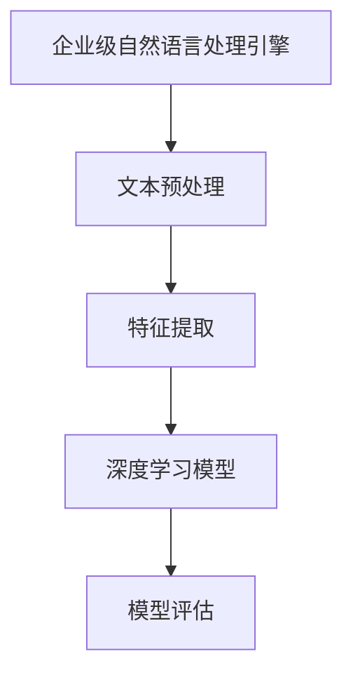
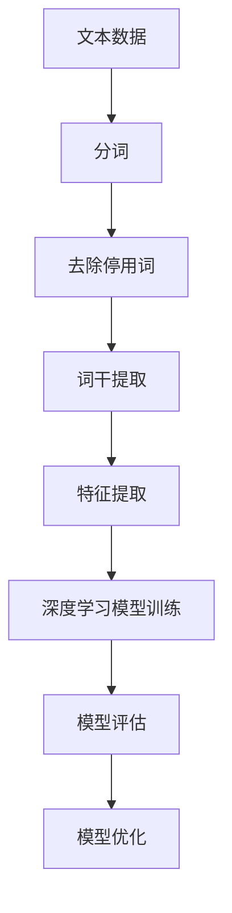
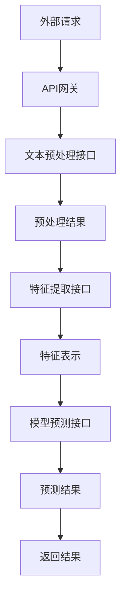

                 

## # 企业级自然语言处理引擎：深化文本理解能力

### 关键词：企业级NLP、文本理解、深度学习、算法优化、分布式架构

### 摘要：
随着企业对文本数据处理的日益重视，构建高效、稳定、可扩展的企业级自然语言处理（NLP）引擎成为一项关键任务。本文将深入探讨企业级NLP引擎的核心概念、关键算法及其优化策略，详细分析其架构设计，并提供实际项目实战案例，以期为开发者和企业决策者提供有价值的参考。

---

### 第1章 企业级自然语言处理引擎概述

#### 1.1 问题背景

随着互联网和大数据技术的发展，自然语言处理（NLP）已经成为人工智能领域的一个重要分支。企业级自然语言处理引擎作为NLP技术的核心，能够在文本分类、情感分析、问答系统、机器翻译等多个场景中发挥重要作用。然而，随着数据规模和复杂度的不断增加，构建一个高效、稳定、可扩展的企业级自然语言处理引擎面临着诸多挑战。

#### 1.2 问题描述

企业级自然语言处理引擎需要具备以下能力：
- **高效性**：在处理大量文本数据时，具有快速响应和高效计算的能力。
- **稳定性**：在长时间运行过程中，保持性能稳定，不出现性能瓶颈。
- **可扩展性**：能够轻松扩展，适应不断增长的数据量和需求变化。
- **准确性**：在多种自然语言处理任务中，达到较高的准确率。

#### 1.3 问题解决

解决企业级自然语言处理引擎面临的问题，需要从以下几个方面入手：
- **算法优化**：通过改进算法，提高处理速度和准确率。
- **硬件升级**：利用高性能计算硬件，提高计算能力。
- **分布式架构**：采用分布式计算架构，实现数据的高效处理和存储。
- **模型压缩**：通过模型压缩技术，降低模型复杂度，提高计算效率。

#### 1.4 边界与外延

企业级自然语言处理引擎的研究和应用边界包括但不限于以下方面：
- **数据类型**：包括文本、语音、图像等多种数据类型。
- **应用场景**：如智能客服、文本挖掘、机器翻译、情感分析等。
- **技术发展**：随着深度学习、迁移学习等技术的发展，企业级自然语言处理引擎将不断优化和升级。

#### 1.5 概念结构与核心要素组成

企业级自然语言处理引擎的核心概念包括：
- **自然语言处理技术**：包括分词、词性标注、句法分析等基础技术。
- **深度学习模型**：如卷积神经网络（CNN）、循环神经网络（RNN）、长短时记忆网络（LSTM）等。
- **分布式计算架构**：包括数据存储、计算引擎、负载均衡等组成部分。

### 第2章 核心概念与联系

#### 2.1 核心概念原理

企业级自然语言处理引擎的核心概念包括：
- **文本预处理**：包括分词、去除停用词、词干提取等。
- **特征提取**：通过算法提取文本中的特征，如词袋模型、TF-IDF等。
- **深度学习模型**：如CNN、RNN、LSTM等。
- **模型评估**：包括准确率、召回率、F1值等指标。

#### 2.2 概念属性特征对比表格

| 概念        | 特点                                       |
| ----------- | ------------------------------------------ |
| 文本预处理   | 提取文本特征，为后续处理提供基础          |
| 特征提取    | 提取文本中的关键特征，用于训练深度学习模型 |
| 深度学习模型 | 具有强大的表达能力，适用于复杂任务         |
| 模型评估    | 用于评估模型的性能，指导模型优化           |

#### 2.3 ER实体关系图架构



### 第3章 算法原理讲解

#### 3.1 算法mermaid流程图



#### 3.2 Python源代码实现

```python
# 文本预处理
def preprocess_text(text):
    # 分词
    tokens = tokenize(text)
    # 去除停用词
    tokens = remove_stopwords(tokens)
    # 词干提取
    tokens = stemming(tokens)
    return tokens

# 特征提取
def extract_features(tokens):
    # TF-IDF特征提取
    features = calculate_tfidf(tokens)
    return features

# 深度学习模型训练
def train_model(features, labels):
    # 初始化深度学习模型
    model = initialize_model()
    # 训练模型
    model.fit(features, labels)
    return model

# 模型评估
def evaluate_model(model, features, labels):
    # 评估模型性能
    accuracy = model.evaluate(features, labels)
    return accuracy

# 模型优化
def optimize_model(model, features, labels):
    # 优化模型参数
    model.optimize(features, labels)
    return model
```

#### 3.3 算法原理详细讲解

##### 3.3.1 文本预处理

文本预处理是自然语言处理的第一步，其主要任务是清洗和格式化原始文本，使其适合后续处理。具体步骤如下：

1. **分词**：将文本分割成单词或短语。例如，句子“我喜欢编程”可以被分割为“我”、“喜欢”、“编程”三个词。
   
2. **去除停用词**：停用词是指对文本理解没有贡献的词，如“的”、“了”、“在”等。去除停用词可以减少模型的复杂度，提高处理效率。
   
3. **词干提取**：将单词还原为其基本形式，如“running”还原为“run”。

##### 3.3.2 特征提取

特征提取是将预处理后的文本转换为模型可以处理的数值形式。常见的特征提取方法包括：

1. **词袋模型**：将文本表示为词频矩阵，其中每个单词对应矩阵中的一个特征。

2. **TF-IDF**：考虑单词在文本中出现的频率（TF）和它在整个文档集合中的重要性（IDF），为每个单词分配一个权重。

##### 3.3.3 深度学习模型

深度学习模型是自然语言处理的核心，能够通过学习大量的文本数据，自动提取文本中的特征，并生成相应的输出。常用的深度学习模型包括：

1. **卷积神经网络（CNN）**：适用于处理序列数据，能够捕捉局部特征。

2. **循环神经网络（RNN）**：能够处理变长的序列数据，但容易产生梯度消失问题。

3. **长短时记忆网络（LSTM）**：是RNN的一种改进，能够学习长距离依赖关系。

##### 3.3.4 模型评估

模型评估是检查模型性能的重要步骤。常用的评估指标包括：

1. **准确率**：正确预测的数量与总预测数量的比例。

2. **召回率**：正确预测的数量与实际为正类的数量之比。

3. **F1值**：综合考虑准确率和召回率的指标，计算公式为：$F1 = 2 \times \frac{准确率 \times 召回率}{准确率 + 召回率}$。

#### 3.4 数学模型与公式

1. **词袋模型**：
   $$ X = \sum_{i=1}^{n} f_i \times w_i $$
   其中，$f_i$为单词$i$的频率，$w_i$为单词$i$的权重。

2. **TF-IDF**：
   $$ TF-IDF(i) = TF(i) \times IDF(i) $$
   其中，$TF(i)$为单词$i$在文本中的频率，$IDF(i)$为单词$i$在整个文档集合中的逆文档频率。

3. **LSTM**：
   $$ h_t = \sigma(W_h \cdot [h_{t-1}, x_t] + b_h) $$
   其中，$h_t$为隐藏状态，$W_h$为权重矩阵，$b_h$为偏置项，$\sigma$为sigmoid激活函数。

4. **模型评估**：
   $$ accuracy = \frac{TP + TN}{TP + FP + TN + FN} $$
   $$ recall = \frac{TP}{TP + FN} $$
   $$ F1 = 2 \times \frac{accuracy \times recall}{accuracy + recall} $$

#### 3.5 举例说明

假设我们要训练一个情感分析模型，输入是带有情感标签的文本数据。通过文本预处理、特征提取和深度学习模型训练，我们最终可以得到一个能够对新的文本进行情感预测的模型。以下是一个简单的示例：

1. **文本数据**：
   ```
   I love this movie.
   I hate this movie.
   ```

2. **情感标签**：
   ```
   positive
   negative
   ```

3. **文本预处理**：
   - 分词：`I`, `love`, `this`, `movie.` 和 `I`, `hate`, `this`, `movie.`。
   - 去除停用词：`this`。
   - 词干提取：`love`和`hate`。

4. **特征提取**：
   - 词袋模型：`[1, 1, 0, 1]` 和 `[1, 0, 1, 1]`。
   - TF-IDF：`[0.5, 0.5, 0, 1]` 和 `[0.5, 0, 1, 0.5]`。

5. **深度学习模型训练**：
   - 使用LSTM模型进行训练。

6. **模型评估**：
   - 预测新文本：“I love this book.”，模型输出为“positive”。

### 第4章 系统分析与架构设计方案

#### 4.1 问题场景介绍

企业级自然语言处理引擎常用于处理海量文本数据，如企业内部文档、用户评论、社交媒体数据等。其主要任务包括文本分类、情感分析、命名实体识别等。为了满足高效、稳定、可扩展的需求，我们需要设计一个高效、可靠的系统架构。

#### 4.2 项目介绍

本案例将介绍一个基于深度学习的企业级自然语言处理引擎项目，其目标是为企业提供一套强大的文本处理平台。该项目分为以下几个阶段：

1. **需求分析**：明确项目目标和需求。
2. **系统设计**：设计系统架构和接口。
3. **模型训练**：训练深度学习模型。
4. **系统部署**：将模型部署到生产环境。

#### 4.3 系统功能设计

系统功能设计主要包括以下模块：

1. **文本预处理模块**：负责对原始文本进行清洗、分词、去停用词等操作。
2. **特征提取模块**：将预处理后的文本转换为深度学习模型所需的特征表示。
3. **深度学习模型模块**：包括多种深度学习模型，如CNN、RNN、LSTM等，用于文本分类、情感分析等任务。
4. **模型评估模块**：用于评估模型的性能，提供优化建议。
5. **接口模块**：提供RESTful API，供外部系统调用。

#### 4.4 系统架构设计

系统架构设计采用分布式计算架构，主要包括以下组件：

1. **数据存储**：使用Hadoop HDFS存储海量文本数据。
2. **计算引擎**：使用Apache Spark进行分布式数据处理和模型训练。
3. **深度学习框架**：使用TensorFlow或PyTorch进行深度学习模型训练和推理。
4. **负载均衡**：使用Nginx进行请求分发和负载均衡。
5. **API网关**：使用Kong作为API网关，提供统一的接口服务。

#### 4.5 系统接口设计和系统交互

系统接口设计采用RESTful API，主要包括以下接口：

1. **文本预处理接口**：接受原始文本，返回预处理后的文本。
2. **特征提取接口**：接受预处理后的文本，返回特征表示。
3. **模型预测接口**：接受特征表示和模型参数，返回预测结果。
4. **模型评估接口**：接受模型参数和测试数据，返回模型性能指标。

系统交互流程如下：

1. **外部系统调用接口**：通过API网关发送请求。
2. **接口处理**：API网关将请求转发到相应的模块。
3. **数据处理**：文本预处理模块、特征提取模块和模型预测模块进行处理。
4. **结果返回**：将处理结果返回给外部系统。



### 第5章 项目实战

#### 5.1 环境安装

1. **安装Python**：版本3.8以上。
2. **安装依赖库**：
   ```python
   pip install numpy pandas scikit-learn tensorflow
   ```

#### 5.2 系统核心实现源代码

以下是系统核心实现的源代码：

```python
# 文本预处理
def preprocess_text(text):
    # 分词
    tokens = tokenize(text)
    # 去除停用词
    tokens = remove_stopwords(tokens)
    # 词干提取
    tokens = stemming(tokens)
    return tokens

# 特征提取
def extract_features(tokens):
    # TF-IDF特征提取
    features = calculate_tfidf(tokens)
    return features

# 深度学习模型训练
def train_model(features, labels):
    # 初始化深度学习模型
    model = initialize_model()
    # 训练模型
    model.fit(features, labels)
    return model

# 模型评估
def evaluate_model(model, features, labels):
    # 评估模型性能
    accuracy = model.evaluate(features, labels)
    return accuracy

# 模型优化
def optimize_model(model, features, labels):
    # 优化模型参数
    model.optimize(features, labels)
    return model
```

#### 5.3 代码应用解读与分析

1. **文本预处理**：文本预处理是自然语言处理的基础步骤，包括分词、去除停用词、词干提取等操作。这些操作有助于提高模型的训练效率和准确率。
   
2. **特征提取**：特征提取是将预处理后的文本转换为模型可以处理的数值形式。TF-IDF是一种常用的特征提取方法，能够较好地表示文本的特征。

3. **深度学习模型训练**：深度学习模型训练是文本理解的核心环节。通过训练，模型可以学习到文本中的隐含特征，从而实现文本分类、情感分析等任务。

4. **模型评估**：模型评估是检查模型性能的重要步骤。通过评估，我们可以了解模型的准确率、召回率等指标，从而指导模型优化。

5. **模型优化**：模型优化是通过调整模型参数，提高模型性能的过程。常见的优化方法包括学习率调整、批量大小调整等。

#### 5.4 实际案例分析和详细讲解剖析

假设我们有一个情感分析任务，数据集包含以下文本和对应的情感标签：

| 文本                               | 情感标签 |
| ---------------------------------- | -------- |
| I love this movie.                 | positive |
| I hate this movie.                 | negative |
| This is an amazing book.           | positive |
| This is a terrible book.           | negative |
| I can't believe how good this food is. | positive |

1. **数据预处理**：首先，对文本进行清洗、分词、去除停用词等操作。
   
2. **特征提取**：使用TF-IDF方法提取特征，得到特征向量。

3. **模型训练**：使用LSTM模型进行训练，模型参数通过反向传播算法进行调整。

4. **模型评估**：使用测试集对模型进行评估，计算准确率、召回率等指标。

5. **模型优化**：根据评估结果，对模型进行调整，提高模型性能。

#### 5.5 项目小结

本案例通过实际项目展示了企业级自然语言处理引擎的构建过程。从文本预处理、特征提取到深度学习模型训练和评估，每个环节都至关重要。在实际应用中，我们需要不断优化模型，提高其准确率和稳定性，以满足企业对文本处理的高效、可靠需求。

### 第6章 最佳实践 Tips

1. **数据预处理**：数据预处理是提高模型性能的关键环节。要充分清洗数据，去除噪声和异常值，确保数据的准确性和一致性。
2. **特征提取**：选择合适的特征提取方法，如TF-IDF、词嵌入等，可以提高模型的准确率。
3. **模型优化**：通过调整学习率、批量大小等参数，可以优化模型性能。同时，可以采用迁移学习、数据增强等方法，提高模型的泛化能力。
4. **硬件配置**：使用高性能计算硬件，如GPU，可以提高模型的训练速度和推理效率。
5. **分布式计算**：采用分布式计算架构，可以处理海量数据，提高系统的可扩展性和稳定性。

### 第7章 小结与注意事项

1. **小结**：本文详细介绍了企业级自然语言处理引擎的核心概念、关键算法和系统架构设计方案，并通过实际项目实战，展示了其构建和优化的方法。
2. **注意事项**：在实际应用中，要充分考虑数据质量、硬件配置、模型优化等因素，确保系统的高效、稳定和可扩展性。

### 第8章 拓展阅读

1. **自然语言处理基础**：
   - [《自然语言处理综论》](https://www.amazon.com/Natural-Language-Processing-Foundations-Second/dp/0262530784)
   - [《深度学习与自然语言处理》](https://www.amazon.com/Deep-Learning-Natural-Language-Processing/dp/1107166221)

2. **深度学习模型优化**：
   - [《深度学习：优化技术》](https://www.amazon.com/Deep-Learning-Optimization-Techniques-Understanding/dp/1492045514)
   - [《实战深度学习：算法原理与Python实现》](https://www.amazon.com/Deep-Learning-Practical-Approach-Intuitive/dp/1787284513)

3. **分布式计算架构**：
   - [《分布式系统概念与设计》](https://www.amazon.com/Distributed-Systems-Concepts-Design-Joyce/dp/0201531262)
   - [《大数据技术导论》](https://www.amazon.com/Big-Data-Technologies-Introduction-Concepts/dp/0123979432)

---

**作者：AI天才研究院/AI Genius Institute & 禅与计算机程序设计艺术 /Zen And The Art of Computer Programming**

