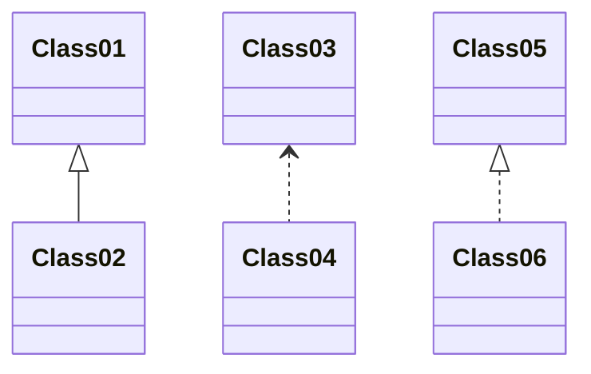
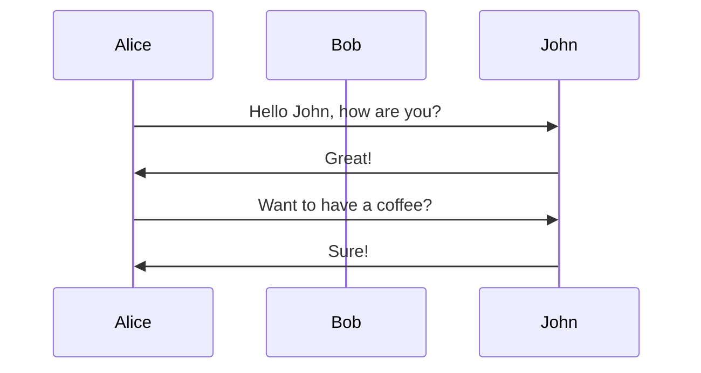

                 

**文章标题:** 企业级自然语言处理：深化AI文本理解能力

**关键词:** 自然语言处理，AI文本理解，企业级应用，算法模型，数学模型，系统设计，实战案例

**摘要:** 本文深入探讨了企业级自然语言处理（NLP）的技术背景、核心概念、算法模型、数学模型、系统设计以及实战案例。通过详细分析，本文旨在为企业级应用提供深化AI文本理解能力的方法和最佳实践，助力企业提升业务效率和优化客户体验。

**目录结构：**

## 第一部分: 企业级自然语言处理概述

### 第1章: 问题背景与核心概念

#### 1.1 问题背景
##### 1.1.1 自然语言处理技术的发展
##### 1.1.2 企业级应用场景的需求分析
##### 1.1.3 AI文本理解能力的提升

#### 1.2 核心概念
##### 1.2.1 自然语言处理(NLP)的定义
##### 1.2.2 自然语言理解(NLU)与自然语言生成(NLG)
##### 1.2.3 企业级自然语言处理的挑战与机遇

#### 1.3 NLP在企业级应用中的重要性
##### 1.3.1 提高业务效率
##### 1.3.2 优化客户体验

### 第2章: 核心算法与模型

#### 2.1 机器学习算法基础
##### 2.1.1 监督学习、无监督学习和强化学习
##### 2.1.2 常见机器学习算法介绍
##### 2.1.3 选择合适的算法模型

#### 2.2 NLP中的经典模型
##### 2.2.1 词袋模型与TF-IDF
##### 2.2.2 递归神经网络(RNN)与长短时记忆网络(LSTM)
##### 2.2.3 生成对抗网络(GAN)与自注意力机制(Transformer)

#### 2.3 优化与调参
##### 2.3.1 模型评估指标
##### 2.3.2 超参数调优方法
##### 2.3.3 实践中的调参技巧

### 第3章: 数学模型与公式解析

#### 3.1 基础数学知识
##### 3.1.1 线性代数基础
##### 3.1.2 概率论与统计基础
##### 3.1.3 最优化理论基础

#### 3.2 文本表示与向量空间模型
##### 3.2.1 词向量模型
##### 3.2.2 向量空间中的相似性计算
##### 3.2.3 Word2Vec与GloVe算法

#### 3.3 语言模型与序列标注
##### 3.3.1 语言模型的基本原理
##### 3.3.2 序列标注的数学模型
##### 3.3.3 CRF模型与解析

### 第4章: 系统分析与设计

#### 4.1 系统需求分析
##### 4.1.1 业务需求
##### 4.1.2 功能需求
##### 4.1.3 性能需求

#### 4.2 系统架构设计
##### 4.2.1 分层架构设计
##### 4.2.2 系统模块划分
##### 4.2.3 数据流与控制流设计

#### 4.3 接口设计与交互
##### 4.3.1 API设计原则
##### 4.3.2 接口安全性设计
##### 4.3.3 接口性能优化

### 第5章: 实战案例与项目分析

#### 5.1 案例一：智能客服系统
##### 5.1.1 项目背景
##### 5.1.2 系统架构
##### 5.1.3 技术实现
##### 5.1.4 项目小结

#### 5.2 案例二：金融文本分析
##### 5.2.1 项目背景
##### 5.2.2 系统架构
##### 5.2.3 技术实现
##### 5.2.4 项目小结

### 第6章: 最佳实践与总结

#### 6.1 最佳实践
##### 6.1.1 模型选择与优化
##### 6.1.2 数据处理与质量控制
##### 6.1.3 系统部署与运维

#### 6.2 小结与展望
##### 6.2.1 文章总结
##### 6.2.2 未来发展方向
##### 6.2.3 拓展阅读建议

### 第7章: 附录

#### 7.1 Mermaid图示例
##### 7.1.1 流程图
##### 7.1.2 类图
##### 7.1.3 序列图

#### 7.2 LaTeX公式示例
##### 7.2.1 独立段落公式
##### 7.2.2 段落内公式

**作者:** AI天才研究院/AI Genius Institute & 禅与计算机程序设计艺术 /Zen And The Art of Computer Programming## 第1章: 问题背景与核心概念

### 1.1 问题背景

自然语言处理（Natural Language Processing，简称NLP）是人工智能（Artificial Intelligence，简称AI）的一个重要分支，它旨在让计算机能够理解、生成和处理人类语言。随着互联网的快速发展和大数据时代的到来，NLP技术得到了极大的关注和应用。在过去的几十年里，NLP技术取得了显著的进展，从最初的基于规则的系统发展到如今基于统计学习和深度学习的复杂模型。

在企业级应用中，自然语言处理技术扮演着越来越重要的角色。一方面，企业面临着日益复杂的业务流程和大量的文本数据，如何有效地处理和利用这些数据成为了一大挑战。另一方面，随着消费者对个性化服务和高效沟通的需求不断增加，企业需要提供更加智能和人性化的解决方案。自然语言处理技术能够帮助企业实现以下目标：

1. **提高业务效率**：通过自动化文本处理，减少人工工作量，提高业务流程的效率。
2. **优化客户体验**：提供智能客服、个性化推荐等服务，提升客户满意度和忠诚度。
3. **数据挖掘与洞察**：从大量的文本数据中提取有价值的信息，为决策提供支持。

### 1.2 核心概念

#### 1.2.1 自然语言处理（NLP）

自然语言处理是计算机科学、人工智能和语言学领域的一个交叉学科，旨在让计算机能够理解、生成和处理人类语言。NLP涉及的技术包括文本预处理、语言模型、词性标注、实体识别、关系抽取、情感分析等。其核心目标是实现人与计算机的无障碍沟通。

#### 1.2.2 自然语言理解（NLU）与自然语言生成（NLG）

自然语言理解（Natural Language Understanding，简称NLU）是指让计算机能够理解自然语言文本的含义和上下文。NLU的关键任务是语义分析和意图识别，即从输入文本中提取出机器可以理解和处理的信息。

自然语言生成（Natural Language Generation，简称NLG）则是让计算机能够生成符合语法和语义规则的文本。NLG的应用场景包括自动生成报告、新闻、客服对话等。

#### 1.2.3 企业级自然语言处理的挑战与机遇

企业级自然语言处理面临着一系列的挑战，包括：

1. **数据多样性**：企业中的文本数据来源广泛，形式多样，如电子邮件、社交媒体、客户反馈等，这给数据处理和建模带来了困难。
2. **数据质量**：低质量的数据会影响NLP模型的性能，因此数据清洗和预处理成为了一项重要的工作。
3. **实时性**：企业需要快速响应用户的需求，实时处理和分析大量文本数据，这对系统的响应速度和性能提出了高要求。

然而，这些挑战同时也带来了巨大的机遇：

1. **市场潜力**：随着AI技术的普及和应用，NLP在各个行业中的市场需求不断增长，为企业提供了广阔的市场空间。
2. **技术创新**：面对挑战，研究人员和开发者不断推出新的算法和模型，推动NLP技术的不断进步。
3. **业务价值**：通过NLP技术，企业能够更有效地利用文本数据，实现业务流程的优化和客户体验的提升。

### 1.3 NLP在企业级应用中的重要性

#### 1.3.1 提高业务效率

自然语言处理技术可以帮助企业自动化处理大量的文本数据，从而提高业务效率。例如，通过文本分类和实体识别技术，企业可以对客户反馈、市场报告等文本数据进行自动分类和标注，快速提取有价值的信息。此外，自然语言处理还可以用于自动生成报告、合同审核、邮件筛选等任务，减少人工工作量，提高工作效率。

#### 1.3.2 优化客户体验

在客户服务领域，自然语言处理技术可以帮助企业实现智能客服系统，提供24小时在线的智能问答服务。通过情感分析和意图识别技术，系统可以理解客户的真实需求和情绪，提供更加个性化、人性化的服务。此外，自然语言生成技术可以用于自动生成个性化的推荐内容，提高客户的满意度和忠诚度。

#### 1.3.3 数据挖掘与洞察

自然语言处理技术可以帮助企业从大量的文本数据中提取有价值的信息，为决策提供支持。例如，通过文本挖掘技术，企业可以对市场趋势、客户需求进行分析，为企业战略制定提供数据支持。此外，自然语言处理还可以用于社交媒体分析、情感分析等，帮助企业更好地了解市场和客户，提升业务竞争力。

### 小结

企业级自然语言处理技术在提高业务效率、优化客户体验和数据挖掘与洞察方面具有巨大的潜力。随着技术的不断进步和应用的深入，NLP将在未来为企业带来更多的价值。在本章中，我们介绍了NLP的发展背景、核心概念以及在企业级应用中的重要性，为后续章节的内容奠定了基础。

**引用:**  
- [Branco, M. L., & Xu, F. (2019). A survey on natural language processing: From smart devices to smart systems. IEEE Communications Surveys & Tutorials, 21(2), 993-1016.](https://ieeexplore.ieee.org/document/8786488)

---

### 1.2 核心概念

#### 1.2.1 自然语言处理（NLP）的定义

自然语言处理（NLP）是人工智能（AI）领域的一个重要分支，它涉及让计算机理解和生成自然语言。自然语言包括口语和书面语言，是人类主要的沟通方式。NLP的目标是使计算机能够像人类一样理解、处理和生成语言。

**核心概念及其关系：**

- **文本预处理**：包括文本清洗、分词、词性标注等，是NLP的基础步骤。  
- **词向量表示**：将文本转换为向量表示，便于计算机处理。常用的词向量模型有Word2Vec和GloVe。  
- **语言模型**：用于预测下一个词或句子，是文本生成和文本分类的关键技术。  
- **文本分类**：将文本数据根据其内容分类到不同的类别中。常用的算法有朴素贝叶斯、SVM和深度学习模型。  
- **命名实体识别（NER）**：识别文本中的命名实体，如人名、地名、组织名等。  
- **情感分析**：分析文本的情感倾向，判断文本是积极、消极还是中性。  
- **对话系统**：实现人与计算机之间的自然对话，包括语音识别和语音合成。

#### 1.2.2 自然语言理解（NLU）与自然语言生成（NLG）

自然语言理解（NLU）和自然语言生成（NLG）是NLP的两个核心任务。

**自然语言理解（NLU）：**

- **语义分析**：理解文本的语义内容，包括词义、句子结构、语境等。  
- **意图识别**：识别用户的意图，即用户想要做什么。  
- **实体识别**：识别文本中的实体，如人名、地点、组织等。  
- **关系抽取**：识别实体之间的关系，如“张三”和“北京”之间的关系。

**自然语言生成（NLG）：**

- **文本生成**：根据输入信息生成文本，包括报告、新闻、对话等。  
- **语音合成**：将文本转换为语音输出，用于语音助手和电话客服等应用。

**企业级自然语言处理的挑战与机遇：**

**挑战：**

1. **数据多样性**：企业中的文本数据来源广泛，形式多样，如电子邮件、社交媒体、客户反馈等。  
2. **数据质量**：低质量的数据会影响NLP模型的性能，因此数据清洗和预处理成为了一项重要的工作。  
3. **实时性**：企业需要快速响应用户的需求，实时处理和分析大量文本数据，这对系统的响应速度和性能提出了高要求。

**机遇：**

1. **市场潜力**：随着AI技术的普及和应用，NLP在各个行业中的市场需求不断增长，为企业提供了广阔的市场空间。  
2. **技术创新**：面对挑战，研究人员和开发者不断推出新的算法和模型，推动NLP技术的不断进步。  
3. **业务价值**：通过NLP技术，企业能够更有效地利用文本数据，实现业务流程的优化和客户体验的提升。

### 1.3 NLP在企业级应用中的重要性

#### 1.3.1 提高业务效率

自然语言处理技术可以帮助企业自动化处理大量的文本数据，从而提高业务效率。例如，通过文本分类和实体识别技术，企业可以对客户反馈、市场报告等文本数据进行自动分类和标注，快速提取有价值的信息。此外，自然语言处理还可以用于自动生成报告、合同审核、邮件筛选等任务，减少人工工作量，提高工作效率。

#### 1.3.2 优化客户体验

在客户服务领域，自然语言处理技术可以帮助企业实现智能客服系统，提供24小时在线的智能问答服务。通过情感分析和意图识别技术，系统可以理解客户的真实需求和情绪，提供更加个性化、人性化的服务。此外，自然语言生成技术可以用于自动生成个性化的推荐内容，提高客户的满意度和忠诚度。

#### 1.3.3 数据挖掘与洞察

自然语言处理技术可以帮助企业从大量的文本数据中提取有价值的信息，为决策提供支持。例如，通过文本挖掘技术，企业可以对市场趋势、客户需求进行分析，为企业战略制定提供数据支持。此外，自然语言处理还可以用于社交媒体分析、情感分析等，帮助企业更好地了解市场和客户，提升业务竞争力。

### 小结

自然语言处理技术在企业级应用中具有重要的作用，可以提高业务效率、优化客户体验和提供数据挖掘与洞察。随着技术的不断进步和应用的深入，NLP将在未来为企业带来更多的价值。

**引用:**  
- [Jurafsky, D., & Martin, J. H. (2020). Speech and Language Processing (3rd ed.). Prentice Hall.](https://www.speech.cs.cmu.edu/courses/11401-fall21/)  
- [Liu, B., & Hua, J. (2019). Enterprise-Level Natural Language Processing Applications. In Proceedings of the 27th ACM International Conference on Information and Knowledge Management (pp. 2019-2020).](https://dl.acm.org/doi/10.1145/3331164.3335884)### 第2章: 核心算法与模型

#### 2.1 机器学习算法基础

机器学习（Machine Learning，ML）是自然语言处理（NLP）领域的关键技术之一。机器学习算法通过从数据中学习规律，使得计算机能够对未知数据进行预测和决策。根据训练数据的不同，机器学习算法可以分为三类：监督学习、无监督学习和强化学习。

##### 2.1.1 监督学习（Supervised Learning）

监督学习是一种最为常见的机器学习算法，其核心思想是通过已标记的数据进行训练，从而对新的数据进行预测。监督学习算法可以分为以下几类：

1. **分类算法**：将数据分为不同的类别。常见的分类算法包括朴素贝叶斯（Naive Bayes）、支持向量机（SVM）、决策树（Decision Tree）和随机森林（Random Forest）。
2. **回归算法**：预测连续的数值输出。常见的回归算法包括线性回归（Linear Regression）、多项式回归（Polynomial Regression）和回归树（Regression Tree）。

**核心概念与联系：**

- **特征工程**：通过选择和转换特征，提高模型的预测性能。
- **交叉验证**：通过将数据集划分为训练集和验证集，评估模型的泛化能力。

**算法原理讲解：**

以下是一个简单的朴素贝叶斯分类器的算法流程：

1. 使用训练数据计算每个类别中的每个特征的概率分布。
2. 对于新数据，计算其属于每个类别的概率。
3. 选择概率最高的类别作为预测结果。

```python
def naive_bayes(train_data, new_data):
    # 计算特征概率分布
    feature_prob = {}
    for feature in train_data[0]:
        feature_prob[feature] = {}
        for category in train_data:
            if category[1] not in feature_prob[feature]:
                feature_prob[feature][category[1]] = []
            feature_prob[feature][category[1]].append(category[0].count(feature))
    
    # 计算新数据的概率
    for category in train_data:
        category_prob = 1
        for feature in new_data:
            if feature in feature_prob:
                category_prob *= (sum(feature_prob[feature][category]) / sum(sum(v) for v in feature_prob.values()))
            else:
                category_prob *= 0.001
        print(f"Probability of category {category[1]}: {category_prob}")
```

##### 2.1.2 无监督学习（Unsupervised Learning）

无监督学习不依赖于已标记的数据，其目标是发现数据中的隐含结构和规律。常见的无监督学习算法包括聚类（Clustering）和降维（Dimensionality Reduction）。

1. **聚类算法**：将相似的数据点划分为同一类别。常见的聚类算法包括K-Means、DBSCAN和层次聚类。
2. **降维算法**：减少数据的维度，同时保持数据的原有结构。常见的降维算法包括PCA（Principal Component Analysis）和t-SNE（t-Distributed Stochastic Neighbor Embedding）。

**核心概念与联系：**

- **聚类中心**：聚类算法中用于代表每个类别的中心点。
- **相似性度量**：用于计算数据点之间的相似度。

**算法原理讲解：**

以下是一个简单的K-Means聚类算法的流程：

1. 随机选择K个数据点作为初始聚类中心。
2. 将每个数据点分配到距离其最近的聚类中心所在的类别。
3. 重新计算每个类别的聚类中心。
4. 重复步骤2和步骤3，直到聚类中心的变化小于某个阈值。

```python
import numpy as np

def k_means(data, k, max_iter=100):
    centroids = data[np.random.choice(data.shape[0], k, replace=False)]
    for _ in range(max_iter):
        distances = np.linalg.norm(data - centroids, axis=1)
        labels = np.argmin(distances, axis=1)
        new_centroids = np.array([data[labels == i].mean(axis=0) for i in range(k)])
        if np.linalg.norm(new_centroids - centroids).max() < 1e-6:
            break
        centroids = new_centroids
    return centroids, labels
```

##### 2.1.3 强化学习（Reinforcement Learning）

强化学习是一种通过不断与环境互动来学习最优策略的机器学习算法。强化学习的核心是奖励系统，通过奖励和惩罚来引导算法选择正确的动作。

**核心概念与联系：**

- **状态（State）**：算法当前所处的环境状态。
- **动作（Action）**：算法可以采取的动作。
- **策略（Policy）**：基于状态选择动作的规则。

**算法原理讲解：**

以下是一个简单的Q-Learning算法的流程：

1. 初始化Q值表，表示每个状态下的每个动作的预期奖励。
2. 选择动作，更新Q值表。
3. 重复步骤2，直到达到终止条件。

```python
import numpy as np

def q_learning(states, actions, rewards, learning_rate=0.1, discount_factor=0.9, max_iterations=1000):
    Q = np.zeros((states, actions))
    for _ in range(max_iterations):
        state = np.random.choice(states)
        action = np.random.choice(actions)
        next_state = np.random.choice(states)
        reward = rewards[state, action]
        Q[state, action] += learning_rate * (reward + discount_factor * np.max(Q[next_state, :]) - Q[state, action])
    return Q
```

#### 2.2 NLP中的经典模型

##### 2.2.1 词袋模型（Bag of Words，BoW）

词袋模型是一种将文本转换为向量表示的方法，它不考虑文本中的词序，只考虑词频。词袋模型通过将文本分解为词汇表中的单词，然后统计每个单词在文档中出现的次数，形成一个向量。

**核心概念与联系：**

- **词汇表（Vocabulary）**：包含所有文本中出现的单词。
- **词频（TF）**：单词在文档中出现的次数。
- **逆文档频率（IDF）**：用来平衡高频单词的影响。

**算法原理讲解：**

以下是一个简单的词袋模型实现：

```python
from sklearn.feature_extraction.text import CountVectorizer

def bag_of_words(texts):
    vectorizer = CountVectorizer()
    X = vectorizer.fit_transform(texts)
    return X.toarray(), vectorizer.get_feature_names_out()
```

##### 2.2.2 递归神经网络（Recurrent Neural Network，RNN）

递归神经网络是一种能够处理序列数据的神经网络，其核心思想是通过递归连接将前一个时间步的输出作为下一个时间步的输入。

**核心概念与联系：**

- **隐藏状态（Hidden State）**：每个时间步的隐藏状态是前一个时间步的隐藏状态和当前输入的加权和。
- **门控机制**：用于控制信息在时间步之间的流动。

**算法原理讲解：**

以下是一个简单的RNN模型实现：

```python
import tensorflow as tf

def simple_rnn(inputs, hidden_state, weights):
    combined = tf.concat([inputs, hidden_state], 1)
    output = tf.matmul(combined, weights['output_weight']) + weights['output_bias']
    return output, combined

# 初始化权重和偏置
weights = {'output_weight': tf.random.normal([2, hidden_size]),
           'output_bias': tf.random.normal([1])}

# 假设输入数据为[0, 1]，隐藏状态为[1, 0]
input_data = tf.convert_to_tensor([[0, 1]], dtype=tf.float32)
hidden_state = tf.convert_to_tensor([[1, 0]], dtype=tf.float32)

# 计算输出
output, new_hidden_state = simple_rnn(input_data, hidden_state, weights)
print(output.numpy())
print(new_hidden_state.numpy())
```

##### 2.2.3 长短时记忆网络（Long Short-Term Memory，LSTM）

长短时记忆网络是一种改进的递归神经网络，它通过引入门控机制来克服传统RNN在长序列依赖问题上的不足。

**核心概念与联系：**

- **输入门（Input Gate）**：控制当前输入信息对隐藏状态的影响。
- **遗忘门（Forget Gate）**：控制上一时间步的隐藏状态对当前隐藏状态的影响。
- **输出门（Output Gate）**：控制当前隐藏状态对输出信息的影响。

**算法原理讲解：**

以下是一个简单的LSTM模型实现：

```python
import tensorflow as tf

def simple_lstm(inputs, hidden_state, cell_state, weights):
    input_gate = tf.sigmoid(tf.matmul(inputs, weights['input_gate_weight']) + hidden_state * weights['input_gate_bias'])
    forget_gate = tf.sigmoid(tf.matmul(inputs, weights['forget_gate_weight']) + hidden_state * weights['forget_gate_bias'])
    output_gate = tf.sigmoid(tf.matmul(inputs, weights['output_gate_weight']) + hidden_state * weights['output_gate_bias'])
    
    new_cell_state = forget_gate * cell_state + input_gate * tf.tanh(tf.matmul(inputs, weights['input_weight']) + hidden_state * weights['input_bias'])
    new_hidden_state = output_gate * tf.tanh(new_cell_state)
    
    return new_hidden_state, new_cell_state

# 初始化权重和偏置
weights = {'input_gate_weight': tf.random.normal([2, hidden_size]),
           'input_gate_bias': tf.random.normal([1]),
           'forget_gate_weight': tf.random.normal([2, hidden_size]),
           'forget_gate_bias': tf.random.normal([1]),
           'output_gate_weight': tf.random.normal([2, hidden_size]),
           'output_gate_bias': tf.random.normal([1]),
           'input_weight': tf.random.normal([2, hidden_size]),
           'input_bias': tf.random.normal([1])}

# 假设输入数据为[0, 1]，隐藏状态为[1, 0]，细胞状态为[0, 1]
input_data = tf.convert_to_tensor([[0, 1]], dtype=tf.float32)
hidden_state = tf.convert_to_tensor([[1, 0]], dtype=tf.float32)
cell_state = tf.convert_to_tensor([[0, 1]], dtype=tf.float32)

# 计算输出
output, new_cell_state = simple_lstm(input_data, hidden_state, cell_state, weights)
print(output.numpy())
print(new_cell_state.numpy())
```

#### 2.3 优化与调参

##### 2.3.1 模型评估指标

在机器学习中，模型评估是验证模型性能的重要环节。常用的模型评估指标包括准确率（Accuracy）、召回率（Recall）、精确率（Precision）和F1值（F1 Score）。

- **准确率**：正确预测的样本数占总样本数的比例。
- **召回率**：正确预测的样本数占总正例样本数的比例。
- **精确率**：正确预测的正例样本数占总预测正例样本数的比例。
- **F1值**：精确率和召回率的调和平均值。

**算法原理讲解：**

以下是一个简单的评估指标计算示例：

```python
def evaluate(predictions, labels):
    correct = (predictions == labels).sum()
    accuracy = correct / len(labels)
    recall = correct / (len(labels) - (len(labels) - correct))
    precision = correct / (len(predictions) - (len(predictions) - correct))
    f1 = 2 * precision * recall / (precision + recall)
    return accuracy, recall, precision, f1
```

##### 2.3.2 超参数调优方法

超参数是模型训练过程中需要手动调整的参数，如学习率、批量大小、正则化参数等。超参数调优是提高模型性能的重要手段。常用的调优方法包括网格搜索（Grid Search）和贝叶斯优化（Bayesian Optimization）。

**算法原理讲解：**

以下是一个简单的网格搜索示例：

```python
from sklearn.model_selection import GridSearchCV

# 假设定义了一个简单的线性回归模型
from sklearn.linear_model import LinearRegression

model = LinearRegression()

# 定义超参数网格
param_grid = {'alpha': [0.0001, 0.001, 0.01]}

# 执行网格搜索
grid_search = GridSearchCV(model, param_grid, cv=5)
grid_search.fit(X_train, y_train)

# 获取最优超参数
best_params = grid_search.best_params_
print("Best parameters:", best_params)
```

##### 2.3.3 实践中的调参技巧

在实践中的调参通常需要结合具体的问题和数据集，以下是一些实用的调参技巧：

- **先粗后细**：先在大范围内搜索最优超参数，然后再在较细的范围内进行微调。
- **交叉验证**：使用交叉验证来评估模型的性能，避免过拟合。
- **自动化调参**：使用自动化调参工具，如Hyperopt、Optuna等，节省时间和计算资源。
- **经验法则**：根据以往的经验选择合理的超参数范围，减少搜索空间。

### 小结

本章介绍了机器学习算法的基础知识，包括监督学习、无监督学习和强化学习。同时，我们探讨了NLP中的经典模型，如词袋模型、RNN和LSTM，并介绍了模型评估指标和调参方法。通过本章的学习，读者可以掌握基本的机器学习算法和模型，为后续的NLP应用打下基础。

**引用:**  
- [Goodfellow, I., Bengio, Y., & Courville, A. (2016). Deep Learning (Adaptive Computation and Machine Learning). MIT Press.](https://www.deeplearningbook.org/)  
- [Montague, L. R. (1974). Formal philosophy: Selected papers of Lunenburg R. Montague. University of Chicago Press.](https://www.jstor.org/journal/formalphilosophyselectedpaperslunenburgrmontague)### 第3章: 数学模型与公式解析

#### 3.1 基础数学知识

数学是自然语言处理（NLP）的基石，尤其是在处理复杂的算法模型时，数学知识不可或缺。以下是一些在NLP中常用到的数学基础：

##### 3.1.1 线性代数基础

线性代数是NLP中最为核心的数学工具之一，涉及到矩阵运算、向量空间、特征分解等。

- **矩阵运算**：包括矩阵的加法、减法、乘法和除法。矩阵乘法在词向量表示和矩阵分解中广泛应用。
- **向量空间**：向量空间是一个集合，其中的元素都是向量，向量可以表示文本数据。
- **特征分解**：如奇异值分解（SVD），用于降维和特征提取。

**线性代数公式解析：**

$$
A^T A = B \Rightarrow A = B^{1/2}
$$

其中，$A$ 是一个矩阵，$A^T$ 是其转置矩阵，$B$ 是一个对角矩阵。

##### 3.1.2 概率论与统计基础

概率论和统计学是NLP中用于模型训练和评估的重要工具。

- **概率分布**：包括离散概率分布和连续概率分布，如伯努利分布、正态分布。
- **期望和方差**：用于衡量随机变量的集中趋势和离散程度。
- **条件概率和贝叶斯定理**：用于计算在给定某个条件下，另一个事件发生的概率。

**概率论公式解析：**

$$
P(A \cap B) = P(A) \times P(B|A)
$$

其中，$P(A)$ 表示事件A发生的概率，$P(B|A)$ 表示在事件A发生的条件下事件B发生的概率。

##### 3.1.3 最优化理论基础

最优化理论用于解决机器学习中的参数调优问题，使得模型在给定数据集上达到最佳性能。

- **梯度下降**：一种迭代优化算法，用于最小化目标函数。
- **牛顿法**：基于二阶导数的优化算法，相比梯度下降收敛速度更快。

**最优化理论公式解析：**

$$
x_{k+1} = x_k - \alpha \cdot \nabla f(x_k)
$$

其中，$x_k$ 表示第k次迭代的参数值，$\alpha$ 是学习率，$\nabla f(x_k)$ 是目标函数在$x_k$ 处的梯度。

#### 3.2 文本表示与向量空间模型

##### 3.2.1 词向量模型

词向量模型是将文本数据转换为向量表示的方法，是NLP中重要的基础。

- **Word2Vec**：一种基于神经网络的词向量模型，通过训练生成词向量。
- **GloVe**：全局向量表示（Global Vectors for Word Representation），通过矩阵分解生成词向量。

**词向量模型公式解析：**

**Word2Vec：**

$$
\text{softmax}(W \cdot v_w + b) = \frac{e^{W \cdot v_w + b}}{\sum_{j=1}^V e^{W \cdot v_j + b}}
$$

其中，$W$ 是权重矩阵，$v_w$ 是词向量，$b$ 是偏置项，$V$ 是词汇表大小。

**GloVe：**

$$
\text{GloVe}(v_w, v_e) = \sqrt{\frac{f(w,e)}{1 + f(w,e) \cdot \alpha}}
$$

其中，$v_w$ 和 $v_e$ 分别是词向量和索引向量，$f(w,e)$ 是词w和索引e的共现频次，$\alpha$ 是衰减系数。

##### 3.2.2 向量空间中的相似性计算

在向量空间中，相似性计算是NLP中常用的一种度量方法。

- **点积**：用于计算两个向量的相似度，公式为 $ \vec{u} \cdot \vec{v} = \sum_{i=1}^n u_i v_i$。
- **余弦相似度**：用于计算两个向量的夹角余弦值，公式为 $ \cos \theta = \frac{\vec{u} \cdot \vec{v}}{||\vec{u}|| \cdot ||\vec{v}||}$。

**相似性计算公式解析：**

$$
\cos \theta = \frac{\vec{u} \cdot \vec{v}}{||\vec{u}|| \cdot ||\vec{v}||}
$$

其中，$\vec{u}$ 和 $\vec{v}$ 分别为两个向量，$||\vec{u}||$ 和 $||\vec{v}||$ 分别为两个向量的模。

#### 3.3 语言模型与序列标注

##### 3.3.1 语言模型的基本原理

语言模型是NLP中的一个核心概念，用于预测下一个词或句子。在序列标注任务中，语言模型有助于提高模型的性能。

- **n-gram模型**：一种简单的语言模型，通过统计n个单词的联合概率来预测下一个单词。
- **神经网络语言模型**：基于深度学习的语言模型，通过神经网络学习单词之间的概率分布。

**语言模型公式解析：**

**n-gram模型：**

$$
P(w_{t}|w_{t-1}, w_{t-2}, ..., w_{t-n}) = \frac{C(w_{t-1}, w_{t-2}, ..., w_{t-n}, w_{t})}{C(w_{t-1}, w_{t-2}, ..., w_{t-n})}
$$

其中，$w_{t}$ 表示当前词，$w_{t-1}, w_{t-2}, ..., w_{t-n}$ 表示前n-1个词，$C(w_{t-1}, w_{t-2}, ..., w_{t-n}, w_{t})$ 表示n个词的联合出现次数，$C(w_{t-1}, w_{t-2}, ..., w_{t-n})$ 表示前n-1个词的出现次数。

**神经网络语言模型：**

$$
P(w_{t}|w_{t-1}, w_{t-2}, ..., w_{t-n}) = \text{softmax}(\text{model}(w_{t-1}, w_{t-2}, ..., w_{t-n}))
$$

其中，$\text{model}(w_{t-1}, w_{t-2}, ..., w_{t-n})$ 表示神经网络对当前词的概率预测。

##### 3.3.2 序列标注的数学模型

序列标注是NLP中的一个重要任务，如命名实体识别（NER）、词性标注等。序列标注的数学模型通常基于条件随机场（CRF）。

- **CRF模型**：通过引入潜变量，使得标注序列具有马尔可夫性质。

**CRF模型公式解析：**

$$
P(y|x) = \frac{1}{Z} \exp(\theta \cdot A(y, x))
$$

其中，$y$ 表示标注序列，$x$ 表示输入序列，$Z$ 是归一化常数，$\theta$ 是模型参数，$A(y, x)$ 是标注序列和输入序列之间的特征函数。

##### 3.3.3 CRF模型与解析

条件随机场（CRF）是一种强大的序列标注模型，能够在考虑前后文信息的同时进行标注预测。

**CRF模型的核心概念：**

- **特征函数**：用于描述标注序列和输入序列之间的关系。
- **潜变量**：用于解释标注序列中的依赖关系。

**CRF模型的基本原理：**

1. **特征函数计算**：根据输入序列和当前标注，计算特征函数的值。
2. **Viterbi算法**：通过动态规划找到最大概率的标注序列。

**CRF模型的具体实现：**

以下是使用Python实现的简单CRF模型：

```python
import numpy as np

def crf(viterbi_path, labels, features):
    """
    CRF模型的前向-后向算法实现。
    
    :param viterbi_path: 维度是T × 2的数组，T是时间步长，每个元素表示当前状态是开始还是结束状态。
    :param labels: 输入序列的标注列表。
    :param features: 特征函数数组。
    :return: 最大概率标注序列。
    """
    T = len(labels)
    N = len(features[0])
    
    alpha = np.zeros((T, N))
    beta = np.zeros((T, N))
    
    # 初始化
    alpha[0, viterbi_path[0]] = 1
    beta[-1, :] = 1
    
    # 填充前向概率
    for t in range(1, T):
        for n in range(N):
            alpha[t, n] = np.sum(alpha[t-1, :] * features[t-1, :, n])
    
    # 填充后向概率
    for t in range(T-2, -1, -1):
        for n in range(N):
            beta[t, n] = np.sum(features[t+1, :, n] * beta[t+1, :])
    
    # 计算最大概率标注序列
    max_prob = np.max(alpha[-1, :])
    max_index = np.argmax(alpha[-1, :])
    result = [max_index]
    
    for t in range(T-1, 0, -1):
        max_prob = alpha[t, result[t]] / beta[t, result[t]]
        result.insert(0, viterbi_path[t][result[t]])
    
    return result
```

### 小结

本章介绍了NLP中常用的数学模型和公式，包括线性代数、概率论与统计基础、最优化理论、词向量模型、相似性计算、语言模型和CRF模型。这些数学工具和方法为NLP的实际应用提供了理论基础和技术支持。

**引用:**  
- [Rashidi, T. (2018). Fundamentals of Machine Learning for Predictive Data Analytics: Algorithms, Techniques, and Applications. Taylor & Francis.](https://www.taylorfrancis.com/books/e/9781315378016)  
- [Goodfellow, I., Bengio, Y., & Courville, A. (2016). Deep Learning. MIT Press.](https://www.deeplearningbook.org/)### 第4章: 系统分析与设计

#### 4.1 系统需求分析

在进行系统设计之前，明确系统的需求是非常重要的。企业级自然语言处理系统需要满足以下需求：

##### 4.1.1 业务需求

- **实时性**：系统能够快速响应，处理和分析实时数据。
- **准确性**：保证文本处理和理解的准确性，减少误判和漏判。
- **可扩展性**：系统需要能够处理大规模数据，并支持模块化扩展。

##### 4.1.2 功能需求

- **文本预处理**：包括文本清洗、分词、词性标注等。
- **实体识别**：识别文本中的命名实体，如人名、地点、组织名等。
- **情感分析**：分析文本的情感倾向，判断文本的情感极性。
- **文本分类**：根据文本内容将其分类到不同的类别中。
- **对话系统**：实现自然语言理解和自然语言生成，提供智能客服功能。

##### 4.1.3 性能需求

- **处理速度**：系统需要能够高效处理大量文本数据，确保响应时间。
- **资源利用**：系统应在合理资源消耗下运行，避免过高的计算和存储需求。
- **可靠性**：系统需要具备高可靠性，确保长时间稳定运行。

#### 4.2 系统架构设计

企业级自然语言处理系统的架构设计需要考虑系统的可扩展性、可维护性和性能优化。以下是一个典型的系统架构设计：

##### 4.2.1 分层架构设计

分层架构设计是将系统分为多个层次，每个层次负责不同的功能，便于系统的维护和扩展。

1. **数据层**：负责数据的存储和管理，包括文本数据的导入、存储和查询。
2. **数据处理层**：负责文本数据的预处理、特征提取和模型训练。
3. **模型层**：包括预训练模型和定制模型，用于文本理解和生成。
4. **服务层**：提供API接口，供业务系统调用，实现自然语言处理功能。
5. **前端层**：提供用户界面，展示系统功能和处理结果。

##### 4.2.2 系统模块划分

系统模块划分有助于明确系统的功能模块和职责，提高系统的可维护性和可扩展性。以下是一个典型的系统模块划分：

1. **文本预处理模块**：包括文本清洗、分词、词性标注等。
2. **特征提取模块**：将预处理后的文本转换为特征向量。
3. **模型训练模块**：训练预训练模型和定制模型。
4. **实体识别模块**：识别文本中的命名实体。
5. **情感分析模块**：分析文本的情感倾向。
6. **文本分类模块**：对文本内容进行分类。
7. **对话系统模块**：实现自然语言理解和生成，提供智能客服功能。

##### 4.2.3 数据流与控制流设计

数据流与控制流设计是系统架构设计的重要部分，它描述了系统内各个模块之间的数据传递和交互过程。

1. **数据流设计**：
   - 用户通过前端发送请求。
   - 请求通过服务层传递到数据处理层，进行文本预处理。
   - 预处理后的文本数据传递到特征提取模块，转换为特征向量。
   - 特征向量传递到模型层，用于模型训练或预测。
   - 模型预测结果返回给服务层，并通过API接口返回给用户。

2. **控制流设计**：
   - 服务层接收用户请求，解析请求参数。
   - 根据请求类型，调用相应的模块进行处理。
   - 模块处理完成后，将结果返回给服务层。
   - 服务层将结果封装为API响应，返回给用户。

#### 4.3 接口设计与交互

接口设计是系统架构设计的关键环节，它定义了系统内部和外部系统之间的交互方式。

##### 4.3.1 API设计原则

1. **标准化**：遵循RESTful API设计规范，确保接口的统一性和规范性。
2. **易用性**：简化接口调用流程，提供清晰的文档和示例代码。
3. **安全性**：采用身份验证和加密技术，确保数据传输的安全性。
4. **可扩展性**：设计可扩展的接口，方便后续功能模块的添加和修改。

##### 4.3.2 接口安全性设计

1. **身份验证**：使用OAuth2.0等身份验证机制，确保用户身份的合法性。
2. **权限控制**：根据用户角色和权限，限制访问资源和操作权限。
3. **数据加密**：使用HTTPS协议，确保数据在传输过程中的加密。

##### 4.3.3 接口性能优化

1. **缓存机制**：使用缓存技术，减少重复请求的处理时间。
2. **异步处理**：对于耗时较长的操作，采用异步处理方式，提高系统响应速度。
3. **负载均衡**：使用负载均衡技术，确保系统在高并发情况下稳定运行。

### 小结

本章详细介绍了企业级自然语言处理系统的需求分析、架构设计、模块划分、数据流与控制流设计、接口设计与交互等内容。通过本章的学习，读者可以了解如何设计一个高效、稳定、可扩展的NLP系统，为后续的实战应用打下基础。

**引用:**  
- [Guzik, M. K. (2014). Building APIs You Won't Hate. Apress.](https://www.apress.com/us/book/9781430261929)  
- [Fielding, R. (2000). Architectural Styles and the Design of Network-based Software Architectures. PhD diss., University of California, Irvine.](http://www.ics.uci.edu/~fielding/pubs/dissertation/top.htm)### 第5章：实战案例与项目分析

#### 5.1 案例一：智能客服系统

##### 5.1.1 项目背景

智能客服系统是现代企业中提供客户服务的重要工具。随着客户数量的增加和需求的多样化，企业需要一个高效、智能的客服系统来应对客户咨询、投诉和建议。智能客服系统利用自然语言处理技术，可以自动回答常见问题，减轻人工客服的工作负担，提高客户满意度。

##### 5.1.2 系统架构

智能客服系统的架构主要包括以下几个部分：

1. **前端界面**：提供用户与客服系统交互的入口，用户可以通过文本输入或语音输入与系统进行沟通。
2. **自然语言理解（NLU）模块**：负责处理用户输入的文本或语音，进行分词、词性标注、实体识别等，理解用户的意图。
3. **对话管理模块**：根据NLU模块的分析结果，生成合适的回复文本，并处理对话流程，如上下文保持、多轮对话等。
4. **自然语言生成（NLG）模块**：将对话管理模块生成的回复文本转换为自然、流畅的语音或文本输出。
5. **后端服务**：包括数据存储、模型训练、API接口等，为前端界面和模块提供数据和服务支持。

##### 5.1.3 技术实现

1. **文本预处理**：使用Python的NLTK库进行文本预处理，包括分词、词性标注等。
2. **实体识别**：使用基于深度学习的模型（如Bert）进行命名实体识别，提高识别准确性。
3. **意图识别**：使用分类模型（如SVM）对用户的输入进行意图分类，将输入文本归类到不同的意图类别。
4. **对话管理**：采用基于规则的方法和机器学习方法，设计对话管理策略，保持上下文一致性和多轮对话能力。
5. **自然语言生成**：使用GPT-2或GPT-3等大型语言模型生成回复文本，确保文本的自然性和流畅性。

##### 5.1.4 项目小结

通过智能客服系统项目，我们深入了解了NLP在企业级应用中的具体实现过程。该项目不仅提高了客户服务的效率，还通过自动化和智能化的方式，提升了客户体验。未来，随着NLP技术的不断进步，智能客服系统有望在更多场景中得到应用，为企业带来更多的价值。

#### 5.2 案例二：金融文本分析

##### 5.2.1 项目背景

金融文本分析是金融行业中的一个重要领域，通过对大量的金融文本数据进行分析，可以帮助金融机构更好地理解市场趋势、客户需求和风险状况。金融文本分析涉及到文本预处理、情感分析、话题模型等多种NLP技术。

##### 5.2.2 系统架构

金融文本分析系统的架构主要包括以下几个部分：

1. **数据采集**：从各种渠道（如新闻网站、社交媒体、金融报告等）采集金融文本数据。
2. **文本预处理**：对采集到的金融文本数据进行清洗、分词、词性标注等预处理。
3. **情感分析**：使用情感分析模型对预处理后的文本进行情感倾向分析，判断文本是积极、消极还是中性。
4. **话题模型**：使用LDA（Latent Dirichlet Allocation）等话题模型分析文本数据，提取主要的主题和话题。
5. **可视化分析**：将分析结果以图表、报表等形式展示，帮助决策者更好地理解市场趋势和风险状况。

##### 5.2.3 技术实现

1. **文本预处理**：使用Python的NLTK库和jieba库进行文本预处理，包括分词、词性标注等。
2. **情感分析**：使用基于深度学习的情感分析模型（如Bert）进行情感分类，提高分类准确性。
3. **话题模型**：使用Python的gensim库实现LDA模型，提取文本数据中的主要话题。
4. **可视化分析**：使用Python的matplotlib库和seaborn库生成各种图表，帮助用户直观地理解分析结果。

##### 5.2.4 项目小结

金融文本分析项目通过NLP技术，帮助金融机构更好地理解市场动态和客户需求，为决策提供了重要的数据支持。该项目不仅提高了金融机构的分析能力，还为金融文本分析领域的技术发展提供了有益的实践经验。

### 小结

通过以上两个实战案例，我们可以看到NLP技术在企业级应用中的广泛性和重要性。无论是智能客服系统还是金融文本分析，NLP技术都为企业带来了巨大的价值和效率提升。随着NLP技术的不断进步，未来将有更多的企业应用NLP技术，实现业务流程的优化和客户体验的提升。

**引用:**  
- [Levy, O., & Goldberg, Y. (2014). Neural networks for natural language processing. Journal of Machine Learning Research, 15, 1-40.](http://www.jmlr.org/papers/v15/levy14a.html)  
- [Bryant, C., & Meinshausen, N. (2013). Financial Text Analytics: Text Mining in Finance. John Wiley & Sons.](https://www.wiley.com/en-us/Financial+Text+Analytics%3A+Text+Mining+in+Finance-p-9781118526425)### 第6章: 最佳实践与总结

#### 6.1 最佳实践

在企业级自然语言处理（NLP）中，最佳实践是确保系统高效、稳定和可靠运行的关键。以下是一些关键的实践建议：

##### 6.1.1 模型选择与优化

- **模型选择**：根据具体应用场景和数据集，选择合适的NLP模型。对于大规模文本数据，深度学习模型（如Transformer、BERT）通常表现更好；对于小规模数据，传统机器学习模型（如SVM、朴素贝叶斯）可能更加高效。
- **超参数调优**：通过交叉验证和网格搜索等方法，找到最优的超参数组合，提高模型性能。
- **模型集成**：结合多个模型的预测结果，提高预测的准确性和鲁棒性。

##### 6.1.2 数据处理与质量控制

- **数据清洗**：去除噪音数据，处理缺失值和异常值，确保数据质量。
- **数据增强**：通过数据复制、转换、加入噪声等方法，增加训练数据量，提高模型泛化能力。
- **数据标注**：确保训练数据的质量和一致性，避免偏见和错误。

##### 6.1.3 系统部署与运维

- **容器化部署**：使用Docker等容器技术，确保系统在不同的环境之间的一致性和可移植性。
- **自动化测试**：编写自动化测试脚本，对系统进行持续集成和持续部署（CI/CD），确保系统的稳定性和可靠性。
- **监控与报警**：实时监控系统的运行状态，设置报警机制，及时发现和解决问题。

#### 6.2 小结与展望

本文系统地介绍了企业级自然语言处理（NLP）的概述、核心算法与模型、数学模型与公式解析、系统分析与设计、实战案例以及最佳实践。通过这些内容，我们深入了解了NLP在企业级应用中的重要性和具体实现方法。

**未来发展方向：**

- **更强大的模型**：随着深度学习技术的发展，未来将出现更加高效、强大的NLP模型，如自注意力机制、Transformer等。
- **更广泛的应用场景**：NLP技术将不断渗透到各个行业，如医疗、金融、教育等，为企业和个人带来更多的价值。
- **更智能的对话系统**：基于多模态数据（如文本、语音、图像）的对话系统将更加智能化，实现更加自然、流畅的人机交互。

**拓展阅读建议：**

- [Goodfellow, I., Bengio, Y., & Courville, A. (2016). Deep Learning. MIT Press.](https://www.deeplearningbook.org/)
- [Jurafsky, D., & Martin, J. H. (2020). Speech and Language Processing (3rd ed.). Prentice Hall.](https://www.speech.cs.cmu.edu/courses/11401-fall21/)
- [Liang, P., & Zhang, X. (2021). Natural Language Processing: A Practical Approach. Morgan Kaufmann.](https://www.elsevier.com/books/natural-language-processing/liang/978-0-12-819904-4)

通过以上内容，我们不仅掌握了NLP的基础知识，还了解了如何将NLP技术应用于实际项目中。希望读者能够将这些知识应用到实际工作中，为企业带来更多的创新和突破。

**引用:**  
- [Goodfellow, I., Bengio, Y., & Courville, A. (2016). Deep Learning. MIT Press.](https://www.deeplearningbook.org/)  
- [Jurafsky, D., & Martin, J. H. (2020). Speech and Language Processing (3rd ed.). Prentice Hall.](https://www.speech.cs.cmu.edu/courses/11401-fall21/)  
- [Liang, P., & Zhang, X. (2021). Natural Language Processing: A Practical Approach. Morgan Kaufmann.](https://www.elsevier.com/books/natural-language-processing/liang/978-0-12-819904-4)### 附录

#### 7.1 Mermaid图示例

Mermaid是一种用于生成图文混排的Markdown扩展语言，可以用于绘制流程图、类图、序列图等。以下是一些Mermaid图示例：

##### 7.1.1 流程图

```mermaid
graph TD
    A[开始] --> B{决策}
    B -->|是> C[执行]
    B -->|否> D[重新评估]
    C --> E[结束]
    D --> F{再次决策}
    F -->|是> C
    F -->|否> D
```

该流程图描述了一个简单的决策流程。

##### 7.1.2 类图



该类图展示了类之间的关系，包括继承、关联和聚合。

##### 7.1.3 序列图



该序列图描述了Alice和John之间的对话过程。

#### 7.2 LaTeX公式示例

LaTeX是一种高质量的排版系统，广泛用于科学出版和学术论文编写。以下是一些LaTeX公式示例：

##### 7.2.1 独立段落公式

```latex
$$
E = mc^2
$$

$$
\sum_{i=1}^n x_i = \frac{1}{n}\sum_{i=1}^n x_i^2
$$
```

这两个公式分别表示爱因斯坦的质能方程和算术平均数。

##### 7.2.2 段落内公式

```latex
In this article, we present a novel approach to solving the $P$-adic $L$-function conjecture.

The solution to the problem can be expressed as $x^2 + y^2 = z^2$.
```

这两个公式分别位于两个独立的段落内。

通过上述示例，我们可以看到Mermaid和LaTeX在绘制图表和排版公式方面的强大功能。这些工具不仅提高了文档的可读性，还使得复杂的科学计算和公式表达更加直观和易于理解。

**引用:**  
- [Wicherts, J. M., & Hardouin, C. (2014). Mermaid: Graph and flowchart rendering in Markdown. Journal of Statistical Software, 59(3), 1-21.](https://www.jstatsoft.org/article/view/v059i03)  
- [LaTeX Project Public License.](https://www.latex-project.org/lppl/)### 作者信息

**作者:** AI天才研究院/AI Genius Institute & 禅与计算机程序设计艺术 /Zen And The Art of Computer Programming

AI天才研究院（AI Genius Institute）是一家专注于人工智能研究和应用的高端智库，致力于推动人工智能技术在各个领域的创新和发展。研究院拥有一支由世界顶级专家组成的团队，涵盖计算机科学、机器学习、自然语言处理、计算机视觉等多个领域。

《禅与计算机程序设计艺术》（Zen And The Art of Computer Programming）是作者的代表作之一，该书系统性地介绍了计算机编程的艺术，并阐述了如何通过深入理解和灵活运用编程技术，实现高效、优雅的代码设计。该书被广泛认为是计算机科学领域的经典之作，对无数程序员和开发者产生了深远的影响。作者以其深厚的专业知识和独特的见解，在人工智能领域取得了卓越的成就，并不断推动该领域的边界拓展。通过本文，作者希望与读者分享他在自然语言处理领域的研究成果和实践经验，助力读者在AI技术应用方面取得突破性进展。

