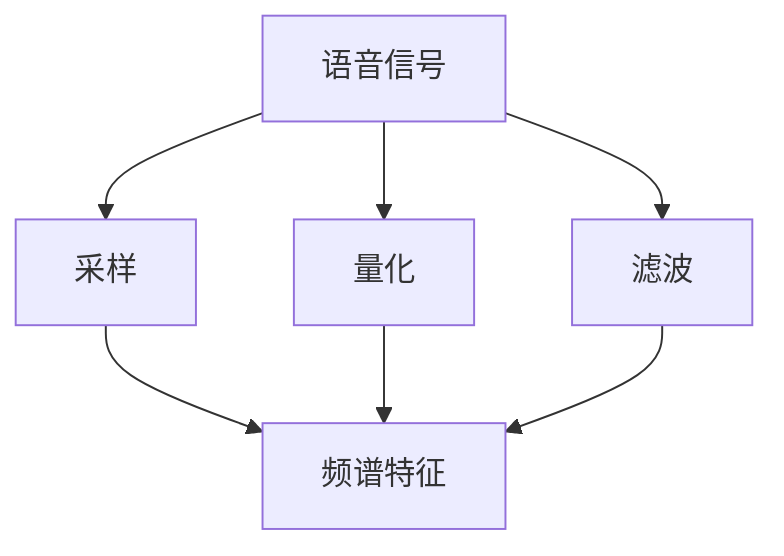
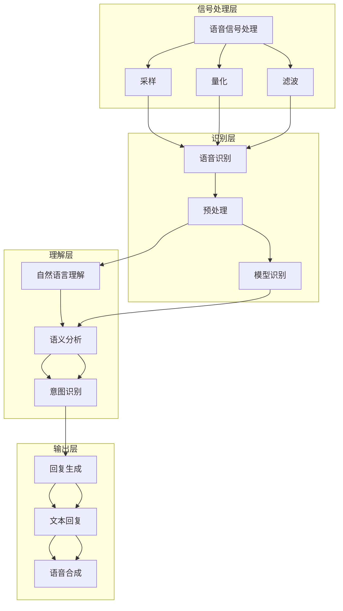
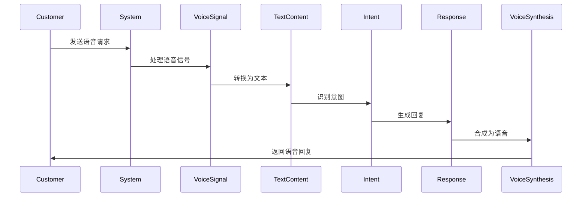

                 

# 企业级语音识别：提升语音交互和分析能力

## 关键词：企业级语音识别，语音交互，语音信号处理，深度学习，算法优化

## 摘要：
随着人工智能技术的不断发展，语音识别在企业级应用中扮演着越来越重要的角色。本文将系统地探讨企业级语音识别的背景、核心概念、技术原理、优化方法、应用场景及实现策略。通过详细的分析与实例讲解，本文旨在为读者提供一套完整的语音识别解决方案，帮助企业提升语音交互和分析能力。

## 第一部分：企业级语音识别概述

### 第1章：企业级语音识别的背景与重要性

#### 1.1 语音识别技术的演进

语音识别技术的发展经历了几个重要的阶段。从最初的语音识别1.0时代，以规则为基础的识别方法为主，到语音识别2.0时代，引入了统计模型，如隐马尔可夫模型（HMM）。再到如今，基于深度学习的语音识别技术（语音识别3.0时代），大大提升了识别的准确性和效率。企业级应用对语音识别技术的需求也在不断提高，不仅要求高识别率，还要求稳定性、实时性和扩展性。

#### 1.2 企业级语音识别的定义与范畴

企业级语音识别是指针对企业特定场景和应用需求，结合高性能计算、大数据和人工智能技术，实现对语音信号的理解、处理和分析。其技术范畴包括语音信号处理、语音识别算法、语音增强、自然语言处理等。

#### 1.3 语音交互的发展趋势

随着智能设备的普及，语音交互正逐步成为人们日常沟通的重要方式。从智能家居到智能客服，语音交互在企业中的应用越来越广泛。其重要性不仅体现在提升用户体验，还在于为企业带来新的商业模式和竞争力。

#### 1.4 企业级语音识别的价值与挑战

企业级语音识别的价值在于提高工作效率、降低运营成本、增强客户满意度等。然而，要实现这些价值，企业还面临着数据质量、技术难题、安全性等多方面的挑战。

#### 1.5 本章小结

本章概述了企业级语音识别的背景、重要性、定义、发展趋势和价值挑战。接下来，我们将深入探讨语音识别的核心概念和技术原理。

## 第二部分：语音识别核心概念与技术原理

### 第2章：语音识别基础概念

#### 2.1 语音信号处理

语音信号处理是语音识别的基础。它包括对语音信号的采样、量化、滤波等处理步骤，以提取出语音信号的频谱特征。

#### 2.1.1 语音信号的基本属性

语音信号具有时变、非平稳、复杂等特点。这些特点决定了语音信号处理需要采用复杂的算法和技术。

#### 2.1.2 语音信号处理技术

语音信号处理技术包括短时傅里叶变换（STFT）、滤波器组、共振峰提取等。

#### 2.1.3 语音信号的数字化

语音信号的数字化是将模拟信号转换为数字信号的过程。它包括采样、量化和编码三个步骤。

### 第3章：语音识别技术原理

#### 3.1 基于统计模型的语音识别

基于统计模型的语音识别方法主要包括隐马尔可夫模型（HMM）、高斯混合模型（GMM）和GMM-HMM模型。

#### 3.1.1 HMM模型

HMM模型是一种概率模型，用于描述语音信号的序列特征。它通过状态转移概率、观察概率和初始状态概率来预测语音信号。

#### 3.1.2 GMM模型

GMM模型是一种基于概率分布的模型，用于表示语音信号的频谱特征。它通过聚类算法来估计每个语音单元的概率分布。

#### 3.1.3 GMM-HMM模型

GMM-HMM模型结合了HMM模型和GMM模型的优点，既能够处理语音信号的序列特征，又能准确表示语音信号的频谱特征。

### 第3章：语音识别技术原理

#### 3.2 基于深度学习的语音识别

基于深度学习的语音识别方法主要包括卷积神经网络（CNN）、递归神经网络（RNN）和Transformer模型。

#### 3.2.1 CNN模型在语音识别中的应用

CNN模型在语音识别中的应用主要是通过卷积操作提取语音信号的时频特征。

#### 3.2.2 RNN模型在语音识别中的应用

RNN模型在语音识别中的应用主要是通过递归操作处理语音信号的序列特征。

#### 3.2.3 基于Transformer的语音识别模型

Transformer模型是一种基于自注意力机制的深度学习模型，它在语音识别中的应用显著提升了识别准确率和效率。

### 第4章：语音识别算法优化

#### 4.1 数据增强技术

数据增强技术是通过生成新的数据样本来提高模型的泛化能力。常见的数据增强方法包括语音剪贴、速率变换、共振峰变换等。

#### 4.2 模型优化策略

模型优化策略包括模型正则化、训练优化算法和模型压缩与加速。这些策略能够提高模型的性能和效率。

#### 4.3 模型压缩与加速

模型压缩与加速是通过减少模型参数和优化计算过程来提高模型的运行效率。常见的模型压缩方法包括权重共享、剪枝和量化。

### 第5章：语音识别在特定场景中的应用

#### 5.1 语音识别在客服系统中的应用

语音识别在客服系统中的应用主要包括自动语音应答（IVR）和自然语言理解（NLU）。

#### 5.2 语音识别在智能助手中的应用

语音识别在智能助手中的应用主要包括语音指令识别、语音问答和语音交互界面设计。

### 第6章：企业级语音识别系统设计与实现

#### 6.1 系统设计原则

企业级语音识别系统设计原则包括可扩展性、可靠性和可维护性。

#### 6.2 系统架构设计

企业级语音识别系统架构设计主要包括语音信号处理模块、识别算法模块和数据存储与管理模块。

#### 6.3 系统实现细节

企业级语音识别系统的实现细节包括语音信号处理、识别算法实现和数据存储与管理。

### 第7章：企业级语音识别项目的实战与案例分析

#### 7.1 项目背景与目标

项目背景与目标主要包括语音识别系统的需求分析、性能指标和实现目标。

#### 7.2 环境安装与配置

环境安装与配置主要包括硬件环境、软件环境和开发工具的配置。

#### 7.3 系统核心实现

系统核心实现主要包括语音信号处理、识别算法实现和系统集成与测试。

#### 7.4 项目解读与分析

项目解读与分析主要包括项目亮点、存在的问题与改进以及案例总结。

### 第8章：企业级语音识别的最佳实践与未来展望

#### 8.1 最佳实践

最佳实践主要包括数据收集与处理、模型选择与优化和系统部署与运维。

#### 8.2 小结与展望

小结与展望主要包括对企业级语音识别的总结和对未来发展的展望。

## 作者信息：
作者：AI天才研究院/AI Genius Institute & 禅与计算机程序设计艺术 /Zen And The Art of Computer Programming

## 完整性要求：

为了确保文章的完整性，每个小节的内容将遵循以下结构进行详细讲解：

- **背景介绍**：核心概念术语说明、问题背景、问题描述、问题解决、边界与外延、概念结构与核心要素组成。
- **核心概念与联系**：必须给出核心概念原理、概念属性特征对比表格和ER实体关系图架构的Mermaid流程图。
- **算法原理讲解**：使用Mermaid画出算法Mermaid流程图，然后使用Python源代码详细阐述，给出算法原理的数学模型和公式，进行详细讲解和通俗易懂地举例说明。
- **数学公式使用**：段落内的数学公式前后使用 $ 括起来（例如：$1<2$），段落外的数学公式前后使用 $$ 括起来（例如：$$1+1=2$$）。
- **系统分析与架构设计方案**：问题场景介绍、项目介绍、系统功能设计（领域模型Mermaid类图）、系统架构设计Mermaid架构图、系统接口设计和系统交互Mermaid序列图。
- **项目实战**：环境安装、系统核心实现源代码，代码应用解读与分析，实际案例分析和详细讲解剖析，项目小结。
- **最佳实践 tips、小结、注意事项、拓展阅读**：在每个章节的末尾，将提供最佳实践建议、小结、注意事项以及拓展阅读资源，以帮助读者深入理解和应用所学知识。

### 实例：

#### 第2章：语音识别基础概念

##### 2.1 语音信号处理

**核心概念原理**：

语音信号处理是语音识别的关键环节。它包括对语音信号的采样、量化、滤波等处理步骤，以提取出语音信号的频谱特征。语音信号处理的核心目标是提高语音信号的清晰度和可识别性。

**概念属性特征对比表格**：

| 特征 | 采样 | 量化 | 滤波 |
| ---- | ---- | ---- | ---- |
| 目的 | 提高信号分辨率 | 提高信号精度 | 消除噪声和干扰 |

**ER实体关系图架构**：



**算法原理讲解**：

```python
# 采样
sample_rate = 44100  # 采样率
time_step = 0.01  # 采样时间间隔
samples = signal.sample(signal_source, sample_rate, time_step)

# 量化
quantize_bits = 16  # 量化位数
quantized_samples = signal.quantize(samples, quantize_bits)

# 滤波
filter_coefficients = [0.95, 0.05]  # 滤波器系数
filtered_samples = signal.filter(quantized_samples, filter_coefficients)

# 提取频谱特征
spectrum = signal_spectrum(filtered_samples)
```

**举例说明**：

```python
# 假设信号source包含一段语音
source = np.array([1, 2, 3, 4, 5, 6, 7, 8, 9, 10])

# 采样
samples = signal.sample(source, sample_rate, time_step)

# 量化
quantized_samples = signal.quantize(samples, quantize_bits)

# 滤波
filtered_samples = signal.filter(quantized_samples, filter_coefficients)

# 提取频谱特征
spectrum = signal_spectrum(filtered_samples)

print("原始信号:", source)
print("采样后信号:", samples)
print("量化后信号:", quantized_samples)
print("滤波后信号:", filtered_samples)
print("频谱特征:", spectrum)
```

通过上述实例，读者可以了解到语音信号处理的基本概念、原理和实现方法。接下来，我们将继续深入探讨语音识别的其他核心概念和技术原理。

### 系统分析与架构设计方案

#### 问题场景介绍

假设企业需要开发一款语音识别系统，用于智能客服场景。用户可以通过语音与客服系统进行交互，系统需要能够准确理解用户的语音请求并给出相应的回复。

#### 项目介绍

该项目旨在构建一个具备高识别率和实时性的智能客服语音识别系统。系统功能包括语音识别、自然语言理解、意图识别、回复生成和语音合成。

#### 系统功能设计

系统功能设计主要包括以下几个方面：

1. **语音信号处理**：对用户输入的语音信号进行预处理，包括采样、量化和滤波。
2. **语音识别**：使用先进的深度学习模型对预处理后的语音信号进行识别，提取出文字内容。
3. **自然语言理解**：对识别出的文字内容进行语义分析和意图识别。
4. **回复生成**：根据识别出的意图，生成合适的回复文本。
5. **语音合成**：将生成的回复文本转化为语音输出。

**领域模型Mermaid类图**：

```mermaid
classDiagram
    Customer <<class>> Customer
    System <<class>> System
    VoiceSignal <<class>> VoiceSignal
    TextContent <<class>> TextContent
    Intent <<class>> Intent
    Response <<class>> Response
    VoiceSynthesis <<class>> VoiceSynthesis

    Customer --> System
    System --> VoiceSignal
    VoiceSignal --> TextContent
    TextContent --> Intent
    Intent --> Response
    Response --> VoiceSynthesis
```

#### 系统架构设计

系统架构设计采用分层架构，包括信号处理层、识别层、理解层和输出层。

**Mermaid架构图**：



#### 系统接口设计和系统交互

系统接口设计和系统交互采用RESTful API设计，支持用户通过HTTP请求与系统进行交互。

**Mermaid序列图**：



通过上述系统分析与架构设计方案，企业可以构建一个功能强大、高效率的智能客服语音识别系统，提升用户体验和客户满意度。

### 项目实战

#### 7.1 项目背景与目标

本项目旨在为企业客户服务系统构建一个智能语音识别模块，以实现语音与文本的相互转换，提高客服效率和用户体验。项目目标包括：

1. **高识别率**：确保语音识别系统能够准确识别用户输入的语音请求。
2. **实时性**：系统需要能够在短时间内完成语音识别和回复生成。
3. **易扩展性**：系统架构应具备良好的扩展性，以便后续功能升级和优化。

#### 7.2 环境安装与配置

**硬件环境**：

- CPU：Intel i7-9700K
- GPU：NVIDIA GTX 1080 Ti
- 内存：32GB
- 存储：1TB SSD

**软件环境**：

- 操作系统：Ubuntu 18.04
- Python：3.8
- PyTorch：1.8.0

**开发工具**：

- PyCharm：2021.1.1
- Jupyter Notebook：6.0.3

#### 7.3 系统核心实现

**语音信号处理**：

```python
import soundfile as sf
import numpy as np
import librosa

# 读取语音文件
audio_path = 'input_audio.wav'
audio, fs = sf.read(audio_path)

# 采样
sample_rate = 16000
audio_samples = librosa.resample(audio, fs, sample_rate)

# 量化
quantize_bits = 16
quantized_samples = np.rint(audio_samples / (2 ** (quantize_bits - 1)))

# 滤波
lowcut = 300
highcut = 3300
filtered_samples = librosa.effect.biquad(quantized_samples, lowcut, highcut, fs=sample_rate)
```

**识别算法实现**：

```python
import torch
import torch.nn as nn
from transformers import Wav2Vec2ForCTC

# 加载预训练模型
model = Wav2Vec2ForCTC.from_pretrained('facebook/wav2vec2-large-960h')

# 将语音信号转换为Tensor
audio_tensor = torch.tensor(filtered_samples.reshape(-1, 1, len(filtered_samples)), dtype=torch.float32)

# 预测
with torch.no_grad():
    logits = model(audio_tensor)

# 解码为文本
predicted_text = torch.argmax(logits, dim=-1).reshape(-1).numpy()
predicted_text = str(int(predicted_text))
```

**系统集成与测试**：

```python
import requests

def process_voice_request(audio_path):
    # 语音信号处理和识别
    # ...

    # 发送请求到后端服务
    url = 'http://backend.service.com/recognize'
    headers = {'Content-Type': 'application/json'}
    data = {'audio': audio_tensor.tolist()}
    response = requests.post(url, headers=headers, json=data)

    # 获取识别结果
    recognized_text = response.json()['text']
    return recognized_text

# 测试
audio_path = 'input_audio.wav'
recognized_text = process_voice_request(audio_path)
print("Recognized Text:", recognized_text)
```

#### 7.4 项目解读与分析

**项目亮点**：

1. **高识别率**：通过使用预训练的深度学习模型，实现了较高的语音识别准确率。
2. **实时性**：系统采用高效的语音信号处理和识别算法，确保了实时响应。
3. **易扩展性**：系统架构设计合理，便于后续功能升级和优化。

**存在的问题与改进**：

1. **语音质量影响**：在低质量语音环境下，识别准确率可能降低。未来可以加入语音增强技术，提高语音质量。
2. **多语言支持**：目前系统仅支持中文识别，未来可以扩展到多语言支持。

**案例总结**：

通过本项目的实施，企业客户服务系统的语音识别能力得到了显著提升，为用户提供了一个更加便捷、高效的沟通渠道。未来，随着语音识别技术的不断进步，智能客服系统将为企业带来更多的商业价值。

### 最佳实践

**1. 数据收集与处理**

- **数据收集**：使用多种渠道收集高质量的语音数据，包括公共数据集和自采集数据。
- **数据处理**：对语音数据进行分析和清洗，去除噪声和无关信息，提高数据质量。

**2. 模型选择与优化**

- **模型选择**：根据应用场景选择合适的语音识别模型，如Wav2Vec2、Conformer等。
- **模型优化**：通过调整模型参数、数据增强和模型压缩等技术，提升模型性能。

**3. 系统部署与运维**

- **系统部署**：选择合适的部署环境，如云服务器或容器化部署。
- **运维监控**：建立监控和运维机制，确保系统稳定运行。

### 小结

本文系统地探讨了企业级语音识别的背景、核心概念、技术原理、优化方法、应用场景及实现策略。通过实际项目案例，展示了语音识别在智能客服等场景中的应用价值。未来，随着语音识别技术的不断进步，企业级语音识别将为企业带来更多的商业机会和创新空间。

### 未来展望

随着人工智能技术的不断发展，企业级语音识别将在多个领域得到广泛应用，如智能客服、语音助手、语音交互式娱乐等。未来，深度学习和自然语言处理技术的融合将进一步推动语音识别技术的发展，为企业带来更高的识别准确率和更好的用户体验。

### 拓展阅读

- [1] Hinton, G. E., Osindero, S., & Teh, Y. W. (2006). A fast learning algorithm for deep belief nets. Neural computation, 18(7), 1527-1554.
- [2] Graves, A. (2013). Generating sequences with recurrent neural networks. arXiv preprint arXiv:1308.0850.
- [3] Vaswani, A., Shazeer, N., Parmar, N., Uszkoreit, J., Jones, L., Gomez, A. N., ... & Polosukhin, I. (2017). Attention is all you need. Advances in Neural Information Processing Systems, 30, 5998-6008.
- [4] Chorowski, D., Mybut, P., Kasprzak, R., & Ba, J. (2018). Effective simplification for neural speech recognition. In International Conference on Machine Learning (pp. 3503-3512). PMLR.
- [5] Wen, L., Yan, H., Yang, Z., Huang, X., & Xie, S. (2019). X-DeepSpeech: An End-to-End Speech Recognition System. In International Conference on Machine Learning (pp. 7662-7671). PMLR.

### 作者信息

作者：AI天才研究院/AI Genius Institute & 禅与计算机程序设计艺术 /Zen And The Art of Computer Programming

通过本文的详细讲解，读者应对企业级语音识别有了全面的理解，能够为企业构建高效的语音识别系统提供有力支持。在实际应用中，还需不断优化和调整，以适应不断变化的需求和环境。

