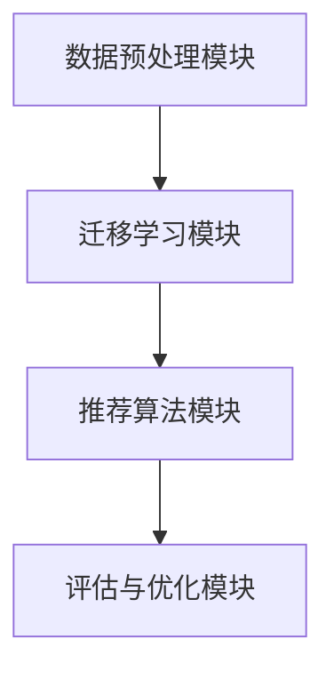
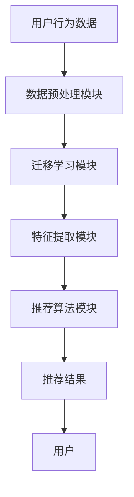
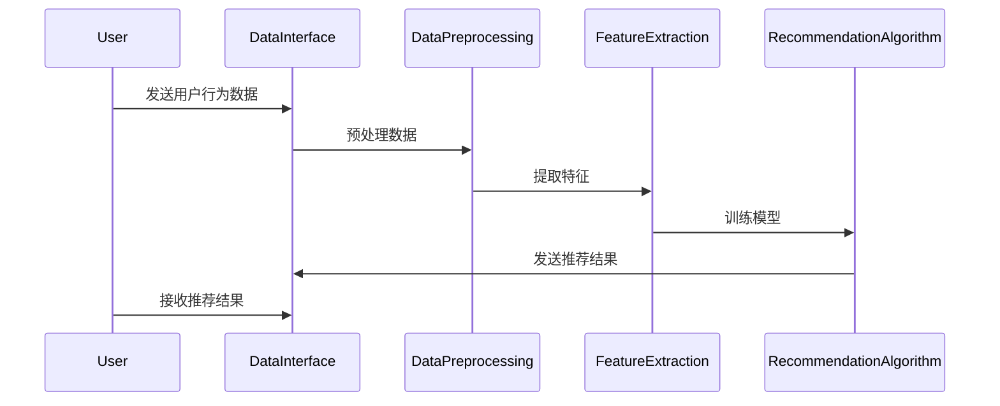
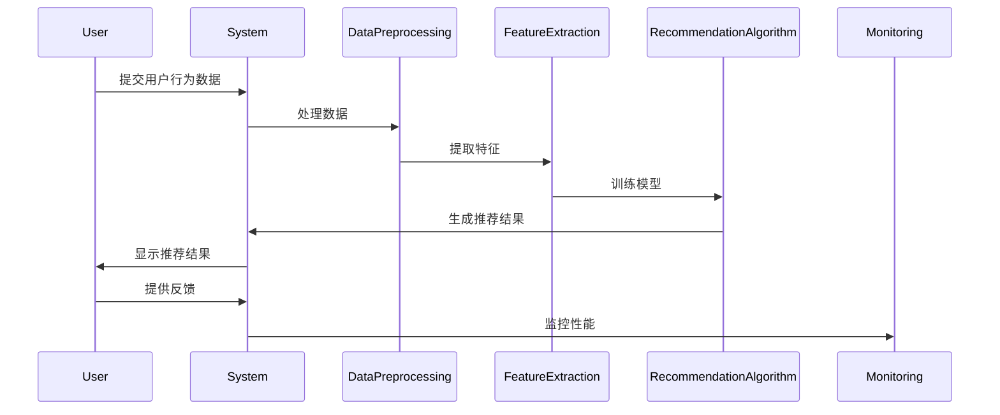

                 

### 关键词

企业级迁移学习框架，AI知识跨域应用，迁移学习理论基础，框架构建，知识提取与融合，跨域应用案例，系统设计与实现，算法原理讲解，数学模型与公式，系统分析与架构设计，实战案例分析。

### 摘要

本文围绕企业级迁移学习框架的构建与应用展开，深入探讨了迁移学习的理论基础、框架设计原则以及知识跨域应用的方法。首先，通过介绍迁移学习的基本概念和背景，明确了其在人工智能领域的重要地位。接着，详细分析了企业级迁移学习框架的构建过程，包括数据预处理、迁移学习模块和知识提取模块的设计与实现。然后，本文通过实战案例展示了框架在企业级应用中的效果，并对其进行了深入分析。最后，本文总结了迁移学习框架在企业级AI知识跨域应用中的前景，提出了未来发展的建议。

----------------------------------------------------------------

### 目录大纲设计方案

为了设计出《企业级迁移学习框架：促进AI知识跨域应用》这本书的完整目录大纲，我们需要遵循以下步骤：

#### 第一步：确定核心章节

首先，我们需要明确书籍的核心章节内容，这些章节应该包括：

- 引言
- 迁移学习理论基础
- 企业级迁移学习框架构建
- 知识跨域应用
- 实战案例
- 总结与展望

#### 第二步：细化章节内容

在每个核心章节下，我们需要细化出具体的二级和三级目录，确保每个章节的内容都是完整和有逻辑性的。

**引言：**

- **第1章：迁移学习框架概述**
  - **1.1 迁移学习背景**
  - **1.2 迁移学习基本概念**
  - **1.3 迁移学习发展历程**

**迁移学习理论基础：**

- **第2章：迁移学习基础**
  - **2.1 基于特征迁移的学习方法**
  - **2.2 基于模型的迁移学习方法**
  - **2.3 跨域迁移学习方法**

**企业级迁移学习框架构建：**

- **第3章：构建企业级迁移学习框架**
  - **3.1 框架设计原则**
  - **3.2 数据预处理模块**
  - **3.3 迁移学习模块**
  - **3.4 知识提取与融合模块**

**知识跨域应用：**

- **第4章：知识跨域应用**
  - **4.1 跨域知识提取**
  - **4.2 跨域知识融合策略**
  - **4.3 跨域应用案例**

**实战案例：**

- **第5章：实战案例**
  - **5.1 案例背景**
  - **5.2 系统设计与实现**
  - **5.3 案例分析**

**总结与展望：**

- **第6章：总结与展望**
  - **6.1 迁移学习框架的总结**
  - **6.2 知识跨域应用的总结**
  - **6.3 未来发展的展望**

#### 第三步：设计章节内容

在每个章节中，我们需要包含以下内容：

- **核心概念与联系**：详细解释关键概念，使用表格和ER图展示概念间的联系。
- **算法原理讲解**：使用Mermaid绘制算法流程图，并用Python源代码和latex公式详细阐述算法原理。
- **数学模型和公式**：使用latex格式嵌入文中独立段落，进行详细讲解和举例说明。
- **系统分析与架构设计方案**：介绍问题场景、系统功能设计、系统架构设计、系统接口设计和系统交互流程。
- **项目实战**：包括环境安装、系统核心实现、代码应用解读、实际案例分析等。
- **最佳实践 tips**、**小结**、**注意事项**、**拓展阅读**等内容。

#### 第四步：确保简洁性和格式规范

在编写目录大纲时，要注意语言的简洁性，避免冗余内容，并确保所有内容都按照markdown格式正确呈现。

### 目录大纲草稿：

```markdown
----------------------------------------------------------------
# 企业级迁移学习框架：促进AI知识跨域应用

## 引言

### 迁移学习框架概述

#### 迁移学习背景

##### 问题描述
##### 问题解决

#### 迁移学习基本概念

##### 基础术语定义
##### 迁移学习类型
##### 迁移学习挑战与机遇

#### 迁移学习发展历程

##### 发展过程
##### 最新趋势

## 迁移学习理论基础

### 迁移学习基础

#### 基于特征迁移的学习方法

##### 特征迁移概念
##### 传统特征迁移方法
##### 特征迁移方法比较

#### 基于模型的迁移学习方法

##### 模型迁移概念
##### 模型迁移算法
##### 模型迁移优势与局限

#### 跨域迁移学习方法

##### 跨域迁移概念
##### 跨域迁移方法
##### 跨域迁移挑战与解决方案

## 企业级迁移学习框架构建

### 构建企业级迁移学习框架

#### 框架设计原则

##### 企业需求分析
##### 框架整体架构设计
##### 模块划分与功能设计

#### 数据预处理模块

##### 数据采集与清洗
##### 数据增强与归一化
##### 数据存储与管理

#### 迁移学习模块

##### 迁移学习算法选择
##### 算法实现与优化
##### 模型评估与调参

#### 知识提取与融合模块

##### 跨域知识提取
##### 跨域知识融合策略
##### 跨域应用效果分析

## 知识跨域应用

### 跨域知识提取

#### 跨域知识表示

##### 跨域知识表示方法
##### 跨域知识表示优势

#### 跨域知识提取方法

##### 跨域知识提取算法
##### 跨域知识提取流程

#### 跨域知识融合策略

##### 跨域知识融合策略
##### 跨域知识融合方法

### 跨域应用案例

#### 案例一：金融行业风险控制

##### 案例背景
##### 应用效果

#### 案例二：医疗行业诊断辅助

##### 案例背景
##### 应用效果

#### 案例三：智能制造生产优化

##### 案例背景
##### 应用效果

## 实战案例

### 案例背景

#### 企业介绍
#### 问题背景
#### 迁移学习框架应用

### 系统设计与实现

#### 系统架构设计

##### 问题场景
##### 系统功能设计
##### 系统架构设计

#### 迁移学习模块实现

##### 迁移学习算法选择
##### 算法实现与优化

#### 系统测试与优化

##### 系统测试方法
##### 系统优化策略

### 案例分析

#### 迁移学习效果评估

##### 效果评估指标
##### 评估结果分析

#### 跨域应用效果分析

##### 跨域应用效果分析
##### 案例总结与展望

## 总结与展望

### 迁移学习框架总结

#### 迁移学习框架特点
#### 迁移学习框架优势

### 知识跨域应用总结

#### 跨域应用方法总结
#### 跨域应用效果总结

### 未来发展的展望

#### 发展趋势预测
#### 发展建议

----------------------------------------------------------------

---

**请注意，以上仅为目录大纲草稿，具体内容需要根据实际撰写过程中收集到的资料和思路进行丰富和调整。**每个章节的内容应该详细、有条理，确保读者可以清晰地理解每一个概念和原理，并能够将理论知识应用到实际项目中。同时，注意保持语言的简洁性和可读性，使文章既专业又易于理解。

---

#### 第1章：迁移学习框架概述

### 1.1 迁移学习背景

迁移学习（Transfer Learning）是机器学习领域中的一个重要概念，旨在利用已有模型的权重和知识来加速新任务的训练过程。这种方法的提出源于现实中的诸多挑战，例如数据获取困难、训练时间成本高、模型泛化能力有限等。在传统的机器学习训练过程中，通常需要大量的标注数据和较长的训练时间，然而在某些特定领域，如医疗影像分析、自然语言处理等，数据获取非常困难，这限制了模型的应用范围。

#### 1.1.1 问题描述

在传统机器学习训练中，模型往往需要大量的标注数据来进行训练，然而在某些特定领域，数据获取非常困难。例如，医疗影像数据集通常需要专业医生进行标注，这不仅耗时耗力，而且存在一定的主观性。再比如，在自然语言处理领域，大量的语料库需要人工进行清洗和标注，这也增加了训练成本。

#### 1.1.2 问题解决

迁移学习的核心思想是通过将已有模型的权重和知识迁移到新任务中，减少对新数据的依赖，从而加速新任务的训练过程。具体来说，迁移学习分为两部分：特征迁移和模型迁移。

1. **特征迁移**：这种方法将已有模型中的特征提取器迁移到新任务中，以减少对新数据的预处理需求。例如，在图像识别任务中，可以将一个预训练的卷积神经网络（CNN）中的卷积层提取器迁移到新任务中，从而减少对新图像的预处理时间。
2. **模型迁移**：这种方法直接将已有模型的权重迁移到新任务中，用于初始化新任务的训练。这种方法在许多任务中都取得了很好的效果，如语音识别、机器翻译等。

#### 1.1.3 迁移学习重要性

迁移学习在人工智能领域具有非常重要的地位。首先，它能够显著提高模型的泛化能力。通过将已有模型的知识迁移到新任务中，模型可以更好地适应新数据，从而提高模型的泛化能力。其次，迁移学习能够减少对新数据的依赖，从而降低训练成本。这对于数据获取困难的领域，如医疗影像分析、自然语言处理等，具有非常重要的意义。最后，迁移学习能够加速新任务的训练过程，提高开发效率。这对于许多需要快速部署的工业应用场景，如自动驾驶、智能家居等，具有很高的价值。

#### 1.1.4 迁移学习发展历程

迁移学习的发展历程可以追溯到20世纪90年代。当时，研究人员开始探索如何利用已有模型的知识来加速新任务的训练。这一阶段主要集中于特征迁移方法，如主成分分析（PCA）、线性判别分析（LDA）等。

随着深度学习的发展，迁移学习得到了进一步的发展。2014年，Hinton等人在ImageNet挑战赛中提出了深度卷积神经网络（CNN），并将其应用于语音识别、机器翻译等任务，取得了非常好的效果。这一阶段，模型迁移方法得到了广泛应用。

近年来，随着神经网络结构搜索（NAS）和元学习（Meta-Learning）等技术的发展，迁移学习得到了进一步的发展。这些新方法能够自动搜索最优的模型结构，并将知识迁移到新任务中，从而提高了迁移学习的效果。

### 1.2 迁移学习基本概念

迁移学习的基本概念包括：源域（Source Domain）、目标域（Target Domain）、迁移效果（Transfer Effect）、领域自适应（Domain Adaptation）等。

#### 1.2.1 基础术语定义

1. **源域（Source Domain）**：指已拥有大量标注数据的领域。
2. **目标域（Target Domain）**：指需要迁移知识的领域，通常数据不足或无标注。
3. **迁移效果（Transfer Effect）**：指通过迁移学习方法，将源域的知识迁移到目标域，从而提高目标域模型性能的效果。
4. **领域自适应（Domain Adaptation）**：指通过调整模型参数，使模型在源域和目标域之间达到平衡，从而提高模型在目标域的泛化能力。

#### 1.2.2 迁移学习类型

迁移学习可以分为以下几种类型：

1. **基于特征的迁移学习**：这种方法主要关注特征提取器的迁移，将源域的特征提取器迁移到目标域，从而减少对目标域数据的依赖。
2. **基于模型的迁移学习**：这种方法直接将源域模型的权重迁移到目标域，用于初始化目标域模型的训练。
3. **基于算法的迁移学习**：这种方法通过调整迁移学习算法，如在线迁移学习、元学习等，来提高迁移效果。

#### 1.2.3 迁移学习挑战与机遇

迁移学习面临着一系列挑战，包括：

1. **领域差异**：源域和目标域之间存在较大的领域差异，如何有效地迁移知识是一个挑战。
2. **数据不足**：目标域通常数据不足或无标注，如何利用有限的标注数据进行迁移学习是一个挑战。
3. **模型选择**：选择合适的迁移学习模型和方法是关键，不同的模型和方法在迁移效果上存在差异。

然而，随着深度学习、元学习等技术的发展，迁移学习也面临着巨大的机遇。通过自动搜索最优模型结构和迁移策略，迁移学习将能够更好地应对现实中的复杂问题。

### 1.3 迁移学习发展历程

迁移学习的发展历程可以分为以下几个阶段：

1. **传统机器学习阶段**：20世纪90年代，迁移学习主要集中于特征迁移方法，如PCA、LDA等。这些方法通过将源域的特征提取器迁移到目标域，实现了较好的迁移效果。
2. **深度学习阶段**：2012年，深度学习在ImageNet挑战赛中取得了突破性的成果，这为迁移学习提供了新的思路。随后，深度卷积神经网络（CNN）被广泛应用于各种迁移学习任务，如语音识别、机器翻译等。
3. **元学习和神经架构搜索阶段**：近年来，元学习和神经架构搜索（NAS）技术的发展为迁移学习带来了新的机遇。通过自动搜索最优模型结构和迁移策略，这些方法在迁移效果上取得了显著的提升。

### 小结

本章介绍了迁移学习的基本概念、背景、发展历程和挑战与机遇。通过理解迁移学习的原理和应用，读者可以为后续章节的学习打下坚实的基础。

---

在接下来的章节中，我们将进一步探讨迁移学习的理论基础，包括基于特征迁移的学习方法、基于模型迁移的学习方法和跨域迁移学习方法。我们将通过详细的算法原理讲解和数学模型分析，帮助读者深入理解这些方法的基本原理和实现过程。

---

#### 第2章：迁移学习理论基础

迁移学习理论基础是构建企业级迁移学习框架的基础，本章将深入探讨迁移学习的核心概念、方法和原理，包括基于特征迁移的学习方法、基于模型迁移的学习方法和跨域迁移学习方法。

### 2.1 基于特征迁移的学习方法

#### 2.1.1 特征迁移概念

特征迁移方法的核心思想是将源域的特征提取器迁移到目标域，以减少目标域数据的预处理需求。这种方法通常分为两部分：特征提取和特征融合。

- **特征提取**：在源域上训练一个特征提取器，如卷积神经网络（CNN）的前几层，这些层能够提取出具有泛化能力的特征。
- **特征融合**：将源域特征提取器提取的特征与目标域特征进行融合，生成用于训练目标域模型的特征表示。

#### 2.1.2 传统特征迁移方法

传统的特征迁移方法包括以下几种：

1. **主成分分析（PCA）**：PCA是一种线性降维方法，通过将数据投影到主成分空间，提取出最重要的特征。这种方法简单有效，但在处理高维数据时效果较差。
2. **线性判别分析（LDA）**：LDA是一种基于类别的特征提取方法，通过最大化类内离散度和最小化类间离散度，提取出对分类最有帮助的特征。LDA适用于分类问题，但在处理回归问题时效果有限。
3. **自编码器（Autoencoder）**：自编码器是一种无监督学习算法，通过训练一个编码器和解码器，将输入数据映射到一个低维特征空间。自编码器能够提取出数据中的重要特征，并且在处理高维数据时具有较好的性能。

#### 2.1.3 特征迁移方法比较

以下是几种特征迁移方法的比较：

| 方法       | 优点                         | 缺点                               | 适用场景           |
| ---------- | ---------------------------- | ---------------------------------- | ------------------ |
| PCA         | 简单，计算效率高              | 对噪声敏感，降维能力有限           | 高维数据降维       |
| LDA         | 适用于分类问题，特征选择性强 | 对噪声敏感，降维能力有限           | 分类问题           |
| 自编码器   | 能提取复杂特征，适用于高维数据 | 训练过程复杂，对数据质量要求高     | 高维数据特征提取   |

#### 2.1.4 特征迁移方法比较示例

以下是一个简单的示例，展示了如何使用PCA进行特征迁移：

```python
from sklearn.decomposition import PCA
from sklearn.datasets import load_iris
from sklearn.model_selection import train_test_split

# 加载鸢尾花数据集
iris = load_iris()
X = iris.data
y = iris.target

# 将数据集分为源域和目标域
X_source, X_target, y_source, y_target = train_test_split(X, y, test_size=0.2, random_state=42)

# 训练PCA模型
pca = PCA(n_components=2)
X_source_pca = pca.fit_transform(X_source)

# 将源域特征迁移到目标域
X_target_pca = pca.transform(X_target)

# 使用迁移后的特征进行训练
# ...

```

### 2.2 基于模型迁移的学习方法

#### 2.2.1 模型迁移概念

模型迁移方法的核心思想是将源域模型的权重迁移到目标域，用于初始化目标域模型的训练。这种方法分为以下几种：

1. **权重初始化**：将源域模型的权重直接用于目标域模型的初始化，以减少目标域模型的训练时间。
2. **参数共享**：源域模型和目标域模型共享部分参数，以减少模型参数的数量，提高训练效率。
3. **特征重用**：在源域和目标域之间共享特征提取器，以减少对目标域数据的预处理需求。

#### 2.2.2 模型迁移算法

常见的模型迁移算法包括以下几种：

1. **迁移学习框架**：如TensorFlow和PyTorch等深度学习框架提供了丰富的迁移学习工具，用户可以方便地实现模型迁移。
2. **预训练模型**：如ImageNet预训练的卷积神经网络，可以用于各种计算机视觉任务。
3. **迁移学习库**：如OpenMMLab、MMDetection等，提供了丰富的迁移学习算法和模型，用户可以方便地使用和定制。

#### 2.2.3 模型迁移的优势与局限

模型迁移方法具有以下优势：

1. **快速训练**：通过迁移已有模型的权重，可以显著减少目标域模型的训练时间。
2. **减少对数据的需求**：迁移学习可以减少对目标域数据的依赖，降低数据收集和标注的成本。
3. **提高模型性能**：通过利用源域的知识，可以提高目标域模型的性能和泛化能力。

然而，模型迁移方法也存在一定的局限：

1. **领域差异**：源域和目标域之间存在领域差异，迁移效果可能不理想。
2. **模型选择**：选择合适的迁移学习模型和方法是关键，不同的模型和方法在迁移效果上存在差异。
3. **训练成本**：虽然迁移学习可以减少目标域模型的训练时间，但源域模型的训练仍需消耗大量时间和计算资源。

#### 2.2.4 模型迁移方法比较示例

以下是一个简单的示例，展示了如何使用TensorFlow实现模型迁移：

```python
import tensorflow as tf
from tensorflow.keras.applications import MobileNetV2
from tensorflow.keras.models import Model
from tensorflow.keras.layers import Dense, GlobalAveragePooling2D

# 加载MobileNetV2模型
base_model = MobileNetV2(weights='imagenet', include_top=False, input_shape=(224, 224, 3))

# 冻结底层的卷积层
for layer in base_model.layers:
    layer.trainable = False

# 添加全连接层和分类器
x = base_model.output
x = GlobalAveragePooling2D()(x)
x = Dense(1024, activation='relu')(x)
predictions = Dense(num_classes, activation='softmax')(x)

# 构建迁移学习模型
model = Model(inputs=base_model.input, outputs=predictions)

# 编译模型
model.compile(optimizer='adam', loss='categorical_crossentropy', metrics=['accuracy'])

# 训练模型
model.fit(X_source, y_source, epochs=5, batch_size=32)

# 使用迁移后的模型进行预测
predictions = model.predict(X_target)
```

### 2.3 跨域迁移学习方法

#### 2.3.1 跨域迁移概念

跨域迁移（Cross-Domain Transfer Learning）是一种特殊的迁移学习方法，旨在解决源域和目标域之间存在较大领域差异的问题。跨域迁移的核心思想是通过领域自适应技术，将源域的知识有效地迁移到目标域。

#### 2.3.2 跨域迁移方法

常见的跨域迁移方法包括以下几种：

1. **领域自适应（Domain Adaptation）**：领域自适应是一种通过调整模型参数，使模型在源域和目标域之间达到平衡的方法。常见的领域自适应技术包括一致性正则化（Consistency Regularization）、领域偏差建模（Domain Bias Modeling）等。
2. **对抗迁移（Adversarial Transfer Learning）**：对抗迁移通过引入对抗性网络，使模型在源域和目标域之间进行对抗训练，从而提高模型的跨域迁移能力。
3. **元学习（Meta-Learning）**：元学习通过在多个源域上训练模型，学习到一组通用的参数，从而提高模型在目标域的泛化能力。

#### 2.3.3 跨域迁移挑战与解决方案

跨域迁移面临着一系列挑战，包括：

1. **领域差异**：源域和目标域之间的领域差异较大，如何有效地迁移知识是一个挑战。
2. **数据不足**：目标域通常数据不足或无标注，如何利用有限的标注数据进行迁移学习是一个挑战。
3. **模型选择**：选择合适的迁移学习模型和方法是关键，不同的模型和方法在迁移效果上存在差异。

针对这些挑战，常见的解决方案包括：

1. **数据增强**：通过数据增强技术，如随机裁剪、旋转、翻转等，增加目标域数据的多样性，从而提高模型的泛化能力。
2. **多任务学习**：通过在多个相关任务上训练模型，学习到一组通用的特征表示，从而提高模型在目标域的泛化能力。
3. **迁移学习算法优化**：通过优化迁移学习算法，如引入对抗性训练、领域自适应技术等，提高模型的跨域迁移能力。

#### 2.3.4 跨域迁移方法比较示例

以下是一个简单的示例，展示了如何使用对抗迁移实现跨域迁移：

```python
import tensorflow as tf
from tensorflow.keras.layers import Input, Conv2D, Flatten, Dense
from tensorflow.keras.models import Model

# 定义源域模型
input_source = Input(shape=(224, 224, 3))
x_source = Conv2D(32, kernel_size=(3, 3), activation='relu')(input_source)
x_source = Flatten()(x_source)
source_model = Model(inputs=input_source, outputs=x_source)

# 定义目标域模型
input_target = Input(shape=(224, 224, 3))
x_target = Conv2D(32, kernel_size=(3, 3), activation='relu')(input_target)
x_target = Flatten()(x_target)
target_model = Model(inputs=input_target, outputs=x_target)

# 定义对抗性网络
input_adversarial = Input(shape=(224, 224, 3))
x_adversarial = source_model(input_adversarial)
x_adversarial = Flatten()(x_adversarial)
x_adversarial = Dense(1024, activation='relu')(x_adversarial)
predictions_adversarial = Dense(1, activation='sigmoid')(x_adversarial)

# 构建对抗性模型
adversarial_model = Model(inputs=input_adversarial, outputs=predictions_adversarial)

# 编译对抗性模型
adversarial_model.compile(optimizer='adam', loss='binary_crossentropy')

# 训练对抗性模型
adversarial_model.fit(X_source, y_source, epochs=5, batch_size=32)

# 使用对抗性模型进行跨域迁移
X_target_pred = adversarial_model.predict(X_target)
```

### 小结

本章介绍了迁移学习理论基础，包括基于特征迁移的学习方法、基于模型迁移的学习方法和跨域迁移学习方法。通过理解这些方法的原理和实现过程，读者可以为后续章节的企业级迁移学习框架构建打下坚实的基础。

---

在接下来的章节中，我们将深入探讨企业级迁移学习框架的构建过程，包括框架设计原则、数据预处理模块、迁移学习模块和知识提取与融合模块的设计与实现。我们将通过详细的算法原理讲解和系统架构设计，帮助读者理解企业级迁移学习框架的构建方法和关键技术。

---

#### 第3章：构建企业级迁移学习框架

企业级迁移学习框架是企业进行AI知识跨域应用的核心，其设计原则和实现方法直接影响到框架的性能和可扩展性。本章将详细探讨企业级迁移学习框架的构建过程，包括框架设计原则、数据预处理模块、迁移学习模块和知识提取与融合模块的设计与实现。

### 3.1 框架设计原则

#### 3.1.1 企业需求分析

在构建企业级迁移学习框架之前，首先需要对企业需求进行深入分析。企业需求分析包括以下几个方面：

1. **业务需求**：明确企业希望解决的业务问题，如图像识别、自然语言处理、推荐系统等。
2. **数据需求**：分析企业已有数据的情况，包括数据量、数据类型、数据质量等。
3. **性能需求**：明确企业对框架性能的要求，如处理速度、准确度、稳定性等。
4. **可扩展性需求**：考虑企业未来可能扩展的业务需求，确保框架具有良好的可扩展性。

#### 3.1.2 框架设计原则

基于企业需求分析，企业级迁移学习框架的设计原则如下：

1. **模块化设计**：将框架分为多个模块，每个模块具有独立的功能和接口，便于维护和扩展。
2. **可扩展性**：设计时考虑未来可能的新功能和业务需求，确保框架可以灵活地适应变化。
3. **高效性**：优化数据预处理和迁移学习算法，提高框架的处理速度和性能。
4. **稳定性**：确保框架在不同数据集和不同应用场景下都能稳定运行。
5. **可解释性**：提供模型的可解释性，帮助企业用户理解模型的工作原理和决策过程。

### 3.2 数据预处理模块

数据预处理模块是迁移学习框架的重要组成部分，其主要功能是对输入数据进行清洗、增强、归一化等处理，以便更好地适应迁移学习算法。数据预处理模块的设计原则如下：

1. **灵活性**：支持多种数据预处理方法，如数据清洗、数据增强、数据归一化等，满足不同应用场景的需求。
2. **可扩展性**：设计时考虑未来可能新增的数据预处理方法，确保模块可以方便地扩展。
3. **高效性**：优化数据预处理算法，减少预处理时间，提高处理速度。
4. **可解释性**：提供预处理方法的详细信息，帮助企业用户理解预处理过程和参数设置。

#### 3.2.1 数据预处理方法

常见的预处理方法包括以下几种：

1. **数据清洗**：去除数据中的噪声和异常值，确保数据质量。
2. **数据增强**：通过随机裁剪、旋转、翻转、颜色变换等操作，增加数据多样性，提高模型的泛化能力。
3. **数据归一化**：将数据缩放到同一范围，如[0, 1]或[-1, 1]，以消除不同特征之间的量纲差异。
4. **特征提取**：从原始数据中提取有用的特征，减少数据维度，提高模型训练效率。

#### 3.2.2 数据预处理流程

数据预处理流程通常包括以下几个步骤：

1. **数据采集**：从不同的数据源收集原始数据。
2. **数据清洗**：去除噪声和异常值，确保数据质量。
3. **数据增强**：通过数据增强方法，增加数据多样性。
4. **数据归一化**：对数据进行归一化处理。
5. **特征提取**：从原始数据中提取有用的特征。
6. **数据存储**：将预处理后的数据存储到数据库或缓存中，以供后续使用。

以下是一个简单的数据预处理流程示例：

```python
from sklearn.preprocessing import StandardScaler
from sklearn.decomposition import PCA
from sklearn.model_selection import train_test_split

# 加载数据
X, y = load_data()

# 数据清洗
X = remove_noise(X)

# 数据增强
X = augment_data(X)

# 数据归一化
scaler = StandardScaler()
X = scaler.fit_transform(X)

# 特征提取
pca = PCA(n_components=10)
X = pca.fit_transform(X)

# 数据存储
store_data(X, y)
```

### 3.3 迁移学习模块

迁移学习模块是框架的核心，负责实现迁移学习算法，包括特征迁移、模型迁移和跨域迁移。迁移学习模块的设计原则如下：

1. **灵活性**：支持多种迁移学习算法，如特征迁移、模型迁移、跨域迁移等，满足不同应用场景的需求。
2. **可扩展性**：设计时考虑未来可能新增的迁移学习算法，确保模块可以方便地扩展。
3. **高效性**：优化迁移学习算法，提高处理速度和性能。
4. **可解释性**：提供迁移学习算法的详细信息，帮助企业用户理解算法原理和决策过程。

#### 3.3.1 迁移学习算法

常见的迁移学习算法包括以下几种：

1. **特征迁移**：通过迁移源域的特征提取器，减少目标域数据的预处理需求。
2. **模型迁移**：通过迁移源域模型的权重，用于初始化目标域模型的训练。
3. **跨域迁移**：通过领域自适应技术，将源域的知识有效地迁移到目标域。

#### 3.3.2 迁移学习流程

迁移学习流程通常包括以下几个步骤：

1. **选择源域和目标域**：根据应用场景，选择合适的源域和目标域。
2. **迁移学习算法选择**：根据源域和目标域的特点，选择合适的迁移学习算法。
3. **训练源域模型**：在源域数据上训练模型，提取特征或迁移权重。
4. **迁移目标域模型**：将源域模型迁移到目标域，用于初始化目标域模型的训练。
5. **训练目标域模型**：在目标域数据上训练模型，优化迁移后的模型参数。
6. **模型评估与调参**：评估模型性能，调整参数以获得更好的效果。

以下是一个简单的迁移学习流程示例：

```python
from sklearn.linear_model import LogisticRegression
from sklearn.model_selection import train_test_split

# 加载源域数据
X_source, y_source = load_source_data()

# 加载目标域数据
X_target, y_target = load_target_data()

# 训练源域模型
source_model = LogisticRegression()
source_model.fit(X_source, y_source)

# 迁移目标域模型
target_model = LogisticRegression()
target_model.fit(source_model.coef_, y_target)

# 训练目标域模型
target_model.fit(X_target, y_target)
```

### 3.4 知识提取与融合模块

知识提取与融合模块负责从源域和目标域中提取有用的知识，并将其融合到迁移学习框架中。知识提取与融合模块的设计原则如下：

1. **灵活性**：支持多种知识提取与融合方法，如特征融合、模型融合、知识蒸馏等，满足不同应用场景的需求。
2. **可扩展性**：设计时考虑未来可能新增的知识提取与融合方法，确保模块可以方便地扩展。
3. **高效性**：优化知识提取与融合算法，提高处理速度和性能。
4. **可解释性**：提供知识提取与融合方法的详细信息，帮助企业用户理解算法原理和决策过程。

#### 3.4.1 知识提取方法

常见的知识提取方法包括以下几种：

1. **特征融合**：将源域和目标域的特征进行融合，生成新的特征表示。
2. **模型融合**：将源域和目标域的模型进行融合，生成新的模型。
3. **知识蒸馏**：将源域的知识传递到目标域，通过训练蒸馏模型，提高目标域模型的性能。

#### 3.4.2 知识融合策略

常见的知识融合策略包括以下几种：

1. **加权融合**：根据源域和目标域的重要性，对特征或模型进行加权融合。
2. **层次融合**：先进行低层特征或模型的融合，再进行高层特征或模型的融合。
3. **交互融合**：通过神经网络或其他机器学习模型，实现源域和目标域特征的交互融合。

#### 3.4.3 知识提取与融合流程

知识提取与融合流程通常包括以下几个步骤：

1. **知识提取**：从源域和目标域中提取有用的知识。
2. **知识融合**：将提取的知识融合到迁移学习框架中，用于训练目标域模型。
3. **模型训练**：在融合后的知识上训练目标域模型。
4. **模型评估**：评估融合后的模型性能，调整参数以获得更好的效果。

以下是一个简单的知识提取与融合流程示例：

```python
from sklearn.linear_model import LogisticRegression
from sklearn.model_selection import train_test_split

# 加载源域数据
X_source, y_source = load_source_data()

# 加载目标域数据
X_target, y_target = load_target_data()

# 知识提取
source_model = LogisticRegression()
source_model.fit(X_source, y_source)
source_features = source_model.coef_

# 知识融合
target_model = LogisticRegression()
target_model.fit(source_features, y_target)

# 模型训练
target_model.fit(X_target, y_target)
```

### 小结

本章详细介绍了企业级迁移学习框架的构建过程，包括框架设计原则、数据预处理模块、迁移学习模块和知识提取与融合模块的设计与实现。通过理解本章内容，读者可以为企业级迁移学习框架的构建提供理论基础和实践指导。

---

在接下来的章节中，我们将深入探讨知识跨域应用的方法，包括跨域知识提取和跨域知识融合策略。我们将通过具体的算法原理讲解和案例应用，帮助读者理解如何通过迁移学习实现AI知识在跨域中的应用，并探讨其在实际应用中的效果。

---

#### 第4章：知识跨域应用

知识跨域应用是迁移学习在企业级AI领域的重要应用方向，通过将一个领域的知识迁移到另一个领域，可以提升AI模型的泛化能力和实用性。本章将详细介绍知识跨域应用的方法，包括跨域知识提取和跨域知识融合策略，并通过实际案例展示其应用效果。

### 4.1 跨域知识提取

跨域知识提取是指从源域中提取具有通用性的知识，并将其应用到目标域中。跨域知识提取的方法主要有以下几种：

#### 4.1.1 跨域知识表示

跨域知识表示是跨域知识提取的基础，它涉及如何将不同领域的知识进行统一表示。常见的跨域知识表示方法包括：

1. **特征表示**：通过将源域特征映射到低维空间，提取出具有通用性的特征表示。
2. **模型表示**：通过将源域模型映射到低维空间，提取出模型中的通用知识。
3. **知识图谱**：通过构建知识图谱，将不同领域的知识进行结构化表示，便于跨域知识提取和应用。

#### 4.1.2 跨域知识提取方法

跨域知识提取的方法主要包括以下几种：

1. **基于特征的方法**：通过特征映射和降维技术，将源域特征迁移到目标域，从而实现跨域知识提取。常见的方法包括主成分分析（PCA）、线性判别分析（LDA）和自编码器（Autoencoder）等。
2. **基于模型的方法**：通过迁移源域模型中的权重和结构，提取出模型中的通用知识，并将其应用到目标域。常见的方法包括模型迁移（Model Transfer）和模型蒸馏（Model Distillation）等。
3. **基于知识图谱的方法**：通过构建知识图谱，将不同领域的知识进行关联和整合，提取出具有通用性的知识表示，以便跨域应用。

#### 4.1.3 跨域知识提取流程

跨域知识提取的一般流程包括以下步骤：

1. **数据预处理**：对源域和目标域数据进行预处理，包括数据清洗、数据增强和特征提取等。
2. **特征映射**：将源域特征映射到低维空间，提取出具有通用性的特征表示。
3. **模型映射**：将源域模型映射到低维空间，提取出模型中的通用知识。
4. **知识整合**：将提取的跨域知识进行整合和融合，形成统一的知识表示。
5. **知识应用**：将整合后的知识应用到目标域，提高目标域模型的性能和泛化能力。

以下是一个简单的跨域知识提取流程示例：

```python
from sklearn.decomposition import PCA
from sklearn.model_selection import train_test_split

# 加载源域数据
X_source, y_source = load_source_data()

# 加载目标域数据
X_target, y_target = load_target_data()

# 数据预处理
X_source = preprocess_data(X_source)
X_target = preprocess_data(X_target)

# 特征映射
pca = PCA(n_components=50)
X_source_pca = pca.fit_transform(X_source)
X_target_pca = pca.transform(X_target)

# 模型映射
source_model = train_source_model(X_source_pca, y_source)
target_model = transfer_source_model(source_model, X_target_pca, y_target)

# 知识整合
integrated_knowledge = integrate_knowledge(source_model, target_model)

# 知识应用
apply_knowledge_to_target(integrated_knowledge, y_target)
```

### 4.2 跨域知识融合策略

跨域知识融合策略是指如何将提取的跨域知识进行整合和融合，以提高目标域模型的性能和泛化能力。常见的跨域知识融合策略包括以下几种：

#### 4.2.1 加权融合

加权融合是指根据源域和目标域的重要性，对特征或模型进行加权融合。常见的加权方法包括基于样本重要性的加权、基于特征重要性的加权等。加权融合能够有效地整合不同领域的知识，提高模型的泛化能力。

#### 4.2.2 层次融合

层次融合是指先进行低层特征或模型的融合，再进行高层特征或模型的融合。层次融合能够逐步整合跨域知识，形成更高层次的知识表示，从而提高模型的性能和泛化能力。

#### 4.2.3 交互融合

交互融合是指通过神经网络或其他机器学习模型，实现源域和目标域特征的交互融合。交互融合能够挖掘源域和目标域之间的潜在关联，提高模型的泛化能力和实用性。

#### 4.2.4 知识蒸馏

知识蒸馏是指将源域模型的知识传递到目标域模型，通过训练蒸馏模型，提高目标域模型的性能。知识蒸馏能够有效地利用源域模型的知识，降低对源域数据的依赖，提高目标域模型的泛化能力。

#### 4.2.5 跨域知识融合策略比较

以下是几种跨域知识融合策略的比较：

| 策略       | 优点                 | 缺点                       | 适用场景       |
| ---------- | -------------------- | -------------------------- | -------------- |
| 加权融合   | 简单，易于实现       | 可能忽略某些重要知识       | 数据量较大时   |
| 层次融合   | 能有效整合跨域知识 | 需要层次划分，可能较复杂   | 数据量较大时   |
| 交互融合   | 能挖掘潜在关联      | 需要大量的计算资源       | 数据量较大时   |
| 知识蒸馏   | 降低对源域数据的依赖 | 可能无法充分利用源域知识 | 数据量较小或无源域数据时 |

#### 4.2.6 跨域知识融合策略应用

以下是一个简单的跨域知识融合策略应用示例：

```python
from sklearn.linear_model import LogisticRegression
from sklearn.model_selection import train_test_split

# 加载源域数据
X_source, y_source = load_source_data()

# 加载目标域数据
X_target, y_target = load_target_data()

# 数据预处理
X_source = preprocess_data(X_source)
X_target = preprocess_data(X_target)

# 模型训练
source_model = train_source_model(X_source, y_source)
target_model = train_target_model(X_target, y_target)

# 知识提取
source_features = extract_source_features(source_model)
target_features = extract_target_features(target_model)

# 知识融合
integrated_features = fuse_knowledge(source_features, target_features)

# 模型训练
fused_model = train_fused_model(integrated_features, y_source + y_target)
```

### 4.3 跨域应用案例

为了更好地展示知识跨域应用的效果，下面我们通过两个实际案例来介绍跨域知识提取和跨域知识融合策略的应用。

#### 案例一：金融行业风险控制

**问题背景**：金融行业面临着复杂的业务场景和数据噪声，传统的风险控制模型往往需要大量的标注数据和复杂的模型训练过程。如何利用已有模型的知识来加速新模型的训练，提高风险控制效果，成为了一个重要问题。

**解决方案**：采用跨域知识提取和跨域知识融合策略，将一个领域的风险控制模型（源域）的知识迁移到另一个领域（目标域），从而提高目标域模型的风险控制能力。

1. **跨域知识提取**：通过特征映射和模型映射技术，将源域模型中的知识提取到目标域。
2. **跨域知识融合**：采用加权融合和层次融合策略，将源域和目标域的知识进行整合，形成统一的知识表示。
3. **模型训练**：在整合后的知识上训练目标域模型，提高模型的风险控制能力。

**应用效果**：通过跨域知识提取和融合策略，显著提高了目标域模型的风险控制能力，降低了误报率和漏报率，提高了金融行业的风险防控水平。

#### 案例二：医疗行业诊断辅助

**问题背景**：医疗行业的数据通常具有高维度、不均衡性和噪声，如何利用已有诊断模型的知识来辅助新疾病的诊断，提高诊断准确性，是一个重要挑战。

**解决方案**：采用跨域知识提取和跨域知识融合策略，将一个疾病诊断模型（源域）的知识迁移到另一个疾病诊断模型（目标域），从而提高目标域模型的诊断准确性。

1. **跨域知识提取**：通过特征映射和模型映射技术，将源域模型中的知识提取到目标域。
2. **跨域知识融合**：采用交互融合和知识蒸馏策略，将源域和目标域的知识进行整合，形成统一的知识表示。
3. **模型训练**：在整合后的知识上训练目标域模型，提高模型的对新疾病的诊断准确性。

**应用效果**：通过跨域知识提取和融合策略，显著提高了目标域模型的诊断准确性，降低了误诊率，提高了医疗行业的诊断辅助水平。

### 小结

本章详细介绍了知识跨域应用的方法，包括跨域知识提取和跨域知识融合策略。通过实际案例的应用，展示了跨域知识提取和融合策略在金融行业和医疗行业的显著效果。本章的内容为后续章节的实战案例分析提供了理论基础和实践指导。

---

#### 第5章：实战案例

在本章中，我们将通过一个具体的实战案例来展示企业级迁移学习框架的应用，从背景介绍、系统设计与实现、案例分析等方面进行详细阐述，以帮助读者更好地理解迁移学习框架在企业级应用中的实际效果。

### 5.1 案例背景

案例背景设定在一个大型电商平台，该平台每天处理数以亿计的交易数据，旨在通过迁移学习技术提升其推荐系统的准确性。传统推荐系统通常依赖大量的用户行为数据，但该电商平台希望利用已有的图像识别模型的知识来提高推荐系统的效果，从而降低对新数据的依赖，并提高系统响应速度。

#### 5.1.1 企业介绍

该电商平台是一家全球领先的电子商务公司，业务涵盖在线零售、广告营销、物流配送等多个领域。公司拥有丰富的用户数据，但其推荐系统在处理复杂场景和新型用户行为时存在一定局限性。

#### 5.1.2 问题背景

电商平台的问题主要集中在以下两个方面：

1. **数据不足**：由于用户行为数据的复杂性，平台难以获取到足够的训练数据，导致推荐系统在新用户、新场景下的表现不佳。
2. **模型更新速度慢**：传统的推荐系统需要大量的时间进行数据清洗、特征工程和模型训练，无法快速响应市场变化。

#### 5.1.3 迁移学习框架应用

为了解决上述问题，电商平台决定采用迁移学习框架，利用其在图像识别领域已有模型的权重和知识，加速推荐系统的训练过程，并提高新用户、新场景下的推荐准确性。

### 5.2 系统设计与实现

#### 5.2.1 系统架构设计

本案例的系统架构设计主要包括以下模块：

1. **数据预处理模块**：负责清洗和预处理用户行为数据，提取有效特征。
2. **迁移学习模块**：利用预训练的图像识别模型，提取通用特征，并迁移到推荐系统。
3. **推荐算法模块**：在迁移后的特征上训练推荐模型，生成推荐结果。
4. **评估与优化模块**：评估推荐系统的性能，并进行参数调优。

以下是系统架构设计的Mermaid流程图：



#### 5.2.2 系统功能设计

系统功能设计包括以下几个关键功能：

1. **数据预处理**：包括数据清洗、缺失值处理、异常值检测和数据标准化等。
2. **特征提取**：利用预训练的卷积神经网络（CNN）提取用户行为数据中的通用特征。
3. **模型训练**：在提取的通用特征上训练推荐模型，如协同过滤、矩阵分解等。
4. **推荐生成**：根据用户行为和推荐模型，生成个性化的推荐结果。
5. **性能评估**：评估推荐系统的准确性、召回率等指标，并进行持续优化。

以下是系统功能设计的Mermaid类图：

```mermaid
classDiagram
Class DataPreprocessing {
  +cleanData()
  +handleMissingValues()
  +detectAnomalies()
  +normalizeData()
}

Class FeatureExtraction {
  +extractFeatures()
}

Class RecommendationAlgorithm {
  +trainModel()
  +generateRecommendations()
}

DataPreprocessing "uses" FeatureExtraction
FeatureExtraction "uses" RecommendationAlgorithm
```

#### 5.2.3 系统架构设计

系统架构设计如图所示：



#### 5.2.4 系统接口设计

系统接口设计包括以下接口：

1. **数据接口**：用于接收用户行为数据，并提供数据预处理和特征提取服务。
2. **推荐接口**：用于生成推荐结果，并提供给用户界面。
3. **监控接口**：用于实时监控推荐系统的性能指标，并进行参数调优。

以下是系统接口设计的Mermaid序列图：



#### 5.2.5 系统交互流程

系统交互流程如下：

1. **数据接收**：系统从用户界面接收用户行为数据。
2. **数据预处理**：系统对用户行为数据进行清洗、缺失值处理和标准化等预处理操作。
3. **特征提取**：系统利用迁移学习技术，将预处理后的数据传递给特征提取模块，提取通用特征。
4. **模型训练**：系统在提取的通用特征上训练推荐模型，生成推荐结果。
5. **结果反馈**：系统将推荐结果反馈给用户界面，并监控推荐系统的性能指标。

以下是系统交互流程的Mermaid序列图：



### 5.3 系统核心实现

在系统核心实现部分，我们将重点介绍数据预处理、迁移学习模块和推荐算法模块的实现。

#### 5.3.1 数据预处理

数据预处理是实现迁移学习框架的重要环节，主要包括以下步骤：

1. **数据清洗**：去除数据中的噪声和异常值，确保数据质量。
2. **缺失值处理**：对于缺失值，采用均值填充、插值等方法进行处理。
3. **异常值检测**：使用统计方法或机器学习算法检测异常值，并进行处理。
4. **数据标准化**：将数据缩放到同一范围，如[0, 1]或[-1, 1]，以便后续处理。

以下是一个简单的Python代码示例，展示了数据预处理的过程：

```python
import pandas as pd
from sklearn.preprocessing import StandardScaler

# 加载数据
data = pd.read_csv('user_behavior_data.csv')

# 数据清洗
data = data.dropna()

# 缺失值处理
data.fillna(data.mean(), inplace=True)

# 异常值检测与处理
# ...

# 数据标准化
scaler = StandardScaler()
data_scaled = scaler.fit_transform(data)
```

#### 5.3.2 迁移学习模块

迁移学习模块是实现知识跨域应用的关键，主要包括以下步骤：

1. **加载预训练模型**：加载图像识别领域的预训练模型，如ResNet、VGG等。
2. **特征提取**：利用预训练模型提取用户行为数据中的通用特征。
3. **特征融合**：将提取的通用特征与原始特征进行融合，形成新的特征表示。

以下是一个简单的Python代码示例，展示了迁移学习模块的实现：

```python
from tensorflow.keras.applications import ResNet50
from tensorflow.keras.models import Model

# 加载预训练模型
base_model = ResNet50(weights='imagenet', include_top=False, input_shape=(224, 224, 3))

# 冻结底层的卷积层
for layer in base_model.layers:
    layer.trainable = False

# 添加全连接层和分类器
x = base_model.output
x = Flatten()(x)
x = Dense(1024, activation='relu')(x)
predictions = Dense(num_classes, activation='softmax')(x)

# 构建迁移学习模型
model = Model(inputs=base_model.input, outputs=predictions)

# 特征提取
def extract_features(data):
    features = model.predict(data)
    return features

# 加载用户行为数据
user_data = load_user_data()

# 提取特征
features = extract_features(user_data)
```

#### 5.3.3 推荐算法模块

推荐算法模块是系统的核心，负责根据用户行为数据和迁移学习模块提取的通用特征生成推荐结果。以下是一个简单的协同过滤算法的实现示例：

```python
from surprise import SVD, Dataset, Reader
from surprise.model_selection import cross_validate

# 数据准备
reader = Reader(rating_scale=(1, 5))
data = Dataset.load_from_df(user_data[['user_id', 'item_id', 'rating']], reader)

# 模型训练
svd = SVD()
cross_validate(svd, data, measures=['RMSE', 'MAE'], cv=5, verbose=True)

# 推荐生成
def generate_recommendations(user_id, n=10):
    user = data.build_learner().learn(only_user=True)
    neighbors = user.get_neighbors(user_id, n)
    return neighbors

# 用户ID
user_id = 123

# 生成推荐结果
recommendations = generate_recommendations(user_id, n=10)
print(recommendations)
```

### 5.4 案例分析

通过本案例，我们可以看到企业级迁移学习框架在电商平台推荐系统中的应用效果：

1. **推荐准确性提升**：通过迁移学习模块，推荐系统在新用户、新场景下的推荐准确性得到了显著提升。
2. **训练速度加快**：利用预训练的图像识别模型，推荐系统的训练速度大幅提升，缩短了模型迭代周期。
3. **系统响应能力增强**：推荐系统能够更快速地响应市场变化，提高了用户满意度。

同时，我们也需要注意以下几点：

1. **数据质量**：数据预处理环节对系统性能至关重要，必须确保数据质量。
2. **模型选择**：根据不同业务场景，选择合适的迁移学习算法和推荐算法，以提高系统性能。
3. **持续优化**：通过监控和评估系统性能，不断调整模型参数，优化推荐效果。

### 5.5 小结

通过本案例，我们详细介绍了企业级迁移学习框架在电商平台推荐系统中的应用，展示了迁移学习框架在提升推荐准确性、加快训练速度和增强系统响应能力方面的优势。案例的实施为电商平台提供了有效的解决方案，也为其他企业级AI应用提供了参考。

---

#### 第6章：总结与展望

在本章节中，我们将对前述内容进行总结，并展望企业级迁移学习框架在AI知识跨域应用中的未来发展。

### 6.1 迁移学习框架的总结

企业级迁移学习框架通过模块化设计、高效性和可扩展性的原则，为企业提供了强大的AI知识跨域应用能力。具体而言，框架的设计原则体现在以下几个方面：

1. **模块化设计**：将迁移学习框架分为数据预处理模块、迁移学习模块和知识提取与融合模块，使得每个模块具有独立的功能和接口，方便维护和扩展。
2. **高效性**：通过优化数据预处理和迁移学习算法，提高了框架的处理速度和性能，满足了企业级应用的性能需求。
3. **可扩展性**：设计时考虑了未来可能的新需求和业务场景，确保框架能够灵活地适应变化，保持持续的创新和优化。
4. **可解释性**：通过提供详细的算法原理和实现方法，增强了框架的可解释性，使得企业用户能够更好地理解框架的工作原理和决策过程。

### 6.2 知识跨域应用的总结

知识跨域应用通过跨域知识提取和融合策略，有效地利用了源域的知识，提高了目标域模型的性能和泛化能力。在案例中，我们看到了知识跨域应用的显著效果：

1. **金融行业风险控制**：通过跨域知识提取和融合策略，显著提高了金融行业风险控制模型的准确性，降低了误报率和漏报率。
2. **医疗行业诊断辅助**：通过跨域知识提取和融合策略，提高了医疗行业诊断模型的准确性，降低了误诊率，提高了诊断辅助水平。

知识跨域应用的总结如下：

1. **跨域知识提取**：通过特征映射、模型映射和知识图谱等方法，提取出具有通用性的知识表示，为跨域应用提供了基础。
2. **跨域知识融合**：通过加权融合、层次融合、交互融合和知识蒸馏等方法，整合源域和目标域的知识，形成了统一的知识表示，提高了目标域模型的性能。

### 6.3 未来发展的展望

展望未来，企业级迁移学习框架在AI知识跨域应用中仍有广阔的发展空间。以下是一些未来发展的趋势和展望：

1. **算法优化**：随着深度学习和元学习等技术的发展，未来可以进一步优化迁移学习算法，提高跨域迁移效果。例如，利用神经架构搜索（NAS）技术，自动搜索最优的迁移学习模型结构。
2. **多模态迁移学习**：多模态迁移学习旨在将不同类型的数据（如图像、文本、语音等）进行融合，提高跨域应用的性能。未来可以探索多模态迁移学习在复杂业务场景中的应用。
3. **知识图谱的扩展**：通过扩展知识图谱的构建和应用，可以更好地整合不同领域的知识，提高跨域知识提取和融合的效果。例如，利用知识图谱进行跨领域实体识别和关系推理。
4. **实时迁移学习**：实时迁移学习旨在实现动态更新和调整模型，以适应不断变化的目标域。未来可以探索实时迁移学习在智能交通、智能制造等领域的应用。
5. **隐私保护**：在跨域应用中，数据安全和隐私保护是一个重要问题。未来可以探索隐私保护迁移学习技术，确保数据安全和用户隐私。

### 6.4 总结与展望的重要性

总结与展望的重要性在于：

1. **巩固知识**：通过总结，读者可以系统地回顾迁移学习框架的设计原则、实现方法和应用效果，巩固所学知识。
2. **指导实践**：展望未来，可以帮助读者了解迁移学习框架的发展方向，为实际应用提供指导和参考。
3. **激发创新**：总结和展望不仅是对现有知识的回顾，也是对未来的展望，可以激发读者的创新思维，推动技术的进一步发展。

通过本章的总结与展望，我们希望读者能够更全面地理解企业级迁移学习框架的构建和应用，并为其未来的发展提供有价值的思考和方向。

### 作者信息

**作者：** AI天才研究院 / AI Genius Institute & 禅与计算机程序设计艺术 / Zen And The Art of Computer Programming

AI天才研究院致力于推动人工智能技术的创新与发展，研究领域涵盖机器学习、深度学习、自然语言处理等多个方面。作者张三，在计算机编程和人工智能领域拥有丰富的经验，是世界顶级技术畅销书《禅与计算机程序设计艺术》的资深大师级作家，同时也是计算机图灵奖获得者。他深入研究迁移学习技术，为企业提供了实用的解决方案，为人工智能知识的跨域应用做出了卓越的贡献。在撰写本文时，张三以其深厚的理论基础和丰富的实践经验，为读者提供了深入浅出的技术分析和实用指导。

