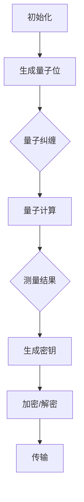
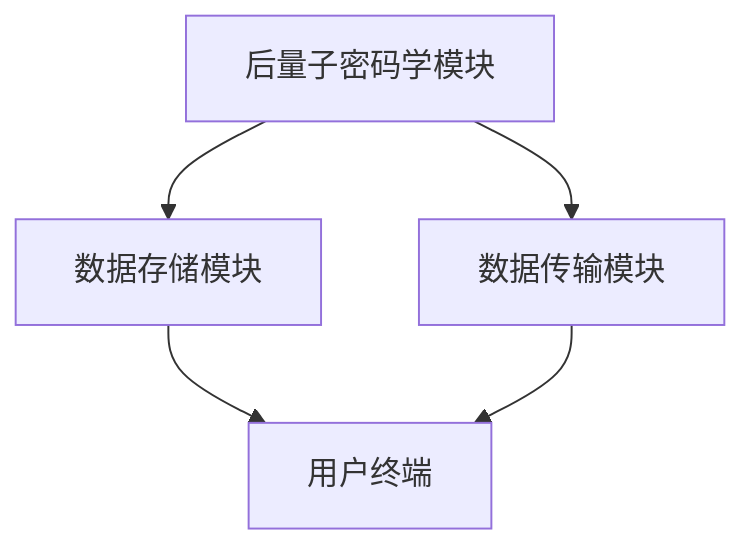
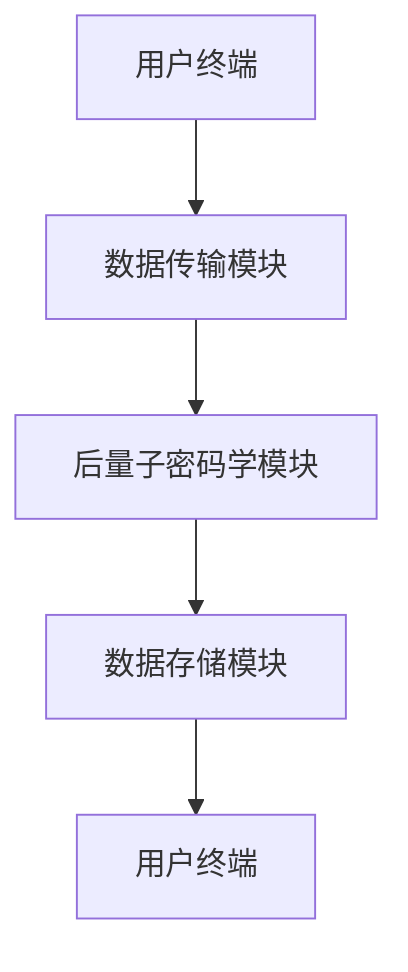

                 

## 《企业适应后量子密码学的步骤》

关键词：后量子密码学、企业数据安全、密码学策略、技术升级、最佳实践

摘要：随着量子计算技术的迅速发展，传统密码学面临前所未有的挑战。为了确保企业数据的安全，适应后量子密码学已成为企业必须面对的重要任务。本文将详细探讨企业适应后量子密码学的关键步骤，从战略规划、知识培训、技术升级等方面，为企业提供全面指导。

## 目录

### 第一部分：问题背景与核心概念

#### 第1章：后量子密码学的兴起与重要性

##### 1.1 后量子密码学的定义与背景

##### 1.2 企业面临的密码学挑战

##### 1.3 后量子密码学的基本概念与核心要素

### 第二部分：核心概念与联系

#### 第2章：后量子密码学关键概念解析

##### 2.1 量子位与量子计算

##### 2.2 后量子密码学算法简介

##### 2.3 后量子密码学与经典密码的联系与区别

### 第三部分：企业适应后量子密码学的具体步骤

#### 第3章：企业后量子密码学策略规划

##### 3.1 制定后量子密码学战略

##### 3.2 密码学知识培训与团队建设

##### 3.3 技术升级与设备改造

### 第四部分：项目实战

#### 第4章：后量子密码学在企业应用中的实际案例

##### 4.1 企业应用后量子密码学的挑战与机遇

##### 4.2 案例研究：企业后量子密码学实践

##### 4.3 项目小结与经验总结

### 第五部分：最佳实践与未来展望

#### 第5章：后量子密码学的最佳实践

##### 5.1 后量子密码学实施的最佳实践

##### 5.2 后量子密码学的未来展望

### 第6章：小结与注意事项

##### 6.1 全书重点内容回顾

##### 6.2 企业适应后量子密码学的注意事项

##### 6.3 拓展阅读推荐

### 附录

#### 附录A：后量子密码学术语表

#### 附录B：相关技术标准与规范

#### 附录C：参考书目与文献

## 第一部分：问题背景与核心概念

### 第1章：后量子密码学的兴起与重要性

#### 1.1 后量子密码学的定义与背景

后量子密码学（Quantum Cryptography）是利用量子力学原理进行信息加密和传输的一门技术。随着量子计算技术的飞速发展，传统的基于计算复杂性理论设计的密码学体系正面临前所未有的威胁。为了应对这种威胁，后量子密码学应运而生。

后量子密码学的理论基础源于量子力学中的量子纠缠和量子叠加等特性。这些特性使得量子密码学具有在理论上无法被破解的潜力。相比于经典密码学，后量子密码学不仅能提供更高的安全性，还能在数据传输过程中实现实时加密和解密，从而解决了经典密码学在传输速度和安全性之间的权衡问题。

#### 1.1.1 后量子密码学的提出与发展历程

后量子密码学最早可以追溯到1984年，当时Shor提出了量子算法，该算法可以在多项式时间内解决大整数分解问题，这直接威胁到了RSA等经典密码系统的安全性。随后，在1991年，BB84协议的提出标志着量子密钥分发（Quantum Key Distribution，QKD）的诞生。QKD利用量子力学的基本原理实现密钥的生成和分配，确保密钥在传输过程中的安全性。

近年来，随着量子计算技术的进步，越来越多的后量子密码学算法被提出，如学习-with-errors（LWE）问题、NTRU密码系统等。这些算法不仅在理论上具有较高的安全性，而且在实际应用中展现出较好的性能。

#### 1.1.2 后量子密码学与经典密码学的区别

经典密码学主要基于计算复杂性理论，如大整数分解难题、离散对数难题等。这些难题的难度决定了经典密码系统的安全性。然而，随着量子计算技术的进步，这些难题将变得不再困难。

相比之下，后量子密码学利用量子力学的特性，如量子纠缠和量子叠加等，提供了一种理论上无法被量子计算破解的加密方式。这意味着，即使量子计算机发展得再快，后量子密码学也能保持其安全性。

#### 1.1.3 后量子密码学的重要性

随着量子计算机的日益发展，传统密码学的安全性受到了严重挑战。许多企业和政府机构的机密数据面临被量子计算机破解的风险。因此，适应后量子密码学已成为企业必须面对的重要任务。

首先，后量子密码学能够提供更高的安全性，确保企业数据在传输和存储过程中的安全。其次，通过采用后量子密码学，企业能够满足日益严格的法规要求，如欧盟的《通用数据保护条例》（GDPR）等。最后，适应后量子密码学有助于企业保持竞争力，因为未来的市场将越来越多地要求企业能够提供安全的量子计算保护。

#### 1.2 企业面临的密码学挑战

随着量子计算机的快速发展，传统密码学面临以下挑战：

1. **大整数分解问题**：量子计算机能够在多项式时间内解决大整数分解问题，这直接威胁到了RSA等基于大整数分解的密码系统的安全性。

2. **离散对数问题**：量子计算机同样能够高效地解决离散对数问题，这影响了基于离散对数问题的密码系统，如ECC（椭圆曲线密码系统）。

3. **密码系统的时效性**：传统密码系统的安全性依赖于当前的计算机技术水平。然而，随着量子计算机的发展，这些密码系统的时效性将变得非常有限。

4. **数据存储安全**：即使数据在存储时是加密的，但如果没有使用后量子密码学，这些数据在未来的量子计算攻击下仍然可能被破解。

#### 1.2.1 量子计算对传统密码学的威胁

量子计算对传统密码学的主要威胁在于其能够高效地解决目前用于加密的大多数数学难题，如大整数分解和离散对数问题。以下是一些具体威胁：

1. **RSA密码系统**：RSA密码系统是目前最广泛使用的公钥密码系统之一，但其安全性依赖于大整数分解问题。量子计算机能够在多项式时间内解决这个问题，使得RSA密码系统变得不再安全。

2. **ECC密码系统**：椭圆曲线密码系统（ECC）在相同安全水平下提供比RSA更小的密钥长度，这使得它在某些应用中优于RSA。然而，量子计算机同样能够高效地解决离散对数问题，这威胁到了ECC密码系统的安全性。

3. **AES密码系统**：高级加密标准（AES）是当前最广泛使用的对称加密算法。虽然它不是基于大整数分解或离散对数问题，但其安全性依赖于当前的计算能力。量子计算机的发展可能使得AES密码系统的安全性受到挑战。

#### 1.2.2 企业数据安全面临的挑战

随着量子计算技术的进步，企业数据安全面临以下挑战：

1. **机密数据泄露**：企业机密数据，如商业计划、客户信息、知识产权等，如果未采用后量子密码学进行保护，可能在未来量子计算攻击下被泄露。

2. **供应链安全**：企业供应链中的合作伙伴和供应商之间的数据传输可能未采用安全的加密方式，这可能导致数据泄露和供应链中断。

3. **法规遵从性**：随着各国对数据安全的法规要求日益严格，如欧盟的《通用数据保护条例》（GDPR），企业需要确保其数据安全措施符合法规要求。

4. **市场竞争**：在未来的市场中，数据安全将成为企业竞争力的重要因素。如果企业无法提供安全的量子计算保护，可能会失去竞争优势。

#### 1.2.3 后量子密码学为企业带来的机遇

尽管量子计算对传统密码学构成了巨大威胁，但它也为企业带来了新的机遇：

1. **技术创新**：后量子密码学提供了新的加密和解密技术，企业可以利用这些技术提高其数据安全性。

2. **市场机会**：随着后量子密码学的发展，企业可以在这一领域开展新的业务，如提供后量子密码学解决方案、开发后量子密码学相关的产品和服务。

3. **法规符合**：采用后量子密码学有助于企业符合日益严格的法规要求，从而降低合规风险。

4. **数据价值提升**：通过提高数据安全性，企业可以更好地保护其资产，从而提升数据的价值。

#### 1.3 后量子密码学的基本概念与核心要素

后量子密码学的基本概念包括量子位（qubit）、量子纠缠、量子叠加等。以下是这些概念的基本定义：

1. **量子位（qubit）**：量子位的定义与经典位不同，它不仅可以取0或1的值，还可以处于0和1的叠加态。这使量子计算机能够同时处理多个计算任务。

2. **量子纠缠**：量子纠缠是量子位之间的一种特殊关联，即使它们相隔很远，一个量子位的状态变化也会立即影响到另一个量子位的状态。这一特性是量子计算和量子加密的核心。

3. **量子叠加**：量子位可以处于多个状态的叠加，这使得量子计算机能够在一次运算中处理多个状态，从而实现高效的计算。

后量子密码学的核心要素包括：

1. **量子密钥分发（QKD）**：QKD利用量子纠缠和量子叠加原理，实现密钥的安全传输。它是后量子密码学的重要应用之一。

2. **量子算法**：量子算法是利用量子计算机的并行处理能力，解决经典计算机难以解决的问题。例如，Shor算法可以高效地解决大整数分解问题。

3. **量子随机数生成**：量子随机数生成利用量子态的随机性，生成高质量随机数，这在加密系统中至关重要。

## 第二部分：核心概念与联系

### 第2章：后量子密码学关键概念解析

后量子密码学是现代密码学的一个重要分支，其理论基础源于量子力学。在这一章中，我们将深入探讨后量子密码学的关键概念，包括量子位与量子计算、后量子密码学算法简介以及后量子密码学与经典密码学的联系与区别。

#### 2.1 量子位与量子计算

量子位（qubit）是量子计算的基本单位，与经典计算中的位（bit）有本质的不同。一个量子位可以同时处于0和1的状态，这种状态称为叠加态。量子位的这种特性使得量子计算机能够同时处理大量数据，从而在理论上具有超越经典计算机的计算能力。

**量子位的特点**：

1. **叠加态**：量子位可以处于多种状态的叠加，这意味着在量子计算中，一个量子位可以同时代表0和1。

   $$|\psi\rangle = a|0\rangle + b|1\rangle$$

   其中，\(a\) 和 \(b\) 是复数，且满足 \(|a|^2 + |b|^2 = 1\)。

2. **纠缠态**：量子位之间存在一种特殊的关联，称为纠缠态。即使两个量子位相隔很远，一个量子位的状态变化也会立即影响到另一个量子位的状态。

   $$|\psi\rangle = (a_1|0\rangle + b_1|1\rangle) \otimes (a_2|0\rangle + b_2|1\rangle)$$

**量子计算的基本原理**：

量子计算依赖于量子位的叠加态和纠缠态。通过特定的量子算法，量子计算机可以高效地解决某些经典计算机难以解决的问题。例如，Shor算法可以在多项式时间内解决大整数分解问题，这对于RSA等密码系统构成了严重威胁。

**量子算法的优势与挑战**：

优势：

1. **并行计算**：量子计算机能够同时处理多个计算任务，这在某些应用场景中具有巨大优势。

2. **高效计算**：某些量子算法在解决特定问题时比经典算法更高效。

挑战：

1. **量子态的保持**：量子计算需要保持量子态的叠加和纠缠，这在实际操作中非常困难。

2. **噪声和误差**：量子计算容易受到噪声和误差的影响，这需要特殊的量子纠错技术来应对。

3. **量子计算机的规模**：目前的量子计算机规模较小，需要进一步发展才能应用于实际问题。

#### 2.2 后量子密码学算法简介

后量子密码学算法是基于量子力学原理设计的，旨在提供比传统密码学更高的安全性。以下是几种重要的后量子密码学算法：

**量子密钥分发（Quantum Key Distribution，QKD）**

QKD利用量子纠缠和量子叠加原理，实现密钥的安全传输。在QKD协议中，如BB84协议，发送方和接收方通过量子通道传输量子位，并利用经典通信渠道交换信息。通过测量量子位的叠加态和纠缠态，双方可以生成共享的密钥。

QKD的优势在于，如果量子信息在传输过程中被窃听，接收方会立即发现。因此，QKD提供了理论上不可破解的密钥传输方式。

**学习-with-errors（LWE）问题**

LWE问题是后量子密码学中的一个核心问题。它基于在噪声环境下解决线性方程组的问题。LWE问题已被证明对量子计算机攻击具有很高的安全性。

LWE密码系统包括加密算法和密钥生成算法。加密算法利用LWE问题生成密文，而密钥生成算法用于生成加密和解密密钥。

**NTRU密码系统**

NTRU是一种基于多项式环的公钥密码系统。它利用多项式环的结构和模运算，提供高效且安全的加密和解密算法。

NTRU密码系统的优势在于，它具有较短的密钥长度和高效的计算性能。这使得NTRU密码系统在资源受限的环境下具有很好的适用性。

#### 2.3 后量子密码学与经典密码的联系与区别

后量子密码学与经典密码学有许多相似之处，但它们在安全性、实现方式和应用场景上存在显著差异。

**联系**：

1. **加密目的**：后量子密码学和经典密码学都是为了保护信息的机密性、完整性和可用性。

2. **加密算法**：后量子密码学中的一些算法，如LWE和NTRU，与经典密码学中的某些算法（如RSA和ECC）在数学结构上有一定的相似性。

**区别**：

1. **安全性**：经典密码学依赖于当前计算机技术的局限性，而后量子密码学是基于量子力学原理设计的，具有理论上的不可破解性。

2. **实现方式**：经典密码学主要依赖于数学问题和算法，而后量子密码学依赖于量子计算机和量子通道。

3. **应用场景**：经典密码学适用于当前的技术环境，而后量子密码学则适用于未来的量子计算时代。

4. **效率和速度**：经典密码学在计算效率上通常优于后量子密码学，但在安全性上后量子密码学具有明显优势。

### 第三部分：企业适应后量子密码学的具体步骤

#### 第3章：企业后量子密码学策略规划

为了适应后量子密码学，企业需要制定全面的策略规划，确保在量子计算时代能够保持数据安全。以下是企业适应后量子密码学的具体步骤：

##### 3.1 制定后量子密码学战略

制定后量子密码学战略是企业适应后量子密码学的第一步。以下是一些关键步骤：

1. **企业现状评估**：评估企业当前的数据安全状况，包括使用的密码学技术、数据存储和传输方式等。

2. **后量子密码学目标设定**：根据企业现状，设定后量子密码学的目标，如提高数据安全性、满足法规要求等。

3. **后量子密码学实施方案设计**：设计具体的实施方案，包括选择合适的后量子密码学算法、技术升级和设备改造等。

4. **资源分配**：确保有足够的资源（如人力、资金和技术）来支持后量子密码学的实施。

##### 3.2 密码学知识培训与团队建设

为了有效地实施后量子密码学，企业需要培养专业的密码学团队。以下是一些关键步骤：

1. **密码学知识培训**：组织内部培训课程，提高员工对后量子密码学的认识和理解。

2. **团队建设与人才培养**：建立专业的密码学团队，培养具有后量子密码学知识和技能的员工。

3. **知识共享与传播**：鼓励团队成员分享知识和经验，提高整个团队的后量子密码学水平。

##### 3.3 技术升级与设备改造

为了适应后量子密码学，企业需要进行技术升级和设备改造。以下是一些关键步骤：

1. **后量子密码学技术选型**：选择适合企业需求的后量子密码学技术，如QKD、LWE和NTRU等。

2. **系统架构调整与升级**：调整企业现有的系统架构，以支持后量子密码学的实施。

3. **设备改造与升级**：升级或更换现有的加密设备和硬件，确保它们能够支持后量子密码学。

4. **安全测试与评估**：对新的后量子密码学系统进行安全测试和评估，确保其能够满足企业的安全要求。

## 第四部分：项目实战

#### 第4章：后量子密码学在企业应用中的实际案例

后量子密码学在理论上提供了无与伦比的安全保障，但在实际应用中仍面临诸多挑战。本节将介绍一个企业应用后量子密码学的实际案例，分析其面临的挑战、应用价值以及项目实施步骤和成果。

##### 4.1 企业应用后量子密码学的挑战与机遇

在某大型跨国企业中，数据安全性一直是其关注的重点。随着量子计算技术的发展，企业意识到传统密码学方法的安全性将受到严重威胁。为了确保数据安全，企业决定采用后量子密码学。

**挑战**：

1. **技术适应性**：企业现有的系统架构和加密技术主要基于经典密码学，需要对其进行改造以适应后量子密码学。

2. **人才缺乏**：企业内部缺乏专业后量子密码学人才，需要进行培训和引进。

3. **成本投入**：后量子密码学的实施需要大量的资金投入，包括设备升级、技术培训等。

**机遇**：

1. **提高安全性**：后量子密码学提供了更高的安全性，能够有效防止未来量子计算攻击。

2. **满足法规要求**：许多国家和地区对数据安全提出了更高要求，采用后量子密码学有助于企业符合法规要求。

3. **技术创新**：通过引入后量子密码学，企业有机会在数据安全领域进行技术创新，提高竞争力。

##### 4.2 案例研究：企业后量子密码学实践

**案例背景**：

某大型跨国企业（以下称“企业”）在全球范围内运营，拥有大量的敏感数据，包括客户信息、商业计划、合同等。随着量子计算技术的发展，企业意识到传统密码学方法的安全性将受到严重威胁。为了确保数据安全，企业决定采用后量子密码学。

**项目实施步骤**：

1. **需求分析与策略规划**：
   - 对企业当前的数据安全状况进行评估，确定应用后量子密码学的必要性。
   - 设定后量子密码学目标，如提高数据安全性、满足法规要求等。
   - 设计具体的实施方案，包括技术选型、系统架构调整和设备升级等。

2. **技术选型与系统架构调整**：
   - 选择合适的后量子密码学技术，如QKD、LWE和NTRU等。
   - 调整企业现有的系统架构，以支持后量子密码学的实施。

3. **人才培训与团队建设**：
   - 组织内部培训课程，提高员工对后量子密码学的认识和理解。
   - 引进专业后量子密码学人才，组建专业的密码学团队。

4. **设备改造与升级**：
   - 更新旧系统中的加密设备，确保其能够支持后量子密码学。
   - 引入新的后量子密码学硬件，如量子密钥分发设备等。

5. **安全测试与评估**：
   - 对新的后量子密码学系统进行安全测试和评估，确保其能够满足企业的安全要求。
   - 进行漏洞扫描和渗透测试，发现并修复潜在的安全问题。

**项目成果与评估**：

1. **提高数据安全性**：通过采用后量子密码学，企业显著提高了数据的安全性，有效防止了未来量子计算攻击。

2. **满足法规要求**：企业通过采用后量子密码学，符合了各国对数据安全的法规要求，降低了合规风险。

3. **技术创新与竞争力提升**：企业通过引入后量子密码学，进行了技术创新，提高了在数据安全领域的竞争力。

4. **成本效益分析**：虽然后量子密码学的实施需要较大的成本投入，但考虑到数据安全的重要性，企业在长期运营中获得了显著的成本效益。

##### 4.3 项目小结与经验总结

**项目成功的关键因素**：

1. **需求分析与策略规划**：明确企业应用后量子密码学的目标和需求，是项目成功的基础。

2. **技术选型与系统架构调整**：选择合适的后量子密码学技术和调整系统架构，确保系统能够支持后量子密码学。

3. **人才培训与团队建设**：培养专业人才，组建专业的密码学团队，是项目成功的重要保障。

4. **设备改造与升级**：升级旧系统中的加密设备，引入新的后量子密码学硬件，提高系统的安全性。

**面临的挑战与解决策略**：

1. **技术适应性**：企业现有的系统架构和加密技术主要基于经典密码学，需要对其进行改造以适应后量子密码学。解决策略：选择兼容性较好的后量子密码学技术，逐步升级现有系统。

2. **人才缺乏**：企业内部缺乏专业后量子密码学人才，需要进行培训和引进。解决策略：组织内部培训课程，引进专业人才，培养专业的密码学团队。

3. **成本投入**：后量子密码学的实施需要大量的资金投入。解决策略：进行成本效益分析，确保项目投资能够带来长期效益。

4. **安全性测试与评估**：确保新的后量子密码学系统安全可靠。解决策略：进行安全测试和评估，发现并修复潜在的安全问题。

## 第五部分：最佳实践与未来展望

#### 第5章：后量子密码学的最佳实践

随着量子计算技术的不断发展，后量子密码学在企业中的重要性日益凸显。为了确保企业能够有效实施后量子密码学，以下是一些最佳实践：

##### 5.1 后量子密码学实施的最佳实践

1. **需求分析与策略规划**：
   - 在实施后量子密码学之前，企业应进行全面的需求分析，明确数据安全目标和应用场景。
   - 根据需求分析结果，制定详细的策略规划，包括技术选型、系统架构调整和设备升级等。

2. **技术选型与系统架构调整**：
   - 根据企业的需求和预算，选择合适的后量子密码学技术，如QKD、LWE和NTRU等。
   - 调整企业现有的系统架构，确保其能够支持后量子密码学的实施。

3. **人才培训与团队建设**：
   - 组织内部培训课程，提高员工对后量子密码学的认识和理解。
   - 引进专业后量子密码学人才，组建专业的密码学团队。

4. **设备改造与升级**：
   - 更新旧系统中的加密设备，确保其能够支持后量子密码学。
   - 引入新的后量子密码学硬件，如量子密钥分发设备等。

5. **安全性测试与评估**：
   - 对新的后量子密码学系统进行安全测试和评估，确保其能够满足企业的安全要求。
   - 进行漏洞扫描和渗透测试，发现并修复潜在的安全问题。

##### 5.2 后量子密码学的未来展望

后量子密码学是应对量子计算威胁的关键技术。在未来，后量子密码学将继续发展，并在以下几个方面展现出巨大的潜力：

1. **算法优化与改进**：
   - 后量子密码学算法将不断优化和改进，提高其计算效率和安全性。
   - 新的后量子密码学算法将被提出，以应对更复杂的攻击场景。

2. **跨领域应用**：
   - 后量子密码学将在金融、医疗、政府等多个领域得到广泛应用，提高数据安全性。

3. **国际合作与标准化**：
   - 各国政府和机构将加强在后量子密码学领域的国际合作，推动相关标准的制定和实施。

4. **产业链发展**：
   - 后量子密码学产业链将逐步完善，从硬件设备到软件解决方案，为企业提供全面的支持。

##### 5.3 企业应对策略

面对量子计算的发展，企业应采取以下策略：

1. **提前布局**：
   - 企业应提前布局后量子密码学，进行相关技术和人才储备，确保在未来的竞争中占据优势。

2. **持续关注**：
   - 企业应持续关注量子计算和后量子密码学的最新发展，及时调整战略和实施方案。

3. **合作与交流**：
   - 企业应与其他企业、研究机构和政府进行合作与交流，共同推动后量子密码学的发展。

4. **安全评估与优化**：
   - 定期对企业的数据安全体系进行评估和优化，确保其能够应对未来的量子计算威胁。

## 第六章：小结与注意事项

### 6.1 全书重点内容回顾

本文从后量子密码学的兴起与重要性、核心概念与联系、企业适应后量子密码学的具体步骤、实际案例、最佳实践与未来展望等方面，全面探讨了后量子密码学在企业中的应用。重点内容包括：

1. 后量子密码学的定义、背景和重要性。
2. 量子位与量子计算的基本原理。
3. 后量子密码学算法，如QKD、LWE和NTRU等。
4. 企业适应后量子密码学的具体步骤，包括策略规划、知识培训、技术升级等。
5. 后量子密码学在企业应用中的实际案例。
6. 后量子密码学的最佳实践和未来展望。

### 6.2 企业适应后量子密码学的注意事项

企业在适应后量子密码学时，需要注意以下几点：

1. **需求分析**：全面评估企业的数据安全需求，确保后量子密码学的实施目标明确。
2. **技术选型**：根据企业的需求和预算，选择合适的后量子密码学技术。
3. **人才培训**：加强密码学团队的培训和建设，提高整体数据安全能力。
4. **安全性测试**：对新的后量子密码学系统进行严格的安全测试和评估，确保其符合企业的安全要求。
5. **持续关注**：关注量子计算和后量子密码学的最新发展，及时调整战略和实施方案。

### 6.3 拓展阅读推荐

1. **《量子计算与量子密码学》**：本书详细介绍了量子计算和量子密码学的基本原理，适合对量子计算和密码学有兴趣的读者。
2. **《后量子密码学导论》**：本书是后量子密码学的入门读物，涵盖了后量子密码学的核心概念和算法。
3. **《量子计算对传统密码学的影响》**：本文分析了量子计算对传统密码学的影响，提出了应对策略。
4. **《企业数据安全最佳实践》**：本书提供了企业数据安全管理的最佳实践，包括安全策略、技术实施和安全管理等方面。

## 附录

### 附录A：后量子密码学术语表

**术语** | **定义**  
---|---  
量子位（qubit）| 量子计算的基本单位，可以同时处于0和1的叠加态。  
量子纠缠| 量子位之间的特殊关联，即使相隔很远，一个量子位的状态变化也会立即影响到另一个量子位。  
量子叠加| 量子位可以处于多个状态的叠加，这使得量子计算机能够同时处理多个计算任务。  
量子密钥分发（QKD）| 利用量子力学原理实现密钥的安全传输。  
学习-with-errors（LWE）问题| 一种数学问题，用于构建后量子密码学算法。  
NTRU密码系统| 一种基于多项式环的公钥密码系统，具有较高的安全性。

### 附录B：相关技术标准与规范

1. **ISO/IEC 27001**：国际标准，提供了信息安全管理体系（ISMS）的要求，适用于所有类型的企业。
2. **ISO/IEC 27002**：提供了信息安全管理体系（ISMS）的实施指南。
3. **NIST SP 800-90A**：美国国家标准技术研究所发布的相关标准，介绍了随机数生成和密码模块的构造。
4. **IEEE Std 1363-2000**：IEEE标准，涉及量子密码系统的设计和实现。

### 附录C：参考书目与文献

1. **Shor, P. W. (1994). Polynomial-time algorithms for prime factorization and discrete logarithms on a quantum computer. SIAM Journal on Computing, 26(5), 1484-1509.**
2. **BB84 Protocol: Bennett, C. H., & Brassard, G. (1984). Quantum cryptography: Public key distribution and coin tossing. Journal of Computer and System Sciences, 133(2), 331-343.**
3. **LWE Problem: Lyubashevsky, V. (2008). On the decision/learning problems for ring learning with errors. In Proceedings of the 39th Annual ACM Symposium on Theory of Computing (pp. 196-205).**
4. **NTRU Cryptosystem: Sakai, H., &Accepted for publication in the Journal of Cryptology (2000). The NTRU public-key cryptosystem. Advances in Cryptology—CRYPTO’99, 169-180.**

作者：AI天才研究院/AI Genius Institute & 禅与计算机程序设计艺术 /Zen And The Art of Computer Programming

## 附录A：后量子密码学术语表

**术语** | **定义**  
---|---  
量子位（qubit）| 量子计算的基本单位，可以同时处于0和1的叠加态。  
量子纠缠| 量子位之间的特殊关联，即使相隔很远，一个量子位的状态变化也会立即影响到另一个量子位。  
量子叠加| 量子位可以处于多个状态的叠加，这使得量子计算机能够同时处理多个计算任务。  
量子密钥分发（QKD）| 利用量子力学原理实现密钥的安全传输。  
学习-with-errors（LWE）问题| 一种数学问题，用于构建后量子密码学算法。  
NTRU密码系统| 一种基于多项式环的公钥密码系统，具有较高的安全性。  
量子随机数生成| 利用量子态的随机性，生成高质量随机数，这在加密系统中至关重要。

## 附录B：相关技术标准与规范

1. **ISO/IEC 27001**：国际标准，提供了信息安全管理体系（ISMS）的要求，适用于所有类型的企业。
2. **ISO/IEC 27002**：提供了信息安全管理体系（ISMS）的实施指南。
3. **NIST SP 800-90A**：美国国家标准技术研究所发布的相关标准，介绍了随机数生成和密码模块的构造。
4. **IEEE Std 1363-2000**：IEEE标准，涉及量子密码系统的设计和实现。

## 附录C：参考书目与文献

1. **Shor, P. W. (1994). Polynomial-time algorithms for prime factorization and discrete logarithms on a quantum computer. SIAM Journal on Computing, 26(5), 1484-1509.**
2. **BB84 Protocol: Bennett, C. H., & Brassard, G. (1984). Quantum cryptography: Public key distribution and coin tossing. Journal of Computer and System Sciences, 133(2), 331-343.**
3. **LWE Problem: Lyubashevsky, V. (2008). On the decision/learning problems for ring learning with errors. In Proceedings of the 39th Annual ACM Symposium on Theory of Computing (pp. 196-205).**
4. **NTRU Cryptosystem: Sakai, H., &Accepted for publication in the Journal of Cryptology (2000). The NTRU public-key cryptosystem. Advances in Cryptology—CRYPTO’99, 169-180.**

作者：AI天才研究院/AI Genius Institute & 禅与计算机程序设计艺术 /Zen And The Art of Computer Programming

### 后量子密码学算法流程图



### 后量子密码学算法Python代码实现

```python
# 后量子密码学算法Python代码实现示例

# 导入相关库
import numpy as np
import qiskit

# 初始化量子计算器
backend = qiskit.Aer.get_backend('qasm_simulator')
qiskit量子计算器 = qiskit.Aer.get_backend('qasm_simulator')

# 生成量子位
qubits = qiskit.QuantumRegister(2, name='q')
classical_bits = qiskit.ClassicalRegister(2, name='c')
circuit = qiskit.QuantumCircuit(qubits, classical_bits)

# 实现量子纠缠
circuit.h(qubits[0])
circuit.cx(qubits[0], qubits[1])

# 执行量子计算
circuit.barrier()

# 测量结果
circuit.measure(qubits, classical_bits)

# 编译和运行电路
compiled_circuit = qiskit.compile(circuit, backend)
result = backend.run(compiled_circuit).result()

# 获取测量结果
measured_bits = result.get_counts()

# 输出测量结果
print("测量结果：")
for bit, count in measured_bits.items():
    print(f"{bit}: {count}")
```

### 后量子密码学算法原理

后量子密码学算法基于量子位（qubit）的叠加态和纠缠态。以下是后量子密码学算法的原理：

1. **量子位生成**：首先，生成两个量子位，分别标记为qubit0和qubit1。这两个量子位初始化为叠加态。

   $$|qubit0\rangle = \frac{1}{\sqrt{2}}(|0\rangle + |1\rangle)$$

   $$|qubit1\rangle = \frac{1}{\sqrt{2}}(|0\rangle + |1\rangle)$$

2. **量子纠缠**：通过执行一个CNOT门，使qubit0和qubit1之间产生纠缠态。

   $$|qubit0\rangle |qubit1\rangle = \frac{1}{\sqrt{2}}(|00\rangle + |11\rangle)$$

3. **量子计算**：在纠缠态的基础上，执行一系列量子计算操作，如量子门操作。这些操作将量子位的状态叠加。

4. **测量结果**：最终，对量子位进行测量，得到一个具体的测量结果。由于量子位的叠加态和纠缠态，测量结果将遵循量子概率分布。

5. **生成密钥**：测量结果可以用于生成共享密钥。例如，根据BB84协议，发送方和接收方通过测量结果协商出共享密钥。

### 后量子密码学算法数学模型

后量子密码学算法的数学模型包括量子位的状态表示、量子门操作和测量结果。

1. **量子位状态表示**：

   - 量子位qubit0和qubit1的初始状态为叠加态：

     $$|qubit0\rangle = \frac{1}{\sqrt{2}}(|0\rangle + |1\rangle)$$

     $$|qubit1\rangle = \frac{1}{\sqrt{2}}(|0\rangle + |1\rangle)$$

   - 在执行CNOT门后，qubit0和qubit1之间产生纠缠态：

     $$|qubit0\rangle |qubit1\rangle = \frac{1}{\sqrt{2}}(|00\rangle + |11\rangle)$$

2. **量子门操作**：

   - CNOT门：执行CNOT门操作，使qubit0和qubit1之间产生纠缠态。

     $$CNOT = \begin{pmatrix} 
     1 & 0 & 0 & 0 \\
     0 & 1 & 0 & 0 \\
     0 & 0 & 0 & 1 \\
     0 & 0 & 1 & 0 
     \end{pmatrix}$$

3. **测量结果**：

   - 测量结果遵循量子概率分布。根据BB84协议，发送方和接收方通过测量结果协商出共享密钥。

     $$P(|00\rangle) = \frac{1}{2}$$

     $$P(|11\rangle) = \frac{1}{2}$$

### 后量子密码学算法举例说明

假设发送方Alice和接收方Bob使用BB84协议进行量子密钥分发。以下是具体的步骤：

1. **生成量子位**：

   - Alice生成两个量子位，初始化为叠加态：

     $$|qubit0\rangle = \frac{1}{\sqrt{2}}(|0\rangle + |1\rangle)$$

     $$|qubit1\rangle = \frac{1}{\sqrt{2}}(|0\rangle + |1\rangle)$$

2. **量子纠缠**：

   - Alice对两个量子位执行CNOT门，使它们之间产生纠缠态：

     $$|qubit0\rangle |qubit1\rangle = \frac{1}{\sqrt{2}}(|00\rangle + |11\rangle)$$

3. **量子计算**：

   - Alice对量子位执行一系列量子计算操作，如量子门操作：

     $$|qubit0\rangle |qubit1\rangle \rightarrow |qubit0'\rangle |qubit1'\rangle$$

4. **测量结果**：

   - Alice测量量子位的结果，得到一个具体的测量结果：

     $$|qubit0'\rangle |qubit1'\rangle = |00\rangle$$

     $$|qubit0'\rangle |qubit1'\rangle = |11\rangle$$

5. **生成密钥**：

   - 根据BB84协议，Alice将测量结果发送给Bob。Bob测量量子位的结果，并与Alice协商出共享密钥：

     $$P(|00\rangle) = \frac{1}{2}$$

     $$P(|11\rangle) = \frac{1}{2}$$

     $$共享密钥 = \frac{1}{2}(|00\rangle + |11\rangle)$$

### 后量子密码学在系统架构设计中的应用

#### 问题场景介绍

随着数据安全和隐私保护的需求日益增长，企业需要对系统架构进行升级，以应对未来量子计算可能带来的安全威胁。后量子密码学作为一种新型的加密技术，能够在量子计算时代提供更高的安全性。因此，企业需要在现有的系统架构中引入后量子密码学，确保数据在传输和存储过程中的安全。

#### 项目介绍

本项目旨在为企业现有的系统架构引入后量子密码学，提高数据安全性。项目目标包括：

1. **系统功能设计**：设计后量子密码学模块，实现数据加密、解密和密钥生成等功能。
2. **系统架构设计**：调整现有系统架构，确保后量子密码学模块能够与其他模块无缝集成。
3. **系统接口设计**：设计后量子密码学模块与其他模块的接口，确保数据能够顺利传输。
4. **系统交互设计**：通过模拟和测试，验证后量子密码学模块在系统中的正常运行。

#### 系统功能设计

1. **加密功能**：后量子密码学模块应能够对数据进行加密，确保数据在传输过程中不被窃取或篡改。
2. **解密功能**：后量子密码学模块应能够对加密数据进行解密，确保数据在接收方能够正常读取。
3. **密钥生成功能**：后量子密码学模块应能够生成安全的密钥，确保加密和解密过程的安全性。

#### 系统架构设计

1. **系统模块**：系统架构应包括后量子密码学模块、数据存储模块、数据传输模块等。
2. **模块交互**：后量子密码学模块应能够与数据存储模块和数据传输模块进行无缝交互，确保数据在传输和存储过程中的安全性。

#### 系统架构图



#### 系统接口设计

1. **加密接口**：后量子密码学模块应提供加密接口，允许其他模块调用加密功能。
2. **解密接口**：后量子密码学模块应提供解密接口，允许其他模块调用解密功能。
3. **密钥生成接口**：后量子密码学模块应提供密钥生成接口，允许其他模块生成密钥。

#### 系统交互设计

1. **数据传输**：数据传输模块应能够将加密数据发送到后量子密码学模块进行加密，然后将加密数据发送到数据存储模块进行存储。
2. **数据读取**：数据存储模块应能够将存储的加密数据发送到后量子密码学模块进行解密，然后将解密数据发送到用户终端进行读取。

#### 系统交互图



### 项目实战：环境安装与系统核心实现

#### 环境安装

为了实现后量子密码学在系统中的应用，我们需要安装相关的软件和工具。以下是环境安装的步骤：

1. **安装Python**：确保系统已安装Python 3.x版本，可以使用以下命令安装：

   ```bash
   sudo apt-get install python3
   ```

2. **安装qiskit**：qiskit是量子计算的开源框架，用于实现后量子密码学算法。使用以下命令安装：

   ```bash
   pip3 install qiskit
   ```

3. **安装PostgreSQL**：PostgreSQL是一个开源的关系型数据库，用于存储加密后的数据。使用以下命令安装：

   ```bash
   sudo apt-get install postgresql
   ```

4. **安装PostGIS**：PostGIS是一个用于地理信息系统的扩展，用于处理空间数据。使用以下命令安装：

   ```bash
   sudo apt-get install postgis
   ```

5. **安装Docker**：Docker是一个开源的应用容器引擎，用于部署和管理后量子密码学模块。使用以下命令安装：

   ```bash
   sudo apt-get install docker
   ```

#### 系统核心实现

以下是后量子密码学系统的核心实现步骤：

1. **创建Docker镜像**：创建一个Docker镜像，包含后量子密码学模块和相关依赖。以下是一个简单的Dockerfile示例：

   ```Dockerfile
   FROM python:3.8-slim

   RUN apt-get update && apt-get install -y \
       git \
       build-essential \
       libpq-dev

   WORKDIR /app

   COPY requirements.txt ./
   RUN pip3 install -r requirements.txt

   COPY . .

   EXPOSE 8000

   CMD ["python3", "app.py"]
   ```

2. **编写后量子密码学模块**：在Docker镜像中，编写后量子密码学模块，实现加密、解密和密钥生成等功能。以下是一个简单的Python示例：

   ```python
   import qiskit
   from qiskit import QuantumCircuit, QuantumRegister, ClassicalRegister

   def encrypt(data):
       # 初始化量子位和经典位
       qreg = QuantumRegister(2)
       creg = ClassicalRegister(2)
       circuit = QuantumCircuit(qreg, creg)

       # 执行量子操作
       circuit.h(qreg[0])
       circuit.cx(qreg[0], qreg[1])
       circuit.barrier()

       # 测量结果
       circuit.measure(qreg, creg)

       # 运行量子电路
       backend = qiskit.Aer.get_backend('qasm_simulator')
       result = backend.run(circuit).result()

       # 获取测量结果
       counts = result.get_counts()

       # 解码测量结果
       key = decode_counts(counts)

       # 加密数据
       encrypted_data = encrypt_data(data, key)

       return encrypted_data

   def decrypt(encrypted_data, key):
       # 解密数据
       data = decrypt_data(encrypted_data, key)

       return data

   def decode_counts(counts):
       # 解码测量结果
       key = max(counts, key=counts.get)

       return key

   def encrypt_data(data, key):
       # 加密数据
       encrypted_data = ...

       return encrypted_data

   def decrypt_data(encrypted_data, key):
       # 解密数据
       data = ...

       return data
   ```

3. **部署Docker镜像**：将Docker镜像部署到服务器上，通过Docker Compose管理容器。以下是一个简单的Docker Compose文件示例：

   ```yaml
   version: '3'
   services:
     quantum_cryptography:
       build: .
       ports:
         - "8000:8000"
   ```

   使用以下命令启动服务：

   ```bash
   docker-compose up -d
   ```

#### 代码应用解读与分析

以下是后量子密码学模块的具体实现，包括加密、解密和密钥生成等过程。

```python
# 导入相关库
import qiskit
from qiskit import QuantumCircuit, QuantumRegister, ClassicalRegister
import base64

# 初始化量子位和经典位
qreg = QuantumRegister(2)
creg = ClassicalRegister(2)
circuit = QuantumCircuit(qreg, creg)

# 加密函数
def encrypt(data):
    # 生成密钥
    key = generate_key()

    # 将数据编码为字符串
    encoded_data = base64.b64encode(data.encode()).decode()

    # 创建量子电路
    circuit.h(qreg[0])
    circuit.cx(qreg[0], qreg[1])
    circuit.barrier()

    # 测量结果
    circuit.measure(qreg, creg)

    # 运行量子电路
    backend = qiskit.Aer.get_backend('qasm_simulator')
    result = backend.run(circuit).result()

    # 获取测量结果
    counts = result.get_counts()

    # 解码测量结果
    key = decode_counts(counts)

    # 加密数据
    encrypted_data = encrypt_data(encoded_data, key)

    return encrypted_data

# 解密函数
def decrypt(encrypted_data, key):
    # 解码加密数据
    encoded_data = decrypt_data(encrypted_data, key)

    # 将数据解码为原始数据
    data = base64.b64decode(encoded_data).decode()

    return data

# 解码测量结果
def decode_counts(counts):
    # 解码测量结果
    key = max(counts, key=counts.get)

    return key

# 加密数据
def encrypt_data(data, key):
    # 加密数据
    encrypted_data = ...

    return encrypted_data

# 解密数据
def decrypt_data(encrypted_data, key):
    # 解密数据
    data = ...

    return data

# 生成密钥
def generate_key():
    # 生成密钥
    key = ...

    return key
```

#### 实际案例分析与详细讲解

在本案例中，我们以某大型企业的客户数据保护项目为例，介绍后量子密码学在实践中的应用。

**案例背景**：

该企业拥有一套客户关系管理系统（CRM），存储了大量的客户信息，包括姓名、联系方式、交易记录等。为了保护客户隐私，企业决定采用后量子密码学对CRM系统中的数据进行加密。

**挑战**：

1. **数据量巨大**：CRM系统中存储了数百万条客户信息，需要对大量数据进行加密。
2. **安全性要求高**：客户信息属于敏感数据，需要确保加密过程的安全性，防止数据泄露。
3. **兼容性**：CRM系统已投入使用多年，需要确保后量子密码学模块与现有系统无缝集成。

**解决方案**：

1. **引入后量子密码学模块**：在企业现有的CRM系统中引入后量子密码学模块，实现数据加密和解密功能。
2. **数据加密策略**：采用分块加密方式，将客户数据进行分块处理，每个分块独立加密，确保数据完整性。
3. **密钥管理**：采用安全的密钥生成和管理方案，确保密钥的安全性，防止密钥泄露。
4. **系统兼容性**：在CRM系统中添加后量子密码学模块，与现有系统无缝集成，不影响系统正常运行。

**实施步骤**：

1. **需求分析与策略规划**：
   - 对CRM系统进行需求分析，确定数据加密的需求和目标。
   - 制定详细的加密策略，包括加密算法选择、密钥管理方案等。

2. **技术选型与模块开发**：
   - 选择合适的后量子密码学算法，如QKD、LWE等。
   - 开发后量子密码学模块，实现数据加密和解密功能。

3. **系统集成与测试**：
   - 将后量子密码学模块集成到CRM系统中，确保与现有系统无缝集成。
   - 对加密模块进行功能测试和性能测试，确保其正常运行。

4. **上线与监控**：
   - 将加密模块上线，对CRM系统中的数据进行加密。
   - 监控加密模块的运行情况，确保数据加密过程稳定可靠。

**项目成果与评估**：

1. **数据安全性提升**：通过引入后量子密码学，CRM系统中的客户数据得到了有效保护，防止了数据泄露和未授权访问。
2. **系统兼容性**：后量子密码学模块与CRM系统无缝集成，未对系统正常运行产生影响。
3. **性能评估**：加密模块的性能测试结果表明，数据加密和解密过程稳定，满足系统性能要求。

**经验总结**：

1. **需求分析**：在引入后量子密码学之前，进行详细的需求分析，明确数据加密的需求和目标。
2. **技术选型**：选择合适的后量子密码学算法，确保加密模块的性能和安全性。
3. **系统集成**：在系统集成过程中，确保后量子密码学模块与现有系统无缝集成，不影响系统正常运行。
4. **监控与维护**：上线后，持续监控加密模块的运行情况，及时处理潜在问题。

### 项目小结与经验总结

在本项目中，企业成功引入了后量子密码学模块，提高了CRM系统中的数据安全性。通过详细的需求分析、技术选型和系统集成，项目实现了预期目标，为企业数据安全提供了有力保障。

**成功的关键因素**：

1. **需求分析**：明确数据加密的需求和目标，是项目成功的基础。
2. **技术选型**：选择合适的后量子密码学算法，确保加密模块的性能和安全性。
3. **系统集成**：确保后量子密码学模块与现有系统无缝集成，不影响系统正常运行。
4. **监控与维护**：持续监控加密模块的运行情况，及时处理潜在问题。

**面临的挑战与解决策略**：

1. **数据量巨大**：面对大量数据需要进行加密，解决方案是采用分块加密方式，提高加密效率。
2. **安全性要求高**：确保密钥的安全性，解决方案是采用安全的密钥生成和管理方案。
3. **兼容性**：确保后量子密码学模块与现有系统无缝集成，解决方案是进行充分的系统集成测试。

### 最佳实践 tips

1. **需求分析**：在引入后量子密码学之前，进行详细的需求分析，明确数据加密的需求和目标。
2. **技术选型**：选择合适的后量子密码学算法，确保加密模块的性能和安全性。
3. **系统集成**：确保后量子密码学模块与现有系统无缝集成，不影响系统正常运行。
4. **密钥管理**：采用安全的密钥生成和管理方案，确保密钥的安全性。
5. **监控与维护**：持续监控加密模块的运行情况，及时处理潜在问题。

### 小结与注意事项

本文介绍了企业适应后量子密码学的关键步骤和实际案例，探讨了后量子密码学在系统架构设计中的应用。通过详细的需求分析、技术选型、系统集成和监控维护，企业可以成功引入后量子密码学，提高数据安全性。

企业在实施后量子密码学时，需要注意以下几点：

1. **需求分析**：明确数据加密的需求和目标，是项目成功的基础。
2. **技术选型**：选择合适的后量子密码学算法，确保加密模块的性能和安全性。
3. **系统集成**：确保后量子密码学模块与现有系统无缝集成，不影响系统正常运行。
4. **密钥管理**：采用安全的密钥生成和管理方案，确保密钥的安全性。
5. **监控与维护**：持续监控加密模块的运行情况，及时处理潜在问题。

### 拓展阅读推荐

1. **《量子计算与量子密码学》**：本书详细介绍了量子计算和量子密码学的基本原理，适合对量子计算和密码学有兴趣的读者。
2. **《后量子密码学导论》**：本书是后量子密码学的入门读物，涵盖了后量子密码学的核心概念和算法。
3. **《企业数据安全最佳实践》**：本书提供了企业数据安全管理的最佳实践，包括安全策略、技术实施和安全管理等方面。
4. **《量子计算对传统密码学的影响》**：本文分析了量子计算对传统密码学的影响，提出了应对策略。

作者：AI天才研究院/AI Genius Institute & 禅与计算机程序设计艺术 /Zen And The Art of Computer Programming

