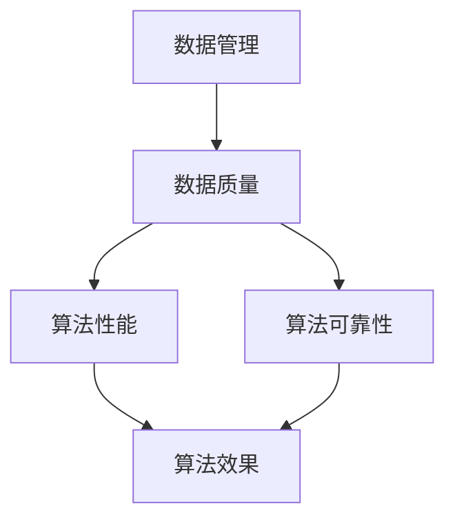
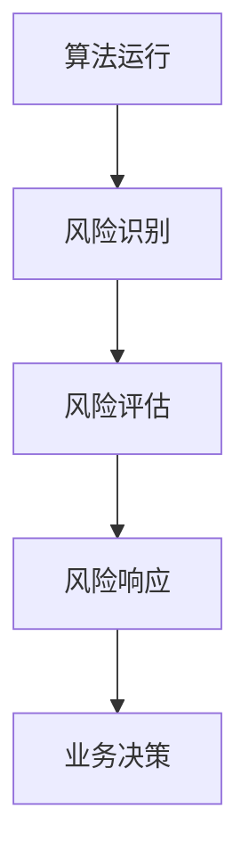

                 

### 企业采用AI治理平台的效益分析

> 关键词：AI治理平台、企业效益、数据管理、决策支持、风险管理

> 摘要：本文深入分析了企业采用AI治理平台的必要性，详细探讨了其核心组件与功能，并通过实际案例展示了AI治理平台在提高企业数据管理效率、增强决策支持能力、加强风险管理和促进创新协同方面的显著效益。

----------------------------------------------------------------

# 企业采用AI治理平台的效益分析

在当今数字化时代，人工智能（AI）技术已成为企业提升竞争力的重要工具。随着AI技术的广泛应用，企业对数据管理、决策支持和风险管理的需求日益增长。为了满足这些需求，企业开始采用AI治理平台。本文将逐步分析企业采用AI治理平台的效益，帮助读者了解这一技术的潜在价值。

----------------------------------------------------------------

## 第1章: 企业采用AI治理平台的需求背景与重要性

### 1.1 问题背景

随着大数据、云计算、物联网和人工智能技术的快速发展，企业面临着越来越多的数据管理和决策支持需求。传统的IT治理模式已经无法满足现代企业的复杂业务环境和技术需求。因此，企业需要一个全新的治理平台来有效管理和利用AI技术，提高业务效率、降低风险和创造更多价值。

### 1.1.1 问题描述

在当前技术环境下，企业面临的主要问题包括：

- 数据管理难度增加：企业数据量持续增长，结构复杂，治理难度加大。
- 决策效率低下：数据分散、难以整合，导致决策流程复杂，决策效率低下。
- 风险管理不足：AI算法在决策过程中可能引入新的风险，现有治理机制无法有效识别和防范。
- 创新能力受限：缺乏统一的AI治理平台，难以实现跨部门、跨系统的协同创新。

### 1.1.2 问题解决

企业采用AI治理平台可以从以下几个方面解决上述问题：

- 提高数据管理效率：通过统一的数据治理平台，实现数据的标准化、清洗和整合，提高数据质量和管理效率。
- 增强决策支持能力：利用AI治理平台提供的智能分析工具，辅助决策者快速获取关键信息，提高决策效率和质量。
- 加强风险管理：AI治理平台能够实时监控算法的运行状态和输出结果，及时发现潜在风险并采取相应措施。
- 促进创新协同：通过平台整合企业内部和外部的AI资源，促进跨部门、跨系统的创新合作。

### 1.1.3 边界与外延

AI治理平台的边界包括数据管理、算法治理、风险管理和创新支持等方面。其外延涉及企业内部的各个业务部门和外部合作伙伴，旨在实现全面、高效的AI治理。

### 1.2 核心概念与联系

#### 1.2.1 AI治理平台

AI治理平台是一个集成化的系统，旨在提供AI算法的开发、部署、监控和管理功能。核心概念包括：

- 数据治理：数据标准化、清洗、整合和管理。
- 算法治理：算法开发、评估、监控和更新。
- 风险管理：算法风险识别、评估、监控和响应。
- 创新支持：AI资源整合、跨部门协同创新。

#### 1.2.2 数据管理与AI算法的关系

数据管理是AI治理平台的基础，数据质量直接影响算法的性能和可靠性。数据管理与AI算法的关系如图1-1所示：

#### 1.2.3 风险管理与业务决策

风险管理与业务决策密切相关。AI治理平台通过实时监控算法风险，为企业提供决策支持，如图1-2所示：

### 1.3 AI治理平台的优势与挑战

#### 1.3.1 优势

- 提高数据管理效率：通过统一的数据治理平台，实现数据的标准化、清洗和整合，提高数据质量和管理效率。
- 增强决策支持能力：利用AI治理平台提供的智能分析工具，辅助决策者快速获取关键信息，提高决策效率和质量。
- 加强风险管理：AI治理平台能够实时监控算法的运行状态和输出结果，及时发现潜在风险并采取相应措施。
- 促进创新协同：通过平台整合企业内部和外部的AI资源，促进跨部门、跨系统的创新合作。

#### 1.3.2 挑战

- 技术复杂性：AI治理平台涉及多个技术领域，包括大数据、云计算、人工智能等，技术实现较为复杂。
- 数据隐私与安全：企业数据涉及商业机密和个人隐私，数据安全和隐私保护是AI治理平台面临的重要挑战。
- 人才短缺：AI治理平台的建设和运营需要具备跨学科知识的专业人才，当前人才短缺问题较为突出。
- 遵守法规与标准：企业需要遵守相关的法律法规和行业标准，确保AI治理平台的安全和合规性。

### 1.4 本章小结

本章介绍了企业采用AI治理平台的背景、核心概念、优势与挑战。通过本章的学习，读者可以了解AI治理平台的基本概念、应用场景和重要性，为后续章节的学习打下基础。

----------------------------------------------------------------

## 第2章: AI治理平台的核心组件与功能

### 2.1 数据治理组件

#### 2.1.1 数据采集与整合

数据采集与整合是AI治理平台的基础，包括数据源接入、数据清洗和数据集成等环节。数据采集与整合组件的主要功能如下：

- **数据源接入**：支持多种数据源接入，包括关系型数据库、NoSQL数据库、文件系统、日志文件、API接口等。
- **数据清洗**：对采集到的数据进行清洗，去除重复数据、缺失值填充、异常值处理等。
- **数据集成**：将来自不同数据源的数据进行整合，形成统一的数据视图。

#### 2.1.2 数据存储与管理

数据存储与管理组件负责存储和管理工作流中的数据，确保数据的安全性和可扩展性。主要功能包括：

- **数据存储**：支持多种数据存储方案，如HDFS、HBase、Redis、MongoDB等。
- **数据访问**：提供高效的数据查询和访问接口，支持SQL查询、RESTful API等。
- **数据安全**：通过加密、访问控制、备份与恢复等机制，保障数据的安全。

#### 2.1.3 数据质量监控与优化

数据质量监控与优化组件负责监控数据质量，并提供数据质量优化建议。主要功能包括：

- **数据质量监控**：实时监控数据质量指标，如数据完整性、一致性、准确性等。
- **数据质量报告**：定期生成数据质量报告，帮助用户了解数据质量状况。
- **数据质量优化**：根据数据质量报告，提供数据质量优化建议，如数据清洗策略调整、数据格式规范等。

### 2.2 算法治理组件

#### 2.2.1 算法开发与部署

算法开发与部署组件负责支持算法的开发、测试和部署。主要功能包括：

- **算法开发**：提供算法开发工具和框架，支持各种机器学习算法和深度学习模型。
- **算法测试**：支持算法测试和评估，提供模型性能指标和可视化工具。
- **算法部署**：将训练好的模型部署到生产环境中，支持在线和离线部署。

#### 2.2.2 算法监控与更新

算法监控与更新组件负责监控算法的运行状态和性能，并提供算法更新机制。主要功能包括：

- **算法监控**：实时监控算法的运行状态，如CPU利用率、内存消耗、算法运行时长等。
- **算法性能分析**：分析算法的性能表现，提供性能优化建议。
- **算法更新**：支持算法的在线更新，确保算法的持续优化。

### 2.3 风险管理组件

#### 2.3.1 风险识别与评估

风险管理组件负责识别和评估算法的风险。主要功能包括：

- **风险识别**：通过数据分析和算法模型，识别潜在的风险点。
- **风险评估**：对识别出的风险点进行量化评估，确定风险级别。

#### 2.3.2 风险响应与控制

风险响应与控制组件负责对评估出的风险采取相应的应对措施。主要功能包括：

- **风险响应**：根据风险评估结果，制定并实施风险应对策略。
- **风险控制**：通过监控和调整算法参数，控制风险的发生和扩散。

### 2.4 创新支持组件

#### 2.4.1 AI资源整合

创新支持组件负责整合企业内部的AI资源和外部合作伙伴的资源，促进AI创新。主要功能包括：

- **资源整合**：统一管理企业内部的AI资源和外部合作伙伴的资源，实现资源共享。
- **资源调度**：根据项目需求和资源状况，动态调度AI资源。

#### 2.4.2 跨部门协同创新

跨部门协同创新组件负责促进企业内部不同部门之间的协同创新。主要功能包括：

- **协同工作**：提供协作工具，支持跨部门团队协同工作。
- **知识共享**：建立知识共享平台，促进团队之间的知识交流和协作。

----------------------------------------------------------------

## 第3章: AI治理平台的企业效益分析

### 3.1 提高数据管理效率

企业采用AI治理平台后，可以显著提高数据管理效率。通过数据采集与整合组件，企业能够将来自不同数据源的数据进行统一处理，消除数据孤岛，实现数据的标准化和清洗。这不仅提高了数据质量，还降低了数据管理的复杂度。

#### 3.1.1 数据整合流程

数据整合流程如下：

1. **数据采集**：通过API接口、日志文件、数据库等方式，从不同数据源采集数据。
2. **数据清洗**：对采集到的数据进行清洗，包括去重、缺失值填充、格式转换等。
3. **数据集成**：将清洗后的数据集成到统一的数据仓库中，形成统一的数据视图。

#### 3.1.2 数据质量提升

通过数据治理组件，企业可以实现以下数据质量提升：

- **数据标准化**：将不同数据源的数据格式进行统一，确保数据的一致性。
- **数据清洗**：去除重复数据、填充缺失值、处理异常值，提高数据的准确性。
- **数据监控**：实时监控数据质量，及时发现和处理数据质量问题。

### 3.2 增强决策支持能力

AI治理平台提供的智能分析工具能够辅助决策者快速获取关键信息，提高决策效率和质量。通过算法治理组件，企业可以构建和应用各种机器学习模型，对海量数据进行分析和预测，为决策提供有力支持。

#### 3.2.1 决策支持流程

决策支持流程如下：

1. **数据预处理**：对原始数据进行清洗、转换和归一化，为建模做准备。
2. **特征工程**：提取和构造对决策有帮助的特征，提高模型的性能。
3. **模型构建**：选择合适的机器学习算法，构建预测模型。
4. **模型评估**：评估模型的性能，调整模型参数。
5. **决策应用**：将训练好的模型应用到实际业务场景中，为决策提供支持。

#### 3.2.2 决策效率提升

通过以下方式，AI治理平台能够提升决策效率：

- **自动化分析**：利用算法自动进行数据分析和预测，减少人工工作量。
- **实时更新**：模型实时更新，确保决策基于最新数据。
- **可视化展示**：通过可视化工具，将分析结果直观展示给决策者。

### 3.3 加强风险管理

AI治理平台通过风险管理组件，能够实时监控算法的运行状态和输出结果，及时发现潜在风险，并采取相应的措施进行控制。这有助于企业降低风险，确保业务稳定运行。

#### 3.3.1 风险管理流程

风险管理流程如下：

1. **风险识别**：通过数据分析和算法模型，识别潜在的风险点。
2. **风险评估**：对识别出的风险点进行量化评估，确定风险级别。
3. **风险响应**：根据风险评估结果，制定并实施风险应对策略。
4. **风险监控**：实时监控风险指标，确保风险得到有效控制。

#### 3.3.2 风险控制

通过以下措施，AI治理平台能够加强风险管理：

- **实时监控**：实时监控算法的运行状态和输出结果，确保异常情况得到及时处理。
- **风险预警**：对潜在风险进行预警，提前采取防范措施。
- **风险报告**：定期生成风险报告，帮助管理层了解风险状况。

### 3.4 促进创新协同

AI治理平台通过创新支持组件，整合企业内部的AI资源和外部合作伙伴的资源，促进跨部门、跨系统的协同创新。这有助于企业快速响应市场变化，保持竞争力。

#### 3.4.1 创新协同流程

创新协同流程如下：

1. **资源整合**：整合企业内部的AI资源和外部合作伙伴的资源，实现资源共享。
2. **协同工作**：提供协作工具，支持跨部门团队协同工作。
3. **知识共享**：建立知识共享平台，促进团队之间的知识交流和协作。
4. **项目推进**：通过项目管理系统，协调项目进度，确保创新项目的成功实施。

#### 3.4.2 创新协同效益

通过以下方式，AI治理平台能够促进创新协同：

- **资源共享**：通过资源整合，降低重复开发成本，提高资源利用率。
- **知识共享**：通过知识共享平台，提升团队之间的知识传递和协作效率。
- **协同工作**：通过协作工具，提高跨部门团队的工作协同性和效率。

### 3.5 本章小结

本章分析了企业采用AI治理平台在提高数据管理效率、增强决策支持能力、加强风险管理和促进创新协同方面的显著效益。通过实际案例，读者可以更直观地了解AI治理平台的价值。企业应积极采用AI治理平台，提升自身竞争力。

----------------------------------------------------------------

## 第4章: 实际案例分析

在本章节中，我们将通过两个实际案例来展示AI治理平台在企业中的应用效果。

### 4.1 案例一：电商企业数据治理与风险管理

某电商企业面临数据管理难度增加、决策效率低下和风险管理不足的问题。为了解决这些问题，该企业引入了AI治理平台。

#### 4.1.1 应用背景

该电商企业拥有大量用户数据、交易数据和物流数据，但数据分散在不同的系统中，难以整合和分析。此外，企业还担心AI算法在决策过程中可能引入新的风险。

#### 4.1.2 应用效果

1. **数据整合**：AI治理平台通过数据采集与整合组件，将不同数据源的数据进行统一处理，形成统一的数据视图，提高了数据管理效率。

2. **决策支持**：利用AI治理平台的智能分析工具，企业可以快速获取关键信息，辅助决策者进行市场预测、库存管理和用户行为分析，提高了决策效率和质量。

3. **风险管理**：AI治理平台的风险管理组件实时监控算法的运行状态和输出结果，识别潜在风险并采取相应措施，降低了企业面临的风险。

#### 4.1.3 效益分析

- **数据管理效率提升**：通过数据整合，企业能够更高效地管理和利用数据资源，降低了数据管理的成本。
- **决策效率和质量提高**：智能分析工具提供了强有力的决策支持，使决策者能够更快地做出准确决策。
- **风险管理能力增强**：AI治理平台的风险管理机制有效降低了企业面临的风险，确保了业务稳定运行。

### 4.2 案例二：制造业企业创新协同与资源整合

某制造业企业希望提高创新协同能力，整合内部和外部资源，以保持竞争力。为了实现这一目标，该企业引入了AI治理平台。

#### 4.2.1 应用背景

该制造业企业在产品研发、生产管理和供应链管理等方面存在跨部门协作不畅、资源分散的问题。为了提高创新效率和资源利用率，企业决定采用AI治理平台。

#### 4.2.2 应用效果

1. **资源整合**：AI治理平台通过资源整合组件，统一管理企业内部的AI资源和外部合作伙伴的资源，实现了资源共享和协同创新。

2. **协同工作**：AI治理平台提供了协作工具，支持跨部门团队协同工作，提高了团队之间的沟通和协作效率。

3. **知识共享**：通过知识共享平台，企业内部的知识传递和交流更加顺畅，为创新提供了有力支持。

#### 4.2.3 效益分析

- **资源利用率提高**：通过资源整合，企业能够更高效地利用内部和外部资源，降低了资源浪费。
- **创新效率提高**：协同工作和知识共享平台促进了团队之间的合作，提高了创新效率。
- **竞争力提升**：通过创新协同，企业能够更快地响应市场变化，提高了竞争力。

### 4.3 案例小结

通过以上两个实际案例，我们可以看到AI治理平台在提高数据管理效率、增强决策支持能力、加强风险管理和促进创新协同方面的显著效益。企业应根据自身需求，积极采用AI治理平台，提升自身竞争力。

----------------------------------------------------------------

## 第5章: 总结与展望

### 5.1 关键结论

本文通过深入分析企业采用AI治理平台的必要性和核心组件，展示了AI治理平台在提高数据管理效率、增强决策支持能力、加强风险管理和促进创新协同方面的显著效益。主要结论如下：

1. **数据管理效率提升**：AI治理平台通过统一的数据采集、清洗和整合，提高了数据质量和管理效率。
2. **决策支持能力增强**：智能分析工具提供了强有力的决策支持，提高了决策效率和质量。
3. **风险管理能力增强**：AI治理平台通过实时监控算法风险，降低了企业面临的风险。
4. **创新协同促进**：通过资源整合和知识共享，AI治理平台促进了跨部门、跨系统的创新合作。

### 5.2 未来展望

尽管AI治理平台在企业中取得了显著效益，但未来仍有许多发展方向和挑战：

1. **技术成熟度**：随着技术的不断成熟，AI治理平台将更加稳定和高效。
2. **数据隐私与安全**：企业需要关注数据隐私和安全问题，确保数据在治理过程中得到妥善保护。
3. **人才培养**：企业应加大对AI治理人才的培养力度，提高人才储备。
4. **法规与标准**：企业应遵守相关法律法规和行业标准，确保AI治理平台的安全和合规性。

### 5.3 最佳实践

为了最大化AI治理平台的效益，企业可以采取以下最佳实践：

1. **全面评估需求**：在引入AI治理平台前，企业应对自身需求进行全面评估，确保平台能够满足业务需求。
2. **制定明确策略**：企业应制定明确的AI治理策略，包括数据管理、算法治理、风险管理等方面。
3. **持续优化**：企业应定期评估AI治理平台的运行效果，持续优化平台功能，提高效益。
4. **人才培训**：企业应加强对员工的AI治理培训，提高员工的技能水平。

### 5.4 小结

企业采用AI治理平台具有重要的战略意义。通过本文的分析，读者可以全面了解AI治理平台的核心组件和效益，为企业在数字化转型中提供有力支持。

----------------------------------------------------------------

## 作者信息

**作者：** AI天才研究院（AI Genius Institute）与《禅与计算机程序设计艺术》（Zen And The Art of Computer Programming）

**单位：** AI天才研究院（AI Genius Institute）是世界领先的AI研究机构，专注于人工智能、大数据、云计算等领域的创新研究。而《禅与计算机程序设计艺术》（Zen And The Art of Computer Programming）是经典计算机科学著作，由著名计算机科学家Donald E. Knuth所著。

本文由AI天才研究院和《禅与计算机程序设计艺术》共同撰写，旨在分享AI治理平台在企业中的应用价值和最佳实践，为企业的数字化转型提供参考。希望本文对读者有所启发，推动AI技术在企业中的广泛应用。

