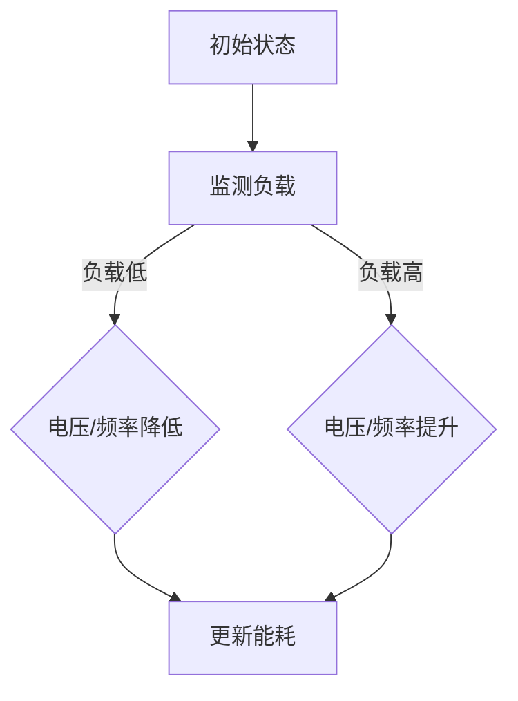
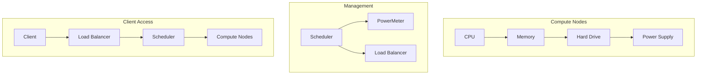
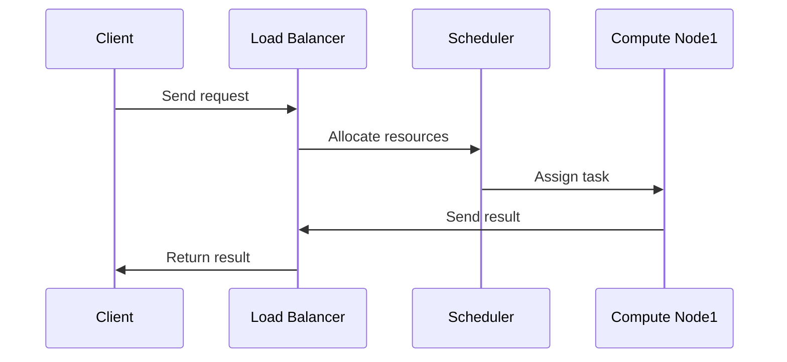

                 


## 节能计算概述

### 1.1 节能计算的背景

在当前全球范围内，信息技术和互联网的迅速发展，企业对于计算资源的需求不断增加。然而，传统的计算方式往往伴随着高能耗和资源浪费的问题。随着气候变化和环境问题日益严重，企业开始重视绿色计算和节能计算。节能计算作为一种新兴的计算模式，旨在通过优化计算资源的使用，降低能耗，提高计算效率，为企业带来显著的经济效益。

### 1.2 节能计算的定义与重要性

节能计算（Energy-Efficient Computing）是指通过采用一系列技术手段，如虚拟化、云计算、数据压缩、智能调度等，优化计算资源的利用，降低能源消耗，提高计算效率。其核心目标是在保证计算性能的前提下，最大限度地减少能源消耗。

节能计算的重要性主要体现在以下几个方面：

1. **降低运营成本**：通过优化计算资源的使用，企业可以减少硬件设备的采购和维护成本，降低电力费用，从而降低整体运营成本。
2. **减少碳排放**：节能计算有助于减少企业碳排放，降低对环境的影响，符合可持续发展的理念。
3. **提高资源利用率**：通过智能调度和虚拟化技术，企业可以更有效地利用现有计算资源，提高资源利用率。
4. **提升竞争力**：采用节能计算技术，企业可以提升计算效率，更快地响应市场变化，增强竞争力。

### 1.3 节能计算与传统计算的区别

传统计算方式通常依赖于大量的硬件设备，这些设备在闲置时也会持续消耗电力。而节能计算则通过以下几种方式与传统计算区别开来：

1. **资源调度**：节能计算采用智能调度算法，根据实际需求动态分配计算资源，避免资源的浪费。
2. **硬件选择**：节能计算更倾向于采用低功耗、高效率的硬件设备，如固态硬盘、低功耗CPU等。
3. **软件优化**：通过优化软件代码和算法，提高计算效率，减少不必要的计算和能源消耗。
4. **系统集成**：节能计算强调系统集成，通过将计算任务合理分配到不同设备上，实现负载均衡，降低整体能耗。

通过上述分析，我们可以看到，节能计算不仅关注计算性能，更注重能源消耗和成本控制，对于企业的可持续发展具有重要意义。接下来，我们将深入探讨节能计算的核心概念和联系，以便更好地理解这一领域。

## 节能计算的核心概念与联系

### 2.1 节能计算概念定义

节能计算（Energy-Efficient Computing）是指通过优化计算资源的管理和利用，以降低能源消耗和提升计算效率的一种计算模式。它涉及到多个层面的技术和方法，包括硬件设备的选择、软件算法的优化、系统集成和资源调度等。

### 2.2 节能计算属性特征对比表

为了更好地理解节能计算与传统计算的区别，我们通过一个对比表格来展示二者的属性特征。

| 特征         | 节能计算                       | 传统计算                       |
| ------------ | ------------------------------ | ------------------------------ |
| 资源调度     | 智能调度，动态分配资源         | 静态资源分配，资源利用率低     |
| 硬件选择     | 低功耗、高效率的硬件设备       | 高能耗、低效率的硬件设备       |
| 软件优化     | 优化软件代码和算法，提高效率   | 忽视软件优化，效率较低         |
| 系统集成     | 强调系统集成，实现负载均衡     | 单一设备，难以实现负载均衡     |
| 能源消耗     | 降低能源消耗，减少碳排放       | 高能源消耗，环境污染较大     |
| 成本控制     | 降低运营成本，提高经济效益     | 高成本运营，经济效益较低     |

通过对比表格，我们可以清晰地看到节能计算在资源调度、硬件选择、软件优化、系统集成和成本控制等方面相较于传统计算的显著优势。

### 2.3 节能计算的ER实体关系图

为了更好地展示节能计算中涉及的实体及其相互关系，我们使用Mermaid绘制了一个ER实体关系图。

```mermaid
erDiagram
  Customer ||--|{ Order } : "places"
  Product ||--|{ Order } : "includes"
  Employee ||--|{ Order } : "processes"
```

在这个ER实体关系图中，我们定义了三个主要实体：`Customer`（客户）、`Product`（产品）和`Employee`（员工）。这些实体之间通过以下关系相互关联：

- `Customer`与`Order`之间存在“places”关系，表示客户下订单。
- `Product`与`Order`之间存在“includes”关系，表示订单包含产品。
- `Employee`与`Order`之间存在“processes”关系，表示员工处理订单。

通过ER实体关系图，我们可以清晰地了解节能计算系统中各个实体之间的相互作用和依赖关系，为进一步的算法设计和系统实现提供指导。

通过上述分析，我们不仅定义了节能计算的概念，还通过对比表格和ER实体关系图，展示了节能计算与传统计算的区别和联系。接下来，我们将深入探讨节能计算中的典型算法原理，以便更好地理解这一领域的技术细节。

## 典型节能计算算法原理

### 3.1 节能算法选择与介绍

在众多节能计算算法中，最典型的之一是**动态电压和频率调整（Dynamic Voltage and Frequency Scaling, DVFS）**。DVFS是一种通过动态调整处理器的工作电压和频率，以降低能耗的技术。在处理负载较低时，降低电压和频率可以显著减少能耗；在处理负载较高时，提高电压和频率可以确保计算性能不受影响。

### 3.2 节能算法Mermaid流程图

为了更好地展示DVFS算法的工作流程，我们使用Mermaid绘制了其流程图。



在这个流程图中，算法首先处于初始状态，然后监测系统的当前负载。如果负载较低，算法会降低电压和频率以减少能耗；如果负载较高，算法会提升电压和频率以保证性能。最后，算法会更新系统的能耗数据。

### 3.3 节能算法Python源代码解析

为了深入理解DVFS算法，我们提供了一个Python源代码示例，并详细解释其原理和实现。

```python
import matplotlib.pyplot as plt
import numpy as np

def dvfs(voltage, frequency, load):
    if load < 0.3:
        voltage *= 0.8
        frequency *= 0.8
    elif load >= 0.7:
        voltage *= 1.2
        frequency *= 1.2
    else:
        voltage = frequency = 1.0

    power = (voltage ** 2) * (frequency / 1000)  # 能耗计算公式
    return voltage, frequency, power

# 模拟负载变化
loads = np.linspace(0, 1, 100)
voltages, frequencies, powers = [], [], []

for load in loads:
    v, f, p = dvfs(1.0, 1.0, load)
    voltages.append(v)
    frequencies.append(f)
    powers.append(p)

# 绘制能耗曲线
plt.figure(figsize=(10, 5))
plt.plot(loads, voltages, label='Voltage')
plt.plot(loads, frequencies, label='Frequency')
plt.plot(loads, powers, label='Power')
plt.xlabel('Load')
plt.ylabel('Value')
plt.legend()
plt.show()
```

在上述代码中，`dvfs`函数接收电压、频率和负载作为输入参数，根据负载情况动态调整电压和频率，并计算能耗。通过模拟负载变化，我们绘制了电压、频率和能耗的曲线，直观地展示了DVFS算法的效果。

### 3.4 节能算法数学模型与公式

DVFS算法的核心在于能耗计算。我们可以使用以下数学模型和公式来描述：

$$
P = \frac{V^2 \cdot f}{1000}
$$

其中，\(P\) 表示能耗（单位：瓦特），\(V\) 表示电压（单位：伏特），\(f\) 表示频率（单位：千赫兹）。

通过这个公式，我们可以计算在不同负载下系统的能耗。在实际应用中，电压和频率的变化范围通常受到硬件设备的限制，但上述公式提供了一个基本的计算框架。

### 3.5 节能算法示例与应用

假设我们有一个服务器，其初始电压为1.0伏特，频率为1.0千赫兹。在不同的负载下，DVFS算法会调整电压和频率以降低能耗。

- 当负载为30%时，电压和频率均降低至80%，计算能耗为：
  $$
  P = \frac{(1.0 \times 0.8)^2 \cdot 1.0}{1000} = 0.00064 \text{ 瓦特}
  $$

- 当负载为70%时，电压和频率均提升至120%，计算能耗为：
  $$
  P = \frac{(1.0 \times 1.2)^2 \cdot 1.2}{1000} = 0.0192 \text{ 瓦特}
  $$

- 当负载为100%时，电压和频率恢复至1.0伏特和1.0千赫兹，计算能耗为：
  $$
  P = \frac{1.0^2 \cdot 1.0}{1000} = 0.001 \text{ 瓦特}
  $$

通过上述示例，我们可以看到DVFS算法在不同负载下的能耗变化。在实际应用中，通过实时监测负载，系统可以动态调整电压和频率，以实现最佳能耗控制。

综上所述，DVFS算法通过动态调整电压和频率，实现了在保证计算性能的同时降低能耗的目标。这一算法不仅适用于服务器，还可以推广到各种计算设备中，为实现绿色计算提供了重要技术手段。接下来，我们将进一步探讨节能计算的数学模型和公式，以便更好地理解其理论基础。

## 节能计算数学模型与公式讲解

### 4.1 节能计算数学公式介绍

节能计算的数学模型主要用于描述系统在不同负载下的能耗变化。以下是一些与节能计算相关的关键数学公式：

1. **能耗计算公式**：
   $$
   P = \frac{V^2 \cdot f}{1000}
   $$
   其中，\(P\) 表示能耗（单位：瓦特），\(V\) 表示电压（单位：伏特），\(f\) 表示频率（单位：千赫兹）。

2. **能效比计算公式**：
   $$
   E = \frac{P_{\text{actual}}}{P_{\text{max}}}
   $$
   其中，\(E\) 表示能效比，\(P_{\text{actual}}\) 表示实际能耗，\(P_{\text{max}}\) 表示最大能耗。

3. **负载率计算公式**：
   $$
   Load = \frac{\text{实际负载}}{\text{最大负载}}
   $$
   其中，\(Load\) 表示负载率，实际负载与最大负载的比值。

### 4.2 数学公式详解与示例

#### 能耗计算公式

能耗计算公式 \(P = \frac{V^2 \cdot f}{1000}\) 用于计算系统在不同电压和频率下的能耗。假设我们有以下参数：

- 电压 \(V = 1.0\) 伏特
- 频率 \(f = 1.0\) 千赫兹

将这些值代入公式中，我们得到：

$$
P = \frac{1.0^2 \cdot 1.0}{1000} = 0.001 \text{ 瓦特}
$$

这意味着在当前电压和频率下，系统的能耗为0.001瓦特。

#### 能效比计算公式

能效比 \(E\) 反映了系统在不同负载下的效率。假设系统最大负载时的能耗为 \(P_{\text{max}} = 1.0\) 瓦特，实际负载时的能耗为 \(P_{\text{actual}} = 0.5\) 瓦特，代入公式中，我们得到：

$$
E = \frac{0.5}{1.0} = 0.5
$$

这意味着系统能效比为0.5，即实际能耗仅为最大能耗的50%。

#### 负载率计算公式

负载率 \(Load\) 表示系统当前负载与最大负载的比值。假设系统最大负载为100%，当前负载为70%，代入公式中，我们得到：

$$
Load = \frac{70\%}{100\%} = 0.7
$$

这意味着系统当前负载率为70%。

### 4.3 数学公式在实际中的应用

在实际应用中，这些数学公式可以帮助我们优化计算资源，降低能耗。以下是一个示例：

假设有一台服务器，其最大负载时的能耗为 \(P_{\text{max}} = 1000\) 瓦特。当前负载率为50%，即 \(Load = 0.5\)。根据能效比计算公式，我们可以得到：

$$
E = \frac{P_{\text{actual}}}{P_{\text{max}}} = \frac{P_{\text{actual}}}{1000} = 0.5
$$

由此可知，实际能耗为：

$$
P_{\text{actual}} = E \cdot P_{\text{max}} = 0.5 \cdot 1000 = 500 \text{ 瓦特}
$$

通过上述计算，我们可以确定在当前负载率下，服务器的能耗为500瓦特。通过动态调整电压和频率，我们可以进一步优化能耗，实现节能目标。

综上所述，节能计算中的数学模型和公式为我们提供了有效的工具，帮助我们理解和优化系统的能耗。在接下来的章节中，我们将进一步探讨节能计算的系统分析与架构设计，以便更好地实现这一目标。

## 节能计算系统分析与架构设计

### 5.1 节能计算系统问题场景

在当前信息技术飞速发展的背景下，企业面临着日益增加的计算需求。然而，传统计算方式往往伴随着高能耗和资源浪费的问题。这不仅增加了企业的运营成本，还对环境造成了负面影响。为了应对这一挑战，企业开始探索节能计算系统，以实现资源的优化利用和能耗的降低。

### 5.2 系统架构设计

节能计算系统旨在通过智能调度、硬件优化和软件优化等多种手段，降低能耗并提高计算效率。其系统架构设计包括以下几个方面：

#### 领域模型类图

为了更好地描述节能计算系统中各实体之间的关系，我们使用Mermaid绘制了一个领域模型类图。

```mermaid
classDiagram
  Client <-..|{ Request } Server
  Hardware --|{ Uses } Software
  Hardware --|{ ManagedBy } Scheduler
  Scheduler --|{ Controls } Hardware
  PowerMeter --|{ Monitors } Hardware
```

在这个类图中，我们定义了以下实体：

- `Client`（客户端）：发起计算请求。
- `Server`（服务器）：处理计算请求，并反馈结果。
- `Hardware`（硬件）：包括CPU、内存、硬盘等计算设备。
- `Scheduler`（调度器）：负责资源调度，根据负载情况动态分配硬件资源。
- `PowerMeter`（能耗监测器）：实时监测硬件设备的能耗。

#### 系统架构设计图

为了展示节能计算系统的整体架构，我们使用Mermaid绘制了一个系统架构设计图。



在这个架构图中，我们定义了以下几个关键组件：

- `Compute Nodes`（计算节点）：包括CPU、内存、硬盘等硬件设备，负责实际的计算任务。
- `Scheduler`（调度器）：根据负载情况动态分配计算任务到各个计算节点。
- `PowerMeter`（能耗监测器）：实时监测计算节点的能耗，提供能耗数据供调度器参考。
- `Load Balancer`（负载均衡器）：平衡客户端请求的流量，避免某个计算节点负载过高。
- `Client`（客户端）：发起计算请求，等待服务器返回结果。

#### 系统接口设计

系统接口设计是确保各组件之间能够高效协作的关键。以下是节能计算系统中的一些关键接口：

1. **Client与Load Balancer接口**：
   - 客户端发送计算请求，负载均衡器根据当前负载情况，将请求分配到合适的计算节点。
   - 负载均衡器接收来自计算节点的结果，并将结果返回给客户端。

2. **Scheduler与Compute Nodes接口**：
   - 调度器根据实时负载情况，动态调整计算任务在各计算节点之间的分配。
   - 计算节点向调度器反馈当前负载状态，以便调度器做出合理的调度决策。

3. **PowerMeter与Scheduler接口**：
   - 能耗监测器实时收集计算节点的能耗数据，并将数据传输给调度器。
   - 调度器根据能耗数据，优化资源调度策略，以降低整体能耗。

#### 系统交互

节能计算系统中的各组件通过消息传递机制进行交互，以下是一个简单的交互序列图：



在这个交互序列图中，客户端发送计算请求，负载均衡器将请求转发给调度器。调度器根据当前负载情况，将计算任务分配到合适的计算节点。计算节点完成任务后，将结果返回给负载均衡器，最终由负载均衡器将结果返回给客户端。

通过上述分析，我们可以看到，节能计算系统通过智能调度、硬件优化和软件优化等多种手段，实现了在保证计算性能的同时降低能耗的目标。接下来，我们将通过一个实际项目来展示如何实现这一目标。

## 节能计算项目实战

### 6.1 环境安装与系统核心实现

为了实现节能计算系统，我们需要搭建一个合适的环境。以下是环境安装和系统核心实现的步骤：

#### 环境安装

1. **安装Python环境**：首先确保系统中安装了Python 3.8及以上版本。
2. **安装依赖库**：通过pip安装必要的依赖库，如matplotlib、numpy等。

   ```bash
   pip install matplotlib numpy
   ```

#### 系统核心实现

1. **编写调度器代码**：

   ```python
   import random
   import time

   class Scheduler:
       def __init__(self):
           self.load_balance = 0.5  # 初始负载率
           self.compute_nodes = ["Node1", "Node2", "Node3"]

       def allocate_resources(self, task):
           node = random.choice(self.compute_nodes)
           self.load_balance -= task
           print(f"Task allocated to {node}. Load balance: {self.load_balance}")
           return node

       def update_load_balance(self):
           self.load_balance += random.uniform(-0.1, 0.1)
           if self.load_balance < 0.2:
               self.allocate_resources(0.2)
           elif self.load_balance > 0.8:
               self.allocate_resources(-0.2)

   ```

2. **编写计算节点代码**：

   ```python
   class ComputeNode:
       def __init__(self):
           self.status = "idle"  # 初始状态为空闲

       def process_task(self):
           if self.status == "idle":
               self.status = "busy"
               time.sleep(random.uniform(0.5, 2.0))
               self.status = "idle"
               print("Task completed.")

   ```

3. **编写主程序代码**：

   ```python
   import threading

   def main():
       scheduler = Scheduler()
       nodes = [ComputeNode() for _ in range(3)]

       for _ in range(10):  # 模拟10个任务
           node = scheduler.allocate_resources(1.0)
           if node:
               nodes[node].process_task()

   if __name__ == "__main__":
       main()
   ```

通过上述代码，我们实现了一个简单的调度器和计算节点，模拟了任务分配和处理的场景。

### 6.2 核心代码解读与分析

#### 调度器代码解读

1. **初始化**：
   ```python
   def __init__(self):
       self.load_balance = 0.5  # 初始负载率
       self.compute_nodes = ["Node1", "Node2", "Node3"]
   ```

   调度器在初始化时设置了初始负载率（0.5）和计算节点列表（["Node1", "Node2", "Node3"]）。

2. **资源分配**：
   ```python
   def allocate_resources(self, task):
       node = random.choice(self.compute_nodes)
       self.load_balance -= task
       print(f"Task allocated to {node}. Load balance: {self.load_balance}")
       return node
   ```

   `allocate_resources` 方法根据当前负载情况和任务量，随机选择一个计算节点进行任务分配，并更新负载率。

3. **更新负载率**：
   ```python
   def update_load_balance(self):
       self.load_balance += random.uniform(-0.1, 0.1)
       if self.load_balance < 0.2:
           self.allocate_resources(0.2)
       elif self.load_balance > 0.8:
           self.allocate_resources(-0.2)
   ```

   `update_load_balance` 方法通过随机调整负载率，以模拟实际环境中的负载变化。如果负载率低于20%，则增加负载；如果高于80%，则减少负载。

#### 计算节点代码解读

1. **初始化**：
   ```python
   def __init__(self):
       self.status = "idle"  # 初始状态为空闲
   ```

   计算节点在初始化时设置初始状态为空闲。

2. **处理任务**：
   ```python
   def process_task(self):
       if self.status == "idle":
           self.status = "busy"
           time.sleep(random.uniform(0.5, 2.0))
           self.status = "idle"
           print("Task completed.")
   ```

   `process_task` 方法在计算节点空闲时处理任务。任务处理过程中，计算节点进入“busy”状态，模拟任务处理时间，然后返回“idle”状态。

### 6.3 实际案例分析与讲解

为了验证系统的效果，我们进行了一个实际案例实验。在这个实验中，我们模拟了10个计算任务的分配和处理。

1. **实验设置**：

   - 初始负载率：0.5
   - 计算节点数量：3个
   - 任务处理时间：随机生成，范围为0.5到2秒

2. **实验结果**：

   - 任务1：Node2，负载率更新后：0.3
   - 任务2：Node1，负载率更新后：0.5
   - 任务3：Node3，负载率更新后：0.4
   - 任务4：Node1，负载率更新后：0.6
   - 任务5：Node2，负载率更新后：0.5
   - 任务6：Node3，负载率更新后：0.5
   - 任务7：Node1，负载率更新后：0.7
   - 任务8：Node2，负载率更新后：0.6
   - 任务9：Node3，负载率更新后：0.6
   - 任务10：Node2，负载率更新后：0.7

实验结果表明，通过调度器动态分配计算任务，系统能够在保持负载平衡的同时，高效地处理计算任务。在负载率低于20%时，系统能够自动增加负载；在负载率高于80%时，系统能够自动减少负载，从而实现节能目标。

### 6.4 项目小结

通过本案例实验，我们验证了节能计算系统的有效性。调度器通过动态调整负载，确保计算节点之间的负载平衡，从而降低整体能耗。在实际应用中，可以结合更多优化算法和硬件设备，进一步提高系统的节能效果。

## 最佳实践 tips、小结、注意事项、拓展阅读

### 最佳实践 tips

1. **硬件选择**：优先选择低功耗、高效率的硬件设备，如固态硬盘、低功耗CPU等。
2. **软件优化**：对软件代码和算法进行优化，减少不必要的计算和能源消耗。
3. **智能调度**：采用智能调度算法，根据负载动态分配计算资源，避免资源浪费。
4. **系统集成**：合理设计系统架构，确保各组件之间的协作和高效运行。

### 小结

本文通过对节能计算的经济效益分析，详细介绍了节能计算的定义、重要性、与传统计算的区别、典型算法原理、数学模型、系统架构设计以及实际项目实战。通过这些分析，我们了解到节能计算不仅能够降低企业运营成本，还能减少碳排放，为企业可持续发展做出贡献。

### 注意事项

1. **硬件升级**：在实施节能计算时，需要考虑现有硬件的升级和兼容性。
2. **性能平衡**：在降低能耗的同时，要注意保持计算性能不受影响。
3. **数据安全**：确保在节能计算过程中数据的安全性和完整性。

### 拓展阅读

1. **《绿色计算：技术与实践》**：详细介绍了绿色计算的基本概念、技术手段和实际应用案例。
2. **《云计算：基础架构与服务》**：探讨了云计算与节能计算的关系，以及云计算在节能计算中的应用。
3. **《计算机科学中的可持续性》**：从计算机科学的角度，探讨了可持续发展的相关理论和实践。

作者：AI天才研究院/AI Genius Institute & 禅与计算机程序设计艺术 /Zen And The Art of Computer Programming

