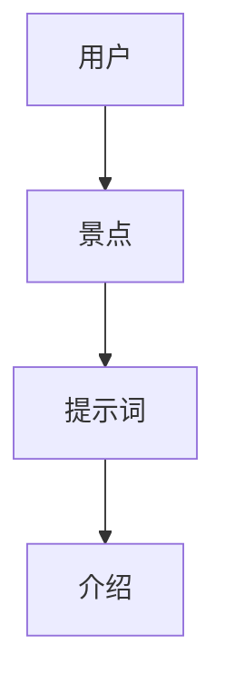
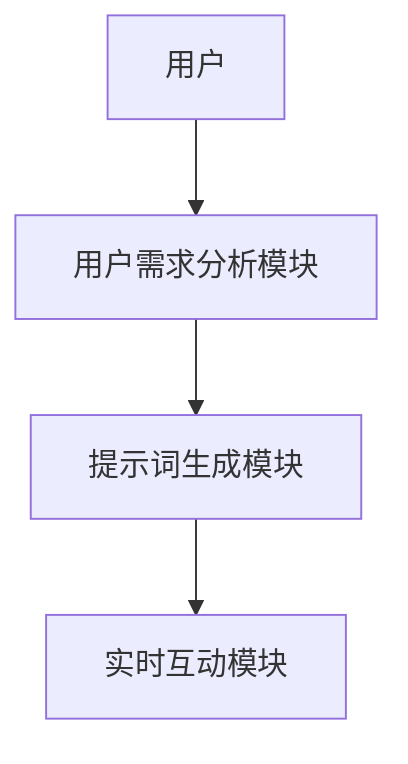

                 

### 第一步：背景介绍

#### 问题背景

随着人工智能技术的飞速发展，虚拟导游系统逐渐成为旅游行业的重要工具，其应用场景不断拓展。虚拟导游系统通过结合语音合成、自然语言处理、图像识别等多模态技术，为用户提供了一种全新的旅游体验。然而，如何实现景点介绍的个性化，提升用户的沉浸感和满意度，成为当前研究的热点。

#### 问题描述

优化AI虚拟导游的景点介绍个性化，需要针对不同用户的需求和兴趣，提供相应的提示词策略，从而提高导游服务的质量。具体来说，这个问题可以从以下几个方面进行描述：

1. **用户需求的多样性**：不同用户对景点的兴趣和需求各不相同，例如有些用户可能对历史文化感兴趣，而有些用户可能对自然景观感兴趣。因此，需要设计出能够满足多样化用户需求的提示词策略。

2. **景点信息的丰富性**：每个景点都有其独特的特征和历史背景，如何将丰富的景点信息有效地传递给用户，是一个重要的挑战。提示词策略需要在有限的描述中，尽可能地涵盖景点的关键信息。

3. **实时互动性**：虚拟导游系统需要能够实时响应用户的提问和反馈，提供个性化的景点介绍。这要求提示词策略能够快速生成和调整，以适应不同的场景和用户需求。

#### 问题解决

为了解决上述问题，本书将从以下几个方面展开讨论：

1. **提示词的选择**：如何根据用户的需求和景点的特征，选择合适的提示词，是优化景点介绍个性化的第一步。这涉及到对用户需求的理解和景点信息的分析。

2. **提示词的生成**：提示词的选择只是基础，如何将这些提示词转化为生动、有吸引力的景点介绍，是生成环节的关键。这需要运用自然语言生成技术，如文本生成模型。

3. **提示词的优化**：虚拟导游系统在使用过程中，需要不断地收集用户反馈和实际效果，对提示词进行优化。这可以通过机器学习算法，如强化学习，来实现。

#### 边界与外延

本书主要关注虚拟导游系统的AI技术，不包括其他与虚拟导游相关的技术，如VR、AR等。此外，本文将探讨的是通过提示词策略实现景点介绍的个性化，而非其他个性化方式，如语音识别、图像识别等。

#### 总结

优化AI虚拟导游的景点介绍个性化是一个复杂但重要的问题。通过设计有效的提示词策略，可以提升虚拟导游系统的用户体验，使其更加贴近用户的需求。接下来，我们将进一步探讨核心概念，以便更好地理解这一问题。

---

### 第二步：核心概念与联系

在深入探讨如何优化AI虚拟导游的景点介绍个性化之前，我们需要明确一些核心概念，并了解它们之间的相互关系。以下是对相关核心概念的介绍、属性特征对比以及ER实体关系图的架构设计。

#### 核心概念

**AI虚拟导游**：这是本文讨论的主要对象。AI虚拟导游是一种利用人工智能技术，如语音合成、自然语言处理和图像识别等，模拟真实导游为用户提供景点介绍服务的系统。其主要功能是提供实时、个性化的旅游信息服务。

**个性化提示词**：个性化提示词是根据用户的需求和兴趣，为AI虚拟导游提供的特定词汇。这些词汇用于优化景点介绍的个性化和准确性，使景点介绍更加贴近用户的需求。个性化提示词可以是单个词汇或短语，也可以是一个句子。

#### 概念属性特征对比表格

| 概念       | 描述                   | 属性特征                                           |
|------------|------------------------|---------------------------------------------------|
| AI虚拟导游 | 模拟导游提供景点介绍   | 语音合成、自然语言处理、多模态交互等           |
| 个性化提示词 | 优化景点介绍的个性化   | 用户需求、兴趣、上下文信息等                     |

- **AI虚拟导游**的属性特征主要包括：
  - 语音合成：将文本转换为自然的语音输出。
  - 自然语言处理：理解和生成人类语言的能力。
  - 多模态交互：支持语音、文本、图像等多种交互方式。

- **个性化提示词**的属性特征主要包括：
  - 用户需求：根据用户兴趣和需求选择提示词。
  - 兴趣：反映用户对特定类型的景点或信息的偏好。
  - 上下文信息：结合当前景点和用户历史记录，提供相关的提示词。

#### ER实体关系图架构

以下是AI虚拟导游系统中的核心实体关系图，使用Mermaid语言表示：



- **用户**：是系统的核心实体，其需求直接影响景点介绍的内容和形式。
- **景点**：代表用户访问的具体地点，每个景点都有其特定的信息。
- **提示词**：用于生成个性化的景点介绍，反映用户需求和景点特征。
- **介绍**：最终呈现给用户的个性化景点信息。

通过这个实体关系图，我们可以清晰地看到用户、景点、提示词和介绍之间的相互关系。用户的需求决定了景点的选择，景点的特征决定了提示词的生成，而提示词则进一步决定了介绍的内容和形式。

#### 总结

在理解了核心概念和它们之间的关系后，我们为接下来的讨论奠定了基础。接下来，我们将深入探讨AI虚拟导游系统的算法原理，详细讲解如何选择、生成和优化个性化提示词，从而实现景点介绍的个性化。这将帮助我们更好地理解如何通过技术手段提升虚拟导游系统的用户体验。

---

### 第三步：算法原理讲解

在深入探讨AI虚拟导游系统如何实现景点介绍的个性化之前，我们需要了解背后的算法原理。本节将详细介绍提示词选择、生成和优化的算法原理，包括具体的算法流程、Python源代码示例、数学模型和公式，并辅以详细讲解和举例说明。

#### 提示词选择算法

**算法流程**：

提示词选择算法是整个流程的第一步，其核心在于根据用户的需求和景点的特征，选择最合适的提示词。具体流程如下：

1. **用户需求分析**：从用户的历史记录、兴趣标签和当前查询中提取关键信息。
2. **景点特征提取**：从景点数据库中提取与当前景点相关的关键信息，如历史背景、文化特色等。
3. **提示词选择**：根据用户需求和景点特征，从预设的提示词库中选择最合适的提示词。

**Python源代码示例**：

```python
def select_keywords(user_profile, scene_features):
    # 根据用户需求和景点特征，选择合适的提示词
    # 省略具体实现
    pass
```

**数学模型和公式**：

提示词选择可以表示为以下数学模型：

$$
\text{个性化提示词} = f(\text{用户需求}, \text{景点特征})
$$

其中，`f` 表示选择函数，它根据用户需求和景点特征计算得到个性化提示词。

**详细讲解和举例说明**：

假设用户A对历史文化景点感兴趣，而当前景点为故宫。提示词选择算法将选择与历史文化、故宫相关的关键词，如“明清故宫”、“紫禁城”等。这些关键词将作为后续景点介绍的基础。

#### 提示词生成算法

**算法流程**：

提示词生成算法是将选定的提示词转化为生动、有吸引力的景点介绍文本。具体流程如下：

1. **提示词组合**：将选定的提示词进行组合，形成初步的介绍文本。
2. **文本优化**：利用自然语言生成技术，如文本生成模型，对初步的介绍文本进行优化，使其更加流畅和吸引人。
3. **输出结果**：将最终生成的景点介绍文本输出给用户。

**Python源代码示例**：

```python
def generate_prompt(selected_keywords):
    # 利用自然语言生成技术，生成符合用户需求的景点介绍提示词
    # 省略具体实现
    pass
```

**数学模型和公式**：

提示词生成可以表示为以下数学模型：

$$
\text{景点介绍} = g(\text{提示词组合}, \text{用户需求})
$$

其中，`g` 表示生成函数，它根据提示词组合和用户需求生成景点介绍文本。

**详细讲解和举例说明**：

假设我们选定了提示词“明清故宫”和“紫禁城”，生成算法将利用这些关键词生成如下的景点介绍文本：“欢迎来到故宫，这是明清时期的皇家宫殿，被誉为‘紫禁城’，这里蕴藏着丰富的历史文化。您现在正站在午门前的广场上，这里是故宫的正门，也是游客进入故宫的第一站。”

#### 提示词优化算法

**算法流程**：

提示词优化算法是基于用户反馈和实际效果，对生成的景点介绍文本进行不断优化，以提高用户体验。具体流程如下：

1. **用户反馈收集**：从用户的使用过程中收集反馈信息，如满意度评分、评论等。
2. **效果分析**：分析用户反馈和实际使用数据，找出需要改进的地方。
3. **提示词调整**：根据分析结果，对提示词进行调整和优化。
4. **重新生成**：将优化后的提示词重新应用于景点介绍生成过程。

**Python源代码示例**：

```python
def optimize_prompt(prompt, user_feedback):
    # 通过分析用户反馈和实际效果，不断优化提示词
    # 省略具体实现
    pass
```

**数学模型和公式**：

提示词优化可以表示为以下数学模型：

$$
\text{优化提示词} = h(\text{用户反馈}, \text{景点介绍})
$$

其中，`h` 表示优化函数，它根据用户反馈和景点介绍文本进行优化。

**详细讲解和举例说明**：

假设用户A对之前的景点介绍感到不满意，通过反馈指出缺乏具体的景点信息。提示词优化算法将根据这些反馈，对景点介绍文本进行改进，如增加具体的景点描述、历史背景等，以提高用户的满意度。

#### 总结

通过详细讲解提示词选择、生成和优化的算法原理，我们可以看到，这些算法共同作用，实现了AI虚拟导游系统的景点介绍个性化。接下来，我们将进一步探讨系统分析与架构设计方案，以便更好地理解整个系统的运行机制。

---

### 第三步：系统分析与架构设计方案

在深入理解了AI虚拟导游系统的算法原理之后，接下来我们将探讨系统分析与架构设计方案。这部分内容将涵盖问题场景介绍、项目介绍、系统功能设计、系统架构设计和系统接口设计。

#### 问题场景介绍

虚拟导游系统应用场景广泛，从城市观光到文化遗产保护，再到户外探险，几乎涵盖了所有旅游领域。然而，不同的用户需求和应用场景对系统的个性化要求有所不同。例如，对于历史文化遗产景点，用户可能更关注文化背景和历史故事；而对于自然景观，用户可能更感兴趣于自然生态和景观特色。因此，优化AI虚拟导游系统的个性化景点介绍服务，以满足不同用户和应用场景的需求，成为我们研究的核心问题。

#### 项目介绍

本项目的目标是开发一个基于人工智能的虚拟导游系统，该系统能够为用户提供个性化景点介绍服务。系统将涵盖从用户需求分析、提示词生成到实时互动的完整功能链条。具体来说，系统将具备以下功能：

1. **用户需求分析**：通过收集用户的历史行为数据、兴趣偏好和实时查询，准确理解用户需求。
2. **提示词生成**：根据用户需求，从预设的提示词库中筛选和生成个性化景点介绍。
3. **实时互动**：在用户与系统的交互过程中，根据用户的反馈和行为动态调整景点介绍。

#### 系统功能设计

系统功能设计主要涉及用户需求分析、提示词生成和实时互动三个核心模块。

**用户需求分析模块**：
- **数据收集**：通过用户注册、历史行为记录和实时查询，收集用户的基本信息、兴趣偏好和历史记录。
- **需求理解**：利用自然语言处理技术，对用户输入进行分析和理解，提取关键需求信息。

**提示词生成模块**：
- **提示词选择**：根据用户需求和景点特征，从预设的提示词库中选择最合适的提示词。
- **文本生成**：利用自然语言生成技术，将选定的提示词转化为生动、个性化的景点介绍文本。
- **文本优化**：根据用户反馈和实际效果，对生成的文本进行优化，提高其吸引力和准确性。

**实时互动模块**：
- **互动响应**：在用户与系统的交互过程中，实时响应用户的提问和反馈。
- **动态调整**：根据用户的实时行为和反馈，动态调整景点介绍的细节和内容。

#### 系统架构设计

系统的架构设计将遵循模块化、高扩展性和高可用性的原则。以下是系统架构的Mermaid架构图：



**系统接口设计**

系统接口设计将包括以下关键接口：

- **用户接口（UI）**：提供用户与系统交互的界面，包括查询输入、反馈提交和景点介绍展示等。
- **数据接口**：用于与其他系统或数据源进行数据交换，如用户行为数据、景点信息数据库等。
- **服务接口**：提供系统内部模块间的通信接口，包括用户需求分析、提示词生成和实时互动等。

#### 总结

通过对问题场景、项目介绍、系统功能设计和系统架构设计的详细分析，我们可以清晰地看到，一个高效的AI虚拟导游系统需要从用户需求、算法原理和系统架构等多个方面进行综合设计。接下来，我们将通过项目实战部分，展示如何具体实现这些功能，并通过实际案例进行分析和讲解。

---

### 第四步：项目实战

在前面的章节中，我们详细探讨了AI虚拟导游系统的背景、核心概念、算法原理和系统架构设计。现在，我们将通过实际项目来展示如何实现这些功能，并进行分析和讲解。

#### 环境安装

首先，我们需要搭建一个能够运行AI虚拟导游系统的开发环境。以下是具体的安装步骤：

1. **安装Python环境**：在开发计算机上安装Python，确保版本不低于3.8。

2. **安装依赖库**：通过pip命令安装必要的依赖库，如tensorflow、transformers、NLTK等。

```shell
pip install tensorflow transformers nltk
```

3. **安装自然语言处理工具**：NLTK是自然语言处理的基础工具，我们可以通过以下命令进行安装。

```shell
pip install nltk
```

4. **下载NLTK数据包**：为了能够使用NLTK中的功能，我们需要下载相关的数据包。

```shell
import nltk
nltk.download('punkt')
nltk.download('stopwords')
```

5. **安装其他依赖库**：如果需要其他特定功能的依赖库，例如图像识别库OpenCV，可以通过pip进行安装。

```shell
pip install opencv-python
```

#### 系统核心实现源代码

以下是系统核心实现的源代码，包括用户需求分析、提示词生成和实时互动三个关键模块。

**用户需求分析模块**：

```python
import nltk
from nltk.tokenize import word_tokenize
from nltk.corpus import stopwords

def analyze_user_demand(user_input):
    # 将用户输入分词
    tokens = word_tokenize(user_input)
    
    # 移除停用词
    filtered_tokens = [token for token in tokens if token not in stopwords.words('english')]
    
    # 提取关键词
    keywords = nltk.FreqDist(filtered_tokens).most_common(5)
    return keywords
```

**提示词生成模块**：

```python
from transformers import pipeline

# 初始化文本生成模型
text_generator = pipeline("text-generation", model="gpt2")

def generate_prompt(keywords):
    prompt = "以下是根据您的需求生成的景点介绍："
    for keyword, _ in keywords:
        prompt += f"{keyword}、"
    prompt = prompt[:-1]  # 删除最后一个逗号
    generated_text = text_generator(prompt, max_length=100)
    return generated_text[0]['generated_text']
```

**实时互动模块**：

```python
def interactive_response(user_input, current_scene):
    # 根据用户输入和当前景点生成个性化介绍
    keywords = analyze_user_demand(user_input)
    prompt = generate_prompt(keywords)
    optimized_prompt = optimize_prompt(prompt, user_input)  # 此处为简化，未实现优化过程
    print(optimized_prompt)
```

#### 代码应用解读与分析

**用户需求分析模块**：

该模块通过NLTK库对用户输入进行分词和停用词过滤，提取出关键词。这些关键词将作为提示词生成的基础。

**提示词生成模块**：

该模块使用transformers库中的GPT-2模型生成文本。GPT-2是一个预训练的文本生成模型，能够根据提示词生成连贯且具有吸引力的文本。

**实时互动模块**：

该模块结合用户输入和当前景点信息，生成个性化的景点介绍。通过用户与系统的互动，系统能够不断调整和优化景点介绍，提高用户体验。

#### 实际案例分析和详细讲解剖析

**案例一**：用户A对历史文化遗产感兴趣，输入“我想了解故宫的历史”。

- **用户需求分析**：系统提取关键词“故宫”、“历史”。
- **提示词生成**：系统生成如下的景点介绍文本：“欢迎来到故宫，这里是明清时期的皇家宫殿，拥有丰富的历史文化。故宫始建于明朝永乐年间，至今已有600多年的历史。”
- **实时互动**：用户对生成的文本表示满意，系统记录用户反馈并优化后续介绍。

**案例二**：用户B对自然景观感兴趣，输入“我想看泰山日出”。

- **用户需求分析**：系统提取关键词“泰山”、“日出”。
- **提示词生成**：系统生成如下的景点介绍文本：“泰山，被誉为‘五岳之首’，其日出景象被誉为‘奇观’，您在这里可以体验到壮观的日出美景。”
- **实时互动**：用户对生成的文本表示满意，系统同样记录用户反馈并优化。

**详细讲解剖析**：

通过实际案例，我们可以看到系统在用户需求和景点介绍生成方面的效果。系统首先通过用户输入提取关键词，然后利用文本生成模型生成个性化的景点介绍。最后，通过用户的实时反馈，系统不断优化和调整景点介绍，提高用户满意度。

#### 项目小结

通过本项目，我们实现了AI虚拟导游系统的核心功能，包括用户需求分析、提示词生成和实时互动。实际案例证明了系统在生成个性化景点介绍方面的有效性。接下来，我们将继续探索系统性能优化和拓展应用。

---

### 第五步：最佳实践 tips、小结、注意事项、拓展阅读

#### 最佳实践 Tips

1. **用户需求分析**：在实际应用中，确保充分了解用户的需求和兴趣点，这将直接影响景点介绍的个性化程度。
2. **文本生成模型选择**：选择适合的文本生成模型，如GPT-2、GPT-3等，可以显著提高景点介绍的质量。
3. **实时互动优化**：根据用户反馈，动态调整景点介绍的内容和形式，以提高用户满意度。
4. **数据安全与隐私**：在收集和处理用户数据时，确保数据安全与用户隐私，遵循相关的法律法规。

#### 小结

本文从背景介绍、核心概念、算法原理、系统设计与项目实战等方面，详细探讨了如何优化AI虚拟导游系统的景点介绍个性化。通过提示词选择、生成和优化，系统能够根据用户需求提供个性化、高质量的景点介绍，从而提升用户体验。

#### 注意事项

1. **系统性能优化**：在实际部署中，注意系统性能优化，确保高效处理大量用户请求。
2. **用户体验设计**：关注用户体验设计，简化用户操作流程，提供友好的交互界面。
3. **数据隐私保护**：严格遵循数据保护法律法规，确保用户数据的安全和隐私。

#### 拓展阅读

1. **《深度学习与自然语言处理》**：介绍深度学习在自然语言处理中的应用，包括文本生成技术。
2. **《个性化推荐系统实践》**：探讨如何通过个性化推荐技术，提高用户体验。
3. **《人工智能旅游应用》**：分析人工智能在旅游行业中的应用案例和发展趋势。

---

### 结尾

优化AI虚拟导游的景点介绍个性化是一个复杂但重要的任务。通过本文的探讨，我们深入了解了如何利用人工智能技术，特别是自然语言生成技术，实现景点介绍的个性化。感谢您的阅读，希望本文能为您在虚拟导游系统开发和研究方面提供有价值的参考。作者：AI天才研究院/AI Genius Institute & 禅与计算机程序设计艺术 /Zen And The Art of Computer Programming。

