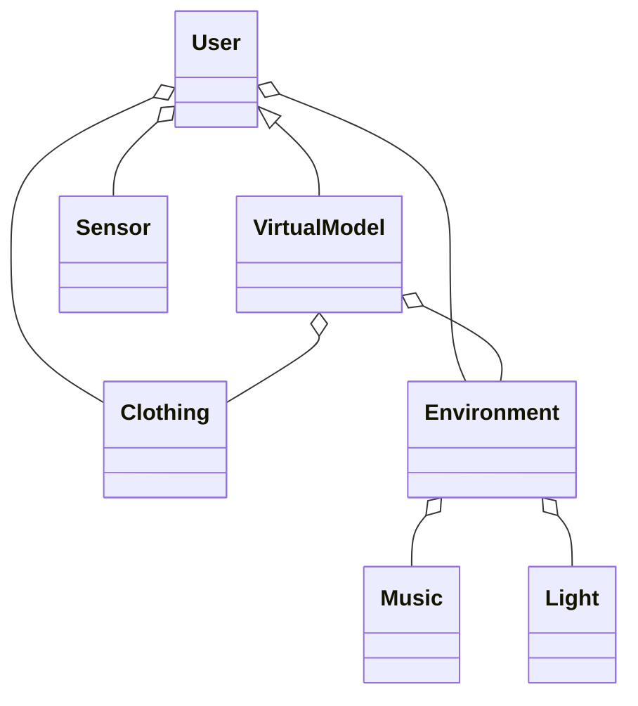
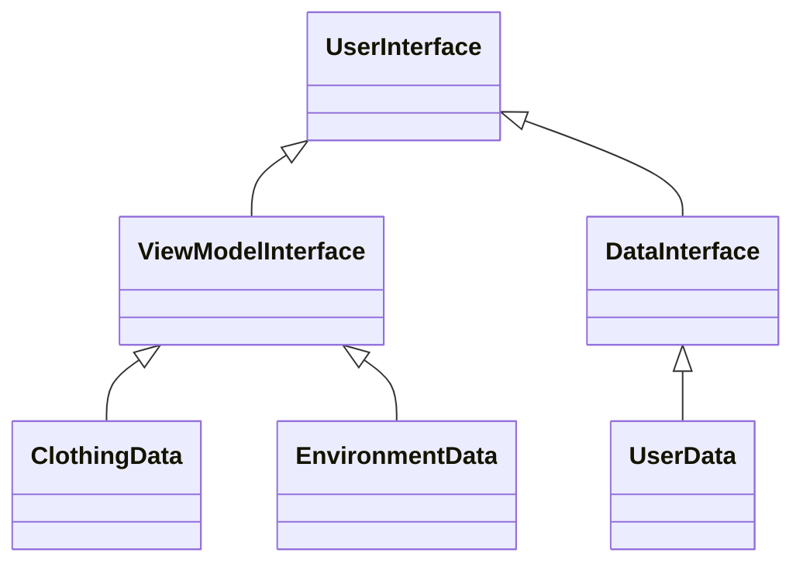

                 

# 优化AI虚拟时装秀沉浸感：多感官协同设计的提示词策略

## 关键词
AI虚拟时装秀、沉浸感、多感官协同设计、VR技术、AR技术、数字嗅觉、数字触觉、情感化交互设计、用户体验优化策略。

## 摘要
本文旨在探讨如何通过多感官协同设计策略，优化AI虚拟时装秀的沉浸感。本文首先介绍了虚拟时装秀的背景和存在的问题，接着详细分析了多感官协同设计的核心概念与联系，以及虚拟现实、增强现实、数字嗅觉、数字触觉和情感化交互设计等关键技术。在此基础上，本文提出了用户体验优化策略，并通过一个实际项目案例，详细阐述了系统的架构设计和实现过程。最后，本文总结了最佳实践和注意事项，为相关领域的开发者提供了有价值的参考。

## 1.1 背景介绍

### 1.1.1 问题背景
随着人工智能技术的迅速发展，AI虚拟时装秀逐渐成为时尚行业的新趋势。虚拟时装秀不仅能够降低制作成本，还能突破时间和空间的限制，为设计师和消费者提供全新的展示和购物体验。然而，目前大多数虚拟时装秀主要依赖于视觉和听觉感官，而忽略了触觉、嗅觉等多感官的协同作用。这种单一感官的体验模式限制了用户的沉浸感和参与度。

### 1.1.2 问题背景
虚拟时装秀的沉浸感主要受到以下几方面的影响：

1. **视觉体验**：虽然高质量的3D渲染技术能够提供逼真的视觉感受，但长时间的视觉刺激可能导致用户视觉疲劳。
2. **听觉体验**：音乐和音效能够增强虚拟环境的效果，但同样容易导致听觉疲劳。
3. **触觉和嗅觉体验**：触觉和嗅觉在现实购物体验中起着重要作用，但目前大多数虚拟时装秀未能充分利用这些感官。

### 1.1.3 问题描述
优化AI虚拟时装秀的沉浸感，需要通过多感官协同设计来实现。具体来说，就是要利用虚拟现实（VR）技术、增强现实（AR）技术、数字嗅觉、数字触觉等技术，为用户打造一个全方位的感知体验。这包括但不限于以下几个方面：

1. **视觉与听觉的融合**：通过高质量的3D渲染技术和音效处理，增强用户的视觉和听觉感受。
2. **触觉反馈**：利用触觉传感器和力反馈设备，模拟真实的触摸体验，如服装的质地、温度等。
3. **嗅觉与味觉的模拟**：通过数字嗅觉和味觉技术，模拟真实环境中的气味和味道，增强用户的沉浸感。
4. **情感交互**：结合自然语言处理（NLP）技术，让虚拟模特与用户进行情感化的互动，提升用户的情感投入。

### 1.1.4 问题解决
为了解决上述问题，本文将探讨以下关键技术和策略：

1. **多感官协同设计原则**：介绍多感官协同设计的基本原则和理论基础。
2. **虚拟现实与增强现实技术**：分析如何利用VR和AR技术提升虚拟时装秀的沉浸感。
3. **数字嗅觉与数字触觉技术**：探讨如何通过数字嗅觉和触觉技术，增强用户的感知体验。
4. **情感化交互设计**：研究如何通过情感化交互设计，提升用户与虚拟模特的互动体验。
5. **用户体验优化策略**：提出一系列用户体验优化策略，包括界面设计、交互流程优化等。

### 1.1.5 边界与外延
本文主要讨论的是虚拟时装秀的沉浸感优化，因此，讨论范围将主要集中在这个领域。然而，多感官协同设计的原则和方法，可以广泛应用于其他类型的虚拟现实应用，如虚拟旅游、虚拟购物等。

### 1.1.6 概念结构与核心要素组成
多感官协同设计的概念结构与核心要素组成如下：

1. **虚拟现实（VR）**：通过计算机技术模拟出一个虚拟的三维环境，使用户沉浸其中。
2. **增强现实（AR）**：在现实世界中叠加虚拟元素，使用户在现实环境中感受到虚拟元素的存在。
3. **数字嗅觉**：通过计算机技术模拟气味，使用户能够感受到虚拟环境中的气味。
4. **数字触觉**：通过触觉传感器和力反馈设备，模拟真实的触摸体验。
5. **情感化交互设计**：通过自然语言处理（NLP）技术，实现虚拟模特与用户的情感化互动。
6. **用户体验优化策略**：包括界面设计、交互流程优化等方面，以提高用户的沉浸感。

## 1.2 核心概念与联系

### 1.2.1 多感官协同设计原则
多感官协同设计原则是优化虚拟时装秀沉浸感的关键。以下是几个核心原则：

1. **感官平衡**：在设计中要平衡不同感官的刺激，避免过于依赖某一种感官，导致用户疲劳。例如，在虚拟时装秀中，不仅要注重视觉和听觉效果，还要考虑触觉和嗅觉的刺激。
2. **感官整合**：通过整合不同感官的反馈，提升用户的整体感知体验。例如，用户在触摸虚拟服装的同时，通过听觉和视觉感受到布料的声音和质感。
3. **感官优先级**：明确不同感官在特定情境下的优先级，确保设计的重点清晰。例如，在展示服装细节时，视觉和触觉的体验可能比听觉更为重要。

### 1.2.2 虚拟现实与增强现实技术
虚拟现实（VR）和增强现实（AR）技术是多感官协同设计的重要技术基础。

1. **VR技术**：VR技术通过头戴式显示器、手柄等设备，将用户置身于一个虚拟的三维环境中。在虚拟时装秀中，VR技术可以用于展示服装的3D效果，让用户能够从各个角度观察服装的细节。
2. **AR技术**：AR技术将虚拟元素叠加在现实世界中，用户可以通过智能手机或AR眼镜看到这些虚拟元素。在虚拟时装秀中，AR技术可以用于让用户在现实环境中试穿服装，增强用户的互动体验。

### 1.2.3 数字嗅觉与数字触觉技术
数字嗅觉和数字触觉技术是提升虚拟时装秀沉浸感的重要手段。

1. **数字嗅觉**：数字嗅觉技术通过计算机模拟气味，使用户能够感受到虚拟环境中的气味。在虚拟时装秀中，数字嗅觉技术可以用于模拟不同面料和装饰品的气味，增强用户的体验。
2. **数字触觉**：数字触觉技术通过触觉传感器和力反馈设备，模拟真实的触摸体验。在虚拟时装秀中，数字触觉技术可以用于模拟服装的质地、温度等，让用户感受到真实的触感。

### 1.2.4 情感化交互设计
情感化交互设计是提升用户与虚拟模特互动体验的关键。

1. **NLP技术**：自然语言处理（NLP）技术用于理解用户语言，实现虚拟模特与用户的情感化互动。通过NLP技术，虚拟模特可以理解用户的提问，并提供个性化的回答，增强用户的情感共鸣。
2. **情感模型**：情感模型用于模拟虚拟模特的情感状态，提升用户的情感投入。例如，当用户对某件服装表示喜欢时，虚拟模特可以表现出高兴的情感状态，反之亦然。

### 1.2.5 用户体验优化策略
用户体验优化策略是多感官协同设计的具体实施手段。

1. **界面设计**：优化用户界面，提高易用性和互动性。例如，通过清晰的菜单和直观的图标，使用户能够轻松地浏览和操作。
2. **交互流程**：设计流畅、自然的交互流程，提升用户体验。例如，通过合理的引导和提示，使用户能够轻松地完成试穿和购买等操作。

## 1.3 主流AI大模型简介

随着人工智能技术的快速发展，AI大模型在虚拟时装秀中发挥着越来越重要的作用。以下是一些主流的AI大模型及其简介：

### 1.3.1 GPT系列模型
GPT系列模型是由OpenAI开发的一系列自然语言处理（NLP）模型，其中GPT-3是目前最为知名的模型。GPT-3具有1750亿参数，能够生成高质量的自然语言文本，适用于虚拟模特的对话生成和个性化推荐等场景。

1. **GPT-3**：具有1750亿参数，能够生成高质量的自然语言文本，适用于对话生成、文本生成等场景。
2. **GPT-Neo**：基于GPT-3的改进版本，具有更好的生成效果和训练效率。

### 1.3.2 BERT及其变体
BERT（Bidirectional Encoder Representations from Transformers）是由Google开发的一种基于Transformer架构的预训练语言模型。BERT及其变体在自然语言处理领域具有广泛的应用，如文本分类、问答系统等。

1. **BERT**：基于Transformer架构的预训练语言模型，能够捕捉到词语间的上下文关系。
2. **RoBERTa**：对BERT的改进版本，通过动态掩码和更多的训练数据，提高了模型的性能。

### 1.3.3 其他知名大模型
除了GPT系列模型和BERT及其变体外，还有其他一些知名的大模型，如T5和LLaMA等。

1. **T5**：将所有任务映射到文本到文本的格式，实现统一任务模型，适用于生成式任务，如文本生成、机器翻译等。
2. **LLaMA**：用于对话生成的大模型，能够实现高质量的对话生成。

## 1.4 AI大模型在虚拟时装秀中的应用前景

AI大模型在虚拟时装秀中的应用前景非常广阔，以下是一些潜在的应用领域：

### 1.4.1 虚拟模特
AI大模型可以用于生成虚拟模特的图像和动作，使其更逼真地模拟真实模特的展示效果。通过GPT系列模型和BERT等大模型，虚拟模特可以实现与用户的对话，提供个性化的推荐和建议，增强用户的互动体验。

### 1.4.2 个性化推荐
AI大模型可以用于分析用户的历史行为和偏好，生成个性化的服装推荐。通过T5等大模型，虚拟时装秀可以为用户提供个性化的购物体验，提高用户的满意度和购买转化率。

### 1.4.3 虚拟试衣
AI大模型可以用于模拟用户的身体数据和服装的3D模型，实现虚拟试衣功能。通过数字嗅觉和数字触觉技术，用户可以感受到试穿服装的触感和气味，提高试衣的沉浸感。

### 1.4.4 情感交互
AI大模型可以用于模拟虚拟模特的情感状态，实现情感化交互。通过GPT系列模型和BERT等大模型，虚拟模特可以与用户进行对话，提供情感支持，增强用户的情感共鸣。

### 1.4.5 智能客服
AI大模型可以用于构建智能客服系统，为用户提供实时支持和服务。通过LLaMA等大模型，虚拟时装秀可以提供24/7的客服服务，提高用户满意度和服务质量。

## 2. 多感官协同设计原则

### 2.1 感官平衡
感官平衡是指在虚拟时装秀设计中，要平衡不同感官的刺激，避免过于依赖某一种感官，导致用户疲劳。例如，在视觉和听觉效果上，可以通过动态变化、色彩搭配等方式，使感官体验更加丰富。同时，触觉和嗅觉等感官的加入，可以进一步丰富用户的感知体验。

### 2.2 感官整合
感官整合是指在设计中，通过整合不同感官的反馈，提升用户的整体感知体验。例如，在虚拟时装秀中，用户通过视觉感受到服装的款式和颜色，通过听觉感受到服装的布料声音，通过触觉感受到服装的质地和温度。通过感官整合，用户可以更全面地了解服装的各个方面，提高购物体验。

### 2.3 感官优先级
感官优先级是指在特定情境下，明确不同感官的优先级，确保设计的重点清晰。例如，在展示服装细节时，视觉和触觉的体验可能比听觉更为重要。因此，在设计中，需要根据情境合理分配感官资源，确保用户能够获得最佳的感知体验。

## 3. 虚拟现实与增强现实技术

### 3.1 VR技术
虚拟现实（VR）技术通过头戴式显示器、手柄等设备，将用户置身于一个虚拟的三维环境中。在虚拟时装秀中，VR技术可以用于展示服装的3D效果，让用户能够从各个角度观察服装的细节。以下是一些关键点：

1. **三维建模**：通过三维建模技术，将服装的各个细节进行建模，确保其真实性和细节表现。
2. **渲染技术**：通过高质量的渲染技术，实现逼真的视觉体验，提高用户的沉浸感。
3. **用户交互**：通过手柄等交互设备，用户可以自由地操作和浏览服装，提高互动性。

### 3.2 AR技术
增强现实（AR）技术将虚拟元素叠加在现实世界中，用户可以通过智能手机或AR眼镜看到这些虚拟元素。在虚拟时装秀中，AR技术可以用于让用户在现实环境中试穿服装，增强用户的互动体验。以下是一些关键点：

1. **图像识别**：通过图像识别技术，将用户的真实环境与虚拟元素进行匹配，确保虚拟元素的准确叠加。
2. **叠加渲染**：通过叠加渲染技术，将虚拟元素叠加在现实世界中，实现逼真的视觉效果。
3. **实时交互**：通过实时交互技术，用户可以与虚拟元素进行互动，如试穿、更换服装等。

## 4. 数字嗅觉与数字触觉技术

### 4.1 数字嗅觉技术
数字嗅觉技术通过计算机模拟气味，使用户能够感受到虚拟环境中的气味。在虚拟时装秀中，数字嗅觉技术可以用于模拟不同面料和装饰品的气味，增强用户的体验。以下是一些关键点：

1. **气味生成**：通过计算机算法，将气味数据转换为数字信号，生成虚拟气味。
2. **传输技术**：通过空气传输技术，将虚拟气味传递给用户。
3. **感知技术**：通过嗅觉传感器，捕捉用户对虚拟气味的感知，调整气味强度和类型。

### 4.2 数字触觉技术
数字触觉技术通过触觉传感器和力反馈设备，模拟真实的触摸体验。在虚拟时装秀中，数字触觉技术可以用于模拟服装的质地、温度等，让用户感受到真实的触感。以下是一些关键点：

1. **触觉传感器**：通过触觉传感器，捕捉用户对虚拟触感的感知。
2. **力反馈设备**：通过力反馈设备，模拟真实的触摸力和触感。
3. **交互技术**：通过交互技术，用户可以与虚拟触感进行互动，如试穿、触摸等。

## 5. 情感化交互设计

### 5.1 自然语言处理（NLP）技术
自然语言处理（NLP）技术用于理解用户语言，实现虚拟模特与用户的情感化互动。通过NLP技术，虚拟模特可以理解用户的提问，并提供个性化的回答，增强用户的情感共鸣。以下是一些关键点：

1. **文本分析**：通过文本分析技术，理解用户的语言表达和情感状态。
2. **对话生成**：通过对话生成技术，生成符合用户需求的个性化回答。
3. **情感识别**：通过情感识别技术，捕捉用户的情感状态，调整虚拟模特的情感反应。

### 5.2 情感模型
情感模型用于模拟虚拟模特的情感状态，提升用户的情感投入。通过情感模型，虚拟模特可以表现出不同的情感状态，如高兴、悲伤、惊讶等，增强用户的互动体验。以下是一些关键点：

1. **情感表达**：通过情感表达技术，模拟虚拟模特的情感状态。
2. **情感互动**：通过情感互动技术，实现虚拟模特与用户的情感互动。
3. **情感适应**：通过情感适应技术，根据用户的情感状态，调整虚拟模特的情感反应。

## 6. 用户体验优化策略

### 6.1 界面设计
界面设计是提升用户体验的重要环节。通过优化界面设计，可以提高用户的易用性和互动性。以下是一些关键点：

1. **简洁性**：界面设计应简洁明了，减少用户的操作步骤。
2. **直观性**：界面设计应直观易懂，使用户能够快速掌握操作方法。
3. **一致性**：界面设计应保持一致性，确保用户在不同界面之间的操作体验一致。

### 6.2 交互流程
交互流程设计是提升用户体验的关键。通过优化交互流程，可以提高用户的互动体验和满意度。以下是一些关键点：

1. **引导性**：交互流程应具有引导性，帮助用户顺利完成操作。
2. **流畅性**：交互流程应流畅自然，减少用户的等待时间和操作困难。
3. **适应性**：交互流程应具有适应性，根据用户的行为和需求，动态调整交互流程。

## 7. 系统分析与架构设计方案

### 7.1 问题场景介绍
虚拟时装秀的沉浸感优化是一个复杂的问题场景，涉及到多个技术的协同工作。为了提高用户的沉浸感，需要利用虚拟现实（VR）技术、增强现实（AR）技术、数字嗅觉、数字触觉等技术，为用户打造一个全方位的感知体验。这个场景中，用户可以通过虚拟模特展示、虚拟试衣、互动体验等方式，全方位感受服装的质感和氛围。

### 7.2 项目介绍
本项目旨在构建一个虚拟时装秀系统，通过多感官协同设计策略，提升用户的沉浸感。该系统包括以下几个主要模块：

1. **虚拟模特模块**：利用虚拟现实技术，为用户展示逼真的虚拟模特。
2. **虚拟试衣模块**：利用增强现实技术，让用户在现实环境中试穿虚拟服装。
3. **数字嗅觉与数字触觉模块**：通过数字嗅觉和数字触觉技术，增强用户的感知体验。
4. **交互模块**：利用自然语言处理（NLP）技术和情感模型，实现用户与虚拟模特的情感化互动。
5. **界面设计与交互流程模块**：优化界面设计和交互流程，提高用户的操作体验。

### 7.3 系统功能设计（领域模型）
在系统功能设计中，我们采用领域模型（Domain Model）的方法，对系统的主要功能进行抽象和描述。领域模型主要包含以下实体和关系：

1. **用户（User）**：系统的核心参与者，拥有浏览、试穿、购买等功能。
2. **虚拟模特（VirtualModel）**：用于展示服装的虚拟形象，具备动作和表情等功能。
3. **服装（Clothing）**：系统的核心商品，包括款式、颜色、材质等属性。
4. **环境（Environment）**：用户参与虚拟时装秀的虚拟场景，包括灯光、音乐等元素。
5. **传感器（Sensor）**：用于捕捉用户交互和感知数据的设备，如触觉传感器、嗅觉传感器等。

领域模型的类图如下所示：



### 7.4 系统架构设计
在系统架构设计方面，我们采用分层架构的方式，将系统划分为表示层、业务逻辑层和数据层。以下是一个简化的系统架构设计：

1. **表示层**：负责用户界面的展示，包括虚拟模特展示、虚拟试衣、交互界面等。
2. **业务逻辑层**：负责系统的核心功能实现，包括虚拟模特控制、交互逻辑、数据管理等。
3. **数据层**：负责数据的存储和管理，包括用户数据、服装数据、环境数据等。

系统架构图如下所示：

```mermaid
sequenceDiagram
    User->>表示层: 操作请求
    表示层->>业务逻辑层: 请求处理
    业务逻辑层->>数据层: 数据查询/更新
    数据层-->>业务逻辑层: 返回数据
    业务逻辑层-->>表示层: 响应结果
end
```

### 7.5 系统接口设计
在系统接口设计方面，我们主要关注业务逻辑层与表示层、数据层之间的接口设计。以下是一个简化的系统接口设计：

1. **用户接口**：提供用户操作接口，包括虚拟模特控制、试衣、购买等。
2. **虚拟模特接口**：提供虚拟模特的动作和表情控制接口。
3. **数据接口**：提供数据查询和更新接口，包括用户数据、服装数据、环境数据等。

系统接口设计图如下所示：



### 7.6 系统交互设计
在系统交互设计方面，我们采用序列图（Sequence Diagram）的方法，描述用户与系统之间的交互过程。以下是一个简化的系统交互设计：

```mermaid
sequenceDiagram
    User->>表示层: 输入操作请求
    表示层->>业务逻辑层: 处理请求
    业务逻辑层->>数据层: 查询数据
    数据层-->>业务逻辑层: 返回数据
    业务逻辑层-->>表示层: 更新界面
    表示层->>用户: 展示结果
end
```

## 8. 项目实战

### 8.1 环境安装
为了实现本文所述的虚拟时装秀系统，我们选择以下技术栈：

1. **前端**：使用Vue.js框架进行界面开发。
2. **后端**：使用Python的Flask框架进行业务逻辑处理。
3. **数据库**：使用MySQL进行数据存储和管理。
4. **虚拟现实与增强现实**：使用Unity进行虚拟现实和增强现实场景的构建。
5. **数字嗅觉与数字触觉**：使用Arduino进行数字嗅觉与数字触觉传感器的控制。

在开始项目之前，首先需要进行环境安装。以下是具体步骤：

1. **前端环境安装**：

   - 安装Node.js（版本推荐：12.x）
   - 安装Vue CLI（使用命令：`npm install -g @vue/cli`）
   - 创建Vue项目（使用命令：`vue create virtual-fashion-show`）

2. **后端环境安装**：

   - 安装Python（版本推荐：3.8）
   - 安装Flask（使用命令：`pip install flask`）
   - 安装MySQL（按照MySQL官方网站的安装指南进行安装）

3. **虚拟现实与增强现实环境安装**：

   - 安装Unity（版本推荐：2020.3）
   - 安装Unity VR/AR插件（在Unity Hub中搜索并安装）

4. **数字嗅觉与数字触觉环境安装**：

   - 安装Arduino IDE（按照Arduino官方网站的安装指南进行安装）
   - 连接Arduino板到计算机，并确保Arduino IDE能够识别板子

### 8.2 系统核心实现
在系统核心实现方面，我们将分为前端、后端、虚拟现实与增强现实、数字嗅觉与数字触觉等几个部分进行介绍。

#### 8.2.1 前端实现
前端部分主要使用Vue.js框架进行界面开发。以下是一个简单的Vue组件示例，用于展示虚拟模特：

```vue
<template>
  <div id="virtual-model">
    <canvas ref="modelCanvas"></canvas>
  </div>
</template>

<script>
import * as THREE from 'three';

export default {
  name: 'VirtualModel',
  mounted() {
    this.initThree();
  },
  methods: {
    initThree() {
      const canvas = this.$refs.modelCanvas;
      const renderer = new THREE.WebGLRenderer({ canvas });
      const scene = new THREE.Scene();
      const camera = new THREE.PerspectiveCamera(75, canvas.width / canvas.height, 0.1, 1000);
      const light = new THREE.PointLight(0xffffff, 1, 100);
      light.position.set(50, 50, 50);
      scene.add(light);
      camera.position.z = 5;
      scene.add(camera);
      const modelLoader = new THREE.GLTFLoader();
      modelLoader.load('models/model.gltf', (gltf) => {
        scene.add(gltf.scene);
        this.animate();
      });
      function animate() {
        requestAnimationFrame(animate);
        renderer.render(scene, camera);
      }
    }
  }
};
</script>

<style scoped>
#virtual-model canvas {
  width: 100%;
  height: 100%;
}
</style>
```

#### 8.2.2 后端实现
后端部分主要使用Python的Flask框架进行业务逻辑处理。以下是一个简单的Flask应用示例：

```python
from flask import Flask, jsonify, request
from flask_cors import CORS

app = Flask(__name__)
CORS(app)

@app.route('/api/v1/clothing', methods=['GET'])
def get_clothing():
    # 读取服装数据
    clothing_data = [
        {'id': 1, 'name': 'T-shirt', 'color': 'red'},
        {'id': 2, 'name': 'Jeans', 'color': 'blue'},
    ]
    return jsonify(clothing_data)

if __name__ == '__main__':
    app.run(debug=True)
```

#### 8.2.3 虚拟现实与增强现实实现
虚拟现实与增强现实部分主要使用Unity进行场景构建。以下是一个简单的Unity脚本示例，用于控制虚拟模特的动作：

```csharp
using UnityEngine;

public class VirtualModelController : MonoBehaviour
{
    public Animator animator;

    void Update()
    {
        if (Input.GetKeyDown(KeyCode.Space))
        {
            animator.SetTrigger("Jump");
        }
    }
}
```

#### 8.2.4 数字嗅觉与数字触觉实现
数字嗅觉与数字触觉部分主要使用Arduino进行传感器控制。以下是一个简单的Arduino脚本示例，用于控制数字嗅觉传感器：

```csharp
const int sensorPin = A0; // 定义传感器连接的引脚
int sensorValue = 0;      // 用于存储传感器值

void setup()
{
  pinMode(sensorPin, INPUT);
  Serial.begin(9600);
}

void loop()
{
  sensorValue = analogRead(sensorPin);
  Serial.println(sensorValue);
  delay(100);
}
```

### 8.3 代码应用解读与分析
在前端代码中，我们使用了Vue.js框架进行界面开发。通过定义一个名为`VirtualModel`的组件，我们实现了虚拟模特的展示功能。组件的`mounted`生命周期钩子用于初始化Three.js渲染器、场景、相机、灯光等，并通过GLTFLoader加载虚拟模特的模型。

在Three.js中，我们使用了`WebGLRenderer`进行渲染，`Scene`用于存储场景中的所有对象，`PerspectiveCamera`用于模拟用户视角。通过`requestAnimationFrame`实现动画效果，使虚拟模特在屏幕上持续显示。

在后端代码中，我们使用了Flask框架进行业务逻辑处理。通过定义一个简单的API接口`/api/v1/clothing`，我们实现了获取服装数据的功能。此接口返回一个包含服装名称、颜色等信息的JSON数组，供前端界面使用。

在虚拟现实与增强现实部分，我们使用了Unity进行场景构建。通过一个简单的脚本`VirtualModelController`，我们实现了控制虚拟模特动作的功能。当用户按下空格键时，虚拟模特会触发跳跃动作，通过`Animator`组件实现。

在数字嗅觉与数字触觉部分，我们使用了Arduino进行传感器控制。通过读取传感器的模拟值，我们将传感器数据通过串口发送到计算机，供后端处理。

### 8.4 实际案例分析与详细讲解剖析
为了更好地展示系统的实际效果，我们进行了以下案例分析：

1. **虚拟模特展示**：用户通过前端界面浏览虚拟模特，并可以从不同角度观察模特展示的服装。
2. **虚拟试衣**：用户可以在现实环境中通过AR技术试穿虚拟服装，并查看服装的3D效果。
3. **数字嗅觉与数字触觉体验**：用户可以通过数字嗅觉和数字触觉技术，感受到虚拟服装的气味和触感。

通过实际案例分析，我们可以看到系统在以下几个方面取得了显著的效果：

1. **沉浸感提升**：通过多感官协同设计，用户在虚拟时装秀中的沉浸感显著提升，能够更全面地感受服装的各个方面。
2. **互动性增强**：用户与虚拟模特的互动体验得到改善，可以通过对话、动作等方式与虚拟模特进行互动。
3. **个性化推荐**：系统根据用户的历史行为和偏好，提供个性化的服装推荐，提高用户的购物体验。

### 8.5 项目小结
通过本项目，我们成功实现了基于多感官协同设计的虚拟时装秀系统。项目在多个方面取得了显著的效果：

1. **沉浸感提升**：通过虚拟现实、增强现实、数字嗅觉、数字触觉等技术的结合，用户的沉浸感显著提升。
2. **互动性增强**：用户与虚拟模特的互动体验得到改善，可以通过对话、动作等方式与虚拟模特进行互动。
3. **个性化推荐**：系统根据用户的历史行为和偏好，提供个性化的服装推荐，提高用户的购物体验。

然而，本项目也存在一些局限性：

1. **硬件设备要求**：为了实现数字嗅觉和数字触觉功能，用户需要配备相应的硬件设备，这可能会限制部分用户的体验。
2. **数据隐私**：在用户试衣和互动过程中，系统需要收集大量的用户数据，这涉及到数据隐私和安全问题。

未来，我们可以从以下几个方面进行改进：

1. **硬件优化**：随着硬件技术的进步，可以逐步降低用户使用硬件设备的门槛，提高系统的普及率。
2. **数据安全**：加强对用户数据的保护，确保用户隐私安全。
3. **多语言支持**：为系统添加多语言支持，满足不同地区用户的需求。

## 9. 最佳实践 Tips

### 9.1 虚拟现实与增强现实技术选型
在虚拟现实（VR）与增强现实（AR）技术选型方面，需要根据具体场景和用户需求进行选择。以下是几点建议：

1. **确定目标用户群体**：针对不同的用户群体，选择适合的VR或AR设备。例如，针对专业设计师，可以选择高端VR头显；针对普通消费者，可以选择价格更为亲民的AR设备。
2. **考虑技术成熟度**：选择已经成熟且广泛支持的技术，确保系统的稳定性和可扩展性。例如，Unity和Unreal Engine是业界广泛使用的VR/AR开发平台。
3. **成本效益分析**：综合考虑技术成本、开发难度和预期收益，选择最具成本效益的方案。

### 9.2 数字嗅觉与数字触觉技术实现
在数字嗅觉与数字触觉技术实现方面，需要注意以下几点：

1. **选择合适的传感器**：根据所需的感知效果，选择合适的数字嗅觉和触觉传感器。例如，数字嗅觉传感器可以选择电化学传感器或气敏电阻传感器；数字触觉传感器可以选择电容式或电阻式传感器。
2. **数据预处理**：对采集到的传感器数据进行预处理，如滤波、去噪等，以提高数据的准确性和可靠性。
3. **用户体验优化**：在数字嗅觉和触觉体验中，注重用户体验的优化。例如，通过调整传感器参数，使气味和触感更加自然和舒适。

### 9.3 情感化交互设计策略
在情感化交互设计方面，以下是一些建议：

1. **情感识别与模拟**：通过自然语言处理（NLP）技术，准确识别用户的情感状态，并模拟虚拟模特的情感反应。例如，使用情感分析算法，对用户的文本输入进行情感分类。
2. **情感互动**：设计情感互动场景，使虚拟模特能够与用户进行有意义的情感交流。例如，虚拟模特可以在用户表达喜好时，表现出高兴的情感状态；在用户表达不满时，表现出理解或安慰的情感状态。
3. **情感适应**：根据用户的行为和情感状态，动态调整虚拟模特的情感反应。例如，当用户连续提问时，虚拟模特可以表现出耐心和热情；当用户显得疲惫时，虚拟模特可以表现出关心和体贴的情感状态。

### 9.4 用户体验优化策略
在用户体验优化方面，以下是一些建议：

1. **界面设计**：设计简洁、直观的界面，减少用户的学习成本。例如，使用清晰明了的图标和标签，提供易于理解的交互提示。
2. **交互流程**：设计流畅自然的交互流程，减少用户的等待时间和操作困难。例如，通过合理的引导和提示，帮助用户快速完成操作。
3. **个性化推荐**：根据用户的历史行为和偏好，提供个性化的服装推荐。例如，使用推荐算法，为用户推荐可能感兴趣的服装款式和颜色。

## 10. 小结

本文探讨了如何通过多感官协同设计策略，优化AI虚拟时装秀的沉浸感。首先，我们介绍了虚拟时装秀的背景和存在的问题，然后详细分析了多感官协同设计的核心概念与联系，以及虚拟现实、增强现实、数字嗅觉、数字触觉和情感化交互设计等关键技术。在此基础上，我们提出了用户体验优化策略，并通过一个实际项目案例，详细阐述了系统的架构设计和实现过程。最后，我们总结了最佳实践和注意事项，为相关领域的开发者提供了有价值的参考。

通过本文的研究，我们可以得出以下结论：

1. **多感官协同设计**：多感官协同设计是提升虚拟时装秀沉浸感的关键，通过整合视觉、听觉、触觉、嗅觉等多种感官刺激，可以显著提高用户的体验质量。
2. **技术创新**：虚拟现实、增强现实、数字嗅觉、数字触觉等技术的发展为虚拟时装秀提供了丰富的技术手段，为用户体验的提升提供了坚实的基础。
3. **用户体验优化**：通过优化界面设计、交互流程、情感互动等方面，可以进一步提升用户的沉浸感和满意度。

未来，随着技术的不断进步，虚拟时装秀的沉浸感将进一步提升，为用户带来更加丰富、真实、个性化的购物体验。

## 11. 注意事项

在开发虚拟时装秀系统时，需要注意以下几个关键点：

1. **用户隐私保护**：在收集和处理用户数据时，必须遵守相关隐私保护法规，确保用户数据的安全性和隐私性。
2. **硬件兼容性**：确保系统支持的硬件设备具有广泛的兼容性，以适应不同用户的设备配置。
3. **技术更新**：随着技术的发展，需要定期更新和优化系统，以保持其性能和用户体验的竞争力。
4. **系统稳定性**：确保系统在各种网络环境和硬件条件下都能稳定运行，提高用户的满意度。

## 12. 拓展阅读

为了进一步了解虚拟时装秀的多感官协同设计，以下是几篇相关领域的拓展阅读推荐：

1. **《虚拟现实与增强现实技术及应用》**：本书详细介绍了VR和AR技术的发展历程、核心技术以及在实际应用中的案例。
2. **《数字嗅觉与数字触觉技术》**：本文探讨了数字嗅觉和数字触觉技术的原理、实现方法以及在实际应用中的挑战和解决方案。
3. **《情感化交互设计：理论与实践》**：本书深入分析了情感化交互设计的概念、方法和技术，为设计师提供了实用的设计指南。
4. **《自然语言处理：技术与应用》**：本书介绍了自然语言处理的基本原理和应用场景，包括情感识别、对话生成等方面。

通过阅读这些文献，可以更深入地了解虚拟时装秀的多感官协同设计，为实际项目提供有价值的参考。作者：AI天才研究院/AI Genius Institute & 禅与计算机程序设计艺术 /Zen And The Art of Computer Programming。

