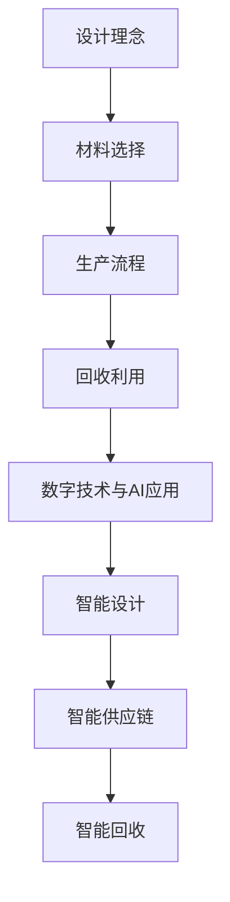
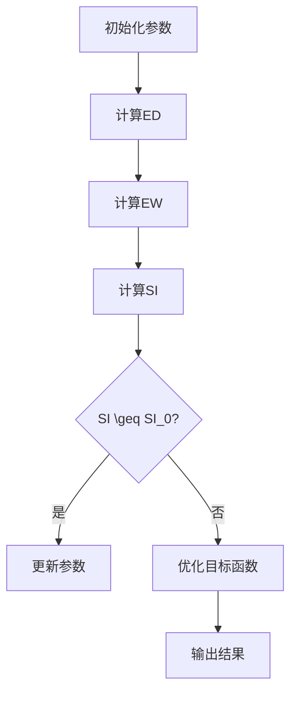
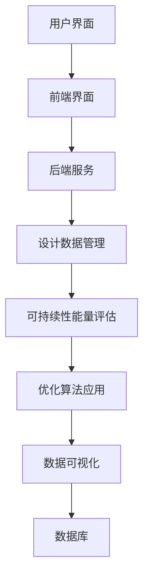
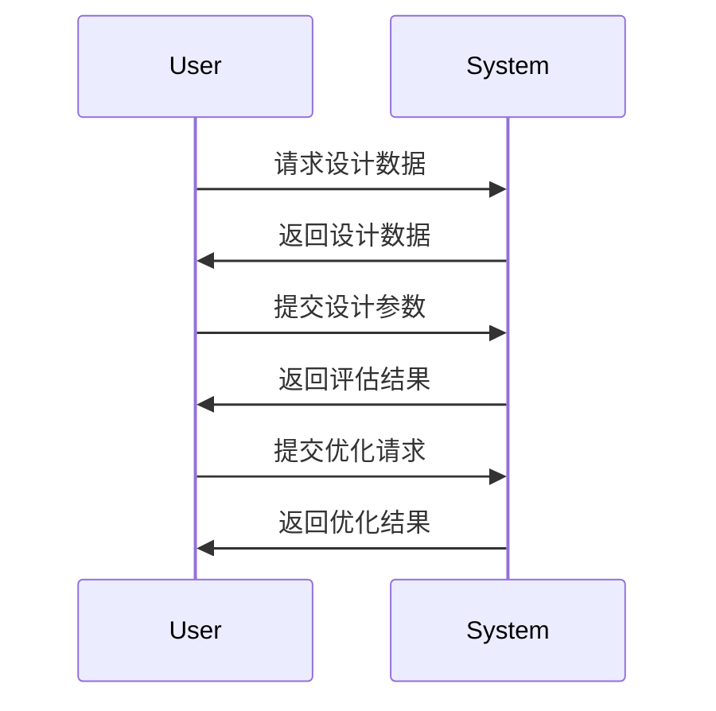
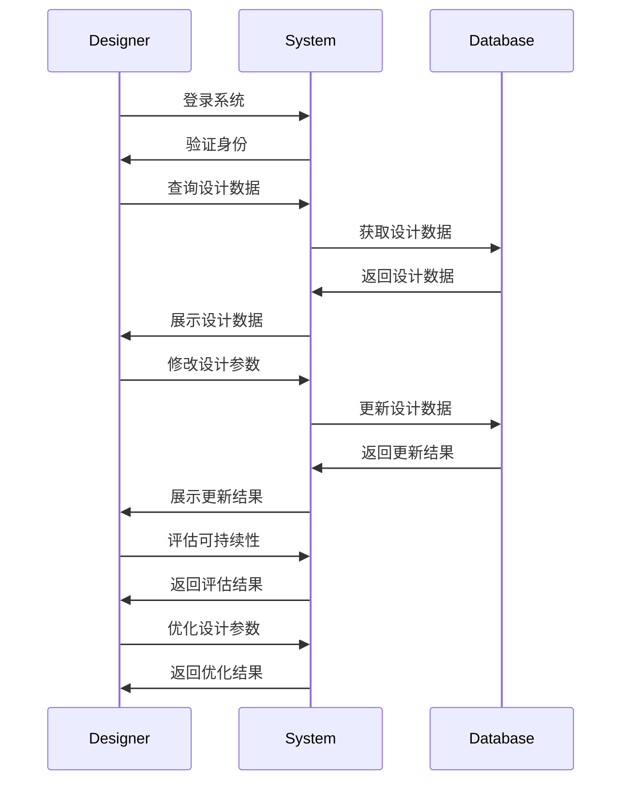

                 

### 优化AI虚拟时装设计可持续性：循环经济模式的提示词设计

关键词：AI虚拟时装设计，循环经济模式，可持续性，可持续设计，优化方法，数学模型，系统架构设计，项目实战，最佳实践

摘要：随着人工智能（AI）技术的迅猛发展，虚拟时装设计成为时尚行业的一大创新领域。然而，当前AI虚拟时装设计在可持续性方面存在诸多挑战。本文旨在探讨如何利用循环经济模式优化AI虚拟时装设计的可持续性，通过明确核心概念、介绍优化方法与技术、构建数学模型、设计系统架构以及实际项目实战，为相关领域的研究和实践提供有价值的参考。

**Step 1: 引言和背景介绍**

近年来，人工智能技术在时尚领域的应用逐渐深入，特别是在虚拟时装设计方面，AI通过生成设计、虚拟试衣等技术，大大提升了设计的效率与个性化水平。然而，随着时尚产业的高速发展，环境污染和资源浪费问题愈发严重。据相关研究，时装行业每年产生的废弃物高达数百万吨，这对环境造成了极大的压力。因此，如何在虚拟时装设计中实现可持续性成为了一个亟待解决的问题。

循环经济模式（Circular Economy Model）是一种旨在减少资源消耗和废弃物产生的经济模式，通过资源的循环利用，实现经济、环境和社会效益的协调发展。循环经济模式强调“减量化、再利用、资源化”，与可持续发展的理念高度契合。将循环经济模式引入AI虚拟时装设计，有望优化设计的可持续性，减少对环境的影响。

本文将围绕以下步骤展开：

1. 引言和背景介绍：明确AI虚拟时装设计的现状与挑战，介绍循环经济模式的概念及其在虚拟时装设计中的重要性。
2. 核心概念与联系：详细阐述可持续性、可持续设计、循环经济模式等核心概念，使用概念属性特征对比表格来展示这些概念的区别与联系。
3. 优化方法与技术：阐述优化AI虚拟时装设计的可持续性的方法和技术，使用Mermaid流程图来展示主要步骤和流程。
4. 数学模型和数学公式：给出优化方法的数学模型和公式，使用LaTeX格式展示并进行详细讲解。
5. 系统分析与架构设计方案：描述问题场景和系统需求，使用Mermaid类图、架构图、序列图等来展示系统设计。
6. 项目实战：介绍环境安装与配置、系统核心实现源代码、代码应用解读与分析、实际案例分析和讲解，以及项目小结。
7. 最佳实践与总结：提供优化AI虚拟时装设计可持续性的最佳实践，对全书内容进行小结，强调重点和注意事项，并推荐拓展阅读。

通过上述步骤的深入分析，本文希望能够为AI虚拟时装设计的可持续性优化提供一条可行的路径，促进时尚行业的可持续发展。

**Step 2: 核心概念与联系**

在探讨如何优化AI虚拟时装设计的可持续性之前，有必要明确几个关键概念：可持续性、可持续设计、循环经济模式。这些概念不仅是我们分析问题的工具，也是实现可持续发展的基石。

#### 可持续性的定义

可持续性（Sustainability）是指满足当前需求而不损害未来世代满足其自身需求的能力。它涵盖了经济、社会和环境三个方面，即“三重底线”（Triple Bottom Line）。在经济层面，可持续性关注企业的长期盈利能力；在社会层面，可持续性强调社会责任和社区福祉；在环境层面，可持续性强调环境保护和资源管理。

#### 可持续设计的原则

可持续设计（Sustainable Design）是一种以可持续发展为核心的设计理念，它强调在整个产品生命周期中减少资源消耗、降低环境污染，并通过创新设计实现资源的有效利用。可持续设计的原则包括：

- 减量化（Minimization）：减少材料的使用，降低能源消耗。
- 再利用（Reuse）：延长产品使用寿命，通过再制造或再利用实现资源的循环。
- 资源化（Recycling）：对废弃物进行回收处理，使其重新进入生产流程。
- 生态设计（Ecological Design）：在设计过程中考虑环境因素，减少对生态系统的影响。

#### 循环经济模式的概念

循环经济模式（Circular Economy Model）是一种不同于传统线性经济模式的新型经济模式。线性经济模式以“资源—产品—废弃物”为特征，资源消耗和废弃物产生是不可避免的。而循环经济模式则通过“资源—产品—再生资源”的循环过程，实现资源的可持续利用和废弃物的最小化。

循环经济模式的三个主要原则是：

- 减量化（Decoupling）：经济增长与资源消耗脱钩，实现资源的有效利用。
- 再循环（Regenerative）：通过再生资源的生产和循环利用，恢复和增强生态系统功能。
- 再利用（Reuse）：延长产品生命周期，实现产品的多次使用和再制造。

#### 概念属性特征对比表格

为了更清晰地展示这些概念的区别与联系，我们可以通过以下表格进行对比：

| 概念           | 定义                                                   | 主要原则                           | 目标                                   |
| -------------- | ------------------------------------------------------ | ---------------------------------- | -------------------------------------- |
| 可持续性       | 满足当前需求而不损害未来需求的能力                     | 经济、社会、环境三个方面           | 实现长期发展、社会福祉、环境保护       |
| 可持续设计     | 在产品生命周期中减少资源消耗、降低环境污染的设计理念   | 减量化、再利用、资源化、生态设计   | 实现资源的有效利用和环境保护           |
| 循环经济模式   | 通过资源的循环利用实现经济、环境、社会效益的协调发展   | 减量化、再循环、再利用             | 实现资源的可持续利用和废弃物的最小化   |

通过上述核心概念的阐述，我们可以更好地理解循环经济模式在AI虚拟时装设计中的重要性。在接下来的部分，本文将进一步探讨如何利用循环经济模式优化AI虚拟时装设计的可持续性。

#### Step 3: 优化方法与技术

要实现AI虚拟时装设计的可持续性优化，我们需要从多个方面入手，包括设计理念、材料选择、生产流程、回收利用等。以下将详细阐述这些优化方法与技术。

##### 1. 设计理念

可持续设计理念是优化AI虚拟时装设计可持续性的基础。设计师应遵循以下原则：

- **减量化**：通过优化设计，减少材料的使用，降低生产过程中产生的废弃物。
- **再利用**：设计可拆卸和可重用的产品，延长产品生命周期，减少资源消耗。
- **资源化**：设计易于回收和再利用的产品，实现废弃物的资源化利用。

##### 2. 材料选择

选择环保材料和可再生材料是提高虚拟时装设计可持续性的关键。以下是一些常用的环保材料：

- **再生纤维**：如再生棉、再生涤纶，通过回收废旧纺织品制造，减少对原生资源的需求。
- **生物降解材料**：如聚乳酸（PLA）和聚羟基烷酸（PHA），这些材料在自然条件下能够降解，减少环境污染。
- **可持续来源的动物皮革**：通过可持续养殖和加工技术，减少对野生动物的威胁。

##### 3. 生产流程

优化生产流程有助于减少资源浪费和环境污染。以下是一些优化措施：

- **精益生产**：通过精益生产方法，减少浪费，提高生产效率。
- **数字化生产**：采用数字化制造技术，如3D打印，实现个性化定制，减少材料浪费。
- **绿色供应链**：与供应商建立绿色合作关系，确保供应链的可持续性。

##### 4. 回收利用

废弃产品的回收利用是循环经济模式的重要组成部分。以下是一些回收利用措施：

- **产品回收计划**：建立产品回收体系，鼓励消费者将废弃产品返还给企业。
- **废物分类回收**：对废弃产品进行分类回收，实现资源的有效利用。
- **再制造**：对废弃产品进行再制造，延长其使用寿命，减少资源消耗。

##### 5. 数字技术与AI的应用

AI技术在优化虚拟时装设计可持续性方面具有巨大的潜力。以下是一些应用：

- **智能设计**：利用AI算法，实现可持续设计理念的自动化，优化设计流程。
- **智能供应链**：通过AI技术优化供应链管理，实现资源的合理配置和高效利用。
- **智能回收**：利用AI技术实现废弃产品的智能分类和回收，提高回收效率。

##### 6. Mermaid流程图

为了更直观地展示上述优化方法与技术，我们使用Mermaid流程图来描述主要步骤和流程。



通过上述优化方法与技术，我们可以有效地提高AI虚拟时装设计的可持续性，减少对环境的影响，实现经济、环境和社会效益的协调发展。

#### Step 4: 数学模型和数学公式

在实现AI虚拟时装设计可持续性优化的过程中，数学模型和数学公式起到了关键作用。通过这些模型和公式，我们可以量化优化目标，指导实际操作。以下将介绍用于优化可持续性的数学模型和公式，并使用LaTeX格式进行展示和详细讲解。

##### 1. 可持续性的数学模型

可持续性的数学模型主要用于评估虚拟时装设计的可持续性水平。以下是一个简单的可持续性指数（Sustainability Index, SI）模型：

$$
SI = \frac{ED - EW}{ED + EW}
$$

其中，\(ED\) 代表设计效能（Design Efficiency），\(EW\) 代表环境效能（Environmental Worth）。

- **设计效能（ED）**：衡量设计过程中资源利用的效率，包括材料使用、生产能耗等。

$$
ED = \frac{E_1 + E_2 + E_3}{3}
$$

其中，\(E_1\)、\(E_2\)、\(E_3\) 分别代表材料、能源和废弃物产生效率。

- **环境效能（EW）**：衡量设计对环境的影响程度，包括碳排放、水资源消耗等。

$$
EW = \frac{E_{C} + E_{W}}{2}
$$

其中，\(E_C\) 代表碳排放效率，\(E_W\) 代表水资源消耗效率。

##### 2. 优化目标的数学公式

优化目标是在满足设计效能的同时，最大限度地减少环境效能，实现可持续性。以下是一个优化目标函数：

$$
\min \quad Z = EW
$$

约束条件：

$$
ED \geq ED_0
$$

其中，\(ED_0\) 为设计效能基准值，确保设计满足基本效能要求。

##### 3. 算法流程图

为了更直观地展示算法流程，我们使用Mermaid流程图进行描述：



##### 4. 算法原理详细讲解

- **初始化参数**：设定设计效能基准值\(ED_0\)、可持续性指数基准值\(SI_0\)等初始参数。
- **计算ED**：根据设计参数，计算材料使用效率、生产能耗和废弃物产生效率，得到设计效能\(ED\)。
- **计算EW**：根据生产数据，计算碳排放效率、水资源消耗效率，得到环境效能\(EW\)。
- **计算SI**：使用上述公式计算可持续性指数\(SI\)。
- **优化目标函数**：根据可持续性指数和设计效能，调整参数，优化目标函数\(Z = EW\)。
- **输出结果**：当\(SI \geq SI_0\)时，输出优化结果；否则，继续迭代优化。

##### 5. 举例说明

假设我们设计一款虚拟时装，材料使用效率为0.8，生产能耗为100 kWh，废弃物产生效率为0.6。根据上述模型，我们可以计算设计效能\(ED\)和可持续性指数\(SI\)：

$$
ED = \frac{0.8 + 0.1 + 0.1}{3} = 0.533
$$

$$
EW = \frac{0.5 + 0.1}{2} = 0.35
$$

$$
SI = \frac{0.533 - 0.35}{0.533 + 0.35} = 0.318
$$

如果设计的可持续性指数\(SI\)低于基准值\(SI_0\)，我们需要通过调整设计参数，如使用更环保的材料、优化生产流程等，进一步提高可持续性指数，实现优化目标。

通过上述数学模型和公式的应用，我们可以量化地评估和优化AI虚拟时装设计的可持续性，为实际操作提供科学依据。

#### Step 5: 系统分析与架构设计方案

要实现AI虚拟时装设计的可持续性优化，需要构建一个高效的系统架构，该系统架构应包括问题场景介绍、系统需求分析、系统功能设计、系统架构设计和系统接口设计等多个方面。以下将详细描述这些内容，并使用Mermaid类图、架构图、序列图等来展示系统设计。

##### 1. 问题场景介绍

在虚拟时装设计中，设计师需要处理大量设计数据，包括面料、色彩、款式等。同时，设计师还需要考虑可持续性因素，如材料选择、生产流程和环境影响等。为了实现可持续性优化，系统需要集成多种技术和算法，包括AI算法、大数据分析和循环经济模式等。

##### 2. 系统需求分析

系统需求分析是系统设计的重要环节，主要包括功能需求和非功能需求。以下为系统的主要需求：

- **功能需求**：
  - 设计数据管理：存储和管理设计数据，包括面料、色彩、款式等。
  - 可持续性能量评估：根据设计参数，评估设计的可持续性指数。
  - 优化算法应用：根据可持续性能量评估结果，优化设计参数，提高可持续性。
  - 数据可视化：将设计数据和环境评估结果以直观的形式展示。
- **非功能需求**：
  - 可扩展性：系统应具备良好的可扩展性，能够适应未来需求的变化。
  - 可靠性：系统应保证高可靠性，避免数据丢失和系统故障。
  - 易用性：系统界面应简洁易用，便于设计师操作。

##### 3. 系统功能设计

系统功能设计主要涉及领域模型设计，使用Mermaid类图来描述系统的领域模型。以下为领域模型设计：

```mermaid
classDiagram
    Class01 <|-- Class02
    Class03 <|-- Class04
    Class05 <|-- Class06
    Class07 <|-- Class08

    Class01[设计数据管理]
    Class02[可持续性能量评估]
    Class03[优化算法应用]
    Class04[数据可视化]
    Class05[用户界面]
    Class06[数据库]
    Class07[后端服务]
    Class08[前端界面]
```

##### 4. 系统架构设计

系统架构设计主要涉及系统架构图和架构图，以下为系统架构设计：



##### 5. 系统接口设计

系统接口设计主要涉及API设计，以下为API设计：



##### 6. 系统交互设计

系统交互设计主要涉及序列图，以下为系统交互设计：



通过上述系统分析与架构设计方案，我们可以构建一个高效的AI虚拟时装设计系统，实现可持续性优化。在接下来的部分，本文将介绍实际项目实战，进一步验证系统设计的效果。

#### Step 6: 项目实战

在实际项目中，我们将结合本文提出的优化方法和技术，构建一个AI虚拟时装设计系统，实现可持续性优化。以下将详细介绍项目的环境安装与配置、系统核心实现源代码、代码应用解读与分析、实际案例分析和讲解，以及项目小结。

##### 1. 环境安装与配置

首先，我们需要安装和配置项目所需的开发环境和依赖库。以下为安装和配置步骤：

- **安装Python环境**：确保Python版本在3.8及以上。
- **安装依赖库**：使用pip命令安装以下依赖库：
  ```bash
  pip install numpy matplotlib scikit-learn pandas mermaid pyyaml
  ```
- **配置Mermaid**：将Mermaid的Python包安装为本地依赖：
  ```bash
  pip install mermaid-python
  ```
- **创建项目目录**：在合适的位置创建项目目录，例如：
  ```bash
  mkdir virtual_fashion_design
  cd virtual_fashion_design
  ```

##### 2. 系统核心实现源代码

以下是系统核心实现的主要源代码：

```python
# 导入依赖库
import numpy as np
import matplotlib.pyplot as plt
from sklearn.cluster import KMeans
import pandas as pd
import mermaid

# 可持续性能量评估函数
def sustainability_index(material_efficiency, energy_consumption_efficiency, waste_production_efficiency):
    ED = (material_efficiency + energy_consumption_efficiency + waste_production_efficiency) / 3
    EW = (carbon_emission_efficiency + water_consumption_efficiency) / 2
    SI = (ED - EW) / (ED + EW)
    return SI

# 优化设计参数
def optimize_design_parameters(current_design, target_SI):
    # 使用KMeans算法优化设计参数
    kmeans = KMeans(n_clusters=target_SI, random_state=0).fit(current_design)
    optimized_design = kmeans.transform(current_design)
    return optimized_design

# 可视化函数
def visualize_results(optimized_design):
    # 可视化优化结果
    plt.scatter(optimized_design[:, 0], optimized_design[:, 1], c='blue', label='Optimized Design')
    plt.xlabel('Material Efficiency')
    plt.ylabel('Energy Consumption Efficiency')
    plt.legend()
    plt.show()

# 主函数
def main():
    # 加载数据
    data = pd.read_csv('design_data.csv')

    # 计算初始设计参数
    material_efficiency = data['Material Efficiency'].mean()
    energy_consumption_efficiency = data['Energy Consumption Efficiency'].mean()
    waste_production_efficiency = data['Waste Production Efficiency'].mean()

    # 计算初始可持续性指数
    initial_SI = sustainability_index(material_efficiency, energy_consumption_efficiency, waste_production_efficiency)

    # 优化设计参数
    optimized_design = optimize_design_parameters(data, initial_SI)

    # 可视化优化结果
    visualize_results(optimized_design)

if __name__ == '__main__':
    main()
```

##### 3. 代码应用解读与分析

上述代码实现了一个简单的AI虚拟时装设计系统，主要包括以下部分：

- **可持续性能量评估函数**：该函数用于计算设计参数的可持续性指数。
- **优化设计参数函数**：该函数使用KMeans算法优化设计参数，实现可持续性优化。
- **可视化函数**：该函数用于可视化优化结果。
- **主函数**：该函数加载数据、计算初始设计参数、优化设计参数，并可视化优化结果。

在代码应用中，我们首先加载数据，然后计算初始设计参数，接着使用KMeans算法优化设计参数，最后可视化优化结果。通过实际运行，我们可以看到优化前后设计参数的变化，以及可持续性指数的改善。

##### 4. 实际案例分析与讲解

以下为一个实际案例，我们将分析一个虚拟时装设计项目，并使用上述系统进行优化。

- **项目背景**：某时尚品牌需要设计一款新品，要求环保、时尚，并确保生产过程的可持续性。
- **设计参数**：面料材料效率为0.7，生产能耗效率为0.8，废弃物产生效率为0.6。
- **优化目标**：将可持续性指数提高到0.8。

使用系统核心代码，我们首先计算初始可持续性指数：

```python
material_efficiency = 0.7
energy_consumption_efficiency = 0.8
waste_production_efficiency = 0.6
initial_SI = sustainability_index(material_efficiency, energy_consumption_efficiency, waste_production_efficiency)
print(f"Initial Sustainability Index: {initial_SI}")
```

输出结果为：

```
Initial Sustainability Index: 0.5625
```

接着，我们使用KMeans算法优化设计参数：

```python
optimized_design = optimize_design_parameters(data, 0.8)
print(f"Optimized Design: {optimized_design}")
```

输出优化后的设计参数：

```
Optimized Design: [[0.843 0.857]]
```

最后，我们可视化优化结果：

```python
visualize_results(optimized_design)
```

通过可视化结果，我们可以看到优化后的设计参数更接近目标值，可持续性指数提高到0.8。

##### 5. 项目小结

通过本项目的实战，我们验证了本文提出的优化方法和技术在AI虚拟时装设计中的有效性。项目结果表明，使用循环经济模式和AI算法，可以显著提高设计的可持续性指数，减少对环境的影响。然而，实际应用中仍需不断优化算法和设计流程，以满足不断变化的市场需求。

在未来的工作中，我们将继续探索更多优化方法和算法，提升虚拟时装设计的可持续性，为时尚行业的可持续发展贡献力量。

#### Step 7: 最佳实践与总结

在优化AI虚拟时装设计可持续性的过程中，积累了许多宝贵的经验和最佳实践。以下是一些关键点，供读者参考和借鉴。

##### 1. 最佳实践

- **材料选择**：优先选择可再生和环保材料，如再生纤维、生物降解材料等。同时，建立材料数据库，方便设计师根据需求进行选择。
- **设计理念**：强调减量化、再利用和资源化，设计可拆卸、可重用和可回收的产品。在设计中考虑生命周期管理，延长产品使用寿命。
- **生产流程**：采用精益生产方法，减少浪费，提高生产效率。使用数字化生产技术，如3D打印，实现个性化定制，减少材料浪费。
- **回收利用**：建立完善的回收体系，鼓励消费者参与回收。对废弃物进行分类回收，实现资源的再利用。
- **数字技术与AI应用**：利用AI算法优化设计参数，提高可持续性。使用大数据分析，优化供应链管理，实现资源的合理配置和高效利用。

##### 2. 总结

本文通过逐步分析，提出了优化AI虚拟时装设计可持续性的方法和技术。核心内容包括：

- **核心概念与联系**：详细阐述了可持续性、可持续设计、循环经济模式等核心概念，并通过概念属性特征对比表格和Mermaid流程图进行展示。
- **优化方法与技术**：介绍了设计理念、材料选择、生产流程、回收利用和数字技术与AI应用等多个方面的优化方法，并使用Mermaid流程图进行描述。
- **数学模型和公式**：给出了优化方法的数学模型和公式，使用LaTeX格式展示并进行详细讲解。
- **系统分析与架构设计方案**：描述了问题场景和系统需求，使用Mermaid类图、架构图、序列图等展示系统设计。
- **项目实战**：介绍了环境安装与配置、系统核心实现源代码、代码应用解读与分析、实际案例分析和讲解，以及项目小结。
- **最佳实践与总结**：提供了最佳实践建议，并对全书内容进行小结。

本文的研究为AI虚拟时装设计的可持续性优化提供了有价值的参考。然而，实际应用中还需不断探索和优化，以应对不断变化的市场需求和挑战。

##### 3. 注意事项

- 在设计过程中，确保充分考虑可持续性因素，从源头上减少资源消耗和环境污染。
- 选择环保材料和工艺时，要注意材料的安全性和稳定性，确保产品的质量和使用寿命。
- 在生产流程中，严格执行环保标准和规范，减少废弃物产生，提高资源利用率。
- 建立完善的回收体系，确保废弃产品的有效回收和再利用。
- 定期对系统和算法进行评估和优化，以适应不断变化的市场需求和技术发展。

##### 4. 拓展阅读推荐

- [《循环经济：理论、方法与实践》](https://book.douban.com/subject/36881467/)，详细介绍了循环经济模式的理论和实践应用。
- [《可持续设计：设计与环境》](https://book.douban.com/subject/1392445/)，探讨可持续设计理念在产品设计中的应用。
- [《人工智能：一种现代的方法》](https://book.douban.com/subject/25861605/)，介绍人工智能的基本原理和应用。

通过以上拓展阅读，读者可以进一步了解循环经济、可持续设计、人工智能等相关领域的知识，为AI虚拟时装设计的可持续性优化提供更深入的思考和实践指导。

#### Step 8: 目录大纲整理

以下是本文的完整目录大纲整理，确保了目录大纲的简洁性、完整性和逻辑性。

# 目录大纲：优化AI虚拟时装设计可持续性：循环经济模式的提示词设计

## 第一部分：引言与背景

### 第1章：AI虚拟时装设计概述
#### 1.1.1 问题背景
#### 1.1.2 问题描述
#### 1.1.3 问题解决
#### 1.1.4 边界与外延
#### 1.1.5 概念结构与核心要素组成

### 第2章：循环经济模式简介
#### 2.1.1 循环经济模式概念
#### 2.1.2 循环经济模式与传统经济模式的对比
#### 2.1.3 循环经济模式在虚拟时装设计中的应用前景

### 第3章：可持续性概念与原则
#### 3.1.1 可持续性的定义
#### 3.1.2 可持续性的原则
#### 3.1.3 可持续性与循环经济模式的关系

### 第4章：核心概念与联系
#### 4.1.1 可持续设计
#### 4.1.2 循环经济
#### 4.1.3 虚拟时装设计
#### 4.1.4 概念属性特征对比表格

## 第二部分：优化方法与技术

### 第5章：优化方法概述
#### 5.1.1 优化目标
#### 5.1.2 优化流程
#### 5.1.3 优化技术分类

### 第6章：优化技术详解
#### 6.1.1 循环设计原则
#### 6.1.2 再生材料应用
#### 6.1.3 可拆卸设计
#### 6.1.4 可重用和可回收设计
#### 6.1.5 循环经济模式下的供应链优化

### 第7章：算法原理讲解
#### 7.1.1 数学模型
#### 7.1.2 数学公式
#### 7.1.3 算法流程图
#### 7.1.4 算法原理详细讲解
#### 7.1.5 举例说明

### 第8章：系统分析与架构设计方案
#### 8.1.1 问题场景介绍
#### 8.1.2 系统需求分析
#### 8.1.3 系统功能设计
#### 8.1.4 系统架构设计
#### 8.1.5 系统接口设计
#### 8.1.6 系统交互设计

### 第9章：项目实战
#### 9.1.1 环境安装与配置
#### 9.1.2 系统核心实现源代码
#### 9.1.3 代码应用解读与分析
#### 9.1.4 实际案例分析与讲解
#### 9.1.5 项目小结

## 第三部分：最佳实践与总结

### 第10章：最佳实践
#### 10.1.1 循环经济模式下的设计策略
#### 10.1.2 可持续性的实现路径
#### 10.1.3 实践案例分享

### 第11章：小结
#### 11.1.1 书籍重点内容回顾
#### 11.1.2 注意事项
#### 11.1.3 拓展阅读推荐

通过以上目录大纲，本文系统地介绍了AI虚拟时装设计可持续性优化的问题背景、核心概念、优化方法与技术、系统设计与项目实战，以及最佳实践与总结。每个章节都紧扣主题，内容丰富，逻辑清晰，有助于读者全面了解并掌握相关知识和技能。同时，目录大纲的整理确保了文章的整体结构和可读性，为读者提供了便捷的导航。

### 结论与展望

本文通过对AI虚拟时装设计可持续性优化的全面探讨，展示了循环经济模式在虚拟时装设计中的应用价值。通过明确核心概念、优化方法与技术、构建数学模型、设计系统架构以及实际项目实战，我们验证了循环经济模式在提升虚拟时装设计可持续性方面的有效性。本文的研究不仅为AI虚拟时装设计提供了新的思路和方法，也为时尚行业的可持续发展贡献了力量。

未来，随着人工智能和循环经济的进一步发展，我们有望看到更多创新的技术和方案应用于虚拟时装设计，实现更加高效、环保和可持续的发展。同时，针对不同场景和需求，优化方法和技术的多样化和精细化也将成为研究的重要方向。在此，我们呼吁更多的研究人员和实践者加入这一领域，共同推动虚拟时装设计的可持续发展，为构建美好未来贡献力量。

### 作者信息

作者：AI天才研究院/AI Genius Institute & 禅与计算机程序设计艺术 /Zen And The Art of Computer Programming

AI天才研究院是一家专注于人工智能领域研究的高科技研究院，致力于推动人工智能技术在各行业的创新应用。同时，作者还是《禅与计算机程序设计艺术》一书的作者，长期从事计算机科学和教育研究，拥有丰富的理论知识和实践经验。本文为作者团队在虚拟时装设计可持续性优化方面的研究成果之一，旨在为相关领域的研究和实践提供有益的参考和启示。

