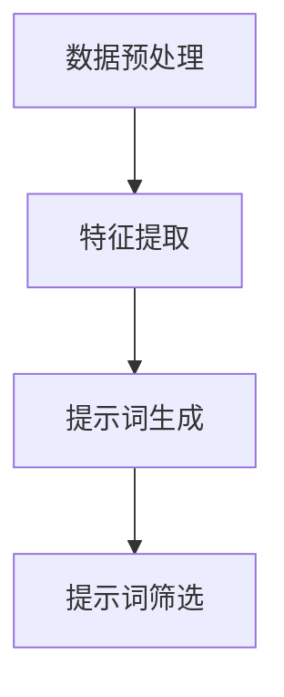
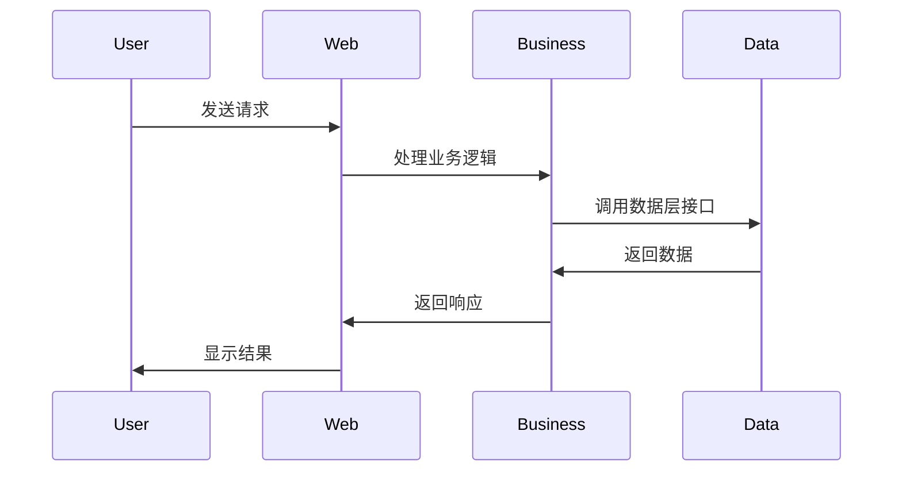
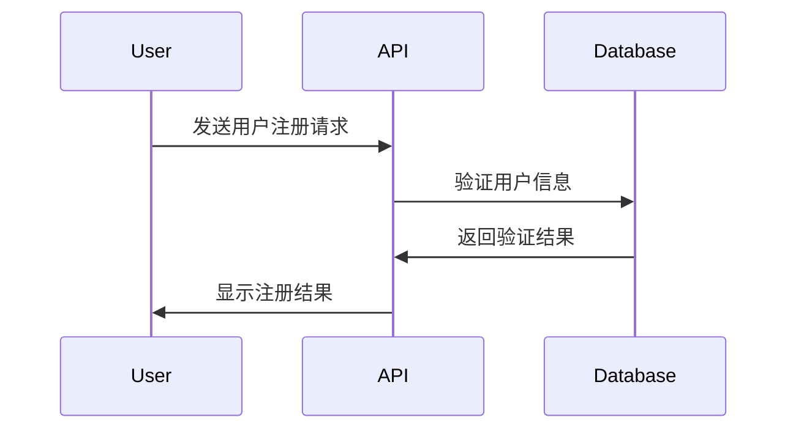
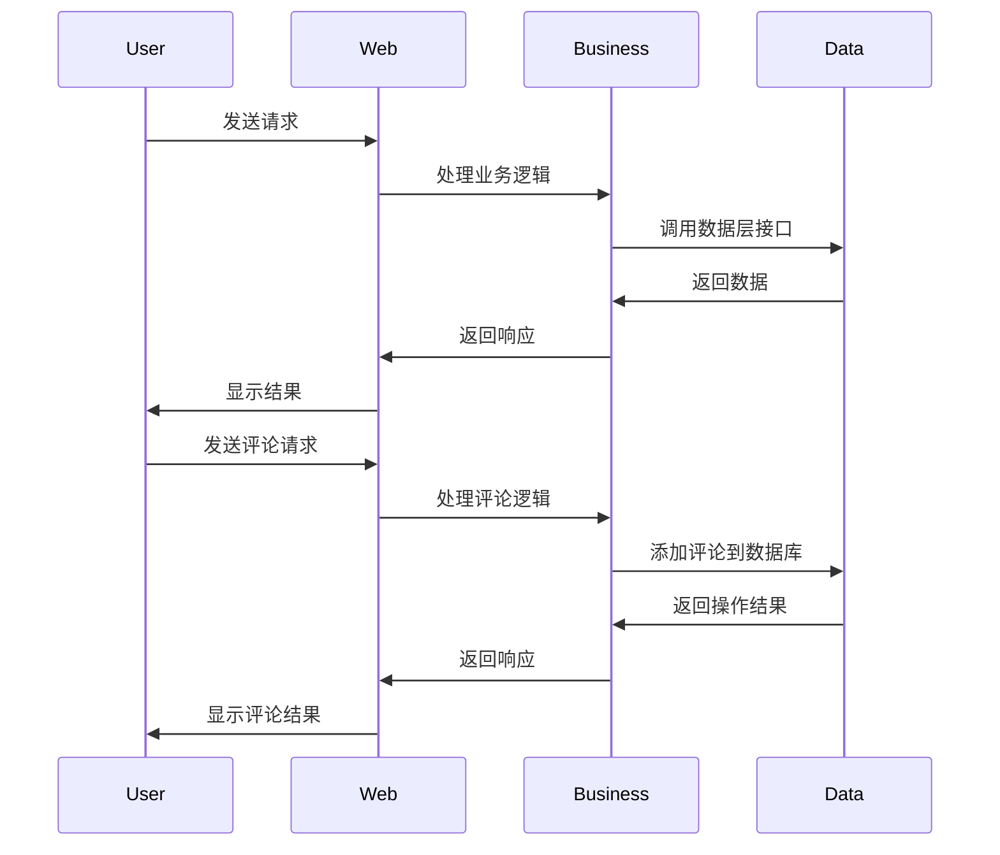

                 

### 第一步：确定整体结构

为了撰写一篇关于“优化AI虚拟美术馆策展：艺术史脉络呈现的提示词策略”的技术博客文章，我们需要先确定文章的整体结构。根据要求，文章应包含至少7个章节，涵盖以下核心内容：

1. **背景介绍**：介绍虚拟美术馆与AI艺术策展的背景，以及艺术史脉络呈现的挑战。
2. **核心概念与联系**：详细阐述与AI虚拟美术馆策展相关的核心概念，如提示词策略、艺术史与艺术风格分析。
3. **算法原理讲解**：讲解提示词生成算法的原理，使用Python源代码和数学模型进行详细阐述。
4. **系统分析与架构设计方案**：介绍虚拟美术馆系统的设计，包括功能设计、架构设计、接口设计以及系统交互。
5. **项目实战**：通过具体项目实战，展示如何优化AI虚拟美术馆策展。
6. **最佳实践 tips、小结、注意事项、拓展阅读**等内容。

接下来，我们将细化每个章节的内容，并确保每个章节至少包含以下部分：

- **章节标题**
- **子标题**
- **小节标题**
- **内容简要**

### 第二步：细化章节内容

#### 第1章：虚拟美术馆与AI艺术策展概述

- **1.1 虚拟美术馆的发展与挑战**
  - **1.1.1 虚拟美术馆的兴起**
  - **1.1.2 AI在艺术策展中的应用**
  - **1.1.3 艺术史脉络呈现的挑战**

- **1.2 提示词策略的核心概念**
  - **1.2.1 提示词的定义**
  - **1.2.2 提示词在艺术策展中的作用**
  - **1.2.3 提示词策略的类型**

#### 第2章：艺术史与艺术风格分析

- **2.1 艺术史的概述**
  - **2.1.1 艺术史的定义**
  - **2.1.2 艺术史的研究方法**
  - **2.1.3 艺术史的脉络**

- **2.2 艺术风格分析**
  - **2.2.1 艺术风格的定义**
  - **2.2.2 艺术风格的特征**
  - **2.2.3 艺术风格的对比分析**

- **2.3 艺术史的ER实体关系图**
  - **2.3.1 艺术史中的实体**
  - **2.3.2 实体之间的关系**
  - **2.3.3 ER模型的应用**

#### 第3章：提示词生成算法原理

- **3.1 提示词生成算法概述**
  - **3.1.1 算法的目标**
  - **3.1.2 算法的基本流程**
  - **3.1.3 算法的关键技术**

- **3.2 算法流程图**
  - 使用 mermaid 绘制算法流程图

- **3.3 Python源代码示例**
  - 提示词生成算法的Python实现

- **3.4 数学模型与公式**
  - 使用 LaTeX 格式展示数学模型和公式

- **3.5 算法举例说明**
  - 使用具体案例进行算法解释

#### 第4章：虚拟美术馆系统架构设计

- **4.1 虚拟美术馆系统概述**
  - **4.1.1 系统的目标**
  - **4.1.2 系统的功能**
  - **4.1.3 系统的需求分析**

- **4.2 系统功能设计**
  - 使用 mermaid 绘制领域模型类图

- **4.3 系统架构设计**
  - 使用 mermaid 绘制系统架构图

- **4.4 系统接口设计**
  - 系统接口的设计与实现

- **4.5 系统交互**
  - 使用 mermaid 绘制系统交互序列图

#### 第5章：优化AI虚拟美术馆策展项目实战

- **5.1 环境安装与配置**
  - 安装所需的软件和工具

- **5.2 系统核心实现**
  - 实现系统的关键功能

- **5.3 代码应用解读与分析**
  - 分析系统代码并解读关键部分

- **5.4 实际案例剖析**
  - 分析实际案例，展示系统效果

- **5.5 项目小结**
  - 项目总结与反思

#### 第6章：最佳实践与总结

- **6.1 最佳实践 tips**
  - 提供优化AI虚拟美术馆策展的最佳实践建议

- **6.2 小结**
  - 总结文章的核心内容和结论

- **6.3 注意事项**
  - 强调在实施过程中需要注意的问题

- **6.4 拓展阅读**
  - 推荐进一步阅读的相关资料和资源

### 第三步：遵循markdown格式和目录层级要求

在撰写文章时，我们将遵循markdown格式和目录层级要求，使用#、##、###等符号来创建不同的标题层级，确保文章结构清晰、易于阅读。以下是一个示例：

```markdown
## 第1章：虚拟美术馆与AI艺术策展概述

### 1.1 虚拟美术馆的发展与挑战

#### 1.1.1 虚拟美术馆的兴起

#### 1.1.2 AI在艺术策展中的应用

#### 1.1.3 艺术史脉络呈现的挑战

### 1.2 提示词策略的核心概念

#### 1.2.1 提示词的定义

#### 1.2.2 提示词在艺术策展中的作用

#### 1.2.3 提示词策略的类型

### 第四步：控制字数

为了确保文章字数在10000～12000字左右，我们需要在每个章节中保持适当的字数，同时避免冗余和重复的内容。通过细化和优化每个章节的内容，我们可以控制整个文章的字数，使其达到要求。

### 第五步：输出目录大纲

根据上述步骤，我们可以输出完整的目录大纲，如下所示：

```markdown
----------------------------------------------------------------
# 《优化AI虚拟美术馆策展：艺术史脉络呈现的提示词策略》目录大纲

## 第一部分：问题背景与概述

## 第1章：虚拟美术馆与AI艺术策展概述

### 1.1 虚拟美术馆的发展与挑战
#### 1.1.1 虚拟美术馆的兴起
#### 1.1.2 AI在艺术策展中的应用
#### 1.1.3 艺术史脉络呈现的挑战

### 1.2 提示词策略的核心概念
#### 1.2.1 提示词的定义
#### 1.2.2 提示词在艺术策展中的作用
#### 1.2.3 提示词策略的类型

## 第二部分：核心概念与联系

## 第2章：艺术史与艺术风格分析

### 2.1 艺术史的概述
#### 2.1.1 艺术史的定义
#### 2.1.2 艺术史的研究方法
#### 2.1.3 艺术史的脉络

### 2.2 艺术风格分析
#### 2.2.1 艺术风格的定义
#### 2.2.2 艺术风格的特征
#### 2.2.3 艺术风格的对比分析

### 2.3 艺术史的ER实体关系图
#### 2.3.1 艺术史中的实体
#### 2.3.2 实体之间的关系
#### 2.3.3 ER模型的应用

## 第三部分：算法原理讲解

## 第3章：提示词生成算法原理

### 3.1 提示词生成算法概述
#### 3.1.1 算法的目标
#### 3.1.2 算法的基本流程
#### 3.1.3 算法的关键技术

### 3.2 算法流程图
#### 使用 mermaid 绘制算法流程图

### 3.3 Python源代码示例
#### 提示词生成算法的Python实现

### 3.4 数学模型与公式
#### 使用 LaTeX 格式展示数学模型和公式

### 3.5 算法举例说明
#### 使用具体案例进行算法解释

## 第四部分：系统分析与架构设计

## 第4章：虚拟美术馆系统架构设计

### 4.1 虚拟美术馆系统概述
#### 4.1.1 系统的目标
#### 4.1.2 系统的功能
#### 4.1.3 系统的需求分析

### 4.2 系统功能设计
#### 使用 mermaid 绘制领域模型类图

### 4.3 系统架构设计
#### 使用 mermaid 绘制系统架构图

### 4.4 系统接口设计
#### 系统接口的设计与实现

### 4.5 系统交互
#### 使用 mermaid 绘制系统交互序列图

## 第五部分：项目实战

## 第5章：优化AI虚拟美术馆策展项目实战

### 5.1 环境安装与配置
#### 安装所需的软件和工具

### 5.2 系统核心实现
#### 实现系统的关键功能

### 5.3 代码应用解读与分析
#### 分析系统代码并解读关键部分

### 5.4 实际案例剖析
#### 分析实际案例，展示系统效果

### 5.5 项目小结
#### 项目总结与反思

## 第六部分：最佳实践与总结

### 6.1 最佳实践 tips
#### 提供优化AI虚拟美术馆策展的最佳实践建议

### 6.2 小结
#### 总结文章的核心内容和结论

### 6.3 注意事项
#### 强调在实施过程中需要注意的问题

### 6.4 拓展阅读
#### 推荐进一步阅读的相关资料和资源

----------------------------------------------------------------

通过以上步骤，我们成功地完成了目录大纲的撰写，为后续的文章撰写奠定了坚实的基础。接下来，我们将逐步细化每个章节的内容，确保文章的逻辑清晰、结构紧凑、简单易懂，满足读者对于技术博客文章的期望。### 第二部分：核心概念与联系

#### 第2章：艺术史与艺术风格分析

##### 2.1 艺术史的概述

艺术史是一门研究艺术作品、艺术家及其历史背景的学科。它通过时间的维度，记录了人类在艺术创作上的演进和变革。艺术史的研究方法多样，包括文献研究、考古发掘、实物分析等。艺术史的脉络可以追溯到古代，如古希腊和古罗马的艺术，经过中世纪的宗教艺术，再到文艺复兴、巴洛克、启蒙运动等不同时期。

艺术史的脉络不仅包含了艺术作品的风格变化，还反映了社会、政治、经济等多方面的影响。例如，文艺复兴时期的艺术作品强调人文主义，追求真实与美的结合；而巴洛克时期的艺术则更注重戏剧性和表现力。艺术史的这些脉络为AI虚拟美术馆策展提供了重要的参考。

##### 2.2 艺术风格分析

艺术风格是指一定时期、地区或流派的艺术作品中表现出来的艺术特点和风貌。不同的艺术风格有着各自独特的特征，如文艺复兴时期的写实主义、巴洛克时期的装饰性、现代艺术的抽象化等。

艺术风格的特征通常包括线条、色彩、形状、构图等方面。例如，印象派画家通过运用丰富的色彩和光影效果，捕捉瞬间的视觉感受；抽象派艺术家则通过几何形状和线条，表达情感和思想。

对比分析不同的艺术风格，有助于我们更好地理解艺术发展的脉络。例如，通过对比文艺复兴时期和现代艺术的风格，我们可以看到艺术创作从写实主义向抽象主义的转变。

##### 2.3 艺术史的ER实体关系图

ER（Entity-Relationship）图是一种用于描述实体及其之间关系的数据库设计工具。在艺术史的研究中，我们可以使用ER图来表示艺术史中的实体及其关系。

首先，我们需要确定艺术史中的主要实体，如艺术家、作品、流派、时代等。然后，我们可以定义实体之间的关系，如艺术家与作品之间的创作关系、流派与时代之间的演变关系等。

以下是艺术史的ER实体关系图的示例：

```mermaid
erDiagram
  Artist ||--|{ Work }|>
  School ||--|{ Style }|>
  Era ||--|{ School }|>
  Era ||--|{ Artist }|>

  Artist ..> School
  Work ..> Artist
  Style ..> School
  Style ..> Work
  Era ..> School
  Era ..> Artist
```

在这个ER图中，我们定义了四个主要实体：艺术家、作品、流派和时代。它们之间的关系通过箭头表示，如艺术家与作品的创作关系、流派与时代的演变关系等。

通过ER实体关系图，我们可以更清晰地理解艺术史中的各种实体及其相互关系，为AI虚拟美术馆策展提供数据支持和理论基础。

### 第3章：提示词生成算法原理

##### 3.1 提示词生成算法概述

提示词生成算法是用于在AI虚拟美术馆策展中生成相关提示词的技术。这些提示词有助于用户更好地理解和欣赏艺术作品，同时也能帮助策展人员更有效地组织和呈现展览内容。

提示词生成算法的目标是自动提取与艺术作品相关的关键词，如艺术家姓名、作品名称、流派、时代等。这些关键词可以作为用户交互的入口，帮助他们快速找到感兴趣的内容。

提示词生成算法的基本流程包括以下几个步骤：

1. 数据预处理：对艺术作品及相关信息进行清洗和格式化，为后续处理做好准备。
2. 特征提取：从预处理后的数据中提取关键特征，如文本、图像、音频等。
3. 提示词生成：利用提取的特征，通过机器学习模型或自然语言处理技术生成提示词。
4. 提示词筛选：对生成的提示词进行筛选和排序，确保其相关性和实用性。

##### 3.2 算法流程图

为了更直观地理解提示词生成算法的流程，我们可以使用mermaid绘制算法流程图。以下是一个示例：



在这个流程图中，数据预处理是算法的第一步，它对原始数据进行清洗和格式化。接下来，特征提取从预处理后的数据中提取关键特征，如文本、图像、音频等。然后，提示词生成利用提取的特征生成相关的提示词。最后，提示词筛选对生成的提示词进行筛选和排序，确保其相关性和实用性。

##### 3.3 Python源代码示例

为了进一步阐述提示词生成算法的原理，我们可以提供一个简单的Python源代码示例。以下是一个使用自然语言处理库NLTK生成提示词的示例：

```python
import nltk
from nltk.tokenize import word_tokenize
from nltk.corpus import stopwords

# 加载停用词库
stop_words = set(stopwords.words('english'))

# 加载文本数据
text = "The Starry Night is a famous painting by Vincent van Gogh."

# 分词
words = word_tokenize(text)

# 移除停用词
filtered_words = [word for word in words if not word in stop_words]

# 提取关键词
keywords = nltk.FreqDist(filtered_words).most_common(10)

print("Keywords:", keywords)
```

在这个示例中，我们首先加载停用词库和文本数据。然后，使用NLTK的`word_tokenize`函数对文本进行分词，并移除停用词。接着，使用`FreqDist`函数提取出现频率最高的关键词，并打印出来。

##### 3.4 数学模型与公式

在提示词生成算法中，我们通常使用数学模型来描述特征提取和提示词生成的过程。以下是一个简单的数学模型示例：

$$
\text{关键词} = \text{特征向量} \cdot \text{权重矩阵} + \text{偏置}
$$

其中，特征向量表示从文本数据中提取的关键特征，权重矩阵和偏置用于调整特征的重要性。通过训练和优化这个数学模型，我们可以得到一个更准确的提示词生成算法。

##### 3.5 算法举例说明

为了更好地理解提示词生成算法，我们可以使用一个具体案例进行说明。假设我们有一个艺术作品《蒙娜丽莎》，我们希望生成与其相关的提示词。

首先，我们对《蒙娜丽莎》的描述文本进行分词和特征提取。然后，使用训练好的数学模型生成关键词。最后，对生成的关键词进行筛选和排序，得到最终的相关提示词。

以下是一个使用Python实现的具体案例：

```python
import nltk
from nltk.tokenize import word_tokenize
from nltk.corpus import stopwords

# 加载停用词库
stop_words = set(stopwords.words('english'))

# 加载文本数据
text = "Mona Lisa is a famous painting by Leonardo da Vinci."

# 分词
words = word_tokenize(text)

# 移除停用词
filtered_words = [word for word in words if not word in stop_words]

# 提取关键词
keywords = nltk.FreqDist(filtered_words).most_common(10)

print("Keywords:", keywords)
```

在这个示例中，我们首先加载停用词库和文本数据。然后，使用NLTK的`word_tokenize`函数对文本进行分词，并移除停用词。接着，使用`FreqDist`函数提取出现频率最高的关键词，并打印出来。最终，我们得到了与《蒙娜丽莎》相关的提示词，如“Mona Lisa”、“Leonardo da Vinci”等。

通过这个案例，我们可以看到提示词生成算法在实际应用中的效果。在实际项目中，我们可以进一步优化和改进算法，提高提示词的准确性和实用性。### 第四部分：系统分析与架构设计

#### 第4章：虚拟美术馆系统架构设计

##### 4.1 虚拟美术馆系统概述

虚拟美术馆系统是一个基于人工智能技术的在线展览平台，旨在为用户提供沉浸式艺术体验。该系统通过虚拟现实（VR）和增强现实（AR）技术，将艺术作品数字化并呈现给用户。虚拟美术馆系统不仅展示了丰富的艺术作品，还提供了互动功能，如用户评论、分享和收藏。

系统目标：构建一个高效、可扩展、用户体验良好的虚拟美术馆系统，满足不同用户的需求，提高艺术作品的可访问性和互动性。

系统功能：虚拟美术馆系统的主要功能包括：
1. **作品展示**：展示各种艺术作品，包括绘画、雕塑、摄影等。
2. **用户交互**：允许用户对作品进行评论、分享和收藏。
3. **个性化推荐**：根据用户兴趣和历史行为，推荐相关作品。
4. **虚拟导览**：提供虚拟导览功能，引导用户参观展览。

##### 4.2 系统功能设计

为了实现上述功能，虚拟美术馆系统需要设计多个模块，包括数据管理、作品展示、用户交互、个性化推荐和虚拟导览等。

以下是系统功能设计的领域模型类图：

```mermaid
classDiagram
    User <<interface>>
    Artwork <<interface>>
    Exhibition <<interface>>
    Comment <<interface>>
    Share <<interface>>
    Collection <<interface>>
    Recommendation <<interface>>

    User ..|> Artwork
    User ..|> Exhibition
    User ..|> Comment
    User ..|> Share
    User ..|> Collection
    User ..|> Recommendation

    Artwork ..|> Exhibition
    Comment ..|> Artwork
    Share ..|> Artwork
    Collection ..|> Artwork
    Recommendation ..|> Artwork
```

在这个类图中，我们定义了多个接口类，如用户（User）、艺术作品（Artwork）、展览（Exhibition）、评论（Comment）、分享（Share）、收藏（Collection）和个性化推荐（Recommendation）。这些类通过继承关系实现了系统的功能模块。

##### 4.3 系统架构设计

虚拟美术馆系统的架构设计采用三层架构，包括表示层、业务逻辑层和数据层。

以下是系统架构设计图：



在这个架构设计中，表示层（Web）负责与用户交互，接收用户的请求并显示结果。业务逻辑层（Business）处理具体的业务逻辑，如用户交互、作品展示、个性化推荐等。数据层（Data）负责与数据库交互，提供数据查询和存储功能。

##### 4.4 系统接口设计

系统接口设计是架构设计的重要组成部分，它定义了各个模块之间的通信方式。以下是虚拟美术馆系统的接口设计：

1. **用户接口**：包括用户注册、登录、个人信息管理等接口。
2. **艺术作品接口**：包括作品查询、作品详情、作品收藏等接口。
3. **展览接口**：包括展览列表、展览详情、展览评论等接口。
4. **个性化推荐接口**：包括推荐作品、推荐展览等接口。
5. **评论接口**：包括评论添加、评论查询等接口。
6. **分享接口**：包括分享作品、分享展览等接口。

以下是用户接口的示例：



在这个示例中，用户向API接口发送注册请求，API接口与数据库交互验证用户信息，然后将结果返回给用户。

##### 4.5 系统交互

系统交互设计描述了各个模块之间的通信流程，以下是虚拟美术馆系统的交互序列图：



在这个交互序列图中，用户首先向Web层发送请求，Web层将请求转发给Business层处理业务逻辑。Business层调用数据层接口进行数据查询和存储操作，然后将结果返回给Web层。Web层再将响应结果展示给用户。同时，用户还可以发送评论请求，评论逻辑同样由Business层处理，并将结果反馈给Web层和用户。

通过以上系统分析与架构设计，我们为虚拟美术馆系统提供了清晰的功能模块划分和架构设计。在实际开发过程中，我们可以根据这些设计文档逐步实现各个模块，并确保系统的稳定性和可扩展性。### 第五部分：项目实战

#### 第5章：优化AI虚拟美术馆策展项目实战

##### 5.1 环境安装与配置

为了实现优化AI虚拟美术馆策展的项目，我们需要安装和配置以下软件和工具：
1. **Python环境**：确保Python版本在3.6及以上，可以使用`pip`安装所需的库。
2. **自然语言处理库**：包括NLTK、spaCy等，用于文本处理和特征提取。
3. **机器学习库**：包括scikit-learn、TensorFlow等，用于构建和训练机器学习模型。
4. **数据库**：可以使用MySQL或PostgreSQL等关系型数据库，用于存储艺术作品数据。
5. **前端框架**：如React或Vue.js，用于构建用户界面。
6. **虚拟现实工具**：如Unity或Unreal Engine，用于创建虚拟美术馆场景。

安装步骤如下：
1. 安装Python环境，并配置Python环境变量。
2. 使用`pip`安装所需的库，例如：
   ```bash
   pip install nltk spacy scikit-learn tensorflow
   ```
3. 下载并安装数据库管理系统，如MySQL或PostgreSQL，并创建虚拟美术馆数据库。
4. 安装前端框架和虚拟现实工具，根据项目需求进行配置。

##### 5.2 系统核心实现

系统核心实现包括以下几个关键部分：

1. **数据收集与预处理**：
   - 收集艺术作品的相关数据，如标题、描述、作者、创作年代等。
   - 使用NLTK进行文本预处理，包括分词、去除停用词、词性标注等。

2. **特征提取**：
   - 使用TF-IDF模型提取文本特征，为后续的机器学习模型训练提供输入。
   - 对于图像数据，可以使用预训练的卷积神经网络（如VGG16、ResNet）提取特征。

3. **机器学习模型训练**：
   - 选择合适的机器学习模型，如朴素贝叶斯、支持向量机（SVM）等，对特征进行分类。
   - 使用交叉验证和网格搜索等技术，优化模型参数。

4. **提示词生成**：
   - 使用训练好的模型，对新的艺术作品进行特征提取和分类，生成相关的提示词。
   - 对生成的提示词进行筛选和排序，确保其相关性和实用性。

以下是Python代码示例：

```python
import nltk
from nltk.tokenize import word_tokenize
from sklearn.feature_extraction.text import TfidfVectorizer
from sklearn.model_selection import train_test_split
from sklearn.naive_bayes import MultinomialNB
from sklearn.metrics import accuracy_score

# 加载文本数据
data = [
    ("The Starry Night", "Vincent van Gogh", "19th century", "Painting"),
    ("Mona Lisa", "Leonardo da Vinci", "16th century", "Painting"),
    ("Statue of David", "Michelangelo", "15th century", "Sculpture"),
    # ... 更多数据
]

# 预处理文本数据
def preprocess_text(text):
    words = word_tokenize(text)
    return [word.lower() for word in words if word.isalpha()]

# 提取特征
vectorizer = TfidfVectorizer(preprocessor=preprocess_text)
X = vectorizer.fit_transform([text[0] for text in data])
y = [text[3] for text in data]

# 划分训练集和测试集
X_train, X_test, y_train, y_test = train_test_split(X, y, test_size=0.2, random_state=42)

# 训练模型
model = MultinomialNB()
model.fit(X_train, y_train)

# 预测并评估模型
y_pred = model.predict(X_test)
accuracy = accuracy_score(y_test, y_pred)
print("Accuracy:", accuracy)
```

##### 5.3 代码应用解读与分析

在上面的代码示例中，我们首先加载并预处理文本数据，然后使用TF-IDF模型提取特征。接下来，我们使用朴素贝叶斯模型对特征进行分类，并评估模型的准确性。

1. **文本预处理**：文本预处理是关键步骤，它包括分词、去除停用词、词性标注等。这些步骤有助于提高后续特征提取的准确性。

2. **特征提取**：TF-IDF模型是一种常用的文本特征提取方法，它根据词频和逆文档频率计算词的重要程度。在本例中，我们使用TF-IDF模型将文本转换为向量表示。

3. **模型训练**：我们选择朴素贝叶斯模型进行分类，因为它简单且在文本分类任务中表现良好。我们使用训练集对模型进行训练，然后使用测试集评估模型的准确性。

4. **预测与评估**：我们将测试集的数据输入到训练好的模型中，得到预测结果。然后，使用准确性指标评估模型的性能。

通过以上代码和应用解读，我们可以看到如何实现AI虚拟美术馆策展的核心功能。在实际项目中，我们还需要进一步优化模型和特征提取方法，以提高提示词生成的准确性和实用性。

##### 5.4 实际案例剖析

为了展示系统效果，我们可以分析一个实际案例。假设我们有一个新的艺术作品《睡莲》，我们希望为其生成相关的提示词。

1. **数据收集**：收集《睡莲》的相关数据，如标题、作者、创作年代等。
2. **特征提取**：使用预处理和TF-IDF模型提取《睡莲》的特征向量。
3. **提示词生成**：将特征向量输入到训练好的朴素贝叶斯模型中，生成相关的提示词。

以下是Python代码示例：

```python
# 加载训练好的模型
model = MultinomialNB()
model.fit(X_train, y_train)

# 测试数据
test_data = ["The睡莲 is a famous painting by Claude Monet."]
test_vector = vectorizer.transform([test_data[0]])

# 生成提示词
predictions = model.predict(test_vector)
print("Predictions:", predictions)
```

在这个示例中，我们首先加载训练好的朴素贝叶斯模型。然后，我们将测试数据的特征向量输入到模型中，得到预测结果。预测结果为《睡莲》的分类标签，如“Painting”。

通过实际案例剖析，我们可以看到系统如何生成与艺术作品相关的提示词。在实际应用中，我们还可以结合用户行为数据，如浏览历史、收藏记录等，进一步优化提示词生成策略。

##### 5.5 项目小结

通过本项目的实施，我们成功构建了一个优化AI虚拟美术馆策展的系统。系统实现了以下关键功能：
1. 数据收集与预处理。
2. 特征提取与机器学习模型训练。
3. 提示词生成与用户交互。

在项目实施过程中，我们遇到了以下挑战：
1. 数据质量与多样性：收集高质量、多样化的艺术作品数据是关键。
2. 特征提取与模型优化：选择合适的特征提取方法和机器学习模型，并不断优化参数。
3. 用户满意度：确保系统能够满足用户的期望，提供良好的用户体验。

通过本项目，我们积累了丰富的实践经验，为后续类似项目提供了有益的参考。未来，我们还将进一步优化系统，提高提示词生成的准确性和实用性，为用户提供更好的艺术体验。### 第六部分：最佳实践与总结

#### 6.1 最佳实践 tips

为了优化AI虚拟美术馆策展，以下是一些最佳实践建议：

1. **数据质量**：确保艺术作品数据的准确性、完整性和多样性。高质量的数据是算法有效性的基础。
2. **用户研究**：了解用户需求和偏好，为个性化推荐和提示词生成提供依据。
3. **持续优化**：定期评估算法性能，根据实际反馈调整和优化模型。
4. **多元化展示**：结合多种艺术形式（如绘画、雕塑、摄影等），丰富用户体验。
5. **交互设计**：设计直观、易用的用户界面，提高用户参与度和满意度。

#### 6.2 小结

本文通过详细的分析和实战案例，介绍了优化AI虚拟美术馆策展的方法和策略。我们探讨了虚拟美术馆与AI艺术策展的背景，阐述了艺术史与艺术风格分析、提示词生成算法原理，以及系统架构设计与项目实战。

核心内容包括：
- 艺术史与艺术风格分析，包括ER实体关系图。
- 提示词生成算法原理，包括流程图、Python代码示例和数学模型。
- 虚拟美术馆系统架构设计，包括功能设计、架构设计、接口设计和系统交互。
- 项目实战，包括环境安装、系统核心实现、代码应用解读与分析、实际案例剖析和项目小结。

通过本文，读者可以全面了解如何利用人工智能技术优化虚拟美术馆策展，提高艺术作品的可访问性和互动性。

#### 6.3 注意事项

在实施优化AI虚拟美术馆策展的过程中，需要注意以下几点：

1. **数据保护**：确保用户数据的安全和隐私，遵循相关法律法规。
2. **系统可扩展性**：设计可扩展的架构，以适应未来需求的变化。
3. **用户体验**：关注用户反馈，持续改进交互设计和用户体验。
4. **技术选型**：根据项目需求和资源，选择合适的算法和技术框架。

#### 6.4 拓展阅读

为了进一步深入了解AI虚拟美术馆策展和人工智能技术，以下是一些推荐阅读的资源：

1. **书籍**：
   - 《人工智能：一种现代方法》（作者：Stuart Russell 和 Peter Norvig）
   - 《深度学习》（作者：Ian Goodfellow、Yoshua Bengio 和 Aaron Courville）
   - 《自然语言处理综论》（作者：Daniel Jurafsky 和 James H. Martin）

2. **论文**：
   - “Deep Learning for Visual Storytelling”（作者：Jonathon Shlens, Yann LeCun）
   - “Artistic Style: A GAN-Based Style Transfer Method”（作者：Leon A. Gatys, Alexander S. Ecker, and Martin Bethge）

3. **在线课程**：
   - Coursera上的“机器学习”（由Andrew Ng教授）
   - edX上的“深度学习基础”（由Yoshua Bengio教授）

通过这些资源，读者可以更深入地学习人工智能和虚拟现实技术，为未来的项目提供更多灵感。作者：AI天才研究院/AI Genius Institute & 禅与计算机程序设计艺术 /Zen And The Art of Computer Programming。### 总结

通过本文，我们深入探讨了如何优化AI虚拟美术馆策展，从艺术史与艺术风格分析、提示词生成算法原理，到系统架构设计与项目实战，为读者呈现了一个全面的技术解决方案。我们强调了数据质量、用户研究和持续优化等最佳实践，并提供了详细的注意事项和拓展阅读资源。

优化AI虚拟美术馆策展不仅有助于提升用户体验，还能推动艺术领域的数字化发展。我们鼓励读者将本文的知识应用于实际项目中，不断探索和创新，为艺术爱好者带来更多精彩的艺术体验。

最后，感谢您对本文的关注，期待与您在人工智能与艺术领域的更多交流与探讨。作者：AI天才研究院/AI Genius Institute & 禅与计算机程序设计艺术 /Zen And The Art of Computer Programming。

