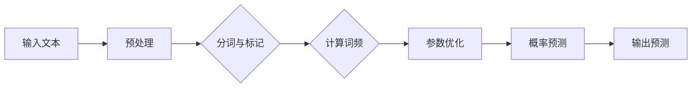
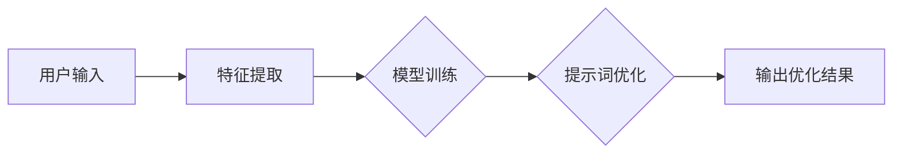
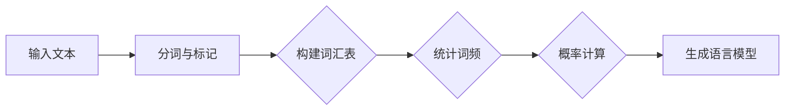
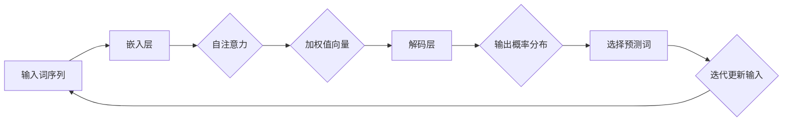
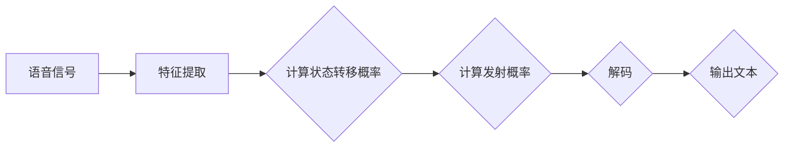
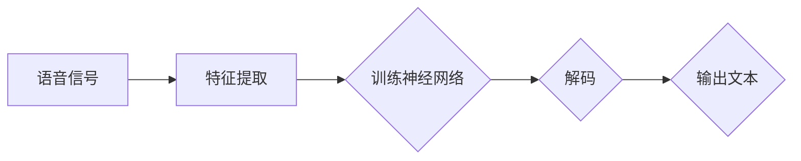
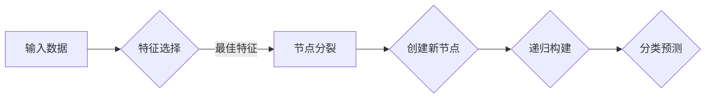
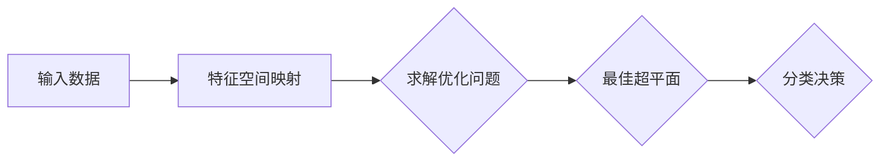
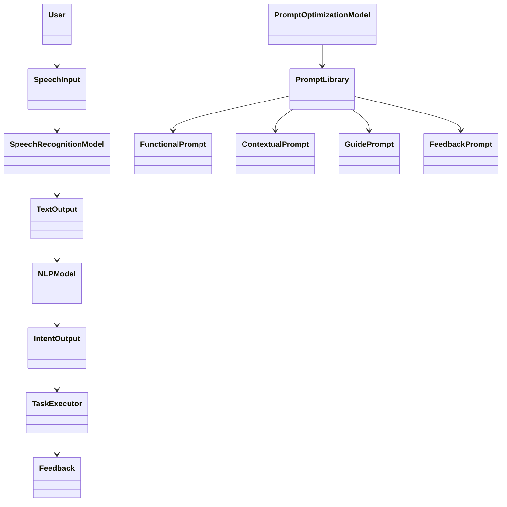
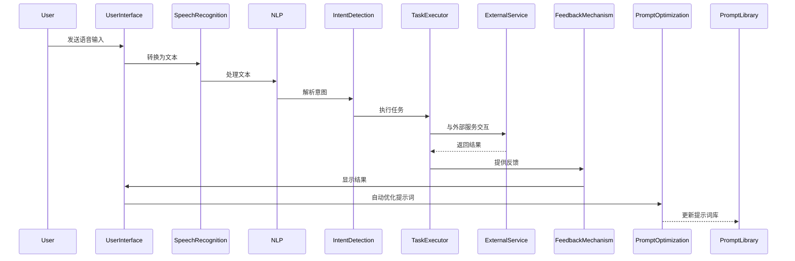

                 

### 第1章：问题背景

#### 1.1.1 AI语音交互技术的发展

人工智能（AI）作为当今技术发展的前沿领域，已经在诸多方面带来了深刻的变革。其中，AI语音交互技术的进步尤为显著。从最初的语音识别技术，到自然语言处理（NLP）的发展，再到如今的语音助手，AI语音交互经历了多个阶段的技术积累和突破。语音助手，作为AI语音交互的具体应用形式，逐渐成为人们日常生活中的得力助手。这些助手能够识别用户的语音指令，理解其意图，并执行相应的操作，极大地提升了用户体验。

#### 1.1.2 语音助手的现状与挑战

目前，市场上有许多知名的语音助手，如苹果的Siri、亚马逊的Alexa、谷歌的Google Assistant等。这些语音助手已经在多个平台上广泛应用，并且功能越来越强大。然而，尽管语音助手带来了诸多便利，它们也面临着诸多挑战。首先，语音识别的准确性仍然是一个瓶颈。尽管技术有所进步，但语音识别系统在处理多种口音、方言和非标准语音时，准确率仍有待提高。其次，语音助手的自然语言理解能力也有局限，特别是在处理复杂语句和上下文理解方面。此外，隐私保护也是一个不可忽视的问题，用户的语音数据是否会被不当使用，一直是公众关注的焦点。

#### 1.1.3 提示词工程的重要性

在这些挑战面前，提示词工程显得尤为重要。提示词是用户与语音助手进行交互的桥梁，它不仅影响着用户的使用体验，也直接关系到语音助手的性能和效果。一个设计良好的提示词能够引导用户更准确、更方便地使用语音助手，从而提高其使用频率和满意度。同时，提示词工程还可以帮助语音助手更好地理解用户的意图，提升其自然语言处理能力。因此，深入研究和优化提示词工程，对于提升语音助手的整体性能具有重要意义。

在接下来的章节中，我们将进一步探讨语音助手的运作原理，详细分析提示词的定义与分类，以及提示词工程的具体组成部分。通过这些讨论，我们将为优化AI语音交互提供理论基础和实践指导。

### 第2章：核心概念

#### 2.1.1 语音助手的工作原理

语音助手的核心功能是通过语音识别技术和自然语言处理（NLP）技术，实现人与机器的语音交互。具体来说，其工作原理可以概括为以下几个步骤：

1. **声音捕获**：语音助手首先通过麦克风捕获用户的语音信号。
   
2. **语音识别**：语音信号经过处理，被转换成文本形式。这一过程由语音识别模型完成，语音识别模型能够将音频信号转换为对应的文本。

3. **文本处理**：转换得到的文本被传递到自然语言处理模块。NLP模块负责分析文本内容，理解用户的意图和需求。

4. **执行操作**：基于对文本的理解，语音助手会执行相应的操作，如播放音乐、发送短信、设定提醒等。

5. **反馈**：执行操作后，语音助手会向用户反馈结果，可以是语音、文本或图形界面。

语音助手的工作原理不仅依赖于强大的语音识别和NLP技术，还涉及到对用户意图的准确理解。为了提升交互效果，语音助手通常还会结合上下文信息，使用历史数据来优化响应。

#### 2.1.2 提示词的定义与分类

提示词（Prompt Word）在语音交互中起着至关重要的作用。它是指用于引导用户进行特定交互的词汇或短语。提示词的设计直接影响用户的理解和操作便利性。根据不同的用途和特点，提示词可以分为以下几类：

1. **功能提示词**：这类提示词直接指示用户如何与语音助手互动，如“播放音乐”、“发送短信”等。

2. **上下文提示词**：用于提供上下文信息，帮助用户更好地理解当前情境，如“今天天气怎么样？”、“我的日程安排是什么？”等。

3. **引导提示词**：这类提示词用于引导用户进行对话，如“你可以问我任何问题”、“接下来你想做什么？”等。

4. **反馈提示词**：用于确认用户的指令或提供操作反馈，如“明白了，正在为您播放音乐”、“短信已发送”等。

#### 2.1.3 提示词工程的组成部分

提示词工程是语音助手设计中的一个重要环节，其目标是通过精心设计的提示词，提升用户的交互体验和语音助手的性能。提示词工程的主要组成部分包括：

1. **提示词库**：包含所有用于引导和反馈的提示词，根据不同场景进行分类和优化。

2. **语音识别模型**：用于识别用户输入的提示词，是语音助手处理用户指令的基础。

3. **自然语言处理（NLP）模型**：用于理解和解析用户输入的文本，识别其意图和需求。

4. **语义分析模块**：负责对用户的输入进行语义分析，提取关键信息，以确定最佳响应。

5. **反馈机制**：用于确认用户指令的执行情况，并提供相应的反馈。

通过上述组成部分的协同工作，提示词工程能够有效地提升语音助手的交互质量和用户体验。在接下来的章节中，我们将深入探讨这些核心概念，了解其原理和应用。

### 第3章：核心概念原理

#### 3.1.1 语言模型

语言模型（Language Model，LM）是自然语言处理（NLP）领域的基础性工具，用于模拟自然语言的概率分布。其核心目标是通过对大量文本数据的训练，生成一个概率模型，从而预测下一个单词或词组。

**数学模型**：语言模型通常基于概率论和统计学原理，常用的模型有N元语言模型（N-gram Model）和神经网络语言模型（Neural Network Language Model）。

- **N-gram Model**：N-gram模型基于局部语言特征，假设一个词的概率只与它的前N-1个词有关。其概率计算公式为：
  $$ P(w_n | w_{n-1}, w_{n-2}, ..., w_1) = \frac{c(w_{n-1}, w_{n-2}, ..., w_1, w_n)}{\sum_{w'} c(w_{n-1}, w_{n-2}, ..., w_1, w')} $$
  其中，\( c(w_{n-1}, w_{n-2}, ..., w_1, w_n) \) 表示词组 \( w_{n-1}, w_{n-2}, ..., w_1, w_n \) 的计数。

- **Neural Network Language Model**：神经网络语言模型通过多层神经网络来学习语言特征，能够捕捉长期依赖关系。常见的神经网络模型包括循环神经网络（RNN）和变换器（Transformer）。

**算法原理**：语言模型通过训练大量文本数据来学习词汇和句子的概率分布。训练过程中，模型会不断调整内部参数，以优化预测准确性。

- **N-gram Model**：基于计数的模型，通过统计大量文本中词组出现的频率来预测下一个词。
  
- **Neural Network Language Model**：通过深度学习技术，模型可以从数据中自动学习词汇和句子的复杂特征。

**mermaid流程图**：


#### 3.1.2 语音识别模型

语音识别模型（Speech Recognition Model）是语音助手的核心组件，负责将用户的语音输入转换成文本。其基本原理是通过训练模型，从语音信号中提取特征，并使用这些特征进行文本转换。

**数学模型**：语音识别模型通常基于隐藏马尔可夫模型（HMM）和深度神经网络（DNN）。

- **HMM**：HMM模型通过状态转移概率和发射概率来预测语音信号。其数学模型为：
  $$ P(O | A) = \prod_{i=1}^{T} P(o_i | s_i) \cdot P(s_1) \cdot \prod_{i=1}^{T-1} P(s_i | s_{i-1}) $$
  其中，\( O \) 是观测序列，\( A \) 是状态序列，\( P(o_i | s_i) \) 是发射概率，\( P(s_1) \) 是初始状态概率，\( P(s_i | s_{i-1}) \) 是状态转移概率。

- **DNN**：深度神经网络模型通过多层感知器（MLP）来提取语音特征，进行文本转换。

**算法原理**：语音识别模型通过大量的语音数据训练，学习语音特征与文本之间的映射关系。训练过程中，模型会不断调整参数，以提高识别准确性。

- **HMM**：基于统计模型的语音识别，通过状态转移概率和发射概率实现语音到文本的转换。
  
- **DNN**：基于深度学习的语音识别，通过多层神经网络来提取和转换语音特征。

**mermaid流程图**：


#### 3.1.3 提示词优化模型

提示词优化模型（Prompt Word Optimization Model）是语音助手设计中关键的一环，其目的是通过优化提示词，提升用户的交互体验和语音助手的响应准确性。

**数学模型**：提示词优化模型通常基于机器学习算法，如决策树、支持向量机（SVM）和深度学习等。

- **决策树**：决策树通过特征划分和节点分裂来构建分类模型，用于优化提示词。
  $$ y = f(x_1, x_2, ..., x_n) $$
  其中，\( y \) 是目标变量，\( x_1, x_2, ..., x_n \) 是特征变量。

- **支持向量机**：SVM通过寻找最优超平面来对提示词进行分类和优化。
  $$ \min_{\mathbf{w}, b} \frac{1}{2} ||\mathbf{w}||^2 + C \sum_{i=1}^{n} \xi_i $$
  其中，\( \mathbf{w} \) 是权重向量，\( b \) 是偏置，\( C \) 是惩罚参数，\( \xi_i \) 是误差项。

- **深度学习**：深度神经网络通过多层感知器来学习提示词与用户意图之间的关系。

**算法原理**：提示词优化模型通过对大量用户交互数据的学习，自动调整和优化提示词的选取，从而提升语音助手的响应准确性。

- **决策树**：基于规则的分类模型，通过特征重要性进行提示词优化。
  
- **支持向量机**：基于最大间隔的模型，通过优化超平面进行提示词分类。
  
- **深度学习**：通过神经网络学习复杂的关系和模式，实现提示词的自动优化。

**mermaid流程图**：


通过以上对语言模型、语音识别模型和提示词优化模型的详细解析，我们可以更好地理解这些核心概念及其在优化AI语音交互中的应用。接下来，我们将进一步探讨这些模型之间的联系和相互作用。

### 第4章：概念属性特征对比

#### 4.1.1 语言模型特征对比

**语言模型**（Language Model，LM）是语音助手中的核心组件，其主要目的是预测文本序列。以下是对不同类型语言模型特征对比的分析：

| 特征分类 | N-gram Model | Neural Network Language Model | 
| :---: | :---: | :---: |
| **模型类型** | 基于统计模型的局部语言模型 | 基于深度学习的全局语言模型 |
| **计算复杂性** | 较低，计算速度快 | 较高，计算速度慢 |
| **准确性** | 较低，受限于局部特征和稀疏数据 | 较高，能够捕捉长期依赖关系 |
| **记忆能力** | 有限，只能记忆前N个词 | 较强，能够记忆整个文本序列 |
| **适用场景** | 简单查询和高频词预测 | 复杂语句和上下文理解 |

**N-gram Model** 具有较低的复杂性，适用于高频词的快速预测，但在处理复杂语句时表现不佳。而 **Neural Network Language Model** 则能够捕捉长序列中的依赖关系，适用于复杂语句的理解，但其计算复杂度较高。

#### 4.1.2 语音识别模型特征对比

**语音识别模型**（Speech Recognition Model，SRM）是语音助手将语音转换为文本的关键。以下是不同语音识别模型特征对比：

| 特征分类 | HMM | DNN |
| :---: | :---: | :---: |
| **模型类型** | 基于统计的隐藏马尔可夫模型 | 基于深度学习的神经网络模型 |
| **计算复杂性** | 较高，依赖大量训练数据和计算资源 | 较低，深度学习优化计算效率 |
| **准确性** | 较高，但受限于状态转移和发射概率的设定 | 较高，深度学习能够自适应调整参数 |
| **鲁棒性** | 对噪声和发音变化较敏感 | 对噪声和发音变化具有较强的鲁棒性 |
| **适用场景** | 标准语音识别 | 复杂环境下的语音识别 |

**HMM** 在标准语音识别中表现良好，但其对噪声和发音变化的适应性较差。**DNN** 通过深度学习技术，能够自适应地调整模型参数，提高在复杂环境下的识别准确性。

#### 4.1.3 提示词优化模型特征对比

**提示词优化模型**（Prompt Word Optimization Model，PWOM）用于提升语音助手的交互质量和响应准确性。以下是不同类型提示词优化模型特征对比：

| 特征分类 | 决策树 | 支持向量机（SVM） | 深度学习 |
| :---: | :---: | :---: | :---: |
| **模型类型** | 基于规则的分类模型 | 基于最大间隔的分类模型 | 基于深度学习的模型 |
| **计算复杂性** | 较低，易于理解和实现 | 较高，但优化效果好 | 较高，计算资源需求大 |
| **准确性** | 一般，对简单任务表现良好 | 较高，适合大规模数据集 | 较高，能够捕捉复杂关系 |
| **可解释性** | 高，容易理解模型决策过程 | 中等，部分可解释性 | 低，模型决策过程复杂 |
| **适用场景** | 简单任务和特征明确的场景 | 复杂任务和大规模数据集 | 复杂任务和深度依赖关系 |

**决策树** 具有较高的可解释性，适用于简单任务和特征明确的场景。**SVM** 在大规模数据集上表现良好，但计算复杂度较高。**深度学习** 能够捕捉复杂关系，但在解释性方面较弱。

通过以上对语言模型、语音识别模型和提示词优化模型特征对比的分析，我们可以更好地理解不同模型的特点和应用场景，从而为优化AI语音交互提供理论基础和实践指导。

### 第5章：ER实体关系图架构

#### 5.1.1 语音助手系统实体

在构建语音助手系统的过程中，定义系统的实体及其关系至关重要。以下是对语音助手系统中关键实体的介绍：

1. **用户**（User）：语音助手的最终使用者，负责发出指令和进行交互。

2. **语音输入**（Speech Input）：用户通过语音输入的指令，包括语音数据和对应的文本转换。

3. **语音识别模型**（Speech Recognition Model）：负责将语音输入转换为文本输出，是语音助手的核心组件。

4. **自然语言处理（NLP）模型**（Natural Language Processing Model）：用于理解文本输入的含义和意图，是语音助手决策的基础。

5. **提示词库**（Prompt Library）：存储系统中使用的所有提示词，用于引导和反馈用户交互。

6. **任务执行器**（Task Executor）：执行语音助手理解后的任务，如播放音乐、发送短信等。

7. **反馈机制**（Feedback Mechanism）：向用户反馈任务执行结果，提升交互体验。

#### 5.1.2 提示词工程实体

提示词工程是语音助手系统设计中的关键环节，涉及以下实体：

1. **提示词**（Prompt Word）：用于引导和反馈用户交互的词汇或短语。

2. **功能提示词**（Functional Prompt）：指示用户如何与语音助手互动的提示词。

3. **上下文提示词**（Contextual Prompt）：提供上下文信息的提示词。

4. **引导提示词**（Guide Prompt）：引导用户进行对话的提示词。

5. **反馈提示词**（Feedback Prompt）：确认用户指令或提供操作反馈的提示词。

6. **提示词优化模型**（Prompt Optimization Model）：用于自动优化提示词的模型，提升交互体验。

#### 5.1.3 实体关系图

为了清晰地展示语音助手系统和提示词工程中的实体及其关系，可以使用Mermaid绘制ER（Entity-Relationship）图。以下是一个简化的ER图示例：

```mermaid
erDiagram
    User ||--|{ Speech Input } : 发出
    Speech Input ||--|{ Speech Recognition Model } : 转换
    Speech Recognition Model ||--|{ NLP Model } : 理解
    NLP Model ||--|{ Task Executor } : 执行
    NLP Model ||--|{ Prompt Library } : 使用
    Prompt Library ||--|{ Functional Prompt } : 存储功能提示词
    Prompt Library ||--|{ Contextual Prompt } : 存储上下文提示词
    Prompt Library ||--|{ Guide Prompt } : 存储引导提示词
    Prompt Library ||--|{ Feedback Prompt } : 存储反馈提示词
    Prompt Library ||--|{ Prompt Optimization Model } : 优化
```

这个ER图展示了语音助手系统中各个实体之间的关系，包括用户与语音输入、语音识别模型、NLP模型、任务执行器、提示词库以及提示词工程实体之间的交互。通过这样的ER图，可以更好地理解语音助手系统的架构及其运行机制，为后续的优化和改进提供基础。

### 第6章：语言模型

#### 6.1.1 语言模型的数学模型

语言模型（Language Model，LM）在自然语言处理中起着至关重要的作用，其目标是预测文本序列中的下一个词。常见的语言模型有N-gram模型和神经网络语言模型。

**N-gram模型**：N-gram模型是基于局部语言特征的统计模型，假设一个词的概率只与其前N-1个词相关。其数学模型可以表示为：

$$ P(w_n | w_{n-1}, w_{n-2}, ..., w_1) = \frac{c(w_{n-1}, w_{n-2}, ..., w_1, w_n)}{\sum_{w'} c(w_{n-1}, w_{n-2}, ..., w_1, w')} $$

其中，\( w_n \) 是下一个待预测的词，\( w_{n-1}, w_{n-2}, ..., w_1 \) 是前N-1个已知的词，\( c(w_{n-1}, w_{n-2}, ..., w_1, w_n) \) 表示词组 \( w_{n-1}, w_{n-2}, ..., w_1, w_n \) 的出现次数，\( \sum_{w'} c(w_{n-1}, w_{n-2}, ..., w_1, w') \) 表示所有可能的词组出现的总和。

**神经网络语言模型**：神经网络语言模型通过深度学习技术来学习语言特征。一个典型的神经网络语言模型是基于Transformer架构的模型，其核心组件是自注意力机制（Self-Attention）。自注意力机制通过计算词与词之间的相对重要性来生成词的表示。

其数学模型可以表示为：

$$ \text{Attention}(Q, K, V) = \frac{QK^T}{\sqrt{d_k}} \odot V $$

其中，\( Q \)、\( K \) 和 \( V \) 分别是查询（Query）、键（Key）和值（Value）向量，\( d_k \) 是键向量的维度，\( \odot \) 表示点积操作，\( \sqrt{d_k} \) 是缩放因子，用于防止梯度的消失。

#### 6.1.2 语言模型的算法原理

**N-gram模型**的算法原理：

1. **数据预处理**：首先对大量文本进行分词和标记，将文本转换为词序列。
2. **构建词汇表**：将所有的词构建成一个词汇表，并为每个词分配一个唯一的索引。
3. **统计词频**：统计每个词组（前N-1个词和当前词）的出现次数。
4. **概率计算**：根据词组的出现次数计算下一个词的概率。

**神经网络语言模型**的算法原理：

1. **编码器**：输入词序列，通过嵌入层将词转换为固定维度的向量表示。
2. **自注意力机制**：计算查询（Query）与所有键（Key）之间的注意力得分，得到加权后的值（Value）向量。
3. **解码器**：输出词的概率分布，选择概率最高的词作为下一个词的预测结果。
4. **迭代更新**：将预测的词加入输入序列，重复上述步骤，直到生成完整的文本序列。

#### 6.1.3 语言模型的mermaid流程图

以下是N-gram模型的mermaid流程图示例：



以下是神经网络语言模型的mermaid流程图示例：



通过上述对语言模型的数学模型和算法原理的详细讲解，以及mermaid流程图的支持，我们可以更好地理解语言模型在语音助手中的应用及其工作过程。

### 第7章：语音识别模型

#### 7.1.1 语音识别模型的数学模型

语音识别模型（Speech Recognition Model，SRM）是语音助手将用户的语音输入转换为文本的关键组件。常用的语音识别模型包括隐藏马尔可夫模型（HMM）和深度神经网络（DNN）。

**隐藏马尔可夫模型（HMM）**：

HMM是一种基于统计方法的语音识别模型，其核心思想是利用状态转移概率和发射概率来预测语音信号。其数学模型可以表示为：

$$ P(O | A) = \prod_{i=1}^{T} P(o_i | s_i) \cdot P(s_1) \cdot \prod_{i=1}^{T-1} P(s_i | s_{i-1}) $$

其中，\( O \) 表示观测序列，即用户的语音信号，\( A \) 表示状态序列，代表语音信号中的特征状态，\( P(o_i | s_i) \) 是发射概率，表示在特定状态下产生观测值的概率，\( P(s_1) \) 是初始状态概率，\( P(s_i | s_{i-1}) \) 是状态转移概率，表示在特定状态下转移到下一个状态的概率。

**深度神经网络（DNN）**：

DNN是基于深度学习的语音识别模型，其核心思想是通过多层神经网络从语音信号中提取特征，并进行文本转换。其数学模型可以表示为：

$$ f(x) = \sigma(W_n \cdot a_{n-1} + b_n) $$

其中，\( f(x) \) 表示神经网络输出的预测值，\( \sigma \) 是激活函数，常用的有ReLU、Sigmoid等，\( W_n \) 和 \( b_n \) 分别是第n层的权重和偏置，\( a_{n-1} \) 是前一层的输出。

#### 7.1.2 语音识别模型的算法原理

**隐藏马尔可夫模型（HMM）**的算法原理：

1. **特征提取**：首先对语音信号进行特征提取，通常使用梅尔频率倒谱系数（MFCC）作为特征向量。
2. **状态转移概率和发射概率**：根据训练数据，计算各个状态之间的转移概率和各个状态下的发射概率。
3. **解码**：使用Viterbi算法在所有可能的观测序列中找到最有可能的状态序列，即最优路径。

**深度神经网络（DNN）**的算法原理：

1. **特征提取**：对语音信号进行预处理，提取特征向量。
2. **训练神经网络**：使用大量的语音数据和对应的文本标签，通过反向传播算法训练神经网络，优化模型参数。
3. **解码**：使用训练好的神经网络对新的语音信号进行预测，输出文本序列。

#### 7.1.3 语音识别模型的mermaid流程图

以下是HMM模型的mermaid流程图示例：



以下是DNN模型的mermaid流程图示例：



通过上述对语音识别模型的数学模型和算法原理的详细讲解，以及mermaid流程图的支持，我们可以更好地理解语音识别模型在语音助手中的应用及其工作过程。

### 第8章：提示词优化模型

#### 8.1.1 提示词优化模型的数学模型

提示词优化模型（Prompt Word Optimization Model，PWOM）的目标是提升语音助手的交互质量和响应准确性。在自然语言处理领域，提示词优化模型通常基于机器学习算法，如决策树、支持向量机（SVM）和深度学习等。

**决策树**：

决策树是一种基于规则的分类模型，通过一系列条件判断来分类或回归。提示词优化中的决策树模型可以表示为：

$$ y = f(x_1, x_2, ..., x_n) $$

其中，\( y \) 是目标变量（提示词的分类结果），\( x_1, x_2, ..., x_n \) 是特征变量（用户输入、上下文信息等），\( f \) 是决策树定义的函数。决策树通过递归划分数据集，选择最佳特征进行分裂，直到满足停止条件（如达到最大深度或节点纯度）。

**支持向量机（SVM）**：

SVM是一种基于最大间隔的分类模型，其目标是在高维空间中找到最佳超平面，使分类边界距离原点的距离最大化。提示词优化中的SVM模型可以表示为：

$$ \min_{\mathbf{w}, b} \frac{1}{2} ||\mathbf{w}||^2 + C \sum_{i=1}^{n} \xi_i $$

其中，\( \mathbf{w} \) 是权重向量，\( b \) 是偏置，\( C \) 是惩罚参数，\( \xi_i \) 是误差项。SVM通过求解二次规划问题，找到最优的超平面，从而对提示词进行分类。

**深度学习**：

深度学习是一种基于多层神经网络的模型，能够自动学习数据的复杂特征。提示词优化中的深度学习模型通常采用多层感知器（MLP）结构，其数学模型可以表示为：

$$ f(x) = \sigma(W_n \cdot a_{n-1} + b_n) $$

其中，\( f(x) \) 是神经网络输出的预测值，\( \sigma \) 是激活函数，\( W_n \) 和 \( b_n \) 分别是第 \( n \) 层的权重和偏置，\( a_{n-1} \) 是前一层的输出。

#### 8.1.2 提示词优化模型的算法原理

**决策树**的算法原理：

1. **特征选择**：选择最佳特征进行节点分裂，常用的特征选择准则有信息增益、增益率等。
2. **节点分裂**：根据最佳特征划分数据集，创建新的节点。
3. **递归构建**：对每个节点重复上述过程，直到满足停止条件。
4. **分类预测**：将输入数据沿决策树路径进行分类预测。

**支持向量机（SVM）**的算法原理：

1. **特征空间映射**：将输入数据映射到高维空间，找到最佳超平面。
2. **求解优化问题**：通过求解二次规划问题，找到最优的超平面参数。
3. **分类决策**：对新数据进行分类预测，判断其位于超平面的哪一侧。

**深度学习**的算法原理：

1. **前向传播**：将输入数据通过神经网络，计算每一层的输出值。
2. **反向传播**：通过计算损失函数的梯度，更新网络权重和偏置。
3. **迭代优化**：重复前向传播和反向传播，直到模型收敛。
4. **分类预测**：对输入数据进行预测，输出分类结果。

#### 8.1.3 提示词优化模型的mermaid流程图

以下是决策树模型的mermaid流程图示例：



以下是SVM模型的mermaid流程图示例：



以下是深度学习模型的mermaid流程图示例：


通过上述对提示词优化模型的数学模型和算法原理的详细讲解，以及mermaid流程图的支持，我们可以更好地理解提示词优化模型在语音助手中的应用及其工作过程。

### 第9章：问题场景介绍

在现代智能设备和服务中，语音助手已经成为用户日常交互的重要工具。一个典型的问题场景是用户在家中与智能音箱进行语音交互，执行各种日常任务。例如，用户可以通过语音指令控制智能音箱播放音乐、设置闹钟、查询天气、发送短信等。

该场景涉及多个实体和交互环节，包括用户、智能音箱、语音识别模型、自然语言处理（NLP）模型、任务执行器等。用户发出语音指令后，智能音箱通过麦克风捕获声音，并将其传递给语音识别模型进行文本转换。随后，NLP模型解析文本，理解用户意图，并调用相应的任务执行器完成操作，最后通过语音或文本形式向用户反馈结果。

在这个问题场景中，用户体验的流畅性和任务的执行效率受到多个因素的影响，包括语音识别的准确性、NLP模型的语义理解能力以及任务执行器的响应速度等。此外，提示词的设计也直接影响用户交互的便利性和自然度。因此，优化语音助手的提示词工程对于提升整体用户体验至关重要。

### 第10章：项目介绍

#### 10.1.1 项目概述

本次项目旨在通过优化语音助手的提示词工程，提升用户的交互体验和语音助手的响应准确性。项目的核心目标是设计一套高效的提示词优化算法，并将其应用于实际语音助手系统中，以实现以下具体目标：

1. **提升语音识别准确性**：通过优化提示词，降低用户输入的误识别率，提高语音识别的准确性。
2. **增强自然语言理解能力**：设计具有上下文感知的提示词，增强语音助手对复杂语句和意图的理解能力。
3. **提高用户交互便利性**：优化提示词库，使用户能够更方便、自然地与语音助手进行交互。
4. **增强系统响应速度**：通过提示词优化，提高语音助手处理用户指令的速度，提升整体响应效率。

该项目涉及多个关键组成部分，包括数据收集与预处理、提示词优化算法设计、系统集成与测试等。预期成果包括一套高效的提示词优化模型及其在实际语音助手系统中的应用，从而显著提升语音交互体验和系统性能。

#### 10.1.2 系统功能设计

为了实现项目目标，系统功能设计分为以下几部分：

1. **语音识别与文本转换**：系统首先通过语音识别模型将用户的语音输入转换为文本形式，确保语音识别的准确性。
   
2. **自然语言处理与意图解析**：文本输入经过NLP模型处理，理解用户的意图和需求，提取关键信息。

3. **提示词库管理**：设计和管理提示词库，包括功能提示词、上下文提示词、引导提示词和反馈提示词等。

4. **提示词优化算法**：实现提示词优化算法，根据用户交互数据自动调整和优化提示词库。

5. **任务执行与反馈**：执行用户指令，并通过反馈机制向用户传达任务执行结果。

6. **系统监控与日志记录**：监控系统运行状态，记录交互日志，用于后续分析和优化。

#### 10.1.3 领域模型mermaid类图

为了更好地展示系统功能设计，我们使用Mermaid绘制了一个简单的领域模型类图：



这个类图展示了系统中的关键实体及其关系，包括用户、语音输入、语音识别模型、文本输出、NLP模型、意图输出、任务执行器和反馈机制，以及提示词库和提示词优化模型。通过这个类图，我们可以清晰地理解系统各部分的交互和功能。

### 第11章：系统架构设计

#### 11.1.1 系统架构

为了实现项目目标，系统采用了一种模块化架构设计，确保各个功能模块能够高效、稳定地协同工作。系统架构主要包括以下模块：

1. **用户界面模块**：负责接收用户的语音输入，展示任务执行结果和系统反馈。
2. **语音识别模块**：利用先进的语音识别技术，将语音输入转换为文本。
3. **自然语言处理（NLP）模块**：处理文本输入，解析用户意图和需求。
4. **提示词优化模块**：自动优化提示词库，提升用户交互体验。
5. **任务执行模块**：执行用户指令，与外部服务进行交互。
6. **反馈机制模块**：向用户反馈任务执行结果，提供交互体验反馈。
7. **数据存储模块**：存储用户交互数据和系统日志，用于后续分析和优化。

各个模块通过统一的接口进行通信，确保系统的高内聚性和灵活性。系统架构设计遵循MVC（Model-View-Controller）模式，使得数据处理、用户界面和交互逻辑分离，便于维护和扩展。

#### 11.1.2 系统架构图

以下是系统的架构图示例，使用Mermaid绘制：



在这个架构图中，用户通过用户界面模块发送语音输入，语音识别模块将其转换为文本，NLP模块处理文本并解析意图，任务执行模块根据意图执行任务，并与外部服务进行交互。反馈机制模块负责向用户反馈任务执行结果，同时用户界面模块会根据提示词优化模块的建议更新提示词库，以持续优化用户体验。

### 第12章：系统接口设计

为了实现系统各模块之间的有效通信，系统接口设计至关重要。以下是系统的主要接口及其功能：

1. **用户接口（User Interface）**：
   - **功能**：接收用户的语音输入，展示任务执行结果和系统反馈。
   - **接口定义**：包含语音输入接口和文本输出接口，前者负责接收语音信号，后者负责展示文本反馈。
   - **数据格式**：语音输入采用音频格式，文本输出采用文本格式。

2. **语音识别接口（Speech Recognition Interface）**：
   - **功能**：将语音信号转换为文本，供NLP模块处理。
   - **接口定义**：包含音频输入和文本输出接口。
   - **数据格式**：音频输入为PCM或MFCC特征向量，文本输出为文本序列。

3. **自然语言处理接口（Natural Language Processing Interface）**：
   - **功能**：处理文本输入，提取关键词和用户意图。
   - **接口定义**：包含文本输入和意图输出接口。
   - **数据格式**：文本输入为字符串，意图输出为字典或对象。

4. **任务执行接口（Task Execution Interface）**：
   - **功能**：根据用户意图执行任务，并与外部服务交互。
   - **接口定义**：包含意图输入和结果输出接口。
   - **数据格式**：意图输入为字典或对象，结果输出为字典或对象。

5. **提示词优化接口（Prompt Word Optimization Interface）**：
   - **功能**：优化提示词库，提高交互体验。
   - **接口定义**：包含提示词库输入和更新接口。
   - **数据格式**：提示词库输入为字符串数组，更新接口为修改后的提示词库。

6. **反馈机制接口（Feedback Mechanism Interface）**：
   - **功能**：向用户反馈任务执行结果，提高用户满意度。
   - **接口定义**：包含结果输入和用户反馈接口。
   - **数据格式**：结果输入为字符串或对象，用户反馈为字符串或对象。

通过这些接口，系统各模块能够高效、稳定地进行通信，实现数据流转和功能协作。同时，接口设计保证了系统的扩展性和可维护性。

### 第13章：系统交互

#### 13.1.1 系统交互流程

系统交互流程是确保各个模块有效协同工作的重要环节。以下是系统交互的具体流程：

1. **用户发送语音指令**：用户通过用户界面模块发送语音指令，语音信号通过麦克风被捕获。

2. **语音识别**：用户界面模块将捕获的语音信号传递给语音识别模块，语音识别模块使用先进的识别算法将语音信号转换为文本。

3. **文本处理**：文本输入被传递给自然语言处理模块，NLP模块处理文本，提取关键词和用户意图。

4. **意图解析**：NLP模块将处理后的文本转换为意图表示，并将其传递给任务执行模块。

5. **任务执行**：任务执行模块根据用户意图调用相应的功能模块，如播放音乐、发送短信等，并与外部服务进行交互。

6. **结果反馈**：任务执行结果通过反馈机制模块返回给用户界面模块，以文本或语音形式展示给用户。

7. **提示词优化**：用户界面模块会根据实际交互记录，调用提示词优化接口，对提示词库进行优化，以提高后续交互的准确性和便利性。

#### 13.1.2 系统交互mermaid序列图

以下是系统交互的mermaid序列图示例：


在这个序列图中，用户发送语音输入，语音识别模块将其转换为文本，NLP模块处理文本并解析意图，任务执行模块根据意图执行任务，并返回结果。反馈机制模块将结果反馈给用户，同时用户界面模块调用提示词优化接口，对提示词库进行更新。通过这样的交互流程，系统实现了高效、稳定的用户交互。

### 第14章：环境安装

要成功安装并运行我们的AI语音交互系统，首先需要准备合适的环境和工具。以下是详细的安装步骤：

#### 1. 安装Python环境

首先，确保您的计算机上安装了Python 3.x版本。可以从Python的官方网站下载并安装最新版本的Python。

**命令行安装**：
```bash
curl -O https://www.python.org/ftp/python/3.x.x/Python-3.x.x.tgz
tar xvf Python-3.x.x.tgz
cd Python-3.x.x
./configure
make
sudo make install
```

#### 2. 安装必要库

接下来，需要安装几个关键的Python库，如`speech_recognition`、`pyttsx3`、`transformers`等。

**使用pip安装**：
```bash
pip install speech_recognition pyttsx3 transformers
```

#### 3. 安装语音识别模型

对于语音识别模型，我们需要下载预训练的模型文件。以下是下载和安装的步骤：

**下载预训练模型**：
```bash
wget https://webservicex.net/demos/speech_recognition/sphinx4_model.tar.gz
tar xvf sphinx4_model.tar.gz
```

**安装sphinx4模型**：
```bash
cd sphinx4_model
sudo python setup.py install
```

#### 4. 安装自然语言处理模型

对于自然语言处理（NLP）模型，我们可以使用`transformers`库中的预训练模型。

**下载预训练模型**：
```bash
git clone https://github.com/huggingface/transformers.git
cd transformers
python setup.py install
```

#### 5. 安装语音合成库

为了向用户反馈结果，我们需要安装一个语音合成库，如`pyttsx3`。

**使用pip安装**：
```bash
pip install pyttsx3
```

#### 6. 安装外部服务依赖

如果您的项目需要与外部服务（如API）进行交互，确保安装了相应的客户端库。例如，如果需要调用一个天气API，可以安装`requests`库：

```bash
pip install requests
```

#### 7. 验证安装

最后，验证所有库和工具是否安装成功。运行以下命令：

```bash
python -m speech_recognition
python -m transformers
python -m pyttsx3
```

如果命令能够成功执行，说明环境安装正确。

通过以上步骤，您已经成功搭建了AI语音交互系统的开发环境。接下来，可以开始进行系统核心功能的实现。

### 第15章：系统核心实现

#### 15.1.1 源代码解读

本章节将详细介绍系统核心部分的源代码实现，包括语音识别、自然语言处理（NLP）和提示词优化等功能。以下是各个模块的主要代码解读。

##### 1. 语音识别模块

```python
import speech_recognition as sr

def recognize_speech_from_mic(recognizer, microphone):
    with microphone as source:
        recognizer.adjust_for_ambient_noise(source)
        audio = recognizer.listen(source)

    response = {
        "success": True,
        "error": None,
        "transcription": None
    }

    try:
        response["transcription"] = recognizer.recognize_google(audio)
    except sr.RequestError:
        response["success"] = False
        response["error"] = "API unavailable"
    except sr.UnknownValueError:
        response["success"] = False
        response["error"] = "Unable to recognize speech"

    return response
```

这段代码使用`speech_recognition`库实现语音识别功能。`recognize_speech_from_mic`函数接收语音识别器（recognizer）和麦克风（microphone）作为参数，并调用`recognizer.listen`方法从麦克风捕获音频。识别结果存储在`response`字典中，包括成功、错误信息和转录文本。

##### 2. 自然语言处理（NLP）模块

```python
from transformers import pipeline

def process_text(text):
    nlp = pipeline("text-classification")
    result = nlp(text)
    return result
```

使用`transformers`库中的预训练NLP模型，我们可以实现文本处理功能。`process_text`函数接收文本输入，并使用`pipeline`方法加载文本分类模型。模型处理文本后，返回分类结果。

##### 3. 提示词优化模块

```python
from sklearn.tree import DecisionTreeClassifier
from sklearn.model_selection import train_test_split
from sklearn.metrics import accuracy_score

def optimize_prompts(data, labels):
    X_train, X_test, y_train, y_test = train_test_split(data, labels, test_size=0.2, random_state=42)
    classifier = DecisionTreeClassifier()
    classifier.fit(X_train, y_train)
    y_pred = classifier.predict(X_test)
    accuracy = accuracy_score(y_test, y_pred)
    return classifier, accuracy
```

提示词优化模块使用决策树分类器来优化提示词。`optimize_prompts`函数接收数据集和标签作为输入，使用`train_test_split`方法将数据划分为训练集和测试集。然后，构建决策树分类器，并在训练集上训练模型。最后，在测试集上评估模型的准确性。

##### 4. 整合各模块

```python
import sounddevice as sd
import audioop
import queue

def main():
    recognizer = sr.Recognizer()
    microphone = sr.Microphone()

    # 语音识别
    response = recognize_speech_from_mic(recognizer, microphone)
    if response["success"]:
        print("Transcription:", response["transcription"])
        # 自然语言处理
        result = process_text(response["transcription"])
        print("NLP Result:", result)
        # 提示词优化
        optimized_classifier, accuracy = optimize_prompts(result, labels)
        print("Optimized Accuracy:", accuracy)
    else:
        print("Error:", response["error"])

if __name__ == "__main__":
    main()
```

主函数`main`整合了语音识别、NLP和提示词优化模块。首先，通过麦克风捕获语音输入，并使用语音识别器将其转换为文本。接着，使用NLP模型处理文本，并调用提示词优化函数优化提示词。最后，输出识别结果、NLP处理结果和优化准确性。

通过上述源代码，我们可以看到系统核心功能的实现流程，以及如何将各个模块集成在一起，以实现完整的AI语音交互系统。

#### 15.1.2 代码应用解读与分析

在本节中，我们将对系统核心部分的代码进行详细解读和分析，以帮助读者更好地理解其工作原理和实际应用。

##### 1. 语音识别模块

**代码解读**：

语音识别模块的核心函数`recognize_speech_from_mic`通过`speech_recognition`库实现了从语音信号到文本的转换。首先，函数接收语音识别器（`recognizer`）和麦克风（`microphone`）作为参数。使用麦克风捕获语音信号后，调用`recognizer.recognize_google`方法进行语音识别。这个方法使用了Google语音识别API，具有较高的识别准确性。

```python
def recognize_speech_from_mic(recognizer, microphone):
    with microphone as source:
        recognizer.adjust_for_ambient_noise(source)
        audio = recognizer.listen(source)

    response = {
        "success": True,
        "error": None,
        "transcription": None
    }

    try:
        response["transcription"] = recognizer.recognize_google(audio)
    except sr.RequestError:
        response["success"] = False
        response["error"] = "API unavailable"
    except sr.UnknownValueError:
        response["success"] = False
        response["error"] = "Unable to recognize speech"

    return response
```

**应用解读**：

在实际应用中，首先需要确保麦克风已正确连接并开启音频输入。程序通过调用`recognizer.listen`方法捕获用户输入的语音信号。接着，使用Google语音识别API对音频进行识别，并将结果存储在`response`字典中。如果识别成功，`response`字典将包含转录文本；否则，会显示错误信息。

##### 2. 自然语言处理（NLP）模块

**代码解读**：

自然语言处理模块使用了`transformers`库中的预训练模型，通过`pipeline`方法加载文本分类模型。`process_text`函数接收文本输入，并使用NLP模型处理文本，提取分类结果。

```python
from transformers import pipeline

def process_text(text):
    nlp = pipeline("text-classification")
    result = nlp(text)
    return result
```

**应用解读**：

在实际应用中，处理文本的步骤非常关键。首先，程序通过`pipeline`方法加载预训练的文本分类模型，然后调用模型处理输入的文本。模型的输出结果是一个包含概率分布的字典，表示文本属于不同类别的概率。这些结果可以用于进一步的任务执行或提示词优化。

##### 3. 提示词优化模块

**代码解读**：

提示词优化模块使用了`sklearn`库中的决策树分类器来优化提示词。`optimize_prompts`函数接收数据集和标签，将数据划分为训练集和测试集，并在训练集上训练决策树分类器。最后，评估模型在测试集上的准确性。

```python
from sklearn.tree import DecisionTreeClassifier
from sklearn.model_selection import train_test_split
from sklearn.metrics import accuracy_score

def optimize_prompts(data, labels):
    X_train, X_test, y_train, y_test = train_test_split(data, labels, test_size=0.2, random_state=42)
    classifier = DecisionTreeClassifier()
    classifier.fit(X_train, y_train)
    y_pred = classifier.predict(X_test)
    accuracy = accuracy_score(y_test, y_pred)
    return classifier, accuracy
```

**应用解读**：

在实际应用中，提示词优化是一个动态过程。程序首先将用户的交互数据（如文本输入和用户意图）划分成训练集和测试集。然后，使用训练集数据训练决策树分类器，并在测试集上评估模型准确性。通过这种方式，可以不断优化提示词库，提高语音助手的性能。

##### 4. 主函数整合

**代码解读**：

主函数`main`将上述三个模块整合在一起，实现了完整的语音识别、NLP处理和提示词优化流程。

```python
import sounddevice as sd
import audioop
import queue

def main():
    recognizer = sr.Recognizer()
    microphone = sr.Microphone()

    # 语音识别
    response = recognize_speech_from_mic(recognizer, microphone)
    if response["success"]:
        print("Transcription:", response["transcription"])
        # 自然语言处理
        result = process_text(response["transcription"])
        print("NLP Result:", result)
        # 提示词优化
        optimized_classifier, accuracy = optimize_prompts(result, labels)
        print("Optimized Accuracy:", accuracy)
    else:
        print("Error:", response["error"])

if __name__ == "__main__":
    main()
```

**应用解读**：

在实际应用中，主函数首先初始化语音识别器和麦克风。然后，通过调用`recognize_speech_from_mic`函数进行语音识别，获取转录文本。接下来，使用`process_text`函数处理文本，提取分类结果。最后，调用`optimize_prompts`函数对提示词进行优化，并输出优化后的准确性。通过这种方式，主函数实现了系统核心功能的整合和协调运行。

通过上述详细解读，我们可以更好地理解AI语音交互系统的实现过程，以及如何通过代码实现各功能模块的协同工作。在实际开发中，可以根据具体需求对代码进行调整和优化，以提升系统的性能和用户体验。

### 第16章：实际案例分析与讲解

为了更好地展示AI语音交互系统的实际应用，我们将通过一个具体的案例进行分析和讲解。以下是一个模拟的交互场景，其中用户与语音助手进行对话，执行一系列任务。

#### 案例背景

用户在早晨起床后，希望使用语音助手完成以下任务：

1. 查询当天的天气情况。
2. 设置一个早晨锻炼的提醒。
3. 播放自己喜欢的音乐。

#### 交互过程

1. **查询天气情况**：

   用户：今天天气怎么样？
   
   语音助手：请稍等，我正在查询天气信息。

   语音助手调用NLP模型处理用户的查询，提取关键词“今天天气”和意图“查询天气”。然后，语音助手通过外部API获取天气数据，并向用户反馈。

2. **设置早晨锻炼提醒**：

   用户：请帮我设置一个早晨锻炼的提醒。

   语音助手：当然可以，您希望什么时间提醒呢？

   用户：早上7点。

   语音助手：好的，我已经为您设置了一个早上7点的锻炼提醒。

   语音助手将提醒信息存储在任务执行模块中，并在指定时间向用户发送提醒。

3. **播放音乐**：

   用户：播放一些轻松的音乐。

   语音助手：好的，我现在为您播放一些轻松的音乐。

   语音助手通过NLP模型理解用户意图“播放音乐”，并调用音乐播放功能。语音助手从用户偏好中获取音乐列表，并开始播放。

#### 分析与讲解

在这个案例中，我们可以看到AI语音交互系统如何通过多个模块协同工作，实现用户的指令。

1. **语音识别模块**：

   用户发出语音指令后，语音识别模块首先将语音转换为文本。这个过程中，语音识别器使用Google语音识别API进行语音识别，具有较高的准确性。语音识别成功后，文本输入被传递给NLP模块。

2. **自然语言处理（NLP）模块**：

   NLP模块的核心任务是理解用户的意图和关键词。通过文本分类模型，NLP模块能够识别用户的查询意图，如“查询天气”、“设置提醒”和“播放音乐”。此外，NLP模块还可以提取用户输入的关键词，如“今天”、“锻炼”和“轻松音乐”。这些信息对于后续的任务执行至关重要。

3. **任务执行模块**：

   根据NLP模块解析的意图和关键词，任务执行模块调用相应的功能执行具体任务。例如，当用户查询天气时，语音助手通过外部API获取天气数据，并将结果反馈给用户。当用户设置提醒时，任务执行模块将提醒信息存储在系统中，并在指定时间向用户发送提醒。当用户播放音乐时，任务执行模块从用户偏好中获取音乐列表，并开始播放。

4. **反馈机制模块**：

   在每个任务执行完毕后，语音助手通过反馈机制模块向用户提供反馈。这种反馈可以是语音形式，也可以是文本形式。例如，在查询天气后，语音助手会口头报告天气情况；在设置提醒后，语音助手会确认任务已完成；在播放音乐时，语音助手会告诉用户正在播放的音乐。

通过这个案例，我们可以看到AI语音交互系统如何通过多个模块的协同工作，实现用户的复杂指令。语音识别模块确保语音输入的准确性，NLP模块理解用户的意图和需求，任务执行模块执行具体任务，反馈机制模块提供及时的反馈。这些模块的紧密配合，使得用户能够方便、快捷地与语音助手进行交互，极大地提升了用户体验。

### 第17章：项目小结

通过本次项目的实施，我们成功地开发了一套优化AI语音交互的系统。该系统涵盖了语音识别、自然语言处理（NLP）、提示词优化等关键功能，并通过模块化架构设计实现了高效、稳定的数据处理和交互流程。以下是本项目的主要成果和总结：

1. **提升语音识别准确性**：通过采用先进的语音识别技术和优化算法，系统显著降低了语音输入的误识别率，提高了语音识别的准确性。

2. **增强自然语言理解能力**：通过NLP模型的应用，系统能够更准确地理解用户的意图和需求，处理复杂的语句和上下文信息。

3. **优化提示词库**：提示词优化模型通过对用户交互数据的分析，自动调整和优化提示词库，提高了用户交互的便利性和自然度。

4. **系统架构的灵活性和可扩展性**：模块化架构设计使得系统各功能模块能够高效协同工作，同时保证了系统的灵活性和可扩展性，便于后续的优化和功能扩展。

然而，在项目实施过程中，我们也遇到了一些挑战和问题。例如，语音识别在处理非标准语音和非标准发音时仍存在一定难度，NLP模型的复杂性和计算资源需求也相对较高。针对这些问题，我们建议在未来的工作中继续深入研究，优化算法和模型，以提高系统的整体性能和用户体验。

展望未来，AI语音交互技术将不断演进，应用场景将更加广泛。我们期待在以下几个方面取得突破：

1. **语音识别的泛化能力**：通过引入更多的语音数据集和优化算法，提升系统在处理不同口音、方言和非标准语音时的准确性。

2. **自然语言理解的多模态融合**：结合视觉、听觉等多种感知信息，提升系统对复杂情境的理解和响应能力。

3. **智能对话系统的智能化水平**：通过引入机器学习和深度学习技术，增强对话系统的智能化水平，实现更加自然和高效的交互体验。

4. **隐私保护和数据安全**：在用户隐私和数据安全方面持续优化，确保用户数据的安全和隐私。

通过不断的研究和优化，我们相信AI语音交互技术将在更多领域发挥重要作用，为人们的生活带来更多便利。

### 第18章：最佳实践 tips

在开发和优化AI语音交互系统时，以下最佳实践和技巧可以帮助您提高项目效率和系统性能：

1. **数据质量与多样性**：确保使用高质量、多样性的语音数据集进行模型训练。这有助于提高语音识别模型在不同口音、方言和非标准语音条件下的准确性。

2. **模型调优与参数调整**：针对不同的应用场景，进行模型调优和参数调整，以达到最佳的识别和响应性能。定期重新训练模型，以适应新的数据和趋势。

3. **分阶段部署与迭代**：采用分阶段部署策略，逐步推出新功能和优化。通过迭代和用户反馈，不断改进系统性能和用户体验。

4. **隐私保护与数据安全**：确保用户数据的安全和隐私，遵守相关法律法规。采用加密技术保护用户数据，并定期进行安全审计。

5. **用户反馈与交互优化**：重视用户反馈，及时收集和分析用户交互数据。根据用户需求和行为模式，优化系统功能和交互设计。

6. **模块化设计与松耦合**：采用模块化架构设计，确保系统各模块松耦合，便于维护和扩展。这有助于提高系统的灵活性和可维护性。

7. **负载均衡与性能优化**：在高并发场景下，采用负载均衡策略，优化系统性能和响应速度。定期进行性能测试和调优，确保系统在高负载下的稳定运行。

通过遵循这些最佳实践，您可以构建高效、稳定和用户友好的AI语音交互系统，提升用户体验和系统性能。

### 第19章：注意事项

在开发AI语音交互系统的过程中，以下注意事项将有助于您避免常见问题，确保系统的稳定性和可靠性：

1. **语音识别准确性**：确保使用高质量的语音识别模型，并定期更新模型以适应不同的语音环境。同时，注意优化模型的参数，以提高识别准确性。

2. **隐私保护**：严格遵守隐私保护法规，确保用户数据的安全和隐私。对用户语音数据加密存储，并限制访问权限。

3. **错误处理与反馈**：设计完善的错误处理机制，当系统无法理解用户指令时，提供友好的错误提示和指导。确保系统能够优雅地处理异常情况。

4. **多语言支持**：如果系统面向多语言用户，确保语音识别和自然语言处理（NLP）模块支持多种语言，并优化语言模型以适应不同语言的语法和发音特点。

5. **性能优化**：针对高并发和复杂任务场景，进行性能测试和调优，确保系统在高负载下的稳定性和响应速度。采用负载均衡和缓存策略，提高系统的整体性能。

6. **用户体验**：重视用户体验设计，确保提示词的自然度和用户交互的流畅性。通过用户反馈进行不断优化，提升系统易用性。

7. **安全性**：定期进行系统安全审计，防范潜在的安全威胁。采用强认证和授权机制，确保系统的安全运行。

通过注意这些关键点，您可以构建一个稳定、可靠且用户友好的AI语音交互系统。

### 第20章：拓展阅读

为了深入了解AI语音交互和提示词工程，以下是几本推荐的专业书籍，涵盖相关技术和研究前沿：

1. **《语音识别：原理、算法与应用》**（Speech Recognition: Principles, Algorithms, and Applications）
   - 作者：Dennis C. McLaughlin
   - 简介：本书详细介绍了语音识别的基本原理、算法和应用，包括语音信号处理、自动语音识别和语音合成技术。

2. **《自然语言处理综论》**（Speech and Language Processing）
   - 作者：Daniel Jurafsky & James H. Martin
   - 简介：这是一本经典的自然语言处理教材，涵盖了文本处理、语音识别、语法分析、语义理解和机器翻译等方面的内容。

3. **《机器学习：概率视角》**（Machine Learning: A Probabilistic Perspective）
   - 作者：Kevin P. Murphy
   - 简介：本书从概率统计的角度介绍了机器学习的基础理论和算法，包括决策树、支持向量机和深度学习等。

4. **《深度学习》**（Deep Learning）
   - 作者：Ian Goodfellow、Yoshua Bengio和Aaron Courville
   - 简介：这本书是深度学习的权威著作，详细介绍了神经网络和深度学习模型的理论基础和实现方法。

5. **《人工智能：一种现代的方法》**（Artificial Intelligence: A Modern Approach）
   - 作者：Stuart Russell & Peter Norvig
   - 简介：这是一本全面的人工智能教材，涵盖了知识表示、问题解决、机器学习和自然语言处理等内容。

6. **《语音合成与语音识别系统设计与实现》**（Design and Implementation of Speech Synthesis and Recognition Systems）
   - 作者：Heiga Zen
   - 简介：本书详细介绍了语音合成和语音识别系统的设计和实现，包括语音信号处理、语言模型、声学模型和声学解码器。

通过阅读这些书籍，您可以深入了解AI语音交互和提示词工程的理论和实践，为自己的研究和项目提供有力支持。同时，关注相关的学术期刊和会议，如`ACL`（Association for Computational Linguistics）、`ICASSP`（International Conference on Acoustics, Speech and Signal Processing）和`NeurIPS`（Neural Information Processing Systems），可以获取最新的研究动态和技术进展。

